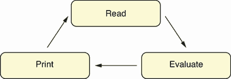
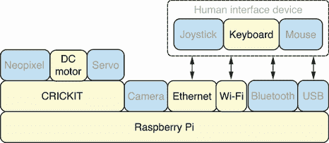
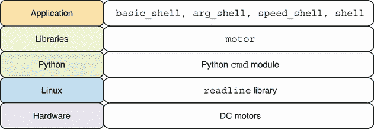

# 4 创建机器人外壳

本章涵盖了

+   在 Python 中创建交互式自定义外壳的基本知识

+   创建用于使机器人前后移动的命令循环

+   在外壳命令中处理命令参数

+   在代码外壳中集中处理参数逻辑

+   在 Python 中执行自定义外壳脚本

本章将向您介绍如何创建一个自定义的交互式 REPL（读取-评估-打印循环）机器人外壳。外壳提供了一种强大的交互式界面，允许直接与软件或在此情况下，与机器人硬件进行交互。它们是用户交互的一种经过验证和有效的方法，Python 标准库提供了创建自定义外壳的内置功能。本章从简单的机器人外壳开始，然后逐步添加更多带有更多定制选项的运动功能。本章最后展示了如何在外壳中一次性保存并运行一组命令，就像在许多其他外壳中做的那样。

## 4.1 什么是 REPL 或外壳？

REPL 或命令行外壳是一个无限循环的程序，等待接收用户输入，然后执行输入，并根据需要打印输出。它们也被称为*面向行的命令解释器*，因为它们将命令作为用户输入的一行并解释或执行该行。图 4.1 说明了 REPL 经历的三种状态。



图 4.1 读取-评估-打印循环：REPL 在读取-评估-打印状态之间无限循环。

## 4.2 REPL 的好处

在本书中到目前为止，我们已经与两个提供 REPL 界面的非常流行的程序进行了交互：Python 和 Bash。以下是本章创建的外壳的一些功能和好处：

+   快速直接执行命令。

+   简单的逐行执行。

+   列出可用命令的实时帮助命令。

+   命令的 Tab 自动完成。

+   可以通过上下键访问的命令历史记录。

+   每个命令的可选参数。

+   在脚本文件中执行命令。

这些功能将用于本章创建的机器人外壳。有了我们的机器人外壳，我们能够从终端快速轻松地发出运动命令给我们的机器人。我们还可以使用命令历史记录功能来重放我们之前应用到机器人上的运动。

## 4.3 硬件栈

图 4.2 显示了讨论的硬件栈，本章使用的特定组件被突出显示。REPL 通过使用 Tab 自动完成和箭头键来访问命令历史记录进行键盘交互。



图 4.2 硬件栈：机器人外壳通过 CRICKIT 板控制直流电机。

机器人外壳将在 Raspberry Pi 硬件上运行。通过外壳执行的命令将与 CRICKIT 板通信，然后 CRICKIT 板将发送信号到直流电机以执行所需的电机运动。

## 4.4 软件栈

本章中使用的特定软件的详细信息在图 4.3 中展示，并在随后的文本中进行描述。随着每个新应用的加入，我们将向我们的 shell 实现添加更多功能和增强。



图 4.3 软件堆栈：机器人 shell 将在 Python 解释器上运行。

Python 和 Bash 都有 REPL 功能，并且都直接在 Linux 上使用`readline`库运行。上一章中的`motor`模块将被用来控制直流电机。本章中的机器人 shell 将使用 Python 实现，因此它将在 Python 之上运行。用户不需要担心它的实现方式，可以像与计算机上的任何其他 shell 程序一样与之交互。

## 4.5 创建机器人 shell

在本节中，我们将使用 Python 编写一个程序，实现一个自定义的 REPL 机器人 shell 以获取基本的机器人前进和后退动作。此脚本需要两个模块，我们按照以下代码所示导入它们。`cmd`模块是 Python 标准库的一部分，它为创建 REPL 应用程序（如机器人 shell）提供了一个框架。`cmd`模块([`docs.python.org/3/library/cmd.html`](https://docs.python.org/3/library/cmd.html))的文档是学习更多关于该库的绝佳资源。`motor`模块是上一章中创建的用于控制机器人的库：

```
import cmd
import motor
```

接下来，我们定义我们的`RobotShell`类，它是`cmd.Cmd`的子类。`intro`方法在 shell 首次启动时提供欢迎信息。当用户被提示时，`prompt`文本会显示，表明他们现在处于机器人 shell 中。以`do_`开头的每个方法都会自动调用以处理其相关命令。这样，`do_forward`方法就会被调用以处理`forward`命令。每次调用时，它都会通过调用`motor.forward`将机器人向前移动：

```
class RobotShell(cmd.Cmd):
    intro = 'Welcome to the robot shell. Type help or ? to list commands.'
    prompt = '(robot) '

    def do_forward(self, line):
        motor.forward()
```

接下来，我们定义`do_backward`方法来处理`backward`命令：

```
    def do_backward(self, line):
        motor.backward()
```

最后一行代码将运行事件循环，启动 shell，从用户输入中读取命令，并执行相应的命令方法：

```
RobotShell().cmdloop()
```

完整的脚本可以保存为`basic_shell.py`在 Pi 上，然后执行。

列表 4.1 `basic_shell.py`：在 shell 中提供基本的机器人运动

```
#!/usr/bin/env python3
import cmd
import motor

class RobotShell(cmd.Cmd):
    intro = 'Welcome to the robot shell. Type help or ? to list commands.'
    prompt = '(robot) '

    def do_forward(self, line):
        motor.forward()

    def do_backward(self, line):
        motor.backward()

RobotShell().cmdloop()
```

在执行脚本时，请确保`motor.py`与`basic_shell.py`在同一目录下，以便它可以被`basic_shell.py`导入。以下代码显示了在机器人 shell 中执行`help`和运动命令的一个会话示例：

```
$ basic_shell.py
Welcome to the robot shell. Type help or ? to list commands.
(robot) help

Documented commands (type help <topic>):
========================================
help

Undocumented commands:
======================
backward  forward

(robot) forward
(robot) backward
(robot) backward
(robot) forward
```

我们可以像其他 Python 脚本一样通过 SSH 连接远程运行 shell。在运行 shell 时，可以按 Tab 键使用自动完成功能，上箭头和下箭头可以用来访问命令历史记录功能。按 F 键然后按 Tab 键，可以使命令`forward`自动完成。当您完成使用机器人外壳后，可以按 CTRL+C 来退出，就像在其他程序中一样。

深入探讨：导入库

在本章中，我们通过导入`motor`库来构建前一章的代码。我们可以将创建的所有脚本和库保存在`/home/robo/bin/`目录中，以简化导入模块的过程。但其他我们一直在使用的库在哪里，Python 解释器在导入模块时是如何找到它们的？

我们可以进入 REPL（交互式 Python 解释器）来获取这些问题的答案。我们导入`sys`模块，然后检查`sys.path`的内容：

```
>>> import sys
>>> sys.path
['', '/usr/lib/python39.zip', '/usr/lib/python3.9',
 '/usr/lib/python3.9/lib-dynload',
 '/home/robo/pyenv/lib/python3.9/site-packages']
```

在`sys.path`中，有一个字符串列表，这些路径是在导入模块时需要搜索的路径。如果我们检查这些目录，我们将找到我们在书中导入的模块。例如，标准库中`cmd`模块的位置可以使用以下方式列出：

```
$ ls /usr/lib/python3.9/cmd.py 
/usr/lib/python3.9/cmd.py
```

我们可以打开这个文件，像其他 Python 脚本一样调查其源代码。我们还可以使用`pip`命令找到我们在虚拟环境中安装的第三方库的位置。以下是用于控制直流电机的 Adafruit CRICKIT 库的位置：

```
$ ls /home/robo/pyenv/lib/python3.9/site-packages/adafruit_crickit.py 
/home/robo/pyenv/lib/python3.9/site-packages/adafruit_crickit.py
```

我们可以看到，Python 标准库中的库位于所有虚拟环境共享的系统位置，而我们在为虚拟环境创建的`/home/robo/pyenv`位置安装的第三方包都位于那里。有关 Python 中导入包的更多详细信息，`importlib`模块的文档([`docs.python.org/3/library/importlib.html`](https://docs.python.org/3/library/importlib.html))是一个很好的资源。

## 4.6 处理命令参数

我们实现了一个基本的机器人外壳，包含两个运动命令，`forward`（前进）和`backward`（后退）。然而，它们无法处理运动命令之后提供的任何参数。我们将添加对每个运动命令提供`duration`（持续时间）参数的支持。我们还将改进退出外壳的方式，通过正确处理输入的文件结束符（EOF）。

现在，我们增强`do_forward`方法，以检查是否提供了持续时间。`forward`命令之后的文本将通过`line`参数提供，我们可以解析它以获取持续时间。如果找到持续时间，它将被转换为`float`值，并在调用`motor.forward`函数时使用：

```
    def do_forward(self, line):
        if line:
            duration = float(line)
            motor.forward(duration)
        else:
            motor.forward()
```

然后将相同的流程应用于`do_backward`方法：

```
    def do_backward(self, line):
        if line:
            duration = float(line)
            motor.backward(duration)
        else:
            motor.backward()
```

在类中添加了 `do_EOF` 方法来处理在输入数据中遇到 EOF 条件的情况。该方法返回 `True` 值以向事件循环发出信号，外壳应退出：

```
    def do_EOF(self, line):
        return True
```

完整的脚本可以保存为 Pi 上的 `arg_shell.py` 并执行。

列表 4.2 `arg_shell.py`：在外壳中支持命令参数

```
#!/usr/bin/env python3
import cmd
import motor

class RobotShell(cmd.Cmd):
    intro = 'Welcome to the robot shell. Type help or ? to list commands.'
    prompt = '(robot) '

    def do_EOF(self, line):
        return True

    def do_forward(self, line):
        if line:
            duration = float(line)
            motor.forward(duration)
        else:
            motor.forward()

    def do_backward(self, line):
        if line:
            duration = float(line)
            motor.backward(duration)
        else:
            motor.backward()

RobotShell().cmdloop()
```

接下来是在机器人外壳中调用不同持续时间移动命令的会话示例：

```
$ arg_shell.py
Welcome to the robot shell. Type help or ? to list commands.
(robot) forward 0.2
(robot) forward 1
(robot) backward 0.5
(robot) backward
(robot) forward
```

在示例会话中，移动命令使用整数和浮点数表示的持续时间调用。也可以不提供任何持续时间，将使用默认的持续时间值。当你想要退出机器人外壳时，按下 CTRL+D 而不是 CTRL+C。这将以一种更干净的方式退出外壳，因为 CTRL+D 会发送 EOF，而按下 CTRL+C 将导致外壳输出 `Traceback` 错误。使用 CTRL+D 退出外壳是一个标准程序，与 Bash 和 Python REPL 的相同过程将起作用。

## 4.7 添加速度参数

为了支持多个可选参数，我们不得不做一些额外的工作。由于我们需要升级我们的参数处理行为，最好是在多个地方不需要更改它。因此，第一步将是将所有移动命令的参数处理代码集中在一个函数中，然后升级该函数。

我们创建了一个新的函数 `get_kwargs`，它将接受 `line` 值并返回一个包含所有必需键值对的 `dict` 对象。以下定义将覆盖现有的行为，即取第一个可选参数作为 `duration` 的值：

```
def get_kwargs(line):
    if line:
        return dict(duration=float(line))
    else:
        return dict()
```

然后，我们更新 `do_forward` 和 `do_backward` 的定义以使用 `get_kwargs`。它们调用 `get_kwargs` 并直接使用返回值作为函数调用到相关移动函数的关键字参数：

```
    def do_forward(self, line):
        motor.forward(**get_kwargs(line))

    def do_backward(self, line):
        motor.backward(**get_kwargs(line))
```

在这个阶段，我们可以运行外壳，它将使用之前的行为。现在我们可以升级 `get_kwargs` 函数并添加处理第二个关键字参数 `speed` 的功能。这个参数预期是 `int` 类型，因此将其转换为该数据类型：

```
def get_kwargs(line):
    kwargs = dict()
    items = line.split()
    if len(items) > 0:
        kwargs['duration'] = float(items[0])
    if len(items) > 1:
        kwargs['speed'] = int(items[1])
    return kwargs
```

完整的脚本可以保存为 Pi 上的 `speed_shell.py` 并执行。

列表 4.3 `speed_shell.py`：在外壳中控制移动速度

```
#!/usr/bin/env python3
import cmd
import motor

def get_kwargs(line):
    kwargs = dict()
    items = line.split()
    if len(items) > 0:
        kwargs['duration'] = float(items[0])
    if len(items) > 1:
        kwargs['speed'] = int(items[1])
    return kwargs

class RobotShell(cmd.Cmd):
    intro = 'Welcome to the robot shell. Type help or ? to list commands.'
    prompt = '(robot) '

    def do_EOF(self, line):
        return True

    def do_forward(self, line):
        motor.forward(**get_kwargs(line))

    def do_backward(self, line):
        motor.backward(**get_kwargs(line))

RobotShell().cmdloop()
```

下面是在升级后的机器人外壳中的一个会话示例：

```
$ speed_shell.py 
Welcome to the robot shell. Type help or ? to list commands.
(robot) forward 0.2 1
(robot) forward 0.2 3
(robot) backward 0.5 1
(robot) backward 1 2
(robot) backward 0.5
(robot) forward
```

在示例会话中，现在可以指定持续时间并使用默认速度调用移动命令，也可以指定特定的持续时间或速度，或者使用默认的持续时间或速度设置。

## 4.8 运行机器人外壳脚本

在本节中，挑战是使机器人外壳能够执行命令脚本并添加剩余的移动命令。我们添加了 `do_right`、`do_left`、`do_spin_right` 和 `do_spin_left` 方法。它们遵循我们之前的移动方法的相同风格：

```
    def do_right(self, line):
        motor.right(**get_kwargs(line))

    def do_left(self, line):
        motor.left(**get_kwargs(line))

    def do_spin_right(self, line):
        motor.spin_right(**get_kwargs(line))

    def do_spin_left(self, line):
        motor.spin_left(**get_kwargs(line))
```

当我们在 shell 中执行脚本文件中的命令时，能够得到一些关于正在执行哪个命令的视觉反馈将会很棒。我们可以通过添加一个`precmd`方法来实现这一点。这个方法在执行任何命令之前被调用。这是`cmd.Cmd`对象的一部分功能。我们将使用它来打印即将执行的命令。为了使事件循环处理命令，它必须返回`line`的值：

```
    def precmd(self, line):
        print('executing', repr(line))
        return line
```

完整的脚本可以保存为 Pi 上的`shell.py`，然后执行。

列表 4.4 `shell.py`：创建支持所有机器人动作的 shell

```
#!/usr/bin/env python3
import cmd
import motor

def get_kwargs(line):
    kwargs = dict()
    items = line.split()
    if len(items) > 0:
        kwargs['duration'] = float(items[0])
    if len(items) > 1:
        kwargs['speed'] = int(items[1])
    return kwargs

class RobotShell(cmd.Cmd):
    intro = 'Welcome to the robot shell. Type help or ? to list commands.'
    prompt = '(robot) '

    def do_EOF(self, line):
        return True

    def precmd(self, line):
        print('executing', repr(line))
        return line

    def do_forward(self, line):
        motor.forward(**get_kwargs(line))

    def do_backward(self, line):
        motor.backward(**get_kwargs(line))

    def do_right(self, line):
        motor.right(**get_kwargs(line))

    def do_left(self, line):
        motor.left(**get_kwargs(line))

    def do_spin_right(self, line):
        motor.spin_right(**get_kwargs(line))

    def do_spin_left(self, line):
        motor.spin_left(**get_kwargs(line))

RobotShell().cmdloop()
```

以下命令文本文件应保存为 Pi 上的`move.txt`：

```
spin_right
spin_left
right
left
forward 0.2 1
forward 0.2 3
backward 0.5 1
backward 0.5
```

作为初始测试，我们可以使用`echo`将单个命令输入到机器人 shell 中：

```
$ echo forward | shell.py 
Welcome to the robot shell. Type help or ? to list commands.
(robot) executing 'forward'
(robot) executing 'EOF'
```

我们也可以使用`cat`将一组保存的命令输入到机器人 shell 中：

```
$ cat move.txt | shell.py 
Welcome to the robot shell. Type help or ? to list commands.
(robot) executing 'spin_right'
(robot) executing 'spin_left'
(robot) executing 'right'
(robot) executing 'left'
(robot) executing 'forward 0.2 1'
(robot) executing 'forward 0.2 3'
(robot) executing 'backward 0.5 1'
(robot) executing 'backward 0.5'
(robot) executing 'EOF'
```

以这种方式，我们可以使用一组最适合我们需求的命令来设计自己的 shell。一组机器人 shell 命令可以交互式运行，或者保存到一个单独的文件中，然后直接由机器人 shell 执行。

深入探讨：增强 shell

我们可以将我们的 shell 进一步扩展并添加一些更强大的功能。在`cmd`的文档（[`docs.python.org/3/library/cmd.html`](https://docs.python.org/3/library/cmd.html)）中，有一个对我们机器人的用例非常有用的功能。文档展示了如何通过创建记录和回放会话的命令来记录并稍后回放 REPL 会话。假设我们正在使用机器人 shell 通过一组有效的动作来移动机器人绕行一个物理课程。而不是每次都需要重新输入它们，我们可以随时记录和回放机器人的动作。

另一个常见且强大的功能是通过命令行参数执行机器人命令。Python Module of the Week 网站是一个深入了解 Python 标准模块不同部分的绝佳资源，它关于`cmd`模块的文档（[`pymotw.com/3/cmd/`](https://pymotw.com/3/cmd/））展示了使用该模块的许多不同方式，包括如何从命令行参数解析命令。Python 解释器本身就有这个功能。我们在书中之前已经使用过 REPL，但我们也可以通过将代码作为命令行参数直接传递给解释器来评估 Python 代码。以下是一个简单示例，演示如何使用此功能：

```
$ python -c 'print(1+1)'
2
```

我们可以添加到外壳的第三个有用功能是能够在外壳会话之间保留我们的命令历史。目前，当我们使用我们的外壳时，我们可以使用上箭头和下箭头来回溯我们发出的命令。但一旦我们退出外壳，我们就失去了这个历史。其他外壳，如 Python REPL，在 REPL 会话之间保留历史。这是通过我们在退出外壳时保存历史文件并在启动新外壳时重新加载它来实现的。我们可以通过以下命令查看这一功能：打开一个 REPL 并评估一些 Python 表达式。现在退出 REPL 并打开一个新的。如果你按上箭头，你将找到你的历史命令。我们可以找到存储这个历史的文件，并使用以下命令输出其内容：

```
$ ls ~/.python_history 
/home/robo/.python_history
$ cat ~/.python_history 
```

要在我们的机器人外壳中实现此功能，我们将使用`readline`模块（[`docs.python.org/3/library/readline.html`](https://docs.python.org/3/library/readline.html)），这是处理我们外壳命令历史功能的东西。它有一组函数，将允许我们将历史保存到历史文件中。`readline`模块的 Python 模块每周页面有一个实现此功能的优秀示例（[`pymotw.com/3/readline/`](https://pymotw.com/3/readline/)）。我们只需要在我们的外壳启动时添加几行代码来加载历史文件，然后在退出外壳时添加一些代码来保存历史文件。

## 摘要

+   REPL 是一个无限循环的程序，等待接收用户输入。

+   通过机器人外壳执行的命令将与 CRICKIT 板通信，然后 CRICKIT 板将发送信号到直流电机以执行所需的电机运动。

+   Python 和 Bash 都有 REPL 功能，并且两者都直接在 Linux 上运行。

+   `cmd`模块是 Python 标准库的一部分，它提供了一个创建 REPL 应用程序（如机器人外壳）的框架。

+   `do_EOF`方法用于处理输入数据中遇到的 EOF 条件。

+   可选参数使得可以以指定持续时间和默认速度、特定持续时间和速度，或默认持续时间和速度设置来调用移动命令。

+   可以使用`cat`命令将一组保存的命令输入到机器人外壳中。
