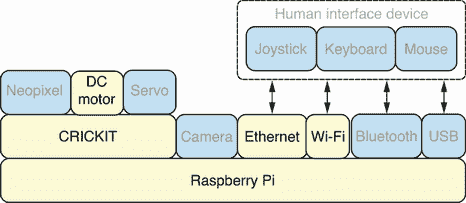
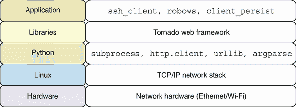
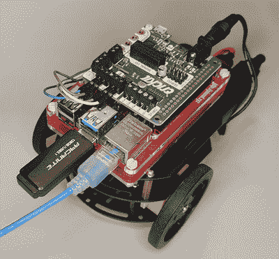

# 5 远程控制机器人

本章涵盖

+   通过 SSH 在网络中执行机器人命令

+   创建用于控制机器人的 Web 服务

+   从 Python 调用机器人网络服务

+   创建基于 Python 的远程执行函数

+   测量本地和远程 HTTP 命令的执行时间

+   构建具有低延迟调用的高性能 Python 客户端

本章将教会你如何通过网络共享你的机器人，以便远程 Python 客户端可以发出运动命令来控制它。将使用 SSH 和 HTTP 协议，这意味着从协议的角度将提供两种解决方案，每种方案都有其自身的优点和权衡。对于 HTTP 解决方案，首先将创建一个简单的 Python 客户端，然后是一个更复杂、性能更高、延迟更低的客户端。此外，还将涵盖不同的测量执行时间的技术。这将提供一个定量基础来比较不同协议和客户端的性能。

远程控制机器人是许多项目的基本部分，例如使用手机和笔记本电脑上的应用程序控制机器人，以及使用中央机器人服务器控制机器人编队。本章中的项目使得可以在同一房间或数英里之外控制机器人。与蓝牙等短距离协议不同，SSH 和 HTTP 都支持短距离和长距离连接。

## 5.1 硬件堆栈

图 5.1 展示了硬件堆栈，本章中使用的特定组件被突出显示。机器人将通过以太网端口连接到有线网络，通过 Wi-Fi 硬件连接到无线网络。Wi-Fi 连接为机器人提供了最大的移动自由度，允许它在没有任何连接线的情况下移动。然而，有时有线以太网连接可以提供更好的性能。本章将展示如何进行网络性能测量，以便比较这两种选项。



图 5.1 硬件堆栈：远程客户端将使用以太网或 Wi-Fi 硬件进行连接。

## 5.2 软件堆栈

本章中使用的特定软件的详细信息在图 5.2 中展示，并在随后的文本中进行描述。本章将实现三个主要应用：通过 SSH 协议（`ssh_client.py`）实现远程客户端、提供机器人网络服务（`robows.py`）以及使用持久连接的 Web 服务客户端（`client_persist.py`）。将使用 Tornado Web 框架来创建 HTTP 解决方案。在构建 SSH 解决方案时将使用`subprocess`和`argparse` Python 模块。第一个 HTTP 客户端将使用`urllib`模块，然后是一个更高级的版本，使用`http.client`模块。



图 5.2 软件堆栈：Tornado Web 框架将通过 HTTP 协议公开机器人命令。

深入探讨：Web 框架

在 Python 中创建网络应用时，几乎总是使用网络框架是一个好主意。创建网络应用时需要处理的细节非常多，而网络框架在这方面做得非常好。在 Python 中，我们有众多优秀的选择，例如 Django([`www.djangoproject.com`](https://www.djangoproject.com))和 Flask([`flask.palletsprojects.com`](https://flask.palletsprojects.com))网络框架。

在我们的案例中，我们将使用 Tornado 网络框架([`www.tornadoweb.org`](https://www.tornadoweb.org))，因为它具有一个特殊功能，使其非常适合我们的需求。大多数网络框架，如 Django 和 Flask，都不附带一个生产就绪的网络应用服务器，无法安全地控制像我们的机器人电机这样的硬件。然而，Tornado 提供了这样的选项。它允许我们的网络应用在整个网络服务器生命周期内运行在一个单一的长运行进程中。此进程也获得了对我们机器人电机的独家访问权限，因为它一次只允许一个网络请求移动机器人电机。这样，我们可以避免竞态条件，并保持我们的网络应用安全且易于实现。

## 5.3 机器人测试技巧

有关组装和配置机器人硬件的详细信息，请参阅附录 C 中的机器人组装指南。有两个技巧可以帮助您在处理机器人时使用。

本章中组装的机器人。第一个技巧是在最初测试代码库时将机器人放置在支架上。图 5.3 显示了机器人放置在支架上，使其轮子可以自由移动而机器人不会移动。这样，您可以在测试期间安全地将机器人放在桌子上，而不用担心不小心将其从桌子上开走并损坏它。这对于您有新代码且尚未测试，可能会进入启动电机而不停止的状态特别有用，这可能导致机器人向某个方向移动，最终撞到墙壁或其他物体。


图 5.3 机器人支架：为了安全起见，可以将机器人放置在支架上。

第二个技巧是使用 SlimRun 以太网电缆而不是标准电缆。这些电缆比标准网络电缆轻且薄，当机器人通过有线网络连接驱动时，这为机器人提供了更多的灵活性。图 5.4 显示了连接到机器人的 SlimRun 网络电缆。



图 5.4 机器人网络电缆：网络电缆连接到机器人上的以太网端口。

使用这两个技巧可以保护您的机器人免受不必要的损坏，并使其在有线连接中更加灵活。请确保您的机器人安全，因为一个损坏的机器人并不好玩。

## 5.4 通过 SSH 控制机器人

我们将使用 SSH 协议作为我们第一个解决方案来通过网络控制机器人。SSH 更容易上手，因为我们已经设置了 SSH 服务器，并且我们将在整个书中使用 SSH 客户端和连接来连接到我们的机器人。我们需要在 SSH 之上创建一些 Python 代码以满足以下要求：

+   创建一个将在 SSH 服务器上执行的 Python 脚本，接收动作和可选的动作参数，并执行机器人动作。

+   为 SSH 客户端创建一个 Python 函数，该函数接收动作名称并连接到机器人，然后远程执行相同的动作。

### 5.4.1 创建服务器端脚本

第一步是导入所有必要的模块。我们从 Python 标准库中的 `argparse` 模块导入 `ArgumentParser`，该模块将执行所有繁重的解析命令行参数的工作。`motor` 模块是第三章中创建的用于控制机器人的库：

```
from argparse import ArgumentParser
import motor
```

然后定义了 `parse_args` 函数，并负责处理所有命令行参数解析。它首先创建一个 `ArgumentParser` 对象，然后配置解析器。一个名为 `name` 的必需参数将捕获动作名称。然后配置可选的 `--duration` 和 `--speed` 参数。它们都配置了正确的数据类型和帮助信息。函数的最后一条语句将执行实际的解析，并使用 `vars` 函数将结果作为 `dict` 对象返回：

```
def parse_args():
    parser = ArgumentParser(description='robot cli')
    parser.add_argument('name', help='name of movement')
    parser.add_argument('--duration', type=float, help='movement duration')
    parser.add_argument('--speed', type=int, help='movement speed')
    return vars(parser.parse_args())
```

`main` 函数首先调用 `parse_args` 并将结果保存到 `args` 变量中。要调用的动作函数名称然后从 `args` 中移除并保存到 `name` 变量中。现在可以使用 `getattr` 从 `motor` 模块中查找动作函数。下一步是收集所有指定的可选参数并将它们保存到一个名为 `kwargs` 的字典中。最后，打印并调用要调用的函数：

```
def main():
    args = parse_args()
    name = args.pop('name')
    func = getattr(motor, name)
    kwargs = {k: v for k, v in args.items() if v}
    print(f'calling {name} with kwargs {kwargs}')
    func(**kwargs)
```

完整的脚本可以保存为 Pi 上的 `cli.py` 文件，然后执行。

列表 5.1 `cli.py`：创建用于执行机器人动作的命令行界面

```
#!/usr/bin/env python3
from argparse import ArgumentParser
import motor

def parse_args():
    parser = ArgumentParser(description='robot cli')
    parser.add_argument('name', help='name of movement')
    parser.add_argument('--duration', type=float, help='movement duration')
    parser.add_argument('--speed', type=int, help='movement speed')
    return vars(parser.parse_args())

def main():
    args = parse_args()
    name = args.pop('name')
    func = getattr(motor, name)
    kwargs = {k: v for k, v in args.items() if v}
    print(f'calling {name} with kwargs {kwargs}')
    func(**kwargs)

main()
```

以下代码是终端中演示对脚本的不同调用的会话：

```
$ cli.py 
usage: cli.py [-h] [--duration DURATION] [--speed SPEED] name
cli.py: error: the following arguments are required: name
$ cli.py --help
usage: cli.py [-h] [--duration DURATION] [--speed SPEED] name

robot cli

positional arguments:
  name                 name of movement

optional arguments:
  -h, --help           show this help message and exit
  --duration DURATION  movement duration
  --speed SPEED        movement speed
$ cli.py forward
calling forward with kwargs {}
$ cli.py forward --duration=0.5
calling forward with kwargs {'duration': 0.5}
$ cli.py forward --speed=1
calling forward with kwargs {'speed': 1}
$ cli.py forward --duration=0.5 --speed=1
calling forward with kwargs {'duration': 0.5, 'speed': 1}
```

脚本首先不带任何参数调用，这表明必需参数验证正在工作。接下来，脚本带帮助选项调用，这显示了自动生成的帮助和用法信息。然后请求机器人以默认和自定义的持续时间和速度选项向前移动。

深入了解：Python 中的函数作为一等对象

在本节中，我们能够使用`getattr`查找一个函数并将其保存到变量中。这并不是所有编程语言都支持的，但在 Python 中完全支持，因为函数被视为一等对象。这意味着它们可以被分配给变量、放置在列表中或作为参数传递给其他函数，就像任何其他值一样。Python 语言的创造者 Guido van Rossum 的帖子“First-class Everything”（[`mng.bz/g7Bl`](http://mng.bz/g7Bl)）是了解 Python 中此功能的好文章。实际上，这个特性适用于 Python 中的所有对象，而不仅仅是函数。这使得语言在如何与函数交互方面非常灵活。

### 5.4.2 远程运行脚本

现在我们已经放置了脚本，我们将开始在 SSH 客户端中调用它。SSH 客户端可以是与机器人处于同一网络上的任何计算机。在客户端机器上，运行以下命令以生成 SSH 密钥并将它们传输到机器人：

```
ssh-keygen -t rsa
ssh-copy-id robo@robopi
```

根据附录 B 中记录的安装过程，Pi 的主机名被设置为`robopi`。现在您可以在客户端机器的 hosts 文件中添加一行，包含`robopi`主机名及其关联的 IP 地址。这样，您就可以按照示例使用`robopi`名称而不是机器人的 IP 地址来连接机器人。How-To Geek 网站提供了一个关于如何在 Windows、Mac 和 Linux 上编辑 hosts 文件的优秀指南（[`mng.bz/5owz`](http://mng.bz/5owz)）。

在这个阶段，您将能够从客户端机器上执行机器人命令，而无需输入密码，并且无需交互式会话。以下是从客户端机器上运行的终端会话：

```
$ ssh robo@robopi whoami
robo
$ ssh robo@robopi '~/pyenv/bin/python --version'
Python 3.9.2
```

在这个会话中，执行了不同的远程命令来获取当前用户名和 Python 解释器的版本。这里使用的 Python 虚拟环境与附录 B 中安装过程中创建的虚拟环境相同。接下来，我们可以尝试执行机器人脚本。我们将从第二章中描述的标准脚本位置`~/bin`运行脚本：

```
$ ssh robo@robopi '~/pyenv/bin/python ~/bin/cli.py --help'
usage: cli.py [-h] [--duration DURATION] [--speed SPEED] name

robot cli

positional arguments:
  name                 name of movement

optional arguments:
  -h, --help           show this help message and exit
  --duration DURATION  movement duration
  --speed SPEED        movement speed
$ ssh robo@robopi '~/pyenv/bin/python ~/bin/cli.py forward'
calling forward with kwargs {}
```

我们已经生成了脚本的帮助信息，并请求机器人通过 SSH 连接远程前进。现在我们可以使用`time`命令来测量在本地运行命令和通过 SSH 远程运行命令时的执行时间。`time`命令在 Mac 和 Linux 上都是可用的。如果您使用的是 Windows，可以使用 PowerShell 的`Measure-Command`来测量执行时间。输出首先显示在机器人本地运行命令所需的时间，然后是建立 SSH 连接并执行命令所需的时间。我们关注的时间列在标签`real`下。在这个会话中，本地执行耗时 10 毫秒，而通过 SSH 执行相同的命令耗时 314 毫秒：

```
$ time whoami
robo
real    0m0.010s
user    0m0.001s
sys    0m0.010s

$ time ssh robo@robopi whoami
robo
real    0m0.314s
user    0m0.084s
sys    0m0.004s
```

这种额外时间的原因是，在这种方法中，每次要执行新命令时，都必须建立一个新的 SSH 连接。了解这种方法的开销是有用的。`motor` 模块有一个 `noop` 函数，它执行无操作，非常适合测量模块中纯函数调用的执行时间：

```
$ time cli.py noop
calling noop with kwargs {}
real    0m0.713s
user    0m0.128s
sys    0m0.066s

$ time ssh robo@robopi '~/pyenv/bin/python ~/bin/cli.py noop'
calling noop with kwargs {}
real    0m1.036s
user    0m0.083s
sys    0m0.005s
```

从输出中，我们可以看到本地调用耗时 713 毫秒，而远程调用耗时 1,036 毫秒。差异为 323 毫秒，这与我们之前对 SSH 过程开销的采样相符。`time` 命令是进行快速性能测量的好方法。在章节的后面部分，当我们改进这些性能数字时，我们将探讨在 Python 内部更精确地测量性能的方法。

### 5.4.3 创建客户端脚本

下一步是实现运行在客户端机器上的 Python 函数，连接到机器人 SSH 服务器并执行机器人命令。`check_output` 函数是从 `subprocess` 模块导入的，它是 Python 标准库的一部分。我们可以使用 `check_output` 来执行所需的 SSH 客户端命令：

```
from subprocess import check_output
```

然后定义了三个常量。`SSH_USER` 和 `SSH_HOST` 分别指定用于 SSH 连接的用户和主机。`SSH_CLI_CMD` 包含要远程在机器人上执行的 Python 解释器和机器人脚本的路径：

```
SSH_USER = 'robo'
SSH_HOST = 'robopi'
SSH_CLI_CMD = '~/pyenv/bin/python ~/bin/cli.py'
```

接下来，我们定义了 `call_ssh`，它将以用户 `user` 的身份连接到主机 `host` 并在远程服务器上执行提供的 `remote_cmd`：

```
def call_ssh(user, host, remote_cmd):
    cmd = ['ssh', f'{user}@{host}', remote_cmd]
    check_output(cmd)
```

`remote_robot` 接收要执行的机器人移动命令的名称，并在远程机器人上执行该移动：

```
def remote_robot(robot_cmd):
    call_ssh(SSH_USER, SSH_HOST, SSH_CLI_CMD + ' ' + robot_cmd)
```

最后，`main` 函数遍历一系列移动，并对每个移动调用 `remote_robot` 以进行演示：

```
def main():
    commands = ['forward', 'backward', 'spin_right', 'spin_left']
    for command in commands:
        print('remote robot command:', command)
        remote_robot(command)
```

完整脚本可以保存为客户端机器上的 `ssh_client.py` 并执行。

列表 5.2 `ssh_client.py`：通过 SSH 连接执行远程脚本

```
#!/usr/bin/env python3
from subprocess import check_output

SSH_USER = 'robo'
SSH_HOST = 'robopi'
SSH_CLI_CMD = '~/pyenv/bin/python ~/bin/cli.py'

def call_ssh(user, host, remote_cmd):
    cmd = ['ssh', f'{user}@{host}', remote_cmd]
    check_output(cmd)

def remote_robot(robot_cmd):
    call_ssh(SSH_USER, SSH_HOST, SSH_CLI_CMD + ' ' + robot_cmd)

def main():
    commands = ['forward', 'backward', 'spin_right', 'spin_left']
    for command in commands:
        print('remote robot command:', command)
        remote_robot(command)

main()
```

此脚本向机器人发出远程命令，使其向前、向后移动，然后向右和向左旋转。

## 5.5 创建机器人 Web 服务

我们现在将使用 HTTP 协议创建用于远程控制机器人的 Web 服务。Web 服务允许机器在网络中相互调用。我们需要在 Python 中实现一组满足以下要求的 Web 服务：

+   应该在 Python 中创建一组可以调用以执行移动动作的 Web 服务，并可以提供可选的速度和持续时间参数。

+   Web 服务应正确使用 HTTP 方法。具体来说，使用 GET 方法的调用不应改变机器人的状态，并且所有移动请求都应使用 POST 方法处理。

+   所有 Web 服务调用都应返回其数据为 JSON 格式，并且任何预期的 Web 服务输入数据也应编码为 JSON 格式。

### 5.5.1 创建我们的第一个 Web 服务

在 Python 中创建网络应用程序时，通常使用网络框架是一个好主意。有许多流行的选项可供选择。我们将使用 Tornado 网络框架，因为它具有许多功能，并且可以安全地与机器人硬件交互。在 Pi 上运行以下行以安装 Tornado Python 包：

```
$ ~/pyenv/bin/pip install tornado
```

我们可以开始创建我们的第一个网络应用程序。这个网络应用程序将公开一个网络服务，该服务返回我们机器人服务器上的当前时间。首先，我们导入所需的模块。`datetime` 模块将允许我们获取服务器上的当前时间。Tornado 的 `IOLoop` 是运行网络服务器所需的。`RequestHandler` 和 `Application` 对象将帮助我们定义网络应用程序的行为：

```
from datetime import datetime
from tornado.ioloop import IOLoop
from tornado.web import RequestHandler, Application
```

下一步是定义将处理 incoming 请求的 `MainHandler` 对象。我们定义了一个名为 `get` 的方法来处理 incoming HTTP GET 请求。每次调用它时，它将当前时间作为字符串保存，然后调用字典中的 `write` 方法。在 Tornado 框架中，每次您向 `write` 方法提供字典对象时，它将自动将输出转换为 JSON 格式，并设置适当的 HTTP 响应头以指示内容类型为 JSON：

```
class MainHandler(RequestHandler):
    def get(self):
        stamp = datetime.now().isoformat()
        self.write(dict(stamp=stamp))
```

我们随后创建了一个 Tornado 应用程序，该程序将根路径的 incoming 请求路由到 `MainHandler`。之后，我们将网络服务器设置为监听端口 8888 并启动主事件循环，这将启动网络服务器并处理 incoming 网络请求：

```
app = Application([('/', MainHandler)])
app.listen(8888)
IOLoop.current().start()
```

完整的脚本可以保存为 `datews.py` 在 Pi 上，然后执行。

列表 5.3 `datews.py`：创建用于报告机器人服务器时间的网络服务

```
#!/usr/bin/env python3
from datetime import datetime
from tornado.ioloop import IOLoop
from tornado.web import RequestHandler, Application

class MainHandler(RequestHandler):
    def get(self):
        stamp = datetime.now().isoformat()
        self.write(dict(stamp=stamp))

app = Application([('/', MainHandler)])
app.listen(8888)
IOLoop.current().start()
```

在一个终端中运行脚本，然后从另一个连接到 Pi 的终端运行以下命令来测试新的网络服务：

```
$ curl http://localhost:8888/
{"stamp": "2022-11-27T16:52:36.248068"}
```

终端会话正在使用 `curl` 命令，这是一个在终端中制作 HTTP 请求并查看其响应的出色工具。第一次调用显示了返回的 JSON 数据，其中包含一个时间戳，显示了机器人服务器上的当前时间。我们现在可以运行以下命令来获取更多关于响应头部的详细信息：

```
$ curl -i http://localhost:8888/
HTTP/1.1 200 OK
Server: TornadoServer/6.2
Content-Type: application/json; charset=UTF-8
Date: Sun, 27 Nov 2022 16:52:49 GMT
Etag: "d00b59ccd574e3dc8f86dcadb1d349f53e7711ec"
Content-Length: 39

{"stamp": "2022-11-27T16:52:49.683872"}
```

这个调用显示了响应头，我们可以看到响应内容类型已正确设置为 JSON 输出。您可以通过将 `localhost` 替换为网络上机器人的 IP 地址，从您的网络上的任何网络浏览器进行这些网络请求。

### 5.5.2 创建执行机器人移动的网络服务

我们实现了一个简单的网络服务。现在我们可以升级代码以添加网络服务，使机器人能够移动。我们必须导入两个额外的模块。我们将使用 `json` 模块来解析 JSON 请求数据。`motor` 模块将用于控制机器人电机，正如前几章所述：

```
import json
import motor
```

我们将 URL 模式更改为接受任何字符串，然后在调用处理请求的方法时传递该字符串作为参数。我们这样做是为了能够将执行动作的名称作为 URL 提供：

```
app = Application([('/(.*)', MainHandler)])
```

这意味着我们还需要更新之前的方法，使其能够接受一个 `name` 参数：

```
    def get(self, name):
```

移动 Web 服务将改变机器人的状态，因此我们将在接收到 POST 请求时执行它们。`post` 方法将通过首先读取请求数据并将其解析为 JSON 数据来处理这些请求。如果 Web 服务请求没有输入数据，它将默认值为空字典。下一步是获取动作函数的名称，并使用 `getattr` 从 `motor` 模块中检索该函数。现在我们可以使用 Web 服务请求中提供的参数调用该函数。代码的最后一行返回一个成功状态消息：

```
    def post(self, name):
        args = json.loads(self.request.body or '{}')
        func = getattr(motor, name)
        func(**args)
        self.write(dict(status='success'))
```

完整的脚本可以保存为 `robows.py` 在 Pi 上，然后执行。

列表 5.4 `robows.py`：创建执行机器人动作命令的 Web 服务

```
#!/usr/bin/env python3
from datetime import datetime
from tornado.ioloop import IOLoop
from tornado.web import RequestHandler, Application
import json
import motor

class MainHandler(RequestHandler):
    def get(self, name):
        stamp = datetime.now().isoformat()
        self.write(dict(stamp=stamp))

    def post(self, name):
        args = json.loads(self.request.body or '{}')
        func = getattr(motor, name)
        func(**args)
        self.write(dict(status='success'))

app = Application([('/(.*)', MainHandler)])
app.listen(8888)
IOLoop.current().start()
```

我们可以将脚本在一个终端中运行，然后从另一个终端运行以下命令来测试 Web 服务：

```
$ curl http://localhost:8888/
{"stamp": "2022-11-27T17:54:30.658154"}

$ curl localhost:8888/
{"stamp": "2022-11-27T17:54:30.658154"}

$ curl -X POST localhost:8888/forward
{"status": "success"}

$ curl -X POST localhost:8888/backward
{"status": "success"}

$ curl -X POST localhost:8888/forward -d '{"speed": 1}'
{"status": "success"}

$ curl -X POST localhost:8888/forward -d '{"duration": 0.5, "speed": 1}'
{"status": "success"}
```

在终端会话中，我们首先检查我们的时间 Web 服务是否仍然在运行。第二个调用演示了在不指定协议的情况下引用 URL 的更短方式。然后我们调用 Web 服务来使机器人向前和向后移动。最后两个调用展示了我们如何为我们的动作提供自定义的速度和持续时间设置。

## 5.6 从 Python 调用 Web 服务

现在我们已经设置了这些强大的 Web 服务，我们可以继续创建代码，从网络中的任何位置调用它们，使机器人移动。我们需要实现一个满足以下要求的 Python Web 服务客户端：

+   我们应该在 Python 中实现一个函数，该函数将接收动作名称和一组可选的动作参数，然后向机器人 Web 服务发出必要的 HTTP 调用来执行此动作。

+   实现应使用 HTTP 持久连接，通过在发出多个动作调用时具有更低的延迟来提高网络性能。

### 5.6.1 使用读取-评估-打印循环调用 Web 服务

作为第一步，使用 Python REPL（读取-评估-打印循环）开始向 Web 服务器发起调用将会很有帮助。这样，我们可以探索不同的调用 Web 服务的方式以及它们返回的结果和数据结构。在客户端机器上打开一个 REPL 会话。我们 REPL 冒险的第一部分将是导入所需的模块。`urlopen` 命令将被用来调用 Web 服务器，而 `json` 将被用来解析 JSON 响应：

```
>>> from urllib.request import urlopen
>>> import json
```

我们执行的下一行将连接到 Web 服务器，并消费返回机器人服务器当前时间的 Web 服务。原始 JSON 响应以字节形式返回：

```
>>> urlopen('http://robopi:8888/').read()
b'{"stamp": "2022-11-28T14:30:41.314300"}'
```

我们可以将这个响应保存到一个变量中，然后解析它，以便我们可以访问时间戳值本身：

```
>>> response = urlopen('http://robopi:8888/').read()
>>> response
b'{"stamp": "2022-11-28T14:31:08.859478"}'
>>> json.loads(response)
{'stamp': '2022-11-28T14:31:08.859478'}
>>> result = json.loads(response)
>>> result
{'stamp': '2022-11-28T14:31:08.859478'}
>>> result['stamp']
'2022-11-28T14:31:08.859478'
```

现在，让我们继续调用一些网络服务来使机器人移动。当我们为 `data` 参数提供一个值时，`urlopen` 将自动将 HTTP 方法设置为 POST 方法。以下调用将使机器人向前移动：

```
>>> urlopen('http://robopi:8888/forward', data=b'').read()
b'{"status": "success"}'
```

我们可以设置自定义的运动选项，例如速度等

```
>>> urlopen('http://robopi:8888/forward', data=b'{"speed": 1}').read()
b'{"status": "success"}'
```

我们现在已经探索得足够多了，可以拼凑出我们网络服务客户端的第一个实现。

### 5.6.2 创建基本的网络服务客户端

客户端的初始版本将包含我们所需的一切，除了持久连接。我们导入与 REPL 会话中相同的模块来向 Web 服务器发送请求并处理 JSON 数据：

```
from urllib.request import urlopen
import json
```

接下来，我们定义 `ROBO_URL` 常量，提供我们将用于调用的基础 URL 部分：

```
ROBO_URL = 'http://robopi:8888/'
```

`call_api` 将实际调用网络服务 API。它接收完整的 URL 和作为字典的请求数据。它将接收到的数据转换为 JSON 格式，然后调用 `encode` 方法将其转换为 `urlopen` 所期望的字节数据类型。然后，使用相关的 URL 和请求数据调用 `urlopen`：

```
def call_api(url, data):
    data = json.dumps(data).encode()
    urlopen(url, data).read()
```

`call_robot` 函数接收运动名称和任何可选的运动参数。生成相关运动的 URL，然后调用 `call_api`：

```
def call_robot(func, **args):
    call_api(ROBO_URL + func, args)
```

剩余的脚本演示了通过向 `call_robot` 进行不同的调用来使用客户端：

```
call_robot('forward')
call_robot('backward')
call_robot('forward', duration=0.5, speed=1)
call_robot('backward', duration=0.5, speed=1)
call_robot('spin_right')
call_robot('spin_left')
```

完整的脚本可以保存为 `client_basic.py` 在 Pi 上，然后执行。

列表 5.5 `client_basic.py`：从客户端调用机器人的远程网络服务

```
#!/usr/bin/env python3
from urllib.request import urlopen
import json

ROBO_URL = 'http://robopi:8888/'

def call_api(url, data):
    data = json.dumps(data).encode()
    urlopen(url, data).read()

def call_robot(func, **args):
    call_api(ROBO_URL + func, args)

call_robot('forward')
call_robot('backward')
call_robot('forward', duration=0.5, speed=1)
call_robot('backward', duration=0.5, speed=1)
call_robot('spin_right')
call_robot('spin_left')
```

当脚本运行时，它将使机器人向前和向后移动，使用默认的持续时间和速度设置。接下来，将再次使用自定义设置调用向前和向后。最后，将使机器人向右和向左旋转。

现实世界的机器人：机器人群体

在我们的软件中与机器人通信的能力是许多机器人应用中强大且基本的功能。群体机器人学是当你有了让群体中的机器人相互通信的机制后变得可能的一个领域。通过使用群体智能或群体机器人的集体行为，我们开始获得智能全局行为的出现。这种群体智能在自然界中存在，其复杂程度体现在蚂蚁群体和蜂巢的设计中。

这些机器人群体的实际应用范围从搜索和救援任务到不同的医疗应用。关于这个主题的 Big Think ([`mng.bz/6nDy`](http://mng.bz/6nDy)) 文章展示了机器人群体的一个很好的例子，并对该技术的不同实际应用进行了良好的讨论。

### 5.6.3 创建具有持久连接的网络服务客户端

现在我们有一个基本的客户端正在运行，我们可以将其升级为具有持久连接以改善我们请求的性能。这个客户端的方法将与之前的一个非常相似，但将使用一组不同的库。第一步将是导入提供持久连接功能的 `HTTPConnection` 对象：

```
from http.client import HTTPConnection
import json
```

`call_api` 函数需要修改为接受一个连接对象。在将请求数据编码为 JSON 格式后，我们使用提供的连接对象将请求发送到 Web 服务器。该请求将使用 POST 方法，并调用提供的 URL 以及生成的请求数据。然后，我们可以使用 `getresponse` 方法来读取响应：

```
def call_api(conn, url, data):
    body = json.dumps(data).encode()
    conn. request('POST', url, body)
    with conn.getresponse() as resp:
        resp.read()
```

`call_robot` 函数接收连接对象作为参数，并将移动名称作为请求 URL，将移动参数作为请求数据：

```
def call_robot(conn, func, **args):
    return call_api(conn, '/' + func, args)
```

我们创建一个带有机器人主机名和 Web 服务器端口号的 `HTTPConnection` 对象。然后对 `call_robot` 进行多次调用以演示其功能：

```
conn = HTTPConnection('robopi:8888')
for speed in [1, 2, 3]:
    call_robot(conn, 'spin_right', speed=speed)
    call_robot(conn, 'spin_left', speed=speed)
```

完整的脚本可以保存为 `client_persist.py` 在 Pi 上，然后执行。

列表 5.6 `client_persist.py`：使用持久连接调用 Web 服务

```
#!/usr/bin/env python3
from http.client import HTTPConnection
import json

def call_api(conn, url, data):
    body = json.dumps(data).encode()
    conn.request('POST', url, body)
    with conn.getresponse() as resp:
        resp.read()

def call_robot(conn, func, **args):
    return call_api(conn, '/' + func, args)

conn = HTTPConnection('robopi:8888')
for speed in [1, 2, 3]:
    call_robot(conn, 'spin_right', speed=speed)
    call_robot(conn, 'spin_left', speed=speed)
```

当脚本运行时，它将经过三个不同的速度设置，并在每个设置下使机器人向右和向左旋转。

深入了解：持久连接

在底层，HTTP 请求是通过 TCP 连接传输的。在过去，每个 HTTP 请求都需要通过一个新的 TCP 连接。HTTP 协议随后得到了增强，允许持久连接或在一个 TCP 连接上发送多个请求。这提高了像网页浏览器这样的 Web 客户端的网络性能，因为它减少了为额外的 HTTP 请求打开新的 TCP 连接的开销。Mozilla 基金会的 HTTP 协议文档（[`developer.mozilla.org/Web/HTTP`](https://developer.mozilla.org/Web/HTTP)）对该主题进行了很好的覆盖，是获取更多关于该主题的低级别细节的绝佳参考。

使用持久连接的性能优势使其值得付出努力。它是所有现代网络浏览器的一个标准功能，并将帮助我们构建本书后面章节中时间敏感的实时机器人应用。

### 5.6.4 测量客户端性能

我们费尽周折添加了持久连接。创建一个脚本来测量这个客户端的性能是值得的。我们可以使用这个脚本来比较新连接与重用持久连接的时间。这些时间也可以与我们在本章早期获得的 SSH 客户端的结果进行比较。最后，我们可以比较本地 Web 服务调用和通过 Wi-Fi 和有线以太网连接的远程调用。

我们将导入`mean`来计算性能时间测量的平均值或平均数，以及`stdev`来计算它们的样本标准差。`time`模块中的`perf_counter`函数用于记录函数调用的开始和结束时间以测量性能。`perf_counter`的文档([`docs.python.org/3/library/time.html`](https://docs.python.org/3/library/time.html))提供了在性能测量中使用它的指导：

```
from statistics import mean, stdev
import time
```

`get_noop_timing`函数首先使用`perf_counter`函数保存当前时间。然后，将对机器人服务器上的`noop`移动函数进行调用。这是一个无操作调用，我们可以用它来测量客户端和服务器之间的性能。然后，我们计算经过的时间并将其乘以一千，以便返回值以毫秒表示：

```
def get_noop_timing(conn):
    start = time.perf_counter()
    call_robot(conn, 'noop')
    return (time.perf_counter() - start) * 1000
```

我们创建一个`HTTPConnection`对象并调用网络服务器。我们这样做是为了使后续的调用结果更加一致。接下来，我们创建一个连接对象，我们将使用它来进行所有测量。第一次网络服务调用的测量结果保存在变量`init`中，这样我们就可以跟踪初始连接建立和第一次调用所花费的时间。然后，我们进行一百次时间样本的测量并将它们保存在`stats`中。现在我们可以输出样本的初始值、最大值、平均值、最小值和标准差：

```
conn_initial = HTTPConnection('robopi:8888')
get_noop_timing(conn_initial)
conn = HTTPConnection('robopi:8888')
init = get_noop_timing(conn)
stats = [get_noop_timing(conn) for i in range(100)]
print(' init:', init)
print('  max:', max(stats))
print('  avg:', mean(stats))
print('  min:', min(stats))
print('stdev:', stdev(stats))
```

完整的脚本可以保存为`client_measure.py`在 Pi 上，然后执行。

列表 5.7 `client_measure.py`：调用网络服务时的性能测量

```
#!/usr/bin/env python3
from http.client import HTTPConnection
from statistics import mean, stdev
import time
import json

def call_api(conn, url, data):
    body = json.dumps(data).encode()
    conn.request('POST', url, body)
    with conn.getresponse() as resp:
        resp.read()

def call_robot(conn, func, **args):
    return call_api(conn, '/' + func, args)

def get_noop_timing(conn):
    start = time.perf_counter()
    call_robot(conn, 'noop')
    return (time.perf_counter() - start) * 1000

conn_initial = HTTPConnection('robopi:8888')
get_noop_timing(conn_initial)
conn = HTTPConnection('robopi:8888')
init = get_noop_timing(conn)
stats = [get_noop_timing(conn) for i in range(100)]
print(' init:', init)
print('  max:', max(stats))
print('  avg:', mean(stats))
print('  min:', min(stats))
print('stdev:', stdev(stats))
```

当我们运行脚本时，它将收集所有性能测量时间并将它们输出到终端。以下脚本是在机器人服务器本地运行的：

```
$ client_measure.py
 init: 2.5157280000485116
  max: 1.9314019999683296
  avg: 1.8538593599976139
  min: 1.812051000001702
stdev: 0.028557077821141714
```

这些数字让我们对在完成端到端网络请求时的开销有了概念，甚至在任何网络数据包从机器人传输到网络之前。让我们看看当我们从网络上的有线以太网连接到机器人服务器时我们得到的数字：

```
$ client_measure.py 
 init: 4.3936739675700665
  max: 3.5557260271161795
  avg: 2.244193991064094
  min: 1.503808016423136
stdev: 0.5216725173049904
```

与 1,036 毫秒的 SSH 时间相比，这些数字显示了两种方法在性能和开销方面的巨大差异。我们还可以看到，标准差有所增加，这在转移到物理网络时是预期的。接下来，我们测量通过无线 Wi-Fi 网络的时间：

```
$ client_measure.py 
 init: 8.047391020227224
  max: 8.70389404008165
  avg: 4.211111041367985
  min: 3.290054970420897
stdev: 0.8859955886558311
```

这些数字表明，有线网络连接可以提供比无线网络更好的性能。具体来说，初始连接时间、平均值和标准差在有线连接下都更好。标准差衡量我们在测量中的变化程度。我们可以从标准差数字中看到，与有线网络相比，无线网络上的性能变化更大。通过比较建立初始连接的时间（8.05 毫秒）与持久连接的平均时间（4.21 毫秒），我们可以看到使用持久连接时我们获得了近两倍的性能提升。

现实世界中的机器人：实时计算

与我们的机器人进行低延迟通信的能力使得实时计算等时间敏感型应用成为可能。这些应用类型的一个例子是使用模拟摇杆来控制机器人运动，我们将在本书的后续章节中这样做。这是一个非常时间敏感的应用，如果在摇杆交互和机器人运动之间存在显著的延迟，整个应用将无法正确运行。

另一个例子是汽车制造，其中多个机器人在生产线上一同工作来组装汽车。不同的机器人将进行焊接、钻孔并将部件传递给彼此。确保这些不同的任务在设定的时间框架内完成至关重要，否则装配线上的流程将被打乱。这篇文章关于实时系统（[`mng.bz/or1M`](http://mng.bz/or1M)）在机器人学和计算机视觉的背景下很好地涵盖了这一主题。

## 摘要

+   Wi-Fi 连接为机器人提供了最大的运动自由度。

+   Tornado 是一个功能丰富的 Web 框架，可以安全地与机器人上的硬件进行交互。

+   `argparse` 模块是 Python 标准库的一部分，可用于解析命令行参数。

+   `time` 命令可用于测量在本地运行命令以及通过 SSH 远程运行命令时的执行时间。

+   `json` 模块用于解析 JSON 请求数据。

+   `urlopen` 模块可用于向 Web 服务器发起调用。

+   使用持久连接可以提供显著的性能提升。
