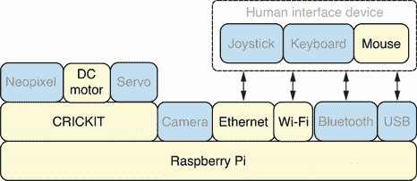
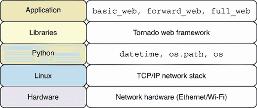
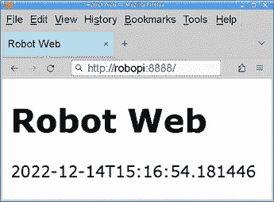
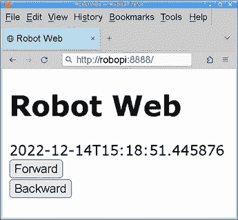
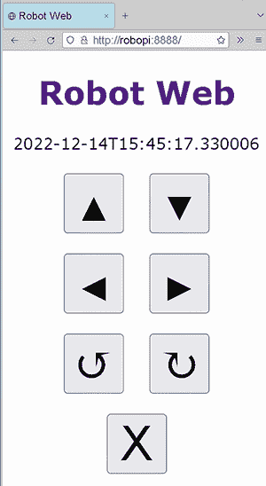
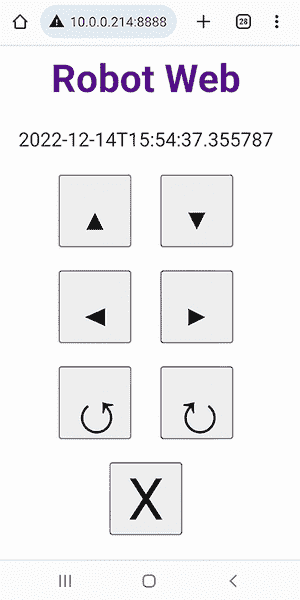
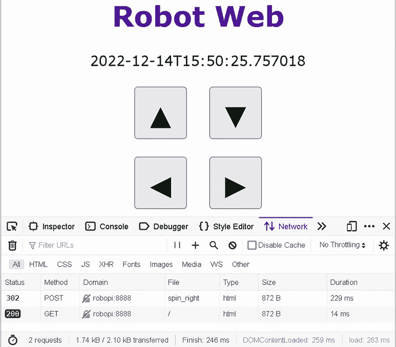
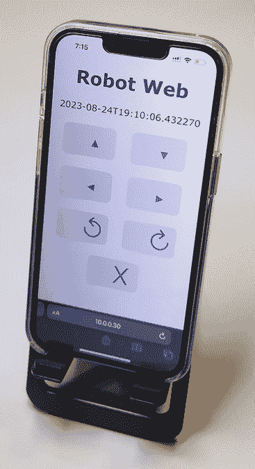
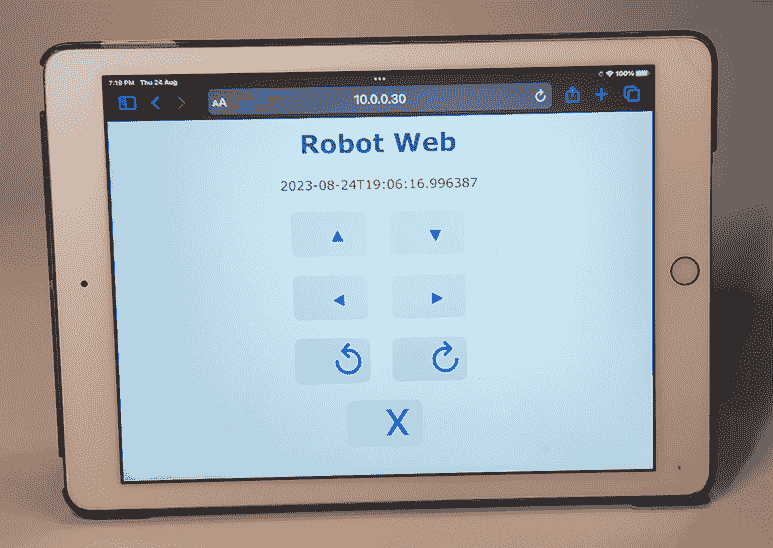

# 6 创建机器人 Web 应用

本章涵盖

+   创建桌面和移动友好的 Web 应用以控制机器人

+   使用 Web 浏览器工具测量 Web 应用性能

+   使用 Tornado 模板创建动态页面

+   启用增强型 Web 日志记录以检测 Web 请求失败

本章将教会你如何构建一个用于控制你的机器人的 Web 应用。该应用在桌面计算机和手机上都能正常工作。应用将提供完整的机器人运动范围，以及可以用来测量应用网络性能的命令，从端到端。在我们构建应用的过程中，你将学习到测量应用性能的有用技术，以及检测和修复某些类型的 Web 请求失败。 

Web 应用提供了一个强大的平台，用于构建由人类操作员控制机器人的机制。Web 应用既可以从桌面应用程序访问，也可以从移动设备访问。它们在主要的桌面操作系统（即 Windows、Mac 和 Linux）上保持一致的工作。

## 6.1 硬件堆栈

图 6.1 显示了硬件堆栈，本章中使用的特定组件被突出显示。在本章中，我们可以使用鼠标作为人机交互设备，通过我们的 Web 应用与机器人交互。



图 6.1 硬件堆栈：将通过 Web 界面在网络中控制直流电机。

Web 应用可以通过有线网络使用以太网端口或无线网络使用 Wi-Fi 硬件访问。通过 Wi-Fi 连接进行移动访问的用户体验最佳，因为它提供了完全的便携性。当从桌面访问 Web 界面时，可以使用鼠标作为人机交互设备，通过点击所需的机器人移动按钮来控制机器人。在后面的章节中，我们将使用键盘和操纵杆来控制机器人。

## 6.2 软件堆栈

本章中使用的特定软件的详细信息在图 6.2 中描述。这里将创建三个主要的应用程序。第一个是一个基本的 Web 应用，显示机器人服务器上的当前时间（`basic_web`）。然后，我们将创建一个使机器人前后移动的应用程序（`forward_web`）。最后，将创建一个具有完整机器人移动命令的移动友好型应用（`full_web`）。这些 Web 应用将使用 Tornado Web 框架创建。框架的内置模板功能将用于创建动态内容。将使用`datetime`和`os` Python 模块来计算服务器上的时间并从环境变量中读取值。



图 6.2 软件堆栈：网络上的 Web 浏览器将通过 Tornado Web 应用连接。

## 6.3 通过 Web 移动机器人前后

我们创建的第一个网络应用程序将执行基本的机器人前进和后退运动。我们需要创建一个满足以下要求的网络应用程序：

+   应创建一个 Python 网络应用程序，允许用户控制机器人前进和后退。

+   网络应用程序应使用 HTML5 标准。

+   用户界面必须是桌面和移动友好的。

HTML5 是互联网上使用的标记语言最新版本，与旧版本相比，它提供了更丰富的功能。因此，我们将它作为应用程序的要求之一。

### 6.3.1 创建基本网络应用程序

让我们采取一些简单的第一步，创建一个显示机器人网络服务器时间的网络应用程序。第一步是导入所有必需的模块。从 Tornado 中，我们导入 `IOLoop`、`RequestHandler` 和 `Application`，就像我们在前面的章节中做的那样，以设置和运行我们的网络应用程序。然后，我们导入 `enable_pretty_logging` 以启用日志输出。将使用 `datetime` 对象来获取当前时间。`dirname` 函数将获取路径的目录名。我们将使用 `os` 模块来访问环境变量：

```
from tornado.ioloop import IOLoop
from tornado.web import RequestHandler, Application
from tornado.log import enable_pretty_logging
from datetime import datetime
from os.path import dirname
import os
```

Tornado 网络框架具有强大的调试模式，提供自动重新加载和生成错误页面等特性，这些特性在开发调试网络应用程序时非常有用。下一行代码设置全局变量 `DEBUG` 为真或假，这取决于环境变量 `ROBO_DEBUG` 是否已定义。这样，相同的代码可以用于开发或生产使用，并且其调试行为可以通过环境变量在代码库外部定义：

```
DEBUG = bool(os.environ.get('ROBO_DEBUG'))
```

下一步是将 `TEMPLATE_PATH` 设置为模板目录的路径。此目录将包含用于生成 HTML 内容的 Tornado 模板文件。此路径自动计算为与 Python 代码相同的目录下的一个名为 `templates` 的子目录。将所有 HTML 模板文件放置在此目录中：

```
TEMPLATE_PATH = (dirname(__file__) + '/templates')
```

我们现在可以定义一个 `MainHandler` 对象来处理传入的请求。它将计算当前时间并将该值作为字符串保存在名为 `stamp` 的变量中。然后，使用 `stamp` 变量渲染 `basic.html` 模板并将其发送到网络浏览器：

```
class MainHandler(RequestHandler):
    def get(self):
        stamp = datetime.now().isoformat()
        self.render('basic.html', stamp=stamp)
```

最后一块代码调用 `enable_pretty_logging` 以启用日志输出，并使用应用程序设置定义 `settings`。然后，这些设置提供给 `Application`，并启动应用程序服务器：

```
enable_pretty_logging()
settings = dict(debug=DEBUG, template_path=TEMPLATE_PATH)
app = Application([('/', MainHandler)], **settings)
app.listen(8888)
IOLoop.current().start()
```

整个脚本可以保存为 `basic_web.py` 在 Pi 上。

图 6.1 `basic_web.py`：显示机器人时间的网络应用程序

```
#!/usr/bin/env python3
from tornado.ioloop import IOLoop
from tornado.web import RequestHandler, Application
from tornado.log import enable_pretty_logging
from datetime import datetime
from os.path import dirname
import os

DEBUG = bool(os.environ.get('ROBO_DEBUG'))
TEMPLATE_PATH = (dirname(__file__) + '/templates')

class MainHandler(RequestHandler):
    def get(self):
        stamp = datetime.now().isoformat()
        self.render('basic.html', stamp=stamp)

enable_pretty_logging()
settings = dict(debug=DEBUG, template_path=TEMPLATE_PATH)
app = Application([('/', MainHandler)], **settings)
app.listen(8888)
IOLoop.current().start()
```

在我们可以执行脚本之前，我们应该创建 `basic.html` 模板。我们将逐部分运行此模板文件。文件的第一行是必需的，用于通知网络浏览器该文件使用 HTML5。然后，我们有我们的 `html` 开启标签，它定义了文档语言为英语：

```
<!DOCTYPE HTML>
<html lang="en">
```

下一个部分是 HTML 文档的`head`部分。网站标题已提供，然后使用`meta`标签设置`viewport`元数据，以便 Web 应用程序可以在桌面和移动浏览器上正确显示。接下来，使用`style`标签将页面的字体设置为`Verdana`：

```
<head>
  <title>Robot Web</title>
  <meta name="viewport" content="width=device-width">
<style>
body {
  font-family: Verdana, sans-serif;
}
</style>
</head>
```

模板的最后部分包含文档的`body`部分。使用`h1`标签提供标题内容，最后，将`stamp`模板变量放置在这个标题下以显示当前时间：

```
<body>
<h1>Robot Web</h1>
{{ stamp }}
</body>
</html>
```

模板可以保存为`basic.html`在 Pi 的模板目录中。

图 6.2 `basic.html`：显示机器人时间的 HTML 用户界面

```
<!DOCTYPE HTML>
<html lang="en">
<head>
  <title>Robot Web</title>
  <meta name="viewport" content="width=device-width">
<style>
body {
  font-family: Verdana, sans-serif;
}
</style>
</head>
<body>
<h1>Robot Web</h1>
{{ stamp }}
</body>
</html>
```

我们现在可以执行`basic_web.py`来运行 Web 服务器。您可以通过访问网络上的计算机上的地址 http://robopi:8888 来访问 Web 应用程序。请确保更新计算机上的 hosts 文件，以便有一个`robopi`条目，如第五章所述。您也可以通过将 URL 中的`robopi`替换为机器人的 IP 地址来访问 Web 应用程序。当从移动设备访问 Web 应用程序时，使用 IP 地址将是一个更方便的选择。

当你访问 Web 应用程序时，它将显示机器人服务器上的当前时间。刷新页面以查看更新时间并确认服务器正在响应多个请求。图 6.3 显示了应用程序的外观。



图 6.3 `basic_web`：它显示在机器人服务器上的当前时间。

### 6.3.2 检测失败的请求

由于我们调用了`enable_pretty_logging`，我们得到了将服务器日志输出到终端的好处。我们可以检查这个输出以查看所有传入 Web 服务器的请求和给定的响应。尝试从多个浏览器或计算机再次访问 Web 应用程序。以下是从多个浏览器和计算机访问应用程序后的日志输出：

```
$ basic_web.py 
[I 221213 17:20:27 web:2271] 200 GET / (10.0.0.30) 7.99ms
[W 221213 17:20:27 web:2271] 404 GET /favicon.ico (10.0.0.30) 1.27ms
[I 221213 17:20:33 web:2271] 200 GET / (10.0.0.30) 2.21ms
[W 221213 17:20:34 web:2271] 404 GET /favicon.ico (10.0.0.30) 1.84ms
[I 221213 17:20:35 web:2271] 200 GET / (10.0.0.30) 1.98ms
[I 221213 17:20:35 web:2271] 200 GET / (10.0.0.30) 2.23ms
[W 221213 17:23:51 web:2271] 404 GET /favicon.ico (10.0.0.15) 1.82ms
[I 221213 17:23:53 web:2271] 200 GET / (10.0.0.15) 2.36ms
[I 221213 17:23:54 web:2271] 200 GET / (10.0.0.15) 2.32ms
[I 221213 17:23:55 web:2271] 200 GET / (10.0.0.15) 2.23ms
```

我们可以看到，在页面加载后，浏览器试图获取一个名为`favicon.ico`的文件，并因“404 not found”的 HTTP 错误而失败。这是因为我们还没有定义一个适当的方式来处理这些请求，所以它们失败了。在下一个升级中，我们可以解决这个问题，并在更改后检查服务器日志以确认问题已解决。这个日志输出也是查看 Tornado 提供响应所需时间的一个很好的方式，因为响应时间也会出现在日志输出中。

### 6.3.3 使用 Web 应用向前移动机器人

现在我们将向我们的应用程序添加前进和后退动作。我们将再次导入`motor`模块来控制机器人的动作：

```
import motor
```

`Application`对象将被增强以处理不同的请求 URL 并解析请求路径中的动作。正则表达式`/([a-z_]*)`用于匹配由小写字母和下划线字符组成的路径。此模式将匹配所有可用的移动命令：

```
app = Application([('/([a-z_]*)', MainHandler)], **settings)
```

我们现在更新`get`方法以接收`name`参数并渲染`forward.html`模板：

```
def get(self, name):
    stamp = datetime.now().isoformat()
    self.render('forward.html', stamp=stamp)
```

如前几章所述，我们只有在运动命令作为`post`请求传入时才会处理运动命令。然后`post`方法将检查`name`变量的值并调用相关的运动函数。之后，它将使用`redirect`方法将浏览器重定向到 Web 应用程序主页：

```
def post(self, name):
    if name == 'forward':
        motor.forward()
    if name == 'backward':
        motor.backward()
    self.redirect('/')
```

完整脚本可以保存为`forward_web.py`在 Pi 上。

图 6.3 `forward_web.py`：用于移动机器人前后移动的 Web 应用程序

```
#!/usr/bin/env python3
from tornado.ioloop import IOLoop
from tornado.web import RequestHandler, Application
from tornado.log import enable_pretty_logging
from datetime import datetime
from os.path import dirname
import os
import motor

DEBUG = bool(os.environ.get('ROBO_DEBUG'))
TEMPLATE_PATH = (dirname(__file__) + '/templates')

class MainHandler(RequestHandler):
    def get(self, name):
        stamp = datetime.now().isoformat()
        self.render('forward.html', stamp=stamp)

    def post(self, name):
        if name == 'forward':
            motor.forward()
        if name == 'backward':
            motor.backward()
        self.redirect('/')

enable_pretty_logging()
settings = dict(debug=DEBUG, template_path=TEMPLATE_PATH)
app = Application([('/([a-z_]*)', MainHandler)], **settings)
app.listen(8888)
IOLoop.current().start()
```

我们现在可以升级 HTML 模板。为了解决`favicon`问题，我们在模板的`head`部分使用以下 HTML。这为页面设置无图标，从而指示网络浏览器不要从网络服务器获取`favicon`文件：

```
<link rel="icon" href="data:,">
```

在文档的主体中，我们添加了两个表单。每个表单将使用`post`方法提交其数据，到`forward`路径或`backward`路径。每个表单的提交按钮都有一个标签，与该表单的运动动作相匹配：

```
<form method="post" action="forward">
  <input type="submit" value="Forward">
</form>
<form method="post" action="backward">
  <input type="submit" value="Backward">
</form>
```

模板可以保存为`forward.html`在 Pi 的模板目录中。

图 6.4 `forward.html`：用于移动机器人的前后移动的 HTML

```
<!DOCTYPE HTML>
<html lang="en">
<head>
  <title>Robot Web</title>
  <meta name="viewport" content="width=device-width">
  <link rel="icon" href="data:,">
<style>
body {
  font-family: Verdana, sans-serif;
}
</style>
</head>
<body>
<h1>Robot Web</h1>
{{ stamp }}
<form method="post" action="forward">
  <input type="submit" value="Forward">
</form>
<form method="post" action="backward">
  <input type="submit" value="Backward">
</form>

</body>
</html>
```

我们现在可以执行`forward_web.py`来运行网络服务器。当你访问网络应用程序时，按下前后按钮来移动机器人前后。图 6.4 显示了现在带有这些新按钮的应用程序的外观。我们可以检查应用程序会话的日志输出：

```
$ forward_web.py 
[I 221213 17:37:29 web:2271] 200 GET / (10.0.0.30) 7.99ms
[I 221213 17:37:34 web:2271] 302 POST /forward (10.0.0.30) 222.82ms
[I 221213 17:37:34 web:2271] 200 GET / (10.0.0.30) 2.28ms
[I 221213 17:37:35 web:2271] 302 POST /backward (10.0.0.30) 223.56ms
[I 221213 17:37:35 web:2271] 200 GET / (10.0.0.30) 2.25ms
[I 221213 17:37:36 web:2271] 302 POST /backward (10.0.0.30) 224.18ms
[I 221213 17:37:36 web:2271] 200 GET / (10.0.0.30) 2.22ms
```



图 6.4 `forward_web:`它提供了移动机器人前后按钮。

在日志输出中，我们可以看到机器人向前移动了一次，然后向后移动了两次。从日志中，我们可以看到渲染主页面通常需要 2 毫秒。执行机器人移动大约需要 224 毫秒。`motor`模块中为机器人移动设置的默认持续时间是 200 毫秒。因此，这些数字是我们预期的。最后，我们可以看到“favicon 未找到错误”也已解决，因为它们不再出现在请求日志中。

深入了解：HTML5

HTML5 是用于网络的标记语言的最新版本。该标准由 Web 超文本应用技术工作组（WHATWG）维护，它是一个由主要浏览器供应商（苹果、谷歌、Mozilla 和微软）组成的联盟。HTML Living Standard ([`w3.org/TR/html5`](https://w3.org/TR/html5))提供了关于 HTML 元素和语法的全部细节。它是标准的全面参考。

HTML 表单在本章中被大量使用，用于将所需的运动动作提交给机器人服务器。Mozilla 关于网页表单的指南([`developer.mozilla.org/Learn/Forms`](https://developer.mozilla.org/Learn/Forms))是一个优秀的资源，可以探索如何创建具有不同提交选项的表单，以及表单本身包含的不同输入元素。

## 6.4. 创建一个完整的运动 Web 应用程序

我们现在可以继续创建一个可以调用所有机器人运动函数的 Web 应用程序。我们需要创建一个满足以下要求的 Web 应用程序：

+   应该创建一个 Python Web 应用程序，允许用户将机器人向前、向后、向右、向左移动，以及向两个方向旋转。

+   应该创建一个调用无操作`noop`函数的按钮，以便在网页浏览器内进行性能测量。

+   用户界面的按钮应使用一个舒适地支持移动触摸和桌面鼠标交互的布局。

### 6.4.1 创建完整的运动应用程序

在 Python 方面，我们几乎完成了。我们可以对我们的先前应用程序进行一些小的修改，以启用所有运动函数。我们将对`get`方法进行小的修改，使其使用我们新的`full.html`模板：

```
    def get(self, name):
        stamp = datetime.now().isoformat()
        self.render('full.html', stamp=stamp)
```

现在将增强`post`方法，从`motor`模块查找所需的运动函数，然后调用该函数。之后，我们将被重定向到应用程序主屏幕：

```
    def post(self, name):
        func = getattr(motor, name)
        func()
        self.redirect('/')
```

完整的脚本可以保存为`full_web.py`在 Pi 上。

图 6.5 `full_web.py`：支持所有机器人运动动作的 Web 应用程序

```
#!/usr/bin/env python3
from tornado.ioloop import IOLoop
from tornado.web import RequestHandler, Application
from tornado.log import enable_pretty_logging
from datetime import datetime
from os.path import dirname
import os
import motor

DEBUG = bool(os.environ.get('ROBO_DEBUG'))
TEMPLATE_PATH = (dirname(__file__) + '/templates')

class MainHandler(RequestHandler):
    def get(self, name):
        stamp = datetime.now().isoformat()
        self.render('full.html', stamp=stamp)

    def post(self, name):
        func = getattr(motor, name)
        func()
        self.redirect('/')

enable_pretty_logging()
settings = dict(debug=DEBUG, template_path=TEMPLATE_PATH)
app = Application([('/([a-z_]*)', MainHandler)], **settings)
app.listen(8888)
IOLoop.current().start()
```

下一步将是升级 HTML 模板。`body`中的内容将进行多项增强。页面标题中的文本将被赋予一个链接，以便用户可以点击页面标题来重新加载页面。每个运动函数都有一个按钮放置在屏幕上。屏幕的布局被设计成将类似动作分组在同一行。第一行有前进和后退按钮。第二行有左转和右转按钮。第三行显示左转和右转的按钮。最后一行展示无操作按钮。按钮使用 HTML5 命名的字符引用，以便按钮有图形指示它们的功能：

```
<body>
<h1><a href='/'>Robot Web</a></h1>
{{ stamp }}<br><br>
<form method="post">
  <button formaction="forward">&blacktriangle;</button>
  <button formaction="backward">&blacktriangledown;</button>
  <br><br>
  <button formaction="left">&blacktriangleleft;</button>
  <button formaction="right">&blacktriangleright;</button>
  <br><br>
  <button formaction="spin_left">&circlearrowleft;</button>
  <button formaction="spin_right">&circlearrowright;</button>
  <br><br>
  <button formaction="noop">X</button>
</form>
</body>
```

现在我们可以通过更新样式标签来对页面上的内容进行样式设计。我们将内容居中在页面中，并从页面上的链接中移除默认的下划线文本装饰样式。接下来，我们继续对页面上的按钮进行样式设计。它们的字体大小被放大了三倍，并添加了足够的边距，以提供健康的按钮间距。这种布局和间距使得在触摸界面上用手指按下按钮更容易，因为按钮没有紧挨在一起。最后，所有按钮都被赋予了相同的高度和宽度为 60 px，以创建统一的样式：

```
<style>
body, a {
  font-family: Verdana, Arial, sans-serif;
  text-align: center;
  text-decoration: none;
}
button {
  font-size: 300%;
  margin: 0px 10px;
  height: 60px;
  width: 60px;
}
</style>
```

模板可以保存为`full.html`在 Pi 的模板目录中。

图 6.6 `full.html`：支持所有机器人移动动作的 HTML 用户界面

```
<!DOCTYPE HTML>
<html lang="en">
<head>
  <title>Robot Web</title>
  <meta name="viewport" content="width=device-width">
  <link rel="icon" href="data:,">
<style>
body, a {
  font-family: Verdana, Arial, sans-serif;
  text-align: center;
  text-decoration: none;
}
button {
  font-size: 300%;
  margin: 0px 10px;
  height: 60px;
  width: 60px;
}
</style>
</head>
<body>
<h1><a href='/'>Robot Web</a></h1>
{{ stamp }}<br><br>
<form method="post">
  <button formaction="forward">&blacktriangle;</button>
  <button formaction="backward">&blacktriangledown;</button>
  <br><br>
  <button formaction="left">&blacktriangleleft;</button>
  <button formaction="right">&blacktriangleright;</button>
  <br><br>
  <button formaction="spin_left">&circlearrowleft;</button>
  <button formaction="spin_right">&circlearrowright;</button>
  <br><br>
  <button formaction="noop">X</button>
</form>
</body>
</html>
```

我们现在可以执行`full_web.py`来运行网页服务器。当你访问网页应用程序时，按下不同的移动按钮，使机器人执行每个可用的移动。以下是从使用应用程序的会话中输出的日志：

```
$ full_web.py 
[I 221214 15:37:32 web:2271] 200 GET / (10.0.0.30) 4.75ms
[I 221214 15:37:34 web:2271] 302 POST /forward (10.0.0.30) 223.77ms
[I 221214 15:37:34 web:2271] 200 GET / (10.0.0.30) 5.26ms
[I 221214 15:37:35 web:2271] 302 POST /backward (10.0.0.30) 223.29ms
[I 221214 15:37:35 web:2271] 200 GET / (10.0.0.30) 4.77ms
[I 221214 15:37:35 web:2271] 302 POST /left (10.0.0.30) 222.85ms
[I 221214 15:37:35 web:2271] 200 GET / (10.0.0.30) 4.78ms
[I 221214 15:37:36 web:2271] 302 POST /right (10.0.0.30) 222.96ms
[I 221214 15:37:36 web:2271] 200 GET / (10.0.0.30) 4.81ms
[I 221214 15:37:40 web:2271] 302 POST /spin_left (10.0.0.30) 223.67ms
[I 221214 15:37:40 web:2271] 200 GET / (10.0.0.30) 4.80ms
[I 221214 15:37:41 web:2271] 302 POST /spin_right (10.0.0.30) 223.42ms
[I 221214 15:37:41 web:2271] 200 GET / (10.0.0.30) 4.84ms
[I 221214 15:37:41 web:2271] 302 POST /noop (10.0.0.30) 1.83ms
[I 221214 15:37:41 web:2271] 200 GET / (10.0.0.30) 4.87ms
```

从日志中，我们可以看到每个不同的移动功能都成功执行，然后在每个功能调用后加载主页面。值得注意的是，对`noop`页面的调用大约在 2 毫秒内完成，这表明性能良好。

### 6.4.2 网页界面设计

图 6.5 展示了网页应用程序在桌面和笔记本电脑用户面前的外观。每个按钮使用的图标反映了将要执行的动作。因此，指向前后方向的箭头表示机器人的前后移动。右转、左转和旋转功能有类似的图形表示。无操作动作用 X 表示，表示它不会导致移动。



图 6.5 桌面界面：每个机器人移动都可以通过其相关按钮调用。

图 6.6 展示了应用程序在移动设备上的外观。按钮使用较大的字体，并赋予了足够的宽度和高度，以便在触摸屏上舒适地按下。按钮之间宽敞的间距也防止了它们的拥挤。整个应用程序都适合在一个屏幕上，这样就可以访问所有功能，而无需滚动。



图 6.6 移动界面：按钮之间的间距使得触摸交互更加容易。

现实世界中的机器人：使用网页应用程序控制机器人

使用网页应用程序控制机器人比使用桌面应用程序更方便，因为它们可以通过移动设备访问。通过智能手机访问和控制工厂车间的机器人，比携带笔记本电脑给操作员带来更大的行动自由度。

当需要时，它们还支持从具有更大屏幕的设备访问，例如平板电脑或笔记本电脑。可以设计不同的用户界面，以更好地支持具有更大屏幕的设备。这样，用户就能享受到两者的最佳之处。

现代网页应用程序也非常易于扩展。我们将在后面的章节中看到如何将机器人摄像头的视频流添加到我们的网页应用程序中。这使机器人操作员能够看到机器人所看到的一切。

### 6.4.3 在浏览器中测量应用程序性能

图 6.7 展示了如何在浏览器中测量网络应用程序的性能。Firefox 和 Google Chrome 网页浏览器都内置了一个名为开发者工具的功能，它提供了许多丰富的功能，例如测量应用程序性能。一旦在浏览器中访问了该工具，点击网络标签。图 6.7 显示了当请求机器人向右旋转时的一个样本测量。从测量结果中，我们可以看到调用向右旋转动作花费了 229 毫秒，然后 14 毫秒用于重定向和加载主页。这些数字与我们在终端日志输出中从服务器上看到的数字相匹配。当尝试诊断网络应用程序的性能问题时，这个工具非常有用。



图 6.7 测量性能：页面的加载时间可以在浏览器本身中进行测量。

### 6.4.4 网络硬件设备

图 6.8 展示了在运行 iOS 操作系统的智能手机上，网络应用程序将如何显示。智能手机提供最高的便携性，因为它们足够小，可以放入口袋。使用它们的缺点是屏幕较小，我们只能使用触摸屏界面与应用程序进行交互。



图 6.8 智能手机设备：可以使用智能手机来控制机器人。

图 6.9 显示了在平板电脑上运行的应用程序。这类硬件设备提供了更大的屏幕，这使得我们可以在用户界面中放置更多的控件。

在多种不同屏幕尺寸和网页浏览器上尝试您的网络应用程序通常是一个好主意，这样您可以发现可能在特定设备或浏览器上出现的问题。



图 6.9 平板电脑：平板电脑的屏幕比智能手机大，但仍然非常便携。

## 摘要

+   通过 Wi-Fi 访问机器人可以提供最佳的用户体验，因为机器人和移动电话都具有完全的便携性。

+   Tornado 网络框架的内置模板功能用于在应用程序中创建动态内容。

+   输出服务器日志的一个好处是我们可以看到所有发送到网络服务器的请求和给出的响应。

+   按钮使用较大的字体，并且被赋予了良好的宽度和高度，这样它们就足够大，可以在触摸屏上舒适地按下。

+   Firefox 和 Google Chrome 网页浏览器都内置了一个名为开发者工具的功能，它提供了许多丰富的功能，例如测量应用程序性能。
