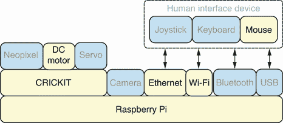
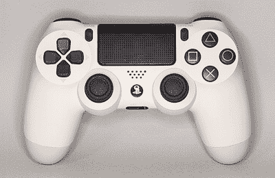
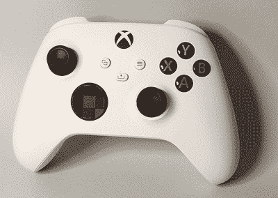
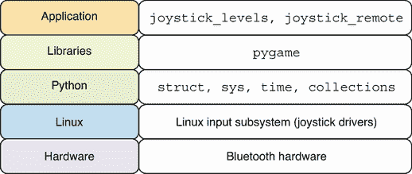
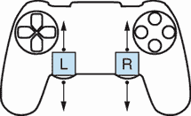

# 7 摇杆控制机器人

本章涵盖

+   使用 Pygame 读取摇杆数据

+   读取和解析原始摇杆事件数据

+   测量摇杆事件速率

+   创建远程摇杆机器人控制器

摇杆是最强大的输入设备之一。当涉及到控制机器人电机时，它们相比键盘和鼠标提供了更优越的控制。本章涵盖的场景将帮助您创建一个功能齐全的摇杆控制机器人。本章将教授您多种从摇杆硬件读取事件的方法。然后我们可以创建自己的事件处理器，根据特定的摇杆动作执行不同的机器人运动。在这个过程中，我们还将学习如何测量每秒触发的摇杆事件数量，并优化我们的代码，以防止机器人电机被运动请求淹没。最后，我们通过创建一个通过网络使用摇杆移动机器人的应用程序来结束本章。

摇杆控制的机器人具有广泛的应用，从在工厂车间远程操作重型车辆到使用机械臂进行精细的医学程序。在机器人辅助手术的情况下，通过控制非常小的机器人臂，医生可以执行其他情况下不可能进行的手术程序。

## 7.1 硬件堆栈

图 7.1 展示了硬件堆栈，其中本章使用的特定组件被突出显示。摇杆硬件可以通过有线 USB 或无线蓝牙连接连接到 Raspberry Pi。摇杆还可以连接到远程计算机，并且机器人运动请求将通过网络使用 Wi-Fi 或以太网进行传输。



图 7.1 硬件堆栈：摇杆将被用来控制机器人运动。

本章所使用的摇杆硬件可以是索尼 PlayStation 4/5 控制器或 Xbox 控制器。图 7.2 展示了一款 PlayStation 4 控制器的照片，图 7.3 展示了一款 Xbox 控制器的照片。在购买本章所需的硬件之前，请务必查阅附录 A 中的硬件购买指南。



图 7.2 PlayStation 4 控制器：这款控制器广泛可用，并且对 Linux 有良好的支持。



图 7.3 Xbox 控制器：这款控制器与 PlayStation 控制器类似，但它有两个模拟摇杆。

当通过 USB 将控制器连接到树莓派时，您只需将 USB 线连接到控制器和树莓派之间。不需要额外的软件或配置。索尼 PlayStation 控制器支持蓝牙连接。要使用它，您必须首先按照控制器的说明将其置于配对模式。然后，您可以使用随树莓派操作系统一起提供的图形蓝牙应用程序搜索并配对控制器，就像配对任何其他蓝牙设备一样。本章的最后一个应用程序也支持将控制器连接到同一网络上的远程 Linux 计算机。在该计算机上，可以使用相同的 USB 和蓝牙选项。

## 7.2 软件栈

本章中使用的特定软件的详细信息提供在图 7.4 中。前几个应用程序将使用 Pygame 库，因为它是与游戏杆设备一起工作的绝佳起点。然后，我们将使用`struct` Python 模块直接从 Linux 输入子系统读取和解析游戏杆事件。当创建`joystick_levels`应用程序来测量游戏杆事件生成的速率时，将使用`sys`和`time`模块。蓝牙硬件及其相关的蓝牙 Linux 驱动程序将被用于为控制器创建无线连接。本章以`joystick_remote`应用程序结束，该应用程序使用游戏杆硬件控制机器人电机。



图 7.4 软件栈：将使用 Linux 输入子系统来读取游戏杆事件。

## 7.3 游戏杆事件

图 7.5 展示了我们最感兴趣的特定摇杆事件。控制器上有很多按钮和摇杆，每个按钮和摇杆在被按下或移动时都可以向连接的计算机发送事件。对于本章中的应用程序，我们最感兴趣的是与控制器上两个模拟摇杆相关的事件。有一个摇杆用于左手，另一个用于右手。我们将通过根据摇杆的位置设置每个电机的节流来控制机器人的移动。如果右摇杆完全向前推，右电机将在前进方向上获得全功率。如果右摇杆完全向后拉，右电机将在后退方向上获得全功率。对于左摇杆和左电机，也将执行同样的操作。我们还将根据每个摇杆向前或向后推的程度来设置节流速度或级别。这样，你可以使用摇杆来控制前进、后退、转向和旋转动作。你还可以根据摇杆推的程度以较慢或较快的速度执行这些动作。当摇杆移动时，摇杆轴和位置将作为事件提供。每个摇杆都有 *y* 和 *x* 轴。摇杆垂直位置的变化与 *y* 轴事件相关，摇杆水平位置的变化与 *x* 轴事件相关。



图 7.5 摇杆事件：摇杆在上下移动时产生 y 轴事件。

## 7.4 使用 Pygame 读取摇杆事件

Pygame 是一个非常流行的 Python 模块，用于编写视频游戏。它内置了对读取摇杆事件的支持，是使用 Python 处理摇杆的绝佳起点。我们需要创建一个满足以下要求的应用程序：

+   有必要创建一个使用 Pygame 库读取摇杆事件的 Python 应用程序。

+   我们应该在应用程序中创建一个事件处理函数，每次有摇杆移动或按钮按下事件时都会调用该函数。

### 7.4.1 在 Pygame 中检测事件

这个程序将有一个事件循环，读取所有检测到的事件并将它们打印出来。一旦我们设置好，我们就可以继续下一节，该节将专注于摇杆事件。运行以下行以在我们的虚拟环境中安装 Pygame Python 包：

```
$ ~/pyenv/bin/pip install pygame
```

我们应用程序的第一部分将导入 `pygame` 模块：

```
import pygame
```

当我们运行主事件循环时，我们需要设置循环检查事件的频率。这个频率被称为帧率，我们将其设置在一个名为 `FRAME_RATE` 的变量中。它被设置为每秒 60 帧，这是创建响应性应用程序的常见值。如果这个值太小，应用程序将不会非常响应，如果太高，则会在不提供改进用户体验的情况下给计算机带来不必要的负担。人类无法感知每秒超过 60 帧的帧率。我们将窗口的高度和宽度保存在名为 `WINDOW_SIZE` 的变量中。在我们的应用程序中，窗口的大小并不重要，因为我们不会在窗口中绘制任何内容：

```
FRAME_RATE = 60
WINDOW_SIZE = [100, 100]
```

我们现在定义位于程序核心的 `main` 函数。我们调用 `pygame.init` 函数来初始化 Pygame 模块。然后，我们创建一个名为 `screen` 的窗口。接着，我们创建一个 `Clock` 对象，该对象将在事件循环中使用，以在期望的帧率处理事件。下一个块是主事件循环，它将持续运行，直到应用程序退出。通过调用 `pygame.event.get` 获取后续可用的事件。然后打印出该事件的详细信息。检查事件类型以确定它是否是 `pygame.QUIT` 类型的事件。如果是，通过调用 `pygame.quit` 退出应用程序，然后从主函数返回。最后，循环的最后一行使用配置的帧率调用 `clock.tick`：

```
def main():
    pygame.init()
    screen = pygame.display.set_mode(WINDOW_SIZE)
    clock = pygame.time.Clock()
    while True:
        for event in pygame.event.get():
            print('event detected:', event)
            if event.type == pygame.QUIT:
                pygame.quit()
                return
        clock.tick(FRAME_RATE)
```

应用程序的最后一行调用 `main` 函数：

```
main()
```

完整脚本可以保存为 `pygame_events.py` 在 Pi 上，然后执行。

列表 7.1 `pygame_events.py`: 使用 Pygame 库打印摇杆事件

```
#!/usr/bin/env python3
import pygame

FRAME_RATE = 60
WINDOW_SIZE = [100, 100]

def main():
    pygame.init()
    screen = pygame.display.set_mode(WINDOW_SIZE)
    clock = pygame.time.Clock()
    while True:
        for event in pygame.event.get():
            print('event detected:', event)
            if event.type == pygame.QUIT:
                pygame.quit()
                return
        clock.tick(FRAME_RATE)

main()
```

该应用程序需要一个图形环境来运行，因为它会创建窗口。您可以直接在 Pi 的桌面环境中运行它，或者通过 VNC 会话远程运行。输出是从运行命令的会话中获取的。在下面的会话中，启动了应用程序，并在键盘上按下并释放了字母 A。鼠标在应用程序周围移动，然后关闭了窗口。键盘、鼠标和窗口关闭事件可以在输出中看到，它们被检测到：

```
$ pygame_events.py 
pygame 2.1.2 (SDL 2.0.14, Python 3.9.2)
Hello from the pygame community. https://www.pygame.org/contribute.html
event detected: <Event(32774-WindowShown {'window': None})>
event detected: <Event(32777-WindowMoved {'x': 464, 'y': 364, 'window': ...
event detected: <Event(32770-VideoExpose {})>
event detected: <Event(32776-WindowExposed {'window': None})>
event detected: <Event(32768-ActiveEvent {'gain': 1, 'state': 1})>
event detected: <Event(32785-WindowFocusGained {'window': None})>
event detected: <Event(32788-WindowTakeFocus {'window': None})>
event detected: <Event(768-KeyDown {'unicode': 'a', 'key': 97, 'mod': ...
event detected: <Event(771-TextInput {'text': 'a', 'window': None})>
event detected: <Event(769-KeyUp {'unicode': 'a', 'key': 97, 'mod': 0, ...
event detected: <Event(32768-ActiveEvent {'gain': 1, 'state': 0})>
event detected: <Event(32783-WindowEnter {'window': None})>
event detected: <Event(1024-MouseMotion {'pos': (99, 2), 'rel': (0, 0), ...
event detected: <Event(32768-ActiveEvent {'gain': 0, 'state': 0})>
event detected: <Event(32784-WindowLeave {'window': None})>
event detected: <Event(32788-WindowTakeFocus {'window': None})>
event detected: <Event(32787-WindowClose {'window': None})>
event detected: <Event(256-Quit {})>
```

深入了解：帧率

帧率通常以每秒帧数来衡量。它是人类与计算机交互的一个重要方面。在本章中，我们专注于创建读取摇杆事件并能快速响应以创建实时应用的应用程序。如果我们的帧率下降到一个非常低的水平，我们的机器人操作者会注意到。我们的应用程序在响应我们的动作时会有明显的延迟。

尽管我们在初始应用程序中将帧率设置为每秒 60 帧，但每秒 30 帧的较低帧率对于许多应用程序来说仍然很受欢迎且舒适。在接下来的章节中，Pi 相机的默认帧捕获率为每秒 30 帧。以这个速率显示的图像将看起来像流畅的视频流。当我们执行像人脸检测这样的要求较高的任务，帧率降低到非常低的水平时，这将会非常明显且具有破坏性。因此，我们将通过软件优化在遇到问题时解决这些问题。

无论我们处理视频播放、摇杆事件，还是任何其他高度交互式的用户应用程序，通常都会归结为测量帧率并确保软件设计保持目标帧率，以免用户体验受到影响。

### 7.4.2 检测摇杆事件

现在，我们可以将检测和处理摇杆事件的能力添加到我们的应用程序中。以下两行代码被添加到 `main` 函数中。第一行调用 `Joystick` 来设置控制器设备对象，并将其保存在 `joystick` 变量中。然后我们输出摇杆控制器设备的名称：

```
joystick = pygame.joystick.Joystick(0)
print('joystick name:', joystick.get_name())
```

在我们之前的事件循环中添加了一行代码，以便每次检测到新事件时调用 `handle_event` 函数：

```
while True:
    for event in pygame.event.get():
        if event.type == pygame.QUIT:
            pygame.quit()
            return
        handle_event(event)
    clock.tick(FRAME_RATE)
```

现在可以定义事件处理函数。它将仅关注摇杆事件，并在按钮被按下或控制器上的某个摇杆被移动时打印不同的消息：

```
def handle_event(event):
    if event.type == pygame.JOYBUTTONDOWN:
        print('button pressed', event.button)
    if event.type == pygame.JOYAXISMOTION:
        print('axis motion', event.axis, event.value)
```

完整的脚本可以保存为 Pi 上的 `pygame_joystick.py` 并执行。

列表 7.2 `pygame_joystick.py`：使用 Pygame 检测特定的摇杆事件

```
#!/usr/bin/env python3
import pygame

FRAME_RATE = 60
WINDOW_SIZE = [100, 100]

def handle_event(event):
    if event.type == pygame.JOYBUTTONDOWN:
        print('button pressed', event.button)
    if event.type == pygame.JOYAXISMOTION:
        print('axis motion', event.axis, event.value)

def main():
    pygame.init()
    screen = pygame.display.set_mode(WINDOW_SIZE)
    clock = pygame.time.Clock()
    joystick = pygame.joystick.Joystick(0)
    print('joystick name:', joystick.get_name())
    while True:
        for event in pygame.event.get():
            if event.type == pygame.QUIT:
                pygame.quit()
                return
            handle_event(event)
        clock.tick(FRAME_RATE)

main()
```

在接下来的会话中，应用程序被启动，按下了四个不同的按钮，摇杆被移动到不同的位置。我们可以看到每个按钮都有一个唯一的标识符，摇杆的移动有详细信息来识别移动的轴和摇杆移动到的位置：

```
$ pygame_events.py 
pygame 2.1.2 (SDL 2.0.14, Python 3.9.2)
pygame 2.1.2 (SDL 2.0.14, Python 3.9.2)
Hello from the pygame community. https://www.pygame.org/contribute.html
joystick name: Sony Interactive Entertainment Wireless Controller
button pressed 0
button pressed 3
button pressed 2
button pressed 1
axis motion 0 -0.003936887722403638
axis motion 0 -0.003936887722403638
axis motion 4 0.003906369212927641
axis motion 4 -0.027466658528397473
```

在接下来的部分中，我们将学习如何更详细地读取事件数据。

## 7.5 读取 Linux 摇杆事件

使用 Pygame 让我们了解了如何在 Python 中与摇杆事件交互以及创建图形应用程序，我们将在接下来的章节中做更多这方面的内容。然而，这个库更专注于创建视频游戏，所以它并不完全适合我们的需求。幸运的是，在 Linux 上，对摇杆设备有非常好的支持，Python 应用程序可以直接读取它们的事件数据。这样做的好处是我们可以避免运行整个视频游戏引擎的开销和复杂性，而可以专注于当前的任务，即读取摇杆事件。我们将解析摇杆事件数据，并专注于处理 *y*-轴上的摇杆事件，这是我们机器人应用程序中最感兴趣的事件。我们需要创建一个满足以下要求的应用程序：

+   Python 应用程序应直接读取 Linux 摇杆事件。

+   应该区分事件是按钮按下还是摇杆移动事件。

+   应该过滤轴事件，只处理两个摇杆上的 *y-* 轴事件。

+   应该能够计算 *y*-轴上的移动方向和百分比。

### 7.5.1 探索 Linux 输入子系统

要读取摇杆事件数据，我们首先需要探索 Linux 输入子系统。文档([`www.kernel.org/doc/html/latest/input/`](https://www.kernel.org/doc/html/latest/input/))非常全面，并将成为我们探索和实施的基础。我们感兴趣的所有内容都在“Linux 摇杆支持”章节中。从文档中，我们可以看到每个连接的摇杆在文件系统中都暴露为一个设备文件。这是 Unix 系统中的一种常见方法。当摇杆连接时，摇杆设备会自动创建，并遵循一个常见的命名约定。这使得列出它们变得容易。以下终端会话显示了如何列出系统上的摇杆设备：

```
$ ls /dev/input/js*
/dev/input/js0
```

从输出中，我们可以看到连接了一个摇杆。如果有额外的摇杆连接，它们将被命名为 `/dev/input/js1` 和 `/dev/input/js2`。文档还涵盖了 `jstest` 命令，该命令可用于在终端连接到摇杆并查看生成的摇杆事件详情。运行以下行来安装该命令：

```
$ sudo apt install joystick
```

现在，我们可以运行 `jstest` 来在我们的终端中获得摇杆事件的实时视图：

```
$ jstest /dev/input/js0
Driver version is 2.1.0.
Joystick (Wireless Controller)
  has 8 axes (X, Y, Z, Rx, Ry, Rz, Hat0X, Hat0Y)
and 13 buttons (BtnA, BtnB, BtnX, BtnY, BtnTL, BtnTR, BtnTL2, BtnTR2,
  BtnSelect, BtnStart, BtnMode, BtnThumbL, BtnThumbR).
Testing ... (interrupt to exit)
Axes:  0:0  1:0  2:-32767  3:0  4:0  5:-32767  6:0  7:0
Buttons:  0:off  1:off  2:off  3:off  4:off  5:off  6:off
          7:off  8:off  9:off 10:off 11:off 12:off
```

从输出中，我们可以看到检测到的不同按钮和轴。我们可以看到所有按钮都是关闭的，因为它们都没有被按下。每个按钮都有一个特定的编号用于识别它。每个按钮的值要么是开启要么是关闭。如果我们按住 PlayStation 控制器的十字按钮，我们将得到以下输出：

```
Buttons:  0:on   1:off  2:off  3:off  4:off  5:off  6:off
          7:off  8:off  9:off 10:off 11:off 12:off
```

我们可以看到按钮编号 `0` 是开启的，这意味着十字按钮被映射到这个按钮。如果我们现在按下圆形按钮，我们将得到以下输出：

```
Buttons:  0:off  1:on   2:off  3:off  4:off  5:off  6:off
          7:off  8:off  9:off 10:off 11:off 12:off
```

输出指示圆形按钮被映射到按钮编号 `1`。如果我们继续这个过程，它将显示三角形按钮被映射到按钮编号 `2`，正方形按钮被映射到按钮编号 `3`。我们可以记录这些映射并在我们的应用程序中使用它们将按钮编号映射到按钮标签。如果你使用的是 Xbox 控制器，你可以遵循相同的程序来处理 A、B、X 和 Y 按钮。

接下来，让我们探索轴值。当没有任何按键被按下时，我们得到以下值：

```
Axes:  0:0  1:0  2:-32767  3:0  4:0  5:-32767  6:0  7:0
```

从文档中，我们可以看到当摇杆处于中心位置时，轴的值为 `0`。当摇杆沿特定轴推到最远方向时，值为 `32767`，而当它放在相反方向时，它变为 `-32767`。摇杆的其他位置将表示在这些值之间，具体取决于摇杆离中心有多远。我们可以从输出中看到，有两个轴的值为 `-32767`，即使我们没有移动摇杆。原因是这两个轴被映射到控制器上的触发按钮，这些按钮具有可以检测按钮被按下程度的硬件，而摇杆上的其他按钮则没有。对于我们的机器人应用程序，我们不需要使用触发器，因此我们可以忽略它们。如果我们把右侧摇杆推到最前面的位置，我们会得到以下输出：

```
Axes:  0:0  1:0  2:-32767  3:0  4:-32767  5:-32767  6:0  7:0
```

我们可以看到右侧摇杆的 `y` 轴映射到轴号 `4`，其值为 `-32767`。这意味着 `y` 轴的前进位置映射到 `-32767` 的值。现在，让我们将右侧摇杆移动到最远位置向后，并查看结果：

```
Axes:  0:0  1:0  2:-32767  3:0  4:32767  5:-32767  6:0  7:0
```

现在相同的轴具有 `32767` 的值。向后位置映射到 `32767` 的值。通过为右侧摇杆的 `x` 轴执行相同的处理过程，我们看到它映射到轴号 `3`。同样，我们可以发现左侧摇杆的 `x` 轴映射到轴号 `0`，而 `y` 轴映射到轴号 `1`。

文档有一个名为“编程接口”的优秀部分，它将为我们提供编写应用程序所需的一切。一般方法将是以二进制模式打开摇杆设备文件，并从设备文件中读取固定长度的字节。我们读取的每个数据块都是一个单独的摇杆事件。我们正在读取的二元数据的结构如下：

```
struct js_event {
    __u32 time;     /* event timestamp in milliseconds */
    __s16 value;    /* value */
    __u8 type;      /* event type */
    __u8 number;    /* axis/button number */
};
```

Python 内置了一个模块，用于以 C 语言 `struct` 格式读取二进制数据并将其转换为相关的 Python 值。在这个阶段，我们只需要注意数据类型及其含义。第一个值是一个时间戳，我们不需要它。然后，`value` 将具有与使用 `jstest` 命令看到的相同的按钮和轴值。通过检查 `type`，我们可以判断事件是按钮事件还是轴事件。文档中说明，对于 `type` 变量，按钮事件将具有 `1` 的值，而轴事件将具有 `2` 的值。最后，`number` 表示事件针对的是哪个按钮或轴，这与我们在 `jstest` 输出中看到的方式相同。现在，我们已经拥有了所有必需的信息来组合我们的实现。

### 7.5.2 解包摇杆事件

此脚本将包含从 Linux 输入子系统读取摇杆事件并将事件数据转换为 Python 的核心逻辑。我们将导入 Python 标准库中的 `struct` 模块。此模块提供了将 C 结构数据转换为 Python 值的功能：

```
from struct import Struct
```

然后我们将摇杆设备文件的路径保存在一个名为`DEVICE`的变量中：

```
DEVICE = '/dev/input/js0'
```

现在我们定义函数`main`，它首先创建一个`Struct`对象，并将其保存在`event_struct`变量中。Python 文档中的`struct`模块展示了如何映射不同的 C 数据类型。第一个值是`u32`，它是一个 32 位长度的无符号整数，因此映射到`I`。下一个值是`__s16`，它是一个 16 位整数，因此映射到`h`。最后，最后两个值都是`u8`，它是一个 8 位整数，因此映射到`B`。这使得创建的`Struct`对象格式为`'I h B B.'`。我们现在以模式`'rb'`打开设备文件，以便以二进制模式打开文件进行读取。然后我们进入一个`while`循环，该循环持续从设备文件中读取事件数据。接下来，我们从文件中读取`event_struct.size`个字节，并将其保存到`bytes`变量中。此值是 C `structs`数据的确切字节数。通过读取这个确切的大小，我们在每个循环中读取一个摇杆事件。接下来，我们使用`unpack`方法将字节数据转换为 Python 值集合，并将其保存到`data`中。然后，我们将事件数据的每个部分保存到单独的变量中。最后，当检测到按钮按下事件时，我们打印出`value`和`number`，这对应于`type`为`1`：

```
def main():
    event_struct = Struct('I h B B')
    with open(DEVICE, 'rb') as js_device:
        while True:
            bytes = js_device.read(event_struct.size)
            data = event_struct.unpack(bytes)
            time, value, type, number = data
            if type == 1:
                print(f'value:{value} number:{number}')
```

应用程序的最后一行调用`main`函数：

```
main()
```

完整的脚本可以保存为`joystick_unpack.py`在 Pi 上，然后执行。

列表 7.3 `joystick_unpack.py`：在 Linux 上解包原始摇杆事件

```
#!/usr/bin/env python3
from struct import Struct

DEVICE = '/dev/input/js0'

def main():
    event_struct = Struct('I h B B')
    with open(DEVICE, 'rb') as js_device:
        while True:
            bytes = js_device.read(event_struct.size)
            data = event_struct.unpack(bytes)
            time, value, type, number = data
            if type == 1:
                print(f'value:{value} number:{number}')

main()
```

输出显示了脚本运行会话，然后按下了十字和圆形按钮。输出的前两行与十字按钮相关，其按钮编号为`number:0`。我们可以看到，按钮的`value`值在按下和释放时从`1`变为`0`。最后两行显示相同的情况，但按钮编号为`number:1`，这表明圆形按钮被按下和释放：

```
$ joystick_unpack.py 
value:1 number:0
value:0 number:0
value:1 number:1
value:0 number:1
```

### 7.5.3 映射摇杆事件

下一步是将事件中的值映射到更易读的按钮和轴的名称以及事件类型。这将使我们的代码更易读，并为我们提供在终端中生成更易读输出的能力。我们还将创建一个专用函数，该函数将在接收摇杆事件时被调用。

我们将导入`collections`模块中的`namedtuple`对象，它是 Python 标准库的一部分。此对象提供了一种将 Python `tuple`对象转换为更易读的`namedtuple`的绝佳方式：

```
from collections import namedtuple
```

我们在 `TYPE_BUTTON` 和 `TYPE_AXIS` 中保存按钮和轴类型事件的值。我们使用字典将 `BUTTON` 变量中每个按钮的名称进行映射。`BUTTON` 的第一个版本是对 PlayStation 控制器的映射，而第二个注释掉的版本是对 Xbox 控制器的映射。根据需要，您可以使用任何一个。然后，我们创建一个名为 `AXIS` 的字典，以获取轴事件的轴名称：

```
TYPE_BUTTON = 1
TYPE_AXIS = 2
BUTTON = {0: 'cross', 1: 'circle', 2: 'triangle', 3: 'square'}
# BUTTON = {0: 'A', 1: 'B', 2: 'X', 3: 'Y'}
AXIS = {0: 'left_x', 1: 'left_y', 3: 'right_x', 4: 'right_y'}
```

创建了一个名为 `Event` 的 `namedtuple`，它将被用来以更可读的数据结构保存事件数据：

```
Event = namedtuple('Event', 'time, value, type, number')
```

`main` 函数基本上与上一个脚本相同。主要区别是，为每个新事件创建一个 `Event` 对象，然后使用此对象调用 `handle_event` 函数：

```
def main():
    event_struct = Struct('I h B B')
    with open(DEVICE, 'rb') as js_device:
        while True:
            bytes = js_device.read(event_struct.size)
            event = Event(*event_struct.unpack(bytes))
            handle_event(event)
```

当 `handle_event` 函数遇到按钮事件时，它将使用 `BUTTON` 字典查找按钮的名称。我们使用 `get` 方法，这样如果按下了我们未定义的按钮，就不会导致错误；相反，返回 `None` 值。这样，我们可以定义我们最关心的按钮名称。然后，我们将输出到终端，表示遇到了按钮事件，并提供按钮名称和 `event` 变量的转储。当检测到轴事件时，会检索轴的名称，并输出轴名称和 `event` 变量的类似详细信息：

```
def handle_event(event):
    if event.type == TYPE_BUTTON:
        name = BUTTON.get(event.number)
        print('button -', name, event)
    if event.type == TYPE_AXIS:
        name = AXIS.get(event.number)
        print('axis -', name, event)
```

完整脚本可以保存为 `joystick_map.py` 在 Pi 上，然后执行。

列表 7.4 `joystick_map.py`：将摇杆事件映射到按钮和轴名称

```
#!/usr/bin/env python3
from struct import Struct
from collections import namedtuple

DEVICE = '/dev/input/js0'
TYPE_BUTTON = 1
TYPE_AXIS = 2
BUTTON = {0: 'cross', 1: 'circle', 2: 'triangle', 3: 'square'}
# BUTTON = {0: 'A', 1: 'B', 2: 'X', 3: 'Y'}
AXIS = {0: 'left_x', 1: 'left_y', 3: 'right_x', 4: 'right_y'}

Event = namedtuple('Event', 'time, value, type, number')

def handle_event(event):
    if event.type == TYPE_BUTTON:
        name = BUTTON.get(event.number)
        print('button -', name, event)
    if event.type == TYPE_AXIS:
        name = AXIS.get(event.number)
        print('axis -', name, event)

def main():
    event_struct = Struct('I h B B')
    with open(DEVICE, 'rb') as js_device:
        while True:
            bytes = js_device.read(event_struct.size)
            event = Event(*event_struct.unpack(bytes))
            handle_event(event)

main()
```

以下会话显示了按下十字和圆形按钮时的输出。然后，右摇杆沿 *y* 轴和 *x* 轴移动。最后，左摇杆在两个轴上再次移动：

```
$ joystick_map.py 
button - cross Event(time=16675880, value=1, type=1, number=0)
button - cross Event(time=16676010, value=0, type=1, number=0)
button - circle Event(time=16676400, value=1, type=1, number=1)
button - circle Event(time=16676500, value=0, type=1, number=1)
axis - right_x Event(time=16677540, value=-1014, type=2, number=3)
axis - right_y Event(time=16677540, value=-1014, type=2, number=4)
axis - right_x Event(time=16677540, value=-2365, type=2, number=3)
axis - right_y Event(time=16677540, value=-2027, type=2, number=4)
axis - right_x Event(time=16677550, value=-3041, type=2, number=3)
axis - right_y Event(time=16677550, value=-2703, type=2, number=4)
axis - left_x Event(time=16681520, value=7769, type=2, number=0)
axis - left_y Event(time=16681520, value=-19932, type=2, number=1)
axis - left_x Event(time=16681520, value=5067, type=2, number=0)
axis - left_y Event(time=16681520, value=-12500, type=2, number=1)
axis - left_x Event(time=16681530, value=0, type=2, number=0)
axis - left_y Event(time=16681530, value=-2365, type=2, number=1)
```

### 7.5.4 与轴事件一起工作

我们现在可以更深入地研究轴事件，并计算方向以及摇杆移动的距离。对于控制机器人，我们只关心摇杆在 *y* 轴上的移动，因此我们只会关注该轴上的事件。可以使用 `MAX_VAL` 变量，这样我们就可以将摇杆位置与最大可能值进行比较，以计算移动的百分比：

```
MAX_VAL = 32767
```

`handle_event` 函数已被修改，仅关注轴事件。一旦获得轴的名称，就会检查它是否为 `left_y` 或 `right_y`。这样，只处理 *y* 轴事件。`direction` 变量将跟踪摇杆是向前推还是向后推。此值基于 `event.value` 是正数还是负数来计算。取 `event.value` 的绝对值，并将其除以 `MAX_VAL` 来计算摇杆远离中心的分数位置。此值乘以一百并四舍五入到两位小数，以百分比的形式表示。然后，这三个变量被输出到终端：

```
def handle_event(event):
    if event.type == TYPE_AXIS:
        name = AXIS.get(event.number)
        if name in ['left_y', 'right_y']:
            direction = 'backward' if event.value > 0 else 'forward'
            percent = round((abs(event.value) / MAX_VAL) * 100, 2)
            print(name, direction, percent)
```

完整脚本可以保存为 `joystick_axis.py` 在 Pi 上，然后执行。

列表 7.5 `joystick_axis.py`：控制方向和移动百分比

```
#!/usr/bin/env python3
from struct import Struct
from collections import namedtuple

DEVICE = '/dev/input/js0'
TYPE_AXIS = 2
AXIS = {0: 'left_x', 1: 'left_y', 3: 'right_x', 4: 'right_y'}
MAX_VAL = 32767

Event = namedtuple('Event', 'time, value, type, number')

def handle_event(event):
    if event.type == TYPE_AXIS:
        name = AXIS.get(event.number)
        if name in ['left_y', 'right_y']:
            direction = 'backward' if event.value > 0 else 'forward'
            percent = round((abs(event.value) / MAX_VAL) * 100, 2)
            print(name, direction, percent)

def main():
    event_struct = Struct('I h B B')
    with open(DEVICE, 'rb') as js_device:
        while True:
            bytes = js_device.read(event_struct.size)
            event = Event(*event_struct.unpack(bytes))
            handle_event(event)

main()
```

以下会话显示了当右摇杆向前移动到最满位置然后回到中心，然后再向后移动一点并回到中心时，在脚本执行过程中生成的输出。最后，左摇杆也被向前和向后移动：

```
$ joystick_axis.py 
right_y forward 13.4
right_y forward 40.21
right_y forward 79.38
right_y forward 100.0
right_y forward 95.88
right_y forward 35.05
right_y forward 0.0
right_y backward 18.56
right_y backward 48.45
right_y backward 22.68
right_y backward 9.28
right_y forward 0.0
left_y forward 29.9
left_y forward 56.7
left_y forward 83.51
left_y forward 100.0
left_y forward 97.94
left_y forward 86.6
left_y forward 28.87
left_y forward 0.0
left_y backward 16.5
left_y backward 28.86
left_y backward 41.24
left_y backward 19.59
left_y forward 0.0
```

## 7.6 测量摇杆事件率

模拟摇杆上的传感器极其灵敏，可以检测到数百种不同的位置。这种灵敏度会产生每秒非常高的摇杆事件率。我们需要注意这一点，因为它可能会让我们的机器人接收到大量请求来改变电机节流，即使摇杆位置只有微小的变化。在`motor`模块中，我们包含了三个速度等级。我们可以采用类似的方法来解决我们的摇杆问题，通过计算每个方向的三个摇杆位置等级，并且只有在这些等级中的一个发生变化时才请求机器人移动。每个等级将直接与一个速度等级相关联。

与摇杆一起使用的另一种常见解决方案是创建一个可配置的摇杆死区。这个死区是指摇杆需要从中性位置移动多远，应用程序才会将其视为运动。

我们将编写一个脚本来测量和报告每秒生成的轴事件数量，以便我们可以量化这个问题。然后，我们将增强脚本以计算三个定义好的等级的变化以及等级变化的速率。有了这些测量数据，我们将有数据来得出这个解决方案是否解决问题的结论。脚本将仅关注单个摇杆的*y*轴，以简化实现和测量。应用程序需要满足以下要求：

+   Python 应用程序应读取 100 个轴事件并记录所花费的时间。

+   事件率应计算为新事件每秒的数量。

+   等级率应计算为新等级每秒的数量。

+   应仅记录右摇杆*y*轴上的轴运动。

### 7.6.1 计算事件率

当前手头的首要任务将是计算每秒新轴事件的数量。脚本将基于上一节中的脚本进行构建。我们将导入`sys`模块，以便在所有测量完成后退出脚本。导入`time`模块以测量时间。从`types`模块导入`SimpleNamespace`对象，并将用于跟踪我们的统计数据：

```
import sys
import time
from types import SimpleNamespace
```

`main`函数与我们之前看到的脚本非常相似，有一些小的添加。`data`变量将跟踪迄今为止遇到的事件数量以及第一个事件的开始时间：

```
def main():
    data = SimpleNamespace(events=0, start=None)
    event_struct = Struct('I h B B')
    with open(DEVICE, 'rb') as js_device:
        while True:
            bytes = js_device.read(event_struct.size)
            event = Event(*event_struct.unpack(bytes))
            handle_event(event, data)
```

`handle_event`将检查右摇杆上的任何*y*轴事件。每次检测到事件时，它将调用`update_counter`函数，以便更新计数器统计信息：

```
def handle_event(event, data):
    if event.type == TYPE_AXIS:
        name = AXIS.get(event.number)
        if name == 'right_y':
            update_counter(data)
```

`update_counter` 函数将 `data.events` 计数器变量增加以记录新事件。然后输出计数事件的数目。如果这是遇到的第一事件，则将样本的起始时间保存在 `data.start` 变量中。如果收集了一百个样本，则调用 `stop_counter` 函数结束测量并报告结果：

```
def update_counter(data):
    data.events += 1
    print('events:', data.events)
    if data.events == 1:
        data.start = time.perf_counter()
    if data.events == 100:
        stop_counter(data)
```

`stop_counter` 函数首先计算在计数新事件并保存结果到 `duration` 中的时间。然后，计算每秒新事件的数量并保存在 `event_rate` 中。最后，打印所用时间、总事件数和事件速率，并退出脚本：

```
def stop_counter(data):
    duration = time.perf_counter() - data.start
    event_rate = data.events / duration
    print('---------- STATS ----------')
    print(f'      time: {duration:0.3f}s')
    print(f'    events: {data.events}')
    print(f'event rate: {event_rate:0.1f}')
    sys.exit()
```

完整的脚本可以保存为 `joystick_stats.py` 在 Pi 上，然后执行。

列表 7.6 `joystick_stats.py`: 收集和报告摇杆统计数据

```
#!/usr/bin/env python3
import sys
import time
from struct import Struct
from collections import namedtuple
from types import SimpleNamespace

DEVICE = '/dev/input/js0'
TYPE_AXIS = 2
AXIS = {0: 'left_x', 1: 'left_y', 3: 'right_x', 4: 'right_y'}
MAX_VAL = 32767

Event = namedtuple('Event', 'time, value, type, number')

def stop_counter(data):
    duration = time.perf_counter() - data.start
    event_rate = data.events / duration
    print('---------- STATS ----------')
    print(f'      time: {duration:0.3f}s')
    print(f'    events: {data.events}')
    print(f'event rate: {event_rate:0.1f}')
    sys.exit()

def update_counter(data):
    data.events += 1
    print('events:', data.events)
    if data.events == 1:
        data.start = time.perf_counter()
    if data.events == 100:
        stop_counter(data)

def handle_event(event, data):
    if event.type == TYPE_AXIS:
        name = AXIS.get(event.number)
        if name == 'right_y':
            update_counter(data)

def main():
    data = SimpleNamespace(events=0, start=None)
    event_struct = Struct('I h B B')
    with open(DEVICE, 'rb') as js_device:
        while True:
            bytes = js_device.read(event_struct.size)
            event = Event(*event_struct.unpack(bytes))
            handle_event(event, data)

main()
```

当你执行脚本时，用右摇杆不断向前和向后推，直到检测到 100 个事件。然后，脚本将退出并打印测量结果。会话显示了所进行的轴测量结果。正如预期的那样，每秒事件数对我们来说相当高，如果我们为每次摇杆运动发送一个油门请求，可能会对我们的机器人电机服务器构成挑战：

```
$ joystick_stats.py 
events: 1
events: 2
events: 3
...
events: 98
events: 99
events: 100
---------- STATS ----------
      time: 0.722s
    events: 100
event rate: 138.5
```

### 7.6.2 计算层级速率

现在我们可以增强我们的脚本，以计算沿 *y* 轴每个运动方向的摇杆位置的不同层级。然后，我们可以计算每秒新层级的数量。

`data` 变量有一些额外的属性来跟踪新层级的数量和遇到的最后一个层级。函数的其余部分保持不变：

```
def main():
    data = SimpleNamespace(events=0, levels=0, last_level=0, start=None)
    event_struct = Struct('I h B B')
    with open(DEVICE, 'rb') as js_device:
        while True:
            bytes = js_device.read(event_struct.size)
            event = Event(*event_struct.unpack(bytes))
            handle_event(event, data)
```

`handle_event` 函数将通过将摇杆从中心移动的距离除以三来计算层级。然后将此值保存在 `level` 变量中，并在调用时将其传递给 `update_counter` 函数：

```
def handle_event(event, data):
    if event.type == TYPE_AXIS:
        name = AXIS.get(event.number)
        if name == 'right_y':
            level = round((event.value / MAX_VAL) * 3)
            update_counter(data, level)
```

`update_counter` 函数现在每次遇到新层级时也会增加 `data.levels`。在每次调用中，打印事件和层级计数。函数中的其余逻辑保持不变：

```
def update_counter(data, level):
    data.events += 1
    if data.last_level != level:
        data.last_level = level
        data.levels += 1
    print('events:', data.events, 'level:', level)
    if data.events == 1:
        data.start = time.perf_counter()
    if data.events == 100:
        stop_counter(data)
```

`stop_counter` 函数现在也会计算层级速率并输出速率和遇到的新层级总数：

```
def stop_counter(data):
    duration = time.perf_counter() - data.start
    event_rate = data.events / duration
    level_rate = data.levels / duration
    print('---------- STATS ----------')
    print(f'      time: {duration:0.3f}s')
    print(f'    events: {data.events}')
    print(f'event rate: {event_rate:0.1f}')
    print(f'    levels: {data.levels}')
    print(f'level rate: {level_rate:0.1f}')
    sys.exit()
```

完整的脚本可以保存为 `joystick_levels.py` 在 Pi 上，然后执行。

列表 7.7 `joystick_levels.py`: 将层级应用于摇杆运动

```
#!/usr/bin/env python3
#!/usr/bin/env python3
import sys
import time
from struct import Struct
from collections import namedtuple
from types import SimpleNamespace

DEVICE = '/dev/input/js0'
TYPE_AXIS = 2
AXIS = {0: 'left_x', 1: 'left_y', 3: 'right_x', 4: 'right_y'}
MAX_VAL = 32767

Event = namedtuple('Event', 'time, value, type, number')

def stop_counter(data):
    duration = time.perf_counter() - data.start
    event_rate = data.events / duration
    level_rate = data.levels / duration
    print('---------- STATS ----------')
    print(f'      time: {duration:0.3f}s')
    print(f'    events: {data.events}')
    print(f'event rate: {event_rate:0.1f}')
    print(f'    levels: {data.levels}')
    print(f'level rate: {level_rate:0.1f}')
    sys.exit()

def update_counter(data, level):
    data.events += 1
    if data.last_level != level:
        data.last_level = level
        data.levels += 1
    print('events:', data.events, 'level:', level)
    if data.events == 1:
        data.start = time.perf_counter()
    if data.events == 100:
        stop_counter(data)

def handle_event(event, data):
    if event.type == TYPE_AXIS:
        name = AXIS.get(event.number)
        if name == 'right_y':
            level = round((event.value / MAX_VAL) * 3)
            update_counter(data, level)

def main():
    data = SimpleNamespace(events=0, levels=0, last_level=0, start=None)
    event_struct = Struct('I h B B')
    with open(DEVICE, 'rb') as js_device:
        while True:
            bytes = js_device.read(event_struct.size)
            event = Event(*event_struct.unpack(bytes))
            handle_event(event, data)

main()
```

我们现在可以执行新的脚本，再次移动右侧操纵杆，直到检测到 100 个事件。会话显示了再次进行事件测量和这次计算水平测量的结果。我们可以从结果中看到，10.3 的水平速率是 146.6 事件速率的 14 倍低。通过仅在水平发生变化时而不是在每次事件上发送机器人移动请求，我们可以在机器人电机服务器上的请求负载上做出非常显著的改进。通过这种性能提升，我们仍然支持所有三个电机速度级别，并将能够通过网络提供对操纵杆的响应式体验来移动机器人：

```
$ joystick_levels.py 
events: 1 level: 0
events: 2 level: 0
events: 3 level: 0
...
events: 98 level: -3
events: 99 level: -3
events: 100 level: -3
---------- STATS ----------
      time: 0.682s
    events: 100
event rate: 146.6
    levels: 7
level rate: 10.3
```

## 7.7 使用操纵杆移动机器人

我们现在拥有了将操纵杆连接到机器人的所需工具。当前的任务是创建一个满足以下要求的应用程序：

+   我们应该创建一个 Python 应用程序，当右侧操纵杆向前和向后移动时，使右侧电机向前和向后移动。

+   左侧电机应根据左侧操纵杆的移动进行相应的移动。

+   操纵杆应用程序应通过 HTTP 将移动请求发送到运行`robows`服务器的机器人服务器。

### 7.7.1 创建操纵杆客户端

将发送移动请求到`robows`服务器的所有逻辑都是从列表 5.6 中的`client_persist.py`中获取的。导入`json`和`http.client`模块以进行所需的 HTTP 请求。导入`Struct`和`namedtuple`对象以帮助读取操纵杆事件数据：

```
import json
from http.client import HTTPConnection
from struct import Struct
from collections import namedtuple
```

使用`MOTOR_AXIS`字典将操纵杆轴映射到机器人上相关的电机。左侧操纵杆*y*轴映射到左侧电机，右侧操纵杆*y*轴映射到右侧电机：

```
MOTOR_AXIS = dict(left_y='L', right_y='R')
```

`main`函数与本章中之前看到的函数非常相似。建立到机器人服务器的 HTTP 连接并将其保存在`HTTPConnection`中。然后创建一个名为`data`的字典来跟踪左右操纵杆*y*轴上的位置水平。函数的其余部分保持不变：

```
def main():
    conn = HTTPConnection('robopi:8888')
    data = dict(left_y=0, right_y=0)
    event_struct = Struct('I h B B')
    with open(DEVICE, 'rb') as js_device:
        while True:
            bytes = js_device.read(event_struct.size)
            event = Event(*event_struct.unpack(bytes))
            handle_event(event, data, conn)
```

每当检测到新事件时，都会调用`handle_event`函数。它将检查事件是否是操纵杆或右侧操纵杆的*y*轴上的轴事件。如果是，它将计算操纵杆从中心位置的水平。将前一个水平进行比较，如果水平发生变化，它将准备对机器人电机的油门进行更改。新的水平将保存在`data`中。使用`MOTOR_AXIS`查找要移动的电机名称。根据水平是正还是负计算`factor`的值。这将决定电机是向前还是向后转动。电机移动的速度将基于`level`的绝对值。这些参数将保存在名为`args`的字典中。然后调用`call_robot`函数，以便向机器人服务器发出调用`set_throttle`的请求：

```
def handle_event(event, data, conn):
    if event.type == TYPE_AXIS:
        name = AXIS.get(event.number)
        if name in ['left_y', 'right_y']:
            level = round((event.value / MAX_VAL) * 3)
            if data[name] != level:
                print('level change:', name, level)
                data[name] = level
                motor = MOTOR_AXIS[name]
                factor = 1 if level <= 0 else -1
                args = dict(name=motor, speed=abs(level), factor=factor)
                call_robot(conn, 'set_throttle', **args)
```

`call_api`和`call_robot`函数在第五章中已有介绍。它们将向机器人服务器发送 HTTP 请求，请求改变电机油门：

```
def call_api(conn, url, data):
    body = json.dumps(data).encode()
    conn.request('POST', url, body)
    with conn.getresponse() as resp:
        resp.read()

def call_robot(conn, func, **args):
    return call_api(conn, '/' + func, args)
```

完整的脚本可以保存为`joystick_remote.py`在 Pi 上，然后执行。

列表 7.8 `joystick_remote.py`：远程控制机器人电机

```
#!/usr/bin/env python3
import json
from http.client import HTTPConnection
from struct import Struct
from collections import namedtuple

DEVICE = '/dev/input/js0'
TYPE_AXIS = 2
AXIS = {0: 'left_x', 1: 'left_y', 3: 'right_x', 4: 'right_y'}
MOTOR_AXIS = dict(left_y='L', right_y='R')
MAX_VAL = 32767

Event = namedtuple('Event', 'time, value, type, number')

def call_api(conn, url, data):
    body = json.dumps(data).encode()
    conn.request('POST', url, body)
    with conn.getresponse() as resp:
        resp.read()

def call_robot(conn, func, **args):
    return call_api(conn, '/' + func, args)

def handle_event(event, data, conn):
    if event.type == TYPE_AXIS:
        name = AXIS.get(event.number)
        if name in ['left_y', 'right_y']:
            level = round((event.value / MAX_VAL) * 3)
            if data[name] != level:
                print('level change:', name, level)
                data[name] = level
                motor = MOTOR_AXIS[name]
                factor = 1 if level <= 0 else -1
                args = dict(name=motor, speed=abs(level), factor=factor)
                call_robot(conn, 'set_throttle', **args)

def main():
    conn = HTTPConnection('robopi:8888')
    data = dict(left_y=0, right_y=0)
    event_struct = Struct('I h B B')
    with open(DEVICE, 'rb') as js_device:
        while True:
            bytes = js_device.read(event_struct.size)
            event = Event(*event_struct.unpack(bytes))
            handle_event(event, data, conn)

main()
```

如第五章所述，请确保在一个终端中保持`robows`服务器运行，然后在另一个终端中运行此脚本。在以下会话中，我们可以看到脚本的输出。右侧操纵杆被推到最前面，然后回到中心，使右侧电机向前移动。然后，右侧操纵杆被拉回并回到中心，使右侧电机向后转动。最后，左右两侧操纵杆一起向前推，使两个电机都向前驱动，然后都回到中心，使机器人完全停止：

```
$ joystick_remote.py 
level change: right_y -1
level change: right_y -2
level change: right_y -3
level change: right_y -2
level change: right_y -1
level change: right_y 0
level change: right_y 1
level change: right_y 2
level change: right_y 3
level change: right_y 2
level change: right_y 1
level change: right_y 0
level change: left_y -1
level change: left_y -2
level change: left_y -3
level change: right_y -1
level change: right_y -2
level change: right_y -3
level change: right_y 0
level change: left_y -1
level change: left_y 1
level change: left_y 0
```

现实世界中的机器人：远程叉车操作员

许多机器人初创公司已经开始为叉车等车辆提供远程操作服务。远程驾驶员可以使用多个摄像头查看车辆周围区域，并使用操纵杆控制器驾驶叉车。这为将来自许多远程位置的驾驶员与不同地点相匹配提供了可能性，这对于解决重型车辆驾驶员短缺问题已成为一项重要技术。关于这一主题的 BBC 文章([`www.bbc.com/news/business-54431056`](https://www.bbc.com/news/business-54431056))提到了这种方法提供的机会以及风险。

安全功能，如车辆上安装麦克风，以便远程驾驶员可以听到周围是否有人呼叫他们停车，是必不可少的。在软件和网络层面上也采取了安全措施，以防止恶意方未经授权访问车辆。

## 摘要

+   当用于控制机器人电机时，操纵杆比键盘和鼠标提供了更优越的控制。

+   操纵杆硬件可以通过有线 USB 或无线蓝牙连接连接到 Raspberry Pi。

+   可以使用 Python 的`struct`模块直接从 Linux 输入子系统中读取和解析操纵杆事件。

+   Pygame 是一个非常流行的 Python 模块，用于编写视频游戏。

+   Linux 为操纵杆设备提供了非常好的支持，Python 应用程序可以直接读取其事件数据。

+   控制器的模拟杆上的传感器非常敏感，可以检测到数百种不同的位置。

+   要远程控制机器人电机，操纵杆应用程序必须通过 HTTP 向运行`robows`服务器的机器人服务器发送移动请求。
