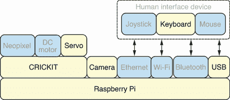
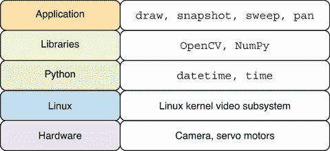
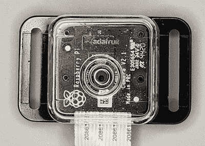
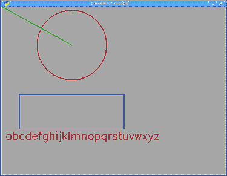
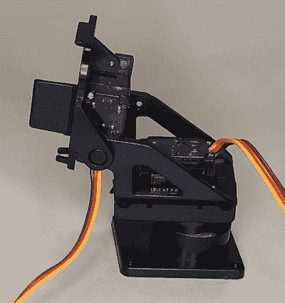

# 8 键盘控制相机

本章涵盖

+   从相机捕获图像和流式传输实时视频

+   使用 OpenCV 库绘制形状和写入文本

+   将伺服电机移动到特定的角度和位置

+   使用 OpenCV 中的键盘事件来控制伺服电机运动

在本章中，我们将构建一个带有两个伺服电机连接相机的机器人。一个伺服电机将允许我们平移相机，另一个将应用倾斜运动。这样，我们可以将相机指向许多不同的方向。此外，我们将检测和使用键盘事件来在不同方向上移动电机，并从实时相机流中捕获和保存照片。

我们已经探讨了在移动设备上使用触摸屏和操纵杆作为人机交互设备。现在，我们将使用键盘来控制我们的机器人运动和相机。键盘是最古老和最成熟的输入设备之一。与操纵杆相比，它们随每台台式计算机和笔记本电脑一起提供，并且在大多数软件中都有出色的内置支持，不需要额外的工作。这使得它们在不想添加额外的硬件要求或只想简化设备处理时成为操纵杆的绝佳替代品。

## 8.1 硬件堆栈

图 8.1 显示了硬件堆栈，本章中使用的特定组件被突出显示。相机可以直接通过相机连接器连接到 Raspberry Pi。本章中使用的相机是 Raspberry Pi Camera Module 2。



图 8.1 硬件堆栈：相机和伺服电机将通过键盘进行控制。

伺服电机是 Pan-Tilt 套件的一部分，该套件已完全组装。相机将安装在此套件上。有关机器人组装的更多详细信息，请参阅附录 C 中的机器人组装指南。它展示了如何组装本章中使用的机器人。此外，在购买本章所需的硬件之前，请务必查阅附录 A 中的硬件购买指南。任何键盘都可以用于机器人；无论是 USB 键盘还是蓝牙键盘，都没有特殊要求。

## 8.2 软件堆栈

本章中使用的特定软件的详细信息在图 8.2 中描述。本章中的`draw`和`snapshot`应用程序将使用 OpenCV 和 NumPy 库从相机捕获图像，并在图像上绘制形状和写入文本。我们还将学习如何使用 OpenCV 库读取键盘事件，并在检测到特定键盘事件时执行拍照等操作。OpenCV 库将用于与 Linux 内核视频子系统交互，以从相机硬件捕获图像。`sweep`和`pan`应用程序将在本章的后面部分介绍，并将允许我们控制伺服电机硬件，以及使用相机拍照。



图 8.2 软件堆栈：OpenCV 库将捕获相机图像。

## 8.3 使用 OpenCV 捕获图像

OpenCV 是一个非常流行且功能强大的计算机视觉库。我们将使用它来与相机交互，显示实时视频流并保存快照。在后面的章节中，我们将扩展我们的使用范围，以执行人脸检测和二维码检测与解码。我们需要创建一个满足以下要求的应用程序：

+   应该创建一个使用 OpenCV 库显示来自相机的实时视频流的 Python 应用程序。

+   当用户按下空格键时，应该能够保存带有时间戳的快照图像。

+   每次保存图像时，应显示一条文本消息。

+   应用程序应该在按下 Esc 键或字母 Q 时终止。

我们创建这个应用程序是为了放置一些基本的组件，我们可以使用这些组件来构建更复杂的应用程序。与来自相机的实时视频交互将使我们接触到相机帧率，并为从实时视频流中进行人脸和二维码检测做准备。使用 OpenCV 执行所有这些操作是战略性的，因为它是 Python 中计算机视觉的首选库。

### 8.3.1 探索 OpenCV 库

要在 OpenCV 中使用相机，我们首先必须在 Raspberry Pi 上启用旧版相机支持。在终端中使用`raspi-config`并启用 Legacy

在界面选项菜单中的相机选项。图 8.3 显示了一台放置在 Adafruit 相机外壳中的 Raspberry Pi 相机的照片，以保护它并使其更容易连接到机器人。



图 8.3 Raspberry Pi 相机：相机被封装在 Adafruit 相机外壳中。

OpenCV 库大量使用 Python NumPy 库。NumPy 用户指南([`numpy.org/doc/stable/user/`](https://numpy.org/doc/stable/user/))是一个优秀的资源，提供了关于安装程序的详细信息。根据指南，在安装 NumPy 之前需要安装`libatlas-base-dev`包。OpenCV 需要`libgtk2.0-dev`包来支持其图形界面功能。运行以下命令来安装这两个包：

```
$ sudo apt install libatlas-base-dev libgtk2.0-dev
```

我们现在可以使用以下命令安装 OpenCV：

```
$ ~/pyenv/bin/pip install opencv-python
```

同一个命令也会自动安装 NumPy，因为它是 OpenCV 的辅助工具。OpenCV 有一个庞大的代码库，它在 Raspberry Pi 上的安装可能需要长达 70 分钟才能完成；在执行安装时请记住这一点。

我们现在可以直接进入 REPL 会话并开始与 OpenCV 和相机交互。我们首先导入`cv2`，并使用`0`作为参数调用`VideoCapture`以打开默认相机。我们将`VideoCapture`对象保存在名为`cap`的变量中：

```
>>> import cv2
>>> cap = cv2.VideoCapture(0)
```

我们可以通过调用`isOpened`方法来检查相机是否正确初始化并且是打开的。如果相机正确初始化，它将返回`True`：

```
>>> cap.isOpened()
True
```

我们还可以查询与视频捕获设备相关的不同属性。以下会话显示，要捕获的图像大小设置为宽度`640`和高度`480`。我们还可以检查视频的帧率，在我们的情况下设置为每秒 30 帧：

```
>>> cap.get(cv2.CAP_PROP_FRAME_WIDTH)
640.0
>>> cap.get(cv2.CAP_PROP_FRAME_HEIGHT)
480.0
>>> cap.get(cv2.CAP_PROP_FPS)
30.0
```

接下来，我们调用`read`方法来抓取和解码下一个视频帧。它将返回两个值。第一个是一个布尔值，表示调用是否成功。第二个值是图像本身。通过检查`ret`的值，我们可以看到调用是成功的。如果我们检查`frame`的数据类型，我们会看到它报告为`numpy .ndarray`。这种数据结构是 NumPy 的核心，它提供了一个执行非常高效的 n 维数组数据类型：

```
>>> ret, frame = cap.read()
>>> ret
True
>>> type(frame)
<class 'numpy.ndarray'>
```

无论何时我们在 OpenCV 中处理图像，我们都会使用`ndarray`对象。有一些有用的属性我们可以检查，以获取有关我们刚刚捕获的图像的更多详细信息。`shape`属性显示，正如预期的那样，我们的图像高度为`480`，宽度为`640`。显示`3`的最后部分表示它是一个彩色图像，并具有三个颜色组件：红色、绿色和蓝色。`dtype`表示数组中每个项的数据类型。`uint8`数据类型表明每个值是一个 8 位整数，这与每个颜色组件的值范围从 0 到 255 相关：

```
>>> frame.shape
(480, 640, 3)
>>> frame.dtype
dtype('uint8')
```

现在，我们可以通过调用`imwrite`方法并传入我们的文件名来将图像数据保存到磁盘。此方法将使用文件扩展名来编码图像数据为预期的图像格式。接下来，我们将在当前目录中找到一个名为`photo.jpg`的图像，这是从相机捕获的快照：

```
>>> cv2.imwrite('photo.jpg', frame)
True
```

当我们完成与摄像头的操作后，通过调用`release`方法以平稳的方式关闭视频流总是一个好主意。当我们关闭捕获设备后调用`isOpened`时，我们可以看到视频流状态已关闭：

```
>>> cap.release()
>>> cap.isOpened()
False
```

这使我们接触到了 OpenCV 和 NumPy。我们能够熟悉使用 OpenCV 捕获图像所需的核心对象和操作。

### 8.3.2 使用 OpenCV 绘制形状和显示文本

在执行如人脸检测等计算机视觉活动时，能够绘制形状，如矩形，覆盖已检测图像的精确部分是非常有用的。在图像上放置文本是另一种常见的绘图操作，用于显示消息。我们将编写一个脚本，调用 OpenCV 的主要绘图函数，并演示它们的使用。首先，我们从 Python 标准库中导入`string`模块，我们将使用它来显示小写字母。然后我们导入`cv2`和`numpy`模块：

```
import string
import numpy as np
import cv2
```

接下来，我们定义三个常量颜色，用于绘制我们的形状。在大多数系统中，颜色由它们的红色、绿色和蓝色元素表示。大多数系统使用 RGB 编码，并且需要记住，OpenCV 中的默认颜色编码是 BGR：

```
BLUE = (255, 0, 0)
GREEN = (0, 255, 0)
RED = (0, 0, 255)
```

要创建一个新的图像，我们调用 `np.zeros`，这将创建一个新的 `ndarray` 对象，填充为零值。当图像的所有颜色分量都为零值时，颜色将是黑色。数组的 `shape` 与我们从摄像头捕获的图像所使用的相同。这个数组是一个宽度为 `640` 和高度为 `480` 的黑色 BGR 图像：

```
img = np.zeros(shape=(480, 640, 3), dtype=np.uint8)
```

我们现在可以开始在图像上绘制形状。下一行将绘制一个半径为 100 px 的红色圆圈，圆心位于 `(x, y)` 坐标 `(200, 110)`：

```
cv2.circle(img, center=(200, 110), radius=100, color=RED)
```

接下来，我们从图像的左上角 `(0, 0)` 开始绘制一条绿色线条到圆的中心 `(200, 110)`：

```
cv2.line(img, pt1=(0, 0), pt2=(200, 110), color=GREEN)
```

然后我们调用 `rectangle` 在圆下方绘制一个蓝色矩形框，一个角在 `(50, 250)`，另一个角在 `(350, 350)`。这创建了一个宽度为 `300` 和高度为 `100` 的矩形框：

```
cv2.rectangle(img, pt1=(50, 250), pt2=(350, 350), color=BLUE)
```

最后，我们将通过调用 `putText` 函数在图像上放置一些文本。我们将使用 `FONT_HERSHEY_SIMPLEX` 字体在位置 `(10, 380)` 以正常比例和红色显示小写字母的字母表：

```
text = string.ascii_lowercase
font = cv2.FONT_HERSHEY_SIMPLEX
pos = (10, 380)
cv2.putText(img, text, org=pos, fontFace=font, fontScale=1, color=RED)
```

脚本的最后两行将显示图像，并在退出应用程序之前等待按键：

```
cv2.imshow('preview', img)
cv2.waitKey()
```

完整的脚本可以保存为 `draw.py` 在 Pi 上，然后执行。

图 8.1 `draw.py`：使用 OpenCV 绘制不同大小和位置的形状

```
#!/usr/bin/env python3
import string
import numpy as np
import cv2

BLUE = (255, 0, 0)
GREEN = (0, 255, 0)
RED = (0, 0, 255)

img = np.zeros(shape=(480, 640, 3), dtype=np.uint8)

cv2.circle(img, center=(200, 110), radius=100, color=RED)
cv2.line(img, pt1=(0, 0), pt2=(200, 110), color=GREEN)
cv2.rectangle(img, pt1=(50, 250), pt2=(350, 350), color=BLUE)

text = string.ascii_lowercase
font = cv2.FONT_HERSHEY_SIMPLEX
pos = (10, 380)
cv2.putText(img, text, org=pos, fontFace=font, fontScale=1, color=RED)

cv2.imshow('preview', img)
cv2.waitKey()
```

此脚本将创建一个窗口，因此需要在支持创建图形窗口的环境中运行。OpenCV 支持三种选项：

+   在连接了键盘、鼠标和显示器的桌面环境中直接在 Raspberry Pi 上运行脚本。

+   使用 VNC 观察器远程通过 VNC 运行脚本。

+   使用 SSH X11 转发远程运行脚本，命令为 `ssh robo@robopi -X`。

有多种方式运行这些图形脚本非常方便，因为你可以选择最适合你手头硬件和软件的方法。图 8.4 显示了脚本生成的窗口和图像的外观。



图 8.4 绘制形状：OpenCV 支持在图像上绘制形状和文本。

现在我们已经掌握了使用 OpenCV 绘制形状的基础，我们可以继续进行下一个任务。在接下来的几节中，我们将使用其中一些函数来帮助我们显示在应用程序中的文本，当我们进行快照时。

### 8.3.3 使用 OpenCV 拍照

我们现在已经探索得足够多，可以创建我们的相机应用程序，它将允许我们从实时摄像头视频流中拍摄照片快照。我们导入 `datetime` 来帮助我们生成带时间戳的文件名。我们还导入了 OpenCV 模块：

```
from datetime import datetime
import cv2
```

为了提高可读性，我们将 Esc 键的键码保存到一个名为`ESC_KEY`的常量中。我们还保存了蓝色的颜色码，并将我们将要使用的字体保存到`FONT`中。当我们在应用程序中显示文本消息时，我们将它们定位在左上角使用`TEXT_POS`。我们将以每秒 30 帧的默认帧率从摄像头捕获和显示图像。我们希望显示特定的帧数文本消息。我们将此设置保存到一个名为`MSG_FRAME_COUNT`的常量中。它设置为 10 帧，因此将显示消息三分之一秒：

```
ESC_KEY = 27
BLUE = (255, 0, 0)
FONT = cv2.FONT_HERSHEY_SIMPLEX
TEXT_POS = (10, 30)
MSG_FRAME_COUNT = 10
```

函数`main`是我们应用程序的核心。它以`VideoCapture`对象的形式打开默认摄像头，并将其保存在变量`cap`中。然后我们使用`assert`语句来确保摄像头被正确初始化；否则，我们以`'Cannot open camera'`消息退出。`assert`语句是确保程序中不同点满足某些条件的一种很好的方式：

```
def main():
    cap = cv2.VideoCapture(0)
    assert cap.isOpened(), 'Cannot open camera'
```

在同一个函数中，我们首先将`messages`变量初始化为一个空列表，该列表将存储要在应用程序中显示的任何文本消息。接下来，我们进入主事件循环，在每次循环中调用`waitKey`。在上一节中，我们不带参数调用它，因此它会无限期地等待直到按键。这里，我们调用它为`waitKey(1)`，这将使其等待 1 毫秒并返回。如果按下按键，它将返回按下的键的代码；否则，它将返回值`-1`。调用`waitKey`还起到了在窗口上获取和处理 GUI 事件的重要作用。我们使用 Python 的 walrus 操作符将返回值保存到变量`key`中。然后我们检查按下的键是否是 Esc 键或字母 Q。然后退出循环：

```
messages = []
while (key := cv2.waitKey(1)) not in [ord('q'), ESC_KEY]:
```

一旦进入事件循环，我们从摄像头捕获图像并将其保存到`frame`中。像之前一样，我们使用`assert`来确保`cap.read`的调用是成功的。如果按下空格键，我们调用`save_photo`函数来保存图像。然后我们调用`set_message`将应用程序中的文本消息设置为`'saving photo...'`。循环结束时，我们调用`show_image`来显示图像。当退出循环时，调用`cap.release`来关闭视频捕获流：

```
        ret, frame = cap.read()
        assert ret, 'Cannot read frame from camera'
        if key == ord(' '):
            save_photo(frame)
            set_message(messages, 'saving photo...')
        show_image(frame, messages)

    cap.release()
```

接下来，我们定义一个名为`save_photo`的函数，该函数接收一个名为`frame`的参数，其中包含图像数据。我们使用`datetime.now().isoformat()`生成一个时间戳，并将所有`':'`替换为`'.'`。这样做是为了避免在图像文件名中放置`:`字符。某些软件与包含冒号的文件名不兼容。然后我们调用`imwrite`将图像数据保存到当前目录，并使用带时间戳的文件名：

```
def save_photo(frame):
    stamp = datetime.now().isoformat().replace(':', '.')
    cv2.imwrite(f'photo_{stamp}.jpg', frame)
```

现在我们定义 `show_image` 以显示在 `messages` 中给定文本的消息。如果 `messages` 中有任何文本项，它们将通过调用 `pop` 从列表中删除，并使用 `putText` 在图像上显示。然后，通过调用 `imshow` 显示图像：

```
def show_image(frame, messages):
    if messages:
        cv2.putText(frame, messages.pop(), TEXT_POS, FONT, 1, BLUE)
    cv2.imshow('preview', frame)
```

函数 `set_message` 将在下面定义。它将接受参数 `text` 并将 `messages` 列表的内容设置为重复 10 次的 `text` 值列表，正如在 `MSG_FRAME_COUNT` 变量中定义的那样。这将显示该消息文本 10 帧。

```
def set_message(messages, text):
    messages[:] = [text] * MSG_FRAME_COUNT
```

完整的脚本可以保存为 Pi 上的 `snapshot.py` 并执行。

图 8.2 `snapshot.py`：在按下空格键时拍摄快照

```
#!/usr/bin/env python3
from datetime import datetime
import cv2

ESC_KEY = 27
BLUE = (255, 0, 0)
FONT = cv2.FONT_HERSHEY_SIMPLEX
TEXT_POS = (10, 30)
MSG_FRAME_COUNT = 10

def save_photo(frame):
    stamp = datetime.now().isoformat().replace(':', '.')
    cv2.imwrite(f'photo_{stamp}.jpg', frame)

def show_image(frame, messages):
    if messages:
        cv2.putText(frame, messages.pop(), TEXT_POS, FONT, 1, BLUE)
    cv2.imshow('preview', frame)

def set_message(messages, text):
    messages[:] = [text] * MSG_FRAME_COUNT

def main():
    cap = cv2.VideoCapture(0)
    assert cap.isOpened(), 'Cannot open camera'

    messages = []
    while (key := cv2.waitKey(1)) not in [ord('q'), ESC_KEY]:
        ret, frame = cap.read()
        assert ret, 'Cannot read frame from camera'
        if key == ord(' '):
            save_photo(frame)
            set_message(messages, 'saving photo...')
        show_image(frame, messages)

    cap.release()

if __name__ == "__main__":
    main()
```

当您运行此应用程序时，它将显示一个窗口，以每秒 30 帧的速度捕获并显示图像，这将创建一个实时视频流。您可以

在相机前挥动手臂来测试捕获和显示图像的应用程序的延迟和响应。然后，摆出不同的姿势并按下空格键来拍摄每个姿势的快照。您会发现每张照片都保存在您的当前目录中。然后，您可以通过按下键盘上的 Esc 键或 Q 键来退出应用程序。图 8.5 显示了在保存快照时快照应用程序的外观。


图 8.5 拍摄快照：在快照应用程序中显示照片预览。

## 8.4 使用伺服电机移动相机

我们现在将通过 OpenCV 从相机捕获图像，并通过 CRICKIT 库向伺服电机发出运动指令来结合 OpenCV 和 CRICKIT 库。我们需要创建一个满足以下要求的应用程序：

+   按下左键和右键将使用伺服电机在该方向平移相机。

+   按下上键和下键将使用伺服电机在该方向倾斜相机。

+   按下空格键将保存来自相机的快照图像。

+   应用程序中的移动和快照动作应显示为文本消息。

创建此应用程序将使我们能够将迄今为止使用的相机和电机库结合起来，创建一个应用程序，使我们能够通过键盘和电机控制相机指向的位置。我们可以实时预览相机所看到的内容，然后可以使用键盘保存来自相机的快照图像。

### 8.4.1 使用 CRICKIT 库探索伺服电机

伺服电机内部有一个直流电机。然而，它们还内置了一个传感器，可以检测它们的精确位置。因此，与我们在前几章中使用的直流电机不同，我们可以将伺服电机移动到精确的位置。这使得它们非常适合像机械臂这样的应用，你希望将机械臂移动到特定的位置。在本章中我们将使用的 Pan-Tilt Kit 就是这样的设备。

配有两个伺服电机。图 8.6 显示了 Pan-Tilt Kit 的照片。将相机连接到套件后，我们将能够将相机移动到许多不同的方向。底部的伺服电机将使相机左右移动，而顶部的伺服电机将使相机上下倾斜。通过这种方式，我们可以使用电机将相机指向许多不同的方向。当相机连接时，移动伺服电机在其完整运动范围内可能会很困难，因为相机有一条带子，它不一定总是足够长，以适应套件可能到达的所有位置。因此，在第一次尝试套件提供的完整运动范围时，移除相机是一个好主意。



图 8.6 Adafruit Pan-Tilt Kit：套件包含两个伺服电机。

我们可以使用读取-评估-打印循环（REPL）直接进入 CRICKIT 库。我们首先导入`crickit`模块：

```
>>> from adafruit_crickit import crickit
```

将用于平移套件的伺服电机连接到第一个伺服连接，并使用`crickit.servo_1`来访问。我们通过设置我们想要定位的角度来移动伺服电机。默认情况下，CRICKIT 库将伺服电机的最低角度或位置设置为`0`度，最高设置为`180`度。我们可以通过设置`angle`的值来设置伺服电机的位置。在 REPL 中运行以下代码来将伺服电机移动到最低角度：

```
>>> crickit.servo_1.angle = 0
```

现在我们可以通过将值设置为`90`来将电机移动到中间位置：

```
>>> crickit.servo_1.angle = 90
```

如果我们将值设置为`180`，伺服电机将移动到其最高位置：

```
>>> crickit.servo_1.angle = 180
```

如果我们测量物理伺服电机实际移动的距离，我们会看到它不是`180`度。我们使用的平移伺服电机的实际范围是从`0`度到`142`度。CRICKIT 库有一个功能，我们可以设置软件层面的实际真实世界值。一旦我们这样做，我们在软件中设置的角值将匹配真实世界的角值。我们现在将伺服电机移动回最低位置，然后使用以下行设置伺服电机的动作范围：

```
>>> crickit.servo_1.angle = 0
>>> crickit.servo_1.actuation_range = 142
```

我们可以将伺服电机再次移动到最低、中间和最高角度：

```
>>> crickit.servo_1.angle = 0
>>> crickit.servo_1.angle = 142
>>> 142/2
71.0
>>> crickit.servo_1.angle = 71
```

然而，如果我们尝试设置超出动作范围的值，库将引发一个`ValueError`异常来阻止我们：

```
>>> crickit.servo_1.angle = 180
Traceback (most recent call last):
  File "<stdin>", line 1, in <module>
  File "/home/robo/pyenv/lib/python3.9/site-packages/adafruit_motor/servo.py", line 136, in angle
    raise ValueError("Angle out of range")
ValueError: Angle out of range
>>> 
```

我们也可以移动另一个伺服电机来控制相机的倾斜位置。最低的倾斜位置与`180`的最高角度值相关。运行以下行来设置此位置：

```
>>> crickit.servo_2.angle = 180
```

将相机向上指的最高倾斜位置与角度值`90`相关联：

```
>>> crickit.servo_2.angle = 90
```

与平移不同，倾斜的范围更有限，我们不需要为它设置一个动作范围。我们现在有足够的信息来编写一个脚本，使我们的伺服电机在不同方向上移动。

深入了解：伺服电机

CRICKIT 板支持许多不同的伺服电机。它可以同时连接多达四个不同的伺服电机。它在连接伺服电机的类型上非常灵活，因为它支持任何 5V 供电的伺服电机。Adafruit 在线商店在其商店的伺服电机部分提供了一系列伺服电机（[`adafruit.com/category/232`](https://adafruit.com/category/232)）。书中使用的 Pan-Tilt 套件中包含的两个伺服电机被称为微型伺服电机。它们比其他伺服电机更小、功率更低。伺服电机的强度由伺服扭矩等级指定。一些标准伺服电机可能比微型伺服电机多出超过一倍的功率。根据伺服电机必须携带或推动的重量，你可能需要获得更大、更强大的伺服电机。

Adafruit 网站上的《电机选择指南》（[`mng.bz/YRRB`](http://mng.bz/YRRB)）是了解伺服电机工作原理的绝佳资源。它还提供了关于不同伺服电机尺寸、扭矩和速度等级的详细信息。

### 8.4.2 执行俯仰和倾斜扫描

最终，我们希望用键盘的方向键来控制伺服电机的俯仰和倾斜运动。为了朝那个方向移动，我们需要将上下移动请求转换为倾斜伺服电机的相关角度变化。同样，为了在俯仰伺服电机的左右移动上做同样的事情，我们将创建一个脚本，它发出四个方向的大量移动命令，然后将它们转换为所需的伺服角度变化。首先，我们导入`crickit`模块来控制伺服电机和`time`模块来在移动之间暂停：

```
from adafruit_crickit import crickit
import time
```

我们使用`ANGLE_STEP`来控制每次移动将引起的角度变化量。然后我们定义`PAN`和`TILT`作为每个伺服电机的数据结构。每个都是一个`dict`，使用`servo`来引用其相关的伺服电机，`min`来控制允许的最小角度，`max`来设置允许的最大电机。在`dict`中，`start`的值将在应用程序启动时将伺服电机放置在该角度，`range`将用于设置该伺服电机的驱动范围。`MOVE`将每个四个运动映射到相关的伺服电机和该伺服电机的移动方向：

```
ANGLE_STEP = 2
PAN = dict(servo=crickit.servo_1, min=30, max=110, start=70, range=142)
TILT = dict(servo=crickit.servo_2, min=90, max=180, start=180, range=180)
MOVE = dict(left=(PAN, -1), right=(PAN, 1), up=(TILT, -1), down=(TILT, 1))
```

当脚本开始时，我们调用`init_motors`来设置每个电机的驱动范围并将电机定位在指定的起始角度：

```
def init_motors():
    for motor in [PAN, TILT]:
        motor['servo'].actuation_range = motor['range']
        motor['servo'].angle = motor['start']
```

我们现在定义了`move_motor`，它将使用四种接受的运动之一被调用。然后，它将使用`MOVE`字典来查找相关的伺服电机和`factor`来设置角度变化的方向。接下来，我们计算`new_angle`，它表示新的角度。然后我们检查新角度是否在定义的`min`和`max`范围内。如果新角度是允许的，我们将通过设置相关伺服电机的`angle`值来应用它：

```
def move_motor(direction):
    motor, factor = MOVE[direction]
    new_angle = motor['servo'].angle + (ANGLE_STEP * factor)
    if motor['min'] <= new_angle <= motor['max']:
        motor['servo'].angle = new_angle
```

`main`函数首先调用`init_motors`来初始化每个电机的驱动范围和起始位置。然后我们进入一个循环，进行 20 次迭代，每次使相机向左和向上移动。我们在每个循环中打印出我们动作的详细信息，然后在执行下一次动作迭代前暂停 0.1 秒。同样的循环风格再次执行，但这次是向右和向下移动：

```
def main():
    init_motors()

    for i in range(20):
        print('moving left and up')
        move_motor('left')
        move_motor('up')
        time.sleep(0.1)

    for i in range(20):
        print('moving right and down')
        move_motor('right')
        move_motor('down')
        time.sleep(0.1)
```

完整的脚本可以保存为`pan.py`在 Pi 上，然后执行。

图 8.3 `pan.py`：使用伺服电机执行水平和倾斜运动

```
#!/usr/bin/env python3
from adafruit_crickit import crickit
import time

ANGLE_STEP = 2
PAN = dict(servo=crickit.servo_1, min=30, max=110, start=70, range=142)
TILT = dict(servo=crickit.servo_2, min=90, max=180, start=180, range=180)
MOVE = dict(left=(PAN, -1), right=(PAN, 1), up=(TILT, -1), down=(TILT, 1))

def move_motor(direction):
    motor, factor = MOVE[direction]
    new_angle = motor['servo'].angle + (ANGLE_STEP * factor)
    if motor['min'] <= new_angle <= motor['max']:
        motor['servo'].angle = new_angle

def init_motors():
    for motor in [PAN, TILT]:
        motor['servo'].actuation_range = motor['range']
        motor['servo'].angle = motor['start']

def main():
    init_motors()

    for i in range(20):
        print('moving left and up')
        move_motor('left')
        move_motor('up')
        time.sleep(0.1)

    for i in range(20):
        print('moving right and down')
        move_motor('right')
        move_motor('down')
        time.sleep(0.1)

if __name__ == "__main__":
    main()
```

当我们执行这个脚本时，它将运行伺服运动的演示。第一组动作将使相机向左和向上移动 20 次，直到达到我们为水平移动设定的最大位置。然后，我们将向右和向下移动 20 次，回到起始位置。以下会话显示了脚本生成的输出：

```
$ pan.py 
moving left and up
moving left and up
moving left and up
...
moving right and down
moving right and down
moving right and down
```

现实世界中的机器人：机械臂

伺服电机是机械臂的核心。机械臂由多个关节组成，这赋予了机械臂完全的自由运动。本章中的伺服电机使相机能够向任何方向进行水平和倾斜。在机械臂的情况下，不同关节上的四个伺服电机就足以使机械臂具有全范围的移动能力。

英特尔关于机械臂的文章([`mng.bz/G99v`](http://mng.bz/G99v))涵盖了使用机械臂在不同行业中的许多好处，从制造业到农业。由于软件中缺乏计算机视觉，旧的机械臂在应用上受到了限制。这意味着机械臂只能拾取放置在精确位置且具有特定方向的物品。将机器人技术与强大的计算机视觉软件相结合，使机器人能够检测物体的位置并适应不同的方向。机器人和计算机视觉的应用是相辅相成的，以创造更多样化的机器人解决方案。

### 8.4.3 同时控制伺服电机和相机

我们现在可以将所有工作整合在一起，创建一个最终的应用程序，使我们能够使用键盘移动相机并在命令下拍照。我们首先导入所需的模块。我们使用`datetime`来处理时间戳，就像之前一样，使用`cv2`与相机和键盘一起工作，以及`crickit`模块来控制伺服电机。我们将能够通过从我们的`snapshot`和`pan`模块中导入所需函数来重用本章中编写的功能：

```
from datetime import datetime
import cv2
from adafruit_crickit import crickit
from snapshot import save_photo, show_image, set_message
from pan import move_motor, init_motors
```

`ESC_KEY`值是 Esc 键的键码，就像我们之前看到的那样。`ARROW_KEYS`字典将用于将箭头键的键码映射到它们相关的键名。键的名称也直接与我们的四个支持的动作相对应：

```
ESC_KEY = 27
ARROW_KEYS = {81: 'left', 82: 'up', 83: 'right', 84: 'down'}
```

`handle_key` 函数将处理发生的任何按键事件。如果按下的键是空格键，则将调用 `save_photo` 函数以保存快照。如果按下了箭头键之一，则将调用 `move_motor` 函数，并带有按下的相关键名。处理完这些按键事件后，将调用 `set_message` 函数来更新应用程序中显示的文本消息：

```
def handle_key(key, frame, messages):
    if key == ord(' '):
        save_photo(frame)
        set_message(messages, 'saving photo...')
    elif key in ARROW_KEYS.keys():
        move_motor(ARROW_KEYS[key])
        set_message(messages, f'moving {ARROW_KEYS[key]}...')
```

最后，`main` 函数将首先调用 `init_motors` 来初始化伺服电机。然后，将创建视频捕获设备，并初始化 `messages` 列表。此时，我们进入主事件循环，该循环将一直持续到按下 Esc 或 Q 键。在每次循环中，将从相机捕获一帧，并调用 `handle_key` 来处理任何键盘事件。循环的最后部分是调用 `show_image` 来显示最新捕获的图像和任何文本消息。当退出此循环时，将调用 `cap.release` 来释放视频捕获设备：

```
def main():
    init_motors()
    cap = cv2.VideoCapture(0)
    assert cap.isOpened(), 'Cannot open camera'

    messages = []
    while (key := cv2.waitKey(1)) not in [ord('q'), ESC_KEY]:
        ret, frame = cap.read()
        assert ret, 'Cannot read frame from camera'
        handle_key(key, frame, messages)
        show_image(frame, messages)

    cap.release()
```

完整的脚本可以保存为 Pi 上的 `servocam.py` 并执行。

图 8.4 `servocam.py`：使用键盘控制相机位置

```
#!/usr/bin/env python3
from datetime import datetime
import cv2
from adafruit_crickit import crickit
from snapshot import save_photo, show_image, set_message
from pan import move_motor, init_motors

ESC_KEY = 27
ARROW_KEYS = {81: 'left', 82: 'up', 83: 'right', 84: 'down'}

def handle_key(key, frame, messages):
    if key == ord(' '):
        save_photo(frame)
        set_message(messages, 'saving photo...')
    elif key in ARROW_KEYS.keys():
        move_motor(ARROW_KEYS[key])
        set_message(messages, f'moving {ARROW_KEYS[key]}...')

def main():
    init_motors()
    cap = cv2.VideoCapture(0)
    assert cap.isOpened(), 'Cannot open camera'

    messages = []
    while (key := cv2.waitKey(1)) not in [ord('q'), ESC_KEY]:
        ret, frame = cap.read()
        assert ret, 'Cannot read frame from camera'
        handle_key(key, frame, messages)
        show_image(frame, messages)

    cap.release()

main()
```

当我们运行此脚本时，云台伺服将移动到起始位置。现在您可以按左右箭头键来平移相机。按上下键将相机上下倾斜。尝试将相机平移和倾斜到最远可接受的位置。脚本将检测并安全地到达这些极限，而不会超出允许的伺服角度。在不同的角度按空格键以在不同相机位置拍摄快照。图 8.7 显示了当相机倾斜向上移动时显示的消息。


图 8.7 移动相机：当执行相机移动操作时显示文本消息。

通过创建此应用程序，我们学习了如何响应键盘事件来控制我们的机器人电机和相机硬件，执行电机运动，并使用不同的键盘控制键从相机捕获图像。

深入了解：机器人运动学

随着您创建包含许多作为机器人臂关节的伺服电机的机器人项目，机器人运动学的领域变得越来越重要。通过创建一个包含机器人臂中每个连杆的长度以及每个关节位置的模式，我们可以计算出将每个伺服设置到什么角度，以将机器人臂移动到不同的位置。

前向运动学通过获取每个伺服关节的角度，然后计算伺服臂将放置的位置来工作。逆运动学通过取机器人臂的期望末端位置并计算将手臂移动到该位置所需的关节运动来反向工作。

伊利诺伊大学香槟分校的《机器人系统指南》([`motion.cs.illinois.edu/RoboticSystems`](https://motion.cs.illinois.edu/RoboticSystems))提供了关于机器人运动学的优秀参考资料。第五章和第六章专门讨论了正向和逆向运动学。这些计算背后的数学方程式通过详细的机器人臂视觉图进行展示。

运动学的一个有趣应用是创建一种名为 SCARA 机器人的机器人，它只能在 X-Y 方向上移动。这种限制使得运动学计算更简单，并且需要更少的伺服电机来创建一个功能性的机器人。Instructables 网站上的 SCARA 机器人项目([`mng.bz/z00B`](http://mng.bz/z00B))使用本书中介绍过的伺服电机来创建这个机器人。仅需要两个伺服电机来在 X-Y 方向上移动机械臂。一个额外的伺服电机用于降低和提升笔进行绘图操作。

## 摘要

+   在相机上执行倾斜运动的专用伺服电机。

+   OpenCV 库用于与 Linux 内核视频子系统交互。

+   NumPy 库中的数据结构在 OpenCV 库中被广泛使用。

+   在图像上放置文本是 OpenCV 应用程序中常见的绘图操作之一，用于显示消息。

+   Raspberry Pi 相机将以默认的每秒 30 帧的帧率捕获视频图像。

+   与直流电机不同，由于它们的硬件传感器，我们可以将伺服电机移动到精确的位置。
