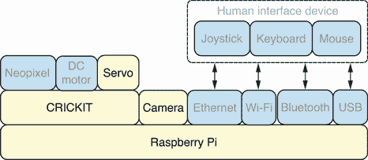
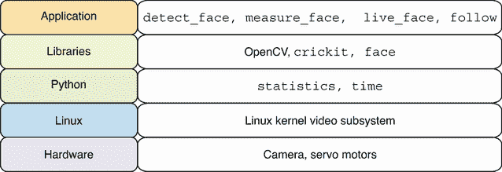
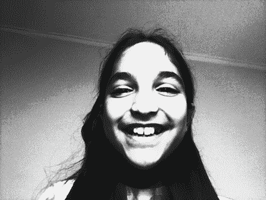
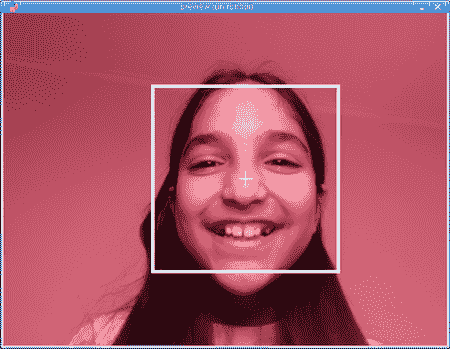
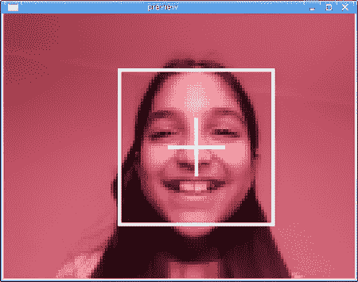
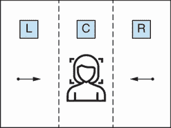
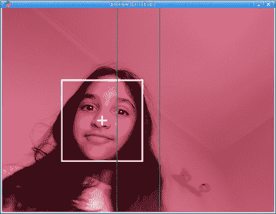

# 9 面部跟随相机

本章涵盖

+   使用 OpenCV 库在图像中检测面部

+   测量和优化面部检测性能

+   在实时视频中执行面部检测

+   使用伺服电机制作面部跟随相机

本章将首先展示如何使用 OpenCV 库在图像中检测面部。然后，我们将扩展这一功能以检测实时视频流中的面部，并测量和优化我们的面部检测过程。一旦我们建立了快速的面部检测机制，我们将创建一个应用程序在实时视频流中执行面部检测。本章的最后部分包括创建一个可以检测面部运动并使用电机将相机移动到检测到的面部方向的应用程序。面部检测是一个要求较高的计算机视觉活动，使用机器学习来检测面部。

机器学习在人工智能领域发挥着重要作用，并在机器人学中有许多应用。在本章中，我们将创建一个机器人，它根据从相机接收到的图像输入数据中的面部来使用电机移动其相机。这是一种强大的技术，可以扩展到许多可以自动对环境中的事件做出反应并采取行动的机器人。有许多自主机器人系统是通过获取机器人接收的传感器输入来创建的，它们使用机器学习来决定机器人应该采取哪些行动来实现其目标。这些包括从食物配送到建筑，机器人执行诸如砌砖等复杂任务。

## 9.1 硬件栈

图 9.1 显示了硬件栈，本章中使用的特定组件被突出显示。机器人将使用伺服电机将连接的相机移动到检测到的面部方向。根据检测到的面部是在相机的左侧还是右侧，伺服电机将移动电机以面向面部。本章的初始应用将专注于使用相机硬件执行面部检测，稍后，相关的伺服运动将被添加到机器人功能中。



图 9.1 硬件栈：将使用伺服电机将相机移动到检测到的面部。

## 9.2 软件栈

本章中使用的特定软件的详细信息在图 9.2 中描述。我们通过创建 `detect_face` 应用程序开始本章，该应用程序将使用 OpenCV 库在单个图像上执行人脸检测。然后，我们使用 `measure_face` 脚本和 `statistics` 以及 `time` 模块来测量人脸检测过程的性能。一旦我们应用了一些性能提升，我们将创建 `face` 库，它可以执行快速的人脸检测，从而使 `live_face` 应用程序成为可能。`live_face` 应用程序在实时视频流中执行人脸检测。本章以 `follow` 应用程序结束，该应用程序通过移动伺服电机来跟踪人脸运动。我们将使用 Linux 视频子系统和摄像头硬件进行人脸检测。`crickit` 库将用于控制伺服电机。



图 9.2 软件堆栈：OpenCV 库将用于执行人脸检测。

## 9.3 在图像中检测人脸

第一步是在单个图像上执行人脸检测。我们需要创建一个满足以下要求的 Python 应用程序：

+   OpenCV 计算机视觉库应用于检测图像中的人脸位置。

+   应用程序应能够围绕检测到的人脸绘制矩形并在其中心放置标记。

+   应计算并返回人脸中心的 `x,y` 坐标。

计算人脸中心的最终要求将在本章的后续部分非常有用，因为我们将会用它来决定伺服电机移动的方向。

### 9.3.1 探索人脸检测

OpenCV 文档（[`docs.opencv.org/4.x/`](https://docs.opencv.org/4.x/））是一个极好的资源，提供了关于人脸检测等常见主题的良好教程。在 Python 教程部分，它提到人脸检测由 `objdetect` 模块涵盖。具体来说，关于 `objdetect` 级联分类器的教程详细解释了理论以及 OpenCV 中的人脸检测应用。

OpenCV 使用基于 Haar 特征的级联分类器进行人脸检测。这种方法使用机器学习从大量正负人脸图像中训练级联函数。正图像包含人脸，而负图像中没有人脸。一旦函数被训练，我们就可以使用它来检测我们提供的任何图像中的人脸。

预训练模型作为 OpenCV 库的一部分提供，可以直接使用。这些模型是可以在 OpenCV 安装的数据目录中找到的 XML 文件。我们可以开始使用这些模型，并在读取-评估-打印循环（REPL）中执行人脸检测。第一步是导入 `cv2` 包：

```
>>> import cv2
```

要定位 OpenCV 安装路径，我们可以检查 `__path__` 属性：

```
>>> cv2.__path__
['/home/robo/pyenv/lib/python3.9/site-packages/cv2']
```

`__path__`属性提供了`cv2`包的位置列表。列表中的第一个项目是我们感兴趣的。我们可以将其保存到`CV2_DIR`变量中，以供进一步使用：

```
>>> CV2_DIR = cv2.__path__[0]
>>> CV2_DIR
'/home/robo/pyenv/lib/python3.9/site-packages/cv2'
```

现在我们可以计算用于人脸检测的模型 XML 文件的路径，并将其保存到名为`CLASSIFIER_PATH`的变量中：

```
>>> CLASSIFIER_PATH = f'{CV2_DIR}/data/haarcascade_frontalface_default.xml'
```

我们现在可以使用`CascadeClassifier`函数从模型文件创建一个分类器。创建后，我们将分类器保存到名为`face_classifier`的变量中：

```
>>> face_classifier = cv2.CascadeClassifier(CLASSIFIER_PATH)
```

这个分类器可以用于在图像中检测人脸。让我们来试一试这个分类器，开始检测人脸。用相机拍摄一张人脸照片，并将图像保存为`photo.jpg`，与 REPL 会话所在的目录相同。我们可以使用`imread`函数打开这张图像：

```
>>> frame = cv2.imread('photo.jpg')
```

如预期，当我们检查图像的`shape`属性时，我们可以看到图像的分辨率为 640 x 480 像素，每个像素有三个颜色分量。图 9.3 显示了我们在本 REPL 会话中使用的图像：

```
>>> frame.shape
(480, 640, 3)
```


图 9.3 人脸图像：使用树莓派相机拍摄的人脸图像。

我们的分类器将检查图像不同区域中的像素强度。为此，你希望图像以灰度图像的形式表示，而不是彩色。我们可以通过调用`cvtColor`将我们的彩色图像转换为灰度图像：

```
>>> gray = cv2.cvtColor(frame, cv2.COLOR_BGR2GRAY)
```

如果我们检查新`gray`图像的`shape`属性，我们可以看到它不再具有每个像素的三个颜色分量。相反，它有一个表示像素强度的单一值，范围从`0`到`255`，表示从`0`的黑色，然后是灰度的更高值，一直到`255`的白色。

```
>>> gray.shape
(480, 640)
```

在人脸检测之前，我们将在图像上执行的第二个操作是直方图均衡化。这个操作提高了图像的对比度，从而提高了人脸检测的准确性。我们将准备好的图像保存到名为`clean`的变量中。图 9.4 显示了应用直方图均衡化后结果的图像。

```
>>> clean = cv2.equalizeHist(gray)
```



图 9.4 均衡直方图：直方图均衡化后图像的对比度得到改善。

我们现在可以在我们的分类器上调用`detectMultiScale`方法，该方法将在我们的图像上执行人脸检测，并将检测结果作为检测到的人脸列表返回：

```
>>> faces = face_classifier.detectMultiScale(clean)
```

当我们检查`faces`的长度时，我们可以看到图像中成功检测到了一个单独的人脸：

```
>>> len(faces)
1
```

检查`faces`显示，对于每个检测到的人脸，都提供了一组与该检测到的人脸相关的值。每组值与一个匹配的矩形相关：

```
>>> faces
array([[215, 105, 268, 268]])
```

我们可以将第一个检测到的人脸的矩形值保存到变量中，表示矩形的左上角坐标`x, y`，以及表示矩形宽度和高度的变量`w,` `h`：

```
>>> x, y, w, h = faces[0]
```

我们可以看到匹配人脸的左上角位于坐标`(215, 105)`：

```
>>> x, y
(215, 105)
```

我们现在已经有了足够的东西来构建我们的第一个面部检测应用程序。让我们将所学的一切整合到一个脚本中，以便在图像中检测面部。

深入学习：使用 OpenCV 进行机器学习

OpenCV 文档有一个全面的机器学习概述([`docs.opencv.org/4.x/dc/dd6/ml_intro.html`](https://docs.opencv.org/4.x/dc/dd6/ml_intro.html))，这是一个深入了解 OpenCV 中机器学习主题的绝佳起点。

机器学习的核心是使用训练数据构建和训练模型，这些模型可以基于该数据做出预测。一旦这些训练模型就位，我们可以向它们提供算法之前未见过的新的数据，它们可以根据数据做出预测。在本章中，我们使用了一个在一系列面部图像上训练的模型来检测新图像中面部存在和位置。

另一个计算机视觉应用是对手写数字执行 OCR（光学字符识别）。OpenCV 项目有 5,000 个手写数字的样本，可以用作训练数据来训练我们的模型。k 最近邻算法可以用来训练我们的模型，然后使用它们来识别图像中的数字。在 OpenCV 文档的 Python 教程的机器学习部分有一个关于此的极好示例。

### 9.3.2 标记检测到的面部

我们将创建一个脚本，用于在图像上执行面部检测，并在匹配的面部周围绘制矩形。我们还将计算匹配矩形的中心，并在中心点放置一个标记。一旦我们完成检测和形状绘制，我们将在我们的图形应用程序中显示最终图像。第一步将是导入`cv2`库：

```
import cv2
```

蓝色的值保存在变量`BLUE`中，`cv2`库的位置保存在`CV2_DIR`中。现在我们可以使用`CV2_DIR`设置我们的`CLASSIFIER_PATH`。然后我们的面部分类器在`face_classifier`中创建并保存：

```
BLUE = (255, 0, 0)
CV2_DIR = cv2.__path__[0]
CLASSIFIER_PATH = f'{CV2_DIR}/data/haarcascade_frontalface_default.xml'
face_classifier = cv2.CascadeClassifier(CLASSIFIER_PATH)
```

`prep_face`函数将通过将其转换为灰度并应用直方图均衡化来准备图像以进行面部检测。然后返回准备好的图像：

```
def prep_face(frame):
    gray = cv2.cvtColor(frame, cv2.COLOR_BGR2GRAY)
    return cv2.equalizeHist(gray)
```

我们将定义`get_center`来计算矩形的中心坐标。我们可以用它来计算检测到的面部的中心。该函数接收与矩形相关的标准值，然后返回一个`x,y`坐标对作为中心点：

```
def get_center(x, y, w, h):
    return int(x + (w / 2)), int(y + (h / 2))
```

`detect_face` 函数接收一个图像并返回匹配面部的中心坐标。它首先调用 `prep_face` 函数来准备图像以便面部检测，然后调用 `detectMultiScale` 函数在图像中检测面部。如果找到面部，我们将第一个匹配面部的矩形值保存到变量 `x`、`y`、`w`、`h` 中。然后，我们计算面部的中心并保存此值到 `center`。使用 `rectangle` 函数在面部周围绘制矩形，并使用 `drawMarker` 函数在面部中心放置标记。最后，返回面部中心的坐标：

```
def detect_face(frame):
    clean = prep_face(frame)
    faces = face_classifier.detectMultiScale(clean)
    if len(faces) > 0:
        x, y, w, h = faces[0]
        center = get_center(x, y, w, h)
        cv2.rectangle(frame, (x, y), (x + w, y + h), BLUE, 2)
        cv2.drawMarker(frame, center, BLUE)
        return center
```

`main` 函数将我们的面部图像加载到名为 `frame` 的变量中。然后调用 `detect_face` 函数执行面部检测，并将面部中心保存到 `center` 变量中。这些坐标被打印出来，并使用 `imshow` 显示面部图像。调用 `waitKey` 函数显示图像，直到在应用程序中按下键：

```
def main():
    frame = cv2.imread('photo.jpg')
    center = detect_face(frame)
    print('face center:', center)
    cv2.imshow('preview', frame)
    cv2.waitKey()
```

完整脚本可以保存为 `detect_face.py` 在 Pi 上，然后执行。

列表 9.1 `detect_face.py`：检测面部并标记匹配面部

```
#!/usr/bin/env python3
import cv2

BLUE = (255, 0, 0)
CV2_DIR = cv2.__path__[0]
CLASSIFIER_PATH = f'{CV2_DIR}/data/haarcascade_frontalface_default.xml'
face_classifier = cv2.CascadeClassifier(CLASSIFIER_PATH)

def get_center(x, y, w, h):
    return int(x + (w / 2)), int(y + (h / 2))

def prep_face(frame):
    gray = cv2.cvtColor(frame, cv2.COLOR_BGR2GRAY)
    return cv2.equalizeHist(gray)

def detect_face(frame):
    clean = prep_face(frame)
    faces = face_classifier.detectMultiScale(clean)
    if len(faces) > 0:
        x, y, w, h = faces[0]
        center = get_center(x, y, w, h)
        cv2.rectangle(frame, (x, y), (x + w, y + h), BLUE, 2)
        cv2.drawMarker(frame, center, BLUE)
        return center

def main():
    frame = cv2.imread('photo.jpg')
    center = detect_face(frame)
    print('face center:', center)
    cv2.imshow('preview', frame)
    cv2.waitKey()

main()
```

当此脚本运行时，它将在 `photo.jpg` 图像上执行面部检测，并在检测到的面部周围绘制匹配的矩形和标记。图 9.5 显示了应用程序完成面部检测并在匹配面部周围绘制形状后的样子。



图 9.5 面部检测：矩形和标记显示了检测到的面部位置。

现在我们已经为图像中的面部检测打下了基础，我们可以继续进行在实时视频流中进行面部检测的激动人心的任务。

## 9.4 在实时视频中检测面部

在实时视频中检测面部的方法与在单个图像中检测面部的方法类似。主要区别在于，为了跟上实时视频流的速率，面部检测的性能要求更高。我们需要创建一个满足以下要求的 Python 应用程序：

+   应在从相机视频流捕获的每一帧上执行面部检测。

+   面部检测的速度应足够快，以跟上相机的帧率。

+   在应用程序中，实时视频流应显示任何检测到的面部，使用匹配的矩形和标记显示。

当前的首要任务是衡量我们的面部检测性能，看看它是否执行得足够快，能够跟上我们从视频流中接收到的图像速率。

### 9.4.1 测量面部检测性能

从前一章我们知道，我们的相机将以每秒 30 帧的速度捕获图像。我们需要面部检测过程运行得比这个帧率快，以便它能跟上视频流的速率。我们将创建一个脚本来执行多次面部检测，然后报告面部检测达到的平均帧率。

导入`cv2`库以执行人脸检测。导入`mean`函数以计算平均帧率。将使用`time`模块来测量人脸检测操作的执行时间：

```
import cv2
from statistics import mean
import time
```

人脸检测的功能和过程与`detect_face.py`脚本中使用的相同。我们将使用`get_detect_timing`函数来测量人脸检测的执行时间。这个函数记录开始时间，然后调用`detect_face`函数。最后，它计算经过的时间（以秒为单位）并返回该值：

```
def get_detect_timing(frame):
    start = time.perf_counter()
    center = detect_face(frame)
    return time.perf_counter() - start
```

我们的`main`函数将像以前一样打开`photo.jpg`图像，并将其保存到`frame`中。然后我们调用`detect_face`并打印出匹配人脸中心的坐标。接下来，我们重复调用`get_detect_timing`以捕获 10 次执行时间的样本。我们取这个样本的平均值，计算并报告平均每秒帧数。在每次人脸检测中，我们使用`frame.copy()`来提供每次人脸检测的干净副本：

```
def main():
    frame = cv2.imread('photo.jpg')
    center = detect_face(frame.copy())
    print('face center:', center)
    stats = [get_detect_timing(frame.copy()) for i in range(10)]
    print('avg fps:', 1 / mean(stats))
```

完整脚本可以保存为`measure_face.py`在 Pi 上，然后执行。

列表 9.2 `measure_face.py`：测量人脸检测性能

```
#!/usr/bin/env python3
import cv2
from statistics import mean
import time

BLUE = (255, 0, 0)
CV2_DIR = cv2.__path__[0]
CLASSIFIER_PATH = f'{CV2_DIR}/data/haarcascade_frontalface_default.xml'
face_classifier = cv2.CascadeClassifier(CLASSIFIER_PATH)

def get_center(x, y, w, h):
    return int(x + (w / 2)), int(y + (h / 2))

def prep_face(frame):
    gray = cv2.cvtColor(frame, cv2.COLOR_BGR2GRAY)
    return cv2.equalizeHist(gray)

def detect_face(frame):
    clean = prep_face(frame)
    faces = face_classifier.detectMultiScale(clean)
    if len(faces) > 0:
        x, y, w, h = faces[0]
        center = get_center(x, y, w, h)
        cv2.rectangle(frame, (x, y), (x + w, y + h), BLUE, 2)
        cv2.drawMarker(frame, center, BLUE)
        return center

def get_detect_timing(frame):
    start = time.perf_counter()
    center = detect_face(frame)
    return time.perf_counter() - start

def main():
    frame = cv2.imread('photo.jpg')
    center = detect_face(frame.copy())
    print('face center:', center)
    stats = [get_detect_timing(frame.copy()) for i in range(10)]
    print('avg fps:', 1 / mean(stats))

main()
```

当运行此脚本时，它将在`photo.jpg`图像上执行人脸检测。检测到的脸中心的坐标将在终端中打印出来。然后，我们测量检测人脸所需时间的 10 个样本。基于这些样本的平均值，计算并报告帧率。我们可以看到报告的帧率为每秒 10.1 帧，远低于我们需要的每秒 30 帧：

```
$ measure_face.py 
face center: (349, 239)
avg fps: 10.104761447758944
```

现在我们已经量化了我们的人脸检测性能，我们可以看到存在性能问题，我们可以着手提高我们的人脸检测过程的性能，以便我们可以满足，并希望超过每秒 30 帧的要求。

### 9.4.2 减少处理像素的数量

我们的人脸检测操作不需要大图像就能准确检测人脸。如果我们用较小的图像调用我们的面部分类器，它将处理更少的像素，并更快地返回结果。因此，我们将采取的策略是在一个被调整得小得多的图像上执行人脸检测，这样处理速度就会更快。

我们将图像调整到原始图像大小的 20%。通过实验我们可以发现，如果这个值显著小于 10%，它将影响检测精度。我们将看到将值设置为 20%符合我们的性能需求，并且处于安全范围内。

我们可以打开一个 REPL 会话并做一些计算，以了解通过这种缩放我们减少了图像中像素数量的多少。我们的 20%缩放相当于将图像的宽度和高度减少了 5 倍。我们可以通过以下计算轻松地看到这一点：

```
>>> 1/5
0.2
```

捕获的图像宽度为`640`，高度为`480`。我们可以通过以下计算来计算缩小后的图像的高度和宽度：

```
>>> 640/5
128.0
>>> 480/5
96.0
```

我们可以看到，调整大小后的图像宽度将为`128`，高度为`96`。现在我们可以计算原始图像和调整大小后的图像中的像素总数：

```
>>> 640*480
307200
>>> 128*96
12288
```

现在，我们可以将这两个像素计数相除，以找出我们减少了多少像素总数：

```
>>> 307200/12288
25.0
```

我们通过 25 倍的因素减少了需要处理的像素总数。这大大减少了需要处理的数据量，应该会显著提高处理速度。图 9.6 显示了将两个图像并排放置时图像尺寸的显著差异。我们可以通过将宽度和高度的缩放因子平方来交叉检查此图：

```
>>> 5*5
25
25.0
```

如预期，它产生了 25 倍的缩放因子。


图 9.6 图像缩小：将原始图像和缩小后的图像并排放置以进行比较。

我们可以将较小的图像通过我们的面部检测脚本运行来检查结果。图 9.7 显示该图像明显像素化，但这并不影响面部检测过程。



图 9.7 在较小图像上的检测：对于分辨率较低的图像，面部检测是成功的。

现在我们已经完成了初始计算，我们可以继续实现我们应用程序的新快速版本。

### 9.4.3 优化面部检测性能

此实现将在前一个基础上构建，并主要添加图像缩小步骤以提高性能。首先，我们将导入`cv2`库以执行面部检测：

```
import cv2
```

缩放因子保存在`DETECT_SCALE`变量中：

```
DETECT_SCALE = 0.2
```

`resize`函数接收图像和期望的缩放比例，以调整图像大小并返回新的较小图像。图像的新宽度和高度基于提供的`scale`计算，并保存在`size`中。然后对图像调用`cv2.resize`函数。OpenCV 文档（[`docs.opencv.org/4.x`](https://docs.opencv.org/4.x)）中关于`resize`函数的说明提供了在缩小图像时使用`INTER_AREA`插值以及在放大图像时使用`INTER_CUBIC`插值的指导。我们正在缩小图像，因此我们使用`INTER_AREA`：

```
def resize(img, scale):
    size = (int(img.shape[1] * scale), int(img.shape[0] * scale))
    return cv2.resize(img, size, interpolation=cv2.INTER_AREA)
```

`detect_face`函数现在有了性能提升。在调用`prep_face`之后，在面部检测之前调用`resize`以创建一个较小的图像。然后使用`small`调用`detectMultiScale`。当返回矩形值时，我们将它们除以`DETECT_SCALE`，以便可以将它们再次映射到原始全分辨率图像上。这样，我们可以在全尺寸原始图像上显示检测到的面部细节，同时通过在较小的图像上进行面部检测来获得性能提升。其余的代码保持不变：

```
def detect_face(frame):
    clean = prep_face(frame)
    small = resize(clean, DETECT_SCALE)
    faces = face_classifier.detectMultiScale(small)
    if len(faces) > 0:
        x, y, w, h = [int(i / DETECT_SCALE) for i in faces[0]]
        center = get_center(x, y, w, h)
        cv2.rectangle(frame, (x, y), (x + w, y + h), BLUE, 2)
        cv2.drawMarker(frame, center, BLUE)
        return center
```

该库可以保存为`face.py`在 Pi 上，以便其他应用程序导入。

列表 9.3 `face.py`：提供快速面部检测库

```
import cv2

BLUE = (255, 0, 0)
CV2_DIR = cv2.__path__[0]
CLASSIFIER_PATH = f'{CV2_DIR}/data/haarcascade_frontalface_default.xml'
face_classifier = cv2.CascadeClassifier(CLASSIFIER_PATH)
DETECT_SCALE = 0.2

def resize(img, scale):
    size = (int(img.shape[1] * scale), int(img.shape[0] * scale))
    return cv2.resize(img, size, interpolation=cv2.INTER_AREA)

def get_center(x, y, w, h):
    return int(x + (w / 2)), int(y + (h / 2))

def prep_face(frame):
    gray = cv2.cvtColor(frame, cv2.COLOR_BGR2GRAY)
    return cv2.equalizeHist(gray)

def detect_face(frame):
    clean = prep_face(frame)
    small = resize(clean, DETECT_SCALE)
    faces = face_classifier.detectMultiScale(small)
    if len(faces) > 0:
        x, y, w, h = [int(i / DETECT_SCALE) for i in faces[0]]
        center = get_center(x, y, w, h)
        cv2.rectangle(frame, (x, y), (x + w, y + h), BLUE, 2)
        cv2.drawMarker(frame, center, BLUE)
        return center
```

要查看此库的实际效果，我们将创建一个新的脚本，该脚本将导入库并多次调用面部检测函数并测量其性能。我们首先导入`cv2`、`mean`和`time`，就像我们之前打开图像、计算平均值和测量执行时间一样。然后从我们的新`face`库中导入`detect_face`函数：

```
import cv2
from face import detect_face
from statistics import mean
import time
```

应用程序的其余部分具有与在`measure_face.py`脚本中创建的相同的功能，用于测量执行时间并报告达到的平均帧率。

完整脚本可以保存为`fast_face.py`在 Pi 上，然后执行。

列表 9.4 `fast_face.py`：报告快速面部检测函数的性能

```
#!/usr/bin/env python3
import cv2
from face import detect_face
from statistics import mean
import time

def get_detect_timing(frame):
    start = time.perf_counter()
    center = detect_face(frame)
    return time.perf_counter() - start

def main():
    frame = cv2.imread('photo.jpg')
    center = detect_face(frame.copy())
    print('face center:', center)
    stats = [get_detect_timing(frame.copy()) for i in range(10)]
    print('avg fps:', 1 / mean(stats))

main()
```

当运行此脚本时，它将调用我们新的更快面部检测实现。我们可以从结果中看到，我们已经实现了很大的性能提升，现在我们已经达到了每秒 75.6 帧的帧率。这给我们带来了比之前面部检测方法快七倍以上的性能提升：

```
$ fast_face.py 
face center: (347, 242)
avg fps: 75.63245789951259
```

这个帧率也远远超过了我们希望达到的每秒 30 帧的目标。现在我们可以继续使用这种新的改进方法在实时视频流中进行面部检测。

### 9.4.4 在实时视频中显示检测到的面部

在以下脚本中，我们将从摄像头视频流中捕获图像，然后在一个应用程序窗口中显示检测到的面部。导入`cv2`库以从摄像头视频流中捕获图像。导入`detect_face`函数以执行面部检测：

```
import cv2
from face import detect_face
```

如我们之前所做的那样，Esc 键的关键代码保存在`ESC_KEY`中。它将通过按下 Esc 键来退出图形应用程序：

```
ESC_KEY = 27
```

`main`函数将视频捕获对象保存到变量`cap`中。然后我们检查捕获设备是否正确打开。我们进入一个事件循环，直到按下 Esc 或 Q 键才退出循环。在每次循环迭代中，我们从视频流中捕获一帧，并在捕获的图像上调用`detect_face`函数。然后我们调用`imshow`来显示带有任何检测到的面部标记的捕获图像。当退出此循环时，通过调用`cap.release`函数释放视频捕获设备：

```
def main():
    cap = cv2.VideoCapture(0)
    assert cap.isOpened(), 'Cannot open camera'
    while cv2.waitKey(1) not in [ord('q'), ESC_KEY]:
        ret, frame = cap.read()
        assert ret, 'Cannot read frame from camera'
        detect_face(frame)
        cv2.imshow('preview', frame)
    cap.release()
```

完整脚本可以保存为`live_face.py`在 Pi 上，然后执行。

列表 9.5 `live_face.py`：在实时视频流中显示检测到的面部

```
#!/usr/bin/env python3
import cv2
from face import detect_face

ESC_KEY = 27

def main():
    cap = cv2.VideoCapture(0)
    assert cap.isOpened(), 'Cannot open camera'
    while cv2.waitKey(1) not in [ord('q'), ESC_KEY]:
        ret, frame = cap.read()
        assert ret, 'Cannot read frame from camera'
        detect_face(frame)
        cv2.imshow('preview', frame)
    cap.release()

main()
```

当运行此脚本时，它将不断从视频流中捕获图像。每个图像都通过我们的面部检测函数。如果检测到面部，则在检测到的面部周围绘制一个矩形，并在其中心放置一个标记。带有面部检测的视频流在应用程序窗口中显示，直到按下 Esc 键或 Q 键退出应用程序。


图 9.8 Pan-Tilt Kit 上的相机：相机安装在该套件上，以实现相机移动。

图 9.8 显示了相机安装到 Pan-Tilt Kit 上的样子。两个伺服电机使相机能够向不同方向移动。

在下一节中，我们将使用伺服电机将相机移动到检测到的人脸方向。

## 9.5 创建跟随人脸的机器人

现在我们能够快速检测人脸，足以处理实时视频，我们可以将我们的代码提升到下一个层次，并让机器人对你的面部位置做出反应。机器人将移动相机以跟随你的面部。我们需要创建一个满足以下要求的 Python 应用程序：

+   它应该能够识别人脸是否在画面左侧、中心或右侧被检测到。

+   当在左侧或右侧检测到人脸时，相机应该朝人脸移动。

+   在应用程序中，应该显示带有检测到的人脸标记的实时视频流以及显示三个区域（左、中、右）的网格。



图 9.9 相机区域：相机区域被分成三个检测区域。

在应用程序中显示这三个区域将使应用程序更具交互性，因为人们将能够告诉他们的面部被检测在哪个区域，以及相机将移动到哪个位置。

### 9.5.1 人脸检测分区

我们可以将机器人看到的区域分成三个区域或区域。当在中心区域检测到人脸时，我们不需要做任何事情，因为相机正对着人。如果人脸在左区检测到，那么我们将移动伺服器，使相机将人脸放置在中心区域。如果人脸在右区检测到，我们将再次移动伺服器，但方向相反。我们将只关注使用伺服电机的摆动运动来左右移动相机。图 9.9 显示了人脸检测的三个区域。

现在，让我们进入一个 REPL 会话，看看我们如何将相机观看区域分成这三个区域。首先，我们将导入`cv2`用于在图像上绘制和`numpy`用于创建一个新的空白图像：

```
>>> import cv2
>>> import numpy as np
```

我们将把相机图像的宽度和高度保存在变量`IMG_WIDTH`和`IMG_HEIGHT`中。这将使我们的代码更易于阅读：

```
>>> IMG_WIDTH = 640
>>> IMG_HEIGHT = 480
```

我们可以通过将`IMG_WIDTH`除以二来得到宽度的中心或中点：

```
>>> (IMG_WIDTH / 2)
320.0
```

现在，让我们将这个中心位置向左移动 50 像素，以获得左区和中心区之间的线条位置。我们将把这个值保存在一个名为`LEFT_X`的变量中：

```
>>> LEFT_X = int((IMG_WIDTH / 2) - 50)
>>> LEFT_X
270
```

从中心向右移动 50 像素，我们得到中心区和右区之间的线条位置。我们将这个值保存在`RIGHT_X`中：

```
>>> RIGHT_X = int((IMG_WIDTH / 2) + 50)
>>> RIGHT_X
370
```

我们可以将绿色的值保存在一个名为`GREEN`的变量中：

```
>>> GREEN = (0, 255, 0)
```

接下来，让我们创建一个具有我们所需尺寸的空白彩色图像：

```
>>> img = np.zeros(shape=(480, 640, 3), dtype=np.uint8)
```

我们可以通过围绕中心区绘制一个矩形来绘制显示三个区域的网格：

```
>>> cv2.rectangle(img, (LEFT_X, -1), (RIGHT_X, IMG_HEIGHT), GREEN)
```

最后一步是将我们创建的内容保存下来，以便我们可以看到图像。我们将使用 `imwrite` 将图像保存为文件名 `zones.jpg`：

```
>>> cv2.imwrite('zones.jpg', img)
```

图 9.10 显示了在绘制区域网格后图像将呈现的样子。中心区域被设置为比左右区域窄。这样，当面部在框架周围移动时，我们可以使相机对左右移动更加敏感。


图 9.10 区域网格：区域网格是通过矩形方法绘制的。

### 9.5.2 将电机移动以跟踪面部

现在，我们可以尝试编写脚本以跟踪人在相机视场内查看不同区域时的面部。我们可以基于上一节所做的实验进行构建。

我们导入 `cv2` 库以从相机捕获图像。导入 `detect_face` 函数，它将执行与之前所见相同的面部检测。最后，我们使用 `crickit` 模块来控制连接相机的伺服电机：

```
import cv2
from face import detect_face
from adafruit_crickit import crickit
```

接下来，我们定义 `ESC_KEY` 和 `GREEN` 以存储 Esc 键的键码和绿色值。图像的高度和宽度在 `IMG_WIDTH` 和 `IMG_HEIGHT` 中定义。然后我们计算 `LEFT_X` 和 `RIGHT_X` 的值，以帮助跟踪检测到的面部所在的区域：

```
ESC_KEY = 27
GREEN = (0, 255, 0)
IMG_WIDTH = 640
IMG_HEIGHT = 480
LEFT_X = int((IMG_WIDTH / 2) - 50)
RIGHT_X = int((IMG_WIDTH / 2) + 50)
```

正如我们在第八章中所做的那样，我们创建了一个名为 `PAN` 的变量来跟踪与执行水平移动的伺服电机相关的值。具体来说，我们保存了伺服电机的最小、最大和起始角度的引用。我们还在 `range` 中保存了激活范围设置。正如前一章所做的那样，我们在 `ANGLE_STEP` 中存储了每一步的角度变化值。我们使用 `MOVE` 将左侧、中央和右侧区域映射到它们相关的伺服电机运动：

```
PAN = dict(servo=crickit.servo_1, min=30, max=110, start=70, range=142)
ANGLE_STEP = 2
MOVE = dict(L=ANGLE_STEP, C=0, R=-ANGLE_STEP)
```

`get_zone` 函数将根据 `LEFT_X` 和 `RIGHT_X` 的值返回检测到的面部的区域：

```
def get_zone(face_x):
    if face_x <= LEFT_X:
        return 'L'
    elif face_x <= RIGHT_X:
        return 'C'
    else:
        return 'R'
```

`init_motors` 函数用于初始化伺服电机的起始位置和激活范围：

```
def init_motors():
    PAN['servo'].actuation_range = PAN['range']
    PAN['servo'].angle = PAN['start']
```

我们将使用 `move_motor` 函数根据检测到的面部位置移动伺服电机。我们首先通过调用 `get_zone` 计算区域。然后，我们查找角度变化并将其保存到 `change` 中。接下来，如果检测到变化且新角度在最小和最大角度范围内，我们应用新的角度：

```
def move_motor(face_x):
    zone = get_zone(face_x)
    change = MOVE[zone]
    if change and PAN['min'] <= PAN['servo'].angle + change <= PAN['max']:
        PAN['servo'].angle += change
```

当我们创建一个新的视频捕获对象时，我们调用 `check_capture_device` 来检查设备。我们检查它是否成功打开，以及捕获的图像的宽度和高度是否与我们的 `IMG_WIDTH` 和 `IMG_HEIGHT` 值匹配：

```
def check_capture_device(cap):
    assert cap.isOpened(), 'Cannot open camera'
    assert cap.get(cv2.CAP_PROP_FRAME_WIDTH) == IMG_WIDTH, 'wrong width'
    assert cap.get(cv2.CAP_PROP_FRAME_HEIGHT) == IMG_HEIGHT, 'wrong height'
```

`main` 函数首先调用 `init_motors` 来初始化伺服电机。然后我们创建一个视频捕获设备，并通过调用 `check_capture_device` 来检查它。接着我们进入一个事件循环，只有当按下 Esc 或 Q 键时才会退出。在每次循环中，我们从视频流中抓取一张图像并将其保存到 `frame` 中。然后我们调用 `detect_face` 来执行人脸检测，并返回到检测到的人脸中心位置。如果检测到人脸，我们使用检测到的人脸的 `x` 坐标调用 `move_motor`。然后我们通过调用 `cv2.rectangle` 并使用相关尺寸在图像上绘制我们的区域网格。循环的最后一步是通过调用 `imshow` 在应用程序中显示最新的视频帧。当我们退出循环时，我们调用 `cap.release` 来释放视频捕获设备：

```
def main():
    init_motors()
    cap = cv2.VideoCapture(0)
    check_capture_device(cap)
    while cv2.waitKey(1) not in [ord('q'), ESC_KEY]:
        ret, frame = cap.read()
        assert ret, 'Cannot read frame from camera'
        center = detect_face(frame)
        if center:
            move_motor(center[0])
        cv2.rectangle(frame, (LEFT_X, -1), (RIGHT_X, IMG_HEIGHT), GREEN)
        cv2.imshow('preview', frame)
    cap.release()
```

整个脚本可以保存为 `follow.py` 在 Pi 上，然后执行。

列表 9.6 `follow.py`：将摄像头移动到跟随检测到的人脸

```
#!/usr/bin/env python3
import cv2
from face import detect_face
from adafruit_crickit import crickit

ESC_KEY = 27
GREEN = (0, 255, 0)
IMG_WIDTH = 640
IMG_HEIGHT = 480
LEFT_X = int((IMG_WIDTH / 2) - 50)
RIGHT_X = int((IMG_WIDTH / 2) + 50)
PAN = dict(servo=crickit.servo_1, min=30, max=110, start=70, range=142)
ANGLE_STEP = 2
MOVE = dict(L=ANGLE_STEP, C=0, R=-ANGLE_STEP)

def get_zone(face_x):
    if face_x <= LEFT_X:
        return 'L'
    elif face_x <= RIGHT_X:
        return 'C'
    else:
        return 'R'

def move_motor(face_x):
    zone = get_zone(face_x)
    change = MOVE[zone]
    if change and PAN['min'] <= PAN['servo'].angle + change <= PAN['max']:
        PAN['servo'].angle += change

def init_motors():
    PAN['servo'].actuation_range = PAN['range']
    PAN['servo'].angle = PAN['start']

def check_capture_device(cap):
    assert cap.isOpened(), 'Cannot open camera'
    assert cap.get(cv2.CAP_PROP_FRAME_WIDTH) == IMG_WIDTH, 'wrong width'
    assert cap.get(cv2.CAP_PROP_FRAME_HEIGHT) == IMG_HEIGHT, 'wrong height'

def main():
    init_motors()
    cap = cv2.VideoCapture(0)
    check_capture_device(cap)
    while cv2.waitKey(1) not in [ord('q'), ESC_KEY]:
        ret, frame = cap.read()
        assert ret, 'Cannot read frame from camera'
        center = detect_face(frame)
        if center:
            move_motor(center[0])
        cv2.rectangle(frame, (LEFT_X, -1), (RIGHT_X, IMG_HEIGHT), GREEN)
        cv2.imshow('preview', frame)
    cap.release()

main()
```

当运行此脚本时，你可以对着摄像头看，在实时摄像头流中看到你的脸，并在检测到的人脸周围放置一个边界。人脸的中心也用十字线在实时图像上标记。从这个标记中，我们可以知道人脸位于哪个区域。如果你将人脸移出中心区域，伺服电机将自动重新定位摄像头，将你的脸放回这个区域。图 9.11 显示了一个在左侧区域被检测并标记的人脸，然后伺服电机移动摄像头将人脸放回中心区域。



图 9.11 区域人脸：人脸在左侧区域被检测并标记。

通过使用计算机视觉和面部跟踪，这个应用给了我们机会将机器学习应用到我们的机器人项目中。在接下来的章节中，我们将使用其他计算机视觉功能，如二维码检测，通过使用摄像头作为观察环境的方式，帮助我们的机器人与环境进行更深入的交互。

现实世界中的机器人：机器人视觉处理

机器人可以使用计算机视觉进行特征检测，以提取诸如物体的角和边缘等视觉特征。有了这种特征检测，机器人可以检测和分类它们在环境中看到的物体。

这种对象交互的一个应用是创建可以在制造和物流中拾取和放置物体的机器人。使用计算机视觉，它们识别一个物体，抓取它，然后将其从一个位置移动到另一个位置。

检查机器人是另一种将计算机视觉和机器人技术结合在一起的情况，以创建可以用于制造过程中的质量控制流程的机器人，以执行制造产品的完全自动化检查。

## 摘要

+   需要一个快速的人脸检测机制来在实时视频流中执行人脸检测。

+   伺服电机用于将连接的摄像头移动到检测到的人脸方向。

+   Haar 特征级联分类器在 OpenCV 中用于执行人脸检测。

+   直方图均衡化可以改善图像的对比度，有助于提高人脸检测的准确性。

+   被检测到的人脸周围将绘制一个匹配的矩形和标记。

+   人脸检测必须能够处理至少每秒 30 帧的相机图像速率，以便实时人脸识别能够工作。

+   使用较小图像调用人脸分类器可以使人脸检测更快。
