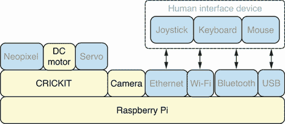
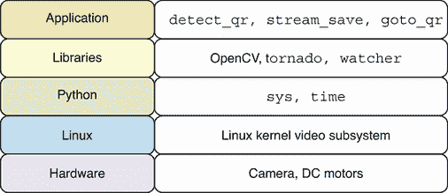
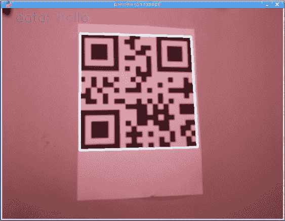
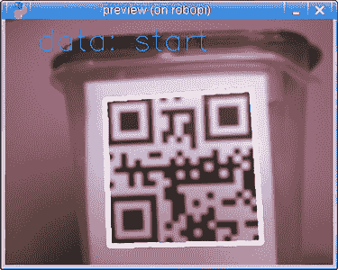
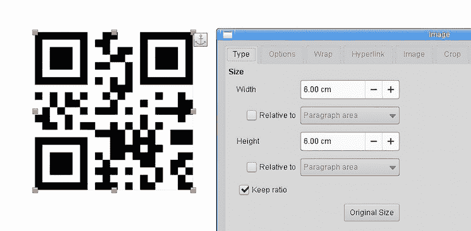
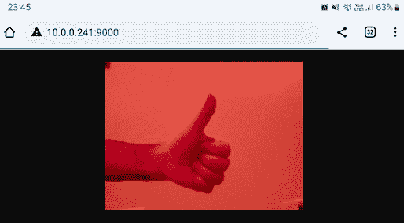
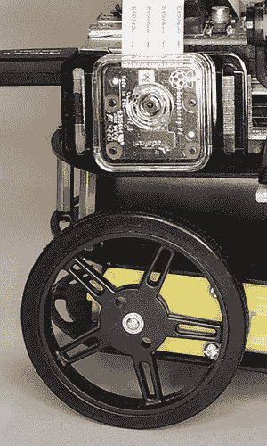

# 10 机器人二维码查找器

本章涵盖

+   生成二维码

+   检测和解码二维码中的数据

+   使用 Motion JPEG 流式传输实时视频

+   创建一个可以在其环境中搜索特定二维码的机器人

我们从探索二维码标准和学习如何生成我们自己的二维码开始本章。然后，我们使用 OpenCV 计算机视觉库在图像中检测二维码，以及读取二维码本身编码的数据。然后，我们将学习如何将来自相机的视频流数据保存到文件系统中，以便多个应用程序可以同时读取实时视频数据。这将允许我们检查我们感兴趣的二维码视频流，同时将视频流传输到桌面和 Web 应用程序。我们将使用 Tornado Web 框架创建一个 Motion JPEG 视频服务器，可以从网络上的任何移动设备或计算机访问，以获取机器人相机视频流的实时视图。最后，我们通过创建一个可以在其环境中寻找匹配二维码的机器人来结束本章。 

将所有这些技术结合起来，帮助我们解决机器人使用计算机视觉来调查其环境并在寻找匹配的二维码时移动到不同期望位置的问题。这对于许多必须在仓库或工厂中执行自主导航的机器人来说是一个核心功能。

## 10.1 硬件栈

图 10.1 显示了硬件栈，本章中使用的特定组件被突出显示。机器人将使用直流电机在一条设定的轨道上来回移动。相机安装在机器人的侧面，可以在机器人经过时捕捉到机器人旁边的物体。机器人将检查来自实时视频流的图像，寻找匹配的二维码。一旦找到代码，机器人就可以停止电机，因为它已经到达了期望的目的地。



图 10.1 硬件栈：相机将被用来捕捉用于二维码检测的实时图像。

关于机器人组装的更多细节，请查看附录 C 中的机器人组装指南。它展示了如何组装本章中使用的机器人。它还提供了如何为机器人创建轨道的技巧，以便它可以在一个受控路径上往返移动。

## 10.2 软件栈

本章中使用的特定软件的详细信息在图 10.2 中描述。我们首先创建了一个名为`detect_qr`的应用程序，该应用程序将使用 OpenCV 库在单个图像上执行二维码检测和解码。然后，我们将使用`stream_save`脚本来捕获视频流到文件系统。`watcher`库使用`sys`模块来读取命令行参数并监视流图像文件的变化。然后，我们为 Web 和图形应用程序创建流应用程序。我们通过在`goto_qr`应用程序中使用摄像头和直流电机硬件来移动机器人到由二维码标记的特定目标位置来结束本章。



图 10.2 软件栈：将使用 OpenCV 库来执行二维码检测。

## 10.3 在图像中检测二维码

第一步是在单个图像上执行二维码检测和解码。我们需要创建一个满足以下要求的 Python 应用程序：

+   应用程序应使用 OpenCV 计算机视觉库来检测图像中二维码的位置。

+   应在图像中检测到的二维码周围绘制一个矩形。

+   应用程序应解码并返回存储在二维码中的数据。

解码存储在二维码中的数据的最后要求将在本章的后面非常有帮助，因为我们将使用它来决定我们是否到达了期望的二维码，或者机器人是否应该继续沿着轨道移动。

### 10.3.1 探索二维码

我们二维码冒险的第一步是安装`qrcode`Python 包。此模块将使我们能够生成二维码。运行以下命令来安装包：

```
$ ~/pyenv/bin/pip install qrcode
```

此软件包可以在 Python 代码中导入或在命令行中直接执行。让我们首先在终端中生成一些二维码。当我们运行下一个命令时，将生成一个包含文本`hello`的二维码，并将其输出到我们的终端：

```
$ ~/pyenv/bin/qr hello
```

您可以使用智能手机扫描二维码来测试它。一旦扫描二维码，文本`hello`应出现在您的设备上。当我们运行下一个命令时，它将保存生成的二维码到图像而不是输出到终端：

```
$ ~/pyenv/bin/qr hello > hello.png
```

您可以打开`hello.png`图像并再次测试它。这是一种生成二维码的有用方法，因为我们可以将图像打印出来并将其粘贴到我们想要用二维码标记的对象上。图 10.3 显示了使用此命令生成的二维码。


图 10.3 生成的二维码：示例二维码中编码了文本`hello`。

接下来，我们将进入一个读取-评估-打印循环（REPL）会话，以探索从 Python 应用程序中使用该软件包。第一步是导入`qrcode`库：

```
>>> import qrcode
```

下一个步骤将创建一个包含文本`hi again`的二维码并将其保存到名为`hi_again.png`的图像中：

```
>>> qrcode.make('hi again').save('hi_again.png')
```

对于更高级的应用，我们使用一个`QRCode`对象。通过这个对象，我们可以设置与二维码的错误纠正、框大小和边框相关的不同选项。在下面的示例中，我们创建一个`QRCode`对象，并使用`add_data`方法设置二维码的内容：

```
>>> qr = qrcode.QRCode()
>>> qr.add_data('www.python.org')
```

接下来，我们调用`make`方法来生成二维码。一旦生成，我们可以获取有关生成的二维码的详细信息，例如使用的符号版本。在这个例子中，`version`属性报告二维码正在使用符号版本`1`：

```
>>> qr.make()
>>> qr.version
1
```

二维码标准的官方网站([`www.qrcode.com`](https://www.qrcode.com))提供了每个符号版本的确切细节以及它可以存储多少数据。本质上，你放入二维码中的数据越多，符号版本就越大，这反过来又生成一个更密集的二维码。在我们生成二维码图像时能够检查这个值是有用的，因为低版本号更稀疏，即使是在低分辨率图像中也会更容易阅读。我们 REPL 中的下一行将二维码保存到名为`python.png`的图像中：

```
>>> qr.make_image().save('python.png')
```

在大多数智能手机上，如果你读取这个二维码，它将从文本中被检测为一个 URL，并将你导向 Python 网站([`www.python.org`](https://www.python.org))。现在我们已经生成了一些二维码，让我们继续检测和解码它们。

### 10.3.2 标记检测到的二维码

我们将创建一个脚本来在图像上执行二维码检测和解码，然后围绕匹配的二维码绘制一个矩形。我们还将以文本形式在图像上显示解码的数据。然后，该图像将在我们的图形应用程序中显示。

取上节生成的包含文本`hello`编码的图像，并将其打印出来。然后，使用 Pi 相机拍照，并将图像保存到名为`hello.jpg`的文件中。你可以使用第八章中的`snapshot.py`应用程序来拍照。或者，`hello.jpg`图像也包含在本书 GitHub 仓库的该章节文件夹中。

第一步将是导入`cv2`库：

```
import cv2
```

蓝色的值保存在变量`BLUE`中，应用程序中显示文本的字体保存在`FONT`中。然后，我们实例化一个`QRCodeDetector`对象，并将其保存在`decoder`中。将调用此对象上的方法来执行二维码检测和解码：

```
BLUE = (255, 0, 0)
FONT = cv2.FONT_HERSHEY_SIMPLEX
decoder = cv2.QRCodeDetector()
```

`draw_box`函数将在图像中绘制一个围绕检测到的二维码的矩形。图像由`frame`参数提供，检测到的四边形的四个点由`points`提供。使用`color`和`thickness`参数设置框的颜色和粗细。首先将点值转换为整数，因为这是`cv2.line`函数所期望的。然后，我们将四边形的四个点分别保存到自己的变量中。接下来，我们绘制四条线来连接这四个点：

```
def draw_box(frame, points, color, thickness):
    points = [(int(x), int(y)) for x, y in points]
    pt1, pt2, pt3, pt4 = points
    cv2.line(frame, pt1, pt2, color, thickness)
    cv2.line(frame, pt2, pt3, color, thickness)
    cv2.line(frame, pt3, pt4, color, thickness)
    cv2.line(frame, pt4, pt1, color, thickness)
```

然后我们将定义`decode_qrcode`，它调用`detectAndDecode`方法来检测和解码`frame`图像中的 QR 码。解码的数据存储在变量`data`中，匹配点的列表存储在`matches`中。如果我们找到解码数据，我们使用`putText`将其显示为文本，并通过调用`draw_box`函数在匹配区域周围绘制一个框。我们最终通过返回解码数据来结束函数：

```
def decode_qrcode(frame):
    data, matches, _ = decoder.detectAndDecode(frame)
    if data:
        cv2.putText(frame, f'data: {data}', (30, 30), FONT, 1, BLUE)
        draw_box(frame, matches[0], BLUE, thickness=3)
    return data
```

`main`函数将我们的 QR 码照片加载到名为`frame`的变量中。然后调用`decode_qrcode`来执行 QR 码的检测和解码。解码的数据存储在名为`decoded_data`的变量中并打印出来。然后使用`imshow`显示图像。调用`waitKey`函数来显示图像，直到在应用程序中按下键：

```
def main():
    frame = cv2.imread('hello.jpg')
    decoded_data = decode_qrcode(frame)
    print('decoded_data:', repr(decoded_data))
    cv2.imshow('preview', frame)
    cv2.waitKey()
```

完整的脚本可以保存为`detect_qr.py`在 Pi 上，然后执行。

列表 10.1 `detect_qr.py`：在图像中检测和解码 QR 码

```
#!/usr/bin/env python3
import cv2

BLUE = (255, 0, 0)
FONT = cv2.FONT_HERSHEY_SIMPLEX
decoder = cv2.QRCodeDetector()

def draw_box(frame, points, color, thickness):
    points = [(int(x), int(y)) for x, y in points]
    pt1, pt2, pt3, pt4 = points
    cv2.line(frame, pt1, pt2, color, thickness)
    cv2.line(frame, pt2, pt3, color, thickness)
    cv2.line(frame, pt3, pt4, color, thickness)
    cv2.line(frame, pt4, pt1, color, thickness)

def decode_qrcode(frame):
    data, matches, _ = decoder.detectAndDecode(frame)
    if data:
        cv2.putText(frame, f'data: {data}', (30, 30), FONT, 1, BLUE)
        draw_box(frame, matches[0], BLUE, thickness=3)
    return data

def main():
    frame = cv2.imread('hello.jpg')
    decoded_data = decode_qrcode(frame)
    print('decoded_data:', repr(decoded_data))
    cv2.imshow('preview', frame)
    cv2.waitKey()

main()
```

当运行此脚本时，它将在`hello.jpg`图像上执行 QR 码检测，并在匹配的四边形周围绘制一个框。解码的数据也显示在图像的左上角。图 10.4 显示了应用程序完成 QR 码的检测和解码后的样子。



图 10.4 检测到的 QR 码：应用程序在检测到的 QR 码周围绘制一个框。

我们现在在 QR 码检测和解码方面有了坚实的基础。我们将有多个应用程序，它们都需要访问实时视频流。因此，下一步将是设计一个系统来捕获和分发来自实时视频流的图像到多个应用程序。

## 10.4 将实时视频流传输到多个应用程序

我们将通过将来自实时视频流的图像保存到文件系统来解决这个问题。然后，多个应用程序可以同时从文件系统中读取这些图像，并将它们用于流式传输到桌面或 Web 应用程序。我们可以使用相同的机制来检测实时流中的 QR 码并控制机器人的运动。我们需要创建一个满足以下要求的 Python 应用程序：

+   应该捕获并保存来自相机视频流的最新帧到文件系统。

+   应将帧保存到 ramdisk 中，以避免创建任何额外的磁盘工作负载。

+   应将图像数据保存为原子操作，以确保数据一致性。

第一步是创建一个应用程序，将视频流中的帧保存到文件系统。然后我们可以创建应用程序将视频流流式传输到桌面和 Web 应用程序。通过使用 ramdisk，我们将获得更好的 I/O 性能进行视频流传输，并且不会给试图从磁盘读取和写入的其他应用程序造成减速。

### 10.4.1 将视频流保存到 ramdisk

需要注意的是，机器人上的摄像头是倒置的，这样可以为摄像头连接器连接到树莓派腾出足够的空间。这将使得我们捕获的图像看起来是颠倒的。这个问题可以通过在软件中纠正图像方向并在捕获图像后翻转图像来解决。

导入 `cv2` 库以从视频流中捕获帧。导入 `os` 模块以便我们可以访问环境变量：

```
import os
import cv2
```

在 Linux 系统上默认创建了一个 ramdisk，我们可以通过读取 `XDG_RUNTIME_DIR` 环境变量的值来访问其位置。ramdisk 中的文件存储在内存中，而不是物理磁盘上。这样，我们可以像处理文件系统上的任何其他文件一样处理它们，但同时又不会对物理磁盘造成额外的负载。我们将图像放置在这个目录中，并使用 `IMG_PATH` 变量来跟踪其路径。在将其保存到最终位置之前，我们还需要将图像数据保存到位于 `TMP_PATH` 的临时文件中：

```
IMG_PATH = os.environ['XDG_RUNTIME_DIR'] + '/robo_stream.jpg'
TMP_PATH = os.environ['XDG_RUNTIME_DIR'] + '/robo_stream_tmp.jpg'
```

我们将捕获的图像尺寸设置为默认分辨率的二分之一。这将使得保存和流式传输的数据大小更小、更高效。图像仍然足够大，可以清楚地看到机器人看到的景象，以及准确地执行二维码检测和解码。我们将这些值保存到变量 `FRAME_WIDTH` 和 `FRAME_HEIGHT` 中：

```
FRAME_WIDTH = 320
FRAME_HEIGHT = 240
```

`init_camera` 函数用于创建视频捕获对象，并将视频捕获的尺寸设置为 `FRAME_WIDTH` 和 `FRAME_HEIGHT`。然后返回视频捕获对象：

```
def init_camera():
    cap = cv2.VideoCapture(0)
    assert cap.isOpened(), 'Cannot open camera'
    cap.set(cv2.CAP_PROP_FRAME_WIDTH, FRAME_WIDTH)
    cap.set(cv2.CAP_PROP_FRAME_HEIGHT, FRAME_HEIGHT)
    return cap
```

`save_frames` 函数进入一个无限循环，并在每个循环中从视频流中捕获一个帧。变量 `counter` 跟踪到目前为止捕获的帧数。我们将捕获的图像保存在 `frame` 中，然后通过调用 `cv2.flip` 翻转图像。我们使用 `imwrite` 将图像保存到我们的临时文件中。然后，我们调用 `os.replace` 将我们的临时文件放置在其最终目的地。这个调用在 Unix 操作系统（如 Linux）上保证是一个原子操作，我们的 Pi 正在运行这样的操作系统。然后，我们打印出到目前为止捕获的帧数。在打印输出时，我们使用回车符作为结束字符，以便在终端中更新同一行的帧计数器：

```
def save_frames(cap):
    counter = 0
    while True:
        counter += 1
        ret, frame = cap.read()
        assert ret, 'Cannot read frame from camera'
        frame = cv2.flip(frame, -1)
        cv2.imwrite(TMP_PATH, frame)
        os.replace(TMP_PATH, IMG_PATH)
        print('frames:', counter, end='\r', flush=True)
```

最后，我们以 `main` 函数结束，该函数首先初始化视频捕获设备，然后调用 `save_frames` 函数来保存视频流中的帧。我们使用 `finally` 确保在退出应用程序时释放视频捕获设备：

```
def main():
    cap = init_camera()
    try:
        save_frames(cap)
    finally:
        print('releasing video capture device...')
        cap.release()
```

完整的脚本可以保存为 `stream_save.py` 并在 Pi 上执行。

列表 10.2 `stream_save.py`：将捕获的视频帧保存到文件系统中

```
#!/usr/bin/env python3
import os
import cv2

IMG_PATH = os.environ['XDG_RUNTIME_DIR'] + '/robo_stream.jpg'
TMP_PATH = os.environ['XDG_RUNTIME_DIR'] + '/robo_stream_tmp.jpg'
FRAME_WIDTH = 320
FRAME_HEIGHT = 240

def save_frames(cap):
    counter = 0
    while True:
        counter += 1
        ret, frame = cap.read()
        assert ret, 'Cannot read frame from camera'
        frame = cv2.flip(frame, -1)
        cv2.imwrite(TMP_PATH, frame)
        os.replace(TMP_PATH, IMG_PATH)
        print('frames:', counter, end='\r', flush=True)

def init_camera():
    cap = cv2.VideoCapture(0)
    assert cap.isOpened(), 'Cannot open camera'
    cap.set(cv2.CAP_PROP_FRAME_WIDTH, FRAME_WIDTH)
    cap.set(cv2.CAP_PROP_FRAME_HEIGHT, FRAME_HEIGHT)
    return cap

def main():
    cap = init_camera()
    try:
        save_frames(cap)
    finally:
        print('releasing video capture device...')
        cap.release()

main()
```

这将连续捕获并保存视频流中的帧到 ramdisk。我们可以执行以下命令来列出我们的流图像的位置：

```
$ ls -alh $XDG_RUNTIME_DIR/robo_stream.jpg
-rw-r--r-- 1 robo robo 23K Mar 14 21:12 /run/user/1000/robo_stream.jpg
```

我们可以从输出中看到图像大小为 23K，文件位置为`/run/user/1000/robo_stream.jpg`。每次我们在图像查看器中打开此文件时，它都会显示相机捕获的最新图像。

深入了解：原子操作

原子操作是操作系统和数据库等软件中非常强大且有用的功能。当您有多个进程同时访问相同的数据时，它们尤其有用，并且您想确保在读写数据时不会遇到数据损坏。在我们的情况下，我们希望避免有流媒体应用程序读取尚未完全写入磁盘的图像数据。将这种半写入的图像数据读入我们的应用程序会导致它们失败。OSDev 网站有一个关于原子操作的优秀页面（[`wiki.osdev.org/Atomic_operation`](https://wiki.osdev.org/Atomic_operation)），从操作系统的角度来看。它是关于该主题的详细信息的好资源。

Python 的`os`模块文档（[`docs.python.org/3/library/os.html`](https://docs.python.org/3/library/os.html)）涵盖了我们在本节中使用的`os.replace`函数，该函数将图像数据作为原子操作写入磁盘。它提到，在遵循便携式操作系统接口（POSIX）标准的系统（如 Linux）上替换文件将是一个原子操作。

本章中采用的将数据写入临时文件然后重命名文件到最终目标的方法是许多应用程序（如文字处理器和网页浏览器）常用的非常常见的方法，以确保最终输出文件中的数据一致性。

### 10.4.2 监视文件系统更改

现在我们已经将视频流保存到文件系统中，我们可以读取这些实时视频图像并在不同的应用程序中显示它们。然而，为了做到这一点，我们需要一种机制，通过轮询文件系统，我们可以定期检查是否有新的图像可用。实现这一点的简单而有效的方法是检查图像文件的修改时间。每当它发生变化时，我们就知道有新的图像可供我们使用。为了帮助不同的应用程序执行此任务，我们将功能放入一个库中，它们都可以导入和使用。

`sys`模块将被用来读取命令行参数，而`time`模块将被用来在检查文件更改之间暂停。`getmtime`函数将给我们提供图像文件的修改时间：

```
import sys
import time
from os.path import getmtime
```

`FileWatcher` 类在创建新实例时接收要监视的 `path`，并将 `last_mtime` 属性初始化为 `None`。每次调用 `has_changed` 方法时，它都会获取正在监视的文件的当前修改时间，并返回自上次检查以来此值是否已更改：

```
class FileWatcher:
    def __init__(self, path):
        self.path = path
        self.last_mtime = None

    def has_changed(self):
        mtime = getmtime(self.path)
        last_mtime = self.last_mtime
        self.last_mtime = mtime
        return (mtime != last_mtime)
```

该库有一个 `main` 函数，可以用来测试 `FileWatcher` 类。它将第一个命令行参数保存到 `path` 变量中。然后，它创建一个 `FileWatcher` 实例来监视指定的路径。接下来，它以每秒 60 帧的速度循环 10 次，并检查文件是否有变化。在每次循环中，它都会打印出是否检测到变化：

```
def main():
    path = sys.argv[1]
    print('path:', path)
    watcher = FileWatcher(path)
    for i in range(10):
        print(i, watcher.has_changed())
        time.sleep(1 / 60)
```

完整脚本可以保存为 `watcher.py` 在 Pi 上，然后执行。

列表 10.3 `watcher.py`：监视文件变化

```
#!/usr/bin/env python3
import sys
import time
from os.path import getmtime

class FileWatcher:
    def __init__(self, path):
        self.path = path
        self.last_mtime = None

    def has_changed(self):
        mtime = getmtime(self.path)
        last_mtime = self.last_mtime
        self.last_mtime = mtime
        return (mtime != last_mtime)

def main():
    path = sys.argv[1]
    print('path:', path)
    watcher = FileWatcher(path)
    for i in range(10):
        print(i, watcher.has_changed())
        time.sleep(1 / 60)

if __name__ == "__main__":
    main()
```

在一个终端中，保持我们之前的 `stream_save.py` 运行，以便它持续将最新帧保存到 `robo_stream.jpg` 文件中。然后，在另一个终端中执行 `watcher.py` 脚本，并为其提供要监视的流图像。以下会话显示了脚本的执行和生成的输出：

```
$ watcher.py $XDG_RUNTIME_DIR/robo_stream.jpg
path: /run/user/1000/robo_stream.jpg
0 True
1 False
2 True
3 False
4 True
5 False
6 True
7 False
8 True
9 False
```

摄像机以每秒 30 帧的速度捕获图像，而我们以每秒 60 帧的速度轮询图像文件的变化。这会创建一个预期的模式，文件在已更改和未更改之间交替，以精确匹配从视频流中捕获的图像速率。

### 10.4.3 将流式传输发送到图形应用程序

在 `watcher` 库就绪后，我们可以继续创建一个使用它来监视流式图像变化并显示更新图像的图形应用程序。导入 `os` 模块以便我们可以访问环境变量。在应用程序中，将使用 `cv2` 模块显示图像，`FileWatcher` 将检测流式图像文件的变化：

```
import os
import cv2
from watcher import FileWatcher
```

`IMG_PATH` 变量指向流式图像文件路径。`ESC_KEY` 包含 Esc 键的键码值：

```
IMG_PATH = os.environ['XDG_RUNTIME_DIR'] + '/robo_stream.jpg'
ESC_KEY = 27
```

`main` 函数在变量 `watcher` 中创建一个 `FileWatcher` 对象，然后进入事件循环。事件循环将一直循环，直到按下 Esc 键或 Q 键。在每次循环周期中，通过调用 `has_changed` 方法检查图像文件是否有变化。如果检测到变化，则调用 `imread` 函数读取新的图像，然后调用 `imshow` 显示图像：

```
def main():
    watcher = FileWatcher(IMG_PATH)
    while cv2.waitKey(1) not in [ord('q'), ESC_KEY]:
        if watcher.has_changed():
            img = cv2.imread(IMG_PATH)
            cv2.imshow('preview', img)
```

完整脚本可以保存为 `stream_view.py` 在 Pi 上，然后执行。

列表 10.4 `stream_view.py`：在图形应用程序中显示视频流

```
#!/usr/bin/env python3
import os
import cv2
from watcher import FileWatcher

IMG_PATH = os.environ['XDG_RUNTIME_DIR'] + '/robo_stream.jpg'
ESC_KEY = 27

def main():
    watcher = FileWatcher(IMG_PATH)
    while cv2.waitKey(1) not in [ord('q'), ESC_KEY]:
        if watcher.has_changed():
            img = cv2.imread(IMG_PATH)
            cv2.imshow('preview', img)

main()
```

确保在另一个终端中运行`stream_save.py`。现在，当你运行`stream_view.py`时，你可以看到来自摄像头的实时视频流。与前面章节中的摄像头应用不同，你可以多次启动应用，每个应用将同时传输视频图像。如果你尝试使用第八章中的`snapshot.py`应用来做这件事，它会失败，因为你不能同时有多个应用直接从视频流中捕获帧。通过这种基于文件系统的视频流图像共享机制，我们可以安全地有任意多的应用访问并处理实时视频图像。图 10.5 显示了同时运行多个图形应用，并且能够同时传输相同的视频流。


图 10.5 图形应用视频流：多个窗口可以读取视频流。

由于我们已经在我们的图形应用中实现了视频流，我们现在可以尝试将二维码检测功能添加到我们的视频流应用中。

### 10.4.4 在视频流中检测二维码

下一个应用将允许我们在实时视频流中进行二维码检测。任何检测到的二维码都将标记在图像上，解码后的文本将在应用中显示。此应用本质上结合了`detect_qr.py`和`stream_view.py`脚本中的代码和逻辑。我们从`stream_view.py`脚本中导入并使用了相同的三个模块：

```
import os
import cv2
from watcher import FileWatcher
```

`IMG_PATH`和`ESC_KEY`变量来自`stream_view.py`，并具有相同的作用。`BLUE`和`FONT`变量将用于设置应用中绘图的颜色和字体。`decoder`对象将执行我们的二维码解码：

```
IMG_PATH = os.environ['XDG_RUNTIME_DIR'] + '/robo_stream.jpg'
ESC_KEY = 27
BLUE = (255, 0, 0)
FONT = cv2.FONT_HERSHEY_SIMPLEX
decoder = cv2.QRCodeDetector()
```

`main`函数的前四行与`stream_view.py`中的相同，将负责检测新图像和处理事件循环。一旦检测到新图像，就会调用`decode_qrcode`函数来解码二维码并在任何检测到的代码周围绘制一个框。`decode_qrcode`和`draw_box`函数与在`detect_qr.py`中定义的相同。函数的最后部分通过调用`cv2.imshow`来显示图像：

```
def main():
    watcher = FileWatcher(IMG_PATH)
    while cv2.waitKey(1) not in [ord('q'), ESC_KEY]:
        if watcher.has_changed():
            img = cv2.imread(IMG_PATH)
            decode_qrcode(img)
            cv2.imshow('preview', img)
```

完整脚本可以保存为 Pi 上的`stream_qr.py`并执行。

列表 10.5 `stream_qr.py`：在流媒体视频中检测二维码

```
#!/usr/bin/env python3
import os
import cv2
from watcher import FileWatcher

IMG_PATH = os.environ['XDG_RUNTIME_DIR'] + '/robo_stream.jpg'
ESC_KEY = 27
BLUE = (255, 0, 0)
FONT = cv2.FONT_HERSHEY_SIMPLEX
decoder = cv2.QRCodeDetector()

def draw_box(frame, points, color, thickness):
    points = [(int(x), int(y)) for x, y in points]
    pt1, pt2, pt3, pt4 = points
    cv2.line(frame, pt1, pt2, color, thickness)
    cv2.line(frame, pt2, pt3, color, thickness)
    cv2.line(frame, pt3, pt4, color, thickness)
    cv2.line(frame, pt4, pt1, color, thickness)

def decode_qrcode(frame):
    data, matches, _ = decoder.detectAndDecode(frame)
    if data:
        cv2.putText(frame, f'data: {data}', (30, 30), FONT, 1, BLUE)
        draw_box(frame, matches[0], BLUE, thickness=3)
    return data

def main():
    watcher = FileWatcher(IMG_PATH)
    while cv2.waitKey(1) not in [ord('q'), ESC_KEY]:
        if watcher.has_changed():
            img = cv2.imread(IMG_PATH)
            decode_qrcode(img)
            cv2.imshow('preview', img)

main()
```

确保在另一个终端中运行`stream_save.py`。现在，当你运行`stream_qr.py`时，你可以看到来自摄像头的实时视频流。视频流图像中检测到的任何二维码都将被标记。图 10.6 显示了用于标记正在检测的轨迹起始位置的二维码。



图 10.6 在实时视频中检测二维码：检测到的二维码在实时视频中标记。

此脚本对于测试打印标签的 QR 码检测非常有用。在打印标签时，重要的是不要将它们打印得太小，否则相机将无法轻松检测到它们。已经测试了 6 厘米的宽度和高度，对于 QR 码来说效果良好。图 10.7 展示了如何在 LibreOffice Writer 中设置 QR 码标签的确切尺寸。



图 10.7 QR 码标签尺寸：正确设置打印 QR 码的大小非常重要。

我们现在可以继续下一个挑战，即将图像从相机传输到流式传输到网络浏览器。

### 10.4.5 流式传输到网络浏览器

将相机视频流式传输到网络浏览器可以理解的格式，为我们的机器人网络应用程序打开了新的强大功能，即网络应用程序能够获取实时视频流并看到机器人当时所看到的场景。这将是一个我们之前机器人网络应用程序中不可用的新功能。

在此应用程序中，将使用 Motion JPEG 视频格式来传输连续的视频图像流到连接的网络浏览器。此格式广泛用于视频流，并向网络浏览器发送一系列 JPEG 图像，然后在网络浏览器中回放，就像其他任何视频内容一样。

将使用 `os` 模块读取环境变量，`FileWatcher` 将监视图像文件的变化。将使用 Tornado 网络框架创建网络应用程序。`asyncio` 是 Python 标准库的一部分，将用于运行 `tornado` 主事件循环：

```
import os
import asyncio
import tornado.web
from watcher import FileWatcher
```

`IMG_PATH` 变量指向我们将用于检查新图像并读取它们的图像文件。更改的轮询频率在 `POLL_DELAY` 中定义，设置为每秒 60 次。这是相机帧速率的两倍，因此应该足以检测到任何新的视频帧：

```
IMG_PATH = os.environ['XDG_RUNTIME_DIR'] + '/robo_stream.jpg'
POLL_DELAY = 1 / 60
```

`CONTENT_TYPE` 变量存储了 Motion JPEG 内容的 HTTP 内容类型。它还定义了将用于标记新图像的边界值。`BOUNDARY` 包含边界值和需要在图像之间发送的字节。`JPEG_HEADER` 包含将发送到视频流中的每个 JPEG 图像的内容类型：

```
CONTENT_TYPE = 'multipart/x-mixed-replace;boundary=image-boundary'
BOUNDARY = b'--image-boundary\r\n'
JPEG_HEADER = b'Content-Type: image/jpeg\r\n\r\n'
```

`MainHandler` 类实现了 `get` 方法，该方法在接收到服务器上的 HTTP GET 请求时被调用，并通过向浏览器流式传输视频内容进行响应。它首先将响应的 `Content-Type` 设置为 Motion JPEG，然后创建一个 `FileWatcher` 对象来监视流图像文件的变化。接下来，它进入一个无限循环，每当检测到新图像时，它就会读取并发送带有相关边界和 JPEG HTTP 标头的图像到浏览器。然后我们调用 `self.flush` 将内容发送到浏览器。使用 `asyncio.sleep` 暂停指定的轮询持续时间：

```
class MainHandler(tornado.web.RequestHandler):
    async def get(self):
        self.set_header('Content-Type', CONTENT_TYPE)
        watcher = FileWatcher(IMG_PATH)
        while True:
            if watcher.has_changed():
                img_bytes = open(IMG_PATH, 'rb').read()
                self.write(BOUNDARY + JPEG_HEADER + img_bytes)
                self.flush()
            await asyncio.sleep(POLL_DELAY)
```

`main`函数首先定义了一个`tornado.web.Application`对象，它将顶级路径映射到`MainHandler`类。然后它在端口`9000`上监听传入的 HTTP 请求，然后调用`shutdown_event.wait()`等待关闭事件：

```
async def main():
    app = tornado.web.Application([('/', MainHandler)])
    app.listen(9000)
    shutdown_event = asyncio.Event()
    await shutdown_event.wait()
```

完整脚本可以保存为`stream_web.py`在 Pi 上，然后执行。

列表 10.6 `stream_web.py`：将视频流传输到 Web 应用程序

```
#!/usr/bin/env python3
import os
import asyncio
import tornado.web
from watcher import FileWatcher

IMG_PATH = os.environ['XDG_RUNTIME_DIR'] + '/robo_stream.jpg'
POLL_DELAY = 1 / 60
CONTENT_TYPE = 'multipart/x-mixed-replace;boundary=image-boundary'
BOUNDARY = b'--image-boundary\r\n'
JPEG_HEADER = b'Content-Type: image/jpeg\r\n\r\n'

class MainHandler(tornado.web.RequestHandler):
    async def get(self):
        self.set_header('Content-Type', CONTENT_TYPE)
        watcher = FileWatcher(IMG_PATH)
        while True:
            if watcher.has_changed():
                img_bytes = open(IMG_PATH, 'rb').read()
                self.write(BOUNDARY + JPEG_HEADER + img_bytes)
                self.flush()
            await asyncio.sleep(POLL_DELAY)

async def main():
    app = tornado.web.Application([('/', MainHandler)])
    app.listen(9000)
    shutdown_event = asyncio.Event()
    await shutdown_event.wait()

asyncio.run(main())
```

在一个终端中，保持之前的`stream_save.py`运行，以便它持续将最新帧保存到`robo_stream.jpg`文件中。然后在另一个终端中执行`stream_web.py`脚本。您可以通过访问网络上的计算机上的地址`http://robopi:9000`来访问 Web 应用程序。您也可以通过将 URL 中的 RoboPi 替换为机器人的 IP 地址来访问 Web 应用程序。当从移动设备访问 Web 应用程序时，使用 IP 地址将是一个更方便的选择。图 10.8 显示了在移动设备上访问时的视频流外观。在这个例子中，实时视频流是通过 Wi-Fi 网络在 Android 移动设备上查看的。



图 10.8 Web 应用程序视频流：图像显示了通过 Web 传输到移动设备。

与图形应用程序相比，基于 Web 的方法提供了更大的灵活性，因为任何现代的移动或桌面计算机上的 Web 浏览器都可以用来访问视频流。再次强调，这是一个额外的优点，即许多计算机和设备可以同时无问题地访问和查看视频流。

## 10.5 将机器人移动到目标 QR 码

我们现在可以接受本章的最终挑战，即沿着轨道驾驶机器人直到找到特定的 QR 码。我们需要创建一个满足以下要求的 Python 应用程序：

+   目标 QR 码的名称应作为第一个命令行参数提供。

+   机器人应在不断扫描 QR 码的同时向前行驶。

+   机器人应在首次检测到目标 QR 码时停止。

我们可以在机器人轨道上放置许多带有 QR 码的物体，并使用这种技术让机器人前往这些特定位置之一。

### 10.5.1 查找 QR 码

当机器人沿着轨道移动时，它将不断检查视频流中是否有检测到的 QR 码。如果它找到一个 QR 码，它将比较其值与我们正在寻找的目标。如果找到匹配项，我们停止机器人。为了安全起见，我们还将提供一个机器人可以移动的最大次数，以防止它撞到轨道的末端。图 10.9 显示了安装在机器人侧面的摄像头，正好位于轮子上方，以便它可以捕获它经过的物体的 QR 码。



图 10.9 侧摄像头：摄像头安装在机器人侧面的轮子上方。

将使用 `os` 模块读取环境变量，`sys` 将获取命令行参数。我们将使用 `cv2` 进行 QR 码检测，并使用 `motor` 控制机器人电机：

```
import os
import sys
import cv2
import motor
```

`MAX_MOVES` 变量设置了一个限制，在机器人放弃寻找目标之前，最多移动 20 次。`IMG_PATH` 指向视频流图像，而 `decoder` 将用于解码 QR 码：

```
MAX_MOVES = 20
IMG_PATH = os.environ['XDG_RUNTIME_DIR'] + '/robo_stream.jpg'
decoder = cv2.QRCodeDetector()
```

`decode_qr` 函数从视频流中读取最新图像，并尝试解码图像中发现的任何 QR 码。解码后的数据随后返回：

```
def decode_qr():
    img = cv2.imread(IMG_PATH)
    data, points, _ = decoder.detectAndDecode(img)
    return data
```

`goto` 函数循环执行 `MAX_MOVES` 中指定的次数。在每次循环中，它以最低速度将机器人向前移动 0.1 秒。然后，它从最新视频图像中解码 QR 码数据，并打印出迄今为止的进度以及它刚刚解码的数据。如果解码的数据与 `target` 的值匹配，我们返回 `True` 值以指示成功搜索。如果我们超过了 `MAX_MOVES`，则返回 `False` 以指示搜索 `target` 未成功：

```
def goto(target):
    for i in range(MAX_MOVES):
        motor.forward(speed=1, duration=0.1)
        data = decode_qr()
        print(f'searching {i + 1}/{MAX_MOVES}, data: {data}')
        if data == target:
            return True
    return False
```

`main` 函数从第一个命令行参数获取 `target` 的值。它打印出该值，然后调用 `goto` 并传入 `target`。最后，搜索的结果被保存并打印出来：

```
def main():
    target = sys.argv[1]
    print('target:', repr(target))
    found = goto(target)
    print('found status:', found)
```

完整脚本可以保存为 `goto_qr.py` 并在 Pi 上执行。

列表 10.7 `goto_qr.py`：搜索并前往目标 QR 码

```
#!/usr/bin/env python3
import os
import sys
import cv2
import motor

MAX_MOVES = 20
IMG_PATH = os.environ['XDG_RUNTIME_DIR'] + '/robo_stream.jpg'
decoder = cv2.QRCodeDetector()

def decode_qr():
    img = cv2.imread(IMG_PATH)
    data, points, _ = decoder.detectAndDecode(img)
    return data

def goto(target):
    for i in range(MAX_MOVES):
        motor.forward(speed=1, duration=0.1)
        data = decode_qr()
        print(f'searching {i + 1}/{MAX_MOVES}, data: {data}')
        if data == target:
            return True
    return False

def main():
    target = sys.argv[1]
    print('target:', repr(target))
    found = goto(target)
    print('found status:', found)

main()
```

确保在另一个终端中运行 `stream_save.py`，以便它持续将最新帧保存到文件系统中。然后，在另一个终端中执行 `goto_qr.py` 脚本。您还可以通过使用 `stream_view.py` 或 `stream_web.py` 来观看机器人所看到的。以下会话显示了脚本的执行和它生成的输出：

```
$ goto_qr.py start
target: 'start'
searching 1/20, data: 
searching 2/20, data: 
searching 3/20, data: 
searching 4/20, data: start
found status: True
```

我们让机器人搜索一个名为 `start` 的目标。机器人移动了四次，然后成功到达了带有 `start` QR 码的标记。搜索随后结束，并报告为成功。让我们看看当我们搜索轨道更远处的目标时会发生什么：

```
$ goto_qr.py end
target: 'end'
searching 1/20, data: 
searching 2/20, data: 
searching 3/20, data: 
searching 4/20, data: start
searching 5/20, data: start
searching 6/20, data: start
searching 7/20, data: start
searching 8/20, data: start
searching 9/20, data: 
searching 10/20, data: 
searching 11/20, data: 
searching 12/20, data: end
found status: True
```

我们可以看到，在移动次数 `4` 时，机器人再次遇到了 `start` 标记。在持续搜索后，它最终在移动次数 `12` 时到达了目标 `end`。像之前一样，它随后返回，并返回一个表示成功搜索的返回值。让我们尝试让机器人寻找一个不存在的目标，看看会发生什么：

```
$ goto_qr.py never_find_me
target: 'never_find_me'
searching 1/20, data: 
searching 2/20, data: 
searching 3/20, data: 
searching 4/20, data: 
searching 5/20, data: start
searching 6/20, data: start 
searching 7/20, data: start
searching 8/20, data: start
searching 9/20, data: start
searching 10/20, data: 
searching 11/20, data: 
searching 12/20, data: 
searching 13/20, data: 
searching 14/20, data: end
searching 15/20, data: end
searching 16/20, data: end
searching 17/20, data: end
searching 18/20, data: 
searching 19/20, data: 
searching 20/20, data: 
found status: False
```

机器人超过了允许的最大移动次数，但没有找到其目标。它返回了一个 `False` 值以指示搜索未成功。这涵盖了搜索不存在物体的场景。

现实世界中的机器人：仓库机器人

机器人越来越多地被用于仓库中检索即将运送给客户的物品。Supply Chain Today 的 Smart Warehouse ([`mng.bz/ored`](http://mng.bz/ored)) 文章展示了亚马逊在其仓库中使用的不同类型的自动化。

在仓库中使用的移动机器人，用于在不同位置移动物品，采用了一种有趣的导航机制。它们在底部有摄像头，可以读取地面的二维码。仓库地板上布满了以网格图案排列的二维码，机器人可以读取这些二维码以确定它们在仓库中的确切位置。这种方法与本章中机器人读取其环境中二维码以导航到特定位置的方式非常相似。

## 摘要

+   使用 OpenCV 计算机视觉库在图像中检测二维码，以及读取二维码中编码的数据。

+   机器人将使用直流电机在一条设定的轨道上来回移动。

+   你在二维码中放入的数据越多，符号版本就越大，这反过来又生成一个更密集的二维码。

+   检测到的二维码有四个点，分别对应于四边形的四个角。

+   使用 ramdisk 来流式传输视频图像，因为这不会创建额外的磁盘工作负载。

+   通过定期轮询文件系统来检查流媒体图像的变化。

+   在网络视频流应用中使用 Motion JPEG 视频格式，以向网络浏览器传输连续的视频图像流。
