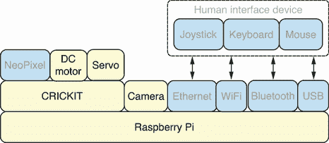
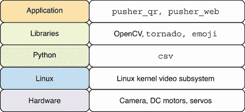
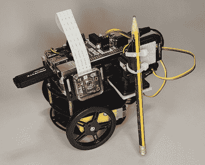
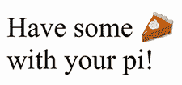
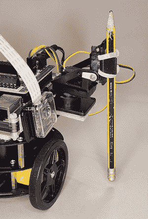
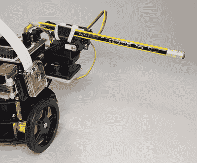
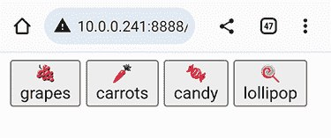
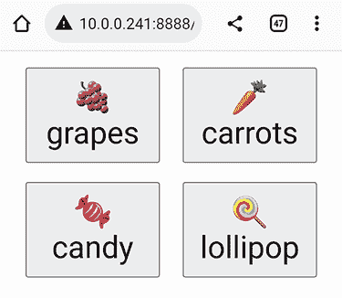
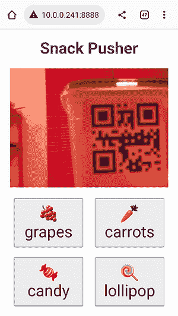

# 11 构建零食推动机器人

本章涵盖

+   从 CSV 文件中读取二维码和图标列表

+   定位和推动选定的对象

+   创建用于视频流和零食选择的用户界面

+   构建零食推动机器人

本章旨在构建一个可以通过基于 Web 的 Python 应用程序控制的零食推动机器人。本章首先从 CSV 文件中读取零食列表。每个零食都将分配一个二维码和图标。二维码将用于帮助机器人找到零食。零食图标将与代码一起在 Web 应用程序中显示。然后，我们接受挑战，将机器人移动到选定的零食并定位在理想的位置，以便将零食从边缘推下并送到饥饿的零食食用者手中。然后，机器人将返回起始位置并等待另一个零食请求。在章节的最后部分，我们创建了一个用户界面和 Web 应用程序，该应用程序显示来自机器人摄像头的实时视频流并提供可用零食的列表。选择零食，并观看机器人将其从桌边推下。

此应用程序可以用作创建许多不同类型的起点，这些类型的应用程序可以从移动设备控制，并让机器人从其环境中寻找和抓取不同的物品。能够驾驶并使用机械臂与其周围环境交互的机器人非常灵活。

## 11.1 硬件堆栈

图 11.1 展示了硬件堆栈，本章中使用的特定组件被突出显示。机器人将使用直流电机沿着轨道移动以寻找特定的目标二维码。将从摄像头捕获图像，并在这些图像上应用二维码检测，直到找到匹配项。接下来，机器人的电机将停止。然后，机器人将使用电机将伺服臂定位在理想的位置以推动检测到的零食。在这个阶段，连接到伺服电机的臂将上下移动以将零食从柜台上推下。有关如何定位零食以便机器人能够轻松检测并推动它们的技巧，请参阅附录 C。



图 11.1 硬件堆栈：伺服电机将被用来推动零食。

## 11.2 软件堆栈

本章中使用的特定软件的详细信息如图 11.2 所示。我们首先使用 `csv` 库从 CSV 文件中读取零食列表。每个零食都有一个使用 `emoji` 库转换的 emoji 图标。接下来，我们创建 `pusher_qr` 库，该库将使用 OpenCV 检测二维码并使用伺服电机推动零食。我们将使用 Tornado Web 框架创建 `pusher_web` 应用程序，以便用户可以从他们的移动设备控制机器人。



图 11.2 软件堆栈：将使用 `emoji` 库将图标转换为 emoji 短码。

## 11.3 寻找和推动零食

第一步将是创建一个库，根据 QR 码定位和推动零食。我们需要创建一个满足以下要求的 Python 库：

+   它应该从 CSV 文件中读取零食列表并将找到的任何表情符号简码转换为 Unicode 字符。

+   该库应该有一个函数可以上下移动伺服臂。

+   该库应该有一个函数用于查找匹配的 QR 码并在找到代码时移动机械臂。

此库将为我们提供机器人的核心功能。图 11.3 显示了机器人的侧面视图，其中包含用于检测 QR 码的摄像头和用于推动零食的伺服臂。



图 11.3 拍推机器人：伺服电机用于推动零食。

一旦库就位，我们就能开发一个网络应用程序，根据需要调用不同的机器人功能。

### 11.3.1 读取零食列表

第一步是安装 emoji Python 包。此模块将使我们能够将表情符号简码转换为 Unicode 字符。我们将使用此包为每个零食创建应用程序中的图标。运行以下命令安装包：

```
$ ~/pyenv/bin/pip install emoji
```

现在我们已经安装了所有需要的软件，让我们打开一个读取-评估-打印循环（REPL）会话并开始工作。首先，我们将处理从 CSV 文件中读取和解析零食列表的任务。我们导入`DictReader`对象以将 CSV 数据作为字典列表读取。然后我们导入函数`pprint`以美化打印我们的数据结构：

```
>>> from csv import DictReader
>>> from pprint import pprint
```

CSV 文件应保存为 Pi 上的`items.csv`，内容如列表 11.1 所示。

列表 11.1 `items.csv`：零食 QR 码和图标列表

```
code,icon
grapes,:grapes:
carrots,:carrot:
candy,:candy:
lollipop,:lollipop:
```

文件的第一行包含字段名。`code`字段存储 QR 码的值，而`icon`字段存储表情符号简码的值。第一步将是使用以下代码从 CSV 文件中读取行：

```
>>> lines = list(open('items.csv'))
```

现在我们可以查看`lines`中有什么。它包含一个字符串列表。每个字符串是文件中的一行：

```
>>> pprint(lines)
['code,icon\n',
 'grapes,:grapes:\n',
 'carrots,:carrot:\n',
 'candy,:candy:\n',
 'lollipop,:lollipop:\n']
```

我们使用`DictReader`解析行并返回一个字典列表：

```
>>> items = list(DictReader(lines))
```

现在我们可以美化打印`items`以更好地查看其内部内容：

```
>>> pprint(items)
[{'code': 'grapes', 'icon': ':grapes:'},
 {'code': 'carrots', 'icon': ':carrot:'},
 {'code': 'candy', 'icon': ':candy:'},
 {'code': 'lollipop', 'icon': ':lollipop:'}]
```

我们可以从列表中获取第一个项目并检查该项目的`code`和`icon`：

```
>>> items[0]
{'code': 'grapes', 'icon': ':grapes:'}
>>> items[0]['code']
'grapes'
>>> items[0]['icon']
':grapes:'
```

现在，让我们继续将表情符号简码转换为 Unicode 字符。我们将导入`emojize`函数以转换简码，并使用`pathlib`将测试 HTML 文件保存到磁盘：

```
>>> from emoji import emojize
>>> from pathlib import Path
```

emoji 包页面([`pypi.org/project/emoji/`](https://pypi.org/project/emoji/))提供了关于使用模块的详细文档，并链接到 Unicode 联盟页面，其中列出了官方表情符号简码。让我们通过调用`emojize`函数来转换一些文本：

```
>>> text = emojize('Have some :pie: with your pi!')
```

我们想在网页浏览器中看到最终结果的样子，所以让我们将文本添加到一些 HTML 中，并保存到文件中：

```
>>> html = '<!DOCTYPE html><title>_</title>' + text
>>> Path('pie.html').write_text(html)
```

现在，当我们用我们的网络浏览器打开`pie.html`文件时，我们将能够看到这些表情符号图标将是什么样子。图 11.4 显示了在网页浏览器中显示的此 HTML 文件。



图 11.4 表情符号简码：派饼的表情符号简码被转换为 Unicode。

既然我们已经读取了我们的零食列表并了解了如何创建一些表情符号图标，那么让我们继续使用机器人寻找和推送零食。

### 11.3.2 推送零食

我们将创建一个包含几个功能的库，帮助我们定位和推送零食。我们导入`dirname`函数来获取我们的 Python 文件路径，以及`csv`来解析我们的 CSV 零食列表。然后，我们导入`emojize`来帮助处理表情符号图标，以及`crickit`来控制伺服电机：

```
from os.path import dirname
from csv import DictReader
from emoji import emojize
from adafruit_crickit import crickit
```

接下来，我们导入`motor`来处理直流电机的向前和向后运动。`os`模块将访问环境变量，而`time`将用于在伺服臂运动之间暂停。`cv2`模块将帮助执行二维码检测：

```
import motor
import os
import time
import cv2
```

常量`ITEMS_FILE`指向我们的 CSV 文件，`IMG_PATH`指向我们的流式图像文件。我们使用`MAX_MOVES`限制机器人的移动，并在`SERVO_ANGLES`中定义伺服角度，以在伺服臂上下移动。`decoder`对象将解码我们的二维码：

```
ITEMS_FILE = dirname(__file__) + '/items.csv'
IMG_PATH = os.environ['XDG_RUNTIME_DIR'] + '/robo_stream.jpg'
MAX_MOVES = 20
SERVO_ANGLES = dict(up=70, down=180)
decoder = cv2.QRCodeDetector()
```

`get_items`函数打开我们的 CSV 文件，并将文件中每一行的所有表情符号简码转换为 emoji。接下来，我们调用`DictReader`来解析 CSV 内容，并返回一个字典列表：

```
def get_items():
    lines = [emojize(i) for i in open(ITEMS_FILE)]
    return list(DictReader(lines))
```

我们可靠的`decode_qr`函数将执行解码我们遇到的任何二维码的工作：

```
def decode_qr():
    img = cv2.imread(IMG_PATH)
    data, points, _ = decoder.detectAndDecode(img)
    return data
```

`goto`函数将机器人移动到提供的`direction`，寻找与二维码匹配的`target`。我们使用`direction`来查找我们的运动函数并将其保存到`motor_func`中。然后，我们循环移动我们的机器人到期望的方向，并调用`decode_qr`来检查我们是否遇到了任何二维码。如果我们找到一个匹配的`target`，我们返回一个`True`值。否则，如果我们向前移动并到达轨道的尽头，我们返回一个`False`。同样，如果我们超过了`MAX_MOVES`运动尝试次数，我们返回一个`False`：

```
def goto(target, direction):
    motor_func = getattr(motor, direction)
    for i in range(MAX_MOVES):
        motor_func(speed=1, duration=0.1)
        data = decode_qr()
        if data == target:
            return True
        if data == 'end' and direction == 'forward':
            return False
    return False
```

我们使用`swing_arm`来挥动我们的伺服臂向上并撞倒零食。我们暂停半秒钟，然后将臂挥回到原始位置。相同的伺服电机用于将臂移动到上下位置。图 11.5 显示了臂在向下位置，这是在沿着轨道行驶时使用的。图 11.6 显示了臂在向上位置，这是用来撞倒零食的：

```
def swing_arm():
    crickit.servo_2.angle = SERVO_ANGLES['up']
    time.sleep(0.5)
    crickit.servo_2.angle = SERVO_ANGLES['down']
    time.sleep(0.5)
```



图 11.5 臂向下：当机器人在轨道上移动时，臂保持在向下位置。

`push_item`函数用于驱动机器人向前移动以寻找匹配的二维码`code`。如果找到，我们将机器人向后移动，将伺服臂放置在我们的零食中心，然后通过调用`swing_arm`来摆动臂。最后，我们调用`goto`来驱动机器人返回起始位置：

```
def push_item(code):
    found = goto(code, 'forward')
    if found:
        motor.backward(speed=1, duration=0.3)
        swing_arm()
    goto('start', 'backward')
```



图 11.6 臂抬起：将臂放置在抬起位置以倾倒零食。

完整的脚本可以保存为`pusher_qr.py`在 Pi 上，然后执行。

列表 11.2 `pusher_qr.py`：用于检测和推送匹配零食的库

```
#!/usr/bin/env python3
from os.path import dirname
from csv import DictReader
from emoji import emojize
from adafruit_crickit import crickit
import motor
import os
import time
import cv2

ITEMS_FILE = dirname(__file__) + '/items.csv'
IMG_PATH = os.environ['XDG_RUNTIME_DIR'] + '/robo_stream.jpg'
MAX_MOVES = 20
SERVO_ANGLES = dict(up=70, down=180)
decoder = cv2.QRCodeDetector()

def get_items():
    lines = [emojize(i) for i in open(ITEMS_FILE)]
    return list(DictReader(lines))

def decode_qr():
    img = cv2.imread(IMG_PATH)
    data, points, _ = decoder.detectAndDecode(img)
    return data

def goto(target, direction):
    motor_func = getattr(motor, direction)
    for i in range(MAX_MOVES):
        motor_func(speed=1, duration=0.1)
        data = decode_qr()
        if data == target:
            return True
        if data == 'end' and direction == 'forward':
            return False
    return False

def swing_arm():
    crickit.servo_2.angle = SERVO_ANGLES['up']
    time.sleep(0.5)
    crickit.servo_2.angle = SERVO_ANGLES['down']
    time.sleep(0.5)

def push_item(code):
    found = goto(code, 'forward')
    if found:
        motor.backward(speed=1, duration=0.3)
        swing_arm()
    goto('start', 'backward')
```

我们现在可以对这个库进行测试。就像我们在上一章中所做的那样，确保在另一个终端中运行`stream_save.py`。将机器人放置在轨道的起始位置，指向起始二维码。我们可以在 REPL 会话中尝试这个库。首先，我们导入`pusher_qr`库：

```
>>> import pusher_qr
```

我们调用`decode_qr`函数，它返回我们起始位置的代码作为`start`：

```
>>> pusher_qr.decode_qr()
'start'
```

我们现在可以通过以下函数调用让机器人前往轨道的末端：

```
>>> pusher_qr.goto('end', 'forward')
True
```

函数返回了`True`，这意味着它成功到达了目标位置。我们可以调用`decode_qr`来确认这一点。函数返回的`end`值：

```
>>> pusher_qr.decode_qr()
'end'
```

接下来，我们返回到起始位置：

```
>>> pusher_qr.goto('start', 'backward')
True
```

现在，让我们通过调用`push_item`函数将带有代码`candy`的零食推出去。机器人将移动到带有二维码`candy`的零食处，用伺服臂将其推出去，然后返回到起始位置：

```
>>> pusher_qr.push_item('candy')
```

和之前一样，我们可以通过调用`decode_qr`来确认机器人是否在起始位置：

```
>>> pusher_qr.decode_qr()
'start'
```

这次会议是我们在将我们的 Web 应用程序作为机器人控制前端之前，对库和机器人进行测试的好方法。

现实世界中的机器人：拣选和放置机器人

机器人中一个非常受欢迎的类别是拣选和放置机器人。它们通常用于制造环境中，需要将生产出的物品打包以便运输。本章中的机器人具有定位特定物品并将它们从计数器上推下来的能力。想象一下将物品推到传送带上，以便运送到工厂的另一个部分进行进一步处理。

推出拣选和放置机器人的好处是，与人工拣选和放置相比，速度和可靠性都有所提高。它们的形状和大小各不相同，这取决于它们需要拣选的物品类型及其特性。6 River Systems 网站([`6river.com/what-is-a-pick-and-place-robot`](https://6river.com/what-is-a-pick-and-place-robot))对拣选和放置机器人进行了很好的介绍，是了解不同类型机器人和它们应用的好地方。

## 11.4 创建零食推送应用程序

现在，我们可以深入创建我们的 Web 应用程序来控制我们的零食推送机器人。我们需要创建一个满足以下要求的 Python 应用程序：

+   它应显示一个零食按钮列表供选择。

+   一旦选择了零食，机器人应驶向零食并将其推动。然后它应返回起始位置。

+   应在应用程序中包含机器人摄像头的实时视频流。

我们面前有许多挑战，所以让我们将问题分解一下。首先，我们将处理列出和选择项目。然后，我们将专注于如何使用样式表更好地控制用户界面的布局和设计。最后，我们将添加实时视频流到应用程序中。

### 11.4.1 使用应用程序选择零食

我们首先将专注于阅读零食列表，并将它们呈现为一系列按钮。点击这些零食按钮之一后，我们的机器人将驶向零食并施展其魔法。

正如我们之前所做的那样，我们从 Tornado 网络框架导入了许多函数和对象来帮助我们创建网络应用程序。这些都是我们在前几章中使用过的相同函数和对象：

```
from tornado.ioloop import IOLoop
from tornado.web import RequestHandler, Application
from tornado.log import enable_pretty_logging
```

我们接着从`os`模块导入以获取目录名称和环境变量。我们导入`get_items`和`push_item`以列出可用的并推送选定的项目：

```
from os.path import dirname
import os
from pusher_qr import get_items, push_item
```

我们将应用程序的设置保存在`SETTINGS`中。我们使用`static_path`以便我们可以提供静态内容，如样式表：

```
SETTINGS = dict(
    debug=bool(os.environ.get('ROBO_DEBUG')),
    template_path=dirname(__file__) + '/templates',
    static_path=dirname(__file__) + '/static',
)
```

`MainHandler`对象将处理传入的请求。对于`GET`请求，我们将保存零食列表并将其传递给模板以进行渲染。当访问索引页面时，`name`将为空，因此我们将其设置为值`index`。否则，正在访问的页面的名称将直接映射到模板名称。当零食选择表单提交时，`post`方法将通过调用`push_item`来推送项目，然后调用`redirect`将浏览器带到列出所有项目的页面：

```
class MainHandler(RequestHandler):
    def get(self, name):
        name = name or 'index'
        self.render(f'{name}.html', items=get_items())

    def post(self, code):
        push_item(code)
        self.redirect('items')
```

最后一步与我们已经看到的类似。我们启用漂亮的日志记录，然后创建我们的应用程序对象并使其监听`端口 8888`上的传入请求：

```
enable_pretty_logging()
app = Application([('/([a-z_]*)', MainHandler)], **SETTINGS)
app.listen(8888)
IOLoop.current().start()
```

完整的脚本可以保存为`pusher_web.py`在 Pi 上，然后执行。

列表 11.3 `pusher_web.py`：处理零食推送应用程序的请求

```
#!/usr/bin/env python3
from tornado.ioloop import IOLoop
from tornado.web import RequestHandler, Application
from tornado.log import enable_pretty_logging
from os.path import dirname
import os
from pusher_qr import get_items, push_item

SETTINGS = dict(
    debug=bool(os.environ.get('ROBO_DEBUG')),
    template_path=dirname(__file__) + '/templates',
    static_path=dirname(__file__) + '/static',
)

class MainHandler(RequestHandler):
    def get(self, name):
        name = name or 'index'
        self.render(f'{name}.html', items=get_items())

    def post(self, code):
        push_item(code)
        self.redirect('items')

enable_pretty_logging()
app = Application([('/([a-z_]*)', MainHandler)], **SETTINGS)
app.listen(8888)
IOLoop.current().start()
```

在运行此脚本之前，我们至少需要创建一个 HTML 模板以供网页浏览器使用。最终，应用程序将有一个用于显示索引页面的模板和一个用于显示零食列表的模板。我们将首先处理零食列表模板。让我们看看这个 HTML 模板的内容。

我们从 HTML 文档的标题部分开始。在这里，我们设置页面的标题并使用`meta`标签确保页面在移动设备上良好渲染。像之前一样，我们为页面设置一个空白图标。然后我们指向一个名为`style.css`的样式表，它将成为我们的静态内容的一部分。我们使用 Tornado 的`static_url`函数生成此静态内容的 URL：

```
<!DOCTYPE HTML>
<html lang="en">
<head>
  <title>Snack Pusher</title>
  <meta name="viewport" content="width=device-width">
  <link rel="icon" href="data:,">
  <link rel="stylesheet" href="{{ static_url('style.css') }}">
</head>
```

现在我们继续到文档的主体部分，其中包含一个使用 POST 方法提交的表单。我们遍历`items`变量中的每个小吃。对于每个小吃，我们输出一个由`code`定义操作的按钮。按钮的文本将显示`icon`和`code`的值：

```
<body>
<form method="post">
  
    <button formaction="{{ item['code'] }}">
      {{ item['icon'] }}<br>
      {{ item['code'] }}
    </button>
  
</form>
</body>
</html>
```

完整模板可以保存为`items.html`，位于应用的模板文件夹中。

列表 11.4 `items.html`：显示可用项目列表的 HTML 模板

```
<!DOCTYPE HTML>
<html lang="en">
<head>
  <title>Snack Pusher</title>
  <meta name="viewport" content="width=device-width">
  <link rel="icon" href="data:,">
  <link rel="stylesheet" href="{{ static_url('style.css') }}">
</head>
<body>
<form method="post">
  
    <button formaction="{{ item['code'] }}">
      {{ item['icon'] }}<br>
      {{ item['code'] }}
    </button>
  
</form>
</body>
</html>
```

现在，我们的应用已经足够完善，可以运行并开始测试其功能的一部分。像之前一样，确保在另一个终端中运行`stream_save.py`。现在，继续运行我们新的`pusher_web.py`应用。我们可以使用同一网络上的任何计算机或移动设备上的网络浏览器访问 Web 应用。通过访问地址 http://robopi

:8888/items 或通过将 URL 中的`robopi`替换为机器人的 IP 地址。图

11.7 展示了应用这一部分的外观。它显示了我们在 CSV 文件中定义的四个小吃的列表。每个小吃都有其图标和名称显示。按下这些按钮之一，机器人将行驶，找到所选的小吃，并将其从柜台上推下。



图 11.7 项目列表：应用中显示的小吃列表。

我们已经实现了良好的功能水平。现在，让我们通过样式表给这个应用添加一些样式。

### 11.4.2 样式化 Web 应用

我们将创建一个样式表来样式化我们的两个页面。我们有一些样式元素在两个页面上都是通用的，所以将所有样式保存在一个样式表中是有意义的。

我们首先对主体内容、链接和按钮进行样式化。我们设置要使用的字体，使文本居中，并通过将`text-decoration`设置为`none`来移除链接下划线：

```
body, a, button {
  font-family: Verdana, Arial, sans-serif;
  text-align: center;
  text-decoration: none;
}
```

我们将按钮的字体大小加倍，并添加适量的边距和填充，使它们更大，更容易在移动设备上按下。我们将它们都设置为 140 像素的相同宽度，以便它们具有统一的大小：

```
button {
  font-size: 200%;
  padding: 10px;
  margin: 10px;
  width: 140px;
}
```

在下一节中，我们将添加索引页的模板。该页面有一个我们想要样式化的`iframe`。我们使`iframe`占据整个屏幕宽度，并具有 300 像素的高度。我们还移除了边框，使其更自然地适应页面外观：

```
iframe {
  width:100%;
  height:300px;
  border:none;
}
```

样式表可以保存为`style.css`，位于应用的静态内容文件夹中。

列表 11.5 `style.css`：将样式表应用于 HTML 模板

```
body, a, button {
  font-family: Verdana, Arial, sans-serif;
  text-align: center;
  text-decoration: none;
}

button {
  font-size: 200%;
  padding: 10px;
  margin: 10px;
  width: 140px;
}

iframe {
  width:100%;
  height:300px;
  border:none;
}
```

现在，我们可以再次启动`pusher_web.py`应用，看看我们的应用。访问相同的 URL，查看页面如何变化。图 11.8 显示了应用样式后页面的新外观。按钮现在将显得更大，并且在小屏幕的移动设备上按下将更容易。



图 11.8 样式化按钮：按钮已使用更大的字体和更多的填充进行样式化。

在处理完样式表之后，我们可以着手处理应用程序的最后部分。索引页面将结合零食列表和实时视频流。

### 11.4.3 将实时视频流添加到应用程序中

将实时视频流添加到网络应用程序相对简单。我们只需将视频流服务的 URL 放入一个 `img` 标签中。问题是，每次我们通过按按钮选择零食时，网络浏览器都会提交整个页面。这将刷新整个页面，使我们错过视频流中最激动人心的部分，即机器人沿着轨道寻找我们的零食。我们可以通过将我们的零食列表放在自己的 `iframe` 中来解决这个问题。这样，无论我们选择多少零食，视频流播放都不会被打断。现在我们可以看看主索引页面的模板。

我们在标题中使用了我们常用的标签来设置页面的语言和标题。标题中的所有标签和值都与我们在 `items.html` 中使用的相同：

```
<!DOCTYPE HTML>
<html lang="en">
<head>
  <title>Snack Pusher</title>
  <meta name="viewport" content="width=device-width">
  <link rel="icon" href="data:,">
  <link rel="stylesheet" href="{{ static_url('style.css') }}">
</head>
```

在主体中，我们在页面顶部放置了一个带有页面标题的标题。然后，我们在标题之后放置我们的实时视频流。我们确保使用请求中的 `host_name` 值，以便无论您是通过主机名还是 IP 地址访问它，应用程序都能正确工作。接下来，我们在实时视频流下方加载包含零食列表的页面：

```
<body>
<h1><a href='/'>Snack Pusher</a></h1>
<br>
<iframe src="/items"></iframe> 
</body>
</html>
```

完整模板可以保存为 `index.html`，位于应用程序的模板文件夹中。

列表 11.6 `index.html`：显示实时视频流和零食列表的模板

```
<!DOCTYPE HTML>
<html lang="en">
<head>
  <title>Snack Pusher</title>
  <meta name="viewport" content="width=device-width">
  <link rel="icon" href="data:,">
  <link rel="stylesheet" href="{{ static_url('style.css') }}">
</head>
<body>
<h1><a href='/'>Snack Pusher</a></h1>
<br>
<iframe src="/items"></iframe> 
</body>
</html>
```

我们应用程序的所有部件现在都已就位，我们可以尝试最终版本。除了运行 `stream_save.py` 之外，确保 `stream_web.py` 也正在运行，以便将实时视频流提供给应用程序。运行 `pusher_web.py` 脚本，以便我们可以尝试我们的应用程序。通过访问地址 http://robopi:8888/ 或机器人的 IP 地址来访问网络应用程序。图 11.9 显示了完整应用程序的外观。现在我们可以看到实时视频流，并在同一应用程序中做出零食选择。我们可以选择任何零食，当请求被机器人处理时，视频流将保持不间断地播放。



图 11.9 最终应用程序：在选择零食时显示实时视频流。

深入了解：应用程序中的视频流

这是我们第一次将实时视频流嵌入到网络应用程序中，这是 HTML 语言的一个非常强大的功能。我们可以以多种方式扩展这个功能。

我们可以创建同时显示多个视频流的用户界面。这对于拥有多个摄像头的机器人尤其有用，一个面向前方，另一个面向后方。通过同时显示来自摄像头的所有视频流，我们可以在机器人行驶时获得其环境的全面视图。

另一个我们可以添加的有用功能是能够连续录制和播放视频流。这可以通过创建一个将视频流中的每一帧保存到带时间戳的文件名中的归档应用程序来实现。然后我们会在用户界面中添加回放选项。如果我们让视频流持续保存，磁盘最终会填满，我们会耗尽存储空间。我们可以通过实施数据保留策略来解决这个问题，其中我们只会保留过去 24 小时的视频流数据。任何更旧的数据都会自动删除，然后应用程序可以维护其记录和播放功能，不会耗尽磁盘空间。或者，我们可以将旧视频数据同步到网络上的集中式视频归档服务器。这是处理机器人有限本地存储的另一种常见策略。

这个最后的项目结合了许多不同的技术，创建了一个能够以强大方式与环境交互的机器人，并且其功能可以扩展。我们可以添加一个功能，让机器人自动检查可用的物品。而不是推动物品，我们可以创建一个抓取和放置机器人的功能，它抓取物品并将它们放置在另一个位置，类似于仓库机器人所做的那样。我们可以以许多方式改进我们的机器人，而我们唯一受限制的是我们的想象力。

就这样，这就是一个漫长而有趣的旅程的结束，它汇集了许多不同的硬件和软件组件，使我们能够通过无线网络使用移动设备控制机器人。手拿移动设备，选择你喜欢的任何小吃，享受机器人快速穿梭，寻找和抛出你心中所想的小吃。

## 摘要

+   小吃推送机器人由一个基于 Web 的 Python 应用程序控制。

+   伺服电机用于移动伺服臂上下移动并推送小吃。

+   使用 emoji Python 包将表情符号简码转换为 Unicode 字符。这些用作应用程序中小吃图标。

+   小吃列表是从包含每个小吃二维码和图标的 CSV 文件中读取的。

+   在应用程序中，使用单个样式表来格式化模板页面。这样做是因为这两个页面中都有共同的样式元素，因此将所有样式放在一个样式表中会更加方便。

+   使用`iframe`帮助我们在这个应用程序中播放实时视频流并提交小吃选择，而不会中断视频播放。
