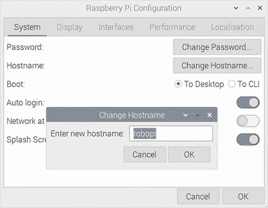
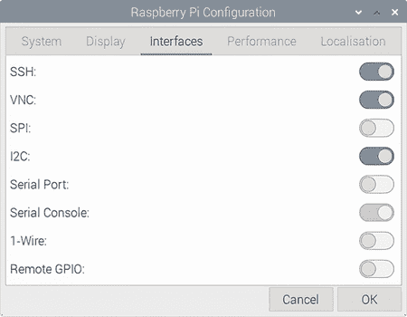

# 附录 B. 配置 Raspberry Pi

本附录涵盖了 Raspberry Pi 上主要软件的安装和配置。首先，将在计算机上安装 Raspberry Pi OS Linux 发行版。然后，将配置 Python，以便有一个专用的虚拟环境，可以在其中安装 Python 库。接下来将安装 Adafruit CRICKIT 库，然后使用它来运行 Python 代码以与 CRICKIT 硬件交互。

## B.1 设置 Raspberry Pi

Raspberry Pi 官方文档（[`raspberrypi.com/documentation/`](https://raspberrypi.com/documentation/））页面是使用 Raspberry Pi 时的优秀资源。对于书中的项目，以下文档部分值得查看：

+   入门：此页面提供了有关安装操作系统和使用 Raspberry Pi Imager 的详细信息。

+   配置：有关使用 `raspi-config` 工具的详细信息，请在此处查看。

+   远程访问：它涵盖了使用 SSH 连接到您的 Pi、传输文件以及使用 VNC 软件远程访问桌面。

要安装 Raspberry Pi OS，请执行以下操作：

1.  访问 [http://mng.bz/JdN0](http://mng.bz/JdN0)。

1.  点击 Raspberry Pi OS 链接并下载“带有桌面的 Raspberry Pi OS”镜像。这将下载最新版本。为了参考，书中的代码是在 2022-04-04 32 位 Raspberry Pi OS 版本上测试的。桌面镜像包含桌面环境，这对于我们为机器人项目创建图形应用程序将很有用。

1.  点击“Raspberry Pi Imager”链接，按照说明下载和安装 Imager 软件。

1.  Raspberry Pi 4 可以从 microSD 卡或 USB 闪存驱动器安装和启动。USB 闪存驱动器提供更好的性能，是推荐选项。

1.  使用 Imager 软件准备安装介质，使用下载的镜像（microSD 卡/USB 闪存驱动器）。

1.  一旦 Raspberry Pi 使用安装程序启动，请在欢迎屏幕上点击“下一步”。

1.  设置国家值，然后设置用户名为 `robo`，并继续配置步骤。

1.  重新启动后，我们将使用 Raspberry Pi 配置工具进一步配置 Pi。

1.  使用此工具将主机名设置为 `robopi`。图 B.1 显示了用于更改 Raspberry Pi 上主机名的屏幕。

    

    图 B.1 更改主机名：使用 Raspberry Pi 配置工具更改主机名。

1.  接下来，使用配置工具启用 SSH、VNC 和 I2C 接口。图 B.2 显示了启用这些接口后接口屏幕将呈现的样子。

    

    图 B.2 启用接口：此屏幕可用于启用不同的接口。

1.  现在，重新启动 Pi 以使更改生效。

1.  通过将网络电缆连接到以太网端口或加入 Wi-fi 网络，将 Raspberry Pi 连接到网络。

1.  通过在终端中运行 `hostname -I` 命令来获取机器的 IP 地址。

1.  从网络上的另一台计算机，测试您是否可以使用用户 `robo` 通过 IP 地址 SSH 到 Raspberry Pi。现在您可以使用 SSH 从网络上的任何计算机运行命令和执行 Python 脚本。

1.  您也可以通过其主机名 `robopi` 连接到 Raspberry Pi。为此，您需要在客户端机器的 hosts 文件中添加一行，包含 `robopi` 主机名及其关联的 IP 地址。How-To Geek 网站提供了一个关于如何在 Windows、Mac 和 Linux 上编辑 hosts 文件的优秀指南（[`mng.bz/5owz`](http://mng.bz/5owz)）。

1.  `sftp` 命令或 FileZilla 应用程序都是将文件在网络中传输到 Pi 的流行选择。如果您的计算机正在运行 Linux，那么 `sshfs` 是将远程文件挂载并作为本地文件在 Pi 上工作的绝佳方式。

现在我们已经完成了 Raspberry Pi 的主要配置步骤，我们可以继续配置 Adafruit CRICKIT HAT。

## B.2 设置 Adafruit CRICKIT HAT

按照以下步骤完成 Adafruit CRICKIT HAT 的硬件和软件配置：

1.  Adafruit 网站上有一份非常全面的指南，用于设置 CRICKIT HAT 和解决任何问题。在下一步中，我们将参考具体部分（[`mng.bz/wj5q`](http://mng.bz/wj5q)）。

1.  在第一次使用 CRICKIT HAT 之前，最好更新其固件。在 Adafruit 学习指南中，按照“更新您的 CRICKIT”部分中的步骤操作。

1.  关闭 Raspberry Pi。要将 CRICKIT HAT 连接到 Raspberry Pi，首先将随 CRICKIT 一起提供的头对齐支架连接到 Raspberry Pi 的 GPIO 连接器。然后连接 CRICKIT HAT。

1.  将电源线插入 CRICKIT DC 插座，并打开 CRICKIT 电源开关。检查 CRICKIT LED 是否为绿色，这表示有健康的电源供应。

1.  打开 Raspberry Pi，并打开一个终端或打开到它的 SSH 连接。

1.  运行 `i2cdetect` 命令，并检查 i2c 地址 `0x49` 是否出现在输出中。地址将显示为文本 `49`，如下所示：

    ```
    $ i2cdetect -y 1
         0  1  2  3  4  5  6  7  8  9  a  b  c  d  e  f
    00:                         -- -- -- -- -- -- -- -- 
    10: -- -- -- -- -- -- -- -- -- -- -- -- -- -- -- -- 
    20: -- -- -- -- -- -- -- -- -- -- -- -- -- -- -- -- 
    30: -- -- -- -- -- -- -- -- -- -- -- -- -- -- -- -- 
    40: -- -- -- -- -- -- -- -- -- 49 -- -- -- -- -- -- 
    50: -- -- -- -- -- -- -- -- -- -- -- -- -- -- -- -- 
    60: -- -- -- -- -- -- -- -- -- -- -- -- -- -- -- -- 
    70: -- -- -- -- -- -- -- -- 
    ```

1.  运行以下命令以更新软件包：

    ```
    $ sudo apt update
    $ sudo apt upgrade
    $ sudo apt autoremove
    ```

1.  运行以下命令以重启机器：

    ```
    $ sudo reboot
    ```

1.  重启后，重新连接到机器，并运行以下行以创建 Python 虚拟环境并在其中安装 Adafruit CRICKIT 库：

    ```
    $ python3 -m venv ~/pyenv
    $ ~/pyenv/bin/pip install adafruit-circuitpython-crickit
    ```

1.  运行下一行以添加 `activate` Bash 别名，该别名可以在需要时激活 Python 虚拟环境。运行命令后，打开一个新的终端以使新别名生效：

    ```
    $ echo "alias activate='source ~/pyenv/bin/activate'" >> ~/.bashrc
    ```

1.  下一行命令将在虚拟环境中启动一个 Python 读取-评估-打印循环（REPL）会话：

    ```
    $ ~/pyenv/bin/python
    ```

1.  在 REPL 中运行以下 Python 代码，并确认板载 Neopixel 变红以配置 Adafruit CRICKIT HAT：

    ```
    >>> from adafruit_crickit import crickit
    >>> crickit.onboard_pixel.fill(0xFF0000)
    ```

## B.3 激活 Python 虚拟环境

我们现在已经完成了设置并创建了一个 Python 虚拟环境。这些虚拟环境是保持我们已安装的 Python 包和环境与操作系统使用的系统 Python 环境分离的绝佳方式。这样，我们可以在任何时候重新创建机器人的 Python 环境，而不会影响系统安装。我们还可以安装我们想要的任何包及其版本，而不用担心会破坏操作系统正在使用的 Python 包。有关 Python 虚拟环境的更多详细信息，请参阅官方文档（[`docs.python.org/3/library/venv.html`](https://docs.python.org/3/library/venv.html)），这是一个关于该主题的极好资源。

在本节中，我们将介绍一些与虚拟环境相关的常见操作。当你打开终端或通过 SSH 连接到 Pi 时，你会得到一个看起来像的提示符

```
robo@robopi:~ $ 
```

到目前为止，我们还没有激活我们的虚拟环境。我们可以使用以下命令询问终端它将使用哪个 Python 解释器：

```
robo@robopi:~ $ which python
/usr/bin/python
```

输出显示了操作系统使用的 Python 解释器的位置。现在运行 `activate` 命令以激活我们的虚拟环境：

```
robo@robopi:~ $ activate 
(pyenv) robo@robopi:~ $ 
```

我们可以看到，提示符开头出现了 `(pyenv)` 文本，这表明我们处于上一节创建的名为 `pyenv` 的 Python 虚拟环境中。现在我们可以使用 `which` 命令再次检查 Python 解释器的位置：

```
(pyenv) robo@robopi:~ $ which python
/home/robo/pyenv/bin/python
```

我们可以查看它是否正在使用为我们的机器人项目创建的虚拟环境中的 Python 解释器。现在，我们可以使用以下命令在我们的虚拟环境中打开一个 REPL 会话：

```
(pyenv) robo@robopi:~ $ python
Python 3.9.2 (default, Mar 12 2021, 04:06:34) 
[GCC 10.2.1 20210110] on linux
Type "help", "copyright", "credits" or "license" for more information.
>>> 
```

按下 Ctrl+D 退出 REPL 会话。现在，当我们执行 Python 脚本时，它们将在我们的虚拟环境中运行，并且能够使用我们已安装的 Python 包。
