# 附录 C. 机器人组装指南

本附录涵盖了如何将不同的硬件组件组装成完整的机器人。本书中使用了三种不同的机器人配置，本指南将涵盖如何构建每个配置。在使用本指南之前，请确保已经阅读附录 A 和 B。每一组章节使用特定的机器人配置：

+   第二章至第七章使用移动机器人配置。

+   第八章和第九章使用伺服摄像头机器人配置。

+   第十章和第十一章使用推杆机器人配置。

## C.1 构建移动机器人

移动机器人配置创建了一个可以带板上电源行驶的机器人，并且可以通过无线连接进行控制。按照以下步骤构建机器人：

1.  Adafruit 网站上有一个关于 CRICKIT HAT 的优秀指南（[`mng.bz/qj0w`](http://mng.bz/qj0w)）。按照指南中的说明将 CRICKIT HAT 连接到 Raspberry Pi。

1.  然后按照 Pibow 指南（[`mng.bz/7v59`](http://mng.bz/7v59)）组装并将 Raspberry Pi 4 放入 Pibow 案中。

1.  如果你已经购买了可选的尼龙支撑件套装，你现在可以在 CRICKIT HAT 两个没有支撑的角落各放置一个支撑件，使 HAT 以更安全的方式放置在 Raspberry Pi 上。

1.  最后，将延长跳线连接到电机连接 1 和 2。

1.  图 C.1 展示了完成这些步骤后 Raspberry Pi 的样子。

    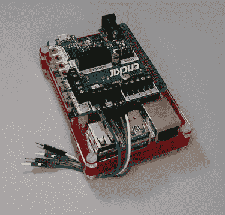

    图 C.1 Raspberry Pi：Raspberry Pi 和 CRICKIT HAT 放置在 Pibow 案中。

下一步涉及准备电源银行：

1.  不同电源银行的尺寸、按钮布局和端口位置可能会有所不同。然而，从根本上说，步骤将是相同的，尽管你可能需要调整电源银行的位置。

1.  Anker PowerCore Select 10000 电源银行在顶部部分有一个按钮和充电指示灯。我们将在电源银行的底部放置 Velcro 胶粘方形。这些方形有助于将电缆的额外部分粘附在电源银行下面，以实现更整洁的电缆管理。按照图 C.2 所示放置胶粘方形。

    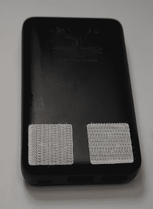

    图 C.2 胶粘方形电源银行：这些方形粘附在电源银行的底部。

我们现在将继续将电源电缆连接到电源银行：

1.  将磁吸 USB 电缆连接到电源银行的一个电源输出端口。这条电缆将用于为 Raspberry Pi 提供电力。当机器人不使用时，可以断开磁吸连接以减少对电源银行的电力消耗。

1.  将 USB 到圆柱形插座电缆插入电源银行的另一个输出端口。这条电缆将为 CRICKIT HAT 提供电力。与 Raspberry Pi 不同，CRICKIT HAT 在板上集成了电源开关，可以用来断开电源，因此在不使用时不需要拔掉。

1.  将磁铁尖端连接到电源银行的电源输入端口。这提供了一个方便的方法将电源银行连接到电源进行充电。

1.  图 C.3 展示了我们连接所有电源电缆后的电源银行外观。

    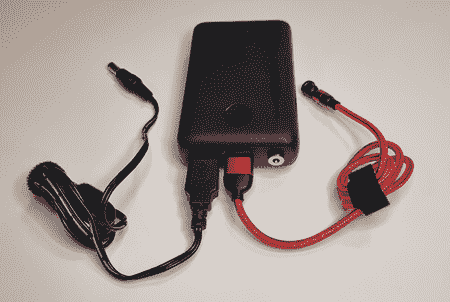

    图 C.3 带电缆的电源银行：USB 电缆用于将电源连接到 Raspberry Pi。

我们现在可以组装机器人底盘并安装电源银行：

1.  按照指南（[`mng.bz/mjRr`](http://mng.bz/mjRr)）组装机器人底盘套件的所有部件。

1.  底盘套件非常灵活，底盘上的板子支持许多不同的螺丝和黄铜支撑件排列。你可以尝试不同的排列，看看哪种最适合你电源银行的具体尺寸。现在可以将电源银行放置在底盘的中间层。

1.  如果可能，最好将电源银行放在中间层而不是顶层。这是机器人最重的部分，当重量保持在较低层时，机器人倾覆的可能性会更小。这在机器人从静止状态加速到最高速度或以高速度减速到完全停止时最为明显。

1.  现在可以将粘合方块粘贴到底盘的上层。粘贴了四个粘合方块，以提供 Pibow 外壳和底盘之间非常牢固的连接。

1.  图 C.4 展示了放置电源银行后的机器人底盘外观。

    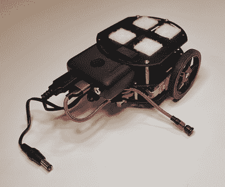

    图 C.4 带电源银行的底盘：Raspberry Pi 放置在底盘的上层。

组装的最后一部分是将 Raspberry Pi 安装到底盘上：

1.  将带有外壳的 Raspberry Pi 安装在底盘的上层。Raspberry Pi 的 USB 端口应朝向机器人的后面。这使 CRICKIT HAT 和 Raspberry Pi 的电源连接器与电源银行的电源电缆更近。

1.  连接 CRICKIT HAT 和 Raspberry Pi 的电源电缆。

1.  最后，将跳线连接到直流电机。确保将正确的直流电机连接到电机连接 1，将左侧的直流电机连接到电机连接 2。

1.  图 C.5 展示了一个完全组装好的机器人。

    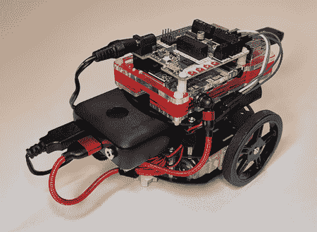

    图 C.5 完全组装好的机器人：Raspberry Pi 的 USB 端口可以从机器人的后面访问。

## C.2 构建伺服摄像头机器人

伺服摄像头机器人配置创建了一个带有摄像头连接到两个伺服电机的机器人。一个伺服电机将允许我们旋转摄像头，另一个将应用倾斜动作。按照以下步骤构建机器人：

1.  Adafruit Mini Pan-Tilt Kit 是完全组装好的。该套件支持安装不同尺寸和样式的摄像头模块。本 Adafruit 机器人组装指南（[`mng.bz/5oOB`](http://mng.bz/5oOB)）使用了 Pan-Tilt Kit，并对移除用于下一步所需的侧边卡扣有很好的解释。

1.  套件有两个由软尼龙制成的侧卡扣，可以拆卸。可以通过拧下或使用线切割工具移除其中一个侧卡扣。我们只需要一个卡扣在位即可。

1.  在套件的相机安装点上放置一个魔术贴粘合方块。

1.  套件的基础部分应该固定在一个坚固的表面上以获得更好的稳定性。你可以剪下一块纸板，并使用胶水或双面泡沫胶带将套件固定在纸板上。

1.  图 C.6 显示了此时万向节套件的外观。

    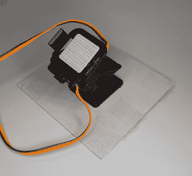

    图 C.6 展示了带有魔术贴的万向节套件：魔术贴方块将用于固定相机。

下一步是准备相机：

1.  现在可以将树莓派相机模块放入 Adafruit 相机套件中。

1.  相机套件非常适合安装到套件上，因为它在相机两侧都有槽位，这些槽位可以很好地与套件的侧卡扣配合。

1.  在相机套件的背面放置一个魔术贴粘合方块。

1.  图 C.7 显示了带有魔术贴方块的相机套件应该看起来是什么样子。

    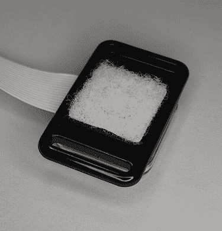

    图 C.7 显示了相机套件：魔术贴方块已固定在相机套件的背面。

我们现在将继续将相机套件连接到万向节套件：

1.  使用魔术贴方块可以让我们根据需要连接和拆卸相机。

1.  现在可以将相机套件连接到万向节套件。确保相机电缆在底部。

1.  这是相机的正确方向，这样从相机拍摄的照片将会是正立的。

1.  万向节套件侧面的卡扣可以滑入相机套件中的槽位。

1.  图 C.8 显示了连接后相机和万向节套件的外观。

    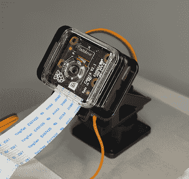

    图 C.8 显示了相机连接到万向节套件后的样子：相机将通过魔术贴固定到套件上。

组装的最后一步是将万向节套件连接到树莓派：

1.  树莓派相机模块的官方文档（[`mng.bz/6nYo`](http://mng.bz/6nYo)）提供了有关如何将相机电缆连接到树莓派的详细信息。

1.  CRICKIT HAT 上有一个用于相机电缆的开口。将相机电缆穿过 CRICKIT HAT 并连接到树莓派。然后，将 CRICKIT HAT 固定到树莓派上。

1.  现在将树莓派 4 放入 Pibow 套件中。

1.  在上一节中提到的 Adafruit 关于 CRICKIT HAT 的指南是一个极好的资源，用于连接万向节套件到 CRICKIT HAT。特别是，CircuitPython 伺服部分提供了关于如何将万向节套件上的伺服电机连接到 CRICKIT HAT 的详细信息。

1.  指南解释了将伺服连接器连接到 CRICKIT HAT 的方向。伺服连接器一侧的线将有深色，如黑色和棕色。另一侧将使用浅色电线，如黄色、橙色或白色。将深色电线连接到 CRICKIT 标志处，将浅色电线连接到直流电源插孔处。

1.  将下方的伺服连接器连接到伺服连接 1，将上方的伺服连接器连接到伺服连接 2。

1.  现在连接 CRICKIT HAT 和 Raspberry Pi 的电源线，就像我们在上一节中做的那样。

1.  图 C.9 显示了完全组装好的机器人的外观。这个机器人可以使用伺服电机在水平和倾斜方向上移动连接的摄像头。它不像之前的机器人那样使用直流电机。下一节的机器人配置同时使用了伺服电机和直流电机。

    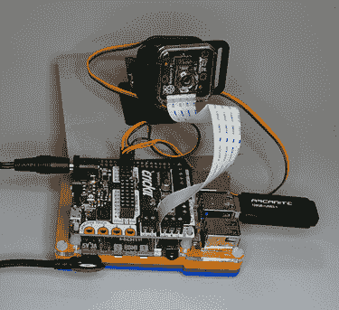

    图 C.9 伺服摄像头机器人：摄像头可以使用伺服电机移动。

## C.3 构建推送机器人

推送机器人配置创建了一个可以使用直流电机在轨道上来回行驶的机器人，然后，使用摄像头寻找具有匹配 QR 码的对象。一旦找到，可以使用连接到伺服电机的机械臂将物品从柜台上推下。这个机器人以多种方式结合了前两种机器人配置。这个配置将移动机器人配置添加摄像头和伺服电机。按照以下步骤构建机器人：

1.  完成移动机器人的配置。然后从机器人底盘上拆下 Pibow 外壳。

1.  切割一块纸板，将其粘贴到底盘上，然后使用胶水或双面泡沫胶带将万向节套件粘贴到纸板上。图 C.10 展示了从顶部视角看的样子。纸板条被切割成可以放置在魔术贴方块和电源按钮之间的样子。或者，也可以使用短尺代替纸板切割。确保将万向节套件放置在 Raspberry Pi 没有端口的一侧。这是与 HDMI 和 USB 电源端口相对的一侧。这一侧没有端口，所以将摄像头和伺服电机放在上面不会阻挡我们访问任何端口。

    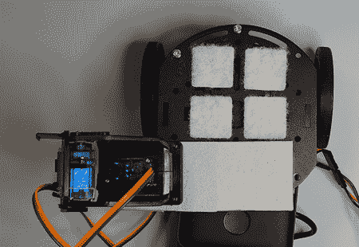

    图 C.10 万向节套件安装在底盘上：照片显示了万向节套件和机器人底盘的顶部视角。

组装步骤的下一步是安装摄像头：

1.  我们现在可以通过将魔术贴方块重叠在一起的方式重新将 Pibow 外壳安装到机器人底盘上。

1.  我们然后将一些魔术贴方块粘贴到 Pibow 外壳的侧面，以便我们可以将摄像头安装在机器人侧面。图 C.11 展示了粘贴这些粘合方块后机器人侧面的外观。

    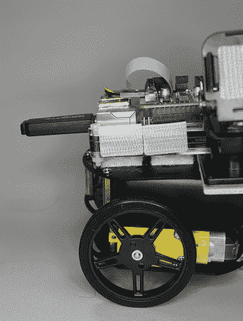

    图 C.11 摄像头魔术贴方块：魔术贴方块被安装在 Pibow 外壳的侧面。

1.  接下来，我们将摄像头安装在机器人的侧面。图 C.12 展示了摄像头安装后机器人的外观。摄像头外壳安装后将会放在机器人底盘上。连接线将从摄像头外壳顶部伸出。这意味着摄像头将倒置拍摄视频。这不会成为问题，因为我们可以在视频捕获期间通过翻转图像来纠正这一点。

    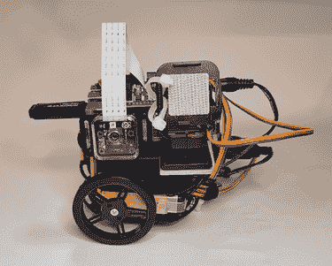

    图 C.12 摄像头安装：摄像头安装在机器人的侧面。

组装的最后一步是为机器人创建一个伺服臂：

1.  我们将使用 Pan-Tilt 套件的倾斜伺服器作为推动检测到的物体离开计数器的伺服器。我们想要将一个臂附加到倾斜伺服器上，以扩展倾斜伺服器的物理范围。套件上的安装支架有一个侧卡和槽，我们可以使用它们来固定臂在倾斜伺服器上。

1.  我们可以用铅笔作为臂，因为它坚固且轻，长度适中，可以为我们的臂提供良好的推动范围。将橡皮擦放在臂的底部，因为它在接触我们推动的物体时将提供一个较软的表面。使用两个拉链带将铅笔固定：一个拉链带在侧卡上方，另一个在下方。图 C.13 显示了带有伺服臂的机器人的侧面视图。

    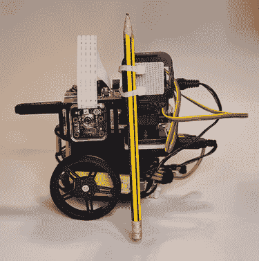

    图 C.13 伺服臂侧面视图：照片显示了带有伺服臂的机器人的侧面视图。

1.  图 C.14 显示了机器人的后视图。从这个视角，你可以更好地看到一根拉链带放在侧卡上方，另一根放在下方。这将使臂在反复抬起和放下时牢固地保持在原位。确保拧紧拉链带，以便它们可以牢固地抓住伺服臂。

    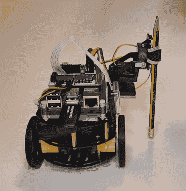

    图 C.14 伺服臂后视图：照片显示了带有伺服臂的机器人的后视图。

机器人现在已完成，可以放置在轨道上。检查下一节以获取有关为机器人创建轨道的更多详细信息。

## C.4 为推进机器人创建轨道

推进机器人沿着轨道前后移动。这是通过将机器人的移动限制在轨道路径上来控制火车路径的方式完成的。我们可以用两根棍子或杆子为机器人创建一个轨道。我们将在轨道的每一端放一些书，以确保当机器人沿着轨道移动时，轨道不会移动。按照以下步骤创建轨道：

1.  取两根棍子或杆子，并将它们平行放置在桌子上。图 C.15 显示了我们的桌子上并排放置的两根棍子。照片中的棍子是两根扫帚柄，刷子已被拧下。可以使用任何棍子或杆子。

1.  尽可能保持棍子之间的距离，使它们紧贴机器人的轮胎。图 C.15 也显示了机器人将要推动的物品可以放置在桌子的边缘，它们的 QR 码指向机器人，以便它在沿着轨道行驶时读取它们的 QR 码。

    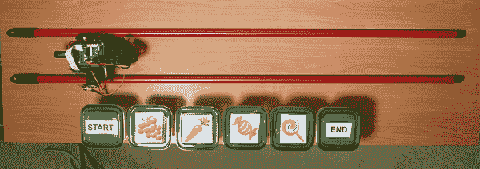

    图 C.15 机器人轨道：轨道应紧贴机器人的轮胎。

1.  图 C.16 显示了放置在轨道每端的书籍。当机器人来回移动时，它们将确保轨道牢固地保持在原位。

    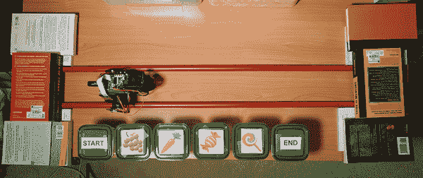

    图 C.16 轨道与书籍：我们使用书籍来稳固地固定轨道。

1.  起始标记应放置在轨道的起点，结束标记应放置在轨道上的最后一个项目处。图 C.15 显示了起始和结束标记，以及它们之间放置的四个小吃。

设置的最后部分是小吃盒：

1.  图 C.17 是其中一个小吃盒的照片。这些可以是任何容器或包装，只要我们的二维码放置在容器的正面。标签上的二维码应足够大，以便摄像头容易读取。测试了二维码的宽度和高度为 6 厘米，效果良好。

1.  二维码应面向机器人，以便它在经过时能够看到它。在测试中，摄像头与二维码之间的距离为 8 厘米效果良好。

    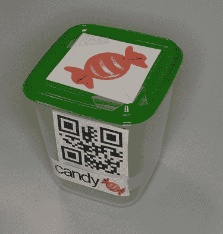

    图 C.17 小吃盒：小吃盒前面有一个二维码。
