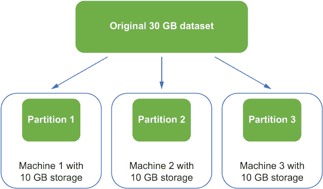
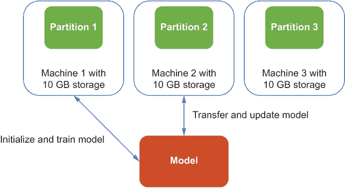
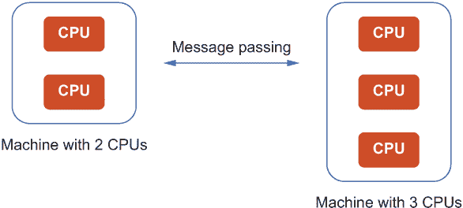
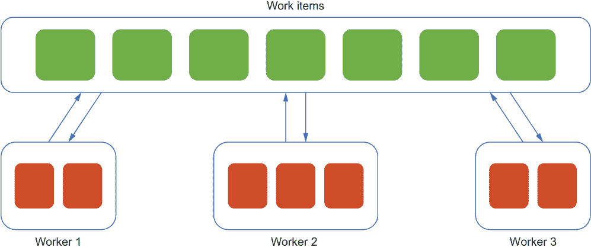
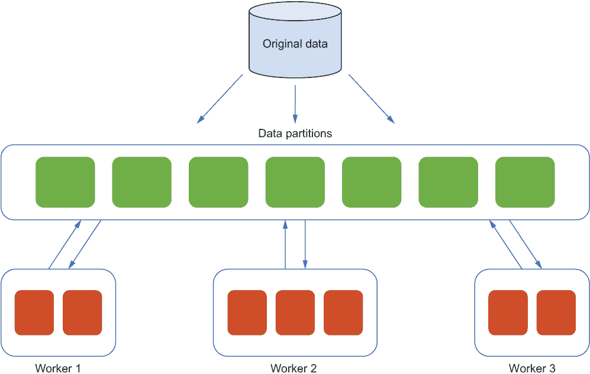
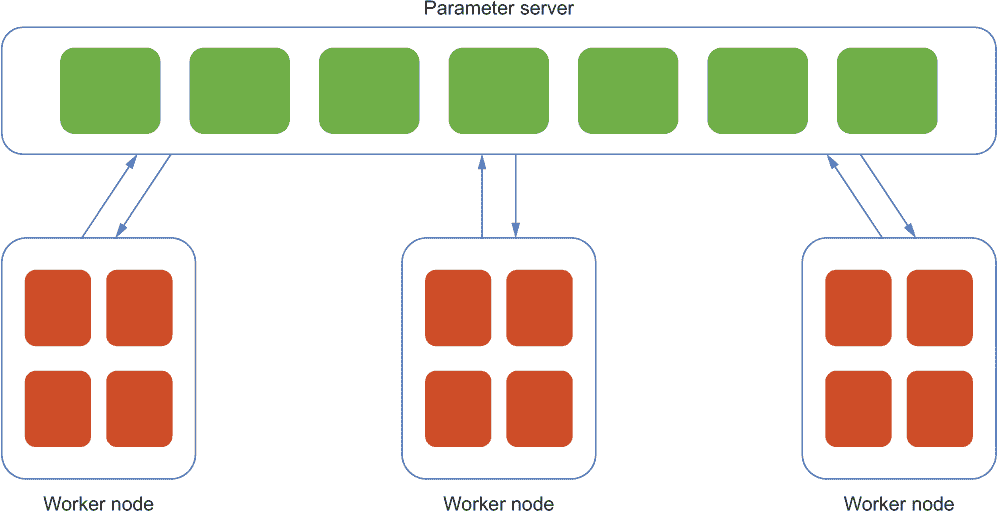

# 1 分布式机器学习系统简介

本章涵盖

+   处理大规模机器学习应用中的规模增长

+   建立可扩展和可靠的分布式系统模式

+   使用分布式系统中的模式和构建可重用模式

机器学习系统在当今变得越来越重要。推荐系统根据用户反馈和交互学习生成具有正确上下文的潜在感兴趣推荐，异常事件检测系统帮助监控资产以防止因极端条件而导致的停机，欺诈检测系统保护金融机构免受安全攻击和恶意欺诈行为。

对构建大规模分布式机器学习系统的需求日益增长。如果一个数据分析师、数据科学家或软件工程师在 Python 中构建机器学习模型方面有基本知识和实践经验，并希望通过学习如何构建更稳健、可扩展和可靠的系统来更进一步，那么这本书就是正确的选择。尽管在生产环境或分布式系统方面的经验不是必需的，但我期望处于这种位置的读者至少对在生产环境中运行的机器学习应用有所了解，并且应该至少编写过一年的 Python 和 Bash 脚本。

能够处理大规模问题，并将你在笔记本电脑上开发的内容扩展到大型分布式集群中是非常令人兴奋的。本书介绍了各种模式中的最佳实践，这些模式可以帮助你加快机器学习模型的开发和部署，使用来自不同工具的自动化，并从硬件加速中受益。阅读本书后，你将能够选择并应用正确的模式来构建和部署分布式机器学习系统；在机器学习工作流中适当使用常见的工具，如 TensorFlow ([`www.tensorflow.org`](https://www.tensorflow.org/))、Kubernetes ([`kubernetes.io`](https://kubernetes.io/))、Kubeflow ([`www.kubeflow.org`](https://www.kubeflow.org/))和 Argo Workflows；并在 Kubernetes 中管理自动化机器学习任务获得实践经验。第九章的一个全面、实践的项目提供了一个机会，可以构建一个使用我们在本书第二部分学到的许多模式的真实生活分布式机器学习系统。此外，在以下章节的一些部分末尾的补充练习回顾了我们学到的内容。

## 1.1 大规模机器学习

机器学习应用的范围已经变得前所未有的大。用户要求更快地响应以满足现实生活的需求，机器学习管道和模型架构也在变得更加复杂。在本节中，我们将更详细地讨论规模的增长以及我们可以采取哪些措施来应对挑战。

### 1.1.1 规模的增长

随着机器学习需求的增长，构建机器学习系统的复杂性也在增加。机器学习研究人员和数据分析师不再满足于在笔记本电脑上构建简单的机器学习模型，这些模型基于几 GB 的 Microsoft Excel 表格。由于需求的增长和复杂性，机器学习系统必须具备处理不断增长规模的能力，包括历史数据的增加量；频繁的 incoming 数据批次；复杂的机器学习架构；大量的模型服务流量；以及复杂的端到端机器学习管道。

让我们考虑两个场景。首先，想象一下你有一个小型机器学习模型，它是在一个小型数据集（小于 1 GB）上训练的。这种方法可能适合你当前的分析，因为你有一台具有足够计算资源的笔记本电脑。但你意识到数据集每小时增长 1 GB，所以原始模型在现实生活中不再有用和可预测。假设你想构建一个时间序列模型，预测火车组件在下一个小时内是否会失败，以防止故障和停机。在这种情况下，我们必须构建一个机器学习模型，该模型使用从原始数据和每小时到达的最新数据中获得的知识来生成更准确的预测。不幸的是，你的笔记本电脑计算资源固定，不再足以构建一个使用整个数据集的新模型。

其次，假设你已经成功训练了一个模型并开发了一个简单的 Web 应用程序，该应用程序使用训练好的模型根据用户的输入进行预测。在开始时，这个 Web 应用程序可能运行良好，生成准确的预测，用户对结果非常满意。这个用户的朋友们听说了这段美好的体验，决定也试试看，于是他们坐在同一个房间里打开了网站。讽刺的是，当他们试图查看预测结果时，开始看到更长的延迟。延迟的原因是，运行 Web 应用程序的单个服务器无法处理随着应用程序越来越受欢迎而增加的用户请求。这种情况是许多机器学习应用在从测试产品发展到流行应用过程中会遇到的一个常见挑战。这些应用需要建立在可扩展的机器学习系统模式之上，以处理不断增长的吞吐量规模。

### 1.1.2 我们能做什么？

当数据集太大而无法适应单个机器时，就像 1.1.1 节中的第一个场景一样，我们如何存储这个大数据集？也许我们可以将数据集的不同部分存储在不同的机器上，然后通过在不同机器上按顺序循环遍历数据集的不同部分来训练机器学习模型。

如果我们有一个如图 1.1 所示的 30 GB 数据集，我们可以将其分为三个 10 GB 数据的分区，每个分区位于具有足够磁盘存储的独立机器上。然后，我们可以逐个消费分区，而无需同时使用整个数据集来训练机器学习模型。

图 1.1 在三个具有足够磁盘存储的独立机器上将大型数据集分为三个分区的示例

然后，我们可能会问，如果遍历数据集的不同部分非常耗时，会发生什么。假设手头的数据集已经被分为三个分区。如图 1.2 所示，首先，我们在第一台机器上初始化机器学习模型，然后使用第一个数据分区中的所有数据进行训练。接下来，我们将训练好的模型转移到第二台机器上，该机器继续使用第二个数据分区进行训练。如果每个分区都很大且耗时，我们将花费大量时间等待。

图 1.2 在每个数据分区上依次训练模型的示例

在这种情况下，我们可以考虑添加工作节点。每个工作节点负责消费每个数据分区，所有工作节点并行训练相同的模型，而不需要等待他人。这种方法无疑有助于加快模型训练过程。但是，如果一些工作节点完成消费它们负责的数据分区并希望同时更新模型，我们应该首先使用哪个工作节点的结果（梯度）来更新模型？然后，我们必须考虑性能和模型质量之间的冲突和权衡。如图 1.2 所示，如果第一个工作节点使用的数据分区由于数据收集过程比第二个工作节点使用的数据分区更为严格而质量更好，那么首先使用第一个工作节点的结果将产生更准确的模型。另一方面，如果第二个工作节点有更小的分区，它可能训练得更快，因此我们可以开始使用该工作节点的计算资源来训练新的数据分区。当添加更多工作节点，如图 1.2 中所示的三个工作节点时，不同工作节点在数据消费完成时间上的冲突变得更加明显。

类似地，如果使用训练好的机器学习模型进行预测的应用观察到流量非常重，我们是否可以简单地添加服务器，每个新服务器处理一定比例的流量？遗憾的是，答案并不那么简单。这种简单的解决方案需要考虑其他因素，例如决定最佳的负载均衡策略以及在不同的服务器上处理重复请求。

我们将在本书的第二部分学习更多关于处理这些类型问题的知识。目前，主要的收获是我们已经建立了模式和最佳实践来处理某些情况，我们将使用这些模式来最大限度地利用我们有限的计算资源。

## 1.2 分布式系统

单台机器或笔记本电脑无法满足训练大量数据的大型机器学习模型的性能要求。我们需要编写可以在多台机器上运行并被世界各地的人访问的程序。在本节中，我们将讨论分布式系统是什么，并讨论一个在分布式系统中经常使用的具体示例模式。

### 1.2.1 什么是分布式系统？

计算机程序已经从只能在单台机器上运行发展到与多台机器协同工作。对计算能力的日益增长的需求和对更高效率、可靠性和可扩展性的追求推动了由数百或数千台计算机组成的大型数据中心的发展，这些计算机通过共享网络进行通信，这导致了分布式系统的开发。*分布式系统*是指组件位于不同的联网计算机上，并且可以通过消息传递相互通信以协调工作负载并协同工作。

图 1.3 展示了由两台机器组成的小型分布式系统，这两台机器通过消息传递相互通信。一台机器包含两个 CPU，另一台机器包含三个 CPU。显然，一台机器除了 CPU 之外还包含其他计算资源；我们在这里仅使用 CPU 进行说明。在现实世界的分布式系统中，机器的数量可以非常大——根据用例，可能有数万台。具有更多计算资源的机器可以处理更大的工作负载，并将结果与其他机器共享。

图 1.3 一个由两台机器组成的小型分布式系统示例，这两台机器具有不同数量的计算资源，通过消息传递相互通信

### 1.2.2 复杂性和模式

这些分布式系统可以在多台机器上运行，并且可以被全球各地的用户访问。它们通常很复杂，需要精心设计以确保更高的可靠性和可扩展性。不良的架构考虑可能导致问题，通常规模很大，并导致不必要的成本。

分布式系统有很多好的模式和可重用的组件。例如，在批处理系统中的*工作队列模式*确保每项工作都是独立的，并且可以在一定时间内无需任何干预进行处理。此外，工作者可以扩展和缩减，以确保工作负载能够得到妥善处理。

图 1.4 描述了七个工作项，每个工作项可能是一个需要由系统在处理队列中修改为灰度的图像。每个现有的三个工作者从处理队列中取出两个到三个工作项，确保没有工作者空闲，以避免计算资源的浪费，并通过同时处理多个图像来最大化性能。这种性能之所以可能，是因为每个工作项都是独立的。

图 1.4 使用工作队列模式修改图像为灰度的批处理系统示例

## 1.3 分布式机器学习系统

分布式系统不仅对通用计算任务有用，对机器学习应用也同样有用。想象一下，我们可以在分布式系统中使用多台具有大量计算资源的机器来消费大型数据集的部分，存储大型机器学习模型的不同分区，等等。考虑到可扩展性和可靠性，分布式系统可以大大加快机器学习应用的速度。在本节中，我们将介绍分布式机器学习系统，展示那些系统中常用的一些模式，并讨论一些实际场景。

### 1.3.1 什么是分布式机器学习系统？

一个 *分布式机器学习系统* 是一个由负责机器学习应用中不同步骤的步骤和组件组成的分布式系统，例如数据摄取、模型训练和模型服务。它使用与分布式系统类似的模式和最佳实践，以及专门为机器学习应用设计的模式。通过精心设计，分布式机器学习系统在处理大规模问题时更具可扩展性和可靠性，例如大型数据集、大型模型、重模型服务流量以及复杂的模型选择或架构优化。

### 1.3.2 是否有类似的模式？

为了处理将在实际应用中部署的机器学习系统的日益增长的需求和规模，我们需要仔细设计分布式机器学习管道中的组件。设计通常是复杂的，但使用良好的模式和最佳实践可以让我们加快机器学习模型的开发和部署，利用不同工具的自动化，并从硬件加速中受益。

分布式机器学习系统中也存在类似的模式。例如，可以使用多个工作节点异步训练机器学习模型，每个工作节点负责消费数据集的特定分区。这种方法类似于在分布式系统中使用的任务队列模式，可以显著加快模型训练过程。图 1.5 说明了我们如何通过用数据分区替换工作项来将此模式应用于分布式机器学习系统。每个工作节点从存储在数据库中的原始数据中获取一些数据分区，然后使用它们来训练一个集中的机器学习模型。

图 1.5 分布式机器学习系统中应用任务队列模式的示例

在机器学习系统中，除了通用分布式系统外，常用的另一种示例模式是用于分布式模型训练的**参数服务器模式**。如图 1.6 所示，参数服务器负责存储和更新训练模型的特定部分。每个工作节点负责获取数据集的特定部分，这些部分将用于更新模型参数的特定部分。当模型太大而无法适应单个服务器时，这种模式非常有用，此时可以专门使用参数服务器来存储模型分区，而不必分配不必要的计算资源。

图 1.6 分布式机器学习系统中应用参数服务器模式的示例

本书第二部分将介绍这些模式。目前，请记住，分布式机器学习系统中的某些模式也出现在通用分布式系统中，以及专门设计来处理大规模机器学习工作负载的模式。

### 1.3.3 我们应该在何时使用分布式机器学习系统？

如果数据集太大而无法适应我们的本地笔记本电脑，如图 1.1 和 1.2 所示，我们可以使用数据分区或引入额外的工人来加速模型训练。当以下任何一种情况发生时，我们应该开始考虑设计分布式机器学习系统：

+   模型很大，由数百万个参数组成，单个机器无法存储，必须在不同的机器上进行分区。

+   机器学习应用需要处理越来越多的重流量，而单个服务器已无法管理。

+   当前任务涉及模型生命周期的许多部分，例如数据摄入、模型服务、数据/模型版本控制和性能监控。

+   我们希望使用大量计算资源进行加速，例如每台服务器都配备了许多 GPU 的数十台服务器。

如果发生任何这些情况，通常是一个迹象，表明在不久的将来将需要一个设计良好的分布式机器学习系统。

### 1.3.4 我们在什么情况下不应该使用分布式机器学习系统？

尽管分布式机器学习系统在许多情况下都有帮助，但它通常更难设计，并且需要经验才能高效地操作。开发和维护这样一个复杂的系统涉及额外的开销和权衡。如果你遇到以下任何情况，请坚持使用已经工作得很好的简单方法：

+   数据集很小，例如小于 10 GB 的 CSV 文件。

+   模型简单，不需要复杂的计算，例如线性回归。

+   计算资源有限，但对于手头的任务来说是足够的。

## 1.4 本书我们将学习的内容

在本书中，我们将学习选择和应用正确的模式来构建和部署分布式机器学习系统，以获得管理和自动化机器学习任务的实际经验。我们将使用几个流行的框架和尖端技术来构建分布式机器学习工作流程的组件，包括以下内容：

+   TensorFlow ([`www.tensorflow.org`](https://www.tensorflow.org/))

+   Kubernetes ([`kubernetes.io`](https://kubernetes.io/))

+   Kubeflow ([`www.kubeflow.org`](https://www.kubeflow.org/))

+   Docker ([`www.docker.com`](https://www.docker.com/))

+   Argo Workflows ([`argoproj.github.io/workflows/`](https://argoproj.github.io/workflows/))

本书最后一部分的一个综合实战项目包括一个端到端的分布式机器学习管道系统。图 1.7 是我们将要构建的系统架构图。我们将通过以下章节中涵盖的许多模式获得实践经验。处理大规模问题和将我们在个人笔记本电脑上开发的内容扩展到大型分布式集群应该是令人兴奋的。

图 1.7 本书最后一部分我们将构建的端到端机器学习系统架构图

我们将使用 TensorFlow 和 Python 构建用于各种任务的机器学习和深度学习模型，例如基于真实数据集构建有用的特征、训练预测模型和进行实时预测。我们还将使用 Kubeflow 在 Kubernetes 集群中运行分布式机器学习任务。此外，我们将使用 Argo Workflows 构建一个由分布式机器学习系统许多重要组件组成的机器学习管道。这些技术的基础知识在第二章中介绍，我们将在第二部分中获得实践经验。表 1.1 显示了本书将涵盖的关键技术和示例用途。

表 1.1 本书涵盖的技术及其用途

| 技术 | 用途 |
| --- | --- |
| TensorFlow | 构建机器学习和深度学习模型 |
| Kubernetes | 管理分布式环境和资源 |
| Kubeflow | 在 Kubernetes 集群上轻松提交和管理分布式训练作业 |
| Argo Workflows | 定义、编排和管理工作流 |
| Docker | 构建和管理用于启动容器化环境的镜像 |

在我们深入到第二章的细节之前，我建议读者具备在 Python 中构建机器学习模型的基本知识和实践经验。尽管在生产环境或分布式系统中的经验不是必需的，但我期望处于这种位置的读者至少对在生产环境中运行的机器学习应用有所了解，并且至少已经编写了 Python 和 Bash 脚本一年以上。此外，了解 Docker 的基础知识并能够使用 Docker 命令行界面管理镜像/容器是必需的。熟悉基本的 YAML 语法有帮助但不是必需的；语法直观，应该可以在学习过程中轻松掌握。如果这些主题大部分对你来说都是新的，我建议你在继续阅读之前从其他资源中了解更多相关信息。

## 摘要

+   在实际应用中部署的机器学习系统通常需要处理更大数据集和更重的模型服务流量不断增长的问题。

+   设计大规模分布式机器学习系统并非易事。

+   分布式机器学习系统通常是一个由许多组件组成的管道，例如数据摄取、模型训练、服务和监控。

+   使用良好的模式来设计机器学习系统的组件可以加快机器学习模型的开发和部署，使不同工具的自动化功能得以使用，并从硬件加速中受益。
