# 2 数据摄取模式

本章涵盖

+   理解数据摄取及其责任

+   通过批量消耗较小的数据集来在内存中处理大规模数据集（批量模式）

+   在多台机器上将极大规模的数据集预处理为更小的数据块（分片模式）

+   为多次训练轮次检索和重新访问相同的 dataset（缓存模式）

第一章讨论了现代机器学习应用的增长规模，如更大的数据集和更重的模型服务流量。它还讨论了构建分布式系统的复杂性和挑战，特别是针对机器学习应用的分布式系统。我们了解到，分布式机器学习系统通常是一个由许多组件组成的管道，如数据摄取、模型训练、服务、监控，并且有一些既定的模式可用于设计每个组件以处理现实世界机器学习应用的规模和复杂性。

所有数据分析师和科学家都应该对数据摄取有一定程度的了解，无论是通过实际构建数据摄取组件的动手经验，还是简单地使用来自工程团队或客户的 dataset。设计一个好的数据摄取组件并不简单，需要理解我们想要用于构建机器学习模型的 dataset 的特征。幸运的是，我们可以遵循既定的模式，在可靠和高效的基础上构建该模型。

本章探讨了数据摄取过程中的一些挑战，并介绍了一些在行业中广泛采用的既定模式。在第 2.3 节中，我们将使用批量模式来处理和准备大型数据集以进行模型训练，无论是我们使用的机器学习框架无法处理大型数据集，还是需要框架底层实现的领域专业知识。在第 2.4 节中，我们将学习如何应用分片模式将极大规模的数据集分割成多个数据分片，这些数据分片分布在多个工作机器上；然后，随着我们添加负责独立在每个数据分片上训练模型的工作机器，我们加快了训练过程。第 2.5 节介绍了缓存模式，当重新访问和处理用于多轮模型训练的先前使用的 dataset 时，它可以大大加快数据摄取过程。

## 2.1 什么是数据摄取？

假设我们手头有一个数据集，我们希望构建一个机器学习系统，从这个数据集中构建机器学习模型。我们首先应该考虑什么？答案是相当直观的：首先，我们应该更好地理解数据集。数据集是从哪里来的，是如何收集的？数据集的来源和大小是否随时间变化？处理数据集的基础设施需求是什么？我们应该首先提出这些问题。在我们开始构建分布式机器学习系统之前，我们还应该考虑可能影响处理数据集过程的不同观点。我们将在本章剩余部分的示例中探讨这些问题和考虑因素，并学习如何通过使用不同的既定模式来解决我们可能遇到的一些问题。

*数据摄取* 是一个监控数据源、一次性（非流式）或以流式方式消费数据，并为机器学习模型的训练过程进行预处理的流程。简而言之，流式数据摄取通常需要长时间运行的过程来监控数据源的变化；非流式数据摄取以离线批处理作业的形式发生，按需处理数据集。此外，在流式数据摄取中，数据随时间增长，而非流式数据摄取中数据集的大小是固定的。表 2.1 总结了这些差异。

表 2.1 比较机器学习应用中的流式和非流式数据摄取

|  | 流式数据摄取 | 非流式数据摄取 |
| --- | --- | --- |
| 数据集大小 | 随时间增加 | 大小固定 |
| 基础设施需求 | 长时间运行的过程来监控数据源的变化 | 离线批处理作业来按需处理数据集 |

本章剩余部分将专注于从非流式视角的数据摄取模式，但它们也可以应用于流式数据摄取。

数据摄取是机器学习流程中的第一步，也是不可避免的一步，如图 2.1 所示。如果没有正确摄取的数据集，机器学习流程中的其余过程将无法进行。

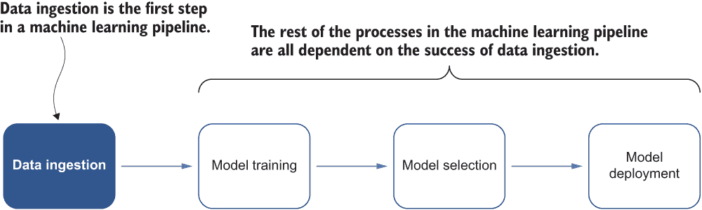

图 2.1 表示机器学习流程的流程图。请注意，数据摄取是流程中的第一步。

下一个部分介绍了 Fashion-MNIST 数据集，我将用它来展示本章剩余部分中的模式。我专注于构建分布式机器学习应用中的数据摄取模式，这些模式与在本地机器或笔记本电脑上发生的数据摄取不同。分布式机器学习应用中的数据摄取通常更复杂，需要精心设计来处理大规模数据集或快速增长的数据集。

## 2.2 The Fashion-MNIST dataset

LeCun 等人创建的 MNIST 数据集([`yann.lecun.com/exdb/mnist/`](http://yann.lecun.com/exdb/mnist/))是图像分类中最广泛使用的数据库之一。它包含从手写数字图像中提取的 60,000 张训练图像和 10,000 张测试图像；在机器学习研究社区中广泛用作基准数据集，以验证最先进的算法和机器学习模型。图 2.2 展示了一些手写数字的示例图像，每行代表特定手写数字的图像。

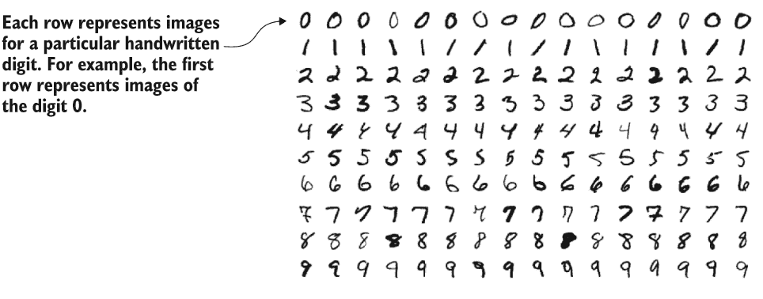

图 2.2 手写数字 0 到 9 的示例图像截图，每行代表特定手写数字的图像（来源：Josep Steffan，许可协议为 CC BY-SA 4.0）

尽管在社区中得到了广泛的应用，研究人员发现这个数据集不适合区分强模型和弱模型；现在许多简单的模型都能达到超过 95% 的分类准确率。因此，MNIST 数据集现在更多地作为一项理智检查，而不是基准。

注意：MNIST 数据集的创建者保留了一份在数据集上测试过的机器学习方法的列表。在 1998 年发表的关于 MNIST 数据集的原始论文“应用于文档识别的基于梯度的学习”中([`yann.lecun.com/exdb/publis/index.xhtml#lecun-98`](http://yann.lecun.com/exdb/publis/index.xhtml#lecun-98))，LeCun 等人表示他们使用支持向量机模型将错误率降至 0.8%。2017 年发布了一个类似但扩展的数据集，称为 EMNIST。EMNIST 包含 240,000 张训练图像和 40,000 张测试图像的手写数字和字符。

在本书的多个示例中，我将不会使用 MNIST 数据集，而是将重点放在一个数量级相似但相对更复杂的数据集上：2017 年发布的 Fashion-MNIST 数据集([`github.com/zalandoresearch/fashion-mnist`](https://github.com/zalandoresearch/fashion-mnist))。Fashion-MNIST 是由 Zalando 的文章图像组成的数据库，包括 60,000 个示例的训练集和 10,000 个示例的测试集。每个示例是一个与十个类别之一的标签相关联的 28 × 28 灰度图像。Fashion-MNIST 数据集旨在作为原始 MNIST 数据集的直接替代品，用于基准测试机器学习算法。它使用相同的图像大小和结构进行训练和测试分割。

图 2.3 展示了 Fashion-MNIST 中所有 10 个类别（T 恤/上衣、裤子、开衫、连衣裙、外套、凉鞋、衬衫、运动鞋、包和踝靴）的图像集合。每个类别占据了截图的三行。


图 2.3 Fashion-MNIST 数据集中所有 10 个类别（T 恤/上衣、裤子、开衫、连衣裙、外套、凉鞋、衬衫、运动鞋、包和踝靴）的图像集合截图（来源：Zalando SE，许可协议为 MIT 许可证）

图 2.4 提供了对训练集中前几个示例图像及其相应文本标签的近距离观察。接下来，我将讨论案例研究的场景。


图 2.4 训练集中的前几个示例图像（来源：Zalando SE，MIT 许可证授权）

假设我们已经下载了 Fashion-MNIST 数据集。压缩版本在磁盘上应该只占用 30 MB。尽管数据集很小，但使用现有的实现一次性将下载的数据集加载到内存中是微不足道的。例如，如果我们使用 TensorFlow 这样的机器学习框架，我们可以用几行 Python 代码下载并加载整个 Fashion-MNIST 数据集到内存中，如下所示。

列表 2.1 使用 TensorFlow 将 Fashion-MNIST 数据集加载到内存中

```
> import tensorflow as tf                                      ❶
>
> train, test = tf.keras.datasets.fashion_mnist.load_data()    ❷

32768/29515 [=================================] - 0s 0us/step
26427392/26421880 [==============================] - 0s 0us/step
8192/5148 [===============================================] - 0s 0us/step
4423680/4422102 [==============================] - 0s 0us/step
```

❶ 加载 TensorFlow 库

❷ 下载 Fashion-MNIST 数据集并将其加载到内存中

或者，如果数据集已经存在于内存中——例如以 NumPy ([`numpy.org`](https://numpy.org)) 数组的形式——我们可以从内存中的数组表示形式加载数据集到机器学习框架接受的格式中，例如 tf.Tensor 对象，这可以很容易地用于后续的模型训练。以下列表展示了示例。

列表 2.2 将 Fashion-MNIST 数据集从内存加载到 TensorFlow 中

```
> from tensorflow.data import Dataset
>
> images, labels = train                                   ❶
> images = images/255                                      ❷
>
> dataset = Dataset.from_tensor_slices((images, labels))   ❸
> dataset                                                  ❹
<TensorSliceDataset shapes: ((28, 28), ()), types: (tf.float64, tf.uint8)> 
```

❶ 将训练数据集对象拆分为图像和标签

❷ 标准化图像

❸ 将内存中的数组表示形式加载到 tf.data.Dataset 对象中，这将使其更容易在 TensorFlow 中进行训练

❹ 检查数据集的信息，例如形状和数据类型

## 2.3 批处理模式

现在我们已经知道了 Fashion-MNIST 数据集的样子，让我们考察一下在现实场景中可能会遇到的一个潜在问题。

### 2.3.1 问题：在内存有限的情况下对 Fashion MNIST 数据集执行昂贵的操作

虽然将像 Fashion-MNIST 这样的小型数据集加载到内存中以便为模型训练做准备很容易，但在现实世界的机器学习应用中，这个过程可能具有挑战性。例如，列表 2.1 中的代码片段可以用来将 Fashion-MNIST 加载到内存中，以便在 TensorFlow 中进行模型训练；它将特征和标签数组嵌入我们的 TensorFlow 图中作为 tf.constant()操作。这个过程对于小型数据集来说效果很好，但它浪费了内存，因为 NumPy 数组的内容将被复制多次，并且可能会遇到 TensorFlow 使用的 tf.GraphDef 协议缓冲区的 2 GB 限制。在现实世界的应用中，数据集通常要大得多，尤其是在数据集随时间增长的分步机器学习系统中。

图 2.5 显示了 1.5GB 的内存中 NumPy 数组表示，该表示将使用 tf.constant()操作复制两次。这个操作会导致内存不足错误，因为总大小 3GB 超过了 TensorFlow 使用的 tf.GraphDef 协议缓冲区的最大大小。

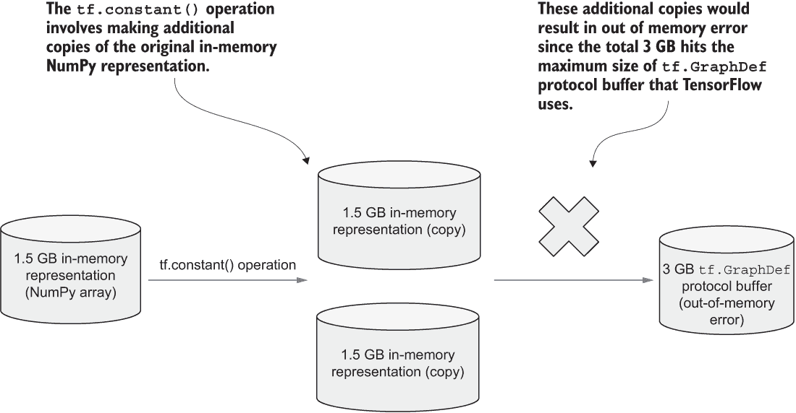

图 2.5 一个 1.5GB 内存中 NumPy 数组表示的示例，当转换为 tf.GraphDef 协议缓冲区时遇到内存不足错误

在不同的机器学习或数据加载框架中，这类问题经常发生。用户可能没有以最佳方式使用特定框架，或者框架可能无法处理更大的数据集。

此外，即使是像 Fashion-MNIST 这样的小型数据集，在将数据集输入到模型之前，我们也可能执行额外的计算，这在需要额外转换和清理的任务中很常见。对于计算机视觉任务，图像通常需要调整大小、归一化或转换为灰度，或者可能需要更复杂的数学运算，例如卷积运算。这些操作可能需要大量的额外内存空间分配，但我们可能没有很多计算资源可用，在将整个数据集加载到内存之后。

### 2.3.2 解决方案

考虑到 2.2 节中提到的第一个问题。我们希望使用 TensorFlow 的 from_tensor_slices() API 将 Fashion-MNIST 数据集从内存中的 NumPy 数组表示加载到 TensorFlow 模型训练程序可以使用的 tf.Dataset 对象中。然而，由于 NumPy 数组的内容将被多次复制，我们可能会遇到 tf.GraphDef 协议缓冲区的 2GB 限制。因此，我们无法加载超过此限制的更大数据集。

对于像 TensorFlow 这样的特定框架，看到这类问题并不罕见。在这种情况下，解决方案很简单，因为我们没有充分利用 TensorFlow。其他 API 允许我们在不首先将整个数据集加载到内存表示的情况下加载大型数据集。

例如，TensorFlow 的 I/O 库是一个包含文件系统和文件格式的集合，这些在 TensorFlow 的内置支持中是不可用的。我们可以从 URL 加载像 MNIST 这样的数据集，以便直接访问传递给 tfio.IODataset.from_mnist() API 调用的数据集文件，如下面的列表所示。这种能力归功于 TensorFlow ([`github.com/tensorflow/io`](https://github.com/tensorflow/io)) I/O 库对 HTTP 文件系统的固有支持，消除了在本地目录中下载和保存数据集的需要。

列表 2.3 使用 TensorFlow I/O 加载 MNIST 数据集

```
> import tensorflow_io as tfio            ❶
>
> d_train = tfio.IODataset.from_mnist(    ❷
    'http:/ /yann.lecun.com/exdb/mnist/train-images-idx3-ubyte.gz',
    'http:/ /yann.lecun.com/exdb/mnist/train-labels-idx1-ubyte.gz')
```

❶ 加载 TensorFlow I/O 库

❷ 从 URL 加载 MNIST 数据集以直接访问数据集文件，无需通过 HTTP 文件系统支持下载

对于可能存储在分布式文件系统或数据库中的大型数据集，一些 API 可以在不一次性下载所有内容的情况下加载它们，这可能会引起内存或磁盘相关的问题。为了演示目的，在此不深入细节，以下列表展示了如何从 PostgreSQL 数据库加载数据集([`www.postgresql.org`](https://www.postgresql.org))。（您需要设置自己的 PostgreSQL 数据库并提供运行此示例所需的环境变量。）

列表 2.4 从 PostgreSQL 数据库加载数据集

```
> import os                                                    ❶
> import tensorflow_io as tfio                                 ❷
>
> endpoint="postgresql://{}:{}@{}?port={}&dbname={}".format(   ❸
    os.environ['TFIO_DEMO_DATABASE_USER'],
    os.environ['TFIO_DEMO_DATABASE_PASS'],
    os.environ['TFIO_DEMO_DATABASE_HOST'],
    os.environ['TFIO_DEMO_DATABASE_PORT'],
    os.environ['TFIO_DEMO_DATABASE_NAME'],
)
>
> dataset = tfio.experimental.IODataset.from_sql(              ❹
    query="SELECT co, pt08s1 FROM AirQualityUCI;",
    endpoint=endpoint)
> print(dataset.element_spec)                                  ❺
{
    'co': TensorSpec(shape=(), dtype=tf.float32, name=None),
    'pt08s1': TensorSpec(shape=(), dtype=tf.int32, name=None)
}
```

❶ 加载 Python 的内置 OS 库，用于加载与 PostgreSQL 数据库相关的环境变量

❷ 加载 TensorFlow I/O 库

❸ 构建访问 PostgreSQL 数据库的端点

❹ 从数据库中的 AirQualityUCI 表中选取两列并实例化一个 tf.data.Dataset 对象

❺ 检查数据集的规范，例如每列的形状和数据类型

现在，让我们回到我们的场景。在这种情况下，假设 TensorFlow 不提供像 TensorFlow I/O 这样的 API 来处理大数据集。鉴于我们没有太多的空闲内存，我们不应直接将整个 Fashion-MNIST 数据集加载到内存中。让我们假设我们想要在数据集上执行的数学运算可以在整个数据集的子集上执行。然后我们可以将数据集划分为更小的子集（*mini-batches*），加载每个示例图像的 mini-batch，对每个批次执行昂贵的数学运算，并在每个模型训练迭代中仅使用一个 mini-batch 的图像。

如果第一个 mini-batch 包含图 2.4 中的 19 个示例图像，我们可以首先对这些图像执行卷积或其他复杂的数学运算，然后将转换后的图像发送到机器学习模型进行模型训练。我们在同时继续模型训练的过程中重复对剩余的 mini-batches 执行相同的操作。

由于我们将数据集划分为许多小的子集或 mini-batches，我们在执行达到准确分类模型所需的复杂数学运算时避免了潜在的内存不足问题。然后我们可以通过减小 mini-batch 的大小来处理更大的数据集。这种方法称为*批处理*。在数据摄取过程中，批处理涉及将整个数据集中的数据记录分组到将要依次用于训练机器学习模型的批次中。

如果我们有一个包含 100 条记录的数据集，我们可以从 100 条记录中取出 50 条来形成一个批次，然后使用这个记录批次来训练模型。我们重复此批处理和模型训练过程，直到处理完剩余的记录。换句话说，我们总共制作了两个批次；每个批次包含 50 条记录，我们正在训练的模型逐个消耗这些批次。图 2.6 说明了将原始数据集分为两个批次的过程。第一个批次在时间 t0 被消耗以训练模型，第二个批次在时间 t1 被消耗。因此，我们不必一次性将整个数据集加载到内存中；相反，我们是按顺序，批次批次地消耗数据集。

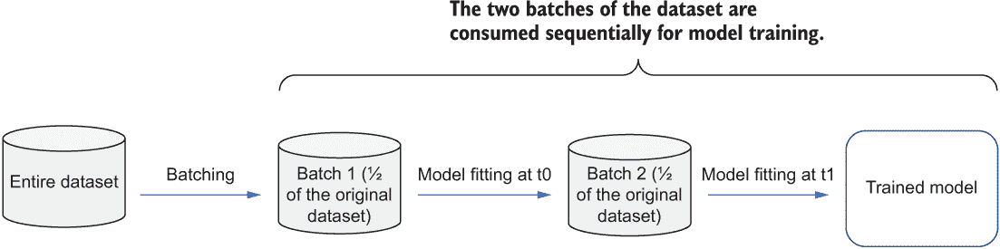

图 2.6 数据集被分为两个批次。第一个批次在时间 t0 被消耗以训练模型，第二个批次在时间 t1 被消耗。

这种**批处理模式**可以总结为以下列表中的伪代码，其中我们持续尝试从数据集中读取下一个批次并训练模型，直到没有更多批次为止。

列表 2.5 批处理的伪代码

```
batch = read_next_batch(dataset)      ❶
while batch is not None:
    model.train(batch)                ❷
    batch = read_next_batch(dataset)  ❸
```

❶ 从数据集中读取下一个批次

❷ 使用这个批次训练模型

❸ 在训练当前批次之后读取下一个批次

当我们想要处理和准备大型数据集以进行模型训练时，我们可以应用批处理模式。当我们使用的框架只能处理内存中的数据集时，我们可以处理整个大型数据集的小批次，以确保每个批次都可以在有限的内存中处理。此外，如果数据集被分为批次，我们可以对每个批次进行顺序的密集计算，而不需要大量的计算资源。我们将在第 9.1.2 节中应用此模式。

### 2.3.3 讨论

在执行批处理时，需要考虑其他因素。这种方法只有在所执行的数学运算或算法可以在整个数据集的子集上以流式方式执行时才是可行的。如果一个算法需要了解整个数据集，例如整个数据集中某个特征的求和，那么批处理就不再是一个可行的方案，因为无法从整个数据集的子集中获得此类信息。

此外，机器学习研究人员和从业者经常在 Fashion-MNIST 数据集上尝试不同的机器学习模型，以获得性能更好、更准确的模型。如果一个算法希望为每个类别至少看到 10 个示例来初始化其模型参数，例如，批处理不是一种合适的方法。不能保证每个小批次都包含至少来自每个类别的 10 个示例，尤其是在批次大小较小时。在极端情况下，批次大小为 10，并且很难在所有批次中至少看到每个类别的至少一个图像。

另一个需要记住的是，机器学习模型的批大小，尤其是对于深度学习模型，强烈依赖于资源分配，这使得在共享资源环境中预先决定特别困难。此外，机器学习作业可以高效使用的资源分配不仅取决于正在训练的模型的结构，还取决于批大小。这种资源和批大小之间的相互依赖关系，为机器学习从业者配置作业以实现高效执行和资源使用创造了一个复杂的考虑因素网络。

幸运的是，有一些算法和框架可以消除手动调整批量大小的需求。例如，AdaptDL ([`github.com/petuum/adaptdl`](https://github.com/petuum/adaptdl)) 提供了自动批量大小的缩放功能，使得在不需要手动调整批量大小的努力下，能够进行高效的分布式训练。它在训练过程中测量系统性能和梯度噪声尺度，并自适应地选择最有效的批大小。图 2.7 比较了自动和手动调整批大小对 ResNet18 模型整体训练时间的影响 ([`arxiv.org/abs/1512.03385`](https://arxiv.org/abs/1512.03385))。

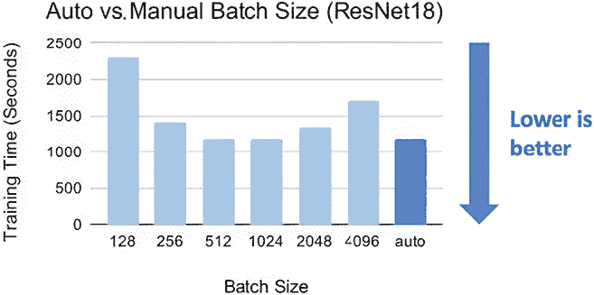

图 2.7 自动和手动调整批大小对 ResNet18 模型整体训练时间影响的比较（来源：Petuum，许可协议为 Apache License 2.0）

批处理模式提供了一种很好的方法来提取整个数据集的子集，以便我们可以顺序地提供批次进行模型训练。对于可能不适合单台机器的极大规模数据集，我们需要其他技术。下一节将介绍一种新的模式，该模式解决了这些挑战。

### 2.3.4 练习

1.  我们是并行还是顺序地使用批次来训练模型？

1.  如果我们使用的机器学习框架无法处理大型数据集，我们能否使用批处理模式？

1.  如果一个机器学习模型需要知道整个数据集特征的均值，我们还能使用批处理模式吗？

## 2.4 分片模式：在多台机器之间分割极大规模的数据集

第 2.3 节介绍了 Fashion-MNIST 数据集，其压缩版本在磁盘上仅占用 30 MB。尽管一次性将整个数据集加载到内存中是微不足道的，但加载用于模型训练的大型数据集却具有挑战性。

第 2.3 节中讨论的批处理模式通过将整个数据集的数据记录分组到将要用于顺序训练模型的批次中，来解决这一问题。当我们想要处理和准备大型数据集以进行模型训练时，无论是我们使用的框架无法处理大型数据集，还是框架的底层实现需要领域专业知识，我们都可以应用批处理模式。

假设我们手头有一个更大的数据集。这个数据集比 Fashion-MNIST 数据集大 1000 倍。换句话说，它的压缩版本在磁盘上占用 30 MB × 1,000 = 30 GB，解压缩后大约是 50 GB。这个新的数据集有 60,000 × 1,000 = 60,000,000 个训练样本。

我们将尝试使用这个更大的数据集来训练我们的机器学习模型，以便将图像分类到扩展的 Fashion-MNIST 数据集（T 恤、包等）中的类别。现在，我不会详细讨论机器学习模型的架构（第三章）；相反，我将专注于其数据摄取组件。假设我们可以使用三台机器来加速任何潜在的过程。

根据我们的经验，由于数据集很大，我们可以先尝试应用批处理模式，将整个数据集分成足够小，可以加载到内存中进行模型训练的批次。假设我们的笔记本电脑有足够的资源来存储整个 50 GB 的未压缩数据集。我们将数据集分成 10 个小批次（每个 5 GB）。使用这种批处理方法，只要我们的笔记本电脑可以存储大型数据集并将它们分成批次，我们就可以处理大型数据集。

接下来，我们开始使用数据批次进行模型训练过程。在第 2.3 节中，我们按顺序训练了模型。换句话说，在下一个批次被消耗之前，机器学习模型已经完全消耗了一个批次。在图 2.8 中，第二个批次在时间 t1 被模型拟合消耗，而第一个批次在时间 t0 已经被模型完全消耗。t0 和 t1 代表这个过程中的两个连续时间点。

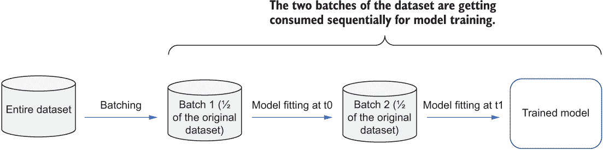

图 2.8 数据集被分成两个批次。第一个批次在时间 t0 被消耗以训练模型，第二个批次在时间 t1 被消耗。

### 2.4.1 问题

不幸的是，这种按顺序处理数据的过程可能会很慢。如果我们训练的特定模型中，每个 5 GB 的数据批次需要大约 1 小时来完成，那么在整个数据集上完成模型训练过程将需要 10 小时。换句话说，如果我们有足够的时间按批次顺序训练模型，批处理方法可能效果很好。然而，在现实世界的应用中，总是需要更高效的模型训练，而这将受到处理数据批次所需时间的影响。

### 2.4.2 解决方案

既然我们已经理解了仅使用批处理模式按顺序训练模型的速度较慢，我们可以做些什么来加快数据摄入部分，这将极大地影响模型训练过程？主要问题是我们需要按顺序，批次批次地训练模型。我们能否准备多个批次，然后同时将它们发送到机器学习模型进行消费？图 2.9 显示数据集被分成两个批次，每个批次同时被用于训练模型。这种方法目前还不适用，因为我们不能同时将整个数据集（两个批次）保存在内存中，但它接近解决方案。

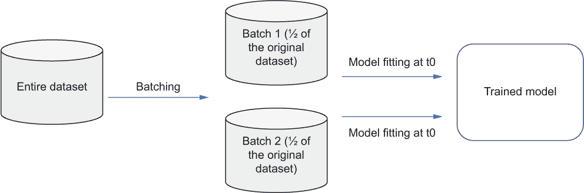

图 2.9 数据集被分成两个批次；每个批次同时被用于训练模型。

假设我们有多个工作机器，每个机器上都包含一个机器学习模型的副本。每个副本可以消费原始数据集的一个批次；因此，工作机器可以独立消费多个批次。图 2.10 显示了多个工作机器的架构图；每个机器独立消费批次以训练其上的模型副本。

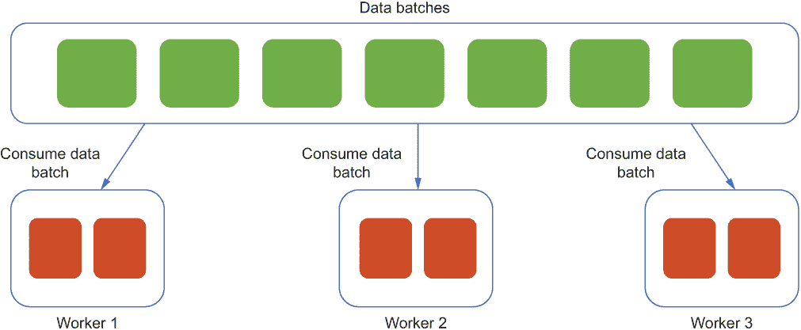

图 2.10 多个工作机器的架构图。每个工作机器独立消费批次以训练其上的模型副本。

你可能会想知道，如果多个模型副本独立消费多个不同的批次，我们将从这些模型副本中获得最终的机器学习模型，这是一个很好的问题。请放心，我将在第三章中详细介绍模型训练过程。现在，假设我们有允许多个工作机器独立消费多个数据集批次的模式。这些模式将极大地加快模型训练过程，因为顺序模型训练的性质而减慢。

注意：在第三章中，我们将使用名为*收集通信模式*的模式来训练位于多个工作机器上的多个模型副本。例如，集体通信模式将负责在工作机器之间通信梯度计算的更新，并保持模型副本同步。

我们如何生产那些工作机器使用的批次呢？在我们的场景中，数据集有 6000 万个训练示例，并且有 3 个工作机器可用。将数据集分成多个非重叠的子集，然后将每个子集发送到三个工作机器，就像图 2.11 所示，这个过程很简单。将大型数据集拆分成多个分散在多个机器上的小数据块的过程被称为*分片*，而较小的数据块被称为*数据分片*。图 2.11 显示了原始数据集被分片成多个非重叠的数据分片，然后被多个工作机器消费。

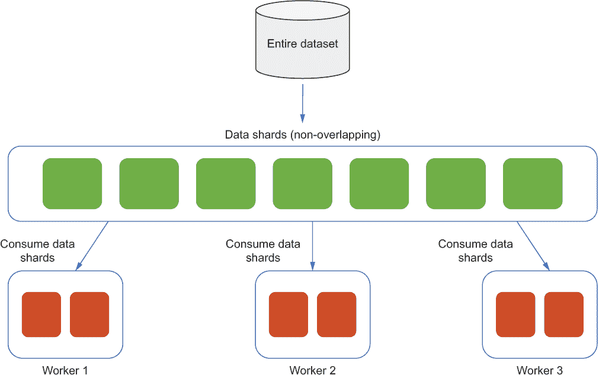

图 2.11 一个架构图，其中原始数据集被分割成多个非重叠的数据分片，然后由多个工作机器消费

注意：尽管我在这里介绍了分片，但这个概念并不新颖；它通常用于分布式数据库中。在分布式数据库中的分片对于解决诸如提供数据库高可用性、增加吞吐量和减少查询响应时间等扩展挑战非常有用。

分片本质上是一个水平数据分区，包含整个数据集的子集，分片也被称为*水平分区*。水平与垂直的区别来自于数据库的传统表格视图。数据库可以垂直分割——将不同的表列存储在不同的数据库中——或者水平分割——将同一表的行存储在多个数据库中。图 2.12 比较了垂直分区和水平分区。请注意，对于垂直分区，我们将数据库分割成列。一些列可能为空，这就是为什么我们看到图右侧分区中只有五行中的三行。

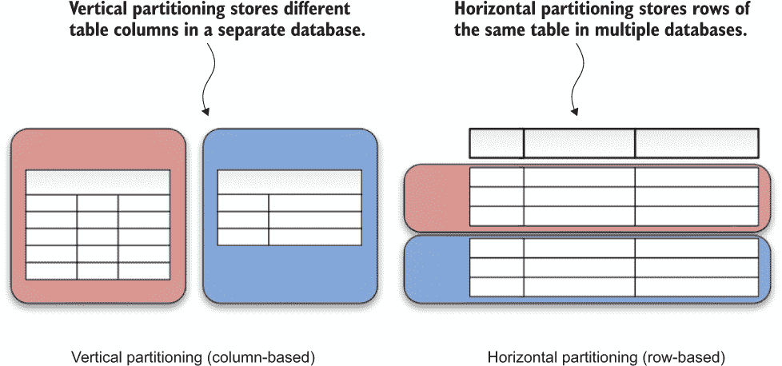

图 2.12 垂直分区与水平分区（来源：YugabyteDB，Apache License 2.0 许可）

这种*分片模式*可以在列表 2.6 中的伪代码中总结，其中首先，我们从其中一个工作机器（在这种情况下，是排名为 0 的工作机器）创建数据分片，然后将其发送到所有其他工作机器。接下来，在每个工作机器上，我们持续尝试读取本地将用于训练模型的下一个分片，直到没有更多分片留在本地。

列表 2.6 分片伪代码

```
if get_worker_rank() == 0:             ❶
    create_and_send_shards(dataset)    ❶
shard = read_next_shard_locally()      ❷
while shard is not None:
    model.train(shard)                 ❸
    shard = read_next_shard_locally()  ❹
```

❶ 从排名为 0 的工作机器创建并发送分片到所有其他工作机器

❷ 在此工作机器上读取下一个可用的分片

❸ 使用从本地工作机器读取的最后一个分片来训练模型

❹ 完成当前分片训练后，读取下一个分片

通过使用分片模式，我们可以将极其庞大的数据集分割成多个数据分片，这些分片可以分散在多个工作机器上，然后每个工作机器独立负责消费单个数据分片。因此，我们避免了由于批处理模式导致的顺序模型训练缓慢的问题。有时，将大型数据集分割成不同大小的子集也是有用的，这样每个分片可以根据每个工作机器中可用的计算资源量运行不同的计算工作负载。我们将在第 9.1.2 节中应用此模式。

### 2.4.3 讨论

我们已经成功使用分片模式将一个非常大的数据集分割成多个数据分片，这些分片分布在多个工作机之间，并在添加负责独立在每个数据分片上训练模型的额外工作机时加速了训练过程。这很好，并且使用这种方法，我们可以在非常大的数据集上训练机器学习模型。

现在问题来了：如果数据集持续增长，并且我们需要将刚刚到达的新数据纳入模型训练过程中，该怎么办？在这种情况下，如果数据集已经更新，我们不得不不时地重新分片，以重新平衡每个数据分片，确保它们在不同工作机之间相对均匀地分割。

在 2.3.2 节中，我们只是简单地将数据集分为两个不重叠的分片，但不幸的是，在现实世界的系统中，这种方法并不理想，甚至可能根本不起作用。手动分片的最大挑战之一是不均匀的分片分配。数据的不均匀分布可能导致分片不平衡，一些分片过载，而另一些则相对空闲。这种不平衡可能导致涉及多个工作机的模型训练过程意外挂起，我们将在下一章中进一步讨论。图 2.13 是一个示例，其中原始数据集被分割成多个不平衡的数据分片，然后由多个工作机消费。

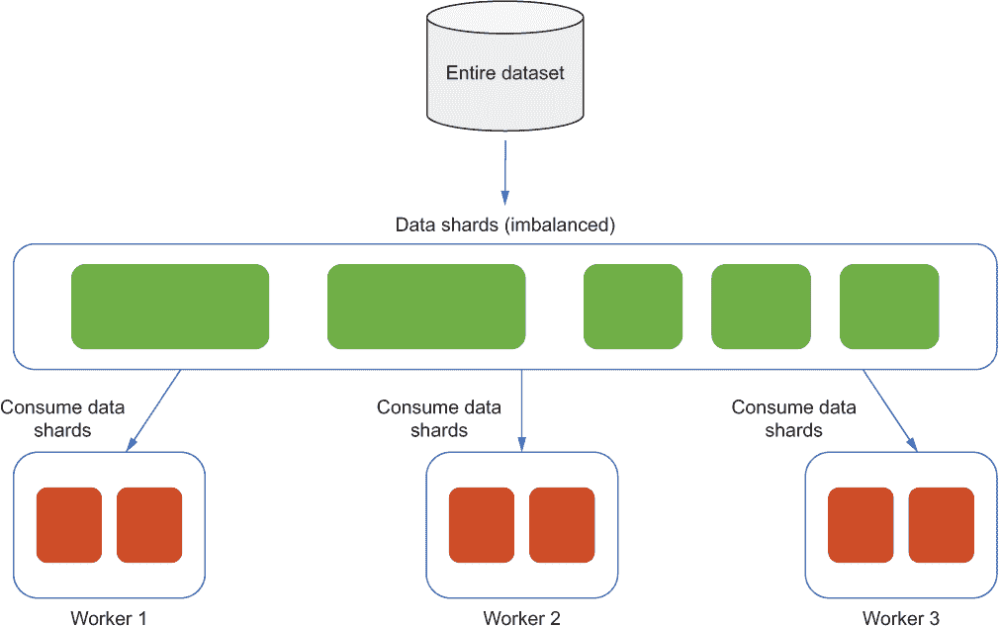

图 2.13 原始数据集被分割成多个不平衡的数据分片，然后由多个工作机消费。

最好避免在一个单独的数据分片中存储过多的数据，这可能会导致速度减慢和机器崩溃。当我们将数据集强制分散到过少的分片中时，这个问题也可能发生。这种方法在开发和测试环境中是可以接受的，但在生产环境中并不理想。

此外，每次我们在不断增长的数据集中看到更新时，如果使用手动分片，操作过程就变得非同小可。现在我们不得不为多个工作机进行备份，并且我们必须仔细协调数据迁移和模式更改，以确保所有分片都有相同的模式副本。

为了解决这个问题，我们可以基于算法而不是手动分片数据集来应用自动分片。图 2.14 所示的哈希分片取数据分片的关键值，生成一个哈希值。然后，生成的哈希值用于确定数据集的子集应该位于何处。使用均匀的哈希算法，哈希函数可以在不同的机器上均匀分布数据，减少前面提到的问题。此外，具有接近的分片键的数据不太可能被放置在同一个分片中。

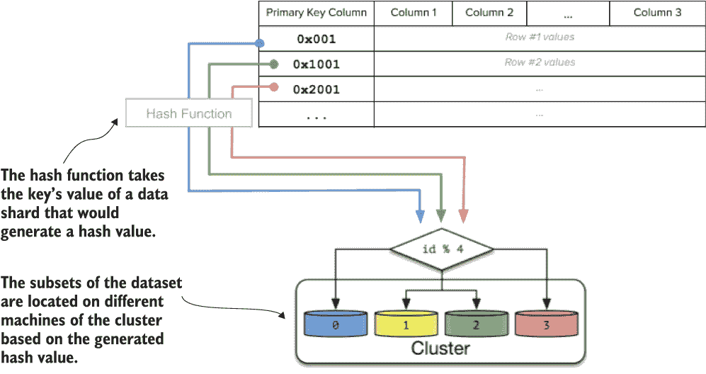

图 2.14 哈希分片的示意图。生成一个哈希值以确定数据集的子集应位于何处。（来源：YugabyteDB，Apache License 2.0 许可）

分片模式通过将极其大的数据集分割成多个数据分片，这些分片分散在多个工作机器上来实现；然后每个工作机器负责独立消耗单个数据分片。采用这种方法，我们可以避免由于批处理模式导致的顺序模型训练的缓慢。批处理和分片模式都对模型训练过程有效；最终，数据集将被彻底迭代。然而，一些机器学习算法需要多次扫描数据集，这意味着我们可能需要执行两次批处理和分片。下一节将介绍一种加快此过程的方法。

### 2.4.4 练习

1.  本节中引入的分片模式是使用水平分区还是垂直分区？

1.  模型是从哪里读取每个分片的？

1.  是否有手动分片之外的替代方案？

## 2.5 缓存模式

让我们回顾一下我们迄今为止学到的模式。在 2.3 节中，我们成功使用了批处理模式来处理和准备大型数据集以供模型训练，当机器学习框架无法处理大型数据集或框架的底层实现需要领域专业知识时。借助批处理，我们可以在有限的内存下处理大型数据集并执行昂贵的操作。在 2.4 节中，我们应用了分片模式将大型数据集分割成多个数据分片，这些分片分散在多个工作机器上。随着我们添加更多负责独立在每个数据分片上执行模型训练的工作机器，我们加快了训练过程。这两种模式都是很好的方法，使我们能够在单个机器上无法容纳或会减慢模型训练过程的大型数据集上训练机器学习模型。

我还没有提到的一个事实是，现代机器学习算法，例如基于树的算法和深度学习算法，通常需要多次训练。每个**epoch**是对我们正在训练的所有数据的完整遍历，当每个样本都已被看到一次。单个 epoch 指的是模型看到数据集中所有示例的唯一一次。在 Fashion-MNIST 数据集中，单个 epoch 意味着我们正在训练的模型已经处理并消耗了所有 60,000 个示例一次。图 2.15 显示了多 epoch 的模型训练。

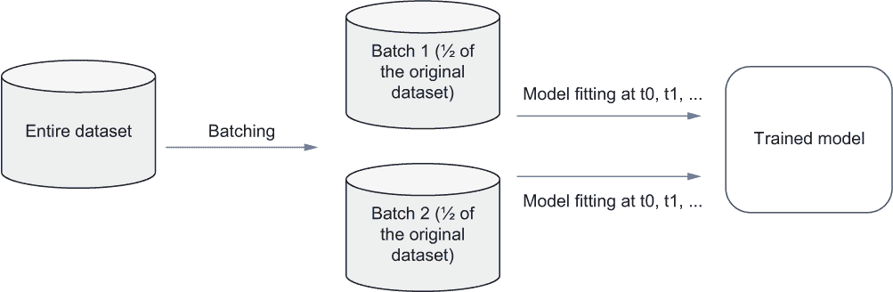

图 2.15 在时间 t0、t1 等时刻，模型进行多 epoch 训练的示意图

训练这类机器学习算法通常涉及优化大量高度相互依赖的参数。实际上，可能需要大量的标记训练示例才能使模型接近最优解。在深度学习算法中，由于批量梯度下降的随机性，这个问题变得更加严重，其底层优化算法对数据有很强的需求。

不幸的是，这些算法需要的多维数据类型，例如 Fashion-MNIST 数据集中的数据，可能难以标记并且占用大量的存储空间。因此，尽管我们需要向模型提供大量数据，但可用的样本数量通常远小于优化算法达到足够好的解所需的样本数量。这些训练样本中可能包含足够的信息，但梯度下降算法需要时间来提取它。

幸运的是，我们可以通过多次遍历数据来补偿样本数量的限制。这种方法给算法提供了收敛的时间，而不需要不切实际的数据量。换句话说，我们可以训练一个足够好的模型，该模型可以多次消耗训练数据集。

### 2.5.1 问题：为了高效的多迭代模型训练而重新访问之前使用的数据

既然我们知道我们可以在训练数据集上对机器学习模型进行多次迭代训练，那么假设我们想在 Fashion-MNIST 数据集上这样做。如果在整个训练数据集上训练一个迭代需要 3 小时，那么如果我们想训练两个迭代，我们需要将模型训练的时间翻倍，如图 2.16 所示。在现实世界的机器学习系统中，通常需要更多的迭代次数，因此这种方法并不高效。

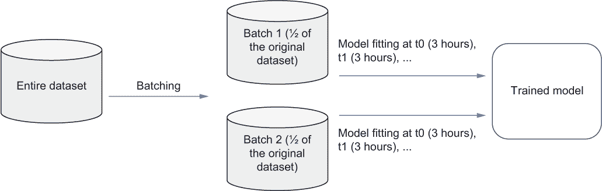

图 2.16 在时间 t0、t1 等多次迭代训练模型的示意图。我们每个迭代花费了 3 小时。

### 2.5.2 解决方案

考虑到多次迭代训练机器学习模型所需的不合理时间，我们能否做些什么来加快这个过程？对于第一个迭代，我们无法改进过程，因为这是机器学习模型第一次看到整个训练数据集。那么第二个迭代呢？我们能利用模型已经见过整个训练数据集一次的事实吗？

假设我们用来训练模型的笔记本电脑有足够的计算资源，例如内存和磁盘空间。一旦机器学习模型从整个数据集中消耗了每个训练示例，我们可以推迟回收，而是将消耗的训练示例保留在内存中。换句话说，我们正在以内存表示的形式存储训练示例的缓存，这在我们随后在后续训练迭代中再次访问时可以提供加速。

在图 2.17 中，我们在完成第一个 epoch 的模型拟合后，存储了我们用于第一个 epoch 模型训练的两个批次缓存。然后我们可以通过直接将存储在内存中的缓存提供给模型来开始第二个 epoch 的模型训练，而无需再次从数据源读取未来 epochs 的数据。


图 2.17：在时间 t0、t1 等使用缓存而不是再次从数据源读取，进行多个 epochs 的模型训练的示意图

这种**缓存模式**可以总结为以下列表中的伪代码。我们读取下一批数据以训练模型，然后在第一个 epoch 期间将此批次追加到初始化的缓存中。对于剩余的 epochs，我们从缓存中读取批次，然后使用这些批次进行模型训练。

列表 2.7：缓存伪代码

```
batch = read_next_batch(dataset)         ❶
cache = initialize_cache(batch)          ❷
while batch is not None:                 ❸
    model.train(batch)                   ❸
    cache.append(batch)                  ❸
    batch = read_next_batch(dataset)     ❸
while current_epoch() <= total_epochs:   ❹
    batch = cache.read_next_batch()      ❹
    model.train(batch)                   ❹
```

❶ 读取数据集的下一批

❷ 为此批次初始化缓存

❸ 通过迭代批次来训练模型

❹ 使用先前缓存的批次进行额外的 epochs 训练模型

如果我们对原始数据集执行了昂贵的预处理步骤，我们可以缓存处理过的数据集而不是原始数据集，从而避免再次处理数据集而浪费时间。伪代码如下所示。

列表 2.8：带有预处理的缓存伪代码

```
batch = read_next_batch(dataset)
cache = initialize_cache(preprocess(batch))     ❶
while batch is not None:
    batch = preprocess(batch)
    model.train(batch)
    cache.append(batch)
    batch = read_next_batch(dataset)
while current_epoch() <= total_epochs:
    processed_batch = cache.read_next_batch()   ❷
    model.train(processed_batch)                ❷
```

❶ 使用预处理的批次初始化缓存

❷ 从缓存中检索处理过的批次并用于模型训练

注意，列表 2.8 与列表 2.7 相似。两个细微的区别是，我们使用预处理的批次而不是原始批次初始化缓存，就像列表 2.7 中那样，并且我们从批次直接读取处理过的批次，而无需在模型训练之前再次预处理批次。

在涉及在多个 epochs 上对同一数据集进行训练的模型训练过程中，借助缓存模式，我们可以极大地加快对数据集的重新访问。缓存对于快速恢复任何故障也很有用；机器学习系统可以轻松地重新访问缓存的数据库，并继续管道中的其余过程。我们将在第 9.1.1 节中应用此模式。

### 2.5.3 讨论

我们已经成功使用缓存模式将缓存存储在每个工作机器的内存中，从而加快了在多个 epoch 的模型训练中访问先前使用数据的速度。如果工作机器发生故障怎么办？例如，如果由于内存不足错误而终止训练过程，我们就会丢失之前存储在内存中的所有缓存。

为了避免丢失之前存储的缓存，我们可以将缓存写入磁盘而不是存储在内存中，并持续保留直到模型训练过程仍然需要它。这样，我们可以通过使用磁盘上之前存储的训练数据缓存来轻松恢复训练过程。第三章深入讨论了如何恢复训练过程或使训练过程更具容错性。

将缓存存储在磁盘上是一个很好的解决方案。然而，需要注意的是，当我们进行顺序访问时，从内存中读取或写入大约快六倍，但当我们进行随机访问而不是从磁盘访问时，大约快 100,000 倍。随机访问内存（RAM）的访问速度以纳秒计算，而硬盘的访问速度以毫秒计算。换句话说，由于访问速度的差异，在内存中存储缓存和在磁盘上存储缓存之间存在权衡。图 2.18 提供了使用磁盘缓存的模型训练图。

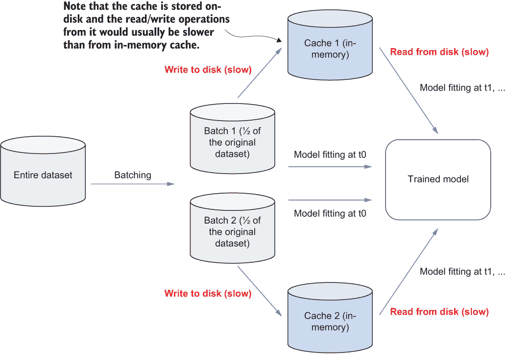

图 2.18 在时间 t0、t1 等时刻使用磁盘缓存的多次迭代模型训练图

一般而言，如果我们想构建一个更可靠和容错的系统，则将缓存存储在磁盘上更可取；如果我们想拥有更高效的模型训练和数据摄取过程，则将缓存存储在内存中更可取。当机器学习系统需要从远程数据库读取时，磁盘缓存可以非常有用，而读取内存缓存比读取远程数据库快得多，尤其是在网络连接不够快和稳定的情况下。

如果数据集随着时间的推移更新并累积，就像第 2.3.3 节中描述的那样，其中每个工作机的数据分片需要重新分配和平衡，该怎么办？在这种情况下，我们应该考虑缓存的时效性，并根据具体应用定期更新它。

### 2.5.4 练习

1.  缓存对于需要使用相同数据集进行训练或在不同数据集上多次迭代的模型训练是否有用？

1.  如果数据集需要预处理，我们应该在缓存中存储什么？

1.  磁盘缓存比内存缓存访问速度更快吗？

## 2.6 练习答案

### 第 2.3.4 节

1.  顺序地

1.  是的。这是批处理的主要用例之一。

1.  否

### 第 2.4.4 节

1.  水平分区

1.  在每个工作机上本地

1.  自动分片，例如哈希分片

### 第 2.5.4 节

1.  相同数据集

1.  我们应该将预处理后的批次存储在缓存中，以避免在后续迭代中再次浪费预处理时间。

1.  否。一般来说，内存缓存访问速度更快。

## 摘要

+   数据摄取通常是机器学习系统的开始过程，负责监控任何传入的数据，并执行必要的处理步骤以准备模型训练。

+   批处理模式通过以小批量消耗数据集来帮助在内存中处理大型数据集。

+   分片模式将极其庞大的数据集准备成更小的块，这些块位于不同的机器上。

+   缓存模式通过缓存之前访问过的数据，使得在相同数据集上进行模型训练的额外轮次的数据获取更加高效。
