# 3 分布式训练模式

本章涵盖了

+   区分传统模型训练过程与分布式训练过程

+   使用参数服务器构建无法适应单个机器的模型

+   使用集体通信模式提高分布式模型训练性能

+   处理分布式模型训练过程中出现的意外故障

上一章介绍了几种可以融入数据摄入过程的实用模式，这通常是分布式机器学习系统中的开始过程，该过程负责监控任何传入的数据并执行必要的预处理步骤以准备模型训练。

分布式训练，数据摄入过程之后的下一步，是区分分布式机器学习系统与其他分布式系统的关键因素。它是分布式机器学习系统中最关键的部分。

系统设计需要可扩展和可靠，以处理不同大小和复杂程度的数据库和模型。一些大型且复杂的模型无法适应单个机器，而一些中型模型虽然足够小可以适应单个机器，但难以提高分布式训练的计算性能。

知道在遇到性能瓶颈和意外故障时应该做什么也是至关重要的。数据集的部分可能已损坏或无法成功用于训练模型，或者依赖于分布式训练的分布式集群可能因天气条件或人为错误而出现不稳定或甚至断开连接的网络。

在本章中，我将探讨分布式训练过程中的一些挑战，并介绍一些在行业中广泛采用的既定模式。第 3.2 节讨论了训练大型机器学习模型的挑战，这些模型标记了新 YouTube 视频中的主要主题，但无法适应单个机器；它还展示了如何使用参数服务器模式克服这一困难。第 3.3 节展示了如何使用集体通信模式加快小型模型的分布式训练，并避免参数服务器和工作之间不必要的通信开销。最后一节讨论了由于数据集损坏、不稳定网络和抢占式工作机等原因导致的分布式机器学习系统的某些漏洞，以及解决这些问题的方法。

## 3.1 什么是分布式训练？

*分布式训练* 是指将数据摄入（在第二章中讨论）处理后的数据，初始化机器学习模型，然后在分布式环境中（如多个节点）使用处理后的数据进行模型训练的过程。这个过程很容易与机器学习模型的传统训练过程混淆，后者发生在单节点环境中，数据集和机器学习模型对象在同一台机器上，例如笔记本电脑。相比之下，分布式模型训练通常发生在由多个机器组成的集群中，这些机器可以并行工作，从而大大加快训练过程。

此外，在传统的模型训练中，数据集通常位于单个笔记本电脑或机器的本地磁盘上，而在分布式模型训练中，使用远程分布式数据库来存储数据集，或者数据集必须在多台机器的磁盘上进行分区。如果模型太大，无法适应单台机器，则无法使用单台机器以传统方式训练模型。从网络基础设施的角度来看，InfiniBand ([`wiki.archlinux.org/title/InfiniBand`](https://wiki.archlinux.org/title/InfiniBand)) 或远程直接内存访问（RDMA；[`www.geeksforgeeks.org/remote-direct-memory-access-rdma/`](https://www.geeksforgeeks.org/remote-direct-memory-access-rdma/)) 网络通常比单个本地主机更适合分布式训练。表 3.1 提供了这些训练方法的比较。

表 3.1 机器学习模型的传统（非分布式）训练与分布式训练比较

|  | 传统模型训练 | 分布式模型训练 |
| --- | --- | --- |
| 计算资源 | 笔记本电脑或单个远程服务器 | 机器集群 |
| 数据集位置 | 单个笔记本电脑或机器上的本地磁盘 | 远程分布式数据库或多个机器磁盘上的分区 |
| 网络基础设施 | 本地主机 | InfiniBand 或 RDMA |
| 模型大小 | 足够小，可以适应单台机器 | 中等到大型 |

InfiniBand 和 RDMA

InfiniBand 是一种用于高性能计算的计算机网络通信标准。它具有高吞吐量和低延迟的数据互联功能，这对于分布式训练通常是有要求的。

RDMA 提供了从多台机器的内存中直接访问，而不涉及任何机器的操作系统。这个标准允许高吞吐量、低延迟的网络连接——这在分布式训练过程中特别有用，因为在分布式训练过程中，机器之间的通信频繁。

## 3.2 参数服务器模式：对 800 万 YouTube 视频中的实体进行标记

假设我们有一个名为 YouTube-8M 的数据集([`research.google.com/youtube8m`](http://research.google.com/youtube8m); 图 3.1)，它包含数百万个 YouTube 视频 ID，以及来自超过 3,800 个视觉实体（如食品、汽车和音乐）的优质机器生成注释。我们希望训练一个机器学习模型，以标记模型尚未见过的 YouTube 视频的主要主题。

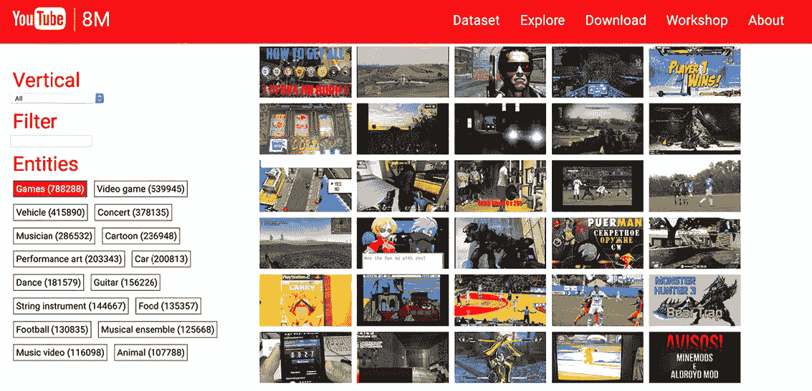

图 3.1 托管 YouTube-8M 数据集的网站，展示了来自超过 3,800 个视觉实体的数百万个 YouTube 视频（来源：Sudheendra Vijayanarasimhan 等人。根据非独占许可 1.0 授权）

此数据集包含粗粒度和细粒度实体。*粗粒度实体*是非领域专家在研究一些现有示例后可以识别的实体，而*细粒度实体*可以通过了解如何区分极其相似实体的领域专家识别。这些实体已经由三位评分者半自动整理并人工验证，以确保视觉可识别性。每个实体至少有 200 个相应的视频示例，平均有 3,552 个训练视频。当评分者识别视频中的实体时，他们会被提供一份指南，以使用从 1 到 5 的离散量表来评估每个实体的具体性和视觉识别度，其中 1 代表一个外行人可以轻易识别的实体（图 3.2）。

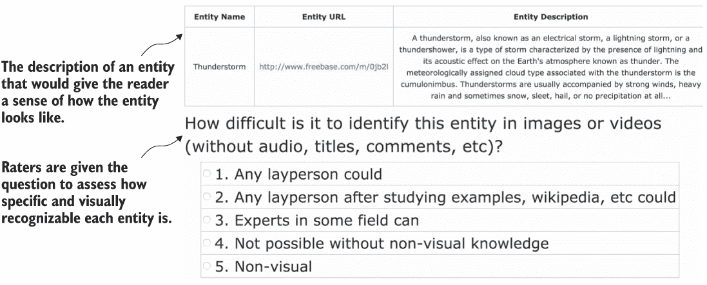

图 3.2 显示给人类评分者的问题和指南的截图，用于识别 YouTube 视频中的实体，以评估每个实体的视觉识别度（来源：Sudheendra Vijayanarasimhan 等人。根据非独占许可 1.0 授权）

在 YouTube-8M 提供的在线数据集浏览器([`research.google.com/youtube8m/explore.xhtml`](http://research.google.com/youtube8m/explore.xhtml))中，实体列表显示在左侧，每个实体的视频数量显示在实体名称旁边（图 3.3）。

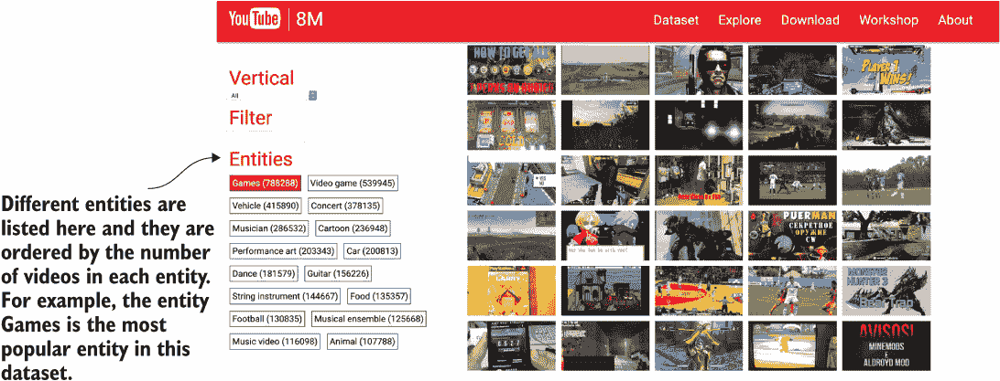

图 3.3 YouTube-8M 网站提供的数据集浏览器截图，按视频数量排序实体（来源：Sudheendra Vijayanarasimhan 等人。根据非独占许可 1.0 授权）

注意，在数据集浏览器中，实体按每个实体中的视频数量排序。在图 3.3 中，最受欢迎的三个实体分别是游戏、视频游戏和车辆，分别有 415,890 到 788,288 个训练示例。最不受欢迎的实体（图中未显示）是圆柱体和灰浆，分别有 123 和 127 个训练视频。

### 3.2.1 问题

使用这个数据集，我们希望训练一个机器学习模型来标记模型尚未见过的新的 YouTube 视频的主要主题。对于更简单的数据集和机器学习模型来说，这个任务可能是微不足道的，但对于 YouTube-8M 数据集来说，情况肯定不是这样。这个数据集包含了从数十亿帧和音频片段中预先计算出的视听特征，所以我们不必自己计算和获取它们——这些任务通常需要很长时间，并且需要大量的计算资源。

尽管在单个 GPU 上不到一天的时间内就可以在这个数据集上训练出一个强大的基线模型，但数据集的规模和多样性可以使得对复杂音频视觉模型的深入探索成为可能，这些模型的训练可能需要几周时间。有没有什么解决方案可以高效地训练这个可能很大的模型？

### 3.2.2 解决方案

首先，让我们使用 YouTube-8M 网站上的数据探索器查看一些实体，并看看这些实体之间是否存在任何关系。这些实体是否无关，例如，或者它们在内容上存在某种程度的重叠？经过一些探索后，我们将对模型进行必要的调整，以考虑这些关系。

图 3.4 展示了属于宠物实体的 YouTube 视频列表。在第一行的第三个视频中，一个孩子正在和一只狗玩耍。

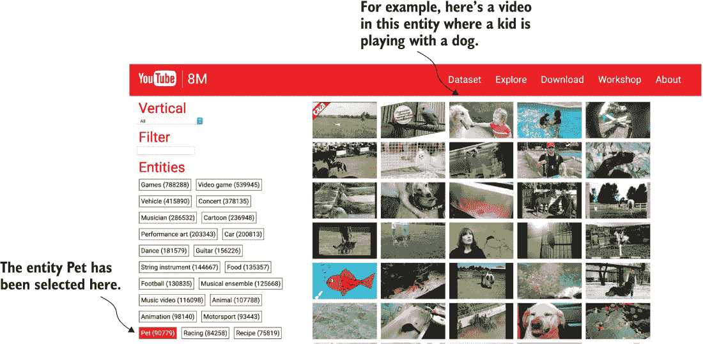

图 3.4 属于宠物实体的示例视频（来源：Sudheendra Vijayanarasimhan 等人，许可协议为非独占许可 1.0）

让我们看看一个类似的实体。图 3.5 展示了属于动物实体的 YouTube 视频列表，其中我们可以看到鱼类、马和熊猫等动物。有趣的是，在第五行的第三个视频中，一只猫正在被吸尘器清理。有人可能会猜测这个视频也属于宠物实体，因为如果猫被人类收养，它就可以成为宠物。

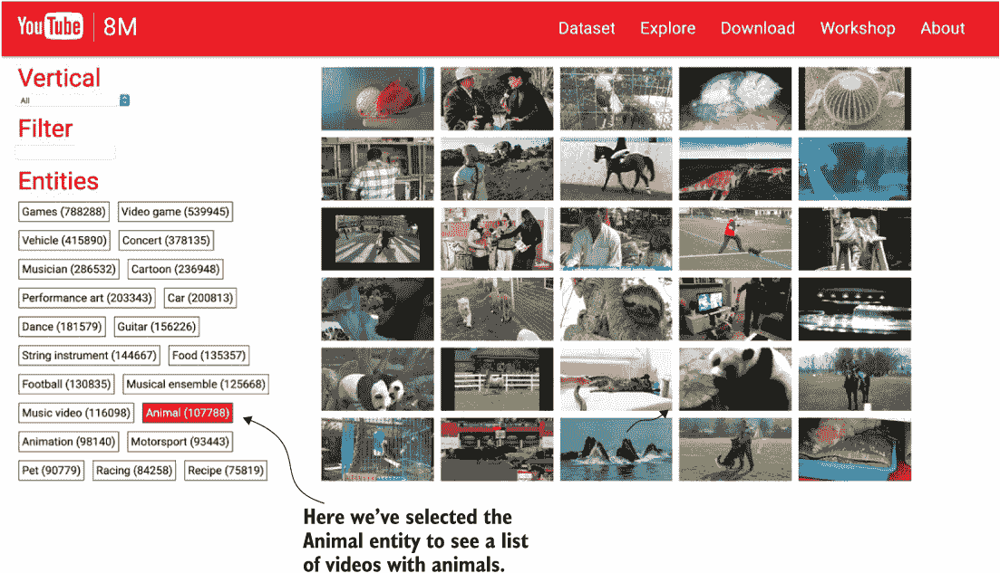

图 3.5 属于动物实体的示例视频（来源：Sudheendra Vijayanarasimhan 等人，许可协议为非独占许可 1.0）

如果我们想为这个数据集构建机器学习模型，我们可能需要在直接将模型拟合到数据集之前进行一些额外的特征工程。我们可能将这两个实体（动物和宠物）的视听特征组合成一个派生特征，因为它们提供类似的信息并存在重叠，这可以根据我们选择的特定机器学习模型来提高模型的表现。如果我们继续探索实体中现有视听特征的组合，或者执行大量的特征工程步骤，我们可能就不再能够在单个 GPU 上不到一天的时间内训练出机器学习模型。

如果我们使用深度学习模型而不是需要大量特征工程和数据集探索的传统机器学习模型，模型本身会学习特征之间的底层关系，例如相似实体的视听特征。模型架构中的每一层神经网络都由权重和偏置的向量组成，代表一个经过训练的神经网络层，在训练迭代过程中，随着模型从数据集中获取更多知识，这些层会得到更新。

如果我们只使用 3,862 个实体中的 10 个，我们就可以构建一个 LeNet 模型（图 3.6），将新的 YouTube 视频分类为 10 个选定实体之一。从高层次来看，LeNet 由一个包含两个卷积层的卷积编码器和一个包含三个全连接层的密集块组成。为了简化，我们假设视频的每个单独帧是一个 28 × 28 的图像，并且它将通过各种卷积和池化层进行处理，这些层学习视听特征和实体之间的底层特征映射。

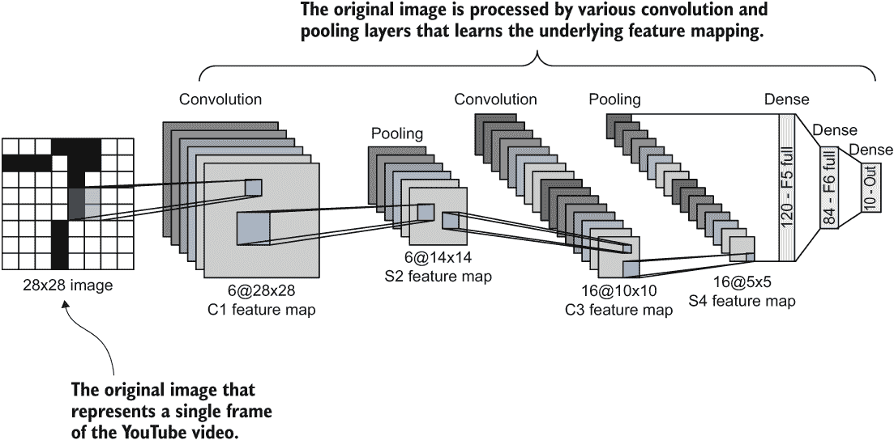

图 3.6 LeNet 模型架构，可用于将新的 YouTube 视频分类为 10 个选定实体之一。（来源：Aston Zhang 等人。根据 Creative Commons Attribution-ShareAlike 4.0 国际公共许可证授权）

LeNet 的简要历史

LeNet ([`en.wikipedia.org/wiki/LeNet`](https://en.wikipedia.org/wiki/LeNet)) 是最早发布的卷积神经网络（CNNs；[`en.wikipedia.org/wiki/Convolutional_neural_network`](https://en.wikipedia.org/wiki/Convolutional_neural_network)）之一，因其计算机视觉任务上的性能而受到广泛关注。它由 AT&T Bell Labs 的研究员 Yann LeCun 提出，用于识别图像中的手写数字。在经过十年的研究和发展后，1989 年，LeCun 发表了第一篇成功通过反向传播训练 CNNs 的研究。

当时，LeNet 取得了与支持向量机（监督机器学习算法中的主导方法）相匹配的卓越成果。

实际上，那些学习到的特征图包含与模型相关的参数。这些参数是作为该层模型表示的权重和偏置使用的数值向量。对于每个训练迭代，模型将 YouTube 视频中的每一帧作为特征，计算损失，然后更新那些模型参数以优化模型的目标，从而使特征和实体之间的关系能够更紧密地建模。

不幸的是，这个训练过程很慢，因为它涉及到更新不同层的所有参数。我们有两个潜在的解决方案来加速训练过程。

让我们来看看第一种方法。这里我们想要做一个假设，我们将在讨论更好的方法时将其移除。让我们假设模型不是太大，我们可以使用现有资源来拟合整个模型，没有任何内存不足或磁盘错误的可能性。

在这种情况下，我们可以使用一台专用服务器来存储所有 LeNet 模型参数，并使用多台工作机来分配计算工作负载。图 3.7 展示了架构图。

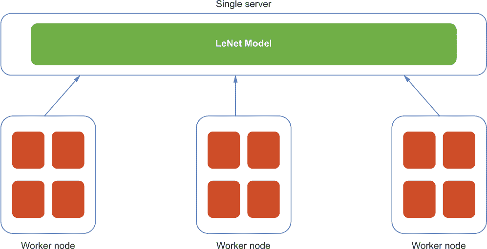

图 3.7 单参数服务器的机器学习训练组件

每个工作节点处理数据集的特定部分来计算梯度，然后将结果发送到专用服务器以更新 LeNet 模型参数。因为工作节点使用隔离的计算资源，它们可以在无需通信的情况下异步执行繁重的计算。因此，如果我们忽略节点间消息传递等成本，仅通过引入额外的工人节点就实现了大约三倍的速度提升。

负责存储和更新模型参数的专用单服务器被称为*参数服务器。*我们通过整合*参数服务器模式*设计了一个更高效的分布式机器学习训练系统。

接下来是现实世界的挑战。深度学习模型通常很复杂；可以在基线模型之上添加具有自定义结构的额外层。这些复杂模型通常由于额外层中大量模型参数而占用大量磁盘空间。为了满足成功训练所需的内存占用要求，需要大量的计算资源。如果模型很大，而我们无法将所有参数都拟合到一个参数服务器上，那会怎样呢？

第二种解决方案可以解决这种情况下的挑战。我们可以引入额外的参数服务器，每个服务器负责存储和更新特定的*模型分区。*每个工作节点负责处理数据集的特定部分以更新模型分区的模型参数。

图 3.8 展示了使用多个参数服务器构建此模式的架构图。此图与图 3.7 不同，图 3.7 中只有一个服务器存储了所有 LeNet 模型参数，并通过工作机器分配计算工作负载。每个工作节点处理数据集的一个子集，执行每个神经网络层所需的计算，然后将计算出的梯度发送到更新存储在参数服务器中的一个模型分区。请注意，由于所有工作节点都以异步方式执行计算，因此每个工作节点用于计算梯度的模型分区可能不是最新的。为了保证每个工作节点使用的模型分区或每个参数服务器存储的模型分区是最新的，我们不得不在节点之间不断拉取和推送模型更新。

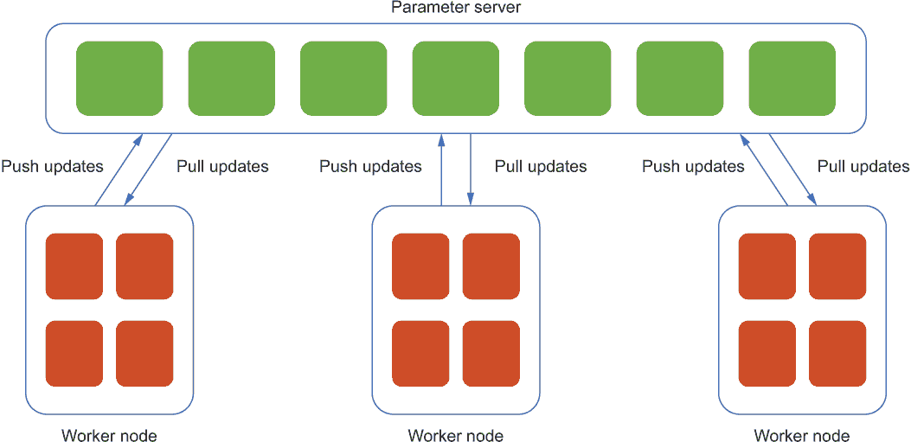

图 3.8 带有多个参数服务器的机器学习训练组件

在参数服务器的帮助下，我们可以有效地解决构建机器学习模型以标记模型尚未见过的 YouTube 新视频主要主题的挑战。图 3.9 显示了未用于模型训练的 YouTube 视频列表，由训练好的机器学习模型标记为飞机主题。即使模型太大而无法适应单个机器，我们也能有效地训练模型。请注意，尽管参数服务器模式在这种情况下可能很有用，但它特别设计用于训练具有大量参数的模型。

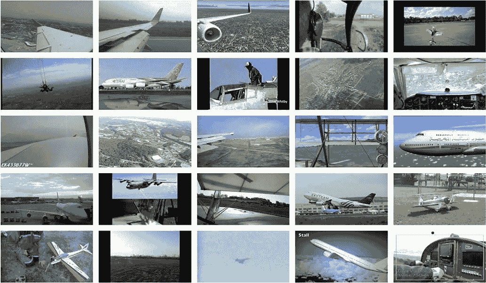

图 3.9 列出了未用于模型训练的新 YouTube 视频，标记为飞机主题（来源：Sudheendra Vijayanarasimhan 等人，许可协议为非独占许可 1.0）

### 3.2.3 讨论

前一节介绍了参数服务器模式，并展示了如何使用它来解决 YouTube-8M 视频识别应用中的潜在挑战。尽管参数服务器模式在模型太大而无法适应单个机器时很有用，而且这些模式似乎是对挑战的直接方法，但在实际应用中，我们仍然需要做出决策，以使分布式训练系统高效。

机器学习研究人员和 DevOps 工程师经常难以确定不同机器学习应用中参数服务器数量和工作节点数量的良好比例。从工作节点向参数服务器发送计算出的梯度存在非平凡的通信成本，以及拉取和推送最新模型分区更新的成本。如果我们发现模型变得越来越大，并向系统中添加过多的参数服务器，系统最终将花费大量时间在节点之间进行通信，而在神经网络层之间进行计算的时间却很少。

第 3.3 节更详细地讨论了这些实际挑战。该节介绍了一种模式，以解决这些挑战，这样工程师就不再需要花费时间调整不同类型模型的工作者和参数服务器的性能。

### 3.2.4 练习

1.  如果我们想在单台笔记本电脑上使用多个 CPU 或 GPU 训练模型，这个过程是否被认为是分布式训练？

1.  增加工人或参数服务器数量会有什么结果？

1.  我们应该为参数服务器分配哪些类型的计算资源（如 CPU、GPU、内存或磁盘），以及应该分配多少这类资源？

## 3.3 集体通信模式

第 3.2.2 节介绍了参数服务器模式，当模型太大而无法适应单个机器时，该模式非常有用，例如，我们需要构建一个系统来标记 800 万 YouTube 视频中的实体。尽管我们可以使用参数服务器来处理具有大量参数的极其大型和复杂的模型，但将此模式纳入高效分布式训练系统的设计并非易事。

第 3.2.3 节指出，支持数据科学家或分析师分布式机器学习基础设施的 DevOps 工程师，往往很难确定不同机器学习应用中参数服务器数量和工作者数量之间的良好比例。假设在我们的机器学习系统的模型训练组件中有三个参数服务器和三个工作者，如图 3.10 所示。所有三个工作者异步执行密集计算，然后将计算出的梯度发送到参数服务器以更新模型参数的不同分区。

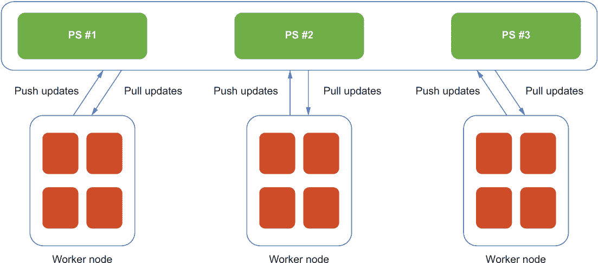

图 3.10 显示了一个由三个参数服务器和三个工作节点组成的分布式模型训练组件

在现实中，工作节点和参数服务器并不提供一对一的映射，尤其是当工作节点数量与参数服务器数量不同时。换句话说，多个工作者可能向同一子集的参数服务器发送更新。现在假设有两个工作者同时完成了梯度的计算，并且他们都想更新存储在相同参数服务器上的模型参数（图 3.11）。

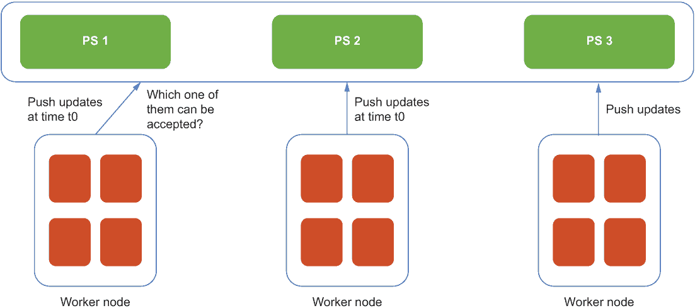

图 3.11 显示，两个工作节点已经完成了梯度的计算，并希望同时将更新推送到第一个参数服务器。

因此，两个工人正在互相阻塞，无法同时将梯度发送到参数服务器。换句话说，来自两个工作节点的梯度不能同时被同一个参数服务器接受。

### 3.3.1 问题：当参数服务器成为瓶颈时提高性能

在这种情况下，只有两个工作者在向同一个参数服务器发送梯度时相互阻塞，这使得及时收集计算出的梯度变得困难，并需要一种策略来解决阻塞问题。不幸的是，在包含参数服务器的现实世界分布式训练系统中，多个工作者可能同时发送梯度；因此，我们必须解决许多通信阻塞。

当工作者数量与参数服务器数量之间的比例不理想时，例如，许多工作者同时向同一个参数服务器发送梯度。问题变得更糟，最终，不同工作者或参数服务器之间的通信阻塞成为瓶颈。有没有办法防止这个问题？

### 3.3.2 解决方案

在这种情况下，两个工作者需要找出一种继续的方法。他们必须协调，决定哪个工作者将首先采取下一步，然后轮流向该特定参数服务器发送计算出的梯度。此外，当一个工作者完成向该参数服务器发送梯度以更新模型参数后，该参数服务器开始将更新的模型分区发送回该工作者。因此，工作者拥有最新的模型以进行微调，因为它接收传入的数据。如果同时，另一个工作者也在向该参数服务器发送计算出的梯度，如图 3.12 所示，将发生另一个阻塞通信，工作者需要再次协调。

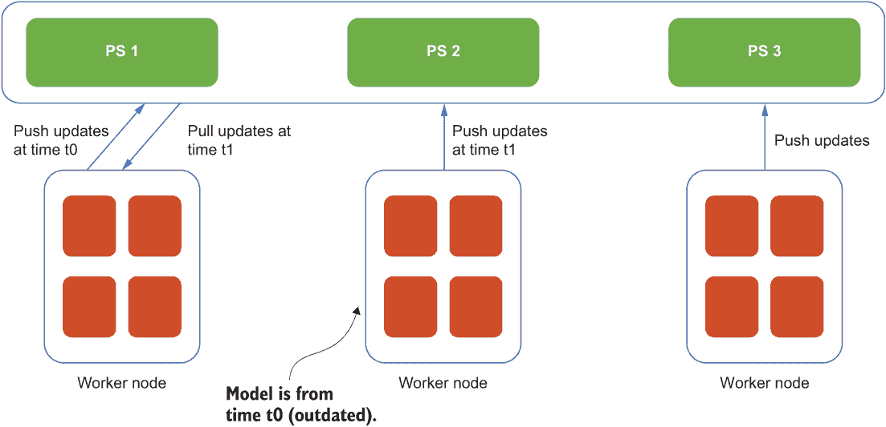

图 3.12 一个工作者正在拉取更新，而另一个工作者正在将更新推送到相同的参数服务器。

这次，不幸的是，协调可能不容易解决，因为试图发送计算出的梯度的工作者在计算梯度时可能没有使用最新的模型。当模型版本之间的差异较小时，这种情况可能还可以，但最终，它可能对训练模型的统计性能造成巨大差异。

如果每个参数服务器存储不同的模型分区不均匀——也许第一个参数服务器存储了三分之二的模型参数，如图 3.13 所示——使用这个过时的模型分区计算出的梯度将对最终训练模型产生巨大影响。在这种情况下，我们可能希望丢弃计算出的梯度，让其他工作者将更新的梯度发送到参数服务器。

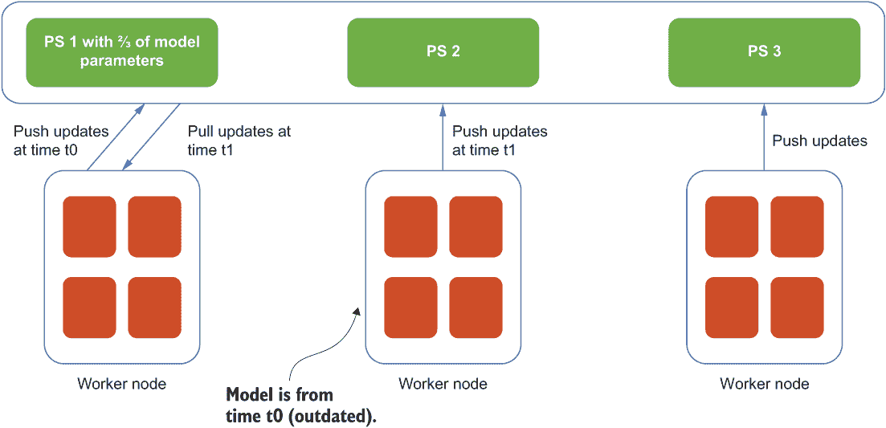

图 3.13 不平衡模型分区的一个例子，其中第一个参数服务器包含整个模型参数集的三分之二。

现在又出现了一个挑战。如果我们认为丢失的梯度是过时的，并且它们是从整个训练数据的大部分计算出来的，那么使用最新的模型分区重新计算它们可能需要很长时间（如图 3.14 所示）？在这种情况下，我们可能希望保留这些梯度，以免浪费太多时间重新计算它们。

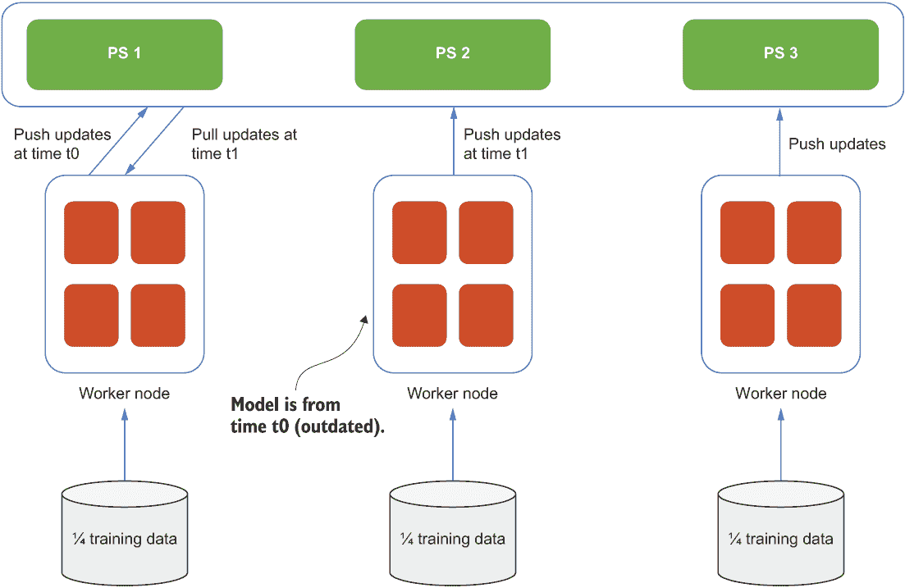

图 3.14 第二个工人正在尝试推动从训练数据的一半计算得到的梯度。

在现实世界的具有参数服务器的分布式机器学习系统中，我们可能会遇到许多无法完全解决的问题和挑战。当这些情况发生时，我们必须考虑协调和权衡方法。随着工作节点和参数服务器的数量增加，在节点之间和参数服务器之间拉取和推送模型参数所需的协调和通信成本变得相当大。系统最终会在节点之间花费大量时间进行通信，而在神经网络层之间进行少量计算。

尽管我们可能对将不同比例和计算资源应用于参数服务器和工作节点的权衡和性能差异有丰富的经验，但调整到一个完美的系统仍然似乎反直觉且耗时。在某些情况下，一些工作节点或参数在训练过程中失败，或者网络变得不稳定，当节点在推送和拉取更新时，会导致问题。换句话说，由于我们缺乏专业知识或可用时间来处理底层分布式基础设施，参数服务器模式可能不适合特定的用例。

对于这个问题有没有什么替代方案？参数服务器模式可能是大型模型少数几个好的选择之一，但为了简单和演示目的，让我们假设模型大小不会改变。整个模型足够小，可以放在单个机器上。换句话说，每台机器都有足够的磁盘空间来存储模型。

在这个假设下，如果我们只想提高分布式训练的性能，参数服务器之外的替代方案会是什么？没有参数服务器，我们只有工作节点，每个节点存储整个模型参数集的一个副本，如图 3.15 所示。

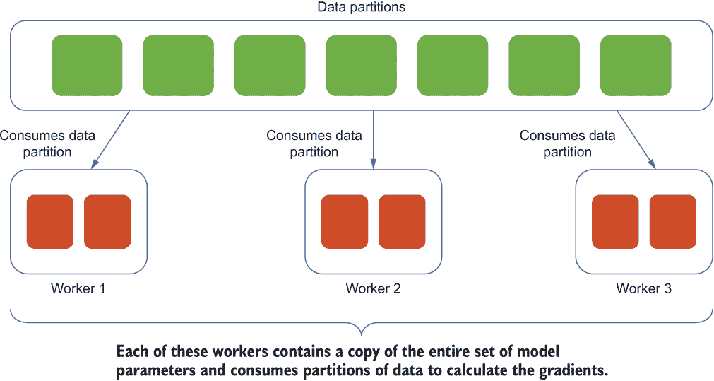

图 3.15 仅包含工作节点的分布式模型训练组件。每个工作节点存储整个模型参数集的一个副本，并消费数据分区来计算梯度。

在这种情况下，我们如何进行模型训练？回想一下，每个工作者消耗一些数据部分并计算更新存储在本工作者节点上的模型参数所需的梯度。当所有工作者节点成功完成其梯度计算后，我们需要聚合所有梯度，并确保每个工作者的整个模型参数集基于聚合梯度进行更新。换句话说，每个工作者应存储同一更新模型的副本。我们如何聚合所有梯度？

我们已经熟悉了将梯度从一个节点发送到另一个节点的过程，例如，将工作者节点计算出的梯度发送到参数服务器以更新特定模型分区的模型参数。通常，这个过程被称为*点对点通信*（图 3.16）。没有其他进程参与。

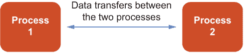

图 3.16 展示了两个进程之间进行点对点通信的示例，数据在这两个进程之间进行传输。请注意，没有其他进程参与。

在这种情况下，点对点通信效率不高。只有工作者节点参与，我们需要对所有工作者的结果执行某种聚合操作。幸运的是，我们可以使用另一种类型的通信。*集体通信*允许在*组*中跨越所有进程的通信模式，该组由所有进程的子集组成。图 3.17 说明了单个进程与由三个其他进程组成的组之间的集体通信。在这种情况下，每个工作者节点携带梯度，并希望将它们发送到包括其他工作者节点在内的一个组，以便所有工作者节点都能获得每个工作者的结果。

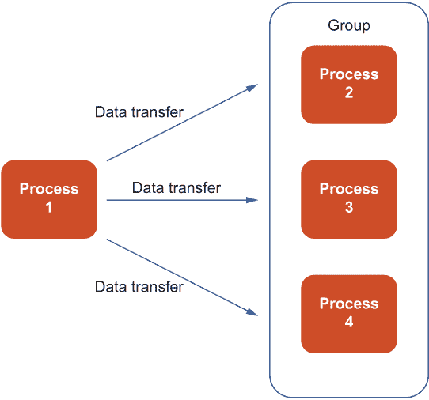

图 3.17 展示了单个进程与由三个其他进程组成的组之间的集体通信示例

对于我们的机器学习模型，我们在将聚合结果发送给所有工作者之前，通常会对所有接收到的梯度执行某种聚合操作。这种聚合类型被称为*reduce 函数*，它涉及将一组数字转换成更小的数字集。reduce 函数的例子包括求和、最大值、最小值或平均值——在我们的情况下，是从所有工作者接收到的梯度。

图 3.18 说明了 reduce 操作。进程组中每个进程的向量 v0、v1 和 v2 通过 reduce 操作与第一个进程合并。

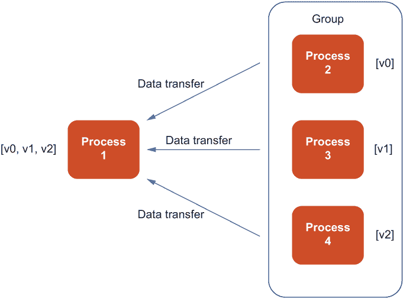

图 3.18 展示了使用求和作为 reduce 函数的 reduce 操作示例

当梯度以分布式方式减少时，我们将减少后的梯度发送到所有工作节点，以便它们处于同一页面上，并可以以相同的方式更新模型参数，确保它们具有完全相同的模型。这种操作称为*广播*操作，通常用于执行集体通信。图 3.19 说明了向进程组中的每个进程发送值的广播操作。

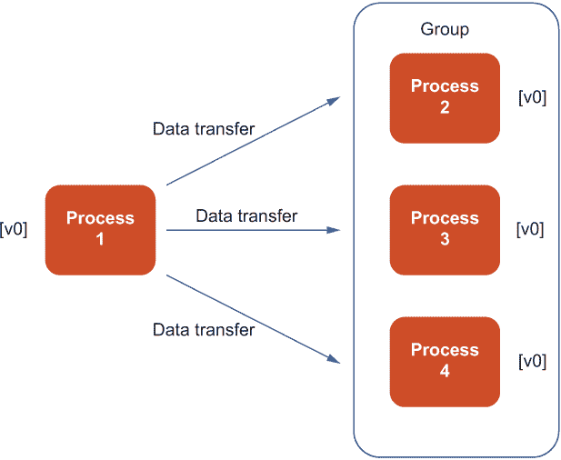

这里 reduce 和广播操作的组合称为*allreduce*，它基于指定的 reduce 函数减少结果，然后将减少后的结果分布到所有进程——在我们的情况下，分布到所有工作节点，以便每个工作节点上存储的模型完全相同且是最新的（图 3.20）。当我们完成一轮 allreduce 操作后，我们通过向更新的模型提供新数据，计算梯度，并再次执行 allreduce 操作来收集所有工作节点的梯度以更新模型，开始下一轮操作。

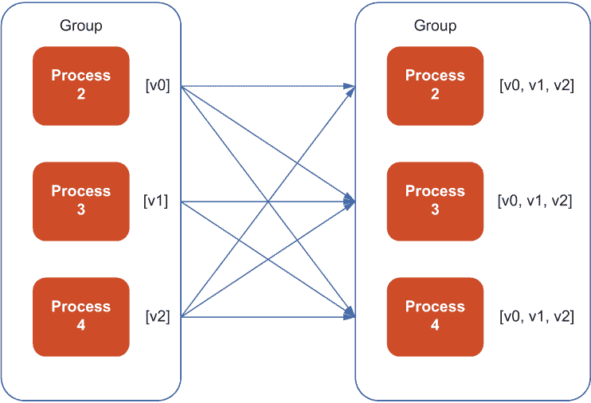

图 3.20：一个全量减少操作的示例，该操作在每个组进程上减少结果，然后将结果发送到组中的每个进程

让我们休息一下，看看我们取得了什么成果。我们已经成功使用了集体通信模式，它利用了底层网络基础设施，来执行多个工作节点之间的梯度通信的全量减少操作，并允许我们以分布式方式训练一个中等规模的机器学习模型。因此，我们不再需要参数服务器；因此，参数服务器和工作节点之间没有通信开销。集体通信模式在机器学习系统中很有用，在分布式和并行计算系统中也很有用，在这些系统中，并发应用于计算和通信原语，如广播和减少，对于不同节点之间的通信至关重要。我们将在第 9.2.2 节中应用这种模式。

### 3.3.3 讨论

当我们构建的机器学习模型不是很大时，集体通信模式是参数服务器的一个很好的替代方案。因此，参数服务器和工作节点之间没有通信开销，也就不再需要花费大量精力去调整工作节点和参数服务器之间的比例。换句话说，我们可以轻松地添加工作节点来加速模型训练过程，而不用担心性能下降。

尽管如此，有一个潜在问题值得提及。在我们通过应用 allreduce 操作引入集体通信模式后，每个工作者都需要与其所有对等工作者通信，如果工作者数量变得很大，这可能会减慢整个训练过程。实际上，集体通信依赖于网络基础设施的通信，而我们尚未在 allreduce 操作中充分利用这些好处。

幸运的是，我们可以使用更好的集体通信算法来更有效地更新模型。一个例子是*ring-allreduce*算法。其过程与 allreduce 操作类似，但数据以环形方式传输，而不进行 reduce 操作。每个*N*个工作者只需要与其两个对等工作者通信 2 * (*N* - 1)次，以完全更新所有模型参数。换句话说，这个算法是带宽最优的；如果聚合的梯度足够大，它将最优地使用底层网络基础设施。

参数服务器模式和集体通信模式使分布式训练可扩展且高效。然而，在实践中，任何工作者或参数服务器可能由于资源不足而无法启动，也可能在分布式训练过程中失败。第 3.4 节介绍了有助于这些情况并使整个分布式训练过程更可靠的模式。

### 3.3.4 练习

1.  阻塞通信是否只发生在工作者之间？

1.  工作者是以异步还是同步方式更新存储在他们那里的模型参数？

1.  你能否用其他集体通信操作的组合来表示 allreduce 操作？

## 3.4 弹性性和容错模式

参数服务器模式和集体通信模式都能使我们扩展分布式模型训练过程。参数服务器对于处理不适合单台机器的大型模型可能很有用；一个大型模型可以被分割并存储在多个参数服务器上，而单个工作者可以执行繁重的计算并异步更新模型参数的各个分区。然而，当我们使用参数服务器时观察到过多的通信开销，我们则可以使用集体通信模式来加速中等规模模型的训练过程。

假设我们的分布式训练组件设计良好；可以高效地训练机器学习模型；并且可以使用参数服务器和集体通信等模式处理不同类型模型的请求。有一点值得提及的是，分布式模型训练是一个长期运行的任务，通常持续数小时、数天甚至数周。像所有其他类型的软件和系统一样，这个长期运行的任务容易受到意外干预的影响。由于模型训练是一个长期过程，它可能随时受到内部或外部干预的影响。以下是一些在分布式模型训练系统中经常发生的干预示例：

+   数据集的部分损坏或无法成功用于训练模型。

+   分布式训练模型所依赖的分布式集群可能会因为天气条件或人为错误而遇到不稳定或断开连接的网络。

+   一些参数服务器或工作节点被抢占；它们依赖的计算资源被重新安排用于具有更高优先级的任务和节点。

### 3.4.1 问题：处理有限计算资源下的意外故障

当意外干预发生时，如果不采取行动解决它们，问题开始累积。在前一节的第一个例子中，所有工作节点使用相同的逻辑来消费数据以适应模型；当他们看到训练代码无法处理的损坏数据时，最终都会失败。在第二个例子中，当网络不稳定时，参数服务器和工作节点之间的通信会挂起，直到网络恢复。在第三个例子中，当参数服务器或工作节点被抢占时，整个训练过程被迫停止，导致不可恢复的故障。我们应该怎么做来帮助分布式训练系统在这些情况下恢复？我们有没有防止意外故障的方法？

### 3.4.2 解决方案

让我们来看看第一种情况。假设训练过程遇到一批损坏的数据。在图 3.21 中，YouTube-8M 数据集中的一些视频在从原始来源下载后，被第三方视频编辑软件意外修改。第一个工作节点正在尝试读取这些数据部分以供模型使用。之前初始化的机器学习模型对象无法用编辑过的和不兼容的视频数据来喂养。

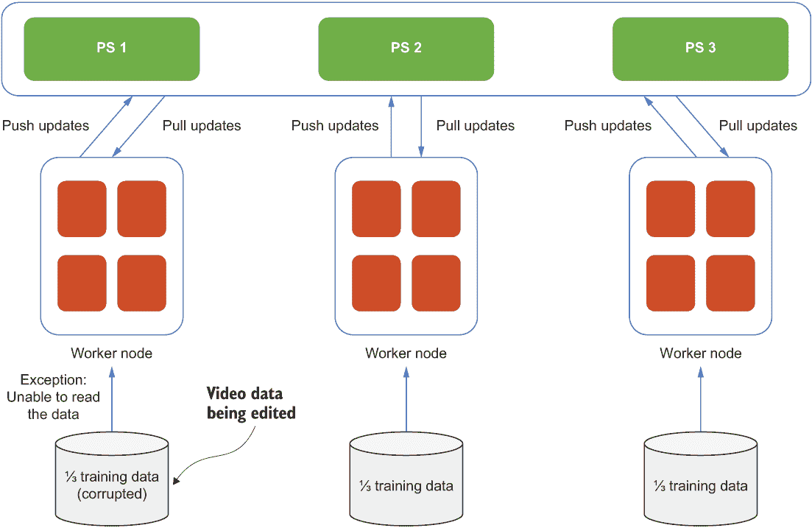

图 3.21 工作节点遇到正在编辑的新批次训练数据，无法成功消费。

当这种情况发生时，训练过程遇到意外故障：现有的代码不包含处理编辑或损坏数据集的逻辑。换句话说，我们需要修改分布式模型训练逻辑以处理这种情况，然后从头开始重新训练模型。

让我们再次开始分布式训练过程，看看是否一切正常。我们可以跳过我们发现已损坏的数据批次，并继续使用剩余数据的下一个批次来训练机器学习模型。

不幸的是，在用一半的数据训练了数小时后，我们意识到新批次的数据消耗速度比以前慢得多。经过一番调查并与 DevOps 团队沟通后，我们发现由于我们数据中心之一的一个风暴，网络变得极其不稳定——这是之前提到的第二种情况。如果我们的数据集驻留在远程机器上而不是下载到本地机器上，如图 3.22 所示，训练过程将停滞等待与远程数据库建立成功的连接。在等待期间，我们应该*检查点*（存储）当前训练的模型参数并暂停训练过程。然后，当网络再次稳定时，我们可以轻松地恢复训练过程。

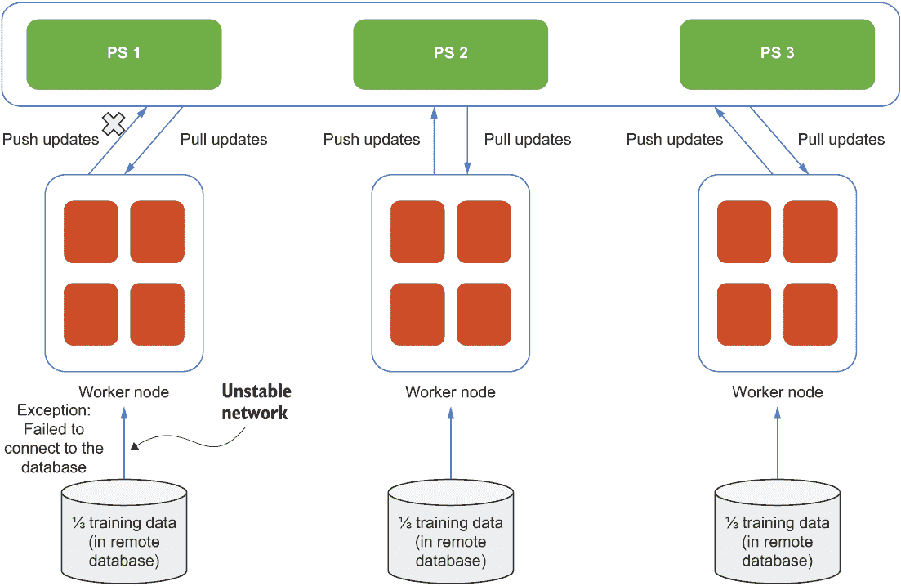

图 3.22 一个工人在从远程数据库获取数据时遇到了一个不稳定的网络。

不稳定的网络是否有其他影响？我们忽略了一个事实：我们也依赖网络在工人和参数服务器节点之间进行通信，以发送计算出的梯度并更新模型参数。回想一下，如果集合并行通信模式被整合，训练过程是同步的。换句话说，一个工人的通信会阻塞其他工人的通信；我们需要从所有工人那里获取所有梯度来聚合结果以更新模型参数。如果至少有一个工人在通信中变慢，级联效应最终会导致训练过程停滞。

在图 3.23 中，同一进程组中的三个工作进程正在执行 allreduce 操作。由于底层分布式集群遇到的不稳定网络，其中两个通信变得缓慢。结果，依赖于缓慢通信的两个进程没有及时接收到一些值（用问号表示），整个 allreduce 操作直到所有值都接收完毕才停止。

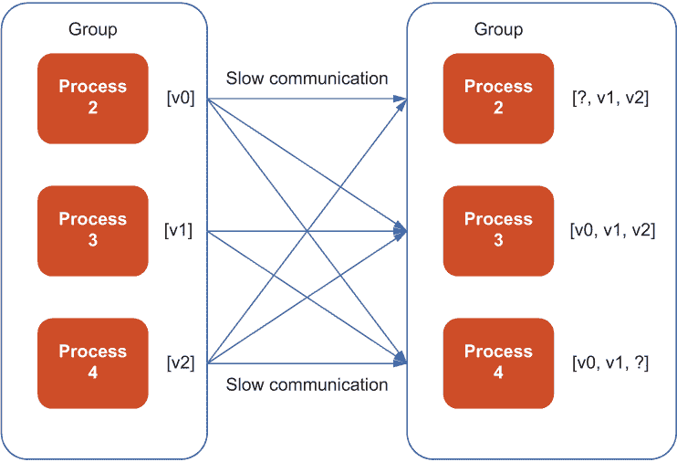

图 3.23 由于不稳定网络导致通信缓慢，整个训练过程被阻塞的全 reduce 过程

我们能做些什么来继续训练而不会受到单个节点网络性能下降的影响？在这种情况下，首先，我们可以放弃那些网络连接缓慢的两个工作进程；然后我们可以放弃当前的 allreduce 操作。鉴于集体通信模式的特点，剩余的工作者仍然有完全相同的模型副本，因此我们可以通过重建一个新的工作进程组（由剩余的工作者组成）并再次执行 allreduce 操作来继续训练过程。

这种方法也可以处理某些工作节点被抢占的情况，它们的计算资源被重新安排到更高优先级的任务和节点。当这些工作节点被抢占时，我们重建工作进程组，然后执行 allreduce 操作。这种方法使我们能够在意外故障发生时避免浪费资源从头开始训练模型。相反，我们可以从暂停的地方继续训练过程，并使用我们已分配计算资源的现有工作者。如果我们有额外的资源，我们可以轻松地添加工作者，然后重建工作进程组以更有效地训练。换句话说，我们可以轻松地扩展和缩小分布式训练系统，使整个系统在可用资源方面具有弹性。许多其他分布式系统也应用同样的想法，以确保现有的系统既可靠又可扩展。

### 3.4.3 讨论

我们已经成功继续并恢复了分布式训练过程，而没有浪费我们从每个工作者计算梯度的资源。如果我们使用参数服务器而不是仅与工作者进行集体通信的分布式训练，会怎样呢？

回想一下，当使用参数服务器时，每个参数服务器存储一个包含模型参数完整集合子集的模型分区。如果我们需要放弃任何工作者或参数服务器，例如，当某些通信由于某个参数服务器上的不稳定网络而失败或卡住，或者当工作者被抢占时，我们需要在失败的节点上检查点模型分区，然后将模型分区重新分区到仍然存活的服务器上。

在现实中，仍然存在许多挑战。我们如何检查点模型分区，并将它们保存在哪里？我们应该多久检查点一次，以确保它们尽可能新？

### 3.4.4 练习

1.  如果将来发生任何故障，在检查点中保存最重要的东西是什么？

1.  当我们放弃那些卡住或无法在没有时间制作模型检查点的情况下恢复的工作者时，如果我们使用集体通信模式，我们应该在哪里获取最新的模型？

## 3.5 练习答案

### 第 3.2.4 节

1.  不，因为训练是在单个笔记本电脑上进行的。

1.  系统最终会在节点之间花费大量时间进行通信，而在神经网络层之间进行计算的时间却很少。

1.  由于参数服务器不执行重计算，我们需要更多的磁盘空间来存储大型模型分区，并且需要较少的 CPU/GPU/内存。

### 第 3.3.4 节

1.  不，它们也出现在工作节点和参数服务器之间。

1.  异步

1.  您使用 reduce 操作，然后是 broadcast 操作。

### 第 3.4.4 节

1.  最新的模型参数

1.  在集体通信模式中，剩余的工作节点仍然拥有相同的模型副本，我们可以使用它来继续训练。

## 摘要

+   分布式模型训练与传统的模型训练过程不同，这取决于数据集的大小和位置、模型的大小、计算资源以及底层网络基础设施。

+   我们可以使用参数服务器来构建大型和复杂的模型，将模型参数的分区存储在每个服务器上。

+   如果工作节点和参数服务器之间的通信出现瓶颈，我们可以切换到集体通信模式来提高小型或中型模型的分布式模型训练性能。

+   在分布式模型训练过程中，可能会发生意外故障，我们可以采取各种方法来避免浪费计算资源。
