# 4 模型服务模式

本章涵盖了

+   使用模型服务生成对新数据的预测或推理，这些数据是使用之前训练好的机器学习模型

+   处理模型服务请求并使用复制的模型服务服务实现水平扩展

+   使用分片服务模式处理大量的模型服务请求

+   评估模型服务系统和事件驱动设计

在上一章中，我们探讨了分布式训练组件中涉及的一些挑战，并介绍了几种可以集成到该组件中的实用模式。分布式训练是分布式机器学习系统中最关键的部分。例如，我们看到了在训练非常大的机器学习模型时遇到的挑战，这些模型用于标记新 YouTube 视频中的主要主题，但无法在一个单一机器上运行。我们探讨了如何克服使用参数服务器模式的困难。我们还学习了如何使用集体通信模式来加速较小模型的分布式训练，并避免参数服务器和工作节点之间不必要的通信开销。最后但同样重要的是，我们讨论了由于数据集损坏、网络不稳定和抢占工作机器等原因，在分布式机器学习系统中经常看到的一些漏洞，以及我们如何解决这些问题。

模型服务是在我们成功训练了一个机器学习模型之后的下一步。它是分布式机器学习系统中的关键步骤之一。模型服务组件需要具备可扩展性和可靠性，以处理不断增长的用户请求数量和单个请求的大小。了解在构建分布式模型服务系统时可能遇到的不同设计决策的权衡也是至关重要的。

在本章中，我们将探讨分布式模型服务系统中涉及的一些挑战，并介绍一些在工业界广泛采用的成熟模式。例如，我们将看到在处理越来越多的模型服务请求时遇到的挑战，以及我们如何通过复制的服务来实现水平扩展来克服这些挑战。我们还将讨论分片服务模式如何帮助系统处理大量的模型服务请求。此外，我们还将学习如何评估模型服务系统，并确定在现实场景中事件驱动设计是否具有益处。

## 4.1 什么是模型服务？

*模型服务* 是将之前训练好的机器学习模型加载到系统中，以生成对新输入数据的预测或推理的过程。这是在我们成功训练了一个机器学习模型之后的步骤。图 4.1 显示了模型服务在机器学习流程中的位置。

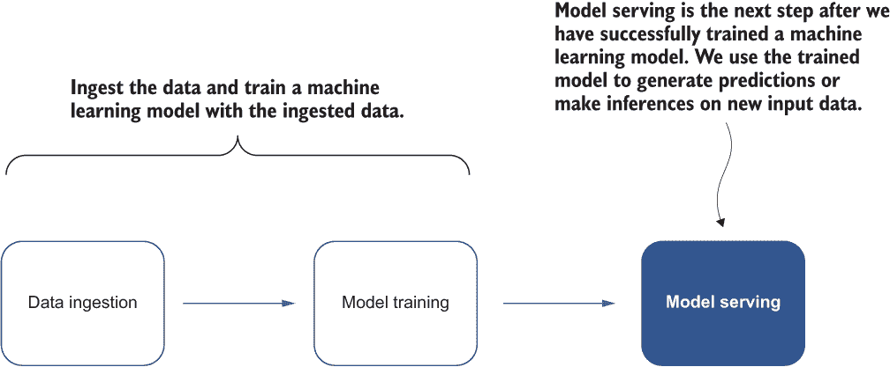

图 4.1 展示了模型服务在机器学习流程中的位置

注意，模型服务是一个通用概念，它出现在分布式和传统机器学习应用中。在传统机器学习应用中，模型服务通常是一个在本地桌面或机器上运行的单一程序，并为未用于模型训练的新数据集生成预测。用于模型服务的数据集和机器学习模型应该足够小，可以适应单个机器，并且存储在单个机器的本地磁盘上。

相比之下，分布式模型服务通常发生在机器集群中。用于模型服务的数据集和训练好的机器学习模型可以非常大，必须存储在远程分布式数据库中或在多台机器的磁盘上分区。传统模型服务和分布式模型服务系统之间的差异总结在表 4.1 中。

表 4.1 传统模型服务和分布式模型服务系统之间的比较

|  | 传统模型服务 | 分布式模型服务 |
| --- | --- | --- |
| 计算资源 | 个人笔记本电脑或单个远程服务器 | 机器集群 |
| 数据集位置 | 单个笔记本电脑或机器的本地磁盘 | 远程分布式数据库或多个机器的磁盘分区 |
| 模型与数据集大小 | 足够小，可以适应单个机器 | 中等到大型 |

构建和管理一个可扩展、可靠且高效的分布式模型服务系统，适用于不同的用例，并非易事。我们将检查几个用例以及一些可能解决不同挑战的既定模式。

## 4.2 复制服务模式：处理不断增长的服务请求

如您所忆，在前一章中，我们使用 YouTube-8M 数据集（[`research.google.com/youtube8m/`](http://research.google.com/youtube8m/)）构建了一个机器学习模型，以标记模型之前未见过的视频的主要主题。YouTube-8M 数据集包含数百万个 YouTube 视频 ID，以及来自 3,800 多个视觉实体（如食物、汽车、音乐等）的优质机器生成注释。YouTube-8M 数据集中视频的截图如图 4.2 所示。

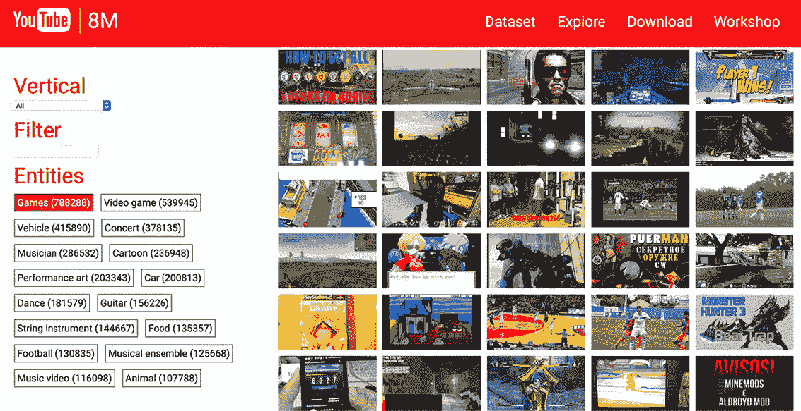

图 4.2 YouTube-8M 数据集中视频的截图。（来源：Sudheendra Vijayanarasimhan 等人。许可协议：非独占许可 1.0）

现在我们想构建一个模型服务系统，允许用户上传新视频。然后，系统将加载之前训练好的机器学习模型，以标记上传视频中出现的实体/主题。请注意，模型服务系统是无状态的，因此用户的请求不会影响模型服务结果。

系统基本上是接收用户上传的视频，并向模型服务器发送请求。模型服务器随后从模型存储中检索先前训练好的实体标注机器学习模型来处理视频，并最终生成视频中可能出现的实体。系统的高级概述如图 4.3 所示。

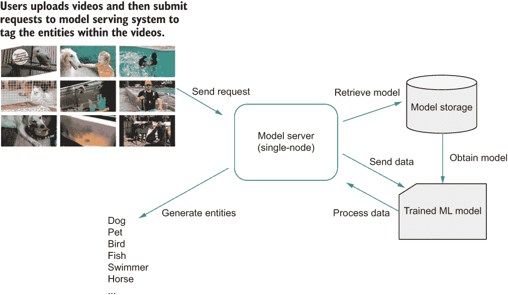

图 4.3 单节点模型服务系统的总体架构图

注意，这个模型服务器的初始版本仅在单台机器上运行，并按先到先得的原则响应用户的模型服务请求，如图 4.4 所示。如果只有极少数用户在测试系统，这种方法可能效果很好。然而，随着用户数量或模型服务请求的增加，用户在等待系统完成处理任何先前请求时将经历巨大的延迟。在现实世界中，这种糟糕的用户体验会立即失去用户对参与该系统的兴趣。

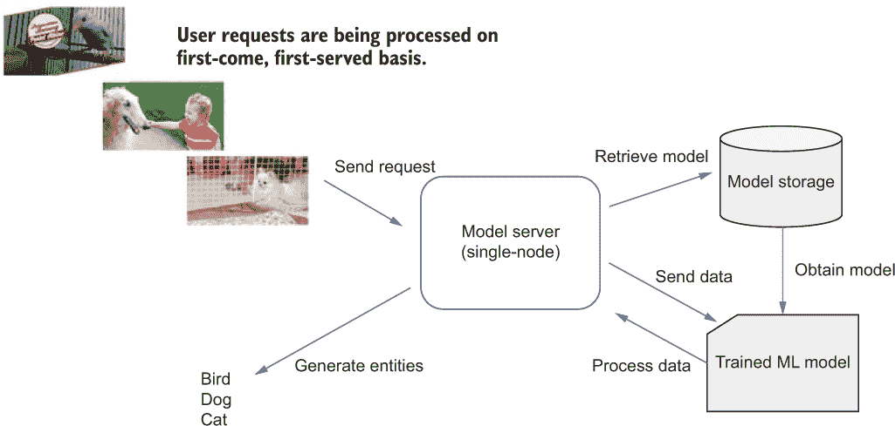

图 4.4 模型服务器仅在单台机器上运行，并按先到先得的原则响应用户的模型服务请求。

### 4.2.1 问题

系统接收用户上传的视频，然后向模型服务器发送请求。这些模型服务请求被排队，必须等待由模型服务器处理。

不幸的是，由于单节点模型服务器的特性，它只能基于先到先得的原则有效地处理有限数量的模型服务请求。随着实际应用中请求数量的增长，当用户必须等待很长时间才能收到模型服务结果时，用户体验会变差。所有请求都在等待由模型服务系统处理，但计算资源都绑定在这个单节点上。是否有比顺序处理更好的处理模型服务请求的方法？

### 4.2.2 解决方案

我们忽略的一个事实是，现有的模型服务器是无状态的，这意味着每个请求的模型服务结果不受其他请求的影响，机器学习模型只能处理单个请求。换句话说，模型服务器不需要保存状态来正确运行。

由于模型服务器是无状态的，我们可以添加更多服务器实例来帮助处理额外的用户请求，而不会相互干扰，如图 4.5 所示。这些额外的模型服务器实例是原始模型服务器的精确副本，但具有不同的服务器地址，并且每个处理不同的模型服务请求。换句话说，它们是模型服务的*复制服务*，或者简称为*模型服务器副本*。

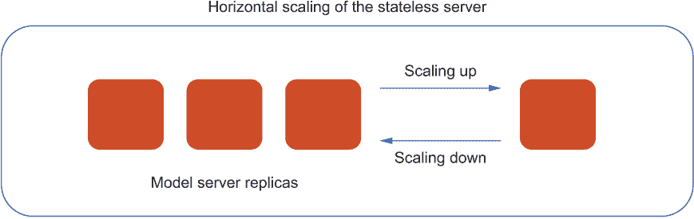

图 4.5 额外的服务器实例帮助处理额外的用户请求，而不会相互干扰。

将更多机器添加到我们的系统中称为*水平扩展*。水平扩展系统通过添加更多副本来处理越来越多的用户或流量。与水平扩展相反的是*垂直扩展*，这通常是通过向现有机器添加计算资源来实现的。

类比：水平扩展与垂直扩展

你可以将垂直扩展想象为当你需要更多动力时，退役你的跑车并购买一辆赛车。虽然赛车速度快，外观惊人，但它也很昂贵，并不实用，最终，它们在耗尽燃料之前只能带你走这么远。此外，只有一个座位，汽车必须在平坦的路面上驾驶。它实际上只适合赛车。

水平扩展为你提供了额外的动力——不是通过偏爱跑车而不是赛车，而是通过添加另一种车辆到混合中。实际上，你可以将水平扩展想象为几辆车，可以一次容纳很多乘客。也许这些机器中没有一辆是赛车，但它们都不需要是——在整个车队中，你拥有你需要的所有动力。

让我们回到我们的原始模型服务系统，该系统处理用户上传的视频并向模型服务器发送请求。与我们的先前模型服务系统设计不同，现在的系统具有多个模型服务器副本，用于异步处理模型服务请求。每个模型服务器副本接收单个请求，从模型存储中检索先前训练的实体标注机器学习模型，然后处理请求中的视频以标记视频中的可能实体。

因此，我们通过向现有的模型服务系统中添加模型服务器副本，成功地扩展了我们的模型服务器。新的架构如图 4.6 所示。模型服务器副本能够同时处理许多请求，因为每个副本可以独立处理单个模型服务请求。

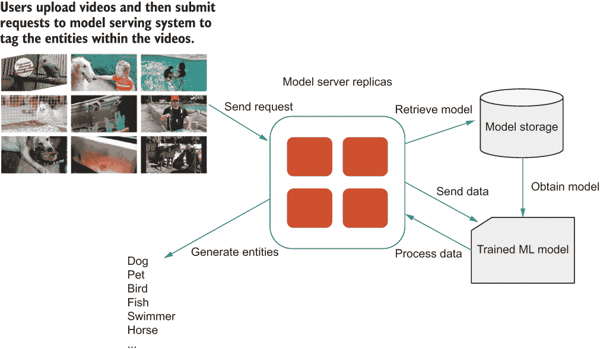

图 4.6 在我们通过向系统中添加模型服务器副本来扩展我们的模型服务器后，的系统架构

在新的架构中，来自用户的多个模型服务请求同时发送到模型服务器副本。然而，我们还没有讨论它们是如何被分配和处理的。例如，哪个请求正在由哪个模型服务器副本处理？换句话说，我们还没有定义请求和模型服务器副本之间的明确映射关系。

为了做到这一点，我们可以添加另一层——即负载均衡器，它负责在副本之间分配模型服务请求。例如，负载均衡器从我们的用户那里接收多个模型服务请求，然后将请求均匀地分配给每个模型服务器副本，这些副本随后负责处理单个请求，包括检索模型和在请求中的新数据上进行推理。图 4.7 说明了这个过程。

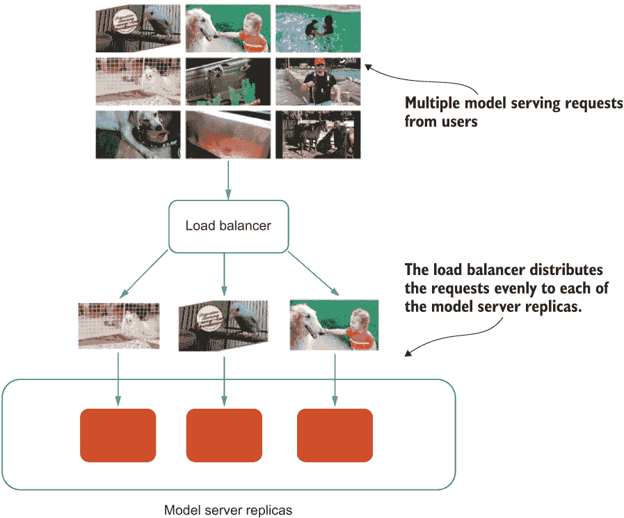

图 4.7 展示了负载均衡器如何用于在模型服务器副本之间均匀分配请求

负载均衡器使用不同的算法来决定哪个请求发送到哪个模型服务器副本。负载均衡的示例算法包括轮询、最少连接方法、哈希等。

轮询负载均衡

轮询是一种简单的技术，其中负载均衡器根据旋转列表将每个请求转发到不同的服务器副本。

虽然使用轮询算法实现负载均衡器很简单，但负载已经位于负载均衡服务器上，如果负载均衡服务器本身接收到大量需要昂贵处理请求，可能会变得危险。它可能会超出其有效工作的能力而超载。

复制服务模式为我们提供了横向扩展模型服务系统的绝佳方式。它也可以推广到任何需要处理大量流量的系统。每当单个实例无法处理流量时，引入这种模式可以确保所有流量都能等效且高效地处理。我们将在第 9.3.2 节中应用此模式。

### 4.2.3 讨论

现在我们已经设置了负载均衡的模型服务器副本，我们应该能够支持不断增长的用户请求，整个模型服务系统实现横向扩展。我们不仅能够以可扩展的方式处理模型服务请求，而且整个模型服务系统也变得*高度可用* ([`mng.bz/EQBd`](https://mng.bz/EQBd))。高可用性是系统在超过正常时间保持协议的操作性能（通常是正常运行时间）的特征。它通常以一年内正常运行时间的百分比来表示。

例如，一些组织可能需要达到高度可用的服务级别协议，这意味着服务 99.9%的时间都在运行（称为三九可用性）。换句话说，服务每天只能有 1.4 分钟的停机时间（24 小时×60 分钟×0.1%）。在复制模型服务的帮助下，如果任何模型服务器副本崩溃或在即时实例上被抢占，剩余的模型服务器副本仍然可用并准备好处理来自用户的任何模型服务请求，这提供了良好的用户体验并使系统可靠。

此外，由于我们的模型服务器副本需要从远程模型存储检索先前训练的机器学习模型，它们除了需要处于“活跃”状态外，还需要处于“就绪”状态。构建和部署“就绪探测”对于通知负载均衡器副本已成功建立与远程模型存储的连接并准备好为用户提供模型服务请求非常重要。就绪探测有助于系统确定特定副本是否就绪。有了就绪探测，当系统因内部系统问题而未就绪时，用户不会遇到意外的行为。

复制服务模式解决了我们的水平扩展问题，防止我们的模型服务系统支持大量的模型服务请求。然而，在实际的模型服务系统中，不仅服务请求的数量增加，每个请求的大小也在增加，如果数据或有效负载很大，这个大小可能会变得非常大。在这种情况下，复制服务可能无法处理大请求。我们将在下一节中讨论这种情况，并介绍一种可以缓解问题的模式。

### 4.2.4 练习

1.  复制的模型服务器是无状态的还是有状态的？

1.  当模型服务系统中没有负载均衡器时会发生什么？

1.  我们能否仅使用一个模型服务器实例就实现三个九的服务级别协议？

## 4.3 分片服务模式

复制服务模式有效地解决了我们的水平扩展问题，从而使我们的模型服务系统可以支持越来越多的用户请求。借助模型服务器副本和负载均衡器的帮助，我们还获得了高可用性的额外好处。

注意：每个模型服务器副本都有有限的、预先分配的计算资源。更重要的是，每个副本的计算资源量必须相同，以便负载均衡器可以正确且均匀地分配请求。

接下来，让我们想象一个用户想要上传一个需要使用模型服务器应用程序标记实体的高分辨率 YouTube 视频。尽管高分辨率视频太大，但如果模型服务器副本有足够的磁盘存储，它可能仍然可以成功上传到模型服务器副本。然而，我们无法在任何单个模型服务器副本中处理请求，因为处理这个单个大请求需要在模型服务器副本中分配更多的内存。这种对大量内存的需求通常是由于训练的机器学习模型的复杂性，因为它可能包含大量的昂贵矩阵计算或数学运算，正如我们在上一章中看到的。

例如，一个用户通过大请求将高分辨率视频上传到模型提供系统。其中一个模型服务器副本接收这个请求并成功检索先前训练的机器学习模型。不幸的是，由于负责处理此请求的模型服务器副本没有足够的内存，该模型随后无法处理请求中的大量数据。最终，我们可能在用户等待很长时间后通知他们此失败，这导致糟糕的用户体验。这种情况的示意图如图 4.8 所示。

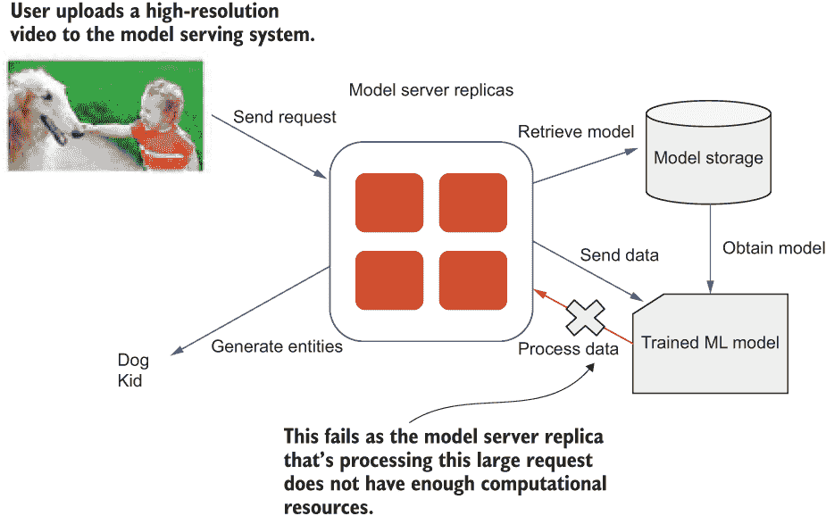

图 4.8 一个示意图，显示由于负责处理此请求的模型服务器副本没有足够的内存，模型无法处理请求中的大量数据

### 4.3.1 问题：处理高分辨率视频的大模型提供请求

系统正在处理的大请求是因为用户上传的视频具有高分辨率。在先前训练的机器学习模型可能包含昂贵的数学运算的情况下，这些大视频请求无法由具有有限内存的个别模型服务器副本成功处理和提供。我们如何设计模型提供系统以成功处理高分辨率视频的大请求？

### 4.3.2 解决方案

考虑到我们对每个模型服务器副本的计算资源需求，我们能否通过增加每个副本的计算资源来垂直扩展，以便它可以处理像高分辨率视频这样的大请求？由于我们通过相同的数量垂直扩展所有副本，因此我们不会影响负载均衡器的工作。

由于我们不知道有多少这样的请求，所以我们不能简单地垂直扩展模型服务器副本。想象一下，只有少数用户需要处理高分辨率视频（例如，使用高端相机捕获高分辨率视频的专业摄影师），而剩余的绝大多数用户仅上传来自智能手机的视频，分辨率要小得多。因此，大多数添加到模型服务器副本上的计算资源都是闲置的，这导致资源利用率非常低。我们将在下一节检查资源利用率，但到目前为止，我们知道这种方法是不切实际的。

记得我们在第三章中介绍了参数服务器模式，它允许我们将一个非常大的模型分区？图 4.9 是我们在第三章中讨论的示意图，展示了具有多个参数服务器的分布式模型训练；大模型已经被分区，每个分区位于不同的参数服务器上。每个工作节点获取数据集的一个子集，执行每个神经网络层所需的计算，然后将计算出的梯度发送到更新存储在参数服务器中的一个模型分区。

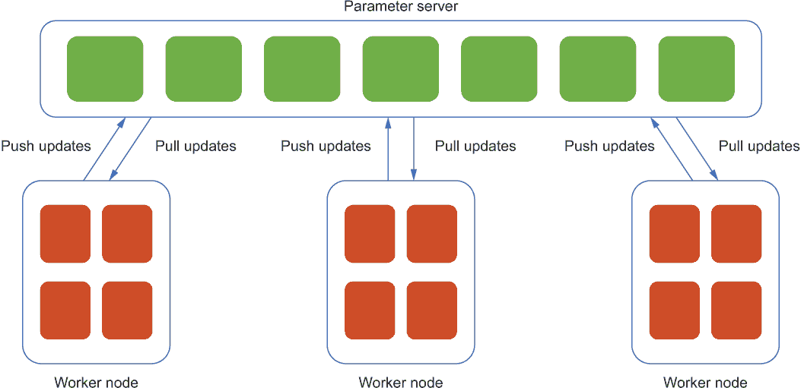

图 4.9 展示了具有多个参数服务器的分布式模型训练，其中大模型已经被分割，每个分区位于不同的参数服务器上。

为了处理我们的大模型服务请求问题，我们可以借用同样的想法并将其应用于我们的特定场景。

我们首先将原始的高分辨率视频分割成多个单独的视频，然后每个视频由多个独立的*模型服务器碎片*分别处理。模型服务器碎片是从单个模型服务器实例中划分出来的，每个碎片负责处理大量请求的一个子集。

图 4.10 中的图示是*分割服务模式*的一个示例架构。在该图中，包含狗和小孩的高分辨率视频被分割成两个单独的视频，每个视频代表原始大请求的一个子集。其中一个分割的视频包含狗出现的那部分，另一个视频包含小孩出现的那部分。这两个分割的视频成为两个单独的请求，并由不同的模型服务器碎片独立处理。

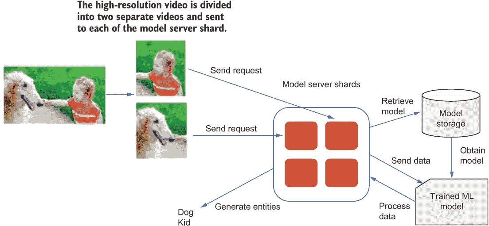

图 4.10 展示了分割服务模式的一个示例架构，其中高分辨率视频被分割成两个单独的视频。每个视频代表原始大请求的一个子集，并由不同的模型服务器碎片独立处理。

在模型服务器碎片接收到包含原始大模型服务请求一部分的子请求后，每个模型服务器碎片随后从模型存储中检索之前训练好的实体标注机器学习模型，然后处理请求中的视频以标注视频中可能出现的实体，类似于我们之前设计的模型服务系统。一旦每个模型服务器碎片都处理了所有子请求，我们将两个子请求（即两个实体，狗和小孩）的模型推理结果合并，以获得原始大模型服务请求的高分辨率视频的结果。

我们如何将两个子请求分配给不同的模型服务器碎片？类似于我们用来实现负载均衡器的算法，我们可以使用一个*分割函数*，它与哈希函数非常相似，以确定模型服务器碎片列表中的哪个碎片应该负责处理每个子请求。

通常，分割函数使用哈希函数和取模（%）运算符定义。例如，hash(request) % 10 会在哈希函数的输出显著大于分割服务中的碎片数量时，返回 10 个碎片。

分割的哈希函数特性

定义分割函数的哈希函数将任意对象转换为一个表示特定碎片索引的整数。它有两个重要的特性：

1.  哈希的输出对于给定的输入始终相同。

1.  输出的分布总是在输出空间内均匀。

这些特性很重要，可以确保特定的请求始终由同一个分片服务器处理，并且请求在分片之间均匀分布。

分片服务模式解决了我们在构建大规模模型服务系统时遇到的问题，并提供了一种处理大型模型服务请求的极好方式。它与我们在第二章中介绍的数据分片模式类似：我们不是将分片应用于数据集，而是将分片应用于模型服务请求。当一个分布式系统为单个机器有限的计算资源时，我们可以应用此模式将计算负担卸载到多台机器上。

### 4.3.3 讨论

分片服务模式有助于处理大量请求，并有效地将处理大型模型服务请求的工作负载分配到多个模型服务器分片中。在考虑任何数据量超过单台机器可容纳的数据的服务时，通常很有用。

然而，与我们在上一节中讨论的复制的服务模式不同，后者在构建无状态服务时很有用，分片服务模式通常用于构建有状态的服务。在我们的情况下，我们需要维护状态或从原始大请求使用分片服务处理子请求的结果，然后将结果合并到最终响应中，以便它包含原始高分辨率视频中的所有实体。

在某些情况下，这种方法可能不起作用，因为它取决于我们如何将原始的大请求分割成更小的请求。例如，如果原始视频已经被分割成超过两个子请求，其中一些可能没有意义，因为它们不包含任何机器学习模型可以识别的完整实体。对于这种情况，我们需要额外的处理和清理合并后的结果，以移除对应用程序无用的无意义实体。

在大规模构建模型服务系统以处理大量大型模型服务请求时，复制的服务模式和分片服务模式都很有价值。然而，要将它们纳入模型服务系统，我们需要了解手头可用的计算资源，如果流量相对动态，这些资源可能不可用。在下一节中，我将介绍另一种模式，该模式专注于可以处理动态流量的模型服务系统。

### 4.3.4 练习

1.  在处理大量请求时，垂直扩展会有帮助吗？

1.  模型服务器分片是有状态的还是无状态的？

## 4.4 事件驱动处理模式

我们在 4.2 节中考察的复制服务模式有助于处理大量的模型服务请求，而 4.3 节中的分片服务模式可以用来处理可能不适合单个模型服务器实例的非常大的请求。尽管这些模式解决了在规模上构建模型服务系统的挑战，但它们更适合在系统启动接收用户请求之前就知道需要分配多少计算资源、模型服务器副本或模型服务器分片时使用。

现在假设我们为一家为订阅客户提供假日和活动规划服务的公司工作。我们希望提供一个新服务，该服务将使用训练好的机器学习模型来预测位于度假区的酒店每晚的价格，前提是给定日期范围和客户希望度假的具体地点。

为了提供这项服务，我们可以设计一个机器学习模型服务系统。这个模型服务系统提供了一个用户界面，用户可以在其中输入他们感兴趣的度假日期和地点范围。一旦请求发送到模型服务器，之前训练好的机器学习模型将从分布式数据库中检索出来，并处理请求中的数据（日期和地点）。最终，模型服务器将返回给定日期范围内每个地点的预测酒店价格。整个过程如图 4.11 所示。

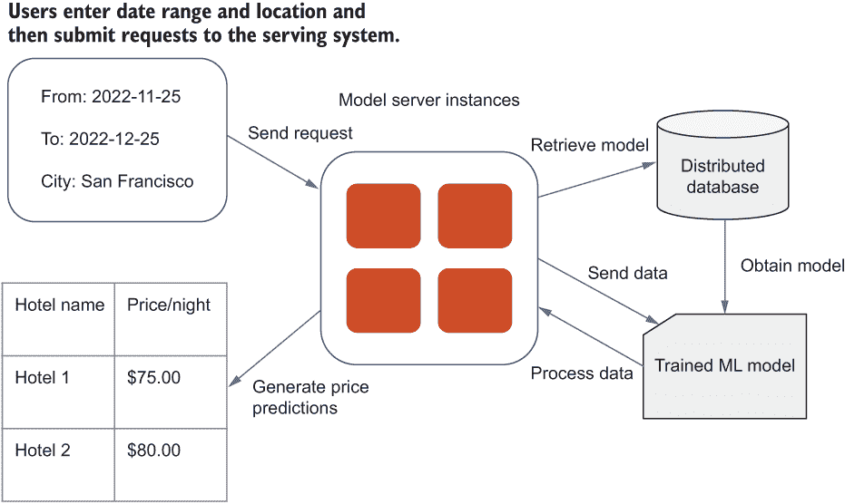

图 4.11 预测酒店价格的模型服务系统图示

在我们对选定客户测试这个模型服务系统一年后，我们将收集足够的数据来绘制模型服务流量随时间的变化图。结果证明，人们倾向于在假期最后一刻预订假期，因此在假期前交通量突然增加，然后在假期结束后再次减少。这种流量模式的问题在于它引入了非常低的资源利用率。

在我们当前的模式服务系统架构中，分配给模型的底层计算资源始终保持不变。这种策略似乎远非最佳：在流量低峰期，我们的大部分资源都在闲置，因此被浪费了，而在流量高峰期，我们的系统难以及时响应，需要比正常情况下更多的资源来运行。换句话说，系统必须用相同的计算资源（例如，10 个 CPU 和 100GB 的内存）来应对高流量或低流量，如图 4.12 所示。

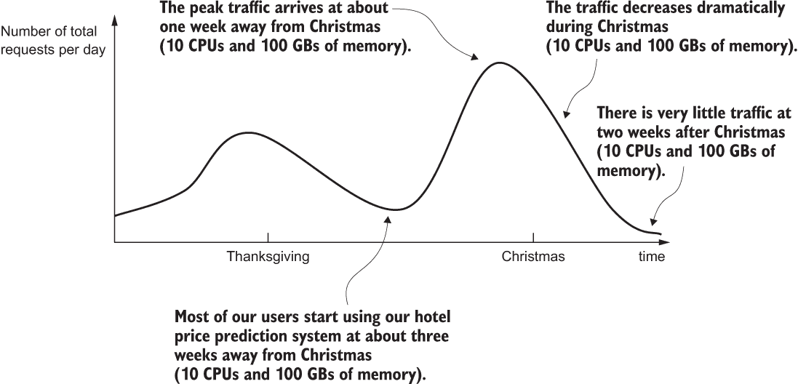

图 4.12 模型服务系统在分配等量计算资源的情况下随时间变化的流量变化。

由于我们多少知道那些节假日时期，为什么我们不相应地计划呢？不幸的是，一些事件使得预测流量激增变得困难。例如，一个大型国际会议可能计划在图 4.13 所示的某个度假胜地附近举行。这个意外事件，发生在圣诞节前，突然在该特定时间窗口增加了流量（实线）。如果我们不知道这些会议，我们就会错过在分配计算资源时应考虑的窗口。具体来说，在我们的场景中，尽管两个 CPU 和 20GB 的内存针对我们的用例进行了优化，但已不足以处理这个时间窗口内的所有资源。用户体验会很差。想象一下，所有会议参加者坐在笔记本电脑前，等待很长时间才能预订酒店房间。

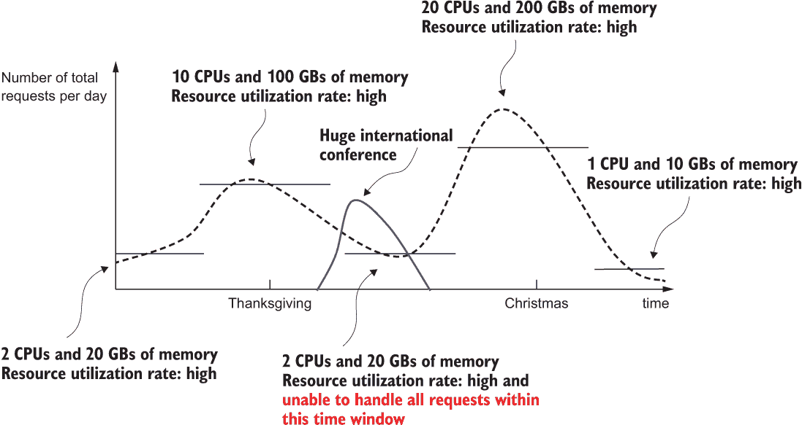

图 4.13：我们的模型服务系统随时间变化的流量，为不同时间窗口分配了最佳数量的计算资源。此外，在圣诞节前发生了一个意外事件，在该特定时间窗口突然增加了流量（实线）。

换句话说，这种简单解决方案仍然不太实用和有效，因为确定分配不同数量资源的时间窗口以及每个时间窗口需要多少额外资源并不简单。我们能否想出更好的方法？

在我们的场景中，我们处理的是一个随时间变化的动态模型服务请求数量，它与节假日时间高度相关。如果我们能保证始终有足够的资源，现在暂时忘记提高资源利用率的目标会怎样？如果计算资源始终保证是充足的，我们可以确保模型服务系统在节假日季节能够处理大量流量。

### 4.4.1 问题：基于事件响应模型服务请求

一种简单的方法是在确定系统可能经历高流量时段的任何可能的时间窗口之前，相应地估计和分配计算资源，但这并不可行。确定高流量时段的确切日期以及每个时段所需的计算资源的确切数量并不容易。

简单地增加计算资源到始终足够多的程度也不切实际，因为我们之前关注的资源利用率仍然很低。例如，如果在某个特定时间段内几乎没有用户请求，那么我们分配的计算资源，不幸的是，大部分时间都在闲置，从而造成浪费。是否有另一种方法可以更明智地分配和使用计算资源？

### 4.4.2 解决方案

我们问题的解决方案是维护一个计算资源池（例如，CPU、内存、磁盘等），不仅分配给这个特定的模型服务系统，还分配给其他应用程序或分布式机器学习管道的其他组件的模型服务。

图 4.14 是一个示例架构图，其中不同的系统（例如，数据摄取、模型训练、模型选择、模型部署和模型服务）同时使用共享资源池。这个共享资源池为我们提供了足够的资源，通过预先分配历史高峰流量期间所需的资源，并在达到限制时自动扩展，来处理模型服务系统的峰值流量。因此，我们只在需要时使用资源，并且只为每个特定的模型服务请求使用所需的特定数量的资源。

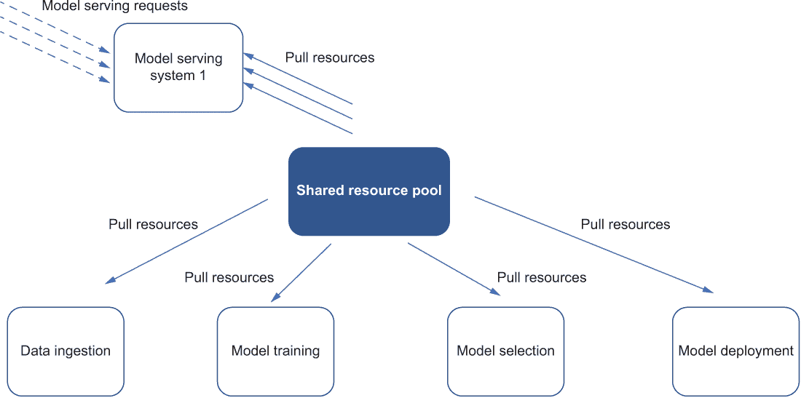

图 4.14 是一个架构图，其中不同的组件（例如，数据摄取、模型训练、模型选择和模型部署）以及两个不同的模型服务系统同时使用共享资源池。实线箭头表示资源，虚线箭头表示请求。

在我们的讨论中，我只关注图中的模型服务系统，其他系统的细节在这里被忽略。此外，这里我假设模型训练组件仅利用类似类型的资源，例如 CPU。如果模型训练组件需要 GPU 或 CPU/GPU 的混合，根据具体用例，可能最好使用单独的资源池。

当我们的酒店价格预测应用的用户输入他们感兴趣的度假日期和地点范围时，请求模型的服务请求被发送到模型服务系统。在收到每个请求后，系统通知共享资源池，系统正在使用一定量的计算资源。

例如，图 4.15 显示了我们的模型服务系统随时间变化的流量，并出现了一个意外的峰值。这个意外的峰值是由于在圣诞节前举行的一个新的非常大型国际会议。这一事件突然增加了流量，但模型服务系统通过从共享资源池借用必要的资源量成功处理了流量的激增。在共享资源池的帮助下，在此意外事件期间资源利用率保持较高。共享资源池监控当前可用资源的数量，并在需要时自动扩展。

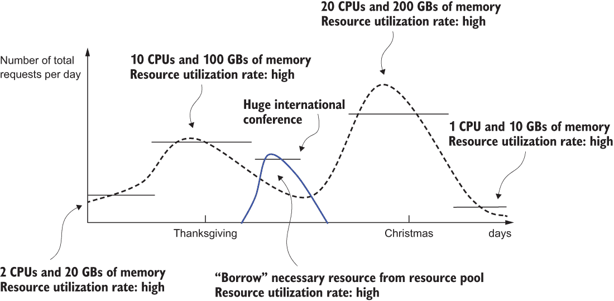

图 4.15 我们模型服务系统随时间变化的流量。在圣诞节前出现了一个意外的峰值，突然增加了流量。模型服务系统通过从共享资源池中借用必要的资源量成功处理了请求的增加。在此意外事件期间，资源利用率保持较高。

这种方法，即系统监听用户请求，仅在用户请求被提出时才响应和利用计算资源，被称为*事件驱动处理*。

事件驱动处理与长时间运行的服务系统

事件驱动处理与我们在前几节中查看的模型服务系统（例如，使用复制服务的系统[第 4.2 节]和分片服务模式[第 4.3 节]）不同，在这些系统中，处理用户请求的服务器始终处于运行状态。这些长时间运行的服务系统对于许多在重负载下运行、在内存中保持大量数据或需要某种类型后台处理的应用程序来说效果很好。

然而，对于在非高峰期间处理请求很少或响应特定事件的应用程序，例如我们的酒店价格预测系统，事件驱动处理模式更为合适。这种事件驱动处理模式近年来随着云服务提供商开发*函数即服务*产品而蓬勃发展。

在我们的场景中，从我们的酒店价格预测系统发出的每个模型服务请求都代表一个*事件*。我们的服务系统监听此类事件，从共享资源池中利用必要的资源，并从分布式数据库中检索和加载训练好的机器学习模型，以估计指定时间/位置的酒店价格。图 4.16 是此事件驱动模型服务系统的示意图。

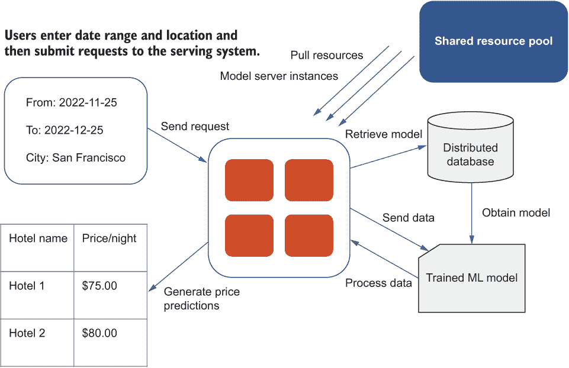

图 4.16 预测酒店价格的事件驱动模型服务系统示意图

使用这种事件驱动处理模式为我们提供服务系统，我们可以确保我们的系统仅使用处理每个请求所必需的资源，而不必担心资源利用和闲置。因此，系统有足够的资源来应对高峰流量，并在用户使用系统时，不会出现明显的延迟或滞后，返回预测价格。

尽管我们现在有一个足够的计算资源池，我们可以从中借用计算资源来按需处理用户请求，但我们也应该在我们的模型服务系统中建立一个防御*服务拒绝攻击*的机制。服务拒绝攻击中断了授权用户对计算机网络访问，通常由恶意意图引起，在模型服务系统中经常看到。这些攻击可能导致从共享资源池中意外使用计算资源，这最终可能导致依赖于共享资源池的其他服务资源稀缺。

服务拒绝攻击可能发生在各种情况下。例如，它们可能来自那些在极短的时间内意外发送大量模型服务请求的用户。开发者可能错误配置了使用我们模型服务 API 的客户端，因此它不断发送请求或在生产环境中意外启动了意外的负载/压力测试。

为了应对这些在现实应用中经常发生的情况，引入针对服务拒绝攻击的防御机制是有意义的。避免这些攻击的一种方法是通过*速率限制*，它将模型服务请求添加到队列中，并限制系统处理队列中请求的速率。

图 4.17 是一个流程图，显示了发送到模型服务系统的四个模型服务请求。然而，只有两个处于当前的速率限制之下，这允许最多两个并发模型服务请求。在这种情况下，模型服务请求的速率限制队列首先检查接收到的请求是否在当前的速率限制之下。一旦系统处理完这两个请求，它将继续处理队列中的剩余两个请求。

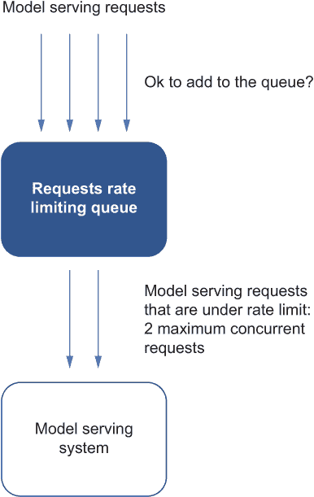

图 4.17 模型服务系统接收到的四个模型服务请求的流程图。然而，只有两个处于当前的速率限制之下，这允许最多两个并发模型服务请求。一旦系统处理完这两个请求，它将继续处理队列中的剩余两个请求。

如果我们正在向用户部署和公开模型服务 API 的 API，对于匿名访问的用户，通常也是最佳实践设置一个相对较小的速率限制（例如，每小时只允许一个请求），然后要求用户登录以获得更高的速率限制。这个系统将允许模型服务系统更好地控制和监控用户的行为和流量，以便我们可以采取必要的措施来解决任何潜在的问题或服务拒绝攻击。例如，要求登录可以提供审计，以找出哪些用户/事件对意外大量的模型服务请求负有责任。

图 4.18 展示了之前描述的策略。在图中，左侧的流程图与图 4.17 相同，其中未经身份验证的用户向模型服务系统发送了四个总模型服务请求。然而，由于当前的速率限制，只有两个可以被系统服务，因为未经身份验证用户的最大并发模型服务请求限制为两个。相反，右侧流程图中的模型服务请求全部来自经过身份验证的用户。因此，由于经过身份验证用户的最大并发请求限制为三个，模型服务系统可以处理三个请求。

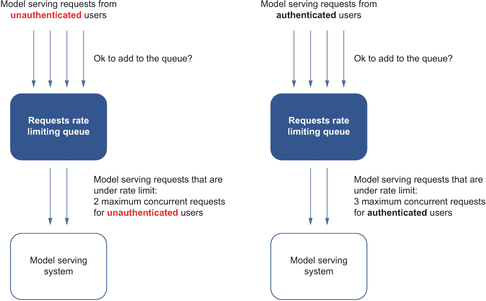

图 4.18 对应用于经过身份验证和未经身份验证用户的速率限制行为的比较

速率限制根据用户是否经过身份验证而有所不同。因此，速率限制有效地控制了模型服务系统的流量，并防止了恶意拒绝服务攻击，这可能导致从共享资源池中意外使用计算资源，最终导致依赖它的其他服务的资源稀缺。

### 4.4.3 讨论

尽管我们已经看到事件驱动处理模式如何使我们的特定服务系统受益，但我们不应试图将此模式作为通用的解决方案。使用许多工具和模式可以帮助您开发一个分布式系统以满足独特的现实世界需求。

对于具有一致流量的机器学习应用（例如，根据预定计划定期计算模型预测）来说，事件驱动处理方法是不必要的，因为系统已经知道何时处理请求，尝试监控这种定期流量将产生过多的开销。此外，可以容忍不太准确预测的应用可以在不受到事件驱动的情况下良好运行；它们也可以重新计算并提供足够好的预测到特定的粒度级别，例如每天或每周。

事件驱动处理更适合那些系统在事先准备必要的计算资源时复杂的、具有不同流量模式的应用。使用事件驱动处理，模型服务系统仅在需要时请求必要的计算资源。由于它们在用户发送请求后立即获得预测，而不是依赖于基于预定计划的预先计算的预测结果，因此应用可以提供更准确和实时的预测。

从开发者的角度来看，事件驱动处理模式的一个好处是它非常直观。例如，它极大地简化了将代码部署到运行中的服务的过程，因为除了源代码本身之外，没有需要创建或推送到源代码之外的最终产物。事件驱动处理模式使得从我们的笔记本电脑或网络浏览器部署代码到云中运行变得简单。

在我们的场景中，我们只需要部署可能根据用户请求触发的训练好的机器学习模型，作为*函数*。一旦部署，这个模型服务函数就会自动管理和扩展，无需开发者手动分配资源。换句话说，随着服务上承载的流量增加，模型服务函数的实例也会增加，以使用共享资源池来处理流量的增加。如果模型服务函数由于机器故障而失败，它将在共享资源池中的其他机器上自动重启。

考虑到事件驱动处理模式的特点，用于处理模型服务请求的每个函数都需要是**无状态的**并且独立于其他模型服务请求。每个函数实例不能有本地内存，这意味着所有状态都需要存储在存储服务中。例如，如果我们的机器学习模型高度依赖于先前预测的结果（例如，时间序列模型），在这种情况下，事件驱动处理模式可能不适合。

### 4.4.4 练习

1.  假设我们在模型服务系统的整个生命周期内为酒店价格预测分配相同数量的计算资源。随着时间的推移，资源利用率率会是什么样的？

1.  复制的服务或分片的服务是长运行系统吗？

1.  事件驱动处理是有状态的还是无状态的？

## 4.5 练习答案

### 第 4.2 节

1.  无状态的

1.  模型服务器副本不知道应该处理哪些用户请求，当多个模型服务器副本尝试处理相同的请求时，可能会出现潜在的冲突或重复工作。

1.  是的，只有当单个服务器每天的停机时间不超过 1.4 分钟时

### 第 4.3 节

1.  是的，它有帮助，但会降低整体资源利用率。

1.  有状态的

### 第 4.4 节

1.  它随时间变化，取决于流量。

1.  是的。服务器需要保持运行以接受用户请求，并且计算资源需要始终分配和占用。

1.  无状态的

## 摘要

+   模型服务是将先前训练好的机器学习模型加载到内存中，生成预测或对新输入数据进行推理的过程。

+   复制的服务有助于处理不断增长的模型服务请求数量，并在复制的服务帮助下实现水平扩展。

+   分片服务模式允许系统处理大型请求，并有效地将处理大型模型服务请求的工作负载分配给多个模型服务器分片。

+   使用事件驱动处理模式，我们可以确保我们的系统只使用处理每个请求所必需的资源，无需担心资源利用率和空闲。
