# 5 工作流程模式

本章涵盖

+   使用工作流程连接机器学习系统组件

+   使用扇入和扇出模式在机器学习工作流程中构建复杂但可维护的结构

+   使用同步和异步模式通过并发步骤加速机器学习工作负载

+   使用步骤记忆化模式提高性能

模型服务是在成功训练机器学习模型之后的关键步骤。它是整个机器学习工作流程产生的最终成果，模型服务的成果直接呈现给用户。之前，我们探讨了分布式模型服务系统中的一些挑战——例如，如何处理不断增长的模型服务请求数量和这些请求的增大——并调查了在行业中广泛采用的几个已建立的模式。我们学习了如何通过复制服务来实现水平扩展以解决这些挑战，以及如何使用分片服务模式帮助系统处理大量的模型服务请求。最后，我们学习了如何评估模型服务系统，并确定在现实世界场景中事件驱动设计是否会带来益处。

工作流程是机器学习系统中的一个基本组件，因为它连接了系统中的所有其他组件。机器学习工作流程可能非常简单，就像链式数据摄取、模型训练和模型服务。然而，处理需要额外步骤和性能优化的现实世界场景可能非常复杂，这些步骤和优化是整个工作流程的一部分。了解在设计决策中可能遇到哪些权衡，以满足不同的业务和性能要求，这是非常重要的。

在本章中，我们将探讨在实践构建机器学习工作流程时涉及的一些挑战。这些已建立的模式可以被重用来构建从简单到复杂的机器学习工作流程，这些工作流程既高效又可扩展。例如，我们将看到如何构建一个系统来执行复杂的机器学习工作流程，以训练多个机器学习模型。我们将使用扇入和扇出模式来选择在模型服务系统中提供良好实体标记结果的性能最优模型。我们还将结合同步和异步模式，使机器学习工作流程更加高效，并避免由于长时间运行的模型训练步骤而导致的延迟，这些步骤会阻塞其他连续步骤。

## 5.1 什么是工作流程？

*工作流程*是连接端到端机器学习系统中多个组件或步骤的过程。工作流程由现实世界中机器学习应用中常见的组件的任意组合组成，例如数据摄取、分布式模型训练和模型服务，如前几章所述。

图 5.1 展示了简单的机器学习工作流。该工作流连接了端到端机器学习系统中的多个组件或步骤，包括以下步骤：

1.  数据摄入——消费 YouTube-8M 视频数据集

1.  模型训练——训练实体标记模型

1.  模型服务——对未见过的视频中的实体进行标记

注意：机器学习工作流通常被称为**机器学习管道**。我在这里交替使用这两个术语。尽管我使用不同的术语来指代不同的技术，但在这本书中这两个术语之间没有区别。

由于机器学习工作流可能由任何组合的组件组成，因此我们在不同情况下经常看到不同形式的机器学习工作流。与图 5.1 中展示的直接工作流不同，图 5.2 说明了更复杂的流程，其中在单个数据摄入步骤之后启动了两个独立的模型训练步骤，然后使用两个独立的模型服务步骤来服务通过不同模型训练步骤训练的不同模型。

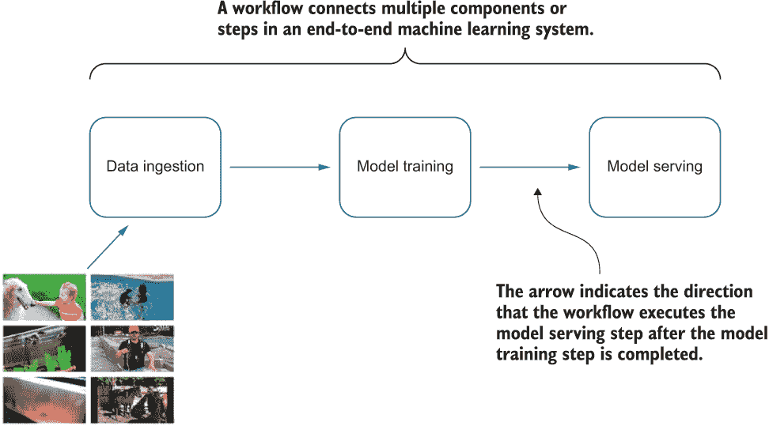

图 5.1 展示了简单的机器学习流程图，包括数据摄入、模型训练和模型服务。箭头表示方向。例如，右侧的箭头表示步骤执行的顺序（例如，工作流在模型训练步骤完成后执行模型服务步骤）。

图 5.2 展示了更复杂的流程，其中在单个数据摄入步骤之后启动了两个独立的模型训练步骤，然后使用两个独立的模型服务步骤来服务通过不同模型训练步骤训练的不同模型。

图 5.1 和图 5.2 只是常见的一些例子。在实践中，机器学习工作流的复杂性各不相同，这增加了构建和维护可扩展机器学习系统的难度。

我们将在本章中讨论一些更复杂的机器学习工作流，但首先，我将介绍并区分以下两个概念之间的差异：**顺序工作流**和**有向无环图（DAG）**。

一个**顺序工作流**表示一系列依次执行直到系列中的最后一个步骤完成的步骤。执行的确切顺序可能不同，但步骤始终是顺序的。图 5.3 是一个包含三个顺序执行的步骤的示例顺序工作流。

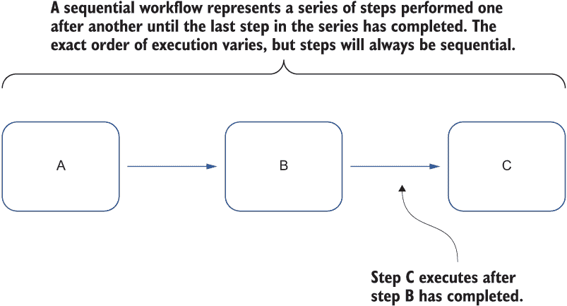

图 5.3 展示了三个步骤按以下顺序执行的示例顺序工作流：A、B 和 C。

如果一个工作流仅由从一步到另一步的定向步骤组成，但永远不会形成一个闭环，那么它可以被看作是一个有向无环图（DAG）。

例如，图 5.3 中的工作流程是一个有效有向无环图（DAG），因为三个步骤是从步骤 A 到步骤 B，然后从步骤 B 到步骤 C 的有向的——循环没有闭合。然而，另一个如图 5.4 所示的工作流程不是一个有效有向无环图（DAG），因为有一个额外的步骤 D 从步骤 C 连接到步骤 A，形成一个闭合循环。

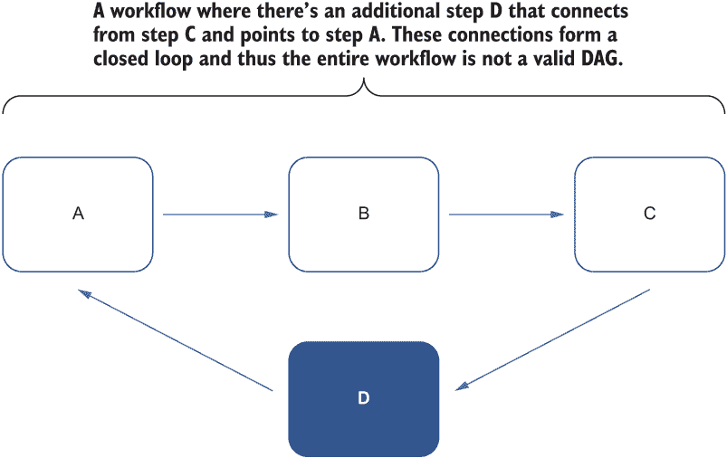

图 5.4 一个示例工作流程，其中步骤 D 从步骤 C 连接到步骤 A。这些连接形成一个闭合循环，因此整个工作流程不是一个有效有向无环图（DAG）。

如果步骤 D 不指向步骤 A，如图 5.5 所示，箭头被划掉，则此工作流程成为一个有效有向无环图（DAG）。循环不再闭合，因此它变成了一个简单的顺序工作流程，类似于图 5.3。

图 5.5 一个示例工作流程，其中最后一步 D 不指向步骤 A。由于闭合循环不再存在，此工作流程不是一个有效有向无环图（DAG）。相反，它是一个类似于图 5.3 的简单顺序工作流程。

在现实世界的机器学习应用中，满足不同用例（例如，模型的批量重新训练、超参数调整实验等）所需的工作流程可能会变得非常复杂。我们将探讨一些更复杂的工作流程，并抽象出可以重用于组合各种场景的结构模式。

## 5.2 输入和输出模式：组合复杂的机器学习工作流程

在第三章中，我们使用 YouTube-8M 数据集构建了一个机器学习模型，用于标记模型之前未见过的新闻视频的主要主题。YouTube-8M 数据集包含数百万个 YouTube 视频 ID，以及来自 3,800 多个视觉实体（如食品、汽车、音乐等）的高质量的机器生成注释。在第四章中，我们还讨论了有助于构建可扩展的模型服务系统的模式，用户可以上传新视频，然后系统加载之前训练好的机器学习模型来标记上传视频中的实体/主题。在实际应用中，我们通常希望将这些步骤链接起来，并以易于重用和分发的方式打包。

例如，如果原始 YouTube-8M 数据集已经更新，而我们想使用相同的模型架构从头开始训练一个新模型？在这种情况下，将每个组件容器化并将它们在机器学习工作流程中链接起来以供重用是非常容易的。当数据更新时，通过重新执行端到端工作流程来重用该工作流程。如图 5.6 所示，新视频定期添加到原始 YouTube-8M 数据集中，并且每次数据集更新时都会执行工作流程。下一个模型训练步骤使用最新的数据集训练实体标记模型。然后，最后一个模型服务步骤使用训练好的模型对未见过的视频中的实体进行标记。

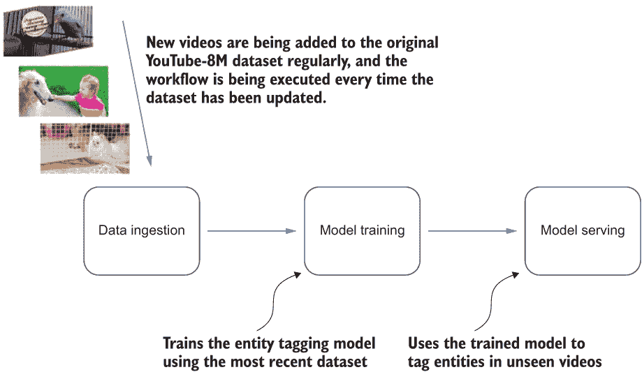

图 5.6 新视频定期添加到原始 YouTube-8M 数据集中，并且每次数据集更新时都会执行工作流程。

现在，让我们看看一个更复杂的真实世界场景。假设我们知道任何机器学习模型架构的模型训练实现细节。我们希望构建一个机器学习系统来训练不同的模型。然后，我们希望使用前两个模型来生成预测，这样整个系统就不太可能错过视频中的任何实体，因为两个模型可能从不同的角度捕获信息。

### 5.2.1 问题

我们希望构建一个机器学习工作流程，在系统从数据源摄取数据后，能够训练不同的模型。然后，我们希望选择前两个模型，并利用这两个模型的知识来提供模型服务，为用户提供预测。

构建一个包含机器学习系统端到端正常流程的工作流程，仅包括数据摄取、模型训练和模型服务，其中每个组件在每个工作流程步骤中仅作为单独的步骤出现一次，这相当直接。然而，在我们的特定场景中，工作流程要复杂得多，因为我们需要包括多个模型训练步骤以及多个模型服务步骤。我们如何形式化和一般化这个复杂工作流程的结构，以便它可以轻松打包、重用和分发？

### 5.2.2 解决方案

让我们从最基础的机器学习工作流程开始，该工作流程仅包括数据摄取、模型训练和模型服务，其中这些组件在每个工作流程步骤中仅作为单独的步骤出现一次。我们将基于此工作流程构建我们的系统，作为我们的基线，如图 5.7 所示。

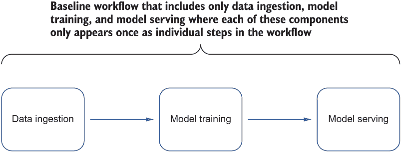

图 5.7 包含仅数据摄取、模型训练和模型服务的基线工作流程，其中这些组件在每个工作流程步骤中仅出现一次作为单独的步骤

我们的目标是表示构建和选择用于模型服务的表现最佳的两个模型的机器学习工作流程。让我们花点时间来理解为什么这种方法在实践中可能会被使用。例如，图 5.8 显示了两个模型：第一个模型了解四个实体，第二个模型了解三个实体。因此，每个模型都可以从视频中标记它所知道的实体。我们可以同时使用这两个模型来标记实体，然后汇总它们的结果。汇总的结果显然更知识渊博，能够覆盖更多实体。换句话说，两个模型可以更有效，产生更全面的实体标记结果。

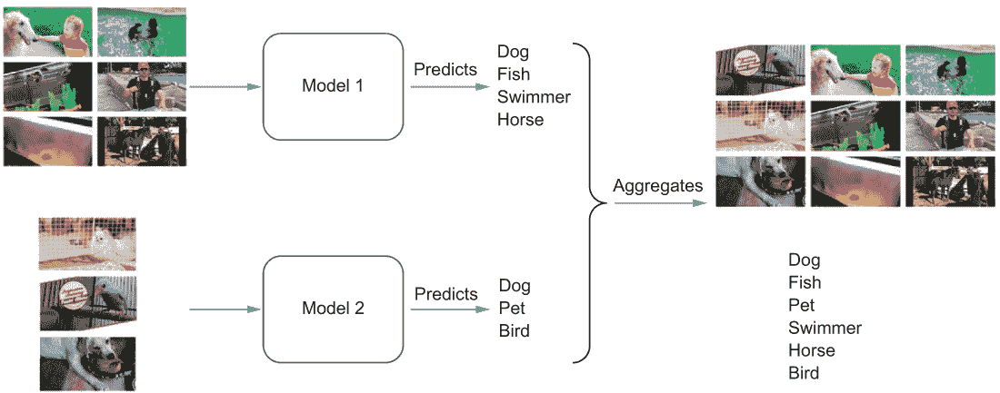

图 5.8 模型图，第一个模型了解四个实体，第二个模型了解三个实体。因此，每个模型都可以从视频中标记它所知道的实体。我们可以同时使用这两个模型来标记实体，然后汇总它们的结果。汇总结果覆盖了比每个单独模型更多的实体。

既然我们理解了构建这个复杂工作流程背后的动机，那么让我们看一下整个端到端工作流程过程的概述。我们希望构建一个机器学习工作流程，该工作流程按顺序执行以下功能：

1.  从相同的数据源摄取数据

1.  训练多个不同的模型，这些模型可以是同一模型架构的不同超参数集合，或者是各种模型架构。

1.  选择两个表现最好的模型用于每个训练模型的模型服务

1.  将两个模型服务系统的模型结果汇总以呈现给用户

让我们先在数据摄取后的基线工作流程中添加一些占位符以用于多个模型训练步骤。一旦多个模型训练步骤完成，我们就可以添加多个模型服务步骤。增强型基线工作流程的图示如图 5.9 所示。

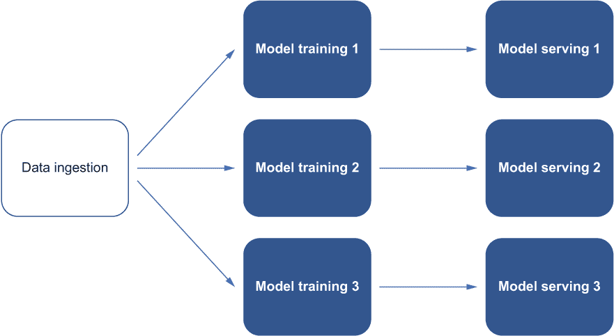

图 5.9 增强型基线工作流程图，在数据摄取之后发生多个模型训练步骤，随后是多个模型服务步骤

与我们在基线中之前处理的不同之处在于存在多个模型训练和模型服务组件。步骤之间没有直接的、一对一的关系。例如，每个模型训练步骤可能连接到单个模型服务步骤，也可能不连接到任何步骤。图 5.10 显示，从前两个模型训练步骤训练的模型优于从第三个模型训练步骤训练的模型。因此，只有前两个模型训练步骤连接到模型服务步骤。

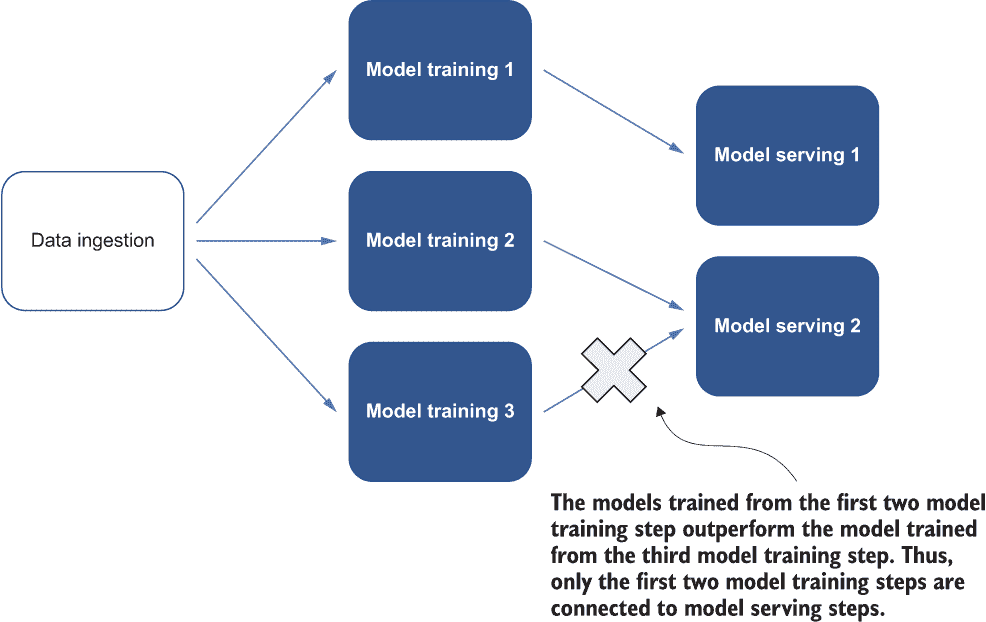

图 5.10 从前两个模型训练步骤训练的模型优于从第三个模型训练步骤训练的模型。因此，只有前两个模型训练步骤连接到模型服务步骤。

我们可以这样构建这个工作流程。在成功的数据摄取后，多个模型训练步骤连接到数据摄取步骤，以便它们可以使用从原始数据源摄取并清洗的共享数据。接下来，一个步骤连接到模型训练步骤以选择表现最好的两个模型。它产生两个模型服务步骤，使用所选模型处理来自用户的模型服务请求。在这个机器学习工作流程的末尾，一个最终步骤连接到两个模型服务步骤，以汇总将呈现给用户的模型推理结果。

完整工作流程的图示显示在图 5.11 中。该工作流程通过三个模型训练步骤训练不同的模型，在实体标注时产生不同的准确率。一个模型选择步骤从前两个模型训练步骤中选取至少 90%准确率的两个顶级模型，这些模型将在接下来的两个单独的模型服务步骤中使用。然后，通过结果聚合步骤将两个模型服务步骤的结果汇总，以供用户查看。

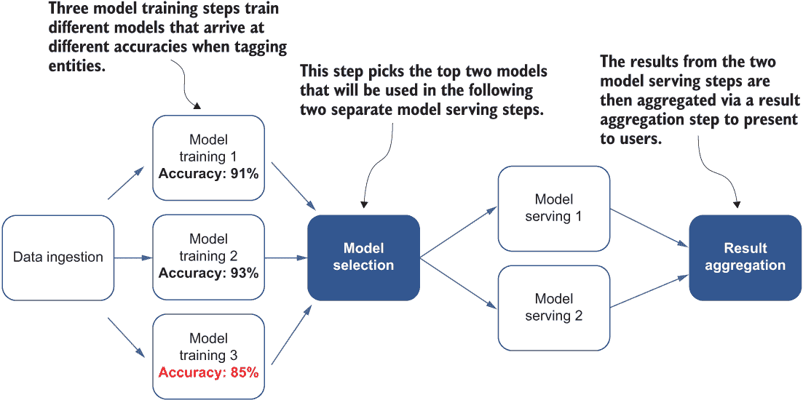

图 5.11 一个机器学习工作流程，该工作流程训练不同的模型，在实体标注时产生不同的准确率，然后选择至少 90%准确率的两个顶级模型用于模型服务。然后，通过结果聚合步骤将两个模型服务步骤的结果汇总，以供用户查看。

我们可以从这个复杂的工作流程中抽象出两种模式。首先观察到的是*扇出*模式。扇出描述了启动多个独立的步骤来处理工作流程输入的过程。在我们的工作流程中，如图 5.12 所示，当多个独立的模型训练步骤连接到数据摄取步骤时，就会出现扇出模式。

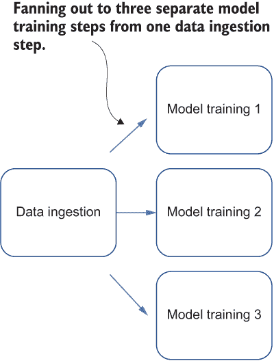

图 5.12 当多个独立的模型训练步骤连接到数据摄取步骤时出现的扇出模式图示

在我们的工作流程中，也存在*扇入*模式，其中我们有一个单一的聚合步骤，将两个模型服务步骤的结果合并，如图 5.13 所示。扇入描述了将多个步骤的结果合并到一个步骤的过程。

图 5.13 扇入模式的图示，其中我们有一个单一的聚合步骤，将两个模型服务步骤的结果合并

将这些模式形式化将有助于我们通过使用不同模式来构建和组织更复杂的工作流程，这些模式基于现实世界的需求。

我们已经成功构建了一个复杂的工作流程，该工作流程训练不同的模型，然后使用顶级的前两个模型生成预测，从而使整个系统在视频中不太可能遗漏任何实体。当构建满足现实世界需求复杂工作流程时，这些模式非常强大。我们可以构建各种工作流程，从单一的数据处理步骤到多个模型训练步骤，以使用相同的数据集训练不同的模型。如果不同模型的预测在现实世界应用中有用，我们还可以从每个模型训练步骤启动多个模型服务步骤。我们将在第 9.4.1 节中应用此模式。

### 5.2.3 讨论

通过在系统中使用扇入和扇出模式，系统现在能够执行复杂的流程，这些流程训练多个机器学习模型，并选择性能最佳的模型以在模型服务系统中提供良好的实体标注结果。

这些模式是很好的抽象，可以融入非常复杂的流程中，以满足现实世界中日益增长的复杂分布式机器学习流程的需求。但哪些工作流程适合扇入和扇出模式？一般来说，如果以下两个条件都适用，我们可以考虑融入这些模式：

+   我们正在扇入或扇出的多个步骤是相互独立的。

+   这些步骤按顺序运行需要很长时间。

多个步骤需要是无序的，因为我们不知道这些步骤的并发副本将按什么顺序运行，也不知道它们将按什么顺序返回。例如，如果工作流程还包含一个训练其他模型集合（也称为*集成学习*；[`mng.bz/N2vn`](http://mng.bz/N2vn)）的步骤，以提供更好的聚合模型，这个集成模型依赖于其他模型训练步骤的完成。因此，我们不能使用扇入模式，因为集成模型训练步骤需要在其他模型训练完成后才能开始运行，这会需要额外的等待并延迟整个工作流程。

集成模型

集成模型使用多个机器学习模型来获得比任何单个组成模型单独获得的更好的预测性能。它通常由多个替代模型组成，可以从不同的角度学习数据集中的关系。

当组成模型之间的多样性显著时，集成模型往往会产生更好的结果。因此，许多集成方法试图增加它们组合的模型的多样性。

扇入和扇出模式可以创建非常复杂的流程，满足机器学习系统的大部分需求。然而，为了在这些复杂的流程上实现良好的性能，我们需要确定哪些流程部分应该首先运行，哪些流程部分可以并行执行。由于优化，数据科学团队将花费更少的时间等待流程完成，从而降低基础设施成本。在下一节中，我将介绍一些模式，帮助我们从计算角度组织工作流程中的步骤。

### 5.2.4 练习

1.  如果步骤之间不是相互独立的，我们能否使用扇入或扇出模式？

1.  使用扇入模式构建集成模型时，主要问题是什么？

## 5.3 同步和异步模式：通过并发加速工作流程

系统中的每个模型训练步骤都需要很长时间才能完成；然而，它们的持续时间可能因不同的模型架构或模型参数而异。想象一个极端情况，其中一个模型训练步骤需要两周时间才能完成，因为它正在训练一个需要大量计算资源的复杂机器学习模型。我们之前构建的机器学习工作流程中，许多步骤，如模型选择和模型服务，使用扇入和扇出模式，将不得不额外等待一周，直到这个长时间运行的模型训练步骤完成。图 5.14 展示了三个模型训练步骤之间持续时间差异的示意图。

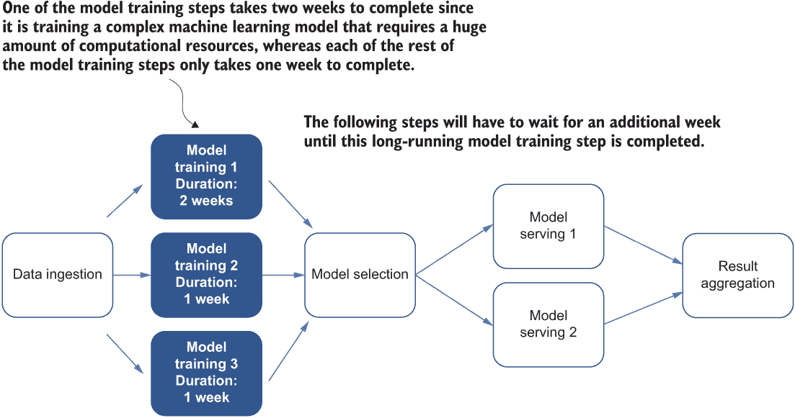

图 5.14 一个说明三个模型训练步骤持续时间差异的工作流程

在这种情况下，由于模型选择步骤及其后续步骤需要所有模型训练步骤完成，因此需要两周时间完成的模型训练步骤将使工作流程整体慢一周。我们宁愿用那额外的一周重新执行所有只需一周完成的模型训练步骤，而不是浪费时间等待一个步骤！

### 5.3.1 问题

我们希望构建一个机器学习工作流程，该工作流程训练不同的模型，然后选择前两个模型用于模型服务，该服务基于两个模型的知识生成预测。由于现有机器学习工作流程中每个模型训练步骤的完成时间不同，因此后续步骤，如模型选择步骤和模型服务，的开始依赖于前一步骤的完成。

然而，当至少有一个模型训练步骤的完成时间比其他步骤长得多时，会出现问题，因为后续的模型选择步骤只能在长时间运行的模型训练步骤完成后才能开始。结果，整个工作流程因此特别长时间运行的步骤而延迟。有没有办法加速这个工作流程，使其不会受到单个步骤持续时间的影响？

### 5.3.2 解决方案

我们希望构建与之前相同的工作流程，该工作流程在系统从数据源摄取数据后，训练不同的模型，选择前两个模型，然后使用这两个模型提供模型服务，以生成使用两个模型知识的预测。

然而，这次我们注意到一个性能瓶颈，因为每个后续步骤的开始，例如模型选择和模型服务，都依赖于其前一步骤的完成。在我们的案例中，我们有一个必须完成才能进行下一步的长时间运行的模型训练步骤。

如果我们可以完全排除长时间运行的模型训练步骤，会怎样？一旦我们这样做，其余的模型训练步骤将具有一致的完成时间。因此，工作流程中剩余的步骤可以在等待某个仍在运行的特定步骤之前执行。更新后的工作流程图如图 5.15 所示。

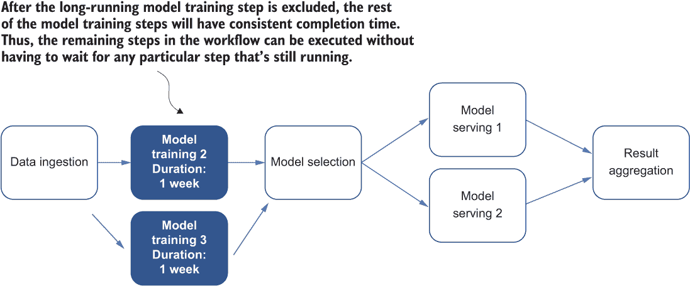

图 5.15 移除长时间运行的模型训练步骤后的新工作流程

这种简单的方法可能解决了我们长时间等待长运行步骤的问题。然而，我们的原始目标是使用这种复杂的流程来实验不同的机器学习模型架构和这些模型的超参数集，以选择最佳性能的模型用于模型服务。如果我们简单地排除长运行模型训练步骤，我们实际上是在放弃实验可能更好地捕捉视频实体的高级模型的机会。

是否有更好的方法来加速工作流程，使其不会受到单个步骤持续时间的影响？让我们专注于那些只需一周就能完成的模型训练步骤。当这些短时间运行的模型训练步骤完成后，我们能做什么？

当模型训练步骤完成时，我们已经成功获得了一个训练好的机器学习模型。实际上，我们可以在模型服务系统中使用这个训练好的模型，而无需等待模型训练步骤的其余部分完成。因此，当我们在工作流程中的某个步骤中训练了一个模型后，用户就可以看到他们模型服务请求中包含的视频的标记实体结果。这个工作流程的图如图 5.16 所示。

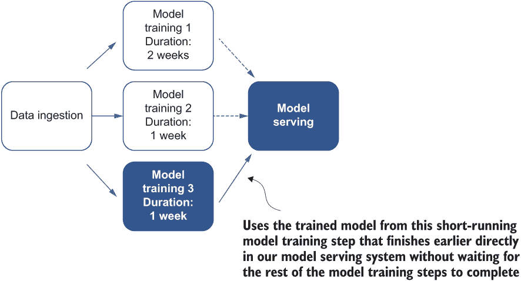

图 5.16 在短时间运行的模型训练步骤中训练的模型直接应用于我们的模型服务系统，无需等待剩余的模型训练步骤完成的工作流程

在第二个模型训练步骤完成后，我们可以直接将两个训练好的模型传递给模型服务。向用户展示的是综合推理结果，而不是仅从最初获得的模型中得到的推理结果，如图 5.17 所示。

图 5.17 在第二个模型训练步骤完成后，我们直接将两个训练好的模型传递给模型服务。向用户展示的是综合推理结果，而不仅仅是最初获得的模型的推理结果。

注意，虽然我们可以继续使用训练好的模型进行模型选择和模型服务，但长时间运行的模型训练步骤仍在进行中。换句话说，这些步骤是**异步执行**的——它们之间不依赖于彼此的完成。工作流程在上一步骤完成之前就开始执行下一步骤。

顺序步骤一次执行一个，并且只有当上一个步骤完成时，下一个步骤才会解除阻塞。换句话说，您必须等待一个步骤完成才能进行下一个步骤。例如，数据摄取步骤必须完成，我们才能开始任何模型训练步骤。

与异步步骤相反，一旦满足依赖关系，同步步骤可以同时开始运行。例如，模型训练步骤可以并发运行，一旦之前的数据摄取步骤完成即可。不同的模型训练步骤不需要等待另一个开始。同步模式通常在您有多个可以并发运行且几乎同时完成的相似工作负载时非常有用。

通过结合这些模式，整个工作流程将不再被长时间运行的模型训练步骤阻塞。相反，它可以使用模型服务系统中已经训练好的模型，这些模型可以开始处理用户的模型服务请求。

同步和异步模式在其他分布式系统中也非常有用，可以优化系统性能并最大化现有计算资源的使用——尤其是在重负载的计算资源有限时。我们将在第 9.4.1 节中应用此模式。

### 5.3.3 讨论

通过混合同步和异步模式，我们可以创建更高效的机器学习工作流程，并避免由于阻止其他步骤执行而导致的任何延迟，例如长时间运行的模型训练步骤。然而，来自时间较短的模型训练步骤训练的模型可能不太准确。也就是说，具有更简单架构的模型可能不会在视频中识别出像长时间运行的模型训练步骤（图 5.18）中更复杂的模型那样多的实体。

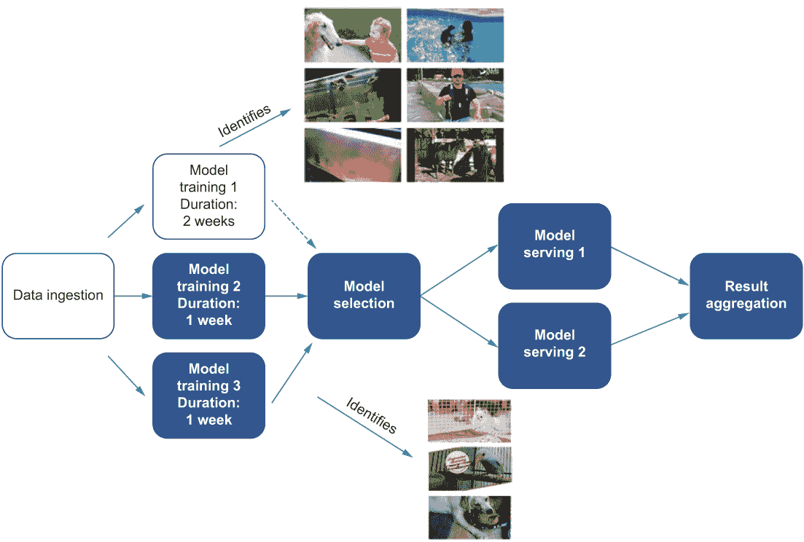

图 5.18 由两个完成的时间较短的模型训练步骤训练的模型，这些步骤使用了非常简单的模型作为基线。它们只能识别少量实体，而来自耗时最长的步骤训练的模型可以识别更多的实体。

因此，我们应该记住，我们早期得到的模型可能不是最好的，可能只能标记少量实体，这可能不会满足我们的用户需求。

当我们将这个端到端工作流程部署到现实世界应用中时，我们需要考虑用户看到推理结果更快还是看到更好的结果更重要。如果目标是允许用户在新模型可用时立即看到推理结果，他们可能看不到他们预期的结果。然而，如果用户可以容忍一定程度的延迟，等待更多的模型训练步骤完成会更好。然后，我们可以选择性地挑选我们训练的模型，并选择那些提供非常好的实体标记结果的性能最好的模型。是否可以接受延迟取决于现实世界应用的要求。

通过使用同步和异步模式，我们可以从结构和计算的角度组织机器学习工作流程中的步骤。因此，数据科学团队可以花费更少的时间等待工作流程完成，以最大化性能，从而降低基础设施成本和闲置的计算资源。在下一节中，我们将介绍在现实世界系统中经常使用的一种模式，它可以节省更多的计算资源，并使工作流程运行得更快。

### 5.3.4 练习

1.  模型训练步骤的每个步骤是由什么引起的？

1.  如果步骤异步运行，它们会相互阻塞吗？

1.  在决定是否尽可能早地使用任何可用的训练模型时，我们需要考虑什么？

## 5.4 步骤记忆化模式：通过记忆化步骤跳过冗余工作负载

在工作流程中采用扇入和扇出模式后，系统可以执行复杂的流程，这些流程训练多个机器学习模型，并选择性能最好的模型在模型服务系统中提供良好的实体标记结果。我们在这章中看到的工作流程只包含一个数据摄入步骤。换句话说，在工作流程中，数据摄入步骤总是首先执行，然后剩余的步骤，如模型训练和模型服务，才能开始处理。

不幸的是，在现实世界的机器学习应用中，数据集并不总是保持不变。现在，想象一下新的 YouTube 视频每周都在变得可用，并被添加到 YouTube-8M 数据集中。按照我们现有的工作流程架构，如果我们想重新训练模型以考虑定期到达的额外视频，我们需要定期从头开始运行整个工作流程——从数据摄入步骤到模型服务步骤，如图 5.19 所示。

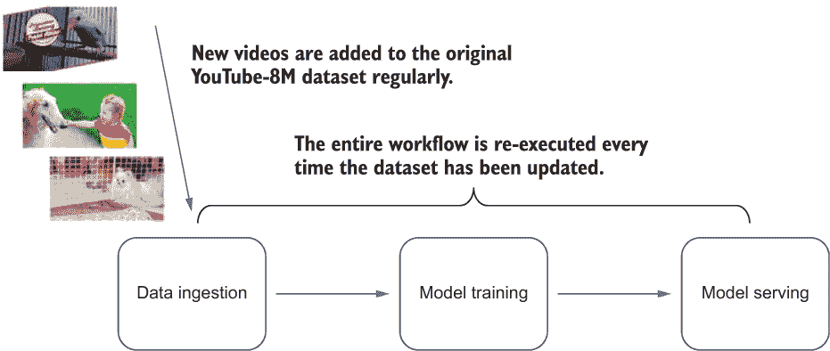

图 5.19 每次数据集更新时重新执行的整体工作流程图

假设数据集没有变化，但我们要尝试新的模型架构或新的超参数集，这在机器学习从业者中非常常见（见图 5.20）。例如，我们可能将模型架构从简单的线性模型更改为更复杂的模型，如基于树的模型或卷积神经网络。我们也可以坚持使用我们使用的特定模型架构，并仅更改模型超参数集，例如神经网络模型中每层的层数和隐藏单元的数量，或基于树的模型中每棵树的深度。对于这些情况，我们仍然需要运行端到端的流程，包括从原始数据源从头开始重新摄入数据的步骤。再次进行数据摄入是非常耗时的。

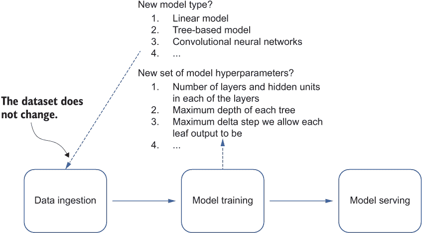

图 5.20 每次我们尝试新的模型类型或超参数时，即使数据集没有变化，整个流程都需要重新执行。

### 5.4.1 问题

机器学习流程通常从数据摄入步骤开始。如果数据集正在定期更新，我们可能希望重新运行整个流程以训练一个考虑新数据的全新机器学习模型。为此，我们需要每次都执行数据摄入步骤。或者，如果数据集没有更新，但我们要尝试新的模型，我们仍然需要执行整个流程，包括数据摄入步骤。然而，数据摄入步骤可能需要很长时间才能完成，这取决于数据集的大小。有没有办法使这个流程更高效？

### 5.4.2 解决方案

由于数据摄入步骤通常非常耗时，我们可能不想每次流程运行时都重新执行它来重新训练或更新我们的实体标记模型。让我们首先考虑这个问题的根本原因。YouTube 视频的数据集正在定期更新，并且新数据定期持久化到数据源上（例如，每月一次）。

我们有两个用例需要重新执行整个机器学习流程：

+   数据集更新后，重新运行流程以训练一个使用更新数据集的新模型。

+   我们想使用已经摄入的数据集尝试新的模型架构，这些数据可能尚未更新。

基本问题是耗时的数据摄入步骤。在当前的流程架构中，无论数据集是否已更新，数据摄入步骤都需要执行。

理想情况下，如果新数据尚未更新，我们不想重新摄入已经收集的数据。换句话说，我们希望在知道数据集已更新时才执行数据摄入步骤，如图 5.21 所示。

图 5.21 当数据集未更新时跳过数据摄入步骤的示意图

现在的挑战在于确定数据集是否已被更新。一旦我们有了识别这一点的办法，我们就可以有条件地重建机器学习工作流程，并控制是否想要重新执行数据摄入步骤（图 5.21）。

识别数据集是否已被更新的方法之一是通过使用缓存。由于我们的数据集正在按照固定的时间表定期更新（例如，每月一次），我们可以创建一个基于时间的缓存，存储摄入和清洗后的数据集的位置以及其最后更新时间戳。工作流程中的数据摄入步骤将根据最后更新时间戳是否在特定窗口内动态构建和执行。例如，如果时间窗口设置为两周，那么如果数据在过去两周内更新，我们就认为摄入的数据是新鲜的。数据摄入步骤将被跳过，接下来的模型训练步骤将直接使用缓存中存储的已摄入数据集。

图 5.22 说明了工作流程已被触发，并且通过访问缓存检查数据是否在过去两周内更新。如果数据是新鲜的，我们将跳过执行不必要的摄入步骤，并直接执行模型训练步骤。

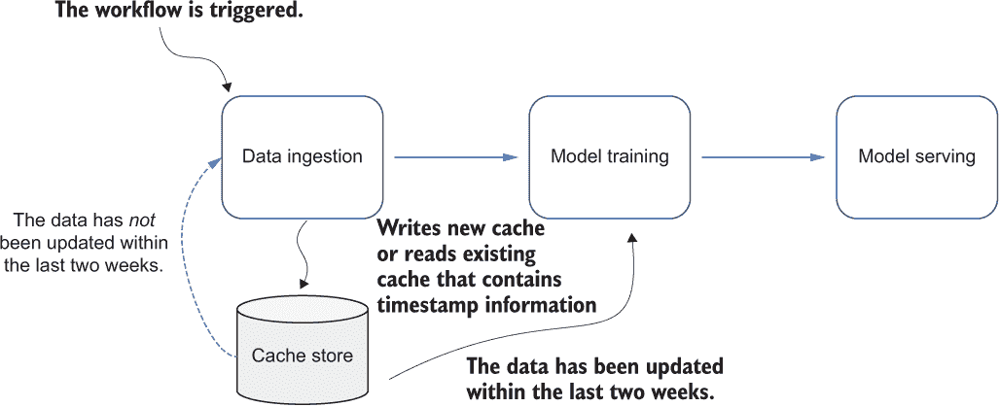

图 5.22 工作流程已被触发，通过访问缓存检查数据是否在过去两周内更新。如果数据是新鲜的，我们将跳过执行不必要的摄入步骤，并直接执行模型训练步骤。

时间窗口可以用来控制缓存可以有多旧，在我们认为数据集足够新鲜可以直接用于模型训练而不是重新从头开始摄入数据之前。

或者，我们可以在缓存中存储一些关于数据源的重要元数据，例如当前可用的原始数据源中的记录数。这种类型的缓存被称为基于内容的缓存，因为它存储从特定步骤提取的信息，例如输入和输出信息。有了这种类型的缓存，我们可以识别数据源是否有重大变化（例如，数据源中的原始记录数翻倍）。如果有重大变化，通常是一个重新执行数据摄入步骤的信号，因为当前的数据集非常旧且过时。图 5.23 展示了说明这种方法的流程图。

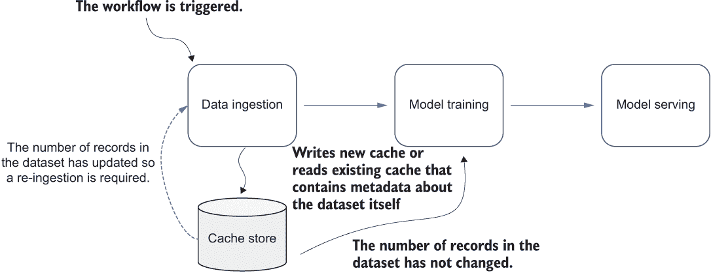

图 5.23 工作流程已被触发，我们检查从数据集中收集的元数据，例如数据集中的记录数是否发生了显著变化。如果没有显著变化，我们就跳过执行不必要的数据处理步骤，直接执行模型训练步骤。

这种使用缓存来确定是否执行步骤或跳过的模式被称为*步骤记忆化*。借助步骤记忆化，工作流程可以识别出那些可以跳过而不需要重新执行的重负载步骤，从而大大加速端到端工作流程的执行。我们将在第 9.4.2 节中应用这个模式。

### 5.4.3 讨论

在现实世界的机器学习应用中，除了数据处理之外，许多工作负载都是计算密集型和耗时的。例如，模型训练步骤需要大量的计算资源来实现高性能的模型训练，有时可能需要几周时间才能完成。如果我们只是在实验其他不需要更新训练模型的组件，那么避免重新执行昂贵的模型训练步骤可能是有意义的。在决定是否可以跳过重负载和冗余步骤时，步骤记忆模式非常有用。

如果我们正在创建基于内容的数据缓存，关于要提取和存储在缓存中的信息类型的决策可能并不简单。例如，如果我们试图缓存模型训练步骤的结果，我们可能希望考虑使用包含诸如机器学习模型类型和模型超参数集等信息的训练模型工件。当工作流程再次执行时，它将根据我们是否尝试相同的模型来决定是否重新执行模型训练步骤。或者，我们可能存储诸如性能统计信息（例如，准确率、均方误差等）来识别是否超过了阈值，并且值得训练一个性能更好的模型。

此外，在实践应用步骤记忆模式时，请注意，它需要一定程度的维护工作来管理创建的缓存的生命周期。例如，如果每天有 1,000 个机器学习工作流程运行，每个工作流程平均有 100 个步骤被记忆，那么每天将创建 100,000 个缓存。根据它们存储的信息类型，这些缓存需要一定量的空间，这些空间可能会迅速积累。

为了在规模上应用此模式，必须有一个垃圾收集机制来自动删除不必要的缓存，以防止缓存积累占用大量磁盘空间。例如，一个简单的策略是记录缓存最后一次被工作流程中的步骤击中和使用的时间戳，然后定期扫描现有的缓存，清理那些未被使用或长时间未被击中的缓存。

### 5.4.4 练习

1.  哪种类型的步骤最能从步骤记忆化中受益？

1.  如果一个步骤的工作流程被触发再次运行，我们如何判断该步骤的执行是否可以跳过？

1.  一旦我们使用该模式进行大规模应用，我们需要管理和维护什么？

## 5.5 练习答案

### 第 5.2 节

1.  不，因为我们没有保证这些步骤的并发副本将按什么顺序运行

1.  训练集成模型取决于完成子模型的模型训练步骤。我们不能使用扇入模式，因为集成模型训练步骤将需要等待其他模型训练完成才能开始运行，这将需要额外的等待并延迟整个工作流程。

### 第 5.3 节

1.  由于现有机器学习工作流程中每个模型训练步骤完成时间的差异，每个后续步骤（如模型选择和模型服务）的开始都取决于前一个步骤的完成。

1.  不，异步步骤不会互相阻塞。

1.  从用户的角度来看，我们需要考虑是否希望尽可能早地使用任何可用的训练模型。我们应该考虑对用户来说，是更快地看到推理结果更重要，还是看到更好的结果更重要。如果目标是允许用户在新的模型可用时立即看到推理结果，那么这些结果可能不够好或不是用户所期望的。或者，如果用户可以接受一定的延迟，等待更多的模型训练步骤完成可能更可取。然后，您可以有选择性地选择训练模型，并挑选出性能最好的模型，这将提供非常好的实体标记结果。

### 第 5.4 节

1.  耗时或需要大量计算资源的步骤

1.  我们可以使用存储在缓存中的信息，例如缓存最初创建时或从步骤收集的元数据，来决定是否应该跳过执行特定的步骤。

1.  我们需要设置一个垃圾回收机制来自动回收和删除创建的缓存。

## 摘要

+   工作流程是机器学习系统中的一个基本组件，因为它将机器学习系统中的所有其他组件连接起来。机器学习工作流程可以像链式数据摄取、模型训练和模型服务一样简单。

+   将扇入和扇出模式纳入复杂的工作流程中，可以使它们易于维护和组合。

+   同步和异步模式通过并发加速机器学习工作负载。

+   步骤记忆化模式通过跳过重复的工作负载来提高工作流程的性能。
