# 6 操作模式

本章涵盖了

+   识别机器学习系统中的改进领域，例如作业调度和元数据

+   使用如公平共享调度、优先级调度和组调度等技术来防止资源饥饿和避免死锁

+   通过元数据模式更有效地处理故障，以减少对用户的任何负面影响

在第五章中，我们关注了机器学习工作流程及其在实际构建中的挑战。工作流程是机器学习系统中的一个基本组成部分，因为它连接了系统中的所有组件。一个机器学习工作流程可以简单到只是将数据摄取、模型训练和模型服务串联起来。在处理现实世界场景时，它也可以非常复杂，需要额外的步骤和性能优化才能成为整个工作流程的一部分。

了解在做出设计决策以满足特定业务和性能要求时可能遇到的权衡是至关重要的。我之前介绍了一些在工业界普遍采用的成熟模式。每个模式都可以被重用来构建从简单到复杂的、高效且可扩展的机器学习工作流程。例如，我们学习了如何使用扇入和扇出模式来构建一个执行复杂机器学习工作流程的系统（第 5.2 节）。这个系统可以训练多个机器学习模型，并选择性能最好的模型以提供良好的实体标记结果。我们还使用了同步和异步模式来提高机器学习工作流程的效率，并避免由于长时间运行的模型训练步骤而导致的延迟，这些步骤会阻塞其他步骤（第 5.3 节）。

由于现实世界的分布式机器学习工作流程可能非常复杂，正如第五章所见，维护和管理系统各个组件（如系统效率、可观察性、监控、部署等）需要大量的操作工作。这些操作工作通常需要 DevOps 团队和数据科学团队之间大量的沟通和协作。例如，DevOps 团队可能没有足够的数据科学团队使用的机器学习算法的领域知识来调试遇到的问题或优化底层基础设施以加速机器学习工作流程。对于数据科学团队来说，计算工作负载的类型因团队结构和团队成员的协作方式而异。因此，DevOps 团队没有处理来自数据科学团队的不同工作负载请求的通用方法。

幸运的是，操作努力和模式可以极大地加速端到端工作流程。它们还可以在系统成为生产就绪之前，当工程团队与数据科学家或机器学习实践者团队合作时，减少维护和沟通的努力。

在本章中，我们将探讨在实际操作机器学习系统时遇到的挑战，并介绍一些常用的模式。例如，我们将使用调度技术来防止资源饥饿和避免死锁，当许多团队成员在有限的计算资源下在同一集群中协作时。我们还将讨论元数据模式的益处，它可以提供对机器学习工作流程中各个步骤的见解，并帮助我们更恰当地处理故障，以减少对用户产生的任何负面影响。

## 6.1 机器学习系统中的操作是什么？

在本章中，我将重点关注在机器学习工作流程中常见于多个组件或步骤的操作技术和模式，而不是针对每个单独组件的模式。例如，图 6.1 所示的工作流程包括在数据摄入之后和多个模型训练步骤之后的多个模型服务步骤中发生的三个失败步骤。不幸的是，每个步骤都像一个黑盒，我们目前对它们的许多细节还一无所知。在这个阶段，我们只知道它们是否失败以及这些失败是否影响了后续步骤。因此，它们真的很难调试。

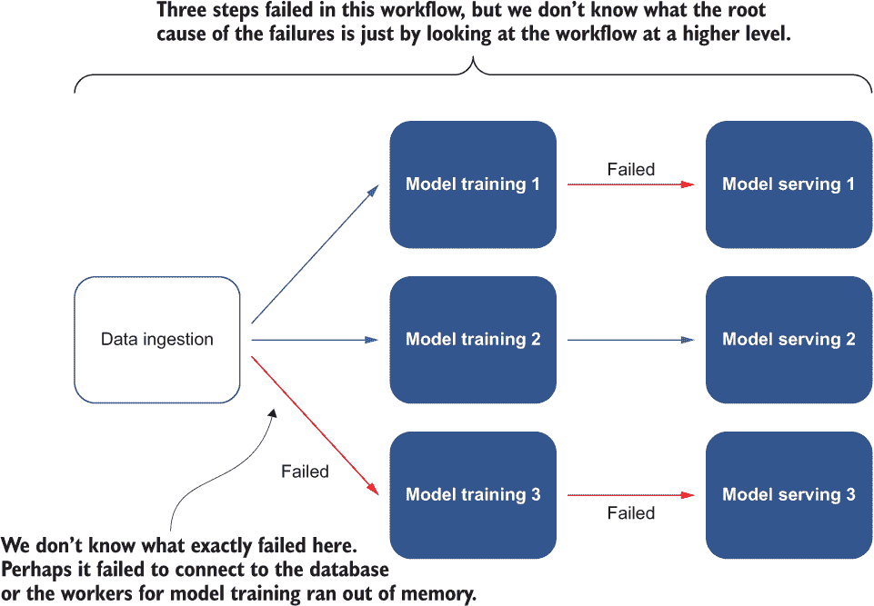

图 6.1 一个示例工作流程，其中在数据摄入之后发生多个模型训练步骤，在多个模型训练步骤之后发生多个模型服务步骤。注意三个失败的步骤。

我在本章中介绍的操作模式可以提高整个工作流程的可见性，帮助我们理解故障的根本原因，并给我们一些如何正确处理故障的想法。此外，提高的可观察性可能有助于我们开发对类似工作流程未来执行有益的系统效率改进。

那么，MLOps 是什么呢？

我们现在经常听到*MLOps*这个词，这是一个从机器学习和操作中衍生出来的术语。它通常意味着一组用于管理生产中机器学习生命周期的实践，包括来自机器学习和 DevOps 的实践，以高效和可靠地部署和管理生产中的机器学习模型。

MLOps 通常需要 DevOps 团队和数据科学团队之间的沟通和协作。它侧重于提高生产机器学习的质量，同时拥抱自动化，并保持业务需求。MLOps 的范围可能非常大，并且根据上下文而变化。

由于 MLOps 的范围可能非常大，这取决于上下文，我在写作时将仅关注一组成熟的模式。您可以期待随着这个领域的演变，本章的任何未来版本都将有所更新。

## 6.2 调度模式：在共享集群中有效分配资源

假设我们已经成功为用户设置了分布式基础设施，以便提交分布式模型训练作业，这些作业默认由*调度器*调度，在多个 CPU 上运行。调度器负责分配计算资源以执行系统请求的任务。它旨在保持计算资源忙碌，并允许多个用户更容易地共享资源进行协作。多个用户正在尝试使用集群中的共享计算资源构建模型，以适应不同的场景。例如，一位用户正在开发一个欺诈检测模型，试图识别诸如国际洗钱等欺诈金融行为。另一位用户正在开发一个条件监测模型，可以生成一个健康分数来表示工业资产（如火车、飞机、风力涡轮机等组件）的当前状态。

我们的基础设施最初只提供了一个简单的调度器，它按照先到先得的原则调度作业，如图 6.2 所示。例如，第三项作业是在第二项作业被调度之后调度的，并且每个作业的计算资源都是在调度时分配的。

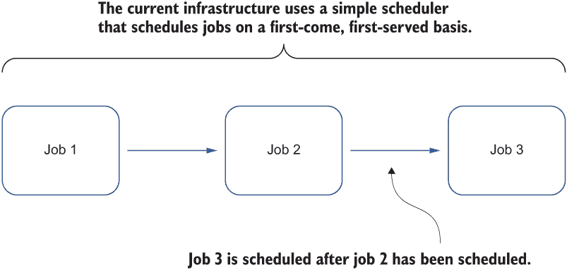

图 6.2 仅提供简单调度器的基础设施示意图，该调度器按照先到先得的原则调度作业

换句话说，调度作业较晚的用户必须等待所有先前提交的作业完成，然后他们的模型训练作业才能开始执行。不幸的是，在现实世界中，用户通常希望提交多个模型训练作业以实验不同的模型集或超参数集。这些多个模型阻塞了其他用户的模型训练作业的执行，因为先前提交的实验已经利用了所有可用的计算资源。

在这种情况下，用户必须争夺资源（例如，在夜间唤醒以提交模型训练作业，因为此时使用系统的用户较少）。因此，团队成员之间的协作可能不会愉快。一些作业包括训练非常大的机器学习模型，这些模型通常消耗大量的计算资源，从而增加了其他用户等待其作业执行的时间。

此外，如果我们只为分布式模型训练作业调度部分请求的工人，则模型训练无法执行，直到所有请求的工人都准备好；分布策略的本质是具有集体通信模式的分布式训练。如果必要的计算资源不足，作业将永远不会启动，并且已分配给现有工人的计算资源将被浪费。

### 6.2.1 问题

我们已经为用户建立了一个分布式基础设施，用户可以通过默认调度器提交分布式模型训练作业，该调度器负责分配计算资源以执行用户请求的各种任务。然而，默认调度器仅提供一个简单的调度器，它按照先到先得的原则安排作业。因此，当多个用户尝试使用此集群时，他们通常需要等待很长时间才能获得可用的计算资源——也就是说，直到之前提交的作业完成。此外，由于分布式训练策略的性质，如集体通信策略，分布式模型训练作业必须等到所有请求的工人准备就绪后才能开始执行。那么，有没有任何替代现有的默认调度器的方法，以便我们可以在共享集群中更有效地分配计算资源？

### 6.2.2 解决方案

在我们的场景中，当多个用户同时尝试使用系统提交分布式模型训练作业时，问题开始出现。由于作业是按照先到先得的原则执行的，因此后来提交的作业的等待时间很长，即使这些作业是由多个用户提交的。

识别不同的用户很容易，因此一个直观的解决方案是限制每个用户分配的总计算资源量。例如，假设有四个用户（A、B、C 和 D）。一旦用户 A 提交了一个使用 25%总可用 CPU 周期（[`techterms.com/definition/clockcycle`](https://techterms.com/definition/clockcycle)）的作业，他们就不能提交另一个作业，直到那些分配的资源被释放并准备好分配给新的作业。其他用户可以独立于用户 A 使用多少资源提交作业。例如，如果用户 B 启动了两个使用相同资源量的进程，这些进程将分别分配到 12.5%的总 CPU 周期，从而给用户 B 分配 25%的总资源。其他每个用户仍然获得 25%的总周期。图 6.3 说明了这四个用户的资源分配情况。

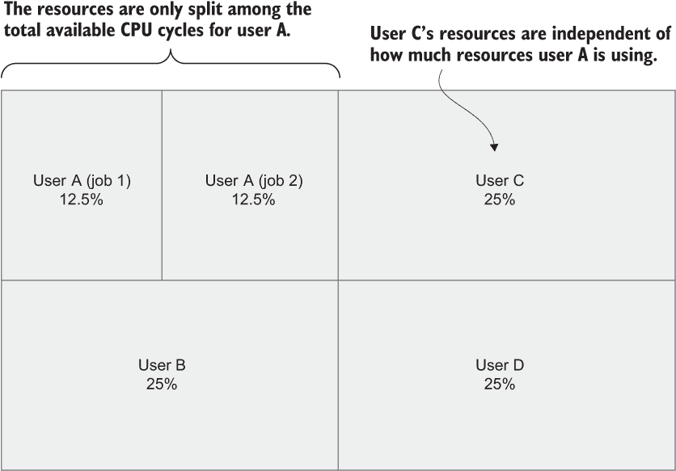

图 6.3 四个用户（A、B、C 和 D）的资源分配

如果新用户 E 在系统上启动一个进程，调度器将重新分配可用的 CPU 周期，以便每个用户获得整个的 20%（100% / 5 = 20%）。我们在图 6.3 中安排工作负载在集群中执行的方式被称为*公平共享调度*。这是一种计算机操作系统的调度算法，其中 CPU 使用量在系统用户或组之间平均分配，而不是在进程之间平均分配。

到目前为止，我们只讨论了在用户之间分配资源。当多个团队使用系统来训练他们的机器学习模型，并且每个团队有多名成员时，我们可以将用户划分为不同的组，然后对用户和组都应用公平共享调度算法。具体来说，我们首先将可用的 CPU 周期分配给组，然后在每个组内进一步分配给用户。例如，如果三个组分别包含三个、两个和四个用户，那么每个组将能够使用 33.3%（100% / 3）的总可用 CPU 周期。然后我们可以按照以下方式计算每个组中每个用户的可用 CPU 周期：

+   *组 1*—33.3% / 3 用户 = 每用户 11.1%

+   *组 2*—33.3% / 2 用户 = 每用户 16.7%

+   *组 3*—33.3% / 4 用户 = 每用户 8.3%

图 6.4 总结了我们对三个组中每个个体用户计算的资源分配。

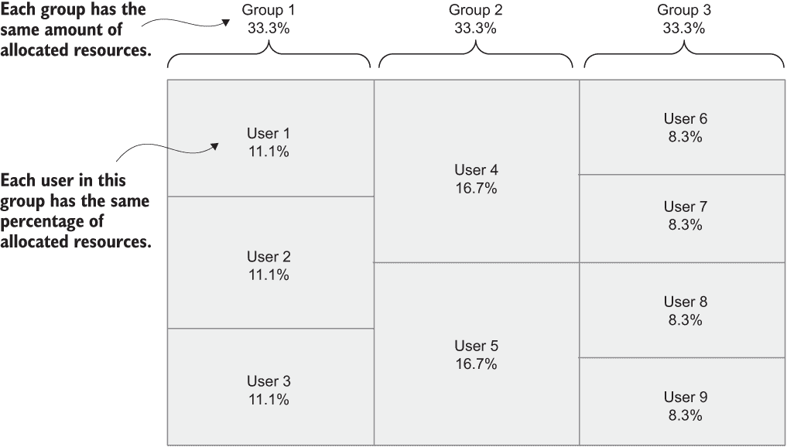

图 6.4 三组中每个用户的资源分配总结

公平共享调度可以帮助我们解决多个用户同时运行分布式训练作业的问题。我们可以在每个抽象级别应用这种调度策略，例如进程、用户、组等。所有用户都有自己的可用资源池，不会相互干扰。

然而，在某些情况下，某些作业应该先执行。例如，集群管理员可能希望提交集群维护作业，如删除长时间占用资源的挂起作业。提前执行这些集群维护作业可以帮助释放更多计算资源，从而让其他人能够提交新的作业。

假设集群管理员是组 1 中的用户 1。另外两个非管理员用户也在组 1 中，就像之前的例子一样。用户 2 正在运行作业 1，该作业正在使用基于公平共享调度算法分配给他们的 11.1%的 CPU 周期。

尽管用户 2 有足够的计算能力来执行作业 1，但该作业依赖于用户 3 的作业 2 的成功。例如，用户 3 的作业 2 在数据库中生成一个表格，作业 1 需要该表格来执行分布式模型训练任务。图 6.5 总结了第一组中每个用户的资源分配和利用率。

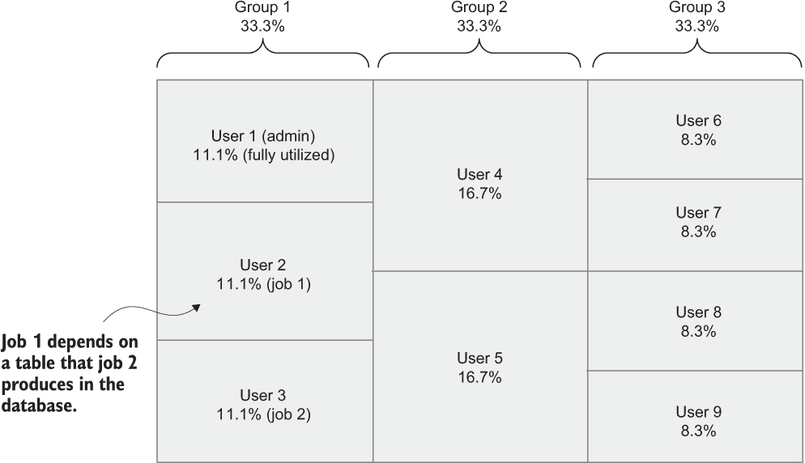

图 6.5 第一组中每个用户的资源分配和利用率总结

不幸的是，由于数据库连接不稳定，作业 2 卡住了，并且一直在尝试重新连接以生成作业 1 所需的数据。为了解决这个问题，管理员需要提交作业 3 来终止并重新启动卡住的作业 2。

现在假设管理员用户 1 已经使用了 11.1%的总 CPU 周期。因此，由于维护作业 3 提交时间晚于所有之前的作业，它被添加到作业队列中，等待资源释放时执行，根据我们公平共享调度算法的先到先得性质。结果，我们遇到了一个*死锁*，没有任何作业可以继续进行，如图 6.6 所示。

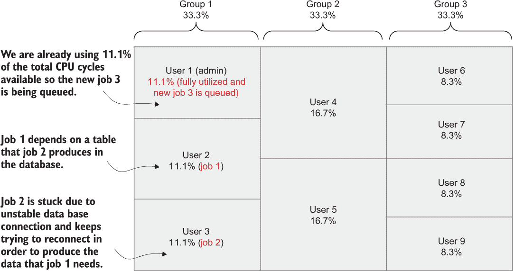

图 6.6 在组 1 中的管理员用户（用户 1）试图调度一个作业来重启挂起的作业（作业 3），但遇到了一个死锁，没有任何作业可以继续进行。

为了解决这个问题，我们可以允许用户为每个作业分配*优先级*，这样具有更高优先级的作业将先执行，这与公平共享调度算法的先到先得性质相反。此外，如果可用计算资源不足，可以*抢占*或*驱逐*正在运行的作业，为具有更高优先级的作业腾出空间。这种基于优先级的作业调度方式称为*优先级调度*。

例如，有四个作业（A、B、C 和 D）同时提交。每个作业都由用户标记了优先级。作业 A 和 C 是高优先级，而作业 B 是低优先级，作业 D 是中等优先级。使用优先级调度，作业 A 和 C 将首先执行，因为它们的优先级最高，然后是具有中等优先级的作业 D，最后是低优先级的作业 B。图 6.7 说明了使用优先级调度时四个作业（A、B、C 和 D）的执行顺序。

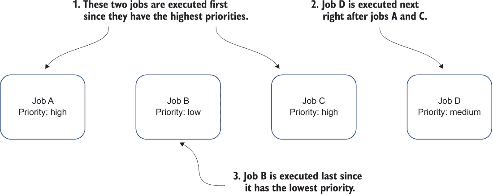

图 6.7 使用优先级调度时，四个同时提交的作业（A、B、C 和 D）的执行顺序

让我们考虑另一个例子。假设有三个具有不同优先级的作业（B、C 和 D）同时提交，并按照它们的优先级执行，类似于前面的例子。如果提交了一个具有高优先级的作业（作业 A），在低优先级的作业 B 已经开始运行之后，作业 B 将被抢占，然后作业 A 开始。之前分配给作业 B 的计算资源将被释放并由作业 A 接管。图 6.8 总结了四个作业（A、B、C 和 D）的执行顺序，其中正在运行的低优先级作业 B 被具有更高优先级的新作业（作业 A）抢占。

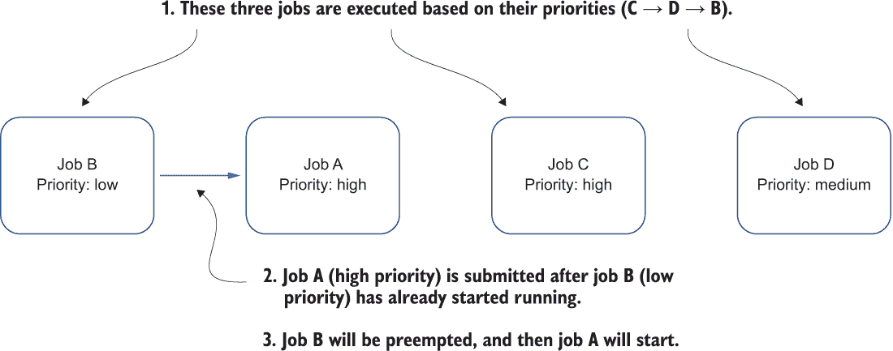

图 6.8 正在运行的低优先级作业被具有更高优先级的新作业抢占的四个作业（A、B、C 和 D）的执行顺序

使用优先级调度，我们可以有效地消除我们之前遇到的问题，即作业只能按先到先得的顺序依次执行。现在可以优先执行具有高优先级的任务。

然而，对于分布式机器学习任务——特别是模型训练任务——我们希望在开始分布式训练之前确保所有工人都已准备好。否则，已经准备好的工人将等待剩余的工人，直到训练可以继续，这会浪费资源。

例如，在图 6.9 中，同一进程组中的三个工作进程正在进行 allreduce 操作。然而，由于底层分布式集群网络不稳定，有两个工人尚未准备好。因此，依赖于这些受影响通信的两个进程（进程 1 和 3）将无法及时接收到一些计算出的梯度值（v0 和 v2）（如图 6.9 中的问号所示），整个 allreduce 操作将一直停滞，直到所有信息都接收完毕。

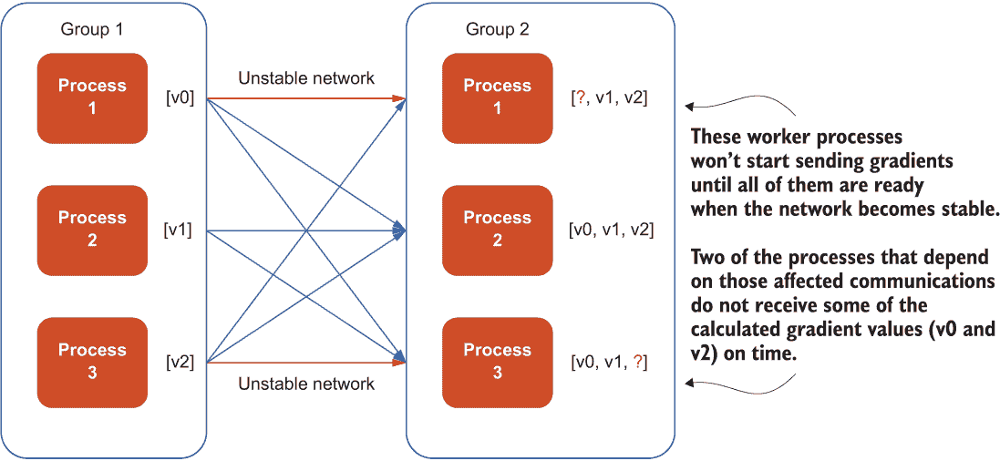

图 6.9 展示了工作进程之间网络不稳定导致整个模型训练过程受阻的 allreduce 过程示例

*成组调度*通常用于运行分布式模型训练任务。它确保如果两个或多个工人相互通信，它们将同时准备好这样做。换句话说，成组调度仅在足够多的工人可用且准备好通信时调度工人。

如果它们没有被成组调度，一个工人可能需要在另一个工人睡眠时等待发送或接收消息，反之亦然。当工人在等待其他工人准备好通信时，我们正在浪费已经分配给准备好的工人的资源，整个分布式模型训练任务也因此停滞不前。

例如，对于基于集体通信的分布式模型训练任务，所有工人必须准备好通信计算出的梯度并更新每个工人上的模型，以完成 allreduce 操作。我假设机器学习框架目前还不支持弹性调度，我们将在下一节讨论。如图 6.10 所示，由于这些梯度尚未到达第二组中的任何工作进程，因此所有梯度都用问号表示。所有工作进程都尚未开始发送梯度，并且它们不会发送，直到网络稳定后所有进程都进入就绪状态。

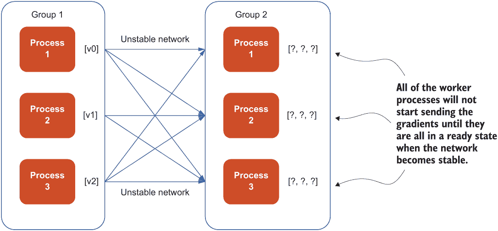

图 6.10 展示了在成组调度下，工作进程将在网络稳定后所有进程都进入就绪状态时才开始发送梯度。

使用成组调度，我们可以确保在所有工人都准备好之前不启动任何工作进程，这样就没有一个进程会等待剩余的工作进程。因此，我们可以避免浪费计算资源。一旦网络变得稳定，所有梯度（v0、v1 和 v2）在成功的 allreduce 操作后都会到达每个工作进程，如图 6.11 所示。

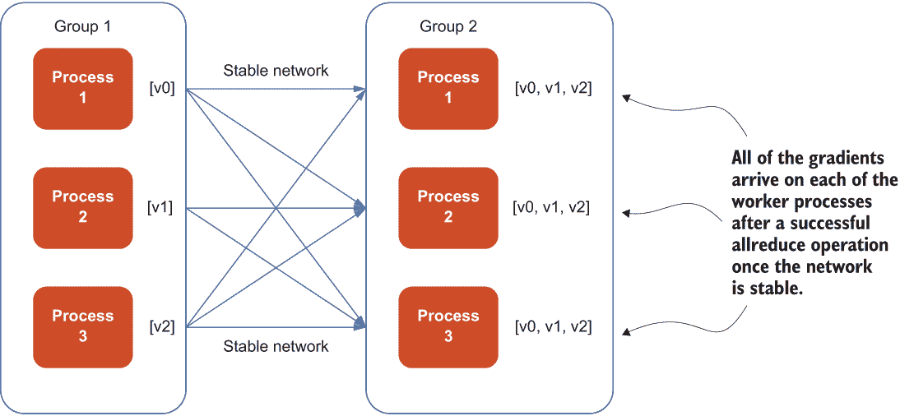

图 6.11 在网络稳定后，所有梯度都会在各个工作者进程上成功完成 allreduce 操作。

注意：不同类型群组调度的细节及其算法超出了本书的范围，这里不会进行讨论。然而，我们将在本书的最后部分使用现有的开源框架将群组调度集成到分布式训练中。

通过结合不同的调度模式，我们能够解决当多个用户使用基础设施调度不同类型的作业时出现的各种问题。尽管我们研究了这些调度模式的一些特定用例，但这些模式可以在许多需要仔细管理计算资源的系统中找到，尤其是在资源稀缺的情况下。许多调度技术甚至应用于更底层的操作系统，以确保应用程序高效运行并合理共享资源。

### 6.2.3 讨论

我们已经看到公平共享调度如何帮助我们解决多个用户同时运行分布式训练作业时的问题。公平共享调度允许我们在每个抽象级别应用调度策略，例如进程、用户、组等。我们还讨论了优先级调度，它可以有效地消除当作业只能按先到先得的原则顺序执行时遇到的问题。优先级调度允许根据作业的优先级级别执行作业，抢占低优先级作业以腾出空间给高优先级作业。

使用优先级调度时，如果集群被大量用户使用，恶意用户可能会创建具有最高可能优先级的作业，导致其他作业被驱逐或根本无法调度。为了处理这种潜在问题，现实世界中的集群管理员通常会强制执行某些规则和限制，以防止用户创建大量高优先级的作业。

我们还讨论了群组调度，它确保如果有两个或更多工作者相互通信，他们都将同时准备好进行通信。群组调度对于基于集体通信的分布式模型训练作业特别有帮助，在这些作业中，所有工作者都需要准备好通信计算梯度，以避免浪费计算资源。

一些机器学习框架支持弹性调度（见第三章），允许分布式模型训练作业在任何数量的工作者可用时启动，而无需等待所有请求的工作者都准备好。在这种情况下，群组调度不适用，因为我们需要等待所有工作者都准备好。相反，我们可以通过弹性调度开始取得模型训练的重大进展。

由于工作进程的数量可能在模型训练期间发生变化，批大小（每个工作进程上迷你批次的尺寸之和）将影响模型训练的准确性。在这种情况下，需要对模型训练策略进行额外的修改。例如，我们可以支持一个定制的学习率调度器，该调度器将考虑纪元或批次，或根据工作进程的数量动态调整批大小。与这些算法改进相结合，我们可以更明智地分配和利用现有的计算资源，并提高用户体验。

在实践中，分布式模型训练作业极大地受益于像群调度这样的调度模式。因此，我们可以避免浪费计算资源。然而，我们可能忽视的一个问题是，任何由群调度安排的这些工作进程都可能失败，导致意外的后果。通常很难调试这类故障。在下一节中，我将介绍一种将使调试和处理故障更容易的模式。

### 6.2.4 练习

1.  我们是否只能在用户级别应用公平共享调度？

1.  群调度是否适合所有分布式模型训练作业？

## 6.3 元数据模式：适当处理故障以最小化对用户的不利影响

当构建最基础的仅包含数据摄入、模型训练和模型服务的机器学习工作流程时，其中每个组件在流程中仅作为单个步骤出现一次，一切似乎都很直接。每个步骤按顺序运行以达到完成。如果这些步骤中的任何一个失败，我们就从它留下的地方继续。例如，想象一下模型训练步骤未能处理摄入的数据（例如，失去了存储摄入数据的数据库的连接）。我们可以重试失败的步骤，并如图 6.12 所示，轻松地继续模型训练而无需重新运行整个数据摄入过程。

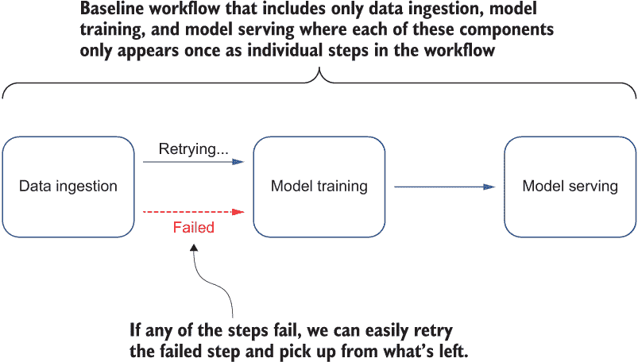

图 6.12 基线工作流程，其中模型训练步骤未能处理摄入的数据。我们重试失败的步骤，并从失败的步骤继续模型训练，而无需重新运行整个数据摄入过程。

然而，当工作流程变得更加复杂时，任何故障的处理都不再是微不足道的。例如，考虑第五章中的工作流程。该工作流程通过三个模型训练步骤来训练模型，这些步骤在标记实体时达到不同的准确性。然后，一个模型选择步骤从前两个模型训练步骤中至少训练出 90%准确性的前两个模型中选择，这些模型将在接下来的两个单独的模型服务步骤中使用。然后，通过结果聚合步骤将这两个模型服务步骤的结果汇总，以呈现给用户。

现在让我们考虑第二种情况，即第二和第三模型训练步骤在执行过程中都失败了（例如，分配给模型训练的一些工作者被抢占）。如果这两个模型训练步骤成功完成，它们将提供最准确和最不准确的模型，如图 6.13 所示。

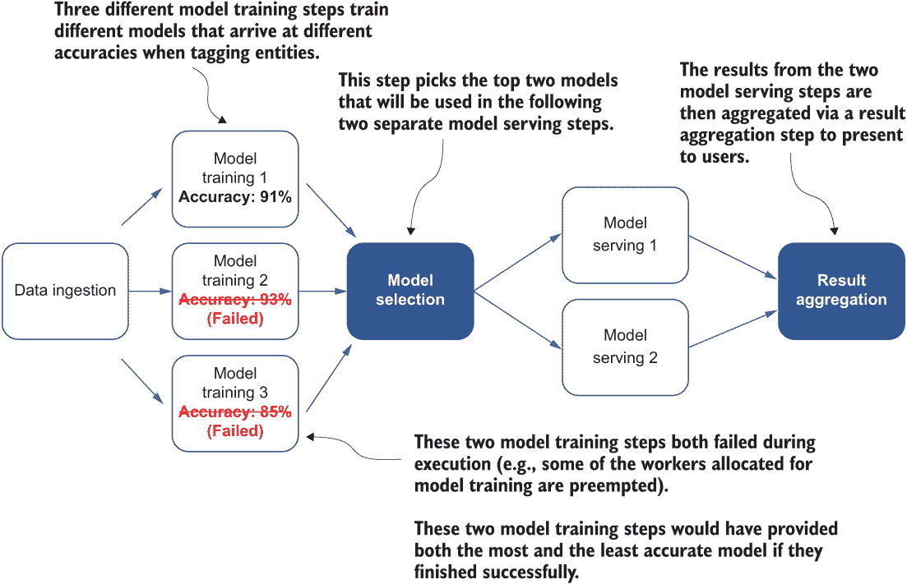

图 6.13 展示了一个机器学习工作流程，在标记实体时训练具有不同准确率的模型。模型选择步骤识别出至少 90%准确率的两个顶级模型用于模型服务。这两个步骤中的准确率已被划掉，因为这些步骤在没有达到预期准确率的情况下失败了。然后，从两个模型服务步骤的结果中汇总以呈现给用户。

在这一点上，有人可能会认为我们应该重新运行这两个步骤以继续进行模型选择和模型服务步骤。然而，在实践中，由于我们已经浪费了一些时间训练部分模型，我们可能不想从头开始。我们的用户需要更长的时间才能看到我们最佳模型的汇总结果。是否有更好的方法来处理这类失败？

### 6.3.1 问题

对于复杂的机器学习工作流程，例如我们在第五章中讨论的，我们想要训练多个模型，然后选择表现最佳的模型进行模型服务，由于现实需求，处理某些步骤失败（例如，由于抢占式工作者）的策略决策并不总是简单的。例如，当三个模型训练步骤中有两个因抢占式工作者而失败时，我们不希望从头开始训练这些模型，这会大大增加完成工作流程所需的时间。我们如何适当地处理这些失败，以将对用户的影响降到最低？

### 6.3.2 解决方案

无论何时我们在机器学习工作流程中遇到失败，我们首先应该了解根本原因（例如，网络连接丢失、计算资源不足等）。了解根本原因很重要，因为我们需要了解失败的性质，以预测重试失败的步骤是否会有帮助。如果失败是由于一些可能非常可能导致重试时重复失败的长期短缺，我们可以更好地利用计算资源来运行其他任务。图 6.14 说明了重试永久性失败和暂时性失败的有效性差异。当我们遇到永久性失败时重试模型训练步骤，重试是无效的，并导致重复失败。

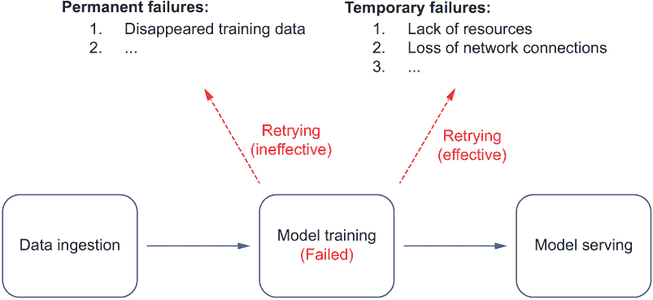

图 6.14 重试永久性失败和暂时性失败的有效性差异

例如，在我们的案例中，我们首先应该检查模型训练步骤的依赖项是否满足，例如，之前步骤中摄入的数据是否仍然可用。如果数据已持久化到本地磁盘或数据库中，我们可以继续进行模型训练。然而，如果数据位于内存中并且在模型训练步骤失败时丢失，我们无法在不重新摄入数据的情况下开始模型训练。图 6.15 显示了在模型训练过程中出现永久性故障时重新启动数据摄入步骤的过程。

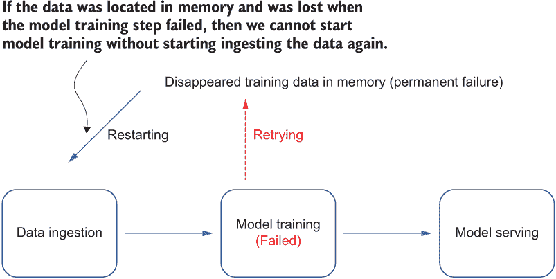

图 6.15 在模型训练过程中发生永久性故障时重新启动数据摄入步骤的过程

类似地，如果模型训练步骤由于预占用的训练工作者或内存不足问题而失败，我们需要确保我们仍然有足够的计算资源分配来重新运行模型训练步骤。

然而，除非我们故意在机器学习工作流程中每个步骤的运行时将其记录为元数据，否则我们不知道要分析哪些信息来确定根本原因。例如，对于每个模型训练步骤，我们可以在步骤失败之前记录有关摄入数据的可用性和不同计算资源（如内存和 CPU 使用）是否超过限制的元数据。

图 6.16 是一个模型训练步骤失败的工作流程。在此步骤的运行时，每 5 分钟收集一次内存使用情况（以兆字节为单位）和训练数据可用性（是/否）的元数据。我们可以注意到，在 30 分钟后，内存使用量从 23 MB 突然增加到 200 MB。在这种情况下，我们可以尝试增加请求的内存来重试此步骤，然后它将成功产生一个用于下一个模型服务步骤的训练模型。

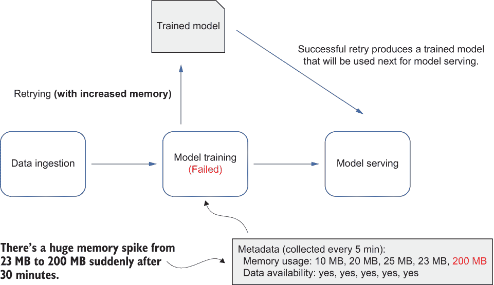

图 6.16 模型训练步骤失败的一个示例工作流程，其中收集的元数据显示了运行时出现的意外内存峰值

在实践中，对于如图 6.13 所示的复杂工作流程，即使我们知道模型训练步骤的所有依赖项都已满足（例如，我们有足够的计算资源和良好的数据库连接来访问数据源），我们也应该考虑我们是否想要处理这些失败以及我们希望如何处理它们。我们已经花费了大量时间在训练步骤上，但现在，步骤突然失败了，我们失去了所有的进度。换句话说，我们不希望从头开始重新训练所有模型，这可能会在我们能够将最佳模型的聚合结果交付给用户之前增加相当多的时间。有没有更好的方法来处理这个问题，而又不会对我们的用户体验产生巨大影响？

除了为每个模型训练步骤记录的元数据外，我们还可以保存更多有用的元数据，这些元数据可以用来判断是否值得重新运行所有模型训练步骤。例如，模型准确率随时间的变化表明模型是否被有效地训练。

模型准确率保持稳定甚至下降（如图 6.17 所示，从 30%下降到 27%）可能表明模型已经收敛，继续训练将不再提高模型准确率。在这个例子中，尽管有两个模型训练步骤失败，但不需要从头开始重试第三个模型训练步骤，因为这会导致一个快速收敛但准确率低的模型。另一个可能有用的元数据示例是模型训练完成的百分比（例如，如果我们已经迭代了所有请求的批次和 epoch，完成度为 100%）。

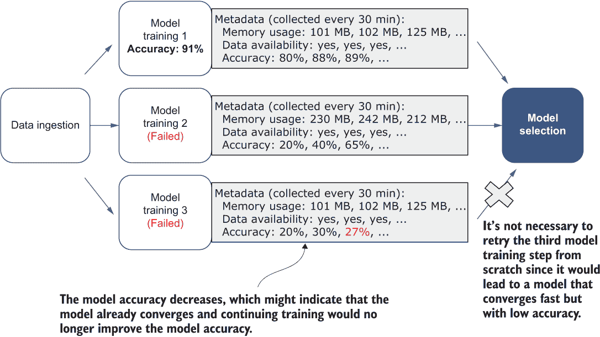

图 6.17 两个模型训练步骤失败且其中一个模型准确率下降的示例工作流程

一旦我们有了关于模型训练步骤的额外元数据，我们就可以了解每个开始模型训练步骤的进展情况。例如，对于图 6.18 中的工作流程，我们可能提前得出结论，第三个模型训练步骤进展非常缓慢（每 30 分钟只完成 1%），这是由于分配的计算资源较少或模型架构更复杂。我们知道，考虑到有限的时间，我们最终可能得到一个准确率很低的模型。因此，我们可以忽略这个模型训练步骤，转而将更多的计算资源分配给其他具有更大潜力的模型训练步骤，这有助于更快地得到更准确的模型。

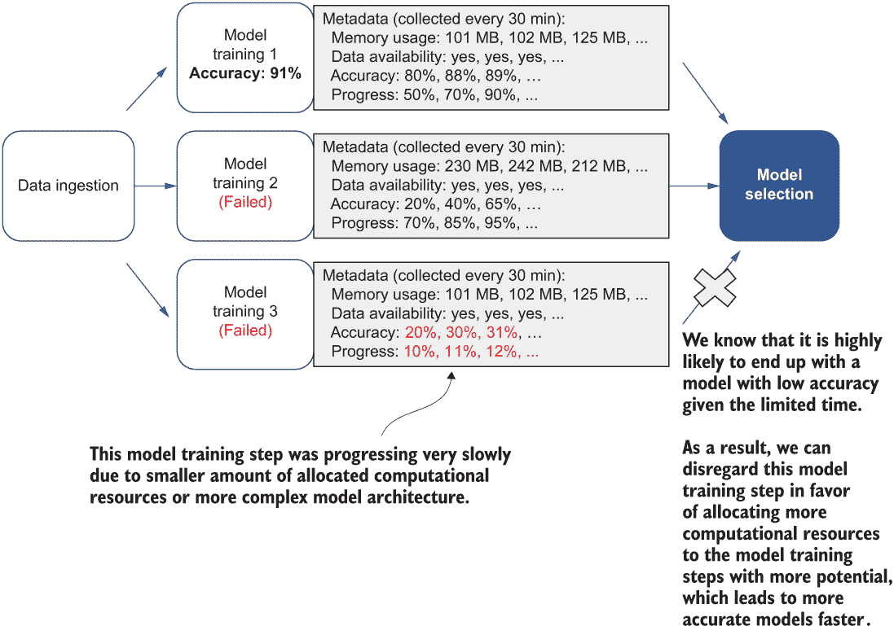

图 6.18 两个模型训练步骤失败的示例工作流程。其中一个被忽略，因为它进展非常缓慢，考虑到有限的时间，模型可能具有很低的准确率。

记录这些元数据可能有助于我们从端到端机器学习工作流程中的每个失败的步骤中得出更多特定的见解。然后我们可以决定采取适当的策略来处理失败的步骤，以避免浪费计算资源并最小化对现有用户的影响。元数据模式为我们提供了对机器学习管道的深入了解。如果我们在定期运行大量管道的情况下，它们还可以用于搜索、过滤和分析未来每个步骤中产生的工件。例如，我们可能想知道哪些模型表现良好，或者哪些数据集对那些模型贡献最大，基于历史训练指标。

### 6.3.3 讨论

在机器学习工作流程的各个步骤中，借助元数据模式，我们可以获得额外的见解。然后，如果任何步骤失败，我们可以根据对用户有益的方式做出响应，从而减少步骤失败带来的任何负面影响。

一种常见的元数据类型是模型训练过程中的各种网络性能([`mng.bz/D4lR`](http://mng.bz/D4lR))指标（例如，带宽、吞吐量、延迟）。这类信息对于检测某些工作者遇到的网络性能不佳，从而阻塞整个训练过程非常有用。我们可以关闭速度较慢的工作者，并启动新的工作者以继续训练，前提是底层机器学习框架支持弹性调度和容错（参见第三章）。例如，在图 6.19 中，根据元数据，右侧的工作者具有极高的延迟（是其他工作者的 10 倍），这减缓了整个模型训练过程。理想情况下，这个工作者应该被关闭并重新启动。

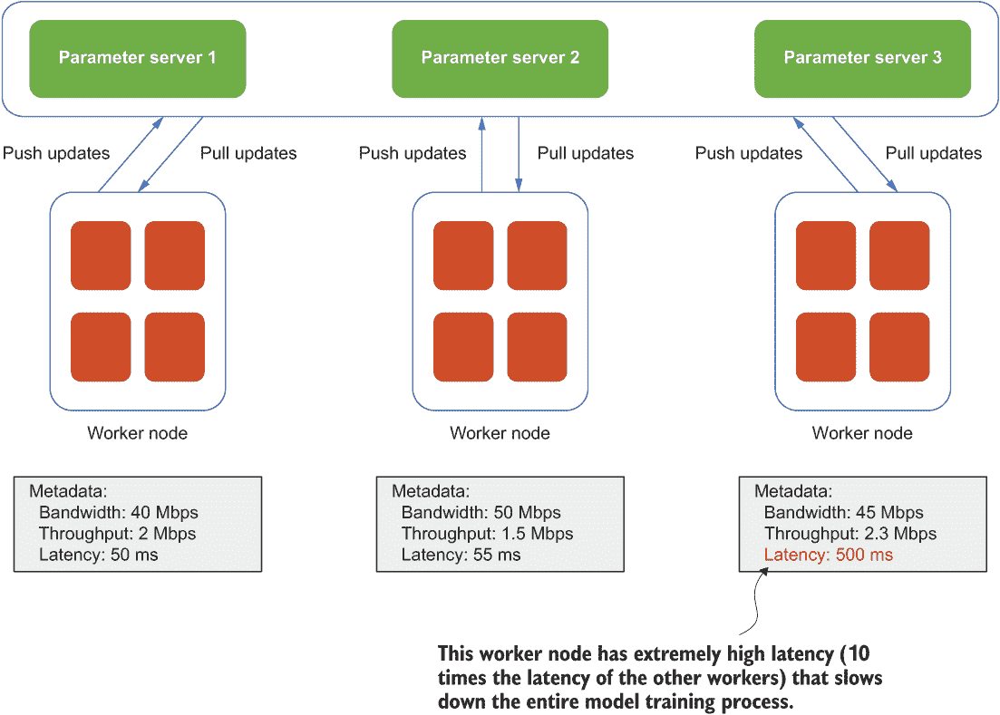

图 6.19 一个基于参数服务器的模型训练示例，其中右侧的工作者具有极高的延迟（是其他工作者的 10 倍），这减缓了整个模型训练过程

将元数据模式引入我们的机器学习工作流程的另一个额外好处是，可以使用记录的元数据在各个步骤之间或不同工作流程之间建立关系。例如，现代模型管理工具可以使用记录的元数据帮助用户构建训练模型的谱系，并可视化哪些步骤/因素对模型工件做出了贡献。

### 6.3.4 练习

1.  如果训练步骤由于训练数据源丢失而失败，我们应该怎么办？

1.  如果我们查看单个工作者或参数服务器，可以收集哪些类型的元数据？

## 6.4 练习答案

### 第 6.2 节

1.  不，我们可以在抽象的每个级别应用这种调度策略，例如进程、用户、组等。

1.  不，一些机器学习框架支持弹性调度，允许分布式模型训练作业在任何数量的工作者可用时启动，无需等待所有请求的工作者都准备好进行通信。在这种情况下，群组调度不适用。

### 第 6.3 节

1.  在重试模型训练步骤之前，我们应该重新运行数据摄取，因为这种失败是永久的，简单地重试会导致重复失败。

1.  模型训练过程中的各种网络性能指标（例如，带宽、吞吐量和延迟）。当我们想要检测工作者遇到的网络性能不佳，从而阻塞整个训练过程时，这类信息非常有用。

## 摘要

+   与机器学习系统中的操作相关，有多个改进领域，例如作业调度和元数据。

+   各种调度模式，如公平共享调度、优先级调度和成组调度，可以用来防止资源饥饿和避免死锁。

+   我们可以收集元数据，从机器学习工作流程中获得洞察力，并更恰当地处理故障，以减少对用户产生的任何负面影响。
