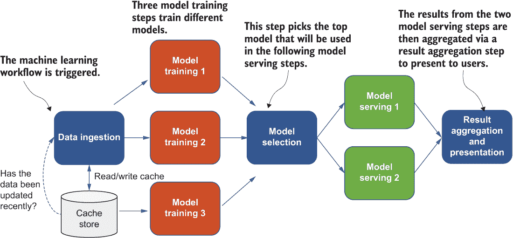
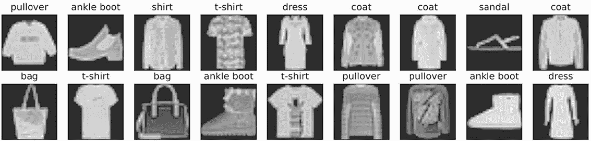
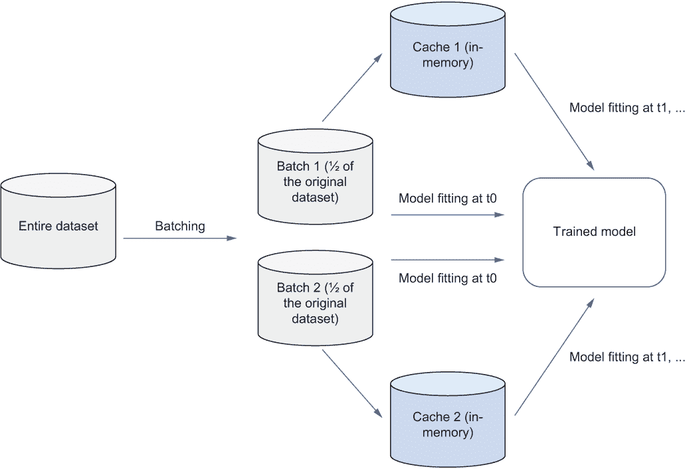
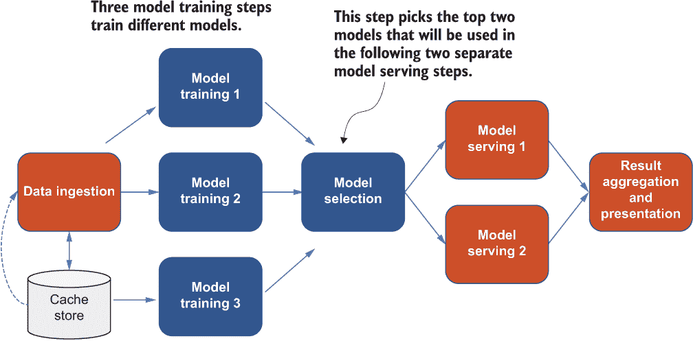
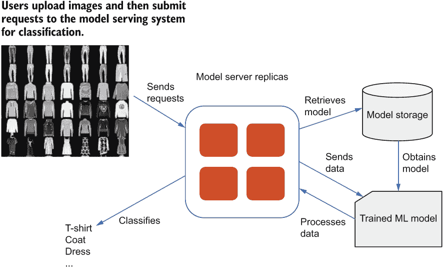
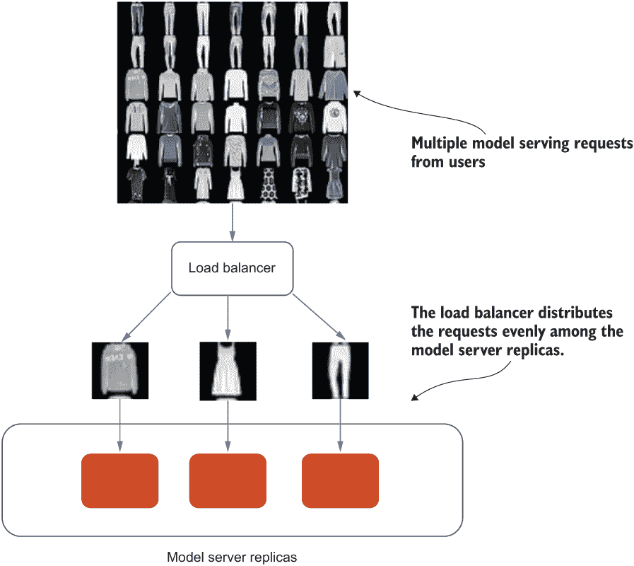
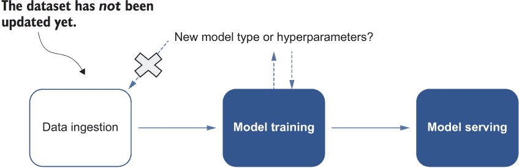

# 7 项目概述和系统架构

本章涵盖

+   提供我们系统的整体高级设计

+   优化数据摄取组件以处理数据集的多个 epoch

+   决定哪种分布式模型训练策略最能最小化开销

+   为高性能模型服务添加模型服务器副本

+   加速我们机器学习系统的端到端工作流程

在前面的章节中，我们学习了如何选择和应用正确的模式来构建和部署分布式机器学习系统，以获得实际经验来管理和自动化机器学习任务。在第二章中，我介绍了一些可以融入数据摄取的实用模式，通常这是分布式机器学习系统的第一个过程，负责监控传入的数据并执行必要的预处理步骤以准备模型训练。

在第三章中，我们探讨了处理分布式训练组件的一些挑战，并介绍了一些可以融入该组件的实用模式。分布式训练组件是分布式机器学习系统中最关键的部分，也是使系统区别于一般分布式系统的原因。在第四章中，我们涵盖了分布式模型服务系统中涉及到的挑战，并介绍了一些常用的模式。你可以使用副本服务来实现水平扩展，使用分片服务模式来处理大量的模型服务请求。你还学习了如何评估模型服务系统，并确定在现实场景中事件驱动设计是否有益。

在第五章中，我们讨论了机器学习工作流，这是机器学习系统中最基本的部分之一，因为它将机器学习系统中的所有其他组件连接起来。最后，在第六章中，我们讨论了一些可以极大地加速端到端工作流程并减少在系统成为生产就绪之前工程团队与数据科学家或机器学习实践者合作时的维护和沟通努力的运营努力和模式。

在本书的剩余章节中，我们将构建一个端到端机器学习系统来应用之前学到的知识。你将获得实际操作经验来实现我们之前讨论的许多模式。你将学习如何在大规模上解决问题，并将你在笔记本电脑上开发的内容扩展到大型分布式集群。在本章中，我们将介绍项目背景和系统组件。然后，我们将讨论与组件相关的挑战，并讨论我们可以应用以解决这些挑战的模式。

注意，尽管我们不会在本章深入探讨实现细节，但在接下来的章节中，我们将使用几个流行的框架和前沿技术——特别是 TensorFlow、Kubernetes、Kubeflow、Docker 和 Argo Workflows——来构建分布式机器学习工作流程的组件。

## 7.1 项目概述

对于这个项目，我们将构建一个图像分类系统，该系统从数据源下载原始图像，执行必要的数据清理步骤，在分布式 Kubernetes 集群中构建机器学习模型，然后将训练好的模型部署到模型服务系统中供用户使用。我们还希望建立一个高效且可重用的端到端工作流程。接下来，我将介绍项目背景、整体系统架构和组件。

### 7.1.1 项目背景

我们将构建一个端到端的机器学习系统来应用我们之前学到的知识。我们将构建一个数据摄取组件，用于下载 Fashion-MNIST 数据集，并构建一个模型训练组件来训练和优化图像分类模型。一旦最终模型训练完成，我们将构建一个高性能的模型服务系统，开始使用训练好的模型进行预测。

如前所述，我们将使用几个框架和技术来构建分布式机器学习工作流程组件。例如，我们将使用 TensorFlow 和 Python 在 Fashion-MNIST 数据集上构建分类模型并进行预测。我们将使用 Kubeflow 在 Kubernetes 集群上运行分布式机器学习模型训练。此外，我们将使用 Argo Workflows 构建一个由分布式机器学习系统的重要组件组成的机器学习管道。这些技术的基础知识将在下一章中介绍，你将在实际项目实现之前通过它们获得实践经验。在下一节中，我们将检查项目的系统组件。

### 7.1.2 系统组件

图 7.1 是我们将要构建的系统架构图。首先，我们将构建一个数据摄取组件，负责摄取数据并将数据集存储在缓存中，使用第二章中讨论的一些模式。接下来，我们将构建三个不同的模型训练步骤，分别训练不同的模型，并纳入第三章中讨论的集体通信模式。完成模型训练步骤后，我们将构建模型选择步骤，选择最佳模型。选定的最优模型将在接下来的两个步骤中用于模型服务。在模型服务步骤结束时，我们将汇总预测结果并向用户展示。最后，我们希望确保所有这些步骤都是可重复的工作流程的一部分，可以在任何时间、任何环境中执行。

我们将根据图 7.1 中的架构图来构建系统，并深入探讨各个组件的细节。我们还将讨论我们可以使用的模式来解决构建这些组件的挑战。

图 7.1 我们将要构建的端到端机器学习系统的架构图

## 7.2 数据摄取

对于这个项目，我们将使用第 2.2 节中介绍的 Fashion-MNIST 数据集来构建数据摄取组件，如图 7.2 所示。此数据集包含一个包含 60,000 个示例的训练集和一个包含 10,000 个示例的测试集。每个示例是一个 28 × 28 的灰度图像，代表与 10 个类别标签之一相关的 Zalando 文章图像。回想一下，Fashion-MNIST 数据集是为了作为原始 MNIST 数据集的直接替换而设计的，用于基准测试机器学习算法。它共享相同的图像大小和训练/测试分割的结构。

图 7.2 端到端机器学习系统中的数据摄取组件（深色框）

作为回顾，图 7.3 是 Fashion-MNIST 中所有 10 个类别（T 恤/上衣、裤子、开衫、连衣裙、外套、凉鞋、衬衫、运动鞋、包和踝靴）的图像集合的截图，其中每个类别在截图中占三行。

图 7.3 Fashion-MNIST 数据集中所有 10 个类别（T 恤/上衣、裤子、开衫、连衣裙、外套、凉鞋、衬衫、运动鞋、包和踝靴）的图像集合的截图

图 7.4 是训练集中前几个示例图像的近距离观察，以及它们对应的文本标签。

图 7.4 训练集中前几个示例图像的近距离观察，以及它们对应的文本标签

如果压缩，下载的 Fashion-MNIST 数据集在磁盘上应该只占用 30 MB。一次性将整个下载的数据集加载到内存中很容易。

### 7.2.1 问题

尽管 Fashion-MNIST 数据集不大，但在将数据集输入模型之前，我们可能需要进行额外的计算，这对于需要额外转换和清理的任务来说是常见的。我们可能想要调整大小、归一化，或将图像转换为灰度。我们还可能想要执行复杂的数学运算，如卷积运算，这可能需要分配大量的额外内存空间。在将整个数据集加载到内存后，我们的可用计算资源可能足够，也可能不足，这取决于分布式集群的大小。

此外，我们从该数据集训练的机器学习模型需要在训练数据集上运行多个 epoch。假设在整个训练数据集上训练一个 epoch 需要 3 小时。如果我们想训练两个 epoch，模型训练所需的时间将翻倍，如图 7.5 所示。

图 7.5 在时间 t0、t1 等处进行多个 epoch 的模型训练的示意图，我们每个 epoch 花费了 3 小时

在现实世界的机器学习系统中，通常需要更多的 epoch，并且依次训练每个 epoch 效率低下。在下一节中，我们将讨论如何解决这种低效问题。

### 7.2.2 解决方案

让我们看看我们面临的第一大挑战：在机器学习算法中的数学运算可能需要大量的额外内存空间分配，而计算资源可能或可能不足。鉴于我们没有太多的空闲内存，我们不应该直接将整个 Fashion-MNIST 数据集加载到内存中。假设我们想要在数据集上执行的数学运算可以在整个数据集的子集上执行。那么，我们可以使用第二章中引入的批处理模式，该模式将整个数据集的一定数量的数据记录分组到批次中，这些批次将被用来依次在每个批次上训练机器学习模型。

要应用批处理模式，我们首先将数据集分成更小的子集或小批量，加载每个单独的小批量示例图像，对每个批次执行昂贵的数学运算，然后在每个模型训练迭代中只使用一个小批量图像。例如，我们可以对只包含 20 个图像的第一个小批量执行卷积或其他复杂的数学运算，然后将转换后的图像发送到机器学习模型进行模型训练。然后，我们重复相同的流程对剩余的小批量进行操作，同时继续进行模型训练。

由于我们已经将数据集分成许多小子集（小批量），我们可以在对整个数据集执行必要的各种复杂数学运算以实现 Fashion-MNIST 数据集上的准确分类模型时避免任何潜在的内存不足问题。然后，我们可以通过减小小批量的大小来使用这种方法处理更大的数据集。

在批处理模式的帮助下，我们不再担心在数据集导入模型训练时可能出现的内存不足问题。我们不必一次性将整个数据集加载到内存中，而是按批次顺序消耗数据集。例如，如果我们有一个包含 1,000 条记录的数据集，我们可以首先取 500 条记录形成一个批次，然后使用这个批次记录来训练模型。随后，我们可以对剩余的记录重复此批处理和模型训练过程。图 7.6 说明了这个过程，其中原始数据集被分成两个批次并依次处理。第一个批次在时间 t0 被消耗以训练模型，第二个批次在时间 t1 被消耗。

图 7.6 数据集被分为两个批次并依次处理。第一个批次在时间 t0 被消耗以训练模型，第二个批次在时间 t1 被消耗。

现在，让我们解决 7.2.1 节中提到的第二个挑战：如果我们需要训练一个涉及迭代原始数据集多个迭代的机器学习模型，我们希望避免浪费时间。回想一下，在第二章中，我们讨论了缓存模式，这将解决这类问题。借助缓存模式，我们可以极大地加快涉及在相同数据集上多次训练的模型训练过程的重新访问数据集的速度。

对于第一次迭代，我们无法做任何特殊的事情，因为这是机器学习模型第一次看到整个训练数据集。我们可以将训练示例的缓存存储在内存中，使其在需要时重新访问时更快。

假设我们用来训练模型的单个笔记本电脑具有足够的计算资源，例如内存和磁盘空间。一旦机器学习模型消耗了整个数据集的每个训练示例，我们就可以推迟回收，而是将消耗的训练示例保留在内存中。例如，在图 7.7 中，在我们完成第一次迭代的模型拟合后，我们可以为第一次模型训练使用的两个批次存储缓存。

图 7.7 使用缓存在时间 t0、t1 等多次迭代中训练模型的示意图，使得从数据源反复读取变得不必要

然后，我们可以通过直接向模型提供存储在内存中的缓存来开始第二次迭代的模型训练，而不需要为未来的迭代从数据源反复读取。接下来，我们将讨论我们将在项目中构建的模型训练组件。

### 7.2.3 练习

1.  我们在哪里存储缓存？

1.  当 Fashion-MNIST 数据集变得很大时，我们能否使用批处理模式？

## 7.3 模型训练

在上一节中，我们讨论了我们正在构建的系统中的数据摄取组件，以及我们如何使用缓存和批处理模式来处理大型数据集并使系统更高效。接下来，让我们讨论我们正在构建的模型训练组件。图 7.8 是整体架构中模型训练组件的示意图。

图 7.8 端到端机器学习系统中的模型训练组件（深色框）

在图中，三个不同的模型训练步骤之后跟着一个模型选择步骤。这些模型训练步骤可以训练三个不同的模型，它们相互竞争以获得更好的统计性能。专门的模型选择步骤随后选择最佳模型，该模型最终将在端到端机器学习工作流程的后续组件中使用。

在下一节中，我们将更仔细地查看图 7.8 中的模型训练组件，并讨论实现此组件时可能遇到的问题。

### 7.3.1 问题

在第三章中，我介绍了参数服务器和集体通信模式。当模型太大而无法适应单台机器时，参数服务器模式很有用，例如用于标记 800 万 YouTube 视频中的实体（第 3.2 节）。集体通信模式在通信开销显著时，有助于加速中等规模模型的训练过程。我们应该为我们的模型训练组件选择哪种模式？

### 7.3.2 解决方案

通过参数服务器的帮助，我们可以有效地解决构建可能不适合单台机器的极大型机器学习模型的挑战。即使模型太大而无法适应单台机器，我们仍然可以使用参数服务器高效地成功训练模型。例如，图 7.9 是使用多个参数服务器的参数服务器模式架构图。每个工作者节点处理数据集的一个子集，执行每个神经网络层所需的计算，并将计算出的梯度发送到更新存储在参数服务器中的一个模型分区。

图 7.9 多参数服务器机器学习训练组件

由于所有工作者都以异步方式执行计算，模型分区的每个工作者节点用于计算梯度的分区可能不是最新的。例如，两个工作者在向同一个参数服务器发送梯度时可能会互相阻塞，这使得及时收集计算出的梯度变得困难，并需要一种策略来解决阻塞问题。不幸的是，在包含参数服务器的现实世界分布式训练系统中，多个工作者可能同时发送梯度，因此必须解决许多阻塞通信。

当决定工作者数量与参数服务器数量之间的最佳比例时，又出现了一个挑战。例如，许多工作者同时向同一个参数服务器发送梯度；问题变得更加严重，最终，不同工作者或参数服务器之间的阻塞通信成为瓶颈。

现在，让我们回到我们的原始应用，即 Fashion-MNIST 分类模型。我们正在构建的模型并不像大型推荐系统模型那样大；如果我们给机器足够的计算资源，它就可以轻松地适应单台机器。它以压缩形式只有 30 MB。因此，集体通信模型非常适合我们正在构建的系统。

现在，没有参数服务器的情况下，每个工作者节点存储整个模型参数集的副本，如图 7.10 所示。我之前提到，每个工作者消费部分数据并计算更新存储在本工作者节点上的模型参数所需的梯度（见第三章）。我们希望在所有工作者节点成功完成梯度计算后立即聚合所有梯度。我们还想确保每个工作者的整个模型参数集基于聚合的梯度进行更新。换句话说，每个工作者应该存储一个与更新后的模型完全相同的副本。

图 7.10 展示了仅包含工作者节点的分布式模型训练组件，其中每个工作者存储整个模型参数集的副本，并消费数据分区来计算梯度

回到图 7.8 中的架构图，每个模型训练步骤都使用集体通信模式，利用底层网络基础设施执行 allreduce 操作，在多个工作者之间通信梯度。集体通信模式还允许我们在分布式环境中训练多个中等规模的机器学习模型。一旦模型训练完成，我们可以启动一个单独的过程来挑选出将被用于模型服务的最佳模型。这一步骤相当直观，我将把实现细节推迟到第九章。在下一节中，我们将讨论系统中的模型服务组件。

### 7.3.3 练习

1.  为什么参数服务器模式不适合我们的模型？

1.  使用集体通信模式时，每个工作者是否存储模型的不同部分？

## 7.4 模型服务

我们已经讨论了我们正在构建的系统中的数据摄取和模型训练组件。接下来，让我们讨论模型服务器组件，这对于最终用户体验至关重要。图 7.11 显示了整体架构中的模型服务训练组件。

图 7.11 展示了端到端机器学习系统中的模型服务组件（深色框）

接下来，让我们看看在开始构建此组件时可能会遇到的一个潜在问题和其解决方案。

### 7.4.1 问题

模型服务系统需要接收用户上传的原始图像，并将请求发送到模型服务器，使用训练好的模型进行推理。这些模型服务请求正在排队等待模型服务器处理。

如果模型服务系统是一个单节点服务器，它只能基于先到先得的原则服务有限数量的模型服务请求。随着实际应用中请求数量的增长，当用户必须等待很长时间才能收到模型服务结果时，用户体验会受到影响。换句话说，所有请求都在等待被模型服务系统处理，但计算资源仅限于这个单节点。我们如何构建一个更高效的模型服务系统？

### 7.4.2 解决方案

上一节为第四章中讨论的复制服务模式提供了一个完美的用例。我们的模型服务系统接收用户上传的图像并发送请求到模型服务器。此外，与简单的单服务器设计不同，系统具有多个模型服务器副本以异步处理模型服务请求。每个模型服务器副本处理单个请求，从模型训练组件检索先前训练的分类模型，并对请求中不存在于 Fashion-MNIST 数据集中的图像进行分类。

通过使用复制服务模式，我们可以轻松地将模型服务器通过添加模型服务器副本到单服务器模型服务系统中进行扩展。新的架构如图 7.12 所示。模型服务器副本可以同时处理多个请求，因为每个副本可以独立处理单个模型服务请求。

图 7.12 复制模型服务服务的系统架构

在引入它们之后，来自用户的多个模型服务请求同时发送到模型服务器副本。我们还需要定义请求和模型服务器副本之间的明确映射关系，这决定了哪些请求由哪个模型服务器副本处理。

为了在副本之间分配模型服务器请求，我们需要添加一个额外的负载均衡器层。例如，负载均衡器从我们的用户那里接收多个模型服务请求。然后，它将请求均匀地分配给模型服务器副本，这些副本负责处理单个请求，包括模型检索和请求中的新数据的推理。图 7.13 说明了这个过程。

图 7.13 展示了负载均衡器如何将请求均匀地分配到模型服务器副本的图表

负载均衡器使用不同的算法来确定哪个请求发送到哪个特定的模型服务器副本。负载均衡的示例算法包括轮询、最少连接方法和哈希。

注意，从我们原始的架构图 7.11 中，模型服务有两个独立的步骤，每个步骤使用不同的模型。每个模型服务步骤由一个模型服务服务及其多个副本组成，以处理不同模型的模型服务流量。

### 7.4.3 练习

1.  当我们没有在模型服务系统中包含负载均衡器时会发生什么？

## 7.5 端到端工作流

现在我们已经研究了单个组件，让我们看看如何以可扩展和高效的方式组合所有这些组件的端到端工作流。我们还将把第五章中的一些模式融入到工作流中。图 7.14 是我们正在构建的端到端工作流的示意图。

图 7.14 我们将构建的端到端机器学习系统的架构图

我们将不再关注单个组件，而是将查看整个机器学习系统，该系统将所有组件以端到端工作流的形式连接在一起。

### 7.5.1 问题

首先，Fashion-MNIST 数据集是静态的，不会随时间变化。然而，为了设计一个更现实化的系统，让我们假设我们将定期手动更新 Fashion-MNIST 数据集。每当更新发生时，我们可能希望重新运行整个机器学习工作流，以训练包含新数据的全新机器学习模型。换句话说，每次发生变化时，我们都需要执行数据摄取步骤。与此同时，当数据集未更新时，我们想要尝试新的机器学习模型。因此，我们仍然需要执行整个工作流，包括数据摄取步骤。数据摄取步骤通常非常耗时，尤其是对于大型数据集。有没有一种方法可以使这个工作流更高效？

第二，我们希望构建一个机器学习工作流，该工作流能够训练不同的模型，然后选择最佳模型，该模型将在模型服务中使用来自两个模型的知识来生成预测。由于现有机器学习工作流中每个模型训练步骤完成时间的差异，每个后续步骤（如模型选择和模型服务）的开始都依赖于前一步的完成。然而，工作流中步骤的这种顺序执行非常耗时，并阻塞了其他步骤。例如，假设某个模型训练步骤的完成时间比其他步骤长得多。接下来的模型选择步骤只能在长时间运行的模型训练步骤完成后才能开始执行。因此，整个工作流因这一特定步骤而延迟。有没有一种方法可以加速这个工作流，使其不会受到单个步骤持续时间的影响？

### 7.5.2 解决方案

对于第一个问题，我们可以使用第五章中提到的步骤记忆化模式。回想一下，步骤记忆化可以帮助系统决定是否执行或跳过某个步骤。借助步骤记忆化，工作流可以识别出那些可以跳过而不需要重新执行的重载步骤，从而大大加速端到端工作流的执行。

例如，图 7.15 包含一个简单的流程，只有在我们知道数据集已更新时才会执行数据摄取步骤。换句话说，如果新数据没有更新，我们不想重新摄取已经收集的数据。

图 7.15 当数据集未更新时跳过数据摄取步骤的示意图

可以使用许多策略来确定数据集是否已更新。使用预定义的策略，我们可以有条件地重建机器学习工作流程，并控制是否希望重新执行数据摄取步骤，如图 7.16 所示。

缓存是识别数据集是否已更新的方法之一。由于我们假设我们的 Fashion-MNIST 数据集正在按照固定的时间表（例如，每月一次）定期更新，我们可以创建一个基于时间的*缓存*，该缓存存储了已摄取和清理的数据集的位置（假设数据集位于远程数据库中）以及其最后更新时间戳。

正如图 7.16 所示，工作流程中的数据摄取步骤将根据最后更新时间戳是否在特定窗口内动态构建和执行。例如，如果时间窗口设置为两周，那么如果数据在过去两周内更新过，我们就认为摄取的数据是新鲜的。数据摄取步骤将被跳过，接下来的模型训练步骤将使用缓存中的位置处已经摄取的数据集。时间窗口可以用来控制缓存可以有多旧，在我们认为数据集足够新鲜可以直接用于模型训练而不是从头开始重新摄取数据之前。 

图 7.16 工作流程已被触发。我们通过访问缓存来检查数据是否在过去两周内更新过。如果数据是新鲜的，我们可以跳过不必要的数据摄取步骤，并直接执行模型训练步骤。

现在，让我们看看第二个问题：步骤的顺序执行会阻塞工作流程中的后续步骤，这是低效的。第五章中介绍的同步和异步模式可以有所帮助。

当一个短运行模型训练步骤完成时——例如，图 7.17 中的模型训练步骤 2——我们就成功获得了一个训练好的机器学习模型。实际上，我们可以在模型服务系统中直接使用这个已经训练好的模型，而无需等待模型训练的其他步骤完成。因此，当我们在工作流程中的某个步骤训练了一个模型后，用户就能立即从包含视频的模型服务请求中看到图像分类的结果。当第二个模型训练步骤（图 7.17，模型训练步骤 3）完成后，两个训练好的模型被发送到模型服务。现在，用户能够从两个模型聚合的结果中受益。

图 7.17 在第二个模型训练步骤完成后，我们可以直接将两个训练好的模型传递给模型服务。将展示给用户的将是聚合的推理结果，而不仅仅是第一个模型的输出。

因此，我们可以继续使用训练好的模型进行模型选择和模型服务；同时，长时间运行的模型训练步骤仍在进行。换句话说，它们在不依赖于彼此完成的情况下异步执行。工作流程可以继续进行并执行下一个步骤，在之前的步骤完成之前。长时间运行的模型训练步骤将不再阻塞整个工作流程。相反，它可以使用来自短时间运行的模型训练步骤的已训练模型继续在模型服务系统中使用。因此，它可以开始处理用户的模型服务请求。

### 7.5.3 练习

1.  哪个组件最能从步骤记忆化中受益？

1.  如果一个步骤的工作流程已被触发再次运行，我们如何判断该步骤的执行是否可以跳过？

## 7.6 练习答案

### 第 7.2 节

1.  在内存中

1.  是

### 第 7.3 节

1.  工作器和参数服务器之间存在阻塞通信。

1.  不，每个工作器存储的是模型的确切相同副本。

### 第 7.4 节

1.  我们无法在副本之间平衡或分配模型服务请求。

### 第 7.5 节

1.  数据摄入组件

1.  使用步骤缓存中的元数据

## 摘要

+   数据摄入组件使用缓存模式来加速处理数据集多个 epoch 的处理。

+   模型训练组件使用集体通信模式来避免工作器和参数服务器之间潜在的通信开销。

+   我们可以使用模型服务器副本，因为每个副本可以独立处理模型服务请求，所以它们能够同时处理许多请求。

+   我们可以将所有组件链接成一个工作流程，并使用缓存来有效地跳过耗时组件，如数据摄入。
