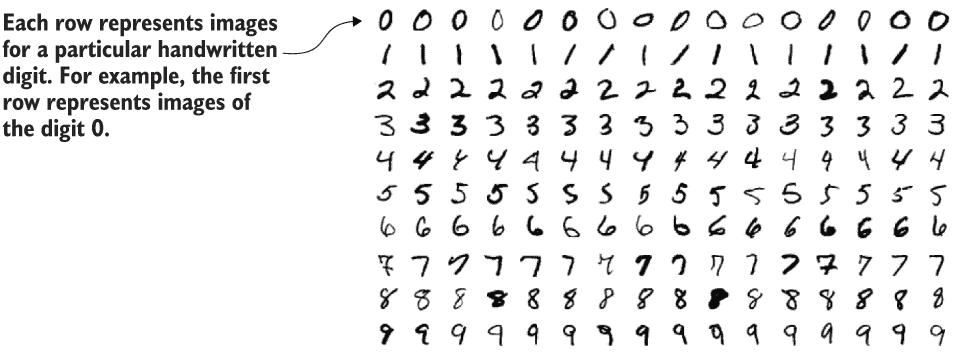
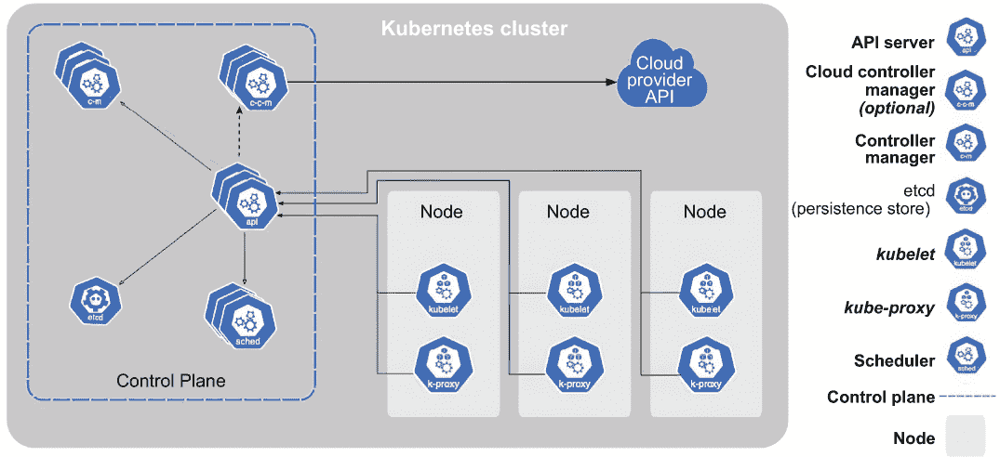
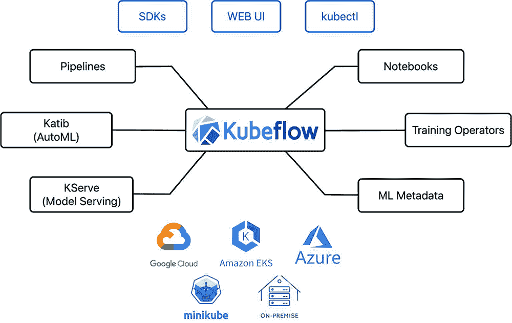
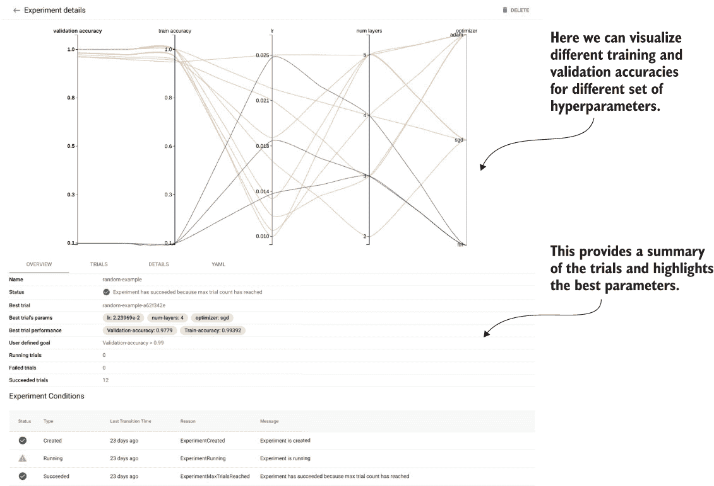
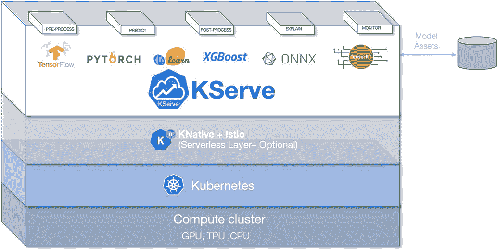
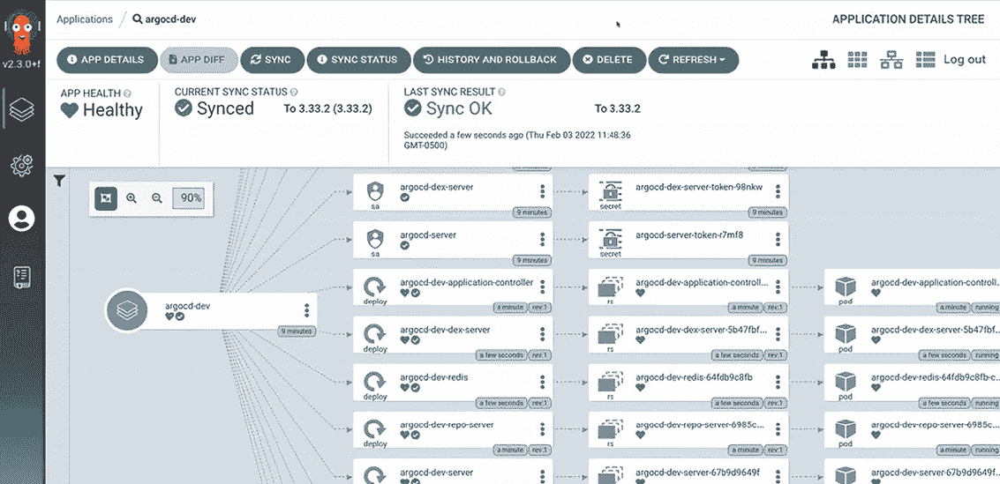
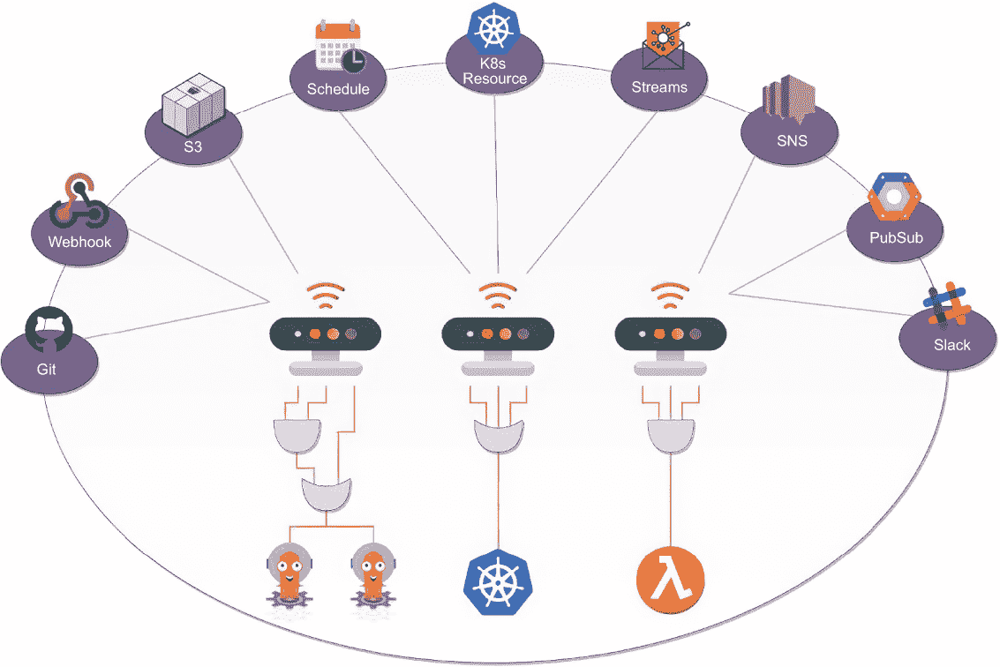
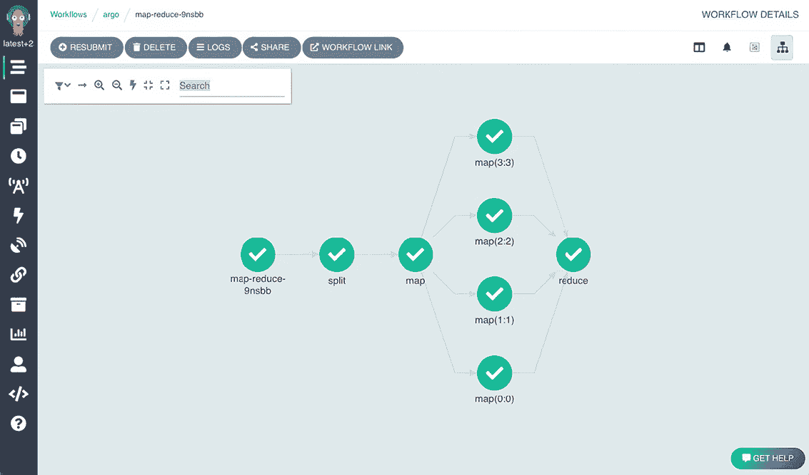
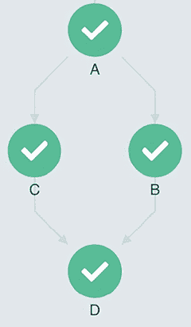
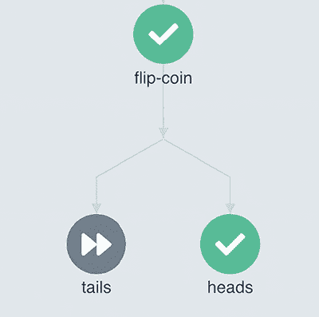

# 8 相关技术的概述

本章涵盖

+   熟悉使用 TensorFlow 进行模型构建

+   理解 Kubernetes 上的关键术语

+   使用 Kubeflow 运行分布式机器学习工作负载

+   使用 Argo Workflows 部署容器原生工作流程

在上一章中，我们了解了项目背景和系统组件，以理解我们实现每个组件的策略。我们还讨论了与每个组件相关的挑战，并讨论了我们将应用的解决模式。如前所述，我们将在第九章，即本书的最后一章中深入探讨项目的实现细节。然而，由于项目将使用不同的技术，且难以即时涵盖所有基础知识，因此在本章中，你将学习四种技术（TensorFlow、Kubernetes、Kubeflow 和 Argo Workflows）的基本概念，并获得实践经验。

这四种技术各有不同的用途，但都将用于在第九章中实现最终项目。TensorFlow 将用于数据处理、模型构建和评估。我们将使用 Kubernetes 作为我们的核心分布式基础设施。在此基础上，我们将使用 Kubeflow 将分布式模型训练作业提交到 Kubernetes 集群，并使用 Argo Workflows 构建和提交端到端的机器学习工作流程。

## 8.1 TensorFlow：机器学习框架

TensorFlow 是一个端到端的机器学习平台。它已被广泛采用于学术界和工业界，用于各种应用和用例，例如图像分类、推荐系统、自然语言处理等。TensorFlow 具有高度的便携性和可部署性，可以在不同的硬件上运行，并支持多种语言。

TensorFlow 拥有庞大的生态系统。以下是一些该生态系统中的重点项目：

+   TensorFlow.js 是一个用于 JavaScript 的机器学习库。用户可以直接在浏览器或 Node.js 中使用机器学习。

+   TensorFlow Lite 是一个移动库，用于在移动设备、微控制器和其他边缘设备上部署模型。

+   TFX 是一个端到端平台，用于部署生产机器学习管道。

+   TensorFlow Serving 是一个灵活、高性能的机器学习模型服务系统，专为生产环境设计。

+   TensorFlow Hub 是一个存储库，包含经过训练的机器学习模型，可用于微调和部署到任何地方。只需几行代码即可重用 BERT 和 Faster R-CNN 等训练模型。

更多信息可以在 TensorFlow GitHub 组织（[`github.com/tensorflow`](https://github.com/tensorflow)）中找到。我们将在模型服务组件中使用 TensorFlow Serving。在下一节中，我们将通过一些 TensorFlow 的基本示例来训练机器学习模型，使用 MNIST 数据集进行本地训练。

### 8.1.1 基础知识

让我们先为我们将要使用的示例安装 Python 3 的 Anaconda。Anaconda（[`www.anaconda.com`](https://www.anaconda.com)）是 Python 和 R 编程语言的科学计算发行版，旨在简化包管理和部署。该发行版包括适用于 Windows、Linux 和 macOS 的数据科学包。一旦安装了 Anaconda，请在您的控制台中使用以下命令安装 Python 3.9 的 Conda 环境。

列表 8.1 创建 Conda 环境

```
> conda create --name dist-ml python=3.9 -y
```

接下来，我们可以使用以下代码激活此环境。

列表 8.2 激活 Conda 环境

```
> conda activate dist-ml
```

然后，我们可以在这个 Python 环境中安装 TensorFlow。

列表 8.3 安装 TensorFlow

```
> pip install --upgrade pip
> pip install tensorflow==2.10.0
```

如果您遇到任何问题，请参阅安装指南（[`www.tensorflow.org/install`](https://www.tensorflow.org/install)）。

在某些情况下，您可能需要卸载现有的 NumPy 并重新安装它。

列表 8.4 安装 NumPy

```
> pip install numpy --ignore-installed
```

如果您使用的是 Mac，请查看 Metal 插件以实现加速（[`developer.apple.com/metal/tensorflow-plugin/`](https://developer.apple.com/metal/tensorflow-plugin/)）。

一旦我们成功安装了 TensorFlow，我们就可以从一个基本的图像分类示例开始！让我们首先加载并预处理我们的简单 MNIST 数据集。回想一下，MNIST 数据集包含从 0 到 9 的手写数字图像。每一行代表特定手写数字的图像，如图 8.1 所示。



图 8.1 从 0 到 9 的手写数字示例图像，其中每一行代表特定手写数字的图像

Keras API（tf.keras）是 TensorFlow 中模型训练的高级 API，我们将用它来加载内置数据集以及模型训练和评估。

列表 8.5 加载 MNIST 数据集

```
> import tensorflow as tf
> (x_train, y_train), (x_test, y_test) = tf.keras.datasets.mnist.load_data()
```

如果我们没有指定路径，函数 load_data()将使用默认路径保存 MNIST 数据集。此函数将返回训练和测试图像及标签的 NumPy 数组。我们将数据集分为训练和测试，以便我们可以在示例中运行模型训练和评估。

NumPy 数组是 Python 科学计算生态系统中常见的数据类型。它描述多维数组，并具有三个属性：数据、形状和数据类型。让我们以我们的训练图像为例。

列表 8.6 检查数据集

```
> x_train.data
<memory at 0x16a392310>
> x_train.shape
(60000, 28, 28)
> x_train.dtype
dtype('uint8')
> x_train.min()
0
> x_train.max()
255
```

x_train 是一个 60,000 × 28 × 28 的三维数组。数据类型是 uint8，范围从 0 到 255。换句话说，这个对象包含 60,000 个 28 × 28 分辨率的灰度图像。

接下来，我们可以在原始图像上执行一些特征预处理。由于许多算法和模型对特征的规模很敏感，我们通常将特征中心化和缩放到[0, 1]或[-1, 1]的范围。在我们的例子中，我们可以通过将图像除以 255 来实现这一点。

列表 8.7 预处理函数

```
def preprocess(ds):
    return ds / 255.0

x_train = preprocess(x_train)
x_test = preprocess(x_test)

> x_train.dtype
dtype('float64')

> x_train.min()
0.0

> x_train.max()
1.0
```

在对训练集和测试集中的图像进行预处理后，我们可以实例化一个简单的多层神经网络模型。我们使用 tf.keras 定义模型架构。首先，我们使用 Flatten 将二维图像扩展成一维数组，指定输入形状为 28 × 28。第二层是密集连接层，并使用 'relu' 激活函数引入一些非线性。第三层是一个 dropout 层，用于减少过拟合并使模型更具泛化能力。由于手写数字由 0 到 9 的 10 个不同数字组成，我们的最后一层是密集连接层，用于 10 类分类，并使用 softmax 激活。

列表 8.8 顺序模型定义

```
model = tf.keras.models.Sequential([
  tf.keras.layers.Flatten(input_shape=(28, 28)),
  tf.keras.layers.Dense(128, activation='relu'),
  tf.keras.layers.Dropout(0.2),
  tf.keras.layers.Dense(10, activation='softmax')
])
```

在我们定义了模型架构之后，我们需要指定三个不同的组件：评估指标、损失函数和优化器。

列表 8.9 使用优化器、损失函数和优化器编译模型

```
model.compile(optimizer='adam',
    loss='sparse_categorical_crossentropy',
    metrics=['accuracy'])
```

然后，我们可以通过以下方式开始我们的模型训练，包括五个周期以及评估。

列表 8.10 使用训练数据训练模型

```
model.fit(x_train, y_train, epochs=5)
model.evaluate(x_test, y_test)
```

我们应该在日志中看到训练进度：

```
Epoch 1/5
1875/1875 [======] - 11s 4ms/step - loss: 0.2949 - accuracy: 0.9150
Epoch 2/5
1875/1875 [======] - 9s 5ms/step - loss: 0.1389 - accuracy: 0.9581
Epoch 3/5
1875/1875 [======] - 9s 5ms/step - loss: 0.1038 - accuracy: 0.9682
Epoch 4/5
1875/1875 [======] - 8s 4ms/step - loss: 0.0841 - accuracy: 0.9740
Epoch 5/5
1875/1875 [======] - 8s 4ms/step - loss: 0.0707 - accuracy: 0.9779
10000/10000 [======] - 0s - loss: 0.0726 - accuracy: 0.9788
```

并且模型评估的日志应该看起来像以下这样：

```
313/313 [======] - 1s 4ms/step - loss: 0.0789 - accuracy: 0.9763
[0.07886667549610138, 0.976300060749054]
```

我们应该观察到，在训练过程中损失下降时，训练数据的准确率增加到 97.8%。最终训练好的模型在测试数据上的准确率为 97.6%。由于建模过程中的随机性，你的结果可能会有所不同。

在我们训练好模型并对它的性能感到满意后，我们可以使用以下代码保存它，这样我们下次就不需要从头开始重新训练。

列表 8.11 保存训练好的模型

```
model.save('my_model.h5')
```

此代码将模型保存为当前工作目录下的文件 my_model.h5。当我们启动一个新的 Python 会话时，我们可以导入 TensorFlow 并从 my_model.h5 文件中加载模型对象。

列表 8.12 加载已保存的模型

```
import tensorflow as tf
model = tf.keras.models.load_model('my_model.h5')
```

我们已经学习了如何使用 TensorFlow 的 Keras API 训练一个具有单个超参数集的模型。这些超参数在整个训练过程中保持不变，并直接影响机器学习程序的性能。让我们学习如何使用 Keras Tuner 调整 TensorFlow 程序的超参数（[`keras.io/keras_tuner/`](https://keras.io/keras_tuner/)）。首先，安装 Keras Tuner 库。

列表 8.13 安装 Keras Tuner 包

```
pip install -q -U keras-tuner
```

一旦安装完成，你应该能够导入所有必需的库。

列表 8.14 导入必要的包

```
import tensorflow as tf
from tensorflow import keras
import keras_tuner as kt
```

我们将使用相同的 MNIST 数据集和预处理函数来演示超参数调整示例。然后，我们将模型定义包装成一个 Python 函数。

列表 8.15 使用 TensorFlow 和 Keras Tuner 构建模型的功能

```
def model_builder(hp):
  model = keras.Sequential()
  model.add(keras.layers.Flatten(input_shape=(28, 28)))
  hp_units = hp.Int('units', min_value=32, max_value=512, step=32)
  model.add(keras.layers.Dense(units=hp_units, activation='relu'))
  model.add(keras.layers.Dense(10))
  hp_learning_rate = hp.Choice('learning_rate', values=[1e-2, 1e-3, 1e-4])
  model.compile(optimizer=keras.optimizers.Adam(learning_rate=hp_learning_rate),
                loss=keras.losses.SparseCategoricalCrossentropy(from_logits=True),
                metrics=['accuracy'])
  return model
```

此代码基本上与我们之前用于训练具有单个超参数集的模型相同，不同之处在于我们还定义了 hp_units 和 hp_learning_rate 对象，这些对象用于我们的密集层和优化器。

hp_units 对象实例化一个整数，该整数将在 32 和 512 之间调整，并用作第一个密集连接层的单元数。hp_learning_rate 对象将调整用于 adam 优化器的学习率，该学习率将从以下值中选择：0.01、0.001 或 0.0001。

一旦定义了模型构建器，我们就可以实例化我们的调优器。我们可以使用几种调优算法（例如，随机搜索、贝叶斯优化、Hyperband）。这里我们使用 hyperband 调优算法。它使用自适应资源分配和早期停止来更快地收敛到高性能模型。

列表 8.16 Hyperband 模型调优器

```
tuner = kt.Hyperband(model_builder,
                     objective='val_accuracy',
                     max_epochs=10,
                     factor=3,
                     directory='my_dir',
                     project_name='intro_to_kt')
```

我们使用验证准确率作为目标，在模型调优期间最大迭代次数为 10。

为了减少过拟合，我们可以创建一个 EarlyStopping 回调，一旦模型达到验证损失的阈值，就停止训练。如果你已经启动了一个新的 Python 会话，请确保重新将数据集加载到内存中。

列表 8.17 EarlyStopping 回调

```
early_stop = tf.keras.callbacks.EarlyStopping(
    monitor='val_loss', patience=4)
```

现在我们可以通过 tuner.search() 开始我们的超参数搜索。

列表 8.18 带有早期停止的超参数搜索

```
tuner.search(x_train, y_train,
    epochs=30, validation_split=0.2,
    callbacks=[early_stop])
```

一旦搜索完成，我们可以识别最佳超参数，并在数据上训练模型 30 个周期。

列表 8.19 获取最佳超参数并训练模型

```
best_hps = tuner.get_best_hyperparameters(num_trials=1)[0]
model = tuner.hypermodel.build(best_hps)
model.fit(x_train, y_train, epochs=50, validation_split=0.2)
```

当我们在测试数据上评估模型时，我们应该看到它比没有超参数调整的基线模型性能更好。

列表 8.20 在测试数据上评估模型

```
model.evaluate(x_test, y_test)
```

你已经学会了如何在单机上运行 TensorFlow。为了最大限度地利用 TensorFlow，模型训练过程应该在分布式集群中运行，这就是 Kubernetes 发挥作用的地方。在下一节中，我将介绍 Kubernetes 并提供基础知识的实战示例。

### 8.1.2 练习

1.  你可以直接使用之前保存的模型进行模型评估吗？

1.  除了使用 Hyperband 调优算法，你能尝试随机搜索算法吗？

## 8.2 Kubernetes：分布式容器编排系统

*Kubernetes*（也称为 K8s）是一个用于自动化容器化应用程序部署、扩展和管理的开源系统。它抽象了复杂的容器管理，并为不同计算环境中的容器编排提供了声明性配置。

容器被分组为特定应用的逻辑单元，以便于管理和发现。Kubernetes 建立在谷歌 16 年以上的生产工作负载经验之上，结合了社区中最佳的想法和实践。其主要设计目标是使部署和管理复杂的分布式系统变得容易，同时仍然能够从容器带来的改进利用率中受益。它是开源的，这给了社区利用本地、混合或公共云基础设施的自由，并允许你轻松地将工作负载迁移到需要的地方。

Kubernetes 的设计旨在在不增加你的运维团队的情况下进行扩展。图 8.2 是 Kubernetes 及其组件的架构图。然而，我们不会讨论这些组件，因为它们不是本书的重点。不过，我们将使用 kubectl（位于图左侧），Kubernetes 的命令行界面，来与 Kubernetes 集群交互并获取我们感兴趣的信息。



图 8.2 Kubernetes 的架构图

我们将通过一些基本概念和示例来构建我们的知识，并为 Kubeflow 和 Argo Workflows 的后续章节做准备。

### 8.2.1 基础知识

首先，让我们设置一个本地 Kubernetes 集群。我们将使用 k3d（[`k3d.io`](https://k3d.io)）来引导本地集群。k3d 是一个轻量级的包装器，用于在 Docker 中运行 Rancher Lab 提供的最小 Kubernetes 发行版 k3s。k3d 使得在 Docker 中创建单节点或多节点 k3s 集群以进行需要 Kubernetes 集群的本地开发变得非常容易。让我们通过 k3s 创建一个名为 distml 的 Kubernetes 集群。

列表 8.21 创建本地 Kubernetes 集群

```
> k3d cluster create distml --image rancher/k3s:v1.25.3-rc3-k3s1
```

我们可以通过以下列表获取我们创建的集群的节点列表。

列表 8.22 获取集群中节点的列表

```
> kubectl get nodes

NAME                  STATUS  ROLES                  AGE  VERSION
K3d-distml-server-0   Ready   control-plane,master   1m   v1.25.3+k3s1
```

在这种情况下，节点是在 1 分钟前创建的，我们正在运行 k3s 发行版的 v1.25.3+k3s1 版本。状态为就绪，这样我们就可以进行下一步了。

我们还可以通过 kubectl describe node k3d-distml-server-0 查看节点的详细信息。例如，标签和系统信息包含有关操作系统及其架构的信息，是否该节点是主节点等信息：

```
Labels:             beta.kubernetes.io/arch=arm64
                    beta.kubernetes.io/instance-type=k3s
                    beta.kubernetes.io/os=linux
                    kubernetes.io/arch=arm64
                    kubernetes.io/hostname=k3d-distml-server-0
                    kubernetes.io/os=linux
                    node-role.kubernetes.io/control-plane=true
                    node-role.kubernetes.io/master=true
                    node.kubernetes.io/instance-type=k3s

System Info:
  Machine ID:                 
  System UUID:                
  Boot ID:                    73db7620-c61d-432c-a1ab-343b28ab8563
  Kernel Version:             5.10.104-linuxkit
  OS Image:                   K3s dev
  Operating System:           linux
  Architecture:               arm64
  Container Runtime Version:  containerd://1.5.9-k3s1
  Kubelet Version:            v1.22.7+k3s1
  Kube-Proxy Version:         v1.22.7+k3s1

The node’s addresses are shown as part of it:

Addresses:
  InternalIP:  172.18.0.3
  Hostname:    k3d-distml-server-0

The capacity of the node is also available,
indicating how much computational resources are there:

Capacity:
  cpu:                4
  ephemeral-storage:  61255492Ki
  hugepages-1Gi:      0
  hugepages-2Mi:    0
  hugepages-32Mi:   0
  hugepages-64Ki:   0
  memory:           8142116Ki
  pods:             110
```

然后，我们将在该集群中创建一个名为 basics 的*命名空间*用于我们的项目。Kubernetes 中的命名空间提供了一种机制，用于在单个集群内隔离资源组（见[`mng.bz/BmN1`](https://kubernetes.io/docs/concepts/overview/working-with-objects/namespaces/)）。资源名称需要在命名空间内是唯一的，但不同命名空间之间不需要唯一。以下示例将在这个单一命名空间内。

列表 8.23 创建新的命名空间

```
> kubectl create ns basics
```

一旦集群和命名空间设置完成，我们将使用一个名为 kubectx 的便捷工具来帮助我们检查和在不同命名空间和集群之间导航 ([`github.com/ahmetb/kubectx`](https://github.com/ahmetb/kubectx)). 注意，这个工具在日常使用 Kubernetes 时不是必需的，但它应该会使开发者更容易与 Kubernetes 一起工作。例如，我们可以通过以下列表获取可以连接到的集群和命名空间列表。

列表 8.24 切换上下文和命名空间

```
> kubectx
d3d-k3s-default
k3d-distml

> kubens
default
kube-system
kube-public
kube-node-lease
basics
```

例如，我们可以通过以下列表切换到 distml 集群和刚刚创建的 basics 命名空间：k3d-distml 上下文。

列表 8.25 激活上下文

```
> kubectx k3d-distml
Switched to context "k3d-distml".

> kubens basics
Active namespace is "basics".
```

当与多个集群和命名空间一起工作时，切换上下文和命名空间通常是必需的。我们在这个章节中使用基本命名空间来运行示例，但在下一章中，我们将切换到另一个专门为我们项目设置的命名空间。

接下来，我们将创建一个 Kubernetes *Pod*。Pod 是您在 Kubernetes 中可以创建和管理的最小可部署计算单元。一个 Pod 可能包含一个或多个容器，具有共享的存储和网络资源以及运行容器的规范。Pod 的内容始终位于同一位置，并具有相同的调度，在共享上下文中运行。Pod 的概念模拟了一个特定应用的“逻辑主机”，这意味着它包含一个或多个相对紧密耦合的应用容器。在非云环境中，在同一物理或虚拟机上执行的应用程序类似于在相同逻辑主机上执行的云应用程序。换句话说，Pod 类似于具有共享命名空间和共享文件系统卷的一组容器。

以下列表提供了一个示例 Pod，该 Pod 运行 whalesay 镜像以打印出“hello world”消息。我们将以下 Pod 规范保存在名为 hello-world.yaml 的文件中。

列表 8.26 一个示例 Pod

```
apiVersion: v1
kind: Pod
metadata:
  name: whalesay
spec:
  containers:
  - name: whalesay
    image: docker/whalesay:latest
    command: [cowsay]
    args: ["hello world"]
```

要创建 Pod，请运行以下命令。

列表 8.27 在集群中创建示例 Pod

```
> kubectl create -f basics/hello-world.yaml

pod/whalesay created
```

然后，我们可以通过检索 Pod 列表来检查 Pod 是否已创建。请注意，pods 是复数形式，因此我们可以获取创建的所有 Pod 的完整列表。稍后我们将使用单数形式来获取这个特定 Pod 的详细信息。

列表 8.28 获取集群中 Pod 列表

```
> kubectl get pods

NAME       READY   STATUS      RESTARTS      AGE
whalesay   0/1     Completed   2 (20s ago)   37s
```

Pod 状态为 Completed，因此我们可以查看 whalesay 容器中打印的内容，如下所示。

列表 8.29 检查 Pod 日志

```
> kubectl logs whalesay

 _____________
< hello world >
 -------------
    \
    \
    \
                    ##        .  
            ## ## ##       ==        
            ## ## ## ##    ===        
     /""""""""""""""""___/ ===    
  ~~~ {~~ ~~~~ ~~~ ~~~~ ~~ ~ /  ===- ~~~   
     \______ o             __/             
      \      \      __/         
             \____\______/
```

我们还可以通过 kubectl 获取 Pod 的原始 YAML。请注意，我们在这里使用 -o yaml 来获取纯 YAML 格式，但还支持其他格式，如 JSON。我们使用单数 pod 来获取这个特定 Pod 的详细信息，而不是获取现有 Pod 的完整列表，如前所述。

列表 8.30 获取原始 Pod YAML

```
> kubectl get pod whalesay -o yaml

apiVersion: v1
kind: Pod
metadata:
  creationTimestamp: "2022-10-22T14:30:19Z"
  name: whalesay
  namespace: basics
  resourceVersion: "830"
  uid: 8e5e13f9-cd58-45e8-8070-c6bbb2dddb6e
spec:
  containers:
  - args:
    - hello world
    command:
    - cowsay
    image: docker/whalesay:latest
    imagePullPolicy: Always
    name: whalesay
    resources: {}
    terminationMessagePath: /dev/termination-log
    terminationMessagePolicy: File
    volumeMounts:
    - mountPath: /var/run/secrets/kubernetes.io/serviceaccount
    name: kube-api-access-x826t
    readOnly: true
  dnsPolicy: ClusterFirst
  enableServiceLinks: true
  nodeName: k3d-distml-server-

<...truncated...>

  volumes:
  - name: kube-api-access-x826t
    projected:
    defaultMode: 420
    sources:
    - serviceAccountToken:
          expirationSeconds: 3607
          path: token
    - configMap:
          items:
          - key: ca.crt
          path: ca.crt
          name: kube-root-ca.crt
    - downwardAPI:
          items:
            - fieldRef:
            apiVersion: v1
            fieldPath: metadata.namespace
            path: namespace
status:
  conditions:
  - lastProbeTime: null
    lastTransitionTime: "2022-10-22T14:30:19Z"
    status: "True"
    type: Initialized
  - lastProbeTime: null
    lastTransitionTime: "2022-10-22T14:30:19Z"
    message: 'containers with unready status: [whalesay]'
    reason: ContainersNotReady
    status: "False"
    type: Ready
```

你可能会惊讶，我们为创建 Pod 所使用的原始 YAML 中添加了多少额外的内容，比如状态和条件。这些附加信息通过 Kubernetes 服务器附加和更新，以便客户端应用程序知道 Pod 的当前状态。尽管我们没有明确指定命名空间，但由于我们使用了 kubens 命令设置了当前命名空间，Pod 是在基本命名空间中创建的。

Kubernetes 的基础知识就到这里！在下一节中，我们将学习如何使用 Kubeflow 在我们刚刚设置的本地 Kubernetes 集群中运行分布式模型训练作业。

### 8.2.2 练习

1.  你如何获取 Pod 的 JSON 格式信息？

1.  Pod 是否可以包含多个容器？

## 8.3 Kubeflow：在 Kubernetes 上的机器学习工作负载

Kubeflow 项目致力于使在 Kubernetes 上部署机器学习工作流程变得简单、可移植和可扩展。Kubeflow 的目标不是重新创建其他服务，而是为将一流的开源机器学习系统部署到各种基础设施提供一种简单直接的方式。无论你在哪里运行 Kubernetes，都应该能够运行 Kubeflow。我们将使用 Kubeflow 将分布式机器学习模型训练作业提交到 Kubernetes 集群。

让我们先看看 Kubeflow 提供了哪些组件。图 8.3 是一个包含主要组件的图表。



图 8.3 Kubeflow 的主要组件

Kubeflow Pipelines (KFP; [`github.com/kubeflow/pipelines`](https://github.com/kubeflow/pipelines))提供了 Python SDK，使机器学习管道更容易使用。它是一个使用 Docker 容器构建和部署可移植和可扩展机器学习工作流程的平台。KFP 的主要目标包括以下内容：

+   ML 工作流程的端到端编排

+   通过可重用组件和管道实现管道可组合性

+   简单管理、跟踪和可视化管道定义、运行、实验和机器学习工件

+   通过缓存消除冗余执行来有效利用计算资源

+   通过平台中立的 IR YAML 管道定义实现跨平台管道可移植性

KFP 使用 Argo Workflows 作为后端工作流程引擎，我将在下一节介绍它，我们将直接使用 Argo Workflows 而不是使用像 KFP 这样的高级包装器。ML 元数据项目已合并到 KFP 中，并作为在 KFP 中编写的机器学习工作流程中产生的元数据的后端。

接下来是 Katib ([`github.com/kubeflow/katib`](https://github.com/kubeflow/katib))。Katib 是一个针对自动化机器学习的 Kubernetes 原生项目。Katib 支持超参数调整、早期停止和神经架构搜索。Katib 对机器学习框架是中立的。它可以调整用户选择任何语言的任何应用程序的超参数，并原生支持许多机器学习框架，如 TensorFlow、Apache MXNet、PyTorch、XGBoost 等。Katib 可以使用任何 Kubernetes 自定义资源执行训练作业，并自带对 Kubeflow 训练操作员、Argo 工作流、Tekton 流水线等的支持。图 8.4 是执行实验跟踪的 Katib UI 的截图。



图 8.4 执行实验跟踪的 Katib UI 的截图

KServe ([`github.com/kserve/kserve`](https://github.com/kserve/kserve)) 是作为 Kubeflow 项目的一部分诞生的，之前被称为 KFServing。KServe 为在任意框架上提供机器学习模型服务提供了 Kubernetes 自定义资源定义 (CRD)。它旨在通过提供高性能、高抽象接口来解决生产模型服务用例，这些接口适用于常见的机器学习框架。它封装了自动缩放、网络、健康检查和服务器配置的复杂性，将前沿的服务功能如 GPU 自动缩放、零扩展和金丝雀发布带到机器学习部署中。图 8.5 是一个说明 KServe 在生态系统中的位置的图。



图 8.5 KServe 在生态系统中的定位

Kubeflow 提供了网页用户界面。图 8.6 展示了该界面的截图。用户可以通过左侧每个标签页访问模型、流水线、实验、工件等，以促进端到端模型机器生命周期迭代的便捷性。


图 8.6 Kubeflow UI 的截图

网页用户界面与 Jupyter 笔记本集成，便于访问。还有不同语言的 SDK，以帮助用户与任何内部系统集成。此外，由于所有这些都是原生 Kubernetes 自定义资源和控制器，用户可以通过 kubectl 与所有 Kubeflow 组件交互。训练操作员 ([`github.com/kubeflow/training-operator`](https://github.com/kubeflow/training-operator)) 提供了 Kubernetes 自定义资源，使得在 Kubernetes 上运行分布式或非分布式 TensorFlow、PyTorch、Apache MXNet、XGBoost 或 MPI 作业变得容易。

Kubeflow 项目已积累超过 500 位贡献者和 20,000 个 GitHub 星标。它在各种公司中得到广泛采用，拥有超过 10 个供应商，包括 Amazon AWS、Azure、Google Cloud、IBM 等。七个工作组独立维护不同的子项目。我们将使用训练操作员提交分布式模型训练作业，并使用 KServe 构建我们的模型服务组件。一旦你完成下一章，我建议在需要时尝试 Kubeflow 生态系统中的其他子项目。例如，如果你想调整模型的性能，你可以使用 Katib 的自动化机器学习和超参数调整功能。

### 8.3.1 基础知识

接下来，我们将更详细地了解 Kubeflow 的分布式训练操作员，并提交一个在上一节创建的 Kubernetes 本地集群中本地运行的分布式模型训练作业。让我们首先创建并激活一个专用的 kubeflow 命名空间用于我们的示例，并重用我们之前创建的现有集群。

列表 8.31 创建并切换到新的命名空间

```
> kubectl create ns kubeflow
> kns kubeflow
```

然后，我们必须回到我们的项目文件夹，应用所有清单来安装我们需要的所有工具。

列表 8.32 应用所有清单并安装所有工具

```
> cd code/project
> kubectl kustomize manifests | k apply -f -
```

注意，我们已将所有必要的工具打包在这个清单文件夹中：

+   我们将在本章中使用 Kubeflow 训练操作员进行分布式模型训练。

+   Argo Workflows ([`github.com/argoproj/argo-workflows`](https://github.com/argoproj/argo-workflows))，我们将在第九章讨论工作流编排时提到，并将所有组件在一个机器学习管道中串联起来。现在我们可以忽略 Argo Workflows。

如前所述，Kubeflow 训练操作员提供了 Kubernetes 自定义资源，这使得在 Kubernetes 上运行分布式或非分布式作业变得容易，包括 TensorFlow、PyTorch、Apache MXNet、XGBoost、MPI 作业等。

在我们深入探讨 Kubeflow 之前，我们需要了解什么是*自定义资源*。自定义资源是 Kubernetes API 的扩展，不一定在默认的 Kubernetes 安装中可用。它是特定 Kubernetes 安装的定制化。然而，现在许多核心 Kubernetes 功能都是使用自定义资源构建的，这使得 Kubernetes 更加模块化([`mng.bz/lWw2`](http://mng.bz/lWw2))。

自定义资源可以通过动态注册在运行中的集群中出现和消失，集群管理员可以独立于集群更新自定义资源。一旦安装了自定义资源，用户就可以使用 kubectl 创建和访问其对象，就像它们对内置资源（如 Pods）所做的那样。例如，以下列表定义了 TFJob 自定义资源，它允许我们实例化和提交一个分布式 TensorFlow 训练作业到 Kubernetes 集群。

列表 8.33 TFJob CRD

```
apiVersion: apiextensions.k8s.io/v1
kind: CustomResourceDefinition
metadata:
  annotations:
    controller-gen.kubebuilder.io/version: v0.4.1
  name: tfjobs.kubeflow.org
spec:
  group: kubeflow.org
  names:
    kind: TFJob
    listKind: TFJobList
    plural: tfjobs
    singular: tfjob
```

所有实例化的 TFJob 自定义资源对象（tfjobs）将由训练操作员处理。以下列表提供了运行状态控制器以持续监控和处理任何提交的 tfjobs 的训练操作员的部署定义。

列表 8.34 训练操作员部署

```
apiVersion: apps/v1
kind: Deployment
metadata:
  name: training-operator
  labels:
    control-plane: kubeflow-training-operator
spec:
  selector:
    matchLabels:
      control-plane: kubeflow-training-operator
  replicas: 1
  template:
    metadata:
      labels:
        control-plane: kubeflow-training-operator
      annotations:
        sidecar.istio.io/inject: "false"
    spec:
      containers:
        - command:
            - /manager
          image: kubeflow/training-operator
          name: training-operator
          env:
            - name: MY_POD_NAMESPACE
              valueFrom:
                fieldRef:
                  fieldPath: metadata.namespace
            - name: MY_POD_NAME
              valueFrom:
                fieldRef:
                  fieldPath: metadata.name
          securityContext:
            allowPrivilegeEscalation: false
          livenessProbe:
            httpGet:
              path: /healthz
              port: 8081
            initialDelaySeconds: 15
            periodSeconds: 20
          readinessProbe:
            httpGet:
              path: /readyz
              port: 8081
            initialDelaySeconds: 5
            periodSeconds: 10
          resources:
            limits:
              cpu: 100m
              memory: 30Mi
            requests:
              cpu: 100m
              memory: 20Mi
      serviceAccountName: training-operator
      terminationGracePeriodSeconds: 10
```

通过这种抽象，数据科学团队能够专注于编写将作为 TFJob 规范一部分使用的 TensorFlow Python 代码，而无需自己管理基础设施。目前，我们可以跳过底层细节，使用 TFJob 来实现我们的分布式模型训练。接下来，让我们在名为 tfjob.yaml 的文件中定义我们的 TFJob。

列表 8.35 TFJob 定义示例

```
apiVersion: kubeflow.org/v1
kind: TFJob
metadata:
  namespace: kubeflow
  generateName: distributed-tfjob-
spec:
  tfReplicaSpecs:
    Worker:
      replicas: 2
      restartPolicy: OnFailure
      template:
        spec:
          containers:
            - name: tensorflow
              image: gcr.io/kubeflow-ci/tf-mnist-with-summaries:1.0
              command:
                - "python"
                - "/var/tf_mnist/mnist_with_summaries.py"
                - "--log_dir=/train/metrics"
                - "--learning_rate=0.01"
                - "--batch_size=100"
```

在这个规范中，我们要求控制器提交一个具有两个工作副本的分布式 TensorFlow 模型训练模型，每个工作副本遵循相同的容器定义，运行 MNIST 图像分类示例。

一旦定义，我们就可以通过以下列表将其提交到我们的本地 Kubernetes 集群。

列表 8.36 提交 TFJob

```
> kubectl create -f basics/tfjob.yaml
tfjob.kubeflow.org/distributed-tfjob-qc8fh created
```

我们可以通过获取 TFJob 列表来查看 TFJob 是否已成功提交。

列表 8.37 获取 TFJob 列表

```
> kubectl get tfjob

NAME                         AGE
Distributed-tfjob-qc8fh      1s
```

当我们获取 Pod 列表时，我们可以看到已经创建了两个工作 Pod，分别是 distributed-tfjob-qc8fh-worker-1 和 distributed-tfjob-qc8fh-worker-0，并且已经开始运行。其他 Pod 可以忽略，因为它们是运行 Kubeflow 和 Argo Workflow 操作员的 Pod。

列表 8.38 获取 Pod 列表

```
> kubectl get pods

NAME                                  READY   STATUS   RESTARTS     AGE
workflow-controller-594494ffbd-2dpkj  1/1    Running       0        21m
training-operator-575698dc89-mzvwb    1/1    Running       0        21m
argo-server-68c46c5c47-vfh82          1/1    Running       0        21m
distributed-tfjob-qc8fh-worker-1      1/1    Running       0        10s
distributed-tfjob-qc8fh-worker-0      1/1    Running       0        12s
```

机器学习系统由许多不同的组件组成。我们只使用了 Kubeflow 来提交分布式模型训练作业，但尚未与其他组件连接。在下一节中，我们将探讨 Argo Workflows 的基本功能，以便将单个工作流中的不同步骤连接起来，以便它们可以按特定顺序执行。

### 8.3.2 练习

1.  如果您的模型训练需要参数服务器，您能否在 TFJob 中表达这一点？

## 8.4 Argo Workflows：容器原生工作流引擎

Argo 项目是一套开源工具，用于在 Kubernetes 上部署和运行应用程序和工作负载。它扩展了 Kubernetes API，并为应用程序部署、容器编排、事件自动化、渐进式交付等解锁了新的强大功能。它包括四个核心项目：Argo CD、Argo Rollouts、Argo Events 和 Argo Workflows。除了这些核心项目之外，许多其他生态系统项目都是基于、扩展或与 Argo 兼容的。有关 Argo 的完整资源列表可以在[`github.com/terrytangyuan/awesome-argo`](https://github.com/terrytangyuan/awesome-argo)找到。

Argo CD 是一个用于 Kubernetes 的声明式 GitOps 应用程序交付工具。它在 Git 中以声明方式管理应用程序定义、配置和环境。Argo CD 的用户体验使得 Kubernetes 应用程序部署和生命周期管理自动化、可审计且易于理解。它附带了一个 UI，工程师可以通过它查看其集群中的情况，并监视应用程序部署等。图 8.7 是 Argo CD UI 中资源树的截图。



图 8.7 Argo CD UI 中的资源树截图

Argo Rollouts 是一个 Kubernetes 控制器和一组 CRDs，它提供了渐进式部署功能。它引入了蓝绿和金丝雀部署、金丝雀分析、实验和渐进式交付功能到您的 Kubernetes 集群中。

接下来是 Argo Events。它是一个基于事件的 Kubernetes 依赖管理器。它可以定义来自各种事件源（如 webhooks、Amazon S3、计划和时间流）的多个依赖关系，并在成功解决事件依赖关系后触发 Kubernetes 对象。可用的完整事件源列表可以在图 8.8 中找到。



图 8.8 Argo Events 中可用的事件源

最后，Argo Workflows 是一个用于编排并行作业的容器原生工作流引擎，作为 Kubernetes CRD 实现。用户可以定义工作流，其中每个步骤都是一个独立的容器，将多步骤工作流建模为任务序列，或使用图来捕获任务之间的依赖关系，并运行用于机器学习或数据处理的高计算量作业。用户通常将 Argo Workflows 与 Argo Events 一起使用，以触发基于事件的 workflows。Argo Workflows 的主要用例包括机器学习管道、数据处理、ETL（提取、转换、加载）、基础设施自动化、持续交付和集成。

Argo Workflows 还提供了命令行界面（CLI）、服务器、UI 和不同语言的 SDK 等接口。CLI 用于通过命令行管理工作流和执行提交、暂停和删除工作流等操作。服务器用于与其他服务集成。存在 REST 和 gRPC 服务接口。UI 用于管理和可视化工作流以及工作流创建的任何工件/日志，以及其他有用的信息，例如资源使用分析。我们将通过一些 Argo Workflows 的示例来准备我们的项目。

### 8.4.1 基础知识

在我们查看一些示例之前，让我们确保我们手头有 Argo Workflows UI。这是可选的，因为您仍然可以通过命令行直接使用 kubectl 与 Kubernetes 交互来在这些示例中成功，但看到 UI 中的有向无环图 (DAG) 可视化以及访问其他功能也很不错。默认情况下，Argo Workflows UI 服务未公开到外部 IP。要访问 UI，请使用以下列表中的方法。

列表 8.39 Argo 服务器端口转发

```
> kubectl port-forward svc/argo-server 2746:2746
```

接下来，访问以下 URL 以访问 UI：https://localhost:2746。或者，您可以将负载均衡器公开以获取外部 IP，以便在本地集群中访问 Argo Workflows UI。有关更多详细信息，请参阅官方文档：[`argoproj.github.io/argo-workflows/argo-server/`](https://argoproj.github.io/argo-workflows/argo-server/)。图 8.9 是 Argo Workflows UI 的截图，展示了类似 map-reduce 的工作流程。



图 8.9 展示类似 map-reduce 风格工作流程的 Argo Workflows UI

以下列表是 Argo Workflows 的基本“hello world”示例。我们可以指定此工作流程的容器镜像和要运行的命令，并打印出“hello world”消息。

列表 8.40 “Hello world” 示例

```
apiVersion: argoproj.io/v1alpha1
kind: Workflow
metadata:
  generateName: hello-world-
spec:
  entrypoint: whalesay
  serviceAccountName: argo
  templates:
  - name: whalesay
    container:
      image: docker/whalesay
      command: [cowsay]
      args: ["hello world"]
```

让我们继续将工作流程提交到我们的集群。

列表 8.41 提交工作流程

```
> kubectl create -f basics/argo-hello-world.yaml
workflow.argoproj.io/hello-world-zns4g created
```

然后，我们可以检查它是否已成功提交并开始运行。

列表 8.42 获取工作流程列表

```
> kubectl get wf

NAME                STATUS    AGE
hello-world-zns4g   Running   2s
```

一旦工作流程状态变为成功，我们就可以检查由工作流程创建的 Pod 的状态。首先，让我们找到与工作流程相关联的所有 Pod。我们可以使用标签选择器来获取 Pod 列表。

列表 8.43 获取属于此工作流程的 Pod 列表

```
> kubectl get pods -l workflows.argoproj.io/workflow=hello-world-zns4g

NAME                READY   STATUS     RESTARTS   AGE
hello-world-zns4g   0/2     Completed  0          8m57s
```

一旦我们知道 Pod 名称，我们就可以获取该 Pod 的日志。

列表 8.44 检查 Pod 日志

```
> kubectl logs hello-world-zns4g -c main

 _____________
< hello world >
 -------------
    \
    \
    \ 
                   ##      .        
            ## ## ##       ==       
            ## ## ## ##    ===      
     /""""""""""""""""___/ ===  
  ~~~ {~~ ~~~~ ~~~ ~~~~ ~~ ~ /  ===- ~~~   
     \______ o             __/        
     \      \      __/        
            \____\______/  
```

如预期的那样，我们得到了与之前章节中简单的 Kubernetes Pod 相同的日志，因为此工作流程只运行了一个“hello world”步骤。

下一个示例使用资源模板，您可以在其中指定工作流程将提交给 Kubernetes 集群的 Kubernetes 自定义资源。在这里，我们创建了一个名为 cm-example 的 Kubernetes 配置映射，其中包含一个简单的键值对。配置映射是 Kubernetes 原生对象，用于存储键值对。

列表 8.45 资源模板

```
apiVersion: argoproj.io/v1alpha1
kind: Workflow
metadata:
  generateName: k8s-resource-
spec:
  entrypoint: k8s-resource
  serviceAccountName: argo
  templates:
  - name: k8s-resource
    resource:
       action: create
       manifest: |
         apiVersion: v1
         kind: ConfigMap
         metadata:
            name: cm-example
         data:
            some: value
```

此示例对 Python 用户可能最有用。您可以将 Python 脚本作为模板定义的一部分来编写。我们可以使用内置的 Python 随机模块生成一些随机数。或者，您可以在容器模板内部指定脚本的执行逻辑，而不需要编写内联 Python 代码，就像在“hello world”示例中看到的那样。

列表 8.46 脚本模板

```
apiVersion: argoproj.io/v1alpha1
kind: Workflow
metadata:
  generateName: script-tmpl-
spec:
  entrypoint: gen-random-int
  serviceAccountName: argo
  templates:
  - name: gen-random-int
    script:
       image: python:alpine3.6
       command: [python]
       source: |
          import random
          i = random.randint(1, 100)
          print(i)
```

让我们提交它。

列表 8.47 提交脚本模板工作流程

```
> kubectl create -f basics/argo-script-template.yaml
workflow.argoproj.io/script-tmpl-c5lhb created
```

现在，让我们检查其日志以查看是否生成了一个随机数。

列表 8.48 检查 Pod 日志

```
> kubectl logs script-tmpl-c5lhb
25
```

到目前为止，我们只看到了单步工作流的示例。Argo Workflow 还允许用户通过指定每个任务的依赖关系来定义工作流为一个 DAG。对于复杂的工作流，DAG 可以更容易地维护，并且在运行任务时允许最大并行性。

让我们看看 Argo Workflows 创建的菱形 DAG 的一个示例。这个 DAG 由四个步骤（A、B、C 和 D）组成，每个步骤都有自己的依赖关系。例如，步骤 C 依赖于步骤 A，步骤 D 依赖于步骤 B 和 C。

列表 8.49 使用 DAG 的菱形示例

```
apiVersion: argoproj.io/v1alpha1
kind: Workflow
metadata:
  generateName: dag-diamond-
spec:
  serviceAccountName: argo
  entrypoint: diamond
  templates:
  - name: echo
    inputs:
      parameters:
        - name: message
    container:
      image: alpine:3.7
      command: [echo, "{{inputs.parameters.message}}"]
  - name: diamond
    dag:
      tasks:
          - name: A
    template: echo
    arguments:
              parameters: [{name: message, value: A}]
          - name: B
            dependencies: [A]
            template: echo
            arguments:
              parameters: [{name: message, value: B}]
          - name: C
            dependencies: [A]
            template: echo
    arguments:
                parameters: [{name: message, value: C}]
          - name: D
    dependencies: [B, C]
    template: echo
    arguments:
                parameters: [{name: message, value: D}]
```

让我们提交它。

列表 8.50 提交 DAG 工作流

```
> kubectl create -f basics/argo-dag-diamond.yaml
workflow.argoproj.io/dag-diamond-6swfg created
```

当工作流完成时，我们将看到每个步骤都有四个 Pod，每个步骤都会打印出其步骤名称——A、B、C 和 D。

列表 8.51 获取属于此工作流的 Pod 列表

```
> kubectl get pods -l workflows.argoproj.io/workflow=dag-diamond-6swfg

NAME                               READY   STATUS     RESTARTS   AGE
dag-diamond-6swfg-echo-4189448097  0/2     Completed     0       76s
dag-diamond-6swfg-echo-4155892859  0/2     Completed     0       66s
dag-diamond-6swfg-echo-4139115240  0/2     Completed     0       66s
dag-diamond-6swfg-echo-4239780954  0/2     Completed     0       56s
```

DAG 的可视化可在 Argo Workflows UI 中查看。在 UI 中，通常更直观地看到工作流是如何以菱形流程执行，如图 8.10 所示。



图 8.10 UI 中菱形工作流的截图

接下来，我们将查看一个简单的硬币翻转示例，以展示 Argo Workflows 提供的条件语法。我们可以指定一个条件来指示我们是否要运行下一个步骤。例如，我们首先运行 flip-coin 步骤，这是我们之前看到的 Python 脚本，如果结果返回正面，我们运行名为 heads 的模板，它打印出另一个日志说它是正面。否则，我们打印出它是反面。因此，我们可以在不同步骤的 when 子句中指定这些条件。

列表 8.52 硬币翻转示例

```
apiVersion: argoproj.io/v1alpha1
kind: Workflow
metadata:
  generateName: coinflip-
spec:
  serviceAccountName: argo
  entrypoint: coinflip
  templates:
  - name: coinflip
    steps:
    - - name: flip-coin
         template: flip-coin
    - - name: heads
         template: heads
         when: "{{steps.flip-coin.outputs.result}} == heads"
      - name: tails
        template: tails
        when: "{{steps.flip-coin.outputs.result}} == tails"

  - name: flip-coin
    script:
      image: python:alpine3.6
      command: [python]
      source: |
        import random
        result = "heads" if random.randint(0,1) == 0 else "tails"
        print(result)

  - name: heads
    container:
      image: alpine:3.6
      command: [sh, -c]
      args: ["echo \"it was heads\""]

  - name: tails
    container:
      image: alpine:3.6
      command: [sh, -c]
      args: ["echo \"it was tails\""]
```

让我们提交工作流。

列表 8.53 提交硬币翻转示例

```
> kubectl create -f basics/argo-coinflip.yaml
workflow.argoproj.io/coinflip-p87ff created
```

图 8.11 是 UI 中 flip-coin 工作流的外观截图。



图 8.11 UI 中 flip-coin 工作流的截图

当我们获取工作流列表时，我们发现只有两个 Pod。

列表 8.54 获取属于此工作流的 Pod 列表

```
> kubectl get pods -l workflows.argoproj.io/workflow=coinflip-p87ff

coinflip-p87ff-flip-coin-1071502578   0/2  Completed    0    23s
coinflip-p87ff-tails-2208102039       0/2  Completed    0    13s
```

我们可以检查 flip-coin 步骤的日志，以查看它是否打印出反面，因为接下来执行的是反面步骤：

```
> kubectl logs coinflip-p87ff-flip-coin-1071502578
tails
```

就这样！我们刚刚学习了 Argo Workflows 的基本语法，这应该涵盖了下一章的所有先决条件！在下一章中，我们将使用 Argo Workflows 来实现由第七章中介绍的真正系统组件组成的端到端机器学习工作流。

### 8.4.2 练习

1.  除了像 {{steps.flip-coin.outputs .result}} 这样访问每个步骤的输出之外，还有哪些其他可用的变量？

1.  您可以通过 Git 提交或其他事件自动触发工作流吗？

## 8.5 练习答案

### 第 8.1 节

1.  是的，通过 model = tf.keras.models.load_model('my_model.h5'); modele .evaluate(x_test, y_test)

1.  您应该可以通过将调谐器更改为 kt.RandomSearch (model_builder) 来轻松完成它。

### 第 8.2 节

1.  kubectl get pod <pod-name> -o json

1.  是的，你可以在 pod.spec.containers 中定义额外的容器，除了现有的单个容器。

### 第 8.3 节

1.  与工作副本类似，在你的 TFJob 规范中定义 parameterServer 副本以指定参数服务器数量。

### 第 8.4 节

1.  完整的列表在此处可用：[`mng.bz/d1Do`](http://mng.bz/d1Do)。

1.  是的，你可以使用 Argo Events 来监视 Git 事件并触发工作流。

## 摘要

+   我们使用 TensorFlow 在单台机器上训练了 MNIST 数据集的机器学习模型。

+   我们学习了 Kubernetes 的基本概念，并通过在本地 Kubernetes 集群中实施它们来获得实践经验。

+   我们通过 Kubeflow 将分布式模型训练作业提交到 Kubernetes。

+   我们学习了不同类型的模板以及如何使用 Argo Workflows 定义 DAGs 或顺序步骤。
