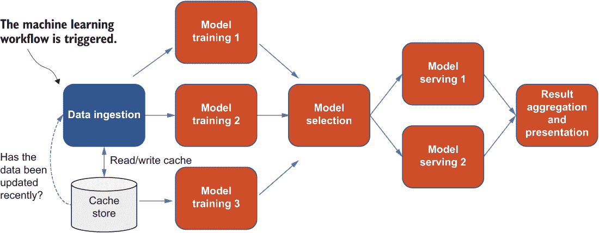
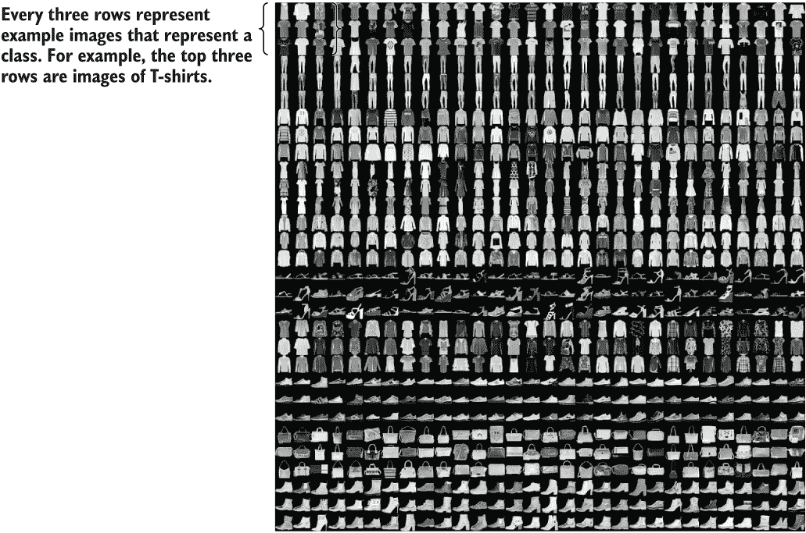
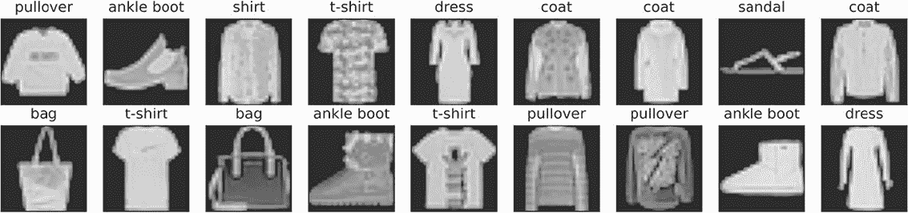
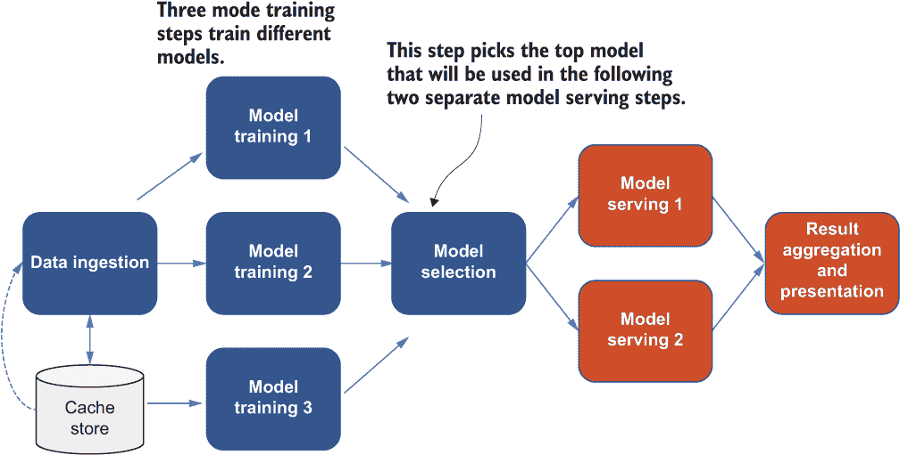
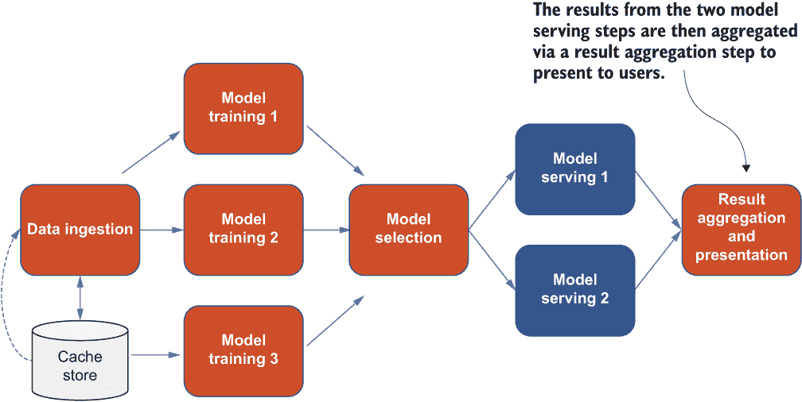
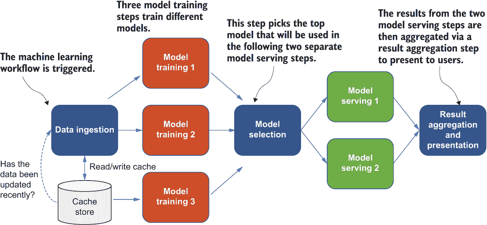

# 9 完整实现

本章涵盖

+   使用 TensorFlow 实现数据摄取组件

+   定义机器学习模型并提交分布式模型训练作业

+   实现单实例模型服务器以及复制模型服务器

+   构建我们机器学习系统的有效全流程

在本书的前一章中，我们学习了我们将用于项目的四个核心技术的基础知识：TensorFlow、Kubernetes、Kubeflow 和 Argo Workflows。我们了解到 TensorFlow 执行数据处理、模型构建和模型评估。我们还学习了 Kubernetes 的基本概念，并启动了我们的本地 Kubernetes 集群，我们将将其作为我们的核心分布式基础设施。此外，我们成功地将分布式模型训练作业提交到本地 Kubernetes 集群，使用了 Kubeflow。在上一章的结尾，我们学习了如何使用 Argo Workflows 构建和提交一个基本的“hello world”工作流和一个复杂的 DAG 结构化工作流。

在本章中，我们将使用第七章中设计的架构来实现端到端机器学习系统。我们将完全实现每个组件，这些组件将结合之前讨论的模式。我们将使用几个流行的框架和尖端技术，特别是 TensorFlow、Kubernetes、Kubeflow、Docker 和 Argo Workflows，这些我们在第八章中介绍，以在本章中构建分布式机器学习工作流的不同组件。

## 9.1 数据摄取

我们端到端工作流中的第一个组件是数据摄取。我们将使用第 2.2 节中介绍的 Fashion-MNIST 数据集来构建数据摄取组件。图 9.1 显示了在端到端工作流左侧深色框中的该组件。



图 9.1 全流程机器学习系统中的数据摄取组件（深色框）

回想一下，这个数据集包含一个包含 60,000 个示例的训练集和一个包含 10,000 个示例的测试集。每个示例是一个 28 × 28 的灰度图像，代表一个 Zalando 的商品图像，并关联到 10 个类别中的一个标签。此外，Fashion-MNIST 数据集被设计为作为原始 MNIST 数据集的直接替换，用于基准测试机器学习算法。它共享相同的训练和测试分割的图像大小和结构。图 9.2 是 Fashion-MNIST 中所有 10 个类别（T 恤/上衣、裤子、开衫、连衣裙、外套、凉鞋、衬衫、运动鞋、包和踝靴）的图像集合的截图，其中每个类别在截图中占据三行。



图 9.2 从 Fashion-MNIST 数据集的所有 10 个类别（T 恤/上衣、裤子、开衫、连衣裙、外套、凉鞋、衬衫、运动鞋、包和踝靴）收集的图像截图

图 9.3 是对训练集中前几个示例图像的仔细查看，以及每个图像上方的对应文本标签。



图 9.3 仔细查看训练集中前几个示例图像及其对应的文本标签

在 9.1.1 节中，我们将介绍单节点数据管道的实现，该管道用于处理 Fashion-MNIST 数据集。此外，9.1.2 节将涵盖分布式数据管道的实现，为 9.2 节中的分布式模型训练准备数据。

### 9.1.1 单节点数据管道

让我们先看看如何构建一个单节点数据管道，该管道在您的笔记本电脑上本地工作，而不使用本地 Kubernetes 集群。对于用 TensorFlow 编写的机器学习程序来说，通过 tf.data 模块中的方法来消费数据是最佳方式。tf.data API 允许用户轻松构建复杂的输入管道。例如，图像模型的管道可能从各种文件系统中的文件中聚合数据，对每个图像应用随机转换，并从图像中创建用于模型训练的批次。

tf.data API 允许它处理大量数据，从不同的数据格式中读取，并执行复杂的转换。它包含一个 tf.data.Dataset 抽象，表示一系列元素，其中每个元素由一个或多个组件组成。让我们用图像管道来举例说明。图像输入管道中的一个元素可能是一个单独的训练示例，由一对张量组件表示图像及其标签。

以下列表提供了代码片段，用于将 Fashion-MNIST 数据集加载到 tf.data.Dataset 对象中，并执行一些必要的预处理步骤以准备我们的模型训练：

1.  将数据集的缩放范围从 (0, 255] 调整到 (0., 1.]。

1.  将图像的多维数组转换为模型可以接受的 float32 类型。

1.  选择训练数据，将其缓存在内存中以加快训练速度，并使用 10,000 个缓冲区大小对其进行洗牌。

列表 9.1 加载 Fashion-MNIST 数据集

```
import tensorflow_datasets as tfds
import tensorflow as tf
def make_datasets_unbatched():
  def scale(image, label):
    image = tf.cast(image, tf.float32)
    image /= 255
    return image, label
  datasets, _ = tfds.load(name='fashion_mnist',
    with_info=True, as_supervised=True)
  return datasets['train'].map(scale).cache().shuffle(10000)
```

注意，我们导入了 tensorflow_datasets 模块。TensorFlow 数据集，它由一系列用于各种任务（如图像分类、目标检测、文档摘要等）的数据集组成，可以与 TensorFlow 和其他 Python 机器学习框架一起使用。

tf.data.Dataset 对象是一个洗牌后的数据集，其中每个元素由图像及其标签组成，其形状和数据类型信息如下列表所示。

列表 9.2 检查 tf.data 对象

```
>>> ds = make_datasets_unbatched()
>>> ds
<ShuffleDataset element_spec=(
  TensorSpec(shape=(28, 28, 1),
  dtype=tf.float32, name=None),

```

### 9.1.2 分布式数据管道

现在，让我们看看我们如何以分布式方式消耗我们的数据集。在下一节中，我们将使用 tf.distribute.MultiWorkerMirroredStrategy 进行分布式训练。假设我们已经实例化了一个策略对象。我们将通过 Python 的 with 语法在策略的作用域内实例化我们的数据集，使用与之前为单节点使用情况定义的相同函数。

我们需要调整一些配置来构建我们的分布式输入管道。首先，我们创建重复的数据批次，其中总批次大小等于每个副本的批次大小乘以聚合梯度的副本数量。这确保了我们将为每个模型训练工作者中的每个批次提供足够的记录。换句话说，同步的副本数量等于在模型训练期间参与梯度 allreduce 操作的设备数量。例如，当用户或训练代码在分布式数据迭代器上调用 next()时，每个副本都会返回一个按副本划分的数据批次大小。重新批处理的数据集基数总是副本数量的倍数。

此外，我们还想配置 tf.data 以启用自动数据分片。由于数据集在分布式范围内，在多工作者训练模式下，输入数据集将自动分片。更具体地说，每个数据集将在工作者的 CPU 设备上创建，并且当 tf.data.experimental.AutoShardPolicy 设置为 AutoShardPolicy.DATA 时，每组工作者将在整个数据集的子集上训练模型。一个好处是，在每次模型训练步骤中，每个工作者将处理全局批次大小的非重叠数据集元素。每个工作者将处理整个数据集，并丢弃不属于其自身的部分。请注意，为了正确分区数据集元素，数据集需要以确定性的顺序产生元素，这应该已经由我们使用的 TensorFlow Datasets 库保证。

列表 9.3 配置分布式数据管道

```
BATCH_SIZE_PER_REPLICA = 64
BATCH_SIZE = BATCH_SIZE_PER_REPLICA * strategy.num_replicas_in_sync
with strategy.scope():
  ds_train = make_datasets_unbatched().batch(BATCH_SIZE).repeat()
  options = tf.data.Options()
  options.experimental_distribute.auto_shard_policy = \
    tf.data.experimental.AutoShardPolicy.DATA
  ds_train = ds_train.with_options(options)
  model = build_and_compile_model()

```

## 9.2 模型训练

我们讨论了本地节点和分布式数据管道的数据摄取组件的实施，以及我们如何在不同工作者之间正确地分片数据集，以便它能够与分布式模型训练一起工作。在本节中，让我们深入了解模型训练组件的实施细节。模型训练组件的架构图可以在图 9.4 中找到。



图 9.4 整体架构中模型训练组件的示意图。在三个不同的模型训练步骤之后，有一个模型选择步骤。这些模型训练步骤将训练三个不同的模型——即 CNN、带有 dropout 的 CNN 和带有批归一化的 CNN——它们相互竞争以获得更好的统计性能。

我们将在第 9.2.1 节中学习如何使用 TensorFlow 定义这三个模型，并在第 9.2.2 节中执行分布式模型训练作业。在第 9.2.3 节中，我们将实现模型选择步骤，该步骤选择将用于我们端到端机器学习工作流程中模型服务组件的顶级模型。

### 9.2.1 模型定义和单节点训练

接下来，我们将查看 TensorFlow 代码来定义和初始化第一个模型，这是一个卷积神经网络（CNN）模型，我们在前面的章节中介绍过，具有三个卷积层。我们使用 Sequential()初始化模型，这意味着我们将按顺序添加层。第一层是输入层，我们指定了之前定义的输入管道的形状。请注意，我们还明确地为输入层命名，以便我们可以在推理输入中传递正确的键，我们将在第 9.3 节中更深入地讨论这一点。

在添加输入层、三个卷积层、随后是最大池化层和密集层之后，我们将打印出模型架构的摘要，并使用 Adam 作为其优化器、准确率作为我们用于评估模型的指标，以及稀疏分类交叉熵作为损失函数来编译模型。

列表 9.4 定义基本 CNN 模型

```
def build_and_compile_cnn_model():
  print("Training CNN model")
  model = models.Sequential()
  model.add(layers.Input(shape=(28, 28, 1), name='image_bytes'))
  model.add(
          layers.Conv2D(32, (3, 3), activation='relu'))
  model.add(layers.MaxPooling2D((2, 2)))
  model.add(layers.Conv2D(64, (3, 3), activation='relu'))
  model.add(layers.MaxPooling2D((2, 2)))
  model.add(layers.Conv2D(64, (3, 3), activation='relu'))
  model.add(layers.Flatten())
  model.add(layers.Dense(64, activation='relu'))
  model.add(layers.Dense(10, activation='softmax'))
  model.summary()
  model.compile(optimizer='adam',
           loss='sparse_categorical_crossentropy',
           metrics=['accuracy'])
  return model
```

我们已经成功定义了我们的基本 CNN 模型。接下来，我们基于 CNN 模型定义了两个模型。一个模型添加了一个批量归一化层，以强制特定层的每个神经元（激活）的预激活具有零均值和单位标准差。另一个模型有一个额外的 dropout 层，其中一半的隐藏单元将被随机丢弃，以减少模型的复杂性和加快计算速度。其余的代码与基本 CNN 模型相同。

列表 9.5 定义基本 CNN 模型的变体

```
def build_and_compile_cnn_model_with_batch_norm():
  print("Training CNN model with batch normalization")
  model = models.Sequential()
  model.add(layers.Input(shape=(28, 28, 1), name='image_bytes'))
  model.add(
            layers.Conv2D(32, (3, 3), activation='relu'))
  model.add(layers.BatchNormalization())
  model.add(layers.Activation('sigmoid'))
  model.add(layers.MaxPooling2D((2, 2)))
  model.add(layers.Conv2D(64, (3, 3), activation='relu'))
  model.add(layers.BatchNormalization())
  model.add(layers.Activation('sigmoid'))
  model.add(layers.MaxPooling2D((2, 2)))
  model.add(layers.Conv2D(64, (3, 3), activation='relu'))
  model.add(layers.Flatten())
  model.add(layers.Dense(64, activation='relu'))
  model.add(layers.Dense(10, activation='softmax'))

  model.summary()

  model.compile(optimizer='adam',
             loss='sparse_categorical_crossentropy',
             metrics=['accuracy'])
  return model

def build_and_compile_cnn_model_with_dropout():
  print("Training CNN model with dropout")
  model = models.Sequential()
  model.add(layers.Input(shape=(28, 28, 1), name='image_bytes'))
  model.add(
            layers.Conv2D(32, (3, 3), activation='relu'))
  model.add(layers.MaxPooling2D((2, 2)))
  model.add(layers.Conv2D(64, (3, 3), activation='relu'))
  model.add(layers.MaxPooling2D((2, 2)))
  model.add(layers.Dropout(0.5))
  model.add(layers.Conv2D(64, (3, 3), activation='relu'))
  model.add(layers.Flatten())
  model.add(layers.Dense(64, activation='relu'))
  model.add(layers.Dense(10, activation='softmax'))

  model.summary()

  model.compile(optimizer='adam',
             loss='sparse_categorical_crossentropy',
             metrics=['accuracy'])

```

一旦定义了模型，我们就可以在我们的笔记本电脑上本地训练它们。让我们以基本的 CNN 模型为例。我们将创建四个将在模型训练期间执行的回调：

1.  PrintLR—在每个 epoch 结束时打印学习率的回调

1.  TensorBoard—回调以启动交互式 TensorBoard 可视化，以监控训练进度和模型架构

1.  ModelCheckpoint—回调以保存模型权重，以便稍后进行模型推理

1.  LearningRateScheduler—在每个 epoch 结束时衰减学习率的回调

一旦定义了这些回调，我们将将其传递给 fit()方法进行训练。fit()方法使用指定的 epoch 数和每个 epoch 的步数来训练模型。请注意，这里的数字仅用于演示目的，以加快我们的本地实验，可能不足以在实际应用中生成高质量的模型。

列表 9.6 使用回调进行模型训练

```
single_worker_model = build_and_compile_cnn_model()
checkpoint_prefix = os.path.join(args.checkpoint_dir, "ckpt_{epoch}")

class PrintLR(tf.keras.callbacks.Callback):
  def on_epoch_end(self, epoch, logs=None):
            print('\nLearning rate for epoch {} is {}'.format(
            epoch + 1, multi_worker_model.optimizer.lr.numpy()))
callbacks = [
            tf.keras.callbacks.TensorBoard(log_dir='./logs'),
            tf.keras.callbacks.ModelCheckpoint(filepath=checkpoint_prefix,
                                      save_weights_only=True),
            tf.keras.callbacks.LearningRateScheduler(decay),
            PrintLR()
]

single_worker_model.fit(ds_train,
                         epochs=1,
                         steps_per_epoch=70,
                         callbacks=callbacks)
```

我们将在日志中看到以下模型训练进度：

```
Learning rate for epoch 1 is 0.0010000000474974513
70/70 [========] - 16s 136ms/step - loss: 1.2853
- accuracy: 0.5382 - lr: 0.0010

Here’s the summary of the model architecture in the logs:
Model: "sequential"
________________________________________________________________
 Layer (type)                       Output Shape              Param #
==================================================
 conv2d (Conv2D)               (None, 26, 26, 32)                 320
 max_pooling2d (MaxPooling2D)  (None, 13, 13, 32)                   0
 conv2d_1 (Conv2D)             (None, 11, 11, 64)               18496
 max_pooling2d_1               (MaxPooling2D) (None, 5, 5, 64)      0
 conv2d_2 (Conv2D)             (None, 3, 3, 64)                 36928
 flatten (Flatten)             (None, 576)                          0
 dense (Dense)                 (None, 64)                       36928
 dense_1 (Dense)               (None, 10)                         650
==================================================
Total params: 93,322
Trainable params: 93,322
Non-trainable params: 0
```

根据这个总结，在过程中将训练 93,000 个参数。每个层的形状和参数数量也可以在总结中找到。

### 9.2.2 分布式模型训练

现在我们已经定义了模型并且可以在单台机器上本地训练它们，下一步是在代码中插入分布式训练逻辑，以便我们可以使用书中介绍的全局通信模式运行具有多个工作器的模型训练。我们将使用包含 MultiWorkerMirroredStrategy 的 tf.distribute 模块。这是一个在多个工作器上进行同步训练的分布式策略。它在所有工作器的每个设备上创建了模型层中所有变量的副本。此策略使用分布式集体实现（例如，all-reduce），因此多个工作器可以一起工作以加快训练速度。如果您没有适当的 GPU，您可以将 communication_options 替换为其他实现。由于我们希望确保分布式训练可以在可能没有 GPU 的不同机器上运行，我们将将其替换为 CollectiveCommunication.AUTO，这样它将自动选择任何可用的硬件。

一旦我们定义了我们的分布式训练策略，我们将在策略作用域内启动我们的分布式输入数据管道（如前所述，在 9.1.2 节中），以及策略作用域内的模型。请注意，在策略作用域内定义模型是必需的，因为 TensorFlow 根据策略能够适当地在每个工作器中复制模型层的变量。在这里，我们根据传递给这个 Python 脚本的命令行参数定义不同的模型类型（基本 CNN、带有 dropout 的 CNN 和带有批归一化的 CNN）。

我们很快就会接触到其余的标志。一旦数据管道和模型在作用域内定义，我们就可以使用 fit() 函数在分布式策略作用域之外训练模型。

列表 9.7 分布式模型训练逻辑

```
strategy = tf.distribute.MultiWorkerMirroredStrategy(
  communication_options=tf.distribute.experimental.CommunicationOptions(
  implementation=tf.distribute.experimental.CollectiveCommunication.AUTO))

BATCH_SIZE_PER_REPLICA = 64
BATCH_SIZE = BATCH_SIZE_PER_REPLICA * strategy.num_replicas_in_sync

with strategy.scope():
  ds_train = make_datasets_unbatched().batch(BATCH_SIZE).repeat()
  options = tf.data.Options()
  options.experimental_distribute.auto_shard_policy = \
            tf.data.experimental.AutoShardPolicy.DATA
  ds_train = ds_train.with_options(options)
  if args.model_type == "cnn":
    multi_worker_model = build_and_compile_cnn_model()
  elif args.model_type == "dropout":
    multi_worker_model = build_and_compile_cnn_model_with_dropout()
  elif args.model_type == "batch_norm":
    multi_worker_model = build_and_compile_cnn_model_with_batch_norm()
  else:
    raise Exception("Unsupported model type: %s" % args.model_type)

multi_worker_model.fit(ds_train,
                         epochs=1,
                         steps_per_epoch=70)
```

一旦通过 fit() 函数完成模型训练，我们希望保存模型。用户可能会犯的一个常见错误是在所有工作器上保存模型，这可能会导致无法正确保存完成的模型，并浪费计算资源和存储空间。修复此问题的正确方法是只保存主工作器上的模型。我们可以检查环境变量 TF_CONFIG，它包含集群信息，例如任务类型和索引，以查看工作器是否为主工作器。此外，我们希望将模型保存到工作器之间的唯一路径，以避免意外错误。

列表 9.8 使用主工作器保存模型

```
def is_chief():
  return TASK_INDEX == 0

tf_config = json.loads(os.environ.get('TF_CONFIG') or '{}')
TASK_INDEX = tf_config['task']['index']

if is_chief():
  model_path = args.saved_model_dir
else:
  model_path = args.saved_model_dir + '/worker_tmp_' + str(TASK_INDEX)

multi_worker_model.save(model_path)
```

到目前为止，我们已经看到了两个命令行标志——即 saved_model_dir 和 model_type。列表 9.9 提供了解析这些命令行参数的其余主要函数。除了这两个参数之外，还有一个 checkpoint_dir 参数，我们将使用它将我们的模型保存到 TensorFlow SavedModel 格式，这种格式可以很容易地被我们的模型服务组件消费。我们将在第 9.3 节中详细讨论这一点。我们还禁用了 TensorFlow Datasets 模块的进度条，以减少我们将看到的日志。

列表 9.9 入口点 main 函数

```
if __name__ == '__main__':
  tfds.disable_progress_bar()

  parser = argparse.ArgumentParser()
  parser.add_argument('--saved_model_dir',
                         type=str,
                         required=True,
                         help='Tensorflow export directory.')

  parser.add_argument('--checkpoint_dir',
                         type=str,
                         required=True,
                         help='Tensorflow checkpoint directory.')

  parser.add_argument('--model_type',
                         type=str,
                         required=True,
                         help='Type of model to train.')

  parsed_args = parser.parse_args()
  main(parsed_args)
```

我们刚刚完成了包含分布式模型训练逻辑的 Python 脚本的编写。让我们将其容器化并构建用于在我们本地 Kubernetes 集群中运行分布式训练的镜像。在我们的 Dockerfile 中，我们将使用 Python 3.9 基础镜像，通过 pip 安装 TensorFlow 和 TensorFlow Datasets 模块，并复制我们的多工作节点分布式训练 Python 脚本。

列表 9.10 容器化

```
FROM python:3.9
RUN pip install tensorflow==2.11.0 tensorflow_datasets==4.7.0
COPY multi-worker-distributed-training.py /
```

然后，我们从刚才定义的 Dockerfile 构建镜像。由于我们的集群无法访问我们的本地镜像仓库，我们还需要将镜像导入到 k3d 集群中。然后，我们将当前命名空间设置为“kubeflow”。请阅读第八章并按照说明安装我们为此项目所需的组件。

列表 9.11 构建和导入 docker 镜像

```
> docker build -f Dockerfile -t kubeflow/multi-worker-strategy:v0.1 .
> k3d image import kubeflow/multi-worker-strategy:v0.1 --cluster distml
> kubectl config set-context --current --namespace=kubeflow
```

一旦完成工作 Pod，Pod 中的所有文件都将被回收。由于我们在 Kubernetes Pods 中的多个工作节点上运行分布式模型训练，所有模型检查点都将丢失，我们没有用于模型服务的训练模型。为了解决这个问题，我们将使用持久卷（PV）和持久卷声明（PVC）。

PV 是在集群中由管理员或动态配置的存储。它就像节点是集群资源一样，是集群中的资源。PV 是类似于卷的卷插件，但它们的生命周期独立于使用 PV 的任何单个 Pod。换句话说，PV 将在 Pod 完成或删除后继续存在和存活。

PVC 是用户对存储的请求。它与 Pod 类似。Pod 消耗节点资源，PVC 消耗 PV 资源。Pod 可以请求特定的资源级别（CPU 和内存）。声明可以请求特定的尺寸和访问模式（例如，它们可以是 ReadWriteOnce、ReadOnlyMany 或 ReadWriteMany）。

让我们创建一个 PVC，提交一个请求用于在我们的工作 Pod 中存储训练模型。在这里，我们只请求 1 Gi 的存储空间，使用 ReadWriteOnce 访问模式。

列表 9.12 持久卷声明

```
kind: PersistentVolumeClaim
apiVersion: v1
metadata:
  name: strategy-volume
spec:
  accessModes: [ "ReadWriteOnce" ]
  resources:
    requests:
      storage: 1Gi
```

接下来，我们将创建 PVC。

列表 9.13 创建 PVC

```
> kubectl create -f multi-worker-pvc.yaml
```

接下来，让我们定义第七章中介绍的 TFJob 规范，使用我们刚刚构建的包含分布式训练脚本的镜像。我们将必要的命令参数传递到容器中，以训练基本的 CNN 模型。Worker 规范中的 volumes 字段指定了我们刚刚创建的持久卷声明的名称，而 containers 规范中的 volumeMounts 字段指定了将文件从卷挂载到容器的文件夹。模型将保存在卷内的/trained_model 文件夹中。

列表 9.14 分布式模型训练作业定义

```
apiVersion: kubeflow.org/v1
kind: TFJob
metadata:
  name: multi-worker-training
spec:
  runPolicy:
    cleanPodPolicy: None
  tfReplicaSpecs:
    Worker:
      replicas: 2
      restartPolicy: Never
      template:
        spec:
          containers:
            - name: tensorflow
              image: kubeflow/multi-worker-strategy:v0.1
              imagePullPolicy: IfNotPresent
              command: ["python",
            "/multi-worker-distributed-training.py",
            "--saved_model_dir",
            "/trained_model/saved_model_versions/2/",
            "--checkpoint_dir",
            "/trained_model/checkpoint",
            "--model_type", "cnn"]
              volumeMounts:
                - mountPath: /trained_model
                  name: training
              resources:
                limits:
                  cpu: 500m
          volumes:
            - name: training
              persistentVolumeClaim:
                claimName: strategy-volume
```

然后，我们可以将这个 TFJob 提交到我们的集群以启动分布式模型训练。

列表 9.15 提交 TFJob

```
> kubectl create -f multi-worker-tfjob.yaml
```

一旦 Worker Pods 完成，我们会从 Pod 中注意到以下日志，表明我们以分布式方式训练了模型，并且工作者之间成功进行了通信：

```
Started server with target:
grpc://multi-worker-training-worker-0.kubeflow.svc:2222
/job:worker/replica:0/task:1 has connected to coordination service. 
/job:worker/replica:0/task:0 has connected to coordination service. 

```

### 9.2.3 模型选择

到目前为止，我们已经实现了我们的分布式模型训练组件。我们最终将训练三个不同的模型，正如 9.2.1 节中提到的，然后选择最佳模型用于模型服务。假设我们已经通过提交三个不同类型的 TFJobs 成功训练了这些模型。

接下来，我们编写 Python 代码来加载测试数据和训练好的模型，然后评估它们的性能。我们将通过 keras.models.load_model()函数从不同的文件夹中加载每个训练好的模型，并执行 model.evaluate()，它返回损失和准确率。一旦我们找到准确率最高的模型，我们就可以将其复制到不同文件夹中的新版本——即 4 号文件夹——这将被我们的模型服务组件使用。

列表 9.16 模型评估

```
import numpy as np
import tensorflow as tf
from tensorflow import keras
import tensorflow_datasets as tfds
import shutil
import os

def scale(image, label):
  image = tf.cast(image, tf.float32)
  image /= 255
  return image, label

best_model_path = ""
best_accuracy = 0
for i in range(1, 4):
  model_path = "trained_model/saved_model_versions/" + str(i)
  model = keras.models.load_model(model_path)
  datasets, _ = tfds.load(
    name='fashion_mnist', with_info=True, as_supervised=True)
  ds = datasets['test'].map(scale).cache().shuffle(10000).batch(64)
  _, accuracy = model.evaluate(ds)
  if accuracy > best_accuracy:
    best_accuracy = accuracy
    best_model_path = model_path

destination = "trained_model/saved_model_versions/4"
if os.path.exists(destination):
  shutil.rmtree(destination)

shutil.copytree(best_model_path, destination)
print("Best model with accuracy %f is copied to %s" % (
  best_accuracy, destination))
```

注意，在 trained_model/saved_model_versions 文件夹中的最新版本，即 4 号，将被我们的服务组件选中。我们将在下一节中讨论这一点。

然后，我们将这个 Python 脚本添加到我们的 Dockerfile 中，重新构建容器镜像，并创建一个运行模型选择组件的 Pod。以下是为配置模型选择 Pod 的 YAML 文件。

列表 9.17 模型选择 Pod 定义

```
apiVersion: v1
kind: Pod
metadata:
  name: model-selection
spec:
  containers:
  - name: predict
    image: kubeflow/multi-worker-strategy:v0.1
    command: ["python", "/model-selection.py"]
    volumeMounts:
    - name: model
      mountPath: /trained_model
  volumes:
  - name: model
    persistentVolumeClaim:
      claimName: strategy-volume
```

在检查日志时，我们看到第三个模型的准确率最高，因此我们将它复制到新版本，用于模型服务组件：

```
157/157 [======] - 1s 5ms/step - loss: 0.7520 - accuracy: 0.7155
157/157 [======] - 1s 5ms/step - loss: 0.7568 - accuracy: 0.7267
157/157 [======] - 1s 5ms/step - loss: 0.7683 - accuracy: 0.7282
```

## 9.3 模型服务

现在我们已经实现了分布式模型训练以及训练模型之间的模型选择。接下来，我们将实现模型服务组件。模型服务组件对于最终用户体验至关重要，因为结果将直接展示给我们的用户，如果性能不足，我们的用户会立即知道。图 9.5 显示了整体架构中的模型训练组件。



图 9.5 端到端机器学习系统中的模型服务组件（深色框）

在图 9.5 中，模型服务组件显示为模型选择和结果聚合步骤之间的两个深色框。让我们首先在 9.3.1 节中实现我们的单服务器模型推理组件，然后在 9.3.2 节中使其更具可扩展性和性能。

### 9.3.1 单服务器模型推理

模型推理的 Python 代码与模型评估代码非常相似。唯一的区别是在加载训练模型后，我们使用 model.predict() 方法而不是 evaluate()。这是一种测试训练模型是否能够按预期进行预测的极好方式。

列表 9.18 模型预测

```
import numpy as np
import tensorflow as tf
from tensorflow import keras
import tensorflow_datasets as tfds
model = keras.models.load_model("trained_model/saved_model_versions")
def scale(image, label):
  image = tf.cast(image, tf.float32)
  image /= 255
  return image, label
datasets, _ = tfds.load(
  name='fashion_mnist', with_info=True, as_supervised=True)
ds = datasets['test'].map(scale).cache().shuffle(10000).batch(64)
model.predict(ds)
```

或者，一旦安装完成，你可以在以下列表中像本地启动 TensorFlow Serving ([`github.com/tensorflow/serving`](https://github.com/tensorflow/serving)) 服务器。

列表 9.19 TensorFlow Serving 命令

```
tensorflow_model_server --model_name=flower-sample \
    --port=9000 \
    --rest_api_port=8080 \
    --model_base_path=trained_model/saved_model \
    --rest_api_timeout_in_ms=60000
```

这看起来很简单，如果我们在本地进行实验，效果很好。然而，还有更多高效的方式来构建我们的模型服务组件，这将为我们通往运行分布式模型服务铺平道路，该服务结合了我们之前章节中介绍的复制模型服务器模式。

在我们深入探讨更好的解决方案之前，让我们确保我们的训练模型可以与我们的预测输入一起工作，这些输入将是一个包含键 "instances" 和 "image_bytes" 的 JSON 结构化图像字节列表，如下所示：

```
{ 
    "instances":[ 
       { 
          "image_bytes":{ 
             "b64":"/9j/4AAQSkZJRgABAQAAAQABAAD
...
<truncated>
/hWY4+UVEhkoIYUx0psR+apm6VBRUZcUYFSuKZgUAf//Z"
          }
       }
    ]
 } 
```

现在是修改我们的分布式模型训练代码的时候了，以确保模型具有与提供的输入兼容的正确服务签名。我们定义的预处理函数执行以下操作：

1.  从字节解码图像

1.  将图像调整大小到 28 × 28，以与我们的模型架构兼容

1.  将图像转换为 tf.uint8

1.  定义输入签名，类型为字符串，键为 image_bytes

一旦预处理函数被定义，我们可以通过 tf.TensorSpec() 定义服务签名，然后将其传递给 tf.saved_model.save() 方法以保存与我们的输入格式兼容的模型，并在 TensorFlow Serving 进行推理调用之前对其进行预处理。

列表 9.20 模型服务签名定义

```
def _preprocess(bytes_inputs):
    decoded = tf.io.decode_jpeg(bytes_inputs, channels=1)
    resized = tf.image.resize(decoded, size=(28, 28))
    return tf.cast(resized, dtype=tf.uint8)

def _get_serve_image_fn(model):
@tf.function(
  input_signature=[tf.TensorSpec([None],
    dtype=tf.string, name='image_bytes')])
    def serve_image_fn(bytes_inputs):
        decoded_images = tf.map_fn(_preprocess, bytes_inputs, dtype=tf.uint8)
        return model(decoded_images)
    return serve_image_fn
signatures = {
    "serving_default": _get_serve_image_fn(multi_worker_model).get_concrete_function(
        tf.TensorSpec(shape=[None], dtype=tf.string, name='image_bytes')
    )
  }

tf.saved_model.save(multi_worker_model, model_path, signatures=signatures)
```

一旦修改了分布式模型训练脚本，我们可以重新构建我们的容器镜像，并按照 9.2.2 节中的说明从头开始重新训练我们的模型。

接下来，我们将使用 KServe，正如我们在技术概述中提到的，来创建一个推理服务。列表 9.21 提供了定义 KServe 推理服务的 YAML。我们需要指定模型格式，以便 KServe 知道用于服务的模型（例如，TensorFlow Serving）。此外，我们需要提供训练模型的 URI。在这种情况下，我们可以指定 PVC 名称和训练模型的路径，格式为 pvc://<pvc-name>/<model-path>。

列表 9.21 推理服务定义

```
apiVersion: serving.kserve.io/v1beta1
kind: InferenceService
metadata:
  name: flower-sample
spec:
  predictor:
    model:
      modelFormat:
        name: tensorflow
      storageUri: "pvc://strategy-volume/saved_model_versions"
```

让我们安装 KServe 并创建我们的推理服务！

列表 9.22 安装 KServe 和创建推理服务

```
> curl -s "https:/ /raw.githubusercontent.com/
  kserve/kserve/v0.10.0-rc1/hack/quick_install.sh" | bash
> kubectl create -f inference-service.yaml
```

我们可以检查其状态以确保它已准备好提供服务。

列表 9.23 获取推理服务的详细信息

```
> kubectl get isvc
NAME            URL                      READY     AGE
flower-sample   <truncated...example.com>  True      25s
```

一旦服务创建成功，我们将它端口转发到本地，以便我们可以在本地向其发送请求。

列表 9.24 端口转发推理服务

```
> INGRESS_GATEWAY_SERVICE=$(kubectl get svc --namespace \
istio-system --selector="app=istio-ingressgateway" --output \ jsonpath='{.items[0].metadata.name}')
> kubectl port-forward --namespace istio-system svc/${INGRESS_GATEWAY_SERVICE} 8080:80
```

如果端口转发成功，你应该能看到以下内容：

```
Forwarding from 127.0.0.1:8080 -> 8080
Forwarding from [::1]:8080 -> 8080
```

让我们打开另一个终端并执行以下 Python 脚本来向我们的模型服务服务发送一个示例推理请求并打印出响应文本。

列表 9.25 使用 Python 发送推理请求

```
import requests
import json
input_path = "inference-input.json"

with open(input_path) as json_file:
    data = json.load(json_file)

r = requests.post(
 url="http:/ /localhost:8080/v1/models/flower-sample:predict",
 data=json.dumps(data),
 headers={'Host': 'flower-sample.kubeflow.example.com'})
print(r.text)
```

我们 KServe 模型服务服务的响应如下，它包括 Fashion-MNIST 数据集中每个类别的预测概率：

```
{
  "predictions": [[0.0, 0.0, 1.22209595e-11,
    0.0, 1.0, 0.0, 7.07406329e-32, 0.0, 0.0, 0.0]]
}
```

或者，我们可以使用 curl 发送请求。

列表 9.26 使用 curl 发送推理请求

```
# Start another terminal
export INGRESS_HOST=localhost
export INGRESS_PORT=8080
MODEL_NAME=flower-sample            
INPUT_PATH=@./inference-input.json
SERVICE_HOSTNAME=$(kubectl get inferenceservice \
${MODEL_NAME} -o jsonpath='{.status.url}' | \
cut -d "/" -f 3)
curl -v -H "Host: ${SERVICE_HOSTNAME}" "http:/ /${INGRESS_HOST}:${INGRESS_PORT}/v1/
models/$MODEL_NAME:predict" -d $INPUT_PATH
```

输出的概率应该与我们刚才看到的相同：

```
*   Trying ::1:8080...
* Connected to localhost (::1) port 8080 (#0)
> POST /v1/models/flower-sample:predict HTTP/1.1
> Host: flower-sample.kubeflow.example.com
> User-Agent: curl/7.77.0
> Accept: */*
> Content-Length: 16178
> Content-Type: application/x-www-form-urlencoded
> 
* Mark bundle as not supporting multiuse
< HTTP/1.1 200 OK
< content-length: 102
< content-type: application/json
< date: Thu, 05 Jan 2023 21:11:36 GMT
< x-envoy-upstream-service-time: 78
< server: istio-envoy
< 
{
    "predictions": [[0.0, 0.0, 1.22209595e-11, 0.0,
  1.0, 0.0, 7.07406329e-32, 0.0, 0.0, 0.0]
    ]
* Connection #0 to host localhost left intact
}
```

如前所述，尽管我们在 KServe InferenceService 规范中指定了包含训练模型的整个目录，但利用 TensorFlow Serving 的模型服务服务将选择该特定文件夹中的最新版本 4，这是我们第 9.2.3 节中选择的最佳模型。我们可以从服务 Pod 的日志中观察到这一点。

列表 9.27 检查模型服务器日志

```
> kubectl logs flower-sample-predictor-default
-00001-deployment-f67767f6c2fntx  -c kserve-container
```

这里是日志：

```
Building single TensorFlow model file config:
model_name: flower-sample model_base_path: /mnt/models
Adding/updating models.
...
<truncated>
Successfully loaded servable version 
  {name: flower-sample version: 4}
```

### 9.3.2 复制模型服务器

在上一节中，我们在本地 Kubernetes 集群中成功部署了我们的模型服务服务。这可能对于运行本地服务实验来说是足够的，但如果它部署到生产系统中，这些系统服务于现实世界的模型服务流量，那就远远不够理想了。当前的模型服务服务是一个 Kubernetes Pod，分配的计算资源有限且预先请求。当模型服务请求的数量增加时，单实例模型服务器将无法支持工作负载，并且可能会耗尽计算资源。

为了解决这个问题，我们需要有多个模型服务器实例来处理更多的动态模型服务请求。幸运的是，KServe 可以根据每个 Pod 的平均飞行请求数量自动扩展，这使用了 Knative Serving 自动扩展器。

以下列表提供了启用自动扩展的推理服务规范。scaleTarget 字段指定了自动扩展器监视的指标类型的整数目标值。此外，scaleMetric 字段定义了自动扩展器监视的扩展指标类型。可能的指标有并发性、RPS、CPU 和内存。在这里，我们只允许每个推理服务实例处理一个并发请求。换句话说，当有更多请求时，我们将启动一个新的推理服务 Pod 来处理每个额外的请求。

列表 9.28 复制模型推理服务

```
apiVersion: serving.kserve.io/v1beta1
kind: InferenceService
metadata:
  name: flower-sample
spec:
  predictor:
    scaleTarget: 1
    scaleMetric: concurrency
    model:
      modelFormat:
        name: tensorflow
      storageUri: "pvc://strategy-volume/saved_model_versions"
```

假设没有请求，我们应该只看到一个运行中的推理服务 Pod。接下来，让我们以 30 秒的间隔发送流量，保持五个正在进行的请求。我们使用相同的服务主机名和入口地址，以及相同的推理输入和训练模型。请注意，我们正在使用工具 hey，这是一个向 Web 应用程序发送一些负载的小程序。在执行以下命令之前，请按照[`github.com/rakyll/hey`](https://github.com/rakyll/hey)上的说明安装它。

列表 9.29 发送流量以测试负载

```
> hey -z 30s -c 5 -m POST \
 -host ${SERVICE_HOSTNAME} \
 -D inference-input.json "http:/ /${INGRESS_HOST}:${INGRESS_PORT}
/v1/models/$MODEL_NAME:predict"
```

下面的命令预期输出包括推理服务处理请求的摘要。例如，该服务处理了 230,160 字节的推理输入和每秒 95.7483 个请求。您还可以找到有用的响应时间直方图和延迟分布：

```
 Summary:
  Total:         30.0475 secs
  Slowest:       0.2797 secs
  Fastest:       0.0043 secs
  Average:       0.0522 secs
  Requests/sec:  95.7483
  Total data:    230160 bytes
  Size/request:  80 bytes
Response time histogram:
  0.004 [1]      |
  0.032 [1437]   |■■■■■■■■■■■■■■■■■■■■■■■■■■■■■■■■■■■■■■■■
  0.059 [3]      |
  0.087 [823]    |■■■■■■■■■■■■■■■■■■■■■■■
  0.114 [527]    |■■■■■■■■■■■■■■■
  0.142 [22]     |■
  0.170 [5]      |
  0.197 [51]     |■
  0.225 [7]      |
  0.252 [0]      |
  0.280 [1]      |

 Latency distribution:
  10% in 0.0089 secs
  25% in 0.0123 secs
  50% in 0.0337 secs
  75% in 0.0848 secs
  90% in 0.0966 secs
  95% in 0.1053 secs
  99% in 0.1835 secs
Details (average, fastest, slowest):
  DNS+dialup:      0.0000 secs, 0.0043 secs, 0.2797 secs
  DNS-lookup:      0.0000 secs, 0.0000 secs, 0.0009 secs
  req write:       0.0000 secs, 0.0000 secs, 0.0002 secs
  resp wait:       0.0521 secs, 0.0042 secs, 0.2796 secs
  resp read:       0.0000 secs, 0.0000 secs, 0.0005 secs
Status code distribution:
  [200]   2877 responses
```

如预期，我们看到有五个正在运行的推理服务 Pod 并发处理请求，其中每个 Pod 只处理一个请求。

列表 9.30 获取模型服务器 Pod 列表

```
> kubectl get pods
NAME                      READY  STATUS    RESTARTS  AGE
flower-<truncated>-sr5wd  3/3    Running    0        12s
flower--<truncated>-swnk5 3/3    Running    0        22s
flower--<truncated>-t2njf 3/3    Running    0        22s
flower--<truncated>-vdlp9 3/3    Running    0        22s
flower--<truncated>-vm58d 3/3    Running    0        42s
```

hey 命令完成后，我们只会看到一个正在运行的 Pod。

列表 9.31 再次获取模型服务器 Pod 列表

```
> kubectl get pods
NAME                       READY   STATUS   RESTARTS   AGE

```

## 9.4 端到端工作流程

我们刚刚实现了前几节中所有组件。现在，是时候将它们组合在一起了！在本节中，我们将使用 Argo Workflows 定义一个端到端工作流程，该工作流程包括我们刚刚实现的组件。如果您对所有组件仍然不熟悉，请回到前面的章节，并刷新第八章中关于基本 Argo Workflows 的知识。

下面是对我们将要实施的端到端工作流程的回顾。图 9.6 是我们正在构建的端到端工作流程的示意图。该图为了说明目的包含了两个模型服务步骤，但我们在 Argo 工作流程中只实现一个步骤。它将根据请求流量自动扩展到更多实例，如第 9.3.2 节所述。



图 9.6 我们正在构建的端到端机器学习系统架构图

在接下来的章节中，我们将通过使用 Argo 按顺序连接步骤来定义整个工作流程，然后通过实现步骤记忆化来优化工作流程以供未来执行。

### 9.4.1 顺序步骤

首先，让我们看看入口模板和涉及工作流程的主要步骤。入口模板的名称是 tfjob-wf，它由以下步骤组成（为了简单起见，每个步骤使用具有相同名称的模板）：

1.  data-ingestion-step 包含数据摄入步骤，我们将使用它来在模型训练之前下载和预处理数据集。

1.  distributed-tf-training-steps 是一个由多个子步骤组成的步骤组，其中每个子步骤代表特定模型类型的分布式模型训练步骤。

1.  `model-selection-step`是一个步骤，用于从我们在先前步骤中训练的不同模型中选择最佳模型。

1.  `create-model-serving-service`通过 KServe 创建模型服务。

列表 9.32 工作流入口模板

```
apiVersion: argoproj.io/v1alpha1
kind: Workflow
metadata:
  generateName: tfjob-wf-
  namespace: kubeflow
spec:
  entrypoint: tfjob-wf
  podGC:
    strategy: OnPodSuccess
  volumes:
  - name: model
    persistentVolumeClaim:
      claimName: strategy-volume
  templates:
  - name: tfjob-wf
    steps:
    - - name: data-ingestion-step
        template: data-ingestion-step
    - - name: distributed-tf-training-steps
        template: distributed-tf-training-steps
    - - name: model-selection-step
        template: model-selection-step
    - - name: create-model-serving-service
        template: create-model-serving-service
```

注意，我们指定了 podGC 策略为 OnPodSuccess，因为我们将在有限的计算资源下创建大量 Pod，用于我们本地 k3s 集群中的不同步骤，因此，在 Pod 成功后立即删除 Pod 可以释放后续步骤的计算资源。OnPodCompletion 策略也是可用的；无论 Pod 失败还是成功，它都会在完成时删除 Pod。我们不会使用它，因为我们希望保留失败的 Pod 以调试出错的原因。

此外，我们还指定了我们的卷和 PVC，以确保我们可以持久化在步骤中使用的任何文件。我们可以将下载的数据集保存到持久卷中用于模型训练，然后持久化训练好的模型以供后续模型服务步骤使用。

第一步，数据摄入步骤，非常直接。它只指定了容器镜像和数据摄入的 Python 脚本以执行。这个 Python 脚本是一行代码，包含`tfds.load(name='fashion_mnist')`以将数据集下载到容器的本地存储，该存储将被挂载到我们的持久卷上。

列表 9.33 数据摄入步骤

```
 - name: data-ingestion-step
    serviceAccountName: argo
    container:
      image: kubeflow/multi-worker-strategy:v0.1
      imagePullPolicy: IfNotPresent
      command: ["python", "/data-ingestion.py"]
```

下一个步骤是一个由多个子步骤组成的步骤组，其中每个子步骤代表特定模型类型（例如，基本 CNN、带有 dropout 的 CNN 和带有批归一化的 CNN）的分布式模型训练步骤。以下列表提供了定义所有子步骤的模板。对于多个模型的分布式训练步骤，这些步骤将并行执行。

列表 9.34 分布式训练步骤组

```
 - name: distributed-tf-training-steps
    steps:
    - - name: cnn-model
        template: cnn-model
      - name: cnn-model-with-dropout
        template: cnn-model-with-dropout
      - name: cnn-model-with-batch-norm
        template: cnn-model-with-batch-norm
```

让我们以第一个子步骤为例，该子步骤运行基本 CNN 模型的分布式模型训练。此步骤模板的主要内容是资源字段，它包括以下内容：

+   自定义资源定义（CRD）或清单，用于采取行动。在我们的案例中，我们创建一个 TFJob 作为此步骤的一部分。

+   指示 CRD 是否成功创建的条件。在我们的案例中，我们要求 Argo 监视`status.replicaStatuses.Worker.succeeded`和`status.replicaStatuses.Worker.failed`字段状态。

在 TFJob 定义中的容器规范内部，我们指定模型类型并将训练好的模型保存到不同的文件夹，以便在后续步骤中轻松选择和保存最佳模型用于模型服务。我们还想确保附加持久卷，以便训练好的模型可以被持久化。

列表 9.35 CNN 模型训练步骤

```
 - name: cnn-model
    serviceAccountName: training-operator
    resource:
      action: create
      setOwnerReference: true
      successCondition: status.replicaStatuses.Worker.succeeded = 2
      failureCondition: status.replicaStatuses.Worker.failed > 0
      manifest: |
        apiVersion: kubeflow.org/v1
        kind: TFJob
        metadata:
          generateName: multi-worker-training-
        spec:
          runPolicy:
            cleanPodPolicy: None
          tfReplicaSpecs:
            Worker:
              replicas: 2
              restartPolicy: Never
              template:
                spec:
                  containers:
                    - name: tensorflow
                      image: kubeflow/multi-worker-strategy:v0.1
                      imagePullPolicy: IfNotPresent
                      command: ["python",
"/multi-worker-distributed-training.py",
"--saved_model_dir",
"/trained_model/saved_model_versions/1/",
"--checkpoint_dir",
"/trained_model/checkpoint",
"--model_type", "cnn"]
                      volumeMounts:
                        - mountPath: /trained_model
                          name: training
                      resources:
                        limits:
                          cpu: 500m
                  volumes:
                    - name: training
                      persistentVolumeClaim:
                        claimName: strategy-volume
```

对于`distributed-tf-training-steps`中的其余子步骤，规范非常相似，只是保存的模型目录和模型类型参数不同。下一个步骤是模型选择，我们将提供相同的容器镜像，但执行我们之前实现的模型选择 Python 脚本。

列表 9.36 模型选择步骤 标题在此处

```
 - name: model-selection-step
    serviceAccountName: argo
    container:
      image: kubeflow/multi-worker-strategy:v0.1
      imagePullPolicy: IfNotPresent
      command: ["python", "/model-selection.py"]
      volumeMounts:
      - name: model
        mountPath: /trained_model
```

确保这些额外的脚本包含在你的 Dockerfile 中，并且你已经重建了镜像并将其重新导入到你的本地 Kubernetes 集群中。

一旦模型选择步骤被实现，工作流中的最后一步是模型服务步骤，它启动一个 KServe 模型推理服务。它是一个类似于模型训练步骤的资源模板，但带有 KServe 的 InferenceService CRD 和一个适用于此特定 CRD 的成功条件。

列表 9.37 模型服务步骤

```
 - name: create-model-serving-service
    serviceAccountName: training-operator
    successCondition: status.modelStatus.states.transitionStatus = UpToDate
    resource:
      action: create
      setOwnerReference: true
      manifest: |
        apiVersion: serving.kserve.io/v1beta1
        kind: InferenceService
        metadata:
          name: flower-sample
        spec:
          predictor:
            model:
              modelFormat:
                name: tensorflow
              image: "emacski/tensorflow-serving:2.6.0"

```

让我们现在提交这个工作流！

列表 9.38 提交端到端工作流

```
> kubectl create -f workflow.yaml
```

一旦数据摄取步骤完成，相关的 Pod 将被删除。当我们再次列出 Pods，在它执行分布式模型训练步骤时，我们会看到以 tfjob-wf-f4bql-cnn-model-为前缀的 Pods，这些 Pod 负责监控不同模型类型的分布式模型训练状态。此外，每个模型类型的每个模型训练包含两个名为 multi-worker-training-*-worker-*的工作者。

列表 9.39 获取 Pod 列表

```
> kubectl get pods
NAME                         READY  STATUS     RESTARTS   AGE
multi-<truncated>-worker-0   1/1    Running    0          50s
multi-<truncated -worker-1   1/1    Running    0          49s
multi-<truncated -worker-0   1/1    Running    0          47s
multi-<truncated -worker-1   1/1    Running    0          47s
multi-<truncated -worker-0   1/1    Running    0          54s
multi-<truncated -worker-1   1/1    Running    0          53s
<truncated>-cnn-model        1/1    Running    0          56s
<truncated>-batch-norm       1/1    Running    0          56s
<truncated>-dropout          1/1    Running    0          56s
```

一旦剩余的步骤完成，并且模型服务启动成功，工作流应该具有“成功”状态。我们刚刚完成了端到端工作流的执行。

### 9.4.2 步骤记忆化

为了加快工作流的未来执行，我们可以利用缓存并跳过最近运行过的某些步骤。在我们的案例中，数据摄取步骤可以被跳过，因为我们不需要反复下载相同的数据集。

让我们先看看我们数据摄取步骤的日志：

```
Downloading and preparing dataset 29.45 MiB 
(download: 29.45 MiB, generated: 36.42 MiB,
total: 65.87 MiB) to 
/root/tensorflow_datasets/fashion_mnist/3.0.1...
Dataset fashion_mnist downloaded and prepared to /root/tensorflow_datasets/fashion_mnist/3.0.1\. 
Subsequent calls will reuse this data.
```

数据集已经被下载到容器中的某个路径。如果这个路径被挂载到我们的持久卷上，它将可供任何未来的工作流运行。让我们使用 Argo Workflows 提供的步骤记忆化功能来优化我们的工作流。

在步骤模板内部，我们为 memoize 字段提供缓存键和缓存年龄。当步骤完成时，会保存一个缓存。当这个步骤在新工作流中再次运行时，它会检查缓存是否在过去一小时之内创建。如果是这样，这个步骤将被跳过，工作流将接着执行后续步骤。对于我们的应用，我们的数据集不会改变，所以理论上，缓存应该总是被使用，我们在这里只为了演示目的指定了 1 小时。在现实世界的应用中，你可能需要根据数据更新的频率来调整这个值。

列表 9.40 数据摄取步骤的记忆化

```
 - name: data-ingestion-step
    serviceAccountName: argo
    memoize:
      key: "step-cache"
      maxAge: "1h"
      cache:
        configMap:
          name: my-config
          key: step-cache
    container:
      image: kubeflow/multi-worker-strategy:v0.1
      imagePullPolicy: IfNotPresent
      command: ["python", "/data-ingestion.py"]
```

让我们第一次运行这个工作流，并注意工作流节点状态中的“记忆化状态”字段。由于这是第一次运行该步骤，缓存没有命中。

列表 9.41 检查工作流的节点状态

```
> kubectl get wf tfjob-wf-kjj2q -o yaml
The following is the section for node statuses:
Status:
  Nodes:
    tfjob-wf-crfhx-2213815408:
      Boundary ID:  tfjob-wf-crfhx
      Children:
        tfjob-wf-crfhx-579056679
      Display Name:    data-ingestion-step
      Finished At:     2023-01-04T20:57:44Z
      Host Node Name:  distml-control-plane
      Id:              tfjob-wf-crfhx-2213815408
      Memoization Status:
        Cache Name:  my-config
        Hit:         false
        Key:         step-cache
      Name:          tfjob-wf-crfhx[0].data-ingestion-step
```

如果我们在一小时之内再次运行相同的流程，我们会注意到步骤被跳过（在“记忆化状态”字段中指示为 hit: true）：

```
Status:
  Nodes:
   tfjob-wf-kjj2q-1381200071:
      Boundary ID:  tfjob-wf-kjj2q
      Children:
        tfjob-wf-kjj2q-2031651288
      Display Name:    data-ingestion-step
      Finished At:     2023-01-04T20:58:31Z
      Id:              tfjob-wf-kjj2q-1381200071
      Memoization Status:
        Cache Name:    my-config
        Hit:           true
        Key:           step-cache
      Name:            tfjob-wf-kjj2q[0].data-ingestion-step
      Outputs:
        Exit Code:     0
      Phase:           Succeeded
      Progress:        1/1
      Started At:      2023-01-04T20:58:31Z
      Template Name:   data-ingestion-step
      Template Scope:  local/tfjob-wf-kjj2q
      Type:            Pod
```

此外，请注意“完成时间”和“开始时间”戳是相同的。也就是说，这一步可以立即完成，无需从头开始重新执行。

Argo Workflows 中的所有缓存都保存在 Kubernetes ConfigMap 对象中。缓存包含节点 ID、步骤输出和缓存创建时间戳，以及此缓存最后被访问的时间戳。

列表 9.42 检查 configmap 的详细信息

```
> kubectl get configmap -o yaml my-config
apiVersion: v1
data:
  step-cache: '{"nodeID":"tfjob-wf-dmtn4-
3886957114","outputs":{"exitCode":"0"},
"creationTimestamp":"2023-01-04T20:44:55Z",
"lastHitTimestamp":"2023-01-04T20:57:44Z"}'
kind: ConfigMap
metadata:
  creationTimestamp: "2023-01-04T20:44:55Z"
  labels:
    workflows.argoproj.io/configmap-type: Cache
  name: my-config
  namespace: kubeflow
  resourceVersion: "806155"
  uid: 0810a68b-44f8-469f-b02c-7f62504145ba
```

## 摘要

+   数据摄取组件使用 TensorFlow 实现了 Fashion-MNIST 数据集的分布式输入管道，这使得它很容易与分布式模型训练集成。

+   机器学习模型和分布式模型训练逻辑可以在 TensorFlow 中定义，然后借助 Kubeflow 在 Kubernetes 集群中以分布式方式执行。

+   单实例模型服务器和复制模型服务器都可以通过 KServe 实现。KServe 的自动扩展功能可以自动创建额外的模型服务 Pod 来处理不断增加的模型服务请求。

+   我们在 Argo Workflows 中实现了我们的端到端工作流程，该工作流程包括我们系统中的所有组件，并使用步骤记忆化来避免耗时且冗余的数据摄取步骤。
