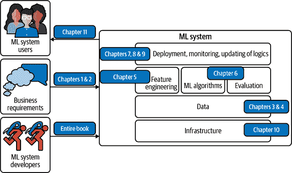
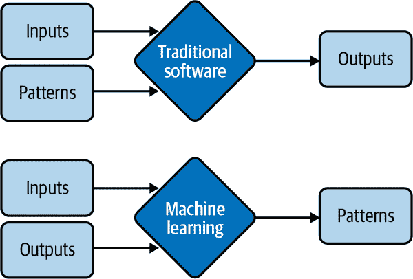
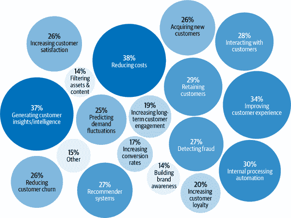
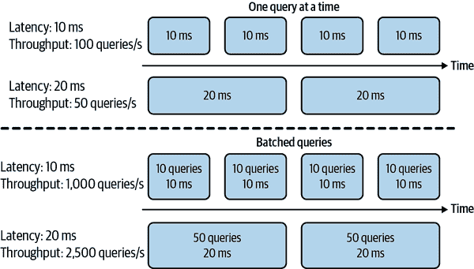
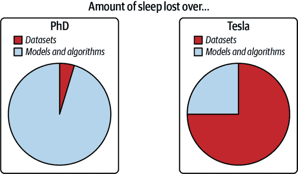

# 第一章：机器学习系统概述

2016 年 11 月，谷歌宣布已将其多语言神经机器翻译系统整合到 Google 翻译中，标志着深度人工神经网络在大规模生产中的首个成功案例。¹ 根据谷歌的说法，通过此更新，翻译质量的改善超过了前 10 年的总和。

深度学习的成功重新激发了对机器学习（ML）的广泛兴趣。此后，越来越多的公司转向 ML 来解决它们最具挑战性的问题。仅仅五年时间，ML 已经渗透到我们生活的几乎每一个方面：我们如何获取信息，如何沟通，如何工作，如何寻找爱情。ML 的传播速度如此之快，以至于很难想象没有它的生活。然而，在健康护理、交通运输、农业乃至于帮助我们理解宇宙等领域，还有许多 ML 等待被探索的用例。²

当许多人听到“机器学习系统”时，他们只考虑使用的 ML 算法，如逻辑回归或不同类型的神经网络。然而，算法只是 ML 系统在生产中的一小部分。系统还包括首次诞生 ML 项目的业务需求，用户和开发人员与系统交互的界面，数据堆栈，以及开发、监控和更新模型的逻辑，以及支持交付该逻辑的基础设施。图 1-1 展示了 ML 系统的不同组成部分，以及本书中将涵盖它们的章节。

# MLOps 与 ML 系统设计之间的关系

MLOps 中的 Ops 源自 DevOps，即开发与运维。将某物操作化意味着将其投入生产，包括部署、监控和维护。MLOps 是将 ML 引入生产的一组工具和最佳实践。

ML 系统设计采用系统方法进行 MLOps，这意味着它全面考虑 ML 系统，以确保所有组件及其利益相关者可以共同工作，以满足指定的目标和要求。

###### 图 1-1\. ML 系统的不同组成部分。“ML 算法”通常是人们谈论机器学习时所想到的，但它只是整个系统的一小部分。

有许多关于各种机器学习算法的优秀书籍。本书不详细涵盖任何特定算法，而是帮助读者全面理解整个机器学习系统。换句话说，本书的目标是为您提供一个框架，以开发对您的问题最有效的解决方案，无论最终使用哪种算法。随着新算法的不断开发，算法可能很快就会过时，但本书提出的框架应该仍然适用于新算法。

本书的第一章旨在为您提供将机器学习模型投入生产所需的概述。在讨论如何开发机器学习系统之前，问清楚何时以及何时不使用机器学习是很重要的。我们将通过一些流行的机器学习用例来说明这一点。

在介绍用例之后，我们将继续讨论部署机器学习系统的挑战，并通过比较在生产环境中的机器学习与研究中的机器学习以及传统软件来进行。如果您一直在开发应用型机器学习系统的前线，您可能已经对本章中的内容很熟悉。但是，如果您只在学术环境中有过机器学习的经验，本章将为您展示机器学习在现实世界中的真实情况，并为您的首个应用程序成功的设立基础。

# 何时使用机器学习

随着它在行业中的快速应用增长，机器学习已被证明是解决各种问题的强大工具。尽管内外部都充满了无数的兴奋和炒作，但机器学习并非解决所有问题的神奇工具。即使是机器学习可以解决的问题，机器学习解决方案也可能不是最佳解决方案。在开始机器学习项目之前，您可能想问问机器学习是否是必要的或者是否具有成本效益。³

要理解机器学习能做什么，让我们先来看看机器学习解决方案通常做什么：

> 机器学习是一种从现有数据中*学习* *复杂模式* 并利用这些模式对*未见数据*做出*预测*的方法。

我们将分析上述表述中的每一个斜体关键词组，以理解它对机器学习可以解决的问题的影响：

*1\. 学习*：系统具有学习能力

关系数据库不是机器学习系统，因为它没有学习能力。您可以明确地说明关系数据库中两列之间的关系，但它不太可能自己找出这两列之间的关系。

对于机器学习系统来学习，必须有东西可以让它学习。在大多数情况下，机器学习系统从数据中学习。在监督学习中，基于示例输入和输出对，机器学习系统学习如何为任意输入生成输出。例如，如果你想构建一个机器学习系统来预测 Airbnb 房源的租金价格，你需要提供一个数据集，其中每个输入是一个带有相关特征的房源（面积、房间数、社区、设施、该房源的评级等），而相关输出是该房源的租金价格。一旦学习完成，这个机器学习系统应该能够预测新房源的价格，根据其特征。

*2\. 复杂模式*：有一些需要学习的模式，并且它们是复杂的。

机器学习解决方案仅在存在需要学习的模式时才有用。理智的人不会投入资金建立一个机器学习系统来预测公正骰子的下一个结果，因为这些结果的生成方式没有模式。⁴ 然而，在股票定价方式中存在模式，因此公司已经投入数十亿美元建立机器学习系统来学习这些模式。

是否存在模式可能并不明显，或者如果存在模式，你的数据集或机器学习算法可能不足以捕捉它们。例如，埃隆·马斯克的推文如何影响加密货币价格可能存在一种模式。但是，在对其推文进行严格训练和评估之前，你不会知道。即使你的所有模型都无法合理预测加密货币的价格，也并不意味着没有模式。

考虑一个像 Airbnb 这样有大量房源的网站；每个房源都带有一个邮政编码。如果你想将房源按所在州进行分类，你不需要一个机器学习系统。因为模式很简单——每个邮政编码对应一个已知的州——你可以直接使用查找表。

租金价格与其所有特征之间的关系遵循一种更为复杂的模式，手动指定将会非常具有挑战性。机器学习对此是一个很好的解决方案。与其告诉你的系统如何从特征列表计算价格，不如提供价格和特征，让你的机器学习系统找出这种模式。机器学习解决方案与查找表解决方案以及一般传统软件解决方案的不同之处在图 1-2 中有所展示。因此，机器学习也被称为软件 2.0。⁵

ML 在复杂模式任务（如目标检测和语音识别）上取得了很大成功。对机器而言复杂的东西与对人类而言复杂的东西是不同的。对人类来说难的任务对机器来说可能很容易，例如将一个数的幂乘以 10。另一方面，对人类来说容易的任务对机器来说可能很难，比如判断一张图片中是否有猫。

###### 图 1-2\. ML 解决方案不需要手动指定模式来计算输出，而是从输入和输出中学习模式。

*3\. 现有数据*：数据已经可用，或者可以收集数据。

因为 ML 是从数据中学习的，所以必须有数据供其学习。想象一下建立一个模型来预测一个人应该每年缴纳多少税，这样的想法很有趣，但如果没有大量人群的税收和收入数据，这是不可能的。

在[零样本学习](https://oreil.ly/ZshSg)（有时称为零数据学习）的背景下，ML 系统有可能对一个任务进行良好的预测，而无需对该任务的数据进行训练。然而，这个 ML 系统之前是通过与考虑任务相关的其他任务的数据进行训练的。因此，即使该系统在处理当前任务时不需要数据来学习，它仍然需要数据来学习。

也可以在没有数据的情况下启动一个 ML 系统。例如，在持续学习的背景下，ML 模型可以在没有经过任何数据训练的情况下部署，但它们会从生产中的输入数据中学习。⁶ 然而，向用户提供训练不足的模型会带来一定的风险，比如客户体验不佳。

没有数据和持续学习的情况下，许多公司采用“假装直到成功”方法：推出一款由人类制定预测而非 ML 模型的产品，希望后续使用生成的数据来训练 ML 模型。

*4\. 预测*：这是一个预测性问题。

ML 模型进行预测，因此它们只能解决需要预测答案的问题。当你可以从大量廉价但近似的预测中获益时，ML 尤其具有吸引力。在英语中，“预测”意味着“估计未来的值”。例如，明天的天气会是什么样？今年超级碗谁会赢？用户下一部想看的电影是什么？

随着预测机器（例如 ML 模型）的效果越来越好，越来越多的问题被重新定义为预测问题。无论你问什么问题，你都可以将其表述为：“对于这个问题的答案是什么？”不管这个问题是关于未来、现在，甚至是过去的事情。

计算密集型问题是一类已经非常成功地重新定义为预测性问题的问题之一。与其计算过程的确切结果，这可能比机器学习更加计算昂贵和耗时，你可以将问题描述为：“这个过程的结果会是什么样？”并使用机器学习模型来近似它。输出将是确切输出的近似，但通常已经足够好了。你可以在图形渲染中看到很多这样的应用，比如图像去噪和屏幕空间阴影处理。⁷

*5\. 未见数据*：未见数据与训练数据共享模式

模型从现有数据中学习的模式只有在未见数据也共享这些模式时才有用。一个预测应用程序在 2020 年圣诞节是否会被下载的模型，如果是基于 2008 年的数据训练的话，表现可能不会很好，当时 App Store 上最受欢迎的应用是 Koi Pond。什么是 Koi Pond？恰恰如此。

从技术角度来看，这意味着你的未见数据和训练数据应该来自相似的分布。你可能会问：“如果数据是未见的，我们怎么知道它来自哪个分布？”我们不知道，但我们可以做出假设——比如我们可以假设明天用户的行为不会与今天的行为有太大的不同——并希望我们的假设成立。如果它们不成立，我们将得到表现不佳的模型，我们可能可以通过监控发现，如第八章所述的数据分布变化和监控，以及在生产中进行测试，如第九章所述的持续学习和在生产中进行测试。

由于大多数机器学习算法今天的学习方式，机器学习解决方案尤其在以下这些额外特征的问题上表现突出：

6\. 它是重复的

人类在少样本学习方面表现出色：你可以向孩子们展示几张猫的图片，他们大多数人在下次看到猫时都会认出猫。尽管在少样本学习研究中取得了令人兴奋的进展，但大多数机器学习算法仍然需要许多例子来学习模式。当任务重复时，每个模式会被多次重复，这使得机器更容易学习它。

7\. 错误预测的成本很低

除非你的机器学习模型始终百分之百地表现良好，这对任何有意义的任务来说是高度不可能的，否则你的模型会犯错。机器学习在错误预测成本低的情况下特别适用。例如，今天机器学习最大的用例之一是在推荐系统中，因为在推荐系统中，一个糟糕的推荐通常是可以原谅的——用户只是不会点击推荐。

如果一个预测错误可能会带来灾难性后果，那么如果正确预测的利益平均超过错误预测的成本，则机器学习可能仍然是一个合适的解决方案。开发自动驾驶汽车具有挑战性，因为算法错误可能导致死亡。然而，许多公司仍希望开发自动驾驶汽车，因为一旦自动驾驶汽车的安全性在统计上超过人类驾驶员，它们有可能拯救许多生命。

8\. 它是在规模上发生的

机器学习解决方案通常需要对数据、计算、基础设施和人才进行非平凡的前期投资，因此如果我们能够大量使用这些解决方案，这是有道理的。

“在规模上”对不同的任务意味着不同的事情，但总的来说，它意味着做出许多预测。例如，每年筛选数百万封电子邮件或预测每天将支持票据路由到哪些部门。

一个问题可能看起来是一个独立的预测，但实际上是一系列预测。例如，预测谁将赢得美国总统选举的模型似乎每四年只做一次预测，但实际上可能每小时甚至更频繁地做出预测，因为该预测必须不断更新以纳入新信息。

在规模上存在问题还意味着有大量数据可以收集，这对于训练机器学习模型是有用的。

9\. 模式不断变化

文化在变化，口味在变化，技术在变化。今天流行的东西明天可能就过时了。考虑电子邮件垃圾邮件分类的任务。今天，垃圾邮件的指标是尼日利亚的王子，但明天可能是一个绝望的越南作家。

如果您的问题涉及一个或多个不断变化的模式，硬编码的解决方案，如手写规则，可能会很快过时。了解问题的变化，以便相应更新手写规则可能会非常昂贵或不可能。由于机器学习是从数据中学习的，您可以使用新数据更新您的机器学习模型，而无需弄清楚数据如何发生变化。还可以设置系统以适应不断变化的数据分布，这是我们将在“持续学习”章节讨论的一种方法。

用例列表可以继续延伸，并且随着工业中机器学习的成熟应用，它将变得更加庞大。尽管机器学习可以很好地解决一些问题的子集，但它不能解决和/或不应该用于许多问题。今天的大多数机器学习算法在以下任何情况下都不应使用：

+   这是不道德的。我们将在“案例研究 I：自动评分器的偏见”章节讨论一个案例研究，其中使用机器学习算法可能被认为是不道德的。

+   更简单的解决方案能够达到预期效果。在第六章中，我们将介绍机器学习模型开发的四个阶段，其中第一个阶段应该是非机器学习解决方案。

+   它并非成本效益高。

然而，即使机器学习不能解决你的问题，也可能将问题分解为更小的组件，并使用机器学习解决其中的一些问题。例如，如果你无法建立一个能回答所有客户问题的聊天机器人，可能可以建立一个机器学习模型来预测是否有问题与经常问的问题之一相匹配。如果是，则引导客户查看答案。如果不是，则引导他们联系客服。

我也想警告不要因为一种新技术目前没有现有技术那样的成本效益而将其置之不理。大多数技术进步都是渐进的。一种技术现在可能效率不高，但随着更多投资的时间推移，可能会改善。如果你等待技术向整个行业证明其价值再入局，你可能会落后于竞争对手数年甚至数十年。

## 机器学习应用案例

机器学习在企业和消费者应用中的使用越来越广泛。自 2010 年中期以来，已经涌现出利用机器学习提供优越或以前不可能的服务的应用程序。

随着信息和服务的爆炸性增长，如果没有**机器学习**的帮助，无论是*搜索引擎*还是*推荐系统*，我们很难找到我们想要的东西。当你访问亚马逊或 Netflix 等网站时，系统会推荐最符合你口味的物品。如果你不喜欢推荐的任何物品，你可能会想要搜索特定的物品，而你的搜索结果很可能是由机器学习驱动的。

如果你有智能手机，机器学习可能已经在许多日常活动中为你提供帮助。在手机上打字变得更容易，这得益于*预测输入*，一个机器学习系统会为你提供下一步可能要说的内容的建议。在你的照片编辑应用中可能运行的机器学习系统会建议如何最佳地增强你的照片。你可能使用你的指纹或面部进行手机认证，这需要一个机器学习系统来预测指纹或面部是否与你的匹配。

吸引我进入这个领域的机器学习应用案例是*机器翻译*，自动将一种语言翻译为另一种语言。这有可能让来自不同文化的人们彼此交流，消除语言障碍。我的父母不会讲英语，但多亏了谷歌翻译，现在他们可以阅读我的文章并与不会讲越南语的朋友交流了。

ML 在我们的家中越来越普遍，例如智能个人助理如 Alexa 和 Google Assistant。智能安全摄像头可以在您的宠物离开家或有不速之客时通知您。我的一个朋友担心他独居的年迈母亲——如果她摔倒了，没人能及时帮助她起身——因此他依赖家庭健康监测系统，该系统可以预测是否有人在家中摔倒。

尽管消费者 ML 应用市场正在蓬勃发展，但大多数 ML 应用案例仍然在企业界。企业 ML 应用往往具有与消费者应用截然不同的需求和考虑因素。虽然也有很多例外，但大多数情况下，企业应用可能对精度要求更为严格，但在延迟要求方面更为宽容。例如，将语音识别系统的准确率从 95% 提高到 95.5% 对大多数消费者来说可能无法察觉，但将资源分配系统的效率提高 0.1% 可帮助像 Google 或通用汽车这样的公司节省数百万美元。同时，一秒钟的延迟可能会让消费者分心并打开其他内容，但企业用户对高延迟可能更加宽容。对于有意从 ML 应用构建公司的人来说，消费者应用可能更容易分发，但要实现盈利则要困难得多。然而，大多数企业用例除非您自己遇到过，否则不会显而易见。

根据 Algorithmia 2020 年企业机器学习调查，企业中的 ML 应用多种多样，既服务于内部用例（降低成本、生成客户洞察和智能、内部处理自动化），也服务于外部用例（改善客户体验、保留客户、与客户互动），如图 1-3 所示。⁸

###### 图 1-3\. 2020 年企业机器学习现状。来源：Algorithmia 的一幅图像改编

*欺诈检测* 是企业世界中 ML 最古老的应用之一。如果您的产品或服务涉及任何价值的交易，它都可能受到欺诈的影响。通过利用 ML 解决方案进行异常检测，您可以建立从历史欺诈交易中学习并预测未来交易是否属于欺诈行为的系统。

决定产品或服务的定价是可能是最难的商业决策之一；为什么不让 ML 为您做呢？*定价优化* 是在特定时间估算价格以最大化定义的目标函数的过程，例如公司的利润、收入或增长率。基于 ML 的定价优化在交易数量大且需求波动，消费者愿意支付动态价格的情况下最为合适，例如互联网广告、机票、住宿预订、共享乘车和活动。

经营业务时，能够预测客户需求非常重要，以便你可以准备预算、备货、分配资源和更新定价策略。例如，如果你经营一家杂货店，你希望备货足够，使顾客能够找到他们想要的东西，但你不希望库存过剩，因为如果过剩，你的食品可能会变质，导致损失。

获取新用户是昂贵的。截至 2019 年，应用程序获取进行应用内购买用户的平均成本为 86.61 美元。⁹ Lyft 的获取成本估计为每位乘客 158 美元。¹⁰ 对于企业客户来说，这个成本要高得多。投资者认为客户获取成本是创业公司的杀手。¹¹ 减少客户获取成本即使是小幅度的改善，也能大幅增加利润。可以通过更好地识别潜在客户、展示更精准的广告、在正确的时间提供折扣等方式来实现这一目标，所有这些都是机器学习适合处理的任务。

消费者一旦流失，你花费了大量资金吸引他们，这将是一件令人遗憾的事情。获取新用户的成本大约是保留现有用户的 5 到 25 倍。¹² *流失预测* 是预测特定客户停止使用你的产品或服务的时间，以便你可以采取适当措施挽留他们。流失预测不仅可以用于客户，还可以用于员工。

为了防止客户流失，通过及时解决他们的问题来保持他们的满意度非常重要。自动化支持票据分类可以帮助实现这一目标。以往，当客户打开支持票据或发送电子邮件时，需要先处理，然后传递到不同部门，直到到达能够处理它的人的收件箱。机器学习系统可以分析票据内容并预测应该送到何处，这可以缩短响应时间并提高客户满意度。它还可以用于分类内部 IT 票据。

企业中另一个流行的机器学习用例是品牌监控。品牌是企业的宝贵资产。¹³ 监控公众和客户对品牌的感知非常重要。你可能想知道它何时/何地/如何被提及，无论是明确（例如，当有人提到“Google”时）还是隐含（例如，当有人说“搜索巨头”时），以及与之相关的情绪。如果你的品牌提及突然出现负面情绪，你可能希望尽快解决。情感分析是典型的机器学习任务。

近期引起了很大兴奋的一组机器学习用例是在健康护理领域。有些机器学习系统可以检测皮肤癌和诊断糖尿病。尽管许多健康护理应用面向消费者，但由于其对准确性和隐私的严格要求，通常通过医院等健康护理提供者提供，或者用于协助医生提供诊断。

# 理解机器学习系统

理解机器学习系统将有助于设计和开发它们。在本节中，我们将探讨机器学习系统如何与研究中的机器学习（或通常在学校中教授的机器学习）以及传统软件有所不同，从而推动了本书的需求。

## 研究中与生产中的机器学习

由于工业中的机器学习应用还相对较新，大多数具有机器学习专业知识的人都是通过学术途径获得的：参加课程、进行研究、阅读学术论文。如果您的背景符合这种描述，了解如何在实际环境中部署机器学习系统的挑战，以及应对这些挑战的解决方案可能是一个陡峭的学习曲线。在生产中的机器学习与研究中的机器学习有很大不同。表 1-1 显示了这些主要区别中的五个。

表 1-1\. 研究中的机器学习与生产中的机器学习的主要区别

|   | 研究 | 生产 |
| --- | --- | --- |
| 要求 | 基准数据集上的最先进模型性能 | 不同的利益相关者有不同的要求 |
| 计算优先级 | 快速训练，高吞吐量 | 快速推理，低延迟 |
| 数据 | 静态^(a) | 不断变化的 |
| 公平性 | 通常不是重点 | 必须考虑 |
| 可解释性 | 通常不是重点 | 必须考虑 |
| ^(a) 研究的一个子领域专注于持续学习：开发能够处理不断变化的数据分布的模型。我们将在第九章中介绍持续学习。 |

### 不同的利益相关者和需求

参与研究和排行榜项目的人通常会对一个共同的目标进行调整。最常见的目标是模型性能：开发一个能在基准数据集上达到最先进结果的模型。为了在性能上稍微提升，研究人员经常会采用使模型过于复杂而无法实用的技术。

许多利益相关者参与将机器学习系统投入生产。每个利益相关者都有自己的要求。有不同的、经常相互冲突的要求可能会使得设计、开发和选择能够满足所有要求的机器学习模型变得困难。

考虑一个移动应用程序，为用户推荐餐馆。该应用通过每笔订单向餐馆收取 10% 的服务费来赚钱。这意味着昂贵的订单比便宜的订单为应用带来更多的收入。该项目涉及到机器学习工程师、销售人员、产品经理、基础设施工程师和一位经理：

机器学习工程师

希望有一个推荐用户最可能下单的餐馆的模型，并且他们相信可以通过使用更复杂的模型和更多的数据来实现这一目标。

销售团队

希望有一个推荐昂贵餐馆的模型，因为这些餐馆带来更多的服务费。

产品团队

注意到每次延迟增加都会导致服务订单量的下降，因此他们希望有一个能在少于 100 毫秒内返回推荐餐馆的模型。

ML 平台团队

随着流量增长，这个团队因为现有系统扩展问题在半夜被唤醒，因此他们希望暂停模型更新，优先改进机器学习平台。

经理

希望最大化利润率，可能的一种方法是放弃机器学习团队。¹⁴

“推荐用户最有可能点击的餐馆”和“推荐给应用带来最多收入的餐馆”是两个不同的目标，在 “解耦目标” 部分中，我们将讨论如何开发一个满足不同目标的机器学习系统。剧透：我们将为每个目标开发一个模型，并结合它们的预测结果。

现在让我们假设有两个不同的模型。模型 A 是推荐用户最有可能点击的餐馆的模型，模型 B 是推荐给应用带来最多收入的餐馆的模型。A 和 B 可能是非常不同的模型。应该将哪个模型部署给用户？为了使决策更加困难，A 和 B 都不能满足产品团队提出的要求：它们无法在少于 100 毫秒内返回餐馆推荐。

在开发机器学习项目时，机器学习工程师理解所有利益相关者的需求及其严格程度非常重要。例如，如果能够在 100 毫秒内返回推荐餐馆是一个必须要求——公司发现如果您的模型需要超过 100 毫秒来推荐餐馆，将有 10% 的用户会失去耐心并关闭应用——那么模型 A 和模型 B 都无法胜任。然而，如果这只是一个不错的要求，您可能仍然需要考虑模型 A 或模型 B。

生产对研究的不同要求之一是成功的研究项目可能并不总是用于生产。例如，集成是一种在许多机器学习竞赛（包括著名的 100 万美元 Netflix 奖）的获胜者中流行的技术，但在生产中并不广泛使用。集成结合了“多种学习算法，以获得比单独任何学习算法更好的预测性能。”¹⁵ 尽管它可以使您的机器学习系统稍微提升性能，但集成往往会使系统过于复杂，难以在生产中使用，例如，预测速度较慢或结果解释较困难。我们将在“集成”章节中进一步讨论集成。

对于许多任务，性能的微小改进可能会导致收入大幅提升或成本节约。例如，产品推荐系统的点击率提升 0.2%可能会使电子商务网站的收入增加数百万美元。然而，对于许多任务来说，微小的改进可能用户察觉不到。对于第二类任务，如果一个简单模型能够做出合理的预测，复杂模型必须有显著更好的表现来证明其复杂性是合理的。

### 计算优先级

在设计机器学习系统时，没有部署过机器学习系统的人经常犯的错误是过于专注于模型开发部分，而忽视了模型部署和维护部分。

在模型开发过程中，您可能会训练多个不同的模型，每个模型对训练数据进行多次遍历。然后，每个训练好的模型会对验证数据进行一次预测以报告分数。验证数据通常比训练数据要小得多。在模型开发阶段，训练是瓶颈。然而，一旦模型部署完成，它的工作就是生成预测，因此推断会成为瓶颈。研究通常优先考虑快速训练，而生产通常优先考虑快速推断。

其一个推论是，研究优先考虑高吞吐量，而生产则优先考虑低延迟。如果需要刷新记忆，延迟是指从接收查询到返回结果所需的时间。吞吐量是指在特定时间段内处理多少查询。

# 术语冲突

有些书籍区分延迟和响应时间。根据马丁·克莱普曼在他的书《设计数据密集型应用》中的说法，“响应时间是客户看到的时间：除了处理请求的实际时间（服务时间）外，还包括网络延迟和排队延迟。延迟是请求等待处理的持续时间——在此期间它处于潜伏状态，等待服务。”¹⁹

在本书中，为了简化讨论并与机器学习社区使用的术语保持一致，我们使用延迟来指代响应时间，因此请求的延迟测量从发送请求到接收响应的时间。

例如，Google 翻译的平均延迟是用户点击翻译按钮到显示翻译结果的平均时间，而吞吐量则是处理和提供的查询数量。

如果你的系统始终一次处理一个查询，更高的延迟意味着更低的吞吐量。如果平均延迟为 10 毫秒，这意味着处理一个查询需要 10 毫秒，吞吐量为每秒处理 100 个查询。如果平均延迟为 100 毫秒，吞吐量为每秒处理 10 个查询。

然而，由于大多数现代分布式系统会批量处理查询以并行处理，*更高的延迟也可能意味着更高的吞吐量*。如果每次处理 10 个查询，每个批次运行时间为 10 毫秒，则平均延迟仍为 10 毫秒，但吞吐量现在提高了 10 倍——每秒 1,000 个查询。如果每次处理 50 个查询，每个批次运行时间为 20 毫秒，则平均延迟现在为 20 毫秒，吞吐量为每秒 2,500 个查询。延迟和吞吐量都得到了提高！处理逐个查询和批量处理查询时的延迟和吞吐量权衡差异如图 1-4 所示。

###### 图 1-4\. 当逐个处理查询时，更高的延迟意味着更低的吞吐量。然而，当批量处理查询时，更高的延迟也可能意味着更高的吞吐量。

如果你想要批量处理在线查询，情况就更加复杂了。批处理要求系统在足够的查询到达以前等待，然后才能处理，这会进一步增加延迟。

在研究中，你更关心每秒能处理多少样本（吞吐量），而不是每个样本处理需要多长时间（延迟）。你愿意增加延迟以提高吞吐量，例如采用积极的批处理方式。

然而，一旦你将模型部署到真实世界中，延迟就非常重要了。2017 年，Akamai 的一项研究发现，100 毫秒的延迟可以使转化率下降 7%。²⁰ 2019 年，Booking.com 发现，延迟增加约 30%，转化率会降低约 0.5%——“这对我们的业务来说是一个相关成本。”²¹ 2016 年，Google 发现，超过一半的移动用户如果页面加载时间超过三秒，就会离开页面。²² 如今的用户更加缺乏耐心。

要减少生产中的延迟，你可能需要减少同时处理的查询数量。如果你的硬件能够同时处理更多的查询，而现在却使用它来处理更少的查询，这意味着你在低效地使用你的硬件，增加了每个查询的处理成本。

在考虑延迟时，重要的是要记住延迟不是一个单一的数字，而是一个分布。使用像平均延迟（算术平均值）这样的单一数字来简化这个分布是很诱人的，但这个数字可能会误导。想象一下，你有 10 个请求，它们的延迟分别为 100 毫秒、102 毫秒、100 毫秒、100 毫秒、99 毫秒、104 毫秒、110 毫秒、90 毫秒、3,000 毫秒、95 毫秒。平均延迟为 390 毫秒，这使得你的系统看起来比实际慢。可能发生的情况是，存在一个网络错误，导致一个请求比其他请求慢得多，你应该调查这个有问题的请求。

通常最好考虑百分位数，因为它们告诉你有关某个百分比请求的信息。最常见的百分位数是第 50 百分位数，缩写为 p50。它也称为中位数。如果中位数是 100 毫秒，那么一半的请求耗时超过 100 毫秒，另一半的请求耗时少于 100 毫秒。

更高的百分位数还帮助你发现异常值，这可能是某些问题的症状。通常你需要关注的百分位数是 p90、p95 和 p99。前 10 个请求的第 90 百分位数（p90）为 3,000 毫秒，这是一个异常值。

更高的百分位数是重要的，因为即使它们只占你用户的一小部分，有时它们可能是最重要的用户。例如，在亚马逊网站上，最慢请求的客户通常是那些在其账户上有大量数据的客户，因为他们已经进行了多次购买——也就是说，他们是最有价值的客户。²³

使用高百分位数来指定系统的性能要求是一种常见做法；例如，产品经理可能会规定系统的第 90 百分位数或第 99.9 百分位数的延迟必须低于某个数值。

### 数据

在研究阶段，你处理的数据集通常是干净且格式良好的，这使你能够专注于开发模型。它们本质上是静态的，因此社区可以用它们来评估新的架构和技术。这意味着许多人可能已经使用和讨论了相同的数据集，数据集的怪异之处是众所周知的。你甚至可能会找到开源脚本来直接处理和提供数据给你的模型。

在生产中，如果数据可用，它会更加混乱。它可能会有噪声，可能是非结构化的，不断变化的。它可能存在偏见，而你可能不知道它是如何偏见的。如果有标签，它们可能稀疏、不平衡或不正确。项目或业务要求的变化可能需要更新一些或所有现有标签。如果你处理用户数据，你还需要担心隐私和监管问题。我们将在章节“案例研究二：‘匿名’数据的危险”中讨论一个案例研究，在这个案例中用户数据被不适当地处理。

在研究中，你主要处理历史数据，例如已经存在并存储在某处的数据。在生产中，很可能你也需要处理由用户、系统和第三方数据不断生成的数据。

图 1-5 参考了特斯拉人工智能主管安德烈·卡帕斯的一张精彩图表，该图展示了他在博士期间与在特斯拉任职期间遇到的数据问题的对比。

###### 图 1-5。研究中的数据与生产中的数据。来源：改编自安德烈·卡帕斯的一幅图像²⁴

### 公平性

在研究阶段，模型尚未用于人员，所以研究人员很容易将公平性推迟为事后事项：“我们先尝试获得最先进的技术，等到生产阶段再考虑公平性。”当进入生产阶段时，已经为时过晚。如果你优化模型以获得更高的准确性或更低的延迟，你可以证明你的模型超越了最先进技术。但是，截至撰写本书时，公平性指标尚无对应的最先进技术。

你或者你生活中的某人可能已经是数学算法偏见的受害者，却并不自知。由于机器学习算法可能因为你的邮政编码而拒绝你的贷款申请，这反映了对某人社会经济背景偏见的偏见。你的简历可能因为雇主使用的排名系统偏重你姓名的拼写而排名较低。你的抵押贷款可能会因为部分依赖信用评分，这有利于富人而损害穷人而获得更高的利率。在现实世界中，机器学习偏见的其他例子包括预测性执法算法、潜在雇主进行的人格测试以及大学排名。

在 2019 年，“伯克利研究人员发现，从 2008 年到 2015 年，面对面和在线借款人共同拒绝了 130 万名有信用的黑人和拉丁裔申请人。”当研究人员“使用被拒申请的收入和信用评分，但删除了种族识别符时，抵押贷款申请被接受。”²⁵ 更令人愤慨的例子，请参阅凯西·奥尼尔的《*数学毁灭之武器*》。²⁶

机器学习算法不是预测未来，而是编码过去，因此会延续数据中的偏见等问题。当机器学习算法大规模部署时，它们可以在大规模范围内歧视人群。如果一个人类操作员可能一次只对少数个体做出全面的判断，机器学习算法可以在几秒钟内对数百万人做出全面的判断。这可能特别伤害少数群体的成员，因为对他们的误分类可能只对模型整体性能指标产生较小的影响。

如果算法已经可以在 98%的人群上做出正确的预测，而在其他 2%上改进预测将带来多倍的成本，一些公司可能会不幸选择不这样做。在 2019 年的麦肯锡公司研究中，只有 13%的受访大公司表示他们正在采取措施减少公平和公正风险，如算法偏见和歧视。²⁷ 然而，这种情况正在迅速改变。我们将在第十一章中讨论公平性和其他责任人工智能的方面。

### **可解释性**

在 2020 年初，图灵奖得主 Geoffrey Hinton 教授提出了一个备受争议的问题，即解释性在机器学习系统中的重要性：“假设你患有癌症，你必须在一个不能解释其工作原理但治愈率为 90%的黑匣子人工智能外科医生和治愈率为 80%的人类外科医生之间做出选择，你希望这种 AI 外科医生被禁止吗？”²⁸

几周后，当我向一群 30 位公共非技术公司的技术高管提出这个问题时，只有一半的人希望能让高效但无法解释的 AI 外科医生为他们进行手术。另一半希望是人类外科医生。

虽然大多数人在使用微波炉时不必了解其工作原理，但对于人工智能，特别是如果该人工智能做出对他们生活重要的决策，很多人仍然感到不安。

由于大多数机器学习研究仍然只在单一目标——模型性能上进行评估，研究人员没有动力去研究模型的可解释性。然而，对于工业界大多数机器学习应用案例而言，解释性不仅是可选的，而是一个必要条件。

首先，对于用户来说，包括业务领导和最终用户，解释性对于理解为何做出某个决策至关重要，这样他们可以信任模型并发现前述潜在偏见的存在。²⁹ 其次，对于开发人员来说，能够调试和改进模型也非常重要。

仅因为解释性是一个要求，并不意味着每个人都在实施。截至 2019 年，只有 19%的大公司正在努力提高其算法的可解释性。³⁰

### **讨论**

有人可能会认为，仅了解机器学习的学术方面是可以的，因为研究领域有很多工作。第一部分——仅了解机器学习的学术方面是可以的——是正确的。而第二部分是错误的。

尽管追求纯粹的研究很重要，但大多数公司无法负担，除非它能带来短期的商业应用。现在研究界采取了“更大，更好”的方法，尤其如此。往往，新模型需要大量数据和数千万美元的计算成本。

随着机器学习研究和现成模型变得更加可访问，越来越多的人和组织将希望找到它们的应用程序，这增加了对生产中机器学习的需求。

绝大多数与机器学习相关的工作将会，或者已经是，在将机器学习投入生产中。

## 机器学习系统与传统软件

由于机器学习是软件工程的一部分，并且软件在生产中已经成功使用了半个多世纪，有些人可能会想知道为什么我们不简单地采用经过验证的软件工程最佳实践，并将它们应用到机器学习中。

这是一个很好的想法。事实上，如果机器学习专家也是更好的软件工程师，机器学习生产领域将会更好。许多传统的软件工程工具可以用来开发和部署机器学习应用程序。

然而，许多挑战是机器学习应用程序独有的，并且需要它们自己的工具。在软件工程中，有一个基本的假设，即代码和数据是分开的。事实上，在软件工程中，我们希望尽可能地保持事物模块化和分离（参见维基百科关于[关注点分离](https://oreil.ly/kH67y)的页面）。

相反，机器学习系统一部分是代码，一部分是数据，还有一部分是从这两者创建的工件。过去十年的趋势显示，利用最好的数据开发的应用程序胜出。大多数公司不再专注于改进机器学习算法，而是专注于改进它们的数据。因为数据可以迅速变化，机器学习应用程序需要适应不断变化的环境，这可能需要更快的开发和部署周期。

在传统的软件工程中，你只需要关注测试和版本控制你的代码。而在机器学习中，我们还必须测试和版本控制我们的数据，这是困难的部分。如何对大型数据集进行版本控制？如何知道数据样本对你的系统是好还是坏？不是所有的数据样本都是平等的——有些对你的模型比其他更有价值。例如，如果你的模型已经在一百万个正常肺部扫描中进行了训练，而只有一千个癌症肺部扫描，那么癌症肺部扫描比正常肺部扫描更有价值。不加区分地接受所有可用数据可能会损害你的模型性能，甚至使其容易受到数据毒化攻击。³¹

ML 模型的大小是另一个挑战。截至 2022 年，ML 模型通常具有数亿，甚至数十亿的参数，这需要大量的随机存取内存（RAM）来加载它们到内存中。几年后，十亿个参数可能会显得过时，就像“你能相信那台将人送上月球的计算机只有 32MB 的 RAM 吗？”

然而，目前将这些大型模型投入生产，尤其是在边缘设备上³²，是一个巨大的工程挑战。然后问题来了，如何确保这些模型运行速度足够快以便有用。如果自动完成模型建议下一个字符的时间比你输入该字符的时间还长，那么它就毫无用处。

在生产中监控和调试这些模型也是非常不简单的。随着 ML 模型变得越来越复杂，再加上无法深入了解它们工作的可见性，很难找出问题出在哪里，或者在问题出现时快速获得警告。

好消息是，这些工程挑战正在以惊人的速度得到解决。回顾 2018 年，当双向编码器表示来自变压器（BERT）的论文首次发表时，人们讨论的是 BERT 太大、太复杂，以及太慢，以至于无法实用。预训练的大型 BERT 模型有 3.4 亿个参数，大小为 1.35 GB³³。快进两年，BERT 及其变种已经几乎在每一次英文搜索中被谷歌使用³⁴。

# 概要

本开章旨在让读者了解将 ML 引入现实世界所需付出的努力。我们从今天生产中 ML 的广泛应用案例开始介绍。虽然大多数人熟悉面向消费者的 ML 应用，但大多数 ML 用例是为企业设计的。我们还讨论了 ML 解决方案何时合适。尽管 ML 能够很好地解决许多问题，但并不是所有问题都适合 ML 解决。然而，对于 ML 无法解决的问题，ML 可能仍然是解决方案的一部分。

本章还突出了研究中 ML 与生产中 ML 之间的差异。这些差异包括利益相关者的参与程度、计算优先级、使用数据的属性、公平性问题的严重性以及解释性的要求。这一部分对于从学术界进入 ML 生产领域的人士尤为有用。我们还讨论了 ML 系统与传统软件系统的区别，这也是本书编写的动机所在。

机器学习系统是复杂的，由许多不同的组件组成。在生产中使用机器学习系统的数据科学家和机器学习工程师可能会发现，仅关注机器学习算法部分远远不够。了解系统的其他方面至关重要，包括数据堆栈、部署、监控、维护、基础设施等。本书采用系统方法来开发机器学习系统，这意味着我们将全面考虑系统的所有组成部分，而不仅仅是关注机器学习算法。我们将在下一章节详细介绍这种全面方法的含义。

¹ Mike Schuster, Melvin Johnson 和 Nikhil Thorat，“使用 Google 的多语言神经机器翻译系统进行零-shot 翻译”，*Google AI Blog*，2016 年 11 月 22 日，[*https://oreil.ly/2R1CB*](https://oreil.ly/2R1CB)。

² Larry Hardesty，“成像黑洞的方法”，*MIT News*，2016 年 6 月 6 日，[*https://oreil.ly/HpL2F*](https://oreil.ly/HpL2F)。

³ 我没有询问机器学习是否足够，因为答案总是是否定的。

⁴ 模式与分布不同。我们知道公正骰子的结果分布，但在生成结果的方式中没有模式。

⁵ Andrej Karpathy，“软件 2.0”，*Medium*，2017 年 11 月 11 日，[*https://oreil.ly/yHZrE*](https://oreil.ly/yHZrE)。

⁶ 我们将在第九章讨论在线学习。

⁷ Steke Bako, Thijs Vogels, Brian McWilliams, Mark Meyer, Jan Novák, Alex Harvill, Pradeep Sen, Tony Derose 和 Fabrice Rousselle，“用于去噪蒙特卡罗渲染的核预测卷积网络”，*ACM Transactions on Graphics*，2017 年，第 36 卷，第 4 期：97，[*https://oreil.ly/EeI3j*](https://oreil.ly/EeI3j)；Oliver Nalbach, Elena Arabadzhiyska, Dushyant Mehta, Hans-Peter Seidel 和 Tobias Ritschel，“深度着色：用于屏幕空间着色的卷积神经网络”，*arXiv*，2016 年，[*https://oreil.ly/dSspz*](https://oreil.ly/dSspz)。

⁸ “2020 年企业机器学习现状”，*Algorithmia*，2020 年，[*https://oreil.ly/wKMZB*](https://oreil.ly/wKMZB)。

⁹ “2018 年 9 月至 2019 年 8 月全球平均移动应用用户获取成本，按用户操作和操作系统分”，*Statista*，2019 年，[*https://oreil.ly/2pTCH*](https://oreil.ly/2pTCH)。

¹⁰ Jeff Henriksen，“估值 Lyft 需要深入研究单位经济学”，*Forbes*，2019 年 5 月 17 日，[*https://oreil.ly/VeSt4*](https://oreil.ly/VeSt4)。

¹¹ David Skok，“初创公司杀手：客户获取成本”，*For Entrepreneurs*，2018 年，[*https://oreil.ly/L3tQ7*](https://oreil.ly/L3tQ7)。

¹² Amy Gallo，“保持正确顾客的价值”，*哈佛商业评论*，2014 年 10 月 29 日，[*https://oreil.ly/OlNkl*](https://oreil.ly/OlNkl)。

¹³ Marty Swant，“全球最有价值品牌”，*福布斯*，2020 年，[*https://oreil.ly/4uS5i*](https://oreil.ly/4uS5i)。

¹⁴ 机器学习和数据科学团队成为公司大规模裁员的首批人员并不罕见，正如在[IBM](https://oreil.ly/AfUB5)，[Uber](https://oreil.ly/t0QpY)，[Airbnb](https://oreil.ly/q4M4E)等公司报道的那样。详见 Sejuti Das 的分析文章“危机中数据科学家也容易被裁员”，*Analytics India Magazine*，2020 年 5 月 21 日，[*https://oreil.ly/jobmz*](https://oreil.ly/jobmz)。

¹⁵ 维基百科，见“集成学习”，[*https://oreil.ly/5qkgp*](https://oreil.ly/5qkgp)。

¹⁶ Julia Evans，“机器学习不只是 Kaggle 竞赛”，2014 年，[*https://oreil.ly/p8mZq*](https://oreil.ly/p8mZq)。

¹⁷ Lauren Oakden-Rayner，“AI 竞赛不会产生有用的模型”，2019 年 9 月 19 日，[*https://oreil.ly/X6RlT*](https://oreil.ly/X6RlT)。

¹⁸ Kawin Ethayarajh 和 Dan Jurafsky，“效用在用户眼中：对自然语言处理排行榜的批判”，EMNLP，2020 年，[*https://oreil.ly/4Ud8P*](https://oreil.ly/4Ud8P)。

¹⁹ Martin Kleppmann，《设计数据密集型应用》（加利福尼亚州塞巴斯托波尔：O’Reilly，2017 年），[*https://oreil.ly/8dzD2*](https://oreil.ly/8dzD2)。

²⁰ Akamai Technologies，《Akamai 在线零售业绩报告：毫秒至关重要》，2017 年 4 月 19 日，[*https://oreil.ly/bEtRu*](https://oreil.ly/bEtRu)。

²¹ Lucas Bernardi，Themis Mavridis 和 Pablo Estevez，“Booking.com 的 150 个成功机器学习模型：KDD ’19 会议上的 6 个经验教训”，2019 年 8 月 4-8 日，阿拉斯加州安克雷奇，[*https://oreil.ly/G5QNA*](https://oreil.ly/G5QNA)。

²² “消费者洞察”，Think with Google，[*https://oreil.ly/JCp6Z*](https://oreil.ly/JCp6Z)。

²³ Kleppmann，《设计数据密集型应用》，[*https://oreil.ly/8dzD2*](https://oreil.ly/8dzD2)。

²⁴ Andrej Karpathy，“构建软件 2.0 堆栈”，Spark+AI Summit 2018，视频，17:54，[*https://oreil.ly/Z21Oz*](https://oreil.ly/Z21Oz)。

²⁵ Khristopher J. Brooks，“研究发现，家庭贷款成本中的种族差异使少数民族损失数百万美元”，*CBS 新闻*，2019 年 11 月 15 日，[*https://oreil.ly/UiHUB*](https://oreil.ly/UiHUB)。

²⁶ Cathy O’Neil，《数学毁灭的武器》（纽约：Crown Books，2016 年）。

²⁷ 斯坦福大学人类中心人工智能（HAI），*2019 AI 指数报告*，2019 年，[*https://oreil.ly/xs8mG*](https://oreil.ly/xs8mG)。

²⁸ Geoffrey Hinton（@geoffreyhinton）在 2020 年 2 月 20 日的推特，[*https://oreil.ly/KdfD8*](https://oreil.ly/KdfD8)。

²⁹ 对于某些国家的某些使用案例，用户有“解释权”：即对算法输出给出解释的权利。

³⁰ Stanford HAI, *The 2019 AI Index Report*.

³¹ Xinyun Chen, Chang Liu, Bo Li, Kimberly Lu, and Dawn Song, “Targeted Backdoor Attacks on Deep Learning Systems Using Data Poisoning,” *arXiv*, December 15, 2017, [*https://oreil.ly/OkAjb*](https://oreil.ly/OkAjb).

³² 我们将在第七章中涵盖边缘设备。

³³ Jacob Devlin, Ming-Wei Chang, Kenton Lee, and Kristina Toutanova, “BERT: Pre-training of Deep Bidirectional Transformers for Language Understanding,” *arXiv*, October 11, 2018, [*https://oreil.ly/TG3ZW*](https://oreil.ly/TG3ZW).

³⁴ Google Search On, 2020, [*https://oreil.ly/M7YjM*](https://oreil.ly/M7YjM).
