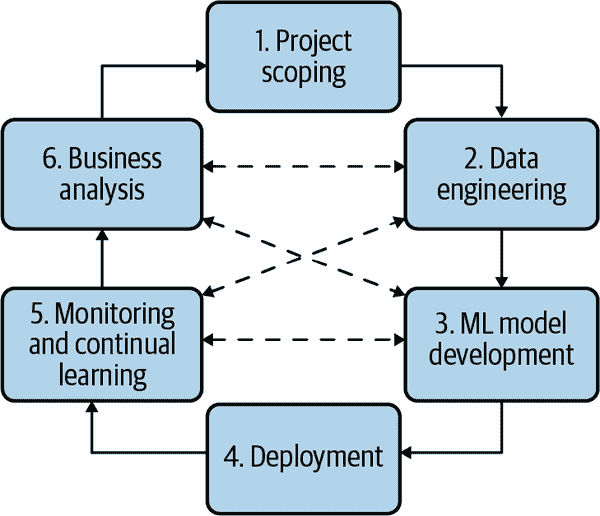

# 第二章：机器学习系统设计介绍

现在我们已经浏览了现实世界中机器学习系统的概述，我们可以进入实际设计机器学习系统的有趣部分。再次强调，机器学习系统设计采用了一种系统化的方法，这意味着我们将全面考虑机器学习系统，以确保所有组成部分——业务需求、数据堆栈、基础设施、部署、监控等等——及其利益相关者能够共同工作，以满足指定的目标和要求。

我们将从讨论目标开始这一章节。在我们开发机器学习系统之前，我们必须理解为什么需要这个系统。如果这个系统是为了业务而建立的，那么它必须以业务目标为驱动，这些目标将需要转化为机器学习目标，以指导机器学习模型的开发。

一旦大家对我们的机器学习系统的目标达成共识，我们将需要制定一些需求来指导该系统的开发。在本书中，我们将考虑四个要求：可靠性、可扩展性、可维护性和可适应性。然后我们将介绍用于设计系统以满足这些要求的迭代过程。

你可能会想：有了这么多目标、要求和流程，我可以开始构建我的机器学习模型了吗？还不太快！在使用机器学习算法解决问题之前，您首先需要将问题框定为机器学习可以解决的任务。我们将继续讨论如何框定您的机器学习问题。根据您如何框定问题，您的工作难度可能会发生显著变化。

由于机器学习是一种数据驱动的方法，如果一本讨论机器学习系统设计的书籍未能讨论数据在机器学习系统中的重要性，那么将是遗漏的。本章的最后部分涉及近年来占据了大量机器学习文献的辩论：什么更重要——数据还是智能算法？

让我们开始吧！

# 业务与机器学习目标

我们首先需要考虑提议的机器学习项目的目标。在开展机器学习项目时，数据科学家们倾向于关注机器学习目标：他们可以衡量其机器学习模型性能的指标，例如准确率、F1 分数、推断延迟等等。他们对将模型的准确率从 94%提高到 94.2%感到兴奋，并可能投入大量资源——数据、计算和工程时间来实现这一目标。

但事实是：大多数公司不关心花哨的机器学习指标。他们不在乎将模型的准确性从 94%提高到 94.2%，除非这些变化影响了某些业务指标。我在许多短命机器学习项目中看到的一个模式是，数据科学家过于专注于突破机器学习指标，而忽视了业务指标。然而，他们的管理者只关心业务指标，如果看不到机器学习项目如何帮助推动他们的业务指标，就会过早终止项目（并可能解雇涉及的数据科学团队）。¹

那么公司关心哪些指标呢？尽管大多数公司想让你相信其他理由，但根据诺贝尔奖获得者经济学家米尔顿·弗里德曼的说法，企业的唯一目的是为股东最大化利润。²

因此，商业项目的最终目标是直接或间接地增加利润：直接的方式如增加销售（转化率）和降低成本；间接的方式如提高客户满意度和增加在网站上的停留时间。

为了在商业组织内成功实施一个机器学习项目，将机器学习系统的表现与整体业务表现紧密联系起来至关重要。新的机器学习系统应该影响哪些业务绩效指标，例如广告收入的数量，月活跃用户的数量？

想象一下，你在一家关注购买转化率的电子商务网站工作，你希望将推荐系统从批量预测转移到在线预测。³ 你可能会认为在线预测将使得当前用户更相关的推荐变得可能，从而提高购买转化率。你甚至可以进行实验，以显示在线预测可以提高你的推荐系统预测准确性约*X*%，而在你的网站上，推荐系统预测准确性的每一次百分比增加都导致购买转化率的某种增加。

预测广告点击率和欺诈检测成为当今机器学习最受欢迎的应用案例之一的原因之一是，可以轻松将机器学习模型的表现映射到业务指标：点击率的每次增加都会导致实际广告收入的增加，每次阻止欺诈交易都会导致实际节省的资金。

许多公司创建自己的指标，将业务指标映射到机器学习指标上。例如，Netflix 使用“接受率”来衡量推荐系统的性能：优质播放量除以用户看到的推荐数目。[⁴] 接受率越高，推荐系统越好。Netflix 还将推荐系统的接受率与总流媒体小时数和订阅取消率等其他业务指标联系在一起。他们发现，更高的接受率也导致了更高的总流媒体小时数和较低的订阅取消率。[⁵]

机器学习项目对业务目标的影响可能很难理解。例如，一个为客户提供更个性化解决方案的机器学习模型可能会使客户更满意，进而使他们在你的服务上花更多钱。同样的机器学习模型也可以更快地解决他们的问题，从而使他们在你的服务上花费更少的钱。

要获得关于机器学习指标如何影响业务指标的确切答案，通常需要进行实验。许多公司通过 A/B 测试等实验来进行这些实验，并选择导致更好业务指标的模型，而不管这些模型是否具有更好的机器学习指标。

然而，即使进行了严格的实验，也可能不足以理解机器学习模型的输出与业务指标之间的关系。想象一下，你为一家检测和阻止安全威胁的网络安全公司工作，机器学习只是其复杂流程的一个组成部分。机器学习模型用于检测流量模式中的异常。然后，这些异常经过一套逻辑设置（例如一系列 if-else 语句）分类，以确定它们是否构成潜在威胁。安全专家会审核这些潜在威胁，以确定它们是否真正构成威胁。如果这一过程未能阻止威胁，可能无法确定机器学习组件是否与此有关。

许多公司喜欢说他们在系统中使用机器学习，因为“仅仅是 AI 驱动”就可以帮助他们吸引客户，而不管这部分 AI 是否真正有用。[⁶]

在通过业务视角评估机器学习解决方案时，对预期收益保持现实态度非常重要。由于媒体和有利于机器学习采纳的从业者们的炒作，围绕机器学习存在大量炒作，一些公司可能认为机器学习能够神奇般地在一夜之间改变他们的业务。

神奇地：可能。一夜之间：不可能。

许多公司已经看到了机器学习的回报。例如，ML 已经帮助谷歌改善搜索质量、以更高的价格出售广告、提高翻译质量以及构建更好的安卓应用。但这些收益并非一夜之间实现的。谷歌已经在机器学习领域投资了几十年。

机器学习投资的回报很大程度上取决于采用成熟度阶段。你采用机器学习的时间越长，你的流水线效率就会越高，开发周期就会越快，你需要的工程时间就会越少，云账单也会越低，这些都会导致更高的回报。根据 Algorithmia 在 2020 年进行的调查，对于那些在机器学习采纳方面更为成熟的公司（已经将模型投入生产超过五年），几乎有 75%的公司能够在 30 天内部署一个模型。而那些刚开始启动他们的机器学习流水线的公司中，60%的公司需要超过 30 天来部署一个模型（参见图 2-1）。⁷


###### 图 2-1。公司将模型投入生产所需的时间与其使用机器学习的时间成正比。来源：Algorithmia 图像经过调整

# 机器学习系统的要求

我们不能说我们已经成功地构建了一个机器学习系统，而不知道这个系统必须满足什么要求。指定机器学习系统的要求因用例而异。然而，大多数系统应该具备这四个特性：可靠性、可扩展性、可维护性和适应性。我们将详细讨论每一个概念。让我们首先仔细看看可靠性。

## 可靠性

该系统应该在面对逆境（硬件或软件故障，甚至人为错误）时，仍然能够以所需的性能水平继续执行正确的功能。

“正确性”对于机器学习系统可能很难确定。例如，你的系统可能正确调用了预测函数，比如`model.predict()`，但预测结果却是错误的。如果我们没有地面真实标签来比较，我们如何知道预测是否错误呢？

使用传统软件系统时，通常会收到警告，比如系统崩溃、运行时错误或 404。然而，机器学习系统可能会默默失败。最终用户甚至不知道系统已经失败，可能会继续使用它，就好像它正在工作一样。例如，如果你使用 Google 翻译将一句话翻译成你不懂的语言，你可能很难分辨翻译是否错误。我们将在第八章讨论机器学习系统在生产中的失败情况。

## 可扩展性

机器学习系统可以通过多种方式增长。它可以在复杂性上增长。去年你使用了一个逻辑回归模型，它适合 Amazon Web Services（AWS）的免费套餐实例，具有 1 GB 的 RAM，但今年，你切换到一个需要 16 GB RAM 才能生成预测的 1 亿参数神经网络模型。

你的机器学习系统可以在流量量上增长。当你开始部署一个机器学习系统时，你每天只处理 1 万个预测请求。然而，随着公司用户基数的增长，你的机器学习系统每天服务的预测请求数量在 100 万到 1000 万之间波动。

机器学习系统可能在 ML 模型数量上增长。最初，您可能只有一个用例的一个模型，例如检测社交网络（如 Twitter）上流行的标签。然而，随着时间的推移，您希望为这个用例添加更多功能，因此您将添加一个用于过滤不安全内容（NSFW）的模型，以及另一个用于过滤机器生成的推文的模型。这种增长模式在面向企业用例的 ML 系统中特别常见。最初，一家初创公司可能只为一个企业客户提供服务，这意味着这家初创公司只有一个模型。然而，随着这家初创公司获得更多客户，他们可能为每个客户都有一个模型。我曾与一家初创公司合作，他们在生产环境中有 8000 个模型，对应其 8000 个企业客户。

无论您的系统如何增长，都应该有合理的处理增长的方式。谈论可扩展性时，大多数人会考虑资源扩展，包括上扩展（扩展资源以处理增长）和下扩展（在不需要时减少资源）。⁸

例如，在高峰期，您的系统可能需要 100 个 GPU（图形处理单元）。然而，大部分时间只需要 10 个 GPU。保持 100 个 GPU 一直开启可能成本高昂，因此您的系统应该能够缩减至 10 个 GPU。

许多云服务中不可或缺的功能是自动扩展：根据使用情况自动增加或减少机器数量。这一功能可能难以实现。即使是亚马逊在 Prime Day 时也遇到了这个问题，导致系统崩溃。据估计，亚马逊每小时的停机时间可能造成 7200 万至 9900 万美元的损失。⁹

然而，应对增长不仅仅是资源扩展，还包括工件管理。管理一百个模型与管理一个模型大不相同。对于一个模型，您可以手动监控其性能并手动更新新数据。由于只有一个模型，您只需拥有一个文件，在需要时帮助您重新生成此模型。然而，对于一百个模型，监控和重新训练方面都需要自动化。您需要一种管理代码生成的方式，以便在需要时能够充分复制模型。

因为可扩展性在整个机器学习项目工作流中非常重要，我们将在本书的不同部分讨论它。具体来说，我们将在章节"分布式训练"中触及资源扩展方面，在章节"模型优化"中，在章节"资源管理"中进行讨论。我们将在章节"实验追踪和版本管理"中讨论工件管理方面，以及在章节"开发环境"中。

## 可维护性

有许多人会参与 ML 系统的工作。他们是 ML 工程师、DevOps 工程师和主题专家（SME）。他们可能来自非常不同的背景，使用非常不同的编程语言和工具，并可能拥有流程的不同部分。

重要的是要结构化你的工作负载，并建立基础设施，使不同的贡献者可以使用他们熟悉的工具，而不是让一组贡献者强迫其他组使用他们的工具。代码应该被文档化。代码、数据和工件应该被版本化。模型应该具备足够的可再现性，以便即使原始作者不在身边，其他贡献者也能够有足够的背景来构建他们的工作。当出现问题时，不同的贡献者应该能够共同合作，识别问题并实施解决方案，而不是互相指责。

我们将在“团队结构”部分进一步讨论这个问题。

## 适应性

为了适应数据分布和业务需求的变化，系统应具备一定的能力，既能发现性能改进的方面，又能在不中断服务的情况下进行更新。

因为 ML 系统既是代码部分，又是数据部分，而数据可能会快速变化，所以 ML 系统需要能够快速演变。这与可维护性密切相关。我们将在“数据分布变化”部分讨论数据分布的变化，以及如何在“持续学习”部分不断更新您的模型。

# 迭代过程

开发一个 ML 系统是一个迭代的过程，在大多数情况下是永无止境的。¹⁰ 一旦系统投入生产，就需要持续监控和更新。

在部署我的第一个 ML 系统之前，我认为这个过程会是线性和简单的。我以为我只需要收集数据、训练模型、部署模型，就完成了。然而，我很快意识到这个过程更像是一个循环，不同步骤之间来回反复。

例如，在构建一个用于预测用户输入搜索查询时是否应显示广告的 ML 模型时，你可能会遇到以下工作流程:¹¹

1.  选择一个优化指标。例如，你可能想优化印象数——广告显示的次数。

1.  收集数据并获取标签。

1.  工程化特征。

1.  训练模型。

1.  在错误分析中，你意识到错误是由错误的标签引起的，因此你重新标记数据。

1.  再次训练模型。

1.  在错误分析过程中，你意识到你的模型总是预测不应该显示广告，原因是你的数据中有 99.99%的数据都是负标签（不应该显示的广告）。因此，你需要收集更多应该展示的广告数据。

1.  再次训练模型。

1.  模型在你现有的测试数据上表现良好，这些数据已经两个月没有更新了。然而，它在昨天的数据上表现不佳。你的模型现在已经过时，因此需要用更新的数据来更新它。

1.  再次训练模型。

1.  部署模型。

1.  模型看起来表现良好，但商业人士却找上门来问为什么收入在减少。原来广告确实展示出来了，但点击率很低。因此，你希望改变你的模型，以优化广告点击率。

1.  转到步骤 1。

图 2-2 展示了从数据科学家或 ML 工程师的角度看，开发 ML 系统的迭代过程的简化表示。从 ML 平台工程师或 DevOps 工程师的角度来看，这个过程可能会有所不同，因为他们可能没有那么多关于模型开发的背景，并且可能会花更多时间设置基础设施。



###### 图 2-2\. 开发 ML 系统的过程更像是一个循环，各个步骤之间来回交替。

后续章节将深入探讨每个步骤在实践中的具体要求。在这里，让我们简要地看看它们的含义：

步骤 1\. 项目范围

项目始于明确项目范围，制定目标、目的和限制条件。应识别并参与相关利益相关者。应估算和分配资源。我们已经在第一章中讨论了 ML 项目生产中的不同利益相关者和一些重点。我们也已经在本章前面的商业背景下讨论了如何在 ML 项目中确定范围。我们将在第十一章中讨论如何组织团队以确保 ML 项目的成功。

步骤 2\. 数据工程

当今大多数 ML 模型都是从数据中学习的，因此开发 ML 模型始于数据工程。在第三章中，我们将讨论数据工程的基础知识，涵盖了处理来自不同来源和格式的数据。有了原始数据的访问权限，我们希望通过采样和生成标签来筛选训练数据，这在第四章中有所讨论。

步骤 3\. ML 模型开发

使用最初的训练数据，我们需要提取特征并开发初步模型，利用这些特征。这是需要最多 ML 知识的阶段，也是 ML 课程中经常涵盖的内容。在第五章中，我们将讨论特征工程。在第六章中，我们将讨论模型选择、训练和评估。

步骤 4\. 部署

开发完模型后，需要使其对用户可访问。开发机器学习系统就像写作一样——你永远不会达到系统完成的时刻。但你确实会达到需要将系统投入使用的时刻。我们将在第七章讨论不同的机器学习模型部署方式。

第 5 步。监控与持续学习

模型投入生产后，需要监控其性能衰减，并进行维护以适应不断变化的环境和需求。这一步骤将在第八章和第九章讨论。

第 6 步。业务分析

模型性能需要根据业务目标进行评估，并进行分析以生成业务洞见。这些洞见随后可以用来消除无效项目或规划新项目的范围。这一步与第一步密切相关。

# 框定机器学习问题

想象一下，你是一家以年轻用户为目标的银行的机器学习工程技术负责人。有一天，你的老板听说竞争对手银行正在利用机器学习加快客户服务支持速度，据说可以使竞争对手银行的客户请求处理速度提高两倍。他命令你的团队也研究利用机器学习来加速你们的客户服务支持。

缓慢的客户支持是一个问题，但这不是一个机器学习的问题。机器学习问题由输入、输出和指导学习过程的目标函数定义——而你老板的请求中这三个组成部分都不明显。作为一名经验丰富的机器学习工程师，你的工作是利用你对机器学习可以解决的问题的了解，将这个请求框定为一个机器学习问题。

调查后，您发现响应客户请求的瓶颈在于将客户请求路由到四个部门中的正确部门：会计、库存、人力资源（HR）和信息技术（IT）。您可以通过开发一个机器学习模型来预测请求应该发送到这四个部门中的哪一个，从而缓解这一瓶颈。这使得它成为一个分类问题。输入是客户请求，输出是请求应该发送到的部门。目标函数是最小化预测部门与实际部门之间的差异。

我们将详细讨论如何从原始数据中提取特征以输入到您的机器学习模型中，具体见第五章。在本节中，我们将重点关注您的模型的输出和指导学习过程的目标函数。

## 机器学习任务类型

您的模型的输出决定了您的机器学习问题的任务类型。机器学习任务的最常见类型是分类和回归。在分类中，还有更多的子类型，如图 2-3 所示。我们将逐一讨论这些任务类型。


###### 图 2-3。机器学习中常见的任务类型

### 分类与回归

分类模型将输入分类为不同的类别。例如，你想要将每封电子邮件分类为垃圾邮件或非垃圾邮件。回归模型则输出连续值。一个例子是预测给定房屋价格的房屋预测模型。

回归模型可以轻松地转换为分类模型，反之亦然。例如，房屋预测可以成为分类任务，如果我们将房价量化为诸如小于 10 万美元、10 万至 20 万美元、20 万至 50 万美元等区间，并预测房屋应属于的区间。

如果我们将电子邮件分类模型输出值转化为 0 到 1 之间的值，并决定一个阈值来确定哪些值应为垃圾邮件（例如，如果值大于 0.5，则邮件为垃圾邮件），如图 2-4 所示，邮件分类模型也可以成为回归模型。


###### 图 2-4\. 邮件分类任务也可以作为回归任务来构建。

### 二元分类与多类分类

在分类问题中，类别越少，问题就越简单。最简单的是*二元分类*，只有两种可能的类别。二元分类的例子包括判断评论是否有毒、肺部扫描是否显示癌症迹象、交易是否欺诈等。目前尚不清楚这种类型的问题在工业界是否普遍存在，因为它们在本质上普遍存在还是因为机器学习从业者更习惯处理这些问题。

当存在两个以上的类别时，问题变为*多类分类*。处理二分类问题比处理多类问题要简单得多。例如，在只有两个类别时，计算 F1 分数和可视化混淆矩阵更加直观。

当类别数量很高时，比如疾病诊断，疾病数量可能达到上千种，或者产品分类，产品数量可能达到数万种，我们称该分类任务具有*高基数*。高基数问题可能非常具有挑战性。首先挑战在于数据收集。根据我的经验，机器学习模型通常需要至少 100 个示例来学习分类该类别。因此，如果你有 1000 个类别，你至少需要 10 万个示例。对于稀有类别，数据收集尤其困难。当你有数千个类别时，很可能其中一些是稀有的。

当类别数量较多时，分层分类可能会有用。在分层分类中，首先有一个分类器将每个例子分类为大类中的一类。然后有另一个分类器将这个例子分类为子类中的一类。例如，对于产品分类，可以首先将每个产品分类为四个主要类别之一：电子产品、家居厨房用品、时尚服饰或宠物用品。当产品被分类为某一类别，比如时尚服饰，可以使用另一个分类器将此产品分类为鞋子、衬衫、牛仔裤或配饰中的一种。

### 多类别与多标签分类

在二元分类和多类别分类中，每个例子属于且仅属于一个类别。当一个例子可以属于多个类别时，我们面临一个*多标签分类*问题。例如，在构建一个将文章分类为四个主题——技术、娱乐、财经和政治的模型时，一篇文章可以同时属于技术和财经。

解决多标签分类问题的两种主要方法。第一种方法是将其视为多类别分类。在多类别分类中，如果有四个可能的类别 [技术, 娱乐, 财经, 政治]，并且一个例子的标签是娱乐，则用向量 [0, 1, 0, 0] 表示此标签。在多标签分类中，如果一个例子同时具有娱乐和财经两个标签，则其标签表示为 [0, 1, 1, 0]。

第二种方法是将其转化为一组二元分类问题。对于文章分类问题，可以有四个模型对应四个主题，每个模型输出文章是否属于该主题。

在所有任务类型中，我通常看到公司最多遇到问题的是多标签分类。多标签意味着一个例子可以具有的类别数从例子到例子不同。首先，这增加了标签注释的难度，因为它增加了我们在第四章讨论的标签多重性问题。例如，一个标注者可能认为一个例子属于两个类别，而另一个标注者可能认为同一个例子只属于一个类别，解决他们的分歧可能很困难。

其次，这种不断变化的类别数量使得从原始概率中提取预测变得困难。考虑将文章分类为四个主题的相同任务。想象一下，给定一篇文章，您的模型输出了这个原始概率分布：[0.45, 0.2, 0.02, 0.33]。在多类别设置中，当您知道一个示例只能属于一个类别时，您简单地选择概率最高的类别，本例中为 0.45。在多标签设置中，因为您不知道一个示例可以属于多少个类别，您可能选择两个最高概率的类别（对应于 0.45 和 0.33）或三个最高概率的类别（对应于 0.45，0.2 和 0.33）。

### 改变问题框架的多种方式

修改问题框架的方式可能会使问题变得更加困难或更容易。考虑预测用户下一次想使用的应用程序的任务。一个天真的设置可能是将其作为多类别分类任务来框定 - 使用用户和环境的特征（用户人口统计信息，时间，位置，以前使用的应用程序）作为输入，并为用户手机上的每个应用程序输出一个概率分布。让*N*表示您要考虑向用户推荐的应用的数量。在这种框架中，对于特定用户在特定时间，只有一个要进行的预测，并且预测是大小为*N*的向量。这种设置在图 2-5 中可视化。


###### 图 2-5\. 鉴于预测用户下次最有可能打开的应用程序的问题，您可以将其作为分类问题来框定。输入是用户的特征和环境的特征。输出是手机上所有应用程序的分布。

这是一种不好的方法，因为每当添加新的应用程序时，您可能需要从头开始重新训练模型，或者至少重新训练所有参数数量取决于*N*的模型组件。一个更好的方法是将其作为回归任务来框定。输入是用户，环境和应用程序的特征。输出是介于 0 和 1 之间的单个值；值越高，用户打开应用的可能性就越大。在这种框架中，对于特定用户在特定时间，有*N*个要进行的预测，每个应用程序一个，但每个预测只是一个数字。这种改进的设置在图 2-6 中可视化。


###### 图 2-6\. 鉴于预测用户下次最有可能打开的应用程序的问题，您可以将其作为回归问题来框定。输入是用户的特征，环境的特征和应用程序的特征。输出是介于 0 和 1 之间的单个值，表示用户在给定上下文中打开应用的可能性有多大。

在这种新的框架中，每当有一个新的应用程序您想考虑推荐给用户时，您只需使用新应用程序的特性来替代旧的输入，而不必从头开始重新训练您的模型或模型的一部分。

## 目标函数

要学习，ML 模型需要一个目标函数来指导学习过程。[¹²] 目标函数也称为损失函数，因为学习过程的目标通常是通过减少（或优化）由错误预测引起的损失来实现的。对于监督学习，可以通过使用像均方根误差（RMSE）或交叉熵这样的测量方法，通过将模型的输出与地面真实标签进行比较来计算这种损失。

为了说明这一点，让我们再次回到将文章分类为四个主题[技术、娱乐、金融、政治]的前一任务。考虑一篇属于政治类的文章，例如其地面真实标签为[0, 0, 0, 1]。假设给定这篇文章，您的模型输出的原始概率分布是[0.45, 0.2, 0.02, 0.33]。对于这个例子，这个模型的交叉熵损失是相对于[0, 0, 0, 1]的[0.45, 0.2, 0.02, 0.33]的交叉熵。在 Python 中，您可以使用以下代码计算交叉熵：

```
import numpy as np

def cross_entropy(p, q):
return -sum([p[i] * np.log(q[i]) for i in range(len(p))])

p = [0, 0, 0, 1]
q = [0.45, 0.2, 0.02, 0.33]
cross_entropy(p, q)
```

通常选择目标函数是很直接的，尽管不是因为目标函数很容易。提出有意义的目标函数需要代数知识，所以大多数 ML 工程师只使用像 RMSE 或 MAE（平均绝对误差）用于回归，逻辑损失（也称为对数损失）用于二元分类，以及交叉熵用于多类分类这样的常见损失函数。

### 解耦目标

当您希望最小化多个目标函数时，构建 ML 问题可能会很棘手。想象一下，您正在构建一个系统来排列用户新闻提要中的项目。您最初的目标是最大化用户的参与度。您希望通过以下三个目标实现这一目标：

+   过滤垃圾邮件

+   过滤成人内容

+   根据用户的参与度对帖子进行排名：用户点击的可能性有多大

然而，您很快学到，仅优化用户参与度可能会引发疑问的伦理问题。因为极端的帖子往往能获得更多的参与度，您的算法学会了优先考虑极端内容。[¹³] 您希望创建一个更全面的新闻提要。因此，您有了一个新的目标：在最大化用户参与度的同时，最小化极端观点和错误信息的传播。为了实现这个目标，您将两个新目标添加到您的原始计划中：

+   过滤垃圾邮件

+   过滤成人内容

+   过滤错误信息

+   根据质量对帖子进行排名

+   根据用户的参与度对帖子进行排名：用户点击的可能性有多大

现在两个目标彼此冲突。如果一篇文章引人入胜，但质量可疑，那么这篇文章应该排名高还是低呢？

目标由目标函数表示。要按质量排列帖子，首先需要预测帖子的质量，希望预测的质量尽可能接近其实际质量。实质上，你希望最小化*quality_loss*：每篇帖子预测质量与实际质量之间的差异。¹⁴

类似地，要按参与度排列帖子，首先需要预测每篇帖子将获得的点击数。你希望最小化*engagement_loss*：每篇帖子预测点击数与实际点击数之间的差异。

一种方法是将这两种损失合并为一种损失，并训练一个模型来最小化该损失：

*loss* = *ɑ* *quality_loss* + *β* *engagement_loss*

可以随机测试不同的*α*和*β*值，找到最有效的值。如果想更系统地调整这些值，可以查看帕累托优化，“涉及多个同时优化的数学优化问题的多目标决策领域”。¹⁵

这种方法的一个问题是，每次调整*α*和*β*时——例如，如果用户新闻源的质量提高但用户的参与度降低，你可能希望减少*α*并增加*β*——都需要重新训练模型。

另一种方法是训练两个不同的模型，每个模型优化一个损失。因此，你有两个模型：

quality_model

最小化*quality_loss*并输出每篇帖子的预测质量

engagement_model

最小化*engagement_loss*并输出每篇帖子预测的点击数

可以结合模型的输出，按其组合分数排列帖子：

*ɑ* *quality_score* + *β* *engagement_score*

现在，你可以在不重新训练模型的情况下调整*α*和*β*！

总体而言，在存在多个目标时，首先将它们解耦是一个好主意，因为这样可以更轻松地进行模型开发和维护。首先，可以在不重新训练模型的情况下轻松调整系统，如前所述。其次，由于不同的目标可能需要不同的维护计划，因此在维护方面也更容易。垃圾邮件技术的演变速度远快于帖子质量感知的方式，因此垃圾邮件过滤系统需要比质量排名系统更频繁地进行更新。

# 心灵与数据

十年来的进展表明，ML 系统的成功在很大程度上取决于其训练数据。大多数公司不是专注于改进 ML 算法，而是专注于管理和改进其数据。¹⁶

尽管使用大量数据的模型取得了成功，但许多人对将数据视为前进的道路持怀疑态度。在我参加的每一场学术会议上，在过去五年中，总是有一些关于心力对抗数据力量的公开辩论。*心*可能被伪装为归纳偏见或智能建筑设计。*数据*可能与计算一样被归纳到一起，因为更多的数据往往需要更多的计算。

理论上，你可以同时追求建筑设计和利用大数据和计算能力，但花在其中一个方面的时间往往会削弱另一个方面的发展。¹⁷

在“心胜于数据”的阵营中，有图灵奖获得者朱迪亚·珀尔博士，他以因果推断和贝叶斯网络的工作而著称。他的书《为什么》的介绍标题为“心胜于数据”，他在其中强调：“数据非常愚蠢。”在他 2020 年在 Twitter 上的一篇更具争议性的帖子中，他强烈反对依赖大量数据的机器学习方法，并警告称，依赖数据的机器学习人员可能在三到五年内失业：“机器学习在 3-5 年内将不再相同，如果继续遵循当前以数据为中心的范式，机器学习的人可能会过时，甚至失业。请注意。”¹⁸

还有一种温和的观点来自斯坦福人工智能实验室主任克里斯托弗·曼宁教授，他认为大量计算和海量数据加上简单的学习算法会导致非常糟糕的学习者。这种结构使我们能够设计能够从少量数据中学习更多的系统。¹⁹

当今许多机器学习领域的人都支持数据胜于心的观点。阿尔伯塔大学计算科学教授、DeepMind 杰出研究科学家理查德·萨顿教授在一篇博客中写道，选择追求智能设计而非利用计算的研究人员最终会吃到苦果：“从 70 年的人工智能研究中可以得出的最重要的教训是，利用计算的通用方法最终是最有效的，效果要大得多……寻求在短期内取得改进的研究人员试图利用他们对领域的人类知识，但从长远来看，唯一重要的是利用计算。”²⁰

当被问及谷歌搜索表现如此出色的原因时，谷歌搜索质量总监彼得·诺维格强调了在他们成功中大数据的重要性而不是智能算法：“我们并没有更好的算法。我们只有更多的数据。”²¹

Monica Rogati 博士，前 Jawbone 公司的数据副总裁，认为数据是数据科学的基础，如 图 2-7 所示。如果您希望利用数据科学（其中包括机器学习）来改进产品或流程，必须首先建立和扩展您的数据，无论是在质量还是数量上。没有数据，就没有数据科学。

辩论不在于有限数据是否必要，而在于其是否足够。这里的术语*有限*非常重要，因为如果我们有无限的数据，也许可以查找答案。拥有大量数据不同于拥有无限数据。


###### 图 2-7. 数据科学需求层次结构。来源：根据 Monica Rogati 的图片改编²²

无论最终哪一方会被证明是正确的，都无人能否认数据目前是至关重要的。近几十年来，无论是研究还是行业趋势，都显示出机器学习的成功越来越依赖于数据的质量和数量。模型变得越来越大，并使用越来越多的数据。回到 2013 年，当发布了包含 0.8 亿个标记的一亿字语言建模基准时，人们变得兴奋起来。六年后，OpenAI 的 GPT-2 使用了 100 亿个标记的数据集。又过了一年，GPT-3 使用了 5000 亿个标记的数据集。数据集大小的增长速度如 图 2-8 所示。


###### 图 2-8. 随时间推移语言模型使用的数据集大小（对数刻度）

尽管过去十年中深度学习的许多进展是由于数据量的增加，但更多的数据并不总是会提高模型的性能。低质量的更多数据，例如过时的数据或带有错误标签的数据，甚至可能损害模型的性能。

# 摘要

我希望本章为您介绍了机器学习系统设计以及在设计机器学习系统时需要考虑的因素。

每个项目都必须从为什么需要这个项目开始，机器学习项目也不例外。我们在本章开始时假设，除非可以推动业务指标，否则大多数企业不关心机器学习指标。因此，如果为企业构建了一个机器学习系统，必须由业务目标驱动，这些目标需要转化为机器学习目标，以指导机器学习模型的开发。

在构建机器学习系统之前，我们需要了解系统需要满足的要求，以被视为良好系统。具体要求因用例而异，在本章中，我们专注于四个最一般的要求：可靠性、可扩展性、可维护性和适应性。满足每个要求的技术将在本书中进行详细介绍。

建立机器学习系统不是一次性任务，而是一个迭代过程。在本章中，我们讨论了开发满足前述要求的机器学习系统的迭代过程。

我们在这一章结束时对数据在机器学习系统中的角色进行了哲学性的讨论。仍然有很多人相信拥有智能算法最终会超过拥有大量数据。然而，包括 AlexNet、BERT 和 GPT 在内的系统的成功表明，过去十年中机器学习的进展依赖于大量数据的获取²⁴。无论数据是否能压倒智能设计，没有人能否认数据在机器学习中的重要性。本书的一个非平凡部分将专注于阐明各种数据问题。

复杂的机器学习系统由更简单的构建块组成。现在我们已经介绍了生产中机器学习系统的高级概述，接下来的章节将详细讨论其构建块，从下一章的数据工程基础开始。如果本章提到的任何挑战对您来说显得抽象，希望以下章节中的具体示例能使其更加具体化。

¹ Eugene Yan 在他的[一篇很棒的文章](https://oreil.ly/thQCV)中解释了数据科学家如何理解他们参与的项目的业务意图和背景。

² Milton Friedman，“弗里德曼主义——企业的社会责任是增加其利润”，*《纽约时报》杂志*，1970 年 9 月 13 日，[*https://oreil.ly/Fmbem*](https://oreil.ly/Fmbem)。

³ 我们将在第七章中介绍批处理预测和在线预测。

⁴ Ashok Chandrashekar，Fernando Amat，Justin Basilico 和 Tony Jebara，“Netflix 艺术品个性化”，*Netflix 技术博客*，2017 年 12 月 7 日，[*https://oreil.ly/UEDmw*](https://oreil.ly/UEDmw)。

⁵ Carlos A. Gomez-Uribe 和 Neil Hunt，“Netflix 推荐系统：算法、商业价值和创新”，*《ACM 管理信息系统交易》*，2016 年 1 月，13 页，[*https://oreil.ly/JkEPB*](https://oreil.ly/JkEPB)。

⁶ Parmy Olson，“几乎一半的‘AI 初创企业’在炒作中获利”，*福布斯*，2019 年 3 月 4 日，[*https://oreil.ly/w5kOr*](https://oreil.ly/w5kOr)。

⁷ “2020 年企业机器学习现状”，Algorithmia，2020 年，[*https://oreil.ly/FlIV1*](https://oreil.ly/FlIV1)。

⁸ 上扩展和下扩展是“扩展”的两个方面，与“扩大”不同。扩展是并行添加更多等效功能组件以分散负载。扩大是使组件更大或更快以处理更大的负载（Leah Schoeb，“云可扩展性：扩展与扩大的比较”，*Turbonomic Blog*，2018 年 3 月 15 日，[*https://oreil.ly/CFPtb*](https://oreil.ly/CFPtb)）。

⁹ Sean Wolfe，“亚马逊在 Prime Day 的一小时停机可能导致高达 1 亿美元的销售损失”，*Business Insider*，2018 年 7 月 19 日，[*https://oreil.ly/VBezI*](https://oreil.ly/VBezI)。

¹⁰ 早期评论者指出，这是传统软件的一个特性。

¹¹ 虽然没有介绍祈祷和哭泣，但这些元素贯穿整个过程。

¹² 注意，客观函数是数学函数，与本章前面讨论的业务和 ML 目标不同。

¹³ Joe Kukura，“Facebook 员工加薪背后的‘非常危险’算法偏爱愤怒的帖子”，*SFist*，2019 年 9 月 24 日，[*https://oreil.ly/PXtGi*](https://oreil.ly/PXtGi)；Kevin Roose，“YouTube 极端分子的制造”，*纽约时报*，2019 年 6 月 8 日，[*https://oreil.ly/KYqzF*](https://oreil.ly/KYqzF)。

¹⁴ 为简单起见，让我们暂时假设我们知道如何衡量帖子的质量。

¹⁵ 维基百科，“Pareto 优化”，[*https://oreil.ly/NdApy*](https://oreil.ly/NdApy)。此外，您可能还想阅读 Jin 和 Sendhoff 关于将 Pareto 优化应用于 ML 的优秀论文，其中作者声称“机器学习本质上是一个多目标任务”（Yaochu Jin 和 Bernhard Sendhoff，“基于 Pareto 的多目标机器学习：概述和案例研究”，*IEEE Transactions on Systems, Man, and Cybernetics—Part C: Applications and Reviews* 38, no. 3 [2008 年 5 月]，[*https://oreil.ly/f1aKk*](https://oreil.ly/f1aKk)）。

¹⁶ Anand Rajaraman，“更多数据通常胜过更好的算法”，*Datawocky*，2008 年 3 月 24 日，[*https://oreil.ly/wNwhV*](https://oreil.ly/wNwhV)。

¹⁷ Rich Sutton，“苦涩的教训”，2019 年 3 月 13 日，[*https://oreil.ly/RhOp9*](https://oreil.ly/RhOp9)。

¹⁸ 2020 年 9 月 27 日，Judea Pearl 博士（@yudapearl）的推文，[*https://oreil.ly/wFbHb*](https://oreil.ly/wFbHb)。

¹⁹ “深度学习与先验知识”（Chris Manning 与 Yann LeCun 辩论），2018 年 2 月 2 日，视频，1:02:55，[*https://oreil.ly/b3hb1*](https://oreil.ly/b3hb1)。

²⁰ Sutton，“苦涩的教训”。

²¹ Alon Halevy，Peter Norvig 和 Fernando Pereira，“The Unreasonable Effectiveness of Data”，*IEEE Computer Society*，2009 年 3 月/4 月，[*https://oreil.ly/WkN6p*](https://oreil.ly/WkN6p)。

²² Monica Rogati，“The AI Hierarchy of Needs”，*Hackernoon Newsletter*，2017 年 6 月 12 日，[*https://oreil.ly/3nxJ8*](https://oreil.ly/3nxJ8)。

²³ Ciprian Chelba，Tomas Mikolov，Mike Schuster，Qi Ge，Thorsten Brants，Phillipp Koehn 和 Tony Robinson，“One Billion Word Benchmark for Measuring Progress in Statistical Language Modeling”，*arXiv*，2013 年 12 月 11 日，[*https://oreil.ly/1AdO6*](https://oreil.ly/1AdO6)。

²⁴ Alex Krizhevsky, Ilya Sutskever, and Geoffrey E Hinton，“ImageNet Classification with Deep Convolutional Neural Networks”，收录于*Advances in Neural Information Processing Systems*，第 25 卷，由 F. Pereira，C.J. Burges，L. Bottou 和 K.Q. Weinberger 编辑（Curran Associates，2012），[*https://oreil.ly/MFYp9*](https://oreil.ly/MFYp9)；Jacob Devlin，Ming-Wei Chang，Kenton Lee 和 Kristina Toutanova，“BERT: Pre-training of Deep Bidirectional Transformers for Language Understanding”，*arXiv*，2019 年，[*https://oreil.ly/TN8fN*](https://oreil.ly/TN8fN)；“Better Language Models and Their Implications”，OpenAI 博客，2019 年 2 月 14 日，[*https://oreil.ly/SGV7g*](https://oreil.ly/SGV7g)。
