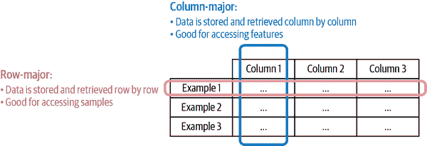
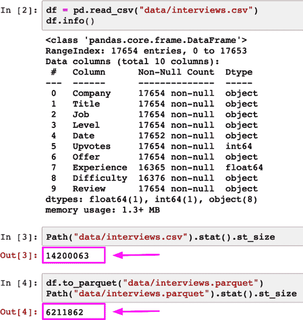
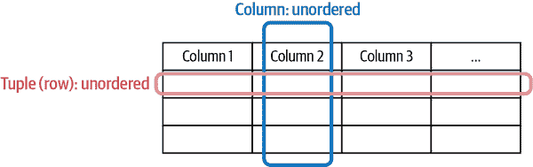
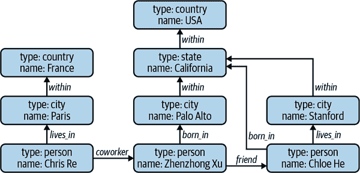
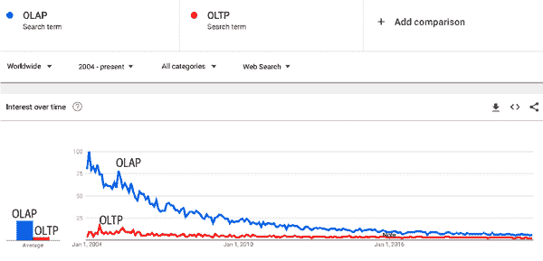
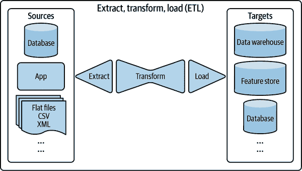
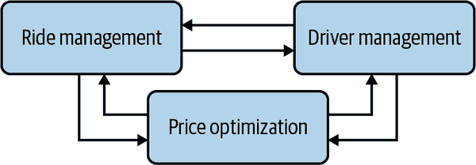
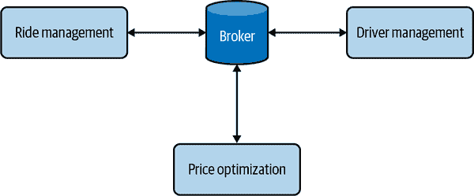
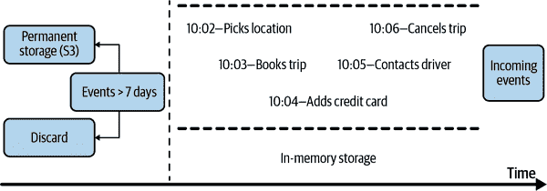

# 第三章：数据工程基础

近年来 ML 的崛起与大数据的崛起紧密相连。即使没有 ML，大数据系统也是复杂的。如果您没有花费多年时间与它们一起工作，很容易在首字母缩写中迷失方向。这些系统产生许多挑战和可能的解决方案。行业标准（如果有的话）随着新工具的出现和行业需求的扩展而迅速演变，形成一个动态和不断变化的环境。如果您查看不同技术公司的数据堆栈，可能会觉得每个公司都在做自己的事情。

在本章中，我们将介绍数据工程的基础知识，希望能够为您在探索自己需求的领域中提供稳固的基础。我们将从您在典型 ML 项目中可能使用的不同数据来源开始讨论。我们将继续讨论数据可以存储的格式。只有当您打算稍后检索数据时，存储数据才有意义。为了检索存储的数据，重要的是不仅要了解其格式，还要了解其结构。数据模型定义了以特定数据格式存储的数据的结构。

如果数据模型描述了现实世界中的数据，数据库则规定了数据应该如何存储在机器上。我们将继续讨论数据存储引擎，也称为数据库，用于两种主要处理类型：事务处理和分析处理。

在生产中处理数据时，通常会跨多个进程和服务处理数据。例如，您可能有一个特征工程服务，从原始数据计算特征，并且一个预测服务，基于计算出的特征生成预测。这意味着您需要将特征工程服务计算出的特征传递给预测服务。在本章的接下来的部分中，我们将讨论跨进程传递数据的不同模式。

在讨论不同数据传递模式时，我们将了解到两种不同类型的数据：数据存储引擎中的历史数据和实时传输中的流数据。这两种不同类型的数据需要不同的处理范式，我们将在“批处理与流处理”部分讨论。

了解如何收集、处理、存储、检索和处理越来越多的数据对于希望建立生产 ML 系统的人来说至关重要。如果您已经熟悉数据系统，可能希望直接转到第四章，了解如何采样和生成标签以创建训练数据。如果您想从系统的角度了解更多关于数据工程的内容，我推荐 Martin Kleppmann 的优秀著作[*设计数据密集型应用*](https://oreil.ly/KGLXZ)（O'Reilly 出版，2017 年）。

# 数据源

机器学习系统可以处理来自许多不同来源的数据。它们具有不同的特征，可用于不同的目的，并且需要不同的处理方法。了解数据来源可以帮助您更有效地使用数据。本节旨在向不熟悉生产数据的人快速概述不同的数据来源。如果您已经在生产中使用机器学习一段时间了，请随意跳过本节。

一个来源是*用户输入数据*，即用户明确输入的数据。用户输入可以是文本、图像、视频、上传的文件等。如果用户可能输入错误数据，他们就会这样做。因此，用户输入数据很容易格式错误。文本可能过长或过短。在需要数值的地方，用户可能会意外输入文本。如果允许用户上传文件，他们可能会上传格式错误的文件。用户输入数据需要进行更严格的检查和处理。

此外，用户也具有很少的耐心。在大多数情况下，当我们输入数据时，我们希望立即得到结果。因此，用户输入数据往往需要快速处理。

另一个来源是*系统生成的数据*。这是由系统的不同组件生成的数据，包括各种类型的日志和系统输出，如模型预测。

日志可以记录系统的状态和重要事件，例如内存使用情况，实例数量，调用的服务，使用的软件包等。它们可以记录不同作业的结果，包括用于数据处理和模型训练的大批处理作业。这些类型的日志可以显示系统的运行情况。此可视性的主要目的是用于调试和可能改进应用程序。大多数情况下，您不必查看这些类型的日志，但是在出现问题时它们至关重要。

由于日志是系统生成的，与用户输入数据可能会格式错误的情况相比，它们不太可能格式错误。总体而言，日志不需要在到达时立即处理，就像您希望处理用户输入数据那样。对于许多用例，定期处理日志是可以接受的，例如每小时或甚至每天一次。但是，您可能仍然希望快速处理日志，以便能够检测并在发生有趣事件时收到通知。¹

因为调试机器学习系统很困难，通常的做法是尽可能记录所有内容。这意味着您的日志量可能会非常迅速地增长。这会导致两个问题。第一个问题是很难确定从哪里查找，因为信号可能会淹没在噪音中。已经有很多服务可以处理和分析日志，例如 Logstash、Datadog、Logz.io 等。其中许多服务使用机器学习模型来帮助您处理和理解大量的日志。

第二个问题是如何存储迅速增长的日志数量。幸运的是，在大多数情况下，你只需在它们对于调试当前系统有用的时间内保存日志，并在不再相关时将其丢弃。如果你不经常访问日志，它们也可以存储在低访问存储中，成本远低于高频访问存储。²

系统还生成数据记录用户的行为，如点击、选择建议、滚动、缩放、忽略弹出窗口或在某些页面上花费不寻常的时间。尽管这是系统生成的数据，仍然被视为用户数据的一部分，并可能受到隐私法规的约束。³

公司中由各种服务和企业应用程序生成的*内部数据库*也存在。这些数据库管理它们的资产，如库存、客户关系、用户等等。这种数据可以直接被机器学习模型使用，或者被机器学习系统的各个组件使用。例如，当用户在亚马逊上输入搜索查询时，一个或多个机器学习模型会处理该查询以检测其意图——如果有人输入“冷冻”，他们是在寻找冷冻食品还是迪士尼的*冰雪奇缘*系列？——然后亚马逊需要检查其内部数据库以查看这些产品的可用性，然后对它们进行排名并向用户展示。

然后是神奇而古怪的*第三方数据*世界。第一方数据是你的公司已经收集的关于用户或客户的数据。第二方数据是由另一家公司收集的关于他们自己客户的数据，他们可以向你提供，尽管你可能需要付费。第三方数据公司收集不是他们直接客户的公众数据。

互联网和智能手机的兴起使得所有类型的数据收集变得更加容易。以前在智能手机上尤其容易，因为每部手机都有一个唯一的广告商 ID——iPhone 有苹果的广告标识符（IDFA），而 Android 手机有他们的 Android 广告 ID（AAID）——它作为一个唯一 ID 聚合了手机上的所有活动。来自应用程序、网站、签到服务等的数据被收集并（希望）匿名化，以生成每个人的活动历史。

各种类型的数据都可以购买，例如社交媒体活动、购买历史、网页浏览习惯、汽车租赁以及不同人口统计群体的政治倾向，如男性、年龄在 25 至 34 岁之间、从事技术行业、居住在湾区的人。从这些数据中，你可以推断出喜欢 A 品牌的人也喜欢 B 品牌。这些数据对于诸如推荐系统之类的系统特别有帮助。第三方数据通常在供应商经过清洗和处理后出售。

然而，随着用户对数据隐私的需求增加，公司们一直在采取措施限制广告主 ID 的使用。2021 年初，苹果使其 IDFA 选择加入。这一变化显著减少了 iPhone 上可用的第三方数据量，迫使许多公司更多地关注第一方数据。⁴为了对抗这一变化，广告主一直在投资寻找解决方案。例如，中国广告协会，作为中国广告行业的国家支持的贸易协会，投资于一种名为 CAID 的设备指纹系统，使得像抖音和腾讯这样的应用程序可以继续跟踪 iPhone 用户。⁵

# 数据格式

一旦您拥有数据，您可能希望将其存储（或者从技术术语上说“持久化”）。由于您的数据来自不同访问模式的多个来源，⁶存储数据并不总是简单的，而且对于某些情况可能会很昂贵。重要的是要考虑数据在未来如何使用，以便选择合适的格式。以下是您可能需要考虑的一些问题：

+   如何存储多模态数据，例如可能同时包含图像和文本的样本？

+   我应该将数据存储在哪里，以便既便宜又快速地访问？

+   如何存储复杂模型以便它们可以在不同硬件上正确加载和运行？

将数据结构或对象状态转换为可以存储或传输并在以后重建的格式的过程称为*数据序列化*。有许多许多数据序列化格式。在选择要使用的格式时，您可能需要考虑不同的特性，例如人类可读性、访问模式以及它是基于文本还是二进制的，这会影响其文件大小。表 3-1 只包含您在工作中可能遇到的一些常见格式。欲了解更全面的列表，请参阅优秀的维基百科页面[“数据序列化格式比较”](https://oreil.ly/sgceY)。

表 3-1\. 常见数据格式及其使用场景

| 格式 | 二进制/文本 | 人类可读 | 示例用例 |
| --- | --- | --- | --- |
| JSON | 文本 | 是 | 到处都有 |
| *CSV* | *文本* | *是* | *到处都有* |
| *Parquet* | *二进制* | *否* | *Hadoop, 亚马逊 Redshift* |
| Avro | 二进制主要 | 否 | Hadoop |
| Protobuf | 二进制主要 | 否 | Google, TensorFlow (TFRecord) |
| Pickle | 二进制 | 否 | Python, PyTorch 序列化 |

我们将讨论其中几种格式，首先是 JSON。我们还将讨论两种常见的格式，它们代表了两种不同的范式：CSV 和 Parquet。

## JSON

JSON，即 JavaScript 对象表示法，随处可见。尽管它源自 JavaScript，但它与语言无关——大多数现代编程语言都可以生成和解析 JSON。它是人类可读的。它的键-值对范式简单而强大，能够处理不同结构水平的数据。例如，您的数据可以以以下结构化格式存储：

```
{
  "firstName": "Boatie",
  "lastName": "McBoatFace",
  "isVibing": true,
  "age": 12,
  "address": {
    "streetAddress": "12 Ocean Drive",
    "city": "Port Royal",
    "postalCode": "10021-3100"
  }
}
```

相同的数据也可以存储在以下非结构化文本块中：

```
{
  "text": "Boatie McBoatFace, aged 12, is vibing, at 12 Ocean Drive, Port Royal, 
 10021-3100"
}
```

由于 JSON 是无处不在的，它带来的痛苦也是普遍存在的。一旦您将 JSON 文件中的数据提交给某个模式，要回溯更改该模式就相当痛苦。JSON 文件是文本文件，这意味着它们占用大量空间，正如我们将在 “文本格式与二进制格式” 部分中看到的那样。

## 行优先格式与列优先格式的比较

两种常见的格式代表两种不同的范例，分别是 CSV 和 Parquet。CSV（逗号分隔值）是行优先的，这意味着同一行内的连续元素在内存中是相邻存储的。Parquet 是列优先的，这意味着同一列内的连续元素在内存中是相邻存储的。

因为现代计算机比非顺序数据更有效地处理顺序数据，如果表是行优先的，预计按行访问数据将比按列访问数据更快。这意味着对于行优先格式，预计按行访问数据将比按列访问数据更快。

想象一下，我们有一个包含 1,000 个示例的数据集，每个示例有 10 个特征。如果我们将每个示例视为一行，每个特征视为一列，这在机器学习中经常发生，那么像 CSV 这样的行优先格式更适合访问示例，例如，访问今天收集到的所有示例。像 Parquet 这样的列优先格式更适合访问特征，例如，访问所有示例的时间戳。参见 图 3-1。



###### 图 3-1\. 行优先与列优先格式

列优先格式允许基于列灵活读取数据，特别是当数据量大且有成千上万的特征时。考虑一下，如果你有关于共享乘车交易的数据，该数据有 1,000 个特征，但你只需要 4 个特征：时间、位置、距离、价格。使用列优先格式，你可以直接读取与这四个特征对应的四列数据。然而，使用行优先格式，如果你不知道行的大小，你将不得不读取所有列，然后筛选出这四列数据。即使你知道行的大小，由于需要在内存中跳跃，无法利用缓存，速度仍然可能较慢。

行优先格式允许更快的数据写入。考虑当您不断向数据中添加新的个体示例时的情况。对于每个个体示例，将其写入已经处于行优先格式的文件中会更快。

总体来说，当你需要大量写操作时，行主要格式更好，而当你需要大量基于列的读操作时，列主要格式更好。

###### 注意

我用 CSV 作为行主要格式的示例，因为它很受欢迎，几乎所有我在技术领域交流过的人都能认识。然而，本书的一些早期审阅者指出，他们认为 CSV 是一个糟糕的数据格式。它会将非文本字符序列化得很差。例如，当你将浮点数值写入 CSV 文件时，可能会丢失一些精度 —— `0.12345678901232323` 可能会被任意四舍五入为 `0.12345678901` —— 正如在 [Stack Overflow thread](https://oreil.ly/HjTMM) 和 [Microsoft Community thread](https://oreil.ly/cbvQu) 中所抱怨的那样。[Hacker News](https://oreil.ly/ziCmo) 上的一些人则激烈地反对使用 CSV。

## 文本与二进制格式

CSV 和 JSON 是文本文件，而 Parquet 文件是二进制文件。文本文件是指通常是人类可读的纯文本文件。二进制文件是一个泛指，指的是所有非文本文件。顾名思义，二进制文件通常只包含 0 和 1，并且是为那些知道如何解释原始字节的程序所设计的。如果你在文本编辑器中打开文本文件（例如 VS Code、记事本），你可以读取其中的文本内容。如果你在文本编辑器中打开二进制文件，你会看到一些数字块，可能是十六进制值，对应文件的字节。

二进制文件更紧凑。这里有一个简单的例子来展示二进制文件如何节省空间，与文本文件相比。假设你想存储数字 `1000000`。如果你将其存储在文本文件中，将需要 7 个字符，如果每个字符占用 1 字节，那么就需要 7 字节。如果你将其存储在二进制文件中作为 int32，只需要 32 位或 4 字节。

作为示例，我使用 *interviews.csv*，这是一个包含 17,654 行和 10 列的 CSV 文件（文本格式）。当我将其转换为二进制格式（Parquet）时，文件大小从 14 MB 缩小到 6 MB，如 Figure 3-3 所示。

AWS 建议使用 Parquet 格式，因为“Parquet 格式在 Amazon S3 中的卸载速度高达原来的 2 倍，并且比文本格式消耗的存储空间少达 6 倍。”⁸



###### 图 3-3\. 当以 CSV 格式存储时，我的面试文件大小为 14 MB。但当以 Parquet 格式存储相同文件时，文件大小为 6 MB。

# 数据模型

数据模型描述了数据的表示方式。考虑现实世界中的汽车。在数据库中，汽车可以通过其品牌、型号、年份、颜色和价格来描述。这些属性构成了汽车的数据模型。或者，你也可以通过其所有者、车牌号和注册地址历史来描述汽车。这是汽车的另一个数据模型。

您选择如何表示数据不仅影响系统构建的方式，还影响系统能够解决的问题。例如，第一个数据模型中的汽车表示方式使得寻找购买汽车的人变得更容易，而第二个数据模型使得警察追踪罪犯变得更容易。

在本节中，我们将研究看似相反但实际上正在趋同的两种模型：关系模型和 NoSQL 模型。我们将通过示例展示每种模型适合解决的问题类型。

## 关系模型

关系模型是计算机科学中最持久的理念之一。由埃德加·F·科德在 1970 年发明，⁹ 关系模型至今仍然非常流行，甚至变得越来越受欢迎。这个理念简单而强大。在这个模型中，数据被组织成关系；每个关系是一组元组。表是关系的一种接受的视觉表示，表的每一行构成一个元组，¹⁰ 如图 Figure 3-4 所示。关系是无序的。您可以对关系中的行或列进行重新排序，它仍然是同一个关系。遵循关系模型的数据通常存储在诸如 CSV 或 Parquet 的文件格式中。



###### 图 3-4\. 在一个关系中，既不考虑行的顺序也不考虑列的顺序

通常希望关系能够被规范化。数据规范化可以遵循诸如第一范式（1NF）、第二范式（2NF）等正规形式，有兴趣的读者可以在 [维基百科](https://oreil.ly/EbrCk) 上进一步了解。在本书中，我们将通过一个示例展示规范化的工作原理以及它如何减少数据冗余并提高数据完整性。

考虑到在 Table 3-2 中显示的关系 Book。这些数据中存在大量重复项。例如，行 1 和行 2 几乎相同，只有格式和价格不同。如果出版商信息发生变化——例如，其名称从“香蕉出版社”变为“菠萝出版社”——或者其国家发生变化，我们将不得不更新行 1、2 和 4。如果我们将出版商信息分离到自己的表中，如表 3-3 和 3-4 所示，当出版商信息发生变化时，我们只需更新 Publisher 关系。¹¹ 这种做法使我们能够统一跨不同列中相同值的拼写。它还使得更容易对这些值进行更改，无论是因为这些值发生变化还是当您希望将它们翻译成不同的语言时。

表 3-2\. 初始图书关系

| 标题 | 作者 | 格式 | 出版商 | 国家 | 价格 |
| --- | --- | --- | --- | --- | --- |
| 哈利·波特 | J.K. 罗琳 | 平装书 | 香蕉出版社 | 英国 | $20 |
| 哈利·波特 | J.K. 罗琳 | 电子书 | 香蕉出版社 | 英国 | $10 |
| 夏洛克·福尔摩斯 | 柯南·道尔 | 平装 | Guava Press | 美国 | $30 |
| 霍比特人 | J.R.R. 托尔金 | 平装 | Banana Press | 英国 | $30 |
| 夏洛克·福尔摩斯 | 柯南·道尔 | 平装 | Guava Press | 美国 | $15 |

表 3-3\. 更新的图书关系

| 标题 | 作者 | 格式 | 出版商 ID | 价格 |
| --- | --- | --- | --- | --- |
| 哈利·波特 | J.K. 罗琳 | 平装 | 1 | $20 |
| 哈利·波特 | J.K. 罗琳 | 电子书 | 1 | $10 |
| 夏洛克·福尔摩斯 | 柯南·道尔 | 平装 | 2 | $30 |
| 霍比特人 | J.R.R. 托尔金 | 平装 | 1 | $30 |
| 夏洛克·福尔摩斯 | 柯南·道尔 | 平装 | 2 | $15 |

表 3-4\. 出版商关系

| 出版商 ID | 出版商 | 国家 |
| --- | --- | --- |
| 1 | Banana Press | 英国 |
| 2 | Guava Press | 美国 |

归一化的一个主要缺点是你的数据现在分布在多个关系中。你可以将不同关系中的数据再次联接在一起，但对于大表来说，联接可能是昂贵的。

建立在关系数据模型之上的数据库称为关系数据库。一旦你把数据放入数据库中，你会想要一种方法来检索它。你可以用来指定从数据库中获取数据的语言称为*查询语言*。如今最流行的关系数据库查询语言是 SQL。尽管受到关系模型的启发，SQL 背后的数据模型已经偏离了原始的[关系模型](https://oreil.ly/g4waq)。例如，SQL 表可以包含行重复，而真实的关系不能包含重复。然而，大多数人安全地忽略了这种细微差别。

关于 SQL 最重要的一点是它是一种声明式语言，与 Python 相对，Python 是一种命令式语言。在命令式范式中，你指定执行一个动作所需的步骤，计算机执行这些步骤以返回输出。在声明式范式中，你指定你想要的输出，计算机则会找出获取查询输出所需的步骤。

在 SQL 数据库中，你指定想要的数据模式——你要从哪些表中获取数据，结果必须满足的条件，基本的数据转换如联接、排序、分组、聚合等——但不指定如何检索数据。由数据库系统决定如何将查询分解为不同部分，使用什么方法执行查询的每个部分，以及应该执行查询的不同部分的顺序。

在特定的增强功能下，SQL 可以是[Turing-complete](https://oreil.ly/npL5B)，这意味着理论上 SQL 可以用来解决任何计算问题（不保证时间或内存的需求）。然而，在实践中，编写一个解决特定任务的查询并不总是容易，执行查询也不总是可行或可控的。任何使用 SQL 数据库的人可能对那些极其难以理解且谁都不敢碰的痛苦漫长的 SQL 查询有噩梦般的回忆¹²。

弄清楚如何执行任意查询是难点，这是查询优化器的工作。查询优化器会检查执行查询的所有可能方式，并找到最快的方式来执行¹³。可以使用机器学习来改进基于来访查询的查询优化器¹⁴。查询优化是数据库系统中最具挑战性的问题之一，而归一化意味着数据分布在多个关系上，这使得将其连接在一起变得更加困难。尽管开发查询优化器很难，好消息是通常你只需要一个查询优化器，所有应用程序都可以利用它。

## NoSQL

关系数据模型已经能够推广到许多用例，从电子商务到金融再到社交网络。然而，对于某些用例，这种模型可能会有限制。例如，它要求您的数据遵循严格的模式，而模式管理是痛苦的。在 Couchbase 2014 年的一项调查中，对模式管理的挫折感是他们采用非关系数据库的第一原因¹⁶。对于专业应用程序编写和执行 SQL 查询也可能会很困难。

最新的反对关系数据模型的运动是 NoSQL。最初作为一个关于非关系数据库讨论的聚会的标签开始，NoSQL 已经被追溯地重新解释为 Not Only SQL¹⁷，因为许多 NoSQL 数据系统也支持关系模型。两种主要的非关系模型是文档模型和图模型。文档模型针对的是数据以自包含文档形式存在，文档之间的关系很少的用例。而图模型则恰恰相反，针对的是数据项之间关系频繁且重要的用例。我们将分别研究这两种模型，首先从文档模型开始。

### 文档模型

文档模型围绕“文档”的概念构建。文档通常是一个单一连续的字符串，编码为 JSON、XML 或类似 BSON（二进制 JSON）的二进制格式。文档数据库中的所有文档都假定以相同的格式编码。每个文档都有一个唯一的键，表示该文档，可以用来检索它。

文档的集合可以类比为关系数据库中的表，而文档类比为一行。实际上，你可以通过这种方式将一个关系转换为文档的集合。例如，你可以将表 3-3 中的书籍数据和表 3-4 中的数据转换为三个 JSON 文档，如示例 3-1，3-2 和 3-3 所示。然而，文档的集合比表格更加灵活。表中的所有行必须遵循相同的模式（例如具有相同的列序列），而同一集合中的文档可以具有完全不同的模式。

##### 示例 3-1. 文档 1: harry_potter.json

```
{
  "Title": "Harry Potter",
  "Author": "J .K. Rowling",
  "Publisher": "Banana Press",
  "Country": "UK",
  "Sold as": [
    {"Format": "Paperback", "Price": "$20"},
    {"Format": "E-book", "Price": "$10"}
  ]
} 

```

##### 示例 3-2. 文档 2: sherlock_holmes.json

```
{
  "Title": "Sherlock Holmes",
  "Author": "Conan Doyle",
  "Publisher": "Guava Press",
  "Country": "US",
  "Sold as": [
    {"Format": "Paperback", "Price": "$30"},
    {"Format": "E-book", "Price": "$15"}
  ]
} 

```

##### 示例 3-3. 文档 3: the_hobbit.json

```
{
  "Title": "The Hobbit",
  "Author": "J.R.R. Tolkien",
  "Publisher": "Banana Press",
  "Country": "UK",
  "Sold as": [
    {"Format": "Paperback", "Price": "$30"},
  ]
} 

```

由于文档模型不强制执行模式，因此通常被称为无模式。这是具有误导性的，因为如前所述，存储在文档中的数据将在以后读取。读取文档的应用程序通常假设文档具有某种结构。文档数据库只是将假设结构的责任从写入数据的应用程序转移到读取数据的应用程序。

文档模型比关系模型具有更好的局部性。考虑书籍数据示例，在表 3-3 和表 3-4 中，关于书籍的信息分布在书表和出版商表（可能还有格式表）中。要检索有关书籍的信息，您必须查询多个表。在文档模型中，所有有关书籍的信息都可以存储在一个文档中，这样更容易检索。

然而，与关系模型相比，跨文档执行连接操作更加困难且效率较低。例如，如果你想找出所有价格低于$25 的书籍，你将需要读取所有文档，提取价格，将其与$25 进行比较，并返回所有包含价格低于$25 的书籍的文档。

由于文档和关系数据模型的不同优势，通常在同一数据库系统中为不同任务使用两种模型是常见的。越来越多的数据库系统，如 PostgreSQL 和 MySQL，都支持这两种模型。

### 图模型

图模型建立在“图”概念周围。图由节点和边组成，其中边表示节点之间的关系。使用图结构存储数据的数据库称为图数据库。如果在文档数据库中，每个文档的内容是优先考虑的，那么在图数据库中，数据项之间的关系是优先考虑的。

因为关系在图模型中被明确地建模，所以基于关系检索数据更快。考虑一个简单图数据库的例子，见图 3-5。这个例子的数据可能来自一个简单的社交网络。在这个图中，节点可以是不同的数据类型：person（人）、city（城市）、country（国家）、company（公司）等。



###### 图 3-5\. 一个简单图数据库的示例

假设你想要找到所有在**美国**出生的人。给定这个图，你可以从节点**美国**开始，并沿着“within”和“born_in”边遍历图，以找到所有类型为“person”的节点。现在，想象一下，如果我们不使用图模型来表示这些数据，而是使用关系模型。那么，很难编写 SQL 查询来找到所有在**美国**出生的人，特别是考虑到*country*和*person*之间有未知数量的跳数——在**美国**和 Zhenzhong Xu 之间有三个跳数，而在**美国**和 Chloe He 之间只有两个跳数。同样地，对于文档数据库，这种类型的查询也不容易。

许多在一种数据模型中容易处理的查询，在另一种数据模型中就比较困难。选择适合你的应用程序的正确数据模型可以大大简化你的生活。

## 结构化数据与非结构化数据

结构化数据遵循预定义的数据模型，也称为数据模式。例如，数据模型可以指定每个数据项包含两个值：第一个值“name”是一个最多 50 个字符的字符串，第二个值“age”是一个范围在 0 到 200 之间的 8 位整数。预定义的结构使得你的数据更容易分析。如果你想知道数据库中人们的平均年龄，你只需提取所有年龄值并计算平均值。

结构化数据的缺点在于你必须将数据提交给预定义的模式。如果你的模式发生变化，你将不得不回顾性地更新所有数据，这往往会在过程中引起一些难以解释的错误。例如，以前你从未保存过用户的电子邮件地址，但现在你需要保存，所以你必须回顾性地更新所有先前用户的电子邮件信息。我的一位同事遇到的最奇怪的错误之一是，他们不能再使用用户的年龄与他们的交易，他们的数据模式将所有空年龄替换为 0，他们的机器学习模型认为这些交易是由 0 岁的人完成的。¹⁸

因为业务需求随时间变化，承诺预定义的数据架构可能变得太限制性。或者您可能有来自多个数据源的数据，这些数据超出您的控制范围，不可能使它们遵循相同的架构。这就是非结构化数据变得吸引人的地方。非结构化数据不遵循预定义的数据架构。通常它是文本，但也可以是数字、日期、图像、音频等。例如，您的机器学习模型生成的日志文本文件就是非结构化数据。

即使非结构化数据不遵循架构，它仍然可能包含有助于您提取结构的内在模式。例如，以下文本是非结构化的，但您可以注意到每行包含两个由逗号分隔的值的模式，第一个值是文本，第二个值是数字。但并不保证所有行都必须遵循此格式。即使这行不遵循此格式，您也可以向该文本添加新行。

```
Lisa, 43
Jack, 23
Huyen, 59

```

非结构化数据还允许更灵活的存储选项。例如，如果您的存储遵循架构，您只能存储符合该架构的数据。但是如果您的存储不遵循架构，您可以存储任何类型的数据。您可以将所有数据，无论其类型和格式如何，转换为字节串并将它们一起存储。

存储结构化数据的仓库称为数据仓库。存储非结构化数据的仓库称为数据湖。数据湖通常用于在处理之前存储原始数据。数据仓库用于存储已经处理成可用格式的数据。表 3-5 概述了结构化数据和非结构化数据之间的关键差异。

表 3-5\. 结构化数据和非结构化数据的关键差异

| 结构化数据 | 非结构化数据 |
| --- | --- |
| 架构明确定义 | 数据无需遵循架构 |
| 易于搜索和分析 | 快速到达 |
| 只能处理具有特定架构的数据 | 可处理来自任何源的数据 |
| 架构更改将导致许多问题 | 无需担心架构更改（至少现在不用），因为这种担心转移到使用这些数据的下游应用程序上了 |
| 存储在数据仓库中 | 存储在数据湖中 |

# 数据存储引擎和处理

数据格式和数据模型指定了用户存储和检索数据的接口。存储引擎，也被称为数据库，是数据在机器上存储和检索的实现方式。理解不同类型的数据库很有用，因为你的团队或相邻团队可能需要选择适合你的应用的数据库。

通常，数据库针对两种类型的工作负载进行了优化，即事务处理和分析处理，在这一部分我们将详细介绍它们之间的主要区别。然后我们将介绍您在构建生产中的 ML 系统时必然会遇到的 ETL（抽取、转换、加载）过程的基础知识。

## 事务性处理和分析处理

传统上，交易指的是买卖行为。在数字世界中，交易指任何类型的行为：发推文、通过共享乘车服务预订车辆、上传新模型、观看 YouTube 视频等等。尽管这些不同的交易涉及不同类型的数据，但它们在应用程序中的处理方式是类似的。交易在生成时插入，当发生变化时偶尔更新，或者在不再需要时删除。¹⁹ 这种处理方式被称为*在线事务处理*（OLTP）。

因为这些交易经常涉及用户，所以需要快速处理（低延迟），以免让用户等待。处理方法需要具有高可用性——也就是说，处理系统在用户想要进行交易时需要随时可用。如果您的系统无法处理某个交易，该交易将无法进行。

事务性数据库旨在处理在线交易并满足低延迟、高可用性的要求。当人们听到事务性数据库时，他们通常会想到 ACID（原子性、一致性、隔离性、持久性）。以下是对这些术语的定义，以供需要快速回顾的人参考：

原子性

确保交易中的所有步骤作为一个组成功完成。如果交易中的任何一步失败，所有其他步骤也必须失败。例如，如果用户的付款失败，你不希望仍然为该用户分配司机。

一致性

确保所有经过的交易都必须遵循预定义的规则。例如，交易必须由有效用户进行。

隔离性

确保两个交易在同时发生时就像它们被隔离一样。两个访问相同数据的用户不会同时更改它。例如，你不希望两个用户同时预订同一司机。

持久性

确保一旦交易已提交，即使在系统故障的情况下也将保持提交状态。例如，当你订了一辆车但手机没电时，你仍希望你的车能来。

然而，事务性数据库不一定需要遵循 ACID 原则，一些开发人员认为 ACID 过于限制。根据 Martin Kleppmann 的说法，“不符合 ACID 标准的系统有时被称为 BASE，它代表*基本上可用*、*软状态*和*最终一致性*。这比 ACID 的定义更加模糊。”²⁰

每个事务通常作为一个单独的单位进行处理，与其他事务分开，因此事务性数据库通常是面向行的。这也意味着事务性数据库对于诸如“在旧金山 9 月份所有乘车的平均价格是多少？”这样的问题可能不够高效。这种分析性问题需要跨多行数据的列进行数据聚合。分析性数据库就是为此目的而设计的。它们可以有效地处理允许您从不同视角查看数据的查询。我们称这种处理方式为*在线分析处理*（OLAP）。

然而，OLTP 和 OLAP 这两个术语都已经过时，如图 3-6 所示，原因有三。首先，事务性和分析性数据库的分离是由技术限制造成的——很难拥有能够有效处理事务性和分析性查询的数据库。然而，这种分离正在逐渐消失。今天，我们有能够处理分析性查询的事务性数据库，例如[CockroachDB](https://oreil.ly/UsPCr)。我们还有能够处理事务性查询的分析性数据库，例如[Apache Iceberg](https://oreil.ly/pgAfK)和[DuckDB](https://oreil.ly/jVTHZ)。



###### 图 3-6\. 根据[Google Trends](https://oreil.ly/O8gAH)，截至 2021 年，OLAP 和 OLTP 已经过时。

在传统的 OLTP 或 OLAP 范式中，存储和处理紧密耦合——数据存储方式也是数据处理方式。这可能导致同一数据存储在多个数据库中，并使用不同的处理引擎来解决不同类型的查询。在过去的十年中，一个有趣的范式是将存储与处理（也称为计算）解耦，这被许多数据供应商采纳，包括 Google 的 BigQuery、Snowflake、IBM 和 Teradata。²¹ 在这种范式中，数据可以存储在同一个地方，上面有一个处理层，可以针对不同类型的查询进行优化。

第三，“在线”已经成为一个具有多重含义的过载术语。在线过去只是指“连接到互联网”。然后，它扩展到还意味着“在生产中”—我们说一个功能在部署到生产环境后就是在线的。

在当今的数据世界中，*在线*可能指的是数据处理和可用性的速度：在线、准在线或离线。根据维基百科，在线处理意味着数据立即可供输入/输出使用。准在线，即近在线，意味着数据不是立即可用，但可以在无需人工干预的情况下快速变为在线状态。*离线*意味着数据不是立即可用，需要一些人工干预才能变为在线状态。²²

## ETL：提取、转换和加载

在关系数据模型的早期阶段，数据大多是结构化的。当数据从不同的源中 *提取* 出来时，首先需要 *转换* 成所需的格式，然后再 *加载* 到目标位置，如数据库或数据仓库。这个过程被称为 *ETL*，即提取、转换和加载。

即使在机器学习出现之前，ETL 在数据世界也非常流行，对于机器学习应用至今仍然非常重要。ETL 指的是将数据处理和聚合成您所需的形状和格式的通用处理。

Extract 是从所有数据源中提取您想要的数据。其中一些可能已损坏或格式错误。在提取阶段，您需要验证数据并拒绝不符合要求的数据。对于被拒绝的数据，您可能需要通知数据源。由于这是流程的第一步，正确执行可以节省大量的时间。

Transform 是流程的关键部分，大部分数据处理都在这里完成。您可能需要从多个来源连接数据并清理它。您可能需要标准化值范围（例如，一个数据源可能使用“男性”和“女性”，而另一个数据源使用“M”和“F”或“1”和“2”）。您可以应用操作，如转置、去重、排序、聚合、衍生新特征、更多数据验证等。

Load 是决定如何以及多久将您的转换数据加载到目标位置，可以是文件、数据库或数据仓库。

ETL 的概念听起来简单但很强大，并且它是许多组织数据层的基础结构。ETL 过程的概述如 图 3-7 所示。



###### 图 3-7\. ETL 过程概述

当互联网首次普及并且硬件变得更加强大时，收集数据突然变得更加容易。数据量迅速增长。不仅如此，数据的性质也发生了变化。数据源的数量扩展了，数据模式也在演变。

由于难以保持数据结构化，一些公司提出了这样的想法：“为什么不将所有数据存储在数据湖中，这样我们就不必处理模式变更了？任何需要数据的应用程序都可以直接从那里提取原始数据并进行处理。” 这种先将数据加载到存储中，然后再进行处理的过程有时称为 *ELT*（提取、加载、转换）。这种范式允许数据快速到达，因为存储数据之前需要的处理很少。

然而，随着数据的持续增长，这种思路变得不那么吸引人。在大量原始数据中搜索所需数据是低效的。[²³] 与此同时，随着公司转向在云上运行应用程序和基础设施标准化，数据结构也变得标准化。将数据提交到预定义的模式变得更为可行。

随着公司权衡结构化数据与非结构化数据存储的利弊，供应商不断发展，提供结合数据湖的灵活性和数据仓库的数据管理方面的混合解决方案。例如，Databricks 和 Snowflake 都提供数据湖仓库解决方案。

# 数据流的模式

在本章中，我们讨论了数据格式、数据模型、数据存储以及在单个进程上下文中使用的数据处理。在生产环境中，大多数情况下，并不只有单个进程，而是多个进程同时存在。一个问题是：我们如何在不共享内存的不同进程之间传递数据？

当数据从一个进程传递到另一个进程时，我们称该数据从一个进程流向另一个进程，这形成了一个数据流。数据流有三种主要的模式：

+   通过数据库传递数据

+   通过使用 REST 和 RPC API（例如 POST/GET 请求）等请求的服务传递数据

+   通过实时传输如 Apache Kafka 和 Amazon Kinesis 传递数据

我们将在本节详细介绍每一种模式。

## 通过数据库传递数据

在两个进程之间传递数据的最简单方法是通过数据库，我们在“数据存储引擎和处理”一节中已经讨论过这一点。例如，要将数据从进程 A 传递给进程 B，进程 A 可以将数据写入数据库，而进程 B 则从该数据库中读取数据。

然而，这种方式并不总是适用，原因有两个。首先，它要求两个进程必须能够访问同一个数据库。这可能是不可行的，特别是如果两个进程由两家不同的公司运行。

其次，它要求两个进程都能够从数据库访问数据，而数据库的读写速度可能较慢，这使得它不适合对延迟要求严格的应用程序，例如几乎所有面向消费者的应用程序。

## 通过服务传递数据

传递数据的一种方式是通过连接这两个进程的网络直接发送数据。为了将数据从进程 B 传递给进程 A，进程 A 首先向进程 B 发送一个请求，指定 A 需要的数据，然后 B 通过同一网络返回请求的数据。因为进程通过请求进行通信，所以我们称之为*请求驱动*。

此数据传递方式与面向服务的架构密切相关。服务是可通过网络远程访问的进程。在本示例中，B 被公开为 A 可以向其发送请求的服务。为了使 B 能够从 A 请求数据，A 还需要向 B 公开为服务。

两个相互通信的服务也可以由不同公司在不同应用程序中运行。例如，一个服务可能由股票交易所运行，用于跟踪当前股票价格。另一个服务可能由投资公司运行，请求当前股票价格并使用它们来预测未来股票价格。

两个相互通信的服务也可以是同一个应用程序的一部分。将应用程序的不同组件构建为单独的服务允许每个组件独立开发、测试和维护。将应用程序构建为单独的服务提供了微服务架构。

为了将微服务架构置于 ML 系统的背景下，想象你是一名 ML 工程师，为拥有类似 Lyft 的乘车共享应用的公司解决价格优化问题。实际上，Lyft 在其微服务架构中拥有[数百个服务](https://oreil.ly/6fl8f)，但为了简单起见，我们只考虑三个服务：

司机管理服务

预测在指定区域下一分钟内将有多少司机可用。

乘车管理服务

预测在指定区域下一分钟内将有多少乘车请求。

价格优化服务

预测每次乘车的最佳价格。乘车价格应低到足以使乘客愿意支付，但足够高以使司机愿意开车，并使公司获利。

因为价格取决于供应（可用司机）和需求（请求的乘车），价格优化服务需要来自司机管理和乘车管理服务的数据。每当用户请求乘车时，价格优化服务请求预测的乘车次数和预测的司机数量，以预测此乘车的最佳价格。²⁴

通过网络传递数据的最流行的请求方式包括 REST（表述性状态转移）和 RPC（远程过程调用）。它们的详细分析超出了本书的范围，但一个主要区别在于 REST 设计用于网络请求，而 RPC“试图使对远程网络服务的请求看起来与调用编程语言中的函数或方法相同*.*”由于这一点，“REST 似乎是公共 API 的主要风格。RPC 框架的主要重点是在同一组织内部服务之间的请求，通常在同一数据中心内。”²⁵

实现 REST 架构的实现被称为 RESTful。尽管许多人将 REST 视为 HTTP，但 REST 并不完全意味着 HTTP，因为 HTTP 只是 REST 的一种实现方式。²⁶

## 通过实时传输进行数据传递

要理解实时传输的动机，让我们回到前面的例子，即具有三个简单服务（司机管理、乘车管理和价格优化）的乘车共享应用程序。在上一节中，我们讨论了价格优化服务需要从乘车和司机管理服务获取数据，以预测每次乘车的最佳价格。

现在，想象一下司机管理服务还需要从乘车管理服务获取乘车次数，以便知道需要动员多少司机。它还想从价格优化服务那里获取预测价格，作为激励潜在司机的手段（例如，如果现在上路，您可以获得 2 倍的高峰费）。类似地，乘车管理服务可能还需要来自司机管理和价格优化服务的数据。如果我们像前一节讨论的那样通过服务传递数据，那么每个服务都需要向另外两个服务发送请求，如图 3-8 所示。



###### 图 3-8\. 在请求驱动的架构中，每个服务需要向另外两个服务发送请求

即使只有三个服务，数据传递已经变得复杂。想象一下像大型互联网公司那样拥有数百甚至数千个服务。服务间的数据传递可能会爆炸，并成为减慢整个系统的瓶颈。

请求驱动的数据传递是同步的：目标服务必须监听请求才能进行请求。如果价格优化服务请求来自司机管理服务的数据，而司机管理服务已经停机，则价格优化服务将继续重新发送请求直至超时。如果价格优化服务在收到响应之前停机，则响应将丢失。一个停机的服务可能导致所有需要其数据的服务停机。

如果有一个协调数据在服务之间传递的代理，会怎么样？而不是让服务直接从彼此请求数据并创建复杂的服务间数据传递网络，每个服务只需与代理通信，如图 3-9 所示。例如，不是让其他服务请求驱动管理服务获取下一分钟的预测驾驶员数量，而是每当驱动管理服务做出预测时，将此预测广播给代理？希望从驱动管理服务获取数据的任何服务都可以检查代理，获取最新的预测驾驶员数量。同样，每当价格优化服务对下一分钟的高峰费用做出预测时，也会将此预测广播给代理。



###### 图 3-9\. 有了代理，服务只需与代理通信，而不是与其他服务通信。

从技术上讲，数据库可以是代理——每个服务可以将数据写入数据库，需要数据的其他服务可以从该数据库读取数据。然而，如“通过数据库传递数据”一节所述，从数据库读取和写入对于具有严格延迟要求的应用程序来说太慢了。我们使用内存存储而不是数据库来代理数据。实时传输可以被看作是服务之间数据传递的内存存储。

广播到实时传输的一段数据称为事件。因此，这种架构也被称为*事件驱动*。实时传输有时也称为事件总线。

对于更多依赖逻辑而不是数据的系统，请求驱动的架构效果良好。对于数据密集型系统，事件驱动的架构更加合适。

两种最常见的实时传输类型是发布订阅（pubsub）和消息队列。在发布订阅模型中，任何服务都可以发布到实时传输的不同主题，订阅主题的任何服务都可以读取该主题中的所有事件。生成数据的服务不关心哪些服务消费它们的数据。发布订阅解决方案通常有保留策略——数据将在实时传输中保留一段时间（例如七天），然后被删除或移动到永久存储（如 Amazon S3）。参见图 3-10。



###### 图 3-10\. 进入的事件存储在内存存储中，然后被丢弃或移到更持久的存储中。

在消息队列模型中，事件通常有预期的消费者（带有预期消费者的事件称为消息），消息队列负责将消息传递给正确的消费者。

发布订阅解决方案的例子有 Apache Kafka 和 Amazon Kinesis。消息队列的例子有 Apache RocketMQ 和 RabbitMQ。在过去几年中，这两种范式都获得了很大的关注。图 3-11 显示了一些使用 Apache Kafka 和 RabbitMQ 的公司。


###### 图 3-11. 使用 Apache Kafka 和 RabbitMQ 的公司。来源：来自[Stackshare 的截图](https://oreil.ly/OqAgL)

# 批处理与流处理的比较

一旦您的数据到达像数据库、数据湖或数据仓库这样的数据存储引擎，它就变成了历史数据。这与流数据（仍在流动的数据）相对。历史数据通常在批处理作业中进行处理，这些作业定期启动。例如，每天一次，您可能希望启动一个批处理作业来计算最近一天内所有乘车的平均激增费用。

当数据在批处理作业中处理时，我们称之为*批处理*。批处理已经是研究的主题已有数十年之久，公司已经提出了像 MapReduce 和 Spark 这样的分布式系统来有效处理批量数据。

当你拥有像 Apache Kafka 和 Amazon Kinesis 这样的实时传输数据时，我们称之为流数据。*流处理* 指的是对流数据进行计算。流数据上的计算也可以定期启动，但这些周期通常比批处理作业的周期要短得多（例如，每五分钟而不是每天）。流数据上的计算也可以在需要时随时启动。例如，每当用户请求搭乘时，您可以处理数据流以查看当前可用的司机。

当正确进行流处理时，可以实现低延迟，因为您可以在生成数据后立即处理数据，而无需首先将其写入数据库。许多人认为流处理比批处理效率低，因为您不能利用像 MapReduce 或 Spark 这样的工具。但并非总是如此，原因有两点。首先，像 Apache Flink 这样的流处理技术已被证明具有高可伸缩性和完全分布式，这意味着它们可以并行进行计算。其次，流处理的优势在于状态计算。考虑这样一种情况：您希望处理 30 天试用期间的用户参与情况。如果每天启动这个批处理作业，您将不得不每天在过去 30 天内进行计算。而使用流处理，可以只计算每天的新数据，并将新数据的计算与旧数据的计算结合起来，避免冗余计算。

因为批处理比流处理频率低得多，在机器学习中，通常用于计算不经常变化的特征，比如司机的评分（如果司机完成了数百次乘车，其评分不太可能在一天之内发生显著变化）。通过批处理提取的特征称为*批量特征*，也被称为*静态特征*。

流处理用于计算变化快速的特征，例如当前有多少司机可用，过去一分钟内有多少乘车请求，接下来两分钟内会完成多少乘车，这个区域最近 10 次乘车的中位数价格等。这些关于系统当前状态的特征对于进行最佳价格预测非常重要。通过流处理提取的特征称为*流特征*，也被称为*动态特征*。

对于许多问题，您不仅需要批量特征或流特征，而是两者兼备。您需要能够处理流数据和批量数据并将它们结合起来输入到机器学习模型中的基础设施。我们将在第七章进一步讨论如何将批处理特征和流处理特征结合使用以生成预测。

要对数据流进行计算，您需要一个流计算引擎（就像 Spark 和 MapReduce 是批量计算引擎一样）。对于简单的流计算，您可能可以利用实时传输工具如 Apache Kafka 的内置流计算能力，但是 Kafka 流处理在处理各种数据源时存在一定限制。

对于利用流特征的机器学习系统，流计算很少是简单的。在应用程序中使用的流特征数量，如欺诈检测和信用评分，可能达到数百甚至数千个。流特征提取逻辑可能需要使用不同维度的联接和聚合进行复杂查询。要提取这些特征需要高效的流处理引擎。为此，您可能希望研究类似 Apache Flink、KSQL 和 Spark Streaming 的工具。在这三个引擎中，Apache Flink 和 KSQL 在行业中更为认可，并为数据科学家提供了良好的 SQL 抽象。

流处理更加困难，因为数据量是无界的，数据以可变的速率和速度进入。让流处理器执行批处理比让批处理器执行流处理更容易。Apache Flink 的核心维护者多年来一直在争论批处理是流处理的一个特例。²⁸

# 总结

本章建立在第二章中关于数据在开发 ML 系统中的重要性的基础上。在本章中，我们了解到选择正确的格式存储数据对将来使用数据更加容易是很重要的。我们讨论了不同的数据格式以及行优先与列优先格式以及文本与二进制格式的优缺点。

我们继续涵盖三种主要数据模型：关系型、文档型和图形型。尽管关系模型是最为人所知的，鉴于 SQL 的流行，但今天所有三种模型都被广泛应用，每种模型都适用于一定范围的任务。

当谈到关系模型相对于文档模型时，许多人认为前者是结构化的，后者是非结构化的。结构化和非结构化数据之间的区分是相当模糊的——主要问题是谁必须承担假设数据结构的责任。结构化数据意味着编写数据的代码必须假设结构。非结构化数据意味着读取数据的代码必须假设结构。

我们继续本章讨论数据存储引擎和处理。我们研究了针对两种不同类型数据处理进行优化的数据库：事务处理和分析处理。我们一起研究了数据存储引擎和处理，因为传统上存储与处理是耦合在一起的：用于事务处理的事务性数据库和用于分析处理的分析数据库。然而，在近年来，许多供应商已经致力于解耦存储和处理。今天，我们有能够处理分析查询的事务性数据库以及能够处理事务查询的分析数据库。

当讨论数据格式、数据模型、数据存储引擎和处理时，假定数据在一个过程中。然而，在生产中工作时，您可能会与多个进程一起工作，并且可能需要在它们之间传输数据。我们讨论了三种数据传递模式。最简单的模式是通过数据库传递。用于进程的数据传递最流行的模式是通过服务传递数据。在这种模式中，一个进程被公开为另一个进程可以请求数据的服务。这种数据传递模式与微服务架构紧密耦合，其中应用程序的每个组件都设置为一个服务。

过去十年中变得越来越流行的一种数据传递模式是通过类似 Apache Kafka 和 RabbitMQ 的实时传输传递数据。这种数据传递模式介于通过数据库传递和通过服务传递之间：它允许异步数据传递，延迟相当低。

由于实时传输中的数据与数据库中的数据具有不同的属性，它们需要不同的处理技术，如在“批处理与流处理对比”章节讨论的那样。数据库中的数据通常通过批处理作业处理并生成静态特征，而实时传输中的数据通常使用流计算引擎处理并生成动态特征。有人认为批处理是流处理的一个特例，流计算引擎可以统一这两种处理流水线。

一旦我们解决了我们的数据系统问题，我们就可以收集数据并创建训练数据，这将是下一章的重点。

¹ “在生产环境中‘有趣’通常意味着灾难性的事情，比如崩溃或者你的云账单飙升到天文数字。”

² 截至 2021 年 11 月，AWS S3 标准存储选项允许您在毫秒级的延迟内访问数据，每 GB 的成本约为 S3 冰川的五倍，后者允许您在 1 分钟至 12 小时的延迟内检索数据。

³ 一位机器学习工程师曾经对我说，他的团队只使用用户的历史产品浏览和购买记录来推荐他们可能希望看到的内容。我回答道：“所以你根本不使用个人数据？”他看着我，一脸困惑。“如果你指的是用户的年龄、位置等人口统计数据，那么不，我们不使用。但我认为一个人的浏览和购买活动是非常私密的。”

⁴ John Koetsier，“苹果刚刚削弱了 IDFA，将一个价值 800 亿美元的行业推向混乱”，*福布斯*，2020 年 6 月 24 日，[*https://oreil.ly/rqPX9*](https://oreil.ly/rqPX9)。

⁵ Patrick McGee 和 Yuan Yang，“TikTok 希望通过国家支持的方法继续跟踪 iPhone 用户”，*Ars Technica*，2021 年 3 月 16 日，[*https://oreil.ly/54pkg*](https://oreil.ly/54pkg)。

⁶ “访问模式”指系统或程序读取或写入数据的模式。

⁷ 欲了解更多关于 pandas 的特性，请查看我的[Just pandas Things](https://oreil.ly/sFkJX) GitHub 仓库。

⁸ “宣布亚马逊 Redshift 数据湖导出：以 Apache Parquet 格式共享数据”，亚马逊 AWS，2019 年 12 月 3 日，[*https://oreil.ly/ilDb6*](https://oreil.ly/ilDb6)。

⁹ Edgar F. Codd，“大型共享数据银行的数据关系模型”，*ACM 通讯*，1970 年 6 月，第 13 卷，第 6 期：377–87。

¹⁰ 对于注重细节的读者，不是所有的表都是关系表。

¹¹ 您可以进一步将书籍关系进行归一化，例如将格式分离到一个单独的关系中。

¹² 原 Postgres 论文的合著者 Greg Kemnitz 在[Quora 分享](https://oreil.ly/W0gQa)，曾经写过一个包含 700 行的报告 SQL 查询，涉及 27 个不同表的查找或连接。该查询有大约 1,000 行的注释，帮助他记住自己的操作。他花了三天时间来撰写、调试和优化这个查询。

¹³ Yannis E. Ioannidis, “查询优化,” *ACM Computing Surveys*（CSUR）28 卷 1 期（1996 年）：121-23，[`oreil.ly/omXMg`](https://oreil.ly/omXMg)。

¹⁴ Ryan Marcus 等，“Neo：一个学习的查询优化器,” *arXiv*预印本 arXiv:1904.03711（2019 年），[`oreil.ly/wHy6p`](https://oreil.ly/wHy6p)。

¹⁵ Matthias Boehm, Alexandre V. Evfimievski, Niketan Pansare, 和 Berthold Reinwald, “声明式机器学习——基本属性和类型分类,” *arXiv*, 2016 年 5 月 19 日，[`oreil.ly/OvW07`](https://oreil.ly/OvW07)。

¹⁶ James Phillips, “我们 NoSQL 采用调查中的惊喜,” *Couchbase*, 2014 年 12 月 16 日，[`oreil.ly/ueyEX`](https://oreil.ly/ueyEX)。

¹⁷ Martin Kleppmann，《设计数据密集型应用》（[`oreil.ly/fniWG`](https://oreil.ly/fniWG)）（Sebastopol, CA: O’Reilly, 2017）。

¹⁸ 在这个具体的例子中，用-1 替换空年龄值解决了问题。

¹⁹ 本段以及本章的许多部分受 Martin Kleppmann 的《设计数据密集型应用》（[`oreil.ly/f9C48`](https://oreil.ly/f9C48)）启发。

²⁰ Kleppmann，《设计数据密集型应用》（[`oreil.ly/LFHN5`](https://oreil.ly/LFHN5)）。

²¹ Tino Tereshko, “在 BigQuery 中分离存储和计算,” Google Cloud 博客，2017 年 11 月 29 日，[`oreil.ly/utf7z`](https://oreil.ly/utf7z)；Suresh H., “Snowflake 架构与关键概念：一份全面的指南,” Hevo 博客，2019 年 1 月 18 日，[`oreil.ly/GyvKl`](https://oreil.ly/GyvKl)；Preetam Kumar, “切断电缆：使用对象存储在数据湖中分离数据与计算,” IBM 博客，2017 年 9 月 21 日，[`oreil.ly/Nd3xD`](https://oreil.ly/Nd3xD)；“分离云计算和云存储的威力,” Teradata，最后访问于 2022 年 4 月，[`oreil.ly/f82gP`](https://oreil.ly/f82gP)。

²² Wikipedia, s.v. “Nearline storage,” 最后访问于 2022 年 4 月，[`oreil.ly/OCmiB`](https://oreil.ly/OCmiB)。

²³ 在本书的初稿中，我将成本作为不应存储所有内容的原因。然而，如今存储成本如此低廉，以至于存储成本很少是一个问题。

²⁴ 实际上，价格优化可能不需要每次都请求预测的乘车次数/司机数量来进行价格预测。使用缓存的预测乘车次数/司机数量并每分钟或更频繁地请求新的预测是常见做法。

²⁵ Kleppmann，《*设计数据密集型应用*》（[链接](https://oreil.ly/LFHN5)）。

²⁶ Tyson Trautmann，《“揭秘 RPC 和 REST 的神话”》，*Ethereal Bits*，2012 年 12 月 4 日（通过互联网档案馆访问），[链接](https://oreil.ly/4sUrL)。

²⁷ 如果你想了解更多关于 Apache Kafka 如何工作的信息，Mitch Seymour 有一个很棒的[动画](https://oreil.ly/kBZzU)，用水獭来解释它！

²⁸ Kostas Tzoumas，《“批处理是流处理的一种特例”》，*Ververica*，2015 年 9 月 15 日，[链接](https://oreil.ly/IcIl2)。
