# 第四章：训练数据

在第三章中，我们从系统的角度讨论了如何处理数据。在这一章中，我们将从数据科学的角度讨论如何处理数据。尽管训练数据在开发和改进机器学习模型中非常重要，但许多教育课程都过分偏向于建模，而这被许多从业者认为是整个过程中最“有趣”的部分。构建一个最先进的模型确实很有趣。但是花费数日处理海量格式不正确的数据，甚至不能适应你机器内存的数据，则是非常令人沮丧的。

数据混乱、复杂、难以预测，可能会引发危险。如果处理不当，它很容易将整个机器学习操作陷入困境。但这正是为什么数据科学家和机器学习工程师应该学会如何处理数据的原因，这将在未来节省我们大量时间和头疼的根源。

在这一章中，我们将讨论获取或创建良好训练数据的技术。在本章中，训练数据包括机器学习模型开发阶段使用的所有数据，包括用于训练、验证和测试的不同拆分（训练、验证、测试拆分）。本章从选择训练数据的不同采样技术开始。然后，我们将讨论创建训练数据中的常见挑战，包括标签多样性问题、缺乏标签问题、类别不平衡问题以及解决缺乏数据问题的数据增强技术。

我们使用术语“训练数据”而不是“训练数据集”，因为“数据集”表示一个有限且静态的集合。生产中的数据既不是有限的，也不是静态的，这是我们将在“数据分布转移”一节中讨论的现象。像建立机器学习系统的其他步骤一样，创建训练数据是一个迭代的过程。随着项目生命周期中模型的演变，你的训练数据也很可能会发生变化。

在我们继续之前，我想再次强调一句话，虽然已经说了很多次，但还是不够。数据充满了潜在的偏见。这些偏见可能有很多原因。在收集、采样或标记过程中可能产生偏见。历史数据可能被人类偏见所影响，而在这些数据上训练的机器学习模型可能会延续这些偏见。使用数据，但不要过于信任它！

# 采样

采样是机器学习工作流程的一个重要组成部分，但在典型的机器学习课程中往往被忽视。在机器学习项目生命周期的许多步骤中都会进行采样，例如从所有可能的真实世界数据中创建训练数据；从给定数据集中进行采样以创建用于训练、验证和测试的拆分；或者从发生在您的机器学习系统内的所有可能事件中进行采样以进行监控。在本节中，我们将重点讨论用于创建训练数据的采样方法，但这些采样方法也可以用于机器学习项目生命周期的其他步骤。

在许多情况下，采样是必要的。一种情况是当您无法访问真实世界中的所有可能数据时，用于训练模型的数据是真实世界数据的一个子集，由某种采样方法创建而成。另一种情况是当处理您可以访问的所有数据变得不可行时——因为它需要太多时间或资源——因此您必须对这些数据进行采样，以创建一个可行处理的子集。在许多其他情况下，采样是有帮助的，因为它可以让您更快速、更便宜地完成任务。例如，考虑一个新模型时，您可能希望先用数据的一个小子集进行快速实验，以查看新模型是否有前途，然后再对所有数据进行训练。¹

理解不同的采样方法及其在工作流程中的应用可以首先帮助我们避免潜在的采样偏差，其次可以帮助我们选择提高我们所采样数据效率的方法。

有两大类采样方法：非概率抽样和随机抽样。我们将从非概率抽样方法开始，然后介绍几种常见的随机抽样方法。

## 非概率抽样

非概率抽样是指数据选择不基于任何概率标准。以下是一些非概率抽样的标准：

便利抽样

根据数据的可用性选择数据样本。这种采样方法很受欢迎，因为它很方便。

雪球抽样

未来的样本是根据现有样本选择的。例如，为了在没有访问 Twitter 数据库的情况下抓取合法的 Twitter 账户，您从少量账户开始，然后抓取他们关注的所有账户，依此类推。

判断抽样

专家决定包括哪些样本。

配额抽样

您根据特定数据切片的配额选择样本，而无需任何随机化。例如，在进行调查时，您可能希望从每个年龄组获取 100 个回应：30 岁以下、30 到 60 岁之间和 60 岁以上，而不考虑实际年龄分布。

由非概率标准选取的样本并不代表真实世界的数据，因此充满了选择偏差。² 因为这些偏差，您可能会认为使用这类抽样方法来训练机器学习模型是个坏主意。您是对的。不幸的是，在许多情况下，选择用于机器学习模型的数据仍然是出于便利性考虑。

一个这类情况的例子是语言建模。语言模型通常不是用代表所有可能文本的数据进行训练的，而是用可以轻松收集到的数据——维基百科、Common Crawl、Reddit。

另一个例子是对一般文本进行情感分析的数据。这些数据很大一部分来自于具有自然标签（评分）的来源，如 IMDB 评论和亚马逊评论。然后，这些数据集被用于其他情感分析任务。IMDB 评论和亚马逊评论偏向于愿意在线留下评论的用户，不一定代表那些没有互联网访问权限或者不愿意在线发表评论的人群。

第三个例子是用于训练自动驾驶汽车的数据。最初，用于自动驾驶汽车的数据主要来自于两个地区：亚利桑那州凤凰城（因其宽松的法规）和加利福尼亚州的湾区（因为许多自动驾驶汽车公司在这里设立）。这两个地区通常天气晴朗。2016 年，Waymo 将其业务扩展到华盛顿州柯克兰，特别是因为柯克兰的多雨天气，³ 但仍然有更多晴天自动驾驶汽车数据，而不是雨天或雪天的数据。

非概率抽样可以是快速和简便的方式来收集您的初始数据，以推动您的项目的启动。然而，为了可靠的模型，您可能希望使用基于概率的抽样，我们将在下文介绍。

## 简单随机抽样

在最简单形式的随机抽样中，你给予种群中所有样本相等的被选中概率。⁴ 例如，你随机选择种群的 10%，给予所有这个种群成员相等的 10%被选中的机会。

这种方法的优点是易于实施。缺点是稀有类别的数据可能不会出现在您的选择中。考虑一个情况，一个类别仅在您的数据种群中出现了 0.01%。如果您随机选择了 1%的数据，这个稀有类别的样本可能不会被选择。基于这种选择训练的模型可能会认为这个稀有类别不存在。

## 分层抽样

为了避免简单随机抽样的缺点，你可以先将总体分成你关心的各组，并分别从每组中抽样。例如，要从有两类 A 和 B 的数据中抽取 1%的数据，你可以分别从类 A 和类 B 中各抽取 1%。这样，无论类 A 或类 B 有多么稀少，你都能确保从中抽到样本。每组称为一个层，这种方法称为分层抽样。

这种抽样方法的一个缺点是并非总是可行，比如当将所有样本分成组是不可能的时候。这在某些多标签任务中尤其具有挑战性⁵，例如，一个样本可能同时属于类 A 和类 B。

## 加权抽样

在加权抽样中，每个样本都被赋予一个权重，这决定了它被选择的概率。例如，如果你有三个样本，A、B 和 C，并希望它们的被选中概率分别为 50%、30%和 20%，那么你可以给它们分别赋予权重 0.5、0.3 和 0.2。

这种方法允许你利用领域专业知识。例如，如果你知道数据的某个子群体，比如最近的数据，对你的模型更有价值，并希望它有更高的被选中概率，你可以给它更高的权重。

这也有助于当你的数据与真实数据的分布不同时的情况。例如，如果在你的数据中，红色样本占 25%，蓝色样本占 75%，但你知道在真实世界中，红色和蓝色发生的概率是相等的，那么你可以给红色样本的权重高出蓝色样本三倍。

在 Python 中，你可以使用`random.choices`来进行加权抽样，方法如下：

```
# Choose two items from the list such that 1, 2, 3, 4 each has
# 20% chance of being selected, while 100 and 1000 each have only 10% chance.
import random
random.choices(population=[1, 2, 3, 4, 100, 1000],
               weights=[0.2, 0.2, 0.2, 0.2, 0.1, 0.1],
               k=2)
# This is equivalent to the following
random.choices(population=[1, 1, 2, 2, 3, 3, 4, 4, 100, 1000],
               k=2)
```

在机器学习中一个常见的概念，与加权抽样密切相关的是样本权重。加权抽样用于选择用来训练模型的样本，而样本权重用于给训练样本分配“权重”或“重要性”。具有更高权重的样本更显著地影响损失函数。改变样本权重可以显著改变模型的决策边界，如图 4-1 所示。

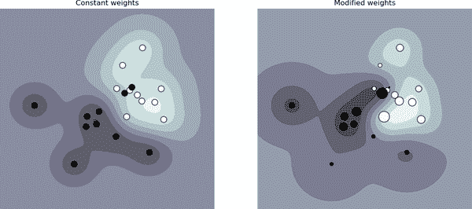

###### 图 4-1。样本权重可以影响决策边界。左边是所有样本被赋予相等权重时的情况。右边是样本被赋予不同权重时的情况。来源：scikit-learn⁶

## 水库抽样

水库抽样是一种非常有趣的算法，特别适用于处理流数据，这通常是生产环境中的数据。

想象一下，你有一系列即将到来的推文，你想要随机抽取一定数量的推文进行分析或模型训练。你不知道有多少推文，但是你知道你无法将它们全部存储在内存中，这意味着你无法预先知道应该选择推文的概率。你想要确保：

+   每条推文被选中的概率是相等的。

+   你可以随时停止算法，推文将按正确的概率进行抽样。

这个问题的一个解决方案是蓄水池抽样。该算法涉及一个蓄水池，可以是一个数组，并包括三个步骤：

1.  将前 *k* 个元素放入蓄水池中。

1.  对于每个到来的 *n*^(th) 元素，生成一个随机数 *i*，使得 1 ≤ *i* ≤ *n*。

1.  如果 1 ≤ *i* ≤ *k*：用 *n*^(th) 元素替换蓄水池中的 *i*^(th) 元素。否则，不执行任何操作。

这意味着每个到来的 *n*^(th) 元素都有 <math alttext="StartFraction k Over n EndFraction"><mfrac><mi>k</mi> <mi>n</mi></mfrac></math> 的概率进入蓄水池。你也可以证明蓄水池中的每个元素有 <math alttext="StartFraction k Over n EndFraction"><mfrac><mi>k</mi> <mi>n</mi></mfrac></math> 的概率存在于那里。这意味着所有样本被选中的概率是相等的。如果我们在任何时候停止算法，蓄水池中的所有样本都以正确的概率被抽样到。图 4-2 展示了蓄水池抽样工作原理的一个示例。

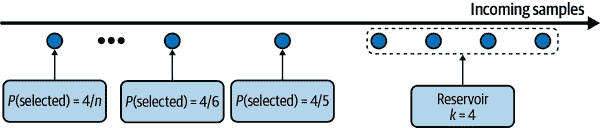

###### 图 4-2\. 演示了蓄水池抽样的工作原理

## 重要性抽样

重要性抽样是最重要的抽样方法之一，不仅在机器学习中如此。它允许我们在只有另一种分布的访问权限时，从一个分布中进行抽样。

想象一下，你需要从分布 *P*(*x*) 中抽样 *x*，但 *P*(*x*) 的抽样可能非常昂贵、缓慢或不可行。但是，你有一个分布 *Q*(*x*)，它更容易抽样。因此，你从 *Q*(*x*) 中抽样 *x*，并用 <math alttext="StartFraction upper P left-parenthesis x right-parenthesis Over upper Q left-parenthesis x right-parenthesis EndFraction"><mfrac><mrow><mi>P</mi><mo>(</mo><mi>x</mi><mo>)</mo></mrow> <mrow><mi>Q</mi><mo>(</mo><mi>x</mi><mo>)</mo></mrow></mfrac></math> 加权这个样本。*Q*(*x*) 被称为*提议分布*或*重要性分布*。只要 *P*(*x*) ≠ 0，*Q*(*x*) 就可以是任何分布。下面的方程显示了期望中，从 *P*(*x*) 中抽样的 *x* 等于从 *Q*(*x*) 中抽样的 *x*，乘以 <math alttext="StartFraction upper P left-parenthesis x right-parenthesis Over upper Q left-parenthesis x right-parenthesis EndFraction"><mfrac><mrow><mi>P</mi><mo>(</mo><mi>x</mi><mo>)</mo></mrow> <mrow><mi>Q</mi><mo>(</mo><mi>x</mi><mo>)</mo></mrow></mfrac></math> 的权重：

<math alttext="upper E Subscript upper P left-parenthesis x right-parenthesis Baseline left-bracket x right-bracket equals sigma-summation Underscript x Endscripts upper P left-parenthesis x right-parenthesis x equals sigma-summation Underscript x Endscripts upper Q left-parenthesis x right-parenthesis x StartFraction upper P left-parenthesis x right-parenthesis Over upper Q left-parenthesis x right-parenthesis EndFraction equals upper E Subscript upper Q left-parenthesis x right-parenthesis Baseline left-bracket x StartFraction upper P left-parenthesis x right-parenthesis Over upper Q left-parenthesis x right-parenthesis EndFraction right-bracket" display="block"><mrow><msub><mi>E</mi> <mrow><mi>P</mi><mo>(</mo><mi>x</mi><mo>)</mo></mrow></msub> <mrow><mo>[</mo> <mi>x</mi> <mo>]</mo></mrow> <mo>=</mo> <munder><mo>∑</mo> <mi>x</mi></munder> <mi>P</mi> <mrow><mo>(</mo> <mi>x</mi> <mo>)</mo></mrow> <mi>x</mi> <mo>=</mo> <munder><mo>∑</mo> <mi>x</mi></munder> <mi>Q</mi> <mrow><mo>(</mo> <mi>x</mi> <mo>)</mo></mrow> <mi>x</mi> <mfrac><mrow><mi>P</mi><mo>(</mo><mi>x</mi><mo>)</mo></mrow> <mrow><mi>Q</mi><mo>(</mo><mi>x</mi><mo>)</mo></mrow></mfrac> <mo>=</mo> <msub><mi>E</mi> <mrow><mi>Q</mi><mo>(</mo><mi>x</mi><mo>)</mo></mrow></msub> <mrow><mo>[</mo> <mi>x</mi> <mfrac><mrow><mi>P</mi><mo>(</mo><mi>x</mi><mo>)</mo></mrow> <mrow><mi>Q</mi><mo>(</mo><mi>x</mi><mo>)</mo></mrow></mfrac> <mo>]</mo></mrow></mrow></math>

在机器学习中使用重要性采样的一个例子是基于策略的强化学习。考虑这样一种情况，当你想要更新你的策略时。你希望估算新策略的值函数，但是计算采取行动后的总奖励可能很昂贵，因为这需要考虑到所有可能的结果，直到时间顶点结束。然而，如果新策略与旧策略相对接近，你可以基于旧策略计算总奖励，并根据新策略对其进行重新加权。旧策略的奖励构成提案分布。

# 标签化

尽管无监督机器学习有很大潜力，但今天大多数生产中的机器学习模型仍然是有监督的，这意味着它们需要有标记的数据来学习。机器学习模型的性能仍然严重依赖于它们所训练的有标记数据的质量和数量。

在一次与我的学生交谈中，特斯拉人工智能主管安德烈·卡帕西分享了一个轶事。他决定建立一个内部标注团队时，他的招聘人员问他需要这支团队多久。他回答道：“我们需要工程团队多久？”数据标注已经从辅助任务发展成为许多生产中机器学习团队的核心功能。

在本节中，我们将讨论获取数据标签的挑战。我们首先将讨论数据科学家在谈论标签时通常首先考虑的标注方法：手动标注。然后我们将讨论自然标签任务，即从系统中推断标签的任务，而无需人类注释，接着是在自然标签和手动标签都缺失时应采取的措施。

## 手动标签

任何曾经在生产中处理数据的人都可能从直观上感受到这一点：获取数据的手动标签因为种种原因非常困难。首先，手动标注数据可能非常昂贵，特别是如果需要专业的主题专家知识。例如，要分类评论是否为垃圾评论，您可以在众包平台上找到 20 名标注者，并在 15 分钟内训练他们标记您的数据。但是，如果您想要标记胸部 X 光片，您就需要找到经过认证的放射科医生，他们的时间有限且昂贵。

其次，手动标注对数据隐私构成威胁。手动标注意味着有人需要查看您的数据，如果您的数据具有严格的隐私要求，这并不总是可能的。例如，您不能仅仅将患者的医疗记录或公司的机密财务信息发送给第三方服务进行标注。在许多情况下，您的数据甚至可能不允许离开您的组织，您可能需要雇佣或签约标注员在您的数据上标记。

其次，手动标记速度慢。例如，精确转录语音发音的音素级别可能比发音持续时间长 400 倍。⁷ 因此，如果你想要标注 1 小时的语音，一个人可能需要花费 400 个小时，或者几乎 3 个月的时间。在一项研究中，为了帮助从 X 射线中分类肺癌，我的同事们不得不等待将近一年才能获得足够的标签。

缓慢的标记速度导致迭代速度慢，使得你的模型难以适应不断变化的环境和需求。如果任务或数据发生变化，你必须等待数据重新标记才能更新模型。想象一下这样的场景：你有一个情感分析模型，用于分析提到你品牌的每条推文的情感。它只有两个类别：负面和正面。然而，在部署后，你的公关团队意识到最大的损害来自愤怒的推文，并希望更快地回应愤怒的消息。因此，你需要更新你的情感分析模型，增加三个类别：负面、正面和愤怒。为此，你需要再次查看你的数据，看看哪些现有的训练示例应该重新标记为愤怒。如果你没有足够的愤怒示例，你将不得不收集更多的数据。这个过程越长，你现有模型的性能就会下降得越多。

### 标签的多样性

通常，为了获得足够的标记数据，公司必须使用多个来源的数据，并依赖于具有不同专业水平的多位标注者。这些不同的数据来源和标注者也具有不同的准确性水平。这就导致了标签的歧义性或标签的多样性问题：当一个数据实例存在多个冲突的标签时该如何处理。

考虑到实体识别的简单任务。你给了三位标注者以下样本，并要求他们标注出所有能找到的实体：

> 辛迪厄斯·达斯，简称为皇帝，是西斯领主中统治银河系的银河帝国的银河皇帝。

你会得到三种不同的解决方案，如表 4-1 所示。三位标注者标识出了不同的实体。你的模型应该基于哪一个进行训练？基于标注者 1 标记的数据训练的模型与基于标注者 2 标记的模型表现差异非常大。

表 4-1\. 不同标注者标识的实体可能非常不同

| 标注者 | # 实体 | 标注 |
| --- | --- | --- |
| 1 | 3 | [*辛迪厄斯·达斯*]，简称为[*皇帝*]，是[*西斯领主*]之一，统治着银河系，作为[*第一银河帝国的银河皇帝*]。 |
| 2 | 6 | [*辛迪厄斯·达斯*]，简称为[*皇帝*]，是[*西斯领主*]之一，统治着银河系，作为[*第一银河帝国的银河皇帝*]。 |
| 3 | 4 | [*达斯·西迪厄斯*]，简称为[*皇帝*]，是一个统治宇宙的[*西斯黑暗领主*]，并作为[*第一银河帝国的银河帝国皇帝*]统治着银河系。 |

标注者之间的分歧非常常见。领域专业知识要求越高，标注分歧的可能性就越大。如果一个专家认为标签应该是 A，而另一个认为应该是 B，我们如何解决这种冲突以获得一个统一的真相？如果人类专家无法就标签达成一致意见，人类水平的表现又意味着什么呢？

为了减少标记者之间的分歧，首先必须明确定义问题。例如，在前述的实体识别任务中，一些分歧可以通过澄清的方式加以消除，即在存在多个可能实体的情况下，选择包含最长子字符串的实体。这意味着*第一银河帝国的银河帝国皇帝*而不是*银河帝国*和*第一银河帝国*。其次，你需要将这个定义纳入标注者的训练中，以确保所有标记者理解这些规则。

### 数据血统

不加区分地使用来自不同标注者生成的多个来源的数据，而不检查它们的质量，可能导致你的模型神秘地失败。考虑这样一种情况，你已经用 10 万个数据样本训练了一个适度好的模型。你的机器学习工程师确信更多的数据会提高模型性能，所以你花了大量资金雇佣标注者为另外一百万数据样本打标签。

然而，在用新数据训练后，模型性能实际上下降了。原因是新的百万个样本是通过标注者众包来标记的，而这些标注者的标记精度明显低于原始数据。如果你已经混合了数据，并且无法区分新数据和旧数据，那么解决这个问题将会格外困难。

良好的做法是跟踪每个数据样本的来源以及其标签，这一技术被称为*数据血统*。数据血统可以帮助你识别数据中潜在的偏见并调试你的模型。例如，如果你的模型在最近获得的数据样本上表现不佳，你可能需要查看新数据是如何获取的。我们多次发现问题不在于我们的模型，而是因为最近获取的数据中错误标签的数量异常之高。

## 自然标签

手动标记并不是唯一的标签来源。您可能有幸可以在具有自然的地面真实标签的任务上工作。具有自然标签的任务是模型的预测可以通过系统自动或部分自动地进行评估的任务。例如，估计 Google 地图上某条路线的到达时间的模型。如果您采用了该路线，到达后，Google 地图知道实际行程需要多长时间，因此可以评估预测到达时间的准确性。另一个例子是股票价格预测。如果您的模型预测某只股票的下一个两分钟的价格，则两分钟后，您可以将预测价格与实际价格进行比较。

具有自然标签的任务的典型例子是推荐系统。推荐系统的目标是向用户推荐与他们相关的项目。用户是否点击推荐的项目可以被视为该推荐的反馈。被点击的推荐可以被认为是好的（即标签为正面），而在一段时间后没有被点击的推荐，比如 10 分钟后，可以被认为是坏的（即标签为负面）。

许多任务可以作为推荐任务来进行。例如，您可以将预测广告点击率的任务构建为根据用户的活动历史和资料，向他们推荐最相关的广告。从用户行为如点击和评分中推断的自然标签也被称为行为标签。

即使您的任务本质上没有自然标签，也可能可以设置系统以收集模型的一些反馈。例如，如果您正在构建像 Google 翻译这样的机器翻译系统，您可以让社区提交对糟糕翻译的替代翻译选项，这些替代翻译可以用于训练模型的下一次迭代（尽管您可能需要先审核这些建议的翻译）。新闻推送排名不是一个具有固有标签的任务，但通过在每个新闻推送项目上添加“赞”按钮和其他反应，Facebook 能够收集其排名算法的反馈。

在行业中，具有自然标签的任务非常普遍。在我网络中的 86 家公司的调查中，我发现其中 63%的公司处理具有自然标签的任务，如图 4-3 所示。这并不意味着可以从 ML 解决方案中受益的任务中 63%具有自然标签。更可能的情况是，公司发现先从具有自然标签的任务开始更容易和更便宜。

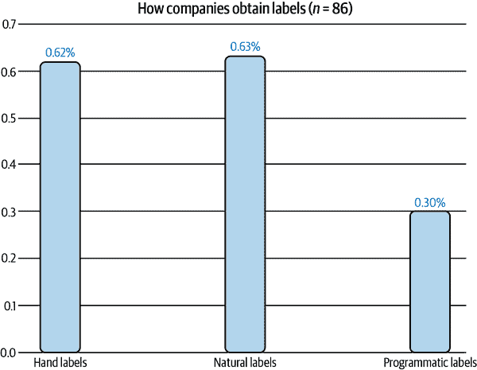

###### 图 4-3\. 我的网络中 63%的公司从事具有自然标签的任务。百分比之和不为 1 是因为公司可以处理具有不同标签来源的任务。⁹

在前面的例子中，如果一个推荐在一段时间后没有被点击，可以推断它不好。这被称为*隐式标签*，因为这种负标签是基于缺少正标签推断出来的。这与*显式标签*不同，显式标签是指用户通过给推荐物品低评分或投反对票来明确表达对推荐的反馈。

### 反馈循环长度

对于具有自然真实标签的任务，从提供预测到提供反馈的时间称为反馈循环长度。具有短反馈循环的任务是指标签通常在几分钟内就可用的任务。许多推荐系统具有短反馈循环。如果推荐的物品是亚马逊上的相关产品或者在 Twitter 上关注的人，推荐物品被推荐到被点击（如果有点击）之间的时间很短。

然而，并非所有推荐系统都有分钟级的反馈循环。如果你处理像博客文章、文章或 YouTube 视频这样的长内容类型，反馈循环可能需要几个小时。例如，如果你构建一个像 Stitch Fix 的服装推荐系统，你在用户收到并试穿衣物之前可能不会得到反馈，这可能需要几周的时间。

选择正确的窗口长度需要深思熟虑，因为它涉及速度和准确性的权衡。较短的窗口长度意味着你可以更快地捕获标签，这使你能够使用这些标签来检测模型的问题并尽快解决这些问题。然而，较短的窗口长度也意味着在推荐被点击之前可能会过早地将推荐标记为不好。

无论你设置窗口长度多长，可能仍会有过早的负标签。2021 年初，Twitter 广告团队的一项研究发现，尽管大多数广告点击发生在前五分钟内，但有些点击发生在广告展示后的几个小时内¹⁰。这意味着这种类型的标签往往低估了实际的点击率。如果你只记录了 1,000 个正标签，实际的点击数可能会超过 1,000。

对于具有长反馈循环的任务，自然标签可能需要几周甚至几个月才会到达。欺诈检测就是一个具有长反馈循环的示例。在交易后的一段时间内，用户可以对该交易是否欺诈提出异议。例如，当客户查看他们的信用卡账单并看到一个他们不认识的交易时，他们可能会向银行提出异议，从而给银行提供反馈，标记该交易为欺诈。典型的争议窗口是一个到三个月。在争议窗口结束后，如果用户没有提出异议，你可以推断该交易是合法的。

具有长反馈循环的标签对于在季度或年度业务报告中报告模型性能非常有帮助。但是，如果您希望尽快检测到模型问题，则并不是非常有帮助。如果您的欺诈检测模型存在问题，并且需要几个月才能发现，那么在问题被修复时，您的错误模型放行的所有欺诈交易可能会导致小企业破产。

## 处理标签缺失

由于获取足够高质量标签的挑战，许多技术已被开发来解决由此导致的问题。在本节中，我们将涵盖四种方法：弱监督、半监督、迁移学习和主动学习。这些方法的摘要显示在表 4-2 中。

表 4-2\. 处理缺乏手动标记数据的四种技术的摘要

| 方法 | 如何 | 是否需要地面真值？ |
| --- | --- | --- |
| 弱监督 | 利用（通常是嘈杂的）启发式来生成标签 | No，但建议使用少量标签来指导启发式的开发 |
| 半监督 | 利用结构假设生成标签 | Yes，使用少量初始标签作为种子来生成更多标签 |
| 迁移学习 | 利用在另一个任务上预训练的模型来执行您的新任务 | 对于零-shot 学习来说是 No，但是对于微调来说是 Yes，尽管所需的地面真值数量通常要小得多，而不是您从头开始训练该模型时所需的数量 |
| 主动学习 | 标记对您的模型最有用的数据样本 | Yes |

### 弱监督

如果手动标记如此棘手，那么如果我们完全不使用手动标签会怎样？一种获得广泛关注的方法是弱监督。弱监督的最流行的开源工具之一是由斯坦福人工智能实验室开发的 Snorkel。¹¹ 弱监督背后的见解是人们依赖启发式，可以通过主题专业知识来开发，来标记数据。例如，医生可能使用以下启发式来决定是否应将患者病例优先考虑为紧急：

> 如果护士的笔记提到严重病情如肺炎，应优先考虑患者的病例。

Snorkel 等库是围绕标签函数（LF）的概念构建的：一种编码启发式的函数。上述启发式可以通过以下函数表达：

```
def labeling_function(note):
   if "pneumonia" in note:
     return "EMERGENT"
```

LFs 可以编码许多不同类型的启发式方法。以下是其中一些：

关键词启发式

例如前面的例子

正则表达式

例如，如果笔记匹配或未能匹配某个特定正则表达式

数据库查找

例如，如果笔记包含在危险疾病列表中列出的疾病

其他模型的输出

例如，如果现有系统将其分类为`EMERGENT`

在编写了 LFs 之后，您可以将它们应用于要标注的样本。

因为 LFs 编码启发式，而启发式是有噪音的，LFs 产生的标签也会有噪音。多个 LFs 可能适用于同一数据示例，并且它们可能会给出冲突的标签。一个函数可能认为护士的笔记是`EMERGENT`，但另一个函数可能认为不是。一个启发式可能比另一个启发式更准确，但您可能不知道，因为没有地面真实标签进行比较。重要的是将所有 LFs 组合、去噪声并重新加权，以获取最有可能正确的一组标签。图 4-4 在高层次展示了 LFs 如何工作。

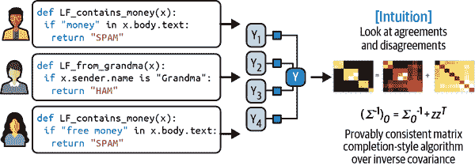

###### 图 4-4\. 标注函数如何组合的高级概述。来源：Ratner 等人的图像¹²

理论上，弱监督不需要任何手动标签。然而，为了了解 LFs 的准确性，建议对少量手动标签进行评估。这些手动标签可以帮助您发现数据中的模式，以编写更好的 LFs。

弱监督在数据有严格隐私要求时尤为有用。您只需查看少量经过清理的数据子集来编写 LFs，然后可以将其应用于其他数据，而无需任何人查看。

利用 LFs，主题专业知识可以进行版本管理、重复使用和共享。一个团队拥有的专业知识可以被编码并被另一个团队使用。如果您的数据或需求发生变化，您只需重新应用 LFs 到数据样本即可。使用 LFs 为数据生成标签的方法也被称为程序化标注。表格 4-3 展示了程序化标注相对于手动标注的一些优势。

表格 4-3\. 程序化标注相对于手动标注的优势

| 手动标注 | 程序化标注 |
| --- | --- |
| **昂贵**：特别是需要主题专业知识时 | **节约成本**：专业知识可以在整个组织中进行版本管理、共享和重复使用 |
| **隐私缺乏**：需要将数据发送给人类标注者 | **隐私**：使用清理后的数据子样本创建标注函数（LFs），然后将 LFs 应用于其他数据而无需查看单个样本 |
| **缓慢**：所需时间随需要标注的标签数呈线性增长 | **快速**：轻松从 1K 扩展到 1M 个样本 |
| **非自适应**：每次更改都需要重新标注数据 | **自适应**：当发生更改时，只需重新应用 LFs！ |

这里有一个案例研究，展示弱监督在实践中的良好效果。在与斯坦福医学院的一项研究中¹³，使用单个放射科医生编写 LFs 后获得的弱监督标签训练的模型，其性能与通过近一年的手工标注获得的数据训练的模型相当，如图 4-5 所示。有关实验结果的两个有趣事实。首先，即使没有更多的 LFs，模型仍在随着更多未标记数据而改进。其次，LFs 在任务之间被重复使用。研究人员能够在胸部 X 射线（CXR）任务和四肢 X 射线（EXR）任务之间重复使用六个 LFs¹⁴。

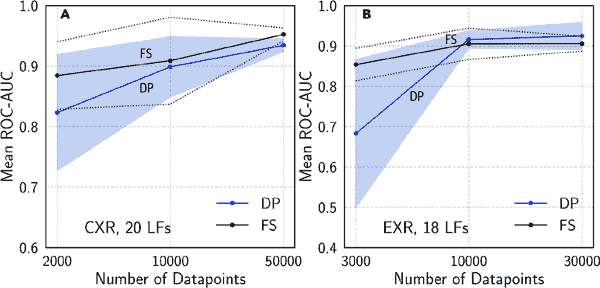

###### 图 4-5。完全监督标签（FS）训练的模型与程序标签（DP）训练的模型在 CXR 和 EXR 任务上性能的比较。来源：Dunnmon 等人¹⁵

我的学生经常问，如果启发式方法能够如此有效地标记数据，为什么我们还需要机器学习模型呢？一个原因是 LFs 可能无法覆盖所有数据样本，因此我们可以在由 LFs 程序标记的数据上训练机器学习模型，并使用此训练模型为没有任何 LFs 覆盖的样本生成预测。

弱监督是一种简单但强大的范式。然而，它并不完美。在某些情况下，通过弱监督获得的标签可能太嘈杂，以至于无法派上用场。但即使在这些情况下，弱监督也可以是一个很好的起点，当您想要探索机器学习的有效性而又不想在最开始投入过多手工标注时。

### 半监督学习

如果弱监督利用启发式方法获取嘈杂的标签，半监督则利用结构假设基于少量初始标签生成新标签。与弱监督不同，半监督需要一组初始标签。

半监督学习是一种技术，早在 90 年代就开始使用¹⁶，从那时起，许多半监督方法已经被开发出来。对半监督学习的全面回顾超出了本书的范围。我们将讨论其中的一小部分方法，以让读者了解它们的使用方式。对于全面的回顾，我推荐阅读[“半监督学习文献综述”](https://oreil.ly/ULeWD)（Xiaojin Zhu, 2008）和[“关于半监督学习的调查”](https://oreil.ly/JYgCH)（Engelen 和 Hoos, 2018）。

经典的半监督方法是*自训练*。您首先在现有的标记数据集上训练模型，然后使用该模型对未标记样本进行预测。假设具有高原始概率分数的预测是正确的，则将高概率预测的标签添加到训练集中，并在这个扩展的训练集上训练新模型。这个过程一直持续，直到您对模型的表现满意。

另一种半监督方法假设具有相似特征的数据样本共享相同的标签。这种相似性可能是显而易见的，例如在分类 Twitter 标签主题的任务中。你可以开始将标签为“#AI”的标签标记为计算机科学。假设在同一条推文或个人资料中出现的标签很可能是关于相同主题的，鉴于 MIT CSAIL 在 Figure 4-6 中的资料，你也可以将标签“#ML”和“#BigData”标记为计算机科学。

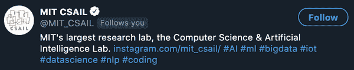

###### 图 4-6。因为 #ML 和 #BigData 在同一个 Twitter 资料中出现在 #AI 旁边，我们可以假设它们属于同一个主题。

在大多数情况下，只有通过更复杂的方法才能发现相似性。例如，你可能需要使用聚类方法或 *k* 最近邻算法来发现属于同一簇的样本。

近年来备受欢迎的半监督方法之一是基于扰动的方法。它基于这样的假设：对样本进行小的扰动不应改变其标签。因此，你可以对训练实例施加小的扰动以获得新的训练实例。这些扰动可以直接应用于样本（例如，向图像添加白噪声）或者应用于它们的表示（例如，向单词的嵌入添加小的随机值）。扰动后的样本与未扰动的样本具有相同的标签。我们将在 “扰动” 部分进一步讨论这个问题。

在某些情况下，即使给定数据集中有相当比例的标签被丢弃，半监督方法的表现也达到了纯监督学习的水平¹⁷。

当训练标签数量有限时，半监督方法变得尤为有用。在使用有限数据进行半监督时，需要考虑的一点是如何利用这些有限数据来评估多个候选模型并选择最佳模型。如果使用少量数据，则在这个小型评估集上表现最佳的模型可能是对这个集合过拟合最严重的模型。另一方面，如果使用大量数据进行评估，则基于这个评估集选择最佳模型所获得的性能提升可能小于通过将评估集添加到有限训练集中所获得的性能提升。许多公司通过在较大的评估集上选择最佳模型，然后继续在评估集上训练冠军模型来克服这种权衡。

### 迁移学习

迁移学习是指一种方法族，其中为一个任务开发的模型被重复用作第二个任务模型的起点。首先，基础模型被训练用于一个基础任务。通常，基础任务是一个拥有廉价且丰富的训练数据的任务。语言建模是一个很好的候选，因为它不需要标记数据。语言模型可以在任何文本体系上进行训练——书籍、维基百科文章、聊天记录——任务是：给定一系列标记，¹⁸ 预测下一个标记。当给定序列“I bought NVIDIA shares because I believe in the importance of,”时，语言模型可能会输出“hardware”或“GPU”作为下一个标记。

然后，可以将训练好的模型用于您感兴趣的任务——下游任务——如情感分析、意图检测或问答。在某些情况下，例如零样本学习场景中，您可以直接在下游任务中使用基础模型。在许多情况下，您可能需要*微调*基础模型。微调意味着对基础模型进行小的更改，例如继续训练基础模型或部分基础模型，使用给定下游任务的数据。¹⁹

有时候，您可能需要使用模板修改输入，以促使基础模型生成您想要的输出。²⁰ 例如，要将语言模型用作问答任务的基础模型，您可能想要使用以下提示：

*Q: 美国是何时成立的？*

*A: 1776 年 7 月 4 日。*

*Q: 谁写了《独立宣言》？*

*A: 托马斯·杰斐逊。*

*Q: 亚历山大·汉密尔顿是哪一年出生的？*

*A:*

当您将此提示输入到诸如[GPT-3](https://oreil.ly/qT0r3)之类的语言模型中时，它可能会输出亚历山大·汉密尔顿的出生年份。

对于没有大量标记数据的任务，迁移学习尤为吸引人。即使对于有大量标记数据的任务，使用预训练模型作为起点通常也能显著提高性能，与从头开始训练相比。

近年来，迁移学习因合理的原因引起了广泛关注。它使得许多以前由于缺乏训练样本而不可能的应用成为可能。今天生产中的许多 ML 模型的非微不足道部分都是迁移学习的结果，包括利用在 ImageNet 上预训练的模型的目标检测模型和利用预训练语言模型（如 BERT 或 GPT-3）的文本分类模型。²¹ 迁移学习还降低了 ML 的进入门槛，因为它有助于减少构建 ML 应用程序所需的标记数据的前期成本。

过去五年出现的一个趋势是，通常情况下，预训练基模型越大，其在下游任务上的表现越好。大型模型训练成本高昂。根据 GPT-3 的配置，估计训练此模型的成本在数千万美元。许多人推测，未来只有少数公司能负担得起大型预训练模型的训练成本。其余行业将直接使用这些预训练模型或根据特定需求进行微调。

### 主动学习

主动学习是提高数据标签效率的一种方法。希望机器学习模型可以在较少的训练标签下实现更高的准确性，如果能够选择要学习的数据样本。有时称为查询学习的主动学习术语正变得越来越不受欢迎，因为一个模型（主动学习器）会以未标记样本的形式向注释者（通常是人类）发送回查询。

不是随机标记数据样本，而是根据某些指标或启发式标记对模型最有帮助的样本。最直接的度量标准是不确定性测量——标记模型对预测决策边界最不确定的示例，希望这些示例能帮助模型学习得更好。例如，在分类问题中，您的模型为不同类别输出原始概率，它可能选择预测类别概率最低的数据样本。图 4-7 展示了这种方法在一个玩具示例中的有效性。

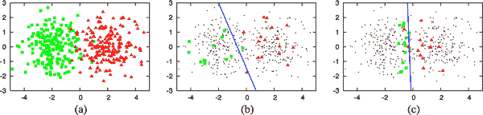

###### 图 4-7\. 不确定性基础的主动学习工作原理。 (a) 一个玩具数据集，包括来自两个类高斯分布的均匀采样的 400 个实例。 (b) 在 30 个随机标记样本上训练的模型的准确率为 70%。 (c) 在 30 个由主动学习选择的样本上训练的模型的准确率为 90%。来源：Burr Settles²²

另一个常见的启发式方法基于多个候选模型之间的不同意见。这种方法称为委员会查询，是集成方法的一个例子。²³ 您需要一个由几个候选模型组成的委员会，通常是相同的模型，但使用不同的超参数集或在不同数据片段上训练的相同模型。每个模型可以对应该标记哪些样本进行投票，可能会基于其对预测的不确定性而投票。然后，您标记委员会在意见分歧最大的样本。

还有其他启发式方法，如选择使梯度更新最大或将损失最大减少的样本。要全面了解主动学习方法，请参阅《主动学习文献综述》（Settles 2010）。

待标记的样本可以来自不同的数据模式。它们可以是合成的，其中您的模型生成在输入空间中最不确定的区域内的样本。²⁴ 它们可以来自稳态分布，您已经收集了大量未标记数据，并且您的模型从此池中选择样本进行标记。它们可以来自真实世界的分布，其中您有一系列数据流入，如在生产中，您的模型从此数据流中选择样本进行标记。

当系统使用实时数据时，我最为激动的是主动学习。数据随时变化，这是我们在第一章中简要提及并将在第八章中进一步详细说明的现象。在这种数据模式中进行主动学习将使您的模型能够更有效地实时学习，并更快地适应变化的环境。

# 类不平衡

类不平衡通常指的是分类任务中的问题，其中训练数据集中每个类别的样本数量差异显著。例如，在用于从 X 射线图像中检测肺癌的训练数据集中，99.99%的 X 射线可能来自正常肺部，仅有 0.01%可能包含癌细胞。

类不平衡问题也可能发生在回归任务中，其中标签是连续的。考虑估算医疗费用的任务。²⁵ 医疗费用极不平衡——中位数账单较低，但 95 分位数账单高得惊人。在预测医院账单时，准确预测 95 分位数账单可能比预测中位数账单更为重要。对于 250 美元的账单，100%的差异是可以接受的（实际为 500 美元，预测为 250 美元），但对于 1 万美元的账单，100%的差异是不可以接受的（实际为 2 万美元，预测为 1 万美元）。因此，我们可能需要训练模型更好地预测 95 分位数账单，即使这会降低整体指标。

## 类不平衡的挑战

机器学习，尤其是深度学习，在数据分布更平衡的情况下效果很好，但通常在类别严重不平衡时效果不佳，如在图 4-8 中所示。类不平衡可能使学习变得困难，原因如下所述。

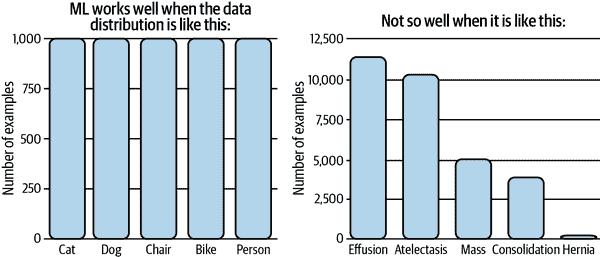

###### 图 4-8。机器学习在类平衡的情况下效果良好。来源：根据 Andrew Ng 的图像改编²⁶

第一个原因是类别不平衡通常意味着你的模型没有足够的信号来学习检测少数类别。在少数类别实例较少的情况下，问题变成了少样本学习问题，在模型做出决策之前，它只能少次地看到少数类别。在训练集中没有稀有类别实例的情况下，你的模型可能会假设这些稀有类别不存在。

第二个原因是类别不平衡使得你的模型更容易因为利用简单的启发式而陷入非最优解决方案，而不是学习数据底层模式中的任何有用信息。考虑前面的肺癌检测例子。如果你的模型学会了总是输出多数类别，它的准确率已经达到了 99.99%²⁷。这种启发式很难被梯度下降算法击败，因为对这种启发式稍加随机性可能会导致更差的准确率。

第三个原因是类别不平衡导致错误的不对称成本——在稀有类别样本上的错误预测成本可能远高于在多数类别样本上的错误预测成本。

例如，在具有癌细胞的 X 光片上的误分类比在正常肺部 X 光片上的误分类更危险。如果你的损失函数没有配置来处理这种不对称性，你的模型将对所有样本采取相同的方式。因此，你可能会得到一个在多数和少数类别上表现一样好的模型，而你更希望得到一个在多数类别上表现较差但在少数类别上表现更好的模型。

当我上学的时候，我得到的大多数数据集都有更或多或少平衡的类别²⁸。开始工作后意识到类别不平衡是常态，让我感到震惊。在现实世界中，罕见事件通常比普通事件更有趣（或更危险），许多任务集中于检测这些罕见事件。

类别不平衡任务的经典示例是欺诈检测。大多数信用卡交易并非欺诈性的。截至 2018 年，每 100 美元的持卡人消费中有 6.8 美分是欺诈的²⁹。另一个示例是客户流失预测。你的大多数客户可能并不打算取消订阅。如果他们这样做了，你的业务比客户流失预测算法更需要担心其他问题。其他示例包括疾病筛查（大多数人，幸运的是，并没有终末期疾病）和简历筛选（98%的求职者在初始简历筛选时被淘汰³⁰）。

类别不平衡的一个不太明显的例子是[目标检测](https://oreil.ly/CGEf5)。目标检测算法当前的工作方式是在图像上生成大量的边界框，然后预测哪些框最有可能包含对象。大多数边界框不包含相关对象。

除了类别不平衡在问题本身固有的情况外，类别不平衡也可能是在采样过程中产生偏差的结果。考虑这样一种情况：你想创建用于检测电子邮件是否为垃圾邮件的训练数据。你决定使用公司电子邮件数据库中的所有匿名电子邮件。根据 Talos Intelligence 的数据，截至 2021 年 5 月，几乎 85%的电子邮件是垃圾邮件。³¹ 但大多数垃圾邮件在到达公司数据库之前已被过滤掉，所以在你的数据集中，只有很小一部分是垃圾邮件。

导致类别不平衡的另一个原因，尽管较少见，是由于标记错误。标注者可能误读了说明或者按照错误的说明操作（认为只有两个类别，正面和负面，而实际上有三个），或者只是犯了错误。每当面对类别不平衡问题时，检查数据以理解其原因至关重要。

## 处理类别不平衡

由于在现实世界的应用中普遍存在，过去二十年来对类别不平衡进行了深入研究。³² 类别不平衡会根据不平衡的程度对任务产生不同影响。有些任务对类别不平衡更为敏感。Japkowicz 指出，对不平衡的敏感性随问题的复杂性增加而增加，并且非复杂、线性可分的问题不受任何类别不平衡的影响。³³ 在二元分类问题中，类别不平衡比在多类别分类问题中要简单得多。Ding 等人表明，从 2017 年开始，“非常深”的神经网络（指超过 10 层）在不平衡数据上的表现要比较浅的神经网络好得多。³⁴

已经有许多技术被提出来缓解类别不平衡的影响。然而，随着神经网络变得更大、更深，学习能力更强，有人可能会认为如果数据在现实世界中看起来是这样，那么你就不应该试图“修复”类别不平衡。一个好的模型应该学会建模这种不平衡。然而，开发一个足够好的模型可能是具有挑战性的，因此我们仍然需要依赖特殊的训练技术。

在本节中，我们将介绍三种处理类别不平衡的方法：选择适合你问题的正确指标；数据级方法，即改变数据分布使其不那么不平衡；以及算法级方法，即改变学习方法使其更能抵御类别不平衡。

这些技术可能是必要的，但不足以。为了进行全面的调查，我建议阅读 [“类别不平衡深度学习调查”](https://oreil.ly/9QvBr)（Johnson 和 Khoshgoftaar，2019）。

### 使用正确的评估指标

面对类别不平衡的任务，选择合适的评估指标是最重要的事情。错误的指标会给你错误的模型表现观念，进而无法帮助你开发或选择足够适合你任务的模型。

总体准确率和误差率是报告机器学习模型性能最常用的指标。然而，对于类别不平衡的任务，这些指标不足以，因为它们同等对待所有类别，这意味着模型在多数类上的表现将主导这些指标。当多数类不是你关心的类时，这尤为糟糕。

考虑一个具有两个标签的任务：癌症（正类）和正常（负类），其中 90% 的标记数据是正常的。考虑两个模型，A 和 B，其混淆矩阵分别显示在表 4-4 和 4-5 中。

表 4-4\. 模型 A 的混淆矩阵；模型 A 能检测出 100 个癌症病例中的 10 个。

| 模型 A | 实际癌症 | 实际正常 |
| --- | --- | --- |
| 预测癌症 | 10 | 10 |
| 预测正常 | 90 | 890 |

表 4-5\. 模型 B 的混淆矩阵；模型 B 能检测出 100 个癌症病例中的 90 个。

| 模型 B | 实际癌症 | 实际正常 |
| --- | --- | --- |
| 预测癌症 | 90 | 90 |
| 预测正常 | 10 | 810 |

如果你和大多数人一样，你可能更倾向于模型 B 来为你做预测，因为它有更好的可能性告诉你是否真的得了癌症。然而，它们的准确率都是 0.9。

有助于了解模型在特定类别上表现的指标更为合适。如果你为每个类别单独使用准确率，那么准确率仍然是一个不错的指标。模型 A 在癌症类别上的准确率为 10%，模型 B 在癌症类别上的准确率为 90%。

F1 值、精确率和召回率是用于衡量二元分类问题中模型性能的指标，因为它们依赖于真正例——模型正确预测正类的情况。³⁵

F1 值、精确率和召回率是非对称的指标，这意味着它们的值取决于哪个类被视为正类。在我们的情况下，如果我们将癌症视为正类，模型 A 的 F1 值为 0.17。然而，如果我们将正常视为正类，模型 A 的 F1 值为 0.95。当癌症被视为正类时，模型 A 和模型 B 的准确率、精确率、召回率和 F1 分数显示在 表 4-7 中。

表 4-7\. 尽管一个模型明显优于另一个模型，但两个模型的准确度相同。

|  | 癌症 (1) | 正常 (0) | 准确率 | 精确率 | 召回率 | F1 |
| --- | --- | --- | --- | --- | --- | --- |
| 模型 A | 10/100 | 890/900 | 0.9 | 0.5 | 0.1 | 0.17 |
| 模型 B | 90/100 | 810/900 | 0.9 | 0.5 | 0.9 | 0.64 |

许多分类问题可以建模为回归问题。您的模型可以输出一个概率，基于该概率对样本进行分类。例如，如果值大于 0.5，则为正标签；如果小于或等于 0.5，则为负标签。这意味着您可以调整阈值以增加*真正阳性率*（也称为*召回率*），同时降低*假阳性率*（也称为*误报概率*），反之亦然。我们可以绘制不同阈值下的真正阳性率与假阳性率的曲线。这种绘图称为*ROC 曲线*（接收者操作特征曲线）。当您的模型完美时，召回率为 1.0，曲线则位于顶部。这条曲线显示了模型性能如何随阈值变化而变化，并帮助您选择最适合您的阈值。曲线越接近完美直线，您的模型性能越好。

曲线下面积（AUC）衡量了 ROC 曲线下面的面积。由于曲线越接近完美直线越好，因此该面积越大越好，正如图 4-9 所示。

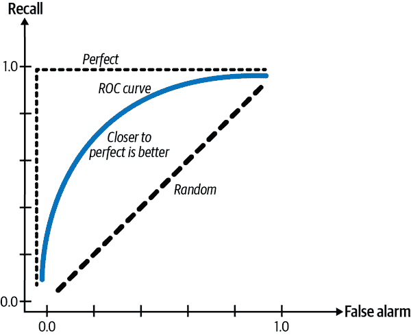

###### 图 4-9\. ROC 曲线

与 F1 和召回率一样，ROC 曲线仅关注正类，并不显示模型在负类上的表现如何。戴维斯和戈德里奇建议我们应该绘制精确率与召回率的曲线，即他们称之为精确-召回曲线。他们认为，这条曲线更详细地展示了算法在类别不平衡任务上的性能³⁶。

### 数据级方法：重新取样

数据级方法修改训练数据的分布，以降低不平衡程度，使模型更容易学习。一类常见的技术是重新取样。重新取样包括过采样，增加少数类的实例，和欠采样，减少多数类的实例。最简单的欠采样方法是从多数类随机删除实例，而最简单的过采样方法是随机复制少数类的实例，直到您满意为止。图 4-10 展示了过采样和欠采样的可视化。

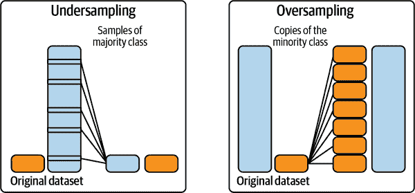

###### 图 4-10\. 示范如何工作的欠采样和过采样。来源：根据 Rafael Alencar 的图像调整³⁷

一种早在 1976 年开发的低维数据欠采样方法是 Tomek 链接。³⁸ 使用这种技术，您可以找到来自相对立类别的接近的样本对，并移除每对中大多数类的样本。

尽管这使得决策边界更清晰且有助于模型更好地学习边界，但可能会使模型更不稳健，因为模型无法从真实决策边界的微妙之处学习。

一种常见的低维数据过采样方法是 SMOTE（合成少数类过采样技术）。³⁹ 它通过在少数类内部现有数据点的凸组合抽样来合成新的样本。

SMOTE 和 Tomek 链接仅在低维数据中被证明有效。许多复杂的重新采样技术，如 Near-Miss 和单边选择，⁴¹ 需要计算实例之间或实例与决策边界之间的距离，这在高维数据或具有大型神经网络等高维特征空间中可能是昂贵或不可行的。

当您对训练数据重新采样时，请勿在重新采样数据上评估模型，因为这会导致模型过度拟合到重新采样的分布上。

欠采样存在移除数据会丢失重要数据的风险。过采样则存在过拟合训练数据的风险，特别是如果少数类的添加副本是现有数据的复制品。已开发了许多复杂的抽样技术来减轻这些风险。

其中一种技术是两阶段学习。⁴² 首先在重新采样的数据上训练模型。这些重新采样的数据可以通过随机欠采样大类直到每个类只有*N*个实例来实现。然后在原始数据上对模型进行微调。

另一种技术是动态抽样：在训练过程中对低效能类进行过采样，对高效能类进行欠采样。由 Pouyanfar 等人引入，⁴³ 该方法旨在向模型展示更多尚未学习的内容，而非已经学习过的内容。

### 算法级方法

如果数据级方法通过改变训练数据的分布来缓解类别不平衡的挑战，那么算法级方法则保持训练数据分布不变，但改变算法以使其更能抵御类别不平衡。

因为损失函数（或成本函数）指导了学习过程，许多算法级别的方法涉及调整损失函数。关键思想是，如果有两个实例*x*[1]和*x*[2]，并且对*x*[1]做出错误预测造成的损失比对*x*[2]做出错误预测造成的损失更高，那么模型将优先考虑对*x*[1]做出正确预测而不是对*x*[2]做出正确预测。通过给我们关心的训练实例更高的权重，我们可以使模型更专注于学习这些实例。

让<math alttext="upper L left-parenthesis x semicolon theta right-parenthesis"><mrow><mi>L</mi> <mo>(</mo> <mi>x</mi> <mo>;</mo> <mi>θ</mi> <mo>)</mo></mrow></math>表示模型参数设置为<math alttext="theta"><mi>θ</mi></math>时实例*x*引起的损失。模型的损失通常被定义为所有实例引起的平均损失。*N*表示训练样本的总数。

<math alttext="upper L left-parenthesis upper X semicolon theta right-parenthesis equals sigma-summation Underscript x Endscripts StartFraction 1 Over upper N EndFraction upper L left-parenthesis x semicolon theta right-parenthesis"><mrow><mi>L</mi> <mrow><mo>(</mo> <mi>X</mi> <mo>;</mo> <mi>θ</mi> <mo>)</mo></mrow> <mo>=</mo> <msub><mo>∑</mo> <mi>x</mi></msub> <mfrac><mn>1</mn> <mi>N</mi></mfrac> <mi>L</mi> <mrow><mo>(</mo> <mi>x</mi> <mo>;</mo> <mi>θ</mi> <mo>)</mo></mrow></mrow></math>

这个损失函数平等看待所有实例引起的损失，即使某些实例上的错误预测可能比其他实例上的错误预测要昂贵得多。有许多方法可以修改这个成本函数。在本节中，我们将专注于其中三种，首先是成本敏感学习。

#### 成本敏感学习

早在 2001 年，基于不同类别的误分类造成不同成本的洞察力，Elkan 提出了成本敏感学习，其中个体损失函数被修改以考虑这种不同的成本。⁴⁴ 该方法从使用成本矩阵开始，以指定*C[ij]*：如果将类*i*分类为类*j*的成本。如果*i* = *j*，那么是正确分类，成本通常为 0。否则，是误分类。如果将正例分类为负例的成本是反之的两倍，那么可以将*C*[10]设置为*C*[01]的两倍。

例如，如果有两类，正例和负例，则成本矩阵可以看起来像表 4-8\. 成本矩阵示例中那样。

表 4-8\. 成本矩阵示例

|  | 实际为负例 | 实际为正例 |
| --- | --- | --- |
| 预测为负例 | *C*(0, 0) = *C*[00] | *C*(1, 0) = *C*[10] |
| 预测为正例 | *C*(0, 1) = *C*[01] | *C*(1, 1) = *C*[11] |

类别*i*的实例*x*引起的损失将成为实例*x*的所有可能分类的加权平均值。

<math alttext="upper L left-parenthesis x semicolon theta right-parenthesis equals sigma-summation Underscript j Endscripts upper C Subscript i j Baseline upper P left-parenthesis j vertical-bar x semicolon theta right-parenthesis"><mrow><mi>L</mi> <mrow><mo>(</mo> <mi>x</mi> <mo>;</mo> <mi>θ</mi> <mo>)</mo></mrow> <mo>=</mo> <msub><mo>∑</mo> <mi>j</mi></msub> <msub><mi>C</mi> <mrow><mi>i</mi><mi>j</mi></mrow></msub> <mi>P</mi> <mrow><mo>(</mo> <mi>j</mi> <mo>|</mo> <mi>x</mi> <mo>;</mo> <mi>θ</mi> <mo>)</mo></mrow></mrow></math>

这个损失函数的问题在于，你必须手动定义成本矩阵，而这个矩阵在不同任务和不同尺度下是不同的。

#### 类平衡损失

当模型在不平衡数据集上训练时，可能会偏向主要类别，并在少数类别上做出错误预测。如果我们惩罚模型对少数类别做出错误预测以纠正这种偏差，可能会发生什么？

在其原始形式中，我们可以使每个类别的权重与该类别中的样本数成反比，以便稀有类别具有较高的权重。在下面的方程中，*N* 表示训练样本的总数：

<math alttext="upper W Subscript i Baseline equals StartFraction upper N Over number of samples of class reverse-solidus emph left-brace i right-brace EndFraction"><mrow><msub><mi>W</mi> <mi>i</mi></msub> <mo>=</mo> <mfrac><mi>N</mi> <mrow><mtext>number</mtext><mtext>of</mtext><mtext>samples</mtext><mtext>of</mtext><mtext>class</mtext><mtext>i</mtext></mrow></mfrac></mrow></math>

类别 *i* 的实例 *x* 导致的损失如下，其中 Loss(*x*, *j*) 是当 *x* 被分类为类别 *j* 时的损失。可以是交叉熵或任何其他损失函数。

<math alttext="upper L left-parenthesis x semicolon theta right-parenthesis equals upper W Subscript i Baseline sigma-summation Underscript j Endscripts upper P left-parenthesis j vertical-bar x semicolon theta right-parenthesis Loss left-parenthesis x comma j right-parenthesis"><mrow><mi>L</mi> <mrow><mo>(</mo> <mi>x</mi> <mo>;</mo> <mi>θ</mi> <mo>)</mo></mrow> <mo>=</mo> <msub><mi>W</mi> <mi>i</mi></msub> <msub><mo>∑</mo> <mi>j</mi></msub> <mi>P</mi> <mrow><mo>(</mo> <mi>j</mi> <mo>|</mo> <mi>x</mi> <mo>;</mo> <mi>θ</mi> <mo>)</mo></mrow> <mi>Loss</mi> <mrow><mo>(</mo> <mi>x</mi> <mo>,</mo> <mi>j</mi> <mo>)</mo></mrow></mrow></math>

这种损失的更复杂版本可以考虑现有样本之间的重叠，例如基于有效样本数量的类平衡损失。⁴⁵

#### 焦点损失

在我们的数据中，某些示例比其他示例更容易分类，我们的模型可能会快速学习它们的分类。我们希望激励我们的模型专注于学习那些仍然难以分类的样本。如果我们调整损失，使得样本被正确分类的概率较低，则其权重将更高。这正是焦点损失所做的。⁴⁶ 焦点损失的方程及其与交叉熵损失的性能如图 4-11 所示。

实际上，集成已经显示对应类别不平衡问题有所帮助。⁴⁷ 然而，我们在本节中不包括集成，因为通常不是因为类别不平衡而使用集成。集成技术将在第六章中讨论。

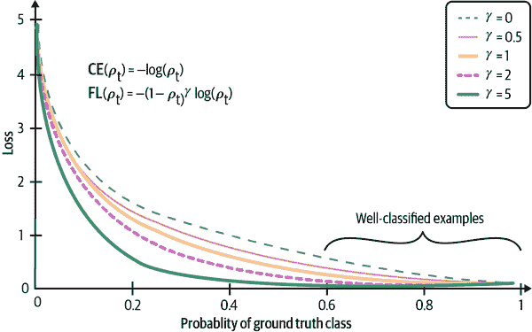

###### 图 4-11\. 使用焦点损失（FL）训练的模型显示比使用交叉熵损失（CE）训练的模型具有更低的损失值。来源：改编自林等人的一幅图像。

# 数据增强

数据增强是一系列用于增加训练数据量的技术。传统上，这些技术用于具有有限训练数据的任务，例如在医学成像中。然而，在过去几年中，它们已经显示出即使在有大量数据时也很有用——增强数据可以使我们的模型对噪声甚至对抗性攻击更加健壮。

数据增强已经成为许多计算机视觉任务中的标准步骤，并正在逐步应用于自然语言处理（NLP）任务中。这些技术严重依赖于数据格式，因为图像处理与文本处理有所不同。在本节中，我们将涵盖三种主要类型的数据增强：简单的保持标签的转换；扰动，即“添加噪声”的术语；以及数据合成。在每种类型中，我们将讨论计算机视觉和 NLP 的示例。

## 简单的保持标签的转换

在计算机视觉中，最简单的数据增强技术是在保持其标签的同时随机修改图像。你可以通过裁剪、翻转、旋转、反转（水平或垂直）、擦除图像的一部分等方式修改图像。这是有道理的，因为一只狗的旋转图像仍然是一只狗。像 PyTorch、TensorFlow 和 Keras 这样的常见机器学习框架都支持图像增强。根据 Krizhevsky 等人在其著名的 AlexNet 论文中所述，“这些转换后的图像是在 CPU 上的 Python 代码生成的，而 GPU 则在前一批图像上进行训练。因此，这些数据增强方案实际上是计算上免费的。”⁴⁸

在自然语言处理中，你可以随机用一个相似的词替换一个词，假设这种替换不会改变句子的含义或情感，如在表 4-9 中所示。相似的词可以通过同义词词典找到，也可以通过在词嵌入空间中找到距离接近的词来找到。

表 4-9\. 从原始句子生成的三个句子

| 原始句子 | 我很高兴见到你。 |
| --- | --- |

| 生成的句子 | 我很*高兴*见到你。我很高兴见到*你们*。

我*非常*高兴见到你。 |

这种数据增强技术是快速增加训练数据量的一种方法。

## 扰动

扰动也是一种保持标签的操作，但由于有时它被用来欺骗模型做出错误预测，我认为它值得有自己的章节。

总体而言，神经网络对噪声很敏感。在计算机视觉中，这意味着向图像添加少量噪声可能导致神经网络错误分类。Su 等人表明，Kaggle CIFAR-10 测试数据集中的自然图像中有 67.97% 和 ImageNet 测试图像中的 16.04%，仅通过改变一个像素就可能被错误分类（见图 4-12）。⁴⁹

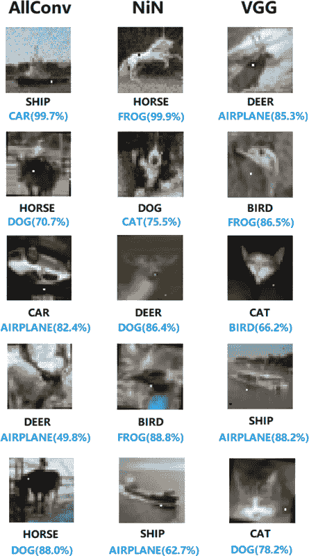

###### 图 4-12\. 改变一个像素可能导致神经网络做出错误预测。所使用的三个模型是 AllConv、NiN 和 VGG。在改变一个像素后，这些模型生成的原始标签显示在改变后的标签上方。来源：Su 等人。⁵⁰

使用欺骗性数据来欺骗神经网络以做出错误预测称为对抗攻击。向样本添加噪声是创建对抗性样本的常见技术。随着图像分辨率的增加，对抗攻击的成功尤为突出。

向训练数据添加噪声样本可以帮助模型识别其学习决策边界的薄弱点并提高其性能。⁵¹ 噪声样本可以通过添加随机噪声或搜索策略来创建。Moosavi-Dezfooli 等人提出了一种算法，称为 DeepFool，它找到了引入最小可能噪声注入以高置信度导致误分类的方法。⁵² 这种增强方式被称为对抗性增强。⁵³

在自然语言处理中，对抗性增强不常见（将一张带有随机添加像素的熊的图像看起来仍然像熊，但将随机字符添加到随机句子中可能会使其变得无意义），但扰动已被用来使模型更加稳健。其中最显著的例子之一是 BERT，在该模型中，模型随机选择每个序列中的 15%的所有标记，并选择用随机单词替换所选标记的 10%。例如，给定句子“My dog is hairy”，并且模型随机将“hairy”替换为“apple”，则句子变为“My dog is apple”。因此，1.5%的所有标记可能导致无意义的含义。他们的消融研究表明，小部分随机替换可以给他们的模型带来轻微的性能提升。⁵⁴

在第六章中，我们将讨论如何使用扰动不仅作为提高模型性能的一种方法，还作为评估其性能的一种方法。

## 数据合成

由于收集数据既昂贵又缓慢，并且存在许多潜在的隐私问题，如果我们能够完全避开它并使用合成数据来训练我们的模型，那将是一种梦想。尽管我们离能够合成所有训练数据还有很长的路要走，但我们确实可以合成一些训练数据来提升模型的性能。

在自然语言处理中，模板可以是启动模型的廉价方式。我曾与一个团队合作，他们使用模板为他们的对话型 AI（聊天机器人）启动训练数据。模板可能如下所示：“找一个[CUISINE]餐厅，在[LOCATION]附近[NUMBER]英里以内”（见表 4-10）。对于每个城市的所有可能的美食类型、合理的距离（你可能永远不想搜索超过 1000 英里的餐厅）、以及位置（家、办公室、地标、确切地址），您可以从模板生成数千个训练查询。

表 4-10。从模板生成的三个句子

| 模板 | 找一个距离[LOCATION] [NUMBER]英里以内的[CUISINE]餐厅。 |
| --- | --- |

| 生成的查询 | 找一个*越南*餐厅，在*我的办公室*附近*2*英里以内。找一个*泰国*餐厅，在*我的家*附近*5*英里以内。

找一个*墨西哥*餐厅，在*Google 总部*附近*3*英里以内。

在计算机视觉中，合成新数据的一种简单方法是将具有离散标签的现有示例与生成连续标签相结合。考虑一个分类猫和狗图像的任务，其标签有两种可能性：狗（编码为 0）和猫（编码为 1）。从标签为狗的示例*x*[1]和标签为猫的示例*x*[2]，你可以生成*x*'，如下：

<math alttext="x prime equals gamma x 1 plus left-parenthesis 1 minus gamma right-parenthesis x 2"><mrow><msup><mrow><mi>x</mi></mrow> <mo>'</mo></msup> <mo>=</mo> <mi>γ</mi> <msub><mi>x</mi> <mn>1</mn></msub> <mo>+</mo> <mrow><mo>(</mo> <mn>1</mn> <mo>-</mo> <mi>γ</mi> <mo>)</mo></mrow> <msub><mi>x</mi> <mn>2</mn></msub></mrow></math>

*x*的标签是*x*[1]和*x*[2]的标签的组合：<math alttext="gamma times 0 plus left-parenthesis 1 minus gamma right-parenthesis times 1"><mrow><mi>γ</mi> <mo>×</mo> <mn>0</mn> <mo>+</mo> <mo>(</mo> <mn>1</mn> <mo>-</mo> <mi>γ</mi> <mo>)</mo> <mo>×</mo> <mn>1</mn></mrow></math> 。这种方法称为 mixup。作者表明，mixup 可以提高模型的泛化能力，减少其对错误标签的记忆，增强其对对抗性示例的鲁棒性，并稳定生成对抗网络的训练。⁵⁵

使用神经网络合成训练数据是一种令人兴奋的方法，目前正在积极研究中，但在生产中还不太流行。Sandfort 等人显示，通过将使用 CycleGAN 生成的图像添加到其原始训练数据中，他们能够显著改善模型在计算机断层扫描（CT）分割任务中的性能。⁵⁶

如果你对深度学习中的图像数据增强更感兴趣，可以阅读《“深度学习图像数据增强综述”》（Shorten 和 Khoshgoftaar，2019），这是一篇全面的综述。

# 总结

训练数据仍然是现代机器学习算法的基础。无论你的算法有多聪明，如果你的训练数据不好，你的算法就无法表现良好。投入时间和精力来筛选和创建训练数据是值得的，这样可以让你的算法学到有意义的东西。

在本章中，我们讨论了创建训练数据的多个步骤。我们首先涵盖了不同的抽样方法，包括非概率抽样和随机抽样，这些方法可以帮助我们为我们的问题选择合适的数据。

今天使用的大多数机器学习算法都是监督学习算法，因此获取标签是创建训练数据的一个重要部分。许多任务，如交货时间估计或推荐系统，都有自然的标签。自然标签通常是延迟的，从服务预测到提供反馈的时间是反馈循环的长度。在行业中，具有自然标签的任务相当普遍，这可能意味着公司更倾向于从具有自然标签的任务开始，而不是从没有自然标签的任务开始。

对于没有自然标签的任务，公司往往依赖人工注释员来标注他们的数据。然而，手动标注具有许多缺点。例如，手动标注可能既昂贵又缓慢。为了解决手动标注的缺乏，我们讨论了包括弱监督、半监督、迁移学习和主动学习在内的替代方法。

在数据分布较为平衡时，机器学习算法表现良好，但在类别严重不平衡时表现不佳。不幸的是，在现实世界中，类别不平衡的问题是常态。在接下来的章节中，我们讨论了为何类别不平衡使得机器学习算法难以学习的原因。我们还讨论了处理类别不平衡的不同技术，从选择正确的度量标准到对数据进行重新采样，再到修改损失函数以鼓励模型关注特定样本。

我们在本章结束时讨论了数据增强技术，这些技术可以用来提高模型在计算机视觉和自然语言处理任务中的性能和泛化能力。

一旦您有了训练数据，您将希望从中提取特征以训练您的机器学习模型，这将在下一章中讨论。

¹ 一些读者可能会认为这种方法在大型模型上可能不适用，因为某些大型模型在小数据集上表现不佳，但在更多数据的情况下表现良好。在这种情况下，尝试不同大小的数据集以了解数据集大小对模型的影响仍然很重要。

² James J. Heckman，《样本选择偏误作为规范误差》，《计量经济学》47 卷，第 1 期（1979 年 1 月）：153–61，[*https://oreil.ly/I5AhM*](https://oreil.ly/I5AhM)。

³ Rachel Lerman，《Google 在柯克兰测试其自动驾驶汽车》，《西雅图时报》，2016 年 2 月 3 日，[*https://oreil.ly/3IA1V*](https://oreil.ly/3IA1V)。

⁴ 这里的“人群”指的是 [“统计人群”](https://oreil.ly/w7GDX)，即可能无限的所有可能被抽样的样本集合。

⁵ 多标签任务是指一个示例可能有多个标签。

⁶ “SVM: 加权样本”，scikit-learn，[*https://oreil.ly/BDqbk*](https://oreil.ly/BDqbk)。

⁷ Xiaojin Zhu，《使用图进行半监督学习》（博士论文，卡内基梅隆大学，2005 年），[*https://oreil.ly/VYy4C*](https://oreil.ly/VYy4C)。

⁸ 如果某些事物显而易见可以标注，你不需要领域专业知识。

⁹ 我们将在 “弱监督” 部分讨论编程标签。

¹⁰ Sofia Ira Ktena, Alykhan Tejani, Lucas Theis, Pranay Kumar Myana, Deepak Dilipkumar, Ferenc Huszar, Steven Yoo 和 Wenzhe Shi 的文章，“解决连续训练中神经网络的延迟反馈问题”，*arXiv*，2019 年 7 月 15 日，[*https://oreil.ly/5y2WA*](https://oreil.ly/5y2WA)。

¹¹ Alexander Ratner, Stephen H. Bach, Henry Ehrenberg, Jason Fries, Sen Wu 和 Christopher Ré 的文章，“Snorkel: 利用弱监督快速创建训练数据”，*VLDB Endowment* 11 卷 3 期（2017 年）：269–82，[*https://oreil.ly/vFPjk*](https://oreil.ly/vFPjk)。

¹² Ratner 等人的文章，“Snorkel: 利用弱监督快速创建训练数据”。

¹³ Jared A. Dunnmon, Alexander J. Ratner, Khaled Saab, Matthew P. Lungren, Daniel L. Rubin 和 Christopher Ré 的文章，“跨模态数据编程支持快速医学机器学习”，*Patterns* 1 卷 2 期（2020 年）：100019，[*https://oreil.ly/nKt8E*](https://oreil.ly/nKt8E)。

¹⁴ 这项研究中的两个任务分别仅使用了 18 和 20 个 LF。实际上，我见过有些团队为每个任务使用了数百个 LF。

¹⁵ Dummon 等人的文章，“跨模态数据编程”。

¹⁶ Avrim Blum 和 Tom Mitchell 的文章，“利用共训练结合标记和未标记数据”，收录于《第十一届计算学习理论年会论文集》（1998 年 7 月）：92–100，[*https://oreil.ly/T79AE*](https://oreil.ly/T79AE)。

¹⁷ Avital Oliver, Augustus Odena, Colin Raffel, Ekin D. Cubuk 和 Ian J. Goodfellow 的文章，“深度半监督学习算法的现实评估”，*NeurIPS 2018 会议论文集*，[*https://oreil.ly/dRmPV*](https://oreil.ly/dRmPV)。

¹⁸ 一个 token 可以是一个单词、一个字符或者一个单词的一部分。

¹⁹ Jeremy Howard 和 Sebastian Ruder 的文章，“通用语言模型微调用于文本分类”，*arXiv*，2018 年 1 月 18 日，[*https://oreil.ly/DBEbw*](https://oreil.ly/DBEbw)。

²⁰ Pengfei Liu, Weizhe Yuan, Jinlan Fu, Zhengbao Jiang, Hiroaki Hayashi 和 Graham Neubig 的文章，“Pre-train, Prompt, and Predict: 自然语言处理中提示方法的系统调查”，*arXiv*，2021 年 7 月 28 日，[*https://oreil.ly/0lBgn*](https://oreil.ly/0lBgn)。

²¹ Jacob Devlin, Ming-Wei Chang, Kenton Lee 和 Kristina Toutanova 的文章，“BERT: 深度双向转换器的预训练用于语言理解”，*arXiv*，2018 年 10 月 11 日，[*https://oreil.ly/RdIGU*](https://oreil.ly/RdIGU)；Tom B. Brown, Benjamin Mann, Nick Ryder, Melanie Subbiah, Jared Kaplan, Prafulla Dhariwal, Arvind Neelakantan 等人的文章，“语言模型是少样本学习者”，OpenAI，2020 年，[*https://oreil.ly/YVmrr*](https://oreil.ly/YVmrr)。

²² Burr Settles，《主动学习》，（Williston, VT: Morgan & Claypool, 2012）。

²³ 我们将在第六章中涵盖整体学习方法。

²⁴ Dana Angluin, “Queries and Concept Learning,” *Machine Learning* 2 (1988): 319–42, [*https://oreil.ly/0uKs4*](https://oreil.ly/0uKs4).

²⁵ 感谢 Eugene Yan 提供这个精彩的例子！

²⁶ Andrew Ng，“填补 AI 概念验证到生产应用的鸿沟”（HAI Seminar, 2020 年 9 月 22 日），视频，1:02:07，[*https://oreil.ly/FSFWS*](https://oreil.ly/FSFWS)。

²⁷ 这也是为什么准确率在类别不平衡的任务中是一个糟糕的指标，我们将在“处理类别不平衡”部分进一步探讨。

²⁸ 我设想如果不必解决类别不平衡问题，学习机器学习理论会更容易。

²⁹ Nilson 报告，“支付卡欺诈损失达到 278.5 亿美元”，PR Newswire，2019 年 11 月 21 日，[*https://oreil.ly/NM5zo*](https://oreil.ly/NM5zo)。

³⁰ “职场专家解释为什么只有 2%的求职者能被面试”，WebWire，2014 年 1 月 7 日，[*https://oreil.ly/UpL8S*](https://oreil.ly/UpL8S)。

³¹ “电子邮件和垃圾邮件数据”，Talos Intelligence，最近访问于 2021 年 5 月，[*https://oreil.ly/lI5Jr*](https://oreil.ly/lI5Jr)。

³² Nathalie Japkowciz 和 Shaju Stephen，“类别不平衡问题：系统研究”，2002 年，[*https://oreil.ly/d7lVu*](https://oreil.ly/d7lVu)。

³³ Nathalie Japkowicz，“类别不平衡问题：意义和策略”，2000 年，[*https://oreil.ly/Ma50Z*](https://oreil.ly/Ma50Z)。

³⁴ Wan Ding, Dong-Yan Huang, Zhuo Chen, Xinguo Yu 和 Weisi Lin，“利用极度不平衡类分布的深度网络进行面部动作识别”，*2017 年亚太信号与信息处理协会年度峰会与会议（APSIPA ASC）*，2017 年，[*https://oreil.ly/WeW6J*](https://oreil.ly/WeW6J)。

³⁵ 截至 2021 年 7 月，当你使用`scikit-learn.metrics.f1_score`时，`pos_label`默认设置为 1，但如果你希望 0 为正标签，你可以进行更改。

³⁶ Jesse Davis 和 Mark Goadrich，“精确率-召回率与 ROC 曲线之间的关系”，*第 23 届国际机器学习大会论文集*，2006 年，[*https://oreil.ly/s40F3*](https://oreil.ly/s40F3)。

³⁷ Rafael Alencar，“不平衡数据集的重采样策略”，Kaggle，[*https://oreil.ly/p8Whs*](https://oreil.ly/p8Whs)。

³⁸ Ivan Tomek，“最近邻编辑规则实验”，《IEEE 系统、人类和控制论》（1976 年 6 月）：448–52，[*https://oreil.ly/JCxHZ*](https://oreil.ly/JCxHZ)。

³⁹ N.V. Chawla, K.W. Bowyer, L.O. Hall, and W.P. Kegelmeyer，“SMOTE:合成少数类过采样技术”，《人工智能研究杂志》16 卷（2002 年）：341–78，[*https://oreil.ly/f6y46*](https://oreil.ly/f6y46)。

⁴⁰ “凸”这里大致意味着“线性”。

⁴¹ 张建平和 Inderjeet Mani，“kNN 方法解决不平衡数据分布：涉及信息提取的案例研究”（《ICML 不平衡数据集学习研讨会 II》，华盛顿特区，2003 年），[*https://oreil.ly/qnpra*](https://oreil.ly/qnpra)；Miroslav Kubat 和 Stan Matwin，“解决不平衡训练集的诅咒：单侧选择”（2000 年），[*https://oreil.ly/8pheJ*](https://oreil.ly/8pheJ)。

⁴² Hansang Lee, Minseok Park, and Junmo Kim，“通过转移学习的卷积神经网络在大规模不平衡数据库中的浮游生物分类”，《2016 年 IEEE 图像处理国际会议（ICIP）》（2016），[*https://oreil.ly/YiA8p*](https://oreil.ly/YiA8p)。

⁴³ Samira Pouyanfar, Yudong Tao, Anup Mohan, Haiman Tian, Ahmed S. Kaseb, Kent Gauen, Ryan Dailey 等，“卷积神经网络中的动态采样用于不平衡数据分类”，《2018 年 IEEE 多媒体信息处理和检索会议（MIPR）》（2018），[*https://oreil.ly/D3Ak5*](https://oreil.ly/D3Ak5)。

⁴⁴ Charles Elkan，“成本敏感学习的基础”，《第十七届国际人工智能联合会议》（IJCAI’01）（2001），[*https://oreil.ly/WGq5M*](https://oreil.ly/WGq5M)。

⁴⁵ Yin Cui, Menglin Jia, Tsung-Yi Lin, Yang Song, and Serge Belongie，“基于有效样本数量的类平衡损失”，《计算机视觉与模式识别会议论文集》（2019），[*https://oreil.ly/jCzGH*](https://oreil.ly/jCzGH)。

⁴⁶ Tsung-Yi Lin, Priya Goyal, Ross Girshick, Kaiming He, and Piotr Dollár，“密集目标检测的焦点损失”，《arXiv》，2017 年 8 月 7 日，[*https://oreil.ly/Km2dF*](https://oreil.ly/Km2dF)。

⁴⁷ Mikel Galar, Alberto Fernandez, Edurne Barrenechea, Humberto Bustince, and Francisco Herrera，“解决类不平衡问题的集成方法综述：Bagging、Boosting 和混合方法”，《IEEE 系统、人类和控制论》C 部分（应用与评论）42 卷，第 4 期（2012 年 7 月）：463–84，[*https://oreil.ly/1ND4g*](https://oreil.ly/1ND4g)。

⁴⁸ 亚历克斯·克里兹海夫斯基，伊利亚·苏茨凯弗和杰弗里·E·辛顿，“ImageNet 分类与深度卷积神经网络”，2012 年，[*https://oreil.ly/aphzA*](https://oreil.ly/aphzA)。

⁴⁹ 苏嘉伟，达尼洛·瓦斯孔塞洛斯·瓦加斯和樱井浩一，“用于欺骗深度神经网络的单像素攻击”，*IEEE Evolutionary Computation*，2019，23 卷 5 期：828–41，[*https://oreil.ly/LzN9D*](https://oreil.ly/LzN9D)。

⁵⁰ 苏杰伟等，“单像素攻击”。

⁵¹ 伊恩·J·古德费洛，乔纳森·施伦斯和克里斯蒂安·赛格迪，“解释和利用对抗性示例”，*arXiv*，2015 年 3 月 20 日，[*https://oreil.ly/9v2No*](https://oreil.ly/9v2No)；伊恩·J·古德费洛，大卫·沃德-法利，梅迪·米尔扎，阿伦·库尔维尔和约书亚·本吉奥，“Maxout 网络”，*arXiv*，2013 年 2 月 18 日，[*https://oreil.ly/L8mch*](https://oreil.ly/L8mch)。

⁵² 谢义德-莫赛尼-德佐夫利，阿尔胡森·法兹维和帕斯卡尔·弗罗萨德，“DeepFool：一种简单且准确的欺骗深度神经网络的方法”，在*IEEE 计算机视觉与模式识别会议（CVPR）*中，2016 年，[*https://oreil.ly/dYVL8*](https://oreil.ly/dYVL8)。

⁵³ 宫藤猛，前田伸一，小山真典和石井信，“虚拟对抗训练：一种监督和半监督学习的正则化方法”，*IEEE Pattern Analysis and Machine Intelligence*，2017，[*https://oreil.ly/MBQeu*](https://oreil.ly/MBQeu)。

⁵⁴ Devlin 等，“BERT：深度双向转换器的预训练”。

⁵⁵ 张宏毅，穆斯塔法·西塞，扬·N·多芬和大卫·洛佩兹-帕兹，“*mixup*：超越经验风险最小化”，*ICLR 2018*，[*https://oreil.ly/lIM5E*](https://oreil.ly/lIM5E)。

⁵⁶ 维特·桑德福特，闫科，佩里·J·皮克哈特和罗纳德·M·萨默斯，“使用生成对抗网络（CycleGAN）进行数据增强以提高 CT 分割任务的泛化能力”，*科学报告*，2019 年，9 卷 1 期：16884，[*https://oreil.ly/TDUwm*](https://oreil.ly/TDUwm)。
