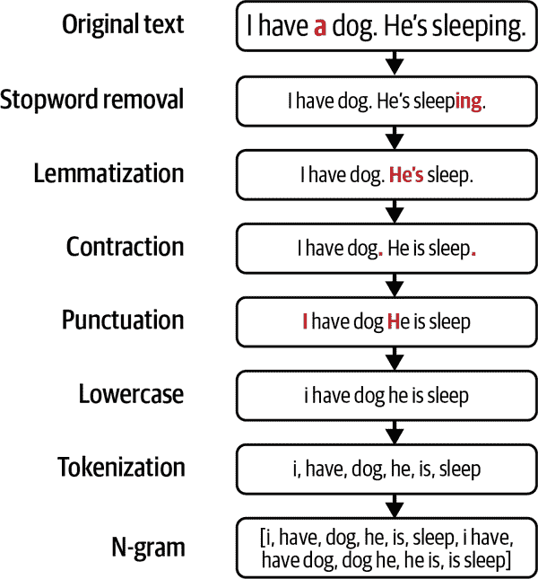
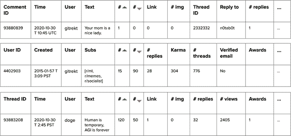
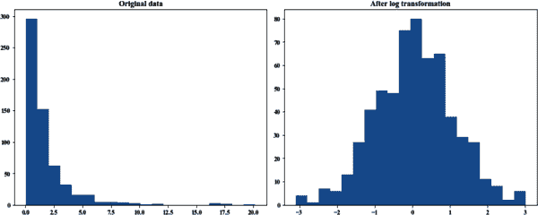
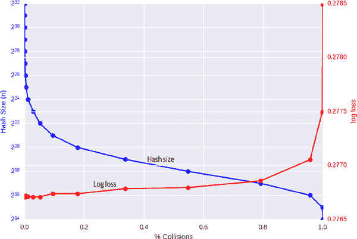
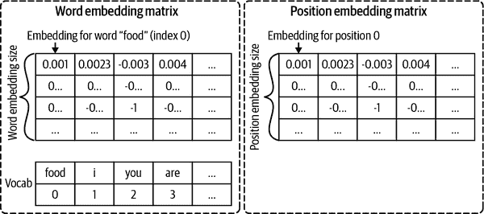
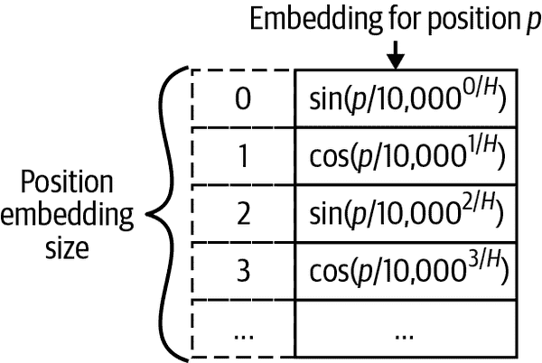
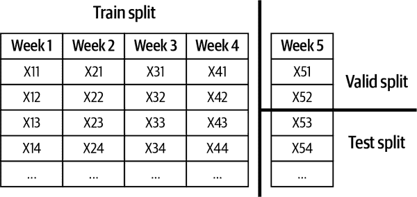
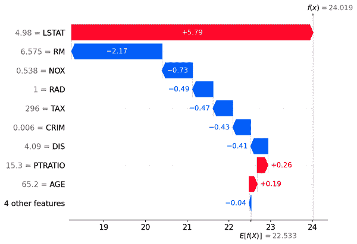
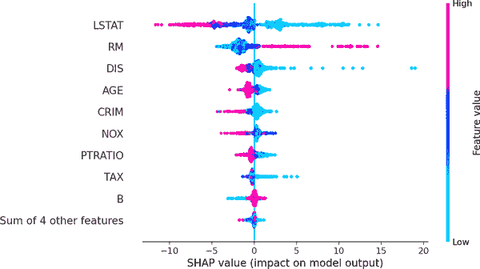
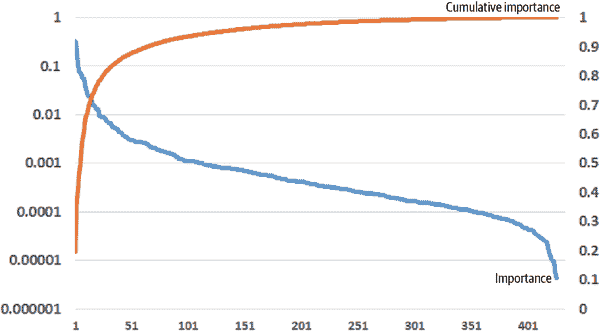

# 第五章：特征工程

2014 年，论文["Practical Lessons from Predicting Clicks on Ads at Facebook"](https://oreil.ly/oS16J)声称拥有正确的特征是开发他们 ML 模型中最重要的事情。从那时起，我与许多公司合作，一次又一次地发现，一旦他们拥有可行的模型，正确的特征往往会给他们带来与调整超参数等聪明算法技术相比更大的性能提升。尽管使用了先进的模型架构，如果不使用好的特征集，其表现仍可能很差。

由于其重要性，许多 ML 工程和数据科学工作的大部分内容是提出新的有用特征。在本章中，我们将讨论常见的技术和与特征工程相关的重要考虑因素。我们将专门介绍一个微妙但灾难性的问题，这个问题已经使许多生产中的 ML 系统出现偏离：数据泄漏以及如何检测和避免它。

我们将在本章中讨论如何设计好的特征工程，考虑到特征重要性和特征泛化。谈到特征工程，一些人可能会想到特征存储。由于特征存储更接近于支持多个 ML 应用程序的基础设施，我们将在第十章中介绍特征存储。

# 学习到的特征与工程化的特征

当我在课堂上讲解这个主题时，我的学生经常问：“为什么我们要担心特征工程？深度学习不是承诺我们不再需要进行特征工程吗？”

他们是对的。深度学习的承诺是我们不再需要手工设计特征。因此，深度学习有时被称为特征学习¹。许多特征可以通过算法自动学习和提取。然而，我们离所有特征都可以自动化的时候还有很长的路要走。更不用说，截至撰写本文时，大多数生产中的 ML 应用程序并不是深度学习。让我们举一个例子来理解哪些特征可以自动提取，哪些特征仍然需要手工设计。

想象一下，你想构建一个情感分析分类器来判断评论是否是垃圾信息。在深度学习之前，当给定一段文本时，你必须手动应用经典的文本处理技术，如词形还原、扩展缩略语、去除标点符号并将所有内容转换为小写。之后，你可能希望将文本拆分为你选择的*n*值的 n-gram。​​​

对于那些不熟悉的人，n-gram 是来自给定文本样本的一系列连续的 *n* 个项目。这些项目可以是音素、音节、字母或单词。例如，对于帖子“I like food”，其单词级别的 1-gram 是 [“I”, “like”, “food”]，其单词级别的 2-gram 是 [“I like”, “like food”]。如果我们希望 *n* 为 1 和 2，该句子的 n-gram 特征集合是：[“I”, “like”, “food”, “I like”, “like food”]。

图 5-1 显示了您可以用来手工创建文本的 n-gram 特征的经典文本处理技术示例。

###### 图 5-1\. 显示了您可以用来手工创建文本的 n-gram 特征的技术示例

一旦您为训练数据生成了 n-gram，您可以创建一个词汇表，将每个 n-gram 映射到一个索引。然后，您可以基于其 n-gram 的索引将每个帖子转换为向量。例如，如果我们有一个如 表 5-1 所示的七个 n-gram 的词汇表，每个帖子可以是一个包含七个元素的向量。每个元素对应于该索引处 n-gram 在帖子中出现的次数。“I like food” 将被编码为向量 [1, 1, 0, 1, 1, 0, 1]。然后可以将此向量用作 ML 模型的输入。

表 5-1\. 1-gram 和 2-gram 词汇表示例

| 我 | 喜欢 | 好 | 食物 | 我喜欢 | 好食物 | 喜欢食物 |
| --- | --- | --- | --- | --- | --- | --- |
| 0 | 1 | 2 | 3 | 4 | 5 | 6 |

特征工程需要领域特定技术的知识——在这种情况下，领域是自然语言处理（NLP）和文本的母语。这往往是一个迭代过程，可能会很脆弱。当我在我的早期 NLP 项目中采用这种方法时，我不断不得不重新启动我的过程，要么是因为我忘记了应用某项技术，要么是因为我使用的某项技术效果不佳而不得不撤销它。

然而，随着深度学习的兴起，这种痛苦大大减轻了。不必再担心词形还原、标点符号或停用词删除，您只需将原始文本拆分成单词（即标记化），从这些单词创建词汇表，并使用该词汇表将每个单词转换为一次性向量。希望您的模型能够从中提取有用的特征。在这种新方法中，文本的特征工程大部分已经自动化。对图像也取得了类似的进展。不必再手动从原始图像中提取特征并将这些特征输入到您的 ML 模型中，您可以直接将原始图像输入到深度学习模型中。

然而，一个 ML 系统很可能需要除了文本和图像之外的数据。例如，在检测评论是否为垃圾评论时，除了评论本身的文本外，您可能还希望使用关于以下信息的其他信息：

评论本身

它有多少赞成票/反对票？

发表此评论的用户

这个账户是什么时候创建的，他们发帖频率如何，以及他们有多少赞/踩？

发表评论的帖子

它有多少观看次数？受欢迎的帖子往往会吸引更多的垃圾信息。

在你的模型中有许多可能的特征可供使用。其中一些显示在图 5-2 中。选择要使用的信息以及如何将这些信息提取到可供机器学习模型使用的格式中的过程称为特征工程。对于像推荐用户在 TikTok 上观看下一个视频这样的复杂任务，使用的特征数量可能高达数百万个。对于像预测交易是否存在欺诈这样的领域特定任务，您可能需要具备银行业务和欺诈方面的专业知识，以能够提出有用的特征。

###### 图 5-2\. 有关评论、帖子或用户可能包含在您的模型中的一些可能特征

# 常见的特征工程操作

鉴于特征工程在机器学习项目中的重要性和普遍性，已经开发出许多技术来简化这一过程。在本节中，我们将讨论几个最重要的操作，您可能在从数据中提取特征时要考虑到。它们包括处理缺失值、缩放、离散化、编码分类特征，以及生成老派但仍然非常有效的交叉特征以及较新和令人兴奋的位置特征。这个列表远非全面，但它确实包括一些最常见和有用的操作，为您提供一个良好的起点。让我们深入探讨！

## 处理缺失值

在处理生产数据时，您可能首先注意到的是某些值缺失。然而，我采访过的许多机器学习工程师不知道的一件事是，并非所有类型的缺失值都是相同的。² 为了说明这一点，考虑预测某人是否会在接下来的 12 个月内购房的任务。我们的部分数据在表 5-2 中。

表 5-2\. 预测未来 12 个月内购房的示例数据

| ID | 年龄 | 性别 | 年收入 | 婚姻状况 | 子女数 | 职业 | 购买？ |
| --- | --- | --- | --- | --- | --- | --- |
| 1 |  | A | 150,000 |  | 1 | 工程师 | 否 |
| 2 | 27 | B | 50,000 |  |  | 老师 | 否 |
| 3 |  | A | 100,000 | 已婚 | 2 |  | 是 |
| 4 | 40 | B |  |  | 2 | 工程师 | 是 |
| 5 | 35 | B |  | Single | 0 | 医生 | 是 |
| 6 |  | A | 50,000 |  | 0 | 老师 | 否 |
| 7 | 33 | B | 60,000 | 单身 |  | 老师 | 否 |
| 8 | 20 | B | 10,000 |  |  | 学生 | 否 |

有三种类型的缺失值。这些类型的官方名称有点令人困惑，因此我们将详细举例以减少混淆。

非随机缺失（MNAR）

当值缺失的原因是值本身时，就是这种情况。在这个例子中，我们可能会注意到一些受访者没有披露他们的收入。调查后可能发现，未披露收入的受访者的收入往往比披露收入的受访者高。*收入值的缺失是由于值本身的原因*。

随机缺失（MAR）

当值缺失的原因不是由于值本身，而是由于另一个观察到的变量时，就是这种情况。在这个例子中，我们可能会注意到某些性别“A”的受访者的年龄值经常缺失，这可能是因为此调查中性别“A”的人不喜欢透露他们的年龄。

完全随机缺失（MCAR）

当 *值缺失时没有模式* 时，就是这种情况。在这个例子中，我们可能认为列“工作”的缺失值可能是完全随机的，不是因为工作本身或任何其他变量。有时人们仅仅因为没有特定的原因而忘记填写该值。然而，这种类型的缺失非常罕见。通常会有某些值缺失的原因，你应该进行调查。

遇到缺失值时，你可以选择用特定值填充缺失值（插补），或者删除缺失值（删除）。我们将讨论两种方法。

### 删除

当我在面试中问候选人如何处理缺失值时，许多人倾向于选择删除，不是因为这是一种更好的方法，而是因为它更容易做到。

另一种删除的方式是 *列删除*：如果某个变量的缺失值太多，只需删除该变量。例如，在上面的例子中，“婚姻状况”变量的值超过 50%缺失，因此你可能会考虑从模型中删除此变量。这种方法的缺点是可能会移除重要信息并降低模型的准确性。婚姻状况可能与购买房产高度相关，因为已婚夫妇比单身人士更有可能拥有自己的房产。³

另一种删除的方式是 *行删除*：如果样本存在缺失值，只需删除该样本。当缺失值完全是随机的（MCAR），且具有缺失值的样本数量较少，例如少于 0.1%时，此方法可行。如果意味着删除了 10%的数据样本，你就不应该采取行删除。

然而，删除数据行也可能会移除模型需要用于预测的重要信息，特别是当缺失值不是随机的（MNAR）时。例如，你不应该删除缺失收入的性别 B 受访者的样本，因为收入缺失本身就是一种信息（缺失收入可能意味着更高的收入，因此与购买房产更相关），可以用于预测。

此外，删除数据行可能会在你的模型中引入偏差，尤其是在缺失值是随机的情况下（MAR）。例如，如果你删除表 5-2 中所有缺少年龄值的示例数据，你将从你的数据中删除所有性别为 A 的受访者，导致你的模型无法对性别为 A 的受访者做出良好的预测。

### 填充

即使删除数据很诱人，因为这样做很容易，但删除数据可能会导致丢失重要信息，并引入模型偏差。如果你不想删除缺失值，你就需要进行填充，也就是“用某些值填充它们”。决定使用哪些“特定的值”是难点所在。

一种常见的做法是使用默认值填充缺失值。例如，如果职位信息缺失，你可以用空字符串“”来填充。另一种常见的做法是使用均值、中位数或众数（即最常见的值）来填充缺失值。例如，如果某数据样本的月份为 7 月，而温度数值缺失，用 7 月份的温度中位数来填充是个不错的选择。

这两种做法在许多情况下效果很好，但有时会导致令人抓狂的错误。有一次，在我参与的一个项目中，我们发现模型输出的结果一团糟，因为应用程序的前端不再要求用户输入年龄，因此年龄数值缺失，模型用 0 来填充。但模型在训练过程中从未见过年龄数值为 0，因此无法做出合理的预测。

一般来说，你要避免用可能的值来填充缺失值，比如用 0 来填充孩子数量的缺失值——0 是孩子数量的一个可能值。这会导致很难区分信息缺失的人和确实没有孩子的人。

对于特定数据集，可能会同时或依次使用多种技术来处理缺失值。无论你使用何种技术，有一点是确定的：没有一种完美的处理缺失值的方式。删除数据时，你面临的风险是丢失重要信息或强化偏差。而填充数据时，你则面临注入自身偏差、给数据添加噪声或更糟的数据泄露的风险。如果你不知道数据泄露是什么，请不要惊慌，我们将在 “数据泄露” 部分详细介绍。

## 缩放

考虑预测某人是否在接下来的 12 个月内购房的任务，以及表格 5-2 中显示的数据。我们数据中变量 Age 的值范围从 20 到 40，而变量 Annual Income 的值范围从 10,000 到 150,000。当我们将这两个变量输入到 ML 模型时，它不会理解 150,000 和 40 代表不同的事物。它只会把它们都看作数字，并且因为 150,000 比 40 大得多，可能会赋予它更高的重要性，而不管哪个变量实际上对生成预测更有用。

在将特征输入模型之前，将它们缩放到相似的范围非常重要。这个过程称为*特征缩放*。这是你可以做的最简单的事情之一，通常能提升模型性能。忽略这一步可能会导致模型做出荒谬的预测，特别是在像梯度提升树和逻辑回归这样的传统算法中。⁴

缩放特征的一种直观方式是使它们在范围[0, 1]内。给定变量*x*，其值可以使用以下公式重新缩放到此范围：

<math alttext="x prime equals StartFraction x minus min left-parenthesis x right-parenthesis Over max left-parenthesis x right-parenthesis minus min left-parenthesis x right-parenthesis EndFraction"><mrow><mi>x</mi> <mi>â</mi> <mi>€</mi> <mi>™</mi> <mo>=</mo> <mfrac><mrow><mi>x</mi><mo>-</mo><mo movablelimits="true" form="prefix">min</mo><mo>(</mo><mi>x</mi><mo>)</mo></mrow> <mrow><mo movablelimits="true" form="prefix">max</mo><mo>(</mo><mi>x</mi><mo>)</mo><mo>-</mo><mo movablelimits="true" form="prefix">min</mo><mo>(</mo><mi>x</mi><mo>)</mo></mrow></mfrac></mrow></math>

你可以验证，如果*x*是最大值，缩放后的值*x*′将为 1。如果*x*是最小值，缩放后的值*x*′将为 0。

如果你希望你的特征在任意范围[*a*, *b*]内——根据经验，我发现范围[–1, 1]比范围[0, 1]更有效——你可以使用以下公式：

<math alttext="x prime equals a plus StartFraction left-parenthesis x minus min left-parenthesis x right-parenthesis right-parenthesis left-parenthesis b minus a right-parenthesis Over max left-parenthesis x right-parenthesis minus min left-parenthesis x right-parenthesis EndFraction"><mrow><mi>x</mi> <mo>'</mo> <mo>=</mo> <mi>a</mi> <mo>+</mo> <mfrac><mrow><mo>(</mo><mi>x</mi><mo>-</mo><mo movablelimits="true" form="prefix">min</mo><mo>(</mo><mi>x</mi><mo>)</mo><mo>)</mo><mo>(</mo><mi>b</mi><mo>-</mo><mi>a</mi><mo>)</mo></mrow> <mrow><mo movablelimits="true" form="prefix">max</mo><mo>(</mo><mi>x</mi><mo>)</mo><mo>-</mo><mo movablelimits="true" form="prefix">min</mo><mo>(</mo><mi>x</mi><mo>)</mo></mrow></mfrac></mrow></math>

当你不想对变量做任何假设时，将其缩放到任意范围通常是有效的。如果你认为你的变量可能符合正态分布，将它们标准化到均值为零、方差为一可能会有帮助。这个过程称为*标准化*：

<math alttext="x prime equals StartFraction x minus x overbar Over sigma EndFraction comma"><mrow><mi>x</mi> <mo>'</mo> <mo>=</mo> <mfrac><mrow><mi>x</mi><mo>-</mo><mover accent="true"><mi>x</mi> <mo>¯</mo></mover></mrow> <mi>σ</mi></mfrac> <mo>,</mo></mrow></math>

其中<math alttext="x overbar"><mover accent="true"><mi>x</mi> <mo>¯</mo></mover></math>表示变量*x*的均值，<math alttext="sigma"><mi>σ</mi></math>表示其标准差。

在实践中，ML 模型往往难以处理偏斜分布的特征。为了帮助减少偏斜，常用的技术之一是[对数变换](https://oreil.ly/RMwEy)：对你的特征应用对数函数。对数变换如何使你的数据更加对称的示例显示在图 5-3 中。虽然这种技术在许多情况下能够提升性能，但并不适用于所有情况，你应该警惕在对数变换数据而不是原始数据上执行的分析。⁵

###### 图 5-3\. 在许多情况下，对数变换可以帮助减少数据的偏斜

关于缩放有两件重要的事情需要注意。一是它是数据泄漏的常见来源（这将在“数据泄漏”部分详细介绍）。另一件事是，它通常需要全局统计数据——你必须查看整个或部分训练数据来计算其最小值、最大值或平均值。在推断时，你会重复使用训练期间获取的统计数据来缩放新数据。如果新数据与训练数据相比有了显著变化，这些统计数据将不会非常有用。因此，经常重新训练模型以考虑这些变化是很重要的。

## 离散化

尽管在实践中，我很少发现离散化有所帮助，但这个技术还是包含在这本书中以确保完整性。想象一下，我们用表 5-2 中的数据建立了一个模型来预测房屋购买。在训练期间，我们的模型看到了“150,000”、“50,000”、“100,000”等年收入值。在推断时，我们的模型遇到了一个年收入为“9,000.50”的例子。

直觉上，我们知道每年$9,000.50 和$10,000 之间的差异并不大，我们希望我们的模型以相同的方式对待它们。但模型不知道这一点。我们的模型只知道 9,000.50 和 10,000 是不同的，并且会对它们进行不同处理。

离散化是将连续特征转换为离散特征的过程。这个过程也称为量化或分桶。通过为给定的值创建桶，来实现这一目标。对于年收入，你可能想将它们分成以下三个桶：

+   低收入：每年少于$35,000

+   中等收入：每年在$35,000 到$100,000 之间

+   高收入：每年超过$100,000

我们的模型不再需要学习无限可能的收入数额，而是可以专注于学习只有三个类别，这是一个更容易的任务。这种技术在有限的训练数据中应该更有帮助。

尽管从定义上讲，离散化是针对连续特征的，但它也可以用于离散特征。年龄变量是离散的，但将其值分组成如下桶可能仍然有用：

+   少于 18 岁

+   介于 18 和 22 之间

+   介于 22 和 30 之间

+   介于 30 和 40 之间

+   介于 40 和 65 之间

+   超过 65 岁

不足之处在于，这种分类会在类别边界引入不连续性——例如，$34,999 现在被视为与$35,000 完全不同，而$35,000 则与$100,000 相同。选择类别的边界可能并不那么容易。你可以尝试绘制值的直方图并选择有意义的边界。总的来说，常识、基本分位数和有时主题专业知识可以提供帮助。

## 编码分类特征

我们已经讨论了如何将连续特征转换为分类特征。在本节中，我们将讨论如何最好地处理分类特征。

那些没有在生产环境中处理过数据的人倾向于认为类别是*静态*的，这意味着类别随时间不会改变。对于许多类别来说确实如此。例如，年龄段和收入段不太可能改变，而且你提前知道有多少个类别。处理这些类别很简单。你只需给每个类别一个编号，问题就解决了。

然而，在生产环境中，类别会发生变化。想象你正在构建一个推荐系统，以预测用户可能想从亚马逊购买的产品。你希望使用的一个特征是产品品牌。当查看亚马逊的历史数据时，你意识到有很多品牌。即使在 2019 年，亚马逊已经有超过两百万个品牌了！

品牌数量令人难以置信，但你认为：“我仍然能处理这个问题。”你将每个品牌编码为一个数字，现在你有了两百万个数字，从 0 到 1,999,999，对应两百万个品牌。你的模型在历史测试集上表现出色，你获得了测试今天流量的 1%的批准。

在生产环境中，你的模型因为遇到一个之前没有见过的品牌而崩溃，无法编码。新品牌不断加入亚马逊。为了解决这个问题，你创建了一个名为 UNKNOWN 的类别，值为 200 万，以捕获训练期间模型没有见过的所有品牌。

你的模型不再崩溃了，但你的销售人员抱怨说他们的新品牌没有流量。这是因为你的模型在训练集中没有看到类别 UNKNOWN，所以它不推荐任何 UNKNOWN 品牌的产品。你通过只编码前 99%最流行的品牌并将剩余的 1%品牌编码为 UNKNOWN 来解决这个问题。这样，至少你的模型知道如何处理 UNKNOWN 品牌。

你的模型大约运行了一个小时，然后产品推荐的点击率急剧下降。在过去的一个小时内，有 20 个新品牌加入了你的网站；其中一些是新的奢侈品牌，一些是可疑的仿冒品牌，一些是老牌品牌。然而，你的模型对待它们的方式和对待训练数据中不受欢迎的品牌一样。

这不是只有在亚马逊工作才会发生的极端案例。这个问题经常发生。例如，如果你想预测一条评论是否是垃圾评论，你可能想使用发布该评论的账户作为特征，而新账户一直在被创建。同样的情况也适用于新产品类型、新网站域名、新餐厅、新公司、新 IP 地址等等。如果你处理任何这些内容，你都必须解决这个问题。

发现解决这个问题的方法竟然如此困难。你不想将其放入一个桶中，因为这样做可能非常困难——你怎么能把新用户账户分成不同的组呢？

解决这个问题的一种方法是*哈希技巧*，由 Microsoft 开发的 Vowpal Wabbit 包推广。⁷ 这个技巧的要点是使用哈希函数为每个类别生成一个哈希值。这个哈希值将成为该类别的索引。由于可以指定哈希空间，可以预先确定一个特征的编码值的数量，而不需要知道将会有多少类别。例如，如果选择一个 18 位的哈希空间，对应于 2¹⁸ = 262,144 个可能的哈希值，所有的类别，即使是你的模型以前从未见过的，都将被编码为 0 到 262,143 之间的索引。

哈希函数的一个问题是碰撞：两个类别被分配相同的索引。然而，对于许多哈希函数来说，碰撞是随机的；新品牌可以与任何现有品牌共享索引，而不是总是与不受欢迎的品牌共享索引，这是当我们使用先前的未知类别时发生的情况。碰撞哈希特征的影响，幸运的是，不是那么严重。Booking.com 的研究表明，即使是 50%的碰撞特征，性能损失也不到 0.5%，如图 5-4⁸所示。

###### 图 5-4\. 50%的碰撞率只会使对数损失增加不到 0.5%。来源：Lucas Bernardi

您可以选择一个足够大的哈希空间来减少碰撞。您还可以选择具有您想要的属性的哈希函数，例如局部敏感哈希函数，其中相似的类别（例如具有相似名称的网站）被哈希到彼此靠近的值。

因为这是一个技巧，学术界通常认为它是一种巧妙的方法，并且从机器学习课程中排除。但其在行业中的广泛采用证明了这种技巧的有效性。它对于 Vowpal Wabbit 至关重要，并且是 scikit-learn、TensorFlow 和 gensim 框架的一部分。在产品中，这种技巧尤其在连续学习环境中特别有用，其中模型从传入的示例中学习。我们将在第九章中介绍连续学习。

## 特征交叉

特征交叉是将两个或更多特征组合以生成新特征的技术。这种技术对于建模特征之间的非线性关系非常有用。例如，在预测某人是否会在接下来的 12 个月内购买房屋的任务中，您可能会怀疑婚姻状况和子女数量之间存在非线性关系，因此您将它们组合成一个新特征“婚姻和子女”，如表 5-3 中所示。

表 5-3\. 两个特征如何组合以创建一个新特征的示例

| 婚姻 | 单身 | 已婚 | 单身 | 单身 | 已婚 |
| --- | --- | --- | --- | --- | --- |
| 子女 | 0 | 2 | 1 | 0 | 1 |
| 婚姻和子女 | 单身，0 | 已婚，2 | 单身，1 | 单身，0 | 已婚，1 |

因为特征交叉帮助模型建模变量之间的非线性关系，这对于不能学习或不擅长学习非线性关系的模型非常重要，例如线性回归、逻辑回归和基于树的模型。在神经网络中这并不是那么重要，但它仍然可能很有用，因为显式特征交叉有时可以帮助神经网络更快地学习非线性关系。DeepFM 和 xDeepFM 是成功利用显式特征交互的模型家族，用于推荐系统和点击率预测（参见 9）。

特征交叉的一个警告是它可能导致特征空间的爆炸增长。想象一下，特征 A 有 100 个可能的取值，而特征 B 有 100 个可能的特征；交叉这两个特征将导致一个具有 100 × 100 = 10,000 个可能值的特征。你将需要更多的数据来让模型学习所有这些可能的值。另一个警告是，由于特征交叉增加了模型使用的特征数量，它可能导致模型对训练数据过拟合。

## 离散和连续位置嵌入

在 2017 年 Vaswani 等人的论文[“Attention Is All You Need”](https://oreil.ly/eXk16)中首次介绍给深度学习社区，位置嵌入已经成为计算机视觉和自然语言处理中许多应用的标准数据工程技术。我们将通过一个示例来说明为什么位置嵌入是必要的，以及如何实现它。

考虑语言建模任务，你希望基于先前的标记序列预测下一个标记（例如单词、字符或子词）。在实践中，序列长度可以高达 512，甚至更大。然而，为简单起见，让我们以单词作为标记，并使用长度为 8 的序列。给定一个任意的 8 个单词序列，例如“有时候我真的只想做的是”，我们希望预测下一个单词。

如果我们使用循环神经网络，它将按顺序处理单词，这意味着单词的顺序隐含地成为输入。然而，如果我们使用像 Transformer 这样的模型，单词是并行处理的，因此需要明确地输入单词的位置，以便我们的模型知道这些单词的顺序（“一只狗咬了一个孩子”与“一个孩子咬了一只狗”是完全不同的）。我们不希望将绝对位置 0、1、2、…、7 直接输入到我们的模型中，因为经验上，神经网络不擅长处理不是单位方差的输入（这就是为什么我们要缩放我们的特征，正如在“缩放”部分中讨论的那样）。

如果我们将位置重新缩放到 0 到 1 之间，使得 0、1、2、…、7 成为 0、0.143、0.286、…、1，那么这两个位置之间的差异对于神经网络学习区分将会太小。

处理位置嵌入的一种方法是将其视为处理词嵌入的方式。使用词嵌入时，我们使用一个具有词汇量大小作为其列数的嵌入矩阵，每列是该列索引处词的嵌入。对于位置嵌入，列数是位置数。在我们的情况下，由于我们只处理前一个序列大小为 8，因此位置从 0 到 7（参见图 5-5）。

位置嵌入的嵌入大小通常与单词的嵌入大小相同，以便它们可以相加。例如，单词“food”在位置 0 的嵌入是单词“food”的嵌入向量和位置 0 的嵌入向量的和。这是 Hugging Face 的 BERT 在 2021 年 8 月实施位置嵌入的方式。由于嵌入随着模型权重的更新而改变，我们说位置嵌入是可学习的。

###### 图 5-5。一种嵌入位置的方式是将它们视为处理词嵌入的方式

位置嵌入也可以是固定的。每个位置的嵌入仍然是具有*S*个元素的向量（*S*是位置嵌入的大小），但是每个元素都是使用函数预定义的，通常是正弦和余弦。在[原始 Transformer 论文](https://oreil.ly/hifg6)中，如果元素位于偶数索引，则使用正弦。否则，使用余弦。参见图 5-6。

###### 图 5-6。固定位置嵌入的示例。*H*是模型生成的输出的维数。

固定位置嵌入是所谓傅里叶特征的一个特例。如果位置在位置嵌入中是离散的，那么傅里叶特征也可以是连续的。考虑涉及三维对象（如茶壶）表示的任务。茶壶表面上的每个位置由三维坐标表示，这是连续的。当位置是连续的时，要构建一个具有连续列索引的嵌入矩阵会非常困难，但使用正弦和余弦函数的固定位置嵌入仍然有效。

下面是坐标*v*的嵌入向量的广义格式，也称为坐标*v*的傅里叶特征。已经显示傅里叶特征可以提高模型对接收坐标（或位置）作为输入的任务的性能。如果感兴趣，您可能想在[“Fourier Features Let Networks Learn High Frequency Functions in Low Dimensional Domains”](https://oreil.ly/cbxr1)（Tancik 等人，2020 年）中进一步阅读。

<math alttext="gamma left-parenthesis v right-parenthesis equals left-bracket a 1 cosine left-parenthesis 2 pi b 1 Superscript upper T Baseline v right-parenthesis comma a 1 sine left-parenthesis 2 pi b 1 Superscript upper T Baseline v right-parenthesis comma ellipsis comma a Subscript m Baseline cosine left-parenthesis 2 pi b Subscript m Baseline Superscript upper T Baseline v right-parenthesis comma a Subscript m Baseline sine left-parenthesis 2 pi b Subscript m Baseline Superscript upper T Baseline v right-parenthesis right-bracket Superscript upper T"><mrow><mi>γ</mi> <mrow><mo>(</mo> <mi>v</mi> <mo>)</mo></mrow> <mo>=</mo> <msup><mrow><mo>[</mo><msub><mi>a</mi> <mn>1</mn></msub> <mo form="prefix">cos</mo><mrow><mo>(</mo><mn>2</mn><mi>π</mi><msup><mrow><msub><mi>b</mi> <mn>1</mn></msub></mrow> <mi>T</mi></msup> <mi>v</mi><mo>)</mo></mrow><mo>,</mo><msub><mi>a</mi> <mn>1</mn></msub> <mo form="prefix">sin</mo><mrow><mo>(</mo><mn>2</mn><mi>π</mi><msup><mrow><msub><mi>b</mi> <mn>1</mn></msub></mrow> <mi>T</mi></msup> <mi>v</mi><mo>)</mo></mrow><mo>,</mo><mo>...</mo><mo>,</mo><msub><mi>a</mi> <mi>m</mi></msub> <mo form="prefix">cos</mo><mrow><mo>(</mo><mn>2</mn><mi>π</mi><msup><mrow><msub><mi>b</mi> <mi>m</mi></msub></mrow> <mi>T</mi></msup> <mi>v</mi><mo>)</mo></mrow><mo>,</mo><msub><mi>a</mi> <mi>m</mi></msub> <mo form="prefix">sin</mo><mrow><mo>(</mo><mn>2</mn><mi>π</mi><msup><mrow><msub><mi>b</mi> <mi>m</mi></msub></mrow> <mi>T</mi></msup> <mi>v</mi><mo>)</mo></mrow><mo>]</mo></mrow> <mi>T</mi></msup></mrow></math>

# 数据泄露

2021 年 7 月，《麻省理工科技评论》发表了一篇引人深思的文章，题为“数百种 AI 工具被开发用于捕捉 Covid。但它们一个都没用。” 这些模型是为了从医学扫描中预测 COVID-19 风险而训练的。文章列举了多个例子，显示在评估时表现良好的机器学习模型在实际生产环境中却无法使用。

举例来说，研究人员训练他们的模型时混合了患者仰卧和站立时拍摄的扫描。"因为仰卧扫描的患者更可能重症，所以模型学会从人体位置预测严重的 Covid 风险。"

在其他一些情况下，模型“被发现依赖于某些医院用于标记扫描的文本字体。因此，来自严重病例负担更重的医院的字体成为 Covid 风险的预测因子。”¹²

这两个例子都是数据泄漏的示例。*数据泄漏* 是指标签的某种形式“泄漏”到用于进行预测的特征集中，而这些信息在推断时不可用。

数据泄漏具有挑战性，因为泄漏通常不明显。它是危险的，因为即使经过了广泛的评估和测试，它也可能导致你的模型以意想不到的令人瞩目的方式失败。让我们通过另一个例子来演示数据泄漏是什么。

假设你想要建立一个机器学习模型来预测肺部 CT 扫描是否显示癌症迹象。你从 A 医院获取了数据，删除了医生的诊断信息，并训练了你的模型。在 A 医院的测试数据上表现良好，但在 B 医院的数据上表现不佳。

经过深入调查，你发现在 A 医院，当医生认为患者患有肺癌时，他们会将患者送往更先进的扫描机器，这些机器会输出略有不同的 CT 扫描图像。你的模型学会依赖于用于预测扫描图像是否显示肺癌迹象的扫描机器信息。而 B 医院随机将患者送往不同的 CT 扫描机器，因此你的模型无法依赖任何信息。我们称这种情况为标签在训练过程中泄漏到特征中。

数据泄漏不仅可能发生在这个领域的新手身上，还曾经发生在几位我敬仰的经验丰富的研究人员身上，甚至在我的一个项目中也发生过。尽管数据泄漏很常见，但在机器学习课程中很少涉及。

## 数据泄漏的常见原因

在这一部分中，我们将讨论一些数据泄漏的常见原因及其如何避免。

### 随机分割时间相关的数据，而不是按时间分割

当我在大学学习机器学习时，我被教导将我的数据随机分成训练、验证和测试集。这也是机器学习研究论文中常见的数据分割方式。然而，这也是数据泄漏的一个常见原因之一。

在许多情况下，数据是时间相关的，这意味着生成数据的时间影响其标签分布。有时，相关性是显而易见的，比如股票价格的情况。简单地说，相似股票的价格倾向于一起波动。如果今天有 90% 的科技股票下跌，其他 10% 的科技股票很可能也会下跌。在构建预测未来股票价格的模型时，你希望按时间分割训练数据，比如在前六天的数据上训练模型，然后在第七天的数据上进行评估。如果随机分割数据集，第七天的价格将包含在训练集中，并泄漏到模型中关于那天市场情况的信息。我们称未来的信息泄漏到了训练过程中。

然而，在许多情况下，相关性并不明显。考虑预测某人是否会点击歌曲推荐的任务。是否会听某首歌不仅取决于他们的音乐品味，还取决于那一天的一般音乐趋势。如果一位艺术家某天去世，人们很可能更倾向于听那位艺术家的歌曲。通过在训练集中包含某一天的样本，该天的音乐趋势信息将传递到你的模型中，使其更容易对同一天的其他样本进行预测。

为了防止未来信息泄漏到训练过程中并且允许模型在评估过程中作弊，尽可能按时间分割数据，而不是随机分割。例如，如果你有五周的数据，使用前四周作为训练集，然后像图 5-7 中展示的那样，随机分割第五周为验证集和测试集。

###### 图 5-7\. 按时间分割数据，防止未来信息泄漏到训练过程中

### 分割前先进行缩放

如在章节 “缩放” 中讨论的，对于你的特征进行缩放是很重要的。缩放需要全局统计数据，比如均值、方差。一个常见的错误是在将训练数据分割成不同部分之前，使用整个训练数据生成全局统计数据，将测试样本的均值和方差泄漏到训练过程中，使模型调整其对测试样本的预测。这些信息在生产中是不可用的，因此模型的性能可能会下降。

为了避免这种泄漏，总是在缩放之前先分割数据，然后使用训练集的统计数据来缩放所有的分割。有些人甚至建议在进行任何探索性数据分析和数据处理之前先分割数据，这样就不会意外地获取有关测试集的信息。

### 使用测试集的统计数据填充缺失数据

处理特征缺失值的一种常见方法是使用所有现有值的平均值或中位数来填充（输入）它们。如果使用整个数据集而不是仅使用训练集来计算平均值或中位数，则可能导致泄漏。这种类型的泄漏类似于由缩放引起的泄漏，可以通过仅使用训练集的统计数据来填充所有分割中的缺失值来预防。

### 分割前的数据重复处理不当

如果您的数据中存在重复或接近重复的情况，在分割数据之前未能去除它们可能导致相同样本出现在训练和验证/测试分割中。数据重复在行业中非常普遍，并且在流行的研究数据集中也有发现。例如，CIFAR-10 和 CIFAR-100 是用于计算机视觉研究的两个流行数据集。它们在 2009 年发布，但直到 2019 年，Barz 和 Denzler 才发现，CIFAR-10 和 CIFAR-100 数据集的测试集中有 3.3%和 10%的图像在训练集中存在重复。¹⁵

数据重复可能是由于数据收集或合并不同数据源导致的。2021 年的一篇《自然》文章将数据重复列为使用机器学习检测 COVID-19 时的常见陷阱之一，原因是“一个数据集合并了几个其他数据集，却没有意识到一个组件数据集已经包含了另一个组件。”¹⁶ 数据重复也可能是由于数据处理引起的——例如，过度采样可能导致某些示例的重复。

为了避免这种情况，请在分割之前和之后都检查重复项以确保安全。如果您过度采样数据，请在分割之后再执行此操作。

### 组泄漏

一组示例具有强相关的标签，但分为不同的分割。例如，一个患者可能有两个相隔一周的肺部 CT 扫描，它们可能在是否包含肺癌迹象的标签上具有相同的标签，但其中一个在训练集中，另一个在测试集中。这种类型的泄漏在包含同一对象照片的客观检测任务中很常见——一些照片落在训练集中，而其他照片落在测试集中。如果不了解数据生成方式，很难避免这种数据泄漏。

### 来自数据生成过程的泄漏

早些时候关于 CT 扫描显示肺癌迹象信息通过扫描机泄漏的示例就是这种类型的泄漏。检测这种数据泄漏需要深入了解数据收集方式。例如，如果不了解不同的扫描机或两家医院的程序不同，就很难弄清楚模型在医院 B 表现不佳的原因。

没有绝对可靠的方法来避免这种类型的泄漏，但你可以通过跟踪数据的来源并了解数据的收集和处理方式来减少风险。归一化你的数据，使不同来源的数据具有相同的均值和方差。如果不同的 CT 扫描机器输出具有不同分辨率的图像，将所有图像归一化到相同的分辨率会使模型更难区分哪些图像来自哪个扫描机器。还要不要忘记将更多了解数据收集和使用背景的学科专家纳入机器学习设计过程中！

## 检测数据泄漏

数据泄漏可能发生在许多步骤中，从生成、收集、抽样、分割和处理数据到特征工程。在机器学习项目的整个生命周期中监控数据泄漏非常重要。

测量每个特征或一组特征相对于目标变量（标签）的预测能力。如果一个特征具有异常高的相关性，请调查该特征的生成方式及其相关性是否合理。可能两个特征单独来看不包含泄漏信息，但两个特征一起可能包含泄漏信息。例如，当构建一个预测员工在公司停留时间的模型时，起始日期和结束日期单独来看并不能告诉我们太多关于他们的任职期，但两者结合起来可以提供这些信息。

进行消融研究，衡量一个特征或一组特征对模型的重要性。如果删除某个特征会显著降低模型的性能，请调查该特征为何如此重要。如果特征数量庞大，比如一千个特征，可能无法对每一种可能的组合都进行消融研究，但偶尔使用你怀疑最重要的一些特征子集进行消融研究仍然有用。这是学科专业知识在特征工程中如何派上用场的另一个例子。消融研究可以在你自己的时间安排下线下运行，所以你可以利用机器在空闲时间进行这项工作。

要密切关注添加到模型的新特征。如果添加新特征显著改善了模型的性能，那么要么该特征非常好，要么该特征只是包含有关标签的泄漏信息。

每次查看测试分割时都要非常小心。如果你在任何方式上使用测试分割，而不仅仅是报告模型的最终性能，比如用于提出新特征的想法或调整超参数，都存在将未来信息泄漏到训练过程中的风险。

# 工程化良好特征

一般来说，增加更多特征会提高模型性能。根据我的经验，用于生产模型的特征列表随时间只会增加。然而，更多特征并不总是意味着更好的模型性能。因为在训练和为模型提供服务时，拥有太多特征可能会因以下原因而不利：

+   拥有更多特征意味着有更多数据泄露的机会。

+   太多的特征可能会导致过拟合。

+   太多的特征可能会增加为模型提供服务所需的内存，这反过来可能需要您使用更昂贵的机器/实例来为模型提供服务。

+   太多的特征可能会增加在线预测时的推断延迟，特别是如果您需要从原始数据中提取这些特征进行在线预测。我们将在第七章更深入地讨论在线预测。

+   无用的特征变成了技术债务。每当您的数据管道发生变化时，所有受影响的特征都需要相应地进行调整。例如，如果有一天您的应用程序决定不再接收有关用户年龄的信息，则需要更新使用用户年龄的所有特征。

理论上，如果一个特征对模型的预测没有帮助，正则化技术如 L1 正则化应该将该特征的权重减少到 0。然而，在实践中，如果不再有用（甚至可能有害）的特征被移除，优先考虑好的特征可能会帮助模型更快地学习。

您可以存储已移除的特征以便稍后添加回来。您也可以仅存储一般特征定义，以便在组织中的团队之间重复使用和共享。谈论特征定义管理时，一些人可能会考虑特征存储作为解决方案。然而，并非所有特征存储管理特征定义。我们将在第十章进一步讨论特征存储。

在评估特征对模型是否有益时，您可能要考虑两个因素：对模型的重要性和对未见数据的泛化能力。

## 特征重要性

有许多不同的方法来衡量特征的重要性。如果您使用像增强梯度树这样的经典机器学习算法，衡量您特征重要性的最简单方法是使用 XGBoost 实现的内置特征重要性函数。¹⁷ 对于更多与模型无关的方法，您可能需要研究 SHAP（SHapley Additive exPlanations）。¹⁸ [InterpretML](https://oreil.ly/oPllN)是一个很好的开源软件包，利用特征重要性帮助您理解模型如何进行预测。

特征重要性测量的确切算法很复杂，但直觉上，特征对模型的重要性是通过如果删除该特征或包含该特征的一组特征，模型性能会如何恶化来衡量的。SHAP 之所以出色，是因为它不仅衡量特定模型对整体模型的重要性，还衡量每个特征对模型特定预测的贡献。图 5-8 和 5-9 展示了 SHAP 如何帮助您理解每个特征对模型预测的贡献。

###### 图 5-8\. 每个特征对模型单次预测的贡献，由 SHAP 测量。值 LSTAT = 4.98 对此特定预测贡献最大。来源：Scott Lundberg¹⁹

###### 图 5-9\. 每个特征对模型的贡献，由 SHAP 测量。特征 LSTAT 具有最高的重要性。来源：Scott Lundberg

通常，少数特征占据了模型特征重要性的大部分。在衡量点击率预测模型的特征重要性时，Facebook 的广告团队发现，前 10 个特征负责模型总特征重要性的约一半，而最后的 300 个特征贡献的特征重要性不到 1%，如 图 5-10 所示²⁰。

###### 图 5-10\. 提升特征重要性。X 轴对应特征数。特征重要性以对数刻度显示。来源：He 等

特征重要性技术不仅有助于选择正确的特征，还有助于解释性，因为它们帮助您了解模型的内部运作方式。

## 特征泛化

由于机器学习模型的目标是在未见数据上做出正确预测，用于模型的特征应该对未见数据泛化。并非所有特征都能同等泛化。例如，在预测评论是否为垃圾的任务中，每条评论的标识符完全不具备泛化能力，不应作为模型特征。然而，发表评论的用户标识符（如用户名）可能对模型进行预测仍然有用。

衡量特征泛化不如衡量特征重要性科学，除了统计知识，还需要直觉和学科专业知识。总体而言，关于泛化，有两个方面需要考虑：特征覆盖和特征值的分布。

覆盖率是数据中具有该特征值的样本的百分比——因此缺失值越少，覆盖率越高。一个粗略的经验法则是，如果这个特征在你的数据中出现的百分比非常小，它可能不具备很好的泛化能力。例如，如果你想建立一个模型来预测某人在接下来的 12 个月内是否会购买房屋，而你认为某人拥有孩子的数量会是一个好特征，但你只能获取到这个信息的数据占总数据的 1%，那么这个特征可能并不是很有用。

这个经验法则是粗略的，因为即使某些特征在大多数数据中缺失，它们仍然可能是有用的。特别是当缺失值不是随机分布时，这意味着拥有或者不拥有这个特征可能是其价值的一个强烈指示。例如，如果一个特征只出现在你的数据中的 1%中，但这个特征中 99%的样本都有正面标签，这个特征就是有用的，你应该使用它。

特征的覆盖率在不同数据切片之间可能会有很大差异，甚至在同一数据切片中随时间也可能有所不同。如果一个特征在训练集和测试集中的覆盖率差别很大（例如在训练集中出现在 90%的样本中，但在测试集中只有 20%的样本中出现），这表明你的训练集和测试集并不来自同一分布。你可能需要调查一下你分割数据的方式是否合理，以及这个特征是否导致数据泄露的原因。

对于出现的特征值，你可能需要查看它们的分布情况。如果在已见数据（如训练集）中出现的值集合与未见数据（如测试集）中出现的值集合没有重叠，这个特征甚至可能会影响你模型的性能。

作为一个具体的例子，假设你想建立一个模型来估算给定出租车行程需要的时间。你每周重新训练这个模型，并且你想使用过去六天的数据来预测今天的到达时间（ETA）。其中一个特征是 DAY_OF_THE_WEEK，你认为这个特征很有用，因为工作日的交通通常比周末糟糕。这个特征的覆盖率是 100%，因为它在每个特征中都出现。然而，在训练集中，这个特征的取值是星期一到星期六，而在测试集中，这个特征的取值是星期日。如果你在模型中包含这个特征，但没有巧妙地编码这些天，它将无法推广到测试集，并可能损害你模型的性能。

另一方面，HOUR_OF_THE_DAY 是一个很好的特征，因为一天中的时间也会影响交通，并且这个特征在训练集和测试集中的取值范围完全重叠 100%。

在考虑特征的泛化性时，存在泛化性和特异性之间的权衡。您可能会意识到某小时的交通状况只取决于该小时是否是高峰时间。因此，生成特征 IS_RUSH_HOUR，并在早上 7 点到 9 点或下午 4 点到 6 点之间将其设置为 1。IS_RUSH_HOUR 比 HOUR_OF_THE_DAY 更具泛化性，但更不具体。在没有 HOUR_OF_THE_DAY 的情况下使用 IS_RUSH_HOUR 可能会导致模型丢失有关小时重要信息。

# 总结

因为今天的机器学习系统的成功仍然取决于它们的特征，对于希望在生产中使用机器学习的组织来说，投入时间和精力进行特征工程非常重要。

如何设计好的特征是一个复杂的问题，没有百分之百的答案。最好的学习方法是通过经验：尝试不同的特征并观察它们对模型性能的影响。也可以从专家那里学习。我发现阅读关于 Kaggle 竞赛获胜团队如何设计特征的文章非常有益，可以了解他们的技术和考虑过的因素。

特征工程通常涉及专业知识，而专业知识可能并不总是工程师的强项，因此设计工作流程以便非工程师也能参与到该过程中非常重要。

这里总结了特征工程的最佳实践：

+   将数据按时间拆分为训练/验证/测试集，而不是随机分配。

+   如果对数据进行过采样，应在数据拆分后进行。

+   在拆分数据后进行缩放和归一化，以避免数据泄漏。

+   仅使用训练集的统计数据来缩放特征和处理缺失值，而不是整个数据集。

+   了解数据的生成、收集和处理方式。如有可能，应该邀请领域专家参与其中。

+   跟踪数据的来源。

+   了解特征对模型的重要性。

+   使用泛化性好的特征。

+   从模型中移除不再有用的特征。

拥有一组好的特征后，我们将继续工作流程的下一部分：训练机器学习模型。在我们继续之前，我想再次强调，转向建模并不意味着我们完成了数据处理或特征工程。在大多数真实世界的机器学习项目中，收集数据和进行特征工程的过程会随着模型投入使用而持续进行。我们需要使用新进数据不断改进模型，这一点将在第九章中讨论。

¹ Loris Nanni、Stefano Ghidoni 和 Sheryl Brahnam 在《模式识别》（*Pattern Recognition*）71 卷（2017 年 11 月）中讨论了手工制作和非手工制作的计算机视觉分类特征，参见[*https://oreil.ly/CGfYQ*](https://oreil.ly/CGfYQ); Wikipedia, s.v. “Feature learning,” [*https://oreil.ly/fJmwN*](https://oreil.ly/fJmwN)。

² 根据我的经验，在面试过程中，一个人处理给定数据集中缺失值的能力很大程度上决定了他们在日常工作中的表现。

³ Rachel Bogardus Drew, "关于婚姻和房屋所有权的三个事实," 哈佛大学住房研究中心, 2014 年 12 月 17 日, [*https://oreil.ly/MWxFp*](https://oreil.ly/MWxFp).

⁴ 特征缩放一度将我的模型性能提升了近 10%。

⁵ 冯长勇, 王宏悦, 卢乃基, 陈田, 何华, 陆莹, 和徐新明, "对数转换及其在数据分析中的影响," *上海精神病学档案* 26 卷 2 期 (2014 年 4 月): 105–9, [*https://oreil.ly/hHJjt*](https://oreil.ly/hHJjt).

⁶ "Amazon 上的两百万品牌," *Marketplace Pulse*, 2019 年 6 月 11 日, [*https://oreil.ly/zrqtd*](https://oreil.ly/zrqtd).

⁷ 维基百科，见“特征哈希”，[*https://oreil.ly/tINTc*](https://oreil.ly/tINTc).

⁸ Lucas Bernardi, "不要被哈希技巧愚弄," Booking.com, 2018 年 1 月 10 日, [*https://oreil.ly/VZmaY*](https://oreil.ly/VZmaY).

⁹ 郭慧峰, 汤锐明, 叶云明, 李政果, 和何秀强, "DeepFM：基于因子分解机的神经网络用于点击率预测," *第二十六届国际人工智能联合会议论文集* (IJCAI, 2017), [*https://oreil.ly/1Vs3v*](https://oreil.ly/1Vs3v); 连建勋, 周晓欢, 张福政, 陈忠霞, 谢星, 和孙广忠, "xDeepFM：结合显式和隐式特征交互的推荐系统," *arXiv*, 2018 年, [*https://oreil.ly/WFmFt*](https://oreil.ly/WFmFt).

¹⁰ Flavian Vasile, Elena Smirnova 和 Alexis Conneau, "Meta-Prod2Vec——使用侧信息的产品嵌入," *arXiv*, 2016 年 7 月 25 日, [*https://oreil.ly/KDaEd*](https://oreil.ly/KDaEd); "产品嵌入与向量," Coveo, [*https://oreil.ly/ShaSY*](https://oreil.ly/ShaSY).

¹¹ Andrew Zhai, "推荐系统的表示学习," 2021 年 8 月 15 日, [*https://oreil.ly/OchiL*](https://oreil.ly/OchiL).

¹² Will Douglas Heaven, "数百种 AI 工具用于检测 Covid，但没有一款有用," *MIT Technology Review*, 2021 年 7 月 30 日, [*https://oreil.ly/Ig1b1*](https://oreil.ly/Ig1b1).

¹³ Zidmie, "泄漏解释！" Kaggle, [*https://oreil.ly/1JgLj*](https://oreil.ly/1JgLj).

¹⁴ Addison Howard, "竞赛回顾——恭喜我们的获奖者！" Kaggle, [*https://oreil.ly/wVUU4*](https://oreil.ly/wVUU4).

¹⁵ Björn Barz 和 Joachim Denzler, “我们在测试数据上进行训练吗？净化 CIFAR 近似重复数据,” *Journal of Imaging* 6, no. 6 (2020): 41.

¹⁶ Michael Roberts, Derek Driggs, Matthew Thorpe, Julian Gilbey, Michael Yeung, Stephan Ursprung, Angelica I. Aviles-Rivero 等，“使用胸部 X 光和 CT 扫描检测和预测 COVID-19 的机器学习常见问题和建议”，*Nature Machine Intelligence* 3 (2021): 199–217, [*https://oreil.ly/TzbKJ*](https://oreil.ly/TzbKJ).

¹⁷ 使用 XGBoost 函数 [`get_score`](https://oreil.ly/8sCfD)。

¹⁸ 一个很棒的开源 Python 包用于计算 SHAP，可以在 [GitHub](https://oreil.ly/hGxcF) 上找到。

¹⁹ Scott Lundberg, SHAP（SHapley 加法解释），GitHub 代码库，最后访问于 2021 年，[*https://oreil.ly/c8qqE*](https://oreil.ly/c8qqE).

²⁰ Xinran He, Junfeng Pan, Ou Jin, Tianbing Xu, Bo Liu, Tao Xu, Yanxin Shi 等，“在 Facebook 预测广告点击的实际经验教训”，在 *ADKDD ’14: Proceedings of the Eighth International Workshop on Data Mining for Online Advertising* 中 (2024 年 8 月): 1–9, [*https://oreil.ly/dHXeC*](https://oreil.ly/dHXeC).
