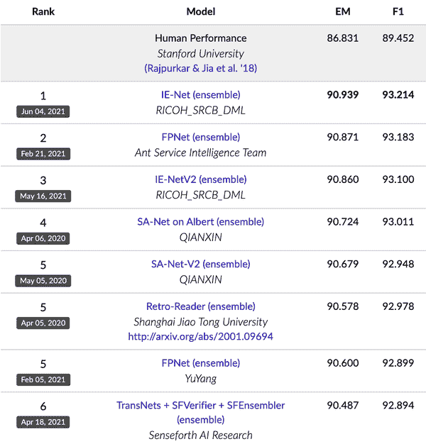

# 第六章：模型开发与离线评估

在第四章中，我们讨论了如何为您的模型创建训练数据；在第五章中，我们讨论了如何从这些训练数据中进行特征工程。通过初始的特征集，我们将进入 ML 系统的 ML 算法部分。对我来说，这总是最有趣的一步，因为它允许我尝试不同的算法和技术，甚至是最新的技术。这也是我可以看到自己在数据和特征工程上投入的所有辛勤工作转化为一个系统的第一步，其输出（预测）我可以用来评估我的努力成功的第一步。

要构建一个 ML 模型，我们首先需要选择要构建的 ML 模型。有很多 ML 算法可供选择，而且还在积极开发中。本章从选择最适合您任务的最佳算法的六个提示开始。

接下来的部分讨论了模型开发的不同方面，如调试、实验跟踪与版本控制、分布式训练和自动化机器学习。

模型开发是一个迭代过程。每次迭代后，您都希望将模型的性能与之前迭代的性能进行比较，并评估这次迭代是否适合投入生产。本章的最后一节专门讨论了在将模型部署到生产环境之前如何评估您的模型，涵盖了一系列评估技术，包括扰动测试、不变性测试、模型校准和基于幻灯片的评估。

我期望大多数读者已经了解常见的 ML 算法，如线性模型、决策树、*k* 最近邻居和不同类型的神经网络。本章将讨论围绕这些算法的技术，但不会详细介绍它们的工作原理。因为本章涉及 ML 算法，所以需要比其他章节更多的 ML 知识。如果您对此不熟悉，我建议在阅读本章之前参加在线课程或阅读一本关于 ML 算法的书籍。希望快速复习基本 ML 概念的读者可能会发现[书的 GitHub 仓库](https://oreil.ly/designing-machine-learning-systems-code)中“基本 ML 复习”部分有所帮助。

# 模型开发与训练

在本节中，我们将讨论帮助您开发和训练模型的必要方面，包括如何为您的问题评估不同的 ML 模型、创建模型集合、实验跟踪与版本控制以及分布式训练，这对于目前通常训练模型的规模是必要的。我们将以更高级别的 AutoML 主题结束本节——使用 ML 自动选择最适合您问题的模型。

## 评估 ML 模型

针对任何给定问题，都有许多可能的解决方案。面对一个可以利用机器学习来解决的任务，你可能会想知道应该使用哪种机器学习算法。例如，你应该从你已经熟悉的逻辑回归开始吗？还是应该尝试一个新的看起来是你问题的最新技术的新模型？一位资深同事提到，梯度提升树对她过去这个任务总是有效——你应该听她的建议吗？

如果你有无限的时间和计算能力，理性的做法是尝试所有可能的解决方案，看看哪个对你最有利。然而，时间和计算能力都是有限资源，你必须对选择的模型有战略性的考虑。

谈到机器学习算法时，许多人会想到经典的机器学习算法与神经网络之间的对比。神经网络，尤其是深度学习，受到了大量的兴趣和媒体报道，这是可以理解的，因为过去十年中大部分人工智能的进展都是由于神经网络变得更大、更深。

这些兴趣和报道可能会给人一种深度学习正在取代经典机器学习算法的印象。然而，尽管深度学习在生产中发现了更多的用例，但经典机器学习算法并没有消失。许多推荐系统仍然依赖协同过滤和矩阵分解。基于树的算法，包括梯度提升树，仍然驱动着许多有严格延迟要求的分类任务。

即使在部署神经网络的应用中，经典的机器学习算法仍然在同时使用。例如，神经网络和决策树可能会在集成中一起使用。一个 k-means 聚类模型可能被用来提取特征，以输入到神经网络中。反之亦然，一个预训练的神经网络（如 BERT 或 GPT-3）可能被用来生成嵌入，以输入到逻辑回归模型中。

在为你的问题选择模型时，你并不是从所有可能的模型中选择，而是通常集中在一组适合你问题的模型上。例如，如果你的老板告诉你要建立一个检测有毒推文的系统，你知道这是一个文本分类问题——给定一段文本，分类它是否有毒——常见的文本分类模型包括朴素贝叶斯、逻辑回归、循环神经网络以及基于变压器的模型如 BERT、GPT 及其变种。

如果你的客户希望你建立一个检测欺诈交易的系统，你知道这是经典的异常检测问题——欺诈交易是你想要检测的异常——这个问题的常见算法有许多，包括*k*-最近邻算法、孤立森林、聚类和神经网络。

对常见的机器学习任务及其解决方法的了解在这个过程中是至关重要的。

不同类型的算法需要不同数量的标签以及不同数量的计算资源。有些训练时间更长，而有些则更长时间做出预测。非神经网络算法往往更易于解释（例如，哪些特征对将电子邮件分类为垃圾邮件做出了最大贡献）比神经网络更易于解释。

在考虑使用哪种模型时，重要的是不仅要考虑模型的性能，例如准确度、F1 分数和对数损失，还要考虑其它属性，比如需要训练的数据量、计算资源和时间、推断延迟以及可解释性。例如，一个简单的逻辑回归模型可能比复杂的神经网络精度要低，但它需要更少的标注数据开始训练，训练速度更快，部署起来更容易，并且解释其为何做出特定预测也更容易。

比较机器学习算法不在本书的范围之内。无论比较多么出色，一旦新算法出现，它就会过时。回到 2016 年，LSTM-RNN 曾风靡一时，是支持许多 NLP 任务的 seq2seq（序列到序列）架构的骨干，从机器翻译到文本摘要到文本分类。然而，仅仅两年后，循环架构在 NLP 任务中大部分被变压器架构所取代。

要理解不同的算法，最好的方法是装备自己基础的机器学习知识，并运行你感兴趣的算法的实验。为了跟上如此多的新机器学习技术和模型，我发现监视像 NeurIPS、ICLR 和 ICML 这样的主要机器学习会议的趋势，以及在 Twitter 上关注那些工作具有高信噪比的研究人员是有帮助的。

### 模型选择的六个建议

不涉及具体的不同算法，这里是六个建议，可能帮助你决定下一步要研究的机器学习算法。

#### 避免陷入最新技术的陷阱

在帮助公司和最近毕业生入门机器学习时，我通常要花不少时间引导他们不要直接跳进最新的模型中。我可以理解为什么人们想要最新的模型。许多人认为这些模型会是解决问题的最佳方案——如果你相信存在更新且更优越的解决方案，为什么要尝试一个旧的解决方案呢？许多业务领导也想使用最新的模型，因为他们希望使他们的业务显得前沿。开发者可能更喜欢尝试新模型，而不是一遍又一遍地陷入相同的老问题中。

研究人员通常只在学术环境中评估模型，这意味着一个模型被视为最先进通常意味着*它在某些静态数据集上表现优于现有模型*。这并不意味着这个模型将足够快或便宜以便*你*实施。甚至这也不意味着这个模型将在*你*的数据上比其他模型表现更好。

尽管保持与新技术的同步是必要的，并且评估其对你的业务的益处是有益的，但解决问题时最重要的是找到能解决问题的解决方案。如果有一个比最先进模型更便宜和更简单的解决方案能够解决你的问题，那么使用简单的解决方案是最重要的。

#### 从最简单的模型开始

Python 之禅指出，“简单胜于复杂”，这个原则在机器学习中同样适用。简单性有三个目的。首先，简单模型更容易部署，早期部署你的模型可以验证你的预测管道与训练管道一致。其次，从简单开始，逐步添加更复杂的组件使得理解和调试你的模型更容易。第三，最简单的模型作为基准，可以用来比较你更复杂的模型。

最简单的模型并不总是与最小努力的模型相同。例如，预训练 BERT 模型很复杂，但是如果你使用像 Hugging Face 的 Transformer 中那样的现成实现，那么开始使用它们几乎没有什么难度。在这种情况下，使用复杂的解决方案并不是一个坏主意，因为这个解决方案周围的社区已经发展得足够好，可以帮助你解决可能遇到的任何问题。然而，你可能仍然希望尝试更简单的解决方案，以确保预训练 BERT 确实比这些更简单的解决方案更适合你的问题。预训练 BERT 可能开始起步较轻松，但是改进起来可能需要相当大的努力。而如果你从一个更简单的模型开始，你将有很多空间来改进你的模型。

#### 避免在选择模型时存在人类偏见

想象一下，你团队中的一名工程师被分配了评估哪个模型更适合你的问题的任务：梯度提升树还是预训练 BERT 模型。两周后，这位工程师宣布最好的 BERT 模型比最好的梯度提升树表现提升了 5%。你的团队决定选择预训练 BERT 模型。

几个月后，然而，一位经验丰富的工程师加入了你的团队。她决定重新研究梯度提升树，发现这一次，最优的梯度提升树优于你当前生产中的预训练 BERT 模型。发生了什么事情？

在评估模型时存在许多人为偏见。评估 ML 架构的过程之一是尝试不同的特征和不同的超参数组合，以找到该架构的最佳模型。如果工程师对某个架构更感兴趣，他们可能会花更多时间进行实验，这可能会导致该架构的模型表现更好。

在比较不同架构时，重要的是在可比较的设置下进行比较。如果你为一个架构运行了 100 次实验，那么仅仅为正在评估的另一个架构运行几次实验是不公平的。你可能也需要为另一个架构运行 100 次实验。

因为模型架构的性能在其评估的上下文中高度依赖于各种因素，例如任务、训练数据、测试数据、超参数等，所以很难断言一个模型架构比另一个更好。在某个特定上下文中可能是真的，但在所有可能的上下文中不太可能是真的。

#### 现在评估好的性能与以后评估好的性能对比

现在最好的模型并不总是意味着两个月后最好的模型。例如，基于树的模型现在可能效果更好，因为你还没有大量数据，但两个月后，你可能能够增加两倍的训练数据，你的神经网络可能会表现得更好。¹

估计你的模型在有更多数据时性能如何变化的一种简单方法是使用[学习曲线](https://oreil.ly/9QZLa)。模型的学习曲线是其性能的绘图，例如训练损失、训练准确率、验证准确率，以及它使用的训练样本数量，如图 6-1 所示。学习曲线不能帮助你准确估计通过增加训练数据可以获得多少性能提升，但它可以让你知道是否可以期待从更多训练数据中获得任何性能提升。

###### 图 6-1\. 朴素贝叶斯模型和 SVM 模型的学习曲线。来源：[scikit-learn](https://oreil.ly/QA52c)

我遇到过的一种情况是，当一个团队评估一个简单的神经网络和一个协同过滤模型来进行推荐时。在离线评估两个模型时，协同过滤模型表现更好。然而，简单的神经网络可以随着每个新样本的到来进行更新，而协同过滤必须查看所有数据来更新其基础矩阵。团队决定部署协同过滤模型和简单神经网络。他们使用协同过滤模型为用户做出预测，并持续在生产环境中用新的输入数据训练简单的神经网络。两周后，简单神经网络能够超越协同过滤模型。

在评估模型时，你可能希望考虑它们在不久的将来改进的潜力，以及实现这些改进的难易程度。

#### 评估权衡

在选择模型时，你必须做出许多权衡。了解在你的机器学习系统性能中什么更重要将帮助你选择最合适的模型。

一个经典的权衡例子是假阳性和假阴性之间的权衡。减少假阳性的数量可能会增加假阴性的数量，反之亦然。在假阳性比假阴性更为危险的任务中，例如指纹解锁（未经授权的人不应被分类为已授权并获得访问权限），你可能更喜欢一个能减少假阳性的模型。同样，在假阴性比假阳性更为危险的任务中，例如 COVID-19 筛查（COVID-19 患者不应被错误地分类为非 COVID-19），你可能更喜欢一个能减少假阴性的模型。

另一个权衡的例子是计算需求和准确性——一个更复杂的模型可能会提供更高的准确性，但可能需要一个更强大的机器，例如 GPU 而非 CPU，以在可接受的推断延迟下生成预测。许多人也关心可解释性和性能之间的权衡。一个更复杂的模型可以提供更好的性能，但其结果的解释性较差。

#### 了解你的模型假设

统计学家乔治·博克斯在 1976 年曾说过：“所有模型都是错误的，但有些是有用的。” 现实世界异常复杂，模型只能基于假设进行近似。每个模型都有其自己的假设。了解一个模型做出了哪些假设，以及我们的数据是否满足这些假设，有助于评估哪种模型最适合你的使用场景。

以下是一些常见的假设。这不是详尽无遗的列表，而只是一个演示：

预测假设

每个旨在从输入*X*预测输出*Y*的模型都假设，基于*X*可以预测*Y*是可能的。

独立同分布（IID）

神经网络假设示例是[独立同分布的](https://oreil.ly/hXRr2)，这意味着所有示例都是从相同的联合分布独立抽取的。

平滑性

每个监督学习方法假设存在一组函数，可以将输入转换为输出，使得相似的输入被转换为相似的输出。如果一个输入*X*产生输出*Y*，那么接近*X*的输入会产生与*Y*成比例的输出。

可计算性

设*X*为输入，*Z*为*X*的潜在表示。每个生成模型都假设可以计算概率*P*(*Z*|*X*)。

边界

线性分类器假设决策边界是线性的。

条件独立

朴素贝叶斯分类器假设给定类别时属性值是相互独立的。

正态分布

许多统计方法假设数据服从正态分布。

## 集成方法

在考虑解决您的问题的机器学习解决方案时，您可能希望从包含一个模型的系统开始（在本章早些时候讨论了选择解决方案的过程）。开发出一个单一模型后，您可以考虑如何进一步提高其性能。一种始终有效的方法是使用多个模型的集成来进行预测，而不仅仅是一个模型。集成中的每个模型称为*基学习器*。例如，对于预测电子邮件是否为垃圾邮件的任务，您可能有三种不同的模型。每封电子邮件的最终预测是所有三个模型的多数投票。因此，如果至少两个基学习器输出垃圾邮件，则该邮件将被分类为垃圾邮件。

截至 2021 年 8 月，Kaggle 比赛中的 22 个获胜解决方案中，有 20 个使用了集成方法。² 截至 2022 年 1 月，[SQuAD 2.0](https://oreil.ly/odo12)，斯坦福问答数据集的前 20 个解决方案都是集成方法，如图 6-2 所示。

集成方法在生产环境中不太受青睐，因为集成模型部署复杂且难以维护。然而，在某些任务中，集成模型仍然很常见，因为稍微提高的性能可能带来巨大的财务收益，比如预测广告的点击率。

###### 图 6-2。截至 2022 年 1 月，[SQuAD 2.0](https://oreil.ly/odo12)的前 20 个解决方案全部是集成方法。

我们将通过一个例子来说明集成方法为何有效。想象一下，您有三个电子邮件垃圾分类器，每个分类器的准确率为 70%。假设每个分类器对每封电子邮件的正确预测具有相等的概率，并且这三个分类器之间没有相关性，我们将展示通过这三个分类器的多数投票，我们可以获得 78.4%的准确率。

每封电子邮件，每个分类器都有 70%的正确概率。如果至少有两个分类器是正确的，那么集成将是正确的。Table 6-1 展示了给定电子邮件的集成不同可能结果的概率。这个集成将有 0.343 + 0.441 = 0.784，即 78.4%的准确率。

表 6-1\. 从三个分类器中采用多数投票法的集成可能结果

| 三个模型的输出 | 概率 | 集成输出 |
| --- | --- | --- |
| 三个都正确 | 0.7 * 0.7 * 0.7 = 0.343 | 正确 |
| 仅两个正确 | (0.7 * 0.7 * 0.3) * 3 = 0.441 | 正确 |
| 仅一个正确 | (0.3 * 0.3 * 0.7) * 3 = 0.189 | 错误 |
| 无一个正确 | 0.3 * 0.3 * 0.3 = 0.027 | 错误 |

只有在集成中的分类器不相关时，此计算才有效。如果所有分类器完全相关，即它们每个都对每封电子邮件做出相同预测，那么集成的准确性将与每个单独分类器的准确性相同。创建集成时，基础学习器之间的相关性越低，集成效果越好。因此，通常选择非常不同类型的模型进行集成。例如，可以创建一个由一个 Transformer 模型、一个循环神经网络和一个梯度提升树组成的集成。

创建集成有三种方法：bagging、boosting 和 stacking。根据几篇调查论文显示，除了帮助提升性能外，集成方法如 boosting 和 bagging，连同重采样，还有助于处理不平衡数据集。³ 我们将逐一介绍这三种方法，首先是 bagging。

### Bagging

Bagging，缩写自*bootstrap aggregating*，旨在提高机器学习算法的训练稳定性和准确性。⁴ 它减少了方差并有助于避免过拟合。

给定数据集，与在整个数据集上训练一个分类器不同，您可以使用有放回抽样创建不同的数据集，称为 bootstrap，并在每个 bootstrap 上训练分类或回归模型。有放回抽样确保每个 bootstrap 都是独立创建的。Figure 6-3 展示了 bagging 的示意图。

###### 图 6-3\. Bagging 示意图。来源：根据[Sirakorn](https://oreil.ly/KEAPl)的图像适配

如果问题是分类，最终预测由所有模型的多数投票决定。例如，如果有 10 个分类器投票 SPAM，6 个模型投票 NOT SPAM，最终预测是 SPAM。

如果问题是回归，最终预测是所有模型预测的平均值。

Bagging 通常可以改善不稳定方法，比如神经网络、分类和回归树，以及线性回归中的子集选择。然而，它可能会轻微降低稳定方法（比如*k*最近邻）的性能。⁵

随机森林是 Bagging 的一个例子。随机森林由 Bagging 和特征随机性构建的决策树集合组成，其中每棵树只能从一个随机特征子集中选择。

### 提升

提升是一族迭代集成算法，将弱学习器转化为强学习器。这个集成中的每个学习器都是在同一组样本上训练的，但是在迭代中样本的权重不同。因此，未来的弱学习器更加关注之前弱学习器误分类的例子。图 6-4 显示了提升的示意图，展示了随后的步骤。

###### 图 6-4\. 提升示例。来源：根据[Sirakorn](https://oreil.ly/h5cuS)的图片改编。

1.  首先，在原始数据集上训练第一个弱分类器。

1.  根据第一个分类器分类效果对样本进行了重新加权，例如，误分类的样本被赋予更高的权重。

1.  在这个重新加权的数据集上训练第二个分类器。你的集成现在包括第一个和第二个分类器。

1.  样本的权重基于集成对其进行分类的效果来确定。

1.  在这个重新加权的数据集上训练第三个分类器。将第三个分类器添加到集成中。

1.  如有需要，重复多次迭代。

1.  形成最终的强分类器，作为现有分类器的加权组合 —— 训练误差较小的分类器具有较高的权重。

提升算法的一个例子是梯度提升机（GBM），它通常通过弱决策树生成预测模型。它像其他提升方法一样，以逐阶段的方式构建模型，并通过允许优化任意可微损失函数来泛化它们。

XGBoost，GBM 的一种变体，曾是许多机器学习比赛中获胜团队首选的算法。⁶ 它被广泛应用于从分类、排名到发现希格斯玻色子等多种任务。⁷ 然而，许多团队开始选择[LightGBM](https://oreil.ly/1qyWf)，这是一个分布式梯度提升框架，支持并行学习，通常能更快地处理大规模数据集的训练。

### 堆叠

堆叠意味着您从训练数据中训练基本学习器，然后创建一个元学习器，该元学习器将基本学习器的输出组合起来生成最终预测结果，如图 6-5 所示。元学习器可以是一个简单的启发式方法：对于分类任务，您可以采用多数投票，对于回归任务，您可以采用平均投票。也可以是另一个模型，例如逻辑回归模型或线性回归模型。

###### 图 6-5\. 三个基本学习器的堆叠集成可视化

关于如何创建集成模型的更多出色建议，请参考 Kaggle 传奇团队 MLWave 的精彩[集成指南](https://oreil.ly/Nu6G6)。

## 实验追踪和版本控制

在模型开发过程中，通常需要尝试许多不同的架构和模型，以选择最适合您问题的模型。有些模型可能看起来相似，只有一个超参数不同，比如一个模型使用学习率为 0.003，另一个模型使用学习率为 0.002，但它们的性能可能截然不同。重要的是要记录所有需要重新创建实验及其相关文档的定义。文档是在实验过程中生成的文件，例如显示损失曲线、评估损失图、日志或模型在训练过程中的中间结果的文件。这使您能够比较不同的实验，并选择最适合您需求的实验。比较不同的实验还可以帮助您理解如何通过小的变化影响模型的性能，进而更好地了解您的模型如何工作。

跟踪实验进展和结果的过程称为实验追踪。为了可能在以后重新创建实验或与其他实验比较而记录实验的所有详细信息的过程称为版本控制。这两者是密切相关的。许多最初旨在成为实验追踪工具的工具，如 MLflow 和 Weights & Biases，现在已经发展为包含版本控制功能。许多最初旨在成为版本控制工具的工具，如[DVC](https://oreil.ly/f3sBp)，现在也已经包含了实验追踪功能。

### 实验追踪

训练机器学习模型的重要部分是监控学习过程。在训练过程中可能会出现许多问题，包括损失不降低、过拟合、欠拟合、权重值波动、死神经元和内存耗尽等。重要的是要跟踪训练过程中发生的情况，不仅用于检测和解决这些问题，还用于评估模型是否学到了有用的东西。

当我刚开始接触机器学习时，所有人都告诉我要追踪的只有损失和速度。几年后，人们追踪的项目变得如此之多，以至于他们的实验追踪面板看起来既美观又可怕。以下是您在每个实验的训练过程中可能想要考虑追踪的事项的简短列表：

+   对应于训练集和每个评估集的*损失曲线*。

+   您关心的模型性能指标，在所有非测试集上，例如准确率、F1 值、困惑度。

+   *相应样本、预测和实际标签的日志*。这对于临时分析和检查数据的一致性非常有用。

+   您的模型*速度*，通过每秒步骤数或者如果您的数据是文本，则是每秒处理的标记数来评估。

+   *系统性能指标*，如内存使用情况和 CPU/GPU 利用率。它们对于识别瓶颈并避免浪费系统资源非常重要。

+   随时间变化的任何*参数和超参数*的值，这些变化可能会影响您模型的性能，例如如果使用学习率调度，则学习率；梯度范数（全局和每层），特别是如果剪裁梯度范数；以及权重范数，特别是如果进行权重衰减。

理论上，跟踪所有可能的事项并不是一个坏主意。大多数情况下，您可能不需要查看大多数追踪项。但是当发生问题时，其中一个或多个可能会为您提供理解和/或调试模型的线索。总体上，追踪使您能够观察模型状态。⁸ 然而，在实践中，由于当前工具的限制，跟踪太多事项可能会让人不知所措，而追踪不重要的事项可能会让您分心，而忽视真正重要的事项。

实验追踪使得可以跨实验进行比较。通过观察某个组件变化如何影响模型性能，您可以理解该组件的功能。

跟踪实验的简单方法是自动复制所有实验所需的代码文件，并记录所有输出及其时间戳。⁹ 然而，使用第三方实验追踪工具可以为您提供漂亮的仪表板，并允许您与同事共享您的实验。

### 版本控制

想象一下这种情况。你和你的团队在过去几周里不断调整你们的模型，最后一次运行显示出了有希望的结果。你想要用它进行更广泛的测试，所以你试图使用你某处记录下来的超参数集来复制它，但却发现结果并不完全相同。你记得在那次运行和下一次之间做了一些代码更改，所以你尽力凭记忆撤销那些更改，因为你那时的冲动自己认为这些变化太微小，不值得提交。但你仍然无法复制出有希望的结果，因为有太多可能的方式可以进行更改。

如果您对机器学习实验进行了版本控制，这个问题本可以避免。机器学习系统既是代码，也是数据，因此您不仅需要对代码进行版本控制，还需要对数据进行版本控制。代码版本控制已经成为行业标准。然而，目前来说，数据版本控制就像使用牙线一样。每个人都认为这是一个好习惯，但很少有人这样做。

数据版本控制面临几个挑战。其中一个原因是，因为数据通常比代码要大得多，所以我们不能使用通常用于版本控制代码的同样策略来版本控制数据。

例如，代码版本控制通过跟踪对代码库的所有更改来进行。一个更改被称为 diff，简称差异。每个更改都通过逐行比较来衡量。代码行通常很短，逐行比较是有意义的。然而，你的数据行，特别是如果它以二进制格式存储，可能长度无限。说这一行有 100 万个字符不同于另一行 100 万个字符，这并没有多大帮助。

代码版本控制工具允许用户通过保留所有旧文件的副本来恢复到先前的代码库版本。然而，使用的数据集可能非常大，多次复制可能是不可行的。

代码版本控制工具允许多人同时在同一份代码库上工作，每个人在本地机器上复制代码库。然而，数据集可能无法适应本地机器。

第二个问题是，关于数据版本化到底包含什么内容仍然存在混淆。当我们对数据版本进行处理时，diff 是否意味着在数据仓库中的任何文件内容发生了更改，只有在添加或删除文件时，还是只有整个仓库的校验和发生了更改时？

截至 2021 年，像 DVC 这样的数据版本工具只有在整个目录的校验和发生了更改，或者文件被添加或删除时才会注册 diff。

另一个困惑是如何解决合并冲突：如果开发者 1 使用数据版本 X 来训练模型 A，而开发者 2 使用数据版本 Y 来训练模型 B，将数据版本 X 和 Y 合并成 Z 是没有意义的，因为没有与 Z 对应的模型。

此外，如果您使用用户数据来训练模型，像《通用数据保护条例》（GDPR）这样的法规可能会使版本控制变得复杂化。例如，法规可能要求您在被请求时删除用户数据，这使得恢复旧版本数据在法律上变得不可能。

激进的实验跟踪和版本控制有助于实现可复现性，但并不保证完全可复现。您使用的框架和硬件可能会给您的实验结果引入不确定性¹⁰，导致在不了解实验运行环境的情况下无法复制实验结果。

目前我们必须运行如此多的实验来找到最佳模型的原因是我们把机器学习视为一个黑盒子。因为我们无法预测哪种配置会最有效，所以我们必须尝试多种配置。然而，我希望随着领域的发展，我们能够更深入地理解不同的模型，并能够推理出哪种模型将最有效，而不是运行数百或数千次实验。

## 分布式训练

随着模型变得更大、更加资源密集，公司对规模化训练越来越重视¹¹。在可扩展性方面的专业知识难以获取，因为它需要定期接触大量计算资源。可扩展性是一个值得一系列书籍探讨的主题。本节旨在强调大规模机器学习的挑战，并提供一个支架，帮助您合理规划项目资源。

训练模型时使用超出内存容量的数据是很常见的。特别是处理医疗数据（如 CT 扫描或基因组序列）时尤其常见。如果您在团队中为大型语言模型（如 OpenAI、Google、NVIDIA、Cohere）工作，这也可能发生在文本数据中。

当您的数据无法全部加载到内存中时，预处理算法（如零中心化、归一化、白化）、数据打乱和批处理将需要在核心外和并行运行¹²。当数据样本较大时，例如一台机器一次只能处理少量样本，您可能只能使用较小的批量大小，这会导致基于梯度下降的优化不稳定。

在某些情况下，数据样本非常大，甚至无法完全载入内存，这时你需要使用类似梯度检查点的技术，这种技术利用内存占用和计算效率之间的平衡来使系统在更少的内存中执行更多的计算。根据开源软件包梯度检查点的作者说：“对于前向传播模型，我们能够将比之前大 10 倍以上的模型装载到我们的 GPU 上，只需增加 20%的计算时间。”¹³ 即使一个样本能够装入内存，使用检查点技术也可以让你将更多的样本放入一个批次中，这可能使你能够更快地训练你的模型。

### 数据并行化

现在，使用多台机器来训练机器学习模型已经成为常态。现代机器学习框架支持的最常见并行化方法是数据并行：将数据分割在多台机器上，训练所有机器上的模型，并累积梯度。这导致了一些问题的出现。

一个具有挑战性的问题是如何准确有效地累积来自不同机器的梯度。由于每台机器产生自己的梯度，如果你的模型等待它们全部完成一次运行——同步随机梯度下降（SSGD），落后者会导致整个系统减速，浪费时间和资源。¹⁴ 落后者问题随着机器数量的增加而增长，因为工作机器越多，在给定迭代中至少有一台机器运行异常缓慢的可能性就越大。然而，已经有许多算法有效地解决了这个问题。¹⁵

如果你的模型使用每台机器单独计算的梯度来更新权重——异步随机梯度下降（ASGD），梯度陈旧可能会成为一个问题，因为一台机器的梯度导致权重在另一台机器的梯度到来之前已经改变。¹⁶

同步 SGD 和异步 SGD 的区别如图 6-6 所示。

###### 图 6-6\. 同步 SGD 和异步 SGD 在数据并行化中的比较。来源：Jim Dowling 的图片改编¹⁷

理论上，异步 SGD 可以收敛，但需要比同步 SGD 更多的步骤。然而，在实践中，当权重数量很大时，梯度更新往往是稀疏的，这意味着大多数梯度更新只修改参数的小部分，不太可能两台不同机器的梯度更新同时修改同一组权重。当梯度更新稀疏时，梯度陈旧问题就不再是一个大问题，模型在同步和异步 SGD 下的收敛情况相似。¹⁸

另一个问题是将模型分布在多台机器上可能会导致批量大小非常大。如果一台机器处理 1,000 的批次大小，那么 1,000 台机器将处理 1M（例如，OpenAI 的 GPT-3 在 2020 年使用的批量大小为 3.2M）¹⁹。简化计算，如果在一台机器上训练一个 epoch 需要 1M 步，那么在 1,000 台机器上训练可能只需要 1,000 步。一个直观的方法是增加学习率，以便在每一步骤中进行更多学习，但我们也不能把学习率设置得太大，因为这会导致不稳定的收敛。实际上，将批量大小增加到一定点后会产生收益递减的效果²⁰。

最后但并非最不重要的是，对于相同的模型设置，主要工作节点有时可能会使用比其他工作节点更多的资源。如果是这种情况，为了充分利用所有机器的资源，您需要找到一种方法来平衡它们之间的工作负载。最简单但不是最有效的方法是在主要工作节点上使用较小的批量大小，在其他工作节点上使用较大的批量大小。

### 模型并行

在数据并行中，每个工作节点都有整个模型的副本，并且执行其模型副本所需的所有计算。模型并行是指在不同的机器上训练模型的不同组件，如图 6-7 所示。例如，机器 0 处理前两层的计算，而机器 1 处理接下来的两层，或者某些机器处理前向传播，而其他机器处理反向传播。

###### 图 6-7\. 数据并行和模型并行。来源：改编自 Jure Leskovec 的一幅图²¹

模型并行有时可能会误导，因为在某些情况下，并行不意味着在不同机器上执行模型的不同部分。例如，如果您的模型是一个庞大的矩阵，并且将该矩阵分成两半在两台机器上，那么这两半可能会并行执行。但是，如果您的模型是一个神经网络，并且将第一层放在机器 1 上，第二层放在机器 2 上，而第二层需要来自第一层的输出才能执行，则机器 2 必须等待机器 1 先完成。

*管道并行* 是一种巧妙的技术，可以使模型的不同组件在不同的机器上更多地并行运行。有多种变体，但其关键思想是将每台机器的计算分成多个部分。当机器 1 完成其计算的第一部分时，它将结果传递给机器 2，然后继续进行第二部分的计算，依此类推。现在，机器 2 可以在第一部分上执行其计算，而机器 1 则在第二部分上执行其计算。

为了更加具体化，假设你有四台不同的机器，第一、第二、第三和第四层分别在机器 1、2、3 和 4 上。使用管道并行，每个小批次被分成四个微批次。机器 1 在第一个微批次上计算第一层，然后机器 2 在机器 1 的结果上计算第二层，同时机器 1 在第二个微批次上计算第一层，依此类推。图 Figure 6-8 显示了在四台机器上使用管道并行的神经网络的情况。

###### Figure 6-8\. 神经网络在四台机器上的管道并行性；每台机器同时运行前向传递（F）和反向传递（B）来处理神经网络的一个组件。来源：根据黄等人的图片改编²²

模型并行和数据并行并不是互斥的。许多公司同时使用这两种方法以更好地利用他们的硬件，尽管配置同时使用这两种方法可能需要大量的工程努力。

## AutoML

有一个笑话说好的机器学习研究员是那些能够设计出足够智能的 AI 算法来自动化自己工作的人。这在 TensorFlow Dev Summit 2018 中变得有趣，当时 Jeff Dean 上台宣布谷歌打算用 100 倍的计算能力来替代机器学习专家，向社区引入了 AutoML，令人兴奋和震惊。与其支付一组 100 名机器学习研究员/工程师来玩弄各种模型，最终选择一个次优模型，为什么不用这笔钱投入计算资源来搜索最优模型呢？活动录像中的截图显示了这一事件 Figure 6-9。

###### Figure 6-9\. Jeff Dean 在 TensorFlow Dev Summit 2018 上揭示谷歌的 AutoML

### 软 AutoML：超参数调整

AutoML 是指自动化寻找解决实际问题的机器学习算法的过程。在生产中，一种温和的形式，也是最流行的形式，是超参数调整。超参数是由用户提供的参数，其值用于控制学习过程，例如学习率、批量大小、隐藏层数量、隐藏单元数量、dropout 概率，Adam 优化器中的 *β*[1] 和 *β*[2] 等等。甚至量化——例如使用 32 位、16 位或 8 位来表示数字或这些表示的混合——也可以被视为需要调整的超参数²³。

对于不同的超参数集合，同一模型在同一数据集上的性能可能会大相径庭。Melis 等人在他们 2018 年的论文 [“On the State of the Art of Evaluation in Neural Language Models”](https://oreil.ly/AY2lF) 中表明，经过良好调优的弱模型可能会胜过更强大、更花哨的模型。超参数调优的目标是在一个搜索空间内找到给定模型的最优超参数集合，每个集合的性能都在验证集上评估。

尽管许多人知道超参数调优的重要性，仍然有很多人忽视系统化的方法，而更倾向于凭感觉进行手动调整。其中最流行的可能是研究生下降法（GSD），这是一种技术，研究生会调整超参数直到模型正常工作。²⁴

然而，越来越多的人将超参数调优作为标准流程的一部分。流行的机器学习框架通常都带有内置工具或者有第三方工具来进行超参数调优，例如，scikit-learn 自带的 auto-sklearn²⁵，TensorFlow 的 Keras Tuner，以及 Ray 的 [Tune](https://oreil.ly/uulrC)。流行的超参数调优方法包括随机搜索²⁶，网格搜索，以及贝叶斯优化²⁷。《AutoML: Methods, Systems, Challenges》一书由弗莱堡大学的 AutoML 小组编写，将其 [第一章](https://oreil.ly/LfqJm)（可以免费在线阅读）专注于超参数优化。

在调整超参数时，请记住模型的性能可能对某些超参数的更改更为敏感，因此对敏感超参数应更加小心地调整。

###### 警告

绝对不要使用测试集来调整超参数。选择基于验证集性能的最佳超参数集合，然后报告模型在测试集上的最终性能。如果使用测试集来调整超参数，会导致模型对测试集过拟合。

### Hard AutoML：架构搜索和学习优化器

一些团队将超参数调优推向了新的高度：如果我们将模型的其他组件或整个模型视为超参数呢？卷积层的大小或是否具有跳跃层都可以视为超参数。与其在卷积层之后手动放置池化层或在线性层后放置 ReLu（修正线性单元），不如给算法提供这些构建块，让算法自行决定如何组合它们。这一研究领域被称为架构搜索，或神经架构搜索（NAS）用于神经网络，因为它寻找最优的模型架构。

NAS 设置由三个组件组成：

搜索空间

定义可能的模型架构 —— 即可以选择的构建模块以及它们组合方式的约束条件。

性能估计策略

评估候选架构的性能，而无需对每个候选架构从头开始训练直至收敛。当我们有大量候选架构时，比如 1,000 个，训练所有候选架构直至收敛可能成本高昂。

搜索策略

探索搜索空间的方法。一种简单的方法是随机搜索 —— 从所有可能的配置中随机选择 —— 这在 NAS 中即使不受欢迎也是 prohibitively expensive。常见的方法包括强化学习（奖励改进性能估计的选择）和进化算法（对架构添加突变，选择表现最佳的，对它们再添加突变，依此类推）²⁸。

对于 NAS，搜索空间是离散的 —— 每一层/操作最终的架构仅使用可用选项中的一个²⁹，你需要提供构建模块的集合。常见的构建模块包括不同尺寸的各种卷积、线性操作、各种激活函数、池化、恒等映射、零操作等等。构建模块的集合根据基础架构而异，例如卷积神经网络或者变换器。

在典型的机器学习训练过程中，你有一个模型，然后有一个学习过程 —— 一种算法，帮助你的模型找到最小化给定数据集上给定目标函数的参数集。如今神经网络最常见的学习过程是梯度下降，它利用优化器指定如何根据梯度更新模型的权重³⁰。流行的优化器包括，如你可能已知，Adam、Momentum、SGD 等等。理论上，你可以将优化器作为 NAS 的构建模块并寻找最适合的优化器。实际上，这很难做到，因为优化器对其超参数的设置很敏感，并且默认的超参数通常在不同架构间表现不佳。

这导致了一个激动人心的研究方向：如果我们用神经网络替换指定更新规则的函数会怎样？模型权重的更新量可以通过这个神经网络计算出来。这种方法产生了学习优化器，而不是手工设计的优化器。

由于学习优化器是神经网络，它们需要训练。你可以在训练神经网络的同时在相同数据集上训练学习优化器，但这需要每次有任务时都训练一个优化器。

另一种方法是在一组现有任务上训练一个学习优化器——使用这些任务的聚合损失作为损失函数和现有设计的优化器作为学习规则——然后在每个新任务中使用它。例如，Metz 等人构建了一组数千个任务来训练学习优化器。他们的学习优化器能够推广到新数据集、领域以及新架构。³¹ 这种方法的美妙之处在于，学习优化器随后可以用来训练一个更好的学习优化器，即改进自身的算法。

无论是架构搜索还是元学习学习规则，前期培训成本都足够昂贵，以至于全球只有少数几家公司能够承担这些成本。然而，对于有兴趣将 ML 应用于生产中的人们来说，了解 AutoML 的进展是很重要的，原因有两点。首先，产生的架构和学习优化器可以让 ML 算法即插即用地应用于多个实际任务，节省生产中的时间和成本，包括培训和推断。例如，由 Google 的 AutoML 团队生成的 EfficientNets 模型系列，在效率上超越了现有技术的精度，高达 10 倍。³² 其次，它们可能能够解决许多以前依靠现有架构和优化器无法解决的实际任务。

# 模型离线评估

我在帮助公司制定 ML 策略时经常遇到的一个常见但相当困难的问题是：“我怎么知道我们的 ML 模型是否有效？” 例如，某公司部署了 ML 来检测 100 架监视无人机的入侵，但他们无法衡量系统未能检测到多少次入侵，也无法确定哪种 ML 算法更适合他们的需求。

缺乏对如何评估您的 ML 系统进行清晰理解并不一定会导致您的 ML 项目失败，但可能会使您无法找到最适合您需求的最佳解决方案，并使说服管理层采纳 ML 变得更加困难。您可能需要与业务团队合作，开发更符合公司业务的模型评估指标。³⁷

理想情况下，开发和生产中的评估方法应该是一致的。但在许多情况下，这种理想是不可能的，因为在开发过程中，您有地面实况标签，但在生产中则没有。

对于某些任务，可以根据用户反馈推断或近似标签，如在“自然标签”一节中所述。例如，对于推荐任务，可以通过用户是否点击来推断推荐是否有效。但是，这涉及许多偏见。

对于其他任务，您可能无法直接评估您模型在生产中的表现，并可能需要依赖广泛的监控来检测 ML 系统性能的变化和失败。我们将在第八章中讨论监控。

一旦您的模型部署，您将需要继续监控和测试您模型在生产中的表现。在本节中，我们将讨论在部署之前评估模型性能的方法。我们将从评估我们模型的基线开始。然后我们将介绍一些常见的方法来评估您模型的整体准确性之外的性能。

## 基线

曾经有人告诉我，她的新生成模型在 ImageNet 上达到了 10.3 的 FID 分数。³⁸ 我不知道这个数字意味着什么，或者她的模型对我的问题是否有用。

另一次，我帮助一家公司实现了一个分类模型，其中正类在 90%的时间内出现。团队中的一个 ML 工程师兴奋地告诉我，他们的初始模型实现了 0.90 的 F1 分数。我问他这与随机相比如何。他毫无头绪。事实证明，因为对于他的任务，正类占标签的 90%，如果他的模型随机输出正类的概率为 90%，其 F1 分数也会约为 0.90。³⁹ 他的模型可能与随机预测无异。⁴⁰

评估指标本身意义不大。在评估您的模型时，了解您正在评估的基线至关重要。确切的基线应因用例而异，但以下五个基线可能对各种用例有所帮助：

随机基线

如果我们的模型只是随机预测，预期性能如何？预测是根据特定分布随机生成的，可以是均匀分布或任务的标签分布。

例如，考虑一个具有两个标签的任务，其中 NEGATIVE 出现的时间为 90%，而 POSITIVE 出现的时间为 10%。表 6-2 显示了随机预测基准模型的 F1 和准确度分数。然而，作为一种练习，看看大多数人对这些值缺乏直觉，尝试在查看表格之前在头脑中计算这些原始数字。

表 6-2\. 预测随机的基准模型的 F1 和准确度分数

| 随机分布 | 含义 | F1 | 准确度 |
| --- | --- | --- | --- |
| 均匀随机 | 预测每个标签的概率相等（50%） | 0.167 | 0.5 |
| 任务标签分布 | 90% 的时间预测为 NEGATIVE，10% 的时间预测为 POSITIVE | 0.1 | 0.82 |

简单启发式

忘记机器学习。如果你只是基于简单的启发式进行预测，你会期望什么样的表现？例如，如果你想建立一个排名系统，以排列用户新闻提要中的项目，目标是让用户在新闻提要上花更多时间，如果你只是按时间顺序逆序排列所有项目，先显示最新的项目，用户会花费多少时间？

零规则基线

零规则基线是简单启发式基线的特殊情况，当你的基准模型总是预测最常见的类时。

例如，对于推荐用户下一个手机应用的任务，最简单的模型可能是推荐他们最常用的应用。如果这个简单的启发式能够准确预测下一个应用达到 70%的时间，任何你建立的模型必须显著优于它，以证明增加的复杂性是合理的。

人类基线

在许多情况下，机器学习的目标是自动化人类可能会完成的任务，因此了解你的模型与人类专家相比的表现是非常有用的。例如，如果你在一个自动驾驶系统上工作，比较你的系统与人类驾驶员的进展至关重要，因为否则你可能永远无法说服用户信任这个系统。即使你的系统并不意味着取代人类专家，只是帮助他们提高生产力，了解在什么情况下这个系统对人类有用仍然很重要。

现有解决方案

在许多情况下，机器学习系统被设计来取代现有的解决方案，这可能是带有大量 if/else 语句或第三方解决方案的业务逻辑。将你的新模型与这些现有解决方案进行比较至关重要。你的机器学习模型并不总是比现有解决方案更好才能有用。如果一个模型的表现稍逊色，但使用起来更简单或更便宜，它仍然可以是有用的。

在评估模型时，区分“好系统”和“有用系统”非常重要。一个好系统未必有用，一个坏系统未必无用。如果一个自动驾驶车辆较之前的系统有显著提升，那么它可能是好的，但如果它的表现不如人类驾驶员，那么它可能就不是有用的。在某些情况下，即使一个机器学习系统比普通人驾驶员表现更好，人们仍然可能不信任它，这使得它不具有用处。另一方面，如果一个系统预测用户在手机上接下来会输入的单词比母语者差得多，那么它可能被认为是坏的。然而，如果它的预测有助于用户更快地输入某些时间，它可能仍然是有用的。

## 评估方法

在学术设置中，评估机器学习模型时，人们往往会专注于性能指标。然而，在实际生产中，我们还希望我们的模型具有稳健性、公平性、校准性，并且整体上是合理的。我们将介绍一些评估方法来帮助衡量模型的这些特性。

### 扰动测试

我的一群学生想要开发一个通过咳嗽声预测某人是否患有 COVID-19 的应用程序。他们的最佳模型在训练数据上表现出色，这些数据由医院收集的两秒钟长的咳嗽片段组成。然而，当他们将其部署到实际用户时，该模型的预测结果接近随机。

其中一个原因是，实际用户的咳嗽声与在医院收集的咳嗽声相比含有大量噪音。用户的录音可能包含背景音乐或附近的喋喋不休。他们使用的麦克风质量参差不齐。他们可能会在启用录音后立即开始记录他们的咳嗽声，或者等待几分之一秒后开始。

理想情况下，用于开发模型的输入应该与生产环境中模型将要处理的输入相似，但在许多情况下这是不可能的。特别是在数据收集昂贵或困难，并且你能够访问的最佳数据仍然与实际数据差异很大的情况下。生产环境中模型需要处理的输入通常与开发中的输入相比更加嘈杂。⁴¹ 在训练数据上表现最好的模型不一定在嘈杂数据上表现最佳。

为了了解您的模型在嘈杂数据下的表现如何，您可以对测试集进行小的更改，看看这些更改如何影响模型的性能。例如，对于预测某人是否患有 COVID-19 的任务，您可以随机添加一些背景噪音或随机剪辑测试音频片段，以模拟用户录音的变化。您可能希望选择在扰动数据上表现最佳的模型，而不是在干净数据上表现最佳的模型。

您的模型对噪声越敏感，维护起来就越困难，因为如果您的用户行为略有变化，例如他们更换手机，您的模型性能可能会下降。这也使您的模型容易受到对抗性攻击。

### 不变性测试

伯克利大学的一项研究发现，在 2008 年至 2015 年间，因为其种族而有 130 万名信用良好的黑人和拉丁裔申请者的抵押贷款申请被拒绝。⁴² 当研究人员使用被拒绝申请的收入和信用评分，但删除了识别种族的特征时，这些申请被接受。

输入的某些变化不应导致输出的变化。在前述情况下，种族信息的变化不应影响抵押贷款的结果。同样，申请人姓名的变化不应影响其简历筛选结果，某人的性别也不应影响他们应该获得多少薪水。如果发生了这些情况，你的模型存在偏见，这可能导致其无法使用，无论其性能多么出色。

要避免这些偏见，一个解决方案是执行与伯克利研究人员发现偏见相同的过程：保持输入不变，但改变敏感信息，看看输出是否改变。更好的做法是，在训练模型时首先排除敏感信息不作为特征使用。⁴³

### 方向性期望测试

然而，输入的某些变化应导致输出的可预测的变化。例如，当开发一个预测房价的模型时，保持所有特征不变但增加土地面积不应导致预测价格下降，减少平方英尺不应导致价格上升。如果输出以相反预期的方向改变，你的模型可能没有学习到正确的内容，你需要在部署之前进一步调查它。

### 模型校准

模型校准是一个微妙但关键的概念。想象一下，有人预测某件事情发生的概率是 70%。这个预测意味着，在所有这个预测被做出的情况下，预测的结果与实际结果一致的次数为 70%。如果一个模型预测 A 队以 70%的概率击败 B 队，而在这两支队伍共同比赛的 1,000 次中，A 队只赢了 60%的时间，那么我们称这个模型没有校准。一个校准的模型应该预测 A 队以 60%的概率获胜。

模型校准经常被机器学习从业者忽视，但它是任何预测系统的最重要属性之一。引用内特·西尔弗在他的书《信号与噪声》中的话，校准是“一个预测的最重要的测试之一——我会认为这是最重要的一个测试。”

我们将通过两个示例来展示为什么模型校准很重要。首先，考虑建立推荐系统来推荐用户接下来可能观看的电影的任务。假设用户 A80%的时间观看浪漫电影，20%的时间观看喜剧。如果你的推荐系统精确地展示 A 将最有可能观看的电影，那么推荐将仅包含浪漫电影，因为 A 更有可能观看浪漫电影而不是其他类型的电影。你可能希望一个更加校准的系统，其推荐是用户实际观看习惯的代表。在这种情况下，推荐应包含 80%的浪漫电影和 20%的喜剧电影。⁴⁴

其次，考虑建立一个模型来预测用户点击广告的可能性。为了简单起见，假设只有两个广告，广告 A 和广告 B。你的模型预测这个用户点击广告 A 的概率是 10%，点击广告 B 的概率是 8%。你并不需要你的模型来校准以便将广告 A 排在广告 B 之上。然而，如果你想预测广告将会获得多少点击次数，你就需要你的模型进行校准。如果你的模型预测一个用户点击广告 A 的概率是 10%，但实际上广告只被点击了 5%的时间，你估计的点击次数就会大大偏差。如果你有另一个给出相同排名但更好校准的模型，你可能要考虑更好校准的那个模型。

要衡量模型的校准性，一个简单的方法是计数：你计算模型输出概率 *X* 的次数和该预测实际发生的频率 *Y*，并将 *X* 对 *Y* 进行绘图。一个完全校准的模型的图表将在所有数据点上都有 *X* 等于 *Y*。在 scikit-learn 中，你可以使用方法 `sklearn.calibration.calibration_curve` 绘制二元分类器的校准曲线，如图 6-11 所示。

###### 图 6-11\. 不同模型在一个玩具任务上的校准曲线。逻辑回归模型是最佳校准模型，因为它直接优化逻辑损失。来源：[scikit-learn](https://oreil.ly/Tnts7)

要对你的模型进行校准，一个常见的方法是[Platt 缩放](https://oreil.ly/pQ0TQ)，在 scikit-learn 中实现为 `sklearn.calibration.CalibratedClassifierCV`。另一个由 Geoff Pleiss 优秀的开源实现可以在[GitHub](https://oreil.ly/e1Meh)找到。对于想要了解模型校准重要性以及如何校准神经网络的读者，Lee Richardson 和 Taylor Pospisil 在 Google 的工作基础上撰写了一篇[优秀的博客文章](https://oreil.ly/wPUkU)。

### 置信度测量

置信度测量可以被视为考虑每个单独预测的有用性阈值的一种方式。无差别地向用户展示模型不确定的所有预测，甚至是模型不确定的预测，充其量会导致用户感到恼怒，并且失去对系统的信任，例如您智能手表上的活动检测系统认为您正在跑步，尽管您只是走得稍快。最坏的情况下，这可能会导致灾难性后果，例如预测性警务算法将一个无辜的人标记为潜在犯罪分子。

如果你只想展示你的模型确信的预测，那么如何衡量这种确信度？在哪个确信度阈值下应该展示预测？你希望对低于该阈值的预测采取什么措施——丢弃它们、让人类介入，还是向用户索取更多信息？

虽然大多数其他指标衡量系统的平均性能，但置信度测量是针对每个单独样本的指标。系统级别的测量有助于了解总体性能，但样本级别的指标在你关心系统在每个样本上的表现时至关重要。

### 基于切片的评估

切片意味着将数据分成子集，并分别查看模型在每个子集上的表现。我在许多公司中看到的一个常见错误是，它们过于专注于像整体 F1 或整体准确率这样的粗粒度指标，而不够关注基于切片的指标。这可能会导致两个问题。

其中一个问题是，他们的模型在数据的不同切片上表现不同，而实际上应该表现相同。例如，他们的数据有两个子组，一个是多数，一个是少数，而多数子组占数据的 90%：

+   模型 A 在多数子组上达到 98% 的准确率，但在少数子组上仅达到 80% 的准确率，这意味着其整体准确率为 96.2%。

+   模型 B 在多数和少数上都达到了 95% 的准确率，这意味着它的整体准确率为 95%。

这两个模型在 表 6-3 中进行了比较。你会选择哪个模型？

表 6-3. 两个模型在多数和少数子组的表现

|  | 多数准确率 | 少数准确率 | 整体准确率 |
| --- | --- | --- | --- |
| 模型 A | 98% | 80% | 96.2% |
| 模型 B | 95% | 95% | 95% |

如果一家公司只关注整体指标，他们可能会选择模型 A。他们可能对这个模型的高准确率非常满意，直到有一天，他们的最终用户发现，这个模型对少数子组存在偏见，因为少数子组恰好对应一个代表性不足的人口群体。⁴⁵ 过度关注整体性能不仅可能导致潜在的公众反弹，还会使公司对巨大的潜在模型改进视而不见。如果公司看到两个模型的基于切片的表现，他们可能会采取不同的策略。例如，他们可能决定提高模型 A 在少数子组上的表现，从而提高该模型的整体表现。或者他们可能保持两个模型不变，但现在有更多信息来做出更明智的部署决策。

另一个问题是，他们的模型在数据的不同切片上表现相同，而实际上应该表现不同。一些数据子集更为关键。例如，当你为用户流失预测建模（预测用户何时取消订阅或服务）时，付费用户比非付费用户更为关键。过于关注模型的整体表现可能会损害其在这些关键切片上的表现。

切片评估至关重要的一个引人入胜且看似违反直觉的原因是 [辛普森悖论](https://oreil.ly/clFB0)，这是一种现象，多组数据表现出趋势，但在合并这些组时，这些趋势消失或反转。这意味着模型 B 在整体数据上可能比模型 A 表现更好，但在各个子组中，模型 A 却表现优于模型 B。考虑模型 A 和模型 B 在 A 组和 B 组上的表现，如 表 6-4 所示。模型 A 在 A 组和 B 组中都优于模型 B，但合并后，模型 B 却优于模型 A。

Table 6-4\. 辛普森悖论的一个例子^(a)

|  | A 组 | B 组 | 总体 |
| --- | --- | --- | --- |
| 模型 A | **93% (81/87)** | **73% (192/263)** | 78% (273/350) |
| 模型 B | 87% (234/270) | 69% (55/80) | **83% (289/350)** |
| ^(a) 1986 年查里格等人在肾结石治疗研究中的数据：C. R. Charig, D. R. Webb, S. R. Payne, and J. E. Wickham, “Comparison of Treatment of Renal Calculi by Open Surgery, Percutaneous Nephrolithotomy, and Extracorporeal Shockwave Lithotripsy,” *British Medical Journal*（临床研究版）292, no. 6524（1986 年 3 月）：879–82，[*https://oreil.ly/X8oWr*](https://oreil.ly/X8oWr)。 |

辛普森悖论比你想象的更为常见。1973 年，伯克利的研究数据显示，男性的录取率远高于女性，这引起了人们对女性是否受到偏见的怀疑。然而，进一步分析各个学科的数据后发现，在六个学科中，女性的录取率实际上比男性高，其中四个学科的情况如 表 6-5 所示⁴⁶。

Table 6-5\. 1973 年伯克利研究生录取数据^(a)

|   | 全部 | 男性 | 女性 |
| --- | --- | --- | --- |
| 学科 | 申请人数 | 录取人数 | 申请人数 | 录取人数 | 申请人数 | 录取人数 |
| --- | --- | --- | --- | --- | --- | --- |
| **A** | 933 | 64% | ***825*** | 62% | 108 | **82%** |
| **B** | 585 | 63% | ***560*** | 63% | 25 | **68** **%** |
| **C** | 918 | 35% | 325 | **37** **%** | ***593*** | 34% |
| **D** | 792 | 34% | 417 | 33% | 375 | **35** **%** |
| **E** | 584 | 25% | 191 | **28** **%** | ***393*** | 24% |
| **F** | 714 | 6% | 373 | 6% | 341 | **7** **%** |
| **总计** | 12,763 | 41% | 8,442 | **44%** | 4,321 | 35% |
| ^(a) Bickel 等人（1975 年）的数据 |

无论你是否真的会遇到这种悖论，这里的重点是聚合可能会掩盖和与实际情况相矛盾。为了能够做出关于选择何种模型的明智决策，我们需要考虑它在整体数据上的表现，也要考虑它在各个切片上的表现。基于切片的评估可以帮助你深入了解和改进模型的整体性能以及关键数据，还可以帮助检测潜在的偏见。它还可能帮助揭示非机器学习问题。有一次，我们团队发现我们的模型整体表现很好，但在移动用户的流量上表现非常糟糕。经过调查，我们意识到这是因为在小屏幕上（例如手机屏幕）一个按钮被部分隐藏了。

即使你认为切片并不重要，了解你的模型在更细粒度方式下的表现，可以让你对你的模型有信心，从而说服其他利益相关者，如你的老板或客户，来信任你的机器学习模型。

要跟踪你的模型在关键切片上的表现，你首先需要知道你的关键切片是什么。你可能想知道如何在你的数据中发现关键切片。不幸的是，切片仍然更像是一门艺术而不是一门科学，需要进行深入的数据探索和分析。以下是三种主要方法：

基于启发式的方法

利用你对数据和当前任务的领域知识对数据进行切片。例如，在处理网络流量时，你可能希望按照移动设备与桌面设备、浏览器类型和地理位置等维度对数据进行切片。移动用户的行为可能与桌面用户有很大不同。同样，不同地理位置的互联网用户可能对网站的期望也不同。⁴⁷

错误分析

手动查看被误分类的示例，并找出它们之间的模式。当我们发现大多数被误分类的示例来自移动用户时，我们发现了我们模型在移动用户上的问题。

切片发现器

已经有研究系统化了寻找切片的过程，包括 2019 年张等人的 [“切片发现器：自动化数据切片用于模型验证”](https://oreil.ly/eypmq) 和 Sumyea Helal 在 2016 年的 [“子群发现算法：调查和实证评估”](https://oreil.ly/7yBJO) 中提到。这个过程通常从使用算法生成切片候选开始，如束搜索、聚类或决策，然后剔除明显不好的切片候选，并对剩下的候选进行排名。

请记住，一旦你发现了这些关键切片，你需要足够的、正确标记的数据来对每个切片进行评估。你的评估质量取决于你的评估数据的质量。

# 摘要

在本章中，我们涵盖了机器学习系统的机器学习算法部分，许多机器学习从业者认为这是机器学习项目生命周期中最有趣的部分。通过最初的模型，我们可以将我们在数据和特征工程上的辛勤工作变为现实（以预测的形式），并最终评估我们的假设（即，我们可以根据输入预测输出）。

我们首先讨论了如何选择最适合我们任务的机器学习模型。与其深入探讨每个单独模型架构的利弊——考虑到现有模型池越来越大，这种做法徒劳无功——本章概述了您需要考虑的方面，以便为您的目标、约束条件和需求做出明智的决策。

我们接着讨论了模型开发的不同方面。我们不仅涵盖了单个模型，还涉及了模型集成，这是比赛和排行榜风格研究中广泛使用的技术。

在模型开发阶段，您可能会尝试许多不同的模型。对您的许多实验进行密集跟踪和版本控制通常被认为是重要的，但许多机器学习工程师仍然会跳过这一步，因为这样做可能会感觉像在做苦差事。因此，拥有工具和适当的基础设施来自动化跟踪和版本控制过程至关重要。我们将在第十章中讨论用于机器学习生产的工具和基础设施。

由于现今模型越来越庞大且消耗数据量也越来越多，分布式训练成为机器学习模型开发人员必备的技能之一。我们讨论了并行技术，包括数据并行、模型并行和管道并行。让您的模型在大规模分布式系统上运行，比如那些运行具有数亿、甚至数十亿参数的模型，可能会面临挑战，需要专门的系统工程专业知识。

最后，我们讨论了如何评估您的模型以选择最佳部署模型。评估指标如果没有基准进行比较，意义不大，我们涵盖了在进一步评估您的模型进入生产环境之前进行理智检查的各种评估技术。

通常情况下，无论您的模型的离线评估有多好，您仍然无法确保您的模型在生产环境中的表现，直到该模型已经部署。在下一章中，我们将讨论如何部署一个模型。

¹ 安德鲁·吴在一场[精彩的讲座](https://oreil.ly/o6tGK)中解释说，如果一个学习算法遭受高偏差，仅仅增加训练数据本身并不会有太大帮助。然而，如果学习算法遭受高方差，增加训练数据可能会有所帮助。

² 我查阅了 Farid Rashidi 的[“Kaggle 解决方案”网页](https://oreil.ly/vNrPx)上列出的获胜解决方案。其中一种解决方案使用了 33 个模型（Giba，《第一名解决方案-Gilberto Titericz 和 Stanislav Semenov》，Kaggle，[*https://oreil.ly/z5od8*](https://oreil.ly/z5od8)）。

³ Mikel Galar, Alberto Fernandez, Edurne Barrenechea, Humberto Bustince 和 Francisco Herrera，《类不平衡问题的集成方法综述：Bagging、Boosting 和混合方法》，《IEEE Transactions on Systems, Man, and Cybernetics, Part C (Applications and Reviews)》42 卷 4 期（2012 年 7 月）：463–84，[*https://oreil.ly/ZBlgE*](https://oreil.ly/ZBlgE)；G. Rekha, Amit Kumar Tyagi 和 V. Krishna Reddy，《使用 Bagging 和 Boosting 技术解决类不平衡问题，使用和不使用噪声过滤方法的对比》，《国际混合智能系统期刊》15 卷 2 期（2019 年 1 月）：67–76，[*https://oreil.ly/hchzU*](https://oreil.ly/hchzU)。

⁴ 这里的训练稳定性意味着训练损失波动较小。

⁵ Leo Breiman，《Bagging 预测器》，《机器学习》24（1996 年）：123–40，[*https://oreil.ly/adzJu*](https://oreil.ly/adzJu)。

⁶ “机器学习挑战获胜解决方案”，[*https://oreil.ly/YjS8d*](https://oreil.ly/YjS8d)。

⁷ Tianqi Chen 和 Tong He，《带增强树的希格斯玻色子发现》，《机器学习研究进展会议论文集》42（2015 年）：69–80，[*https://oreil.ly/ysBYO*](https://oreil.ly/ysBYO)。

⁸ 我们将在第八章中讨论可观察性。

⁹ 我仍在等待一个与 Git 提交和 DVC 提交集成的实验跟踪工具。

¹⁰ 显著的例子包括 CUDA 中的原子操作，其中非确定性操作顺序导致不同运行之间的浮点舍入误差不同。

¹¹ 对于服务大量用户的产品，您还必须关注模型服务的可伸缩性，这超出了 ML 项目的范围，因此本书未涵盖此内容。

¹² 根据维基百科，“Out-of-core 算法是专为处理一次无法完全放入计算机主内存的数据而设计的”（参见“External memory algorithm”，[*https://oreil.ly/apv5m*](https://oreil.ly/apv5m)）。

¹³ Tim Salimans, Yaroslav Bulatov 和贡献者，《梯度检查点存储库》，2017 年，[*https://oreil.ly/GTUgC*](https://oreil.ly/GTUgC)。

¹⁴ Dipankar Das, Sasikanth Avancha, Dheevatsa Mudigere, Karthikeyan Vaidynathan, Srinivas Sridharan, Dhiraj Kalamkar, Bharat Kaul 和 Pradeep Dubey，《使用同步随机梯度下降的分布式深度学习》，*arXiv*，2016 年 2 月 22 日，[*https://oreil.ly/ma8Y6*](https://oreil.ly/ma8Y6)。

¹⁵ Jianmin Chen, Xinghao Pan, Rajat Monga, Samy Bengio 和 Rafal Jozefowicz，《重温分布式同步 SGD》，ICLR 2017，[*https://oreil.ly/dzVZ5*](https://oreil.ly/dzVZ5)；Matei Zaharia, Andy Konwinski, Anthony D. Joseph, Randy Katz 和 Ion Stoica，《在异构环境中提升 MapReduce 性能》，第 8 届 USENIX 操作系统设计与实现研讨会，[*https://oreil.ly/FWswd*](https://oreil.ly/FWswd)；Aaron Harlap, Henggang Cui, Wei Dai, Jinliang Wei, Gregory R. Ganger, Phillip B. Gibbons, Garth A. Gibson 和 Eric P. Xing，《解决并行机器学习迭代收敛中的拉滞问题》（SoCC '16，加利福尼亚州圣克拉拉，2016 年 10 月 5-7 日），[*https://oreil.ly/wZgOO*](https://oreil.ly/wZgOO)。

¹⁶ Jeffrey Dean, Greg Corrado, Rajat Monga, Kai Chen, Matthieu Devin, Mark Mao, Marc’aurelio Ranzato 等，《大规模分布式深度网络》，NIPS 2012，[*https://oreil.ly/EWPun*](https://oreil.ly/EWPun)。

¹⁷ Jim Dowling，《分布式 TensorFlow》，O’Reilly Media，2017 年 12 月 19 日，[*https://oreil.ly/VYlOP*](https://oreil.ly/VYlOP)。

¹⁸ Feng Niu, Benjamin Recht, Christopher Ré 和 Stephen J. Wright，《Hogwild！：一种无锁化并行随机梯度下降方法》，2011 年，[*https://oreil.ly/sAEbv*](https://oreil.ly/sAEbv)。

¹⁹ Tom B. Brown, Benjamin Mann, Nick Ryder, Melanie Subbiah, Jared Kaplan, Prafulla Dhariwal, Arvind Neelakantan 等，《语言模型是少样本学习者》，*arXiv*，2020 年 5 月 28 日，[*https://oreil.ly/qjg2S*](https://oreil.ly/qjg2S)。

²⁰ Sam McCandlish, Jared Kaplan, Dario Amodei 和 OpenAI Dota Team，《大批量训练的实证模型》，*arXiv*，2018 年 12 月 14 日，[*https://oreil.ly/mcjbV*](https://oreil.ly/mcjbV)；Christopher J. Shallue, Jaehoon Lee, Joseph Antognini, Jascha Sohl-Dickstein, Roy Frostig 和 George E. Dahl，《数据并行对神经网络训练效果的衡量》，*Journal of Machine Learning Research*，20 (2019): 1–49，[*https://oreil.ly/YAEOM*](https://oreil.ly/YAEOM)。

²¹ Jure Leskovec，《挖掘大规模数据集》斯坦福课程，第 13 讲，2020 年，[*https://oreil.ly/gZcja*](https://oreil.ly/gZcja)。

²² Yanping Huang, Youlong Cheng, Ankur Bapna, Orhan Firat, Mia Xu Chen, Dehao Chen, HyoukJoong Lee 等，《GPipe：微批量管道并行易扩展》，*arXiv*，2019 年 7 月 25 日，[*https://oreil.ly/wehkx*](https://oreil.ly/wehkx)。

²³ 我们将在第七章中讨论量化问题。

²⁴ GSD 是一种有详细文档记录的技术。参见“人们是如何提出所有这些疯狂的深度学习架构的？”，Reddit，[*https://oreil.ly/5vEsH*](https://oreil.ly/5vEsH)；“在 Google Brain/FAIR/DeepMind 等组织中关于科学的辩论”，Reddit，[*https://oreil.ly/2K77r*](https://oreil.ly/2K77r)；“研究生下降”，*Science Dryad*，2014 年 1 月 25 日，[*https://oreil.ly/dIR9r*](https://oreil.ly/dIR9r)；Guy Zyskind (@GuyZys)，“研究生下降：首选的 #非线性 #优化 技术 #机器学习”，Twitter，2015 年 4 月 27 日，[*https://oreil.ly/SW1or*](https://oreil.ly/SW1or)。

²⁵ auto-sklearn 2.0 也提供基本的模型选择能力。

²⁶ 我们在 NVIDIA 开发了[Milano](https://oreil.ly/FYWaU)，一个框架不可知的工具，用于使用随机搜索进行自动超参数调整。

²⁷ 我观察到的一个常见做法是从粗到细的随机搜索开始，一旦搜索空间被显著缩减，再尝试贝叶斯或网格搜索。

²⁸ Barret Zoph 和 Quoc V. Le，“用强化学习进行神经架构搜索”，*arXiv*，2016 年 11 月 5 日，[*https://oreil.ly/FhsuQ*](https://oreil.ly/FhsuQ)；Esteban Real, Alok Aggarwal, Yanping Huang 和 Quoc V. Le，“用于图像分类器架构搜索的正则化进化”，AAAI 2019，[*https://oreil.ly/FWYjn*](https://oreil.ly/FWYjn)。

²⁹ 您可以使搜索空间连续以允许差异化，但结果架构必须转换为离散架构。参见[“DARTS: Differentiable Architecture Search”](https://oreil.ly/sms2H)（Liu 等，2018 年）。

³⁰ 我们在[书的 GitHub 仓库](https://oreil.ly/designing-machine-learning-systems-code)中更详细地涵盖了学习过程和优化器的内容。

³¹ Luke Metz, Niru Maheswaranathan, C. Daniel Freeman, Ben Poole 和 Jascha Sohl-Dickstein，“任务、稳定性、架构和计算：训练更有效的学习优化器，并使用它们自我训练”，*arXiv*，2020 年 9 月 23 日，[*https://oreil.ly/IH7eT*](https://oreil.ly/IH7eT)。

³² Mingxing Tan 和 Quoc V. Le，“EfficientNet：通过 AutoML 和模型缩放提高准确性和效率”，*Google AI Blog*，2019 年 5 月 29 日，[*https://oreil.ly/gonEn*](https://oreil.ly/gonEn)。

³³ Samantha Murphy，“Facebook News Feed 的演变”，*Mashable*，2013 年 3 月 12 日，[*https://oreil.ly/1HMXh*](https://oreil.ly/1HMXh)。

³⁴ Iveta Ryšavá，《马克·扎克伯格 2006 年的新闻动态》，Newsfeed.org，2016 年 1 月 14 日，[*https://oreil.ly/XZT6Q*](https://oreil.ly/XZT6Q)。

³⁵ Martin Zinkevich，《机器学习规则：ML 工程的最佳实践》，Google，2019 年，[*https://oreil.ly/YtEsN*](https://oreil.ly/YtEsN)。

³⁶ 我们将深入探讨如何在第九章中更新您的模型频率。

³⁷ 请参阅部分 “业务和机器学习目标”。

³⁸ Fréchet inception distance，一种衡量合成图像质量的常用指标。数值越小，质量越高。

³⁹ 在这种情况下，准确率大约为 0.80。

⁴⁰ 重新查看部分 “使用正确的评估指标”，了解 F1 的不对称性。

⁴¹ 其他噪声数据的示例包括光照不同的图像或意外拼写错误或意图修改文本，例如将“long”打成“loooooong”。

⁴² Khristopher J. Brooks，《少数族裔居住贷款成本差异化问题的研究》，*CBS 新闻*，2019 年 11 月 15 日，[*https://oreil.ly/TMPVl*](https://oreil.ly/TMPVl)。

⁴³ 在模型训练过程中，可能也会被法律要求排除敏感信息。

⁴⁴ 欲了解更多关于校准推荐的信息，请参阅 2018 年由 Harald Steck 在 Netflix 工作期间发表的论文 [“校准推荐”](https://oreil.ly/yueHR)。

⁴⁵ Maggie Zhang，《Google 照片通过面部识别软件将两名非洲裔美国人标记为大猩猩》，*福布斯*，2015 年 7 月 1 日，[*https://oreil.ly/VYG2j*](https://oreil.ly/VYG2j)。

⁴⁶ P. J. Bickel, E. A. Hammel 和 J. W. O’Connell，《伯克利的研究生录取中的性别偏见：数据来自科学》187 (1975): 398–404，[*https://oreil.ly/TeR7E*](https://oreil.ly/TeR7E)。

⁴⁷ 对于希望了解跨文化用户体验设计的读者，Jenny Shen 在她的[优秀文章](https://oreil.ly/MAJVB)中有更多信息。
