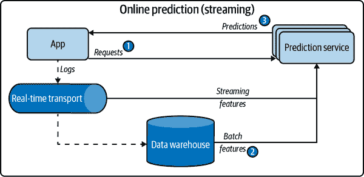

# 第七章：模型部署与预测服务

在第四章 训练数据 到第六章 模型开发和离线评估 中，我们已经讨论了开发机器学习模型的考虑因素，从创建训练数据、提取特征、开发模型到设计评估该模型的指标。这些考虑因素构成了模型的逻辑——从原始数据到机器学习模型的操作指南，如 图 7-1 所示。开发这种逻辑需要机器学习知识和专业知识。在许多公司中，这是由机器学习或数据科学团队完成的流程的一部分。


###### 图 7-1 不同方面构成的机器学习模型逻辑

在本章中，我们将讨论迭代过程中的另一部分：部署你的模型。“部署”是一个泛指，通常意味着使你的模型运行并可访问。在模型开发过程中，你的模型通常运行在开发环境中。¹ 要部署，你的模型将不得不离开开发环境。你的模型可以部署到一个用于测试的暂存环境，或者部署到一个用于最终用户使用的生产环境。在本章中，我们专注于将模型部署到生产环境中。

在我们继续之前，我想强调一点，生产是一个连续的过程。对于一些团队，生产意味着在笔记本中生成漂亮的图表供业务团队查看。对于其他团队，生产意味着保持模型每天为数百万用户运行。如果你的工作属于第一种情况，你的生产环境类似于开发环境，那么这一章对你来说不太相关。如果你的工作更接近第二种情况，请继续阅读。

我曾在互联网上的某处读到过：如果你忽略所有困难的部分，部署就是简单的。如果你想为朋友们部署一个模型以供玩耍，你只需将你的预测函数包装在一个 POST 请求的端点中，使用 Flask 或 FastAPI，将这个预测函数需要运行的依赖项放入容器中，² 然后将你的模型及其相关容器推送到像 AWS 或 GCP 这样的云服务以公开端点：

```
# Example of how to use FastAPI to turn your predict function 
# into a POST endpoint
@app.route('/predict', methods=['POST'])
def predict():
    X = request.get_json()['X']
    y = MODEL.predict(X).tolist()
    return json.dumps({'y': y}), 200
```

你可以使用此公开的端点供下游应用程序使用：例如，当应用程序接收到用户的预测请求时，该请求将被发送到公开的端点，该端点返回一个预测结果。如果你熟悉必要的工具，你可以在一个小时内完成功能部署。即使我的学生们在一个为期 10 周的课程后，虽然很少有部署经验，但都能够将机器学习应用程序部署为他们的最终项目。³

艰难的部分包括使您的模型对数百万用户可用，延迟为毫秒，正常运行时间为 99%，设置基础设施以便在出现问题时立即通知合适的人员，找出问题所在，并无缝地部署更新以修复问题。

在许多公司中，部署模型的责任落在开发这些模型的同一组人手中。在许多其他公司中，一旦模型准备部署，它将被导出并移交给另一个团队来部署。然而，这种责任的分离可能导致团队之间的沟通成本高昂，并使得更新模型变得缓慢。它也可能导致在出现问题时难以进行调试。我们将在第十一章中更多讨论团队结构。

###### 注：

导出模型意味着将此模型转换为另一个应用程序可以使用的格式。有些人称此过程为“序列化”。⁴ 模型的两个部分可以导出：模型定义和模型的参数值。模型定义定义了您的模型的结构，例如它有多少隐藏层和每层多少单元。参数值提供这些单元和层的值。通常这两个部分一起导出。

在 TensorFlow 2 中，您可能会使用 `tf.keras.Model.save()` 将您的模型导出到 TensorFlow 的 SavedModel 格式。在 PyTorch 中，您可能会使用 `torch.onnx.export()` 将您的模型导出到 ONNX 格式。

无论你的工作是否涉及部署 ML 模型，了解你的模型如何使用可以帮助你理解它们的限制，并帮助你根据其目的进行调整。

在这一章中，我们将从一些关于 ML 部署的常见误解开始，这些误解通常来自于那些没有部署过 ML 模型的人。然后我们将讨论模型向用户生成和提供预测的两种主要方式：在线预测和批处理预测。生成预测的过程称为*推理*。

我们将继续讨论生成预测的计算应该在哪里进行：设备上（也称为边缘）和云上。模型如何提供和计算预测会影响其设计方式、所需的基础设施和用户遇到的行为。

如果你来自学术背景，本章讨论的一些话题可能超出你的舒适区。如果出现不熟悉的术语，请花点时间查找它。如果某一部分变得过于密集，请随意跳过。本章是模块化的，因此跳过一部分不应影响你对另一部分的理解。

# 机器学习部署的误解

如同在 第一章 中讨论的那样，部署机器学习模型与部署传统软件程序有很大不同。这种差异可能会导致从未部署过模型的人们要么害怕这个过程，要么低估了所需的时间和精力。在本节中，我们将揭示一些关于部署过程的常见误解，希望能让您在开始这一过程时保持良好的心态。本节对那些没有或几乎没有部署经验的人最有帮助。

## 误解 1：一次只部署一两个机器学习模型

在做学术项目时，我被建议选择一个小问题进行专注，通常这会导致一个单一的模型。我与来自学术背景的许多人交流后发现，他们也倾向于在生产机器学习模型时考虑单一模型。因此，他们设想的基础设施不适用于实际应用，因为它只能支持一两个模型。

实际上，公司拥有许多许多机器学习模型。一个应用可能有许多不同的特性，每个特性可能需要自己的模型。以 Uber 这样的顺风车应用为例。它需要预测以下各种因素的模型：乘车需求、司机可用性、预计到达时间、动态定价、欺诈交易、客户流失等等。此外，如果该应用在 20 个国家运营，直到可以有跨不同用户配置文件、文化和语言泛化的模型，每个国家都需要自己的模型。因此，对于 20 个国家，每个国家需要 10 个模型，您已经有了 200 个模型。图 7-2 展示了 Netflix 上利用机器学习的广泛任务范围。


###### 图 7-2. Netflix 上利用机器学习的不同任务。来源：Ville Tuulos⁵

实际上，Uber 正在生产中使用数千个模型。⁶ 在任何时刻，Google 都在并行训练数千个模型，每个模型的参数规模达到数百亿。⁷ Booking.com 拥有 150 多个模型。⁸ 2021 年 Algorithmia 的一项研究显示，在拥有超过 25,000 名员工的组织中，41%的组织在生产中使用超过 100 个模型。⁹

## 误解 2：如果我们什么都不做，模型的性能将保持不变

软件不像美酒一样随着时间的推移变老越来越好，它老化的速度比较快。即使看起来没有变化，软件程序随时间逐渐退化的现象被称为“软件腐化”或“位腐化”。

机器学习系统对此并不免疫。除此之外，机器学习系统还会遭受所谓的数据分布漂移的影响，即模型在生产环境中遇到的数据分布与其训练时的数据分布不同。¹⁰ 因此，机器学习模型倾向于在训练后表现最佳，并随时间而逐渐退化。

## 谬误 3：你不需要频繁更新你的模型

人们经常问我：“我应该多频繁地 *更新* 我的模型？”这是一个错误的问题。正确的问题应该是：“我可以多频繁地 *更新* 我的模型？”

由于模型的性能会随时间衰减，我们希望尽可能快地对其进行更新。这是一个我们应该从现有的 DevOps 最佳实践中学习的 ML 领域。早在 2015 年，人们就已经在不断地推送系统更新。Etsy 每天部署 50 次，Netflix 每天数千次，AWS 每 11.7 秒一次。¹¹

虽然很多公司仍然只每月或甚至每季度更新他们的模型，微博更新一些 ML 模型的迭代周期为 10 分钟。¹² 我听说阿里巴巴和抖音（TikTok 的公司）也有类似的情况。

正如 Josh Wills 所说，他曾在 Google 担任过高级工程师，现在是 Slack 的数据工程主管，“我们总是尽可能快地将新模型投入生产。”¹³

我们将在 第九章 中详细讨论模型重新训练的频率。

## 谬误 4：大多数 ML 工程师不需要担心规模问题

“规模” 的含义因应用而异，但例如一个每秒服务数百个查询或每月服务数百万用户的系统。

如果是这样的话，你可能会争辩说只有少数公司需要担心这个问题。Google 只有一个，Facebook 只有一个，Amazon 也只有一个。这是事实，但是少数大公司雇佣了大多数软件工程师。根据 2019 年 Stack Overflow 开发者调查，超过一半的受访者在至少有 100 名员工的公司工作（见 图 7-3）。这并不是完全相关，但是一个有 100 名员工的公司有很大的机会为一定数量的用户提供服务。


###### 图 7-3\. 软件工程师工作所在公司规模的分布。来源：根据 Stack Overflow 的一张图修改¹⁴

我没有找到关于专门 ML 角色的调查，所以我在 [Twitter](https://oreil.ly/e1fjn) 上提问并得到了类似的结果。这意味着如果你在行业中寻找与 ML 相关的工作，你很可能会在至少有 100 名员工的公司工作，而这些公司的 ML 应用可能需要具备可扩展性。统计学上来说，一个 ML 工程师应该关心规模问题。

# 批量预测与在线预测的区别

你将需要做出的一个基础决策，这将影响最终用户以及在系统上工作的开发人员，那就是系统如何生成和向最终用户提供预测：在线还是批处理。由于行业中缺乏标准化的实践，围绕批处理和在线预测的术语仍然相当混乱。在本节中，我将尽力解释每个术语的细微差别。如果你觉得这里提到的任何术语太令人困惑，请随意暂时忽略它们。如果你忘记了其他一切，我希望你能记住三种主要的预测模式：

+   只使用批处理特征的批处理预测。

+   只使用批处理特征（例如预计算的嵌入）的在线预测。

+   使用批处理特征和流处理特征的在线预测。这也被称为流式预测。

*在线预测* 是指在请求到达时生成预测并立即返回的过程。例如，你输入一个英文句子到谷歌翻译中，立即获得其法语翻译。在线预测也被称为 *按需预测*。传统上，在进行在线预测时，请求通过 RESTful API（例如 HTTP 请求—参见“数据通过服务传递”）发送到预测服务。当通过 HTTP 请求发送预测请求时，在线预测也被称为 *同步预测*：预测与请求同步生成。

*批处理预测* 是指定期生成预测或在触发时生成预测。预测存储在某处，例如 SQL 表或内存数据库，并根据需要检索。例如，Netflix 可能每四小时为其所有用户生成电影推荐，预先计算的推荐在用户登录 Netflix 时获取并显示。批处理预测也被称为 *异步预测*：预测与请求异步生成。

# 术语混淆

术语“在线预测”和“批处理预测”可能会令人困惑。两者都可以批量预测多个样本或单个样本。为了避免混淆，有时人们更喜欢使用术语“同步预测”和“异步预测”。然而，这种区分也并非完美，因为当在线预测利用实时传输将预测请求发送到您的模型时，请求和预测在技术上是异步的。

图 7-4 显示了用于批处理预测的简化架构，而 图 7-5 则展示了仅使用批处理特征的在线预测的简化版本。接下来我们将详细介绍仅使用批处理特征的含义。


###### 图 7-4。用于批处理预测的简化架构


###### 图 7-5\. 一个仅使用批量特征的在线预测简化架构

如 Chapter 3 中所讨论的，从历史数据（如数据库和数据仓库中的数据）计算得出的特征是 *批量特征*。而从流式数据（实时传输的数据）计算得出的特征是 *流式特征*。在批量预测中，只使用批量特征。然而，在线预测中，可以同时使用批量特征和流式特征。例如，在用户在 DoorDash 上下订单后，可能需要以下特征来估计送达时间：

批量特征

这家餐厅过去的平均准备时间

流式特征

在过去的 10 分钟内，他们还有多少其他订单，以及有多少送餐人员可用

# 流式特征与在线特征

我听说过“流式特征”和“在线特征”这两个术语被互换使用。它们实际上是不同的。在线特征更为一般化，因为它们指的是任何用于在线预测的特征，包括存储在内存中的批量特征。

在线预测中用于批量特征的一种非常常见的批量特征类型，特别是基于会话的推荐系统，是项目嵌入。项目嵌入通常是批量预先计算的，并在在线预测需要时获取。在这种情况下，嵌入可以视为在线特征，但不是流式特征。

流式特征专指从流式数据计算得出的特征。

一个使用流式特征和批量特征的在线预测简化架构如图 Figure 7-6 所示。有些公司将这种预测称为“流式预测”，以区分不使用流式特征的在线预测。



###### 图 7-6\. 一个同时使用批量特征和流式特征的在线预测简化架构

然而，在线预测和批量预测并不必然是互斥的。一种混合解决方案是为热门查询预先计算预测结果，然后为不那么热门的查询在线生成预测结果。Table 7-1 总结了在线预测和批量预测需要考虑的关键点。

表 7-1\. 批量预测与在线预测之间的一些关键区别

|  | 批量预测（异步） | 在线预测（同步） |
| --- | --- | --- |
| 频率 | 周期性，例如每四小时 | 随请求即时到达 |
| 适用于 | 处理累积数据时不需要即时结果（如推荐系统） | 在生成数据样本后需要立即预测时（如欺诈检测） |
| 优化目标 | 高吞吐量 | 低延迟 |

在许多应用中，在线预测和批处理预测并用于不同的用例。例如，像 DoorDash 和 UberEats 这样的食品订购应用使用批处理预测来生成餐厅推荐——在线生成这些推荐可能需要太长时间，因为有很多餐馆。但是，一旦你点击一个餐馆，使用在线预测生成食品项目推荐。

许多人认为在线预测比批处理预测在成本和性能上效率低，因为你可能无法将输入批量处理，并利用向量化或其他优化技术。如我们在“批处理与流处理”部分已讨论的那样，并非一定如此。

此外，使用在线预测，你不必为不访问你网站的用户生成预测。想象一下，你运行一个应用，只有 2%的用户每天登录——例如，2020 年，Grubhub 拥有 3100 万用户和 622,000 个日常订单。¹⁵ 如果你每天为每个用户生成预测，那么用于生成 98%预测的计算资源将被浪费。

## 从批处理预测到在线预测

对于从学术背景转向机器学习的人来说，提供预测的更自然方式可能是在线预测。当你给模型输入并收到输入时，它会立即生成一个预测。这可能是大多数人在原型开发时与其模型交互的方式。对于大多数公司在首次部署模型时来说，这也可能更容易。你导出你的模型，将导出的模型上传到亚马逊 SageMaker 或 Google App Engine，并获得一个公开的端点。¹⁶ 现在，如果你发送一个包含输入的请求到该端点，它将返回在该输入上生成的预测。

在线预测的一个问题是你的模型可能花费太长时间来生成预测。如果不是在收到请求时立即生成预测，那么你可以提前计算预测并将其存储在数据库中，并在请求到达时获取它们。这正是批处理预测所做的。采用这种方法，你可以一次为多个输入生成预测，利用分布式技术高效处理大量样本。

因为预测是预先计算的，你不必担心模型生成预测需要多长时间。因此，批处理预测也可以被视为减少更复杂模型推断延迟的技巧——检索预测的时间通常比生成预测的时间短。

当你想要生成大量预测并且不需要立即得到结果时，批量预测是很好的选择。你不必使用所有生成的预测结果。例如，你可以预测所有客户购买新产品的可能性，并与排名前 10%的客户联系。

然而，批量预测的问题在于它使得你的模型对用户变化的偏好反应变慢。即使在像 Netflix 这样更先进的技术公司，这种限制也是显而易见的。比如最近你一直在看恐怖电影，所以当你第一次登录 Netflix 时，恐怖电影占据了推荐列表。但今天你感觉很开心，于是搜索了“喜剧”并开始浏览喜剧类别。Netflix 应该学习并在推荐列表中展示更多的喜剧电影，对吧？截至撰写本书时，它不能在下一批推荐生成之前更新列表，但我毫无疑问这种限制将在不久的将来得到解决。

批量预测的另一个问题是需要预先知道为哪些请求生成预测。例如，对于用户推荐电影的情况，你预先知道需要为多少用户生成推荐。然而，对于有不可预测查询的情况——比如一个系统用于英语到法语的翻译，可能无法预测到每一个可能的英文文本——你需要使用在线预测来根据请求生成预测。

在 Netflix 的例子中，批量预测会导致轻微的不便（这与用户参与度和保留率密切相关），而非灾难性的失败。有许多应用场景，批量预测可能导致灾难性的失败或者根本无法使用。在线预测至关重要的例子包括高频交易、自动驾驶车辆、语音助手、使用面部或指纹解锁手机、老年护理的跌倒检测以及欺诈检测。能够检测到三小时前发生的欺诈交易总比完全不检测要好，但能够实时检测可以阻止欺诈交易的进行。

批量预测是在线预测不够便宜或速度不够快时的一种变通方案。如果可以以同样的成本和速度生成每个预测，为什么要提前生成一百万个预测并担心存储和检索呢？

随着硬件变得更加定制化和强大，并且正在开发更好的技术以允许更快、更便宜的在线预测，在线预测可能会成为默认选择。

近年来，公司已经投入大量资金从批量预测转向在线预测。为了克服在线预测的延迟挑战，需要两个组成部分：

+   一个（几乎）实时的管道，可以处理传入数据，提取流特征（如果需要），将其输入到模型中，并在几乎实时返回预测结果。具备实时传输和流计算引擎的流水线可以帮助实现这一目标。

+   模型能够以对其最终用户可接受的速度生成预测。对于大多数消费者应用程序来说，这意味着毫秒级的响应时间。

我们在第三章中讨论了流处理。在接下来的部分，我们将继续讨论如何统一流水线和批处理管道。然后，我们将讨论如何在“模型优化”部分加快推断的速度。

## 统一批处理管道和流处理管道

批量预测在很大程度上是传统系统的产物。在过去的十年中，大数据处理主要由像 MapReduce 和 Spark 这样的批处理系统主导，这些系统能够高效地周期性处理大量数据。当公司开始使用 ML 时，他们利用现有的批处理系统进行预测。当这些公司希望在在线预测中使用流处理特性时，他们需要构建一个单独的流水线。让我们通过一个示例来具体说明这一点。

假设你想要构建一个类似 Google Maps 的应用程序，用于预测到达时间。预测将随着用户行程的进行而持续更新。你可能想使用的一个特征是在你路径中所有车辆的平均速度（过去五分钟内）。在训练时，你可能会使用过去一个月的数据。要从训练数据中提取此特征，你可能希望将所有数据放入数据框架中，以同时为多个训练样本计算此特征。在推断过程中，此特征将持续在滑动窗口上计算。这意味着在训练时，此特征是批处理计算的，而在推断时，此特征是流处理的。

在 ML 生产中，拥有两种不同的数据处理管道是常见的 bug 引发原因之一。一个导致 bug 的原因是，当一个管道中的更改没有正确复制到另一个管道时，就会导致两个管道提取两组不同的特征。特别是如果这两个管道由两个不同的团队维护，例如，机器学习团队维护批处理管道进行训练，而部署团队维护流水线进行推断，如图 7-7 所示。


###### 图 7-7。在 ML 生产中，为训练和推断各维护两个不同的管道是常见的 bug 源。

图 7-8 展示了用于在线预测的 ML 系统数据管道的更详细但也更复杂的特性。标有“研究”标签的框选元素通常在学术环境中向人们展示。


###### 图 7-8\. 用于进行在线预测的 ML 系统数据管道

在 ML 社区中，建立统一流处理和批处理基础设施近年来成为一个热门话题。包括 Uber 和微博在内的公司通过使用像 Apache Flink 这样的流处理器，进行了主要的基础设施改造，以统一其批处理和流处理管道。^(参考 18：ch07.xhtml#ch01fn215)一些公司使用特征存储库来确保训练期间使用的批处理特征与预测中使用的流特征的一致性。我们将在第十章中讨论特征存储库。

# 模型压缩

我们已经讨论了流水线，允许 ML 系统从传入数据中提取流特征，并将其输入到 ML 模型中以（几乎）实时进行处理。然而，仅具有接近（实时）的流水线对于在线预测来说还不足够。在接下来的部分中，我们将讨论 ML 模型的快速推理技术。

如果您要部署的模型生成预测时间过长，有三种主要方法可以减少推理延迟：使其进行更快的推理、使模型更小，或者使其部署的硬件运行更快。

缩小模型的过程称为模型压缩，使其进行更快推理的过程称为推理优化。最初，模型压缩是为了使模型适应边缘设备。然而，缩小模型通常也会使其运行更快。

我们将在“模型优化”一节中讨论推理优化，而在“云端和边缘上的 ML”一节中讨论专门用于加速 ML 模型运行的硬件后端的情况。在这里，我们将讨论模型压缩。

模型压缩的研究论文数量正在增加。现成的实用工具正在蓬勃发展。截至 2022 年 4 月，Awesome Open Source 列出了[“前 168 名模型压缩开源项目”](https://oreil.ly/CYm82)，并且该列表还在增加。尽管有许多新技术正在开发中，但您可能经常遇到的四种技术类型包括低秩优化、知识蒸馏、修剪和量化。有兴趣进行全面审查的读者可能希望查看程等人更新于 2020 年的“深度神经网络模型压缩与加速综述”。^(参考 19：ch07.xhtml#ch01fn216)

## 低秩分解

*低秩分解*的关键思想是用低维张量替换高维张量。^(参考 20：ch07.xhtml#ch01fn217)一种低秩分解类型是*紧凑卷积滤波器*，其中过参数化（具有过多参数）的卷积滤波器被紧凑块替换，以减少参数数量并增加速度。

例如，通过使用包括将 3 × 3 卷积替换为 1 × 1 卷积在内的多种策略，SqueezeNets 在 ImageNet 上以比标准模型少 50 倍的参数达到了 AlexNet 级别的准确性。²¹

同样，MobileNets 将尺寸为 *K* × *K* × *C* 的标准卷积分解为深度卷积 (*K* × *K* × 1) 和逐点卷积 (1 × 1 × *C*)，其中 *K* 是核大小，*C* 是通道数。这意味着每个新卷积仅使用 *K*² + *C* 而不是 *K*²*C* 个参数。如果 *K* = 3，这意味着参数数量减少了八到九倍（参见 图 7-9）。²²


###### 图 7-9\. MobileNets 中的紧凑卷积滤波器。标准卷积滤波器在 (a) 中被深度卷积替代，而在 (b) 和 (c) 中被逐点卷积替代，以构建深度可分离滤波器。来源：根据 Howard 等人的图像调整。

此方法已用于开发与标准模型相比具有显著加速的更小模型。然而，它倾向于特定类型的模型（例如，紧凑的卷积滤波器特定于卷积神经网络），并且需要大量的架构知识来设计，因此尚未广泛适用于许多用例。

## 知识蒸馏

*知识蒸馏* 是一种方法，其中一个小模型（学生）被训练成模仿一个较大模型或模型集合（教师）。较小的模型是您将部署的模型。尽管学生通常在预训练的教师之后进行训练，但两者也可以同时进行训练。²³ 在生产中使用的一个例子是 DistilBERT，它将 BERT 模型的大小减少了 40%，同时保留了 97% 的语言理解能力，并且速度提升了 60%。²⁴

这种方法的优点在于，它可以在教师网络和学生网络之间的架构差异不大时工作。例如，您可以将随机森林作为学生，将变压器作为教师。这种方法的缺点在于，它高度依赖于教师网络的可用性。如果您使用预训练模型作为教师模型，那么训练学生网络将需要较少的数据，并且可能会更快地完成。然而，如果没有可用的教师，您将需要在训练学生网络之前训练教师网络，并且训练教师网络将需要更多的数据和更长的训练时间。此方法还对应用和模型架构敏感，因此尚未在生产中广泛使用。

## 精简

*修剪* 最初是用于决策树的方法，其中您删除对分类无关和冗余的树部分。²⁵ 随着神经网络的广泛采用，人们开始意识到神经网络存在过度参数化问题，并开始寻找减少额外参数工作量的方法。

在神经网络的上下文中，修剪有两种含义。一种是删除神经网络的整个节点，这意味着改变其架构并减少其参数数量。更常见的含义是找到对预测最无用的参数，并将它们设为 0。在这种情况下，修剪不会减少总参数数量，只会减少非零参数的数量。神经网络的架构保持不变。这有助于减少模型的大小，因为修剪使得神经网络更稀疏，而稀疏结构通常比密集结构需要更少的存储空间。实验证明，修剪技术可以将经过训练的网络的非零参数数量减少超过 90%，从而减少存储需求并提高推断的计算性能，而不会影响总体准确性。²⁶ 在第十一章，我们将讨论修剪如何为模型引入偏差。

尽管人们普遍认为修剪有效，²⁷但关于修剪的实际价值有很多讨论。刘等人认为修剪的主要价值不在于“重要权重”，而在于修剪后的架构本身。²⁸ 在某些情况下，修剪可以作为一种架构搜索范式，修剪后的架构应该从头开始重新训练作为稠密模型。然而，朱等人表明，修剪后的大型稀疏模型表现优于重新训练的密集对应模型。²⁹

## **量化**

*量化* 是最常见和通用的模型压缩方法。它易于操作，并适用于各种任务和架构。

量化通过使用更少的比特来表示模型的参数来减小模型的大小。大多数软件包默认使用 32 位来表示浮点数（单精度浮点数）。如果一个模型有 1 亿个参数，并且每个参数需要 32 位来存储，那么它将占用 400 MB 的内存。如果我们使用 16 位来表示一个数，我们将把内存占用减少一半。使用 16 位来表示浮点数称为半精度。

您可以使用整数完全构建模型，而不是使用浮点数；每个整数仅需 8 位表示。这种方法也被称为“固定点”。在极端情况下，一些人尝试了每个权重的 1 位表示（二进制权重神经网络），例如 BinaryConnect 和 XNOR-Net。³⁰ XNOR-Net 论文的作者创办了 Xnor.ai，一家专注于模型压缩的初创公司。在 2020 年初，该公司以 2 亿美元的价格被苹果收购。³¹

量化不仅减少了内存占用，还提高了计算速度。首先，它允许我们增加批处理大小。其次，低精度加速计算，进一步减少了训练时间和推断延迟。考虑两个数字的加法。如果我们逐位执行加法，每个位需要*x*纳秒，则对于 32 位数字，需要 32*x*纳秒，而对于 16 位数字，只需 16*x*纳秒。

量化也存在一些缺点。减少位数以表示数字意味着您可以表示的数值范围更小。对于超出该范围的值，您必须将其四舍五入并/或按比例缩放以适应该范围。四舍五入会导致舍入误差，而小的舍入误差可能导致性能大幅变化。您还面临将数字舍入/缩放至下溢/溢出并将其渲染为 0 的风险。有效的舍入和缩放在低级别实现起来并不容易，但幸运的是，主要框架已经内置了这一功能。

量化可以在训练期间进行（量化感知训练），³² 在此期间，模型以较低精度进行训练，或者在训练后进行（后量化），在此期间，模型以单精度浮点数进行训练，然后量化以进行推断。在训练期间使用量化意味着每个参数可以使用更少的内存，这使您可以在相同的硬件上训练更大的模型。

近年来，低精度训练变得越来越流行，得到了大多数现代训练硬件的支持。英伟达推出了 Tensor Cores，这是支持混合精度训练的处理单元。³³ 谷歌的 TPU（张量处理单元）也支持使用 Bfloat16（16 位脑浮点格式）进行训练，谷歌将其称为“Cloud TPU 性能的秘密”。³⁴ 固定点训练虽然尚未流行，但已经取得了许多有希望的成果。³⁵

固定点推断已经成为行业标准。一些边缘设备仅支持固定点推断。最流行的在设备上进行机器学习推断的框架，如谷歌的 TensorFlow Lite、Facebook 的 PyTorch Mobile、英伟达的 TensorRT，提供了带有几行代码的后训练量化功能。

# 云端和边缘上的机器学习

您还需要考虑的另一个决策是模型计算发生的位置：在云端还是在边缘。在云端意味着大部分计算在云上进行，可以是公共云或私有云。在边缘意味着大部分计算在消费者设备上，如浏览器、手机、笔记本电脑、智能手表、汽车、安全摄像头、机器人、嵌入式设备、FPGA（现场可编程门阵列）和 ASIC（专用集成电路），这些也被称为边缘设备。

最简单的方式是将你的模型打包并通过 AWS 或 GCP 等托管云服务进行部署，这也是许多公司在开始机器学习时的部署方式。云服务在使公司将机器学习模型投入生产方面做出了不可思议的贡献。

但是，云部署有许多缺点。首先是成本。机器学习模型可能需要大量计算资源，而计算资源很昂贵。即使在 2018 年，像 Pinterest、Infor 和 Intuit 这样的大公司每年的云服务账单也已经高达数亿美元。³⁷ 对于中小型企业来说，这个数字可能在 50,000 美元到 2,000,000 美元之间。³⁸ 在处理云服务时出现的错误可能导致初创公司破产。³⁹

随着云服务账单的上升，越来越多的公司正在寻找将计算推向边缘设备的方法。在边缘设备上进行的计算量越多，云端所需的计算量就越少，公司需要支付的服务器费用也就越少。

除了帮助控制成本之外，边缘计算还具有许多吸引人的特性。首先，它允许您的应用程序在云计算无法运行的地方运行。当您的模型部署在公共云上时，它们依赖于稳定的互联网连接来发送数据到云端和返回。边缘计算允许您的模型在没有互联网连接或连接不稳定的情况下工作，例如在农村地区或发展中国家。我曾与几家有严格无互联网政策的公司和组织合作过，这意味着我们想要销售给他们的任何应用程序都不能依赖互联网连接。

其次，当您的模型已经部署在消费者设备上时，您可以较少担心网络延迟问题。需要通过网络传输数据（将数据发送到云端模型进行预测，然后将预测结果发送回用户）可能会使某些用例无法实现。在许多情况下，网络延迟比推理延迟更成为瓶颈。例如，您可能能够将 ResNet-50 的推理延迟从 30 毫秒减少到 20 毫秒，但网络延迟可能会高达几秒，具体取决于您所在的位置和您尝试使用的服务。

在处理敏感用户数据时，将模型放在边缘也很有吸引力。云端的机器学习意味着系统可能必须通过网络发送用户数据，这使得数据容易被截取。云计算还经常意味着将许多用户的数据存储在同一地点，这意味着一次破坏可能会影响到许多人。“根据《安全》杂志的数据，近 80%的公司在过去 18 个月中经历过云数据泄露。”

边缘计算使得遵循像 GDPR 这样的法规更加容易，关于如何传输或存储用户数据。虽然边缘计算可能会减少隐私问题，但并不能完全消除。在某些情况下，边缘计算可能会使攻击者更容易窃取用户数据，例如他们可以直接带走设备。

要将计算转移到边缘，边缘设备必须足够强大，能够处理计算任务，有足够的内存来存储机器学习模型并将其加载到内存中，同时有足够的电池或连接到能源源以合理时间供电。如果你的手机有能力运行全尺寸的 BERT 模型，那么在手机上运行 BERT 将非常快地耗尽它的电池。

由于边缘计算相比云计算具有多种优势，公司们正在竞相开发为不同机器学习用例优化的边缘设备。包括谷歌、苹果和特斯拉在内的大公司都宣布了他们制造自己芯片的计划。与此同时，机器学习硬件初创公司已经筹集了数十亿美元来开发更好的人工智能芯片。据预测，到 2025 年全球活跃的边缘设备数量将超过 300 亿。

随着为硬件运行机器学习模型的新选择日益增多，一个问题浮现：我们如何在任意硬件上高效运行我们的模型？在接下来的部分中，我们将讨论如何编译和优化模型，以在特定硬件后端上运行。在此过程中，我们将介绍在处理边缘模型时可能遇到的重要概念，包括中间表示（IR）和编译器。

## 为边缘设备编译和优化模型

对于使用特定框架（如 TensorFlow 或 PyTorch）构建的模型要在硬件后端上运行，该框架必须得到硬件供应商的支持。例如，尽管 TPU 在 2018 年 2 月公开发布，但直到 2020 年 9 月 PyTorch 才被支持在 TPU 上运行。在此之前，如果想使用 TPU，必须使用 TPU 支持的框架。

为硬件后端提供框架支持耗时且需要大量工程资源。从 ML 工作负载映射到硬件后端需要理解和利用该硬件的设计，不同的硬件后端具有不同的内存布局和计算原语，如图 7-11 所示。


###### 图 7-11\. CPU、GPU 和 TPU 的不同计算原语和内存布局。来源：根据陈等人的图片适配。⁴³

例如，CPU 的计算原语曾经是一个数字（标量），GPU 的计算原语曾经是一维向量，而 TPU 的计算原语是二维向量（张量）。⁴⁴ 使用卷积运算符时，一维向量和二维向量的差异非常大。同样，您需要考虑不同的 L1、L2 和 L3 布局和缓冲区大小以有效地使用它们。

因为这一挑战，框架开发人员倾向于只支持少数几种服务器级硬件，并且硬件供应商倾向于为一小部分框架提供自己的内核库。将 ML 模型部署到新硬件需要大量手动工作。

如果不是为每个新硬件后端创建新的编译器和库，那么我们创建一个中间人来桥接框架和平台会怎样？框架开发人员将不再需要支持每种类型的硬件，他们只需将框架代码转换为这个中间人即可。硬件供应商随后可以支持一个中间人而不是多个框架。

这种“中间人”称为中间表示（IR）。 IRs 是编译器工作的核心。从模型的原始代码开始，编译器在生成本地硬件后端可以运行的代码之前会生成一系列高级和低级 IRs，如图 7-12 所示。


###### 图 7-12\. 从原始模型代码到能在特定硬件后端上运行的机器码之间的一系列高级和低级中间表示（IR）

这个过程也称为*降低*，即将高级框架代码降低为低级硬件本机代码。这不是简单的翻译，因为它们之间没有一对一的映射关系。

高级 IRs 通常是您的 ML 模型的计算图。计算图描述了计算执行顺序的图形。感兴趣的读者可以在[PyTorch](https://oreil.ly/who8P)和[TensorFlow](https://oreil.ly/O8qR9)中了解计算图。

### 模型优化

在将代码“降低”以在所选硬件上运行模型之后，您可能会遇到的问题是性能问题。生成的机器码可能能够在硬件后端上运行，但可能无法高效运行。生成的代码可能没有利用数据局部性和硬件缓存，也可能没有利用矢量或并行操作等高级特性，这可能会加速代码。

典型的 ML 工作流包括许多框架和库。例如，您可能会使用 pandas/dask/ray 从数据中提取特征。您可能会使用 NumPy 进行向量化。您可能会使用像 Hugging Face 的 Transformers 这样的预训练模型生成特征，然后使用使用各种框架（如 sklearn、TensorFlow 或 LightGBM）构建的模型集合进行预测。

即使这些框架中的各个函数可能已经优化，跨框架的优化仍然很少。在这些函数之间进行数据移动以进行计算的天真方式可能会导致整个工作流程的性能下降一个数量级。斯坦福 DAWN 实验室的研究人员发现，使用 NumPy、pandas 和 TensorFlow 的典型 ML 工作负载在单线程中运行比手动优化的代码慢 23 倍。⁴⁵

在许多公司中，通常情况下，数据科学家和机器学习工程师开发的模型在开发阶段看起来运行良好。然而，当这些模型部署后，它们可能会变得太慢，因此公司会雇佣优化工程师来优化其在特定硬件上的模型。Mythic 的优化工程师职位描述如下：

> 这一愿景在 AI 工程团队中得以实现，我们利用专业知识开发适用于我们硬件的 AI 算法和模型，并为 Mythic 的硬件和编译器团队提供指导。
> 
> AI 工程团队通过以下方式显著影响 Mythic：
> 
> +   开发量化和鲁棒性 AI 重新训练工具
> +   
> +   探索利用神经网络适应性的编译器的新特性
> +   
> +   开发针对我们硬件产品优化的新神经网络
> +   
> +   与内部和外部客户交流，以满足其开发需求

优化工程师难以找到且雇佣成本高昂，因为他们需要在机器学习和硬件架构两方面具备专业知识。优化编译器（同时优化您的代码的编译器）是另一种解决方案，因为它们可以自动化模型优化的过程。在将 ML 模型代码降低到机器码的过程中，编译器可以查看您的 ML 模型的计算图及其包含的运算符——卷积、循环、交叉熵——并找到加速计算的方法。

优化机器学习模型有两种方法：局部和全局。局部是指优化模型中的一个或一组操作符。全局是指端到端优化整个计算图。

存在标准的局部优化技术，已知可以加快模型运行速度，大多数是通过并行运行或减少芯片上的内存访问。以下是四种常见的技术：

矢量化

给定一个循环或嵌套循环，不要逐个执行，而是连续内存中执行多个元素，以减少数据 I/O 引起的延迟。

并行化

给定一个输入数组（或*n*维数组），将其分成不同的独立工作块，并在每个块上进行操作。

循环平铺⁴⁶

更改循环中的数据访问顺序，以利用硬件的内存布局和缓存。这种优化依赖于硬件。在 CPU 上良好的访问模式在 GPU 上可能不是良好的访问模式。

操作符融合

将多个操作符融合成一个，以避免冗余的内存访问。例如，对同一个数组进行两次操作需要对该数组进行两次循环。在融合的情况下，只需一个循环。图 7-13 展示了操作符融合的示例。


###### 图 7-13\. 操作符融合示例。来源：改编自 Matthias Boehm 的图片⁴⁷

要获得更大的加速，您需要利用计算图的更高级结构。例如，具有计算图的卷积神经网络可以进行垂直或水平融合，以减少内存访问并加快模型速度，如图 7-14 所示。


###### 图 7-14\. 卷积神经网络计算图的垂直和水平融合。来源：改编自 TensorRT 团队的图片⁴⁸

### 使用机器学习优化机器学习模型

正如前一节中对卷积神经网络进行垂直和水平融合的提示，有许多可能的方式来执行给定的计算图。例如，给定三个操作符 A、B 和 C，可以将 A 与 B 融合，将 B 与 C 融合，或者将 A、B 和 C 全部一起融合。

传统上，框架和硬件供应商会聘请优化工程师，根据其经验制定如何最佳执行模型计算图的启发式方法。例如，NVIDIA 可能有一个工程师或一个专门团队，专注于如何使其 DGX A100 服务器上的 ResNet-50 运行得非常快速⁴⁹。

手工设计的启发式方法有几个缺点。首先，它们不是最优的。工程师提出的启发式方法并没有保证是最佳解决方案。其次，它们不具备自适应性。在新框架或新硬件架构上重复这一过程需要大量的工作量。

模型优化受其计算图中操作符的影响。优化卷积神经网络与优化循环神经网络或优化 Transformer 不同。像 NVIDIA 和 Google 这样的硬件供应商专注于优化像 ResNet-50 和 BERT 这样的流行模型。但如果您作为 ML 研究人员提出了新的模型架构，您可能需要首先优化它，以显示它快速执行，然后才能被采纳和优化。

如果您没有好的启发式方法，一个可能的解决方案是尝试所有可能的执行计算图的方式，记录它们运行所需的时间，然后选择最佳的方式。然而，考虑到可能的路径组合数量，探索所有这些路径将是不可行的。幸运的是，近似解决不可解问题的方案是 ML 擅长的。如果我们利用 ML 来缩小搜索空间，这样就不必探索那么多路径，并预测路径所需的时间，这样我们就不必等待整个计算图执行完毕了。

评估计算图中路径运行所需时间的估计结果很难，因为需要对该图做出很多假设。更容易的方法是专注于图的一个小部分。

如果您在 GPU 上使用 PyTorch，可能已经见过`torch.backends.cudnn.benchmark=True`。当此选项设置为 True 时，*cuDNN autotune* 将启用。cuDNN autotune 在一组预定的选项上搜索以执行卷积运算，并选择最快的方式。尽管 cuDNN autotune 非常有效，但仅适用于卷积运算符。一个更通用的解决方案是[autoTVM](https://oreil.ly/ZNgzH)，它是开源编译器堆栈 TVM 的一部分。autoTVM 处理子图而不仅仅是操作符，因此它处理的搜索空间要复杂得多。autoTVM 的工作原理相当复杂，但简单来说：

1.  它首先将您的计算图分解成子图。

1.  它预测每个子图的大小。

1.  它分配时间来搜索每个子图的最佳路径。

1.  它将每个子图的最佳运行方式串联起来，以执行整个图。

autoTVM 测量运行每条路径所需的实际时间，从而为训练成本模型提供了地面真实数据，以预测未来路径所需的时间。这种方法的优点是，由于模型是使用运行时生成的数据进行训练的，因此可以适应其运行的任何类型的硬件。缺点是，成本模型开始改进需要更多时间。图 7-15 显示了 autoTVM 相对于 cuDNN 在 NVIDIA TITAN X 上为 ResNet-50 模型带来的性能提升。

尽管由机器学习驱动的编译器的结果令人印象深刻，但也有一个限制：它们可能会很慢。您需要遍历所有可能的路径，并找到最优化的路径。这个过程可能需要几个小时，甚至对于复杂的机器学习模型可能需要几天。然而，这是一个一次性的操作，您可以缓存优化搜索的结果，并用于优化现有模型以及为未来的调整会话提供一个起点。一旦为一个硬件后端优化了您的模型，您就可以在同类型的多个设备上运行它。当您的模型准备好投入生产并且目标硬件用于推断时，这种优化非常理想。


###### 图 7-15\. autoTVM 相对于 cuDNN 在 NVIDIA TITAN X 上为 ResNet-50 带来的加速。autoTVM 超越 cuDNN 大约需要 ~70 次试验。来源：Chen 等人⁵⁰

## 浏览器中的机器学习

我们一直在讨论编译器如何帮助我们生成机器本地代码来在特定硬件后端上运行模型。然而，通过在浏览器中运行代码，也可以生成可以在任何硬件后端上运行的代码。如果您可以在浏览器中运行您的模型，那么您可以在支持浏览器的任何设备上运行您的模型：MacBook、Chromebook、iPhone、Android 手机等。您不需要关心这些设备使用的芯片是什么。如果苹果决定从英特尔芯片切换到 ARM 芯片，那就不是您的问题。

谈到浏览器，许多人会想到 JavaScript。有一些工具可以帮助您将模型编译成 JavaScript，例如 [TensorFlow.js](https://oreil.ly/3Afzv)、[Synaptic](https://oreil.ly/SYiLq) 和 [brain.js](https://oreil.ly/83IIa)。然而，JavaScript 速度较慢，并且作为编程语言，在复杂逻辑（如从数据中提取特征）方面的能力有限。

更为有前景的方法是 WebAssembly（WASM）。WASM 是一个开放标准，允许您在浏览器中运行可执行程序。在您用 scikit-learn、PyTorch、TensorFlow 或其他任何框架构建了模型之后，不再需要将模型编译为特定硬件上的运行代码，而是可以将模型编译为 WASM。您将得到一个可执行文件，可以直接在 JavaScript 中使用。

WASM 是我在过去几年看到的最激动人心的技术趋势之一。它具有高性能，易于使用，并且其生态系统像野火般快速增长。⁵¹ 截至 2021 年 9 月，全球 93% 的设备已支持它。⁵²

WASM 的主要缺点是，因为它在浏览器中运行，速度较慢。尽管 WASM 已经比 JavaScript 快得多，但与在设备上原生运行的代码（如 iOS 或 Android 应用程序）相比，它仍然较慢。Jangda 等人的研究显示，编译为 WASM 的应用程序在 Firefox 上比本机应用程序慢平均 45%（在 Chrome 上为 55%）。⁵³

# 摘要

恭喜，您已经完成了本书中可能是最技术性最强的一章！这章技术性很强，因为部署机器学习模型是一项工程挑战，而不是机器学习挑战。

我们讨论了部署模型的不同方式，比较了在线预测与批处理预测，以及边缘机器学习与云端机器学习。每种方式都有其自己的挑战。在线预测使您的模型更能响应用户不断变化的偏好，但您需要担心推理延迟。批处理预测是一种解决方案，用于当您的模型生成预测时间太长时，但它会使您的模型不够灵活。

同样地，在云上进行推理设置很容易，但随着网络延迟和云成本的增加，这种做法变得不切实际。在边缘进行推理需要具有足够计算能力、内存和电池的边缘设备。

然而，我认为这些挑战大多是由 ML 模型运行硬件的限制造成的。随着硬件变得更加强大并优化用于机器学习，我相信 ML 系统将过渡到在设备上进行在线预测，如图 7-16 所示。


###### 图 7-16\. 随着硬件变得更加强大，机器学习模型将迁移到在线和边缘

我曾认为 ML 项目在模型部署后就完成了，但我希望在本章中已经清楚地表明，我严重错误了。将模型从开发环境移到生产环境会产生全新的一系列问题。首先是如何保持模型在生产中的运行。在下一章中，我们将讨论如何监控模型在生产中可能出现的问题，并尽快解决这些问题。

¹ 我们将在第十章详细介绍开发环境。

² 我们将在第九章深入讨论容器。

³ 斯坦福大学的 [CS 329S：机器学习系统设计](https://oreil.ly/A6lFT)，你可以在 [YouTube](https://oreil.ly/q4pjX) 上查看项目演示。

⁴ 请参见“数据格式”部分中关于“数据序列化”的讨论。

⁵ Ville Tuulos，《Netflix 的以人为中心的机器学习基础设施》，InfoQ，2018，视频，49:11，[*https://oreil.ly/j4Hfx*](https://oreil.ly/j4Hfx)。

⁶ Wayne Cunningham，《Uber 科学：在 Uber 推动机器学习》，Uber Engineering Blog，2019 年 9 月 10 日，[*https://oreil.ly/WfaCF*](https://oreil.ly/WfaCF)。

⁷ Daniel Papasian 和 Todd Underwood，《OpML '20——机器学习的问题：一个大型 ML 管道的十年故障回顾》（2020 年），视频，19:06，[*https://oreil.ly/HjQm0*](https://oreil.ly/HjQm0)。

⁸ Lucas Bernardi, Themistoklis Mavridis 和 Pablo Estevez，《Booking.com 的 150 个成功机器学习模型：从 KDD '19 的学习经验》（2019 年 7 月），1743–51，[*https://oreil.ly/Ea1Ke*](https://oreil.ly/Ea1Ke)。

⁹ “2021 年企业机器学习趋势”，Algorithmia，[*https://oreil.ly/9kdcw*](https://oreil.ly/9kdcw)。

¹⁰ 我们将在第八章进一步讨论数据分布的变化。

¹¹ Christopher Null，《10 家在 DevOps 领域表现突出的公司》，TechBeacon，2015，[*https://oreil.ly/JvNwu*](https://oreil.ly/JvNwu)。

¹² Qian Yu，《微博中使用 Flink 进行机器学习》，QCon 2019，视频，17:57，[*https://oreil.ly/RcTMv*](https://oreil.ly/RcTMv)。

¹³ Josh Wills，《机器学习模型的仪器化、可观察性与监控》，InfoQ 2019，[*https://oreil.ly/5Ot5m*](https://oreil.ly/5Ot5m)。

¹⁴ “开发者调查结果”，Stack Overflow，2019，[*https://oreil.ly/guYIq*](https://oreil.ly/guYIq)。

¹⁵ David Curry，《Grubhub 的收入和使用统计数据（2022 年）》，Business of Apps，2022 年 1 月 11 日，[*https://oreil.ly/jX43M*](https://oreil.ly/jX43M)；“2011 至 2020 年全球每天 Grubhub 订单的平均数量”，Statista，[*https://oreil.ly/Tu9fm*](https://oreil.ly/Tu9fm)。

¹⁶ 在这种情况下，服务的入口点 URL 是你的 ML 模型预测服务。

¹⁷ 如果有新用户加入，你可以给他们一些通用的建议。

¹⁸ Shuyi Chean 和 Fabian Hueske，《使用 Apache Flink 在 Uber 实现批处理与流处理的流式 SQL 统一》，InfoQ，[*https://oreil.ly/XoaNu*](https://oreil.ly/XoaNu)；Yu，《微博中使用 Flink 进行机器学习》，QCon 2019，视频，17:57，[*https://oreil.ly/RcTMv*](https://oreil.ly/RcTMv)。

¹⁹ Yu Cheng, Duo Wang, Pan Zhou, and Tao Zhang，“深度神经网络模型压缩和加速综述，”*arXiv*，2020 年 6 月 14 日，[*https://oreil.ly/1eMho*](https://oreil.ly/1eMho)。

²⁰ Max Jaderberg, Andrea Vedaldi, and Andrew Zisserman，“用低秩扩展加速卷积神经网络，”*arXiv*，2014 年 5 月 15 日，[*https://oreil.ly/4Vf4s*](https://oreil.ly/4Vf4s)。

²¹ Forrest N. Iandola, Song Han, Matthew W. Moskewicz, Khalid Ashraf, William J. Dally, and Kurt Keutzer，“SqueezeNet：具有 50 倍参数和<0.5MB 模型尺寸的 AlexNet 级准确性，”*arXiv*，2016 年 11 月 4 日，[*https://oreil.ly/xs3mi*](https://oreil.ly/xs3mi)。

²² Andrew G. Howard, Menglong Zhu, Bo Chen, Dmitry Kalenichenko, Weijun Wang, Tobias Weyand, Marco Andreetto, and Hartwig Adam，“MobileNets：移动视觉应用中高效的卷积神经网络，”*arXiv*，2017 年 4 月 17 日，[*https://oreil.ly/T84fD*](https://oreil.ly/T84fD)。

²³ Geoffrey Hinton, Oriol Vinyals, and Jeff Dean，“在神经网络中提炼知识，”*arXiv*，2015 年 3 月 9 日，[*https://oreil.ly/OJEPW*](https://oreil.ly/OJEPW)。

²⁴ Victor Sanh, Lysandre Debut, Julien Chaumond, and Thomas Wolf，“DistilBERT，BERT 的精炼版本：更小、更快、更便宜和更轻，”*arXiv*，2019 年 10 月 2 日，[*https://oreil.ly/mQWBv*](https://oreil.ly/mQWBv)。

²⁵ 因此得名“修剪”。

²⁶ Jonathan Frankle and Michael Carbin，“彩票假设：找到稀疏、可训练的神经网络，”ICLR 2019，[*https://oreil.ly/ychdl*](https://oreil.ly/ychdl)。

²⁷ Davis Blalock, Jose Javier Gonzalez Ortiz, Jonathan Frankle, and John Guttag，“神经网络修剪的现状是什么？”*arXiv*，2020 年 3 月 6 日，[*https://oreil.ly/VQsC3*](https://oreil.ly/VQsC3)。

²⁸ Zhuang Liu, Mingjie Sun, Tinghui Zhou, Gao Huang, and Trevor Darrell，“重新思考网络修剪的价值，”*arXiv*，2019 年 3 月 5 日，[*https://oreil.ly/mB4IZ*](https://oreil.ly/mB4IZ)。

²⁹ Michael Zhu and Suyog Gupta，“是否修剪：探索模型压缩的有效性，”*arXiv*，2017 年 11 月 13 日，[*https://oreil.ly/KBRjy*](https://oreil.ly/KBRjy)。

³⁰ Matthieu Courbariaux、Yoshua Bengio 和 Jean-Pierre David，《BinaryConnect: 在传播过程中使用二进制权重训练深度神经网络》，*arXiv*，2015 年 11 月 2 日，[*https://oreil.ly/Fwp2G*](https://oreil.ly/Fwp2G)；Mohammad Rastegari、Vicente Ordonez、Joseph Redmon 和 Ali Farhadi，《XNOR-Net: 使用二进制卷积神经网络进行 ImageNet 分类》，*arXiv*，2016 年 8 月 2 日，[*https://oreil.ly/gr3Ay*](https://oreil.ly/gr3Ay)。

³¹ Alan Boyle、Taylor Soper 和 Todd Bishop，《独家报道：苹果收购 Xnor.ai，保罗·艾伦的 AI2 公司分拆的边缘 AI，交易价在 2 亿美元左右》，*GeekWire*，2020 年 1 月 15 日，[*https://oreil.ly/HgaxC*](https://oreil.ly/HgaxC)。

³² 截至 2020 年 10 月，TensorFlow 的量化感知训练实际上并不会训练使用较低比特位的模型权重，而是收集统计信息以用于训练后的量化。

³³ Chip Huyen、Igor Gitman、Oleksii Kuchaiev、Boris Ginsburg、Vitaly Lavrukhin、Jason Li、Vahid Noroozi 和 Ravi Gadde，《混合精度训练用于自然语言处理和语音识别的 OpenSeq2Seq》，*NVIDIA Devblogs*，2018 年 10 月 9 日，[*https://oreil.ly/WDT1l*](https://oreil.ly/WDT1l)。这是我的文章！

³⁴ Shibo Wang 和 Pankaj Kanwar，《BFloat16: 云 TPU 高性能的秘密》，*Google Cloud Blog*，2019 年 8 月 23 日，[*https://oreil.ly/ZG5p0*](https://oreil.ly/ZG5p0)。

³⁵ Itay Hubara、Matthieu Courbariaux、Daniel Soudry、Ran El-Yaniv 和 Yoshua Bengio，《量化神经网络：使用低精度权重和激活函数训练神经网络》，*机器学习研究杂志* 18 (2018): 1–30；Benoit Jacob、Skirmantas Kligys、Bo Chen、Menglong Zhu、Matthew Tang、Andrew Howard、Hartwig Adam 和 Dmitry Kalenichenko，《神经网络的量化和训练：仅使用整数算术推理的高效率》，*arXiv*，2017 年 12 月 15 日，[*https://oreil.ly/sUuMT*](https://oreil.ly/sUuMT)。

³⁶ Quoc Le 和 Kip Kaehler，《我们如何扩展 Bert 以在 CPU 上提供每天 10 亿次以上的请求服务》，Roblox，2020 年 5 月 27 日，[*https://oreil.ly/U01Uj*](https://oreil.ly/U01Uj)。

³⁷ Amir Efrati 和 Kevin McLaughlin，《随着 AWS 使用量飙升，企业对云账单感到惊讶》，*The Information*，2019 年 2 月 25 日，[*https://oreil.ly/H9ans*](https://oreil.ly/H9ans)；Mats Bauer，《Netflix 每月支付亚马逊网络服务多少钱？》，Quora，2020 年，[*https://oreil.ly/HtrBk*](https://oreil.ly/HtrBk)。

³⁸ “2021 年云成本报告”，Anodot，[*https://oreil.ly/5ZIJK*](https://oreil.ly/5ZIJK)。

³⁹ “测试 Firebase 和 Cloud Run 耗资 72K 美元并且几乎破产”，《黑客新闻》，2020 年 12 月 10 日，[*https://oreil.ly/vsHHC*](https://oreil.ly/vsHHC); “如何在 Azure 中用一个点击烧掉最多的钱”，《黑客新闻》，2020 年 3 月 29 日，[*https://oreil.ly/QvCiI*](https://oreil.ly/QvCiI)。我们将在“公共云与私有数据中心”一节中详细讨论公司如何应对高昂的云费用。

⁴⁰ “过去 18 个月中，近 80%的公司经历了云数据泄露”，《安全》，2020 年 6 月 5 日，[*https://oreil.ly/gA1am*](https://oreil.ly/gA1am)。

⁴¹ 查看第 53 页幻灯片，CS 329S《部署 - 预测服务》讲座，2022 年，[*https://oreil.ly/cXTou*](https://oreil.ly/cXTou)。

⁴² “2010 年至 2025 年全球物联网（IoT）和非 IoT 活动设备连接情况”，Statista，[`oreil.ly/BChLN`](https://oreil.ly/BChLN)。

⁴³ Tianqi Chen, Thierry Moreau, Ziheng Jiang, Lianmin Zheng, Eddie Yan, Meghan Cowan, Haichen Shen 等，“TVM：一个自动化的端到端优化深度学习编译器”，*arXiv*，2018 年 2 月 12 日，[*https://oreil.ly/vGnkW*](https://oreil.ly/vGnkW)。

⁴⁴ 如今，许多 CPU 都有向量指令，一些 GPU 有张量核心，这是二维的。

⁴⁵ Shoumik Palkar, James Thomas, Deepak Narayanan, Pratiksha Thaker, Rahul Palamuttam, Parimajan Negi, Anil Shanbhag 等，“评估数据分析应用中端到端优化的效果：以 Weld 为例”，《VLDB Endowment 会议论文集》第 11 卷第 9 期（2018 年）：1002–15，[*https://oreil.ly/ErUIo*](https://oreil.ly/ErUIo)。

⁴⁶ 关于循环分块的有用可视化，请参见 Colfax Research 的演示幻灯片 33，来自他们的《Intel 架构编程与优化：实战工作坊》系列中的第十部分[“访问缓存和内存”](https://oreil.ly/7ipWQ)。整个系列可以在[*https://oreil.ly/hT1g4*](https://oreil.ly/hT1g4)找到。

⁴⁷ Matthias Boehm，“ML 系统架构 04 运算符融合和运行时适应”，格拉茨科技大学，2019 年 4 月 5 日，[*https://oreil.ly/py43J*](https://oreil.ly/py43J)。

⁴⁸ Shashank Prasanna, Prethvi Kashinkunti, 和 Fausto Milletari，“TensorRT 3：更快的 TensorFlow 推理和 Volta 支持”，NVIDIA Developer，2017 年 12 月 4 日，[*https://oreil.ly/d9h98*](https://oreil.ly/d9h98)。CBR 表示“卷积、偏置和 ReLU”。

⁴⁹ 这也是为什么你不应该过分关注基准测试结果，比如[MLPerf 的结果](https://oreil.ly/XrW2C)。在一种类型的硬件上非常快速运行的流行模型，并不意味着任意模型都会在该硬件上非常快速运行。可能只是这个模型被过度优化了。

⁵⁰ Chen 等人，“TVM: 用于深度学习的自动化端到端优化编译器”。

⁵¹ Wasmer，[*https://oreil.ly/dTRxr*](https://oreil.ly/dTRxr)；Awesome Wasm，[*https://oreil.ly/hlIFb*](https://oreil.ly/hlIFb)。

⁵² Can I Use _____?，[*https://oreil.ly/slI05*](https://oreil.ly/slI05)。

⁵³ Abhinav Jangda, Bobby Powers, Emery D. Berger, and Arjun Guha,“不要那么快：分析 WebAssembly 与原生代码的性能”，USENIX，[*https://oreil.ly/uVzrX*](https://oreil.ly/uVzrX)。
