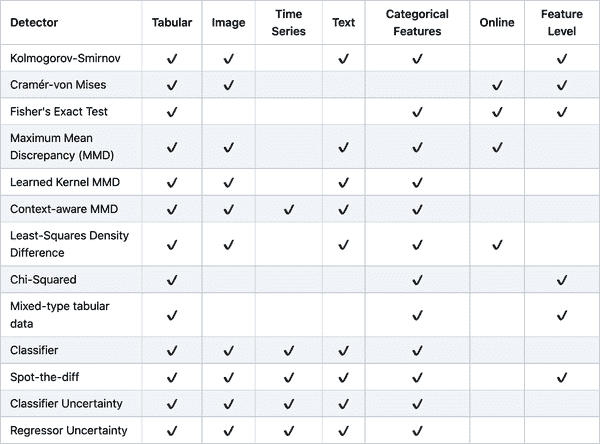
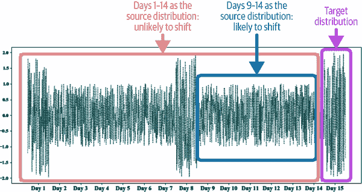
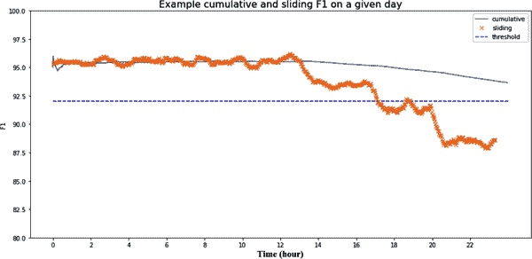
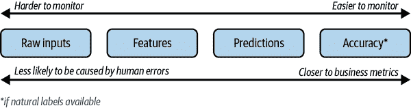
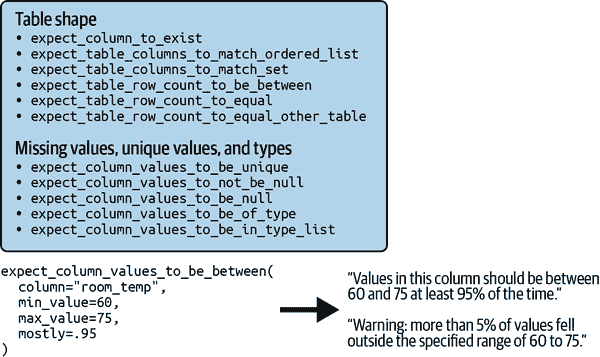
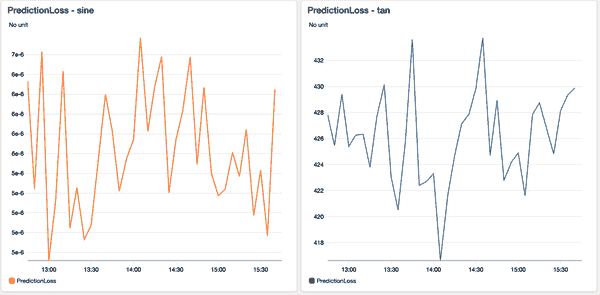

# 第八章：数据分布转移和监控

让我们从一位高管告诉我的一个故事开始，许多读者可能会有共鸣。大约两年前，他的公司聘请了一家咨询公司开发一个 ML 模型，帮助他们预测下周他们需要多少杂货商品，以便他们可以相应地补货。咨询公司花了六个月时间开发这个模型。当咨询公司交付模型时，他的公司部署并且对其表现非常满意。他们最终可以向他们的投资者夸耀他们是一家 AI 驱动的公司。

然而，一年后，他们的数据降低了。一些商品的需求被持续高估，导致额外的商品过期。同时，一些商品的需求一直被低估，导致销售额损失¹。最初，他的库存团队手动更改了模型的预测，以纠正他们注意到的模式，但最终，模型的预测变得如此糟糕，以至于他们无法再使用它。他们有三种选择：支付同一家咨询公司天价来更新模型，支付另一家咨询公司更多的钱，因为这家公司需要时间来适应，或者雇佣内部团队来维护模型。

他的公司通过艰难的经历学到了一条重要的教训，这也是这个行业其他公司正在发现的：部署模型并不是流程的终点。模型在生产环境中的性能会随时间降低。一旦模型被部署，我们仍然需要不断地监控其性能，以便检测问题并部署更新来解决这些问题。

在本章和下一章中，我们将涵盖必要的主题，以帮助您保持模型在生产中。我们将首先介绍在开发阶段表现出色的 ML 模型在生产中失败的原因。然后，我们将深入了解一个特别普遍和棘手的问题，影响几乎所有生产中的 ML 模型：数据分布转移。当生产环境中的数据分布与模型在训练期间暴露的数据分布不同时出现数据分布转变。我们将继续介绍如何监控分布转移。在下一章中，我们将介绍如何不断更新你的生产模型以适应数据分布的变化。

# ML 系统失败的原因

在确定 ML 系统失败的原因之前，让我们简要讨论一下什么是 ML 系统失败。当系统的一个或多个预期被违反时，就会发生失败。在传统软件中，我们主要关心系统的操作预期：系统是否在预期的操作指标范围内执行其逻辑，例如延迟和吞吐量。

对于一个机器学习系统，我们关注其操作指标和 ML 性能指标。例如，考虑一个英法机器翻译系统。其操作预期可能是，在给定的英文句子后，系统在一秒内返回一个法语翻译。其 ML 性能预期是，返回的翻译在 99%的情况下准确翻译原始的英文句子。

如果你输入一句英文句子到系统中，却没有得到翻译，第一个预期被违反，这就是系统故障。

如果你得到的翻译不正确，并不一定是系统故障，因为准确性预期允许一定的误差。但是，如果你不断输入不同的英文句子到系统中，却一直得到错误的翻译，那么第二个预期被违反，这就成为了系统故障。

操作预期违规较易检测，通常会伴随操作故障，如超时、网页的 404 错误、内存溢出或段错误。然而，机器学习性能预期的违规检测则较难，因为这需要在生产环境中测量和监控机器学习模型的性能。在先前的英法机器翻译系统示例中，如果我们不知道正确的翻译结果，要检测返回翻译是否正确 99%的难度很大。有很多例子表明，谷歌翻译的严重错误翻译被用户使用，是因为用户不知道这些是错误的翻译。因此，我们说机器学习系统经常会默默地失败。

要有效地检测和修复生产中的机器学习系统故障，了解为何一个在开发过程中表现良好的模型在生产环境中会失败是很有用的。我们将分析两种类型的故障：软件系统故障和 ML 特定故障。

## 软件系统故障

软件系统故障是非机器学习系统可能发生的故障。以下是一些软件系统故障的示例：

依赖项故障

你的系统依赖的软件包或代码库出现问题，导致你的系统崩溃。当依赖项由第三方维护时，这种故障模式很常见，特别是如果维护该依赖项的第三方不再存在。²

部署失败

由于部署错误引起的故障，比如你意外地部署了旧版本的模型二进制文件，而不是当前版本，或者你的系统没有正确的权限来读取或写入某些文件。

硬件故障

当你用来部署模型的硬件，如 CPU 或 GPU，表现不如预期时，比如你使用的 CPU 可能会过热并且出现故障。³

停机或崩溃

如果系统的某个组件在某个服务器上运行，例如 AWS 或托管服务，而该服务器宕机，您的系统也将宕机。

有些失败并非特定于机器学习，这并不意味着对机器学习工程师来说它们不重要。在 2020 年，谷歌的两位机器学习工程师 Daniel Papasian 和 Todd Underwood 分析了 96 个谷歌大型机器学习管道出现故障的案例。他们回顾了过去 15 年的数据，以确定造成这些故障的原因，发现其中 60 个故障并非直接与机器学习相关。⁴ 大多数问题与分布式系统有关，例如工作流调度器或编排器出错，或者与数据管道有关，例如多个来源的数据连接错误或使用了错误的数据结构。

处理软件系统故障不需要机器学习技能，而是传统的软件工程技能，并且处理它们超出了本书的范围。由于传统软件工程技能在部署机器学习系统中的重要性，机器学习工程大多是工程，而不是机器学习。⁵ 对于有兴趣从软件工程角度学习如何使机器学习系统可靠的读者，我强烈推荐由 Todd Underwood 等人撰写的书籍 [*可靠的机器学习*](https://oreil.ly/5UOds)，由 O'Reilly 出版。

软件系统故障普遍的原因是，由于工业中对机器学习的采用仍处于起步阶段，围绕机器学习生产的工具和最佳实践尚不完善或未标准化。然而，随着机器学习生产工具和最佳实践的成熟，有理由相信软件系统故障的比例将减少，而机器学习特定故障的比例将增加。

## 机器学习特定的故障

机器学习特定的故障是指仅限于机器学习系统的故障。例如包括数据收集和处理问题，超参数不佳，训练管道中的更改未能正确复制到推断管道中，反之亦然，导致模型性能随时间下降的数据分布变化，边缘情况以及退化反馈循环等。

本章中，我们将重点讨论处理特定于机器学习的故障。尽管这些故障占比很小，但它们可能比非机器学习故障更危险，因为它们很难检测和修复，并且可能导致机器学习系统根本无法使用。在第四章中，我们详细讨论了数据问题，第六章讨论了超参数调整，以及第七章讨论了训练和推断使用两个独立管道的危险。在本章中，我们将讨论模型部署后出现的三个新但非常常见的问题：生产数据与训练数据不同，边缘案例和退化反馈循环。

### 生产数据与训练数据不同

当我们说一个机器学习模型从训练数据中学习时，意味着模型学习训练数据的基础分布，目标是利用这种学习到的分布为未见过的数据生成准确的预测——也就是在训练过程中没有见过的数据。我们将在“数据分布变化”章节中数学上详细说明这意味着什么。当模型能够为未见数据生成准确的预测时，我们称这个模型“对未见数据泛化良好”⁶。我们用来评估模型在开发过程中的测试数据，应该代表未见过的数据，而模型在测试数据上的表现应该给我们一个模型泛化能力的概念。

我在机器学习课程中学到的第一件事就是训练数据和未见数据来自相似的分布是至关重要的。假设未见数据来自与训练数据分布“稳态”的相同分布。如果未见数据来自不同的分布，那么模型可能无法很好地泛化。⁷

这种假设在大多数情况下都是不正确的，原因有两个。首先，真实世界数据的基础分布不太可能与训练数据的基础分布*相同*。精心策划一个能够准确代表模型在生产中遇到的数据的训练数据集，结果证明非常困难。⁸ 真实世界的数据是多面的，在许多情况下几乎是无限的，而训练数据是有限的，并且受到创建和处理数据集期间可用的时间、计算和人力资源的限制。存在许多不同的选择和抽样偏差，正如第四章中讨论的那样，这些偏差可能发生并使真实世界数据与训练数据偏离。这种偏差可能仅仅是真实世界数据使用了一种不同的表情符号编码类型。这种类型的偏差导致了一种常见的失败模式，即*训练-服务偏差*：一个在开发中表现良好但在部署时表现不佳的模型。

其次，现实世界并非*静止*不变的。事物变化，数据分布变化。2019 年，人们搜索武汉时，可能想获取旅行信息，但自从 COVID-19 以来，当人们搜索武汉时，他们可能想了解 COVID-19 起源的地方。另一种常见的失败模式是，一个模型在首次部署时表现良好，但随着时间推移，随着数据分布的变化，其性能会下降。这种失败模式需要在模型继续投入使用期间进行持续监测和检测。

当我以 COVID-19 作为导致数据转移的例子时，一些人有这样的印象，即数据转移只发生在不寻常的事件中，这意味着它们并不经常发生。数据转移随时随地发生，突然、逐渐或季节性地。它们可能会突然发生，因为特定事件，例如你的现有竞争对手改变了他们的定价策略，你必须对价格预测进行更新，或者当你在新区域推出产品时，或者当一位名人提到你的产品时，引起新用户的激增，等等。它们可能会逐渐发生，因为社会规范、文化、语言、趋势、行业等随时间的推移而变化。它们也可能由于季节变化而发生，例如在冬季寒冷多雪时，人们更有可能要求共乘服务，而在春季则不太可能。

由于机器学习系统的复杂性及其在部署过程中的糟糕实践，监控仪表板上可能看起来像是数据转移的大部分情况都是由内部错误引起的，⁹ 例如数据管道中的错误、错误输入的缺失值、训练和推理期间提取的特征不一致、使用错误数据子集统计标准化的特征、错误的模型版本，或者应用界面中的错误导致用户改变其行为。

由于这是几乎所有机器学习模型都会受到影响的错误模式，我们将在章节 “数据分布变化” 中详细讨论这个问题。

### 边缘情况

想象一下存在一辆自动驾驶汽车，99.99% 的时间能够安全驾驶，但剩下的 0.01% 的时间可能会发生灾难性事故，导致您永久受伤甚至死亡¹⁰。您会使用这样的车吗？

如果你倾向于选择不使用，那么你并不孤单。一个在大多数情况下表现良好但在少数情况下失败的机器学习模型，如果这些失败造成灾难性后果，可能就无法使用。因此，主要的自动驾驶汽车公司正在专注于使其系统在边缘情况下工作¹¹。

边缘情况是那些极端的数据样本，它们会导致模型做出灾难性的错误。尽管边缘情况通常指的是从相同分布抽取的数据样本，如果在您的模型表现不佳的数据样本数量突然增加，这可能表明基础数据分布发生了变化。

自动驾驶车辆经常被用来说明边缘情况如何阻止机器学习系统的部署。但这也适用于任何安全关键应用，例如医疗诊断、交通控制、电子发现¹² 等等。对于非安全关键应用也可能如此。想象一下，一个客服聊天机器人能够对大部分请求给出合理的回应，但有时却会输出极端种族主义或性别歧视内容。这种机器人将成为任何希望使用它的公司的品牌风险，因此无法使用。

### 退化反馈循环

在章节 “自然标签” 中，我们讨论了反馈循环，即从显示预测到提供预测反馈的时间。该反馈可以用来提取自然标签以评估模型的性能并训练模型的下一个迭代。

*退化反馈循环* 可能会发生在预测本身影响反馈的情况下，进而影响模型的下一个迭代。更正式地说，当系统的输出用于生成系统未来的输入时，就会产生退化反馈循环，这反过来又会影响系统未来的输出。在机器学习中，系统的预测可以影响用户如何与系统交互，而用户与系统的互动有时被用作相同系统的训练数据，这样就可能发生退化反馈循环，导致意想不到的后果。退化反馈循环在涉及用户自然标签的任务中特别常见，如推荐系统和广告点击率预测。

要让这个更具体，想象你建立了一个系统，推荐用户可能喜欢的歌曲。系统排名较高的歌曲会首先展示给用户。因为它们首先展示，用户点击率更高，这使得系统更加确信这些推荐是好的。刚开始时，两首歌曲 A 和 B 的排名可能只有微小差异，但因为 A 的初始排名稍高，所以它在推荐列表中排名较高，使得用户更多地点击 A，这进一步提高了系统对 A 的排名。过一段时间后，A 的排名比 B 的高得多。¹³ 退化反馈循环是为什么流行电影、书籍或歌曲保持流行的原因之一，这使得新物品难以打入流行列表。这种场景在生产中非常常见，并且得到了大量研究。它有许多不同的名称，包括“曝光偏差”、“流行偏差”、“过滤泡沫”以及有时称为“回声室”。

下面再举一个例子来说明退化反馈循环的危险性。想象构建一个简历筛选模型，预测某个简历的人是否合格。模型发现特征 X 能够准确预测某人是否合格，因此推荐具有特征 X 的简历。你可以用“毕业于斯坦福大学”、“在谷歌工作过”或“男性身份认同”等特征替换 X。招聘人员只会面试模型推荐的简历，这意味着他们只会面试具有特征 X 的候选人，公司也只会雇佣具有特征 X 的候选人。这反过来又使模型对特征 X 给予更多权重。¹⁴ 了解模型如何进行预测，例如通过测量模型每个特征的重要性来检测这种情况下对特征 X 的偏见，可以帮助识别这种偏见。

如果放任不管，退化反馈循环最多会导致您的模型表现不佳。在最坏的情况下，它们可能会持续放大数据中嵌入的偏见，比如偏向没有特征 X 的候选人。

#### 检测退化反馈循环

如果退化反馈循环如此糟糕，那么我们如何知道系统中的反馈循环是否是退化的呢？当系统离线时，很难检测到退化反馈循环。退化循环是由用户反馈导致的，而在系统上线之前（即部署给用户之前），系统不会有用户。

对于推荐系统的任务，可以通过在系统离线时测量其输出的流行度多样性来检测退化反馈环。一个物品的流行度可以根据过去与其互动的次数（如查看、点赞、购买等）来衡量。所有物品的流行度可能会遵循长尾分布：少数物品会被大量互动，而大多数物品几乎不被互动。[Brynjolfsson et al.](https://oreil.ly/8EKPf)（2011）、[Fleder and Hosanagar](https://oreil.ly/PmNQm)（2009）和[Abdollahpouri et al.](https://oreil.ly/EkiFw)（2019）提出的诸如*聚合多样性*和*长尾物品平均覆盖率*等各种度量标准可以帮助你衡量推荐系统输出的多样性。¹⁵ 低分数意味着你的系统输出是同质化的，这可能是由流行度偏见引起的。

在 2021 年，Chia 等人更进一步，提出了根据流行度来衡量点击率的方法。他们首先根据物品的流行度将其分成不同的桶 —— 比如，桶 1 包括那些与用户互动少于 100 次的物品，桶 2 包括那些与用户互动超过 100 次但少于 1,000 次的物品等等。然后，他们针对每个桶测量了推荐系统的预测准确度。如果一个推荐系统在推荐流行物品方面要比推荐不那么流行的物品要好得多，那么它很可能存在流行度偏见。¹⁶ 一旦你的系统投入生产，并且你注意到它的预测随时间变得更加同质化，那么它很可能存在退化反馈环。

#### 纠正退化反馈环

因为退化反馈环是一个常见问题，所以有许多提出的方法来纠正它们。在本章中，我们将讨论两种方法。第一种方法是使用随机化，第二种方法是使用位置特征。

我们已经讨论过，退化反馈环可以导致系统的输出随时间变得更加同质化。在预测中引入随机化可以减少它们的同质性。在推荐系统的情况下，我们不再只向用户展示系统为其排名较高的物品，而是展示随机物品，并利用用户的反馈来确定这些物品的真实质量。这是 TikTok 采用的方法。每个新视频都会随机分配一个初始的流量池（最多可以达到数百次展示）。这个流量池用于评估每个视频的无偏质量，以确定它是否应该转移到更大的流量池或被标记为无关紧要。¹⁷

随机化已经显示可以提高多样性，但以用户体验为代价。¹⁸ 展示给用户完全随机的项目可能会导致用户对我们的产品失去兴趣。智能的探索策略，例如本节讨论的“作为探索策略的情境臂展”，可以帮助增加项目的多样性，同时可以接受的预测准确性损失。Schnabel 等人使用少量随机化和因果推断技术来估计每首歌的无偏值。¹⁹ 他们能够展示该算法能够纠正推荐系统，使得推荐对创作者更公平。

我们还讨论了退化反馈循环是由用户对预测的反馈引起的，而用户对预测的反馈则基于它们所展示的位置而偏倚。考虑前述推荐系统的例子，每次向用户推荐五首歌曲。你会发现，排名靠前的推荐歌曲比其他四首更有可能被点击。你不确定你的模型是在选择顶部歌曲方面异常出色，还是只要推荐在顶部，用户就会点击任何一首歌。

如果预测所显示的位置以任何方式影响其反馈，你可能希望使用*位置特征*来编码位置信息。位置特征可以是数值型的（例如，位置为 1、2、3...）或布尔型的（例如，是否预测显示在第一位置）。请注意，“位置特征”与第五章提到的“位置嵌入”是不同的。

这是一个简单的示例，展示如何使用位置特征。在训练过程中，你将“是否推荐为首位”的特征添加到你的训练数据中，如表 8-1 所示。这个特征允许你的模型学习，成为顶部推荐对歌曲被点击的可能性有多大。

表 8-1\. 将位置特征添加到你的训练数据中以减少退化反馈循环

| ID | 歌曲 | 风格 | 年份 | 艺术家 | 用户 | 首位位置 | 点击 |
| --- | --- | --- | --- | --- | --- | --- | --- |
| 1 | 肤浅 | 流行 | 2020 | Lady Gaga | listenr32 | **假** | 否 |
| 2 | 好的氛围 | 放克 | 2019 | 放克霸主 | listenr32 | **假** | 否 |
| 3 | 击败它 | 摇滚 | 1989 | 迈克尔·杰克逊 | fancypants | **假** | 否 |
| 4 | 在绽放中 | 摇滚 | 1991 | 尼尔瓦纳 | fancypants | **真** | 是 |
| 5 | 肤浅 | 流行 | 2020 | Lady Gaga | listenr32 | **真** | 是 |

在推断过程中，你想预测用户是否会点击一首歌，无论歌曲推荐在何处，因此你可能希望将首位位置特征设置为假。然后你查看模型对每位用户各种歌曲的预测，并可以选择展示每首歌曲的顺序。

这只是一个简单的例子，因为仅凭这样做可能不足以对抗退化的反馈循环。更复杂的方法是使用两个不同的模型。第一个模型预测用户会看到并考虑推荐的概率，考虑推荐显示的位置。第二个模型则预测用户在看到并考虑了推荐后点击该项的概率。第二个模型完全不考虑位置。

# 数据分布偏移

在前面的部分，我们讨论了机器学习系统失败的常见原因。在本节中，我们将重点关注一种特别棘手的失败原因：数据分布偏移，或简称数据偏移。数据分布偏移指的是在监督学习中，模型所处理的数据随时间变化，导致模型的预测随着时间推移变得不太准确的现象。模型训练所使用的数据分布称为*源分布*。模型推断时所使用的数据分布称为*目标分布*。

尽管关于数据分布偏移的讨论在近年来随着机器学习在工业界的广泛应用而变得常见，但从数据中学习的系统中数据分布偏移的研究早在 1986 年就已经开始了。²⁰ 还有一本关于数据集分布偏移的书籍，《数据集偏移在机器学习中的应用》由 Quiñonero-Candela 等人撰写，2008 年由 MIT 出版社出版。

## 数据分布偏移类型

虽然数据分布偏移通常与概念漂移、协变量偏移以及偶尔的标签偏移可以互换使用，但这些是数据偏移的三种不同子类型。请注意，关于不同类型的数据偏移的讨论充满数学内容，并且大多数情况下从研究的角度来看才有用：开发有效的算法来检测和处理数据偏移需要理解这些偏移的原因。在生产环境中，当遇到分布偏移时，数据科学家通常不会停下来思考是哪种类型的偏移。他们更关心如何处理这种偏移。如果你觉得这部分内容过于密集，可以直接跳到“一般数据分布偏移”一节。

要理解概念漂移、协变量偏移和标签偏移的含义，我们首先需要定义一些数学符号。让我们将模型的输入称为*X*，输出称为*Y*。我们知道在监督学习中，训练数据可以看作是从联合分布*P*(*X*, *Y*)中抽取的样本集，而机器学习通常模拟的是*P*(*Y*|*X*)。这个联合分布*P*(*X*, *Y*)可以通过两种方式分解：

+   *P*(*X*, *Y*) = *P*(*Y*|*X*)*P*(*X*)

+   *P*(*X*, *Y*) = *P*(*X*|*Y*)*P*(*Y*)

*P*(*Y*|*X*) 表示给定输入的输出的条件概率，例如给定电子邮件内容的垃圾邮件的概率。*P*(*X*) 表示输入的概率密度。*P*(*Y*) 表示输出的概率密度。标签偏移、协变量偏移和概念漂移的定义如下：

协变量偏移

当 *P*(*X*) 变化时，但 *P*(*Y*|*X*) 保持不变。这指的是联合分布的第一个分解。

标签偏移

当 *P*(*Y*) 变化时，但 *P*(*X*|*Y*) 保持不变。这指的是联合分布的第二个分解。

概念漂移

当 *P*(*Y*|*X*) 变化时，但 *P*(*X*) 保持不变。这指的是联合分布的第一个分解。²¹

如果您觉得这很混乱，不要惊慌。我们将在以下部分中讨论示例，以说明它们之间的区别。

### 协变量偏移

*协变量偏移* 是研究最广泛的数据分布转移形式之一。²² 在统计学中，协变量是可以影响给定统计试验结果的独立变量，但不是直接感兴趣的。考虑您正在进行一个实验，以确定位置如何影响房价。房价变量是您的直接兴趣，但您知道房屋面积会影响价格，因此房屋面积是一个协变量。在监督学习中，标签是直接感兴趣的变量，而输入特征是协变量变量。

在数学上，协变量偏移是指 *P*(*X*) 变化，但 *P*(*Y*|*X*) 保持不变，这意味着输入的分布发生变化，但给定输入时输出的条件概率保持不变。

为了具体化这一点，考虑检测乳腺癌的任务。您知道乳腺癌的风险在 40 岁以上的女性中更高，²³ 因此您有一个名为“年龄”的输入变量。您的训练数据中可能有更多 40 岁以上的女性，而推断数据中可能没有这么多，因此您的训练和推断数据的输入分布不同。然而，对于给定年龄的示例，例如超过 40 岁，该示例具有乳腺癌的概率是恒定的。因此 *P*(*Y*|*X*)，即给定年龄超过 40 岁的情况下有乳腺癌的概率是相同的。

在模型开发过程中，由于数据选择过程中的偏见，可能会发生协变量偏移，这可能是由于难以收集某些类别的示例造成的。例如，假设为了研究乳腺癌，您从妇女去检查乳腺癌的诊所中获得数据。由于医生鼓励 40 岁以上的人进行检查，您的数据被 40 岁以上的女性所主导。因此，协变量偏移与样本选择偏差问题密切相关。²⁴

协变量转移还可能由于训练数据人为修改而发生，以使您的模型更容易学习。如第四章讨论的那样，ML 模型很难从不平衡的数据集中学习，因此您可能希望收集更多罕见类别的样本，或者过采样罕见类别的数据，以使模型更容易学习这些罕见类别。

协变量转移还可能是由模型的学习过程引起的，尤其是通过主动学习。在第四章中，我们将主动学习定义为：不是随机选择样本来训练模型，而是根据某些启发式方法选择对该模型最有帮助的样本。这意味着训练输入分布被学习过程改变，使其与现实世界输入分布不同，协变量转移是其副产品²⁵。

在生产中，协变量转移通常发生在环境或应用程序使用方式发生重大变化时。假设您有一个模型，用于预测免费用户转化为付费用户的可能性。用户的收入水平是一个特征。您公司的市场部最近推出了一项吸引更富裕人群的广告活动，这导致用户的输入分布发生了变化，但对于给定收入水平用户的转化概率仍然保持不变。

如果您预先知道实际输入分布与训练输入分布的差异，您可以利用诸如*重要性加权*之类的技术来训练模型以适应实际数据。重要性加权包括两个步骤：估计实际输入分布与训练输入分布之间的密度比率，然后根据此比率对训练数据进行加权，并在加权数据上训练 ML 模型²⁶。

然而，由于我们无法预先知道现实世界中分布如何变化，因此很难提前训练模型，使其对新的、未知的分布具有鲁棒性。已经有研究试图帮助模型学习潜在变量的表示，这些变量在数据分布上是不变的²⁷，但我不清楚它们在工业界的采纳情况。

### 标签转移

标签转移，也称为先验转移、先验概率转移或目标转移，是指*P*(*Y*)变化，但*P*(*X*|*Y*)保持不变的情况。您可以将其视为输出分布发生变化但对于给定输出，输入分布保持不变的情况。

请记住，协变量漂移是指输入分布发生变化时。当输入分布改变时，输出分布也会改变，从而导致同时发生协变量漂移和标签漂移。考虑前面的乳腺癌例子中的协变量漂移。由于我们的训练数据中 40 岁以上的女性比推断数据中的要多，所以在训练期间，POSITIVE 标签的百分比更高。然而，如果你从训练数据中随机选择一个患有乳腺癌的 A 人和从测试数据中选择一个患有乳腺癌的 B 人，那么 A 和 B 患有乳腺癌的概率相同。这意味着*P*(*X*|*Y*)，即患有乳腺癌的情况下年龄超过 40 岁的概率，是相同的。因此，这也是标签漂移的情况。

然而，并非所有的协变量漂移都会导致标签漂移。这是一个微妙的问题，所以我们将考虑另一个例子。想象一下，现在有一种预防性药物，每个女性都服用，可以帮助减少她们罹患乳腺癌的几率。对所有年龄段的女性来说，概率*P*(*Y*|*X*)都会降低，因此不再是协变量漂移的情况。然而，对于已经得了乳腺癌的人来说，年龄分布仍然保持不变，因此这仍然是标签漂移的情况。

由于标签漂移与协变量漂移密切相关，用于检测和适应标签漂移的方法与适应协变量漂移的方法类似。我们将在本章稍后讨论这些方法。

### 概念漂移

概念漂移，也被称为后验转移，是指输入分布保持不变，但是给定输入时输出的条件分布发生变化。你可以把它想象成“同样的输入，不同的输出”。想象一下，你负责一个根据房屋特征预测房价的模型。在 COVID-19 之前，旧金山的一个三居室公寓可能售价为$2,000,000。然而，在 COVID-19 爆发初期，许多人离开了旧金山，因此同样的公寓现在只需$1,500,000。因此，即使房屋特征的分布保持不变，给定其特征的房价的条件分布也发生了变化。

在许多情况下，概念漂移是周期性的或季节性的。例如，共享出行的价格在工作日和周末会有波动，航班票价在假期季节会上涨。公司可能会有不同的模型来处理周期性和季节性的漂移。例如，他们可能有一个模型来预测工作日的共享出行价格，另一个模型用于周末。

## 一般数据分布转移

尽管研究中并没有详细研究，但现实世界中存在其他类型的变化，这些变化仍然可能降低模型的性能。

一种是*特征变化*，例如添加新特征、删除旧特征或更改特征可能值的集合。²⁸ 例如，您的模型曾使用“年龄”特征的年份，但现在使用月份，因此该特征值的范围已发生漂移。有一次，我们的团队意识到，由于管道中的错误导致特征变成了 NaNs（“非数字”）而导致模型性能急剧下降。

*标签架构变化* 是指 *Y* 的可能值集合发生变化。与标签偏移不同，*P*(*Y*) 变化但 *P*(*X*|*Y*) 保持不变。标签架构变化则是 *P*(*Y*) 和 *P*(*X*|*Y*) 都发生变化。架构描述数据的结构，因此任务的标签架构描述该任务标签的结构。例如，将类映射到整数值的字典，如 `{“正面”: 0, “负面”: 1}`，就是一个架构。

对于回归任务，标签架构变化可能是因为标签值的可能范围发生了变化。想象一下，您正在建立一个预测某人信用评分的模型。最初，您使用的信用评分系统范围从 300 到 850，但后来切换到一个范围从 250 到 900 的新系统。

在分类任务中，标签架构的变化可能是因为出现了新的类别。例如，假设您正在建立一个诊断疾病的模型，出现了一种新的需要诊断的疾病。类别还可以变得过时或更加精细。想象一下，您负责的情感分析模型用于分析提及您品牌的推文。最初，您的模型仅预测三种类别：正面、负面和中性。然而，您的市场部门意识到最有害的推文是愤怒的推文，因此他们希望将负面类别细分为两个类别：悲伤和愤怒。现在，您的任务不再有三个类别，而是四个类别。当类别数量发生变化时，您的模型结构可能会发生变化，²⁹ 您可能需要重新标记数据并从头开始训练模型。标签架构的变化在高基数任务中特别常见——即类别数量较多的任务，例如产品或文档分类。

没有规定只能同时发生一种类型的偏移。一个模型可能受到多种类型漂移的影响，这使得处理它们变得更加困难。

## 检测数据分布偏移

数据分布偏移只有在导致模型性能下降时才是问题。因此，第一个想法可能是在生产环境中监控模型的准确度相关指标——准确率、F1 分数、召回率、AUC-ROC 等——以查看它们是否发生了变化。“变化” 这里通常意味着“减少”，但如果我的模型准确率突然提高或者因我不知道的原因而显著波动，我会想要进行调查。

与准确性相关的指标通过将模型的预测与地面真实标签进行比较来工作。³⁰ 在模型开发过程中，您可以访问标签，但在生产中，您并不总是可以访问标签，即使可以，标签也会延迟，正如在“自然标签”部分中讨论的那样。在合理的时间窗口内获取标签将极大地帮助您了解模型的性能。

当无法获得或者地面真相标签延迟过长以至于无法使用时，我们可以监控其他感兴趣的分布。感兴趣的分布包括输入分布*P*(*X*)、标签分布*P*(*Y*)以及条件分布*P*(*X*|*Y*)和*P*(*Y*|*X*)。

虽然我们不需要知道地面真实标签*Y*来监控输入分布，但是监控标签分布以及两个条件分布都需要知道*Y*。在研究中，已经有努力理解和检测没有目标分布标签的标签偏移。Lipton 等人（2018 年）的一项努力是[黑盒偏移估计](https://oreil.ly/4rKh7)。然而，在工业界，大多数漂移检测方法集中于检测输入分布的变化，特别是特征的分布，正如我们在本章中详细讨论的那样。

### 统计方法

在工业界，许多公司用于检测两个分布是否相同的简单方法是比较它们的统计数据，如最小值、最大值、均值、中位数、方差、各种分位数（如 5th、25th、75th 或 95th 分位数）、偏度、峰度等。例如，您可以计算推断过程中某个特征的中位数和方差，并将其与训练过程中计算的指标进行比较。截至 2021 年 10 月，即使[TensorFlow Extended 内置的数据验证工具](https://oreil.ly/knwm0)也仅使用汇总统计数据来检测训练和服务数据之间的偏差，以及不同训练数据日期之间的变化。这是一个很好的起点，但是这些指标远远不足以满足需求。³¹ 均值、中位数和方差只对均值/中位数/方差为有效总结的分布有用。如果这些指标存在显著差异，则推断分布可能已从训练分布中偏移。然而，如果这些指标相似，则不能保证没有偏移。

更复杂的解决方案是使用双样本假设检验，简称双样本检验。它是一种测试方法，用于确定两个总体（两组数据）之间的差异是否在统计上显著。如果差异在统计上显著，则说明这两个总体来自于两个不同的分布，而不是因为采样变异性导致的随机波动。如果你将昨天的数据视为源总体，今天的数据视为目标总体，并且它们在统计上是不同的，那么显然昨天和今天之间的数据分布已经发生了变化。

一个警告是，仅仅因为差异在统计上是显著的，并不意味着它在实际中很重要。然而，一个很好的经验法则是，如果你能从一个相对小的样本中检测到差异，那么这个差异可能是严重的。如果需要大量样本才能检测到差异，那么这个差异可能不值得担忧。

基本的双样本测试是科尔莫哥洛夫-斯米尔诺夫（Kolmogorov–Smirnov）检验，也被称为 K-S 或 KS 检验。[³²] 它是一种非参数统计检验，这意味着它不需要任何基础分布的参数即可工作。它不对基础分布做任何假设，这意味着它可以适用于任何分布。然而，KS 检验的一个主要缺点是它只能用于一维数据。如果你的模型预测和标签是一维的（标量数字），那么 KS 检验对于检测标签或预测的变化是有用的。然而，对于高维数据，它将不起作用，而特征通常是高维的。[³³] KS 检验可能也会很昂贵，并产生过多的假阳性警报。[³⁴]

另一个测试是最小二乘密度差异（Least-Squares Density Difference），这是一种基于最小二乘密度差异估计方法的算法。[³⁵] 还有 MMD（Maximum Mean Discrepancy，最大均值差异），是一种基于核的多变量双样本测试技术及其变体“学习核 MMD”（Liu 等人，2020）。MMD 在研究中很受欢迎，但截至撰写本书时，我不知道有任何公司在工业中使用它。[Alibi Detect](https://oreil.ly/162tf)是一个优秀的开源软件包，其中包含许多漂移检测算法的实现，如图 8-2 所示。[³⁵]

因为双样本测试在低维数据上的表现往往比在高维数据上好得多，强烈建议在对数据进行双样本测试之前，先降低数据的维度。[³⁶]



###### Figure 8-2\. [Alibi Detect](https://oreil.ly/162tf) 实现的一些漂移检测算法。来源：项目的 GitHub 仓库的截图

### 用于检测转变的时间尺度窗口

不是所有类型的转变都相同 —— 有些比其他的更难检测。例如，转变发生的速率不同，突然变化比缓慢、逐渐的变化更容易检测到。³⁷ 转变也可以发生在两个维度上：空间或时间。空间转变是指跨越访问点发生的转变，比如你的应用程序获得了一群新用户或你的应用程序现在在不同类型的设备上提供服务。时间转变是随时间发生的转变。要检测时间转变，一种常见的方法是将输入数据处理为时间序列数据。³⁸

处理时间转变时，我们查看的数据的时间尺度窗口影响我们能够检测到的转变。如果您的数据具有每周循环，那么小于一周的时间尺度将无法检测到该周期。考虑 Figure 8-3 中的数据。如果我们使用从第 9 天到第 14 天的数据作为源分布，则第 15 天看起来像是一个转变。然而，如果我们使用从第 1 天到第 14 天的数据作为源分布，则第 15 天的所有数据点可能都是由同一分布生成的。正如这个例子所说明的那样，当转变被季节性变化所混淆时，检测时间转变是困难的。



###### Figure 8-3\. 随时间分布是否漂移取决于指定的时间尺度窗口

在计算时间上的运行统计数据时，区分*累积和滑动统计*是很重要的。滑动统计是在单个时间尺度窗口内计算的，例如一个小时。累积统计则随着更多数据不断更新。这意味着，每个时间尺度窗口的开始，滑动准确性会被重置，而累积滑动准确性则不会。因为累积统计包含了前几个时间窗口的信息，它可能会掩盖特定时间窗口内发生的情况。Figure 8-4 展示了累积准确性如何掩盖在第 16 小时到第 18 小时之间的突然准确性下降的例子。



###### Figure 8-4\. 累积准确性掩盖了在第 16 小时到第 18 小时之间的突然准确性下降。来源：根据[MadeWithML](https://oreil.ly/viegx)的一幅图片修改而成

在时间空间中处理数据使得事情变得更加复杂，需要了解时间序列分析技术，如超出本书范围的时间序列分解。对于对时间序列分解感兴趣的读者，Lyft 工程团队有一个[很好的案例研究](https://oreil.ly/zi1kk)，展示了他们如何分解时间序列数据以应对市场的季节性。

截至目前，许多公司使用训练数据的分布作为基础分布，并以每小时和每日等特定粒度监控生产数据的分布。³⁹ 时间窗口越短，就能越快地检测到数据分布的变化。然而，时间窗口过短可能导致像图 8-3 中的例子那样，误报偏移。

一些平台，特别是那些处理实时数据分析的平台，提供了合并操作，允许合并来自较短时间窗口的统计数据，以创建较大时间窗口的统计数据。例如，您可以按小时计算您关心的数据统计，然后将这些小时统计数据块合并为每日视图。

更先进的监控平台甚至尝试实现根本原因分析（RCA）功能，该功能自动分析各种时间窗口大小的统计数据，以便精确定位数据发生变化的时间窗口。⁴⁰

## 处理数据分布变化

公司如何处理数据偏移取决于其机器学习基础设施设置的复杂程度。在光谱的一端，我们有一些刚刚开始使用机器学习的公司，仍在努力将机器学习模型投入生产，因此他们可能尚未遇到数据偏移对他们造成灾难性影响的程度。然而，在未来的某个时刻——也许是三个月，也许是六个月——他们可能会意识到，他们最初部署的模型已经降级到比有益更为有害的地步。然后，他们将需要调整他们的模型以适应变化的分布，或者用其他解决方案替换它们。

同时，许多公司认为数据偏移是不可避免的，因此他们定期重新训练他们的模型——每月一次，每周一次或每天一次——无论偏移程度如何。如何确定重新训练模型的最佳频率是一项重要决策，许多公司仍然基于直觉而不是实验数据来确定。⁴¹ 我们将在第九章中更详细地讨论重新训练频率。

要使模型能够在生产环境中适应新的分布，有三种主要方法。第一种方法是目前主导研究的方法：使用大规模数据集训练模型。希望在这里的是，如果训练数据集足够大，模型将能够学习到如此全面的分布，以至于模型在生产中遇到的任何数据点可能都来自这个分布。

第二种方法，在研究中不太流行，是将训练好的模型调整到目标分布*而无需新的标签*。张等人（2013 年）使用因果解释以及条件和边缘分布的核嵌入，来纠正模型对协变量转移和标签转移的预测，而不使用目标分布的标签。类似地，赵等人（2020 年）提出了领域不变表示学习：一种无监督领域适应技术，可以学习对变化分布不变的数据表示。然而，这一研究领域深度未被探索，并未在工业界广泛应用。⁴⁴

第三种方法是当今工业界通常采用的方法：使用目标分布的标记数据重新训练您的模型。然而，重新训练模型并不那么简单。重新训练可能意味着从头开始重新训练模型，使用旧数据和新数据，或者在新数据上继续训练现有模型。后一种方法也称为微调。

如果您希望重新训练您的模型，有两个问题需要考虑。首先，是否从头开始训练模型（无状态重新训练）还是继续从上一个检查点训练模型（有状态训练）。其次，使用哪些数据：最近 24 小时的数据，最近一周的数据，最近 6 个月的数据，或者从数据开始漂移的时间点开始的数据。您可能需要进行实验以找出哪种重新训练策略对您最有效。⁴⁵

在本书中，我们使用“重新训练”来指代从头开始训练和微调两者。我们将在下一章节详细讨论重新训练策略。

熟悉数据转移文献的读者经常会看到数据转移与领域适应和迁移学习一同提及。如果您将分布视为一个领域，那么如何将您的模型调整到新的分布的问题类似于如何将您的模型适应不同领域的问题。

同样地，如果您考虑学习联合分布*P*(*X*, *Y*)作为一项任务，那么将一个在一个联合分布上训练的模型调整到另一个联合分布上可以被视为一种迁移学习形式。正如在第四章中讨论的那样，迁移学习是指一系列方法，其中为一个任务开发的模型被重复使用作为第二个任务模型的起点。不同之处在于，使用迁移学习时，您不会从头开始为第二个任务重新训练基础模型。然而，要使您的模型适应新的分布，可能需要从头开始重新训练您的模型。

处理数据分布的变化并不一定要在变化发生后才开始。可以设计系统使其更能抵抗变化。系统使用多个特征，不同的特征变化速度不同。考虑你正在构建一个模型来预测用户是否会下载一个应用程序。你可能会想要使用该应用在应用商店中的排名作为一个特征，因为排名较高的应用程序往往会被下载更多。然而，应用程序的排名变化非常快。你可能希望将每个应用程序的排名分为通用类别，例如前 10 名，11 至 100 名，101 至 1,000 名，1,001 至 10,000 名等。同时，应用程序的类别可能变化的频率要低得多，但它们可能没有那么强的预测用户是否下载该应用的能力。在选择模型特征时，你可能需要考虑特征性能和稳定性之间的权衡：某个特征可能在准确性方面非常好，但却很快恶化，迫使你更频繁地训练模型。

你可能还想设计你的系统，使其更容易适应变化。例如，像旧金山这样的大城市的房价可能会比亚利桑那州的农村地区变化得更快，因此为亚利桑那州农村地区提供服务的房价预测模型可能需要更新频率较低，而为旧金山提供服务的模型可能需要更频繁地更新。如果你使用同一个模型来服务这两个市场，你将不得不使用来自两个市场的数据来按照旧金山的要求更新模型。然而，如果你为每个市场使用单独的模型，你可以只在必要时更新它们。

在我们进入下一节之前，我想再次强调，不是所有在生产中模型性能下降的情况都需要机器学习的解决方案。今天许多机器学习的失败仍然是由人为错误造成的。如果你的模型失败是由人为错误造成的，你首先需要找出这些错误并修复它们。检测数据变化是困难的，但确定是什么导致了变化可能更加困难。

# 监控和可观察性

随着行业意识到机器学习系统可能出现许多问题，许多公司开始投资于监控和观察他们生产中的机器学习系统。

监控和可观测性有时候被交换使用，但它们是不同的。监控是指追踪、测量和记录不同的指标，这些指标可以帮助我们确定何时出现问题。可观测性意味着设置系统，使我们能够看到系统内部，帮助我们调查出现了什么问题。以这种方式设置系统的过程也称为“仪表化”。例如，将计时器添加到函数中、计算特征中的 NaN 数量、跟踪输入如何通过系统转换、记录异常事件（例如异常长的输入）等都是仪表化的示例。可观测性是监控的一部分。没有一定程度的可观测性，监控是不可能的。

监控关注的是指标。因为机器学习系统是软件系统，您需要监控的第一类指标是操作指标。这些指标旨在传达系统的健康状况。它们通常分为三个级别：运行系统的网络、运行系统的机器以及系统运行的应用程序。这些指标的例子包括延迟、吞吐量、模型在过去一分钟、一小时、一天接收到的预测请求数量，返回 2xx 代码的请求百分比、CPU/GPU 利用率、内存利用率等。无论您的机器学习模型有多好，如果系统停机，您将无法从中受益。

让我们举个例子。生产中软件系统最重要的特性之一是可用性——系统能够为用户提供合理性能的时间。这个特性由*正常运行时间*来衡量，即系统正常运行的时间百分比。用于确定系统是否正常运行的条件被定义在服务水平目标（SLOs）或服务水平协议（SLAs）中。例如，SLA 可以指定，如果服务的中位延迟小于 200 毫秒，99 分位数小于 2 秒，则服务被认为是正常运行的。

服务提供商可能会提供 SLA，其中规定了他们的正常运行时间保证，例如 99.99%的时间，如果未达到此保证，他们将向客户返还款项。例如，截至 2021 年 10 月，AWS EC2 服务提供每月至少 99.99%（四个九）的正常运行时间，如果月度正常运行时间低于此水平，他们将为您提供未来 EC2 付款的服务信用。99.99%的月度正常运行时间意味着服务每月只能停机超过 4 分钟，而 99.999%意味着每月只能停机 26 秒！

然而，对于机器学习系统来说，系统健康程度不仅限于系统的正常运行时间。如果您的机器学习系统运行正常但其预测结果是垃圾，用户是不会满意的。您还需要监控另一类指标，这些指标是专门用来告诉您机器学习模型健康状况的。

## 机器学习特定指标

在特定于 ML 的指标中，通常有四种要监控的物件：模型的与准确性相关的指标、预测、特征和原始输入。这些是在 ML 系统管道的四个不同阶段生成的物件，如图 8-5 所示。物件在管道中的深度越深，经历的转换就越多，这使得物件中的变化更有可能是由其中一个转换中的错误引起的。然而，物件经历的转换越多，它变得越有结构化，越接近您实际关心的指标，这使得监控变得更容易。我们将在接下来的章节详细讨论每一个物件。



###### 图 8-5\. 一个物件经历的转换越多，其变化由于这些转换中的错误引起的可能性就越大。

### 监控与准确性相关的指标

如果您的系统接收任何类型的用户反馈来对其进行预测 - 点击、隐藏、购买、赞成、反对、收藏、标记、分享等 - 您应该记录并跟踪它。有些反馈可以用于推断自然标签，然后用于计算模型的与准确性相关的指标。与准确性相关的指标是帮助您确定模型性能是否下降的最直接指标。

即使反馈不能直接用于推断自然标签，它也可以用来检测您的 ML 模型性能的变化。例如，当您正在构建一个系统来推荐用户在 YouTube 上接下来观看什么视频时，您不仅希望跟踪用户是否点击推荐的视频（点击率），还希望跟踪用户观看该视频的时间以及是否观看完毕（完成率）。如果随着时间的推移，点击率保持不变，但完成率下降，这可能意味着您的推荐系统正在变得更糟。⁴⁷

您还可以设计您的系统，以便收集用户的反馈。例如，Google 翻译允许用户对翻译进行赞成或反对，如图 8-6 所示。如果系统收到的反对票数突然增加，可能存在问题。这些反对票也可以用来指导标签过程，例如让人类专家为获得反对票的样本生成新的翻译，以训练他们模型的下一个迭代。


###### 图 8-6\. Google 翻译允许用户对翻译进行赞成或反对。这些投票将用于评估其翻译模型的质量，并指导标签过程。

### 监控预测

预测是最常见的监视对象。如果是回归任务，每个预测是一个连续值（例如房屋的预测价格），如果是分类任务，每个预测是一个离散值，对应于预测的类别。因为每个预测通常只是一个数字（低维度），预测很容易可视化，并且它们的摘要统计量易于计算和解释。

您可以监控预测以检测分布变化。因为预测是低维的，所以更容易计算两样本检验，以检测预测分布是否发生了变化。预测分布的变化也是输入分布变化的代理。假设从输入到输出映射的函数没有改变——模型的权重和偏差没有改变——那么预测分布的变化通常表明底层输入分布发生了变化。

您还可以监控预测，以发现任何异常情况，例如连续预测异常数量的 False。预测与地面实况标签之间可能存在长时间延迟，如第“自然标签”节所述。准确率相关指标的变化可能需要几天甚至几周才能变得明显，而预测所有 False 持续 10 分钟的模型可以立即检测到。

### 监控特征

行业中的机器学习监控解决方案专注于跟踪特征的变化，包括模型用作输入的特征以及从原始输入到最终特征的中间转换。特征监控具有吸引力，因为与原始输入数据相比，特征遵循预定义模式结构化良好。特征监控的第一步是*特征验证*：确保您的特征符合预期的模式。预期的模式通常是从训练数据生成或从常识中获取的。如果这些期望在生产环境中被违反，可能会导致基础分布的变化。例如，对于给定特征，可以检查以下内容：

+   如果一个特征的最小值、最大值或中位数在可接受范围内

+   如果一个特征的值满足正则表达式格式

+   如果一个特征的所有值属于预定义集合

+   如果一个特征的值始终大于另一个特征的值

因为特征通常组织成表格——每列表示一个特征，每行表示一个数据样本——特征验证也称为表测试或表验证。有些人称其为数据的单元测试。有许多开源库可以帮助您进行基本的特征验证，其中最常见的两个是[Great Expectations](https://oreil.ly/vBa35)和[Deequ](https://oreil.ly/OWoIB)，后者是 AWS 开发的。图 8-7 显示了 Great Expectations 内置的一些特征验证函数及其使用示例。



###### 图 8-7\. 一些 Great Expectations 内置特征验证函数及其使用示例。来源：改编自 Great Expectations GitHub 存储库中的内容。

除了基本的特征验证之外，您还可以使用双样本检验来检测特征或一组特征的基础分布是否发生了变化。由于特征或一组特征可能是高维的，您可能需要在执行测试之前降低它们的维度，这可能会降低测试的有效性。

在进行特征监控时有四个主要关注点：

一家公司可能在生产中使用数百个模型，每个模型使用数百甚至数千个特征。

即使是每小时为所有这些特征计算汇总统计数据这样简单的事情也可能成本高昂，不仅计算资源要求高，而且内存使用也很大。跟踪，即不断计算太多的指标，还可能降低系统的速度，并增加用户体验的延迟以及检测系统异常所需的时间。

虽然跟踪特征对于调试目的很有用，但对于检测模型性能下降并不是非常有效。

理论上，小的分布变化可能导致灾难性故障，但实际上，单个特征的轻微变化可能根本不会影响模型的性能。特征分布随时都在变化，大多数这些变化都是良性的。⁴⁸ 如果您想在特征似乎漂移时接收警报，您可能很快就会被警报淹没，并意识到大多数这些警报都是误报。这可能导致一种称为“警报疲劳”的现象，监控团队停止关注警报，因为它们如此频繁。特征监控的问题变成了尝试确定哪些特征变化是关键的，哪些不是关键的问题。

特征提取通常是通过多个步骤进行的（例如填充缺失值和标准化），使用多个库（例如 pandas、Spark），在多个服务中执行（例如 BigQuery 或 Snowflake）。

您可能会将关系数据库作为特征提取过程的输入，将 NumPy 数组作为输出。即使您检测到特征中的有害变化，也可能无法确定这种变化是由底层输入分布的变化引起的，还是由多个处理步骤中的错误引起的。

特征遵循的架构可能随时间改变。

如果您没有一种方法来对架构进行版本控制，并将每个特征映射到其预期的架构，那么报告的警报原因可能是由于架构不匹配而不是数据变化引起的。

这些关注点并不是为了忽视特征监控的重要性；特征空间的变化是理解 ML 系统健康的有用信号源。希望考虑到这些关注点可以帮助您选择适合您的特征监控解决方案。

### 监控原始输入

正如前一节讨论的那样，特征的变化可能是由于处理步骤中的问题，而不是数据变化引起的。如果我们在数据处理之前监控原始输入会怎么样？然而，原始输入数据可能并不容易监控，因为它可以来自不同格式的多个来源，并且遵循多种结构。今天许多 ML 工作流的设置也使得 ML 工程师无法直接访问原始输入数据，因为原始输入数据通常由数据平台团队管理，他们处理并将数据移动到数据仓库等位置，而 ML 工程师只能从数据仓库查询数据，其中数据已经部分处理。因此，监控原始输入通常是数据平台团队的责任，而不是数据科学或 ML 团队的责任。因此，这本书不涵盖此范围。

到目前为止，我们讨论了用于监控的不同类型的指标，从通常用于软件系统的运行指标到帮助您跟踪 ML 模型健康状况的 ML 特定指标。在下一节中，我们将讨论您可以使用的工具箱，以帮助进行指标监控。

## 监控工具箱

测量、跟踪和解释复杂系统的指标是一项非常复杂的任务，工程师们依赖一套工具来帮助他们完成这些任务。行业通常将指标、日志和追踪视为监控的三大支柱。然而，我发现它们的区别并不清晰。它们似乎是从开发监控系统的人的角度生成的：追踪是日志的一种形式，指标可以从日志中计算得出。在这一节中，我想专注于从监控系统用户的角度看待的一组工具：日志、仪表板和警报。

### 日志

传统软件系统依赖于日志记录运行时产生的事件。一个事件是对系统开发者可能感兴趣的任何事情，无论是事件发生时还是以后用于调试和分析的目的。例如，容器启动时的事件，它所占用的内存量，函数调用的时间，函数运行结束的时间，该函数调用的其他函数，该函数的输入和输出等等。同时，不要忘记记录崩溃、堆栈跟踪、错误代码等等。用 Ian Malpass 在 Etsy 的话来说，“如果它有动静，我们都追踪。”⁴⁹ 他们也追踪那些尚未发生变化的东西，以防它们以后会有动静。

日志数量可能非常快速地增长。例如，早在 2019 年，约会应用 Badoo 每天处理 200 亿个事件。⁵⁰ 当发生问题时，您需要查询日志以查找导致问题的事件序列，这个过程就像在一堆草垛中搜索针一样。

在软件部署的早期阶段，一个应用可能是一个单独的服务。发生问题时，您知道发生了什么。但是今天，一个系统可能由许多不同的组件组成：容器、调度器、微服务、多语言持久性、网格路由、短暂的自动扩展实例、无服务器 Lambda 函数。一个请求可能需要经过 20-30 个跃点，从发送到接收响应。困难之处可能不在于检测何时发生了什么，而在于问题发生的位置。⁵¹

当我们记录一个事件时，我们希望尽可能容易地找到它。在微服务架构中，这种实践被称为*分布式追踪*。我们希望为每个进程分配一个唯一的 ID，这样，当出现问题时，错误消息将（希望）包含该 ID。这使我们能够搜索与之关联的日志消息。我们还希望记录每个事件所需的所有元数据：发生时间、发生的服务、调用的函数、与进程相关联的用户（如果有的话）等。

由于日志变得如此庞大且难以管理，已经开发出许多工具来帮助公司管理和分析日志。2021 年，日志管理市场的价值估计为 23 亿美元，预计到 2026 年将增长到 41 亿美元。⁵²

手动分析数十亿条日志事件是徒劳的，因此许多公司使用机器学习来分析日志。日志分析中机器学习的一个例子是异常检测：检测系统中的异常事件。更复杂的模型甚至可以根据其优先级（如常规、异常、异常、错误和致命）对每个事件进行分类。

日志分析中机器学习的另一个用例是，当服务失败时，了解相关服务受到影响的可能性可能会很有帮助，尤其是在系统遭受网络攻击时。

许多公司使用批处理方式处理日志。在这种场景中，您收集大量日志，然后定期使用 SQL 查询特定事件，或者使用类似于 Spark、Hadoop 或 Hive 集群的批处理过程处理它们。这使得日志处理变得高效，因为您可以利用分布式和 MapReduce 过程来增加处理吞吐量。然而，由于您周期性地处理日志，您只能周期性地发现问题。

要在日志出现异常时尽快发现异常，您需要在日志记录时立即处理事件。这使得日志处理成为一个流处理问题。⁵³ 您可以使用实时传输，例如 Kafka 或 Amazon Kinesis，以在日志记录时传输事件。要实时搜索具有特定特征的事件，您可以利用流式 SQL 引擎如 KSQL 或 Flink SQL。

### 仪表板

一图胜过千言万语。一系列数字对您可能毫无意义，但在图表上可视化它们可能会揭示这些数字之间的关系。监控指标的仪表板对于监控至关重要。

仪表板的另一个用途是使监控对非工程师也可见。监控不仅仅是系统开发者的事情，还包括产品经理和业务开发者等非工程利益相关者。

尽管图表在理解指标方面有很大帮助，但它们本身并不足够。您仍然需要经验和统计知识。考虑图 8-8 中的两个图表。从这些图表中唯一显而易见的是损失波动很大。如果这两个图表中的任何一个出现分布变化，我无法判断。绘制一个图表来绘制一个波动的线比理解这条波动线意味着更容易。



###### 图 8-8\. 图表对于理解数字很有帮助，但并不足够。

仪表板上过多的指标也可能产生反作用，这种现象被称为*仪表板腐化*。选择正确的指标或将低级指标抽象出来以计算更高级别的信号，这对于您的具体任务更有意义至关重要。

### 警报

当我们的监控系统检测到可疑情况时，有必要及时通知相关人员。警报由以下三个组件组成：

警报策略

这描述了警报的条件。当度量指标超出阈值时，您可能希望创建警报，可选地在一定时间内超过某个持续时间。例如，您可能希望在模型准确率低于 90%或 HTTP 响应延迟高于 1 秒至少 10 分钟时收到通知。

通知渠道

这些描述了在满足条件时应通知谁。警报将显示在您使用的监控服务中，例如 Amazon CloudWatch 或 GCP Cloud Monitoring，但当他们不在这些监控服务上时，您还希望通知负责人员。例如，您可以配置警报发送到像 mlops-monitoring@*[您的公司邮件域名]*这样的电子邮件地址，或者发布到 Slack 频道（如#mlops-monitoring）或 PagerDuty。

警报的描述

这有助于提醒相关人员了解当前情况。描述应尽可能详细，例如：

```
## Recommender model accuracy below 90%

${timestamp}: This alert originated from the service ${service-name}
```

根据警报的受众，通常需要通过提供缓解指南或一个[运行手册](https://oreil.ly/vgLR8)，这是一本编译了例行程序和操作的手册，可能有助于处理警报，来使警报具有可操作性。

警报疲劳是一个真实存在的现象，前面在本章中已经讨论过。警报疲劳可能会让人灰心丧气——没有人愿意因为责任范围之外的事情在半夜被吵醒。这也是危险的——暴露于琐碎的警报可能会使人对关键警报麻木不仁。因此，设置有意义的条件非常重要，以便只发送关键的警报。

## 可观察性

自 2010 年代中期以来，行业开始采纳“可观察性”这一术语，而不再使用“监控”。监控不对系统的内部状态与其输出之间的关系做任何假设。您监控系统的外部输出，以找出系统内部出了什么问题——外部输出并不能保证能帮助您找出问题所在。

在软件部署的早期阶段，软件系统足够简单，只需要监控外部输出就足以维护软件。一个系统只由几个组件组成，一个团队可以完全控制整个代码库。如果出了问题，可以对系统进行更改，进行测试并找出问题所在。

然而，在过去十年中，软件系统已经显著变得更加复杂。今天，软件系统由许多组件组成。其中许多组件是其他公司运行的服务——所有的云原生服务——这意味着一个团队甚至无法控制其系统中所有组件的内部情况。当出现问题时，团队不再能够仅仅拆开其系统来找出问题所在。团队必须依赖其系统的外部输出来了解内部发生了什么。

可观察性是用来解决这一挑战的术语。这是从控制理论中引入的概念，指的是通过在运行时从系统收集的“输出”来提高对软件复杂行为理解的可见性。

换句话说，可观察性比传统的监控做出了更强的假设：系统的内部状态可以从其外部输出的知识中推断出来。内部状态可以是当前状态，比如“当前的 GPU 利用率”，也可以是历史状态，比如“过去一天的平均 GPU 利用率”。

当可观察的系统出现问题时，我们应该能够通过查看系统的日志和指标来弄清楚问题所在，而不必向系统发布新代码。可观察性是关于以一种确保收集和分析系统运行时足够信息的方式来仪器化您的系统。

监控围绕指标展开，而指标通常是聚合的。可观测性允许更精细的指标，因此您不仅可以知道模型性能何时下降，还可以了解对于哪些输入、哪些用户子组或者在多长时间内模型性能下降。例如，您应该能够查询日志以回答类似以下问题：“显示在最后一小时内，模型 A 为所有错误预测的用户分组，按其邮政编码排序”或者“显示最近 10 分钟的异常请求”或者“显示该输入通过系统的所有中间输出”。要实现这一点，您需要使用标签和其他识别关键字记录系统的输出，以便以后可以沿不同数据维度切片和分析这些输出。

在机器学习（ML）中，可观测性包括可解释性。可解释性帮助我们理解 ML 模型的工作原理，而可观测性则帮助我们理解整个 ML 系统的工作方式，包括 ML 模型在内。例如，当模型在最后一小时内的性能下降时，能够解释哪个特征对在最后一小时内所有错误预测贡献最大，将有助于弄清楚系统出了什么问题以及如何修复它。⁵⁵

在本节中，我们讨论了监控的多个方面，从监控哪些数据和跟踪哪些指标到不同的监控和可观测性工具。尽管监控是一个强大的概念，但它本质上是*被动*的。你需要等待发生变化才能检测到它。监控帮助发现问题，但并不会纠正它。在接下来的部分中，我们将介绍持续学习，这是一个能够*主动*帮助您更新模型以应对变化的范式。

# 总结

这可能是我在本书中撰写的最具挑战性的章节。原因是尽管了解 ML 系统在生产环境中失败的重要性，但围绕它的文献却有限。我们通常认为研究在生产之前进行，但这是 ML 领域的一个方面，其中研究仍在努力赶上生产。

为了理解 ML 系统的失败，我们区分了两种类型的失败：软件系统失败（也发生在非 ML 系统中的失败）和 ML 特定失败。尽管今天大多数 ML 失败都是非 ML 特定的，随着围绕 MLOps 的工具和基础设施的成熟，这种情况可能会发生变化。

我们讨论了 ML 特定失败的三个主要原因：生产数据与训练数据不同，边缘情况和退化反馈循环。前两个原因与数据有关，而最后一个原因则与系统设计有关，因为它发生在系统的输出影响同一系统的输入时。

近年来引起广泛关注的一个失败案例是数据分布偏移。我们研究了三种类型的偏移：协变量偏移、标签偏移和概念漂移。尽管研究分布偏移的领域正在成长，但研究界尚未形成一个标准的叙述。不同的论文用不同的名字称呼同一现象。许多研究仍然基于一个假设，即我们预先知道分布将如何偏移，或者已经获得了来自源分布和目标分布的数据标签。然而，实际情况是，我们不知道未来的数据会是什么样子，获取新数据的标签可能成本高昂、速度缓慢，或者根本不可行。

要能够检测到偏移，我们需要监控我们部署的系统。监控是任何软件工程系统在生产中的重要实践，不仅仅是 ML，而且这是我们应该从 DevOps 世界中尽可能多学习的 ML 领域。

监控关键在于度量标准。我们讨论了需要监控的不同度量标准：操作度量标准——任何软件系统都应该监控的度量标准，例如延迟、吞吐量和 CPU 利用率——以及 ML 特定的度量标准。监控可以应用于与准确率相关的度量标准、预测、特征和/或原始输入。

监控很难，因为即使计算度量标准的成本低廉，理解度量标准并不直观。建立展示图表的仪表板很容易，但理解图表的含义要困难得多，特别是确定是否显示漂移的迹象，以及如果有漂移，是由于底层数据分布的变化还是管道中的错误引起的。理解统计学可能需要解释数字和图形。

在生产中检测模型性能的下降是第一步。下一步是如何使我们的系统适应不断变化的环境，这将在下一章中讨论。

¹ 这似乎是库存预测的一个相当普遍模式。尤金·严在他的文章[“部署机器学习后的 6 个不太知名挑战”](https://oreil.ly/p1yCd)（2021 年）中写到一个类似的案例来说明退化反馈循环的问题。

² 这是许多公司不愿使用初创公司产品的原因之一，也是许多公司更喜欢使用开源软件的原因之一。当你使用的产品不再由其创建者维护时，如果该产品是开源的，至少你可以访问代码库并自行维护。

³ 宇宙射线可能导致硬件故障（维基百科，“软错误”，[*https://oreil.ly/4cvNg*](https://oreil.ly/4cvNg)）。

⁴ Daniel Papasian 和 Todd Underwood，《ML 如何崩溃：一个大型 ML 管道十年的停机期》，Google，2020 年 7 月 17 日，视频，19:06，[*https://oreil.ly/WGabN*](https://oreil.ly/WGabN)。虽然非 ML 故障可能仍然间接归因于 ML。例如，服务器可能因非 ML 系统而崩溃，但由于 ML 系统通常需要更多计算能力，这可能导致该服务器更频繁地崩溃。

⁵ 我职业生涯的高峰：[埃隆·马斯克同意我的观点](https://oreil.ly/mBseG)。

⁶ 在线学术会议仍然存在时，我经常听到研究人员争论他们的模型谁能更好地泛化。“我的模型比你的模型泛化能力更强”是最终的炫耀。

⁷ 杉山雅士和川辺基晃，《非稳态环境中的机器学习：协变量转移适应简介》（剑桥，MA：MIT Press，2012 年）。

⁸ John Mcquaid，《增长的极限：AI 对数据的贪婪能被驯服吗？》，*Undark*，2021 年 10 月 18 日，[*https://oreil.ly/LSjVD*](https://oreil.ly/LSjVD)。

⁹ 一家监控服务公司的首席技术官告诉我，据他估计，他们服务捕捉到的漂移中 80%是由人为错误引起的。

¹⁰ 这意味着自动驾驶汽车比普通人类驾驶员稍微安全一些。截至 2019 年，每 10 万名持证驾驶员的交通相关死亡率为 15.8，或 0.0158%（“Fatality Rate per 100,000 Licensed Drivers in the U.S. from 1990 to 2019”，Statista，2021 年，[*https://oreil.ly/w3wYh*](https://oreil.ly/w3wYh)）。

¹¹ Rodney Brooks，《自动驾驶汽车的边缘案例》，*Robots, AI, and Other Stuff*，2017 年 6 月 17 日，[*https://oreil.ly/Nyp4F*](https://oreil.ly/Nyp4F)；Lance Eliot，《无尽的边缘或角落案例是否是 AI 自动驾驶汽车的长尾厄运？》，*Forbes*，2021 年 7 月 13 日，[*https://oreil.ly/L2Sbp*](https://oreil.ly/L2Sbp)；Kevin McAllister，《自动驾驶汽车将由模拟和位置数据塑造》，*Protocol*，2021 年 3 月 25 日，[*https://oreil.ly/tu8hs*](https://oreil.ly/tu8hs)。

¹² [电子发现](https://oreil.ly/KCets)，或电子发现，指的是在法律诉讼、政府调查或信息自由法案请求等法律程序中寻找的信息，其格式为电子格式。

¹³ Ray Jiang, Silvia Chiappa, Tor Lattimore, András György, 和 Pushmeet Kohli，《推荐系统中的退化反馈环路》，*arXiv*，2019 年 2 月 27 日，[*https://oreil.ly/b9G7o*](https://oreil.ly/b9G7o)。

¹⁴ 这与“存活偏差”有关。

¹⁵ Erik Brynjolfsson, Yu (Jeffrey) Hu, 和 Duncan Simester, “再见帕累托原理，你好长尾：搜索成本对产品销售集中度的影响,” *Management Science* 57, no. 8 (2011): 1373–86, [*https://oreil.ly/tGhHi*](https://oreil.ly/tGhHi); Daniel Fleder 和 Kartik Hosanagar, “重大文化的兴起或衰落：推荐系统对销售多样性的影响,” *Management Science* 55, no. 5 (2009), [*https://oreil.ly/Zwkh8*](https://oreil.ly/Zwkh8); Himan Abdollahpouri, Robin Burke, 和 Bamshad Mobasher, “管理推荐系统中的流行偏见与个性化重新排名,” *arXiv*, January 22, 2019, [*https://oreil.ly/jgYLr*](https://oreil.ly/jgYLr).

¹⁶ Patrick John Chia, Jacopo Tagliabue, Federico Bianchi, Chloe He, 和 Brian Ko, “超越 NDCG：使用 RecList 测试推荐系统的行为,” *arXiv*, November 18, 2021, [*https://oreil.ly/7GfHk*](https://oreil.ly/7GfHk).

¹⁷ Catherine Wang, “为什么 TikTok 让它的用户如此着迷？AI 算法让你上瘾的原因,” *Towards Data Science*, June 7, 2020, [*https://oreil.ly/J7nJ9*](https://oreil.ly/J7nJ9).

¹⁸ Gediminas Adomavicius 和 YoungOk Kwon, “利用基于排名的技术提高聚合推荐多样性,” *IEEE Transactions on Knowledge and Data Engineering* 24, no. 5 (May 2012): 896–911, [*https://oreil.ly/0JjUV*](https://oreil.ly/0JjUV).

¹⁹ Tobias Schnabel, Adith Swaminathan, Ashudeep Singh, Navin Chandak, and Thorsten Joachims, “推荐作为治疗：去偏见化学习与评估,” *arXiv*, February 17, 2016, [*https://oreil.ly/oDPSK*](https://oreil.ly/oDPSK).

²⁰ Jeffrey C. Schlimmer 和 Richard H. Granger, Jr., “从噪声数据中的增量学习,” *Machine Learning* 1 (1986): 317–54, [*https://oreil.ly/FxFQi*](https://oreil.ly/FxFQi).

²¹ 你可能会想到，当*P*(*X*|*Y*)发生变化但*P*(*Y*)保持不变时，如第二种分解情况。我在这种情况下从未遇到过任何研究。我询问了几位专门研究数据转移的研究人员，他们也告诉我，这种情况将会非常难以研究。

²² Wouter M. Kouw 和 Marco Loog, “领域适应与迁移学习简介,” *arXiv*, December 31, 2018, [*https://oreil.ly/VKSVP*](https://oreil.ly/VKSVP).

²³ “美国女性的乳腺癌风险,” 美国国家癌症研究所, [*https://oreil.ly/BFP3U*](https://oreil.ly/BFP3U).

²⁴ Arthur Gretton, Alex Smola, Jiayuan Huang, Marcel Schmittfull, Karsten Borgwardt 和 Bernard Schölkopf，“核均值匹配的协变量转移”，*机器学习研究期刊* (2009 年)，[*https://oreil.ly/s49MI*](https://oreil.ly/s49MI)。

²⁵ Sugiyama 和 Kawanabe，《非稳态环境下的机器学习》。

²⁶ Tongtong Fang, Nan Lu, Gang Niu 和 Masashi Sugiyama，“重新思考深度学习中的重要性加权在分布转移下的应用”，*神经信息处理系统大会论文集* 2020，[*https://oreil.ly/GzJ1r*](https://oreil.ly/GzJ1r)；Gretton 等人，“核均值匹配的协变量转移”。

²⁷ Han Zhao, Remi Tachet Des Combes, Kun Zhang 和 Geoffrey Gordon，“关于学习不变表示进行领域自适应”，*机器学习研究会议论文集* 97 (2019): 7523–32，[*https://oreil.ly/ZxYWD*](https://oreil.ly/ZxYWD)。

²⁸ 你可以把这看作是 *P*(*X*) 和 *P*(*Y*|*X*) 都发生变化的情况。

²⁹ 如果你使用 softmax 作为分类税的最后一层神经网络，这个 softmax 层的维度是 [隐藏单元数 × 类别数]。当类别数变化时，softmax 层中的参数数目也会变化。

³⁰ 如果你使用无监督学习方法，你不需要地面真实标签，但今天绝大多数应用程序都是监督学习的。

³¹ Hamel Husain 在斯坦福大学 2022 年的 [CS 329S: 机器学习系统设计](https://oreil.ly/Y9hAW) 课上出色地讲解了为何 TensorFlow Extended 的偏斜检测如此糟糕。你可以在 [YouTube](https://oreil.ly/ivxbQ) 上找到视频。

³² I. M. Chakravarti, R. G. Laha 和 J. Roy，《应用统计方法手册》，第 1 卷，《计算技术、描述方法和统计推断技术》，（纽约：Wiley，1967 年）。

³³ Eric Feigelson 和 G. Jogesh Babu，“小心科尔莫哥罗夫-斯米尔诺夫检验！” 宇宙统计中心，宾夕法尼亚州立大学，[*https://oreil.ly/7AHcT*](https://oreil.ly/7AHcT)。

³⁴ Eric Breck, Marty Zinkevich, Neoklis Polyzotis, Steven Whang 和 Sudip Roy，“机器学习的数据验证”，*SysML 会议论文集*，2019 年，[*https://oreil.ly/xoneh*](https://oreil.ly/xoneh)。

³⁵ Li Bu, Cesare Alippi 和 Dongbin Zhao，“基于密度差异估计的无 pdf 变化检测测试”，*IEEE 神经网络与学习系统交易* 29, no. 2 (2018 年 2 月): 324–34，[*https://oreil.ly/RD8Uy*](https://oreil.ly/RD8Uy)。作者声称该方法适用于多维输入。

³⁶ Stephan Rabanser、Stephan Günnemann 和 Zachary C. Lipton，《高声失败：检测数据集转移方法的实证研究》，*arXiv*，2018 年 10 月 29 日，[*https://oreil.ly/HxAwV*](https://oreil.ly/HxAwV)。

³⁷ Manuel Baena-García、José del Campo-Ávila、Raúl Fidalgo、Albert Bifet、Ricard Gavaldà和 Rafael Morales-Bueno，《早期漂移检测方法》，2006 年，[*https://oreil.ly/Dnv0s*](https://oreil.ly/Dnv0s)。

³⁸ Nandini Ramanan、Rasool Tahmasbi、Marjorie Sayer、Deokwoo Jung、Shalini Hemachandran 和 Claudionor Nunes Coelho Jr.，《时间序列数据上的实时漂移检测》，*arXiv*，2021 年 10 月 12 日，[*https://oreil.ly/xmdqW*](https://oreil.ly/xmdqW)。

³⁹ 我正在研究一个可以处理分钟粒度级别的解决方案。

⁴⁰ 感谢 Goku Mohandas 在[MLOps Discord 服务器](https://oreil.ly/UOJ8h)上分享这个提示。

⁴¹ 早期评论家李汉钟指出，这也是因为较小的公司对其模型的数据不足。当你没有足够的数据时，最好是按时间安排而不是过度拟合于不充分的数据。

⁴² Kun Zhang、Bernhard Schölkopf、Krikamol Muandet 和 Zhikun Wang，《目标和条件转移下的领域适应》，*第 30 届国际机器学习会议论文集*（2013 年），[*https://oreil.ly/C123l*](https://oreil.ly/C123l)。

⁴³ Han Zhao、Remi Tachet Des Combes、Kun Zhang 和 Geoffrey Gordon，《关于学习不变表示进行领域适应的研究》，*机器学习研究会议录* 第 97 卷（2019 年）：7523–32，[*https://oreil.ly/W78hH*](https://oreil.ly/W78hH)。

⁴⁴ Zachary C. Lipton、Yu-Xiang Wang 和 Alex Smola，《使用黑盒预测器检测和修正标签转移》，*arXiv*，2018 年 2 月 12 日，[*https://oreil.ly/zKSlj*](https://oreil.ly/zKSlj)。

⁴⁵ 一些监控供应商声称，他们的解决方案不仅能够检测何时应重新训练模型，还能确定重新训练的数据。我尚未能够验证这些声明的有效性。

⁴⁶ “Amazon 计算服务等级协议”，亚马逊网络服务，最后更新于 2021 年 8 月 24 日，[*https://oreil.ly/5bjx9*](https://oreil.ly/5bjx9)。

⁴⁷ 在使用完成率作为优化度量标准时要小心，因为它可能会使你的推荐系统偏向短视频。

⁴⁸ Rabanser、Günnemann 和 Lipton，《高声失败》。

⁴⁹ Ian Malpass，《任何事情都可以衡量，一切都可以测量》，*Code as Craft*，2011 年 2 月 15 日，[*https://oreil.ly/3KF1K*](https://oreil.ly/3KF1K)。

⁵⁰ Andrew Morgan，“Badoo 中的数据工程：处理每天 200 亿事件”，InfoQ，2019 年 8 月 9 日，[*https://oreil.ly/qnnuV*](https://oreil.ly/qnnuV)。

⁵¹ Charity Majors，“可观测性——三年回顾”，*The New Stack*，2019 年 8 月 6 日，[*https://oreil.ly/Logby*](https://oreil.ly/Logby)。

⁵² “日志管理市场规模、份额和全球市场预测至 2026 年”，MarketsandMarkets，2021 年，[*https://oreil.ly/q0xgh*](https://oreil.ly/q0xgh)。

⁵³ 对于不熟悉流处理的读者，请参考章节“批处理与流处理对比”。

⁵⁴ Suman Karumuri、Franco Solleza、Stan Zdonik 和 Nesime Tatbul，“朝向规模化可观测数据管理”，*ACM SIGMOD Record*，第 49 卷第 4 期（2020 年 12 月）：18–23，[*https://oreil.ly/oS5hn*](https://oreil.ly/oS5hn)。

⁵⁵ 查看章节“特征重要性”。
