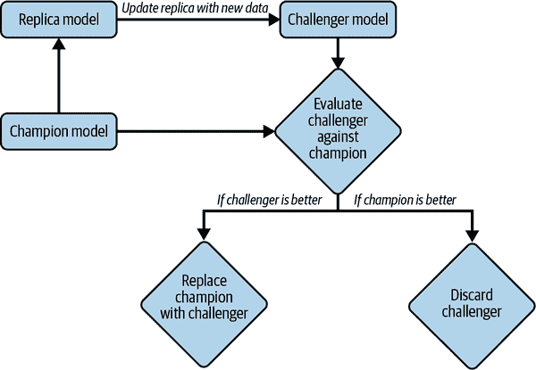
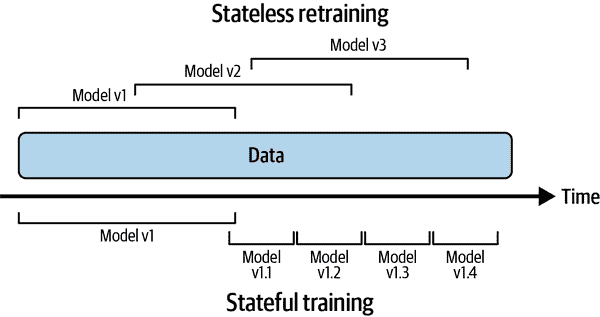
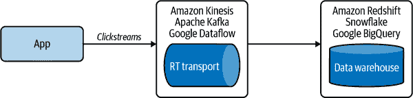
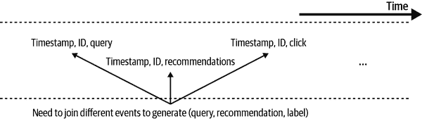
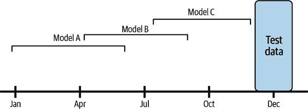
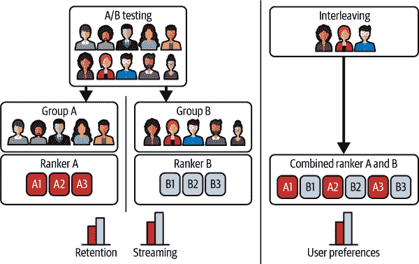

# 第九章：持续学习和生产环境中的测试

在第八章中，我们讨论了机器学习系统在生产中可能失败的各种方式。我们重点关注了一个尤其棘手的问题，这个问题在研究人员和实践者之间引起了广泛讨论：数据分布的变化。我们还讨论了多种检测数据分布变化的监控技术和工具。

本章是讨论这个问题的延续：我们如何使我们的模型适应数据分布的变化？答案是持续更新我们的机器学习模型。我们将从持续学习是什么及其面临的挑战开始讨论 —— 结果提示：持续学习主要是基础设施问题。然后，我们将提出一个四阶段计划，使持续学习成为现实。

在你设置好基础架构，可以随意更新模型后，你可能会考虑到一个问题，这个问题几乎每一个我遇到的机器学习工程师都问过我：“我应该多久重新训练我的模型？” 这个问题是本书下一节的重点讨论内容。

如果模型被重新训练以适应不断变化的环境，则仅在静态测试集上评估是不够的。我们将介绍一个看似可怕但却必要的概念：生产环境中的测试。这个过程是在生产中使用实时数据测试系统，以确保更新的模型确实可以正常工作而没有灾难性后果。

本章和前一章的主题密切相关。在生产环境中的测试与监控是相辅相成的。如果监控意味着被动地跟踪所使用模型的输出，那么在生产环境中的测试意味着积极地选择哪个模型生成输出，以便评估它。监控和生产环境中的测试的目标都是了解模型的性能，并找出更新模型的时机。持续学习的目标是安全且高效地自动化更新。所有这些概念使我们能够设计一个可维护且能够适应不断变化环境的机器学习系统。

这是我最期待写的一章，希望我能让你也对它感到兴奋！

# 持续学习

听到“持续学习”这个词时，许多人会想到在生产中每个传入样本后模型更新自身的训练范式。实际上很少有公司这样做。首先，如果你的模型是神经网络，那么每个传入样本的学习会使其容易受到灾难性遗忘的影响。灾难性遗忘指的是神经网络在学习新信息时完全和突然地忘记先前学到的信息¹

其次，它可能会使训练变得更昂贵 —— 大多数硬件后端今天都是为批处理而设计的，因此一次处理一个样本会导致计算能力的巨大浪费，并且无法利用数据并行性。

在生产中采用持续学习的公司会使用微批次来更新他们的模型。例如，他们可能在每个 512 或 1,024 个示例之后更新现有模型——每个微批次中的最佳示例数量取决于任务。

更新后的模型在评估之前不应部署。这意味着您不应直接对现有模型进行更改。相反，您应创建现有模型的副本，并在新数据上更新此副本，只有在更新的副本证明更好时，才将现有模型替换为更新的副本。现有模型称为冠军模型，更新的副本称为挑战者。这个过程在图 9-1 中有所展示。这是为了理解而进行的过度简化。实际上，一家公司可能同时拥有多个挑战者，并且处理失败的挑战者比简单丢弃要复杂得多。

###### 图 9-1\. 持续学习在生产中可能运作的简化流程。实际上，处理失败的挑战者的过程比简单丢弃要复杂得多。

尽管如此，“持续学习”一词使人们想象需要非常频繁地更新模型，例如每 5 到 10 分钟一次。许多人认为大多数公司不需要如此频繁地更新模型，因为有两个原因。首先，他们没有足够的流量（即足够的新数据），以便重新训练计划具有意义。其次，他们的模型衰减速度不那么快。我同意他们的观点。如果将重新训练计划从一周改为一天不带来回报，并且增加了更多开销，那就没有必要这样做。

## 无状态重新训练与有状态训练

然而，持续学习不是关于重新训练的频率，而是模型重新训练的方式。大多数公司采用*无状态重新训练*，即每次都从头开始训练模型。持续学习还意味着允许*有状态训练*，即模型在新数据上继续训练。² 有状态训练也被称为微调或增量学习。无状态重新训练和有状态训练的区别在图 9-2 中有所展示。

###### 图 9-2\. 无状态重新训练与有状态训练

有状态训练允许您使用较少的数据来更新模型。从头开始训练模型通常需要比对同一模型进行微调更多的数据。例如，如果您从头开始重新训练模型，可能需要使用最近三个月的所有数据。但是，如果您从昨天的检查点开始微调模型，您只需要使用最近一天的数据。

Grubhub 发现有状态训练使得他们的模型收敛更快，需要的计算资源大大减少。从每日无状态重新训练到每日有状态训练，使他们的训练计算成本减少了 45 倍，并且增加了他们的购买转化率 20%。³

经常被忽视的一个美好特性是，有状态训练可能使得完全不必存储数据成为可能。在传统的无状态重新训练中，数据样本可能会在模型的多次训练迭代中被重复使用，这意味着需要存储数据。这并不总是可行的，特别是对于具有严格隐私要求的数据而言。在有状态训练范式中，每个模型更新仅使用新鲜的数据进行训练，因此数据样本仅用于一次训练，如 图 9-2 所示。这意味着可以在训练模型时避免将数据存储在永久存储中，有助于消除许多关于数据隐私的顾虑。然而，这一点经常被忽视，因为当今的“让我们跟踪一切”的做法仍然使得许多公司不愿意放弃数据。

有状态训练并不意味着不再从头开始训练。那些最成功使用有状态训练的公司，也偶尔会在大量数据上从头开始训练他们的模型以进行校准。或者，他们也可能同时使用参数服务器等技术，在有状态训练的同时从头开始训练他们的模型，然后将两个更新后的模型结合起来。⁴

一旦你的基础设施设置允许无状态重新训练和有状态训练，训练频率就只是一个可以调整的旋钮。你可以每小时更新你的模型，每天更新一次，或者在检测到分布变化时更新。如何找到最佳的重新训练计划将在 “模型更新频率如何选择” 部分讨论。

连续学习是指以一种方式设置基础设施，使得你作为数据科学家或机器学习工程师，可以根据需要更新你的模型，无论是从头开始还是微调，并快速部署这些更新。

你可能会想：有状态训练听起来很酷，但如果我想向我的模型添加新功能或者另一层，这会如何工作？为了解答这个问题，我们必须区分两种模型更新类型：

模型迭代

新功能被添加到现有模型架构中或者模型架构被修改。

数据迭代

模型架构和特征保持不变，但你使用新数据刷新这个模型。

截至今天，有状态训练主要用于数据迭代，因为改变模型架构或添加新特征仍需要从头训练生成的模型。有研究表明，可以通过诸如[知识迁移](https://oreil.ly/lp0GB)（Google，2015）和[模型手术](https://oreil.ly/SU0F1)（OpenAI，2019）等技术，可能绕过从头训练模型迭代。根据 OpenAI，“手术在选择过程确定哪些模型部分保持不变，哪些必须重新初始化后，将训练好的权重从一个网络转移到另一个网络。”⁵ 几个大型研究实验室都进行了尝试；然而，我不知道行业中是否有明确的结果。

## 为什么要持续学习？

我们讨论了持续学习是关于建立基础设施，使您能够随意更新模型并部署这些变化。但是为什么您需要能够随意更新您的模型呢？

持续学习的第一个应用场景是应对数据分布的变化，尤其是突然发生的变化。想象一下，您正在构建一个模型来确定像 Lyft 这样的拼车服务的价格。⁶ 历史上，这个特定社区的周四晚上的拼车需求较慢，所以模型预测低拼车价格，这使得司机不愿上路。然而，这个周四晚上，社区发生了大事件，拼车需求突然激增。如果您的模型不能通过提高价格预测并动员更多司机快速响应这种变化，乘客将不得不等待很长时间才能拼车，这会造成负面用户体验。他们甚至可能转向竞争对手，导致您损失收入。

持续学习的另一个应用场景是适应罕见事件。想象一下，您为像亚马逊这样的电商网站工作。黑色星期五是一年中重要的购物活动。您不可能收集足够的历史数据，使您的模型能够准确预测今年黑色星期五期间客户的行为。为了提高性能，您的模型应该在一天内利用新鲜数据进行学习。2019 年，阿里巴巴以 1.03 亿美元收购了 Data Artisans，这支团队领导了流处理框架 Apache Flink 的开发，以帮助他们适应机器学习用例。⁷ 他们的旗舰用例是在类似于美国黑色星期五的中国购物节“双十一”上提供更好的推荐服务。

当今机器学习生产中的一个巨大挑战是可以通过持续学习来解决的*连续冷启动*问题。冷启动问题是指当你的模型需要为一个没有任何历史数据的新用户进行预测时所面临的情况。例如，为了向用户推荐他们可能想看的电影，推荐系统通常需要知道该用户以前观看过什么。但如果这个用户是新用户，你将没有他们的观影历史，只能为他们生成一些通用的内容，比如当前你网站上最流行的电影。

连续冷启动是冷启动问题的一种泛化形式，因为它不仅可能发生在新用户身上，也可能发生在现有用户身上。例如，当现有用户从笔记本电脑切换到手机时，他们在手机上的行为可能与在笔记本电脑上的行为不同。它也可能发生因为用户未登录——大多数新闻网站不要求读者登录即可阅读。

当用户访问某项服务的频率非常低，以至于服务对这个用户的所有历史数据都已经过时时，这种情况也可能发生。例如，大多数人一年只预订几次酒店和航班。Coveo 是一家为电子商务网站提供搜索引擎和推荐系统的公司，发现电子商务网站有超过 70%的购物者一年不到三次访问他们的网站。

如果你的模型适应不够快，它将无法为这些用户提供相关的推荐，直到下次模型更新为止。到那时，这些用户可能已经因为找不到符合他们需求的内容而离开了服务。

如果我们能够使我们的模型在每个用户访问会话中适应，那么模型甚至可以在用户首次访问时对他们做出准确且相关的预测。例如，TikTok 已经成功地应用持续学习来在几分钟内适应他们的推荐系统到每个用户身上。你下载应用程序，并在看了几段视频后，TikTok 的算法就能够高度准确地预测你接下来想要观看的内容。我不认为每个人都应该尝试构建像 TikTok 一样令人上瘾的东西，但这证明了持续学习可以释放强大的预测潜力。

“为什么持续学习？”应该重新表述为“为什么不持续学习？” 持续学习是批处理学习的超集，因为它允许你做批处理学习可以做的一切。但持续学习还允许你解锁批处理学习无法解决的用例。

如果连续学习设置和批处理学习一样需要相同的努力和成本，那么没有理由不进行连续学习。截至撰写本书时，设定连续学习仍面临许多挑战，我们将在下一节更深入地探讨。然而，连续学习的 MLOps 工具逐渐成熟，这意味着不久的将来，设定连续学习可能和批处理学习一样简单。

## 连续学习的挑战

尽管连续学习有许多用例，许多公司已经成功应用，但仍面临许多挑战。在本节中，我们将讨论三个主要挑战：获取新鲜数据、评估和算法。

### 新鲜数据获取挑战

第一个挑战是获取新鲜数据的挑战。如果您希望每小时更新您的模型，您就需要每小时获取新数据。目前，许多公司从其数据仓库中提取新的训练数据。您可以从多个来源获取数据的速度取决于这些数据被存入数据仓库的速度。数据的获取速度可能较慢，特别是如果数据来自多个源头。另一种选择是允许从数据仓库存入之前拉取数据，例如，直接从 Kafka 和 Kinesis 等实时传输工具获取数据，这些工具将数据从应用程序传输到数据仓库¹²，如图 9-3 所示。

###### 图 9-3\. 直接从实时传输工具中获取数据，在数据存入数据仓库之前，可以让您访问到更新的数据。

能够获取新鲜数据还不够。如果您的模型需要标记数据来进行更新，正如大多数模型今天所需的那样，那么这些数据也需要进行标记。在许多应用中，模型更新的速度往往受限于数据标记的速度。

连续学习的最佳候选任务是那些能够通过短反馈周期获得自然标签的任务。这些任务的例子包括动态定价（基于估计的需求和可用性）、预计到达时间、股票价格预测、广告点击率预测以及推荐系统，例如推特、歌曲、短视频、文章等的在线内容。

然而，这些自然标签通常不是作为标签生成的，而是作为需要从行为活动中提取成标签的行为活动。让我们通过一个例子来澄清这一点。如果你经营一个电子商务网站，你的应用程序可能会记录到，用户 A 在晚上 10:33 点击了 ID 为 32345 的产品。你的系统需要回顾日志，看看是否曾向此用户推荐过这个产品 ID，如果是，则需要查看是哪个查询促使了此推荐，以便你的系统能够将此查询与此推荐匹配并标记此推荐为良好推荐，正如图 9-4 所示。

###### 图 9-4。从用户反馈中提取标签过程的简化版本

回顾日志以提取标签的过程称为标签计算。如果日志数量庞大，这将会非常昂贵。标签计算可以通过批处理来完成：例如，先等待日志存入数据仓库，然后再运行批处理作业一次性从日志中提取所有标签。然而，正如前面讨论的那样，这意味着我们需要先等待数据存入，然后再等待下一个批处理作业运行。一个更快的方法是利用流处理直接从实时传输中提取标签¹³。

如果你的模型速度迭代受到标注速度的瓶颈影响，通过利用像 Snorkel 这样的程序化标注工具来加速标注过程是可行的，以实现快速生成标签，减少人工干预。也可以利用众包标签迅速注释新鲜数据。

考虑到流处理工具仍处于初期阶段，为了从实时传输中访问新鲜数据并快速提取标签，构建高效的流优先基础设施可能需要大量工程投入和成本。好消息是，围绕流处理的工具正快速发展。作为 2021 年 10 月的消息，建立在 Kafka 之上的平台 Confluent 公司估值已达 160 亿美元。到 2020 年底，Snowflake 成立了一个专注于流处理的团队¹⁴。截至 2021 年 9 月，Materialize 已筹集了 1 亿美元用于开发流式 SQL 数据库¹⁵。随着流处理工具的成熟，企业开发面向机器学习的流优先基础设施将更加简单和经济。

### 评估挑战

持续学习的最大挑战不在于编写函数以持续更新模型——你可以通过编写脚本来实现这一点！最大的挑战在于确保此更新足够好以进行部署。在本书中，我们已经讨论了机器学习系统在生产中出现灾难性失败的情况，从数百万少数民族被不公正拒绝贷款，到过度信任自动驾驶的司机导致致命事故¹⁶。

随着持续学习的风险增加，灾难性故障的风险也在增加。首先，您更新模型的频率越高，更新失败的机会就越多。

其次，持续学习使您的模型更容易受到协调操纵和对抗攻击的影响。由于您的模型在线学习真实世界数据，用户可以轻易输入恶意数据来欺骗模型学习错误内容。2016 年，微软发布了 Tay，一个能够通过 Twitter 上的“随意和俏皮对话”进行学习的聊天机器人。Tay 一推出，恶意用户开始向机器人发送种族主义和女性歧视言论。很快，机器人开始发布煽动性和攻击性的推文，导致微软在其发布仅 16 小时后关闭了该机器人。¹⁷

为了避免类似或更糟的事件发生，非常重要的是在将更新部署给更广泛的受众之前，彻底测试每个模型更新的性能和安全性。我们已经在第六章中讨论了模型的离线评估，并将在本章讨论在线评估（在生产中测试）。

在设计持续学习的评估管道时，请记住评估需要时间，这可能成为模型更新频率的另一个瓶颈。例如，我曾与一家主要在线支付公司合作，他们拥有一个 ML 系统来检测欺诈交易。¹⁸ 欺诈模式变化迅速，因此他们希望快速更新系统以适应变化的模式。但是，在进行新模型与当前模型的 A/B 测试之前，由于任务的不平衡性——大多数交易并非欺诈交易——他们需要大约两周时间才能看到足够多的欺诈交易，以准确评估哪个模型更好。¹⁹ 因此，他们只能每两周更新一次系统。

### 算法挑战

与新鲜数据挑战和评估相比，这是一个“更轻”的挑战，因为它只影响特定算法和特定的训练频率。准确地说，它只影响希望非常快速更新的基于矩阵和基于树的模型（例如每小时更新）。

为了阐明这一点，考虑两种不同的模型：神经网络和基于矩阵的模型，比如协同过滤模型。协同过滤模型使用用户-物品矩阵和维度缩减技术。

您可以使用任意大小的数据批次更新神经网络模型。您甚至可以仅使用一个数据样本执行更新步骤。但是，如果要更新协同过滤模型，则首先需要使用整个数据集构建用户-物品矩阵，然后对其执行降维。当然，您可以在每次使用新数据样本更新矩阵时对其应用降维，但是如果矩阵很大，则频繁执行降维步骤将会过于缓慢和昂贵。因此，这种模型相比前述的神经网络模型不太适合使用部分数据集进行学习[²⁰]。

适应持续学习范式的模型（如神经网络）比基于矩阵和基于树的模型更容易。然而，已经有算法可以创建可以从增量数据中学习的基于树的模型，最著名的是 Hoeffding Tree 及其变种 Hoeffding Window Tree 和 Hoeffding Adaptive Tree[²¹]，但它们的使用尚不普遍。

学习算法不仅需要处理部分数据集，特征提取代码也需要如此。我们在“缩放”[^scaling]部分讨论了通常需要使用最小值、最大值、中位数和方差等统计数据对特征进行缩放。要为数据集计算这些统计数据，通常需要对整个数据集进行一次遍历。当模型一次只能看到小的数据子集时，理论上可以为每个数据子集计算这些统计数据。然而，这意味着这些统计数据在不同子集之间会有很大波动。从一个子集计算的统计数据可能会与下一个子集大相径庭，使得训练在一个子集上的模型难以推广到下一个子集。

要保持这些统计数据在不同子集之间的稳定性，您可能希望在线计算这些统计数据。不要一次性使用所有数据的均值或方差，而是在看到新数据时逐步计算或近似这些统计数据，例如“流数据中的最优分位数近似算法”[²²]中所述的算法。当今流行的框架提供了一些计算运行统计的功能，例如 sklearn 的 StandardScaler 具有`partial_fit`，允许使用运行统计的特征缩放器，但内置方法速度慢，不支持广泛的运行统计。

## 持续学习的四个阶段

我们已经讨论了持续学习的含义，为何持续学习如此重要，以及持续学习面临的挑战。接下来，我们将讨论如何克服这些挑战，使持续学习成为可能。截至本书撰写时，持续学习并非公司初始就能采取的策略。向持续学习的转变发生在四个阶段，如下所述。我们将详细介绍每个阶段的发生情况以及从前一个阶段迈向当前阶段所需的条件。

### 第 1 阶段：手动、无状态重新训练

在初期，机器学习团队经常专注于开发 ML 模型来解决尽可能多的业务问题。例如，如果你的公司是一个电子商务网站，你可能会按以下顺序开发四个模型：

1.  检测欺诈交易的模型

1.  推荐用户相关产品的模型

1.  预测卖家是否滥用系统的模型

1.  预测订单发货时间的模型

因为你的团队专注于开发新模型，更新现有模型暂时放在次要位置。只有当以下两个条件同时满足时，你才会更新现有模型：模型的性能下降到对系统造成更多害处而非益处的地步，并且你的团队有时间进行更新。你的一些模型每六个月更新一次。一些模型每个季度更新一次。还有一些模型已经在野外运行了一年，却从未被更新过。

更新模型的过程是手动的和临时的。通常是一个数据工程师，需要从数据仓库查询新数据。然后有人清洗这些新数据，提取特征，用旧数据和新数据重新训练模型，然后将更新后的模型导出为二进制格式。接下来，有人将该二进制格式部署为更新后的模型。通常情况下，在重新训练过程中封装数据、特征和模型逻辑的代码会发生变化，但这些变化未能在生产中复制，导致难以追踪的错误。

如果这个过程听起来让你痛苦不堪，你并不孤单。绝大多数非科技行业的公司——例如，任何在不到三年前开始采用机器学习且没有机器学习平台团队的公司——都处于这个阶段²³。

### 第 2 阶段：自动化重新训练

几年后，你的团队设法将模型部署解决了大多数明显问题。你的生产环境中有 5 到 10 个模型。你的优先任务不再是开发新模型，而是维护和改进现有模型。从前一个阶段提到的临时手动更新模型的过程已经发展成为无法忽视的痛点。你的团队决定编写一个脚本，通过类似 Spark 的批处理定期执行所有的重新训练步骤。

大多数具有较为成熟 ML 基础设施的公司处于这个阶段。一些复杂的公司进行实验以确定最佳的重新训练频率。然而，对于大多数处于这个阶段的公司来说，重新训练频率是基于直觉设定的，例如，“每天一次看起来差不多合适”或“让我们每晚在计算空闲时启动重新训练过程”。

在创建用于自动化系统重新训练过程的脚本时，您需要考虑到您系统中的不同模型可能需要不同的重新训练计划。例如，考虑一个推荐系统，包括两个模型：一个模型用于为所有产品生成嵌入，另一个模型用于根据查询排名每个产品的相关性。嵌入模型可能需要比排名模型少得多地重新训练。因为产品的特征不经常变化，您可能每周重新训练一次嵌入模型[²⁴]，而排名模型可能需要每天重新训练一次。

如果您的模型之间存在依赖关系，自动化脚本可能会变得更加复杂。例如，由于排名模型依赖于嵌入，当嵌入发生变化时，排名模型也应进行更新。

#### 需求

如果您的公司在生产中使用 ML 模型，那么您的公司很可能已经拥有大多数自动化重新训练所需的基础设施组件。此阶段的可行性取决于编写脚本自动化工作流程并配置基础设施以自动执行以下操作是否可行：

1.  拉取数据。

1.  必要时对数据进行下采样或上采样。

1.  提取特征。

1.  处理和/或注释标签以创建训练数据。

1.  启动训练过程。

1.  评估新训练的模型。

1.  部署它。

编写此脚本所需的时间取决于许多因素，包括脚本编写者的能力。然而，总体而言，影响此脚本可行性的三个主要因素是调度器、数据和模型存储。

调度器基本上是处理任务调度的工具，我们将在“Cron, Schedulers, and Orchestrators”部分进行介绍。如果您尚未拥有调度器，您将需要时间来设置一个。但是，如果您已经拥有像 Airflow 或 Argo 这样的调度器，将脚本连接在一起不应该那么难。

第二个因素是数据的可用性和可访问性。您是否需要将数据自行收集到数据仓库？您是否需要从多个组织中联合数据？您是否需要从头开始提取许多特征？您是否还需要为数据标记？如果您对这些问题的答案是肯定的越多，设置此脚本所需的时间就越长。Stefan Krawczyk，在 Stitch Fix 的 ML/data 平台经理，评论说他怀疑大多数人的时间可能会在这里花费。

你将需要的第三个因素是一个模型存储库，用于自动版本控制和存储所有重现模型所需的工件。最简单的模型存储库可能只是一个 S3 存储桶，以某种结构化的方式存储模型的序列化数据块。然而，像 S3 这样的数据块存储既不擅长版本控制工件，也不易于人类阅读。你可能需要更成熟的模型存储库，比如亚马逊 SageMaker（托管服务）和 Databricks 的 MLflow（开源）。我们将详细讨论模型存储库是什么，并在“模型存储”章节中评估不同的模型存储库。

# 特征重用（记录并等待）

当从新数据中创建训练数据以更新您的模型时，请记住，新数据已经通过了预测服务。这个预测服务已经从新数据中提取了特征，以输入模型进行预测。一些公司会重复使用这些提取的特征来进行模型重新训练，这既节省了计算资源，也确保了预测与训练之间的一致性。这种方法被称为“记录并等待”。这是减少“训练服务偏差”的经典方法，在第八章（请参阅“生产数据与训练数据不一致”章节）中讨论过。

“记录并等待”尚未成为流行的方法，但它正在变得越来越受欢迎。Faire 在其[优秀的博客文章](https://oreil.ly/AxFnJ)中讨论了他们的“记录并等待”方法的优缺点。

### 第三阶段：自动化、有状态训练

在第二阶段，每次重新训练模型时，你都是从头开始训练（无状态重新训练）。这使得你的重新训练成本高昂，特别是对于频繁重新训练的情况。你阅读了“无状态重新训练与有状态训练”的章节，并决定你想要进行有状态训练——为什么每天都要用过去三个月的数据重新训练，而不是只用最近一天的数据继续训练呢？

因此，在这个阶段，你重新配置你的自动更新脚本，使得当模型更新启动时，它首先定位到先前的检查点并加载到内存中，然后继续在这个检查点上进行训练。

#### 要求

在这个阶段，你最需要的是心态的改变：从头开始重新训练是一个如此常见的做法——许多公司习惯于数据科学家将模型交给工程师每次都从头开始部署——以至于许多公司没有考虑建立基础设施来实现有状态训练。

一旦你决定进行有状态训练，重新配置更新脚本就很简单了。在这个阶段，你主要需要一种方式来跟踪你的数据和模型衍生。想象一下，你首先上传模型版本 1.0。这个模型通过新数据更新为模型版本 1.1，依此类推，直到创建模型 1.2。然后上传另一个模型称为模型版本 2.0。这个模型通过新数据更新为模型版本 2.1。一段时间后，你可能有模型版本 3.32、模型版本 2.11、模型版本 1.64。你可能想知道这些模型随时间如何演变，哪个模型作为基础模型使用，以及用于更新它的数据，以便能够重现和调试它。据我所知，目前没有现有的模型存储具备这种模型衍生能力，因此你可能需要自行构建解决方案。

如果你想从实时传输而不是数据仓库中获取新鲜数据，如在“新鲜数据访问挑战”一节中讨论的，而你的流媒体基础设施不够成熟，你可能需要重构你的流水线。

### 第四阶段：持续学习

在第三阶段，你的模型仍然根据开发者设定的固定时间表进行更新。找到最佳的时间表并不简单，可能会依赖于具体情况。例如，上周市场上没什么大事发生，所以你的模型衰减得不那么快。然而，本周发生了许多事件，所以你的模型衰减得更快，需要更快的重新训练时间表。

与其依赖于固定的时间表，你可能希望在数据分布发生变化和模型性能下降时自动更新你的模型。

圣杯在于将持续学习与边缘部署结合起来。想象一下，你可以在新设备上部署基础模型——手机、手表、无人机等——该设备上的模型将会根据需要持续更新和适应环境，而无需与集中服务器同步。这意味着不需要集中服务器成本。也不需要在设备和云端之间来回传输数据，这意味着更好的数据安全性和隐私保护！

#### 需求

从第三阶段过渡到第四阶段是陡峭的。你首先需要一个触发模型更新的机制。这个触发器可以是：

基于时间的

例如，每隔五分钟

基于性能的

例如，每当模型性能急剧下降时

基于容量的

例如，每当标记数据总量增加了 5%时

基于漂移的

例如，每当检测到主要的数据分布变化时

要使此触发机制正常工作，您将需要一个稳固的监控解决方案。我们在“监控和可观察性”部分讨论过，困难不在于检测变化，而在于确定哪些变化真正重要。如果您的监控解决方案提供了大量虚警，您的模型最终将比需要的更频繁地更新。

您还需要一个稳固的流水线来持续评估您的模型更新。编写一个更新模型的函数与第 3 阶段所做的事情并无太大不同。困难的部分在于确保更新后的模型正常工作。在“生产中测试”部分，我们将介绍您可以使用的各种测试技术。

## 更新模型的频率

现在，您的基础设施已经设置好快速更新模型，您开始思考一个一直困扰各种公司 ML 工程师的问题：“我应该多频繁地更新我的模型？”在试图回答这个问题之前，我们首先需要弄清楚您的模型通过使用新鲜数据进行更新可以获得多少收益。您的模型能够从更新数据中获得的收益越大，就应该更频繁地重新训练。

### 数据新鲜度的价值

如果我们知道更新后模型性能将如何提高，那么确定多频繁更新模型的问题将变得更加容易。例如，如果我们从每月重新训练模型切换到每周重新训练，我们可以获得多少性能提升？如果我们切换到每日重新训练呢？人们一直说数据分布会变化，因此新鲜数据更好，但新鲜数据究竟好多少？

了解增益的一种方法是，通过在过去不同时间窗口的数据上训练模型，并在今天的数据上评估，看看性能如何变化。例如，假设您有来自 2020 年的数据。为了衡量数据新鲜度的价值，您可以尝试在模型版本 A 上训练从 2020 年 1 月到 6 月的数据，模型版本 B 上训练从 4 月到 9 月的数据，以及模型版本 C 上训练从 6 月到 11 月的数据，然后在 12 月对每个模型版本进行测试，如图 9-5 所示。这些版本之间的性能差异将让您感受到模型从更新数据中可以获得的性能提升。如果一个季度前训练的模型远远不如一个月前训练的模型，那么您知道不应该等一个季度再重新训练模型。

###### 图 9-5\. 为了感受从更新数据中获得的性能提升，您可以在过去不同时间窗口的数据上训练模型，然后在今天的数据上进行测试，看看性能如何变化。

这是一个简单的示例，说明数据新鲜度实验的工作原理。实际上，你可能希望你的实验更加细致，操作不是以月为单位，而是以周、天，甚至小时或分钟为单位。2014 年，Facebook 对广告点击率预测进行了类似的实验，发现他们可以通过从每周重新训练到每天重新训练来减少模型损失 1%，而这种性能提升对他们来说足够显著，以至于他们将重新训练的流程从每周改为每天。²⁵ 鉴于今天的在线内容更加多样化，用户的在线注意力变化更快，我们可以想象，对于广告点击率来说，数据新鲜度的价值甚至更高。一些拥有复杂 ML 基础设施的公司已经发现，通过每隔几分钟重新训练模型可以获得足够的性能提升，因此他们将重新训练的流程改为每隔几分钟进行一次。²⁶

### 模型迭代与数据迭代

在本章的早些时候我们讨论过，并不是所有的模型更新都是相同的。我们区分了模型迭代（向现有模型架构添加新特征或更改模型架构）和数据迭代（相同的模型架构和特征，但使用新数据刷新模型）。你可能不仅想知道更新模型的频率，还想知道进行何种类型的模型更新。

理论上，你可以同时进行这两种类型的更新，实际上，你应该定期进行这两种更新。然而，你在一种方法上投入的资源越多，你可以在另一种方法上投入的资源就越少。

一方面，如果你发现对数据进行迭代并不能带来太大的性能提升，那么你应该将资源用于寻找更好的模型。另一方面，如果寻找更好的模型架构需要 100 倍的计算资源进行训练，并且仅带来 1%的性能提升，而使用过去三小时数据更新同一模型只需要 1 倍计算资源，同样带来 1%的性能提升，你最好选择对数据进行迭代。

或许在不久的将来，我们会更多地理解在何种情况下某种方法会更有效（暗示“寻求研究”），但截至今日，没有一本书能为你的特定模型在特定任务上哪种方法更好提供答案。你必须进行实验来找出答案。

确定模型更新频率的问题是一个难以回答的问题，我希望本节已足够解释了其中的微妙之处。在开始阶段，当你的基础设施尚不成熟且模型更新的过程是手动且缓慢的时候，答案是：尽可能频繁。

但是，随着您的基础设施成熟和更新模型的过程部分自动化，可以在几小时甚至几分钟内完成，如果不是分钟，回答这个问题的答案取决于以下问题的答案：“从更新的数据中我会得到多少性能增益？”运行实验来量化数据新鲜度对您的模型的价值非常重要。

# 在生产中进行测试

在本书的整个内容中，包括本章，我们已经谈论过部署尚未充分评估的模型的危险。要充分评估您的模型，首先需要离线评估和本章讨论的在线评估的混合。要理解为什么离线评估不足够，让我们简要介绍离线评估的两种主要测试类型：测试拆分和后测。

您可能会考虑的第一种模型评估是您可以使用其离线评估模型的老式测试拆分，如第六章中讨论的第六章。这些测试拆分通常是静态的，也必须是静态的，以便您有一个可信赖的基准来比较多个模型。如果在不同的测试集上测试了两个模型的测试结果，将很难进行比较。

但是，如果更新模型以适应新的数据分布，仅在来自旧分布的测试拆分上评估此新模型是不够的。假设数据越新鲜，可能来自当前分布，一个想法是在您能访问的最新数据上测试您的模型。因此，在您更新了最后一天数据的模型后，您可能希望在最后一小时的数据上测试此模型（假设最后一小时的数据未包含在用于更新模型的数据中）。在过去的特定时间段内测试预测模型的方法称为*后测*。

是否后测是充分替代静态测试拆分的问题？并不完全如此。如果您的数据管道出现问题，并且最后一小时的一些数据已损坏，则仅评估这些最新数据的模型是不够的。

使用后测，您仍然应该在一个您已经广泛研究并（大多数情况下）信任的静态测试集上评估您的模型，作为一种理智检查的形式。

由于数据分布会发生变化，一个模型在最近一小时的数据上表现良好并不意味着它将在未来的数据上继续表现良好。了解一个模型在生产中是否表现良好的唯一方法是部署它。这一洞察力促使了一个看似可怕但必要的概念：在生产环境中测试。然而，在生产环境中进行测试并不一定可怕。有一些技术可以帮助你相对安全地评估你的模型。在本节中，我们将涵盖以下技术：影子部署，A/B 测试，金丝雀分析，交替实验和自动化分析。

## 影子部署

影子部署可能是部署您的模型或任何软件更新最安全的方法。影子部署的工作原理如下：

1.  并行部署候选模型与现有模型。

1.  对于每个进入的请求，将其路由到两个模型以进行预测，但仅向用户提供现有模型的预测结果。

1.  记录新模型的预测结果以供分析。

只有在确定新模型的预测结果令人满意后，才会用新模型替换现有模型。

因为只有在确定新模型的预测结果令人满意后才向用户提供新模型的预测结果，所以这种新模型出现异常的风险很低，至少不会高于现有模型。然而，这种技术并非始终受欢迎，因为它很昂贵。这会使系统需要生成的预测数量翻倍，这通常意味着推理计算成本的翻倍。

## A/B 测试

A/B 测试是一种比较两个变体对象的方法，通常通过测试对这两个变体的响应来确定哪个变体更有效。在我们的案例中，一个变体是现有模型，另一个变体是候选模型（最近更新的模型）。我们将使用 A/B 测试来确定哪个模型更好，根据一些预定义的指标。

自 2017 年起，A/B 测试变得如此普遍，像微软和谷歌这样的公司每年都会进行超过 10,000 次 A/B 测试。²⁷ 这已经成为许多机器学习工程师在生产环境中评估模型的首选方法。A/B 测试的工作原理如下：

1.  与现有模型一起部署候选模型。

1.  将一部分流量路由到新模型进行预测，其余流量路由到现有模型进行预测。通常情况下，两个变体同时提供预测流量。然而，有些情况下，一个模型的预测结果可能会影响另一个模型的预测结果——例如，在共享经济的动态定价中，一个模型的预测价格可能会影响可用司机和乘客的数量，进而影响另一个模型的预测结果。在这些情况下，可能需要交替运行变体，例如，一天提供模型 A 的服务，然后第二天提供模型 B 的服务。

1.  监控和分析预测结果及用户反馈（如果有的话），以确定两个模型在性能上的差异是否具有统计显著性。

要正确进行 A/B 测试，需要做很多事情正确。在本书中，我们将讨论两个重要的事情。首先，A/B 测试包括一个随机化实验：路由到每个模型的流量必须是真正随机的。如果不是，测试结果将是无效的。例如，如果流量路由到两个模型的方式存在选择偏差，比如接触模型 A 的用户通常使用手机，而接触模型 B 的用户通常使用台式机，那么如果模型 A 的准确率比模型 B 更高，我们无法确定是因为 A 比 B 更好，还是因为“使用手机”影响了预测质量。

第二，你的 A/B 测试应该运行在足够数量的样本上，以获得对结果的足够信心。如何计算 A/B 测试所需的样本数量是一个简单的问题，但是答案却非常复杂，我建议读者参考一本关于 A/B 测试的书籍来了解更多。

这里的要点是，如果你的 A/B 测试结果显示一个模型比另一个显著优越，你可以确定哪个模型确实更好。为了测量统计显著性，A/B 测试使用诸如双样本检验之类的统计假设检验。我们在第八章中看到了双样本检验，当时我们用它们来检测分布的变化。作为提醒，双样本检验是一种用来确定这两个总体之间差异是否具有统计显著性的检验。在分布变化的用例中，如果统计差异表明这两个总体来自不同的分布，这意味着原始分布已经发生了变化。在 A/B 测试的用例中，统计差异意味着我们已经收集到足够的证据表明一个变体比另一个变体更好。

统计显著性虽然有用，但并非绝对可靠。比如我们进行了一次双样本检验，得到结果称模型 A 比模型 B 更好，其 *p*-值为 *p* = 0.05 或 5%，我们定义统计显著性为 *p* ≤ 0.5\. 这意味着如果我们多次运行相同的 A/B 测试实验，（100 – 5 =）95% 的时间我们将得到 A 比 B 更好的结果，而另外 5% 的时间则是 B 比 A 更好。因此，即使结果具有统计显著性，如果我们再次运行实验，可能会选择另一个模型。

即使你的 A/B 测试结果不具有统计显著性，并不意味着这个 A/B 测试失败了。如果你已经用大量样本运行了 A/B 测试，并且两个测试模型之间的差异在统计上不显著，可能这两个模型之间并没有太大的差异，你可以随意选择其中一个模型使用。

对于对学习更多关于 A/B 测试和其他在机器学习中重要的统计概念感兴趣的读者，我推荐 Ron Kohavi 的书 *《可信在线控制实验（A/B 测试实用指南）》*（剑桥大学出版社）和 Michael Barber 的[很棒的统计入门指南，专为数据科学](https://oreil.ly/JdVA0)（简短得多）。

在生产环境中，通常不仅有一个候选模型，而是有多个候选模型。可以使用多个变体进行 A/B 测试，这意味着我们可以进行 A/B/C 测试甚至 A/B/C/D 测试。

## **金丝雀发布**

金丝雀发布是一种通过在生产环境中缓慢推出新软件版本的技术，首先将更改逐步推广到少量用户，然后再将其推广到整个基础架构并向所有人提供。（参见 28）。在 ML 部署的上下文中，金丝雀发布的工作方式如下：

1.  部署候选模型并行于现有模型。候选模型称为金丝雀。

1.  部分流量被路由到候选模型。

1.  如果其性能令人满意，请增加流量到候选模型。如果不满意，请中止金丝雀，并将所有流量重新路由到现有模型。

1.  当金丝雀服务所有流量（候选模型已替换现有模型）或金丝雀被中止时停止。

候选模型的性能根据您关心的指标与现有模型的性能进行比较。如果候选模型的关键指标显著下降，金丝雀会被中止，所有流量将路由到现有模型。

金丝雀发布可用于实施 A/B 测试，因为它们的设置相似。但是，您可以在没有 A/B 测试的情况下进行金丝雀分析。例如，您不必随机化流量以路由到每个模型。一个合理的情况是，您可以首先将候选模型推广到一个不那么关键的市场，然后再推广到所有人。

对于对行业中金丝雀发布工作原理感兴趣的读者，Netflix 和 Google 在如何在他们的公司使用自动化金丝雀分析的一篇[很棒的博客文章](https://oreil.ly/QfBrn)中分享了。

## **交错实验**

想象一下，您有两个推荐系统，A 和 B，您想评估哪个更好。每次，一个模型推荐 10 个用户可能喜欢的项目。通过 A/B 测试，您将用户分为两组：一组接触 A，另一组接触 B。每个用户将会接触到由一个模型做出的推荐。

如果我们不是向用户推荐模型的推荐内容，而是向用户展示来自两个模型的推荐内容，并查看用户会点击哪个模型的推荐内容呢？这正是交错实验的理念，最初由 Thorsten Joachims 在 2002 年提出，用于搜索排名问题。在实验中，Netflix 发现，“与传统的 A/B 测试相比，交错测试能够以明显较小的样本量可靠地识别出最佳算法。”³⁰

图 9-6 展示了交错测试与 A/B 测试的不同之处。在 A/B 测试中，像留存率和流媒体这样的核心指标是通过对比两组数据来衡量的。在交错测试中，可以通过测量用户偏好来比较两种算法。因为交错测试可以根据用户偏好来决定，所以不能保证用户偏好将导致更好的核心指标。

###### 图 9-6\. 交错与 A/B 测试的说明。来源：根据 Parks et al.的图片改编。

当我们向用户展示多个模型的推荐内容时，重要的是要注意推荐的位置会影响用户点击的可能性。例如，用户更有可能点击顶部的推荐而不是底部的推荐。为了确保交错测试能产生有效的结果，我们必须确保在任何给定位置，推荐被 A 或 B 生成的概率是相等的。为了确保这一点，我们可以使用团队选拔交错方法，模仿体育中的选秀过程。对于每个推荐位置，我们以相等的概率随机选择 A 或 B，并且被选择的模型选择尚未被选中的顶部推荐。如何团队选拔方法工作的可视化图示在 图 9-7 中显示。

###### 图 9-7\. 使用团队选拔方法交错两种排名算法的视频推荐。来源：Parks et al.³²

## 老虎机

对于不熟悉的人来说，赌博算法起源于赌博。赌场有多台不同赔率的老虎机。老虎机也被称为单臂强盗，因此得名。你不知道哪台老虎机会给出最高的赔率。你可以随着时间的推移进行实验，找出哪台老虎机是最好的，同时最大化你的赔率。多臂老虎机算法是一种允许你在开发（选择过去支付最多的老虎机）和探索（选择其他可能支付更多的老虎机）之间取得平衡的算法。

目前，生产环境中测试模型的标准方法是 A/B 测试。在 A/B 测试中，你会随机将流量路由到每个模型进行预测，并在试验结束时测量哪个模型效果更好。A/B 测试是无状态的：你可以将流量路由到每个模型，而无需了解它们当前的性能。即使在批处理预测中，也可以进行 A/B 测试。

当你有多个模型需要评估时，每个模型都可以看作是一个老虎机，其回报（即预测准确性）你并不知道。而赌博算法允许你确定如何将流量路由到每个模型进行预测，以确定最佳模型，同时最大化用户的预测准确性。赌博算法是有状态的：在将请求路由到模型之前，你需要计算所有模型的当前性能。这需要三个步骤：

+   您的模型必须能够进行在线预测。

+   最好是短反馈循环：你需要获取关于预测是否好的反馈。这通常适用于可以从用户反馈中确定标签的任务，比如推荐系统——如果用户点击了一个推荐，可以推断它是好的。如果反馈循环很短，你可以快速更新每个模型的回报。

+   一种收集反馈、计算并跟踪每个模型性能，并基于它们当前的性能将预测请求路由到不同模型的机制。

赌博算法在学术界已经有了深入研究，并且已经被证明比 A/B 测试更加数据高效（在许多情况下，赌博算法甚至是最优的）。赌博算法需要更少的数据来确定哪个模型是最好的，同时通过更快地将流量路由到更好的模型来减少机会成本。有关赌博算法的讨论，请参见[LinkedIn, Netflix, Facebook, and Dropbox](https://oreil.ly/vsKsg)，[Zillow](https://oreil.ly/A7KkD)，以及[Stitch Fix](https://oreil.ly/2LKZd)。更多理论视角，请参见《强化学习》（Sutton 和 Barto，2020）的第二章。

在 Google 的 Greg Rafferty 进行的实验中，进行 A/B 测试需要超过 630,000 个样本才能获得 95%的置信区间，而简单的赌博算法（汤普森采样）仅需不到 12,000 个样本就能确定一个模型比另一个好 5%³³。

然而，与 A/B 测试相比，赌博算法实施起来更加困难，因为它需要计算和跟踪模型的回报。因此，除了少数大型科技公司外，赌博算法在行业内并不广泛使用。

### 上下文赌博作为一种探索策略

如果用于模型评估的老虎机来确定每个模型的支付（即预测准确性），那么上下文老虎机将用于确定每个动作的支付。在推荐/广告的情况下，一个动作是向用户展示一个项目/广告，支付是用户点击它的可能性。像其他老虎机一样，上下文老虎机是提高模型数据效率的一种神奇技术。

###### 警告

有些人也称用于模型评估的老虎机为“上下文老虎机”。这使得对话变得混乱，在本书中，“上下文老虎机”指的是探索策略，用于确定预测的支付。

想象一下，您正在构建一个包含 1,000 个推荐项的推荐系统，这使它成为一个 1,000 臂老虎机问题。每次，您只能向用户推荐排名前 10 的最相关项目。在老虎机的术语中，您将不得不选择最好的 10 个臂。展示的项目会得到用户的反馈，通过用户是否点击它们来推断。但您将不会得到其他 990 个项目的反馈。这被称为*部分反馈*问题，也称为*老虎机反馈*。您还可以将上下文老虎机视为带有老虎机反馈的分类问题。

每当用户点击一个项目时，该项目就会获得 1 个价值点。当一个项目的价值点为 0 时，可能是因为该项目从未展示给用户，也可能是展示过但没有被点击。您希望向用户展示对他们最有价值的项目，但如果您只展示具有最多价值点的项目，那么您将继续推荐相同的热门项目，而从未展示的项目将始终保持 0 个价值点。

上下文老虎机是一种帮助您在向用户展示他们喜欢的项目和向他们展示您想要反馈的项目之间取得平衡的算法。³⁶ 这与许多读者在强化学习中可能遇到的探索-开发权衡是相同的。上下文老虎机也称为“一次性”强化学习问题。³⁷ 在强化学习中，您可能需要在看到奖励之前执行一系列动作。在上下文老虎机中，您可以在执行动作后立即获得老虎机反馈，例如，在推荐广告后，您会得到用户是否点击推荐的反馈。

上下文匪徒已经得到了广泛的研究，并且已经被证明可以显著提高模型的性能（请参阅[Twitter](https://oreil.ly/EqjmB)和[Google](https://oreil.ly/ipMxd)的报告）。然而，上下文匪徒的实施甚至比模型匪徒更加困难，因为探索策略取决于机器学习模型的架构（例如，它是决策树还是神经网络），这使得它在不同用例中的泛化能力较差。对于希望将上下文匪徒与深度学习结合的读者，应该查看 Twitter 团队撰写的一篇出色论文：[“深度贝叶斯匪徒：在线个性化推荐中的探索”](https://oreil.ly/Uv03p)（Guo 等人，2020 年）。

在我们结束本节之前，有一点我想强调。我们已经讨论了多种用于机器学习模型的测试类型。然而，重要的是要注意，一个好的评估流程不仅仅是关于要运行哪些测试，还包括谁来运行这些测试。在机器学习中，评估过程通常由数据科学家负责——那些开发模型的人也负责评估它。数据科学家倾向于使用他们喜欢的测试集来临时评估他们的新模型。首先，这个过程充满了偏见——数据科学家对他们的模型有着大多数用户不具备的背景知识，这意味着他们可能不会像大多数用户那样使用这个模型。其次，临时性质意味着结果可能不稳定。一个数据科学家可能进行一系列测试并发现模型 A 比模型 B 更好，而另一个数据科学家可能会报告不同的结果。

在生产中缺乏确保模型质量的方法导致许多模型在部署后失败，进而加剧了数据科学家在部署模型时的焦虑。为了减轻这一问题，每个团队都要制定清晰的流程来评估模型：例如，要运行哪些测试，它们应该按什么顺序运行，必须通过哪些阈值才能晋级到下一个阶段。更好的做法是，这些流程应该是自动化的，并在每次有新模型更新时启动。结果应该被报告和审查，类似于传统软件工程中的持续集成/持续部署（CI/CD）过程。重要的是要理解，一个好的评估过程不仅涉及要运行哪些测试，还涉及谁来运行这些测试。

# 总结

本章讨论了我认为是最令人兴奋但又未被充分探索的主题之一：如何在生产中持续更新您的模型，以使其适应不断变化的数据分布。我们讨论了公司在现代化其基础架构以进行持续学习过程中可能经历的四个阶段：从手动、从头开始培训阶段到自动化、无状态的持续学习阶段。

接着，我们考察了困扰各形各色团队中机器学习工程师的问题：“我应该**多频繁**更新我的模型？”并督促他们考虑数据新鲜度对他们的模型的价值以及模型迭代和数据迭代之间的权衡。

与讨论的在线预测类似，第七章中持续学习需要成熟的流式处理基础设施。持续学习的训练部分可以批量进行，但在线评估部分需要流式处理。许多工程师担心流式处理难以实现且成本高昂。在三年前这是事实，但自那时以来流处理技术已经显著成熟。越来越多的公司正在提供解决方案，使公司更容易转向流处理，包括 Spark Streaming、Snowflake Streaming、Materialize、Decodable、Vectorize 等。

持续学习是机器学习特有的问题，但它在很大程度上需要基础设施解决方案。为了加快迭代周期并迅速检测新模型更新的失败，我们需要以正确的方式设置基础设施。这需要数据科学/机器学习团队与平台团队合作。我们将在下一章讨论 ML 基础设施。

¹ 乔安·塞拉（Joan Serrà）、迪达克·苏里斯（Dídac Surís）、马里乌斯·米隆（Marius Miron）和亚历山德罗斯·卡拉佐阿尔（Alexandros Karatzoglou），“用于任务的强注意力克服灾难性遗忘”，*arXiv*，2018 年 1 月 4 日，[*https://oreil.ly/P95EZ*](https://oreil.ly/P95EZ)。

² 这里的名称是“有状态训练”，而不是“有状态**重新**训练”，因为这里没有**重新**训练。模型继续从上一个状态训练。

³ 艾利克斯·埃格（Alx Egg），“Grubhub 的推荐在线学习”， *arXiv*，2021 年 7 月 15 日，[*https://oreil.ly/FBBUw*](https://oreil.ly/FBBUw)。

⁴ 李睦，周莉，杨子超，李傲然，夏飞，戴维·G·安德森，亚历山大·斯莫拉，“分布式机器学习的参数服务器”（NIPS 大规模学习研讨会，2013 年，塔霍湖，加州），[*https://oreil.ly/xMmru*](https://oreil.ly/xMmru)。

⁵ 乔纳森·赖曼（Jonathan Raiman）、苏珊·张（Susan Zhang）和克里斯蒂·丹尼森（Christy Dennison），“神经网络外科手术与集合”， *arXiv*，2019 年 12 月 13 日，[*https://oreil.ly/SU0F1*](https://oreil.ly/SU0F1)。

⁶ 这种问题也被称为“动态定价”问题。

⁷ 乔恩·拉塞尔（Jon Russell），“阿里巴巴以 1.03 亿美元收购德国大数据初创公司 Data Artisans，” *TechCrunch*，2019 年 1 月 8 日，[*https://oreil.ly/4tf5c*](https://oreil.ly/4tf5c)。一位早期审阅者指出，这次收购的主要目标也可能是增加阿里巴巴的开源足迹，这与其他科技巨头相比很少。

⁸ 如果你希望你的模型能够找出何时推荐尚无人观看和反馈的新电影，那么这个问题同样具有挑战性。

⁹ Lucas Bernardi, Jaap Kamps, Julia Kiseleva, 和 Melanie J. I. Müller, “电子商务推荐系统中的连续冷启动问题,” *arXiv*, 2015 年 8 月 5 日, [*https://oreil.ly/GWUyD*](https://oreil.ly/GWUyD)。

¹⁰ Jacopo Tagliabue, Ciro Greco, Jean-Francis Roy, Bingqing Yu, Patrick John Chia, Federico Bianchi, 和 Giovanni Cassani, “SIGIR 2021 电子商务研讨会数据挑战,” *arXiv*, 2021 年 4 月 19 日, [*https://oreil.ly/8QxmS*](https://oreil.ly/8QxmS)。

¹¹ Catherine Wang, “Why TikTok Made Its User So Obsessive? The AI Algorithm That Got You Hooked,” *Towards Data Science*, 2020 年 6 月 7 日, [*https://oreil.ly/BDWf8*](https://oreil.ly/BDWf8)。

¹² 见章节 “实时传输中的数据传递”。

¹³ 见章节 “批处理与流处理的比较”。

¹⁴ Tyler Akidau, “Snowflake Streaming: Now Hiring! Help Design and Build the Future of Big Data and Stream Processing,” Snowflake 博客, 2020 年 10 月 26 日, [*https://oreil.ly/Knh2Y*](https://oreil.ly/Knh2Y)。

¹⁵ Arjun Narayan, “Materialize Raises a $60M Series C, Bringing Total Funding to Over $100M,” *Materialize*, 2021 年 9 月 30 日, [*https://oreil.ly/dqxRb*](https://oreil.ly/dqxRb)。

¹⁶ Khristopher J. Brooks, “Disparity in Home Lending Costs Minorities Millions, Researchers Find,” *CBS News*, 2019 年 11 月 15 日, [*https://oreil.ly/SpZ1N*](https://oreil.ly/SpZ1N); Lee Brown, “Tesla Driver Killed in Crash Posted Videos Driving Without His Hands on the Wheel,” *New York Post*, 2021 年 5 月 16 日, [*https://oreil.ly/uku9S*](https://oreil.ly/uku9S); “A Tesla Driver Is Charged in a Crash Involving Autopilot That Killed 2 People,” *NPR*, 2022 年 1 月 18 日, [*https://oreil.ly/WWaRA*](https://oreil.ly/WWaRA)。

¹⁷ James Vincent, “Twitter Taught Microsoft’s Friendly AI Chatbot to Be a Racist Asshole in Less Than a Day,” *The Verge*, 2016 年 5 月 24 日, [*https://oreil.ly/NJEVF*](https://oreil.ly/NJEVF)。

¹⁸ 他们的欺诈检测系统由多个机器学习模型组成。

¹⁹ 在章节 “赌徒算法” 中，我们将学习如何将赌徒算法作为比 A/B 测试更高效的选择。

²⁰ 有些人称此设置为“学习部分信息”，但“学习部分信息”指的是另一种情况，如 Gonen 等人在文章 [“Subspace Learning with Partial Information”](https://oreil.ly/OuJvG) 中所述。

²¹ Pedro Domingos 和 Geoff Hulten, “挖掘高速数据流,” in *第六届国际知识发现与数据挖掘会议论文集* (波士顿: ACM Press, 2000 年), 71–80; Albert Bifet 和 Ricard Gavaldà, “从演化数据流中学习的自适应无参数学习,” 2009 年, [*https://oreil.ly/XIMpl*](https://oreil.ly/XIMpl)。

²² Zohar Karnin, Kevin Lang 和 Edo Liberty, “流数据中的最优分位数近似,” *arXiv*, 2016 年 3 月 17 日, [*https://oreil.ly/bUu4H*](https://oreil.ly/bUu4H)。

²³ 我们将在 “ML Platform” 部分讨论 ML 平台。

²⁴ 如果每天有大量新项目，您可能需要更频繁地训练您的嵌入模型。

²⁵ Xinran He, Junfeng Pan, Ou Jin, Tianbing Xu, Bo Liu, Tao Xu, Tanxin Shi 等人, “在 Facebook 预测广告点击的实用经验,” *ADKDD ’14: 数据挖掘在线广告工作坊* (2014 年 8 月): 1–9, [*https://oreil.ly/oS16J*](https://oreil.ly/oS16J)。

²⁶ Qian Yu, “微博中的 Flink 机器学习,” QCon 2019, 视频, 17:57, [*https://oreil.ly/Yia6v*](https://oreil.ly/Yia6v)。

²⁷ Ron Kohavi 和 Stefan Thomke, “在线实验的惊人力量,” *哈佛商业评论*, 2017 年 9-10 月, [*https://oreil.ly/OHfj0*](https://oreil.ly/OHfj0)。

²⁸ Danilo Sato, “CanaryRelease,” 2014 年 6 月 25 日, MartinFowler.com, [*https://oreil.ly/YtKJE*](https://oreil.ly/YtKJE)。

²⁹ Thorsten Joachims, “利用点击数据优化搜索引擎,” KDD 2002, [*https://oreil.ly/XnH5G*](https://oreil.ly/XnH5G)。

³⁰ Joshua Parks, Juliette Aurisset 和 Michael Ramm, “Netflix 在个性化算法上的快速创新,” *Netflix 技术博客*, 2017 年 11 月 29 日, [*https://oreil.ly/lnvDY*](https://oreil.ly/lnvDY)。

³¹ Olivier Chapelle, Thorsten Joachims, Filip Radlinski 和 Yisong Yue, “大规模交错搜索评估的验证和分析,” *ACM 信息系统事务* 30 卷 1 期 (2012 年 2 月): 6, [*https://oreil.ly/lccvK*](https://oreil.ly/lccvK)。

³² Parks 等人, “Netflix 在个性化算法上的快速创新”。

³³ Greg Rafferty, "A/B 测试——是否有更好的方法？多臂老虎机的探索," *走向数据科学*, 2020 年 1 月 22 日，[*https://oreil.ly/MsaAK*](https://oreil.ly/MsaAK).

³⁴ William R. Thompson, "在两个样本的证据视角下，一个未知概率超过另一个的可能性," *生物统计学* 25, no. 3/4 (1933 年 12 月): 285–94，[*https://oreil.ly/TH1HC*](https://oreil.ly/TH1HC).

³⁵ Peter Auer, "利用置信区间进行开发-探索权衡," *机器学习研究杂志* 3 (2002 年 11 月): 397–422，[*https://oreil.ly/vp9mI*](https://oreil.ly/vp9mI).

³⁶ Lihong Li, Wei Chu, John Langford, 和 Robert E. Schapire，"个性化新闻文章推荐的上下文臂带方法," *arXiv*, 2010 年 2 月 28 日，[*https://oreil.ly/uaWHm*](https://oreil.ly/uaWHm).

³⁷ 根据维基百科，*多臂老虎机* 是一个经典的强化学习问题，展示了开发-探索权衡困境（见“多臂老虎机”，[*https://oreil.ly/ySjwo*](https://oreil.ly/ySjwo)）。这个名字源自想象一个赌徒在一排老虎机前（有时被称为“单臂老虎机”），他需要决定玩哪些机器，每台机器玩多少次，以及玩它们的顺序，以及是否继续当前机器还是尝试另一台机器。
