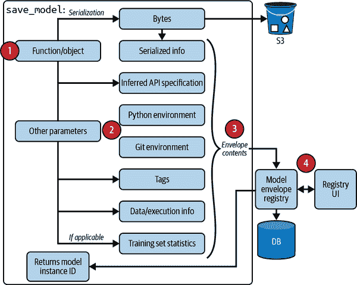

# 第十章：MLOps 的基础设施和工具

在第四章到第六章中，我们讨论了开发机器学习系统的逻辑。在第七章到第九章中，我们讨论了部署、监控和持续更新机器学习系统的考虑因素。直到现在，我们假设机器学习从业者能够获取实施这些逻辑和考虑因素所需的所有工具和基础设施。然而，这一假设远非事实。许多数据科学家告诉我，他们知道为其机器学习系统做正确的事情，但由于他们的基础设施没有以使其能够这样做的方式设置，他们无法做到这一点。

机器学习系统是复杂的。系统越复杂，良好的基础设施就能带来的好处就越多。正确设置的基础设施可以帮助自动化流程，减少对专业知识和工程时间的需求。这反过来可以加快机器学习应用程序的开发和交付，减少错误的表面积，并支持新的使用案例。然而，如果基础设施设置错误，使用起来将非常痛苦且昂贵。在本章中，我们将讨论如何为机器学习系统正确设置基础设施。

在我们深入讨论之前，重要的是要注意，每家公司的基础设施需求各不相同。您所需的基础设施取决于您开发的应用程序数量以及应用程序的专业程度。在光谱的一端，有些公司将机器学习用于临时的业务分析，例如预测他们明年新用户的数量以在季度计划会议上展示。这些公司可能不需要投资任何基础设施——Jupyter Notebooks、Python 和 Pandas 将成为它们最好的朋友。如果您只有一个简单的机器学习用例，例如用于对象检测的 Android 应用程序以展示给您的朋友，您可能也不需要任何基础设施——您只需要一个兼容 Android 的机器学习框架，比如 TensorFlow Lite。

在另一端，有些公司致力于具有独特需求的应用。例如，自动驾驶汽车有独特的准确性和延迟要求——算法必须能在毫秒内响应，并且其准确性必须接近完美，因为错误的预测可能导致严重事故。类似地，谷歌搜索具有独特的规模需求，因为大多数公司不会像谷歌那样处理每秒 63,000 个搜索查询，这相当于每小时 2.34 亿个搜索查询。¹ 这些公司可能需要开发自己的高度专业化基础设施。谷歌为搜索开发了大部分内部基础设施；特斯拉和 Waymo 等自动驾驶汽车公司也是如此。² 通常，专业化基础设施的一部分后来会被公开，并被其他公司采纳。例如，谷歌将其内部云基础设施扩展到公众领域，形成了[Google Cloud Platform](https://oreil.ly/0g02L)。

在中等规模的公司中，有大多数使用机器学习应用于多个常见应用领域——欺诈检测模型、价格优化模型、客户流失预测模型、推荐系统等——在合理的规模下。所谓的“合理规模”是指那些每天处理以千兆字节和太字节为单位的数据，而不是百拍字节的公司。他们的数据科学团队可能由 10 至数百名工程师组成。³ 这个类别可能包括从 20 人的初创公司到像 Zillow 这样的公司，但不包括像 FAAAM 这样的公司。⁴ 例如，回顾 2018 年，Uber 每天向他们的数据湖添加数十太字节的数据，而 Zillow 最大的数据集每天引入 2 太字节的未压缩数据。⁵ 相比之下，即使在 2014 年，Facebook 每天也生成*4 百拍字节*的数据。⁶

中等规模的公司可能会受益于越来越标准化的通用机器学习基础设施（参见图 10-1）。本书将重点讨论绝大多数中等规模机器学习应用的基础设施。


###### 图 10-1\. 不同生产规模公司的基础设施需求

为了为您的需求设置正确的基础设施，理解基础设施的确切含义及其组成非常重要。根据维基百科，在物理世界中，“基础设施是支持家庭和企业可持续功能的基本设施和系统。”⁷ 在机器学习世界中，基础设施是支持机器学习系统开发和维护的基本设施集合。什么被认为是“基本设施”在不同公司之间差异很大，正如本章前面讨论的那样。在本节中，我们将讨论以下四个层次：

存储与计算

存储层是数据收集和存储的地方。计算层提供运行机器学习工作负载所需的计算资源，例如训练模型、计算特征、生成特征等。

资源管理

资源管理包括调度和编排工具，以充分利用您可用的计算资源。这一类工具的例子包括 Airflow、Kubeflow 和 Metaflow。

ML 平台

这些工具提供了帮助开发机器学习应用程序的工具，例如模型存储、特征存储和监控工具。这一类工具的例子包括 SageMaker 和 MLflow。

开发环境

这通常被称为开发环境；这是编写代码和运行实验的地方。代码需要进行版本管理和测试。实验需要进行跟踪。

这四个不同的层次显示在图 10-2 中。数据和计算是任何机器学习项目所需的基本资源，因此*存储和计算层*构成了任何希望应用机器学习的公司的基础设施基础。对数据科学家来说，这一层次也是最抽象的。我们将首先讨论这一层，因为这些资源最容易解释。


###### 图 10-2\. 机器学习基础设施的不同层次

开发环境是数据科学家每天必须与之交互的环境，因此对他们来说是最具体的。我们接下来将讨论这一类别，然后我们将讨论资源管理，这是数据科学家中争议较大的话题——人们仍在争论数据科学家是否需要了解这一层。因为“ML 平台”是一个相对新的概念，其不同的组件仍在成熟阶段，所以我们将在熟悉了所有其他类别之后，最后讨论这一类别。ML 平台需要公司的前期投资，但如果做得正确，它可以大大简化公司各业务用例中数据科学家的工作。

即使两家公司有完全相同的基础设施需求，根据它们在建设与购买决策方面的方法不同，它们得到的基础设施可能看起来会有所不同。我们将在本章的最后部分讨论建设与购买决策，同时也会讨论 ML 基础设施的标准化和统一抽象的希望。

让我们深入讨论吧！

# 存储与计算

ML 系统处理大量数据，这些数据需要存储在某个地方。*存储层* 是数据收集和存储的地方。在其最简单的形式下，存储层可以是硬盘驱动器（HDD）或固态硬盘（SSD）。存储层可以在一个地方，例如，你可能把所有数据存储在 Amazon S3 或 Snowflake 中，或分布在多个位置。⁸ 你的存储层可以是在私有数据中心的本地环境中，也可以是云上的。过去，公司可能试图管理自己的存储层。然而，在过去的十年里，存储层大多数已经被商品化并移到了云端。数据存储变得如此便宜，以至于大多数公司都会存储所有他们拥有的数据而不计成本。⁹ 我们在第三章中已经深入探讨了数据层，因此在本章中，我们将专注于计算层。

*计算层* 指的是公司可以访问的所有计算资源及其使用这些资源的机制。可用的计算资源量决定了工作负载的可扩展性。你可以把计算层看作是执行作业的引擎。在其最简单的形式下，计算层可以仅是一个单独的 CPU 核心或 GPU 核心来执行所有的计算任务。它最常见的形式是由云提供商管理的云计算，如 AWS Elastic Compute Cloud (EC2)或 GCP。

计算层通常可以分割成较小的计算单元以供并发使用。例如，一个 CPU 核心可以支持两个并发线程；每个线程作为计算单元执行自己的作业。或者多个 CPU 核心可以组合在一起形成一个更大的计算单元来执行更大的作业。可以为特定的短暂作业（例如 AWS Step Function 或 GCP Cloud Run）创建一个计算单元——该单元在作业完成后将被清除。也可以创建一个更“永久”的计算单元，例如虚拟机，不绑定于任何作业。更“永久”的计算单元有时被称为“实例”。

然而，计算层并不总是使用线程或核心作为计算单元。有些计算层抽象了核心的概念，并使用其他的计算单元。例如，像 Spark 和 Ray 这样的计算引擎使用“作业”作为它们的计算单元，而 Kubernetes 使用“Pod”作为最小的可部署单元，它是容器的一种封装。虽然你可以在一个 Pod 中有多个容器，但你不能独立地启动或停止同一个 Pod 中的不同容器。

要执行一个作业，你首先需要将所需的数据加载到计算单元的内存中，然后执行所需的操作——如加法、乘法、除法、卷积等。例如，要对两个数组进行加法，你首先需要将这两个数组加载到内存中，然后在这两个数组上执行加法运算。如果计算单元的内存不足以加载这两个数组，那么在没有处理内存溢出的算法的情况下，这个操作将是不可能的。因此，一个计算单元主要通过两个度量来进行特征化：它的内存容量以及它运行操作的速度。

内存度量可以使用 GB 等单位来指定，通常很容易评估：一个具有 8 GB 内存的计算单元可以在内存中处理比只有 2 GB 内存的计算单元更多的数据，并且通常更昂贵。一些公司不仅关心计算单元的内存容量，还关心加载数据进出内存的速度，因此一些云服务提供商宣传他们的实例具有“高带宽内存”或指定他们实例的 I/O 带宽。

运算速度是一个更具争议性的问题。最常见的度量标准是 FLOPS（每秒浮点运算次数）。顾名思义，这个度量标准表示计算单元每秒可以运行的浮点运算次数。你可能会看到硬件供应商宣传他们的 GPU、TPU 或 IPU（智能处理单元）拥有 TeraFLOPS（一万亿 FLOPS）或其他大量 FLOPS 的数据。

然而，这个度量标准是有争议的，首先，衡量此度量标准的公司可能对什么算作一个操作有不同的理解。例如，如果一台机器将两个操作融合成一个并执行这个融合操作，¹¹ 这算作一个操作还是两个操作？其次，仅仅因为一个计算单元能够执行一万亿次 FLOPS，并不意味着你能以一万亿 FLOPS 的速度执行你的作业。作业可以运行的 FLOPS 数量与计算单元能够处理的 FLOPS 数量的比率被称为利用率。¹² 如果一个实例能够做一百万次 FLOPS，而你的作业以 0.3 百万次 FLOPS 运行，那就是 30% 的利用率。当然，你希望将利用率尽可能提高，但是几乎不可能达到 100% 的利用率。根据硬件后端和应用程序，50% 的利用率可能被认为是好的或者是坏的。利用率还取决于你能够多快地将数据加载到内存中以执行下一个操作——这也解释了 I/O 带宽的重要性。¹³

在评估新的计算单元时，评估这个计算单元完成常见工作负载所需的时间是很重要的。例如，[MLPerf](https://oreil.ly/XuVka) 是一个流行的基准测试，用于硬件供应商衡量其硬件性能，展示其硬件在 ImageNet 数据集上训练 ResNet-50 模型或使用 BERT-large 模型生成 SQuAD 数据集预测所需的时间。

想到 FLOPS 并不是很有用，为了简化事情，在评估计算性能时，很多人只关注计算单元的核心数。因此，你可能会选择一个有 4 个 CPU 核心和 8 GB 内存的实例。请记住，AWS 使用 vCPU 的概念，代表虚拟 CPU，对于实际目的而言，可以视为半个物理核心。¹⁴ 你可以查看一些 AWS EC2 和 GCP 实例提供的核心数和内存情况，请参见 Figure 10-3。


###### 图 10-3\. AWS 和 GCP 上可用的 GPU 和 TPU 实例示例（截至 2022 年 2 月）。来源：AWS 和 GCP 网站的截图

## 公共云与私有数据中心

与数据存储类似，计算层主要是商品化的。这意味着公司可以支付像 AWS 和 Azure 这样的云服务提供商，按照他们实际使用的计算量付费，而不是为存储和计算设立自己的数据中心。云计算使得公司能够轻松开始构建而无需担心计算层。对于那些工作负载大小可变的公司来说尤为吸引。想象一下，如果你的工作负载一年中有一天需要 1000 个 CPU 核心，而其余时间只需要 10 个 CPU 核心。如果建立自己的数据中心，你需要一开始就支付 1000 个 CPU 核心的费用。而使用云计算，你只需在一年中的一天支付 1000 个 CPU 核心的费用，其余时间支付 10 个 CPU 核心的费用。能够根据需要添加更多计算资源或关闭实例非常便利，大多数云提供商甚至可以自动执行这些操作，从而减少工程运营的开销。这在机器学习中特别有用，因为数据科学工作负载是爆发性的。在开发过程中，数据科学家倾向于连续几周运行实验，这需要大量计算能力。在生产阶段，工作负载则更加稳定。

请记住，云计算是弹性的，但并非神奇。它实际上并没有无限的计算能力。大多数云服务提供商在同时使用计算资源方面都设有[限制](https://oreil.ly/TzUOv)。其中一些限制可以通过申请来解除。例如，截至撰写本书时，AWS EC2 的最大实例是[X1e](https://oreil.ly/29lsT)，拥有 128 个 vCPU 和将近 4TB 内存。¹⁵ 拥有大量计算资源并不意味着始终能轻松使用它们，尤其是在需要利用抢占式实例节省成本的情况下。¹⁶

由于云计算的弹性和易用性，越来越多的公司选择支付云服务费用，而不是建设和维护自己的存储和计算层。Synergy Research Group 的研究显示，2020 年，“企业在云基础设施服务上的支出增长了 35%，达到了近 1300 亿美元”，而“数据中心的企业支出下降了 6%，不足 900 亿美元”，如图 10-4 所示。¹⁷


###### 图 10-4。2020 年，企业在云基础设施服务上的支出增长了 35%，而在数据中心的支出下降了 6%。资料来源：根据 Synergy Research Group 的图片调整。

尽管利用云计算在公司初期比自建存储和计算层带来更高的回报，但随着公司规模的增长，这种优势变得不那么具有防御性。根据公开软件公司披露的云基础设施支出，风险投资公司 a16z 指出，云计算支出约占这些公司**营业成本的 50%**。¹⁸

云端的高成本促使公司开始将其工作负载迁移回自己的数据中心，这个过程被称为“云端收归”。[Dropbox 在 2018 年的 S-1 文件](https://oreil.ly/zRm9j) 显示，该公司通过基础设施优化大规模改革，节省了 IPO 前两年的 7500 万美元——其中大部分是将其工作负载从公共云迁移到自己的数据中心。云端的高成本是否是独特于 Dropbox，因为 Dropbox 是数据存储业务？并非完全如此。在上述分析中，a16z 估计，“在当前利用云基础设施的 50 家顶级公共软件公司中，由于云端对利润率的影响，它们的市值损失达到了约 1000 亿美元。”¹⁹

尽管开始使用云端服务很容易，但是远离云端却很困难。云端收归需要在商品和工程工作上做出重大的前期投资。越来越多的公司正在采取混合方法：将大部分工作负载保留在云端，但逐渐增加在数据中心的投资。

# 开发环境

开发环境是机器学习工程师编写代码、运行实验并与部署冠军模型和评估挑战者模型的生产环境进行交互的地方。开发环境包括以下组件：集成开发环境（IDE）、版本控制和持续集成/持续交付（CI/CD）。

如果你是一名每天编写代码的数据科学家或机器学习工程师，你可能对所有这些工具非常熟悉，可能会想知道还有什么可以说的。根据 Ville Tuulos 在他的书 *Effective Data Science Infrastructure* 中的说法，“你会惊讶地知道有多少公司拥有良好调优、可扩展的生产基础设施，但在开发、调试和测试代码的问题上却采取了临时性的解决方案。”²²

他建议，“如果你只有时间来好好设置一个基础设施，那就让它成为数据科学家的开发环境。” 因为开发环境是工程师工作的地方，开发环境的改进直接转化为工程生产力的提升。

在本节中，我们首先将介绍开发环境的不同组件，然后讨论开发环境的标准化，最后再讨论如何通过容器将您的更改从开发环境带入生产环境。

## 开发环境设置

开发环境应该设置包含所有可以使工程师工作更轻松的工具。它还应包括用于*版本控制*的工具。截至撰写本文时，公司使用一套特定的工具来对其 ML 工作流进行版本控制，例如使用 Git 进行代码版本控制，使用 DVC 对数据进行版本控制，使用 Weights & Biases 或 Comet.ml 来跟踪开发过程中的实验，以及使用 MLflow 来跟踪模型部署时的工件。Claypot AI 正在开发一个平台，可以帮助您在一个地方版本化和跟踪所有的 ML 工作流。对于任何软件工程项目来说，版本控制都非常重要，但对于 ML 项目来说更是如此，因为您可以改变的东西（代码、参数、数据本身等）数量庞大，并且需要跟踪以复制后续运行的先前运行。我们在章节“实验跟踪和版本控制”中已经讨论过这一点。

开发环境还应该设置一个*CI/CD*测试套件，以在推送到暂存或生产环境之前测试您的代码。用于编排您的 CI/CD 测试套件的工具示例包括 GitHub Actions 和 CircleCI。因为 CI/CD 是一个软件工程问题，它超出了本书的范围。

在本节中，我们将专注于工程师编写代码的地方：IDE。

### IDE

*IDE* 是您编写代码的编辑器。IDE 通常支持多种编程语言。IDE 可以是像 VS Code 或 Vim 这样的本地应用程序。IDE 也可以是基于浏览器的，这意味着它们在浏览器中运行，比如 AWS Cloud9。

许多数据科学家不仅在 IDE 中编写代码，还在 Jupyter Notebooks 和 Google Colab 这样的笔记本中编写代码。²³ 笔记本不仅仅是编写代码的地方。您可以包含任意的工件，如图像、图表、以及漂亮的表格格式的数据等，这使得笔记本在探索性数据分析和分析模型训练结果方面非常有用。

笔记本有一个很好的特性：它们是有状态的——在运行后可以保留状态。如果您的程序中途失败，您可以重新从失败的步骤运行，而不必重新从头运行程序。这在处理可能需要长时间加载的大型数据集时特别有帮助。使用笔记本，您只需加载数据一次——笔记本可以在内存中保留这些数据——而不必每次运行代码时都加载它。如图 10-5，如果您在笔记本的步骤 4 中代码失败，您只需重新运行步骤 4，而不是从程序开始处重新运行。


###### 图 10-5\. 在 Jupyter Notebooks 中，如果步骤 4 失败了，您只需再次运行步骤 4，而不是必须重新运行步骤 1 到 4。

请注意，这种状态性可能是一把双刃剑，因为它允许您无序执行单元格。例如，在普通脚本中，单元格 4 必须在单元格 3 之后运行，而单元格 3 必须在单元格 2 之后运行。然而，在笔记本中，您可以按顺序运行单元格 2、3、然后 4，或者单元格 4、3、然后 2。这使得笔记本的可重现性更加困难，除非您的笔记本附带运行单元格顺序的说明。克里斯·奥尔本通过一个笑话捕捉到了这种困难（参见图 10-6）。


###### 图 10-6\. 笔记本的状态性允许您无序执行单元格，使得重现笔记本变得困难

由于笔记本在数据探索和实验中非常有用，它们已经成为数据科学家和机器学习不可或缺的工具。一些公司已经将笔记本作为其数据科学基础设施的核心。在他们的重要文章《超越互动：Netflix 的笔记本创新》中，Netflix 包括了一系列基础设施工具，可以用来使笔记本更加强大。²⁴ 列表包括：

[Papermill](https://oreil.ly/569ot)

用于生成具有不同参数集的多个笔记本——例如，当您希望使用不同参数集运行不同实验并并行执行时。它还可以帮助总结一系列笔记本的指标。

[Commuter](https://oreil.ly/dFlYV)

一个笔记本中心，用于在组织内查看、查找和共享笔记本。

另一个旨在改善笔记本体验的有趣项目是[nbdev](https://nbdev.fast.ai)，这是一个建立在 Jupyter Notebooks 之上的库，鼓励您在同一地方编写文档和测试。

## 标准化开发环境

关于开发环境的第一件事是，它应该是标准化的，如果不是公司范围内，至少应该是团队范围内。我们将讲述一个故事来理解什么是标准化开发环境以及为什么需要它。

在我们创业初期，每个人都从自己的电脑上工作。我们有一个 bash 文件，新团队成员可以运行它来创建一个新的虚拟环境——在我们的情况下，我们使用 conda 来创建虚拟环境——并安装运行我们代码所需的包。所需包的列表是我们不断添加的旧*requirements.txt*。有时候，我们中的某个人会懒惰，只是添加了一个包的名称（例如`torch`），而没有指定包的版本（例如`torch==1.10.0+cpu`）。偶尔，一个新的拉取请求在我的电脑上运行良好，但在另一个同事的电脑上却不行，²⁵ 我们通常很快就发现，这是因为我们使用了不同版本的同一个包。我们决定，每次向*requirements.txt*添加新包时，总是同时指定包名称和包版本，这样就消除了很多不必要的头疼。

有一天，我们遇到了一个奇怪的 bug，只在某些运行时出现而不在其他运行时出现。我让我的同事去调查，但他无法重现这个 bug。我告诉他这个 bug 只会偶尔出现，所以他可能需要运行代码大约 20 次来确认。他运行了 20 次代码，仍然没有发现任何问题。我们比较了我们的包，一切都匹配。经过几个小时的令人头痛的挫折后，我们发现这是一个并发问题，只有在 Python 版本 3.8 或更早版本中才会出现问题。我使用的是 Python 3.8，而我的同事使用的是 Python 3.9，所以他没有看到这个 bug。我们决定让所有人都使用相同的 Python 版本，这消除了更多的头痛。

然后有一天，我的同事换了一台新笔记本电脑。那是一台搭载当时新款 M1 芯片的 MacBook。他试图在这台新笔记本电脑上按照我们的设置步骤进行设置，但遇到了困难。那是因为 M1 芯片是新的，而我们使用的一些工具，包括 Docker，与 M1 芯片的兼容性还不够好。在看到他一整天都在为设置环境而苦苦挣扎后，我们决定转向云开发环境。这意味着我们仍然标准化虚拟环境、工具和包，但现在每个人都使用由云提供商提供的相同类型的虚拟环境、工具和包。

使用云开发环境时，您可以选择具备云 IDE 的云开发环境，如[AWS Cloud9](https://oreil.ly/xFEZx)（不含内置笔记本）和[Amazon SageMaker Studio](https://oreil.ly/m1yFZ)（带有托管的 JupyterLab）。截至撰写本书时，Amazon SageMaker Studio 似乎比 Cloud9 更广泛使用。然而，我认识的大多数使用云 IDE 的工程师是通过在他们的云实例上安装喜爱的 IDE（如 Vim）来使用的。

更受欢迎的选项是使用具备本地集成开发环境的云开发环境。例如，您可以在计算机上安装 VS Code，并通过安全协议如 SSH 将本地 IDE 连接到云环境。

虽然一般认为工具和包应该标准化，但一些公司对标准化 IDE 持怀疑态度。工程师可能会对 IDE 产生情感依恋，并有人竭力捍卫他们所选择的 IDE²⁶，因此强迫每个人使用同一种 IDE 是很难的。然而，多年来，一些 IDE 已经成为最受欢迎的选择。其中，VS Code 是一个不错的选择，因为它可以轻松集成云开发实例。

在我们的创业公司，我们选择了[GitHub Codespaces](https://oreil.ly/bQdUW)作为我们的云开发环境，但 AWS EC2 或可以通过 SSH 访问的 GCP 实例也是一个不错的选择。在转移到云环境之前，和许多其他公司一样，我们担心成本——如果我们忘记在不使用时关闭实例会怎么样？然而，这种担忧因为两个原因而消失了。首先，像 GitHub Codespaces 这样的工具在 30 分钟不活动后会自动关闭你的实例。其次，有些实例价格非常便宜。例如，一个具有 4 个 vCPU 和 8GB 内存的 AWS 实例每小时约$0.1，如果你从不关闭它，一个月的费用大约为$73。因为工程时间很宝贵，如果云开发环境可以帮助你每月节省几小时的工程时间，对许多公司来说是值得的。

从本地开发环境迁移到云开发环境还有很多其他好处。首先，它极大地简化了 IT 支持——想象一下，要支持 1000 台不同的本地机器，而不是只需要支持一种云实例。其次，它对于远程工作非常方便——你可以从任何计算机上通过 SSH 访问你的开发环境。第三，云开发环境可以帮助提升安全性。例如，如果某位员工的笔记本被盗，你可以立即取消该笔记本对云实例的访问权限，以防止窃贼访问你的代码库和专有信息。当然，一些公司可能由于安全顾虑而无法转移到云开发环境。例如，他们不允许将他们的代码或数据存储在云上。

第四个好处，我认为对于在云上进行生产的公司来说是最大的好处，就是将开发环境放在云端可以缩小开发环境和生产环境之间的差距。如果你的生产环境在云端，将开发环境移到云端就是理所当然的事情。

偶尔，公司不得不将他们的开发环境转移到云端，不仅因为它的好处，更是因为必要性。对于那些数据无法下载或存储在本地机器上的用例，唯一的访问途径是通过可以从 S3 读取数据的云笔记本（SageMaker Studio），前提是它具备适当的权限。

当然，并非每家公司都适合使用云开发环境，可能是因为成本、安全性或其他原因。设置云开发环境也需要一些初期投资，你可能需要教育你的数据科学家关于云卫生学，包括建立安全连接到云、安全合规性或避免浪费的云使用等方面。然而，标准化开发环境可能会让你的数据科学家生活更轻松，并在长远节省资金。

## 从开发到生产：容器

在开发过程中，您可能通常会使用固定数量的机器或实例（通常是一个），因为您的工作负载不会波动很大——您的模型不会突然从每小时仅处理 1,000 个请求变成每小时处理 1 百万个请求。

另一方面，生产服务可能分布在多个实例上。实例数量根据传入的工作负载不时地变化，有时可能是不可预测的。例如，一位名人在推特上发表了关于您新兴应用程序的推文，突然间您的流量增加了 10 倍。您将需要根据需要打开新实例，并且这些实例需要设置所需的工具和包以执行您的工作负载。

以前，您必须自己启动和关闭实例，但大多数公共云提供商已经负责自动缩放部分。但是，您仍然需要担心设置新实例。

当您始终使用同一个实例时，您可以一次安装依赖项，并在每次使用此实例时重复使用它们。在生产环境中，如果根据需要动态分配实例，您的环境本质上是无状态的。当为您的工作负载分配一个新实例时，您将需要使用预定义指令列表安装依赖项。

一个问题是：如何在任何新实例上重新创建环境？容器技术——其中 Docker 是最流行的——就是为了回答这个问题而设计的。使用 Docker，您可以创建一个 Dockerfile，其中包含逐步说明如何重新创建能够运行您的模型的环境的指令：安装这个包，下载这个预训练模型，设置环境变量，进入文件夹等等。这些指令使得任何地方的硬件都能运行您的代码。

Docker 中的两个关键概念是镜像和容器。运行 Dockerfile 中的所有指令会生成一个 Docker 镜像。如果运行此 Docker 镜像，则会得到一个 Docker 容器。您可以将 Dockerfile 视为构建模具的配方，而这个模具就是 Docker 镜像。从这个模具中，您可以创建多个运行实例，每个实例都是一个 Docker 容器。

您可以从头开始构建 Docker 镜像，也可以从另一个 Docker 镜像开始构建。例如，NVIDIA 可能提供一个包含 TensorFlow 和所有必要库以优化 TensorFlow 用于 GPU 的 Docker 镜像。如果您想构建一个在 GPU 上运行 TensorFlow 的应用程序，使用这个 Docker 镜像作为基础，并在此基础镜像之上安装特定于您的应用程序的依赖项，是一个不错的选择。

容器注册表是您可以共享 Docker 镜像或查找其他人创建并公开或仅在其组织内分享的镜像的地方。常见的容器注册表包括 Docker Hub 和 AWS ECR（Elastic Container Registry）。

这里有一个简单的 Dockerfile 示例，展示了以下指令的运行方式。此示例旨在概述 Dockerfile 的工作原理，并非可执行示例。

1.  下载最新的 PyTorch 基础镜像。

1.  在 GitHub 上克隆 NVIDIA 的 apex 仓库，导航到新创建的*apex*文件夹，并安装 apex。

1.  将*fancy-nlp-project*设为工作目录。

1.  在 GitHub 上克隆 Hugging Face 的 transformers 仓库，导航到新创建的*transformers*文件夹，并安装 transformers。

```
FROM pytorch/pytorch:latest
RUN git clone https://github.com/NVIDIA/apex
RUN cd apex && \
    python3 setup.py install && \
    pip install -v --no-cache-dir --global-option="--cpp_ext" \
    --global-option="--cuda_ext" ./

WORKDIR /fancy-nlp-project
RUN git clone https://github.com/huggingface/transformers.git && \
    cd transformers && \
    python3 -m pip install --no-cache-dir.
```

如果你的应用程序有趣的功能，你可能需要多个容器。考虑这样一个情况，你的项目包含快速运行但需要大量内存的特征化代码，以及运行速度较慢但需要较少内存的模型训练代码。如果你在同一 GPU 实例上运行代码的两个部分，你将需要具有高内存的 GPU 实例，这可能非常昂贵。相反，你可以在 CPU 实例上运行特征化代码，并在 GPU 实例上运行模型训练代码。这意味着你需要一个用于特征化和另一个用于训练的容器。

当你的流水线中的不同步骤有冲突的依赖关系时，可能需要不同的容器，例如，你的特征提取代码需要 NumPy 0.8，但你的模型需要 NumPy 1.0。

如果你有 100 个微服务，每个微服务都需要自己的容器，你可能会同时运行 100 个容器。手动构建、运行、分配资源和停止 100 个容器可能是一项痛苦的工作。一个帮助你管理多个容器的工具称为容器编排。Docker Compose 是一种轻量级容器编排器，可以在单个主机上管理容器。

然而，每个容器可能在自己的主机上运行，这正是 Docker Compose 的极限所在。Kubernetes（K8s）正是解决这个问题的工具。K8s 为容器创建了一个通信和共享资源的网络。它可以帮助你在需要更多计算/内存时在更多实例上启动容器，并在不再需要时关闭容器，同时帮助维持系统的高可用性。

Kubernetes（K8s）是 2010 年代增长最快的技术之一。自 2014 年推出以来，它已经普及到今天的生产系统中。Jeremy Jordan 为那些有兴趣了解更多的读者提供了一个关于[K8s 的介绍](https://oreil.ly/QLAC3)。然而，K8s 并不是最适合数据科学家的工具，关于如何将数据科学工作负载迁移出 K8s 已经进行了多次讨论。²⁷我们将在下一节更深入地讨论 K8s。

# 资源管理

在云计算出现之前（甚至是今天仍然在自己维护数据中心的公司），存储和计算资源是有限的。当时的资源管理围绕如何充分利用有限资源展开。增加一个应用程序的资源可能意味着减少其他应用程序的资源，并且需要复杂的逻辑来最大化资源利用，即使这意味着需要更多的工程时间。

然而，在云计算世界中，存储和计算资源更具弹性，关注点已从如何最大化资源利用转向如何成本有效地使用资源。向应用程序添加更多资源并不意味着减少其他应用程序的资源，这显著简化了分配挑战。许多公司可以接受向应用程序添加更多资源，只要增加的成本能够通过回报（例如额外的收入或节省的工程时间）来证明是合理的。

在大多数地区，工程师的时间比计算时间更宝贵，只要能帮助工程师提高生产力，公司通常可以接受使用更多资源。这意味着对公司来说，投资于自动化其工作负载可能是有意义的，尽管这可能使得使用资源的效率低于手动规划工作负载，但可以使工程师有更高的回报。通常，如果一个问题可以通过使用更多非人力资源（例如投入更多计算资源）或使用更多人力资源（例如需要更多工程时间进行重新设计）来解决，第一种解决方案可能更可取。

在本节中，我们将讨论如何管理 ML 工作流的资源。我们将重点放在基于云的资源上；然而，讨论的思想也可以适用于私有数据中心。

## Cron、调度器和编排器

ML 工作流的两个关键特征影响其资源管理：重复性和依赖性。

在本书中，我们已经详细讨论了如何开发 ML 系统是一个迭代过程。同样，ML 工作负载很少是一次性操作，而是重复的。例如，您可能每周训练一个模型或每四个小时生成一批新的预测。可以通过可用资源顺利且成本有效地安排和编排这些重复过程。

定期安排重复作业在固定时间运行正是*cron*所做的。这也是 cron 的全部功能：在预定时间运行脚本，并告诉你作业是否成功或失败。它不关心运行的作业之间的依赖关系——你可以用 cron 在作业 B 之后运行作业 A，但不能安排像在 A 成功后运行 B，A 失败后运行 C 这样复杂的事情。

这将我们带到第二个特征：依赖性。ML 工作流程中的步骤可能彼此之间具有复杂的*依赖关系*。例如，ML 工作流可能包括以下步骤：

1.  从数据仓库中提取上周的数据。

1.  从这些提取的数据中提取特征。

1.  对提取的特征训练两个模型 A 和 B。

1.  在测试集上比较 A 和 B。

1.  如果 A 更好，则部署 A；否则部署 B。

每一步都依赖于前一步的成功。第五步是我们所说的条件依赖：这一步的操作取决于前一步的结果。这些步骤的执行顺序和依赖关系可以用图形表示，如图 10-7 所示。


###### 图 10-7\. 一个显示简单 ML 工作流程执行顺序的图表，本质上是一个 DAG（有向无环图）。

许多读者可能会认识到图 10-7 是一个 DAG：有向无环图。它必须是有向的以表达步骤之间的依赖关系。它不能包含循环，因为如果有循环，作业将永远运行下去。DAG 是一种通用的表示计算工作流的方式，不仅适用于机器学习工作流。大多数工作流管理工具要求您以 DAG 的形式指定工作流程。

*调度程序*是可以处理依赖关系的 cron 程序。它接受工作流的 DAG 并相应地安排每个步骤的调度。您甚至可以根据基于事件的触发器安排启动作业，例如，每当事件 X 发生时启动作业。调度程序还允许您指定作业失败或成功时的操作，例如，如果作业失败，重试多少次后放弃。

调度程序倾向于利用队列来跟踪作业。作业可以被排队、优先级排序并分配所需的执行资源。这意味着调度程序需要了解可用资源以及每个作业运行所需的资源——在调度作业时，需要指定这些资源选项或由调度程序估算。例如，如果一个作业需要 8 GB 的内存和两个 CPU，调度程序需要在管理的资源中找到一个具有 8 GB 内存和两个 CPU 的实例，并等待直到该实例不在执行其他作业时运行此作业。

下面是如何使用流行的调度程序 Slurm 调度作业的示例，其中您可以指定作业名称、执行作业所需的时间以及为作业分配的内存和 CPU 数量：

```
#!/bin/bash
#SBATCH -J JobName
#SBATCH --time=11:00:00       # When to start the job
#SBATCH --mem-per-cpu=4096   # Memory, in MB, to be allocated per CPU
#SBATCH --cpus-per-task=4          # Number of cores per task
```

由于调度程序掌握了可用资源、要运行的作业以及每个作业运行所需的资源信息，因此调度程序还应优化资源利用。然而，用户指定的资源数量并不总是正确的。例如，我可能估计并因此指定一个作业需要 4 GB 的内存，但实际上这个作业只需要 3 GB 内存，或者在峰值时需要 4 GB 内存，其他时间只需要 1–2 GB 内存。像谷歌的 Borg 这样的高级调度程序估计作业实际需要的资源量，并回收未使用的资源供其他作业使用，进一步优化资源利用。²⁸

要设计一个通用的调度器是很难的，因为这个调度器需要能够管理几乎任意数量的并发机器和工作流程。如果你的调度器出现问题，那么它触及的每一个工作流程都会被中断。

如果调度器关注于何时运行作业以及运行这些作业所需的资源，编排器关注于从何处获取这些资源。调度器处理作业类型的抽象，如 DAGs、优先级队列、用户级配额（即用户在给定时间内可以使用的最大实例数）等。编排器处理较低级别的抽象，如机器、实例、集群、服务级别分组、复制等。如果编排器注意到作业比可用实例池中的实例更多，它可以增加可用实例池中的实例数。我们说它“配置”更多计算机来处理工作负载。调度器通常用于周期性作业，而编排器通常用于具有长时间运行服务器以响应请求的服务。

当今最著名的编排器无疑是 Kubernetes，即我们在“从开发到生产：容器”部分讨论过的容器编排器。K8s 可以在本地使用（甚至可以通过 minikube 在您的笔记本电脑上使用）。然而，我从未遇到过喜欢设置自己 K8s 集群的人，所以大多数公司使用由云提供商管理的托管服务，如 AWS 的 Elastic Kubernetes Service (EKS) 或 Google 的 Kubernetes Engine (GKE)。

许多人将调度器和编排器交替使用，因为调度器通常在编排器的顶部运行。像 Slurm 和 Google 的 Borg 这样的调度器具有一定的编排能力，而像 HashiCorp 的 Nomad 和 K8s 这样的编排器则带有一定的调度能力。但是你可以拥有单独的调度器和编排器，例如在 Kubernetes 上运行 Spark 的作业调度器或在 EKS 上运行 AWS Batch 调度器。像 HashiCorp 的 Nomad 和专门用于数据科学的编排器，包括 Airflow、Argo、Prefect 和 Dagster，都有它们自己的调度器。

## 数据科学工作流管理

我们已经讨论了调度器和编排器之间的区别，以及它们如何用于通用的工作流程执行。熟悉数据科学特定工具如 Airflow、Argo、Prefect、Kubeflow、Metaflow 等的读者可能会想知道它们在调度器与编排器讨论中的定位。我们将在这里详细讨论这个话题。

在其最简单的形式下，工作流管理工具管理工作流程。它们通常允许您将工作流程指定为 DAGs，类似于 图 10-7 中的图表。一个工作流可能包括特征提取步骤、模型训练步骤和评估步骤。工作流可以使用代码（Python）或配置文件（YAML）定义。工作流中的每个步骤称为任务。

几乎所有的工作流管理工具都带有一些调度器，因此，你可以将它们视为调度器，而不是专注于单个作业，而是专注于整个工作流。一旦定义了工作流，底层调度器通常与编排器一起工作，分配资源来运行工作流，如图 10-8 所示。


###### 图 10-8。在定义工作流之后，这个工作流中的任务被调度和编排。

在网上有很多文章比较不同的数据科学工作流管理工具。在本节中，我们将介绍五种最常见的工具：Airflow、Argo、Prefect、Kubeflow 和 Metaflow。本节不旨在全面比较这些工具，而是为你介绍工作流管理工具可能需要的不同功能。

Airflow 最初是在 Airbnb 开发，并于 2014 年发布，是最早的工作流编排器之一。它是一个了不起的任务调度器，配有大量的操作器库，可以轻松地在不同的云提供商、数据库、存储选项等中使用 Airflow。Airflow 是“配置即代码”原则的支持者。它的创作者认为数据工作流程复杂，应该使用代码（Python）而不是 YAML 或其他声明性语言来定义。这里有一个 Airflow 工作流的示例，来自平台的[GitHub 仓库](https://oreil.ly/Ubgf1)：

```
from datetime import datetime, timedelta

from airflow import DAG
from airflow.operators.bash import BashOperator
from airflow.providers.docker.operators.docker import DockerOperator

dag = DAG(
    'docker_sample',
    default_args={'retries': 1},
    schedule_interval=timedelta(minutes=10),
    start_date=datetime(2021, 1, 1),
    catchup=False,
)

t1 = BashOperator(task_id='print_date', bash_command='date', dag=dag)
t2 = BashOperator(task_id='sleep', bash_command='sleep 5', retries=3, dag=dag)
t3 = DockerOperator(
    docker_url='tcp://localhost:2375',  # Set your docker URL
    command='/bin/sleep 30',
    image='centos:latest',
    network_mode='bridge',
    task_id='docker_op_tester',
    dag=dag,
)

t4 = BashOperator(
    task_id='print_hello', 
    bash_command='echo "hello world!!!"', 
    dag=dag
)

t1 >> t2
t1 >> t3
t3 >> t4   

```

然而，由于 Airflow 比大多数其他工具更早创建，它没有可以借鉴的工具，因此遭受了许多缺点，详细讨论见[Uber 工程博客文章](https://oreil.ly/U7gkM)。在这里，我们将仅介绍三个缺点，为你提供一个概念。

首先，Airflow 是单片的，这意味着它将整个工作流打包到一个容器中。如果你的工作流中的两个不同步骤有不同的要求，在理论上，你可以使用 Airflow 的[`DockerOperator`](https://oreil.ly/NwVFF)为它们创建不同的容器，但实际上并不那么容易。

其次，Airflow 的 DAGs 没有参数化，这意味着你不能向工作流传递参数。因此，如果你想用不同的学习率运行相同的模型，你必须创建不同的工作流。

第三，Airflow 的 DAGs 是静态的，这意味着它不能在运行时根据需要自动创建新步骤。想象一下你从数据库中读取数据，并且想要创建一个处理数据库中每条记录的步骤（例如进行预测），但是你事先不知道数据库中有多少条记录。Airflow 将无法处理这种情况。

下一代工作流编排器（Argo、Prefect）的创建是为了解决 Airflow 的不同缺点。

Prefect 的 CEO，Jeremiah Lowin，曾是 Airflow 的核心贡献者。他们早期的营销活动引起了 [激烈的比较](https://oreil.ly/E19Pg) between Prefect and Airflow。Prefect 的工作流程是参数化和动态的，相比于 Airflow 有了很大的改进。它还遵循“配置即代码”的原则，因此工作流程是用 Python 定义的。

然而，与 Airflow 一样，Prefect 并不把容器化步骤作为首要任务。你可以在每个步骤中运行容器，但仍然需要处理 Dockerfile，并在 Prefect 中注册你的 Docker 镜像与工作流程。

Argo 解决了容器问题。Argo 工作流中的每个步骤都在其自己的容器中运行。然而，Argo 的工作流是用 YAML 定义的，这使你能够在同一个文件中定义每个步骤及其要求。下面的代码示例，来自于 [Argo GitHub 仓库](https://oreil.ly/Su1XX)，演示了如何创建一个显示硬币翻转的工作流程：

```
apiVersion: argoproj.io/v1alpha1
kind: Workflow
metadata:
  generateName: coinflip-
  annotations:
    workflows.argoproj.io/description: |
      This is an example of coin flip defined as a sequence of conditional steps.
      You can also run it in Python: 
      https://couler-proj.github.io/couler/examples/#coin-flip
spec:
  entrypoint: coinflip
  templates:
  - name: coinflip
    steps:
    - - name: flip-coin
        template: flip-coin
    - - name: heads
        template: heads
        when: "{{steps.flip-coin.outputs.result}} == heads"
      - name: tails
        template: tails
        when: "{{steps.flip-coin.outputs.result}} == tails"

    - name: flip-coin
      script:
        image: python:alpine3.6
        command: [python]
        source: |
          import random
          result = "heads" if random.randint(0,1) == 0 else "tails"
          print(result)
    - name: heads
      container:
        image: alpine:3.6
        command: [sh, -c]
        args: ["echo \"it was heads\""]

    - name: tails
      container:
        image: alpine:3.6
        command: [sh, -c]
        args: ["echo \"it was tails\""]

```

Argo 的主要缺点，除了其混乱的 YAML 文件之外，是它只能在生产中运行的 K8s 集群上运行。如果你想在本地测试相同的工作流程，你将不得不使用 minikube 在你的笔记本电脑上模拟一个 K8s，这可能会变得混乱。

进入 Kubeflow 和 Metaflow，这两个工具旨在通过抽象掉通常需要运行 Airflow 或 Argo 的基础设施样板代码，帮助你在开发和生产环境中运行工作流程。它们承诺让数据科学家从本地笔记本电脑中访问生产环境的完整计算能力，从而有效地使数据科学家能够在开发和生产环境中使用相同的代码。

尽管这两个工具都具有一定的调度能力，但它们都旨在与真正的调度器和编排器一起使用。Kubeflow 的一个组成部分是 Kubeflow Pipelines，它是建立在 Argo 之上的，并且旨在在 K8s 上使用。Metaflow 可以与 AWS Batch 或 K8s 一起使用。

这两个工具都是完全参数化和动态的。目前，Kubeflow 更受欢迎。然而，在用户体验方面，我认为 Metaflow 更优秀。在 Kubeflow 中，虽然你可以用 Python 定义工作流程，但在能够在 Python 工作流程中将它们组合在一起之前，你仍然需要编写 Dockerfile 和 YAML 文件来指定每个组件（例如，处理数据、训练、部署）的规格。基本上，Kubeflow 帮助你通过让你编写 Kubeflow 标准化代码来抽象出其他工具的样板代码。

在 Metaflow 中，你可以使用 Python 装饰器 `@conda` 来指定每个步骤的要求——包括必需的库、内存和计算要求——Metaflow 将自动创建一个包含所有这些要求的容器来执行该步骤。你可以节省 Dockerfile 或 YAML 文件。

Metaflow 允许您从同一个笔记本/脚本无缝地在开发和生产环境中工作。您可以在本地机器上使用小数据集运行实验，当您准备在云上使用大数据集时，只需添加`@batch`装饰器即可在[AWS Batch](https://aws.amazon.com/batch)上执行。您甚至可以在同一个工作流中的不同环境中运行不同的步骤。例如，如果一个步骤需要小内存占用，它可以在您的本地机器上运行。但如果下一个步骤需要大内存占用，您只需添加`@batch`即可在云上执行。

```
# Example: sketch of a recommender system that uses an ensemble of two models. 
# Model A will be run on your local machine and model B will be run on AWS.

class RecSysFlow(FlowSpec):
    @step
    def start(self):
        self.data = load_data()
        self.next(self.fitA, self.fitB)

    # fitA requires a different version of NumPy compared to fitB
    @conda(libraries={"scikit-learn":"0.21.1", "numpy":"1.13.0"})
    @step
    def fitA(self):
        self.model = fit(self.data, model="A")
        self.next(self.ensemble)

    @conda(libraries={"numpy":"0.9.8"})
    # Requires 2 GPU of 16GB memory
    @batch(gpu=2, memory=16000)
    @step
    def fitB(self):
        self.model = fit(self.data, model="B")
        self.next(self.ensemble)

    @step
    def ensemble(self, inputs):
        self.outputs = (
                   (inputs.fitA.model.predict(self.data) +   
                    inputs.fitB.model.predict(self.data)) / 2
                   for input in inputs
        )
        self.next(self.end)

    def end(self):
        print(self.outputs)
```

# 机器学习平台

一家主要流媒体公司的机器学习平台团队经理告诉我他们团队如何起步的故事。他最初加入公司是为了负责推荐系统。为了部署推荐系统，他们需要构建特征管理、模型管理、监控等工具。去年，他的公司意识到这些相同的工具不仅可以用于推荐系统，还可以用于其他机器学习应用程序。他们成立了一个新团队，机器学习平台团队，旨在为机器学习应用程序提供共享基础设施。由于推荐系统团队的工具最为成熟，其他团队也采纳了他们的工具，并且从推荐系统团队中选了一些成员加入了新的机器学习平台团队。

自 2020 年初以来，这个故事代表了一个增长趋势。随着每家公司在越来越多的应用中使用机器学习，通过利用同一套工具来支持多个应用程序，而不是为每个应用程序支持单独的工具集，可以获得更多收益。这些用于机器学习部署的共享工具集构成了机器学习平台。

因为机器学习平台相对较新，每家公司对什么构成机器学习平台存在不同看法。甚至在同一家公司内部，这是一个持续讨论的话题。在这里，我将重点关注我经常在机器学习平台中看到的组件，包括模型开发、模型存储和特征存储。

对每个类别的工具进行评估取决于您的用例。但是，以下是您可能想要牢记的两个一般方面：

无论工具是否与您的云服务提供商兼容，或者允许您在自己的数据中心使用它

您需要从计算层运行和提供模型，并且通常工具仅支持与少数云提供商的集成。没有人喜欢因为另一个工具而不得不采用新的云提供商。

无论是开源还是托管服务

如果是开源的，您可以自行托管，减少对数据安全和隐私的担忧。然而，自行托管意味着需要额外的工程时间来维护。如果是托管服务，您的模型及可能的一些数据将位于其服务上，这可能不适用于某些法规。一些托管服务与虚拟私有云配合使用，这允许您在自己的云集群中部署您的机器，有助于遵守法规。我们将在“构建还是购买”部分进一步讨论这一点。

让我们从第一个组件开始：模型部署。

## 模型部署

一旦模型训练完成（并希望已进行测试），您希望使其预测能力对用户可访问。在第七章中，我们详细讨论了模型如何提供其预测的能力：在线或批量预测。我们还讨论了将模型部署为端点的最简单方法是将模型及其依赖项推送到生产环境中，并向用户公开其模型作为端点的方式。如果进行在线预测，此端点将促使模型生成预测。如果进行批量预测，此端点将获取预先计算的预测结果。

部署服务可以帮助将您的模型及其依赖项推送到生产环境，并将您的模型作为端点公开。由于部署是游戏的名字，部署是所有 ML 平台组件中最成熟的，有许多工具可以实现这一点。所有主要的云提供商都提供了部署工具：AWS 提供[SageMaker](https://oreil.ly/S7IR4)，GCP 提供[Vertex AI](https://oreil.ly/JNnGr)，Azure 提供[Azure ML](https://oreil.ly/7deF1)，阿里巴巴提供[Machine Learning Studio](https://oreil.ly/jzQfg)，等等。此外，还有许多初创公司提供模型部署工具，如[MLflow Models](https://oreil.ly/tUJz9)，[Seldon](https://www.seldon.io)，[Cortex](https://oreil.ly/UpnsA)，[Ray Serve](https://oreil.ly/WNEL5)，等等。

在选择部署工具时，考虑如何轻松地进行在线预测和批量预测是很重要的。虽然使用大多数部署服务在较小规模上进行在线预测通常很简单，但通常批量预测比较棘手。²⁹ 一些工具允许您将请求批处理到一起进行在线预测，这与批量预测不同。许多公司有单独的部署管道用于在线预测和批量预测。例如，他们可能使用 Seldon 进行在线预测，但利用 Databricks 进行批量预测。

模型部署的一个悬而未决的问题是如何在部署之前确保模型的质量。在第九章 中，我们讨论了测试在生产中的不同技术，如影子部署、金丝雀发布、A/B 测试等。在选择部署服务时，您可能希望检查该服务是否能够轻松进行您想要的测试。

## 模型存储

许多公司忽视模型存储，因为它们听起来很简单。在 “模型部署” 部分，我们讨论了如何部署模型，您需要将模型打包并上传到生产环境可访问的位置。模型存储建议存储模型——您可以通过上传您的模型到像 S3 这样的存储来实现。然而，事情并不是那么简单。现在想象一下，您的模型对一组输入的性能下降了。收到问题警报的人是一位 DevOps 工程师，她调查后决定需要通知创建该模型的数据科学家。但公司可能有 20 位数据科学家；她应该通知谁呢？

现在假设正确的数据科学家已经加入了。数据科学家首先希望在本地重现这些问题。她仍然拥有用于生成此模型的笔记本和最终模型，所以她启动笔记本并使用具有问题集的模型。令她惊讶的是，本地生成的模型输出与生产中生成的输出不同。这种差异可能是由许多原因引起的，以下仅列举几个例子：

+   当前在生产中使用的模型与她在本地拥有的模型不同。也许她将错误的模型二进制文件上传到了生产环境？

+   当前在生产中使用的模型是正确的，但使用的特征列表是错误的。也许她在推送到生产之前忘记重新构建本地代码了？

+   模型是正确的，特征列表是正确的，但特征处理代码已过时。

+   模型是正确的，特征列表是正确的，特征处理代码也是正确的，但数据处理管道出了问题。

在不知道问题原因的情况下，修复问题将非常困难。在这个简单的例子中，我们假设负责的数据科学家仍然可以访问用于生成模型的代码。如果这位数据科学家不再拥有那本笔记本的访问权限，或者她已经离职或者在度假呢？

许多公司意识到，仅仅将模型存储在 Blob 存储中是不够的。为了帮助调试和维护，尽可能跟踪与模型相关的信息是很重要的。以下是您可能希望存储的八种类型的工件。请注意，这里提到的许多工件是应包含在模型卡中的信息，如第 “创建模型卡” 节所讨论的。

模型定义

这是创建模型形状所需的信息，例如使用的损失函数。如果是神经网络，这包括隐藏层的数量以及每个层中的参数数量。

模型参数

这些是您模型参数的实际值。然后，这些值与模型的形状结合起来，重新创建一个可用于预测的模型。某些框架允许您同时导出参数和模型定义。

特征提取和预测函数

给定预测请求，如何提取特征并将这些特征输入模型以获得预测？特征提取和预测函数提供了执行此操作的指令。这些函数通常包装在端点中。

依赖项

依赖项，例如 Python 版本、Python 包，通常被打包到一个容器中以运行您的模型。

数据

用于训练此模型的数据可能是指向存储数据的位置或数据的名称/版本的指针。如果使用诸如 DVC 等工具对数据进行版本控制，这可以是生成数据的 DVC 提交。

模型生成代码

这是指定您的模型创建方式的代码，例如：

+   使用的框架

+   训练方式

+   创建训练/验证/测试分割的详细信息

+   实验运行次数

+   考虑的超参数范围

+   最终模型使用的实际超参数集

很多时候，数据科学家通过在笔记本中编写代码来生成模型。具有更成熟流水线的公司要求其数据科学家将模型生成代码提交到 GitHub 或 GitLab 上的 Git 仓库中。然而，在许多公司中，这个过程是临时的，数据科学家甚至不会提交他们的笔记本。如果负责模型的数据科学家丢失笔记本、离职或休假，那么没有办法将生产中的模型映射到生成它的代码，用于调试或维护。

实验结果

这些是在模型开发过程中生成的工件，如“实验跟踪和版本控制”部分中讨论的内容。这些工件可以是像损失曲线这样的图形，也可以是像测试集上模型性能这样的原始数字。

标签

这包括帮助模型发现和过滤的标签，例如所有者（拥有此模型的人或团队）或任务（此模型解决的业务问题，如欺诈检测）。

大多数公司存储一个子集，但并非所有工件。公司存储的工件可能不在同一位置，而是分散的。例如，模型定义和模型参数可能在 S3 中。包含依赖项的容器可能在 ECS（弹性容器服务）中。数据可能在 Snowflake 中。实验工件可能在 Weights & Biases 中。特征化和预测函数可能在 AWS Lambda 中。一些数据科学家可能会手动跟踪这些位置，比如在 README 中，但这个文件很容易丢失。

模型存储器，能够存储足够的一般使用情况，远未解决。截至本书撰写时，MLflow 显然是最流行的模型存储器，不与主要云提供商关联。然而，在 Stack Overflow 上，六个最热门的 MLflow 问题中有三个是关于在 MLflow 中存储和访问工件的，如图 10-9 所示。模型存储器需要进行改造，我希望在不久的将来，一家初创公司能够站出来解决这个问题。


###### 图 10-9\. MLflow 是最流行的模型存储器，但远未解决工件问题。在 Stack Overflow 上，六个最热门的 MLflow 问题中有三个是关于在 MLflow 中存储和访问工件的。来源：从 Stack Overflow 页面截图

因缺乏良好的模型存储解决方案，像 Stitch Fix 这样的公司决定自行构建他们自己的模型存储。图 10-10 展示了 Stitch Fix 模型存储跟踪的工件。当模型上传到他们的模型存储时，此模型附带链接到序列化模型的链接，运行模型所需的依赖项（Python 环境），创建模型代码生成的 Git 提交（Git 信息），标签（至少指定拥有模型的团队）等信息。



###### 图 10-10\. Stitch Fix 模型存储跟踪的工件。来源：根据 Stefan Krawczyk 为[CS 329S（斯坦福大学）](https://oreil.ly/zWQM9)制作的幻灯片修改

## 特征存储

“特征存储”是一个越来越具有多重含义的术语，可以被不同的人用来指代完全不同的事物。机器学习实践者已经多次尝试定义特征存储应具备的特性。³⁰ 在其核心，特征存储可以帮助解决三个主要问题：特征管理、特征转换和特征一致性。特征存储解决方案可能解决其中一个或几个问题：

特征管理

一家公司可能拥有多个机器学习模型，每个模型使用大量特征。例如，Uber 在 2017 年拥有大约 10,000 个特征跨团队使用！³¹通常情况下，用于一个模型的特征可能对另一个模型也有用。例如，A 团队可能有一个模型来预测用户流失的可能性，而 B 团队则有一个模型来预测免费用户转化为付费用户的可能性。这些模型可以共享许多特征。如果 A 团队发现特征 X 非常有用，B 团队可能也能利用它。

特征存储可以帮助团队共享和发现特征，以及管理每个特征的角色和共享设置。例如，你可能不希望公司中的每个人都能访问公司或用户的敏感财务信息。在这种情况下，特征存储可以被视为特征目录。特征管理工具的示例包括[Amundsen](https://oreil.ly/Cm5Xe)（在 Lyft 开发）和[DataHub](https://oreil.ly/ApXeL)（在 LinkedIn 开发）。

特征计算³²

特征工程逻辑在定义后需要计算。例如，特征逻辑可能是：使用昨天的平均餐饮准备时间。计算部分涉及实际查看数据并计算这个平均值。

在上一点中，我们讨论了多个模型可能共享一个特征的情况。如果这个特征的计算不太昂贵，每次模型需要时计算一次可能是可接受的。但是，如果计算很昂贵，你可能希望仅在首次需要时执行计算，然后存储以备后续使用。

特征存储可以帮助进行特征计算和存储计算结果。在这种情况下，特征存储类似于数据仓库。

特征一致性

在第七章中，我们讨论了同一模型存在两个独立管道的问题：训练管道从历史数据中提取批量特征，而推断管道提取流式特征。在开发过程中，数据科学家可能会使用 Python 定义特征并创建模型。然而，生产代码可能会用另一种语言编写，如 Java 或 C，以提高性能。

这意味着在开发过程中用 Python 编写的特征定义可能需要转换为生产中使用的语言。因此，你必须两次编写相同的特征，一次用于训练，一次用于推断。首先，这很烦人且耗时。其次，它增加了 bug 的可能性，因为生产中的一个或多个特征可能与训练中的不同，导致奇怪的模型行为。

现代特征存储的一个关键卖点是它们统一了批处理特征和流处理特征的逻辑，确保训练期间特征与推断期间特征的一致性。

特征存储是一个较新的类别，大约在 2020 年开始受到关注。虽然普遍认为特征存储应管理特征定义并确保特征一致性，但各供应商的具体能力各不相同。一些特征存储仅管理特征定义而不从数据计算特征；一些特征存储两者都做。有些特征存储还进行特征验证，即检测特征是否符合预定义的模式，而有些则将这一方面留给监控工具。

在撰写本书时，最流行的开源特征存储是 Feast。然而，Feast 的优势在于批处理特征，而不是流处理特征。Tecton 是一个完全托管的特征存储，承诺能够处理批处理特征和在线特征，但它们的实际吸引力较低，因为需要深度集成。像 SageMaker 和 Databricks 这样的平台也提供它们自己对特征存储的解决方案。在 2022 年 1 月我调查的 95 家公司中，只有约 40%使用特征存储。在使用特征存储的公司中，有一半是建立了自己的特征存储。

# 自建与购买

在本章开头，我们讨论了为满足您的机器学习需求设置正确基础设施的困难程度。您所需的基础设施取决于您拥有的应用程序及其运行规模。

您需要投入多少资金到基础设施中，也取决于您想在内部建造什么和您想购买什么。例如，如果您想使用完全托管的 Databricks 集群，可能只需要一名工程师。然而，如果您想托管自己的 Spark Elastic MapReduce 集群，可能需要额外五个人。

在极端情况下，您可以将所有机器学习用例外包给一家提供端到端 ML 应用的公司，也许您唯一需要的基础设施就是数据移动：将数据从您的应用程序移动到供应商那里，将预测结果从供应商那里移回给用户。您的其余基础设施由您的供应商管理。

在另一个极端，如果您是一家处理敏感数据的公司，无法使用另一家公司管理的服务，您可能需要在内部建立和维护所有基础设施，甚至拥有自己的数据中心。

然而，大多数公司都不处于这两个极端之间。如果您在这些公司之一工作，您可能会有一些由其他公司管理的组件和一些内部开发的组件。例如，您的计算资源可能由 AWS EC2 管理，数据仓库可能由 Snowflake 管理，但您有自己的特征存储和监控仪表板。

您的自建还是购买决策取决于许多因素。在这里，我们将讨论三个我在与基础设施负责人交流时经常遇到的常见因素，以及他们如何评估这些决策：

公司所处的阶段

起初，您可能希望利用供应商解决方案尽快启动，以便将有限的资源集中投入到产品的核心功能上。然而，随着使用案例的增加，供应商的成本可能变得过高，对您而言，投资自己的解决方案可能更便宜。

你认为公司的重点或竞争优势是什么？

Stitch Fix 的 ML 平台团队经理 Stefan Krawczyk 向我解释了他在“自建还是购买”决策上的看法：“如果是我们想在某个领域真正擅长的事情，我们会自行管理。如果不是，我们会使用供应商的解决方案。”对于大多数非技术行业的公司——例如零售、银行、制造业的公司来说，ML 基础设施并非他们的重点，因此他们倾向于购买。当我与这些公司交流时，他们更喜欢托管服务，甚至是针对特定问题的解决方案（例如需求预测服务）。对于许多技术公司来说，技术是他们的竞争优势，他们强大的工程团队更倾向于自主控制技术堆栈，因此他们倾向于自行构建。如果他们使用托管服务，他们可能更希望该服务是模块化和可定制的，以便可以随时插拔任何组件。

可用工具的成熟度

例如，您的团队可能决定需要一个模型存储库，本来希望使用供应商的解决方案，但没有供应商能够满足您的需求，因此您不得不建立自己的特征存储，或许是在开源解决方案的基础上。

这是在工业界早期采用机器学习时发生的情况。早期采用者，即大型科技公司，因为没有足够成熟的解决方案来满足他们的需求，因此建立了自己的基础设施。这导致了每家公司的基础设施各不相同的情况。几年后，解决方案的提供变得更加成熟。然而，这些解决方案发现很难向大型科技公司销售，因为不可能创建一个能够与大多数定制基础设施兼容的解决方案。

在我们建设 Claypot AI 的过程中，其他创始人实际上建议我们避免向大型科技公司销售，因为如果这样做，我们将陷入他们所谓的“集成地狱”——花费更多时间将我们的解决方案与定制基础设施集成，而不是构建我们的核心功能。他们建议我们专注于那些有更清晰发展路径的初创企业。

有些人认为建设比购买更便宜，但情况并非总是如此。建设意味着你将不得不雇用更多工程师来建设和维护自己的基础设施。这也可能伴随着未来的成本：创新的成本。内部定制的基础设施使得很难采纳新技术，因为会存在集成问题。

建设与购买的决策是复杂的，高度依赖上下文，并且可能是基础设施负责人经常深思熟虑的问题。Better.com 的前 CTO 埃里克·伯恩哈德森在一条推文中表示：“CTO 的最重要工作之一是供应商/产品选择，由于基础设施空间增长如此迅速，其重要性每年都在迅速上升。”³³ 没有办法在一个小节中解决所有细微差别。但我希望本节为您提供了一些开始讨论的指引。

# 摘要

如果您一直与我同行至今，我希望您同意将机器学习模型引入生产环境是一个基础设施问题。为了使数据科学家能够开发和部署机器学习模型，建立正确的工具和基础设施是至关重要的。

在本章中，我们涵盖了机器学习系统所需的不同基础设施层。我们从存储和计算层开始，这为需要大量数据和计算资源的任何工程项目提供了重要资源，例如机器学习项目。存储和计算层已经非常商品化，这意味着大多数公司支付云服务，按照他们使用的存储和计算资源量来付费，而不是建立自己的数据中心。然而，尽管云服务提供商让公司能够轻松入门，但随着公司的增长，它们的成本变得不可承受，越来越多的大公司正在考虑从云服务回迁到私有数据中心。

然后我们继续讨论了开发环境，在这里数据科学家编写代码并与生产环境进行交互。因为开发环境是工程师们花费大部分时间的地方，开发环境的改进直接转化为生产力的提升。公司可以做的第一件事情之一是为在同一团队工作的数据科学家和机器学习工程师标准化开发环境。在本章中，我们讨论了为什么推荐标准化以及如何实施。

我们随后讨论了一个基础设施主题，近年来数据科学家们对其重要性有着激烈的争论：资源管理。资源管理对于数据科学工作流程至关重要，但问题是是否应该期望数据科学家来处理它。在本节中，我们追溯了从 cron 到调度程序再到编排器的资源管理工具的演变。我们还讨论了为什么 ML 工作流与其他软件工程工作流不同，以及为什么它们需要自己的工作流管理工具。我们比较了各种工作流管理工具，如 Airflow、Argo 和 Metaflow。

ML 平台是一个随着 ML 采纳成熟而出现的团队。由于它是一个新兴概念，对于 ML 平台应包含什么仍存在争议。我们选择关注对大多数 ML 平台至关重要的三组工具：部署、模型存储和特征存储。由于监控 ML 平台已经在 第八章 中有所涵盖，我们跳过了对 ML 平台的监控。

在进行基础设施工作时，一个问题不断困扰着工程经理和首席技术官：是自建还是购买？我们在本章末尾提出了一些讨论观点，希望能为您或您的团队提供足够的背景来做出这些困难的决策。

¹ Kunal Shah，《这就是为什么 SEO 对每个企业都重要》，*Entrepreneur India*，2020 年 5 月 11 日，[*https://oreil.ly/teQlX*](https://oreil.ly/teQlX)。

² 如果你想深入了解特斯拉的 ML 计算基础设施，强烈推荐观看特斯拉 2021 年 AI Day 的录像，[YouTube](https://oreil.ly/etH9C)。

³ “合理规模”一词的定义灵感来自 Jacopo Tagliabue 在其论文《You Do Not Need a Bigger Boat: 在（大部分）无服务器和开放堆栈中的合理规模推荐》中，*arXiv*，2021 年 7 月 15 日，[*https://oreil.ly/YNRZQ*](https://oreil.ly/YNRZQ)。有关合理规模的更多讨论，请参阅 Ciro Greco 的文章《ML 和 MLOps 在合理规模下》（2021 年 10 月）[“ML and MLOps at a Reasonable Scale”](https://oreil.ly/goPrb)。

⁴ FAAAM 是 Facebook、Apple、Amazon、Alphabet、Microsoft 的简称。

⁵ Reza Shiftehfar，《Uber 的大数据平台：100+PB 的数据与分钟级延迟》，*Uber Engineering*，2018 年 10 月 17 日，[*https://oreil.ly/6Ykd3*](https://oreil.ly/6Ykd3)；Kaushik Krishnamurthi，《构建处理点击流数据的大数据流水线》，Zillow，2018 年 4 月 6 日，[*https://oreil.ly/SGmNe*](https://oreil.ly/SGmNe)。

⁶ Nathan Bronson 和 Janet Wiener，《Facebook 的顶级开放数据问题》，Meta，2014 年 10 月 21 日，[*https://oreil.ly/p6QjX*](https://oreil.ly/p6QjX)。

⁷ Wikipedia，见“基础设施”，[*https://oreil.ly/YaIk8*](https://oreil.ly/YaIk8)。

⁸ 我见过一家公司，他们的数据分布在 Amazon Redshift 和 GCP BigQuery 上，他们的工程师对此并不是很满意。

⁹ 我们这里只讨论数据存储，因为我们已经在第二章中讨论了数据系统。

¹⁰ 在编写本书时，ML 工作负载通常需要 4 GB 到 8 GB 的内存；16 GB 的内存足以处理大多数 ML 工作负载。

¹¹ 参见第七章的“模型优化”部分中的操作融合。

¹² “什么是 FLOP/s，它是否是性能的好衡量标准？”，Stack Overflow，最近更新于 2020 年 10 月 7 日，[*https://oreil.ly/M8jPP*](https://oreil.ly/M8jPP)。

¹³ 对于对 FLOPS 和带宽以及如何为深度学习模型进行优化感兴趣的读者，我推荐阅读文章 [“从第一原理让深度学习飙升”](https://oreil.ly/zvVFB)（He 2022）。

¹⁴ 根据亚马逊，“EC2 实例支持多线程，允许多个线程在单个 CPU 核心上并发运行。每个线程在实例上被表示为一个虚拟 CPU（vCPU）。一个实例具有默认数量的 CPU 核心，根据实例类型而变化。例如，m5.xlarge 实例类型默认有两个 CPU 核心和每核心两个线程——总共四个 vCPU”（“优化 CPU 选项”，Amazon Web Services，最后访问于 2020 年 4 月，[*https://oreil.ly/eeOtd*](https://oreil.ly/eeOtd)）。

¹⁵ 这成本为每小时$26.688。

¹⁶ 按需实例是在请求时可用的实例。Spot 实例是在没有其他人使用时可用的实例。与按需实例相比，云提供商倾向于以折扣价格提供 Spot 实例。

¹⁷ Synergy Research Group，“2020 年——云服务收入终于超过企业数据中心支出”，2021 年 3 月 18 日，[*https://oreil.ly/uPx94*](https://oreil.ly/uPx94)。

¹⁸ Sarah Wang 和 Martin Casado，“云的成本，一个万亿美元的悖论”，a16z，[*https://oreil.ly/3nWU3*](https://oreil.ly/3nWU3)。

¹⁹ Wang 和 Casado，“云的成本”。

²⁰ Laurence Goasduff，“为什么组织选择多云策略”，Gartner，2019 年 5 月 7 日，[*https://oreil.ly/ZiqzQ*](https://oreil.ly/ZiqzQ)。

²¹ Goasduff，“为什么组织选择多云策略”。

²² Ville Tuulos，《高效数据科学基础设施》（Manning，2022）。

²³ 在编写本书时，Google Colab 甚至为其用户提供[免费的 GPU](https://oreil.ly/9ij7E)。

²⁴ Michelle Ufford, M. Pacer, Matthew Seal 和 Kyle Kelley，“Netflix 的笔记本创新”，*Netflix 技术博客*，2018 年 8 月 16 日，[*https://oreil.ly/EHvAe*](https://oreil.ly/EHvAe)。

²⁵ 对于初学者来说，新的拉取请求可以理解为向代码库添加的新代码片段。

²⁶ 参见[编辑器之争](https://oreil.ly/OOkqJ)，这是关于 Vim 与 Emacs 的长达十年的激烈辩论。

²⁷ Chip Huyen，“为什么数据科学家不需要了解 Kubernetes”，2021 年 9 月 13 日，[*https://huyenchip.com/2021/09/13/data-science-infrastructure.html*](https://huyenchip.com/2021/09/13/data-science-infrastructure.html)；Neil Conway 和 David Hershey，“数据科学家不关心 Kubernetes”，Determined AI，2020 年 11 月 30 日，[*https://oreil.ly/FFDQW*](https://oreil.ly/FFDQW)；I Am Developer 在 Twitter 上 (@iamdevloper)：“我几乎不了解自己的感觉，怎么可能理解 Kubernetes”，2021 年 6 月 26 日，[*https://oreil.ly/T2eQE*](https://oreil.ly/T2eQE)。

²⁸ Abhishek Verma, Luis Pedrosa, Madhukar Korupolu, David Oppenheimer, Eric Tune, and John Wilkes，“Google 的大规模集群管理与 Borg”，*EuroSys ’15: 第十届欧洲计算机系统会议*（2015 年 4 月）：18，[*https://oreil.ly/9TeTM*](https://oreil.ly/9TeTM)。

²⁹ 在较小规模进行在线预测时，您只需命中端点并获取预测结果。批量预测需要设置批处理作业并存储预测结果。

³⁰ Neal Lathia，“构建特征存储”，2020 年 12 月 5 日，[*https://oreil.ly/DgsvA*](https://oreil.ly/DgsvA)；Jordan Volz，“为什么您需要特征存储”，*Continual*，2021 年 9 月 28 日，[*https://oreil.ly/kQPMb*](https://oreil.ly/kQPMb)；Mike Del Balso，“什么是特征存储？”*Tecton*，2020 年 10 月 20 日，[*https://oreil.ly/pzy0I*](https://oreil.ly/pzy0I)。

³¹ Jeremy Hermann 和 Mike Del Balso，“Meet Michelangelo: Uber 的机器学习平台”，*Uber 工程*，2017 年 9 月 5 日，[*https://oreil.ly/XteNy*](https://oreil.ly/XteNy)。

³² 有些人使用术语“特征转换”。

³³ Erik Bernhardsson 在 Twitter 上 (@bernhardsson)，2021 年 9 月 29 日，[*https://oreil.ly/GnxOH*](https://oreil.ly/GnxOH)。
