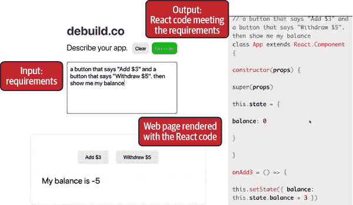
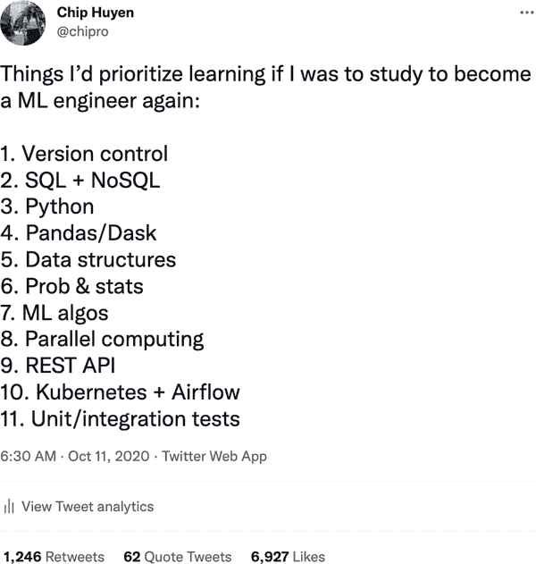
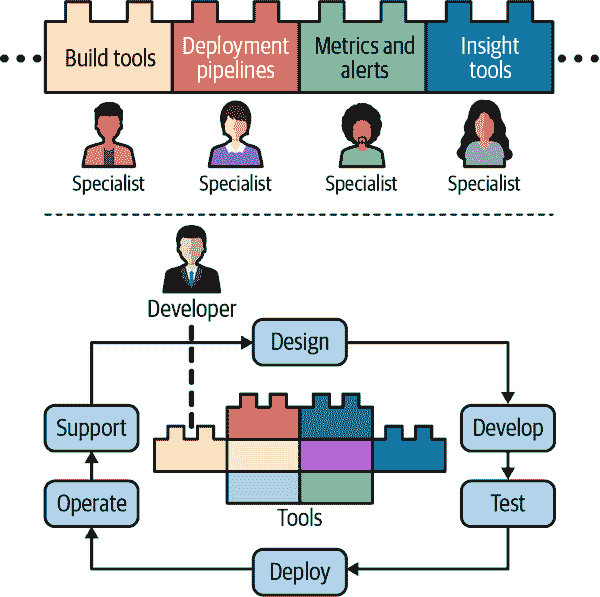
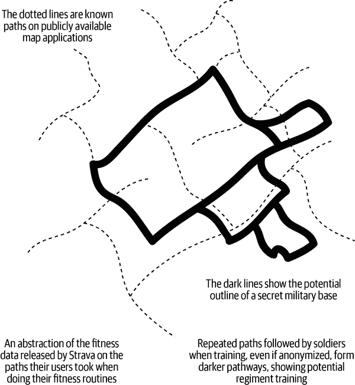

# 第十一章：机器学习的人文面

在本书中，我们涵盖了设计机器学习系统的许多技术方面。然而，机器学习系统不仅仅是技术性的。它涉及到业务决策者、用户，当然还有系统的开发者。我们在第一章和第二章中讨论了利益相关者及其目标。在本章中，我们将讨论用户和机器学习系统的开发者如何与这些系统互动。

首先考虑到由于机器学习模型的概率性质可能会改变和影响用户体验。我们将继续讨论组织结构，以允许同一机器学习系统的不同开发者有效地合作。我们将在章节“负责任的人工智能”结束本章。

# 用户体验

我们长期讨论了机器学习系统与传统软件系统的行为不同之处。首先，机器学习系统是概率性的而不是确定性的。通常情况下，如果你在不同时间两次运行相同输入的软件，你可以期望得到相同的结果。然而，如果你在不同时间两次运行完全相同输入的机器学习系统，你可能会得到不同的结果。¹ 其次，由于这种概率性质，机器学习系统的预测大多数情况下是正确的，困难的部分在于我们通常不知道对于什么样的输入系统会正确！第三，机器学习系统也可能很庞大，并且可能需要意料之外的长时间来产生预测。

这些差异意味着机器学习系统可能会以不同的方式影响用户体验，特别是对于迄今为止习惯于传统软件的用户。由于机器学习在现实世界中的相对新用法，机器学习系统如何影响用户体验还没有得到很好的研究。在本节中，我们将讨论机器学习系统对良好用户体验提出的三个挑战以及如何应对它们。

## 确保用户体验的一致性

当使用应用程序或网站时，用户期望有一定的一致性水平。例如，我习惯于 Chrome 在我 MacBook 的左上角有他们的“最小化”按钮。如果 Chrome 把这个按钮移到右边，我会感到困惑，甚至会感到沮丧。

机器学习预测具有概率性和不一致性，这意味着今天为一个用户生成的预测可能会与下一天为同一用户生成的预测不同，这取决于预测的背景。对于希望利用机器学习来改善用户体验的任务来说，机器学习预测的不一致性可能是一种阻碍。

具体来说，考虑一下由 Booking.com 在 2020 年发布的[案例研究](https://oreil.ly/qBLV2)。当您在 Booking.com 上预订住宿时，有大约 200 个筛选器可供您选择，例如“包括早餐”，“宠物友好”和“无烟房间”。有这么多筛选器，用户需要一些时间才能找到他们想要的筛选器。Booking.com 的应用 ML 团队希望使用 ML 来根据用户在特定浏览会话中使用的筛选器自动建议用户可能需要的筛选器。

他们遇到的挑战是，如果他们的 ML 模型每次都建议不同的筛选器，用户可能会感到困惑，特别是如果他们找不到他们之前已经应用过的筛选器。团队通过创建规则来解决这一挑战，规定系统必须返回相同的筛选器推荐条件（例如，用户已应用筛选器时），以及系统可以返回新推荐条件的条件（例如，用户更改目的地时）。这被称为一致性和准确性的权衡，因为系统认为最准确的推荐可能并不是能够提供用户一致性的推荐。

## 对抗“大多正确”的预测

在前面的部分中，我们谈到了确保模型预测一致性的重要性。在本节中，我们将讨论在某些情况下，我们希望模型的预测 less 一致性 and more diversity in a model’s predictions

自 2018 年以来，大型语言模型[GPT](https://oreil.ly/sY39d)及其后继者[GPT-2](https://oreil.ly/TttNU)和[GPT-3](https://oreil.ly/ug9P4)席卷了全球。这些大型语言模型的优势在于，它们能够在几乎不需要任务特定训练数据的情况下生成广泛任务的预测。例如，您可以将网页要求作为模型的输入，并输出所需的 React 代码来创建该网页，如图 11-1 所示。

###### 图 11-1. GPT-3 可以帮助您为网站编写代码。来源：根据[Sharif Shameem](https://oreil.ly/VEuml)的视频截图调整

然而，这些模型的一个缺点是，这些预测并不总是正确的，并且在任务特定数据上进行微调以改进它们的预测非常昂贵。这些大多正确的预测对于可以轻松纠正它们的用户是有用的。例如，在客户支持的情况下，对于每个客户请求，ML 系统可以生成大多正确的响应，而人工操作员可以快速编辑这些响应。这可以加快响应速度，而不必从头开始编写响应。

然而，如果用户不知道如何或不能纠正响应，这些大部分正确的预测就不会很有用。考虑使用语言模型生成网页的 React 代码的相同任务。生成的代码可能无法工作，或者即使工作，也可能无法呈现出满足指定要求的网页。React 工程师可能能够快速修复这些代码，但是这个应用的许多用户可能不了解 React。这个应用可能会吸引许多不了解 React 的用户，这也是他们最初需要此应用程序的原因！

为了解决这个问题，一种方法是向用户展示同一输入的多个预测结果，以增加至少有一个预测结果正确的机会。这些预测结果应该以一种即使非专家用户也能评估的方式呈现出来。在这种情况下，根据用户输入的一组要求，您可以让模型生成多个 React 代码片段。这些代码片段被呈现成视觉网页，以便非工程背景的用户可以评估哪一个对他们最好。

这种方法非常常见，有时被称为“人在回路中的 AI”，因为它涉及人类来选择最佳预测结果或改进机器生成的预测结果。对于对人在回路 AI 感兴趣的读者，我强烈推荐 Jessy Lin 的[“重新思考人工智能与人类互动”](https://oreil.ly/6o4pu)。

## 平滑失败

我们在章节“计算优先级”中详细讨论了 ML 模型推断延迟对用户体验的影响。我们还讨论了如何压缩模型并优化其以获得更快的推断速度，在章节“模型压缩”中。然而，即使是通常速度快的模型在处理某些查询时可能仍然需要时间。这在处理序列数据（如语言模型或时间序列模型）的模型中尤为常见——例如，模型处理长序列比处理短序列需要更长的时间。对于模型响应时间过长的查询，我们应该怎么办？

我曾与一些公司合作，它们使用一种备用系统，其效果不如主系统好，但能够快速生成预测结果。这些系统可以是启发式的或简单的模型。它们甚至可以是预先计算的缓存预测结果。这意味着您可能有一条规则，指定：如果主模型生成预测结果的时间超过*X*毫秒，则使用备用模型。有些公司并不采用这种简单的规则，而是使用另一个模型来预测主模型生成给定查询的预测结果需要多长时间，并根据该预测将其路由到主模型或备用模型。当然，这种额外的模型可能还会增加系统的推断延迟。

这与速度与准确性的权衡有关：一个模型可能比另一个模型的性能差，但可以进行推理速度更快。这种次优但快速的模型可能会给用户带来较差的预测结果，但在延迟至关重要的情况下可能仍然更受欢迎。许多公司不得不在一个模型和另一个模型之间进行选择，但有备份系统的情况下，可以同时实现两者。

# 团队结构

一个机器学习项目涉及不仅仅是数据科学家和机器学习工程师，还有其他类型的工程师，如 DevOps 工程师和平台工程师，以及非开发人员利益相关者，如主题专家（SMEs）。面对多样化的利益相关者，问题在于在组织机器学习团队时什么是最优结构。我们将关注两个方面：跨职能团队的协作以及端到端数据科学家角色的争议。

## 跨职能团队协作

SME（医生、律师、银行家、农民、造型师等）在设计机器学习系统时经常被忽视，但许多机器学习系统在没有主题专家的情况下无法正常工作。他们不仅仅是用户，也是机器学习系统的开发者。

大多数人只在数据标注阶段考虑主题专业知识 —— 比如，你需要训练有素的专业人员来标注肺部 CT 扫描是否显示癌症迹象。然而，随着训练机器学习模型成为生产中的持续过程，标注和重新标注可能也会成为跨整个项目生命周期的持续过程。机器学习系统在整个生命周期中都涉及主题专家的参与将极大地受益，例如问题定义、特征工程、错误分析、模型评估、重新排名预测以及用户界面：如何最好地向用户和/或系统的其他部分呈现结果。

多个不同背景的人员参与项目会带来许多挑战。例如，如何向没有工程或统计背景的主题专家解释机器学习算法的限制和能力？为了构建机器学习系统，我们希望所有东西都有版本控制，但如何将领域专业知识（例如，如果在 X 和 Y 之间的这个区域有一个小点，那么可能是癌症的迹象）转化为代码并进行版本控制呢？

想让你的医生使用 Git 可真是个好运气。

在项目规划阶段早期就让主题专家参与并赋予他们无需依赖工程师即可做出贡献的能力是很重要的。例如，为了帮助主题专家更多地参与机器学习系统的开发，许多公司正在构建允许人们在不编写代码的情况下进行更改的无代码/低代码平台。目前大多数面向主题专家的无代码机器学习解决方案主要集中在标注、质量保证和反馈阶段，但正在开发更多的平台以帮助解决其他关键环节，如数据集创建和用于调查需要主题专家输入问题的视图。

## 端到端数据科学家

通过本书，我希望能说服你，ML 的生产不仅是一个 ML 问题，而且也是一个基础设施问题。要进行 MLOps，我们不仅需要 ML 专业知识，还需要运维（操作）专业知识，特别是关于部署、容器化、作业编排和工作流管理的专业知识。

为了能够将所有这些专业领域融入到机器学习项目中，公司倾向于遵循以下两种方法之一：建立一个独立的团队来管理所有运维方面，或者将数据科学家纳入团队并让他们负责整个过程。

让我们更仔细地看看这些方法在实践中是如何运作的。

### 方法 1：建立一个独立的团队来管理生产

在这种方法中，数据科学/ML 团队在开发环境中开发模型。然后，通常是运维/平台/ML 工程团队将模型投入生产。这种方法使得招聘更容易，因为只需招聘具有一组技能的人，而不是多组技能的人。这也可能使每个参与者的生活更轻松，因为他们只需专注于一个问题（例如，开发模型或部署模型）。然而，这种方法有许多缺点：

沟通和协调开销

团队可能会成为其他团队的阻碍。根据 Frederick P. Brooks 的说法：“一个程序员在一个月内能完成的工作，两个程序员在两个月内才能完成。”

调试挑战

当某些事情失败时，你不知道是你团队的代码还是其他团队的代码可能引起的。这可能根本不是因为你公司的代码。你需要从多个团队那里得到合作，才能找出问题所在。

推卸责任

即使你已经弄清楚了问题出在哪里，每个团队可能会认为解决问题是另一个团队的责任。

狭窄的上下文

没有人能够全面了解整个过程以进行优化/改进。例如，平台团队对如何改进基础设施有想法，但他们只能根据数据科学家的请求行动，而数据科学家不必处理基础设施，因此他们没有动力积极地对其进行变更。

### 方法 2：数据科学家负责整个过程

在这种方法中，数据科学团队还必须关注模型的产品化。数据科学家成为抱怨的独角兽，人们期望他们对整个过程了如指掌，他们可能最终写的代码比数据科学还多。

大约一年前，我在[Twitter 上发推](https://oreil.ly/DPpt0)，谈到成为机器学习工程师或数据科学家所需的一组重要技能，如图 11-2 所示。该列表涵盖了工作流的几乎每个部分：数据查询、建模、分布式训练以及设置端点。甚至包括像 Kubernetes 和 Airflow 这样的工具。

###### 图 11-2。我曾经认为数据科学家需要了解所有这些事情

这条推文似乎引起了我的观众共鸣。尤金·扬（Eugene Yan）还写道，“数据科学家应该更加端到端。”² Stitch Fix 的首席算法官埃里克·科尔森（Eric Colson）（之前也是 Netflix 的副总裁兼数据科学与工程主管）在一篇文章中写道，“全栈数据科学通才的力量以及职能分工的危险。”³

当我写那条推文时，我相信 Kubernetes 对机器学习工作流程至关重要。这种情绪来自于我对自己工作的挫败感——如果我对 K8s 更加熟练，作为一名 ML 工程师的生活会更轻松。

然而，随着我对底层基础设施了解的增加，我意识到期望数据科学家了解这些是多么不切实际的。基础设施需要与数据科学完全不同的技能集。理论上，你可以学习两种技能。实际上，你在其中一种上花费的时间越多，就会在另一种上花费的时间越少。我喜欢埃里克·伯恩哈德森（Erik Bernhardsson）的比喻，认为期望数据科学家了解基础设施就像期望应用开发者了解 Linux 内核一样。⁴ 我加入了一个 ML 公司，是因为我想花更多时间处理数据，而不是花时间启动 AWS 实例、编写 Dockerfile、调度/扩展集群或调试 YAML 配置文件。

对于数据科学家来说，要想拥有整个流程，我们需要良好的工具。换句话说，我们需要良好的基础设施。

如果我们有一个抽象层，允许数据科学家在不必担心基础设施的情况下端到端地拥有整个过程会怎么样？

如果我只需告诉这个工具，“这是我存储数据的地方（S3），这是运行我的代码的步骤（特征化、建模），这是我的代码应该运行的地方（EC2 实例、AWS 批处理、函数等服务器端自动化），每个步骤需要什么样的代码运行环境（依赖关系）”，然后这个工具为我管理所有的基础设施事务？

根据 Stitch Fix 和 Netflix 的说法，全栈数据科学家的成功取决于他们拥有的工具。他们需要能够“从容器化、分布式处理、自动故障转移和其他高级计算机科学概念的复杂性中抽象出数据科学家的工具。”⁵

在 Netflix 的模式中，专家们——最初负责项目一部分的人——首先创建自动化其部分的工具，如 图 11-3 所示。数据科学家可以利用这些工具端到端地拥有他们的项目。

###### 图 11-3\. Netflix 的全周期开发者。来源：根据 Netflix 的图片修改而来⁶

我们已经讨论了 ML 系统可能如何影响用户体验以及组织结构可能如何影响 ML 项目的生产力。在本章的后半部分，我们将集中讨论更为关键的问题：ML 系统可能如何影响社会，以及 ML 系统开发者应该做什么来确保他们开发的系统产生更多的利益而非伤害。

# 负责任的 AI

本节内容由[Abhishek Gupta](https://oreil.ly/AGJHF)，蒙特利尔人工智能伦理研究所的创始人兼首席研究员慷慨贡献撰写。他的工作侧重于应用技术和政策措施，构建伦理、安全和包容性的 AI 系统。

###### 注

如何使智能系统负责任的问题不仅与 ML 系统相关，还涉及到一般的人工智能（AI）系统。AI 是一个比 ML 更广泛的术语。因此，在本节中，我们使用 AI 而不是 ML。

负责任的 AI 是以良好的意图和足够的意识设计、开发和部署 AI 系统的实践，以赋予用户权力，建立信任，并确保对社会产生公平和积极影响。它包括公平性、隐私、透明度和问责性等领域。

这些术语不再只是哲学的沉思，而是政策制定者和日常从业者的严肃考虑。鉴于 ML 正在被部署到我们生活的几乎每个方面，未能使我们的 ML 系统公平和道德可能导致灾难性后果，正如《数学毁灭的武器》（Cathy O’Neil，Crown Books，2016）所概述的那样，以及本书中提到的其他案例研究。

作为 ML 系统开发者，你不仅要考虑你的系统如何影响用户和整个社会，还要通过具体实施伦理、安全和包容性帮助所有利益相关者更好地认识他们对用户的责任。本节是关于未能充分努力使 ML 系统负责的情况简要介绍。我们将从两个 ML 非常不幸和公开的失败案例开始。然后，我们将为数据科学家和 ML 工程师提出一个初步框架，以选择最能帮助他们使其 ML 系统负责的工具和指南。

*免责声明：* 负责任的 AI 是一个复杂的主题，有着日益增长的文献，值得专门报道，并且很容易涵盖多本书。本节远非详尽指南。我们只旨在为 ML 开发者提供一个概述，以有效地引导这一领域的发展。那些对进一步阅读感兴趣的人强烈建议查阅以下资源： 

+   [NIST 特别出版物 1270：面向标识和管理人工智能偏见的标准](https://oreil.ly/Glvnp)

+   [ACM 公平性、问责性和透明度会议（ACM FAccT）](https://facctconference.org)

+   “值得信赖的 ML”列出了[推荐资源和基础论文](https://oreil.ly/NmLxU)，供希望了解更多关于值得信赖的 ML 的研究人员和实践者参考。

+   Sara Hooker 的出色[幻灯片](https://oreil.ly/upBxx)介绍了机器学习中的公平性、安全性和治理（2022 年）。

+   Timnit Gebru 和 Emily Denton 的[教程](https://oreil.ly/jdAyF)，讨论公平性、问责性、透明度和伦理（2020 年）。

## 不负责任的 AI：案例研究

我们将从两个 AI 系统失败的案例开始，这些失败严重伤害了这些系统的用户，也损害了开发这些系统的组织。我们将追溯组织哪些地方出错，以及从业者可能预见到这些失败点的方法。这些重点将作为我们深入探讨负责任 AI 工程框架的背景。

还有其他有趣的“AI 事件”例子记录在[AI 事件数据库](https://incidentdatabase.ai)中。请记住，尽管以下两个例子以及 AI 事件数据库中记录的引起注意的例子，还有许多更多的不负责任的 AI 事件是悄无声息地发生的。

### 案例研究 I：自动评分系统的偏见

2020 年夏季，由于 COVID-19 大流行，英国取消了决定大学入学的重要考试 A-levels。英国教育和考试监管机构 Ofqual 批准使用自动化系统为学生分配最终的 A-level 成绩——而不需要他们参加考试。据来自 Ada Lovelace Institute 的 Jones 和 Safak 称，“根据教师评估授予学生成绩最初因不公平的学校之间、代际之间的不可比性和因成绩膨胀导致结果贬值而被 Ofqual 拒绝。Ofqual 推测，更公平的选择是结合先前的成绩数据和教师评估使用特定的统计模型——一种‘算法’。”⁷

然而，这一算法发布的结果被证明是不公正和不可信的。这很快引起了公众抗议，数百名学生高呼要求废除该算法⁸。

造成公众哀号的原因是什么？初看似乎指向算法性能差。Ofqual 称他们的模型在 2019 年的数据测试中，在 A-level 各科目中平均准确率约为 60%⁹。这意味着他们预计，通过该模型分配的成绩中，大约有 40%与学生实际成绩不同。

尽管该模型的准确性似乎较低，Ofqual 却辩称他们的算法与人工评分者的准确性基本相当。当将一名审查员的分数与一名资深审查员的分数进行比较时，一致性也约为 60%。¹⁰ 无论是人工审查员还是算法的准确性都暴露了在单一时间点评估学生时的潜在不确定性，¹¹ 进一步加剧了公众的不满情绪。

如果你到目前为止已经阅读了这本书，你会知道仅仅粗粒度的准确性远远不足以评估模型的性能，尤其是对于一个可能影响到如此多学生未来的模型。仔细分析这一算法揭示了在设计和开发这一自动评分系统过程中至少有三个主要的失败：

+   设置错误的目标

+   未能进行细粒度评估以发现潜在偏见

+   未能使模型透明化

我们将详细讨论每一个这些失败。请记住，即使这些问题得到解决，公众对自动评分系统仍可能感到不满。

#### 失败 1：设定了错误的目标

我们在第二章中讨论了一个机器学习项目的目标将如何影响最终机器学习系统的性能。当开发一个自动评分系统来对学生进行评分时，你本以为这个系统的目标应该是“对学生的评分准确性”。

然而，Ofqual 显然选择优化的目标是“保持各学校水平的标准”，即使这意味着模型的预测分数要符合每个学校的历史分数分布。例如，如果学校 A 在过去的历史上优于学校 B，Ofqual 希望一个算法在平均意义上也给学校 A 的学生比给学校 B 的学生更高的分数。Ofqual 更注重学校间的公平性而非学生间的公平性——他们更倾向于一个能正确预测学校级结果的模型，而不是一个能正确预测每个个体成绩的模型。

由于这一目标，该模型不成比例地降低了历史上表现优秀但学术表现较差学校的学生的成绩。那些曾经成绩一直是 D 的学生现在被评为 B 和 C。¹²

Ofqual 没有考虑到资源更多的学校往往表现优于资源较少的学校这一事实。通过优先考虑学校的历史表现而非学生当前表现，这个自动评分系统惩罚了来自资源较少学校、通常有更多弱势背景学生的学生。

#### 失败 2：不足的细粒度模型评估未能发现偏见

针对历史表现低的学校学生的偏见只是在成绩公布后公众得知的该模型的许多偏见之一。自动评分系统考虑了教师的评估作为输入，但未能解决教师在跨人群评估中的不一致性。它还“没有考虑到一些受到《2010 年平等法》保护群体的多重劣势的影响，这些群体将因教师的低期望和某些学校普遍存在的种族歧视而受到双重/三重劣势。”¹³

由于该模型考虑了每所学校的历史表现，Ofqual 承认他们的模型对于小型学校的数据不足。对于这些学校，他们没有使用该算法来分配最终成绩，而是仅使用了教师评估的成绩。实际上，这导致了“私立学校学生获得更好的成绩，因为他们往往班级较小。”¹⁴

可能可以通过公开模型预测成绩并进行细粒度评估来发现这些偏见，以了解模型在不同数据片段（例如，评估不同规模学校和不同背景学生的模型准确性）中的表现。

#### 失败 3: 缺乏透明度

透明度是建立系统信任的第一步，然而 Ofqual 在太晚之前未能公开其自动评分系统的重要方面。例如，他们直到成绩发布日才让公众知道他们系统的目标是维持学校之间的公平性。因此，公众在系统开发过程中无法表达对这一目标的担忧。

此外，Ofqual 在评估和学生排名提交后才让教师知道他们的评估将如何被自动评分系统使用。Ofqual 的理由是为了避免教师试图改变他们的评估以影响模型的预测。Ofqual 选择在成绩公布日之前不公布确切的使用模型，以确保每个人在同一时间知道他们的成绩。

这些考虑是出于善意；然而，Ofqual 决定在暗中开发他们的模型意味着他们的系统没有得到足够的独立外部审查。任何依靠公众信任运行的系统都应该由公众信任的独立专家审查。皇家统计学会（RSS）在对这个自动评分器的开发进行调查时，对 Ofqual 组建的“技术咨询组”的构成表示担忧。RSS 指出，“没有更强有力的程序基础来确保统计严谨性，以及 Ofqual 正在审查的问题更透明”，¹⁵ 这引发了对 Ofqual 统计模型合法性的质疑。

该案例研究显示了在构建可能对如此多人生产生直接影响的模型时透明度的重要性，以及在适当时未能披露模型重要方面可能导致的后果。它还显示了选择正确的优化目标的重要性，因为错误的目标（例如，优先考虑学校的公平性）不仅可能导致选择表现不佳的模型来达到正确的目标，而且可能会使偏见持续存在。

它还展示了当前在应该由算法自动化和不应该由算法自动化之间的混乱边界。在英国政府中必然有人认为让 A-level 成绩评分由算法自动化是可以接受的，但也可以争论说，由于 A-level 评分可能带来的灾难性后果，它本应该从一开始就不应该被自动化。在没有更清晰的界限之前，会有更多误用 AI 算法的情况发生。只有通过更多的时间和资源投资以及 AI 开发者、公众和当局的认真考虑，才能实现更清晰的界限。

### 案例研究 II： “匿名化”数据的危险

对我来说，这个案例研究很有趣，因为在这里，算法并不是明显的罪魁祸首。而是接口和数据收集的设计使得敏感数据泄露成为可能。由于 ML 系统的开发严重依赖数据的质量，收集用户数据变得非常重要。研究界需要访问高质量的数据集来开发新技术。从业者和公司需要访问数据来发现新的用例并开发新的 AI 驱动产品。

然而，收集和共享数据集可能会侵犯那些数据包含在内的用户的隐私和安全。为了保护用户，有人呼吁对可识别个人信息（PII）进行匿名化处理。根据美国劳工部的定义，PII 被定义为“任何信息的表达形式，通过直接或间接手段可以合理推断出信息适用的个人身份”，如姓名、地址或电话号码。¹⁶

然而，匿名化可能不足以防止数据滥用和隐私期望的侵蚀。2018 年，在线健身追踪器 Strava 发布了一张热力图，显示了全球用户在运动（如跑步、慢跑或游泳）时记录的路径。这张热力图聚合了 2015 年到 2017 年 9 月间记录的 10 亿次活动数据，涵盖了 270 亿公里的距离。Strava 声称使用的数据已经进行了匿名化，并且“排除了标记为私密以及用户定义的隐私区域之外的活动”。¹⁷

由于 Strava 曾被军事人员使用，尽管已经进行了匿名化处理，但公开数据使人们能够发现显示美国海外军事基地活动的模式，包括“阿富汗前沿作战基地、叙利亚的土耳其军事巡逻以及俄罗斯在叙利亚运营区可能的警戒巡逻”。这些歧视性模式的例子显示在图 11-4 中。一些分析人士甚至建议这些数据可以揭示个别 Strava 用户的姓名和心率。¹⁹

那么，匿名化出了什么问题？首先，Strava 的默认隐私设置是“选择退出”，这意味着用户需要手动选择退出，如果他们不希望他们的数据被收集。然而，用户指出这些隐私设置并不总是清晰的，可能会给用户带来惊喜。²⁰有些隐私设置只能通过 Strava 网站而非其移动应用程序更改。这显示了教育用户关于隐私设置的重要性。更好的做法是默认选择数据（数据收集不是默认的），而不是选择退出。

###### 图 11-4\. 根据 BBC News 的分析创建的图像²¹

当 Strava 热力图的问题公开化后，一些责任被转移到了用户身上：例如，军事人员不应使用带有 GPS 跟踪的非军用设备，以及应该关闭位置服务。²²

然而，隐私设置和用户的选择只是在表面层面解决问题。潜在问题是，我们今天使用的设备不断收集和报告关于我们的数据。这些数据必须移动和存储在某个地方，从而为其被截取和误用创造机会。与像亚马逊、Facebook、Google 等更广泛使用的应用程序相比，Strava 的数据规模较小。Strava 的失误可能暴露了军事基地的活动，但其他隐私失误可能不仅对个人，而且对整个社会造成更大的危险。

收集和分享数据对于像人工智能这样的数据驱动技术的发展至关重要。然而，这个案例研究显示了即使数据被假定为匿名化并出于良好意图发布，收集和分享数据也存在潜在的危险。收集用户数据的应用程序开发者必须明白，他们的用户可能没有技术知识和隐私意识来为自己选择正确的隐私设置，因此开发者必须积极努力使正确设置成为默认选项，即使这可能导致收集的数据更少。

## 负责任人工智能的框架

在这一节中，我们将为您作为机器学习从业者奠定基础，以审计模型行为并制定最佳指南，以最好地满足项目需求。这个框架并不适用于每个用例。在某些应用中，使用人工智能可能完全不合适或不道德（例如，刑事判决决策，预测性执法），无论您遵循哪种框架。

### 发现模型偏见的来源

作为一个关注机器学习系统设计讨论的人，你知道偏见可能通过整个工作流程渗入你的系统中。你的第一步是发现这些偏见是如何渗入的。以下是一些数据来源的示例，但请记住，这个列表远非详尽无遗。偏见之所以难以对抗的其中一个原因是，它们可以来自项目生命周期的任何步骤。

训练数据

用于开发模型的数据是否代表了您的模型将在现实世界中处理的数据？如果不是，您的模型可能会对在训练数据中代表少量数据的用户群体存在偏见。

标注

如果您使用人类标注员为数据打标签，您如何衡量这些标签的质量？您如何确保标注员遵循标准指南而不是依靠主观经验为数据打标签？标注员越依赖他们的主观经验，人为偏见的空间就越大。

特征工程

你的模型是否使用包含敏感信息的特征？你的模型是否对某个人群产生了不平等的影响？即使看起来是中立的，当选择过程对不同群体有着显著不同的结果时即发生“不平等影响”²³。例如，招聘过程如果利用与种族相关的变量（如邮政编码和高中学历）可能导致种族不平等影响。为了减少这种潜在的不平等影响，你可能需要使用 Feldman 等人在 [“认证和消除不平等影响”](https://oreil.ly/a9vxm) 中提出的不平等影响消除技术，或者使用由 [AI Fairness 360](https://oreil.ly/TjavU)（AIF360） 实现的 [`DisparateImpactRemover`](https://oreil.ly/6LyA8) 函数。你还可以使用 H2O 中实施的 [Infogram 方法](https://oreil.ly/JFZCL) 识别变量中的隐藏偏见（然后从训练集中去除）。

模型的目标

你是否使用能够对所有用户实现公平的目标来优化你的模型？例如，你是否优先考虑模型在所有用户上的表现，从而使你的模型偏向于多数用户群体？

评估

你是否进行了充分的、细致的评估，以了解模型在不同用户群体上的表现？这在 “基于切片的评估” 部分有详细介绍。公正、充分的评估取决于存在公正、充分的评估数据。

### 理解数据驱动方法的局限性

机器学习是一种数据驱动的解决问题的方法。然而，理解的数据并不足够。数据涉及到现实世界中的人们，需要考虑到社会经济和文化等方面。我们需要更好地理解由于过度依赖数据而造成的盲点。这通常意味着跨越学科和功能边界，无论是组织内还是组织外，以便考虑到那些将受到我们构建系统影响的人们的生活经验。

例如，要构建一个公平的自动评分系统，与领域专家合作以了解学生群体的人口统计分布以及历史表现数据中反映的社会经济因素是至关重要的。

### 理解不同期望之间的权衡

在构建机器学习系统时，可能希望该系统具备不同的特性。例如，您可能希望系统具有低推断延迟，这可以通过像修剪这样的模型压缩技术实现。您可能还希望模型具有高预测准确性，这可以通过增加数据量来实现。您可能还希望模型具有公平和透明性，这可能需要将用于开发此模型的模型和数据公开供公众审查。

通常，机器学习文献会做出一个不切实际的假设，即优化模型准确性这样一个特性，其他所有特性都保持不变。人们可能会讨论提高模型公平性的技术，假设这将不会影响模型的准确性或延迟。然而，在现实中，改进一个特性可能会导致其他特性的降低。以下是这些权衡的两个例子：

隐私与准确性的权衡

根据维基百科，差分隐私是“通过描述数据集内组群的模式来公开共享有关数据集的信息，同时隐瞒数据集中个体的信息。差分隐私的理念在于，如果对数据库进行任意单个替换的影响足够小，则查询结果无法用于推断任何单个个体的信息，因此提供隐私保护。”²⁴

差分隐私是用于机器学习模型训练数据的一种流行技术。这里的权衡是，差分隐私能够提供的隐私保护级别越高，模型的准确性就越低。然而，这种准确性降低并不对所有样本都一样。正如 Bagdasaryan 和 Shmatikov（2019）指出的那样，“差分隐私模型的准确性对于少数族裔和次群体的影响更大。”²⁵

紧凑性与公平性的权衡

在第七章中，我们详细讨论了诸如修剪和量化之类的模型压缩技术。我们了解到，可以在几乎不损失准确性的情况下显著减小模型的大小，例如将模型参数数量减少 90%。

如果最小的准确性损失均匀分布在所有类别中，成本确实是最小的，但如果成本集中在少数类别中呢？在他们 2019 年的论文《压缩深度神经网络会忘记什么？》中，Hooker 等人发现，“具有截然不同权重数量的模型在顶线性能指标上具有可比性，但在数据集的某个狭窄子集上的行为却有很大分歧。”²⁶ 例如，他们发现，当受保护特征（例如性别、种族、残疾）位于分布的长尾时，压缩技术会放大算法的伤害，这意味着压缩对代表性较低的特征影响更大。²⁷

他们的工作中另一个重要发现是，尽管他们评估的所有压缩技术对不均衡的影响都不同，但并非所有技术都具有相同水平的差异影响。与他们评估的量化技术相比，修剪技术造成的差异影响要高得多。²⁸

发现类似的权衡继续进行。了解这些权衡是非常重要的，这样我们才能为我们的 ML 系统做出明智的设计决策。如果您正在处理压缩或差分私有的系统，建议增加资源用于审计模型行为，以避免意外的伤害。

### 早期行动

考虑正在市中心建造的新建筑。承包商被召集来建造一些将在未来 75 年内屹立不倒的东西。为了节省成本，承包商使用了劣质水泥。业主没有投资监督，因为他们想避免额外开销以便快速推进。承包商继续在这个不良基础上建造并按时完成了建筑。

一年之内，裂缝开始出现，建筑物可能倾斜。市政府认为这栋建筑存在安全风险，并要求拆除它。承包商为了节省成本的决定以及业主为了节省时间的决定，现在导致业主付出更多的金钱和时间代价。

您可能经常在 ML 系统中遇到这样的叙事。公司可能会决定绕过 ML 模型中的道德问题以节省成本和时间，但最终却发现风险，这会导致像 Ofqual 和 Strava 的前述案例一样花费更多。

在 ML 系统的开发周期越早开始思考该系统将如何影响用户的生活以及您的系统可能存在的偏见，就越便宜解决这些偏见。NASA 的一项研究显示，对于软件开发，错误成本在项目生命周期的每个阶段都会增加一个数量级。²⁹

### 创建模型卡片

模型卡是随训练好的 ML 模型一起提供的简短文档，提供了这些模型的训练和评估信息。模型卡还披露了模型预期使用的背景及其局限性。³⁰ 根据模型卡论文的作者，“模型卡的目标是通过允许利益相关者比较候选模型的部署，标准化道德实践和报告，不仅沿着传统评估指标的轴线，还沿着伦理、包容和公平考虑的轴线。”

下面的列表已从论文“模型报告的模型卡”中调整，以展示您可能希望为您的模型报告的信息：³¹

+   *模型细节*：关于模型的基本信息。

    +   开发模型的人或组织

    +   模型日期

    +   模型版本

    +   模型类型

    +   关于训练算法、参数、公平性约束或其他应用方法以及特征的信息

    +   更多信息的论文或其他资源

    +   引用详情

    +   许可证

    +   提出关于模型的问题或意见的地方

+   *预期用途*：在开发过程中设想的使用情况。

    +   主要预期用途

    +   主要预期用户

    +   不在范围内的使用案例

+   *因素*：因素可能包括人口统计学或表型群体、环境条件、技术属性或其他因素。

    +   相关因素

    +   评估因素

+   *指标*：应选择反映模型可能在现实世界中产生影响的指标。

    +   模型性能指标

    +   决策阈值

    +   变化方法

+   *评估数据*：卡片中用于定量分析的数据集详细信息。

    +   数据集

    +   动机

    +   预处理

+   *训练数据*：在实践中可能无法提供。如果可能，该部分应与评估数据部分相对应。如果无法提供此类详细信息，则应在此提供最少允许的信息，例如训练数据集中各种因素的分布详情。

+   *定量分析*

    +   单元结果

    +   交叉结果

+   *伦理考虑*

+   *注意事项和建议*

模型卡是增加透明度的一步，揭示了 ML 模型开发的过程。尤其是在使用模型的人与开发该模型的人不同的情况下，这一点尤为重要。

需要注意的是，每当模型更新时，模型卡片都需要更新。对于频繁更新的模型，如果模型卡片是手动创建的，这可能会给数据科学家带来很大的负担。因此，很重要能够利用像[TensorFlow](https://oreil.ly/iQtrS)，[Metaflow](https://oreil.ly/nucaZ)，和[scikit-learn](https://oreil.ly/Yk16x)这样的工具自动生成模型卡片，或者在内部构建此功能。因为应该在模型卡片中跟踪的信息与模型存储中应该跟踪的信息重叠，所以我不会感到意外，如果在不久的将来，模型存储会发展出自动生成模型卡片的能力。

### 建立减少偏见的过程

建立负责任的人工智能是一个复杂的过程，过程越临时化，出错的可能性就越大。企业建立系统化的过程来确保他们的机器学习系统负责任至关重要。

您可能希望创建一组对不同利益相关者易于访问的内部工具组合。大公司有您可以参考的工具集。例如，谷歌已经发布了[负责任 AI 的推荐最佳实践](https://oreil.ly/0C30s)，IBM 开源了[AI Fairness 360](https://aif360.mybluemix.net)，其中包含一组用于减少数据集和模型偏见的度量标准、解释和算法。您也可以考虑使用第三方审计。

### 保持对负责任 AI 的最新了解

AI 是一个快速发展的领域。AI 中新的偏见来源不断被发现，负责任 AI 面临新的挑战不断涌现。正在积极开发新的技术来应对这些偏见和挑战是非常重要的。保持对负责任 AI 最新研究的跟踪是重要的。您可能希望关注[ACM FAccT 会议](https://oreil.ly/dkEeG)，[Partnership on AI](https://partnershiponai.org)，[Alan Turing Institute 的公平性、透明性、隐私组](https://oreil.ly/5aiQh)，以及[AI Now Institute](https://ainowinstitute.org)。

# 总结

尽管 ML 解决方案具有技术性质，但设计 ML 系统不能仅限于技术领域。它们由人类开发，由人类使用，并在社会中留下影响。在本章中，我们偏离了过去八章的技术主题，专注于 ML 的人类方面。

我们首先关注了概率性、大多数正确以及高延迟的机器学习系统如何在各种方式影响用户体验。概率性质可以导致用户体验的不一致性，这可能引起沮丧——“嘿，我刚刚看到这个选项在这里，现在我却找不到它了。”如果用户无法轻松地修正这些预测使其正确，那么大多数正确的机器学习系统可能会变得无用。为了解决这个问题，您可能希望向用户展示多个相同输入的“最正确”预测，希望至少有一个是正确的。

建立一个机器学习系统通常需要多种技能，组织可能会考虑如何分配这些所需的技能：是让不同技能的团队参与（例如，数据科学家），还是期望同一个团队具备所有技能。我们探讨了两种方法的利弊。第一种方法的主要缺点是沟通成本增加。第二种方法的主要缺点是很难雇佣能够负责整个机器学习系统开发过程的数据科学家。即使能够找到这样的人才，他们也可能不愿意做这件事。然而，如果这些全流程数据科学家提供了足够的工具和基础设施，第二种方法可能是可行的，这正是第十章的重点。

我们以我认为是本书最重要的话题之一结束了这一章：负责任的人工智能。负责任的人工智能不再只是一个抽象概念，而是当今机器学习行业中至关重要的实践，值得紧急行动。将伦理原则融入到您的建模和组织实践中，不仅有助于您在专业和尖端数据科学家和机器学习工程师中脱颖而出，还有助于您的组织赢得客户和用户的信任。这还将有助于您的组织在市场上获得竞争优势，因为越来越多的客户和用户强调他们对负责任人工智能产品和服务的需求。

对待这种负责任的人工智能不能仅仅当作我们为了满足组织的合规要求而进行的一个勾选活动。这一章提出的框架确实可以帮助您满足组织的合规要求，但这不会取代对产品或服务是否应该首先构建进行深思熟虑的关键思维。

¹ 有时，如果你同时运行相同的模型在*完全相同的时间*，可能会得到不同的结果。

² Eugene Yan，“不受欢迎的观点——数据科学家应更全流程”，EugeneYan.com，2020 年 8 月 9 日，[*https://oreil.ly/A6oPi*](https://oreil.ly/A6oPi)。

³ Eric Colson，“小心数据科学的引脚工厂：全栈数据科学通才的力量及分工带来的危害”，MultiThreaded，2019 年 3 月 11 日，[*https://oreil.ly/m6WWu*](https://oreil.ly/m6WWu).

⁴ Erik Bernhardsson 在 Twitter 上的发言（@bernhardsson），2021 年 7 月 20 日，[*https://oreil.ly/7X4J9*](https://oreil.ly/7X4J9).

⁵ Colson，“小心数据科学的引脚工厂。”

⁶ “Netflix 全周期开发者——运行你所构建的”，*Netflix Technology Blog*，2018 年 5 月 17 日，[*https://oreil.ly/iYgQs*](https://oreil.ly/iYgQs).

⁷ Elliot Jones 和 Cansu Safak，“算法能否成绩优异？” *Ada Lovelace Institute Blog*，2020 年，[*https://oreil.ly/ztTxR*](https://oreil.ly/ztTxR).

⁸ Tom Simonite，“偏斜的评分算法引发课堂之外的反弹”，*Wired*，2020 年 8 月 19 日，[*https://oreil.ly/GFRet*](https://oreil.ly/GFRet).

⁹ Ofqual，“2020 年夏季颁发 GCSE、AS 和 A 级考试成绩的临时报告”，Gov.uk，2020 年 8 月 13 日，[*https://oreil.ly/r22iz*](https://oreil.ly/r22iz).

¹⁰ Ofqual，“颁发 GCSE、AS 和 A 级考试成绩。”

¹¹ Jones and Safak，“算法能否成绩优异？”

¹² Jones and Safak，“算法能否成绩优异？”

¹³ Ofqual，“颁发 GCSE、AS & A Level 资格证书。”

¹⁴ Jones and Safak，“算法能否成绩优异？”

¹⁵ “皇家统计学会对下议院教育选择委员会关于 COVID-19 对教育和儿童服务影响的调查的回应”，皇家统计学会，2020 年 6 月 8 日，[*https://oreil.ly/ernho*](https://oreil.ly/ernho).

¹⁶ “个人可识别信息保护指导”，美国劳工部，[*https://oreil.ly/FokAV*](https://oreil.ly/FokAV).

¹⁷ Sasha Lekach，“Strava 的健身热图对军事存在重大安全问题”，*Mashable*，2018 年 1 月 28 日，[*https://oreil.ly/9ogYx*](https://oreil.ly/9ogYx).

¹⁸ Jeremy Hsu，“Strava 热图和秘密的终结”，*Wired*，2018 年 1 月 29 日，[*https://oreil.ly/mB0GD*](https://oreil.ly/mB0GD).

¹⁹ Matt Burgess，“Strava 的热图数据让任何人看到在军事基地上锻炼的人的姓名”，*Wired*，2018 年 1 月 30 日，[*https://oreil.ly/eJPdj*](https://oreil.ly/eJPdj).

²⁰ Matt Burgess，“Strava 的热图数据让任何人都能看到”；Rosie Spinks，“使用健身应用教会我关于隐私设置为何是女权主义问题的可怕真相”，*Quartz*，2017 年 8 月 1 日，[*https://oreil.ly/DO3WR*](https://oreil.ly/DO3WR)。

²¹ “健身应用 Strava 照亮军事基地的工作人员”，*BBC News*，2018 年 1 月 29 日，[*https://oreil.ly/hXwpN*](https://oreil.ly/hXwpN)。

²² Matt Burgess，“Strava 的热图数据让任何人都能看到”。

²³ Michael Feldman, Sorelle Friedler, John Moeller, Carlos Scheidegger 和 Suresh Venkatasubramanian，“认证和消除不公平影响”，*arXiv*，2015 年 7 月 16 日，[*https://oreil.ly/FjSve*](https://oreil.ly/FjSve)。

²⁴ Wikipedia，“差分隐私”，[*https://oreil.ly/UcxzZ*](https://oreil.ly/UcxzZ)。

²⁵ Eugene Bagdasaryan 和 Vitaly Shmatikov，“差分隐私对模型准确性的不同影响”，*arXiv*，2019 年 5 月 28 日，[*https://oreil.ly/nrJGK*](https://oreil.ly/nrJGK)。

²⁶ Sarah Hooker, Aaron Courville, Gregory Clark, Yann Dauphin 和 Andrea Frome，“压缩深度神经网络忘记了什么？”*arXiv*，2019 年 11 月 13 日，[*https://oreil.ly/bgfFX*](https://oreil.ly/bgfFX)。

²⁷ Sara Hooker, Nyalleng Moorosi, Gregory Clark, Samy Bengio 和 Emily Denton，“压缩模型中的偏差特征”，*arXiv*，2020 年 10 月 6 日，[*https://oreil.ly/ZTI72*](https://oreil.ly/ZTI72)。

²⁸ Hooker 等人，“压缩模型中的偏差特征”。

²⁹ Jonette M. Stecklein, Jim Dabney, Brandon Dick, Bill Haskins, Randy Lovell 和 Gregory Moroney，“项目生命周期中的错误成本升级”，NASA 技术报告服务器（NTRS），[*https://oreil.ly/edzaB*](https://oreil.ly/edzaB)。

³⁰ Margaret Mitchell, Simone Wu, Andrew Zaldivar, Parker Barnes, Lucy Vasserman, Ben Hutchinson, Elena Spitzer, Inioluwa Deborah Raji 和 Timnit Gebru，“模型报告的模型卡”，*arXiv*，2018 年 10 月 5 日，[*https://oreil.ly/COpah*](https://oreil.ly/COpah)。

³¹ Mitchell 等人，“模型报告的模型卡”。
