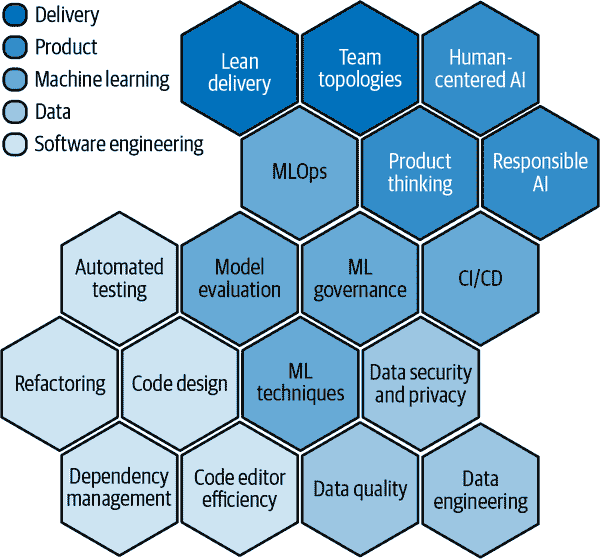
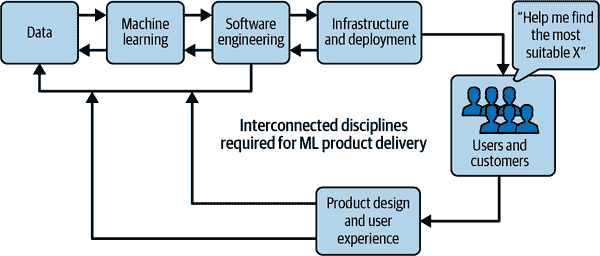
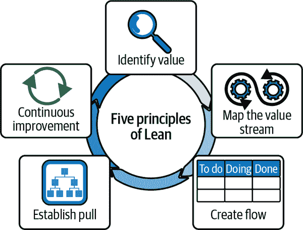
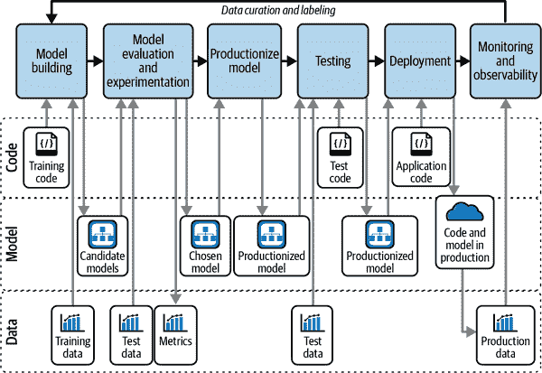
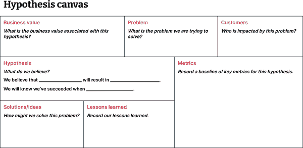

# 第一章：交付 ML 解决方案中的挑战与更好的路径

> 最危险的浪费是我们未意识到的浪费。
> 
> 丰田生产系统的领先专家信吾真悟
> 
> 并非所有面对的问题都能改变，但在面对问题之前，一切都不可能改变。
> 
> 作家和剧作家詹姆斯·鲍德温

许多个人和组织都怀着极大的希望开始他们的机器学习（ML）之旅，但许多 ML 从业者的实际经历告诉我们，交付 ML 解决方案的旅程充满了陷阱、弯路，有时甚至是不可逾越的障碍。当我们揭开数据科学被誉为 21 世纪最性感职业的炒作和迷人宣传的表面，我们常常看到 ML 从业者被繁重的手工工作、生产中的应急处理、团队壁垒以及笨重、脆弱和复杂的解决方案所困扰。

这妨碍甚至阻止团队为客户提供价值，也令组织在人工智能方面的投资和抱负受挫。至于[hype cycles](https://oreil.ly/mGwWj)，许多人经历了泡沫期的顶峰后坠入失望谷。我们或许会看到一些高效的机器学习团队步入生产效率高原，而我们是否会走向那里却不得而知。

无论你的背景如何——无论是学术界、数据科学、机器学习工程、产品管理、软件工程还是其他领域——如果你正在构建涉及机器学习的产品或系统，你都将不可避免地面临本章描述的挑战。本章是我们试图从自身和他人的经验中提炼出来的，用以构建和交付机器学习产品。我们希望这些原则和实践能帮助你避免不必要的陷阱，并为你的旅程找到更可靠的道路。

我们开始本章时承认了 ML 在现实世界中承诺与失望的双重现实。然后，我们检视那些经常导致 ML 项目失败的高层次和日常挑战。接着，我们根据精益交付、产品思维和敏捷工程的原则和实践勾勒出更好的道路。最后，我们简要讨论为什么这些实践对于交付生成 AI 产品和大型语言模型（LLM）应用尤为重要。把本章视为本书其余部分的缩影。

# ML：承诺与失望

在本节中，我们将看到在深入探讨阻碍这些投资回报的工程、产品和交付瓶颈之前，对 ML 投资和兴趣持续增长的证据。

## ML 的持续乐观

暂时搁置炒作以及我们在炒作周期上的个人坐标，机器学习仍然是一个快速发展的领域，为解决真实世界问题提供了许多技术手段。斯坦福的["AI 指数报告 2022"](https://oreil.ly/GUC4H)发现，2021 年全球对 AI 的私人投资总额约为 940 亿美元，这比 COVID-19 大流行前 2019 年的私人投资总额还要*多一倍*。麦肯锡的["2021 年 AI 状况调查报告"](https://oreil.ly/ylNOs)表明，AI 的采用持续稳步上升：所有受访者中，56%报告至少在一项功能中采用了 AI 技术，比 2020 年的 50%有所增加。

斯坦福报告还发现，公司继续投资于应用多种机器学习技术，例如自然语言理解、计算机视觉、强化学习等，涵盖了医疗保健、零售、制造业和金融服务等多个领域。从工作和技能的角度来看，斯坦福对自 2010 年以来的数百万份工作岗位发布进行的分析显示，对机器学习能力的需求在过去的十年中稳步增长，即使在 COVID-19 大流行期间以及之后也是如此。

虽然这些趋势从机遇的角度来看令人放心，但如果我们在不直面和从过去困扰我们的挑战中学习的情况下继续前行，这也是非常令人担忧的。让我们详细看看这些陷阱。

## 为什么机器学习项目失败

尽管有大量热门的 Kaggle 笔记本，但机器学习项目在现实世界中常常失败。失败可以以多种形式出现，包括：

+   无法将支持机器学习的产品交付到生产环境中

+   发布客户不使用的产品

+   部署有缺陷的产品，客户不信任

+   无法在生产环境中快速演进和改进模型

明确一点——我们并不是在试图避免失败。众所周知，[失败既宝贵又不可避免](https://oreil.ly/zEvK8)。我们可以从失败中学到很多东西。问题在于，随着失败的*成本*增加——错过的截止日期、未达到的业务成果，甚至有时会造成一些附带损害：[对人类的伤害](https://oreil.ly/yQJFi)，以及[许多与机器学习倡议没有直接关系的员工的工作和生计的损失](https://oreil.ly/pybEo)。

我们希望以低成本和安全的方式失败，并且经常这样做，以提高每个利益相关者在项目中成功的机会。我们还希望从失败中学习——例如通过记录和分享我们的实验和经验教训——以便不再一次又一次地犯同样的错误。在本节中，我们将详细讨论一些常见的挑战——涵盖产品、交付和工程方面——这些挑战降低了我们成功的机会；在接下来的一节中，我们将探讨减少失败成本和概率、更有效地提供有价值成果的方法。

让我们从高层次开始，然后深入分析阻碍价值流动的日常障碍。

### 高层次视角：成功的障碍

采取高层次的视角——即在机器学习项目或工作方案的层面上——我们看到机器学习项目因以下挑战而未能实现其期望的结果：

未能解决正确的问题或为用户提供价值

在这种失败模式中，即使我们采用了所有正确的工程实践并且“正确构建了东西”，我们也未能在旨在实现的业务结果上有所突破，因为团队没有“构建正确的东西”。 当团队缺乏产品管理能力或与产品和业务的对齐不足时，通常会发生这种情况。 在团队中没有成熟的产品思维能力时，机器学习团队往往会忽视以用户为中心的设计技术——例如用户测试、用户旅程绘制——以识别用户的痛点、需求和愿望。（1）

在生产中推广模型的挑战

许多机器学习项目并未在生产中见到成果。根据 2021 年的一项 Gartner 调查，大约 200 名业务和 IT 专业人士发现只有 53%的 AI 项目从试点阶段成功推广到生产阶段，而在成功的项目中，平均需要九个月的时间才能实现。（2）推广机器学习模型的挑战不仅限于计算问题，例如模型部署，还可能涉及数据问题（例如在生产环境中没有适当质量、延迟和分布的推断数据）。

推广模型后的挑战

一旦投入生产，通常会看到机器学习从业者受到琐事和乏味工作的困扰，这些工作阻碍了迭代实验和模型改进。 在其《2021 年企业机器学习趋势》报告中，Algorithmia 报告称，有 64%的公司需要超过一个月的时间来部署新模型，这比 Algorithmia 在 2020 年的报告中报道的 58%有所增加。 报告还指出，有 38%的组织将超过 50%的数据科学家时间用于部署工作，并且随着规模扩大，这种情况只会变得更糟。

长或缺失的反馈循环

在模型开发过程中，反馈循环通常漫长而乏味，这会分散重要的机器学习产品开发工作的宝贵时间。 确定一切是否正常的主要方法可能是手动运行培训笔记本或脚本，等待其完成——有时候要等上数小时——并手动查看日志或打印的声明来检查一些模型指标，以确定模型是否仍然像以前那样优秀。 这种方法并不具有良好的可扩展性，而且往往会受到开发甚至生产中的意外错误和质量下降的影响。

许多模型在部署时没有机制可以从生产中学习——例如数据收集和标注机制。没有这种反馈循环，团队将错失通过数据为中心方法提高模型质量的机会。

脆弱且复杂的代码库

机器学习代码库经常充斥着代码异味，例如，命名不规范的变量，长而混乱的函数，紧密耦合的意大利面代码等，这使得代码难以理解，从而难以更改。随着每个功能的交付，复杂性和错误/缺陷的风险呈指数增长。作为开发者，修改或扩展代码库变成了一项艰巨的任务，因为他们需要解开复杂的代码库及其相关系统或流水线的复杂性。

如果机器学习系统缺乏自动化测试，它会变得更加脆弱。此外，缺乏测试还会埋下更多复杂性的种子，因为没有人希望进行重构，如果这意味着他们可能会意外且不知不觉地引入回归。所有这些都导致开发周期更长，生产效率降低。

生产中的数据质量问题

我们将用一个例子来说明这一点：[英国医学杂志的一项研究](https://oreil.ly/tlJe4)发现，为了帮助医院检测 COVID-19 而开发的数百种预测工具实际上都没有起作用。这些模型失败的原因有很多，其中一个关键主题是数据质量。数据泄漏（导致模型看起来比实际效果好）、错误标记的数据以及训练数据与实际生产数据之间的分布不对称等都是造成这些模型失败的原因之一。

更加严重的是，重新训练、重新评估、重新测试和自动化地重新部署模型中的前述挑战，进一步阻碍了我们对随时间变化的数据分布做出反应的能力。

数据安全和隐私不足

数据安全和隐私是横切性的关注点，应该由组织中的每个人负责，从产品团队到数据工程团队及所有中间团队。在机器学习的背景下，存在几个独特的数据安全和隐私挑战，这些挑战可能导致产品失败。其中一个挑战是数据污染，即将恶意或偏见数据注入到训练集中以破坏模型。回想一下著名（或臭名昭著的）[Microsoft Tay 聊天机器人](https://oreil.ly/2-HDD)，它在发布后的一天内被下线，因为它学习到了用户故意训练它产生此类回应的煽动性和冒犯性内容。或者更近期的例子是，随着 LLM 的出现，我们看到了提示注入攻击导致定制聊天机器人泄露用户的训练数据并显示系统提示信息的情况。

道德上存在问题的机器学习产品

不用远看，就能看到 ML 在野外可能出错的地方。例如，您可能听说过[亚马逊的招聘工具](https://oreil.ly/Y3WqW)，它惩罚含有“女性”一词的简历（亚马逊在发布一年后停用了该工具）。在另一个例子中，[ProPublica 的基准分析](https://oreil.ly/yQJFi)发现，一个用于预测累犯率的 ML 系统，对于黑人被告的*假阳性率*是白人被告的两倍，对于白人被告的*假阴性率*也是黑人被告的两倍。

现在我们已经描绘了导致 ML 项目失败的原因的高层次图片，让我们看看那些使 ML 项目难以成功的日常挑战。

### 微观层面视角：成功的日常障碍

在微观层面——即在 ML 项目中交付功能的层面上——有几个瓶颈阻碍了我们执行想法的能力。

这一观点最好通过在敏捷开发生命周期中的用户故事在两种情况下进行对比来看待：在*低效环境*和*高效环境*下。根据我们的经验，这些障碍不仅源于我们对机器学习和工程的方法，还源于次优的协作工作流程和未计划的工作。

#### 在低效环境中故事的生命周期

让我们与达娜一同踏上旅程——她是我们书中的主角和机器学习工程师——在这种情境下。尽管角色是虚构的，但痛苦是真实的：

+   达娜开始她的一天，立即处理生产中的问题警报和客户支持查询，询问模型为何以某种方式行事。达娜的团队已经遭受警报疲劳，这意味着他们经常忽略进来的警报。这只会加剧问题和每日警报的数量。

+   达娜检查了多个日志和监控系统以排查问题，因为系统间没有聚合日志。她手动调试模型，试图找出为何模型针对该客户作出特定预测的解释。她模糊地记得上个月有类似的客户查询，但找不到任何关于如何解决此类客户查询的内部文档。

+   达娜在团队聊天中发送提醒，询问谁可以自愿审查她上周创建的拉取请求，以便合并。

+   最后，达娜解决了问题，找到时间编码，并从团队的看板上挑选了一个任务。

+   代码库没有任何自动化测试，因此在进行一些代码更改后，达娜需要重新启动和重新运行整个训练脚本或笔记本，等待模型训练的持续时间——在他们的情况下为 40 分钟——并希望它能够无错误运行。她最后还要手动查看一些打印输出语句，以确保模型指标没有下降。有时，由于开发过程中的错误滑入，代码会在中途崩溃。

+   Dana 想休个咖啡时间，但因为要做的事情太多而感到内疚。所以，她用两分钟做了一杯咖啡，并在办公桌上边喝边工作。

+   在编码时，Dana 收到了有关拉取请求的评论和问题。例如，有一个评论说一个特定函数太长且难以阅读。然后 Dana 切换上下文，打字回复——不一定要更新代码——关于她上周所做的编码设计决策，并提到她将在下次创建一个故事卡来重构这个长函数。

+   在没有配对编程的情况下投入两周时间解决问题后，她将解决方案与团队分享。团队的工程领导指出，解决方案在代码库中引入了太多的复杂性，需要重写。他补充说，这个故事实际上并不是高优先级的，而且还有另一个 Dana 可以看看的故事。

Dana 肯定感到多么沮丧和缺乏动力？长时间的反馈周期和不断的上下文切换——在进行机器学习和其他繁重任务（比如拉取请求审查）之间——限制了她的成就。上下文切换还造成了[真实的认知成本](https://oreil.ly/Haw0v)，使他们感到筋疲力尽和无所作为。因为他们觉得压力很大，有时他们下班后还要再次登录，因为一天中根本没有足够的时间来完成所有的工作。

每个微观步骤上的长反馈循环导致了总体周期时间的增加，这意味着一天内实验或迭代周期的减少（见图 1-1）。工作和努力经常在多个任务之间向后和横向移动，导致了工作状态的混乱。

#### 在高效率环境中的一个故事生命周期

现在，让我们看看在高效率环境中，Dana 的情况有多么不同：

+   Dana 一天开始时检查团队项目管理工具，然后参加站立会议，在那里他们可以拿起一个故事卡。每个故事卡都明确了其商业价值，从产品的角度进行了验证，并明确说明了他们需要做什么，以及定义完成的清晰定义。

+   Dana 与队友配对编写代码，解决故事卡上指定的问题。当他们编码时，他们帮助捕捉彼此的盲点，提供实时反馈——例如，解决特定问题的更简单方法——并在路上分享知识。

+   在编码时，每个增量代码变更都会通过运行自动化测试——既有的测试和他们编写的新测试——在几秒钟或几分钟内快速验证。他们在小数据集上本地运行端到端的 ML 模型训练管道，并在一分钟内得到关于是否一切仍按预期工作的反馈。

+   如果他们需要进行完整的 ML 模型训练，他们可以从本地机器上触发大规模基础设施上的训练，使用他们的本地代码更改，而不需要“推送以确定是否有效”。然后在具有生产数据和可伸缩计算资源的环境中开始模型训练。

+   他们提交了代码更改，该更改通过持续集成和持续交付（CI/CD）管道上的一系列自动化检查，然后触发完整的 ML 模型训练，根据 ML 模型架构和数据量的不同，训练时间可能介于几分钟到几小时之间。

+   Dana 和她的搭档专注于他们的任务几个小时，中间穿插着定期休息、咖啡，甚至散步（分开进行）。他们可以毫无愧疚地这样做，因为他们知道这将帮助他们工作更好，并且他们对工作的可预测性有信心。

+   当模型训练完成时，将自动触发模型部署管道。部署管道运行模型质量测试，并检查模型是否符合一组指定的指标（例如准确度、精度）。如果模型质量令人满意，则新训练的模型构件将自动打包并部署到预生产环境，而 CI/CD 管道还会在刚刚部署的构件上运行部署后测试。

+   当故事卡的“定义完成”得到满足时，Dana 通知团队，召集团队进行 20 分钟的聚会，与团队分享背景，并演示解决方案如何满足“定义完成”的要求。如果他们漏掉了什么，任何队友都可以在那时提供反馈。

+   如果不需要进一步的开发工作，另一位队友就会戴上“测试帽”，在测试解决方案是否满足“定义完成”的过程中带来新的视角。由于新功能的大部分（如果不是全部）验收标准已经通过自动化测试进行了测试，他可以在合理的时间内进行探索性和高水平测试。

+   每当业务需要时，他们可以逐步将更改发布到生产环境的用户中，并监控业务和运营指标。由于团队保持了良好的测试覆盖率，当管道全部绿灯时，他们可以毫无焦虑地将新模型部署到生产环境。

Dana 和她的队友每天在交付计划上取得渐进性进展。团队速度比低效环境更高且更稳定。工作和努力通常是向前流动的，Dana 离开工作时感到满意并且心情愉悦。万岁！

谈到两种速度的故事总结，让我们放大看看高效环境（上行）和低效环境（下行）中完成工作所需的时间，见 图 1-1。

###### Figure 1-1\. 高效环境团队敏捷性的快速反馈周期（来源：根据[“最大化开发者效率”](https://oreil.ly/tQPgL) 图片修改自 Tim Cochran）

更进一步地查看，Table 1-1 展示了区分高效与低效环境的反馈机制。每行是模型交付生命周期中的关键任务，列比较它们的相对反馈周期。

Table 1-1\. 高效与低效环境中反馈机制和反馈时间的比较

| 任务 | 每个任务的反馈循环和反馈时间（大致数量级） |
| --- | --- |
| *高效环境* | *低效环境* |
| --- | --- |

| **检查代码变更是否按预期工作** | 自动化测试（~ 秒至分钟）

⬤⬤ | 手动测试（~ 分钟至小时）

⬤⬤⬤⬤ |

| **测试 ML 训练流水线是否端到端工作** | 训练烟雾测试（~ 1 分钟）

⬤⬤ | 完整模型训练（~ 分钟至小时，取决于模型架构）

⬤⬤⬤⬤⬤ |

| **获取代码变更反馈** | 配对编程（~ 秒至分钟）

⬤⬤ | Pull 请求审查（~ 小时至天数）

⬤⬤⬤⬤⬤⬤⬤ |

| **检查应用在生产环境中是否按预期运行** | 生产监控（~ 秒级 - 实时反馈）

⬤ | 客户投诉（~ 天，或者如果未直接报告则更长）

⬤⬤⬤⬤⬤⬤⬤ |

现在我们已经勾勒出 ML 解决方案交付中的常见陷阱以及更有效的替代方案，让我们看看团队如何从低效环境转向高效环境。

# 有没有更好的方法？系统思维和精益如何帮助

> 一个糟糕的系统每次都会战胜一个优秀的个人。
> 
> [W. Edwards Deming](https://oreil.ly/D-lqT)，经济学家和工业工程师

在上一节中，我们可以看到 Dana 在低效环境中面临不必要的辛苦和重复工作，这导致持续的挫败感，可能最终导致倦怠。ML 实践者常常面对的辛苦、挫折和倦怠表明我们的*工作系统*有待改进。

在本节中，我们将探讨为什么仅靠 MLOps 是不足以提高 ML 实践者效率的原因。我们将运用系统思维的视角，识别一系列改善 ML 交付所需的实践。然后，我们将寻找精益原则和实践，帮助我们以减少浪费、最大化价值流的方式运作这些子系统。

## 你不能通过“MLOps”简单解决问题

改善 ML 交付效率的一种反射性但误导的方法是组织转向 MLOps 实践和 ML 平台。虽然它们可能是必要的，但单靠它们绝对不足以解决问题。

在软件交付领域，你不能仅通过“DevOps”或“平台化”解决问题。DevOps 有助于优化和管理一个子系统（与基础设施、部署和运维相关），但其他子系统（如软件设计、用户体验、软件交付生命周期）同样重要，这些都是交付优秀产品的关键。

同样，在 ML 领域中，*你不能仅通过“MLOps”解决问题*。无论采用多少 MLOps 实践和平台能力，都无法摆脱由于缺乏软件工程实践（如自动化测试、良好的设计因素等）和产品交付实践（如客户旅程映射、清晰的用户故事等）而导致的浪费和重复工作。MLOps 和 ML 平台不能为你撰写全面的测试，与用户交流，或减少团队孤立带来的负面影响。

在[Booking.com 的一项研究中，对 150 个成功的面向客户的 ML 驱动应用进行了研究](https://oreil.ly/6CYB6)，通过严格的随机对照试验，研究者得出结论：成功的关键因素是*迭代的、假设驱动的过程，与产品开发、用户体验、计算机科学、软件工程、因果推断等其他学科相整合*。这一发现与我们的方法一致，基于我们交付多个 ML 和数据产品的经验。我们一再看到，成功交付 ML 项目需要跨越产品、软件工程、数据、ML 和交付这五个学科的多学科方法（见图 1-2）。

###### 图 1-2\. 成功交付 ML 项目需要跨越产品、交付、ML、软件工程和数据的多学科方法

帮助我们看到将这五个学科结合在一起的价值——或者集中关注某些学科而忽视其他学科的成本——我们可以运用系统思维的视角。在接下来的部分，我们将探讨系统思维如何帮助揭示有效交付机器学习产品所需的互联学科。

## 全面看待：系统思维镜头下的有效 ML 交付

[系统思维](https://oreil.ly/dcAJ-)帮助我们将注意力从系统的单个部分转移到构成系统的所有组件之间的*关系和互动*。系统思维为我们提供了理解——最终改变——那些无法为我们服务的结构，包括我们的心智模型和认知的心智模型和工具。

也许你会问，为什么我们应该将 ML 产品交付框架化为一个系统？而什么是*系统*？Donella H. Meadows，[系统思维的先驱](https://oreil.ly/QumE3)，将系统定义为一组相互关联的元素，以实现某种有序组织的目标。一个系统必须包含三种要素：元素、相互关系和功能或目的。

让我们在交付机器学习产品的背景下再读一遍。一个系统必须包括三种类型的东西（见图 1-3）：

元素

例如数据、机器学习实验、软件工程、基础设施与部署、用户与客户以及产品设计与用户体验

互联互通

例如跨职能协作和生产机器学习系统创建数据以供后续标记和重新训练

机器学习产品的功能或目的

例如帮助用户找到最合适的产品

###### 图 1-3\. 机器学习产品交付的这些组成部分天然地相互关联

我们能够看到并优化这些互联互通中的信息流有助于我们有效地交付机器学习产品。相比之下，把机器学习产品交付仅仅视为数据和机器学习问题的团队更有可能失败，因为系统的真正整体性质（例如，用户体验在产品成功中的“成败决定性”角色）最终会显现出来。

系统思维认识到系统的组件是相互关联的，系统中的一个部分的变化可能会对整个系统产生连锁反应。这意味着，要真正理解和改进一个系统，我们需要把系统**作为一个整体**来考虑，以及所有部分如何协同工作。

幸运的是，有一种哲学可以帮助我们改善机器学习交付系统元素之间信息流的互联互通，那就是精益。

## 有效机器学习交付所需的五个学科

在本节中，我们将从精益的基本知识开始，并探讨它如何帮助我们更有效地交付机器学习产品。然后，我们将简要探讨在机器学习交付中所需的五个学科——产品、交付、软件工程、数据和机器学习——并描述每个学科中提供快速反馈的关键原则和实践，帮助团队朝着构建正确产品的方向迭代。

作为一个快速的警告，这五个学科中的每一个都值得一本书——甚至是一套书——而我们在本章中提出的原则和实践绝非穷尽其数。尽管如此，它们构成了一个重要的起点，是我们在任何机器学习项目中采用的原则和实践，帮助我们有效地交付机器学习解决方案。本节将在高层次上为我们规划道路，我们将在本书的其余章节中深入探讨细节。

### 什么是精益，为什么机器学习从业者应该关注它？

在机器学习项目中（以及许多其他软件或数据项目中），团队经常会经历各种形式的浪费。例如，你可能已经投入了时间和精力完成了一个特性，但最终意识到这个特性对客户并没有可证明的价值。或者你可能在来回交接中等待另一个团队浪费了几天时间。或者你的工作流程可能因产品中的缺陷或错误而意外中断。³ 所有这些浪费都会导致发布延迟和错过里程碑，增加工作量（并产生没有足够时间完成所有工作的感觉），压力，从而降低团队士气。

如果你经历了这些负面结果中的任何一种，首先，欢迎来到人类的境况。这些都是我们个人经历过的挑战，并且在某种程度上会继续经历，因为没有一个系统可以完全无浪费或无噪声。

第二，精益原则和实践可以提供帮助。精益使组织能够通过识别客户价值来更好地为客户服务，并高效地交付满足客户需求的产品。通过在开发和交付过程中引入客户的声音，团队可以更好地理解最终用户的需求，并为他们构建相关的产品。精益帮助我们在所做的事情上变得更好，并使我们能够*最小化浪费和最大化价值*。

精益实践起源于 20 世纪 50 年代的丰田。这一理念最初被称为丰田生产系统（TPS）。詹姆斯·P·沃马克和丹尼尔·T·琼斯后来在他们的书籍《*改变世界的机器*》（自由出版社）中对其进行了完善和推广，称为[精益原则](https://oreil.ly/8Lmxt)。下面的五个精益原则（见图 1-4）在改变汽车、制造和 IT 等行业中起到了关键作用：

第一原则：确定价值

确定客户最看重的是什么，并集中精力最大化这个价值。

第二原则：绘制价值流图

确定过程中增加价值的步骤，并消除那些不增值的步骤。

第三原则：创造流程

简化流程，创建平稳连续的工作流程。

第四原则：建立拉动

利用客户需求触发生产，避免过度生产。

第五原则：持续改进

持续追求改进，并在价值链的所有领域消除浪费。

###### 图 1-4\. 精益五大原则

在我们交付机器学习产品的经验中，精益生产引导我们朝着创造价值的工作前进，从而创建一个正向反馈循环，包括顾客满意度、团队士气和交付动力。例如，我们首先确定并优先考虑将为用户带来最大价值的特性（原则 1），并在需求建立后将其“拉入”我们的交付流程，而不是因为其涉及闪亮技术而“推出”特性（原则 4）。相比之下，如果我们没有实践这一点，我们将花费时间和精力完成一个增加代码复杂性但没有任何可证明价值的特性。对于那些精益眼光敏锐的人来说，是的——你刚刚发现了浪费！

[价值流映射](https://oreil.ly/tZ99t)（原则 2）是一种工具，可以让我们直观地表示为顾客提供价值单元（例如产品特性）所涉及的所有步骤和资源。团队可以使用此工具来识别浪费、努力消除浪费，并改进价值的流动（原则 3）。

要绘制您的团队或产品的价值流，您可以按照以下步骤进行：

1.  确定要绘制的产品或服务。这可以是单个产品或整个流程。

1.  辨别当前状态图。创建当前流程的视觉表示，包括从原材料到成品涉及的所有步骤和材料（包括时间和劳动）。

1.  辨别增值和非增值活动。确定哪些步骤为产品或服务增值，哪些不增值。

1.  辨别浪费。寻找过度生产、等待、缺陷、过度加工、过剩库存、不必要的运动、过度运输、不必要使用原材料和不必要的努力的领域。

1.  创建未来状态图。基于当前状态图的分析，重新设计流程，以消除浪费并创建更高效的物料和信息流动。

1.  实施变更。将重新设计的流程付诸实践，并持续监控和改进（原则 5）。

现在我们对精益生产有了基本的工作知识，让我们看看精益生产如何与五个学科相交，以创建一套实践方法，帮助机器学习团队缩短反馈循环，并快速迭代朝着有价值的产品发展。当这些实践方法结合在一起时，它们有助于在我们的机器学习产品交付系统中创建几个新出现的、令人期待的和相互增强的特征：更快的反馈、更少的失败和更便宜的成本、可预测的交付，最重要的是有价值的结果。

###### 注意

如果您觉得本章对每个实践的解释过于简略，不用担心！在本书的整个过程中，我们将详细说明为什么以及如何在构建机器学习产品的背景下应用这些及其他实践。

### 第一个学科：产品

没有产品纪律，无论其他学科（例如 ML、数据、软件工程）的专业水平如何，都无法帮助团队有效地交付 ML 产品。当我们不了解用户需求和组织的商业模式时，很难从业务层面获得对齐来开始工作。即使团队开始了，缺乏以产品为导向的方法也会使他们陷入产品知识真空中，这很快就会被没有实证依据的假设填满，这往往导致团队过度工程化未经验证的功能，最终浪费宝贵的能量和资源。

如果不了解商业模式和客户需求，很容易失去动力和方向。相反，通过产品导向的方法，ML 团队可以从头开始考虑最终目标，持续测试他们的假设，并确保他们构建的解决方案与客户需求相关。

带着精益思维，我们认识到所有的想法都基于需要测试的假设，并且其中许多假设可能被证明是错误的。精益提供了一套原则和实践来测试我们的假设，例如通过原型测试、安全失败实验和建造-测量-学习循环等。每次实验都提供了学习，帮助我们做出明智的决策，是坚持、转向或停止。通过早期转向或放弃不良想法，我们可以节省时间和资源，并集中精力于能为客户带来价值的想法。精益帮助我们更快地移动，并“通过在正确的时间建造正确的东西来把握机遇，而不浪费人们的时间在那些不具价值的想法上。”⁴

正如 Spotify 的 Henrik Kniberg 所说：“产品开发并不容易。事实上，大多数产品开发努力都失败了，而失败的最常见原因是构建错误的产品。”⁵ 这里的目标不是避免失败，而是通过创建快速反馈循环来更快速、更安全地失败，以建立同理心和学习。让我们看看一些可以帮助我们实现这一目标的实践。

#### 发现

[发现](https://oreil.ly/P77Iv)是一组活动，帮助我们更好地理解问题、机遇和潜在解决方案。它提供了一个通过快速、时间限定、迭代活动来导航不确定性的结构，涉及各种利益相关者和客户。正如在[*精益企业*](https://oreil.ly/N1_QD)（O’Reilly）中 eloquently articulate 的那样，创建共享愿景的过程始终从清晰定义问题开始，因为有清晰的问题陈述有助于团队专注于重要的事情并忽略分散注意力的事物。

Discovery 利用视觉工具来广泛地绘制、外化、辩论、测试和演化思想。一些有用的视觉构思画布包括 [精益画布](https://oreil.ly/aUa8q) 和 [价值主张画布](https://oreil.ly/gt7US)，还有许多其他画布。在探索过程中，我们有意将客户和业务置于中心位置，并通过用户旅程映射、情境询问、客户访谈等活动，充分留出空间，聆听客户的声音，同时我们围绕我们的想法制定并测试关于 [问题/解决方案契合度](https://oreil.ly/nmvsQ) 和 [产品/市场契合度](https://oreil.ly/BOW87) 的假设。

在机器学习的背景下，探索技术帮助我们早期评估候选解决方案的价值和可行性，以便我们有扎实的信心投入交付。在这方面的一个有用工具是 [数据产品画布](https://oreil.ly/F_05O)，它提供了一个框架，用于连接数据收集、机器学习和价值创造的各个方面。利用探索还很重要的一点是表达成功的度量标准，并在利益相关者之间达成一致和对齐，以评估候选解决方案的适用性。

*精益企业* 在探索方面有一章精彩的内容，我们鼓励你阅读，深入了解如何在你的组织中构建和促进探索工作坊。探索也不是一次性活动——这些原则可以在我们构建、衡量和学习的过程中 [持续实践](https://oreil.ly/bcr3p)，从而打造客户看重的产品。

#### 原型测试

你听说过 [陶罐寓言](https://oreil.ly/Ldgy4)⁶ 吗？在这个寓言中，一位陶艺老师让班上的一半学生创造尽可能好的陶罐，但每人只能创造一个。另一半学生则被要求在同样的时间内尽可能多地制作陶罐。最后，后者通过迭代开发许多原型，制作出了更高质量的陶罐。

原型允许我们以一种经济高效的方式快速测试我们的想法，并验证或者否定我们的假设和猜想。它们可以简单到用户会与之交互的“手绘”界面草图，或者是可点击的交互式模型。在某些情况下，我们甚至可以选择 [“绿野仙踪”原型](https://oreil.ly/_kpwS)，这是一个真实的工作产品，但所有产品功能都是幕后手动执行的，使用产品的人并不知情。⁷（需要注意的是，“绿野仙踪”用于原型测试，而不是运行生产系统。这种错误应用被明显称为 [“人工人工智能”](https://oreil.ly/Db7b1)，涉及人力投入无法扩展地解决 AI 无法解决的问题。）

无论你选择哪种方法，原型测试在机器学习产品交付中特别有用，因为我们可以在进行数据、机器学习和 MLOps 的任何昂贵投入之前从用户那里获得反馈。原型测试帮助我们缩短了反馈周期，从需要几周甚至几个月的工程投入时间缩短到几天。快速反馈，谈论一下！

### 第二项纪律：交付

如果产品纪律关注我们构建什么以及为什么，那么交付纪律则涉及到我们如何执行我们的想法。交付一个机器学习产品的机制涉及多个纪律：交付规划、工程、产品、机器学习、安全、数据等等。在这里我们使用术语 *交付* 来指代我们构建机器学习解决方案的交付规划方面。

交付纪律主要关注工作的形状、大小和顺序的三个层面（从近到远）：用户故事或特性、迭代和发布。它还涉及到我们团队如何运作，并包括：

+   团队形态

+   工作方式（例如，站立会议和回顾会议）

+   团队健康（例如，士气和心理安全）

+   交付风险管理

Lean 认识到人才是组织最宝贵的资产，而交付纪律通过创建结构来强化这一信念，这些结构可以最小化工作系统中的障碍，放大每位队友的贡献和集体所有权。在正确实施时，交付实践能帮助我们减少浪费并改善价值流动。

交付往往被忽视，但却是构建机器学习产品的一个极其关键的方面。如果我们在其他所有纪律上都做得很好，但忽视了交付，我们可能无法及时可靠地将机器学习产品交付给用户（我们马上会解释为什么）。这可能会导致客户满意度降低、竞争力下降、错失机会，最终未能实现期望的业务结果。

让我们看看一些基础的交付实践。

#### 纵向切分的工作

在机器学习交付中常见的一个陷阱是横向切分工作，其中我们按技术解决方案的功能层次顺序逐步交付——例如，数据湖、机器学习平台、机器学习模型、UX 界面从下往上逐层构建。这是一种风险较高的交付方法，因为客户只能在数月甚至数年的大量工程投入后才能体验产品并提供有价值的反馈。此外，横向切分自然会导致横向切片合并时的延迟集成问题，增加发布延迟的风险。

为了减轻这种情况，我们可以[垂直切分工作和故事](https://oreil.ly/scbMO)。垂直切分的故事指的是一个被定义为独立可交付价值单元的故事，它包含了从用户界面方面（例如前端）到更多后端方面（例如数据流水线、机器学习模型）所有必要的功能。您对“用户界面”的定义将根据您的用户而异。例如，如果您是一个为数据科学家提供 ML 平台产品的平台团队，则用户界面组件可能是一个命令行工具而不是前端应用程序。

[垂直切片原则](https://oreil.ly/ReL3C)不仅适用于单个功能，而且适用范围更广。这就是垂直切片在交付领域的三个视角中的应用：

+   在*故事*层面上，我们阐述和展示每个故事中的商业价值。

+   在*迭代*层面上，我们规划和优先考虑相互协作的故事，以实现明显的结果。

+   在*发布*层面上，我们规划、序列和优先考虑一系列旨在创造可证明商业价值的故事。

#### 垂直切片的团队，或跨功能团队

机器学习交付中的另一个常见陷阱是按功能分割团队，例如将数据科学、数据工程和产品工程分开成独立的团队。这种结构导致两个主要问题。首先，团队不可避免地陷入*积压耦合*，这种情况是指一个团队依赖另一个团队交付功能的情况。在一项非正式分析中，积压耦合使完成任务的时间平均增加了[10 到 12 倍](https://oreil.ly/XGsIt)。

第二个问题体现为[康威定律](https://oreil.ly/7hk2W)，即团队设计系统和软件的现象与其沟通结构相似。例如，我们曾见过在同一产品上工作的两个团队为解决服务低延迟推断模型的相同问题而构建了两种不同的解决方案。这就是康威定律的作用。最不费力的路径引导团队寻找局部优化，而不是协调共享功能。

我们可以通过识别自然协同的产品能力，并围绕产品构建跨功能团队来解决这些问题——从前端元素（例如体验设计、UI 设计）到后端元素（例如 ML、MLOps、数据工程）。构建多学科团队的这种实践有时被描述为[反康威动作](https://oreil.ly/9yVoo)。这带来了四个主要的好处：

改进了决策速度和质量。

共享的背景和节奏减少了讨论和迭代各方面事物（例如设计决策、优先级调整、待验证的假设）的摩擦。与需要协调多个团队开会不同，我们可以仅通过给定团队的通信渠道（例如站立会议、聚会、聊天渠道）讨论问题。

减少来回交接和等待。

如果切片做得当，跨职能团队应该是自治的——这意味着团队有权设计和交付功能和端到端功能，而不依赖或等待其他团队。

通过多样性减少盲点。

拥有[不同能力和视角的多元团队](https://oreil.ly/k_E8L)可以帮助确保机器学习项目全面并考虑到所有相关因素。例如，用户体验设计师可以创建原型，与客户测试和完善想法，然后我们才会投入大量工程资源来实现机器学习。

减少批次大小。

在较小的批次中工作有许多好处，是精益软件交付的核心原则之一。正如唐纳德·莱纳森在他的《*产品开发流程原理*》（[Celeritas](https://oreil.ly/XiAvY)）中所描述的，较小的批次能够提供更快的反馈、降低风险、减少浪费，并提高质量。

跨职能团队的前三个好处——改善沟通和协作、减少交接、多样化的专业知识——使团队能够减少批次大小。例如，与其在能够更广泛地分享反馈之前必须对功能进行工程化和“银盘化”，跨职能团队将包含必要的产品和领域知识以提供反馈（或者，如果没有，他们至少会知道如何设计成本有效的方式来找到答案）。

跨职能团队也并非没有问题。存在的风险是，每个产品团队可能会针对产品间反复出现的问题开发出其特有的解决方案。然而，我们认为，通过正确的工程实践，这比功能上孤立的团队导致的流程不畅问题要高质量得多。此外，还有一些缓解措施可帮助对齐产品团队，包括[实践社区](https://oreil.ly/6-hGd)、平台团队等等。我们将在第十一章中深入讨论这些内容。

相反地，我们已经看到功能专业化团队在协作中有效交付，前提是有强大的敏捷程序管理机制，能够提供清晰、及时的端到端交付和产品运营现状，并制定可持续改进整体系统健康的集体指导方针。

团队形态并没有一种适合所有情况的标准形式，适合你组织的正确团队形态和互动模式取决于许多因素，并会随时间而演变。在第十一章中，我们讨论了多样化的团队形态以及如何通过[Team Topologies](https://oreil.ly/lWgYX)原则来确定适合你组织 ML 团队的团队形态和互动模式。

#### 工作方式

工作方式（Ways of Working，WoW）指的是团队用来交付产品功能的流程、实践和工具。它包括但不限于敏捷仪式（例如站会、回顾、反馈）、用户故事工作流程（例如看板、故事启动、配对编程、[桌面检查](https://oreil.ly/Pri1o)⁸)和质量保证（例如自动化测试、手动测试，在出现缺陷时“停止生产线”）。

团队经常陷入的一个常见陷阱是遵循形式，但忽视工作方式实践的实质或意图。当我们不理解和整体实践工作方式时，这往往是适得其反的。例如，团队可能进行站会，但忽略了使工作可见的意图，因为团队成员隐藏在泛泛的更新后面（“昨天我在 X 上工作，今天将继续”）。相反，这些工作方式实践应该帮助团队获取丰富的背景信息（例如，“我在 Y 上遇到了困难”和“哦，我最近也遇到了，我知道如何帮助你。”）。这改善了共享理解，创建了对齐，并为每个团队成员提供了改进价值流的信息。

#### 衡量交付指标

即使在敏捷团队中，人们经常忽视的一个实践是随时间记录交付指标（例如迭代速度、周期时间、缺陷率）。如果我们把团队看作是一个生产线（生产创造性解决方案，而不是模板化的小部件），这些指标可以帮助我们定期监控交付健康状况，并在偏离交付计划或时间表时发出警报。

团队也可以并且应该通过[四个关键指标](https://oreil.ly/FQKdD)来衡量软件交付性能：交付领导时间、部署频率、平均恢复时间（MTTR）和变更失败率。在[*Accelerate*](https://oreil.ly/EunU9)（IT Revolution Press）中，基于对技术组织四年的研究和统计分析，作者发现软件交付性能（通过四个关键指标衡量）与组织的业务结果和财务表现相关。衡量这四个关键指标帮助我们确保生产线中的稳定和高质量流动。

这些指标的客观性有助于以数据为基础进行规划讨论，并帮助团队实际上（通过定量估计）看到前进的工作和他们在朝着目标的进展情况。在理想的环境中，这些指标将纯粹用于持续改进，帮助我们随着时间改善我们的生产线，实现产品交付目标。

然而，在其他不太理想的环境中，指标可能会被[滥用、操纵，最终变得失效](https://oreil.ly/ggm3n)。正如[古德哈特定律](https://oreil.ly/7OUSH)所述，“当一个指标成为目标时，它就不再是一个好指标。”确保您正在衡量正确的结果，并[持续改进](https://oreil.ly/q4Fd2)以找到适合您组织的机器学习实践的合适指标。在我们讨论测量生产力时，我们将更详细地探讨衡量团队健康指标的陷阱及如何避免它们，在第十章中。

### 第三学科：工程

> 至关重要的是，我们能够学习的速度、根据反馈更新我们的产品或原型的速度，以及再次测试的速度，是一个强大的竞争优势。这就是精益工程实践的价值主张。
> 
> 杰兹·汉布尔（Jez Humble）、乔安妮·莫莱斯基（Joanne Molesky）和巴里·奥雷利（Barry O’Reilly）在[*《精益企业》*](https://oreil.ly/0lrT4)

在本节中我们概述的所有工程实践都专注于一件事：*缩短反馈循环*。来自*《精益企业》*的上述引用清楚地表达了这一点——一个有效的团队是能够快速进行所需的变更、测试和发布——无论是在代码、数据还是机器学习模型中。

#### 自动化测试

在机器学习项目中，经常会看到堆积如山的代码，却没有自动化测试。没有自动化测试，改动就会变得容易出错、繁琐和令人紧张。当我们改变代码库的某一部分时，缺乏测试会迫使我们承担手动测试整个代码库的负担，以确保改动（例如特征工程逻辑）没有导致恶化（例如模型质量或边缘情况下 API 行为的变化）。这意味着大量时间、精力和认知负荷被消耗在非机器学习工作上。

相反，全面的自动化测试有助于团队加速实验、减少认知负荷，并快速获得反馈。自动化测试能够快速反馈变更，告诉我们一切是否仍然按预期工作。实际上，这可以极大地改变我们执行想法和正确完成任务的速度。

高效的团队是那些欢迎并能应对产品各个方面的有价值变化的团队：新的业务需求，特性工程策略，建模方法，训练数据等。自动化测试使得在面对这些变化时能够保持响应和可靠性。我们将在第 5 和 6 章介绍 ML 系统测试技术。

#### 重构

热力学第二定律告诉我们，宇宙趋于混乱，或称为熵增。我们的代码库——不论是 ML 还是其他类型的——也不例外。随着每个“快速修改”和每个没有有意识地努力减少熵的特性交付，代码库变得更加混乱和脆弱。这使得代码变得越来越难以理解，因此修改代码变得痛苦且易出错。

缺乏自动化测试的 ML 项目尤其容易受到指数复杂性的影响，因为缺乏自动化测试，对重构的测试可能会很繁琐且风险很高。因此，重构变成了一项重要的任务，被降级为积压的任务。结果，我们为自己制造了一个恶性循环，对 ML 从业者来说，使他们的 ML 解决方案变得越来越难以发展。

在一个高效的团队中，重构是一项非常安全且易于进行的工作，我们可以将其作为特性交付的一部分，而不是事后的事情。这样的团队通常能够出于以下三个理由而做到这一点：

+   他们有全面的测试，可以快速反馈重构是否保留了行为。

+   他们已经配置了他们的代码编辑器，并利用现代代码编辑器执行重构操作的能力（例如，重命名变量、提取函数、更改签名）。

+   技术债务和/或工作量处于健康水平。他们不会感到被压力压垮，而是有能力根据需要重构以改善代码库的可读性和质量。

#### 代码编辑器的效力

如前一点所暗示的，现代代码编辑器具有许多强大的功能，可以帮助贡献者更有效地编写代码。代码编辑器可以处理低级细节，从而使我们的认知能力保持可用于解决更高级别的问题。

例如，代码编辑器可以通过*一次*快捷方式将变量的所有引用重命名，而不是通过手动搜索和替换来重命名变量。我们可以通过按一个快捷键，而不是手动搜索导入函数的语法（例如，`cross_val_score()`），让 IDE 可以自动为我们导入该函数。

当正确配置时，代码编辑器将成为一个强大的助手（即使没有 AI 编码技术），可以让我们更有效地执行我们的想法，解决问题，并交付价值。

#### ML 的持续交付

如果有一种方法可以帮助 ML 从业者减少琐事、加快实验速度并构建高质量的产品，那岂不是太棒了？嗯，这正是[机器学习的持续交付（CD4ML）](https://oreil.ly/d6GEE) 帮助团队实现的目标。CD4ML 是将[持续交付](https://oreil.ly/Pv8Dw) 原则和实践应用于 ML 项目中。它使团队能够缩短反馈周期，建立质量控制，确保软件和 ML 模型具有高质量，并能够安全高效地部署到生产环境。

[*《加速》*](https://oreil.ly/EunU9) 中的研究显示，持续交付实践通过使团队能够可靠地交付价值并灵活应对市场需求变化，帮助组织实现更好的技术和业务绩效。我们在与 ML 团队合作的经验也证实了这一点。CD4ML 帮助我们提升了速度、响应能力、认知负荷、满意度和产品质量。

我们将在 第九章 中详细探讨 CD4ML。现在，让我们先来预览其技术组成部分（参见 图 1-5）：

+   可复现的模型训练、评估和实验

+   模型服务

+   测试和质量保证

+   模型部署

+   模型监控和可观察性

###### 图 1-5\. 端到端的 CD4ML 过程（来源：改编自 [“机器学习的持续交付”](https://oreil.ly/d6GEE) 的一幅图像）

### 第四个学科：ML

ML 学科不仅仅涉及如何训练、选择、改进、部署和使用 ML 模型，还涉及诸如 ML 问题框架、ML 系统设计、可解释性设计、可靠性、负责任 AI 和 ML 治理等能力。

#### 设定 ML 问题框架

在 ML 项目的早期和探索阶段，通常不清楚我们应该解决什么问题，我们为谁解决问题，以及最重要的是，为什么要解决它。此外，可能不清楚什么 ML 范式或模型架构可以帮助我们，甚至不清楚我们拥有或需要什么数据来解决问题。因此，设定 ML 问题、结构化和执行想法，并与相关客户或利益相关者验证假设非常重要。在这种情况下，“问题定义清晰即问题解决了一半”的说法是非常贴切的（见 [此处](https://oreil.ly/DCX0Z)）。

有各种工具可以帮助我们构建 ML 问题的框架，比如[数据产品画布](https://oreil.ly/F_05O)，这在本章早些时候我们已经提到过。另一个帮助我们在快速周期内表达和测试想法并随时间追踪学习的工具是[假设画布](https://oreil.ly/KzSkM)（见图 1-6)⁹。假设画布帮助我们制定可测试的假设，阐明为什么一个想法可能有价值及谁会从中受益，并引导我们朝着衡量客观指标以验证或否定想法的方向前进。这是通过运行有针对性、限时的实验来缩短反馈循环的另一种方式。我们在这里的讨论将保持简短，因为我们将在下一章详细讨论这些画布。

###### 图 1-6\. 假设画布帮助我们制定可测试的想法，并知道何时取得成功（来源：[“数据驱动的假设开发”](https://oreil.ly/KzSkM)，由 Jo Piechota 和 May Xu 所著，获得授权使用）

#### ML 系统设计

设计 ML 系统涉及许多部分，如收集和处理模型所需的数据、选择合适的 ML 方法、评估模型的性能、考虑访问模式和可扩展性需求、理解 ML 失效模式，以及识别模型中心和数据中心策略，以逐步改进模型。

关于这个主题，有一本很棒的书，[*设计机器学习系统*](https://oreil.ly/L6z2t)，作者是 Chip Huyen（O'Reilly），如果你还没有读过，我们鼓励你阅读。鉴于这个主题已经有了很好的文献，我们的书不会详细介绍*设计 ML 系统*中已经涵盖的概念。

#### 负责任 AI 和 ML 治理

MIT Sloan 管理评论对[负责任 AI](https://oreil.ly/3yOor)有一个简明实用的定义：

> 一个包含原则、政策、工具和流程的框架，以确保 AI 系统在为个人和社会提供服务的同时，仍然实现深刻的商业影响。

在 MIT Sloan 的[“2022 负责任 AI 全球执行报告”](https://oreil.ly/3yOor)中发现，尽管 AI 项目激增，但负责任 AI 的发展却滞后。在受访公司中，52% 参与了某些负责任 AI 实践，但 79% 表示其实施在规模和范围上有限。尽管他们认识到负责任 AI 对解决 AI 风险（如安全性、偏见、公平性和隐私问题）至关重要，但他们承认忽视了其优先级。这种差距增加了对其客户的负面影响，并使企业面临监管、财务和客户满意度风险。

如果负责任人工智能是隐喻的山顶，团队通常只凭罗盘无法到达那里。他们还需要地图、路径、指导和交通工具。这就是机器学习治理作为团队实现负责任人工智能目标的关键机制之处，除了机器学习团队的其他目标。

机器学习治理涉及广泛的流程、政策和实践，旨在帮助从业者负责任和可靠地交付机器学习产品。它跨越机器学习交付生命周期，在以下各阶段都发挥作用：

模型开发。

开发、测试、文档化和部署机器学习模型的指南、最佳实践和[黄金路径](https://oreil.ly/eOMvb)。

模型评估。

在部署之前评估模型性能、识别偏见并确保公平的方法。

监控和反馈回路。

系统持续监控模型性能、收集用户反馈并改进模型。

缓解策略。

方法来识别和减少数据和算法中的偏见，以避免负面和不公平的结果。

可解释性。

在特定场景下解释模型行为的技术和工具，以提高透明度，建立用户信任，并促进错误分析。

账户责任。

明确定义的角色、责任和权力范围；跨学科团队能够管理机器学习系统和风险管理流程。

法规合规性。

遵守关于数据和机器学习使用的法律和行业特定的法规或审计要求。

数据处理政策。

收集、存储和处理数据的指南，以确保数据隐私和安全。

用户同意和隐私保护。

采取措施获取用户的知情同意并保护其隐私。

道德准则。

制定指导机器学习开发和使用的原则，考虑社会影响、人类价值、潜在风险和可能造成伤害的可能性。

虽然“治理”通常带有官僚主义的内涵，但我们将在第九章展示，机器学习治理可以以精简和轻量的方式实施。根据我们的经验，持续交付和精益工程通过建立安全失败区域和反馈机制来补充治理。综合考虑，这些治理实践不仅帮助团队减少风险和避免负面后果，还有助于团队创新和创造价值。

在第九章，我们还将分享其他有助于机器学习治理的资源，如[“负责任技术手册”](https://oreil.ly/uFZiV)和[Google 模型卡片](https://oreil.ly/Pzl7v)。

### 第五学科：数据。

正如许多 ML 从业者所知，我们的 ML 模型质量取决于我们数据的质量。如果我们训练样本中的数据存在偏差（与总体数据集分布相比），那么模型将学习并延续这种偏差。正如一个巧妙的表达：“当今技术依赖于昨天的数据时，它只会反映我们过去的错误和偏见。”¹⁰

为了提供更好的 ML 解决方案，团队可以在数据领域考虑以下实践。

#### 关闭数据收集循环

在训练和部署模型时，我们的 ML 系统设计还应考虑如何在生产环境中收集和筛选模型的预测结果，以便我们可以标记它们并为评估和重新训练模型增加高质量的地面真实标签。

标记可能是一项繁琐的工作，并且经常成为瓶颈。如果是这样，我们还可以考虑如何通过技术（例如[主动学习](https://oreil.ly/qvvBi)，[自监督学习](https://oreil.ly/xfRiX)，以及[弱监督学习](https://oreil.ly/32Ypm)）来扩展标记。如果我们的 ML 任务有[自然标签](https://oreil.ly/HJZ9W)——可以自动评估或部分评估的地面真实标签，我们还应该设计软件和数据摄入管道，随着这些自然标签的可用性流入相应数据点的相关特征。

在收集自然标签时，我们还必须考虑如何减少数据污染攻击的风险（稍后详述），以及危险的[失控反馈循环](https://oreil.ly/tdi5E)，其中模型的偏见预测会影响现实世界，进而巩固数据和随后模型的偏见。

团队经常关注 ML 交付的最后一步——过于关注如何把一个令人满意的模型推出去，并忽略了关闭数据收集循环以准备下一阶段和循环的模型改进机会。当这种情况发生时，他们放弃了通过[以数据为中心的方法](https://oreil.ly/9fmg3)来改进 ML 模型的机会。

让我们看一下本章的最后一个实践：数据安全和隐私。

#### 数据安全和隐私

正如本章前面提到的，数据安全和隐私是跨部门关注的问题，应该是组织内每个人的责任，从产品团队到数据工程团队以及各个中间团队。组织可以通过实施[深度防御](https://oreil.ly/w6q-D)，在系统各处设置多层安全控制来保护数据。例如，除了通过加密和访问控制安全地存储数据在传输和静态时，团队还可以应用[最小特权原则](https://oreil.ly/fUR7I)，确保只有授权的个人和系统可以访问数据。

在组织层面上，必须有数据治理和管理指南，明确规定和执行政策，指导团队如何收集、存储和使用数据。这有助于确保数据的合法和合规使用。

由于您刚刚涵盖了与有效交付机器学习解决方案密切相关的互联学科，因此请给自己一些巨大的掌声！

在我们总结本章之前，我们想强调这些实践如何作为积极或不良结果的先行指标。例如，如果我们不及早和经常与用户验证我们的产品理念——我们知道这部电影的结局——我们很可能会投入大量时间和精力去构建错误的产品。如果我们没有跨职能团队，我们将会经历需求池耦合，因为多个团队需要协调并相互等待来向用户提供变更。

这不仅仅是个案。在一项涉及 2800 多个组织的技术企业绩效和效果的科学研究中，作者们发现，采用持续交付、精益、跨职能团队和生成文化等实践的组织表现出更高水平的绩效——功能更快地交付、失败率更低和员工满意度更高。¹² 换句话说，这些实践实际上可以成为组织绩效的*预测因子*。

# 结论

让我们回顾一下本章的内容。我们首先查看了机器学习项目失败的常见原因，并比较了在低效和高效环境中机器学习交付的情况。然后，我们通过系统思维的视角来识别有效的机器学习交付所需的学科。我们看到精益如何帮助我们减少浪费并最大化价值。最后，我们快速浏览了每个五个学科（产品、交付、软件工程、机器学习和数据）中的实践，这些实践可以帮助我们更有效地交付机器学习解决方案。

通过我们与多个行业的各种机器学习或数据科学团队的互动，我们继续看到机器学习世界与精益软件交付世界之间的差距。尽管在某些领域这种差距已经缩小——在这些领域，通过采用必要的产品、交付和工程实践，机器学习团队能够提供出色的机器学习产品体验——但对许多团队而言，这种差距仍然存在（您可以看看本章早些时候关于在低效环境中达纳经历的迹象）。

要弥补这一差距，机器学习社区需要进行范式转变——一种方法或基本假设的根本性改变，以认识到构建机器学习驱动产品不仅仅是机器学习和数据问题。这首先是一个*产品*问题，这意味着它是一个产品、工程和交付问题——并且需要一种全面的、多学科的方法。

好消息是，在每个学科中，都有帮助团队成功交付机器学习产品体验的原则和实践。在本书的其余部分中，我们将探讨这些原则和实践，以及它们如何提高我们在交付机器学习解决方案方面的效率。我们将详细介绍和阐述这些原则和实践的实际运用方式，从产品到交付。书中还将包含可应用的实践、框架和代码示例，帮助您在机器学习项目中实现成功。希望您已经准备好并期待这段旅程的开始。

¹ 值得注意的是，识别要解决的错误客户问题并非机器学习独有，任何产品都容易受到影响。

² 正如[这项 Gartner 调查](https://oreil.ly/hkDJR)只包含了 200 人的小规模调查一样，各地区、行业和公司中从未交付的机器学习项目数量可能存在很高的变异性。对这一具体数字保持一定的怀疑，并尝试与您的定性经验联系起来。您是否亲身经历过或听说过数月投资后从未面向用户推出的机器学习项目？

³ 精益方法提供了浪费的细致分类，也被称为[“八大浪费”](https://oreil.ly/5QPMb)，列举了在向客户交付价值过程中可能出现的常见低效。本段中的三个示例分别指的是过度生产、等待和缺陷。其余五种浪费类型是：运输、过度加工、库存、运动和未充分利用的人才。

⁴ Jez Humble、Joanne Molesky 和 Barry O’Reilly，《[精益企业](https://oreil.ly/cG58Y)》（Sebastopol: O’Reilly，2014）。

⁵ Humble 等人，《[精益企业](https://oreil.ly/cG58Y)》。

⁶ 这个寓言最初出现在 David Bayles 和 Ted Orland 的书《*艺术与恐惧*》（Image Continuum Press）中，基于一个事实，唯一的区别是主题是照片而不是陶器。真实故事中的老师是 Ted Orland，他是著名的美国摄影师和环保主义者[Ansel Adams](https://oreil.ly/S2x8Q)的助手。

⁷ Jeremy Jordan 写了一篇[深度文章](https://oreil.ly/DCX0Z)，详细描述了如何使用设计工具对用户体验进行原型设计和迭代，以传达可能的解决方案。

⁸ 桌面检查是指在一对人认为完成了功能开发工作时，与团队进行短暂（例如 15 分钟）的小范围讨论。并非所有人都必须参加，但有产品、工程和质量视角参与桌面检查很有帮助。我们发现，简要回顾完成标准及一对人如何交付功能，可以促进专注和开放的讨论。这也能够避免团队成员在聊天组中多次进行上下文切换和长时间的等待反复讨论。

⁹ 在这个背景下，“假设”一词在技术上与统计学中的定义有所不同，但在概念上类似。在这个语境中，假设是一个*可验证*的假设，用作迭代实验和测试的起点，以确定问题的最有效解决方案。

¹⁰ Patrick K. Lin，《机器看见，机器如何模仿我们刑事司法系统中的偏见》（马里兰州波托马克：新学位出版社，2021 年）。

¹¹ 当我们讨论生成式 AI 在有效的 ML 团队中的应用时，并不是指使用通用聊天机器人或新的生产工具来帮助软件交付团队编写代码或用户故事。我们谈论的是在构建整合生成式 AI 技术的新系统方面发挥作用的 ML 团队。

¹² Nicole Forsgren、Jez Humble 和 Gene Kim，《加速：精益软件与 DevOps 科学：构建和扩展高绩效技术组织》（新泽西州上萨德尔河：Addison-Wesley，2018 年）。
