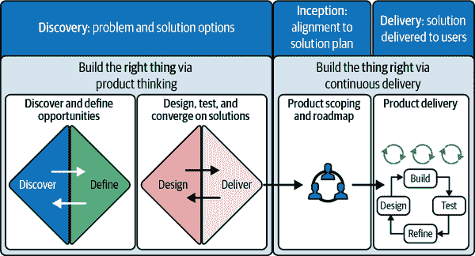

# 第二章：用于 ML 团队的产品和交付实践

> 产品开发并不容易。事实上，大多数产品开发的努力都会失败，失败的最常见原因是构建错误的产品。
> 
> 亨里克·尼伯格，敏捷和精益教练
> 
> 你可以每天练习投篮八个小时，但如果你的技术不对，那么你所做的一切就只是很擅长错误的投篮方式。掌握基本功，你做的每一件事都将提高水平。
> 
> 迈克尔·乔丹

在第一章中，我们介绍了为交付 ML 解决方案所需的五个学科：产品、交付、ML、软件工程和数据。在本书的第二部分中，我们将专注于许多工程、ML 和数据实践，以帮助团队*正确构建事物*，减少苦力、浪费和重做。这些实践将提高速度和产品质量。然而，首先要从产品和交付实践开始，帮助团队达到一个更重要的目标：如何*正确构建事物*。

在本章中，我们将专注于 ML 产品交付生命周期的方面，我们经常看到团队由于缺乏清晰度或客户或业务需求与产品工程团队交付之间的不一致而导致努力付诸东流。我们将介绍在我们真实的 ML 项目中帮助我们的产品和交付实践。本章组织起来，以解决产品交付的三个关键阶段：

发现

帮助团队理解和定义机会，并塑造适当解决方案的形式

启动

为执行制定共享计划

交付

为了在管理风险的同时交付解决方案，并根据需要集成连续发现来不断改进解决方案

图 2-1 作为本章每个部分的视觉锚点：发现、启动和交付。在发现阶段，我们使用英国[设计委员会的双钻石设计过程](https://oreil.ly/VVCyY)，该过程包括四个组成部分：发现和定义机会，以及设计和提供解决方案选项。启动阶段被视为一个单一时间段，包括多种活动，涉及各种利益相关者，以确保交付计划反映关键考虑因素。交付阶段采用连续交付和支持 ML 的活动模型（例如，持续发现）。我们建议参考图 2-1，以帮助您在本章中导航产品发现和交付实践。¹

###### 图 2-1\. 产品发现、启动和交付阶段的视觉总结（来源：根据[设计委员会的双钻石设计过程](https://oreil.ly/VVCyY)和[Tanvi Mehta 的“如何成功运行发现”](https://oreil.ly/sEVOy)调整的图像）

尽管我们对这一章节的方法是以流程为中心的，我们讨论的实践有助于我们更好地理解和响应客户和用户的需求。在这方面，我们认为强调用户或客户为中心的心态和方法的重要性至关重要，为此我们将在本章后面介绍*设计思维*。还需注意，解决方案必须作为商业产品（或其他资金模型）是可行的。在这方面，我们使用术语*产品思维*来概括设计思维和产品管理。也许这对介绍来说是很多新术语，但这是一个丰富的领域，无论是构建 ML 还是任何类型的数字产品。然而，通过我们的流程镜头，我们将致力于提供清晰、实用的技术，可以帮助您的团队在产品交付的每个阶段。

尽管我们按顺序介绍了发现、定义和交付产品的过程以便阅读，但重要的是要注意，如果团队想要提高构建正确事物的机会，这些活动必须以协作的方式进行（通常是持续的）。否则，我们将陷入“小瀑布”模型的陈旧模式，其中发现和交付在产品、设计、ML 和工程之间存在笨重的交接。在这方面，我们的指导哲学是精益和敏捷。

我们的阶段与其他已发布的框架（如[Atlassian 产品交付框架](https://oreil.ly/moXX_)）类似，包括 Wonder、Explore、Make 和 Impact。您可能有自己的产品或项目交付框架，并为这些阶段命名，只要框架遵循以下基本原则即可：

+   理解客户需求

+   敏捷规划

+   提早并经常交付价值

+   响应所学

这些框架呈现了世界的有序视图。一个补充模型是[设计之波](https://oreil.ly/pWfkm)，显示了产品设计的现实受到不确定性的主导，但设计的意图是在时间内收敛到良好的解决方案（见图 2-2）。当产品开发的现实特别混乱时，这种波形可能提供一些安慰。

###### 图 2-2\. 设计之波过程（来源：Damien Newman，[thedesign​squig⁠gle.com](https://oreil.ly/pWfkm)，经允许使用）

ML 产品交付面临独特挑战，因为业务和客户可能并不清楚他们对 ML 产品需要什么，或者可以期待什么。很难*事先*知道 ML 系统在我们可能策划的数据上的表现如何。一方面，我们可能会进行产品构想，但最终得到的想法可能在技术上是不可实现的。另一方面，在进行一些实验并看到一些工作软件之前，我们可能不知道 ML 可以实现哪些产品特性。为了解决这一挑战，我们将在本章后面介绍一些技术，如双轨交付模型，来帮助团队进行持续发现。

通过理解和实施这些产品和交付实践，团队可以弥合所需和可实现之间的差距，并确保他们开发的 ML 解决方案不仅在技术上可行，而且对客户是可取的并且对业务是可行的。

因此，让我们深入探讨本章的三个部分之一：发现。我们将详细介绍双钻石设计过程的各个阶段的具体技术，以及团队可以从这些技术中期待的结果。

# ML 产品发现

> 良好的产品发现在整个决策过程中都要包含客户。
> 
> 特蕾莎·托雷斯（Teresa Torres），《*持续发现习惯*》（Product Talk, LLC）的作者。
> 
> 只是尽力而为是不够的；你必须知道该做什么，然后再尽力去做。
> 
> [W.爱德华·戴明](https://oreil.ly/HYo11)

如果你曾经参与过一个团队：

+   将一个 ML 解决方案交付到生产环境，结果发现其远未达到预期的使用或参与水平

+   基于无法验证的假设，对 ML 产品的某些部分进行了过度工程化。

+   一次又一次地建立了概念验证（PoC），但从未交付给用户

+   无法为一个 ML 机会提出令人信服的业务案例

这些挑战源于不足的产品发现。像所有其他数字产品一样，ML 产品需要一种结构化的[发现](https://oreil.ly/tbRzj)方法，以确保产品满足客户的需求。没有产品发现，团队就错失了完全理解问题领域的机会。因此，他们增加了在建造错误产品或功能上投入时间和精力的风险。

尽管在特定阶段需要进行一定程度的发现来启动新产品计划，但发现也是 ML 项目交付过程中的一个*持续过程*，特别是因为在最初的发现阶段我们很少有机会接触所有将在生产解决方案中使用的数据。最终能够获得和使用必要的高质量数据可能会验证我们在发现阶段做出的初始假设或原型，或者可能会显示在生产中实现所需的性能是不可行的。我们需要一种机制——*持续发现*——尽早揭示这些问题。

以 Discovery 作为初始阶段，双钻石设计过程可以节省 ML 团队数月时间，否则可能会浪费在解决错误问题或追寻错误解决方案上。首先在问题空间和解决方案空间中采用分散和然后收敛思维的一般原则，几乎适用于任何问题解决场景，您可能会发现自己在运行会议、编写代码或计划晚宴时也使用这种模型！如图 2-1 中所示，双钻石设计过程的 Discovery 阶段包括四个子阶段：

发现

理解问题而不是仅仅假设。这包括与受问题影响的人，例如客户和用户，进行交谈并花时间。

定义

从 Discovery 阶段获得的洞察可以帮助以不同的方式定义挑战或问题。

开发（我们在本章中称之为设计）

为明确定义的问题生成不同答案，从其他地方寻找灵感，并与各种不同的人共同设计。

交付

在小规模上测试不同的解决方案，拒绝不可行的，并改进那些可行的。

您可以在由 Thoughtworks 和 Guide Dogs Victoria（GDV）制作的关于设计视障和低视力人士辅助技术的[短视频](https://oreil.ly/XU4yi)中实践这些阶段。由 UX 研究领导的团队花时间*发现*了 GDV 客户更喜欢使用非导盲犬解决方案的各种情景，导致他们*定义*了穿越斑马线时偏离路线的问题（团队也亲身体验了这个问题，戴上眼罩）。然后他们使用不同的技术策略（包括 ML（计算机视觉）、基于蓝牙信标的解决方案和传统白色盲杖上的光学传感器）*设计*了多种解决方案。通过多轮原型设计分析和测试这些潜在解决方案，最终*交付*了光学传感器解决方案的工作原型。

###### 注意

重要的是要意识到，并非所有产品都直接面向客户。也许您是 ML 平台团队，为您组织中的 ML 从业者[交付平台产品](https://oreil.ly/f2iY0)。或者您的团队正在构建 ML 启用的[数据产品](https://oreil.ly/QOkkt)，这些产品由拥有客户面数字体验的其他团队使用。例如，在线书店的 ML 团队可以构建一款书籍推荐数据产品，为任何客户返回推荐书籍清单。然后，这些数据产品可以被营销团队用来通过电子邮件向订阅客户发送个性化的书籍推荐，或者被网页主页或移动主页团队用来在用户登录时显示个性化推荐。

尽管这些数据产品可能不直接面向客户，但它们最终会体现在客户体验中，或者它们可能为组织内部的内部客户提供服务。因此，它们仍然受益于我们在本章描述的所有实践。在第十一章，我们将讨论客户面向团队和内部面向团队如何最好地合作，以提供价值并避免浪费或重做。

让我们看一些有助于完成第一颗钻石的前半部分：发现机会。

## 发现产品机会

在本节讨论的这些技术帮助团队将对产品想法的模糊直觉转化为一组清晰表达和可测试的关于问题的假设。它们有助于表达客户的需求以及解决方案可能为企业带来的潜在价值。这被表示为双钻石图表的第一个季度，参见图 2-1。

在发现过程中，我们有意将客户置于中心位置。一些突出客户声音的显著技术包括人物角色、客户旅程绘图、情境查询和客户访谈。这些是体验设计领域常见的工具，每一种都能为用户和客户提供独特的洞察。让我们来看看每一种技术。

一个良好的起点是[人物角色](https://oreil.ly/VvBd1)。人物角色是基于研究的虚构角色，代表您的目标用户。开发人物角色帮助团队清楚地了解用户的行为、目标、挫折和人口统计特征。通过创建人物角色，团队可以更深入地共情他们的用户，更精确地为用户需求量身定制解决方案，并就产品特性和设计做出更为明智的决策。人物角色还为下一种技术铺平了道路：客户旅程绘图。

[客户旅程绘图](https://oreil.ly/gFEwh)以视觉方式捕捉整个客户体验，突出接触点、情感和互动，有助于识别痛点和机会。利用这一技术，我们从初始需求或触发点开始，通过各个参与阶段，直到达到期望的结果，绘制客户的旅程。考虑到我们已经开发的人物角色，我们应该了解他们在与产品或服务互动的每个阶段的经历、感受和挑战。结果是一个全面的视角，帮助团队识别满足客户需求的空白和机会。

[客户访谈](https://oreil.ly/N4NYC)是另一种可以通过结构化对话帮助揭示客户愿望、痛点和感知的技术。这种一对一的互动提供了直接的参与，为企业提供了验证假设和将产品方向与实际客户需求对齐的洞见。话虽如此，我们都知道客户说他们会做什么与他们实际做的可能存在差异。为了调和这一点，我们可以使用[情境查询](https://oreil.ly/W_bEB)来观察用户在其自然环境中的行为，这提供了对他们面临的挑战和真实行为的补充理解。

你可以通过一系列[其他发现活动](https://oreil.ly/LUL2t)，例如日记研究、竞争对手研究、调查或探索性数据分析，来增强这些核心技术。请注意，调查和探索性数据分析提供定量信息来增强定性洞察——它们可以揭示“多少”以及“是否”存在机会。

综上所述，这些技术为我们关于问题/解决方案匹配和产品/市场匹配的假设制定和测试提供了基于证据的基础，推动以客户为中心的产品开发。

###### 注意

尤其是在探索机会的初期阶段，这些发现技术最好由用户体验（UX）研究员设计和引导。他们在客户研究和产品设计方面的技能有助于发掘客户的声音，并将发现围绕各种客户人物的需求进行锚定。

同时，首席用户体验（UX）专家应积极与团队分享发现的学习和见解，以建立共鸣，让团队看到客户的问题并且深入了解客户的处境。在必要时，他们还可以将机器学习或工程领域的其他专家纳入其中。出色的领导可以帮助团队成员进行这些活动，同时注意不要引入自己的偏见。

现在，我们已经广泛涉足并发现了问题见解，是时候聚焦机会了。让我们看看有助于第一个菱形的后半段的实践：定义机会。

## 画布定义产品机会

画布是在 Discovery 期间捕捉机会的强大工具，因为它们有助于表达、外化、辩论、测试和发展想法。画布是 Lean 技术[A3 管理](https://oreil.ly/23YBB)的演变和扩展。它们旨在帮助人们理解问题，并确定数字解决方案。一个有用的画布是[价值主张画布](https://oreil.ly/DO4Yf)。正如在图 2-3 中所示，价值主张画布帮助团队理解客户的需求——期望或“收益”，挑战或“痛点”，以及要完成的工作，并考虑他们如何设计产品和服务来满足这些需求，通过创造收益和减轻痛苦。

###### 图 2-3\. 价值主张画布（来源：改编自[Strategyzer](https://oreil.ly/DO4Yf)，已获许可）

让我们再看看另外两个画布，特别适用于突出设计和交付 ML 产品中常见的特定关注点：数据产品画布和假设画布。

### 数据产品画布

对于 ML 产品发现，评估候选解决方案的价值和可行性非常重要。在这方面，一个有帮助的工具是[数据产品画布](https://oreil.ly/bLs8B)，它提供了一个框架，连接数据、ML 和价值创造之间的关系。你可能之前听说过[ML 画布](https://oreil.ly/75fLn)，但 ML 画布的一个缺点是不包括成功的衡量标准，这对于在利益相关者之间获得一致性和协议，评估候选 ML 解决方案的适用性是必要的。数据产品画布弥补了这一空白，并提供了一套全面的维度，用于塑造 ML 机会（见图 2-4）。

###### 图 2-4\. 数据产品画布（来源：改编自[Leandro Carvalho, PhD](https://oreil.ly/bLs8B)，已获许可）

如图 2-4 所示，数据产品画布分为三个部分：产品（左上四部分）、业务战略（右上三部分）和业务成果（下三部分）。我们将对如何有效使用画布的每个部分提供评论，你可以参考图 2-4 中的细节和问题来探索每个部分。

产品

*问题：* 我们首先要清楚地定义问题，利用我们从 Discovery 中学到的知识。要提出三个关键问题：问题是什么？为什么是问题？是谁的问题？正如[查尔斯·凯特林](https://oreil.ly/3keSv)著名地说过，“一个清晰定义的问题就是问题的一半解决了”。通过阐明问题，团队将避免浪费精力解决错误的问题。

*数据：* 我们确定解决方案将依赖的数据和输入，以及我们将如何访问或策划数据，并确定其适用性或质量。这些是开发过程中必然会遇到的问题，因此在开始时就解决它们可以帮助我们识别潜在的障碍。

*解决方案：* 接下来，我们定义问题的候选解决方案。这涉及概述一个清晰、可操作的方法来解决核心问题，考虑到用户需求和业务目标。

*假设：* 在产品开发过程中，我们总是做出假设（例如，特性 X 将帮助用户实现 Y）。假设帮助我们将这些假设框定为可以通过一系列实验测试和验证的陈述。我们可以使用以下模板定义假设：

+   我们相信[这种能力]将导致[这种结果]。

+   当[我们看到一个可测量的信号]时，我们将知道我们已经成功了。

假设我们有一个想法，即显示个性化产品推荐将提高销售。我们可以定义一个假设，随后进行实验来测试这个想法。例如：

+   我们相信显示个性化产品推荐将导致平均订单价值的增加。

+   当我们看到平均订单价值增加 10%时，我们将知道我们已经成功了。²

业务策略

*演员：* 我们确定所有演员——顾客、利益相关者、赞助者等——他们将在产品中有所涉及。在验证他们是否与我们在画布的产品部分——问题、解决方案、数据和假设中的内容产生共鸣之后，我们进一步细化这份名单。

*行动：* 我们定义了一旦解决方案准备好就将实施的行动。这有助于定义 ML 产品的下游受益者，以减少将产品留在货架上或在云端花费资金的机会。有用的问题包括：

+   列出的演员将如何与产品互动或从中受益？

+   产品如何为业务产生价值？

*关键绩效指标（KPI）：* 这些是我们可以用来评估或监控整个 ML 产品生命周期中成功的技术或运营指标。制定 KPI 的有用问题包括：

+   我们如何评估模型是否“足够好”或“比以前更好”？

+   ML 产品效果或准确性的可接受不确定性水平是多少？

+   误预测的实际业务成本是多少（例如，假阳性和假阴性）？

业务结果

*价值：* 阐明机器学习产品的潜在价值可能很困难，但这是筛选出低价值想法的重要步骤——这是我们在沉没了数月时间和多人精力之前应该做的事情。阐明价值有助于解决方案设计，并重新构思要解决的问题。也许提出一个“难题”问题对于机器学习产品来说是理想的，但在技术上实施起来可能过于具有挑战性。了解产品的独特价值主张有助于我们重新调整产品范围。首先问一个关键问题（例如，我们能否推荐用户会点击或购买的书籍？）将帮助我们开始收集我们最终需要解决的难题所需的数据（例如，我们能否根据用户与其他书籍的互动实时推荐书籍给用户？）。

*风险：* 虽然数据产品画布并非旨在作为风险管理工具，但识别和映射风险对于全面规划至关重要。了解潜在风险有助于启发我们如何在交付之前和期间评估和减轻这些风险。用于识别风险的有用框架包括[德尔菲法和 SWOT 矩阵](https://oreil.ly/-KLjc)。用于识别风险的有用问题包括：

+   这个产品可能出什么问题？这个产品的失败模式是什么？

+   模型犯错对业务和产品的成本是什么？

+   这些风险可能会有什么影响？

*性能和影响：* 本节重点评估产品对业务的影响以及如何衡量它。通过阐明一个想法对业务的预期影响，并承诺随时间对其进行衡量，您正在支持对话以获得业务的支持和一致性。有用的问题包括：

+   我们应该使用哪些业务指标来衡量成功，以及我们将如何衡量它（例如订阅者或会员人数、收入、客户满意度分数）？

+   那个指标的基线是什么？

+   这个新产品预计会带来多少收益或节省？

###### 警告

机器学习团队经常犯的一个错误是：我有一个“闪亮的锤子”，现在可以用它解决什么问题？根据我们的经验，除非团队首先识别出真正的客户问题要解决，否则很少会产生良好的结果。

在开发产品时，关键是要记住技术和“如何”只是次要的。主要关注点应始终放在“什么”上。产品解决了什么问题？它为客户带来了什么价值？

一旦问题和需求被确定，我们就可以更好地集中我们的技术努力，以便在最佳方式下利用 ML 来解决问题。在某些情况下，我们可能会发现，ML 只是解决方案的一个小组成部分。还有可能出现情况——例如在前面分享的 Guide Dogs Victoria 案例中——ML 不是最佳解决方案。也许客户更喜欢其他选择。也许其他选择在技术上更可行。或者也许其他选择对于组织来说更可行。

### 假设画布

另一个帮助我们系统地阐述和在快速周期内测试想法，并随着时间推移记录学习成果的画布是[Hypothesis Canvas](https://oreil.ly/Ta7Ss)（见图 2-5）。³ 我们在第一章介绍了这种画布。假设画布帮助我们在制定可测试的假设、识别客观指标和设计轻量级实验方面减少不确定性，以迅速验证或无效化想法。这种技术对于发现非常有帮助——无论是作为产品初始阶段的发现，还是在交付过程中持续和连续的发现，正如我们之前提到的那样。（我们将在“交付活动的节奏”部分讨论持续发现。）

###### 图 2-5\. 假设画布（来源：“数据驱动的假设开发”由 Jo Piechota 和 May Xu，经许可使用）

例如，在 2023 年由生成式 AI 引发的兴奋情绪中，您可能会涉足一个模糊而激动人心的想法池，探索如何利用 AI 来改进产品体验或内部流程。我们以前也曾处于这种境地，而假设画布帮助我们阐明业务价值和成功度量标准，并协作地排名和优先考虑哪些假设需要优先测试和交付。这是一种有用的方法，可以在各种利益相关者——业务、产品、工程、ML 等之间创建对齐。当我们使用这种画布时，我们能够看到各种想法的潜在价值，并据此过滤和优先考虑它们，以更加聚焦我们的努力方向。

通过阐明假设的参数，如图 2-5 所示，我们可以专注于寻找重要问题的答案，例如*为什么*一个想法可能有价值，*谁*会从中受益，以及*如何*知道我们何时成功了。当我们把焦点从解决方案（例如，闪亮的 ML 技术）转移到问题本身时，我们不必固守于使用 ML 来解决问题的需求。在某些情况下，我们可能会发现，我们可以简单而可靠地解决问题，而无需使用 ML——这是在提供价值的同时避免增加不必要复杂性的一条途径。万岁！

现在您已经看到了发现和定义机会的技术，让我们看看测试这些机会假设的技术。为此，我们将转向第二个菱形，专注于快速设计、交付和测试候选解决方案。

## 快速设计、交付和测试解决方案的技术

尽管建立最小可行产品（MVP）本身就是一种测试机会假设的技术，但与其他验证技术相比，它在时间和人力成本上非常昂贵（请参阅以下侧边栏中的定义和讨论：要 MVP 还是不要 MVP？）。最终，我们希望开始建立和发布一个 MVP，在市场上与用户测试我们的产品，但我们希望有信心，我们正在投入精力到一个值得的 MVP 中。

团队可以使用以下技术以一种经济高效的方式设计、测试和完善他们的假设。这些方法帮助团队快速筛选出弱想法，确保只有具有影响力和可行性的概念才能推进到交付阶段。

### 原型

原型制作是一种经济高效的技术，允许团队在投入大量资源之前探索、测试和完善他们的想法。它是精益 UX 工具包中不可或缺的工具。

#### 一系列原型

原型制作的复杂性和真实性各不相同，从低保真草图（如[纸质原型](https://oreil.ly/GCSyj)）到更精细和[交互数字原型](https://oreil.ly/5TJRU)，甚至是技术原型，在下一节中我们将讨论。低保真视觉原型制作快捷且经济高效，允许快速迭代和反馈收集。它们特别适用于假设测试的早期阶段，重点是验证想法的基本方面。随着概念的发展，团队通常会转向更高保真的数字原型（使用工具如 Figma）甚至是技术原型。

例如，假设我们是一家在线图书零售商，我们的假设是动态实时个性化将提高客户参与度和销售额。通过与测试用户进行原型测试，我们可能会发现大多数测试用户并未参与个性化推荐，因为仅仅图书封面并不足以吸引他们——然而，如果提供一份最佳和最差评价的摘要，让他们了解社会证明并且判断这本书是否会让他们感到满意或失望，他们*可能*会保存或购买这本书。原型测试的这些学习帮助我们完善理解，并在设计和交付产品时朝着正确的方向前进。

通过迭代原型制作，团队可以快速识别并丢弃弱点想法，从而确保只进一步发展最有影响力和有前景的概念。这种原型制作、测试和改进的迭代循环有助于降低产品开发的风险。它确保在构建和发布 MVP 时，产品基于经过验证的学习、用户反馈和深思熟虑的设计方法。

#### 技术原型或概念验证（PoC）

一旦我们根据客户反馈验证了一个想法或概念，通过实际的工作软件验证想法的可行性是很重要的，而不是“幻灯片”。在机器学习中，构建技术原型或概念验证尤为重要，因为除非我们进行实验和测试这些假设并查看结果，否则很难确定 ML 模型的真实世界行为。

在交付阶段后期，有可能经过数月的努力构建 MVP 后，我们得知 MVP 的 ML 模型无法达到生产发布的性能预期。这是我们希望避免的情况，我们可能可以通过概念验证来避免这种情况。例如，如果我们从发现阶段得知供应链部件预测模型性能不佳可能会给企业造成数百万美元的损失，我们可以建立一个 PoC 来界定其可行性。一个设计良好的 PoC 可以帮助我们*发现*性能、技术可行性或对各种因素的敏感性的任何限制，并帮助我们确定一个想法是否准备好*交付*和产品化。此外，PoC 还帮助团队尽早发现成功的措施、潜在的陷阱、意外的技术挑战和适当的问题框架。

注意，PoC（概念验证）可能无法证明某一概念的可行性或可行性，并且可能只能证明我们尚未找到解决这个特定问题的方法。如果发生这种情况，您可以将其视为有价值且低成本的学习机会，以及将资源引导到更有前景的机会的机会。

根据我们在本章中概述的流程，根据客户或业务需求展示的概念验证（PoC）可以成为获取利益相关者支持的有用工具，因为它们提供了解决方案可行性的具体证据。做得好时，它们可以帮助将复杂的机器学习方法和行话转化为可视化演示和具体成果，从而使非技术利益相关者能够轻松理解所提出解决方案的价值和技术需求。

现在，让我们看看另一种测试潜在解决方案的技术。

### 风险假设测试

> “最小可行产品”一词的核心有一个缺陷：它不是一个产品。这是一种测试您是否找到了值得解决的问题的方法。一种减少风险并快速测试您最大假设的方法。与其构建 MVP，不如识别您最危险的假设并测试它。用最危险假设测试（RAT）取代您的 MVP 将节省您大量的痛苦。
> 
> [Rik Higham](https://oreil.ly/_tqzU)

在他的文章[“MVP 已死，长命 RAT”](https://oreil.ly/_tqzU)中，Rik Higham 明确简明地指出：构建 MVP 涉及测试少数非常危险和许多不那么危险的假设。进行最危险假设测试（RAT）将是一种更具成本效益的技术，用于识别和测试可能决定产品成败的最关键假设。Rik 建议我们：

列出所有大的假设并确定最危险的一个

记下所有必须成真才能使产品成功的假设。为每个假设评定一个风险分数（风险定义为可能性和影响的乘积）——简单的 T 恤尺码（小、中、大、特大）即可。确定那个假设，如果错误，将对项目成功造成*最*严重的影响。这是最危险的假设，可能涉及到客户行为、市场需求、技术可行性或产品的任何其他关键方面。

为最危险的假设定义一个测试

测试应尽可能简单和集中，直接解决假设。测试可以采取用户访谈、最小技术 PoC 甚至[假门测试](https://oreil.ly/Z2Ykm)的形式——即用于评估感兴趣的用户数量的登陆页面。[Cadabra Studio 的一篇文章](https://oreil.ly/q3byP)描述了在 Airbnb、Zappos 和 Buffer 设计的其他创意测试。

进行测试

进行测试以收集围绕我们最危险假设的数据。如果假设得到验证，项目可以以降低的风险水平继续进行。如果假设被证伪，项目可能需要转向，或者团队可能需要重新评估他们的方法。

在发现阶段，最危险假设的测试可以作为坚持或转变的标准，并鼓励快速学习周期和敏捷适应，这两者都是帮助减少我们投入交付工作的不确定性的关键因素。

在我们的发现阶段结束时，团队和业务应该就一个（或几个）产品理念达成一致，这些理念可望受欢迎（即，能满足客户的需求或愿望）、可行（即，能盈利）和可行（即，基于给定资源和约束条件可实现）。来自发现阶段的证据和共享背景支持必要时制定令人信服的商业案例并获得资金来开发产品机会的过程。

在这一时刻，团队将转向产品交付的下一阶段：Inception。Inception 帮助团队定义关于产品范围、技术、交付计划和风险管理等方面的可操作计划，以在产品交付过程中引导团队朝着正确的方向前进。这也是我们接下来要讨论的主题。

# Inception：为团队的成功铺平道路

在我们开始交付和编写代码之前，通过使所有关键人员围绕一个轻量级计划达成一致，我们可以提高成功的机会。我们并不是在谈论那种详细的瀑布式计划，这种计划是为了执行而交给团队的，而是通过协作的“及时规划”，为团队提供足够的起飞时间来开始构建解决方案，并使所有人对交付风险保持一致。这些交付风险通常包括关于产品范围、完成定义、工作方式以及更广泛的组织依赖的期望不一致。如果这些不清楚，交付团队必然会因未经管理的风险变成问题而遭遇发布延迟。然而，如果利益相关者了解风险并具有监控和应对的机制，团队可以避免这些延迟，甚至提前取得成功。

在本节中，我们将解释：

+   什么是 Inception，为什么它对帮助团队定义清晰的交付计划非常有价值，以及团队如何实践它

+   如何编写用户故事来表达功能描述，从客户的角度来强调通过突出客户需求、业务价值和完成定义来指导开发

## Inception：它是什么，我们如何做？

记住关于共享梦境并在某人的心灵中植入想法的[电影](https://oreil.ly/yd50Z)吗？通过在他们潜意识结构的第五层执行一次史诗般的抢劫来实现？恰巧地，在这个背景下，《盗梦空间》与此类似，其根本目的是帮助团队和利益相关者达成对产品愿景、范围、目标和交付计划的共识。我们知道在交付过程中会需要对变化做出响应，而在开始时达成共识可以为我们打下良好的基础。

Inception 包括一系列活动，帮助团队开始*塑造、大小化*和*排序*交付产品所需的工作。根据项目规模的不同，其持续时间可以从几天到四周不等，但通常我们希望不要延长此过程。一个经验法则是：做足够的计划来启动工作。Inception 应该始终紧随交付之前进行，并应该涉及与交付相同的团队⁴和利益相关者。Inception 的轻量级特性得以通过将丰富的上下文信息带入交付中来实现。通过确保从一开始就有清晰的理解和一致性，团队可以避免许多由于期望不明确或不一致而产生的常见问题和挑战。如果在阶段之间存在重大暂停，或者团队发生变化，那么这些上下文信息就会衰退或完全丢失，交付团队可能会对计划没有归属感，也没有完成它的承诺。

虽然 Discovery 侧重于我们应该解决的问题以及可能构建的解决方案，但 Inception 则侧重于进一步阐述解决方案，包括解决方案的技术方面以及团队将如何交付，以便就计划达成一致。理想情况下，一个团队将从 Discovery 中携带上下文进入 Inception，然后进入交付阶段，以保持共享理解，并在交付团队和业务利益相关者之间获得对需要完成产品交付的工作范围和顺序的认可。

如果由于预算编制和资金原因需要分隔产品交付的阶段，则最佳分隔团队或活动的时机是在 Discovery 和 Inception 之间。在这种情况下，应仔细记录 Discovery 发现的有关机会和可能解决方案的结果。Discovery 应该阐明解决问题的价值，并且应该能够基于 Discovery 的结果做出某种程度的交付承诺的前进/放弃决策（例如，为期六个月的团队）。如果决定“前进”，那么 Inception 和交付将作为一个包交付。

如果非常重要不要超出 Inception/交付包分配的人员和资源，那么 Inception 计划可以集中于在这些限制内可实现的交付范围，而不是试图理解交付特定范围的时间表。如果 Discovery 进行得不够完整，并且需要进一步阐明才能做出前进/放弃决策，那么在 Inception 之后还可以设立前进/放弃门，如果做出“放弃”决策，则意味着该倡议的结束（直至有所变化）。通过这些方式，我们可以通过 Discovery 和 Inception 降低投资风险，同时保持这些方法的优势。

在极少数情况下，问题或机会可能如此明确、简单且引人注目，以至于不需要进行发现阶段，产品交付可以从初始阶段开始（请注意，但是如果没有适当的发现，我们可能无法确定问题实际上是否简单，或者只是表面看起来简单！）。

现在我们来详细了解如何运行一个初始阶段。

## 如何计划和运行一个初始阶段

设计初始阶段议程取决于团队在要构建的解决方案周围的现有知识和背景。在本章中很难预先确定初始阶段活动的列表，因为它取决于特定计划的需求。但是，有一些很好的资源——[“如何计划一个初始阶段”](https://oreil.ly/VBJmy)、[“精益创始”](https://oreil.ly/G_XOU)、[Atlassian 的“团队工作手册”](https://oreil.ly/9wwDZ)——可以帮助您选择一系列研讨会和活动，以组成您的初始阶段议程。这些活动旨在为业务、产品、人员、流程、技术和优先级问题创建清晰度。

至少，我们建议一个初始阶段议程，包括 表 2-1 中概述的活动。每个活动在 [“如何计划一个初始阶段”](https://oreil.ly/VBJmy) 中都有详细描述。我们建议使用这作为起点，并根据您的特定需求定制您的初始阶段议程。

表 2-1\. 初始活动、目的和工件

| 活动 | 目的 | 工件 |
| --- | --- | --- |
| 1\. 优先事项的对齐（例如，愿景设置、权衡滑块） | 建立关于问题和产品的共享愿景，确定关键优先事项和成功的度量标准 |

+   [电梯演讲](https://oreil.ly/Bpxl6)

+   [权衡滑块](https://oreil.ly/D743M)

+   成功的度量标准

|

| 2\. 定义 MVP | 确定产品的关键元素，以及必备功能的发布 |
| --- | --- |

+   [MVP 画布](https://oreil.ly/6asI6)

+   [假设](https://oreil.ly/-qmxz)需验证

|

| 3\. 跨功能需求（CFR） | 确定 MVP 的关键运营和架构方面，这些因素可以决定其成功或失败 |
| --- | --- |

+   一个与 MVP 相关的[跨功能需求](https://oreil.ly/W6qcM)列表

|

| 4\. 解决方案设计与最小可行架构 | 描述解决方案的基本架构设计 |
| --- | --- |

+   [解决方案架构](https://oreil.ly/qrHTr)（这里可以使用 [C4 图表](https://oreil.ly/PemHl) 作为参考）

|

| 5\. 到生产的路径 | 可视化并映射达到软件变更生产所需的步骤、人员、工具、任务和输出（注意：我们将在第 3、4 和 9 章进一步讨论这个话题。） |
| --- | --- |

+   [到生产的路径图表](https://oreil.ly/g17TK)

|

| 6\. 风险、假设、问题和依赖（RAID） | 识别可能影响产品成功的风险、假设、问题和依赖关系 |
| --- | --- |

+   [RAID 画布](https://oreil.ly/_TNrQ)

|

| 7\. [安全威胁建模](https://oreil.ly/z_ySr) | 识别、评估和找到减轻系统或产品潜在安全威胁的方法 |
| --- | --- |

+   Artifacts could include [攻击树](https://oreil.ly/A15wI)，或者一个概述关键风险和减轻计划的威胁模型（包括[ML 特定的安全漏洞](https://oreil.ly/3h4pQ)）

|

| 8\. 伦理和[负责任技术](https://oreil.ly/icVNH) | 识别潜在的伦理违规行为，并建立指导方针，确保产品中技术的负责任使用 |
| --- | --- |

+   文档依赖于具体的活动，但可能包括故障模式和影响分析表，或负责任策略文档

|

| 9\. 发布计划 | 计划产品的发布时间表，包括里程碑和迭代 |
| --- | --- |

+   [高级用户故事地图和 MVP 待办事项](https://oreil.ly/KEFwb)

+   [故事估算](https://oreil.ly/7oaom)

|

| 10\. 工作方式 | 确立团队在日常工作中如何协作、沟通和操作，以确保向项目目标有效和高效的进展 |
| --- | --- |

+   [工作方式](https://oreil.ly/Zvowc) 文档

+   [团队成员的角色和责任](https://oreil.ly/RA-mw)

|

注意，开端活动的机制在取得良好结果方面也至关重要。在短期、集中的时间内，包括视觉和口头协作，涉及到正确的人员、全面的参与和强大的引导将产生最佳结果。主持人应仔细关注会议设计，通常包括视觉和语言协作，准备鼓励或调节贡献，以确保输出代表整个团队的集体知识。

在远程工作和地理分布式团队的世界中，远程协作和视觉引导工具在这些开端活动中非常有帮助。它们鼓励视觉思维、清晰沟通和团队成员之间的共享理解，因为团队塑造产品交付计划的各个方面——无论是技术、业务、风险、范围等（不用说，在会议期间所有参与者应全神贯注，而不是查看电子邮件或消息！）

这些活动产生的文档对团队在执行过程中的指导至关重要（请参见侧栏中的示例）。其中一些输出成为活的文档，在交付过程中进行迭代审查和更新，以反映我们随时间积累的知识和上下文。

你可能想知道，我如何知道一个开端是否成功达到了其目标？有一个很好的试金石。在开端结束时，团队和利益相关者应该都：

+   描述第一个发布或 MVP 的同样愿景、商业价值和范围（参见图 2-7 中的示例用户故事地图）。

+   理解优先级基于客户价值排列的高层用户故事的积压。

+   确定第一个和后续版本的路线图或时间表，基于高层次的工作量估算和交付活动的节奏。

+   确定指标，以表明我们是否在正确的轨道上，或者是否需要调整方向。

+   对主要风险、假设、问题和依赖关系有清晰共享的视图。

图 2-7 中展示的书籍策展项目是我们编造的一个例子，提供个性化的书籍推荐。MVP 线条表示 MVP 发布范围内的内容——这是在启动阶段根据团队讨论价值和努力确定的。实际的用户故事地图将涵盖更多故事，但在此图像中，我们仅保留了几个以提高可读性。

###### 图 2-7\. 一个书籍策展产品的示例用户故事地图

正如你可能在图 2-7 中注意到的，尽管高层次用户故事在价值方面已经清晰，但仍需要更多详细信息。随着工程师和机器学习从业者深入到技术任务，例如在迭代零中设置通往生产路径时，产品三角（产品经理、工程师负责人、设计师）⁵通常会协作，为即将到来的迭代或迭代完善用户故事。

鉴于用户故事定义产品迭代，现在让我们看看一些有助于团队编写有效用户故事的实践和技术。

## 用户故事：MVP 的构建块

[用户故事](https://oreil.ly/tFJKe)是能独立交付到生产中的最小价值单位。用户故事是产品功能的量子或构建块。在敏捷方法中，它也是项目范围的量子或构建块，因此产品和项目进度是相互关联的。用户故事是将想法、意图和背景转化为明确的、经过业务验证的验收标准的载体，指导团队成员——无论是开发人员、数据科学家、机器学习工程师、质量分析师等——知道应该构建什么，以及如何确定特性何时完成。

让我们来看看定义和完善用户故事的技巧。

### 用户故事是垂直切片的。

垂直切割的故事不仅仅是一个需求文档。它可能不像传统的需求文档那样提供详细信息，但它提供了更多的背景信息、测试规范、协调工作和跟踪进度的手段，并承诺在具有不同专业化的团队成员之间关于用户需求的丰富对话。一篇写得好的垂直切割的故事帮助我们进入解决问题的正确思维方式。因为在我们接手一个用户故事的瞬间，我们将焦点从工程和机器学习实现细节的低级细节转移到如何*构建正确的东西*的高级理解上。

那么，一个垂直切割的故事可能看起来如何？垂直切割的故事代表了从用户角度来看的功能或某种产品功能，贯穿了应用程序堆栈的所有层次。它包括了客户的需求，客户与产品之间的互动，以及他们期望的价值或结果。用户故事陈述从一个清晰的用户角色开始，然后是一个动作或意图，最后是期望的结果。例如：“作为[角色]，我想要[动作/意图]，以便[期望的结果]。”（见侧边栏中的示例“示例用户故事”。）

用户故事陈述通常由特定于故事的验收标准补充，这些标准提供了验证故事何时完成的方法。对于任何故事来说，“完成”通常有一个具体的含义，根据“已完成”的定义，这包括所有的跨职能要求和任务，在下一个故事可以被接手之前必须完成。

这种格式不仅清晰地阐明了用户的目标，还为开发人员和设计师提供了他们在进行设计决策时所需的背景。它还明确了业务价值和验收标准，以帮助团队共同理解故事的价值和“已完成”的定义。通过专注于端到端的用户体验，垂直切割的故事确保团队的努力与用户的目标和更广泛的产品愿景保持一致，为提供价值建立了积极的反馈循环，而不仅仅是为了完成任务而完成任务。

你可能在想，哇，这看起来像一个大故事——基于用户的浏览和购买历史训练和评估产品推荐模型，测量产品相似性，更新主页以及反馈渠道。嗯，你是对的——这是一个非常大的故事，我们特意设计了这样一个故事。我们之所以这样做，是因为解决大故事是许多团队面临的普遍挑战，我们想演示如何将其进一步切分为可以并行交付的更小的价值单元。这就是下一节的重点：切割和切块故事。

### 切割和切块用户故事

过大的故事会带来多种问题，例如增加的复杂性、估算和跟踪进度的困难，以及单个用户故事的工作进度累积数周（WIP），这可能导致瓶颈，降低团队的产出和士气。为了确保故事的范围不被放大，我们可以将一个大故事切分成多个小故事。

为了指导我们的切片决策，我们可以使用[INVEST 原则](https://oreil.ly/tvrcy)。这些原则尽可能地保持真实性，因为这些属性将成为我们评估故事垂直切片程度的指标。INVEST 是一个首字母缩略词，代表：

独立的

每个故事都应该独立存在，不依赖于其他故事。这样可以按任何顺序并行开发、优先级排序和实施。

可谈判的

故事不应该是一纸合同，而是一个开启对话的起点。细节可以根据交付团队和产品负责人之间的协作讨论和调整。

有价值

每个故事都应该为最终用户或业务带来价值。如果不能，那么将其纳入产品积压可能就不值得。

可估算的

团队应该能够估计故事所需的工作量。如果一个故事因为太模糊而无法估算，那么团队需要在故事的细节上进行澄清或进一步分解问题。

小的

故事应该足够小，能够在一个迭代内完成。如果太大，应该分解成更小、更易管理的片段。

可测试的

应该有明确的标准来确定何时故事完成并按预期工作。如果没有这一点，很难知道工作是否真正完成。

**可测性原则**，特别是在机器学习中，面临独特的挑战，尤其是在以某一度量（例如，[F-score](https://oreil.ly/OAXne)）为阈值时。首先，选择的度量可能涉及协调冲突的目标或[Pareto 前沿](https://oreil.ly/mYOsH)（例如 F-score 的假阳性和假阴性），通常具有政治元素，反映了各利益相关者的影响，以及在特定度量下谁会得到或失去什么（这是一个可以谈判的故事的地方！）。其次，在度量成为业务和客户结果的代理时，选择阈值可能会很困难。在这种情况下，需要通过迭代和进一步的协商来确定何种水平的性能是可接受的。第三，结果通常在运行之间有所不同，这需要调整以避免虚假的测试成功或失败。

这些问题固有于 ML 中，不能轻易消除。然而，可以在产品开发的正确时机进行处理，以提高成功的机会。例如，在发现或启动阶段早期捕捉并获得对组织权衡的一致意见，这样就不会在后期成为一个不愉快的惊喜。基于合理期望逐步提升阈值，而不是试图在一步到位中实现雄心勃勃的跃进。采用统计思维进行测试驱动开发和自动化测试。通过这些方法，可以提升用户故事在 ML 产品开发中的有效性。

和所有原则一样，总有例外。例如，在独立原则中，通常不可能消除故事间的依赖关系。但我们仍然尽力使它们尽可能独立，以便团队中的每对可以并行和独立地接手故事。根据我们的经验，INVEST 原则帮助我们确保我们的用户故事清晰、可操作，并与项目目标一致，从而促进更高效和有效的产品开发。

### 用户故事：对话的承诺

当团队处理故事时，团队成员可能会抱怨“这看起来仍然很模糊”，或者“这些是我不需要知道或不需要写下来的太多信息！”在同一个团队中听到这两种观点并不罕见，这是可以接受的。

垂直切片的故事是[对话的承诺](https://oreil.ly/66j7K)。我们如何知道用户故事中有适当的细节？通过从团队获得反馈来确认。在交付过程中，[故事精化和估算会议](https://oreil.ly/LOeU8)或[故事启动会](https://oreil.ly/JG8Qv)是评估是否已添加适当细节的良好机会——团队成员可能会有更多澄清问题，或者就工作范围达成共识。

高效的交付团队不会回避围绕垂直切片的用户故事进行深入对话，部分原因是团队内部真正希望保持共享理解。

在此时，我们已完成了启动和拥有一个有关第一个或两个迭代的良好用户故事的待办事项，团队已准备开始交付。现在让我们转向本章的最后部分：交付。在这里，我们将讨论有助于团队建立交付、反馈和持续发现节奏的实践。

# 产品交付

产品交付是大部分行动发生的地方，大部分成本、时间和精力消耗的地方，也是团队经历常见执行陷阱的地方，例如未计划或隐藏的工作、范围膨胀、优先级变动和未识别的依赖关系，所有这些都可能使团队计划的时间表和目标失控。这也是我们共同构建东西并向客户交付价值的地方！

在这一部分，我们将详细阐述交付和持续规划技术，帮助团队通过塑造和排列产品工程团队可以在冲刺中迭代交付的价值单元来缓解这些挑战。特别是，我们将涵盖：

+   帮助团队建立交付、反馈和持续发现的节奏的交付活动。

+   测量产品和交付的进展，帮助团队了解他们是否在进展、是否在进行正确类型的进展，以及在交付、产品和模型质量方面是否在进行足够的进展，或者是否需要调整方向。

注意，根据一个良好的开端的输出，我们应该在产品交付时具有清晰共享的交付活动节奏的视图（即在表 2-1 中定义的工作方式），以及如何衡量交付的不同维度的清晰想法。尽管情况可能会发生变化，但在每个转折点，我们都应再次共同理解变化和新状态的差异。

让我们从交付活动开始。

## 交付活动的节奏

构建和交付数字产品的过程为反馈和持续学习提供了许多宝贵的机会。根据我们的经验，我们从反馈中接收和学习的速度对于成功至关重要。例如，一个团队可能决定每两个月向产品所有者和关键利益相关者展示他们的进展，结果得到的反馈是他们误解了客户的需求。或者他们在展示过程中发现另一个团队已经解决了他们试图解决的确切问题。如果他们早些时候组织了每两周一次的展示来早期和经常地分享团队的进展，团队将会从早期获取到这些反馈。

让我们看看一系列帮助团队促进这种持续发现和持续学习的交付活动，帮助团队提高他们调整方法和产品的速率：

迭代规划

迭代规划帮助团队对即将到来的冲刺或迭代的目标和范围达成一致。当团队有一份优先级排序的精炼故事积压时，迭代规划就是拉入一组与团队迭代目标一致或定义团队迭代目标的高优先级故事集。计划进行迭代的故事还应适应团队给定的能力和速度（关于这一点，可以在关于测量交付指标的下一节中详细了解）。

规划应是一种协作努力，涉及数据科学家、机器学习工程师、产品经理和其他利益相关者，确保每个人都对团队在下一个迭代中的工作有共享理解。

根据我们的经验，迭代规划通常有助于提供有价值且早期的反馈。例如，产品负责人通常会提供关于下一个迭代中最有价值或最重要的故事的见解。这是我们宁愿在较早收到而不是较晚收到（例如，在花费两周时间处理低优先级故事后）的反馈！

每日站会

站会是一种定期的协调活动，确保团队集体有效高效地工作。查看[“站会不仅仅是站着：每日站会模式”](https://oreil.ly/jwawS)，作者为 Jason Yip，了解更多信息。

故事交付

在每次迭代中，团队（通常是成对的）将故事推进到故事生命周期的各个阶段，包括分析、开发和测试活动。个人可以参与生命周期的某一部分，也可以在整个生命周期内跟进一个故事。团队通过每日站会协调故事交付活动，其总体意图是在可持续质量的前提下最大化工作流量。通过将团队的在制工作（WIP）限制在少量故事或任务上，通常可以实现工作流和质量的优化。每次迭代的展示、回顾和未来迭代规划将基于每次迭代中交付的故事以及积压列表中剩余的内容。

定期展示

展示是分享学习和见解的机会，并就新功能或任何在进行中的工作收到反馈。通常在迭代结束时举行，展示允许对项目当前状态进行透明的沟通。这不仅是庆祝成就的时刻，也是讨论挑战和收集见解的时刻。例如，利益相关者可能会指出与更广泛组织目标一致或冲突的功能，或者强调与另一个团队正在进行的工作的协同效应。

在没有定期展示的情况下，我们发现团队可能会陷入数周的开发中，错过有价值的反馈，这些反馈可以帮助他们调整方法或方向。展示还迫使团队明确价值，并完成某种程度的功能，而不是让模糊性持续存在。

回顾会议

回顾，通常也是在每次迭代结束时进行，为团队提供了一个反思他们最近工作的论坛，讨论做得好的事情并确定改进的领域。反思对于持续学习和改进至关重要，因为它们允许团队成员公开庆祝成功，确定共享障碍，并共同策划解决方案。

当回顾做得好时，有助于促进连接、参与和心理安全。我们在第十章中进一步讨论了这一点。

持续风险管理

还记得初始阶段的 RAIDs 画布吗？那只是一个起点，我们定期回顾它以解决可能会阻碍团队成功的风险、假设、问题和依赖关系。

持续风险管理对于在问题变成主要问题之前识别和解决潜在问题至关重要。这涉及在项目生命周期中持续监控和评估风险。如果团队在工作过程中遇到任何新风险（例如，在开发过程中注意到模型质量问题或新的故障模式），团队还会定期更新他们的风险日志。

这种积极的方法允许团队及时减轻风险，而不是在问题出现时才做出反应。定期的风险评估会议可以融入团队的日常工作中，确保风险管理不是事后想到的，而是团队节奏的一个基本部分。

架构决策

在开发解决方案过程中，团队不可避免地需要做出架构决策，这可能涉及解决方案架构和使用的技术选择。这些决策对项目的可扩展性、可维护性和功能性有长期影响。因此，重要的是以协作方式处理这些决策，涉及团队的工程师、架构师和其他相关利益相关者。

通过讨论涉及相关人员并记录团队的考虑和决策，团队可以确保这些架构选择是基于充分信息、透明并且与项目当前和未来需求保持一致的。在这方面，有用的工具包括[**DACI 决策框架**](https://oreil.ly/wOrl0)⁸和[轻量级架构决策记录（ADR）](https://oreil.ly/3dgr1)*.*

持续发现

还记得我们在本章第一节中讨论的实践，例如客户访谈、客户旅程映射、原型制作和假设测试吗？嗯，这些实践不是“一劳永逸”的活动，你只需做一次，直到 MVP 或产品发布为止。在《持续发现习惯》一书中，作者 Teresa Torres 讲述了如何将这些实践应用于 MVP 或其他产品的持续迭代过程中。

通过持续参与这些实践，团队根据产品在每个时间点所需的内容，进化其对客户需求和行为的理解。这可以包括每周与客户的互动，以创建一个持续的反馈流，用于支持快速原型设计和测试。这种方法使团队能够快速验证或驳回假设，做出基于数据的决策，持续引导产品朝着正确的方向发展。

双轨交付

正如本章的第一节所暗示的，构建 ML 产品与构建典型的 Web 应用程序不同，并且通常需要实验（技术和非技术）来测试假设和假设。为了帮助我们做到这一点，我们可以应用*双轨交付*，这是一种帮助团队在构建时确定要构建正确事物的方法。它将项目分割为两个独立但相互依赖的轨道：发现和开发（参见图 2-8）。这种双轨方法通过将创新探索（发现）与有效执行（开发）结合起来，帮助团队在短周期内学习和交付。

###### 图 2-8\. 双轨交付模型的图表（来源：改编自[“AI 增强决策电气化世界”，Thoughtworks](https://oreil.ly/zVsoa)中的一幅图像）

通过采用双轨开发模型，研究和开发可以并行进行。团队可以通过“发现轨道”活动，包括利益相关者研究、文献回顾和限时数据科学实验，追求建造正确事物的知识和理解。

与此同时，团队对良好的工程实践的承诺（我们将在第三章至第九章中探讨）在“开发轨道”上允许他们以信心和速度进行适应和变更。根据我们的经验，这使团队能够正确地构建东西，以便他们可以与他们不断发展的理解协调快速和可预测地演变解决方案。

对于我们的最终交付实践，让我们来看看帮助团队量化和维护其交付和产品目标的测量方法，并在他们偏离轨道时进行纠正干预。

## 测量产品和交付

团队在整个产品交付过程中需要措施来了解他们是否在取得进展，是否是正确的进展，并且是否取得了足够的进展。在本节中，我们将介绍一些关键的测量技术以及它们应用的一些考虑因素。

### 交付测量

当团队在做工作的过程中，一个经常被忽视的做法是随着时间推移捕获有关工作的[交付指标](https://oreil.ly/OyZmp)（例如，每次迭代完成的范围、周期时间和缺陷率）。如果我们把团队看作是一个生产线——生产创造性解决方案，而不是千篇一律的小部件——这些指标有助于团队定期监控交付健康状况，并在偏离交付计划或时间轴时引起警示。

让我们通过使用[burn up chart](https://oreil.ly/DrN_a)作为示例来看看它在实践中是如何工作的，这是一种展示项目总体范围和随时间完成的总工作量的视觉工具（见图 2-9）。

###### 图 2-9\. 展示项目计划范围和每次迭代完成的实际工作的 burn up chart。在本例中，burn up chart 帮助我们注意到在第六次迭代结束计划发布之前，团队无法完成所有预期故事。

如图 2-9 所示，追踪项目的计划范围和每次迭代完成的实际工作帮助团队判断是否按计划时间交付产品，或者是否存在错过计划发布的风险。早期发现这些差异对团队当前的交付实践或在某些情况下不足的范围管理指出潜在问题极为有益。在遵循“响应变化优于遵循计划”的[敏捷原则](https://oreil.ly/fk2CY)时，团队可以通过管理范围、增加能力、专注质量甚至根据需要修改时间轴来校准交付计划。

速度——在图 2-9 中以虚线预测线的斜率表示——为迭代规划和优先决策提供信息，确保团队不会过度承诺只能交付，从而在未能达到迭代目标或计划发布时对士气或不满的利益相关者造成打击。历史速度（实线完成线的斜率）记录*实际*交付性能，并将其外推为预测速度（虚线预测线的斜率）。通常，使用最近三次迭代的平均历史速度进行预测。这种基于当前证据的预测对管理利益相关者期望、与营销等其他组织职能协调以及确保及时产品交付至关重要。它还帮助团队减轻[Hofstadter’s Law](https://oreil.ly/yuRYD)的影响，该定律指出“即使考虑了 Hofstadter’s Law，事情总是比你预期的时间长”。

此时你可能会问：那么我在团队中如何做到这一点？Atlassian 的[燃尽图文章](https://oreil.ly/DrN_a)是一个有用的参考，但简而言之，你需要测量：(i) 每次迭代完成的故事点数，以及 (ii) 所有作为 MVP 或产品发布一部分的故事的总故事点数。正如前面提到的，故事点数是基于交付团队对故事复杂性、工作量和不确定性的理解进行[估算](https://oreil.ly/7oaom)。

重要的是要注意，速度是一个团队特定的度量，意味着它并不适用于比较不同团队。相反，它的主要目的是帮助个别团队了解其自身的交付健康，并进行必要的校准和权衡，以促进朝向最终交付目标的进展。

总之，交付度量帮助我们理解我们是否正在正确构建事物。我们已经详细讨论了范围和速度，但还有其他重要的度量，如[缺陷率](https://oreil.ly/OyZmp)和[周期时间](https://oreil.ly/F81-q)。

尽早在交付过程中，我们也希望了解产品和模型性能的情况，以了解我们是否在构建正确的事物。让我们接下来看看这在实践中是什么样子。

### 产品度量

有许多用于衡量产品性能的框架，这些框架考虑产品的成熟度和组织的目标。通常的通用指标主要关注用户对产品的参与和由于产品使用而产生的财务结果，但个别产品可能有其特定的度量。这些度量是产品思维的示例。

被称为“海盗指标”（AARRR）的[令人愉悦的命名](https://oreil.ly/n7lfu)——获取、激活、留存、推荐、收入——提供了用户生命周期与产品的漏斗视图，帮助确定营销和开发工作应该集中于哪些方面以获取最大回报。由 Dave McClure 于 2007 年推出的海盗指标（或其某些变体）仍然广泛适用于 SaaS 产品。

“关键指标”（OMTM）框架鼓励产品团队专注于最适合其产品开发阶段的单一指标。它不会忽视其他指标，而是将其降为次要。它还鼓励团队寻找领先和相对的度量，以缩短反馈周期。

我们鼓励您在能够跟踪消费情况时建立这些产品度量的某个版本。

### 模型度量

我们的机器学习模型是我们交付努力的关键成果，也可能是产品性能的关键决定因素。如果我们有足够的野心，例如采用[强化学习](https://oreil.ly/Cf39t)，我们可以允许我们的模型或代理直接优化产品或业务措施，例如获取。这种方法可以通过仅允许预先批准的行动来降低风险。例如，可以使用强化学习从预先批准的集合中选择产品主图像，以最大化用户参与度。

然而，当这些直接方法不被偏好或不可行时，我们通常必须选择作为产品措施代理或组成部分的模型性能措施。然后，我们试图构建最大化这些间接措施的机器学习模型。

典型的示例指标是分类器的准确率或 F 分数。在产品开发过程中，我们设定了这些指标的雄心勃勃目标和/或最低阈值，我们可以通过持续的发现进行调整。然而，正如我们之前提到的，将产品措施转化为模型措施的过程可能并不简单，可能存在政治性，但为了赋予团队改善模型性能的自主权可能是必要的。考虑一个金融服务初创公司推出一个新产品，旨在通过流畅的注册流程实现最大化获取。现在想象一下，金融犯罪团队需要特定的最低检查，这些检查是基于指标触发的。当好客户被标记为风险时（低欺诈精度导致误报），他们可能会退出注册流程，从而降低获取率。如果不标记坏行为者（低欺诈召回导致漏报），业务可能会因为欺诈而遭受损失及其对客户的影响，甚至面临罚款或制裁。团队只能够优化到一定的平衡点。

在达成一致的措施后，我们希望通过持续的发现和交付，从当前基线或备选解决方案（例如，多数类预测）向此度量指标的目标稳步前进。考虑到双轨交付，模型性能的增益可以通过发现轨道上的实验和原型来发现，并通过交付故事将其整合到产品中。模型措施为我们提供了进展的另一视角和纠正航向的另一机会。

### 发现措施

在检验模型措施时，我们在双轨交付模型中区分了发现和开发路径。虽然交付活动的结果在很大程度上取决于用户故事中定义的内容，但发现活动的结果 *a priori* 是未知的，否则我们就不需要进行发现。

那么，挑战在于如何衡量发现过程。发现的关键指标是，您拥有一系列深入而广泛的有意义实验（用于价值创造的多个选择），这些实验可以在合理的时间框内进行（可预测这些选项的练习）。因此，对于发现，我们建议定期审查实验积压和追踪，并努力缩短实验周期，以提升模型性能。您可以参考 [“数据驱动的假设开发”](https://oreil.ly/Ta7Ss)，了解如何管理实验积压和追踪实验结果，避免陷入无休止的研发陷阱。我们还在 第十章 中从数据科学的视角讨论了这一点，即工程效率。

### 对措施的评论

团队应该意识到指标被 [误用、滥用、操纵和最终导致功能失效](https://oreil.ly/hAyjy) 的倾向和风险。正如 [古德哈特定律](https://oreil.ly/d263p) 所述，“当一个指标变成目标时，它就不再是一个好指标。” 团队应将这些指标主要视为改善自身表现的指导，而不是最终目标。我们将在 第十章 中详细讨论这一点（参见侧边栏 “衡量生产力的陷阱及其避免方法”）。领导在确保团队正确衡量成果并 [持续改进](https://oreil.ly/KbE2O) 以找到适合其组织 ML 交付能力的合适指标方面起着至关重要的作用。

需要注意的是，有效使用这些指标的能力取决于团队和组织内部的心理安全水平。我们曾见过一些情况，团队因为害怕未能按时交付而过度报告他们的进展，并低估交付过程中遇到的挑战。实际上，一切看起来都是绿色的，但事实上它们却是琥珀色或红色，而现场团队则面临着在不关注潜在障碍的情况下满足不切实际的时间表的压力。

相比之下，在一个安全的环境中，交付指标仅用于持续改进，帮助我们随着时间改进我们的“生产线”，并帮助我们实现产品交付目标。我们将在 第十一章 中讨论如何在团队内部培养心理安全。

最后的交付实践完成后，让我们总结一下关于产品和交付实践的本章内容！

# 结论

本章涵盖的所有实践都旨在帮助团队缩短反馈循环，减少浪费的工作：

+   不是两周后才发现开发者或 ML 从业者的解决方案与业务期望不符，而是花几个小时编写和验证一些用户故事。

+   与其在三个月后发现团队将错过关键的发布里程碑，不如每周花一个小时测量团队的速度。

+   与其在六个月后发现整个发布没有改善客户体验，不如通过

在本章中，我们分解了 ML 产品开发的基本阶段，强调了发现、验证、交付规划和执行的重要性，并强调了以迭代和持续的方式进行这些操作的重要性。这些产品发现、启动和交付技术旨在确保团队将精力投入到最有价值的任务上，并及早、经常地发布有价值的产品功能。此外，我们还深入探讨了应对交付 ML 产品中特定复杂性和挑战的方法。

尽管我们尽力在本章中涵盖了一系列产品创新和交付技术，但不可能覆盖所有内容。我们鼓励您将其作为起点，并通过 Teresa Torres 的[*Continuous Discovery Habits*](https://oreil.ly/Rnbmx)和 Google 的[*People + AI Guidebook*](https://oreil.ly/Bih92)等重要资源深入探讨该主题。特别是 Emmanuel Ameisen 的[*Building Machine Learning Powered Applications*](https://oreil.ly/YUH8Y)（O’Reilly）是一本关于“从想法到产品”的整本书，为成功的 ML 产品交付旅程的每个阶段提供有针对性的指导。

本章的目标是为 ML 团队提供端到端的精益产品开发流程的实际介绍，以便团队中的每个人了解他们如何为此做出贡献。本章介绍了如何构建*正确的东西*，以便后续章节中如何构建*正确的东西*的实践能够有效和高效。Emmanuel Ameisen 对*做什么*的详细研究是本书的完美补充，如果您希望深入了解 ML 产品生命周期（并看到以案例研究为例的示例），我们鼓励您阅读他的书籍。

尽管任何人都可以使用本章讨论的实践方法，但要充分发挥其作用需要练习。然而，开始练习的最佳时机是今天。理想情况下，团队应该将本章作为一种方式来找出产品和交付的差距，并将其与现有挑战联系起来，寻求必要的 UX 研究、产品管理或交付规划专业知识（无论是内部还是外部），以弥合这些差距。在没有经验丰富的从业者的情况下，我们强烈鼓励任何开发人员、ML 工程师或数据科学家尝试这些实践方法，这可能只是与真正对解决基本问题感兴趣的客户或利益相关者交谈。

作为一种收获，挑战自己通过写下以下问题的答案：

+   你如何将发现和验证技术集成到当前的 ML 产品开发过程中？

+   如何通过用户故事在产品交付过程中增强团队内的清晰度和对齐？

+   本章中你可以在下一个冲刺或即将进行的计划中尝试的一个实践是什么？

恭喜你完成了这一章节。现在我们转向第二部分：工程部分，来看一组工程实践，帮助团队快速和可靠地交付他们通过我们在本章讨论的产品和交付实践确定的产品解决方案。我们将从*有效的依赖管理—*原则和实践开始，这些实践可以帮助你避免依赖地狱的陷阱和时间浪费，通过创建可重现的和类似生产环境的环境来训练和部署机器学习模型。

¹ 我们完全将双钻石框架放在产品发现阶段内。一些框架可能会在不同地方划定边界，但是在这里划定边界为我们在发现阶段进行原型设计或测试可能解决方案留出空间，特别是在处理 ML 时管理和减少不确定性时尤为重要。然而，正如我们将看到的那样，这些双钻石活动也可能在后续的交付阶段甚至持续进行。

² 测试这一假设的一种非常昂贵的方法是构建一个实际的产品，将其放在客户面前，看平均订单价值是否增加。通过将我们的假设表述为假设，我们开始看到测试我们假设的更简单方法或实施方式。在这个例子中，一个成本效益高的实验可以是一个模拟原型测试，与几个测试客户进行。这个实验不仅可以验证或否定我们的假设，还可以为我们在设计决策中影响客户购买产品的动机提供丰富的见解和学习。

³ 使用术语“假设”使团队能够在产品开发的早期阶段处理不确定性，并为人们贡献构建对齐的想法提供空间，而不必拥有“正确”的答案。

⁴ 至少保持同一个核心团队。如果交付团队预计超过八人，整个团队可能无法有效或高效地在概念阶段贡献。在这种情况下，我们建议概念阶段包括所有关键角色的代表，并且有一个逐步增加团队成员的计划随着交付的开始。

⁵ 产品三元模型中的三个角色只是一个起点，团队在必要时应涉及各种成员，以在创建用户故事时提供清晰性或指导。保持平衡很重要，因为将太多团队成员纳入故事编写过程可能会耗时且具有破坏性。

⁶ 成本敏感学习技术可以帮助就权衡达成共识，并提供一系列增强措施（数据处理、训练或推断），以基本机器学习技术为基础，旨在构建对不同类型错误成本敏感的解决方案。我们将在第六章进一步讨论成本敏感学习。

⁷ 注意，关于爆发点的估算以绝对天数为单位，而非故事点。爆发点旨在解决本质上不确定的领域（即难以估算的事物）。因此，团队讨论并同意一个合理的持续时间，以实现实验意图，避免陷入无休止的研发兔子洞。

⁸ DACI 代表驱动者（Driver）、批准者（Approver）、贡献者（Contributor）、知情者（Informed）。
