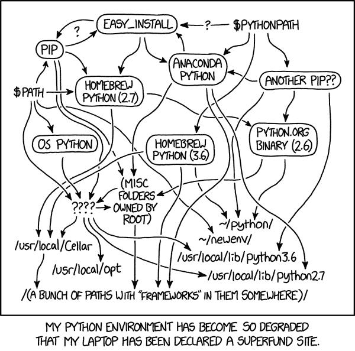
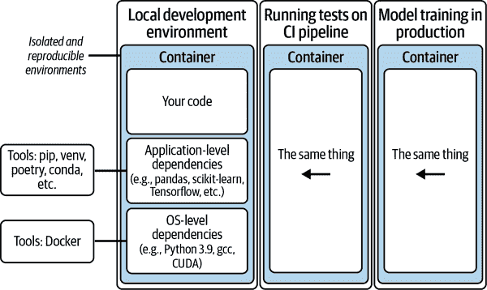
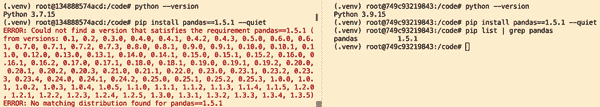
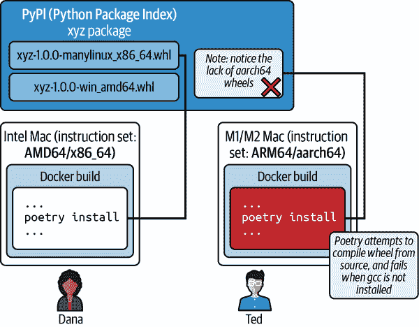

# 第三章：有效的依赖管理：原则与工具

在本章和下一章中，我们将解决每位机器学习从业者在职业生涯中无疑会遇到的一个挑战：*依赖地狱*。依赖地狱是臭名昭著的[“在我的电脑上可以运行”问题](https://oreil.ly/Ib_og)的常见原因之一。作为一个经常遭遇依赖地狱的机器学习从业者，您可能经常希望找到以下问题的答案：

+   我和我的团队如何能够在任何需要的地方轻松、可重复地安装依赖项——无论是在本地机器、云端笔记本还是分布式集群上——并且最小化繁琐和故障排除？

+   随着我们项目的依赖项越来越多，我们如何优化它们，以便安装依赖项时不觉得自己在等待下载整个互联网？

+   如何确保我们的项目不会因其依赖项及其依赖项的安全漏洞而受到损害？

到第 3 和第四章结束时，您将对所有这些问题有了答案。在学习过程中，您将能够将有效的依赖管理实践应用到您自己的项目中，学到：

+   如何识别不完整的依赖管理方法

+   有效管理机器学习项目依赖项的原则和工具

+   何时、为何以及如何使用容器

+   如何简化使用 Docker 和 [batect](https://batect.dev)，一个命令行工具

这两章适合对基于 Python 的机器学习项目依赖管理尚不熟悉的新手，也适合寻求依赖管理高级原则和最佳实践的中级用户。新手可以在机器学习项目的上下文中享受友好的初学者介绍 Python 依赖管理器和容器，以及任何依赖管理堆栈的指导原则和实际构建块。中级从业者可以学习帮助简化依赖管理的高级使用模式和工具。对于这两类读者，随附的代码存储库是您在引导或更新自己的机器学习项目时可以使用的资源。

虽然我们选择了一个简单的监督学习示例用于[实践练习](https://oreil.ly/851RR)，但本章的方法适用于许多其他机器学习和数据科学范例，如深度学习、强化学习、运营研究，甚至是 Python 中的非机器学习应用，如 Web 应用程序、可视化仪表盘等。本章中将涉及一些代码示例，但它们旨在阐述和说明概念。在下一章中，您可以动手进行实践练习。

最后，这不是“必须这样做”的规定。相反，这是一套模块化的技术和工具，它们帮助了我们——并且可以帮助任何机器学习从业者——避免在机器学习和 Python 生态系统中管理依赖时常见的陷阱。如果你在本章中遇到描述的任何陷阱，请考虑这些原则和实践如何帮助你。

有了这些，让我们进入第一部分——有效的依赖管理原则和实践。

# 如果我们的代码在任何地方、任何时候都能正常工作会怎样？

举手之劳，如果你曾经：

+   在工作中或个人项目中克隆了一个仓库，希望测试一个激动人心的想法，但在开始之前甚至无法启动，因为出现了依赖安装错误，比如`command 'gcc' failed with exit status 1`？

+   不小心在操作系统级别的 Python 中或者另一个项目的虚拟环境中安装了一个库（例如，`pandas==x.x.x`），从而污染了这些环境——浪费了时间来消除损害——因为你忘记激活正确的虚拟环境？

+   花费了几天甚至几周的时间在新项目中设置环境，这一路上长了些许灰白头发，同时排除依赖安装错误，比如由于操作系统级别依赖（如 Python）的不同版本而引起的错误：`Error: No matching distribution found for torch==x.x.x`，有人碰到过吗？

我们感觉我们并不是唯一一个遇到这种情况的人。事实上，我们可以百分之百确定所有机器学习从业者都曾因为不完整的依赖管理解决方案而遇到类似问题，当试图在本地或云端运行一些机器学习代码时（见图 3-1）。



###### 图 3-1。一张[xkcd 漫画](https://oreil.ly/ffGv7)，表达了 Python 依赖管理的有趣但真实的本质：它比必要的复杂得多（来源：[xkcd.com](https://oreil.ly/eTAAk)，经许可使用）

如果我们理解 Python 依赖管理的基础知识以及有效依赖管理的基本原则和实践，我们就能避免这些陷阱。

在本节的其余部分中，我们将通过查看软件工程世界中持久的依赖管理原则和实践，探索一条更好的路径。

## 更好的方法：检出和执行

这里有个有趣的问题：当你——或一个新手——第一次加入你的团队时，设置开发环境并进行第一次提交花费了多长时间？是几天？几周？

想象一下这个替代现实：你正在接纳新的团队成员，你对他们的指导仅仅是“检查项目仓库，运行`./go.sh`，然后完成”。听起来很激进，几乎是虚构的，但是在本章结束时，你会发现这是可行的，你将学会如何在你自己的机器学习项目中做到这一点。

这被称为 [“检出和启动”](https://oreil.ly/b5kNk)，它是成熟软件工程实践团队中的常见做法。他们避免部分自动化并且依赖于冗长文档、口口相传的知识和临时排除故障的设置流程。相反，新的代码贡献者可以在几个命令中在本地设置他们的开发环境，运行测试，提交和推送代码，一天内完成。

稍后我们将描述原则和实践，这将帮助您实现这一点。但在此之前，我们想根据我们在真实 ML 项目中的经验描述采用这一做法的好处：

更快的入职速度

新团队成员——以及在组织中为不同项目做贡献的现有团队成员或获得新电脑的团队成员——可以在一天内完成设置，并开始在本地运行代码和测试，开始进行代码贡献。

节省时间和认知资源

能够自动创建一致的类生产环境，减少了在配置和排除故障 [雪花环境](https://oreil.ly/Akr5L)¹ 或尝试记住几个月前如何安装和配置特定依赖的时间和认知资源。因此，队友们可以做更多他们想做的事情，这有助于我们感到高效和满意。

实验操作对称性

通过在一致、可重现、类生产的环境中运行所有内容，我们可以确保在本地机器上运行的内容在推送代码和在云上运行代码时也能正常工作，例如在 CI/CD 管道上运行测试或在云上的 CPU 或 GPU 实例上训练模型时。

可重现性和可重复性

我们上周编写的代码解决了一个问题，可以在任何地方使用——在我们同事的机器上、在 CI/CD 管道上、在云计算实例上——每次都能正常工作。无论底层操作系统如何，它都将以相同的方式工作。在学术环境中，这也很有用，因为越来越多的论文通过提供用于发现结果的代码和数据来提高可重现性。

综合来看，“检出和启动”使团队能够轻松可靠地为开发、测试和运行代码设置运行时环境。这使他们能够专注于解决他们想要解决的问题，而不是 [剃毛](https://oreil.ly/NhBxW)。

团队可以考虑测量新团队成员（或新设备上的现有团队成员）的“首次推送时间”，作为评估团队依赖管理方法效果的试金石。 “首次推送”是一个有用的强制函数，验证新团队成员是否能够在本地设置他们的开发环境，配置他们的代码编辑器，运行测试，进行简单更改，并在本地测试该更改是否有效。

现在我们已经看到了“签出并执行”的实践的好处，让我们来看看可以帮助我们实施它的持久原则，无论我们使用哪种技术或工具。

## 有效依赖管理原则

在其核心，依赖管理是一个简单的概念。在这个背景下，*依赖关系* 指的是项目中所有必需的软件组件，以使其按预期工作并避免运行时错误（见 图 3-2）。依赖关系可以进一步分为两个级别：操作系统级别的依赖关系和应用程序级别的依赖关系。

现代机器学习应用通常预计在多个操作系统上运行。例如，我们可能在 Mac、Linux 或 Windows 上进行开发，在 CI 流水线上运行测试（通常是 Linux），并在瞬态云 CPU 或 GPU 实例（通常是 Linux）上运行完整的模型训练。像 Docker 这样的容器技术帮助我们简化操作系统级别的依赖管理。我们在一个环境中安装的应用程序级别的依赖关系（例如，本地开发环境）必须在其他环境中（例如，CI、预生产和生产环境）以同样的方式工作。

通过在两个级别上正确管理我们的依赖关系，我们确保能够从我们的代码创建一致和类似生产的环境，确保这里和现在的工作将在任何地方和任何时间都能工作。



###### 图 3-2\. 通过良好的依赖管理实践，我们可以从一开始就创建一致、类似生产环境的可重现环境。

在深入研究具体技术和实施细节之前，让我们先了解四个持久的原则，这些原则可以指导我们朝着适当的依赖管理解决方案迈进，无论我们选择哪种具体的技术或工具。

### 依赖关系“作为代码”

通过将 *所有* 依赖关系和配置 [作为代码](https://oreil.ly/-45KL)，我们使所有代码贡献者能够从代码中以*自动化的方式*创建一致的开发环境。此外，依赖堆栈的任何更改——包括操作系统级别和应用程序级别的依赖关系——都是版本控制的，并且可以在另一个环境中（例如 CI 流水线上）进行复制和快速测试。

相比之下，依赖堆栈中未编码和自动化的任何部分都需要为代码将运行的每个计算环境手动配置。这可能包括其他团队成员的计算机、CI/CD 流水线、云训练实例和生产服务器。根据我们的经验，这无疑会成为一个巨大的时间浪费和沮丧的源头。

### 从一开始就类似于生产的开发环境

没有什么比在生产中检测到问题或错误更加紧张和沮丧的了。在开发过程中拥有类似生产的环境有助于解决这个问题。即使在编码时，我们也可以捕捉到可能在生产环境中发生的问题，因为我们的开发环境在依赖项方面类似于生产环境。这使我们确信，从软件依赖项的角度来看，本地开发和测试正常运行的内容也将在生产环境中正常工作。

我们应该尽早创建类似生产的开发环境，甚至在新的 ML 应用或项目的*第一周*。试图整理一个混乱的项目比从一开始就养成正确的习惯要困难得多。

### 应用级环境隔离

每个应用、项目或代码仓库都应该有自己独立的 Python 虚拟环境。这样我们就可以避免不同应用之间的共享状态和不必要的耦合。根据我们的经验，不必要的耦合导致某个应用的依赖变更不经意间地在另一个应用中引入错误。这自然而然地增加了摩擦，并减缓了我们执行想法的能力。

有许多工具——如 Python 的内置 venv 模块、poetry、pipenv、conda——提供了创建和管理隔离虚拟环境的功能。无论选择哪个工具——团队应该一致选择一个以减少复杂性——确保每个应用都有自己的依赖项，我们可以在其自己的虚拟环境中安装这些依赖。

### 操作系统级环境隔离

在大多数情况下，我们通常需要在多个操作系统上运行我们的 ML 开发。例如，在 Windows 或 MacOS 上开发，通过 CI 实例在 Linux 上测试，并在云上或目标设备上部署到 Linux 实例。即使整个团队都使用同一个操作系统（例如 Linux），我们为配置操作系统级依赖项（如安装特定版本的 Python 3.x）所做的任何工作都需要在临时目标实例上定期可重现，例如在部署期间。

虽然 ML 从业者通常熟悉 Python 中的应用级依赖管理，但我们经常忽视以类似的方式管理操作系统级依赖（即作为代码）。更常见的是在 README 中看到一些说明手动安装某些依赖项（例如 Python 3），并且对我们安装的具体版本（例如 Python 3.x）留下了机会。

忽视这一点的代价是浪费时间排查由雪花环境引起的问题和错误。如果这些听起来太抽象，只需回想一下您克隆了一个 repo 以尝试运行一些有前景的代码或笔记本，结果由于缺少或配置错误的操作系统级依赖项而浪费了几个小时甚至几天排查错误。

现在你已经掌握了这些指导原则，让我们看看哪些工具和技术可以帮助我们将这些原则付诸实践。

## 依赖管理工具。

在本节中，我们将探讨一些可以帮助我们付诸实践这些原则的工具。

简而言之，要有效地管理给定项目的依赖关系，我们需要：

+   将操作系统级别的依赖项指定为代码（例如，使用 Docker）。

+   将应用程序级别的依赖项指定为代码（例如，使用 Poetry）。

在本书中，我们决定使用 Docker 和 Poetry。在过去几年中，我们在 Python 生态系统中使用了几种工具，到目前为止，Docker 和 Poetry 在其中脱颖而出，并且对我们很有效。话虽如此，我们也承认，在任何项目或团队中选择任何工具取决于多个因素。无论你选择哪一个，只要确保你以前一节描述的四个原则为指导使用它们。

让我们首先了解 Docker 如何管理操作系统级别的依赖项。

### 管理操作系统级别的依赖项。

容器将您的代码与整个依赖栈一起封装。这为您提供了一个可移植、可复制、一致的运行环境，使您的代码在不同机器上都能保持一致。

如果你的 ML 堆栈需要在多个计算环境中运行代码（例如，本地开发机器、云上的训练实例、生产 API 服务器、CI/CD 流水线），那么使用 Docker 肯定会有所帮助。通过将你的代码容器化，你可以确保在实验和开发期间代码现在工作，它将在另一个时空中同样工作，例如，在云端和计划的生产训练运行期间，只要 Docker 运行时存在。

我们将在下一节中深入探讨使用 Docker 的基本构建块，但我们希望花一点时间来解释对 Docker 的反射性厌恶，在 ML 从业者中可能很常见，因为存在三种误解。

#### 误解 1：Docker 过于复杂且不必要。

有些人认为 Docker 是一个过于复杂和令人望而却步的工具，学习它需要时间和精力，但并没有增加太多价值。另一方面，我们也与其他 ML 从业者合作过，他们将其视为一种帮助而非阻碍的工具，日常工作中经常使用它。

如果你属于前者，我们希望本章能展示使用容器的价值和简单性。如果我们只打算在一台机器上运行代码，我们就不需要 Docker。然而，正如我们之前所说的，当构建 ML 系统时，这种情况很少见。

与任何技术一样，Docker 有一个学习曲线，但并不陡峭。根据我们的经验，没有 Docker 最终总是会花更多的时间。例如，如果我们在开发环境中意外地搞得一团糟（正如我们以前做过的那样！），如果我们运行在主机上，要从中恢复是非常困难的。但是有了容器，我们只需删除镜像，几分钟内就可以从头开始一个新的容器。

我们可能会花时间学习它并为团队设置环境，但一旦完成，我们就能轻松地可靠地创建一致、可复制和类似生产的开发环境。

#### 误解 2：我不需要 Docker，因为我已经使用 X（例如 conda）

Docker 经常被错误地与其他 Python 依赖管理器如 pip、conda、poetry 和 pip-tools 相提并论。然而，这是一个不恰当的比较，因为它们解决了不同的问题——Python 依赖管理器关注应用级 Python 依赖，而 Docker 还帮助您安装和配置 OS 级别的依赖，如 Python、gcc（GNU 编译器集合）和 CUDA。

没有 Docker，我们的代码直接依赖于未指定的主机级运行时依赖，并留给机会。即使只是安装像`pandas==1.5.1`这样简单的东西，对于使用大于或等于 3.8 版本 Python 的开发人员，安装将成功，但在任何其他机器上，安装会因错误`No matching distribution found for pandas==1.5.1`而失败，这些机器上可能安装的是 Python 3.7 或更低版本（见图 3-3）。



###### 图 3-3\. 安装 Python 库（`pandas==1.5.1`）可能会失败（见图像左侧—使用 Python 3.7）或成功（见图像右侧—使用 Python 3.9），这取决于特定版本的 Python 3。

截至撰写时，[Stack Overflow 上有 500 个问题与此错误相关](https://oreil.ly/iHDtN)。这只计算了在 Stack Overflow 上提交问题的人数，而没有计算积极寻找答案的无数其他人。我们是其中之一，多次如此！如果我们早些时候使用容器来指定特定的 Python 版本，所有这些时间和精力都可以节省。

#### 误解 3：Docker 会显著影响性能

面对运行时间长且缓慢的代码，人们有足够的时间去思考许多相关问题——生命的意义是什么？为什么我的代码运行如此缓慢？就像在时间匮乏的沙漠中渴望时间的游牧民族一样，我们可能会开始看到海市蜃楼，并希望直面 Docker 并问道：你是不是在减慢我的代码？

在考虑优化时，永远不要忘记[优化的第三法则](https://oreil.ly/XCN66)：*在优化之前进行测量*。[基准分析](https://oreil.ly/VcpSh)对比了在容器内外运行计算密集型深度学习任务的性能，发现性能没有显著差异。另一项[基准分析](https://oreil.ly/YPlLp)比较了在容器和主机上运行各种深度学习模型（如 InceptionV3、VGG16）的性能影响，发现*性能差异接近于零*。

Docker 已被发现[有时会降低 Python 的性能](https://oreil.ly/d07Mo)，但性能损失并不总是一致的。性能减慢很可能是由于 Docker 的一个安全功能[seccomp](https://oreil.ly/BzGuK)导致的。使用本章的代码示例，我们复现了性能影响——在 Docker 和主机上运行`python src/train.py`时，平均减慢了 1.7%（见表 3-1）。在这两种场景下，我们都使用的是 Python 3.10.6\. 但是，当我们查看性能分析时，减速主要来自于从磁盘读取数据。用于处理数据和训练模型的代码表现同样出色，甚至更出色。

表 3-1\. 本章模型训练运行持续时间的基准测试

| 运行的代码 | 十次运行的平均持续时间（秒） |
| --- | --- |
|   | *主机上的持续时间* | *容器中的持续时间* |
| --- | --- | --- |
| `pd.read_csv(...)`（加载 100,000 行数据） | 0.6 | 1.75（比主机慢） |
| `preprocess_data(...)` | 1.1 | 1.1 |
| `fit_model(...)` | 15.4 | 14.6（比主机更快） |
| `evaluate_model(...)` | 0.4 | 0.4 |
|   | **17.5** | **17.85** |

始终记住在优化之前先进行测量：在两种条件下测量性能，而不是假设其中一种条件会比另一种差。否则，您可能会发现自己在不知道是否获得了任何收益的情况下，牺牲了使用容器的好处。

#### 复杂化的情况：不同的 CPU 芯片和指令集

“构建一次，随处部署”的概念是 Docker 吸引人的核心理念。然而，与使用不同芯片的队友合作的人可能会告诉你，并不总是这样。一个常见的失败模式是在一台机器上成功安装 Python 依赖项的 Dockerfile，在另一台具有不同芯片或指令集的机器上安装失败。伊塔马尔·特纳-特劳林在他的文章[“为什么新的 Mac 会破坏你的 Docker 构建，以及如何解决”](https://oreil.ly/Oct3e)中清楚地解释了这个问题的根本原因，我们鼓励您花几分钟时间查看。

简单总结一下特纳-特劳林的文章，跨两种类型的 CPU 安装依赖项的典型失败可能会像这样进行（参见图 3-4）：

+   另一位队友 Dana 使用的是英特尔 Mac，它使用 *AMD64* 指令集，也称为 x86_64。

+   另一位队友 Ted 使用的是配备 M1 或 M2 处理器的新 Mac，它们使用 *ARM64* 指令集，也称为 aarch64。

+   AMD64 和 ARM64 指令集使用不同的语言；一个只懂一种语言的 CPU 无法理解另一种语言。

+   为了更轻松、更快速地安装 Python 包，软件包维护者通常会将预编译的 [wheels（Python 的构建包格式）](https://oreil.ly/xjKnz) 上传到 PyPI（Python 包索引），尽管并非始终针对所有 CPU 指令集。预编译的 Python wheels 与特定的 CPU 指令集绑定。



###### 图 3-4\. 当软件包维护者忽略发布 ARM64 和 AMD64 轮子时，Python 依赖安装失败的解剖图，即使 Docker 本应防止此类失败。

依赖安装失败通常发生的方式：

+   Dana 将一个 Python 包 `xyz=1.0.0` 添加到项目中，它在她的机器上成功安装，因为 xyz 的维护者碰巧发布了 AMD64 轮子。

+   Ted 拉取代码更改，由于有一个新的依赖关系，`docker build` 现在将运行 `poetry install`（或者在这个上下文中使用 `pip install` 也可以）。如图 Figure 3-4 所示，xyz 的维护者忽略了发布 ARM64 轮子。当 Poetry 从 PyPI 找不到 xyz 的 ARM64 轮子时，Poetry 将下载源代码并尝试从源代码编译包。

+   在这一点上，如果团队的开发环境没有安装 gcc 编译器，`poetry install` 将失败。

有一个快速简单的解决方法——在我们的 Dockerfile 中安装 gcc 编译器，然后再安装 Python 依赖。这将确保我们可以在项目中安装指定的包版本，即使维护者忽略了为特定 CPU 指令集发布轮子。这在 Docker 中可以轻松实现，如下所示：

```
FROM python:3.10-slim-bookworm

# ...
RUN apt-get update && `apt-get` `-y` `install` `gcc`
RUN poetry install

# ...
```

这种方法的缺点是镜像构建会变慢，而且镜像会变得更大。幸运的是，这两个缺点可以通过缓存和多阶段构建来缓解，分别在下一章中演示这两种技术。

*正确的* 解决方法：所有 Python 包维护者都应该为 AMD64、MacOS ARM64（用于 MacOS 主机的 poetry 安装）和 Linux ARM64（用于 Docker 容器中的 poetry 安装）分发轮子。但这并不总是在我们的控制之内。

除了与安装 Python 依赖关系有关的失败模式外，与使用包含多个平台或不同类型 CPU 芯片的部署目标的团队必须确保他们构建了 [多平台镜像](https://oreil.ly/Jw_dy)。这将允许 Docker 运行时自动选择与相应开发和部署环境的 OS 和架构匹配的镜像。

因此，团队可以使用 Docker 的[buildx 工具](https://oreil.ly/XXDEy)创建多架构镜像，确保基础镜像支持多种架构，如 ARM64 和 AMD，在相关操作系统——Linux、MacOS、Windows 上。在模拟目标生产设置的 CI/CD 管道中进行全面测试，使用多架构的构建和测试阶段，有助于确保 ML 模型在开发人员机器或生产环境中使用的 CPU 芯片不同的情况下能够无缝运行。

有了操作系统级依赖，现在让我们转向管理应用级依赖的工具。

### 管理应用级依赖

对于应用级依赖，面对 Python 生态系统中解决类似问题的众多工具，可能会感到不知所措，因为它们解决方式各异。无论您选择哪些工具，*确保它们在开发和生产中同样有效*。例如，虽然 conda 在开发中可能很有用，但它倾向于是一个大型镜像（3-6GB），具有许多我们实际上不需要的依赖。如果您想将模型容器化并部署为 Web API，conda 将会是过度解决方案，并且存在一个不必要的大攻击面积。如果我们在开发中使用 conda，而在生产中使用另一个依赖管理器，将会引入：（i）训练和服务的不对称性，以及（ii）依赖管理解决方案的分歧，这两者都需要进行维护。

在这一章中，我们选择了诗歌作为我们的依赖管理器，因为它有以下几个优点：

依赖固定

诗歌的依赖解析功能将会计算出完整的依赖树，包括传递依赖——即我们依赖的依赖，并生成一个*poetry.lock*文件，固定所有依赖版本。当我们安装依赖时，诗歌会根据锁定文件中指定的版本安装它们，这可以防止传递依赖在时间推移中悄悄地改变，有时会[意外地破坏我们的代码](https://oreil.ly/dbwOW)。

自动安装依赖项会更新 pyproject.toml

当我们运行`poetry add some-package`时，诗歌将找出我们可以使用的最新兼容版本，并自动为我们更新*pyproject.toml*。我们不再需要手动确定更新*requirements.txt*时要指定的版本，或者通过运行`pip list`手动找出实际安装的版本号！

单一的*pyproject.toml*依赖规范文件

诗歌的[*pyproject.toml*](https://oreil.ly/CW6Ub)具有为定义生产依赖和开发依赖定义的明确定义的模式。它也符合[PEP 518](https://oreil.ly/yikrL)，这是一个 Python 增强提案，引入了*pyproject.toml*，一个文件，它将包含给定项目的所有构建系统依赖。

打包和发布

您可以轻松地通过几个命令将您的包发布到 PyPI 或私有仓库。

到目前为止，我们已经涵盖了管理操作系统级和应用程序级依赖项的关键原则和工具。在下一章中，我们将进行一个实践练习来说明所有这些内容。但对于对 Docker 和 batect 还不熟悉的读者，我们希望利用本章剩余部分，为使用容器在 ML 工作流中的何时、何地、如何提供一个快速入门。

# Docker 和 batect 的快速入门

在本节的上半部分，我们将描述使用 Docker 的概念构建块。接下来，我们将看到一个常见问题，即需要维护越来越多的“粘合代码”，以协调越来越多的手动输入的 Docker 参数甚至多个 Dockerfile。我们将介绍一个命令行工具来解决这个问题，并简化我们与 Docker 的交互方式—[batect](https://oreil.ly/Lt2ap)。我们将向您展示如何在您的项目中使用 batect。

让我们开始学习使用 Docker 的基本构建块。我们将解释一些基本的 Docker 概念，但不会过多详细介绍，因为已经有大量[教程](https://oreil.ly/amr1g)和[指南](https://oreil.ly/vqtwh)以一种易于理解的方式教授这些概念。如果您对 Docker 和容器已经很熟悉，也可以直接跳转到关于 batect 的部分。

## 容器是什么？

把容器想象成一个正在运行的进程—比如 `echo "hello world"`、`python train.py` 或 `python3 -m http.server`—它拥有运行所需的所有依赖项。

过程代码及其依赖被捕获在我们所称的镜像中。当我们构建一个镜像时—一个轻量级的、独立的、可执行的软件包，其中包括运行代码所需的一切—我们指定了进程成功运行所需的一切。

当我们*运行*一个镜像时，我们得到一个*容器*。因此，当我们将我们的进程或命令作为容器运行时，它将始终成功运行，即使主机机器是一个“全新的盒子”，除了 Docker 运行时没有我们需要的依赖项。

对于任何对容器还不熟悉的人来说，这些术语可能听起来比实际情况更令人生畏。如果您是其中之一，我们希望这个类比能帮助简化容器概念：

一个没有容器的不那么轻松的下午

你的朋友住在一个热带国家，他告诉你：在户外放一把椅子，坐在上面，享受凉爽的微风。你住在温带国家，现在是冬天。你按照完全相同的说明做了，但没有像你的朋友一样享受到相同的结果。

一个与容器一起放松的下午

你的朋友住在世界的某个地方，他买了一个带空调的太空舱，放了一把椅子，坐在里面，享受着凉爽的微风。这种体验如此惊人，以至于他立即告诉了你。对你来说仍然是冬天，你按照完全相同的指示：购买同样的太空舱，打开空调，坐在里面的椅子上，享受凉爽的微风。

这就是容器为我们的应用程序所做的事情——容器就像太空舱一样，提供了一个确定性运行环境，将我们的代码与操作系统（或“裸机”运行时）的状态分离开来。

现在，让我们看看 Docker 在各种开发机器和平台中的适用情况。

ML 从业者的开发环境所使用的技术取决于多种因素，如个人经验、团队偏好、组织政策，甚至是关于计算和数据存放位置的法规限制。ML 从业者可能正在以下之一进行开发：

+   本地机器

+   在本地机器上触发云端或分布式集群上的作业（例如 Kubeflow、Metaflow、Ray、AWS SageMaker、Google Vertex AI、Azure ML）

+   临时配置的计算实例（例如 AWS EC2 实例）

+   云工作空间（例如 GitHub Codespaces、AWS SageMaker Studio 笔记本、GCP 云工作站）

+   本地计算实例

+   嵌入式设备（例如树莓派）

无论你使用哪种开发环境，只要有 Docker 运行时可用，Docker 都可以帮助你快速创建一致的运行环境，用于任何上述目标环境。云 ML 服务通常支持 Docker，并会有文档详细说明如何在运行任务或作业时指定 Docker 镜像——无论是公共镜像还是自定义镜像。

## 减少 Docker 中的移动部件使用 batect

随着项目变得越来越复杂，我们可能会发现自己有越来越多的 Docker 运行时参数和命令行选项——比如挂载卷和需要发布的端口。这些配置参数通常需要在代码库的多个地方进行维护。我们看到团队在多个地方维护一长串手工输入的 Docker 参数列表，比如在 README、CI/CD 流水线、Makefiles 和 shell 脚本中进行指定和同步。

更进一步复杂的是，我们可能还有多个需要彼此通信、按特定顺序运行的容器，甚至多个用于多个任务的 Docker 文件。

好消息是：我们可以通过[batect](https://oreil.ly/Lt2ap)来简化所有这些移动部件——这是一个命令行工具，让我们可以 (i) 在配置文件中定义开发任务及其关联的配置参数作为唯一的真实数据源，以及 (ii) 将 Docker 容器作为 batect 任务运行。

让我们来看看在我们的 ML 开发生命周期中使用 batect 的四个好处。

###### 注意

我们在编写本章几个月后，batect 的创建者和维护者宣布[batect 将不再维护](https://oreil.ly/ZyMrQ)。使用 batect 的现有项目将继续运行，并且在本书的代码库中也将继续运行。但是 batect 将不再获得新功能、错误修复或安全修复。

尽管如此，batect 在 Docker 的基础上继续作为一个有用的抽象（正如我们将在本章中详细阐述的那样）。

### 优点 1：更简单的命令行界面

当使用 Docker 时，通常会遇到很多调用参数的 Docker 命令，例如环境变量、卷挂载文件夹、需要发布的端口等，这些参数在多个地方使用，都需要保持同步。下面是一个例子：

```
# Train model (without batect)

# build image first
docker build . --target prod -t my-image

# in staging scripts
docker run -it --rm -v $(pwd):/code -e STAGING my-image:latest \
./scripts/train-model.sh

# in production scripts
docker run -it --rm -v $(pwd):/code -e PROD my-image:latest \
./scripts/train-model.sh

# in README
$ docker run -it --rm -v $(pwd):/code -e DEV my-image:latest \
./scripts/train-model.sh
```

除了在 README 中指定这些命令之外，我们还需要在任何需要运行这些命令的地方（如 bash 脚本或 CI 管道）指定它们。如果我们要更改一个选项（例如，卷挂载目录），我们需要在多个地方进行更改。这违反了 DRY 原则（不要重复自己），我们必须手动保持这些命令的同步，并承担意外不一致的后果。

相比之下，batect 允许我们在配置文件中维护这些配置参数，如下所示，这个文件作为唯一的真实来源：

```
# Train model (with batect)
$ ./batect train-model 
```

```
## batect.yml 
containers:
  dev: 
    build_directory: .
    `volumes``:`
      `-` `local``:` `.`
        `container``:` `/code`

tasks:
  train-model:
    description: Train model
    run:
      container: dev
      command: scripts/train-model.sh
      `environment``:` `${ENVIRONMENT}`
```


注意 batect 如何简化我们调用相同的 `docker run` 命令的方式。


Batect 允许我们在配置文件（*batect.yml*）中定义*容器*和*任务*。我们可以在*batect.yml*中定义所有通常传递给`docker build`和`docker run`命令的 Docker 选项及其各种选项。通过执行一个 batect 任务（例如，`./batect train-model`），我们可以简单地启动一个容器。*Batect.yml*成为这些任务的单一真实来源，如果我们要更改一个选项（例如，`environment = 'staging'`或`'production'`），我们只需要在一个地方进行更改。


您可以将此容器命名为任何您想要的名称。它不必是`dev`。

### 优点 2：简单的任务组合

让我们考虑一个场景，我们需要在运行另一个任务（例如，运行 API 测试）之前运行一个任务（例如，训练模型）。在一个新的实例上（例如，CI 上），如果我们直接运行 API 测试，它会失败，因为模型文件尚未创建。让我们看看如果没有 batect 我们将如何做到这一点：

```
# run model training smoke test (to create local model artifact needed by API)
$ docker run -it --rm -v $(pwd):/code loan-default-prediction:dev \
./scripts/tests/smoke-test-model-training.sh

# then we can run our API test
$ docker run -it --rm -v $(pwd):/code loan-default-prediction:dev \
./scripts/tests/api-test.sh
```

为了在我们的 CI/CD 管道上运行 API 测试，我们需要指定这两个有些冗长的命令。团队通常会将它们封装在 bash 脚本中，以封装这些逻辑并隐藏这些命令的冗长性。

现在让我们看看如何使用 batect 执行相同的任务：

```
# Run API tests
$ ./batect api-test
```

```
## batect.yml
tasks:
  smoke-test-model-training:
    description: Run smoke tests for model training
    run:
      container: dev
      command: scripts/tests/smoke-test-model-training.sh

  api-test:
    description: Run API tests
    run:
      container: dev
      command: scripts/tests/api-test.sh
    prerequisites: 
      - smoke-test-model-training
```


batect 帮助我们通过 `prerequisites` 选项简化了这一过程。在我们的 CI/CD 流水线上，我们只需指定 `./batect api-test`，batect 将负责在运行 API 测试之前运行先决任务（`smoke-test-model-training`）。

现在我们已经看到了 batect 如何帮助我们保持 `docker run` 命令简单、一致且集中于一个地方，让我们再看一看 batect 的另一个好处：本地-CI 对称性。

### 优势 3：本地-CI 对称性

没有 batect，CI 中的每一步都将是冗长的实现细节（例如，`docker run -it --rm -v $(pwd):/code loan-default-⁠prediction:​dev ./scripts/train-model.sh`）。这使得阅读和跟踪正在进行的操作变得更加困难。

与此相反，batect 让我们的 CI/CD 流水线简洁且易于理解。在以下代码示例中，很明显我们运行了三个命令：`smoke-test-model-training`、`api-test` 和 `train-model`：

```
# .github/workflows/ci.yaml

name: CI/CD pipeline
on: [push]
jobs:
 smoke-test-model-training:
   runs-on: ubuntu-20.04
   steps:
     - uses: actions/checkout@v3
     - name: Run model training smoke test
       `run``:` `./batect` `smoke-test-model-training`

 api-test:
   runs-on: ubuntu-20.04
   steps:
     - uses: actions/checkout@v3
     - name: Run API tests
       `run``:` `./batect` `api-test`

 train-model:
   runs-on: ubuntu-20.04
   steps:
     - uses: actions/checkout@v3
     - name: Train model
       `run``:` `./batect` `train-model`
   needs: [smoke-test-model-training, api-test]
```

这还帮助我们轻松重现在 CI 中发生的失败。如果 CI 中的任务失败（例如，`api-test`），我们可以通过运行我们要求 CI 运行的完全相同的命令（例如，`./batect api-test`）轻松地在本地重现错误，并迭代修复 bug。我们不再需要手动整理分散在 CI/CD 流水线规范和 shell 脚本中的各种命令、参数和环境变量。

### 优势 4：使用缓存加速构建

在机器学习项目中使用 Docker 的一个关键挑战是由于下载和安装大型 Python 包（例如，`torch==1.13.1` 为 500 MB）、大型预训练模型（例如，llama-2-7b 为 13 GB）和大型数据集所花费的时间，导致构建时间很长。

Docker 提供了[构建时缓存机制](https://oreil.ly/Szm18)，可以帮助您在每次新构建时节省数分钟的时间。通过添加下面的粗体行，我们可以避免不必要的重新下载和重新安装，并减少构建镜像所需的时间。即使对于我们在本示例中使用的相对简单的依赖项，我们也将构建时间从三分钟缩短到不到两分钟。在下载更大的依赖项、预训练模型和数据集的项目中，节省的时间将更为显著。

```
FROM python:3.10-slim-bookworm

WORKDIR /code

RUN -`-mount``=``type``=``cache,target``=``/var/cache/apt` `\`
    apt-get update && apt-get -y install gcc

RUN pip install poetry
ADD pyproject.toml /code/
RUN poetry config installer.max-workers 10
RUN `--mount``=``type``=``cache,target``=``/root/.cache/pypoetry` `\`
    `--mount``=``type``=``cache,target``=``/opt/.venv` `\`
    poetry install
```

严格来说，您并不需要 batect 来实现 Docker 缓存的好处。然而，我们发现 batect 用于定义缓存及在必要时使其无效的接口更易于使用。以下代码示例展示了我们如何使用 batect 实现相同的缓存：

```
# batect.yml
containers:
 dev:
   build_directory: .
   volumes:
     `-` `type``:` `cache` 
       `name``:` `python-dependencies`
       `container``:` `/opt/.venv`
     `-` `type``:` `cache`
       `name``:` `poetry-cache-and-artifacts`
       `container``:` `/root/.cache/pypoetry`
     `-` `type``:` `cache`
       `name``:` `apt-cache`
       `container``:` `/var/cache/apt`
```

```
# Dockerfile 

FROM python:3.10-slim-bookworm

WORKDIR /code

RUN apt-get update && apt-get -y install gcc

RUN pip install poetry
ADD pyproject.toml /code/
RUN poetry config installer.max-workers 10
RUN poetry install
```


这是我们如何定义并添加缓存卷。除了依赖项之外，您还可以缓存其他下载的工件，例如预训练模型和数据。命名缓存卷的能力使得理解正在发生的情况变得更加容易。


注意我们的 Dockerfile 现在回到了添加缓存之前的状态，现在更易于理解。

###### 注意

如果在运行命令时遇到与陈旧或损坏缓存有关的错误，请简单删除缓存并尝试重新运行命令：

+   要通过 batect [清除缓存](https://oreil.ly/Iprov)，您可以运行以下命令：

    ```
    ./batect --clean
    ```

+   要通过 Docker [清除缓存](https://oreil.ly/5r-Uu)，您可以运行以下命令：

    ```
    docker builder prune
    ```

如果我们在不指定任何缓存的情况下使用容器，我们经常会发现自己在等待中浪费了大量时间。在我们使用的 ML 技术栈中，我们等待各种镜像在本地或 CI 中构建的时间介于 3 到 10 分钟之间。当面对选择在屏幕前发呆还是在等待时做些其他事情时，我们有时会选择后者以感到“有效率”。但讽刺的是，这种上下文切换会导致更多的未完成任务、更多的精神疲劳和更低的生产力。通过在 batect 的少量 YAML 配置中，我们可以减少等待时间及其相关成本。

### 如何在你的项目中使用 batect

Batect [易于安装](https://oreil.ly/sOQuW)，并与常见的 CI 平台如 [GitHub Actions](https://oreil.ly/kcHL9) 和 [CircleCI](https://oreil.ly/QWcCV) 集成良好。Batect 提供两个简单的抽象——[容器](https://oreil.ly/A5ijI) 和 [任务](https://oreil.ly/3lPZm)，支持通过 Docker 客户端进行的所有操作（例如挂载卷、发布端口、入口点）。在下一章中，我们将展示一个 Docker 化和“batect 化”的项目是什么样子。

如果您希望进一步探索 batect，文档内容详尽，包括[入门指南](https://oreil.ly/tDD9s)，[*batect.yml* 配置参考](https://oreil.ly/xxGO6)，以及[如何在 CI 系统中使用的指南](https://oreil.ly/XWnNU)。

###### 注意

我们经常听到的一个反驳是：为什么要引入新工具，而不使用 Docker Compose？原因在于：Docker Compose 设计用于运行和编排*长期存在*的进程，而且不允许你运行特定任务或容器的子集。例如，docker-compose up 将启动*docker-compose.yml*中指定的所有服务。相比之下，batect 支持长期运行和短期任务，并更适合在 ML 开发生命周期中定义本地和 CI/CD 管道中运行的容器化任务。

现在我们已经掌握了有效的依赖管理原则和工具，让我们在进入下一章的实际操作示例之前，回顾一下本章学到的内容。

# 结论

请给自己一个巨大的鼓励，因为你在一章节中涵盖了很多内容！总结一下，在本章中，我们讨论了：

+   如何识别不完整的依赖管理方法

+   在 ML 项目中实现“检出并运行”的原则和工具

+   当、为什么以及如何使用容器

+   如何通过 batect 简化 Docker 命令的定义和调用

依赖管理的讽刺在于，在软件工程界它已经是一个解决了的问题，然而在机器学习领域它仍然是一个常见的陷阱。也许这是由于大量的工具、根深蒂固的传统实践的强烈影响（在多个方向上）以及 Python 生态系统中依赖管理的标准化方法的缺乏。

不管原因是什么，在我们的经验中，机器学习依赖管理工具链处于成熟阶段，团队可以使用这些原则和实践在实验、开发和生产中可靠、可重现地创建运行时环境。

说到这一点，现在是这个话题中最令人兴奋的部分——一个实际操作示例来展示有效的依赖管理在实践中是什么样子！在下一章见。

¹ “雪花”环境指的是手动或部分手动创建和配置的环境。就像雪花一样，没有两个雪花环境是完全相同的。
