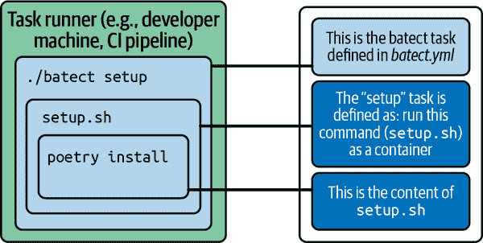

# 第四章：实践中的有效依赖管理

在前一章中，我们阐述了有效的依赖管理原则——你能回忆起这四个原则吗？——以及支持工具。在本章中，让我们玩得开心，把它们付诸实践。

在本章中，你将学到：

+   在实践中，“检出并运行”是什么样子的

+   如何使用 Docker、batect 和 Poetry 在 ML 交付生命周期的每个步骤中创建一致、可复制和类似生产的运行时环境

+   如何自动检测依赖项中的安全漏洞，并自动更新依赖项

本章中的技术是我们在实际项目中使用的，用于创建可复制、一致、隔离、类似生产环境的 ML 代码运行时环境。它们帮助我们有效地和安全地管理依赖项，避免依赖地狱。

让我们开始吧！

# 背景：ML 开发工作流

在本节中，你将看到“检出并运行”的实际操作。在代码练习中，我们将按以下步骤进行，目标是训练和提供一个模型，用于预测贷款违约的可能性：

1.  运行一个 go 脚本，在我们的主机上安装先决条件依赖。

1.  创建一个基于 Docker 的本地开发环境。

1.  配置我们的代码编辑器以理解项目的虚拟环境，以便我们拥有一个有用的编码助手。

1.  运行 ML 开发生命周期中的常见任务（例如，训练模型，运行测试，启动 API）。

1.  在云上训练和部署模型。

要充分利用本章内容，请在 [实践练习](https://oreil.ly/enuv7) 中 fork、clone 并跟着编码，我们将训练和测试一个分类器，以预测贷款违约的可能性。我们鼓励您 fork 该存储库，这样在您提交和推送更改时，您就可以在 GitHub Actions CI pipeline 的 forked 存储库中看到 Docker 和 batect 的工作。

在我们转向代码之前，让我们清楚地描述一下我们在典型的 ML 工作流中正在容器化的内容。

## 确定容器化的内容

在 Docker 化项目的第一步，也是最重要的步骤是明确“我们”究竟容器化了什么。这可能会使一些 ML 从业者感到困惑，并导致混淆和共享状态。例如，如果我们在两个不同任务——开发 ML 模型和提供 ML 模型服务——之间共享一个镜像，我们可能会在生产容器（例如模型 Web API）中找到不必要的开发依赖项（例如 Jupyter、Pylint）。这不必要地延长了容器构建和启动时间，同时也增大了 API 的攻击面。

在软件开发中，我们最常见的容器化是 Web 应用程序或 Web API——这只是在运行命令后启动的长期运行过程（例如，`python manage.py runserver`）。在机器学习中，我们也可以使用容器化的 Web 应用程序通过 API 提供模型预测（推断）。然而，我们通常会运行更多不仅仅是 Web 应用程序。例如，以下是我们在创建机器学习解决方案时可能运行的一些常见机器学习任务和流程：

+   训练模型

+   将模型作为 Web API 提供

+   启动笔记本服务器

+   运行部署（例如 ML 训练作业、模型 API 等）

+   启动仪表板或实验跟踪服务（本章不涵盖此内容，因为运行仪表板作为 Web 服务器是有详细文档的，例如使用 Streamlit 和 Docker 这样的工具是比较直接的）

在本章的示例中，我们已经确定了四组不同的任务依赖项，用于运行四组不同的任务（参见 表 4-1）。

表 4-1\. 我们正在容器化的组件

| 镜像 | 我们可以运行的任务示例 | 操作系统级别的依赖项示例 | 应用程序级别的依赖项示例 |
| --- | --- | --- | --- |
| **1\. 开发镜像** |

+   训练 ML 模型

+   特征工程

+   运行自动化测试

+   本地启动 API 服务器

+   启动 Jupyter 笔记本服务器

|

+   Python 3.10

+   gcc

+   tensorflow-model-server

| 生产依赖：

+   pandas

+   scikit-learn

开发依赖：

+   Jupyter

+   Pytest

+   Pylint

|

| **2\. 生产 API 镜像** |
| --- |

+   在云上启动 API 服务器

|

+   Python 3.10

+   gcc

+   tensorflow-model-server

| 生产依赖：

+   pandas

+   scikit-learn

|

| **3\. 部署镜像——模型训练流水线** |
| --- |

+   在云上部署模型训练流水线

+   执行模型训练

| 具体的依赖项将取决于我们在云上使用的工具或平台来训练模型。例如，可能是以下之一：

+   aws-cdk (AWS)

+   gcloud (GCP)

+   azure-cli (Azure)

+   Metaflow

+   Kubeflow

+   Terraform

+   等等。

|

| **4\. 部署镜像——模型 Web 服务** |
| --- |

+   部署模型镜像到模型托管服务或容器托管服务

| 具体的依赖项将取决于我们在云上部署 Web 服务时使用的工具或平台。例如，可能是以下之一：

+   aws-cdk (AWS)

+   gcloud (GCP)

+   azure-cli (Azure)

+   Terraform

+   等等。

|

图 4-1 展示了每个任务，正如你现在所知，这只是一个*容器化进程*和它们使用的相应镜像的视觉表达。这个图是 表 4-1 的视觉表示。


###### 图 4-1\. 常见的机器学习开发任务及其相关镜像

根据项目需求，图像的具体切片和区分将有所不同。如果切片过粗略——例如，一个图像用于运行所有任务和容器——那么单一的图像可能会变得过重。回顾我们先前讨论的承载不必要依赖项的成本。如果切片过于精细——例如，每个任务或容器一个图像——那么我们在维护代码和每个任务的图像构建时间方面可能会承担不必要的成本。

确定图像如何切片的一个有用的启发法是思考依赖项的“共享性”和“独特性”。在此示例中，开发任务共享一个图像，因为它们共享相同的依赖项，如 Jupyter 或 scikit-learn。部署任务被划分到另一个图像中，因为它们不需要这些依赖项，而是需要像 gcloud、aws-cli、azure-cli 或 Terraform 这样的依赖项。

在我们的头脑中有了这种思维框架之后，我们就可以开始动手练习了！

## 动手练习：可复现开发环境，通过容器辅助

让我们逐步了解如何在 ML 开发生命周期中创建和使用开发环境：

1\. 检查并进行 go：安装先决的操作系统级依赖项。

运行 go 脚本以适配您的操作系统。

2\. 创建本地开发环境（即构建镜像）。

确保已启动 Docker 运行时（通过 Docker Desktop 或 colima），并运行以下命令在本地开发镜像中安装依赖项：

```
./batect --output=all setup
```

3\. 启动本地开发环境（即运行容器）。

启动容器：

```
./batect start-dev-container
```

然后通过运行模型训练冒烟测试来测试一切是否正常工作：

```
scripts/tests/smoke-test-model-training.sh
```

最后，通过在终端中输入`exit`或按下 Ctrl + D 退出容器。

4\. 将 ML 模型作为 Web API 本地运行。

在开发模式下启动 API：

```
./batect start-api-locally
```

然后通过从另一个终端运行以下命令发送请求到本地 API 来测试一切是否正常工作（它使用 curl，我们尚未安装）：

```
scripts/request-local-api.sh
```

5\. 配置您的 IDE 以使用 go 脚本创建的 Python 虚拟环境。

关于我们推荐用于此练习的 IDE 的在线说明：

+   [PyCharm 说明](https://oreil.ly/udir0)

+   [VS Code 说明](https://oreil.ly/Lg-o6)

6\. 在云端训练模型。

这一步，与第 7 步一起，在 CI/CD 流水线上完成。我们将在本节后面讨论这一点。

7\. 部署模型 Web API。

与第 6 步一起，在 CI/CD 流水线上完成。

对于急于完成的人士，这些步骤在存储库的[README](https://oreil.ly/uzBvF)中简要总结。在简洁的 README 中列出这些步骤是一个良好的习惯，可以帮助代码贡献者轻松设置他们的本地环境并执行常见的 ML 开发任务。我们建议您现在在您克隆的项目中执行这些步骤，以了解整个流程。在本节的其余部分，我们将详细介绍每个步骤，以便您理解我们开发环境设置的每个组成部分，并为您自己的项目进行调整。

### 1\. 检出并运行：安装先决依赖项

设置本地开发环境的第一步是运行 go 脚本以安装主机级先决依赖项。首先，克隆您的分支存储库：

```
$ git clone https://github.com/YOUR_USERNAME/loan-default-prediction
```

或者，您可以克隆原始存储库，但在推送更改后，无法在 GitHub Actions 上查看代码更改的运行情况：

```
$ git clone https://github.com/davified/loan-default-prediction
```

在 Mac 或 Linux 计算机上工作的读者现在可以运行 go 脚本。如果您首次安装某些操作系统级依赖项，这可能需要一段时间，请在等待时候自备一杯饮料：

```
# Mac users
$ scripts/go/go-mac.sh

# Linux users
$ scripts/go/go-linux-ubuntu.sh
```

在此阶段，Windows 用户应按照以下步骤操作：

1.  如果尚未安装，请下载并安装[Python3](https://oreil.ly/U9ML-)。在安装过程中，当提示时，请选择将 Python 添加到 PATH。

1.  在 Windows 资源管理器/搜索中，转到“管理应用程序执行别名”，并关闭 Python 的应用安装程序。这样可以解决在 PATH 中找不到`python`可执行文件的问题。

1.  在 PowerShell 或命令提示符终端中运行以下 go 脚本：

    ```
    .\scripts\go\go-windows.bat
    ```

    如果看到 HTTPSConnectionPool 的`read timed out`错误，请多次运行此命令，直到`poetry install`成功为止。

无论您使用的操作系统是哪个，下一步都是安装 Docker Desktop（如果尚未安装）。虽然这可以在 Mac 和 Linux 的 go 脚本中作为一行完成（参见[Mac 示例 go 脚本](https://oreil.ly/RdOks)），但对于 Windows 的 go 脚本来说，这个过程太复杂，无法自动化。因此，我们决定将其作为 go 脚本之外的手动步骤保留，以保持对称性。请按照 Docker 在线的[安装步骤](https://oreil.ly/0dDT8)进行操作。

重要的是我们保持这些 go 脚本简洁，并避免安装过多的主机级依赖项。否则，随着时间的推移，为多个操作系统维护这些脚本将变得困难。我们希望尽可能多地将依赖项保留在 Docker 中。

### 2\. 创建我们的本地开发环境

接下来，我们将安装开发 ML 模型所需的所有操作系统级和应用程序级依赖项。我们将在一个命令中执行这些操作：`./batect setup`。正如之前承诺的那样，这里解释了*batect*的工作原理。图 4-2 解释了幕后发生的三个步骤。



###### 图 4-2\. 运行 batect 任务时发生的情况

如图 Figure 4-2 所示，当我们运行 `./batect setup` 时，batect 执行 `setup` 任务，该任务在 *batect.yml* 中定义。`setup` 任务的定义很简单：在 `dev` 容器中运行 `./scripts/setup.sh`。现在我们来看看在 *batect.yml* 中如何定义这个任务：

```
# Ensure Docker runtime is started (either via Docker Desktop or colima)

# install application-level dependencies
$ ./batect --output=all setup 
```

```
# batect.yml
containers:
 dev: 
   build_directory: .
   volumes:
     - local: .
       container: /code
     - type: cache
       name: python-dev-dependencies
       container: /opt/.venv
   build_target: dev

tasks:
 setup:  
   description: Install Python dependencies
   run:
     container: dev
     command: ./scripts/setup.sh
```


这就是我们执行 batect 任务（例如 `setup`）的方式。[`--output=all` 选项](https://oreil.ly/JkNcK) 在任务执行时显示任务日志。这提供了视觉反馈，对于类似依赖安装和模型训练这样的长时间运行任务尤其有用。


这个容器块定义了我们的 `dev` 镜像。在这里，我们指定了 Docker 构建和运行时的配置，例如要挂载的卷或文件夹，Dockerfile 的路径——即 `build_directory`——以及多阶段 Dockerfile 的构建目标。一旦 batect 构建了这个 dev 镜像，任何后续指定了该镜像的 batect 任务（例如 `smoke-test-model-training`、`api-test` 和 `start-api-locally`）都将重复使用它。因此，我们不需要等待漫长的重建过程。


此任务块定义了我们的 `setup` 任务，包括两个简单的部分：要运行的 `command` 和运行命令时要使用的 `container`。我们还可以指定其他 [Docker 运行时配置选项](https://oreil.ly/a-E_k)，例如卷和端口。

让我们深入了解第二步，并查看我们如何配置我们的 Dockerfile：

```
FROM python:3.10-slim-bookworm AS dev 

WORKDIR /code 

RUN apt-get update && apt-get -y install gcc 

RUN pip install poetry
ADD pyproject.toml /code/
RUN poetry config installer.max-workers 10
ARG VENV_PATH
ENV VENV_PATH=$VENV_PATH
ENV PATH="$VENV_PATH/bin:$PATH" 

CMD ["bash"] 
```


我们指定了将构成我们自己镜像基础层的基础镜像。`python:3.10-slim-bookworm` 镜像大小为 145 MB，而 `python:3.10` 则为 915 MB。在本章末尾，我们将描述使用小型镜像的好处。


`WORKDIR` 指令为 Dockerfile 中任何后续的 `RUN`、`CMD`、`ENTRYPOINT`、`COPY` 和 `ADD` 指令设置了默认的工作目录。它也是启动容器时的默认起始目录。你可以将它设置为任何目录，只要保持一致即可。在这个例子中，我们将 */code* 设置为我们的工作目录，这也是我们在下一步启动容器时将代码放置的位置。


我们安装 gcc（GNU 编译器集合）来处理特定 Python 库的维护者忽略为给定 CPU 指令发布 wheel 的情况。有了 gcc，即使一个 Python 包对某种类型的 CPU（例如 Intel 处理器）有 wheel，但维护者忽略了为另一种类型（例如 M1 处理器）发布 wheel，我们也可以确保在这一步从源代码构建 wheel。¹


在这个区块中，我们安装并配置 Poetry。我们告诉 Poetry 在项目目录（*/opt/.venv*）安装虚拟环境，并将虚拟环境的路径添加到`PATH`环境变量中，这样我们可以在容器中运行 Python 命令而无需激活虚拟环境（例如使用`poetry shell`或`poetry run ...`）。


最后，`CMD` 指令提供了启动容器时要执行的默认命令。在本例中，当我们的 Docker 镜像作为容器运行时，它将为我们启动一个 bash shell，用于运行我们的开发任务。这只是一个默认设置，我们稍后可以在运行容器时覆盖此命令。

Docker 的一个伟大之处在于没有魔法：您在 Dockerfile 中逐步声明您想要在 Docker 镜像中的每个步骤，`docker build` 将运行每个指令并基于提供的“配方”（Dockerfile）生成一个镜像。

### 3\. 启动我们的本地开发环境

现在，我们可以通过启动容器进入我们的本地开发环境：

```
# start container (with batect)

$ ./batect start-dev-container 

# start container (without batect). You don’t have to run this command. 
# We’ve included it so that you can see the simplified interface that 
# batect provides

$ docker run -it \ 
      --rm \ 
      -v $(pwd):/code \ 
      -p 80:80 \ 
      loan-default-prediction:dev  
```


此 batect 任务运行我们的开发容器（即一个容器化的 bash shell，形成我们的开发环境）。 Docker 运行时参数封装在 batect 任务中，如 *batect.yml* 中定义的那样，因此我们可以运行任务而不必携带在`docker run`版本中看到的繁重实现细节。


`-it` 是 `-i`（*--interactive*）和 `-t`（*--tty*，TeleTYpewriter）的缩写，允许您通过*终端*与运行中的容器进行*交互*（即写入命令和/或读取输出）。


`--rm` 告诉 Docker 在容器退出时自动删除容器和文件系统。这是一个良好的习惯，可以防止主机上残留的容器文件系统堆积。


`-v $(pwd):/code` 告诉容器从主机挂载一个目录（或*卷*）（`$(pwd)`返回当前工作目录的路径）到容器中的目标目录（*/code*）。这个挂载的卷是同步的，因此在容器内外进行的任何更改都将保持同步。


`-p X:Y` 告诉 Docker *发布* Docker 容器中端口 X 到主机上端口 Y。这允许您将请求从容器外部发送到运行在容器内部的服务器的 80 端口。


这是我们要用来启动容器的镜像。因为我们在 Dockerfile 中指定了默认的运行命令 (`CMD ["bash"]`)，所以生成的容器是一个 bash 进程，我们将用它来运行我们的开发命令。

在我们的开发容器内，我们现在可以运行通常用于开发 ML 模型时使用的任务或命令。为了使这些命令可读性强且简单，我们将实现细节保留在短的 bash 脚本中，如果你愿意，可以阅读：

```
# run model training smoke tests
$ scripts/tests/smoke-test-model-training.sh

# run api tests
$ scripts/tests/api-test.sh

# train model
$ scripts/train-model.sh
```

或者，你也可以从主机上使用 batect 运行这些命令。由于 Docker 的缓存机制，无论是从容器内部运行还是每次从主机上启动一个新的容器运行，运行这些任务的速度都是一样快的。这些 batect 任务可以轻松定义在我们的 CI 管道上，并且可以轻松地在本地复现 CI 失败。这是如何使用 batect 运行常见的 ML 开发任务：

```
# run model training smoke tests
$ ./batect smoke-test-model-training

# run api tests
$ ./batect api-test

# train model
$ ./batect train-model
```

### 4\. 在本地作为 web API 提供 ML 模型服务。

在此步骤中，我们将在本地启动我们的 web API。该 API 封装了我们的 ML 模型，将预测请求委托给模型，并返回给定请求的模型预测。在手动测试或自动化测试中本地启动 API 的能力，可以避免我们陷入“推动以查看是否工作”的反模式。这种反模式会延长反馈周期（从几秒到几分钟），因为我们必须等待测试和部署在 CI/CD 管道上运行，以便测试代码中的甚至一行更改。

这是如何在本地启动我们的 web API 并与其交互的方法：

```
# start API in development mode
$ ./batect start-api

# send requests to the API locally. Run this directly from the host 
# (i.e. outside the container) as it uses curl, which we haven't 
# installed in our Docker image
$ scripts/request-local-api.sh
```

### 5\. 配置我们的代码编辑器。

依赖管理中一个重要的步骤是配置我们的代码编辑器以使用项目的虚拟环境，以便帮助我们更高效地编写代码。当代码编辑器配置为使用特定的虚拟环境时，它变得非常强大，并且在你输入时可以提供明智的提示和建议。

在第七章中，我们描述了如何通过两个简单步骤来实现这一点：

1.  在代码编辑器中指定虚拟环境。查看[PyCharm](https://oreil.ly/OeAQy)和[VS Code](https://oreil.ly/h8p1j)的说明，或者看看第七章中的步骤——应该只需要几分钟。

1.  利用代码编辑器命令和对应的键盘快捷键来做一些惊人的事情（例如，代码补全、参数信息、内联文档、重构等等）。我们将在第七章详细介绍这些快捷方式。

第 1 步，你可以使用 go 脚本在主机上安装的虚拟环境路径。go 脚本在最后一步显示此路径。你也可以在项目目录外的容器中运行以下命令来检索路径：

```
$ echo $(poetry env info -p)/bin/python
```

这是第二个——也是重复的——虚拟环境，与容器外的另一个虚拟环境不同，因为为 PyCharm 配置容器化的 Python 解释器是一个[付费功能](https://oreil.ly/EWL8n)，并且对于[VS Code](https://oreil.ly/yOc9U)来说也并不简单。是的，这是与容器不同的偏离！实际上，我们可能会购买 PyCharm 专业许可证，因为它简单且成本相对较低，我们将继续为每个项目使用单个容器化虚拟环境。然而，我们不希望价格成为读者的障碍。因此，我们想出了这个解决方案，以便任何人都能跟随操作。

### 6\. 在云上训练模型

在云上训练 ML 模型有许多选择。它们可以从开源和自托管的 ML 平台——如[Metaflow](https://oreil.ly/j-A2k)、[Kubeflow](https://oreil.ly/F9FoB)和[Ray](https://oreil.ly/x9ogr)——到托管服务，如[AWS SageMaker](https://oreil.ly/miohg)、[Google Vertex AI](https://oreil.ly/79rjA)和[Azure Machine Learning](https://oreil.ly/4FH3A)，等等。为了使这个示例简单和通用化，我们选择了最简单的选项：使用 GitHub Actions 在 CI 计算实例上训练模型。在 CI 流水线上训练我们的模型可能不会提供许多 ML 平台提供的便利或计算资源，但对于本练习的目的来说已经足够了。

在 CI 流水线上训练我们的模型，在某种意义上与使用这些 ML 服务训练模型类似：我们正在云上的临时计算实例上训练模型。因此，我们可以使用 Docker 在新实例上安装和配置必要的依赖项。您可能会选择不同的技术，尤其是在进行大规模训练时。大多数（如果不是全部）这些 ML 平台都支持在容器中运行模型训练，并有相关的文档支持。

在我们的示例中，我们通过将代码推送到代码库来简单部署我们的模型训练代码。² 下面的代码示例将使用 GitHub Actions 创建一个 CI/CD 流水线，以运行 Docker 命令来训练我们的模型，您可以通过分支库上的 GitHub Actions 标签查看。这将在 CI/CD 服务器实例上运行模型训练，而我们无需操作安装操作系统级依赖项（如 Python 3.x、Python 开发工具或 gcc）。*这就是 Docker 的真正优势*：Docker 抽象了在远程计算实例上运行代码时的大部分“裸金属”问题，并允许我们轻松复制一致的运行时环境。

```
# .github/workflows/ci.yaml

name: CI/CD pipeline
on: [push]
jobs:
  # ...
  train-model:
    runs-on: ubuntu-20.04
    steps:
      - uses: actions/checkout@v3
      - name: Train model
        run: ./batect train-model  

# batect.yml
containers:
  dev:
    ...

tasks:
  train-model:
    description: Train ML model
    run:
      container: dev
      command: scripts/train-model.sh
```


这定义了我们 CI 流水线中的一个步骤，运行 batect 任务，`./batect train-model`。

### 7\. 部署模型 Web API

在这一步中，我们将：(i) 将我们的模型 API 映像发布到容器注册表，并且 (ii) 运行一个命令告诉我们的云服务提供商部署带有特定标签的映像。在这个阶段，我们唯一需要的依赖是与基础设施相关的，例如 aws-cdk（AWS）、gcloud（GCP）、azure-cli（Azure）、Terraform。我们不需要开发容器中的任何依赖项，因此最好指定一个单独的映像来部署映像作为 Web 服务的目的。

为了使这个代码示例简单且通用，不论您使用哪个云提供商，我们选择用伪代码来说明这一步骤：

```
# .github/workflows/ci.yaml

name: CI/CD pipeline
on: [push]
jobs:  

  # ... other jobs (e.g. run tests)

  publish-image:
    runs-on: ubuntu-20.04
    steps:
      - uses: actions/checkout@v3
      - name: Publish image to docker registry
        run: docker push loan-default-prediction-api:${{github.run_number}}

  deploy-api:
    runs-on: ubuntu-20.04
    steps:
      - uses: actions/checkout@v3
      - name: Deploy model
        run: ./batect deploy-api
    needs: [publish-image]

# batect.yml
containers:
  deploy-api-container:
    image: google/cloud-sdk:latest 

tasks:
  deploy-api:
    description: Deploy API image
    run:
      container: deploy-api-container
      command: gcloud run deploy my-model-api --image IMAGE_URL 
```


用于：(i) 将我们的映像从 CI/CD 流水线推送到 Docker 注册表，并且 (ii) 将此映像部署为 API 的伪代码。通常我们需要重新标记映像以包含特定的 Docker 映像注册表，但为了保持示例简单，我们省略了这些细节。


对于部署步骤，我们不需要模型训练和服务中的任何依赖项，但我们确实需要一个依赖项（例如 gcloud、aws-cli、azure-cli、Terraform），帮助我们将映像部署到容器托管服务。您是否注意到我们没有需要指定另一个 Dockerfile？这是因为 batect 允许我们使用 `image` 选项来定义使用预构建映像的任务。由于容器和 batect 的存在，我们可以通过在 CI 或本地机器上运行 `./batect deploy-api` 来简单地运行此任务。


部署 Docker 映像到容器托管技术的伪代码。您可以使用适用于您正在使用的云提供商的相应命令（例如 AWS、Azure、GCP、Terraform）替换此内容。

在上文中，我们提到了几个新概念，如容器注册表和云容器托管服务。如果听起来令人不知所措，不用担心——我们将在第九章中描述这些组成部分，以了解机器学习模型进入生产的路径。

干得好！到了这个阶段，你已经学会了如何可靠地创建一致的环境来开发和部署机器学习模型。该代码仓库中的原则、实践和模式是我们在实际项目中使用的，以便在新的机器学习项目仓库中使用内建的良好实践。

接下来，让我们看看另外两个重要的实践，可以帮助您在项目中安全地管理依赖项。

# 安全依赖管理

2017 年，攻击者通过利用一个过时依赖（Apache Struts）中的漏洞来入侵其系统，[黑客入侵了 Equifax](https://oreil.ly/1QImF)——一家信用监控公司。这导致 1430 万美国人的个人信息曝光，并使该公司损失了 3.8 亿美元。在 Equifax 被黑之时，Apache Struts 的维护者实际上已经发现、披露并修复了这个漏洞，发布了一个更新版本。然而，Equifax 仍在使用旧版本存在漏洞的 Apache Struts，实际上他们的基础设施中就像是一颗定时炸弹。

您知道有 Python 依赖项已经被发现[允许窃取云凭证](https://oreil.ly/KYmTz)，或者[允许任意代码执行](https://oreil.ly/H_5ms)吗？您知道您当前的项目是否存在这些或其他漏洞吗？如果我们不检查我们的依赖项是否存在漏洞，我们就无法知道。

如果我们手动维护依赖项，使其保持最新且没有安全漏洞，可能会非常繁琐。好消息是，近年来检测和解决依赖项中漏洞的技术取得了显著进展，我们可以在项目中轻松实现它们，几乎不费吹灰之力。

在本节中，我们将描述两种实践，这些实践可以帮助我们减轻这些安全风险：

+   移除不必要的依赖项

+   对依赖项进行自动化检查和更新

当这些实践与前一节的基础知识结合时，它们将帮助您创建适用于生产的安全 ML 流水线和应用程序。

考虑到这一点，让我们来看看第一个实践：移除不必要的依赖项。

## 移除不必要的依赖项

不必要的依赖项——例如不必要的大基础镜像和未使用的应用级依赖项——可能会引发多个问题。首先，它们扩大了项目的攻击面，并使其更容易受到恶意攻击者的攻击。

其次，增加了构建、发布和拉取镜像所需的时间。这不仅延长了 CI/CD 流水线上的反馈周期，还可能阻碍您在生产流量意外激增时快速自动扩展的能力，尤其是在处理大流量时。

最后，安装但从未使用的杂散依赖项可能会使项目变得混乱且难以维护。即使这些依赖项未被使用，它们的传递依赖关系——即孙依赖项——也可能对其他实际所需的依赖项和传递依赖项施加影响（例如版本约束和由于版本不兼容而导致的安装失败）。

作为一个经验法则，我们应该：

+   从尽可能小的基础镜像开始——例如，我们可以使用*python:3.10-slim-bookworm*镜像（145 MB），而不是*python:3.10*（1 GB，几乎大约七倍的大小！）

+   从 *pyproject.toml* 中移除未使用的依赖项

+   从生产镜像中排除开发依赖项

在第三点中，这里有一个示例展示如何使用[Docker 多阶段构建](https://docs.docker.com/build/building/multi-stage/)来从生产镜像中排除开发依赖项。下面的代码示例帮助我们将 Docker 镜像的大小从 1.3 GB（开发镜像）减小到 545 MB（生产 API 镜像）：³

```
FROM python:3.10-slim-bookworm AS dev 

WORKDIR /code
RUN apt-get update && apt-get -y install gcc

RUN pip install poetry
ADD pyproject.toml /code/
RUN poetry config installer.max-workers 10

ARG VENV_PATH
ENV VENV_PATH=$VENV_PATH
ENV PATH="$VENV_PATH/bin:$PATH"

CMD ["bash"]

FROM dev AS builder 

COPY poetry.lock /code
RUN poetry export --without dev --format requirements.txt \
    --output requirements.txt

FROM python:3.10-slim-bookworm AS prod 

WORKDIR /code
COPY src /code/src
COPY scripts /code/scripts
COPY artifacts /code/artifacts
COPY --from=builder /code/requirements.txt /code
RUN pip install --no-cache-dir -r /code/requirements.txt
CMD ["./scripts/start-api-prod.sh"]
```


第一阶段（`dev`）将创建一个开发镜像，当运行 `./batect setup` 时 batect 将使用此镜像。在 batect 安装所有开发依赖项后，容器的大小为 1.3 GB。此阶段的代码与您在前面 Dockerfile 代码示例中看到的代码相同。


第二阶段（`builder`）是一个中间阶段，在此阶段我们使用 `poetry export` 生成 *requirements.txt* 文件。这个文件将帮助我们在下一个也是最后一个阶段尽可能地减小生产镜像的大小，我们将在接下来的点中解释。


在第三阶段（`prod`），我们只安装了生产 API 所需的内容。我们从头开始（`FROM python:3.10-slim-bookworm`），只复制启动 API 所需的代码和工件。我们使用 pip 安装生产依赖项，并使用 Poetry 生成的 *requirements.txt* 文件，这样我们就不必在生产镜像中安装 Poetry—一个开发依赖项。

要构建生产镜像，我们可以运行以下命令。在构建镜像时，我们指定目标阶段（`prod`）：

```
$ docker build --target prod -t loan-default-prediction:prod .
```

现在我们已经将开发依赖项从生产 API 镜像中排除，这使得我们的部署工件更加安全，并加快了推送和拉取此镜像的速度。

## 自动化检测安全漏洞

保护我们应用程序的第二个也是最重要的实践是自动化检测我们依赖项中的安全漏洞。这包括以下三个组成部分：

+   自动化检测操作系统级安全漏洞，通过 Docker 镜像扫描

+   自动化检测应用程序级安全漏洞，通过依赖检查

+   自动化更新操作系统级和应用程序级依赖项

如果你在使用 GitHub，你可以通过[Dependabot](https://oreil.ly/nBlxY)完成上述所有操作，这是一个与 GitHub 集成的漏洞扫描服务。如果你不使用 GitHub，你仍然可以使用其他开源的软件组成分析（SCA）工具来实现相同的功能。例如，你可以使用[Trivy](https://oreil.ly/7EHEn)来[扫描 Docker 镜像](https://oreil.ly/2VKU5)和[Python 依赖项](https://oreil.ly/efTGG)，使用[Snyk](https://oreil.ly/gesE2)或者[Safety](https://oreil.ly/QJdl4)来检查 Python 的易受攻击的依赖项，以及使用[Renovate](https://oreil.ly/2NPRI)来自动更新依赖关系。

SCA 工具通常采用类似的方法：它们通过参考全球漏洞数据库（例如国家漏洞数据库 [*nvd.nist.gov*](https://oreil.ly/skErW)）来检查您的依赖项中已知的漏洞或公共漏洞和曝光（CVE）。当依赖项的新版本可用时，Dependabot 或 Renovate 还会在您的项目中创建 PR。

###### 注意

虽然依赖性漏洞扫描和自动依赖性更新帮助我们显著降低了对易受攻击依赖性的风险，但可能存在这样的情况：依赖项在公共漏洞数据库中已被标记，但修复尚未发布。当发现新漏洞时，自然需要一定时间才能找到维护者发布修复。在找到修复方案之前，这些漏洞被称为[“零日漏洞”](https://oreil.ly/f1PdG)，因为修复发布的时间为零天。

要管理这种风险，您需要咨询您组织中的安全专家，评估上下文中漏洞的严重程度，相应地对其进行优先排序，并确定缓解此风险的措施。

让我们看看如何在我们的 GitHub 仓库中使用 Dependabot 的三个步骤来设置这一过程。Dependabot 可以为两种类型的更新创建 PR：（i）Dependabot 的*安全更新*是自动创建的 PR，帮助您更新具有已知漏洞的依赖项；（ii）Dependabot 的*版本更新*是自动创建的 PR，即使没有已知的安全漏洞，也会保持依赖项更新。

在本次练习中，我们将使用 Dependabot 版本更新，因为只要旧依赖项存在，即使没有已知的安全漏洞，也会立即创建 PR。这将使您更容易跟随并在完成每个步骤后看到预期的结果。

第一步是为您的仓库或组织启用 Dependabot。您可以按照 GitHub 官方文档中的步骤来[启用 Dependabot 版本更新](https://oreil.ly/ZbB_o)。

第二，在您完成了官方文档中启用 Dependabot 版本更新的步骤后，您将被提示将*dependabot.yml*文件检入到.*github*目录中：

```
# .github/dependabot.yml

version: 2
updates:
 - package-ecosystem: "pip" 
   directory: "/"
   schedule:
     interval: "daily"
```


我们指定了包生态系统和包文件所在的目录。官方文档指出，即使我们使用 Poetry，我们也应该指定`pip`。我们还指定 Dependabot 应该每天、每周或每月检查更新。

###### 注意

虽然在这里添加一个第二个更新块用于`"docker"`也很容易和诱人，但实际操作中可能会有挑战，因为更新 Python 版本（例如从 Python 3.10 到 3.12）可能会导致依赖项及其传递依赖项版本的级联更改。

尽管如此，我们仍建议在能够确保你的应用和依赖栈与较新 Python 版本兼容时，保持你的 ML 系统的 Python 版本更新。这样的变更应该很容易通过我们在本书中介绍的自动化测试和容器化设置来实现和测试。

第三步是配置我们的 GitHub 仓库，只允许 PR 在 CI 测试通过后才能合并。这是一个关键步骤，用于测试依赖变更不会降低软件质量。不同的 CI 技术有不同的实现方式，你可以查阅相应的工具链文档。在我们的示例中，我们使用 GitHub Actions，在撰写本文时，操作顺序如下：

1.  允许自动合并。在你的仓库名称下，点击设置。在设置页面中，选择“允许自动合并”（你也可以参考 [GitHub 启用自动合并的文档](https://oreil.ly/0wQGg) 获取最新的操作说明）。

1.  我们将定义一个 GitHub Actions 作业，用于自动合并 Dependabot 创建的 PR。详见 [GitHub 为 Dependabot 创建的 PR 添加自动合并配置的文档](https://oreil.ly/mec0w) 和下面的代码示例，该示例也可在 *.github* 目录的演示存储库中找到：

    ```
    # .github/workflows/automerge-dependabot.yaml

    name: Dependabot auto-merge
    on: pull_request

    permissions:
      contents: write
      pull-requests: write

    jobs:
      dependabot:
        runs-on: ubuntu-latest
        if: github.actor == 'dependabot[bot]'
        steps:
          - name: Dependabot metadata
            id: metadata
            uses: dependabot/fetch-metadata@v1
            with:
              github-token: "${{ secrets.GITHUB_TOKEN }}"
          - name: Enable auto-merge for Dependabot PRs
            run: gh pr merge --auto --merge "$PR_URL"
            env:
              PR_URL: ${{github.event.pull_request.html_url}}
              GH_TOKEN: ${{secrets.GITHUB_TOKEN}}
    ```

1.  最后，在设置 > 分支下，通过勾选“要求合并前检查状态”，指定你的分支名称（例如，main），并搜索你的测试 CI 作业名称。在本例中，我们的作业是 `train-model`，在 `run-tests` 之后运行。详见 [GitHub 添加分支保护规则的文档](https://oreil.ly/6M2Jm)。

当完成这些步骤后，你的项目将定期和自动地更新、测试和合并其依赖项。太棒了！这是迈向更安全软件的一大步。

###### 注意

完成这些步骤后，你会注意到不能再推送本地提交到主分支了，因为我们已启用了分支保护。

对于习惯于基于主干的开发的人，不要担心——你可以将你的团队添加到绕过列表中（参见 [GitHub 绕过分支保护的文档](https://oreil.ly/cr-EW)）。你的团队可以继续享受 CI/CD 和基于主干的开发的快速反馈，而 Dependabot 的变更则通过拉取请求进行。

请注意，只能在属于组织的存储库上绕过分支保护。

为自己的成果鼓个掌吧！你刚刚应用了我们在真实项目中使用的原则和实践，帮助我们有效管理 ML 项目中的依赖关系，创建可复现、生产就绪和安全的 ML 流水线和应用。

# 结论

总结一下，在本章中，我们涵盖了：

+   “检出和运行”在实践中的表现和感觉

+   如何利用 Docker、batect 和 Poetry 在机器学习交付生命周期的每个步骤中创建一致、可重复和类似于生产的运行时环境

+   如何检测依赖项中的安全漏洞，并如何自动保持依赖项的最新状态

机器学习生态系统的独特挑战——如大量和多样化的依赖项、大型模型——可以对我们容器化软件实践的推进程度进行压力测试。根据我们的经验，容器技术仍然很有用，但在机器学习的背景下，必须配合高级技术——例如 Docker 缓存卷、batect、自动安全更新——以便我们可以继续有效、安全地管理我们的依赖项，并实现快速反馈循环。

章节 3 和 4 是我们试图澄清这些原则和实践，以便我们可以快速、可靠地设置我们的依赖项，并花时间解决我们想要解决的问题，而不是浪费时间在依赖地狱中。正确的依赖管理是机器学习团队今天可以收获的低 hanging fruit，并享受在时间、精力、可靠性和安全性方面的好处。

在下一章中，我们将探讨有效的机器学习团队的另一个强大而基础的实践：自动化测试。

¹ 正如在“复杂化图像：不同的 CPU 芯片和指令集”中提到的，文章[“为什么新的 Mac 会破坏您的 Docker 构建，并如何修复”](https://oreil.ly/NIMLR)解释了为什么这种情况会发生，以及为什么在新款搭载 M1 芯片的 Mac 上特别普遍。

² “部署”听起来可能是个可怕的大词，但它简单地意味着将代码或应用程序从源代码库移动到目标运行时环境。

³ 运行`docker history <image>`在我们的生产镜像（545 MB）上显示，Python 依赖占了 430 MB。查看 site-packages 目录，我们发现前三大贡献者分别是 scikit-learn（116 MB）、SciPy（83MB）和 pandas（61MB）。
