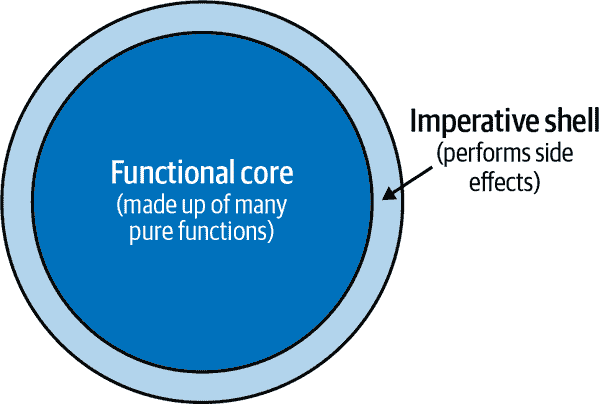

# 第五章：自动化测试：快速迭代而不破坏

> *Dana 刚刚坐在她的桌子前，新鲜咖啡的香气弥漫在她周围。她和团队中的一位初级数据科学家继续进行昨天启动的用户故事——设计一个能够改进模型的新功能。*
> 
> *他们做出了必要的更改，并执行了运行测试的命令。这套测试帮助验证整个代码库仍然如预期般运行。20 秒后，他们的终端显示了绿色的标志——所有测试都通过了。*
> 
> *有时终端显示红色。有些测试失败了，但没关系——失败的测试帮助他们在深陷困境之前发现问题，并通过追溯几步轻松恢复。现在测试又恢复到了绿色，他们又重新尝试了一次。*
> 
> *无论是绿色还是红色，这些测试都能快速反馈代码更改的情况。测试给了他们信心，有时还能让他们兴奋不已，告诉他们是否朝着正确的方向前进，或者在错误方向上停下来。他们不必跟随繁琐的手动步骤来测试代码。当测试失败时，可能导致失败的变更只有少数几个，而不是数小时的潜在嫌疑人供他们筛选。*
> 
> *当他们需要训练模型时，他们运行了一个命令，在云端触发了训练，并且他们的实验追踪仪表板上更新了指标和可解释性可视化，这些都是信号，告诉他们是否走在了正确的道路上。他们稳步迭代，做出了合理大小的 git 提交和推送——这些触发了 CI 流水线上的自动化模型测试——直到故事完成。*
> 
> *他们的认知负荷保持在可控范围内。他们清楚地知道自己需要做什么，并且一步步完成工作。*

我们经常发现，机器学习产品和系统往往测试不足。缺乏自动化测试是技术债务中最常见的一种类型，这迫使机器学习从业者每次想要进行更改时都要付出代价。没有自动化测试，机器学习从业者会在手动测试或解决由手动测试中未能发现的错误导致的生产事故上浪费大量时间。这不仅减少了我们进行有价值工作的能力，还让缺陷、错误和性能不佳的模型流入真实用户的手中。这些产品缺陷可能会摧毁数月甚至数年的机器学习产品建设工作，并给组织带来显著的 [声誉和财务成本](https://oreil.ly/1y076)。

那么，对于机器学习实践者来说，测试并不是什么新鲜事物——事实上，我们经常进行测试。但我们通常是手动进行测试，而不是通过自动化手段。如果你发现自己花在手动测试模型或代码变更质量上的时间比预期多，那么这一章就是为你准备的。我们将分享创建全面自动化测试的实用技术，帮助你的机器学习解决方案。

在本章中，我们将详细说明：

+   手动测试的挑战和不可扩展成本，特别是在机器学习系统中。

+   自动化测试的好处及其如何帮助机器学习从业者创建可靠和易于维护的系统。

+   全面自动化测试策略的构建模块分为两类：软件测试和模型测试。

本章将重点讨论自动化测试的“为什么”和“什么”（例如，我们应该编写哪些测试？一个好的测试看起来如何？）。这将为你提供一个高层次的思维框架，以组织测试策略的每个组成部分的详细信息。然后，我们将深入讨论第一类别的“如何”：软件测试。

在下一章中，我们将探讨：

+   机器学习模型测试：自动化测试的挑战、必要性和方法。

+   测试大型语言模型（LLM）应用程序的技术。

+   使用模型测试作为：(i) 一种成本效益的方式，确保代码、数据和模型变更不会降低产品体验；以及 (ii) 一种“梯步提升”的机制，使我们能够设定新的性能基准，而不会影响已建立的标准。

为了使这两章尽可能对尽可能多的读者有用，我们假设读者有意愿但不一定有经验来编写这些测试。你可以跳过你已经熟悉的测试部分，然后详细阅读对你新的部分。

我们将使用实际示例来说明每种类型的测试，这些示例可以在[代码克隆存储库](https://oreil.ly/Hkgzc)中进行操作，你可以克隆它来阅读、运行和编写测试。这与我们在前一章中使用的存储库相同，你可以在 README 或第四章中找到相同的设置步骤。

# 自动化测试：快速和可靠迭代的基础。

自动化测试是易于维护和演进产品的基础。测试可以快速反馈变更，并使我们能够迅速应对对产品施加的变更，如训练数据的变化、特征工程策略、建模方法和业务需求的变化。

没有自动化测试，变更会变得容易出错、繁琐和紧张。当我们改变代码库的某一部分时，缺乏测试会迫使我们承担手动测试*整个*系统的负担，以确保变更（例如特征工程逻辑的变更）没有导致降级（例如模型质量的降低）。正如图 5-1 所示，随着代码库的规模增长，我们不仅需要承担正在开发的新功能的质量保证工作，还需要承担整个解决方案的手动回归测试负担。


###### 图 5-1。没有自动化测试，质量保证所需的工作量会呈二次增长，而自动化测试可以使工作量增长更可控。

在本节中，我们将详细说明自动化测试的好处，并解释为什么没有测试的持续集成和持续交付（CI/CD）是一个悖论。我们还将讨论为什么在我们看来，ML 项目往往被低估测试，以及我们可以采取的措施。

###### 注意

在本章后面，我们将把测试分为两类：软件测试和 ML 模型测试。虽然从业者通常熟悉如何自动化软件测试，但在早期和探索性阶段尤其是在构建 ML 解决方案时，由于其不确定性和复杂性，有时很难一开始就为我们的 ML 模型定义自动化测试。

试图从一开始测试这些未知的未知因素可能会引入不必要的摩擦。在这些情况下，您可以开始使用探索性测试和可视化作为制定关于模型质量的启发式方法的垫脚石，这些方法可以在自动化模型测试中使用。我们将在第六章中更详细地讨论这一点。

## 从为什么开始：测试自动化的好处

在本节中，我们将详细说明测试自动化的好处。

测试不仅通过自动化质量保证使 ML 系统的使用者受益，而且在开发过程中为 ML 系统的创建者提供快速和重要的反馈。所谓“快速”，我们指的是昼夜之间的差异：一套全面的测试可以将反馈周期缩短数个数量级，从几十分钟到几秒钟，从几小时到几分钟。对于习惯于过夜运行模型的人来说，在某些情况下，这种昼夜之间的差异在某些时候变得非常明显——你不必等待一个昼夜，才发现你的代码更改中存在错误。

让我们看一个场景来说明具有全面自动化测试的机械化优势。还记得我们在本章开头提到的充分饮用咖啡的主角吗？他们进行的每一次代码更改或数据更改都要经过一系列自动化质量检查（参见图 5-2）。每一组测试都规定了团队为软件的特定方面定义的一套质量标准。例如，您可以断言数据每个关键段的模型度量仍高于当前阈值（我们在第六章有更多模型测试的例子）。当所有测试通过时，您可以确信模型及其相关组件与*以前一样好*甚至*比以前更好*，可以发布到生产环境中。


###### 图 5-2\. 一系列自动化测试作为质量门，验证变更是否生成适合生产的产物

相比之下，如果任何变更违反了您为 ML 产品定义的质量标准，本地或 CI 流水线运行的测试将捕捉到这种回归。测试为我们提供了快速反馈（大约在几分钟或甚至几秒钟内），告诉我们变更存在问题，而不是留待我们通过手动测试或客户投诉在更晚的时候发现这些问题。感谢我们的测试，又避免了一次生产事故。这听起来可能像是一个梦想，但在本章和下一章中，我们将演示如何使其成为现实。

如果您仍不确定为什么应该自动化您的测试，这里列出了测试自动化的关键好处：

快速反馈

对于每一次代码更改，即使只是一行代码或跨多个文件，您也可以运行一个命令，并在几秒钟或最多几分钟内测试一切是否正常运行。这与手动测试形成对比，手动测试是繁琐的，可能需要数小时甚至数天。

减少生产缺陷的风险

当测试覆盖率较高时，您的测试可以捕捉到任何在进入生产环境之前引入的意外错误和回归。这节省了您和您的团队在生产环境中应对问题时的努力和压力。

活的文档和自我测试代码

所有功能均伴有描述组件功能及其能处理的场景或边缘情况的测试。如果我们需要更改组件的行为，我们也会更新测试。因此，文档与实际代码是一体的，与描述代码的文档页面形成鲜明对比，后者可能会过时且不一致。¹

减少认知负荷

测试通过系统验证解决方案的每个部分仍然按预期工作，有助于您专注于问题的特定方面，而无需不断担心其他领域的意外后果。此外，如果您解决的问题由许多子问题组成，编写测试有助于您一次专注于一个子问题，这比尝试同时解决所有问题的认知负荷要小得多。测试还促使我们创建模块化组件和明确定义的接口。我们往往会得到更易于理解和重构的软件架构。

重构

重构是有效团队的重要习惯，因为它有助于团队定期减少技术债务和复杂性，但没有测试的情况下，重构是非常高风险的。这往往导致团队选择最小阻力路径——即不进行重构——而代码库变得越来越混乱。结果是，随着时间的推移，执行我们的想法变得更加困难和缓慢。

另一方面，全面测试的安全保护带来的便利性使我们能够进行更改、验证更改，并在交付新功能时定期减少技术债务。在第八章中，我们将分享一个故事，讲述我们如何在一个小时内完成了我们项目的一次重大重构，因为我们整个 ML 系统都有高测试覆盖率——单元测试、集成测试和模型质量测试。重构完成后，所有测试都通过了，我们提交了变更，CI 管道上的所有测试都通过了，变更已部署到生产环境，没有任何戏剧性事件发生。

规范合规性

大多数行业的监管标准通常在模型投放生产前会有质量保证和模型验证的要求。例如，[欧洲委员会表示](https://oreil.ly/lWJTL)，“对 AI 产品和服务进行测试和实验对于使其市场就绪、确保符合安全标准和规则以及安全设计至关重要[...]。”

尽管监管机构并不总是要求这些测试自动化，但自动化测试可以使我们更容易展示合规性。与在监管审核的最后一刻慌乱相比，您可以利用今天可用的工具和技术测试您的 ML 产品，以确保您的 ML 产品对用户的质量是可以接受的。

改进流程、提升生产力和满意度

所有前述的好处帮助 ML 从业者减少摩擦、繁重的工作和不必要的认知负荷。总体而言，自动化测试帮助团队享受快速反馈、减少生产缺陷、持续改进，这些都有助于促进流程、提升生产力和满意度。

###### 注意

在我们进行模型开发期间的测试时，我们的目标是涵盖所有预期的生产场景，但现实世界数据的动态性确保总会有意外情况发生。这就是为什么在生产中进行操作监控是全面测试策略的一部分的原因。它使团队能够检测并解决由于生产数据变动而产生的任何偏差或异常。

下一章中我们将讨论在生产环境中监控机器学习系统。

现在您已经了解了自动化测试的好处，让我们看看机器学习系统经常缺乏自动化测试的一些常见原因。

## 如果自动化测试如此重要，为什么我们还没有进行呢？

在本节中，我们将讨论为什么机器学习系统经常缺乏自动化测试的三个常见原因。

### 原因 1：我们认为编写自动化测试会减慢开发速度

认为编写自动化测试会减慢我们的速度的观点声称：为什么要浪费时间写测试，当我们可以直接编写代码并实现功能呢？这种推理在一定程度上源于[熟道误判](https://oreil.ly/ELRA8)——低估经常走的路线所需的时间，高估不熟悉的路线所需的时间。

根据我们在多个机器学习和软件项目中的经验，我们观察到缺乏自动化测试总是导致团队在手动测试代码时花费更多时间（参见图 5-3）。另一方面，在具有全面自动化测试的项目中，机器学习从业者可以更有效地工作，因为自动化测试使他们免于手动回归测试和解决由于手动测试中不小心遗漏的生产缺陷带来的问题。


###### 图 5-3\. 反直觉：编写自动化测试似乎会花费更多时间，但实际上节省了总体时间

让我们举个例子来说明这一点。假设我们正在开发一些特征工程逻辑，我们认为这些逻辑将改善我们的模型度量指标（包括全局和分层度量指标）达到 X%。自动化测试帮助我们在三个时间段内节省时间：

在开发过程中

在开发过程中，我们还编写了一个测试，指定了我们期望的新度量阈值。我们用一个命令运行测试，并迭代我们的特征工程逻辑，直到测试通过（在此过程中，我们还可以为其他较小的子问题编写其他测试）。这样一来，我们就可以节省时间和精力，不必反复解析全局模型度量或分层模型度量，而是从笔记本或日志中深藏的打印语句中找到结果。

开发完成后

当我们完成一个用户故事²时，我们的团队确信新逻辑已经达到了预期效果（通过查看通过的测试来提高模型 X%）。这消除了需要另一位团队成员重复手动测试流程的必要性，这使他们能够测试边缘情况、缺失数据以及在开发过程中可能忽略的其他场景。

在随后的开发过程中

在未来的几周或几个月里，如果任何变更导致模型回归到新的阈值以下，自动化测试将捕捉到这一点。没有这个测试，我们要么必须花时间手动检查每次提交、拉取请求或发布的模型质量指标，要么面临我们可能在时间上不知不觉地降低模型质量的风险。

### 理由二：“我们有 CI/CD”

CI/CD 已经成为机器学习社区中越来越流行的术语，但它往往被误用和误解。在软件工程中，持续集成（CI）指的是频繁地集成代码变更到主分支的能力。持续交付（CD）指的是能够在任何时刻将软件部署到主分支上到生产环境（详见第九章关于 CI/CD 的详细定义和讨论）。只有当我们有全面的自动化测试来给我们关于代码变更质量的反馈和信心时，这两者才能实现。按照这个标准，我们并没有看到很多机器学习团队实际上在实践 CI/CD。

仅仅因为团队拥有 CI 流水线和自动化部署，并不意味着他们正在进行 CI/CD。CI/CD 流水线的内容很重要：我们实际在 CI/CD 流水线上运行了哪些测试？我们运行了哪些测试来确保我们发布了高质量的模型？我们的 CI/CD 流水线的测试覆盖率是多少？

*在没有全面自动化测试的情况下谈论 CI/CD，这是一种自相矛盾*—这是一组词语，将不兼容的对象或思想联系在一起—并且给我们一种虚假的安全感。虽然 CI 流水线可能全部绿灯，但如果没有全面的测试，我们仍然可能会发布缺陷到生产环境中。在这种情况下，CI 流水线帮助我们忠实地发布缺陷，而不是在开发过程中发现并修复它们。如果我们真的想享受 CI/CD 的好处（详细内容见第九章），我们需要全面的自动化测试。

我们所面临的困境或许有一个社会文化起源。一方面，机器学习工程师倾向于专注于 MLOps 和 DevOps，这些传统上专注于部署自动化、基础设施即代码和 CI/CD。另一方面，数据科学家倾向于专注于训练和评估机器学习模型。虽然这两个世界已经碰撞，但在许多团队中，机器学习工程师（自动化）和数据科学家（模型评估）之间仍然存在能力差距。我们知道如何设置 CI 流水线，也知道如何训练和评估模型，但并不是所有团队都弄清楚如何跨越这两种实践以自动化手动模型评估程序。这引出了我们的下一个观点。

### 理由三：我们不知道如何测试机器学习系统

通过与各行业的 ML 从业者互动，我们知道许多人愿意编写自动化测试。虽然自动化测试对他们来说是新鲜事物，但一些人最终认识到其价值，并将测试作为其工作的一部分。不编写测试的主要原因简单地是他们不知道如何或者没有人教他们如何。

在开创性的[“ML 测试分数”论文](https://oreil.ly/hGTTh)中，作者正确地指出，与手动编码系统测试相比，ML 系统测试可能更具挑战性，因为 ML 系统的行为可能强烈依赖数据，并且无法在先验上强制指定模型。（在论文中，他们接着提出了一个关于如何测试和监控 ML 系统的评分表。）

自那篇论文以来，针对 ML 解决方案中特定组件的测试模式逐渐显现。我们已经开始消除 ML 系统的各部分（例如特征工程、数据处理、模型服务）的歧义，并为不同的测试对象确定了相应的测试策略。

这让我们处于一个很好的位置，因为我们想要编写更好的测试，我们知道有方法可以制定适当的测试类型。唯一阻止我们的是知道我们可以编写哪些类型的测试，以及如何编写它们。因此，让我们转向下一节。

# ML 系统全面测试策略的构建基块

现在你已经看到自动化测试的重要性，让我们开始拼凑一个全面的测试策略看起来像什么。在这一部分中，我们首先确定应该测试什么，然后描述您可以包含在工具包中的测试类型的分类。最后，我们将描述一个好的自动化测试的特征。

## 确定测试组件

构建全面测试策略的第一步是确定我们需要测试什么。表 5-1 详细描述了我们在 ML 系统中可能找到的典型组件，例如模型训练管道、API 服务和特征工程逻辑。如果您发现您的 ML 产品包含表 5-1 中的任何组件，那么每个组件都可以和应该被测试。这些测试还在图 5-2 中描述，以帮助您理解在 ML 模型进入生产过程中的哪个环节使用每种类型的测试。

表 5-1\. ML 系统的自动化测试类型

| 组件或测试对象（SUT） | 测试类型 | 优秀的表现 |
| --- | --- | --- |
| *软件逻辑* |
| 逻辑、数据转换、特征工程 | 单元测试 | 测试列举我们与函数或类交互的场景，并指定正确和预期的行为。*快速运行:* 几十个测试在几秒内运行；甚至数百个测试也能在一到两分钟内完成。如果作为另一个函数的一部分进行了测试，则可能不需要测试“私有”函数。*数量:* 几十到数百个测试 |
| 模型训练流水线 | 训练烟雾测试 | 测试涵盖所有代码路径，就像完整的模型训练运行一样。避免引入条件语句，这会导致训练烟雾测试与实际生产中的训练运行不对称。*快速运行:* 即使是需要数小时运行的 ML 流水线，训练烟雾测试也应在一到两分钟内完成。*可本地运行:* 在本地运行和调试训练流水线有助于快速反馈并排查流水线故障。*数量:* 通常为一到两个测试 |
| 模型 API | API 测试 | 测试指定我们的模型服务将处理的所有场景。测试代表模型服务的契约，并保证向下游消费者。测试包括正常路径和异常路径，以演示模型处理错误场景的方式（例如空值、错误的数据类型）。*可本地运行:* 如上所述*数量:* 可以从五到数十个不等，具体取决于 API 的责任 |
| 部署的模型 API | 部署后测试 | 测试调用刚部署到预生产或生产环境的模型服务。测试不重复覆盖已由 API 测试覆盖的场景。*可本地运行:* 在针对真实服务运行测试时，我们应能访问相关日志以了解服务的行为。*数量:* 通常为一到两个测试 |
| *ML 模型* |
| 训练后的 ML 模型 | 度量测试（全局和分层） | 测试使用验证数据集评估模型。测试应具有可扩展性，并能够在新的验证数据可用时运行，而不与训练流水线耦合（参见“开闭式测试设计”）。*可本地运行:* 如上所述*数量:* 通常在几个到十个之间 |
| 训练后的 ML 模型 | 行为测试 | 测试列举特定的——可能是样本外的——场景，并指定模型的预期行为。我们可以从一个或两个示例开始，并使用数据生成技术来扩展到单个场景中包含许多示例（更多细节参见第六章）。*数量:* 通常在几个到几十个之间 |
| *数据* |
| 数据管道，用于输入和输出数据 | 数据管道测试数据契约测试 | 测试确保数据管道通过验证每个步骤（例如，提取、转换、加载）按预期运行。这些测试检查数据在管道中移动时的完整性和准确性。测试还验证数据是否符合消费系统或组件期望的约定模式、类型和格式。*数量：* 根据管道复杂性而变化，但通常对管道中的每个步骤进行多个测试，以便快速失败并高声失败。 |
| 输入：训练数据 | 数据隐私测试 | 测试检查训练数据不包含个人身份信息（PII）并符合相关数据保护法（例如，GDPR）的要求。*数量：* 应充分证明合规性；具体数目可能根据处理的数据类型而有所不同。 |

本书涵盖了软件测试和模型测试两类测试，因为虽然每类测试都是 *不可或缺的*，但单独一类测试 *不完整*。例如，软件测试适合测试逻辑正确性，但在测试 ML 模型质量时可能不足。而模型测试虽然可以帮助我们扩展可以观察模型行为的场景数量，但与特征工程逻辑相距甚远，并不适合测试该逻辑的正确性。总之，所有的 ML 系统都需要 *既有* 软件测试 *又有* 模型测试。

考虑事故因果的 [瑞士奶酪模型](https://oreil.ly/-ysTS)，它来自风险管理领域。该模型表明，每一层测试可以防止特定类型的问题，但单独的任何一层测试（例如单元测试、训练烟雾测试或指标测试）都不能测试所有不良结果的可能性。这些层次相互补充，以减少盲点并降低错误和其他不良结果进入生产环境的风险（见 图 5-4）。


###### 图 5-4\. 事故因果的 [瑞士奶酪模型](https://oreil.ly/-ysTS)（来源：[Ben Aveling, Wikimedia Commons](https://oreil.ly/kJbAs)，使用 [CC BY-SA 4.0](https://oreil.ly/Hq5C_) 许可）

让我们详细查看 表 5-1 — 机器学习系统的自动化测试类型。

### 软件逻辑

无论您是从头开始训练 ML 模型，使用自定义域数据微调预训练模型，部署预训练模型，还是在边缘设备上进行联邦学习，您都将编写代码，而您的代码是 [软件](https://oreil.ly/1IoCJ)（即，一组指令，告诉计算机如何执行任务或完成任务）。

软件逻辑组件的特点是*确定性正确性度量*（例如，`add(1, 2) = 3`）。每个组件及其组成函数接受一些输入数据，对数据应用一些转换逻辑，并返回输出数据或对数据执行副作用（例如，将数据保存到磁盘）。

关于软件逻辑类别中典型组件及其对应测试的列表，请参阅表 5-1。

### 机器学习模型

虽然软件测试是不可或缺的，但它们只是测试难题的一部分，并不足以完全测试机器学习系统。这是因为模型的行为是从多维数据中学习的，我们很难表达我们对“正确”行为的期望，即使是一个或几个断言也很难。

软件测试通常是*基于示例*或*基于点*的，即使是基于属性的测试在超过三四个维度后也很难阅读和维护。这就是模型测试的用武之地。它们使用类似生产数据的模型进行测试，检查模型的行为是否符合预期，并以有意义且可操作的方式汇总结果。

机器学习从业者通常熟悉模型评估技术，领域专家和客户通常有隐含的心理启发法来判断模型的行为是否正确或错误，好还是坏，更好还是更差。这是自动化机器学习测试的一个很好的起点。我们可以从现有的手动测试方法入手——当我们将一个模型发布到生产环境时，哪些指标或手动测试可以让我们对新模型足够自信？哪些行为类别是不希望出现的？随着我们考虑如何在通往生产过程中自动化更多的质量检查，我们可以自动化——并随着时间的推移，加深——这些模型测试。

我们可以将这些隐含的启发法编码为自动化的[*适应性函数*](https://oreil.ly/Fi6wL)——客观的、可执行的函数，用于总结解决方案接近目标状态的程度。这些适应性函数可以被纳入我们的发布流水线，为逐步改进我们的机器学习模型和减少手动测试奠定基础。我们将在第六章详细阐述适应性函数。

值得一提的是，模型测试与*探索性评估*、*错误分析*、*生产监控*和*数据管理*实践密切相关。我们将在第六章描述这些实践如何互补。

### 综合起来：机器学习系统测试金字塔

为了说明软件测试、模型测试和其他类型的测试如何共同创建全面的测试策略，让我们看看 ML 系统测试金字塔（见 图 5-5）。

金字塔的每个层的大小大致代表测试的数量。例如，单元测试的大底层表示我们应该有许多单元测试，因为它们快速、有针对性，并且在失败时易于理解和调试。另一方面，探索性测试占据金字塔顶部较小的区域，因为虽然它们在全面测试策略中有一席之地，但它们倾向于是手动和不可扩展的，因此我们要确保不要积累大量的探索性手动测试程序。


###### 图 5-5\. ML 系统测试金字塔（来源：改编自 [“Continuous Delivery for Machine Learning” by Danilo Sato et al.](https://oreil.ly/PMz0Z) 中的一幅图像）

尽管我们在书中将测试的分类略有不同——例如，软件逻辑测试可以显示为三个金字塔中的单元测试（数据、ML 模型、软件），我们仍然发现 ML 系统测试金字塔对于识别可包含在解决方案中以减少手动测试并提高自动化质量保证非常有帮助。

现在我们已经很好地掌握了 ML 系统测试的测试层次，让我们看看一个好的测试的特征以及需要避免的关键陷阱。

## 一个好的测试的特征和需要避免的陷阱

让我们来看看帮助我们编写合理和可维护测试的特征和实践。虽然这些实践大多数是从软件工程领域的单元测试和测试驱动开发中借鉴而来，但我们发现它们对我们即将在下一章讨论的模型测试也适用良好。

### 测试应该是独立的并且幂等的

每个测试应该是独立的，即一个测试的结果不应取决于另一个测试的结果。测试还应该是幂等的，即无论执行多少次，结果都应该相同。为了达到这个目的，最好避免任何形式的共享状态（例如与共享数据库或文件进行交互的测试）。

幂等测试的相反就是脆弱测试——即使没有任何变化，测试结果也会无法预测地通过或失败。当我们遇到脆弱测试时，我们应该修复或删除它。否则，脆弱测试将浪费团队的时间在分析和重新运行测试直到它们偶然通过，并且它们还会降低我们对测试和 CI 流水线的信心。

### Tests should fail fast and fail loudly

有什么比 Bug 和错误更糟糕？当然是无声的 Bug 和错误！无声回归的常见例子是模型训练流水线顺利完成，但在绿色流水线状态下潜藏的是潜在的模型质量下降问题，这些问题未被发现。

要避免这种情况，你可以采用“[快速失败与高声失败](https://oreil.ly/Fz9mG)”的原则——Unix 哲学中的一个原则，你可以应用到你的测试和 CI 流水线中，以获得所需的快速反馈。例如，如果一个模型训练流水线需要一个小时，你可以通过编写一个测试来使用非常小的数据集执行整个流水线（我们将在本章后面讨论训练的烟雾测试），如果你的更改引起回归，你可以在一到两分钟内得到反馈。

### 测试应该检查行为，而不是实现细节。

让我们通过 Jason Swett 的[测试汽车的类比](https://oreil.ly/0mXqU)来说明这一点。当你测试实现细节时，你尝试通过检查汽车是否有所有正确的东西来测试汽车是否正常工作：发动机的存在、点火装置、轮子和其他所有从 A 点到 B 点所需的东西。另一方面，当你测试行为时，你通过启动汽车并行驶一段距离来测试汽车是否正常工作。

那些关注实现细节的测试很难阅读，而且对变化很脆弱。让我们用一个负面和一个正面的例子来说明这一点：

```
# bad example: implementation-focused test
def test_train_model_returns_a_trained_model(mock):
   mock.patch("train.training_helpers._fit_model", 
              return_value=RandomForestClassifier())

   model = train_model()

   assert isinstance(model, RandomForestClassifier)

# good example: behavior-focused test
def test_train_model_returns_a_trained_model():
   test_data = load_test_data()
   model = train_model(test_data)
   valid_predictions = [0, 1, 2]

   prediction = model.predict(test_data[0])

   assert prediction in valid_predictions
```

注意第二个测试如何更易于理解？

第一个测试在被测试对象编写不良且缺乏可测试边界的情况下尤为常见。一个方便的解决方法是使用模拟来截断代码的某些部分，但这是有代价的。例如，私有函数`_fit_model()`实际上可能包含错误，但由于我们为了便于测试而截断了代码的某些部分，我们从未实际执行该部分代码，因此测试无法帮助我们发现可能隐藏在`_fit_model()`中的任何错误。

通过关注测试行为而不是实现细节，我们的测试变得更易读、更有用，对实现细节的变化更不脆弱。

###### 注意

我们应该把测试看作代码，因为测试就是代码。我们观察到的上一个糟糕示例中的陷阱源于糟糕的软件设计。例如，第一个测试违反了*封装*，因为测试了太多关于被测试函数的内部实现细节。违反封装会导致紧耦合，这会导致脆弱的代码，需要[散弹手术](https://oreil.ly/YMGWZ)——在整个代码库中进行多处修改以实现单一修改的需求。

我们将在第八章中更详细地讨论这些设计原则，这里需要注意的一点是，测试本质上也是软件。我们应该用有助于编写可读性和可维护性代码的良好编码实践来编写我们的测试。

### 测试应该可以在你的开发环境中运行

我们在云上（例如在 CI 管道上）运行的每个测试都应该可以在你的开发环境中运行——无论是在本地还是在你的云开发环境中。能够在你的开发环境中运行测试并重现任何失败有助于你避免“推送以确认某事是否有效”的反模式。前者给我们提供了几秒钟的反馈，而后者则需要几分钟甚至几十分钟的时间来提供反馈。

当一个测试在 CI 上失败时，首先在你的开发环境中重现这个失败，并迭代一个错误修复。你甚至可以添加断点、调试和检查代码，这比添加打印语句、推送、等待几分钟甚至几个小时，再查看打印语句说了什么，然后重复这一过程更为有效。在你的开发环境中进行错误分析的能力可以帮助你更快地诊断失败。

在某些情况下，可能无法在本地机器上运行一些测试，例如当模型太大而无法在本地机器上容纳时，或者当在本地训练模型花费太长时间时。在这种情况下，你可以设计你的测试使其能够在本地运行，例如使用一个非常小的测试数据集训练一个非常小的模型，简单地作为在云端运行完整训练之前的烟雾测试。

此外，你还可以设置你的开发环境，从本地机器触发远程云端的大规模模型训练（例如使用[Metaflow](https://oreil.ly/RzNXY)或[Ray](https://oreil.ly/yOrkm)等工具），以避免“推送以确认某事是否有效”的反模式。

### 测试必须成为功能开发的一部分

你应该在开发功能的同时编写测试，而不是在单独的故事中作为事后想法进行，理由有两个。

首先，事后测试往往过于粗粒度，错失了在开发过程中编写测试的价值。如果你要解决的问题由许多子问题组成（通常是这样的），编写测试有助于你一次集中精力解决一个子问题，这比尝试同时解决所有问题要少得多的认知负荷。

其次，“测试故事”似乎不如开发新功能有价值，而社会心理压力使得这些故事常常被置于其他积压故事的坟墓中。因此，你会积累技术债务，并且被迫支付利息（例如，在开发后续功能时花费时间进行手动测试），请回忆图 5-3，你会看到由于缺乏自动化测试而导致的二次方累积测试工作量。

请参考有关测试驱动开发（TDD）的侧边栏，简要讨论将测试作为功能开发的一部分的原因、内容和方式。

### 测试让我们“一次捕捉到所有的错误”

正如我们所建立的，您应该在功能开发的一部分编写测试。修复错误或生产事故响应在这方面也没有不同，您也应该在修复的过程中编写测试。通过先编写测试来复现错误场景，您有一个坚实的起点，并且在迭代修复时可以快速运行测试。这些测试保证了这个错误将不会再次发生（除非有人跳过或删除它们！）。

这对模型测试同样适用。例如，通过自己的手动测试或用户反馈，您可能会意识到您的模型在某些数据段上产生的错误预测比其他数据段更频繁。除了临时性的错误分析来处理这个问题，您还可以编写分层度量测试，以确保每个数据段的模型质量度量在相互之间的误差范围内（X%）。这个测试将确保如果您的模型再次在关键数据段表现不佳，您的测试将捕捉到它，并防止该模型发布到生产环境中。我们将在第六章展示这样一个测试的示例。

正如丰田的老将吉野功所说，“只有当你不学习（从中）时才是失败”。每一个生产事故或客户投诉都是我们产品中一个有价值的反馈点，而测试帮助我们将这些差距编码化，并确保相同的错误不会再次发生。

当我们设计和编写测试时，这一组特征及其避免的陷阱是有用的指南。特别是当我们感到不确定时（例如，在这个故事的一部分中编写测试是否有价值？），这些原则帮助我们做出更好的决策。我们希望它也能同样地指导您。

现在你已经了解了测试的理想特征，让我们来看一下自动化测试的组成部分以及我们如何编写它们。

## 测试的结构：如何编写测试

在本节中，我们将描述自动化测试的结构。虽然这个结构来源于单元测试的实践，但我们发现它对其他类型的软件测试和模型测试同样适用。

一个自动化测试应包含三个要素：

+   一个有意义的测试名称

+   安排（arrange）、执行（act）、断言（assert）（AAA）的结构

+   具体和全面的断言

为了说明这些要素，让我们看一个测试的正面和负面例子。我们将在下一节展示更复杂的测试，但现在一个简单的例子将帮助我们关注一个好测试的特征：

```
# good example
def test_convert_keys_to_snake_case_for_keys_with_spaces_or_punctuation(): 
   # arrange (provide input conditions) 
   user_details = {"Job Description": "Wizard",
                   "Work_Address": "Hogwarts Castle",
  "Current-title": "Headmaster"}

   # act
   result = convert_keys_to_snake_case(user_details)

   # assert (verify output conditions)
   assert result == {
       "job_description": "Wizard",
       "work_address": "Hogwarts Castle",
       "current_title": "Headmaster"
    } 
```


测试名称描述了我们正在测试的内容——函数`convert_keys_to_snake_case()`应该做什么（更新字典中的键，以适应包含空格和标点符号的键）。我们的大脑已经准备好接受接下来的实现细节。在具有许多测试的大型项目中，良好命名的测试可以通过摘要“如何”和测试中的密集实现细节来减少认知负荷。


测试具有排列（arrange）、执行（act）、断言（assert）的结构，我们使用一个空白新行来创建视觉层次，表示这三个代码块。然而，在真实的测试中，我们不需要明确地列出“arrange, act, assert”，因为空白行是软件测试中的典型约定，用于指示三个代码块。如果测试更易读，则可以合并部分（例如，可以在小测试中合并排列和执行）。


单一的整体断言清楚地表明了我们对这个函数的期望。

接下来，让我们看一个糟糕的例子：

```
# bad example
def test_convert_keys_to_snake_case(): 
    result = convert_keys_to_snake_case({"Job Description": "Wizard",
                                        "Work Address": "Hogwarts Castle",
                                        "Current_title": "Headmaster"
})
    assert result["job_description"] == "Wizard" 
    assert result["work_address"] is not None 
```


通用测试名称（只是在我们正在测试的函数前面添加`test_`前缀）几乎没有提供我们正在测试哪些场景的信息，并迫使我们阅读测试中的实现细节。


断言是零散和不完整的。在这种情况下，测试实际上可能会忽略一个 bug，因为我们没有对`Current_title`进行断言。


第二个断言太模糊了。该函数可能会对`work_address`字段返回错误的值，但我们的测试仍然会通过。

掌握了自动化测试的原因、内容和方式，现在您已准备好深入了解第一类测试：软件测试！

# 软件测试

在本节中，让我们看一下对于 ML 系统中常见的软件组件进行测试非常有用的四种软件测试类型：

+   单元测试

+   训练冒烟测试

+   API 测试

+   部署后测试

Figure 5-2 将帮助您了解这些软件测试在 ML 模型生产路径中的位置。

## 单元测试

单元测试有助于确保我们的 ML 系统中各个基本构建块的正确性——最常见的是*函数*。无论函数做什么，它都在做某事，而单元测试帮助我们明确指定函数的预期行为，并确保这些期望在每次代码更改时仍然成立。几十年的软件工程经验告诉我们，这比手动测试（容易出错且时间消耗大）、或者更糟糕的是不进行测试，更加可靠和可扩展。

尽管本章中列出的其他类型的测试在某些情况下可能不需要（例如，如果不部署 API，则不需要 API 测试），但单元测试是机器学习解决方案中唯一绝对必要的测试类型。软件逻辑通常占据机器学习项目中大部分代码的占比。例如，机器学习系统的一个重要部分是特征工程，这些数据转换本质上是纯函数和数据的逻辑转换。如果我们不对这些逻辑进行测试，就会为通过手动测试大洞漏漏过的缺陷、错误以及无数小时的调试留下一扇大门。

### 如何设计可单元测试的代码

好了。你已经被说服了单元测试的价值，并且想要开始编写自己的单元测试。但是，你可能正在查看一个看起来非常难以测试的代码库。例如，想象一下，如果所有的代码都在一个非常长的 Python 脚本或笔记本中，并且没有可调用的函数——这会使得测试变得困难，因为我们甚至没有函数可以调用，更不用说要断言的结果了。

好消息是，如果你发现自己处于这样的代码库中，有一些技术可以帮助你重构为模块化、合理且可测试的代码库（我们将在第八章中展示这一点）。但是现在，重点是——代码可以以一种难以测试的方式编写。这通常发生在自动化测试被视为事后附加项时。通过（i）将测试作为解决方案的一部分编写，以及（ii）使用功能编程中的 [功能核心，命令式外壳设计模式](https://oreil.ly/3Gqkc) 来编写代码（见 图 5-6），你可以并且应该使得编写单元测试变得更容易。

厚的功能核心

厚的功能核心是一组纯函数（即，给定相同输入时返回相同输出的函数，没有任何副作用）。示例可以包括任何类型的数据处理、特征工程和数据转换。纯函数是确定性的且幂等，更容易测试。

薄的命令式外壳

薄的命令式外壳是指执行副作用的少量函数集合（例如，加载数据或将文件保存到磁盘或远程存储桶）。这些与外界的交互既计算密集又不确定。通过将它们排除在功能核心之外，我们使功能核心更容易且更快速地测试。



###### 图 5-6\. [功能核心，命令式外壳设计模式](https://oreil.ly/3Gqkc)

###### 注意

顺便说一下，在这种情况下，“命令式”这个词一开始让我们感到困惑，因为我们以为它是指使用明确的指令序列告诉计算机如何操作的编码风格（就像[命令式代码与声明式代码](https://oreil.ly/zk2JZ)中的方式）。然而，它实际上是指*命令式编程*（如[命令式编程与函数式编程](https://oreil.ly/EOA0i)），根据西蒙弗雷泽大学的 Philip Fong 教授的说法，“是一种编程风格，其中副作用不仅被允许，而且是我们编程的主要手段。”

使用这个设计工具，让我们放大来学习如何为特定函数编写单元测试。

### 我怎样编写单元测试？

在每个单元测试中，我们指定传递给被测试函数的输入以及我们对函数返回值的期望（或在薄的命令式壳中，函数的副作用）。

单元测试与本章前面描述的自动化测试共享相同的要素：可读的测试名称，AAA 结构（安排，执行，断言），以及整体断言。作为一个小挑战，你能读懂下面的代码示例并找到每个测试的要素吗？

这里是一个示例，展示了一个将字典转换为蛇形命名键的函数的单元测试：

```
# unit testing a function that transforms a dictionary
def test_convert_keys_to_snake_case_replaces_title_cased_keys():
   result = convert_keys_to_snake_case({"Job Description": "Wizard",
                                        "Work_Address": "Hogwarts Castle"})

    assert result == {
       "job_description": "Wizard",
       "work_address": "Hogwarts Castle"
    }
```

这里是另一个单元测试的例子，但这次是针对将数据变换应用到 pandas dataframe 的函数：

```
# unit testing a function that transforms a dataframe
from pandas._testing import assert_frame_equal 

def test_normalize_columns_returns_a_dataframe_with_values_between_0_and_1():
   loan_applications = pd.DataFrame({"income": [10, 100, 10000]})

   result = normalize_columns(loan_applications)

   expected = pd.DataFrame({"income": [0, 0.009, 1]})
   assert_frame_equal(expected, result) 
```


对于测试数据框架的相等性，我们使用[`assert_frame_equal()`](https://oreil.ly/mIdFt)或[`assert_series_equal()`](https://oreil.ly/ZQqdx)从 pandas 中使用。


通过明确我们对函数的期望，我们提高了对代码行为的理解。在这个例子中，我们可能会发现最小-最大归一化是错误的数据转换，因为它会将最小值基准化为 0（例如，10 的“收入”在归一化后变为 0）。也许我们应该改用[对数变换](https://oreil.ly/RKDC8)。通过编写这个测试，我们发现了一个错误，并找到了改进我们特征工程逻辑的机会。

如果这看起来太容易，那是因为一旦你学会了，它就是简单而强大的！单元测试是一个简单而强大的工具，帮助您确保您编写的每个新功能都伴随有测试，并帮助您获得我们早期描述的各种好处。当团队养成通过自动化测试确保其代码正确性和质量的习惯和纪律时，他们将提高其 ML 实验周期的可靠性、灵活性和速度。

有了这些准备工作，我们现在可以转而关注 ML 系统中另一个被认为难以测试的组件：ML 训练管道。

## 训练 Smoke Tests

ML 训练通常是长时间运行的，可能需要几分钟到几小时。等待时间延长了我们用来评估代码变更效果的反馈循环，也打断了我们的流程，甚至可能使我们更多地进行多任务处理和上下文切换。

即使模型训练只需 10 分钟，为什么要等待 10 分钟才能在最后一步发现错误，当你可以在一分钟或更短的时间内发现呢？训练烟雾测试能在一分钟左右内快速反馈我们的代码变更是否按预期工作或导致任何问题，在 ML 训练任务中。当测试通过时，我们更有信心全面的 ML 训练更有可能成功。

训练烟雾测试通过模拟整个代码路径来工作，就像全面的 ML 训练一样，只是我们使用尽可能小的数据集——甚至 10 个样本就足够了。这里被测试的对象是将数据加载、特征工程、模型训练和创建可消耗的工件（即使是小模型）粘合在一起的代码（你可以称之为 ML 训练流水线、任务或脚本）。

如果没有什么爆炸（即，没有烟），测试通过。术语“烟雾测试”[起源于电子硬件测试](https://oreil.ly/S7Da1)——你插入一个新板并打开电源。如果看到板子冒烟，关掉电源，因为有东西坏了。我们也看到 ML 社区中的其他从业者将这种类型的测试称为[预训练测试](https://oreil.ly/idW2z)，或[集成测试](https://oreil.ly/ZS4h8)。

### 如何编写这些测试？

尽管这些测试的实现可能因你的 ML 训练框架而异，但一般的方法是相同的。像在全面训练中那样在本地调用你的 ML 训练流水线，只是你会使用一个非常小的数据集。以下是一个训练烟雾测试的例子：

```
def test_training_smoke_test():
    data = pd.read_csv("/code/data/train.csv", encoding="utf-8", 
                       low_memory=False)
    # group by target column to ensure we train on data 
    # that contains all target labels:
	test_data = data.groupby('DEFAULT') \
	                            .apply(lambda df: df.head(10)) \
	                            .reset_index(drop=True)

    pipeline = train_model(test_data)

    predictions = pipeline.predict(test_data)
    valid_predictions = {0, 1}
    assert valid_predictions.issubset(predictions)
```

在你的终端中，你可以通过执行以下命令来运行训练烟雾测试：³

```
./batect --output=all smoke-test-model-training
```

在我们之前的一个项目中，我们有一个 ML 训练流水线需要三个小时。全面的训练在云端运行（我们使用[Metaflow](https://oreil.ly/RzNXY)），ML 从业者有时等待两个小时，只是为了在流水线的最后一步看到一个错误。所以，我们设计了一个训练烟雾测试，通过在本地模式下使用小数据集运行 Metaflow 流，并在一到两分钟内本地运行训练流水线。

训练烟雾测试还作为一个预提交钩子运行，因此如果我们即将推送一个错误，我们会在两分钟内找到错误，而不是三个小时。

无论你使用哪种 ML 编排工具或平台，探索如何使用它来创建一个训练烟雾测试。如果没有办法做到这一点，并且你经常发现自己花费大量时间等待，那么也许这个平台或工具不是帮助，而是阻碍你。

现在，您可以快速获得关于我们机器学习系统中典型的缓慢和长时间运行组件的反馈，让我们再次转换视角，看看您如何测试我们编写的软件以为我们的模型提供服务。

## API 测试

如果您将训练好的模型封装并部署为 web API，您可以像测试任何其他 web API 一样测试和启动 API。受测试对象是一个 web API 应用程序。

作为机器学习模型的生产者，您可能会有依赖于您的下游组件，例如前端应用程序或其他 API 的组件。这些下游消费者将不可避免地依赖于您的 API 的行为（例如请求和响应模式）。如果您的行为发生变化并违反了您对这些消费者的约定或承诺，将会导致下游消费者的故障，并为所有人带来很多麻烦。

这就是 API 测试极为有用的地方。它们可以作为一种轻量级的*契约测试*——验证您仍在履行对外界的承诺（即契约）的测试。如果您的代码变更会破坏下游系统，您更希望在本地测试告诉您，在任何地方部署这些变更之前，甚至在提交缺陷之前。API 测试失败也会提示您考虑 API 版本控制和[管理 API 模式更改](https://oreil.ly/A7r-y)。失败的测试肯定比在晚餐时间突然收到其他团队大量消息要好得多。

### 我该如何编写这些测试？

您可以按照以下三个步骤编写这些测试：

1.  考虑对于给定请求您期望的行为。

1.  找到有关如何为您正在使用的 API 库编写 API 测试的文档（例如，如果您使用的是 FastAPI，则找到关于 [FastAPI TestClient](https://oreil.ly/5uqzm) 的文档）。

1.  编写并运行测试！

这是一个模型 API 测试的示例：

```
from fastapi.testclient import TestClient
from precisely import assert_that, is_mapping, \
   greater_than_or_equal_to, less_than_or_equal_to

from api.app import app

client = TestClient(app)

def test_root(self):
   response = client.get("/")

   assert response.status_code == 200
   assert response.json() == {"message": "hello world"} 

def test_predict_should_return_a_prediction_when_given_a_valid_payload(self): 

   valid_request_payload = {
       "Changed_Credit_Limit": 0,
       "Annual_Income": 0,
       "Monthly_Inhand_Salary": 0,
       "Age": 0,
   } 

   response = client.post("/predict/",
                          headers={"Content-Type": "application/json"},
                          json=valid_request_payload) 

   assert response.status_code == 200
   assert_that(response.json(),
               is_mapping({"prediction": greater_than_or_equal_to(0)
                                              and less_than_or_equal_to(4),
                         "request": valid_request_payload}) 
```


假设您已经为返回一个 hello world 消息的请求 `"/"` 定义了一个处理程序，您可以编写如下简单的断言来测试端点处理程序是否返回了预期的响应。


一个可读性强的测试名称。我们选择了以下格式：“{端点路径} (/predict) 在给定 {输入类型} 时返回 {预期输出}。” 您可以进一步调整测试名称以适应其他测试场景（例如，当请求不包含所有必需特征时，predict 返回一个缺少特征的错误消息）。


安排。


行动。


断言。

在您的终端中，您可以通过执行以下命令来运行 API 测试：

```
./batect --output=all api-test
```

### 推荐做法：对“整体”进行断言

我们在测试中经常看到的一个常见问题是零碎的断言。在下面的不良示例中，对响应对象的断言被分成了多个断言，而良好的示例则使用单个字典对响应对象进行断言：

```
# bad example: piecemeal assertions
response = client.post("/predict/", json=valid_request_payload)

assert response.json()["prediction"] == 3
assert response.json()["message"] == "OK"

# good example: holistic assertions
response = client.post("/predict/", json=valid_request_payload)

assert_that(response.json(), is_mapping({"prediction": 3,
                                         "message": "OK"
                                        })
           )
```

我们将坏的例子描述为对“大象的部分”进行断言，而将好的例子描述为对“整体的大象”进行断言。断言整个大象有两个原因更好。首先，测试更易读。一眼就可以看到 API 响应的模式（它是一个包含两个字段的字典）。

其次，测试更为全面——我们测试 API 返回的整个响应有效负载，并且可以捕获到响应有效负载的任何意外更改。根据我们的经验，在断言“大象的部分”时，当团队添加新的部分（例如象鼻）时，团队有时会忘记更新测试。有一天，象鼻可能会丢失，而测试则不会对这个缺陷提供任何反馈。

团队有时选择分步断言，因为他们缺乏工具或语言来指定整体断言。例如，测试中模型的预测可能是非确定性的，因此团队分解断言以适应这一点。幸运的是，现在我们有 Python 库（例如[precisely](https://oreil.ly/__A8U)）可以让我们编写整体断言来断言响应的模式，而不是模型预测的具体值。让我们看看你如何以这种测试风格编写整体断言：

```
# holistic assertion

from precisely import assert_that, is_mapping, any_of, equal_to, is_instance

actual_response = {     
   "prediction": 1,     
   "status": "OK",      
   "user_name": "Harry" 
}

assert_that(actual_response, is_mapping({ 
   "prediction": any_of(equal_to(0), equal_to(1), equal_to(2)), 
   "status": "OK",
   "user_name": is_instance(str) 
}))
```


为了说明目的而硬编码的响应。在真实测试中，这将是函数返回的结果。


该模型可以预测 0 到 2 之间的任何值。


这个字段是一个确定性的值。


假设我们不关心这个字段的具体值；我们只关心它是一个字符串。


`is_mapping()`指定我们期望一个 Python 字典（在其他编程语言中称为映射）。


我们说预测可以是这些值之一：0, 1, 2。对于更长的列表，你可以使用列表理解来简洁地写这个。


我们说我们只关心 user_name 是一个字符串，在我们的情况下，它返回什么具体的值并不重要。

这种工具和技术可以帮助我们编写可读和整体的断言，即使在我们断言的主体包含非确定性值的情况下也是如此。

###### 注意

在拥有成熟软件工程实践的组织中，可能已经建立了关于如何测试 API 甚至其他整体测试策略方面的模式。如果你的情况是这样，我们建议你查找相关文档或专家，以评估并调整这些模式，以适应你正在部署的模型 API。

现在我们已经在本地环境中测试了我们的 API，让我们来看看另一种强大的软件测试——在 API 部署到真实环境后测试我们的 API。

## 部署后测试

在部署后测试中，被测试的对象是 API，该 API 已部署到真实环境（例如预生产环境、生产环境）。每次我们将一个可部署项推向一个环境时，我们希望测试它能按照我们的预期成功处理请求。

如果 API 有任何依赖项（例如数据库、远程存储桶、外部服务），这些测试还充当一个[*广泛的集成测试*](https://oreil.ly/KXecM)，以测试这些依赖项在真实环境中是否按预期工作。部署后测试侧重于验证组件之间的接口（例如 API、ML 模型、数据库）在真实环境中是否正常工作。

部署后测试非常关键，因为它们可以帮助在我们将更改部署到预生产环境后立即发现错误，并在将软件部署到生产环境之前。这带来了一系列好处：节省了从繁琐的手动测试中节省的时间，减少了生产缺陷（这意味着减少了浪费时间进行分析和解决压力型生产事故）。通常，我们还会在将更改部署到生产环境后立即运行这些测试，以验证生产部署是否成功。

部署后测试对于*持续部署*也至关重要，如果您的 CI 流水线的所有阶段都通过，则每次更改都会部署到生产环境。如果您的团队希望成为[DORA（DevOps 研究和评估）指标](https://oreil.ly/60Dwo)定义的*高绩效团队*，持续部署能力是非常基础的。

### 如何编写这些测试？

您应当注意不要从 API 测试中复制逻辑，否则您将不得不维护和更新两套测试。您已经在 API 测试中彻底测试了您的 API，涵盖了所有的代码路径和边缘情况。如果 API 有其他依赖项（例如数据库），则您的 API 测试可以包括模拟和存根响应的逻辑，以模拟错误，而这些测试无法做到这一点，因为它们在真实环境中运行。

在部署后测试中，您只需向被测试对象（即已部署到环境中的 API）发出请求，并验证您收到了预期的响应，如下所示：

```
import requests

class TestPostDeployment:
   endpoint_url = "https://my-model-api.example.com" 

   def test_root(self): 
       response = requests.get(self.endpoint_url)

       assert response.status_code == 200

   def test_predict_should_return_a_prediction_when_given_a_valid_payload(self):
       valid_request_payload = {
           "Changed_Credit_Limit": 0,
           "Annual_Income": 0,
           "Monthly_Inhand_Salary": 0,
           "Age": 0,
        }

       response = requests.post(f"{self.endpoint_url}/predict/", 
                                headers={"Content-Type": "application/json"},
                                json=valid_request_payload
                                ) 

       assert response.status_code == 200 
```


您请求的目标是真实环境中的 API 端点。这个变量也可以从环境变量中读取，这样您可以在多个环境中重用相同的测试（例如预生产环境、生产环境）。如果您的 API 是公共 API，则可能需要使用测试帐户进行一些身份验证和授权。为简单起见，我们已从示例中省略了这些细节，但可以在[测试设置步骤](https://docs.pytest.org/en/6.2.x/xunit_setup.html)中完成。


注意测试名称看起来与前面的本地 API 测试相似？本地 API 测试可以给你一些关于你希望在真实 API 中测试的想法，尽管你需要谨慎地应用以确保不重复测试已在本地 API 测试中测试过的内容。


我们使用 `requests` 包向真实的 API 端点发送请求。


谈到不重复测试的事情，我们没有复制本地 API 测试中的断言，因为那样会显得多余。如果我们改变了 API 的行为，我们需要在两个地方更新它。在这个例子中，我们只断言我们收到了一个正常的 HTTP 状态码（在你的上下文中，你会指定这个请求在真实环境中的正确和成功的处理方式）。

为自己鼓掌！通过这一章，你已经学会了如何测试许多通常在机器学习系统中被低估的组件。凭借这些知识，你可以为团队节省数天甚至数周的手动测试和修复因手动测试中疏漏而产生的缺陷所耗费的时间和精力。

# 结论

让我们回顾一下本章学到的内容。我们学到了：

+   *为什么* 对于希望快速、安全和可靠迭代的团队来说，自动化测试至关重要

+   如果我们在编码时犯错（正如人类不可避免地做），测试就像一个安全网，能够在我们摔倒时抓住我们，而不是让我们痛苦地撞向生产中的错误。

+   基于我们在各个行业交付机器学习解决方案时的经验，自动化测试的好处（例如减少认知负担、重构的便捷性、团队速度的提高）

+   不在机器学习系统中写自动化测试的理由（鉴于我们今天拥有的测试知识、技术和工具，我们挑战了这种理由的有效性）

+   *什么:* 一个全面的测试策略的构建模块，覆盖可以测试的多种组件（软件和机器学习模型）

+   *如何:* 如何编写自动化测试，有用和可靠测试的特征，以及要避免的陷阱

现在轮到你将知识付诸实践了。反思你自己的机器学习项目，考虑：

+   你的团队在手动测试上花费最多时间的地方是哪里？

+   你的代码库中是否有任何低 hanging fruits（当前未经测试的区域）可以受益于自动化测试？

+   你能写并提交一个或多个自动化测试来解决这些低 hanging fruits 和显著的时间浪费吗？（提示：参考 [code-along 代码库](https://oreil.ly/Hkgzc) 以获取编写和运行测试的示例。）

在下一章中，我们将看看如何自动化机器学习模型的测试，以及在机器学习系统中测试机器学习模型的实践。

¹ 文档在任何软件中都是必不可少的，但是测试提供的组件级或功能级文档与其他类型的文档（例如[model cards](https://oreil.ly/b-qIC)，服务单页）有着不同的目的。

² 用户故事是敏捷软件开发中用来捕获软件功能描述的工具。更多详情请参见 第二章。

³ 如果你需要回顾一下 batect 是什么以及如何设置它，请查看 第四章。
