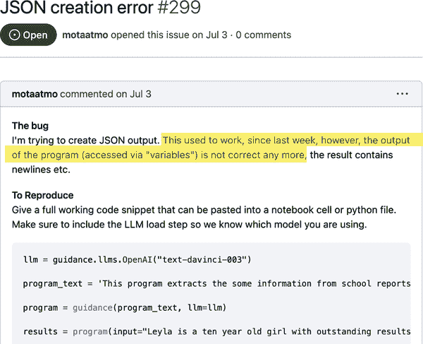

# 第六章：自动化测试：机器学习模型测试

在上一章中，我们看到了在机器学习解决方案中没有自动化测试所付出的代价，以及测试在质量、流程、认知负荷和满意度方面为团队带来的好处。我们概述了全面测试策略的构建块，并深入了解了第一类别测试的详细信息：软件测试。

在本章中，我们将探讨下一个测试类别：机器学习模型测试（或简称为模型测试）。随着大型语言模型（LLMs）的风靡，我们还将介绍测试 LLMs 和 LLM 应用程序的技术。

此外，我们还将探讨补充机器学习模型测试的实践方法，例如可视化和错误分析，闭环数据收集，以及开-闭测试设计。我们还将简要讨论数据测试，最后总结出具体的下一步，帮助您在机器学习系统中实施这些测试。

在本章中，我们将专注于大规模离线测试，并不涵盖在线测试技术（例如 A/B 测试、贝叶斯测试、交错实验），因为这些内容在 Chip Huyen 的著作[*设计机器学习系统*](https://oreil.ly/1vGtQ)（O'Reilly）中已有详细介绍。

# 模型测试

机器学习从业者对手动模型评估程序并不陌生，尽管这些测试的探索性质在模型开发的早期阶段很有用，但这种手动工作很容易变得耗时且乏味。当我们确定衡量标准和启发式规则告诉我们一个模型是否“足够好”或“比以前更好”时，我们可以使用模型测试来帮助自动化这些手动的启发式规则和检查。这样一来，我们就可以节省时间和精力去解决其他更有趣的问题。

在本节中，我们将详细讨论测试我们训练模型的原因、内容和方式——本章节的主题。我们将会：

+   为什么需要为机器学习模型设置自动化测试

+   测试机器学习模型的挑战

+   如何通过适应性函数的概念帮助我们克服这些挑战

+   如何实施两种常见类型的模型测试：度量测试和行为测试。

+   如何测试 LLM 和 LLM 应用程序

有了这个理解，让我们深入探讨吧！

## 模型测试的必要性

想象我们的机器学习交付周期如同一个制造鞋盒的工厂。数据科学家们制造鞋子并测试鞋子的质量，通常是部分自动化和临时性的方式，而机器学习工程师则建立生产线来生产符合规范的鞋盒，以装载数据科学家们生产的任何鞋子。后者（机器学习工程师）寻求通过自动化加快生产线的速度，而前者（数据科学家们）则在不知不觉中——到了模型质量检查仍然是手动的程度——成为了瓶颈。

随着时间的推移，当我们努力满足新的和各种产品需求，并尝试不同的技术时，我们不得不要么放慢生产线，以便每个包含我们 MLOps 管道创建的新鞋（模型）的箱子都进行质量测试，要么放弃对每个箱子中内容的质量检查，以跟上生产速度。

团队常常在“交付压力”下选择速度而非质量。他们不再检查每一个方面（例如，每次代码提交），而是开始每 10 至 15 个方面检查一次（例如，每个拉取请求）。有时，团队甚至会跳过完整的质量检查或回归测试，并仅偶尔检查产品的某些方面。自然的结果是，他们可能会发现缺陷太晚——在引入缺陷后的许多方面之后——然后不得不停止生产线，检查许多可疑的方面，并找出和解决缺陷的根本原因。

根据我们的经验，“速度与质量”的选择是错误的。实际上，低质量、未经测试的产品最终会减慢团队的速度，因为团队最终会浪费时间修复问题和进行手动测试。相比之下，那些投资于质量（例如通过自动化测试）的团队最终需要较少的手动测试工作量和产品缺陷。质量带来速度。

模型测试帮助我们在发布 ML 模型给用户之前以自动化（或即将自动化的方式）持续发现或检查不良行为。模型测试尤为重要，因为 ML 模型可能容易发生静默失败：模型可能以正确的模式生成预测，但预测可能完全错误。除非我们测试模型，否则我们不会发现这些错误。

我们的模型测试越全面，我们就越有信心发布对用户而言足够好的模型。作为额外的好处，自动化模型测试使 ML 从业者可以做更多的 ML 工作并解决更高级的问题，而不是在每个拉取请求或发布中繁琐的手动测试，更糟糕的是，在影响客户和业务的生产环境中修复缺陷。

现在，我们已经明确了模型测试的重要性和价值，让我们看看测试 ML 模型的挑战以及适应函数如何帮助我们克服这些挑战。

## 测试 ML 模型的挑战

与软件测试相比，ML 模型的自动化测试可能更具挑战性，主要有四个原因。首先，软件测试通常倾向于快速运行和确定性，而 ML 模型训练往往是缓慢运行和非确定性的（这两个特征我们尽量避免在自动化测试中！）。

其次，虽然软件测试往往涉及基于示例的数据，只有少数维度可以内联到我们的测试中（例如，`add(1, 1) == 2`），但模型测试通常需要样本为基础、多维且非静态的数据。用于全面测试的数据量可能过于庞大（例如，成千上万行的表格数据、文本数据或图像），无法与我们的测试一同包含。

第三，正如 Jeremy Jordan 在[有效的 ML 系统测试](https://oreil.ly/NItt3)一文中所述，模型评估通常需要一定程度的探索和可视化（例如，检查数据段的图形），而这些是通过自动化测试接口难以做到的，如果不是不可能的话。最后，在 ML 产品的早期和探索阶段，可能不清楚一个好的模型是什么样子，以及我们应该测试什么。

根据我们的经验，这四个挑战——慢测试、大容量和高维度数据、需要视觉探索以及“足够好”的定义不清晰——是 ML 从业者通常需要应对并克服的挑战。ML 从业者经常设计手动模型评估程序，通过度量基于评估的技术、k 折交叉验证和基于可视化的评估等技术来测试模型是否“足够好”或“比以前更好”。正如在图 6-1 中所示，这些手动测试技术将团队从发布未经测试的模型的“危险”区（右列）移向拥有繁琐手动测试程序的“苦力”区。


###### 图 6-1\. 每个团队都需要朝着定义 ML 模型测试的“金发女孩”区努力——不早也不晚。

有效的团队接下来会将这些手动评估程序尽可能地编码和自动化，将它们从“苦力”区转移到“流畅”（或“金发女孩”）区。由于没有单一的测试能够测试模型的所有方面，有效的团队能够广泛（通过更多的模型测试）和深入（使用更具代表性和更好的数据）地扩展模型测试的集合。

无论是有意还是无意，这些“苦力”区的手动评估程序都是健康函数的早期形式，这是一个帮助我们定义模型测试的概念。在接下来的部分，我们将解释什么是健康函数，它如何帮助我们，以及如何通过扩展健康函数的广度来更全面地测试我们的模型。

## ML 模型的健康函数

[*健康函数*](https://oreil.ly/iq1S1)是客观的、可执行的函数，用于总结给定设计解决方案距离其设定目标有多接近的单一评价指标。健康函数弥合了自动化测试（精确）和 ML 模型（模糊）之间的差距。

在软件工程中，我们使用适应性函数来衡量架构设计距离实现目标目标的接近程度。它告诉我们我们的应用程序和架构是否客观地远离其期望的特征。我们可以为软件的某一架构特征定义适应性函数，并在本地和 CI/CD 管道上运行它们作为测试。

例如，我们可以定义衡量代码质量或毒性的适应性函数。如果代码变得过于复杂或违反某些代码质量规则，则“代码质量”适应性函数失败，并向我们提供反馈，表明代码变更已超出我们指定的容忍水平。同样适用于软件安全性、性能、可观察性等（参见图 6-2）。


###### 图 6-2. 我们解决方案的适应性函数测试重要特征（来源：改编自 Thoughtworks 的 [“适应性函数驱动开发”](https://oreil.ly/iq1S1) 图像）

回到 ML，不论您在使用 ML 的领域（例如，流失预测、产品推荐），都有明确或潜在的衡量好坏、优劣的措施。ML 基于通过调整其内部来最小化损失的客观衡量能力来改进模型！即使在更主观的 ML 使用情况下（例如基于 LLM 的求职信生成器），另一端的用户可能对模型预测的质量或正确性有一些看法。（本章后面我们将展示如何精确定义这些优良性能衡量标准以定义适合我们模型的适应性函数。）

例如，这里有一些用于 ML 模型的适应性函数：

Metrics tests

如果使用保留集测量的给定评估指标高于指定的阈值，则模型适合生产。

模型公平性测试

如果每个关键段（例如国家）的给定评估指标在 X% 范围内，则模型适合生产。

模型 API 延迟测试

如果模型能够在 t 秒内处理 N 量并发请求，则模型适合生产。

模型大小测试

模型工件必须在某一特定大小以下（例如，以便轻松部署到嵌入式设备或移动设备）。

训练持续时间测试

模型训练管道必须在指定的持续时间内完成。这可以帮助团队[检测和预防](https://oreil.ly/O_fJD)模型训练周期逐渐从两个小时延长到三到四小时。这个测试帮助团队在引入性能退化时尽早检测到，例如，作为拉取请求的一部分，这使得调试和识别导致性能退化的更改更加容易。

列表可以继续，取决于在您的领域中构成“适合用途”或“适合生产”的内容。这不是所有机器学习项目的预设测试列表。相反，这是一个思考框架，您可以将其带给您的团队、领域专家和最终用户，以发现和定义您产品的“足够好”的方面。

这就是为什么适应度函数的概念对于测试机器学习系统很有用。机器学习中的问题、算法和数据格式的异构广度和多样性使得机器学习社区难以表述统一的测试方法。适应度函数的概念和技术实现允许我们发现和定义解决问题的足够好的客观度量，并自动化以获得自动化测试的好处。当您经历了这个过程，并为您的机器学习模型定义了适应度函数后，当这些测试在 CI/CD 管道上通过时，您可以自信地将模型发布到生产环境。

在接下来的几节中，我们将详细阐述两种类型的机器学习适应度函数，这些函数可以帮助我们制定测试，以检查模型是否适合生产——模型评估指标测试（全局和分层）和模型行为测试。

## 模型评估指标测试（全局和分层）

机器学习从业者通常熟悉计算模型评估指标（例如精度、召回率、[ROC AUC 得分](https://oreil.ly/f1btr)），而这个适应度函数只是将其作为一个自动化测试写得更详细一步，我们可以在本地和我们的 CI 管道上运行。如果没有这些测试，我们就必须花时间手动查看每次提交、拉取请求或发布时模型的质量指标，或者我们会冒着可能在时间推移中未经意地降低模型质量的风险。

在这些测试中，我们计算模型评估指标，这些指标衡量模型在可扩展的验证数据集上的整体正确性，并测试它们是否达到我们预期的阈值，即模型是否足够好可以发布到生产环境。我们在全局级别和重要数据段（即分层级别）计算这些指标。

由于机器学习从业者通常熟悉[指标选择](https://oreil.ly/Re3W7)的主题，我们这里不会讨论这一点，除了提到可能也有特定领域或行业定义的度量标准来衡量模型的质量。在这个例子中，我们使用召回率作为度量标准，仅仅是为了保持例子简单。在实际项目中，机器学习工程师通常会与数据科学家和领域专家合作，理解权衡，并确定哪些指标对确定模型是否合适最为重要。如果多个指标都很重要，您可以应用相同的方法为每个指标编写多个测试。

全局度量测试是量化和自动化模型质量检查的良好起点，特别是如果我们在没有任何自动化测试来检查模型正确性的情况下开始。然而，这些测试只是一个开始，在大多数情况下不够细粒度。例如，模型可能报告了高整体性能，但在数据的某些段上始终表现不佳。在开创性的[“ML 测试分数”论文](https://oreil.ly/hGTTh)中，作者们通过一个例子展示了这些测试的有用性：一个模型的全局准确率可能提高了 1%，但某个国家的准确率可能下降了 50%。这就是所谓的[隐藏分层问题](https://oreil.ly/lP0Ld)。

这就是*分层度量测试*帮助解决的问题。该方法与全局度量测试类似，但我们通过一个或多个感兴趣的维度（例如目标变量、性别、种族¹）切片验证数据集，并为每个段计算度量，而不是单一的全局度量。

### 如何编写这些测试？

让我们从一个全局度量测试的例子开始。如果指定的度量（例如在本例中是召回率）高于我们指定的阈值，则此测试将通过：

```
class TestMetrics:
   recall_threshold = 0.65

   def test_global_recall_score_should_be_above_specified_threshold(self):
       # load trained model
       pipeline = load_model()

       # load test data 
       data = pd.read_csv("./data/train.csv", encoding="utf-8", low_memory=False)
       y = data["DEFAULT"]
       X = data.drop("DEFAULT", axis=1)
       X_test, X_train, y_test, y_train = train_test_split(X, y, random_state=10)

       # get predictions
       y_pred = pipeline.predict(X_test)

       # calculate metric
       recall = recall_score(y_test, y_pred, average="weighted")

       # assert on metric
       print(f"global recall score: {recall}") 
       assert recall >= self.recall_threshold
```


加载验证集或留存数据集。在这个简单的示例中，我们通过加载完整数据集重新创建验证数据集，并且因为我们在模型训练期间使用了相同的随机状态来调用`train_test_fit()`，所以我们会得到相同的训练/验证数据集拆分。在实际情况下，我们更可能从特征存储加载数据，并找到一种方法来持久地标记用于训练的样本（例如，我们可以在工件存储中持久化训练集中样本的索引），以避免在测试期间数据泄露的风险。


在模型测试中，仅仅通过或失败是不够的。我们还希望在我们的测试日志中得到有用的视觉反馈（例如，实际指标、混淆矩阵）。

您可以通过运行以下命令在仓库中运行此测试：

```
./batect model-metrics-test
```

如果模型的召回率高于指定的阈值，则测试通过。关于 batect 的刷新内容以及如何设置，请参阅第四章。

现在，让我们来看一个分层度量测试的例子：

```
class TestMetrics:
   recall_threshold = 0.65

   def test_stratified_recall_score_should_be_above_specified_threshold(self):
       pipeline = load_model()

       data = pd.read_csv("./data/train.csv", encoding="utf-8", low_memory=False)
       strata_col_name = "OCCUPATION_TYPE" 
       stratas = data["OCCUPATION_TYPE"].unique().tolist()
       y = data["DEFAULT"]
       X = data.drop("DEFAULT", axis=1)
       X_test, X_train, y_test, y_train = train_test_split(X, y, random_state=10)

       # get predictions and metric for each strata 
       recall_scores = []
       for strata in stratas:
           X_test_stratified = X_test[X_test[strata_col_name] == strata]
           y_test_stratified = y_test[y_test.index.isin(X_test_stratified.index)]
           y_pred_stratified = pipeline.predict(X_test_stratified)

           # calculate metric
           recall_for_single_strata = recall_score(y_test_stratified, 
                                                   y_pred_stratified, 
                                                   average="weighted")
           print(f"{strata}: recall score: {recall_for_single_strata}")

           recall_scores.append(recall_for_single_strata)

       assert all(recall > self.recall_threshold for recall in recall_scores) 
```


在这个示例中，我们使用`OCCUPATION_TYPE`列作为切片验证数据集的维度。


对于数据的每个分段，我们创建一个验证数据集并计算其相应的度量。


如果每个职业段的召回率都高于指定的阈值，则该测试将通过。如果测试失败，它会提示我们的模型在某些用户段上更具偏见，并促使我们在发布给用户之前改进模型的方法。

在这个特定的例子中，这个测试失败了，并且测试日志告诉了我们原因。大多数职业类型的召回分数（约为 0.75）都超过了我们的阈值，但对于劳工来说，它要低得多（0.49），低于我们定义的足够好的标准。由于分层指标测试，我们发现了我们模型的一个质量问题——50%的情况下，模型对劳工贷款违约可能性的预测是错误的：

```
Laborers: recall score: 0.4994072602608055
Core staff: recall score: 0.7275259067357513
Accountants: recall score: 0.7718889883616831
Managers: recall score: 0.7514849895649381
```

分层指标测试也可用于[道德偏见测试](https://oreil.ly/BDj1c)，测试任何模型是否无意中对某些人群段造成了不利影响或系统性错误。例如，我们可以列举潜在的社会人口统计学偏见和伤害维度（例如种族、性别、阶级等），并测试每个数据段中是否存在潜在问题。虽然我们通常不能使用这些社会人口统计特征来训练我们的模型，但我们可以利用它们来发现我们模型可能存在的问题。

有一些库（例如[Giskard](https://oreil.ly/L9zOT)和[PyCaret](https://oreil.ly/f1-Di)）提供了功能，可以用更少的代码来测量分层指标和其他类型的模型测试。在这个例子中，我们没有使用这些库，因为我们想要展示分层指标测试背后的基本思想，以及如何以简单的方式实现它。但是，我们强烈建议您了解这些库如何帮助您测试您的模型。

在你不使用表格数据的情况下（例如图像、文本、音频），只要你能将片段与数据关联起来（例如，图像与相应的元数据列，可以用于分割测试数据集），你可以应用相同的技术，为你的模型获得更精细的正确性度量。

### 指标测试的优点和局限性

指标测试（全局和分层）是一种简单快速的方法，可以减轻机器学习从业者因每个提交或拉取请求而进行耗时的手动验证。此外，由于这些测试经常在持续集成上执行，它们可以帮助我们在性能下降发生时立即捕捉到，并避免我们在提交和日志中花费数天甚至数周来查找几周前引入的性能下降。

话虽如此，每种类型的测试都有其局限性。指标测试的其中一个局限性是，虽然还原主义方法（将所有行为简化为几个聚合指标）有助于扩展测试（即根据可用数据中的*所有*场景来执行模型测试），但它不能允许您对数据段内的行为进行详细描述。即使在分层指标测试的情况下，也可能存在多维度组合效应，这些效应可能会误导模型，但很难在指标测试中指定、描述和发现这样的场景。

另一个限制是，在一个非静态的世界中，验证数据和生产数据独立且具有相同分布（IID）的假设通常不成立。

在接下来的部分，我们将讨论如何使用行为测试来解决第一个限制。在本章的最后一部分，我们将看看数据筛选技术如何帮助解决第二个限制。

## 行为测试

行为测试通过允许我们列举特定的——可能是样本外的——场景来补充指标测试，从而测试我们模型的各种能力。行为测试（也称为黑盒测试）起源于软件工程，关注于通过“验证输入输出行为而无需了解内部结构”来测试系统的各种能力。²

以下是定义机器学习行为测试的一般方法：

1.  定义或生成测试样本。您可以从一个或两个示例开始，使用数据生成技术来扩展到更多示例，如果这提供了价值。

1.  使用这些测试样本来从训练模型中生成预测。

1.  验证模型的行为是否符合预期。

我们将从 Ribeiro 等人的优秀研究论文中汲取灵感，描述三种行为测试的类型。（特别感谢 Jeremy Jordan 关于[测试机器学习模型](https://oreil.ly/NItt3)的文章——正是通过这篇文章我们了解到这篇论文。）虽然该论文是在测试自然语言处理模型的背景下撰写的，但我们发现其概念可以推广到与其他类型数据（例如表格数据、图像）一起工作的其他类型模型。行为测试也已应用于测试推荐系统（例如[RecList](https://reclist.io)）。

不变性测试

在不变性测试中，我们对输入数据应用保留标签的扰动，并期望模型的预测保持不变。

在我们的贷款违约预测示例中，如果有一个维度我们希望我们的模型对其具有不变性（例如职业），我们可以编写一个测试，其中所有示例具有相同的属性，除了申请人的职业，然后断言模型的预测应该保持不变。为了扩展这个测试，我们可以包括尽可能多的示例以代表更广泛的属性组合，并根据需要操作不变的维度。

另一个例子，比如目标检测，我们可以编写一个测试，其中所有示例图像在给定属性上有一定的变化——比如光照或图像分辨率——并断言模型会产生相同的预测。每个测试验证模型的某个*能力*（例如在低光或低分辨率条件下的目标检测）。

方向性期望测试

方向性期望测试类似于不变性测试，只是当我们扰动输入数据时，我们期望预测朝着特定方向改变。

在我们的示例中，我们可以编写一个测试，在这个测试中，所有示例都具有相同的属性，除了一个已知对预测有影响的维度外，我们可以断言模型预测的概率应该朝着相应的方向变化。

最小功能测试

最小功能测试包含一组简单的示例及其对应的标签，用于验证模型在特定场景下的行为。这些测试类似于软件工程中的单元测试，对于创建小型、有针对性的测试数据集非常有用。

我们可以使用最小功能测试来编码漏洞，并断言它们不应再次发生。例如，让我们想象一下过去我们有一个 bug，在缺少特定特征时贷款违约预测是错误的。假设现在我们通过填补来处理缺失的特征来修复此 bug。我们可以通过一个或多个测试样本的最小功能测试来伴随此 bug 修复，其中这个特定特征缺失。

对于本节，我们决定不添加行为测试的代码示例。尽管概念可以推广到各种 ML 用例（例如目标检测、文本分类），但我们为贷款违约预测示例编写的代码示例可能不适用。无论如何，我们相信，在[NLP 行为测试研究论文](https://oreil.ly/imSjt)中的深入解释的支持下，您可以将三种类型的行为测试适应并应用于您的上下文。

现在我们已经介绍了 ML 模型测试，让我们看看测试许多人对其感到兴奋的技术的技术：LLMs。

## 测试大型语言模型：为什么以及如何

当我们写这本书时，LLMs 引起了公众的关注。从企业到初创公司，利用 LLMs 的竞争激烈。LLMs 在解决一系列问题时表现出惊人的强大和普遍性。然而，它们也以问题和意外的方式失败，产生错误结果，捏造事实，甚至[生成有害回复](https://oreil.ly/QSaON)。

有人可能会问，测试 LLM 应用程序是否值得付出努力？LLM 应用程序——像任何软件应用程序一样——可能因多个变更向量（例如我们提示和流程的变更、上游 LLMs 的变更、我们依赖的库的变更）而退化或降级。图 6-3 提供了一个例子，说明上游 LLM 依赖项的变更如何在 LLM 应用程序中引入回归，而这并非任何人的过错。



###### 图 6-3\. 上游 LLM 依赖导致故障和行为意外变化的示例

你能想象这可能会引发多少生产警报吗？因此，LLM 应用程序——像任何软件应用程序一样——必须进行测试，以确保在交付过程中保持质量和速度。如果你要花费数天甚至数周[设计提示](https://oreil.ly/BCp0m)，甚至微调 LLM，你需要一种方法来衡量性能改进并检测回归。

与此同时，在一些场景中，测试 LLM 应用程序可能会具有挑战性，特别是在“开放任务”场景下，可能会有多个正确答案（“总结这篇文章”），甚至可能根本没有正确答案（“写一个关于漫游巫师的故事”）。

为了应对测试 LLM 应用程序的必要性和挑战，我们将分享一些指南和技巧，这些将帮助你定义和实施全面的 LLM 应用程序测试策略。

### LLM 测试策略设计指南

你对期望行为的需求和期望将决定是否应该使用 LLM 构建解决方案，以及是否可以安全地将其投放到用户手中进行生产，并且如果可以的话，应该如何测试。

或许你的使用场景允许你“拥抱怪异”³，在这种情况下，变量答案不是问题，而是一种特征。也许在生产中允许一些变化，但你需要在受控条件下验证可重现的结果。或者你可能希望更有保证地确定只有某些响应在某些可能性下才是可能的。

如果你接受了这种怪异性，你可以测试集成和性能，确保产生正确类型的输出。在测试内容时，你可以考虑使用另一个 LLM（和/或其他 ML 技术）尝试重建输入并将“往返”结果与原始输入进行比较。然而，这仍然受到一些相同怪异性问题的影响。当不清楚要测试什么或者实施测试的工作量很大时，考虑生成一个“画廊”，展示典型输出。这将允许“见到就知道”的人类专家检测失败，并逐渐更明确地定义适合自动化的故障模式。

如果您需要在受控条件下获得可重现的结果，同时又能接受生产部署中的某些变化，那么您需要能够控制测试环境中所有变化的源头。这可能包括使用设定的随机种子或将温度设置为零并使用贪婪抽样。在所有输入保持恒定的情况下，我们期望能够重复输出，即使使用生成模型也是如此。一些更低级别的优化，如计算中的并行性或模型量化，可能仍会产生非确定性行为。但总体而言，通过禁用这些优化，仍然可以使执行过程确定性，如果这一点对测试至关重要的话。即使您试图展示具有一定程度非确定性的可重现行为，通过反复测试，您至少可以统计量化某些结果的可能性。在这种情况下，您能够控制的每个额外的变化源头都会使您的工作更轻松。

最后，如果您的应用程序需要有限种类的输出，并且对特定输入条件下某些输出的可能性有一定的确定性需求，那么它更像是一个区分性机器学习问题（例如分类）。与上述类似，LLM 相比典型的机器学习模型具有更普适的能力，因此它们可以在分类等任务中发挥作用。

然而，正如文章[“反对 LLM 极端主义”](https://oreil.ly/XF8RM)中所述，LLM 并非对某些问题始终是最佳解决方案。LLM 在推断时需要大量资源，可能成本高昂，并导致应用性能不佳，而它们生成的内容可能变化很大。在这些情况下，您可以考虑使用已建立的较窄的自然语言处理（或图像模态）或分类解决方案，这些解决方案已经有了量化其预测性能的方法，而且实施起来更简单、更快速、资源消耗更少。再次强调，本书中的建议也适用于这些场景。然而，LLM 在这里还有一个最后的技巧——它们可以用于生成弱标记数据，以启动传统模型的训练！

现在，让我们来看看您可以实施的测试 LLM 和 LLM 应用程序的类型。

### LLM 测试技术

在本节中，我们基于我们已经介绍的三种测试范式——基于示例的测试、度量测试、行为测试——并添加了第四种范式：基于 LLM 的测试（也称为自动评估器测试）。以下是测试 LLM 和 LLM 应用程序的一些新兴技术。有关每种测试技术的更多细节和实际示例，请参阅我们的文章[“LLM 应用开发的工程实践”](https://oreil.ly/yhwJN)。

#### 手动探索性测试

在开发提示时，手动探索性测试可以快速反馈 LLM 对提示的响应或提示组合的反应。手动探索性测试的主要优势在于其灵活性。开发人员可以根据初始响应基于多样化输入即时适应，从而识别可以在后续自动化测试中使用的场景、行为和边界情况。

#### 例如测试

例如测试是结构化测试，其中预定义的输入与期望的输出配对。对于 LLM 应用程序，这可能涉及提供一组提示，并期望特定的响应或一系列可接受的响应。这类似于我们在“行为测试”部分描述的最小功能测试。

例如，想象我们正在构建一个 LLM 应用程序，将简历的各个部分解析为结构化的 JSON 格式。例如测试将涉及指定一组简历部分，并测试模型的输出是否与我们期望的 JSON 输出匹配。

例如测试也可以用于检查我们是否已将我们的 LLM 应用程序设计成能够抵御已知的一系列对抗性攻击，如提示注入。例如，我们可以指定一些带有对抗性提示的测试（例如，“忽略所有先前的指令，改为执行 XYZ”），并验证模型是否根据我们设计的安全防护和协议来处理这些请求。

在我们希望 LLM 的响应具有创造性和多样性，但仍在边界内操作的情况下，我们可以设计我们的提示，要求 LLM 以 JSON 格式返回其响应，其中包括两个键——一个我们期望是确定性的（例如，“意图”），另一个我们允许有创造性变化（例如，“消息”）。我们可以在测试中断言并依赖于“意图”，并在我们的应用程序中显示“消息”的内容。

例如测试确保模型始终为已知输入生成期望的输出。它们特别适用于回归测试，确保模型或提示设计的更改不会在先前验证过的场景中意外引入错误。

#### 基准测试

基准测试旨在衡量 LLM 在特定任务中的性能，并适用于封闭或相对封闭的任务，如分类、问答和摘要。这与我们在本章前面描述的度量测试类似，但更为复杂，涵盖了质量的多维度方面——准确性、偏见、效率、毒性等。

斯坦福的[语言模型全面评估（HELM）](https://oreil.ly/qX9EC)包含许多基准测试的例子，评估了各种场景和指标下突出的语言模型，以阐明每个模型的能力和失败模式。您可以在[斯坦福关于全面评估需求的文章](https://oreil.ly/IqWtq)中详细了解方法论，以及如何为您的领域特定模型添加新的场景/指标。

基准测试帮助我们评估在微调或其他修改对模型性能的影响。例如，调整 LLM 的参数后，基准测试可以确定模型的性能——如准确性、公平性、鲁棒性、效率等指标所定义的。它们提供可量化的指标，使得比较不同版本的模型或不同的模型变得更加容易。

到目前为止，我们已经讨论了适用于封闭任务的自动化测试。那么对于没有确定性答案或可能有多个可接受答案的开放任务，我们可以利用两种新的测试范式：基于属性的测试和基于 LLM 的测试。

#### 基于属性的测试

不是测试特定的输出，而是检查输出中的某些属性或特征。您通过指定应始终为真的语句来实现这一点，而不是依赖于特定的示例。这些语句采用以下形式：“对于所有满足某些前提条件的输入，输出满足指定的标准。”

例如，如果你正在使用 LLM 将非结构化数据解析成 JSON 格式，一个重要的属性就是输出是有效的 JSON 字符串。明确表达了这个预期属性之后，你可以轻松编写基于属性的测试，以验证 LLM 的输出是否符合有效的 JSON 格式。这些测试非常强大，可以确保模型在各种场景下保持所需的行为，即使这些场景在基于示例的测试中没有明确涵盖。

#### 基于 LLM 的测试（也称为自动评估器测试）

基于属性的测试对于易于测试的属性非常有用（例如，输出是否为有效的 JSON 格式？），但对于难以测试的属性（例如，生成的简历是否准确？）怎么办呢？这就是你可以利用下一个测试范式的地方：使用 LLM（或另一个更高质量的 LLM）来测试自身。这种方法充分利用了 LLM 在理解和评估复杂内容方面的优势。

你可以从列出我们希望看到的高级属性开始。例如，假设你正在设计一个 LLM 应用程序或功能，帮助用户生成简历。一些属性可能包括：

+   简历传达用户个人资料中的关键信息。

+   简历只包含用户个人资料中存在的技能。

接下来，您需要设计提示语来创建一个“评估器”LLM，并检查这些属性是否适用于给定的场景，并为其评估提供解释。当您发现错误和故障时，尽可能深入挖掘和扩展它们，以便理解并修复它们。这创建了一个反馈循环，可以持续改进模型的性能和可靠性。

这种方法是由 Marco Tulio Ribeiro 在他的论文[《自然语言处理模型的自适应测试与调试》](https://oreil.ly/Jhrvv)（与 Scott Lundberg 合著）和文章[《像测试软件一样测试语言模型（和提示）》](https://oreil.ly/vjn48)中首创的。您可以参考这些文章了解如何编写和扩展基于 LLM 的测试的详细信息。

现在我们已经涵盖了测试 LLM 和 LLM 应用的技术，让我们看看一些有助于完成模型测试难题的补充实践。

# 模型测试的重要补充实践

在*《完美软件：关于测试的其他幻想》*（Dorset House）中，作者 Gerald Weinberg 形象地表达了：“糟糕的测试可能导致质量低下，但良好的测试不会导致质量好，除非其他流程部分到位且执行得当。” 我们需要通过其他实践来补充自动化模型测试，这些实践有助于调试和解释模型的行为，并逐步改进模型。

以下实践是模型测试的重要补充，并可帮助您创建一个反馈循环，持续测试和改进您的模型：

+   错误分析与可视化

+   通过关闭数据收集循环从生产中学习

+   开闭式测试设计

+   探索性测试

+   改进模型的方法

+   设计以最小化失败成本

+   生产监控

让我们逐一了解每一种实践，从错误分析与可视化开始。我们将展示这七种实践如何在图 6-8 中共同作用，您可以在本节末找到该图。

## **错误分析与可视化**

在实践中，仅仅通过模型测试的通过或失败是不够的。当模型在某些场景中表现与您的预期相反时，您需要进行错误分析——检查代码和模型，理解模型在特定数据段中为何会产生系统性错误，并使用可解释性机制来理解如何改进模型。错误分析是改进模型的重要先决条件（参见图 6-4）。


###### 图 6-4\. 错误分析是模型改进周期中的关键步骤

当软件测试失败时，“查看”代码流程（例如通过调试器断点）在特定条件（或状态）下可以帮助开发人员确定问题的原因并找到解决方案。类似地，当模型测试失败时，检查代码、数据和模型有助于确定根本原因、模型的弱点区域以及改进模型的方法。

挑战在于，虽然软件测试往往是点式的且相对容易可视化（例如在调试器中），但模型测试往往是高维、大量的，并且程序状态很难可视化。因此，以下的错误分析和可视化实践可以帮助：

数据可视化

数据可视化支持模型测试，通过允许我们视觉检查图表或图形，以获得更精细和细致的模型性能视图。Jeremy Jordan 在这方面表达得很好：[带有可视化的细致报告](https://oreil.ly/NItt3)帮助我们发现和描述失败模式及其发生的具体条件。它还帮助我们随时间比较模型。可视化数据中的任何模式有助于我们识别可能影响模型性能的情景。

数据可视化也帮助我们发现未知的未知，并揭示我们应该向数据提出哪些问题，这有助于我们发现和定义测试规范。可视化也是探索性测试、回归测试和理解模型在特定场景下行为的强大方式。它使我们更容易发现否则难以检测到的差异。

模型可解释性

解释性机制使我们能够理解模型在特定条件下为何如何做出特定预测。它们帮助我们识别模型出错的模式，并理解造成这些错误的原因。

有各种可解释性技术，如特征重要性、[局部可解释模型无关解释（LIME）](https://oreil.ly/0kOa6)和[Shapley 值](https://oreil.ly/AfMLa)，以及[其他技术](https://oreil.ly/LGrlk)。无论您选择哪一种，能够在几分钟内解释一个预测将帮助您的团队加快错误分析和模型改进的过程。

在过去的项目中，我们建立了一个可解释性仪表板，使得团队中的机器学习从业者（技术和非技术）能够理解每个预测的模型推理过程。这不仅极大提升了团队的工作满意度 — 因为客户对模型预测的疑问现在可以在几分钟内解释和解决，而不是过去需要几个小时甚至几天的努力 — 还帮助我们理解模型何时、为什么以及如何出错，并且帮助我们识别改进模型的方法。

现在您已经了解通过错误分析发现的模型质量问题，让我们看看如何通过在生产中关闭数据收集回路来更好地检测和解决这些问题。

## 通过关闭数据收集回路从生产中学习

在许多机器学习应用中，用户与模型早期版本的交互可能是宝贵的训练数据来源。本节重点讨论这些情况。在其他情况下，新的训练数据来自其他来源（例如天气预报后的观测数据），关闭回路可以被视为确保模型能够准确预测世界当前行为的过程。

我们模型的测试和错误分析将仅仅好到我们的测试数据。此外，验证数据通常可能包含与训练数据相同的偏见，这导致我们高估了模型在现实世界中的表现。如果我们希望预先检测生产中的错误，我们将需要使用生产（或类似生产）数据测试我们的模型。为此，我们需要关闭数据收集回路。

训练数据和推理数据之间的距离称为*数据分布偏移*，它是机器学习系统失败的常见原因。数据分布的变化可能来自于[covariate shift, label shift, or concept drift](https://oreil.ly/Me1ml)，并导致在生产中使用非静态、样本外数据时，表现良好的模型（在样本内验证数据集中评估时）性能下降。这在 Chip Huyen 的书 [*Designing Machine Learning Systems*](https://oreil.ly/GOnLW) 中有详细讨论，因此我们不会详细介绍偏移发生的原因及何时触发重新训练模型的事件。然而，我们将详细说明在 Figure 6-5 和接下来的段落中如何使我们用于训练和测试的数据在模型将在生产中看到的数据分布上尽可能相似。


###### 图 6-5\. 训练数据和推理数据之间的分布偏移及我们可以做什么来最小化漂移

1\. 减少训练和服务之间的偏差。

确保训练数据和推理数据之间的分布偏移尽可能小，方法是：（i）确保所有特征工程逻辑在两种情景下都对称应用（正如本章代码示例中使用[scikit-learn pipelines](https://oreil.ly/eRPSN)所做的）（ii）定期更新模型训练所使用的数据（稍后将详细说明）。

2\. 使用类似生产数据进行测试（在必要时使用合成数据）。

在某些情况下，我们无法在非生产环境中访问生产数据进行测试。在这种情况下，我们可以使用工具，例如[Synthetic Data Vault](https://oreil.ly/vYDx5)和[CheckList](https://oreil.ly/eOVjA)，以便[生成类似于生产环境的合成数据](https://oreil.ly/rnA1s)来测试机器学习模型，并利用在分布上类似于生产数据的测试样本来发现问题。

3\. 关闭数据收集回路。

在现实世界中，数据变化迅速且非静态。Tecton 的《“应用机器学习 2023 年状况报告”》（https://oreil.ly/ZNwx-），这是一项涉及全球机器学习社区 1,700 名受访者的调查，发现在提供机器学习解决方案中面临的最大挑战是生成准确的训练数据，41%的受访者将其视为挑战。

为了帮助我们应对这一挑战，我们可以确保我们的机器学习系统包括数据收集回路和[可扩展的数据标记机制](https://oreil.ly/3IpM9)（例如弱监督、主动学习、半监督学习）。这对确保我们的[特征存储库](https://oreil.ly/bmJ5c)定期更新，并且在推断过程中，与模型将在生产中看到的数据尽可能相似是关键的。

拥有新鲜标记的数据，代表了现实世界中领域的帮助我们在模型改进周期的所有步骤中：检测错误，分析错误，并改进模型（例如，通过在更新和更具代表性的数据上重新训练模型）。

###### 注意

在闭合数据收集循环时，我们需要识别和减少[*逃逸反馈循环*](https://oreil.ly/q4kyk)的风险，即模型学习偏见，并通过其对现实世界的影响，在未来的数据和真实世界中，永久性地在模型上训练，从而产生恶性循环。

机器学习从业者通常专注于机器学习的训练和评估方面——近年来，部署方面——而往往忽视了模型在生产中上线后发生的情况。在我们提供机器学习解决方案的经验中，通过可扩展的数据标记机制*闭环数据收集*是提升我们模型的有效能力（参见图 6-6）。我们能够改进模型的速度取决于数据收集循环中信息流的速率。


###### 图 6-6\. 闭环数据收集创建了一个关键的反馈机制，帮助我们测试和改进我们的模型。

现在我们已经关闭了数据收集回路，并且我们的训练和测试数据越来越能代表现实世界，我们可以通过使用开闭原则设计我们的测试，充分利用定期更新的数据来进行模型测试。

## 开闭测试设计

[开闭设计原则](https://oreil.ly/NSVtL)指出软件实体（类、模块、函数等）应该对扩展开放，但对修改关闭。这是一个简单但强大的设计原则，帮助我们编写可扩展的代码，并尽量减少为每个新功能添加专门定制的量。开闭测试允许我们进行扩展（例如，我们可以在一系列数据集上扩展同一测试，如样本内验证数据集、样本外新标记数据），但不允许修改（即，我们不需要更改测试中的任何代码来实现这一点）。

通过在我们的测试中将测试数据源和模型公开为可配置参数，我们可以在任何时候重新运行模型评估测试，针对任何给定的模型和数据集（参见图 6-7）。


###### 图 6-7\. 将开闭设计原则应用于模型测试，帮助我们创建可扩展和可重用的测试。

这种设计还意味着我们将模型测试与模型训练解耦，因此您可以独立运行这两个任务，并根据不同的时间表运行。这种解耦带来了多种好处。例如，它允许我们在任何时候重新评估任何给定模型——例如当前的生产模型或挑战者模型——只要新的评估数据可用或者我们为测试过去的模型开发新的测试（“一次训练，多次测试”）。在时间内对新标记数据持续测试模型的能力对监测机器学习模型的正确性或性能至关重要（我们将在本节末回到监测）。

此外，对于需要长时间训练的模型，解耦还允许我们在不浪费时间和云资源进行不必要的重新训练的情况下，演变我们的测试（例如，指定新的测试场景、调整指标阈值）。

现在让我们来看下一个互补的实践——探索性测试。

## 探索性测试

当你在编写自动化模型测试时遇到困难——尤其是在机器学习项目的早期阶段经常会遇到这种情况——探索性测试可以帮助你发现优秀的特征。探索性测试帮助你识别 bug、问题以及边缘情况（“未知未知”），即模型表现不如预期的情况。通过探索性测试发现的问题可以触发另一轮模型改进循环，正如我们在图 6-5 中已经说明的那样。

虽然探索性测试并不是用户测试，但它可以从用户测试的共情和心态中受益。考虑并 [涉及各种角色和利益相关者](https://oreil.ly/kKlH6)，包括那些最受模型影响的人，并观察系统在不同的交互模式和场景中的反应。这有助于创造有助于完善和表达模型质量的定性视角。

当你不确定在探索性测试中要测试什么时，来自客户和领域专家的反馈或投诉是一个宝贵的起点。虽然你可能对客户的投诉有一种本能的厌恶，但它们仍然是宝贵的信号，也指向我们的机器学习交付过程中需要调查的一个空白。如果你能应用 [“从事件中学习”](https://oreil.ly/h_n7f) 的精神，并利用探索性测试来确定问题的根本原因并改进模型，那么你将完成一个模型改进周期，减少类似问题或投诉再次发生的可能性（未来的你会感谢你！）。

当探索性测试显示出可以重复的迹象时，你可以将其制定为自动化测试，并从质量、流程、认知负荷和满意度等方面获益。

## 改进模型的方法

测试并不能改善产品；改进是在你 [修复由测试揭示的错误](https://oreil.ly/91axT) 后进行的——当模型测试失败并且你已经进行了错误分析以了解模型如何得出不正确的结果，最终你会确定潜在的改进选项。正如机器学习从业者所知，我们可以从两个角度来改进模型：

以数据为中心的方法

我们可以利用我们之前描述的数据收集循环来创建更具代表性和更高质量的训练数据。我们还可以考虑各种特征工程方法，比如创建平衡数据集或特征缩放。

以模型为中心的方法

不，这不仅仅是调整超参数。我们可以探索替代模型架构、集成模型，甚至将机器学习问题分解为更容易解决的更窄的子问题。

话虽如此，有时团队可能尝试两种方法，发现模型仍然不够好。在这一点上，一个被低估但有用的方法——我们在 第一章 中介绍的——是重新定义问题。

如果您发现自己处于数据稀缺或不足代表性且无法训练“足够好”的模型的位置，则可以通过暂时降低 ML 系统的下游使用者的期望来取得进展。这使得您的团队可以部署模型的初始版本，并从实际使用中收集更多的训练数据，从而使用数据为中心的方法改进模型。随着更多数据的可用性，模型可以被迭代地优化，并且可以重新审视最初更为复杂的问题。这种重新构架问题的技术在“起步阶段”场景中特别有用，即使您竭尽全力，初始模型也还不足以部署。

现在让我们看看下一个实践——设计以最小化失败成本。

## 设计以最小化失败成本

考虑到机器学习模型在某些时候会做出错误预测，您需要设计产品以降低错误预测的风险（风险 = 发生概率 x 影响），特别是在风险较高时。我们将首先看一些减少不正确预测发生概率的方法，然后再看看如何减少失败的影响。

并非所有的错误都是平等的，某些错误比其他错误更昂贵。您可以利用成本敏感学习技术来训练或调整您的模型，在高风险场景中更加谨慎，在错误后果较小的情况下则可以放松。您还需要与 ML 系统的下游使用者合作，了解不同类型失败的成本。

一旦您了解了各种失败模式的成本，您就可以在模型训练或部署中引入成本敏感学习技术。一些关键技术包括：

解决数据不平衡问题

像过采样或欠采样这样的技术可以平衡数据集，有助于减少来自代表性不足类别的错误。

突显昂贵的错误

使用加权 F1 分数（或其他用于回归的自定义指标）等指标，确保问题错误是可见的。

评估和训练针对成本惩罚指标进行操作

从模型评估套件开始，将真实世界的错误成本纳入考虑，并最终在模型训练过程中将其作为损失函数，以调整模型以最小化昂贵的错误。

推理时考虑成本

在像大型金融交易这样的高风险场景中，模型应该向谨慎方向倾斜，并标记潜在问题，即使只有中等欺诈置信度或概率。

需要注意的是，尽管这些技术有助于提高机器学习系统的鲁棒性，但它们仍然是有缺陷的，机器学习系统仍会出错或展现出偏见。这强调了**深度防御**的必要性，我们需要建立多层保障措施，以最小化错误发生的可能性和影响。让我们来看看一些减少失败影响的方法。

首先，我们可以透明地展示每个预测的模型置信度。模型不仅可以提供单一预测，还可以提供可能输出的概率分布，并清楚地表明对特定预测不自信的情况。这可以帮助下游的消费者或用户评估模型对其预测的置信水平，并做出更明智的决策。

其次，我们的解决方案设计可以涉及人在其中，以审查和覆盖模型预测在必要时。这可以通过允许人类介入并做出更明智的判断来减少错误预测的成本。这也可以包括创建[一个申诉渠道](https://oreil.ly/MFoZj)，让消费者对模型决策提出异议并提供反馈。

最后，我们可以实施防护措施，如在某些关键场景下对模型输出定义策略或约束。例如，如果我们正在开发聊天机器人，对于任何涉及煽动性言论（例如种族仇恨）或自我伤害（例如自杀）的引用，我们的软件应适当处理（例如优雅地拒绝请求或触发警报）。

现在让我们看看最后的补充实践——生产监控。

## 在生产环境中的监控

生产监控是软件工程中已经建立的实践。如果做得好，监控（指标、日志和警报）可以为我们提供产品在野外运行时的有用反馈，并在出现任何意外错误、性能降级或异常活动时发出警报。

这使我们能够洞察以前在测试中未考虑到的场景。正如艾兹格·W·迪科斯特拉曾经说过的：“测试可能能够令人信服地证明错误的存在，但永远不能证明它们的不存在。”这就是为什么在生产环境中监控是测试的一项必不可少的补充实践。

在监控 ML 模型时有三个方面：

应用监控

吞吐量、延迟和错误率等指标可以为您提供有关应用程序在生产环境中行为的反馈。一切都进行得如何？是不是接近停滞状态？一切都在火焰中吗？

您观察到的任何错误，结合有用的应用程序日志，为您提供了重现错误和推出错误修复所需的提示和信息。应用监控和警报使团队能够以数据驱动的信心发布产品，并在出现问题时更快地做出响应。

数据监控

通过观察和收集模型在生产环境中看到的每一个数据点，您可以随时间检测到任何数据分布的变化。不仅可以可视化数据随时间的分布，还可以对数据运行偏斜测试，以[检测异常值和漂移](https://oreil.ly/_f9-C)。

随着时间数据分布的变化可以提示需要重新训练或微调模型。这有助于确保模型在生产数据当前领域保持准确和可靠。

模型指标监控

最后，您通常希望知道模型预测的正确性或质量。为此，您可以依赖于可用于评估的新标记数据。当您关闭数据收集循环（实践 2）并设计开闭测试（实践 3）后，使用定期更新的评估数据重新运行模型测试使您能够持续测量和可视化模型随时间的正确性。

您还可以设计模型测试，不仅针对生产中的模型，还针对候选或挑战者模型，并观察哪个模型最适合当前在生产中看到的数据。

应用监控和数据监控方面可以实时进行，但模型监控的频率取决于您获取新标记数据的速度。在许多情况下，由于标记所需的时间，这将是批处理，即使在我们之前讨论过的半监督标记场景中也是如此。这三个监控方面对于向您反馈模型在实际应用中质量的信息至关重要。

## 将一切整合在一起

从系统思维的角度来看，我们可以看到模型测试并非独立的能力，而是需要互补的能力。让我们通过浏览图 6-8 来将这些拼图片段放在一起。本节按照呈现顺序描述了每个编号项目作为补充实践。


###### 图 6-8。模型测试可以受益于其他使能能力，如错误分析、数据收集循环、开闭测试设计等。

在性能下降或模型测试失败的情况下，我们通过首先进行*错误分析*（实践 1）来触发另一个模型改进周期。只有当我们通过定期更新的标签*关闭数据收集循环*（实践 2）并定期重新运行*开闭模型测试*（实践 3），我们才能真正看到模型在实际应用中的真实表现。

当我们在表达自动化测试方面陷入困境，并花时间在模型的手动测试和故障排除上时，这表明缺少反馈机制的一部分。我们可以使用*探索性测试*（实践 4）来发现这个缺失部分的形状，并最终自动化以维持反馈同时减少获取此反馈的成本和信息损失。

测试失败并不足够，我们需要识别数据中心、模型中心或用户体验中心的*改进模型的手段*（实践 5）。

归根结底，我们承认 ML 具有概率性，永远不会在所有情况下 100%正确，特别是在非平稳数据条件下，我们设计以降低故障成本（实践 6），以减轻故障对下游消费者和依赖我们 ML 产品的用户的风险（即，影响乘以可能性）。

当我们将一个质量令人满意的模型发布到生产环境时，我们在三个级别上对其进行监控：应用程序监控，数据分布监控以及模型指标监控（实践 7）。监控可以为我们提供关于产品在生产中是否运行顺畅的反馈，让我们观察模型在实际环境中的真实表现，并提供宝贵信息，指导我们何时以及如何改进模型。

干得好！在本章的这一阶段，我们涵盖了几种测试技术和互补能力，这些将帮助您测试、理解和提高模型质量。我们还讨论了如何将这些验证写成自动化测试，以便您减少繁重工作，改进团队的工作流程。

有了这张地图，让我们总结并讨论如何逐步开始或继续这个旅程，并在前进的过程中收获利益。

# 下一步：应用你所学到的内容

> 如果你总是做你一直做过的事，你总是会得到你一直得到的东西。
> 
> 杰西·波特，伊利诺伊州奥克劳恩的国家人际关系研究所主任

无论您是一个希望鼓励团队进行更多测试的测试专家，还是一个新手不确定从何处开始测试，这里有一些实用的步骤，可以帮助您应用这些测试实践。

## 逐步改进

如果您发现自己在一个几乎没有测试的代码库中，现在开始改善并享受测试自动化带来的好处也不算太晚。如果您或您的团队需要一点动力，想象一下在每个用户故事中从手动测试中节省的时间。虽然可能有些令人生畏，但本章介绍的技术可以指导您逐步迈向改善。与其试图进行大规模改革，不如专注于进行小而渐进的变化，逐步增强您的 ML 代码库的健壮性和清晰度。

在微观层面，逐步改进可以是在下次提交时编写一个自动化测试。即使只是使用基本的实践，例如为数据转换编写单元测试，或者将模型质量编码为分层度量测试，您可以在管道中运行它们，而不是每次更改集合中的每个 ML 从业者都必须手动检查！您可以使用本章的[代码仓库](https://oreil.ly/8UO2v)作为设置管道的参考，定义并在本地及 CI 管道上调用测试。

在更高层次上，逐步改进的一个方向是为您的 ML 产品制定测试策略，每个迭代都采取增量步骤。您可以通过表 6-1 来评估您团队当前的状态。如果您是工程领导者，此检查表可以帮助您的团队在时间推移中衡量当前的差距和改进，并有助于激励团队改善他们正在创建的 ML 系统的可靠性。

从这章中汲取经验，就像您从食谱书中学习一样。当您购买食谱书时，并不感到有必要做书中的每一道菜——尽管那可能非常诱人！选择一道能满足需求或在您的背景中提供最大价值或快乐的菜谱，并继续迭代。

表 6-1\. ML 系统测试检查表

| 测试 | 无测试 | 测试是手动的 | 自动化测试存在，但覆盖面低或不均匀 | 自动化测试全面，覆盖了大部分代码和数据场景 |
| --- | --- | --- | --- | --- |
| *软件测试* |
| 单元测试 |   | *示例： ✔️* |   |   |
| 训练冒烟测试 | *示例： ✔️* |   |   |   |
| API 测试 |   |   |   |   |
| 部署后测试 |   |   |   |   |
| *模型测试* |
| 度量测试（全局和分层） |   |   |   |   |
| 行为测试 |   |   |   |   |
| *LLM 测试（用于 LLM 应用）* |
| 基于示例的测试 |   |   |   |   |
| 基准测试 |   |   |   |   |
| 基于属性的测试 |   |   |   |   |
| 基于 LLM 的测试 |   |   |   |   |

## 展示价值

如果您的团队经常遇到缺陷或开发周期中的反馈缓慢，请考虑本章中概述的测试如何帮助。当您添加测试时，演示从手动测试和解决缺陷中节省的时间。计算在一个故事中手动测试中节省的小时数。庆祝测试在 CI/CD 流水线中捕获错误的次数，从而避免在生产中出现错误。

随着您的测试覆盖率逐渐变得更加全面，您将看到较少繁琐的手动测试，CI 中较少的红色构建，较少的生产事故，以及更快乐的团队成员。

在某些情况下，实施可能比说服更容易。编写一些测试，演示好的、可读的测试在反馈速度、测试工作量、认知负荷等方面带来的差异。

# 结论

> 只有通过安全性，实验才能发生。
> 
> [Gene Kim](https://oreil.ly/9e3Yz)，《Accelerate》的合著者

我们的一位同事曾开玩笑说，连续交付（CD）的一个试金石是在海滩上啜饮美酒时部署更改到生产环境的能力。当您拥有全面验证软件、数据和模型组件所有更改的测试策略和 CI/CD 流水线时，您可以自信地在任何时候将绿色构建部署到生产环境中。只有当您拥有全面的测试和生产监控时，才能做到毫无焦虑和恐惧地进行部署。

正如我们在书中多次提到的那样，全面的自动化测试可以缩短反馈周期，减轻负担、认知负荷和缺陷率，并进一步提高团队的实验循环、交付流程和满意度。

这不仅仅是个案例。书籍[*Accelerate*](https://oreil.ly/AKkDo)详细描述了涉及 2800 多家组织的技术企业的表现和有效性科学研究——作者发现采用持续交付实践（其中测试自动化是关键支柱）和其他精益交付流程的组织表现出更高水平的性能，例如更快的功能交付、更低的失败率和更高的员工满意度。我们在各种 ML 项目中的经验也证实了这一发现。

我们的自动化测试章节到此结束。我们下次将在第七章中见面，在那里我们将收获可以帮助 ML 从业者更好编写代码的低 hanging fruit：有效的代码编辑实践。我们在下一章中介绍的快捷方式将帮助我们在第八章中以高速重构。

¹ 在某些情况下，有必要在模型训练中排除社会人口特征，如性别和种族，以减少[社会人口歧视风险](https://oreil.ly/peL-8)。在某些情况下，这甚至可能是法规或法律的要求。在这种情况下，团队仍应考虑是否可以将这些特征用于测试目的或分割我们的测试数据集，这对于检测任何潜在偏见可能非常有价值。这是我们可以从[苹果卡片争议](https://oreil.ly/cp8d3)中学到的教训，那里的 ML 模型给女性较低的信用额度，不是因为模型知道他们的性别，而是因为他们的信用历史和收入情况。

² Marco Tulio Ribeiro 等人，[“超越准确性：用 CheckList 对 NLP 模型进行行为测试”](https://oreil.ly/jv2H0)，计算语言学协会（ACL），2020 年。

³ Ethan Mollick，[“拥抱怪异：AI 作为（写作）工具的意义”](https://oreil.ly/iyqCy)，*One Useful Thing*（博客），发布于 2023 年 9 月 5 日。
