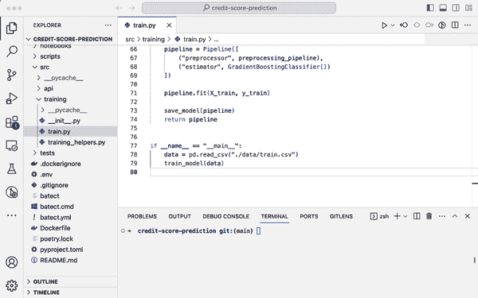
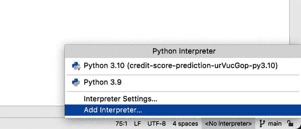
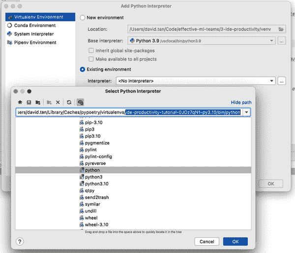
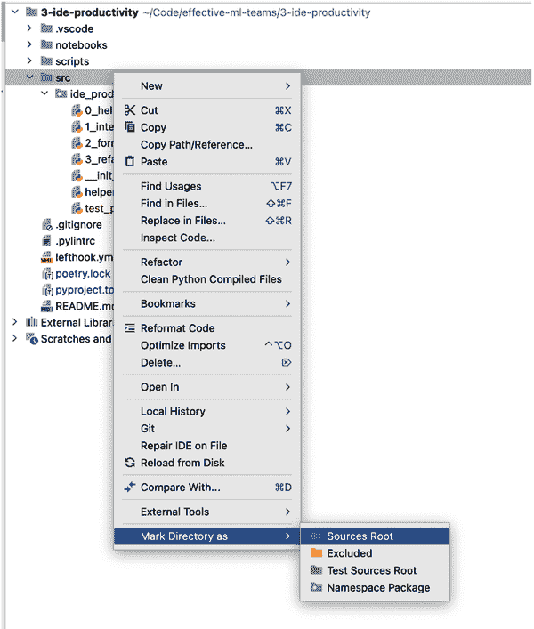
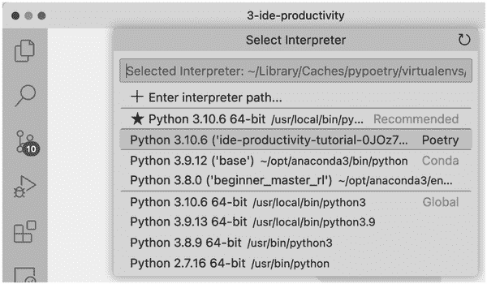
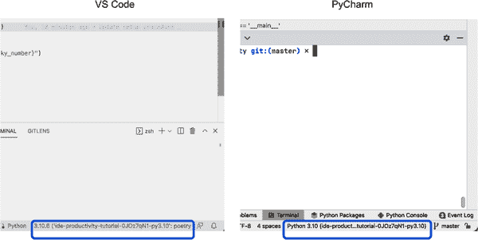
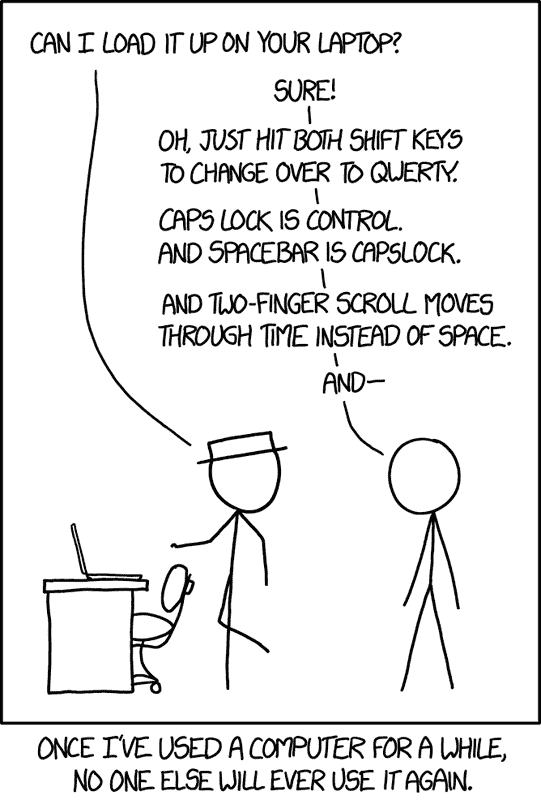

# 第七章：用简单技巧加速您的代码编辑器

> 生活中没有捷径，但编码中有许多捷径。
> 
> [丘俊涛，开发者和作者](https://oreil.ly/ZABr2)

大多数我们认识的 ML 从业者喜欢编码。代码是我们头脑中想法的传输工具（“这种特征工程技术能提高模型的性能吗？”），变成现实。事实上，许多人抱怨有太多干扰，太多会议，没有足够的时间写代码。然而，当我们有时间编码时，常见的是我们会浪费宝贵的时间在像手动测试（第四章的重点）和（第五章的焦点），阅读复杂的代码（下一章的重点），以及无效的编码实践（本章的重点）等单调乏味的任务上。

在本章中，我们将详细介绍您和您的团队如何花更少的时间陷入无效编码实践的困境甚至迷失自我。我们将展示您的集成开发环境（IDE）如何帮助您更有效地阅读和编写代码。IDE 是一个旨在帮助开发人员、数据科学家和工程师编写、运行、测试和调试代码的应用程序。它提供开发工具，如源代码编辑器、集成终端、版本控制支持、虚拟环境管理和代码建议。它还可以帮助您重构，使代码库设计更好、更可读（参见 图 7-1）。

为此，本章将涵盖：

+   如何在几步内配置您的 IDE

+   有用的 IDE 功能，如代码补全，建议修复，轻松导航，自动格式化和重构

+   IDE 功能的键盘快捷键，帮助您以思维速度编码



###### 图 7-1\. 一个示例 IDE

如果代码就像海浪一样，本章介绍的技术将帮助您驾驭这些波浪，达到您想要去的地方，而不会在逆流中迷失。配合下一章介绍的重构技术，您将能够更好地理解、驯服和改进复杂的代码库，使其成为有益而不是阻碍团队的东西。

随着生成式人工智能的出现和 AI 辅助编码的兴起，诸如[GitHub Copilot](https://oreil.ly/NZnKK)和[Blackbox AI](https://oreil.ly/zMpkt)等工具正成为开发者工具包中越来越重要的一部分。然而，出于两个原因，我们决定在本章的练习中不包括这类工具。首先，已经有[大量教程](https://oreil.ly/MOq4r)展示了如何在 Python 项目中使用 GitHub Copilot 等工具。其次，在撰写本文时，GitHub Copilot 的创建者正面临[集体诉讼](https://oreil.ly/XmRcE)，因其在开源代码上训练其代码生成模型，其中许多代码受到[开源许可证](https://oreil.ly/QUnsy)（如 MIT 许可证、Apache 许可证等）的约束，这些许可证要求对作者的姓名和版权进行归属。由于这场诉讼的结果将影响组织是否决定使用 GitHub Copilot 等工具，我们不希望将我们的书籍与此因素捆绑在一起。此外，我们的经验告诉我们，即使没有 AI 辅助编码，我们仍然可以从我们将在本章中涵盖的基本 IDE 技术中获得大量收益。

有了这个基础，让我们来探讨我们的第一个部分——了解我们的 IDE 的好处和令人惊讶的简单性。

# 了解我们的 IDE 的好处（以及惊人的简单性）

在本节中，我们将探讨机器学习从业者在编码时如果不正确使用他们的 IDE 经常遇到的三个陷阱。我们还将突出显示你的 IDE 可以帮助你更好地推理和编码的四种方式。最后，我们将探讨一些机器学习从业者在这一实践中遇到的障碍和担忧，并提出支持充分利用我们的 IDE 的潜力来增强生产力和改进在构建机器学习解决方案时的流程的理由。

## 为什么我们要关注 IDE 呢？

我们经常看到机器学习从业者使用像 Visual Studio Code（VS Code）或 PyCharm 这样强大的 IDE，但他们却把它当成记事本，仅用于手动输入代码，而不利用 IDE 提供的建议修复、辅助重构、自动导入和自动格式化等功能。因此，他们的工作流常常受到以下因素的阻碍：

过多的认知负荷

当他们看到屏幕上出现许多红色和琥珀色的波浪线（或者更糟的是，根本没有波浪线，即使存在错误！），这是因为代码编辑器未配置正确的虚拟环境。IDE 试图告诉他们在代码的确切行上存在错误（例如缺少导入），但他们选择忽略它。因此，他们通常在运行时才能检测到错误，而不是在编码过程中检测到并在意外引入错误时检测到错误。

这增加了他们的认知负荷，因为现在他们需要花时间——在警告之间——准确地弄清楚事情出了什么问题以及为什么会这样。此外，延迟检测和解决错误会导致后续的缺陷和重做。

繁琐且易错的重构

当他们想要进行重构时，甚至是像重新命名变量这样简单的操作，他们都会手动查找和替换变量引用，通常跨多个文件，有时会因为漏掉了某个引用而意外引入错误。

上下文切换

他们经常在他们的代码编辑器和 Web 浏览器之间切换，小心翼翼地在无数打开的标签间跳转，查找文档和引用。例如，他们可能这样做来查找如何导入特定函数（例如，`cross_val_score`的语法是什么？）或者了解一个函数的参数（例如，`cross_val_score()`接受哪些参数？）。频繁切换屏幕使他们暴露于其他干扰，进一步增加他们的认知负荷。

所有这些干扰都会占用宝贵的认知资源和时间，并减慢我们解决问题的速度。幸运的是，我们可以利用以下 IDE 功能来帮助我们有效编码：

代码建议

IDE 可以提供上下文感知的代码完成建议、实时错误高亮显示以及即时代码修复。

重构能力

IDE 可以帮助您执行重构的想法，比如重命名变量、提取变量、提取方法等，而无需让您深入到跨多个文件操作字符的细节中，并且潜在地在操作过程中犯错。

代码导航

你可以直接“跳转”到你想要的任何文件、类、函数或变量，而无需一次次点击遍历文件。你还可以在调用堆栈的各个层级间放大或缩小视图，而不会被无数打开的标签所困扰。

键盘快捷键

通过键盘快捷键，IDE 成为你思维的延伸，帮助你以思考的速度执行想法，而无需多次鼠标点击和不断滚动视觉干扰。

最棒的部分是：这些都是可以学习和掌握的技能。我们通过交付工作、配对编程和阅读文档逐步学会了这些强大的 IDE 功能。这是一个低成本的投资，只需花费几个小时，回报是减少认知负荷、提高效率和满意度。

此外，这些技能在各种开发工具中都是可移植的，例如本地或远程 Jupyter Notebook 服务器，这在[VS Code](https://oreil.ly/5Gsi3)和[PyCharm](https://oreil.ly/YtjB3)中都是可能的。只要计算运行时的 IDE 集成存在，您可以无论是在本地计算机、远程计算实例、GitHub codespaces（[VS Code](https://oreil.ly/8NXzC)和[PyCharm](https://oreil.ly/BQw7z)）还是管理的笔记本服务（例如[AWS SageMaker Studio](https://oreil.ly/0kXHk)），都可以应用本章的实践。

###### 注意

有两件事需要注意。首先，不是所有的云供应商都提供将其服务与这些 IDE 集成的方式。例如，你可以[连接 PyCharm 到 Google Compute Engine 实例](https://oreil.ly/zx3I8)，但不能连接到 Google Colab 笔记本（至少在撰写本文时是这样的）。其次，PyCharm 的 Jupyter Notebook 集成将需要专业版许可证（我们将在本章末进一步讨论这个主题）。

## 如果 IDE 这么重要，为什么我还没学到它？

“了解你的 IDE”是软件工程领域的一个原则，可以帮助 ML 从业者更有效地工作。实际上，它非常有用，甚至被列入[*97 件每个程序员都应该知道的事情*](https://oreil.ly/ObcVZ)。然而，许多 ML 从业者因为三个原因而忽视这一实践：

+   他们觉得这不重要（“我想做机器学习和解决难题，而不是深入研究 IDE 配置和快捷方式的细节”）。

+   所有这些 IDE 功能看起来可能令人不知所措和害怕，这是可以理解的，因为这个主题通常不在学术课程中教授。

+   有些人甚至不知道 IDE 可以配置成一个强大和有用的编码助手！

在接下来的几节中，我们将演示了解你的 IDE 将*加快你的速度，而不是减慢你的速度*。想象一下，你正朝着一个距离为 20 公里的目的地前进，你得到了一个工具：一辆自行车，但它还没有正确设置。你会因为组装自行车是浪费时间而选择步行，还是会花几个小时组装自行车，并在骑行时享受速度和风吹过你头发的感觉？

我们还将演示它比看起来要简单。一个新的地形和情境可能令人生畏，但经验丰富的指导可以帮助减轻这种感觉。我们将分享我们在项目中使用的日常 IDE 实践——这些实践*你*可以应用到你的 IDE 上，以更少的努力实现更多。

在过去的几年里，我们与许多数据科学家和 ML 工程师合作。我们经常收到的反馈之一是，这些 IDE 生产力实践帮助他们减少认知负荷，使他们能够专注于解决他们想要解决的问题。

有了这个，让我们开始吧！

# 计划：分两个阶段提高生产力

在本节中，我们将详细介绍如何在两个阶段内充分利用你的 IDE 来处理任何 Python 项目：

1.  通过以下方式配置给定项目的 IDE：（i）创建虚拟环境，和（ii）告诉 IDE 在虚拟环境中找到 Python 解释器的位置。

1.  使用 IDE 和快捷键（即，效益！）。因为你已告诉你的 IDE 使用你创建的虚拟环境，它现在可以提供建议并执行上下文感知任务（例如，重构）。

无论您使用哪种依赖管理工具（例如 Poetry、conda、venv），此模式都将适用。只要为项目创建虚拟环境并告知 IDE 虚拟环境的位置，您就可以从这些 IDE 功能中受益。

我们建议您在使用[为本章准备的练习](https://oreil.ly/z1XxU)时跟着编码。正如彼得·M·森格曾经说过：“说‘我刚读了一本关于骑自行车的好书——我现在学会了’是毫无意义的。” 实践知识比概念知识更有趣，它将帮助您立即将所学应用于项目中。

###### 注意

此练习已在 Python 3.10 和 3.11 上测试。如果您使用的是更高版本的 Python（例如 Python 3.12），并且在运行`poetry install`时遇到问题，请改用 Python 3.10 或 3.11。

要安装和使用特定版本的 Python，您可以参考[pyenv 文档](https://oreil.ly/jtNdz)。

请注意，对于 Poetry，您需要告诉 Poetry 使用您选择的 pyenv 的活动版本来运行：通过运行`poetry config virtualenvs.prefer-active-python true`。更多信息，请参见[Poetry 的问题](https://oreil.ly/3ac00)。

## 阶段 1：配置您的 IDE

在本节中，我们将描述如何为此项目配置 IDE 与虚拟环境。

### 安装 IDE 和基本导航快捷键

如果您还没有这样做，您可以下载[PyCharm](https://oreil.ly/wFMf_)（专业版或社区版¹）或[VS Code](https://oreil.ly/n89Xw)，并按照安装说明操作。如果您对任何安装提示感到疑惑，使用默认选项将是一个良好的起点。如果您首次安装，可能需要重新启动计算机。

###### 注意

以下是本章节中使用的一些重要符号约定。

*Mac：*

+   ⇧ Shift

+   ⌘ Command

+   ⌥ Option

+   Ctrl

*Windows/Linux：*

+   ⇧ Shift

+   Ctrl

+   Alt

如果一个命令在所有操作系统（OS）上具有相同的快捷键，则我们将在表格中省略 OS。否则，我们将指明 OS。

安装完成后，请打开您选择的 IDE。对于 Windows 用户，请以管理员身份运行 IDE（右键单击 IDE 图标，以管理员身份运行），因为您需要管理员权限来在下一步中安装依赖项。

在 IDE 中，可以使用我们在表格 7-1 中经常使用的 IDE 导航快捷键进行热身。

表格 7-1\. 基本导航快捷键

| 任务 | PyCharm | VS Code |
| --- | --- | --- |
| 快速查找任何文件、动作、命令、类、符号、设置等 | *到处搜索* ⇧⇧ | *打开命令面板* F1 |

| 切换打开/关闭终端 | *查看：终端* Mac: ⌥ F12

Windows/Linux: Alt F12 | *查看：切换终端* Ctrl ` |

| 切换打开/关闭文件资源管理器侧边栏 | *查看：项目* Mac: ⌘ 1

Windows/Linux: Alt 1 | *查看：切换主侧边栏可见性* Mac: ⌘ B

Windows/Linux：Ctrl B |

### 克隆代码仓库

要跟进，请使用以下命令克隆本章的[代码仓库](https://oreil.ly/hcioz)：

```
git clone https://github.com/davified/ide-productivity
cd ide-productivity
```

### 创建一个虚拟环境

在您选择的 IDE 中打开代码仓库，可以是 PyCharm 或 VS Code。在提示设置 Poetry 环境时，您可以忽略或取消，因为我们将在下一步中使用我们的 go 脚本安装它。

接下来，Mac 或 Linux 上的读者可以打开 IDE 的终端（在表 7-1 中有快捷方式），并运行以下命令来为该项目创建虚拟环境。此步骤将在主机上安装虚拟环境，即在 Docker 容器外部（我们将在本章结尾前的侧栏中解释为什么这样做）：

```
# Mac
./scripts/go/go-mac.sh

# Linux
./scripts/go/go-linux-ubuntu.sh

```

Windows 用户应按照以下步骤操作：

1.  如果尚未安装，请下载并安装[Python3](https://oreil.ly/U9ML-)。在安装过程中，当提示时，请选择将 Python 添加到 PATH。

1.  在 Windows 资源管理器/搜索中，转到“管理应用程序执行别名”，并关闭 Python 的应用程序安装程序。这将解决在路径中找不到`python`可执行文件的问题。

1.  在 PowerShell 或命令提示符终端中运行以下 go 脚本：

    ```
    .\scripts\go\go-windows.bat
    ```

    如果出现 HTTPSConnectionPool `read timed out`错误，请多运行几次该命令，直到`poetry install`成功为止。

###### 注意

对于 Windows 用户，此练习已在 Windows 10 上进行了测试。如果在 Windows Powershell 或命令提示符上运行命令时遇到任何问题，请安装 Windows 子系统 Linux（WSL）（参见[安装步骤](https://oreil.ly/wHrmJ)），并使用 Linux 的 go 脚本来跟进本章内容。

如果您是第一次运行，这将需要几分钟时间完成。当 go 脚本成功完成时，它将打印 Python 解释器的路径，我们将在下一步中使用它。

### 配置虚拟环境：PyCharm

PyCharm 关于[如何配置虚拟环境](https://oreil.ly/M67G9)的官方文档简短且易于理解：

1.  在屏幕右下角，点击[Python Interpreter 选项卡](https://oreil.ly/fyYpR)，然后选择添加解释器（参见图 7-2）。

1.  在“添加 Python 解释器”弹出对话框的左侧窗格中，选择 Virtualenv 环境，并选择“已有环境”，因为在运行 go 脚本时已创建了虚拟环境。

1.  从列表中选择所需的解释器。如果所需的解释器不在列表中，请单击省略号(...)，并粘贴 go 脚本末尾打印的路径（参见图 7-3）。您也可以通过运行`echo "$(poetry env info -p)/bin/python"`获取此解释器路径。

1.  点击 OK 以完成设置。



###### 图 7-2\. 在 PyCharm 右下角，点击解释器选项卡，选择 Python 解释器。



###### 图 7-3\. 如何配置 PyCharm 使用此项目的虚拟环境

对于 PyCharm 用户，还有一个最后的步骤，将我们的 *./src* 目录标记为源代码根目录，这样我们可以在自己的源代码上使用所有 IDE 功能（例如自动导入、获取参数信息）（见 图 7-4）。为此，请右键单击 src 目录，然后单击“标记为目录”，选择“源代码根目录”（我们不建议这样做，但如果您想深入了解为什么 PyCharm 不支持可编辑包，您可以查看 [此开放问题](https://oreil.ly/HuaEo)）。



###### 图 7-4\. 在 PyCharm 中将 ./src 目录标记为源代码根目录的步骤

### 配置虚拟环境：VS Code

如果尚未安装，请安装官方的 VS Code Python 扩展 ([ms-python.python](https://oreil.ly/sIyf2))：

1.  打开命令面板（F1）。

1.  搜索“安装扩展”。

1.  在左侧窗格中搜索“ms-python.python”，然后安装它。

VS Code 的官方文档关于[如何配置虚拟环境](https://oreil.ly/ens06)也很简明扼要，易于理解：

1.  选择并激活虚拟环境。打开命令面板（F1），输入“Python: Select Interpreter”。

1.  *Python: Select Interpreter* 命令显示可用的 Python 环境列表。您可以选择此项目的那个 (`ide-productivity-tutorial-xxx`)。如果您找不到该选项，还可以复制并粘贴 go 脚本末尾打印的完整路径（见 图 7-5）。



###### 图 7-5\. 如何配置 VS Code 使用此项目的虚拟环境

完成上述步骤后，编辑器将了解 Python 虚拟环境及您项目中安装的所有依赖项，并可成为您的助手。在项目中打开任何 Python 文件，您应该能在屏幕右下角看到您的虚拟环境（见 图 7-6）。根据您阅读本书的时间和使用的 IDE 版本，前述说明可能略有不同。如果遇到困难，请随时查阅官方文档——前面已提及它始终是一个值得信赖的朋友，提供最新的信息。



###### 图 7-6\. IDE 右下角将指示配置的虚拟环境

### 测试我们是否正确配置了一切

作为冒烟测试，检查我们是否正确配置了 Python 解释器，让我们进行第一个热身练习：

1.  转到 *src/ide_productivity/0_hello_ide.py*。注意引用`np (numpy)`下面的波浪警告线？将鼠标悬停在上面，IDE 将告诉我们问题所在：缺少导入！

1.  将光标放在 `np` 上，然后按下自动修复快捷键来解决此问题。

    对于 PyCharm：

    +   Mac: ⌥ Enter

    +   Windows/Linux: Alt Enter

    对于 VS Code：

    +   Mac：⌘ .

    +   Windows/Linux：Ctrl .

1.  你会看到建议通过导入 numpy 来修复这个问题。如果没有看到建议，请稍等片刻再试一次（虚拟环境是一个大目录！）。按 Enter 键接受建议，你会看到问题已经解决。谢谢 IDE！

1.  最后，您可以通过在项目的虚拟环境中运行脚本来测试问题是否已解决：

    ```
    # activate virtual environment
    poetry shell

    # in the container, run the script:
    python src/ide_productivity/0_hello_ide.py
    ```

就是这样！现在 IDE 可以帮助您完成许多任务，我们将在下一节中探讨这些任务。

## 第二阶段：明星亮相——键盘快捷键

这是本章的精华部分。您花了几分钟时间进行一些相当乏味的工作，以正确配置您的 IDE，现在是时候获得投资回报了。

在本节的练习中，我们鼓励您阅读代码示例，尝试每个快捷键，在终端中运行代码（*python src/ide_productivity/name_of_file.py*），并验证您是否已完成练习。随后，您可以在自己的项目中应用这些技能。祝您玩得开心！

### 编码

看看 IDE 如何帮助您完成代码建议、内联文档、建议修复和 linting 等任务。在本节的 *src/ide_productivity/1_intellisense.py* 中跟着做吧！

#### 代码完成建议

PyCharm 称之为 [代码完成](https://oreil.ly/Uaam0)，而 VS Code 称之为 [IntelliSense](https://oreil.ly/0Oc2g)。它们都指的是 IDE 提供的能力，可以提供代码建议（例如可以调用的方法，可以传递的参数），这些建议可以从当前插入符位置到达（参见 表 7-2）。

###### 注意

记住，如果 PyCharm 和 VS Code 的快捷方式相同，我们只会提及每个快捷方式一次。

表 7-2\. 代码完成快捷键

| 任务 | PyCharm | VS Code |
| --- | --- | --- |
| 代码完成 / IntelliSense | Ctrl Space |

在 练习 7-1 中试一下。

##### 示例 7-1\. 计算乘客的平均年龄

任务：在系列后面加上一个点（.），然后您可以浏览可用于计算系列均值的系列方法列表。如果您错过了建议，您可以使用快捷键（Ctrl Space）再次触发建议。

```
`mean_age` `=` `passengers``[``"``age``"``]`
print(mean_age)
```

#### 内联文档 / 参数信息

当我们编码时，我们经常会想知道像这样的函数接受什么参数或关键字参数（例如 `df.astype()`）。表 7-3 中的快捷键帮助您在 IDE 中获得这些问题的答案，这样您就无需在窗口之间切换并迷失在打开的浏览器选项卡中。

表 7-3\. 内联文档 / 参数信息

| 任务 | PyCharm | VS Code |
| --- | --- | --- |

| 加载函数的文档 | *快速文档* Mac：F1

Windows/Linux：Ctrl Q | *定义预览悬停* 将鼠标悬停在任何方法名称上。如果没有看到有用的建议，请添加类型提示（例如 `df: pd.DataFrame`）。 |

| 获取函数参数信息 | *参数信息* Mac：⌘ P

Windows/Linux：Ctrl P | *触发参数提示* Mac：⇧ ⌘ Space

Windows/Linux：⇧ Ctrl Space |

在 Exercise 7-2 中试一试。

##### Example 7-2\. 将年龄列转换为整数

任务 1：将光标放在函数`astype()`上，然后按快捷键快速查看文档。你能浏览并查看如何转换数据类型的文档和示例吗？

任务 2：将光标放在`astype()`的括号上，然后按快捷键显示参数提示。你能识别这个函数接受的第一个参数吗？

```
`ages` `=` `passengers``[``"``age``"``]``.``astype``(``)`
print(ages)
```

#### 自动修复建议

自动修复警告和错误的最强大和有用的快捷键之一。

例如，也许我们正在遵循一个教程或文档，作者忘记包含函数的导入语句（例如，`cross_val_score()`）。IDE 将缺少的导入标记为错误，并且正如下一个练习将展示的那样，Table 7-4 中显示的快捷键可以帮助你轻松修复这类错误——以及其他错误。

Table 7-4\. 自动修复建议

| 任务 | PyCharm | VS Code |
| --- | --- | --- |

| 获取自动修复警告和错误建议 | *显示意图操作* Mac：⌥ Enter

Windows/Linux：Alt Enter | *快速修复* Mac：⌘ .

Windows/Linux：Ctrl . |

在 Exercise 7-3 中试一试。

##### Example 7-3\. 自动修复（缺少导入）

任务：悬停在波浪线下方以查看错误（未定义的变量），并使用自动修复快捷方式修复错误。

```
directory_name = path.dirname("/the/path/to/somewhere")
print(directory_name)
```

尽管这个自动修复功能很有用，但我们无需毫无思考地接受 IDE 的建议。在接受自动修复更新之前，始终要仔细检查，并且——与所有代码更改一样——运行自动化测试来验证代码更改。

#### Linting

Linters 帮助你检查错误，强制执行编码标准，识别问题的[代码异味](https://oreil.ly/Xu_Rh)，甚至提出重构建议。² Linters 分析你的代码而不实际运行它——这就是为什么 linting 也被称为“静态分析”——甚至可以在你编码时帮助你检测问题和错误。

当你和你的队友编写代码时，linter 可以告诉你，“这里有一个错误！你给这个函数传递了错误类型的参数”——帮助你在编码过程中捕捉错误。

为了让这个练习有意义，在启用 linting 之前*和*之后尝试这个任务（参见 Table 7-5），你会注意到 linter 如何帮助你检测`greet()`中的错误。

Table 7-5\. Linting

| 任务 | PyCharm | VS Code |
| --- | --- | --- |

| 启用 linting 您可以通过以下方式查看 linter 的警告：

+   点击 IDE 终端附近的“Problems”选项卡

+   在带有琥珀色/红色高亮的代码上悬停

| 无需操作。在配置虚拟环境时，PyCharm 会自动启用默认的 linter。 | 在撰写本文时，VS Code 建议通过 VS Code 扩展进行配置。要安装我们在 *.vscode/extensions.json* 中指定的 linter 扩展，请打开命令面板（F1），搜索“Extensions: Configure Recommended Extensions”。如果尚未安装建议的扩展（例如，[pylint](https://oreil.ly/SGToK)），请进行安装。 |
| --- | --- |
| 转到下一个错误 | F2 | F8 |

在 练习 7-4 中尝试一下。

##### 示例 7-4\. 代码检查

任务：取消对最后一行的注释。注意`greet()`的 linter 警告？您能通过悬停在警告行上并找到解决方法来阅读错误吗？

```
def greet(name: str):
	print(f"Howdy {name}!")

`# greet()`
```

#### 移动/复制行

在需要移动或复制行或代码块时，表 7-6 中的快捷键非常有用。

表 7-6\. 移动/复制行

| 任务 | PyCharm | VS Code |
| --- | --- | --- |
| 上/下移动选择 | Mac: ⇧ ⌥ 上/下 Windows/Linux: ⇧ Alt 上/下 | Mac: ⌥ 上/下 Windows/Linux: Alt 上/下 |
| 选择上/下重复项 | Mac: ⌘ D Windows/Linux: Ctrl D | Mac: ⇧ ⌥ 上/下 Windows/Linux: ⇧ Alt 上/下 |
| 选择下一个出现项 | Mac: Ctrl G Windows/Linux: Alt J | Mac: ⌘ D Windows/Linux: Ctrl D |

现在我们已经介绍了 IDE 如何帮助您编写代码的基础知识（例如，代码完成建议、内联文档、建议修复、代码检查），让我们来看看它如何帮助您进行格式化。

### 格式化

在本节中，我们将介绍帮助团队成员保持一致代码格式的 IDE 功能。您可以在 *src/ide_productivity/2_formatting.py* 中进行代码编写。

#### 重新格式化代码

您是否曾经不得不手动修复 10 行代码的格式（例如，缩进或额外/缺少空格）？这样做是不是很烦琐？那么 200 行呢？或者您是否曾因格式不一致而在拉取请求审查期间强忍着？

从一开始实施一致且自动化的格式化可以防止 git 提交或拉取请求因不相关的格式更改而混乱。以下是您可能遇到的一些真实场景：

+   一个团队成员，已经正确设置格式化程序，只想更改一行代码，结果却创建了一个包含数十行或数百行无关格式更改的拉取请求。

+   两位团队成员分别设置了不同的格式化程序（例如，black 和 autopep8），他们的提交一直在撤销彼此的工作。这导致频繁的合并冲突，需要时间来解决。

通过格式化配置和快捷键可以帮助您避免此类麻烦和分散注意力，使团队只需一个快捷键即可应用一致的格式化。

为了进一步验证团队是否使用相同的格式化程序和配置，[pre-commit hooks](https://oreil.ly/-sIkl) 和 CI pipeline 可以包含一个步骤——例如 `black --check .`——来检查代码是否正确格式化。在这个项目中，我们使用 [lefthook](https://oreil.ly/-sIkl) 设置了 git hooks。我们在 go 脚本中安装了 lefthook 和 git hooks，并在 *lefthook.yml* 中指定要运行的钩子。我们指定了两个 pre-commit 钩子：一个用于 linting，一个用于检查格式。你可以通过进行提交来看它们的实际效果——git hook 会检查所有本地文件（已提交和未提交的更改），以确保它们符合 linting 和格式化规则。

##### 示例 7-5. 修复代码格式和整理导入

任务 1：注意格式不一致（例如混合使用单引号和双引号、混合缩进）？使用快捷键格式化代码。注意代码风格现在是一致的（例如不再混合使用单引号和双引号）？

任务 2：注意顶部未使用的导入？使用快捷键整理导入，注意导入现在是整洁的。

###### 注意

对于 VS Code 用户，在选择了 linter 后，你会在 *.vscode/settings.json* 中看到类似这样的变化：

```
# ./.vscode/settings.json
{
  "python.linting.pylintEnabled": true,
  "python.linting.enabled": true,
   # ...
}
```

在这种设置中，承诺并检查是一个好习惯，以便团队共享相同的配置进行代码检查、格式化等操作。将共享配置提交更胜于使用[click-ops](https://oreil.ly/f9FDF)手动配置——这是通过点击 GUI 完成的运维任务，而非可复制的“如代码”自动化。这是因为虽然现在你的机器上可能运行正常，但复制这些工作给你的队友将变得乏味，并且很难达成团队一致。这样做有助于防止这些小差异在代码审查过程中成为重大干扰。

接下来，让我们看看 IDE 如何帮助我们养成每个团队在维护可读性和健康代码库中都需要的基本习惯：重构！

### 重构

在本节中，我们将介绍 IDE 功能，帮助你轻松进行重构。重构是以一种改善代码可读性、清晰度和可维护性的方式重组代码，而不改变其功能。需要注意的是，没有测试的重构是非常危险的，下一章中我们将描述如何使用特性测试来创建重构前的安全保护。

你可以在 *src/ide_productivity/3_refactoring.py* 中进行代码编写。

#### 重命名变量

“重命名变量”快捷键（见表 7-8）允许你轻松重命名命名不规范的变量（例如 `_new_df`）。IDE 将自动重命名所有对该变量的引用，甚至跨多个文件。在第 8 章中，我们将演示合理的变量命名所带来的累积效益。

当重构变得困难且容易出错时，结果是团队成员害怕重构，导致代码库中复杂性逐渐增加。幸运的是，这个快捷键使得重命名变量、函数、方法和类变得容易。在 PyCharm 中，您甚至可以重命名文件和模块，并且 PyCharm 将自动更新对模块名称的所有引用（例如，在导入语句中）。

表 7-8\. 重命名变量

| 任务 | PyCharm | VS Code |
| --- | --- | --- |
| 重命名变量 | ⇧ F6 | F2 |

在 练习 7-6 中试一试。

##### 示例 7-6\. 重命名变量

任务 1: 将 `df` 重命名为更有意义的东西（例如 `passengers`）。

任务 2: 将 `do_something()` 重命名为其他名称（例如 `greet()`）。注意看所有对该方法的引用都已重命名（见 `src/helpers.py`）？

#### 提取变量/方法/函数

这些快捷键（参见 表 7-9）帮助您轻松执行常见的重构技术，使您的代码更易读和可维护。

[“提取方法”](https://oreil.ly/vNCGG) 听起来像一个复杂的短语，但实际上是一个简单的实践，将代码片段（可以是一行或一块）提取到一个具有描述方法目的合理名称的函数或方法中。它可以用来将复杂的实现细节（10 行长的复杂代码）隐藏到一个可读的单一方法名称中（例如 `train_model()`）。

表 7-9\. 提取变量/方法/函数

| 任务 | PyCharm | VS Code |
| --- | --- | --- |
| 提取变量 | Mac：⌘ ⌥ V Windows/Linux：Ctrl Alt V | Mac：⌘ . Windows/Linux：Ctrl . |
| 提取方法/函数 | Mac：⌘ ⌥ M Windows/Linux：Ctrl Alt M | 与上面相同 |
| 内联变量 | Mac：⌘ ⌥ N Windows/Linux：Ctrl Alt N | （在撰写本文时不支持） |

在 练习 7-7 中试一试。

##### 示例 7-7\. 提取方法

任务：在本练习中选择下面的三行代码，按提取方法的快捷键，并给函数起个名字（例如 `add_prettified_ticket_column`）。

```
`prettified_name` `=` `"``Passenger:` `"` `+` `df``[``"``name``"``]`
`prettified_seat_number` `=` `"``Seat Number:` `"` `+` `df``[``"``seat_number``"``]`
`df``[``"``prettified_ticket``"``]` `=` `prettified_name` `+` `"``,` `"` `+` `prettified_seat_number`

print(df)
```

现在我们已经看到 IDE 如何简化重构，让我们看看它如何帮助我们导航和理解大型代码库。

### 在不迷失的情况下导航代码

在本节中，我们将介绍一些可以帮助您有效导航代码的快捷键，避免在 IDE 中打开太多标签或在无数行代码中迷失。

#### 通过名称打开文件、类、方法、函数

我们经常看到机器学习从业者在网络浏览器中浏览代码（例如 GitHub 或 GitLab）。当你只是阅读少量代码时，这种方法可行，但当你需要在函数之间导航时，这会对认知能力造成负担。表 7-10 中的 IDE 快捷键可以帮助您在不同抽象层之间导航，查看有价值的 git 信息（谁提交了代码更改、何时以及为什么），并获取您想要的信息，而无需打开许多标签或打断您的工作流程。

表 7-10\. 按名称导航

| 任务 | PyCharm | VS Code |
| --- | --- | --- |
| 按名称打开文件 | Mac：⌘ ⇧ O Windows/Linux：Ctrl ⇧ O | Mac：⌘ P Windows/Linux：Ctrl P |
| 转到符号（例如变量、函数、方法、类） | Mac：⌘ ⌥ O Windows/Linux：Ctrl Alt O | Mac：⌘ ⇧ O Windows/Linux：Ctrl ⇧ O |

#### 导航代码流程

当在大型代码库中工作时，我们经常需要浏览大量文本，很容易迷失或感到不知所措。有时，在跳转多个函数后，我们最终进入一个打开的文件，并且忘记了最初想要做什么。

表 7-11 中的快捷键将帮助您轻松缩放抽象层，减少认知负荷，并使您能够专注于手头的任务。

表 7-11\. 代码导航

| 任务 | PyCharm | VS Code |
| --- | --- | --- |
| --- | --- | --- |
| 转到函数定义 | Mac：⌘ B Windows/Linux：Ctrl B | F12 |
| 查看函数定义 | Mac：⌥ Space Windows/Linux：Ctrl Shift I | Mac：⌥ F12 Windows/Linux：Alt F12 |
| 在你访问过的文件和代码序列中向后/向前导航 | Mac：⌘ [ 或 ] Windows/Linux：Ctrl Alt ← 或 → | Mac：Ctrl - 或 Ctrl Shift - Windows/Linux：Alt ← 或 → |
| 查找用法 | Mac：⌥ F7 Windows/Linux：Alt F7 | ⇧ F12 |
| 折叠范围内代码区域（请查看侧边栏中的好处） | Mac：⌘ - Windows/Linux：Ctrl - | Mac：⌘ ⌥ [ Windows/Linux：Ctrl ⇧ [ |
| 展开范围内代码区域（请查看下面的侧边栏） | Mac：⌘ + Windows/Linux：Ctrl + | Mac：⌘ ⌥ ] Windows/Linux：Ctrl ⇧ ] |
| 折叠文件中所有区域的代码 | Mac：⌘ ⇧ - Windows/Linux：Ctrl ⇧ - | Mac：⌘ K ⌘ 0 Windows/Linux：Ctrl K Ctrl 0 |
| 展开文件中所有区域的代码 | Mac：⌘ ⇧ + Windows/Linux：Ctrl ⇧ + | Mac：⌘ K ⌘ J Windows/Linux：Ctrl K Ctrl J |
| 搜索文件 | Mac：⌘ ⇧ F Windows/Linux：Ctrl ⇧ F | Mac：⌘ ⇧ F Windows/Linux：Ctrl ⇧ F |
| 导航选项卡 | Mac：⇧ ⌘ ] 或 [ Windows/Linux：Alt ← 或 → | Mac：Ctrl [number] Windows/Linux：Ctrl Tab |

尝试每个快捷键，注意它如何帮助你减少视觉混乱和认知负荷。

#### 屏幕房地产管理

表 7-12 中的快捷键可以帮助你减少屏幕切换，从而清理头脑空间，集中注意力。减少不必要的视觉干扰和认知负荷为解决手头的问题提供更多清晰度。

例如，将屏幕左右分割对于将测试和代码并排放置非常有用，并且可以帮助您避免过载工作记忆（“我刚才在看什么？”）。

表 7-12\. 屏幕房地产管理

| 任务 | PyCharm | VS Code |
| --- | --- | --- |
| 关闭所有其他选项卡 | （没有默认快捷键，但您可以[配置自定义快捷键](https://oreil.ly/12IQL)） | Mac: ⌘ ⌥ T Windows/Linux: Ctrl Alt T |
| 分屏 | 到处搜索（⇧⇧）并搜索“Split Right” | Mac: ⌘ \ Windows/Linux: Ctrl \ |

至此，我们已经介绍了本章的 IDE 快捷方式。下次当您需要浏览大量代码以执行某些操作时，请尝试使用这些导航快捷方式，以便在不迷失在细节中的情况下到达目的地。

## 您做到了！

到了本章的这一点，您已经学会了几种新技术，这些技术将帮助您和您的团队减少认知负荷，并在编码时提高工作流。在本章的剩余部分中，我们将介绍一些我们用来创建团队对齐并使每个人在项目中达到一致基准水平的指南。我们还将涉及一些其他有用的 IDE 功能，您可以进一步了解。

### 为团队设置代码仓库的指南

这里有一些指南，可以帮助您启动一个新项目——或者改进现有项目——并结合我们讨论过的良好习惯：

以代码配置

所有团队成员都应能够加载项目级配置，并确保 IDE 遵循这些规则。尽量避免使用图形用户界面（GUI）和点击操作来安装和配置团队需要的任何内容。如果有任何您想要做的事情（例如为项目设置代码检查），请确保这是以代码的形式完成的，代码已经提交，并且您的团队成员能够加载配置并运行与您完全相同的任务。

例如，在本章的 *.vscode/settings.json* 中，我们为项目配置了以下内容：

+   默认的代码检查器

+   默认格式化程序

+   自动保存

+   切换自动换行（这样您就不必左右滚动）

当然，个人偏好有很大的空间。把这些看作是将每个人都提升到基准卫生水平，而不是将每个人压缩到最低公共分母。顺便说一句，在个人喜好的话题上，图 7-9 展示了一部关于过度定制的有趣漫画。



###### 图 7-9\. “借用您的笔记本电脑”（来源：[xkcd](https://oreil.ly/TW4IR)，根据[CC BY-NC 2.5](https://oreil.ly/dw8XI)使用）

团队级别的一致性

无论你选择哪种工具，比如某个特定的代码检查或格式化库，都应该致力于在团队内部创建一致性和对齐性。在存在分歧的情况下，请进行对话并确定哪种工具最适合团队。否则，这种未解决的冲突将表现为你的代码中的混乱，并且会干扰团队的工作流程。

如前所述，你可以通过在代码库中提交你的配置，并使用[pre-commit hooks](https://oreil.ly/-sIkl)自动执行检查，来强制执行你们约定的实践，并在项目的 CI 管道上自动执行检查。

保持滚动条区域清洁

如果你仔细观察 IDE 中的滚动条，你可能会注意到一些琥珀色或红色的线条（PyCharm 称之为错误条纹，VS Code 称之为概览标尺）。当这些线条布满琥珀色和红色的警告时，你很容易忽视或错误地归因于 IDE 试图警告你的实际错误和问题。相反，当你编码时，你可以更清晰地思考并更快地发现问题。

你不必记住所有的快捷键

当你有疑问时，可以通过打开命令面板（VS Code：F1）或者全局搜索（PyCharm：Shift Shift），输入你要找的命令（例如，“重构”），找到快捷方式。如果存在相关快捷方式，它将显示在命令旁边。这些基本的导航快捷键列在表 7-1 中。

记住，互联网和 IDE 文档是你的朋友。互联网上有许多有用的教程和文档。例如，这里有一个[PyCharm IDE 快捷键教程](https://oreil.ly/KDJRb)和一个[VS Code IDE 快捷键教程](https://oreil.ly/5K1mK)。此外，这些官方参考资料也很有用：

+   VS Code 快捷键参考文档（[Documentation](https://oreil.ly/X1Tvi)，[Mac](https://oreil.ly/QEs2Z)，[Windows](https://oreil.ly/ofQp-)，[Linux](https://oreil.ly/SDxct)）

+   PyCharm 快捷键参考文档（[Documentation](https://oreil.ly/tbd_a)，[Mac](https://oreil.ly/RPbYd)，[Windows and Linux](https://oreil.ly/3pslk)）

### 附加工具和技术

近年来，PyCharm 和 VS Code 都推出了许多有用的功能。在本节中，我们将重点介绍其中的三个。这些是我们在工作中经常使用（并看到其他人使用）的工具。当然，还有其他工具和插件可以用于解决特定问题或在特定语言中使用，你可以在各自的 IDE 市场或开发者博客中轻松探索这些工具。

远程代码协作工具

[VS Code LiveShare](https://oreil.ly/V7lZw)和[PyCharm CodeWithMe](https://oreil.ly/JLQdH)都非常适合远程对编程。我们都使用过这两种工具，并对它们允许我们远程协作和对编程的方式感到满意。除了官方文档外，我们没有更多要说的！

使用 IDE 的调试器

IDE 的调试器是一个有用的工具，允许您暂停并逐步执行代码，并在每个步骤检查其状态。这有时比视觉上解析打印语句并一遍又一遍重新运行代码更快。学习如何使用它不会花费很多时间，在我们的经验中，这个投资是非常值得的。您可以参考[VS Code 的文档](https://oreil.ly/eli3P)和[PyCharm 的文档](https://oreil.ly/XHq9g)了解调试器。

GitHub Copilot

正如我们之前讨论的，GitHub Copilot 是一个 AI 助理，基于它训练过的所有开源代码，可以为您提供整行或整个函数的建议。它可以与[VS Code](https://oreil.ly/9rS8j)和[PyCharm](https://oreil.ly/N2lhV)一起使用。

# 结论

在团队中，当我们解决问题并取得进展时，我们感到最有成就感，而不是在[bikeshedding](https://oreil.ly/rkETt)上浪费时间和精力——即在讨论边缘技术问题时。

这就是悖论之所在——当我们忽视这些看似不重要的事物（例如代码审查时的代码检查、格式化、IDE 快捷键），事情就会阻碍我们读、写和审查代码的能力。我们经常看到团队在代码审查中浪费宝贵的精力，例如关于适当缩进的细微之处，而不是解决更大、更重要的解决方案设计考虑。

与此相反，了解我们行业的工具并学会如何有效利用它们将帮助您和您的团队在解决问题、设计解决方案和审查代码时保持流程。

作为一个挑战，看看您是否可以在个人或工作项目中完成以下任务：

+   您能够配置您的 IDE（PyCharm 或 VS Code）到一个项目的虚拟环境吗？

+   您能尝试一些有趣的事情（例如重命名变量，将一段代码重构为函数）吗？

掌握了这些技巧，现在让我们深入探讨一个令人兴奋的主题，它将帮助您编写更易读、易维护和易演变的代码：重构！

¹ 对于 PyCharm，您可以下载专业版（30 天免费试用）或社区版，两者均可在[“下载 PyCharm”页面](https://oreil.ly/wgbFd)找到。您可以参考[功能比较页面](https://oreil.ly/HytJm)了解专业版和社区版之间的区别。专业版在 ML 工作流程方面的主要优势是支持 Jupyter Notebooks 和 Docker 或 Windows WSL 的虚拟环境集成。我们建议使用 PyCharm 专业版，因为这将使您更容易配置一个在 Docker 容器内的虚拟环境（这适用于第 3 到 6 章）。尽管如此，我们不希望许可成本成为障碍，因此我们编写了这本书，可以与 PyCharm 的任何版本配合使用。

² 这个对 linter 的定义是从[pylint 官方文档](https://oreil.ly/oRPGL)改编的。

³ 根据我们的经验，通过团队能够有效地使用正确工具编写代码，节省的时间和精力远远超过组织为许可证支付的相对较小的成本。
