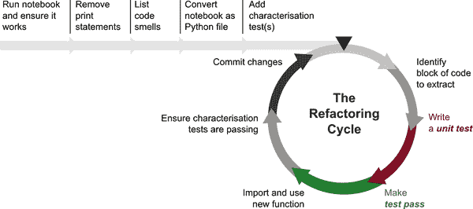
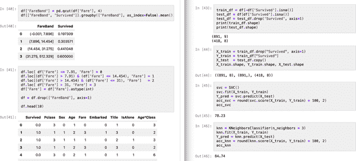
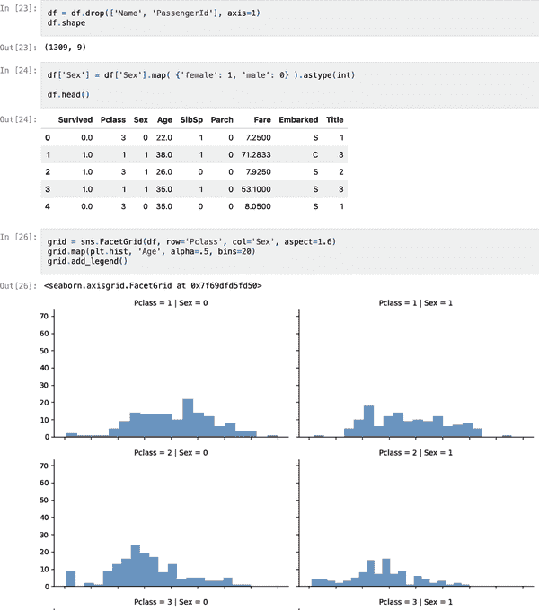
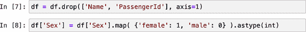
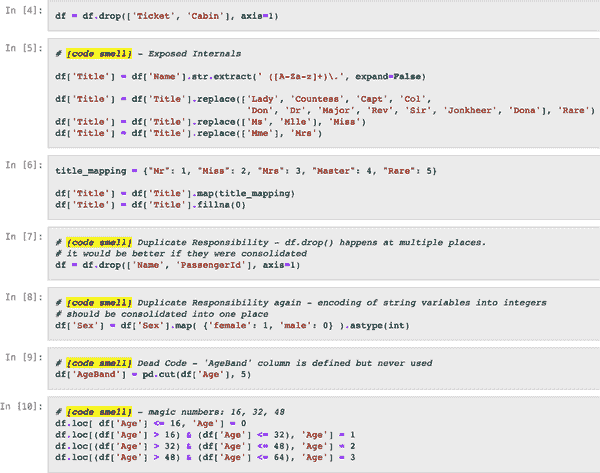
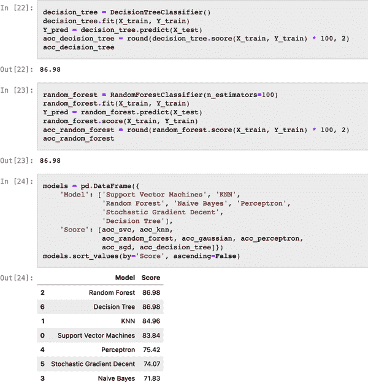
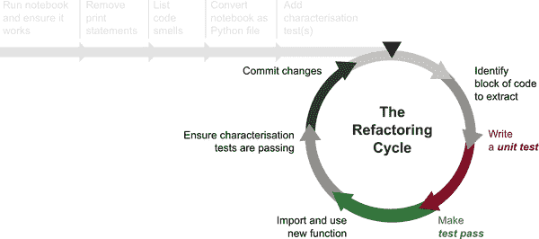
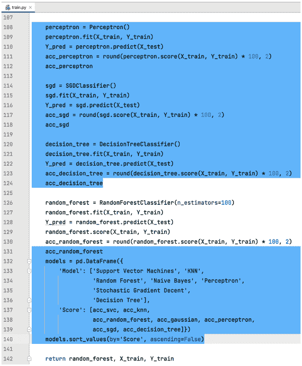
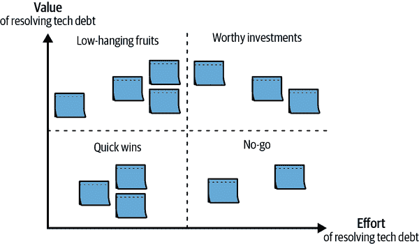

# 第八章：重构和技术债务管理

> 程序必须为人们而写，只是偶然为机器执行。
> 
> 哈罗德·阿贝尔森，《计算机程序的结构与解释》（麻省理工学院出版社）
> 
> 在没有重构的情况下，软件的内部设计——架构——往往会衰退。随着人们修改代码以实现短期目标，往往没有完全理解架构，代码就失去了结构[...]。代码结构的丧失具有累积效应。代码中的设计越难看到，我保存它的难度就越大，它的衰变速度就越快。定期的重构有助于保持代码的良好状态。
> 
> 马丁·福勒，《重构：改善现有代码的设计》（Addison-Wesley 专业版）

作为 ML 从业者，我们知道代码可能变得混乱，通常比我们预期的要快得多。通常，用于训练 ML 模型的代码包括半样板代码，这些代码在一个长长的笔记本或脚本中粘合在一起，大量地使用了副作用，例如打印语句、美化的数据框和数据可视化，并且通常没有任何自动化测试。

虽然这可能适用于旨在教授 ML 过程的笔记本，但在实际项目中，这是导致难以维护的混乱、认知负荷过重以及摩擦到停滞不前的一种方案。糟糕的编码习惯和缺乏设计使得代码难以理解，因此也难以进行改变。这使得功能开发和模型改进变得越来越困难、容易出错且缓慢。

幸运的是，还有更好的方法。在本章中，我们将分享一些技术，帮助您将一个问题多多、混乱且脆弱的代码库重构为一个可读性强、可测试、易于维护和可发展的解决方案。在“通过实践学习”的精神下，我们将以一个 ML 训练流水线为例进行本章，该流水线充满了代码异味，并以更好的解决方案结束。最后，我们将分享一些实践方法，帮助您和您的团队平衡有效的技术债务管理和产品交付。

本章的目标不是教你设计模式，以便你可以编写完全设计良好、没有任何问题的代码。这在物理上和经验上是不可能的。相反，目标是为您和您的团队提供增量和定期改进解决方案的技能，以便您可以控制技术债务并以可持续的速度执行想法。

我们将从讨论技术债务的成本以及团队如何通过测试、设计和重构技术逐步和定期地偿还技术债务开始。

# 技术债务：我们齿轮中的沙子

如果您是一名 ML 从业者已有一段时间，您无疑会遇到一个看起来一开始很简单的编码任务，但因为某些原因最终花费了更多时间，例如：

+   代码质量问题（例如，命名不当的变量，长函数跨越 100 行或更多），使得代码难以理解

+   设计不良（例如，一个函数混淆了多个职责），这使得实现代码更加困难

+   意外错误——通常是在几个步骤之后才被发现，迫使你中断正在进行的工作来调试和解决问题

这三个原因（代码质量问题、设计不良和缺乏自动化测试）都是 *技术债务* 的例子。 与金融债务类似，如果我们不定期偿还技术债务，我们最终将浪费宝贵资源支付利息。 例如，我们可能认为某一天有四个小时用于完成一个功能，但我们可能会浪费三个小时陷入理解混乱代码或调试意外错误中。 这就是你的时间中有 75% 浪费在支付利息。

正如图 8-1 中的漫画所示，不受限制的技术债务可能会使看似简单的功能变得更难实现。 高技术债务的代码库往往会吸引更多技术债务——因为代码库的状态和结构创造了一条最易路径，使得快速补丁比“正确做事”更容易。 这进一步加深了下次需要在同一代码库区域实现新功能时的恶性循环。


###### 图 8-1\. 技术债务（来源：[Vincent Deniél](https://oreil.ly/i3gFH)，在 [CC BY-NC 4.0](https://oreil.ly/-jzOM) 下使用）

在论文 [“技术债务削弱软件开发者生产力”](https://oreil.ly/rWYlk) 中，研究人员发现，开发者（在他们的研究中）因技术债务平均浪费了工作时间的 23%。 在另一篇论文中， [“技术债务对软件开发者士气的影响”](https://oreil.ly/0STM1) ，研究人员发现，技术债务对开发者的士气、信心和进展速度产生了负面影响。 当在存在大量技术债务的区域工作时，开发者会感到沮丧或恐惧。

进一步延伸金融债务的类比，可能存在某些条件，可以合理地承担一些债务，只要我们 [审慎地](https://oreil.ly/jBdAl) 这样做。 在这个背景下，审慎行事——为未来着想——意味着我们制定并执行还债计划。 目标不是完全摆脱技术债务。 正如马丁·福勒所说，“代码中又脏又稳定的区域可以不管它们。 相比之下，高活跃度的区域需要对混乱采取 *零容忍的态度*，因为利息支付太高”¹（我们的强调； [混乱](https://oreil.ly/JQDN0) 指的是任何留下的、多余的、妨碍工作的东西）。

幸运的是，软件工程界有一种实践可以帮助我们保持技术债务在健康水平上：重构。在接下来的部分中，我们将分享关于重构（以及测试和良好设计）的实用指导原则和技术，这可以帮助您减少技术债务并保持实验和交付的步伐。

## 通过测试、设计和重构达到健康债务水平

在这一节中，我们将分享重构时的有用指导原则，但在你甚至开始重构之前，你必须理解两件事。首先，没有自动化测试的重构是非常危险的，我们不建议这样做。在[实践操作](https://oreil.ly/-vHKb)中，我们将演示如何定义特征测试来首先创建一个安全带，然后再进行重构。

其次，软件设计很重要。良好的设计节省时间并减少工作量。当我们走进一个分类良好且没有杂物的仓库或厨房时，我们知道这是真的。因为 ML 系统设计是复杂的，我们希望把这些复杂性装箱和良好分类，这样我们就不必一次性处理所有东西，这是令人不安甚至有时根本不可能的。而良好的设计帮助我们做到这一点。

尽管我们当然可以在低级别战术重构中不考虑设计（例如重命名一个命名不佳的变量），但我们需要一个*理想设计的高层图片*来创建一个*可读性和可维护性解决方案*。最后一句中有几个深奥的概念，让我们来详细分析一下：

高层图片

这指的是对我们代码库的组件和模块有一个具体的理解（物理可视化通常会有所帮助，甚至只需纸笔或虚拟便条）。每个模块中都包含哪些数据（对象属性）和行为（对象方法）？

我们如何设计我们的解决方案，使我们的组件（例如数据存储、数据处理管道、ML 模型训练管道、模型推断 API）能够协作以实现所需功能？有了清晰的图片，我们可以识别并最终避免架构异味（例如重复、紧耦合），这样我们的解决方案不会变成一团乱麻。

用于可视化软件架构的[C4 模型](https://oreil.ly/1KlSE)是在这方面获得清晰度的有用工具。

理想的设计

在现实世界中，你不需要给你的水壶接上热线来煮水（感谢电源插座）。同样地，通过使用正确的抽象——具有清晰接口的函数和类——来创建软件可以帮助我们设计可组合和可扩展的系统（侧边栏“软件设计构建模块” 将阐明我们所说的抽象和接口）。这有助于我们最小化这种“热线接入”的情况，这种方式在增加功能时很脆弱。

如果你想象一个代码库就像一个厨房，东西（例如勺子和叉子）是否被紧密地分组，还是有备用的酱包藏在餐具抽屉里？当你需要烤盘时，它是否容易找到，放在其他与烘焙相关的物品旁边？

把厨房的类比再进一步，虽然没有一种方法可以组织所有的厨房，但有统一的设计原则可以帮助我们创建合理和人体工程学的厨房和代码库（我们将在本章中分享一些有用的设计原则） 。相反，没有设计，混乱是必然的。

我们即将把一个混乱的虚拟“厨房”（代码库）整理成形，到这一步，你已经知道你需要两个基本的工具箱（测试和软件设计原则）。现在让我们看看第三个和最后一个技术工具箱（重构），然后我们就可以卷起袖子开始这场清理派对。

## 重构 101

在本节中，我们将涵盖指导我们微观决策的原则，当我们进行重构时。

在我们开始之前，让我们重新定义一下重构的定义。[重构](https://oreil.ly/UHb_t)是在不改变代码可观察行为的情况下对现有代码进行重组。马丁·福勒描述得很好：“重构的核心是通过应用小的保留行为的步骤，并通过串联这些保留行为的步骤来进行大的变更。每一个单独的重构要么非常小，要么是一系列小步骤的组合。因此，当我在进行重构时，我的代码不会长时间处于破碎状态，这意味着我可以随时停下来，即使我还没有完成。[...] 如果有人说他们在重构时代码断了几天，你可以非常肯定地说他们并没有在进行重构。”²

如果我们把我们的代码库或解决方案想象成一个实体的工作间，重构帮助我们整理、系统化和标准化我们的工作间，使其没有悬挂的垃圾，让我们能够有效地工作，而不是一直绊倒在东西上。

关于重构有很多演讲、书籍和文章（在本章中我们会引用一些非常棒的资源），我们从中总结出了这四条启发式原则，可以帮助指导你在重构时的决策：

两顶帽子

当重构（戴一顶帽子）时，不要添加功能（第二顶帽子），反之亦然。在编程过程中，你可能经常在[两个角色](https://oreil.ly/ytTc2)之间切换，但同时戴两顶帽子会导致过多的认知负荷和破碎的代码库。

侦察规则

离开代码库比找到它时要干净一点。如果你看到路上有点“垃圾”，如果不花太多时间，把它作为你的任务的一部分拾起来。

如果这是一个需要更多时间并且可能激增你任务范围的坑洼，让它在你团队的技术债务雷达上可见，这样团队就会记得回来修复它（关于技术债务雷达的更多信息将在最后一节中介绍）。在它被修复之前，这个坑洼将继续绊倒人们，甚至可能损坏车辆。

目标不是镀金的大道。目标是保持一个功能合理的代码库，让每个人在不必要的事故或耗时的绕道情况下编写代码。

使用 IDE 辅助重构

正如我们在上一章中讨论的那样，一个正确配置的代码编辑器是一个强大的工具，可以帮助你完成许多重构任务。想要重命名在你的代码库中被引用了 20 或 100 次的变量或方法？想要将 20 行代码提取为一个函数？想要更改一个被引用了 20 次的函数的签名？你可以通过单个 IDE 快捷方式执行这些操作。

避免过早抽象化

在我的（大卫·谭的）职业生涯中，我可能看过 100 多场会议演讲，但可能只有五场深深印在了我的脑海中。其中之一是[桑迪·梅兹的演讲](https://oreil.ly/3s6kY)，她在其中展示了过早抽象化的 pitfalls。在她的文章[“错误的抽象化”](https://oreil.ly/8b4vT)中，她写道：“现有的代码具有强大的影响力。它的存在本身就说明它既正确又必要。[T]悲伤的事实是，代码越复杂和难以理解，即创建它的投入越深，我们就越感到有压力要保留它（‘已沉没成本谬误’）。”³

有时候当我们编码时，适当的代码设计就在团队思维的边界之外。在这种情况下，我们应该更喜欢做最简单可能的事情（即使这意味着没有抽象化），而不是创建错误的抽象化。当我们看到合适的时机时，创造正确的抽象化比分解现有但错误的设计并重新做要便宜得多——无论从机械上还是从情感上。

但请记住要回过头来创建正确的设计。否则，最终你会得到[BIG BALL OF MUD](https://oreil.ly/o8g6_)，布莱恩·弗特（Brian Foote）和约瑟夫·约德尔（Joseph Yoder）将其定义为“一个杂乱无章、混乱、草率、用胶带和捆绑线搞成的意大利面代码丛林。”

凭借这些重构启发和指南，我们现在可以开始重构一个有问题的代码库了！

# 如何重构笔记本（或有问题的代码库）

如果我们把我们的代码库想象成一个实体的工作室，当我们在需要时很难找到正确的工具或材料，甚至会绊倒时，我们就知道有问题了。在我们的代码中，类似的情况可能是需要解开一个 200 行的函数并绊倒在杂乱和难以阅读的代码上，以理解我们试图更新的逻辑或行为。

在本节中，让我们将三个工具箱（测试、设计原则、重构技术）汇集起来，将一个问题代码库重构为可读性强、可维护和可演变的解决方案。

要跟随操作，请先分叉和克隆[本章节的练习](https://oreil.ly/-vHKb)。

###### 注意

此练习已在 Python 3.10 和 3.11 上测试通过。如果你使用的是较新版本的 Python（如 Python 3.12），并在运行`poetry install`时遇到问题，请改用 Python 3.10 或 3.11。

要安装和使用特定版本的 Python，可以参考[pyenv 的文档](https://oreil.ly/jtNdz)。

注意对于 Poetry，你需要告诉 Poetry 使用 pyenv 选择的活跃 Python 版本，方法是运行：`poetry config virtualenvs.prefer-active-python true`。更多信息，请参阅[Poetry 上的问题](https://oreil.ly/3ac00)。

## 地图：规划你的旅程

为了引导你的重构之旅，将重构周期作为你的地图（见图 8-2）。重构周期包括*准备步骤*（顶部水平步骤列表）和*迭代重构步骤*（圆形步骤列表）。



###### 图 8-2\. 重构周期是一个有用的过程，用于安全地重构有问题的笔记本和代码库（来源：改编自[“数据科学家的编码习惯”](https://oreil.ly/j7xdh)中的一幅图像）

让我们介绍重构周期中的每一个步骤：

1\. 运行笔记本或代码，并确保其按预期工作。

此步骤有助于识别在开始重构之前可能使您分心的任何错误。这将避免你不必要地去弄清楚是在重构过程中出了问题还是代码本身就有问题。对于笔记本，始终在运行所有单元格之前重新启动内核，以避免[笔记本中隐藏状态的陷阱](https://oreil.ly/q-L6L)。

2\. 移除打印语句。

此步骤消除噪音和视觉杂乱，使得下一步——列出代码异味——变得更加容易。如果你看到一个打印语句或者一个变量留在单元格的最后一行，并且在笔记本输出中显示，请考虑它是否仍然具有有效的目的。如果它曾经添加在代码中以帮助调试，但现在无论是对代码还是运行时日志都在制造噪音，那就将其删除。

在某些例外情况下，打印语句可能正在执行关键功能（例如报告模型质量分数）。你可以暂时保留这样的语句，但最终应该用实际的函数返回值和自动化测试替换它们，而不是仅仅打印一个副作用。

对于任何潜在记录个人可识别信息（PII）的打印语句，审查是至关重要的。删除这些打印语句不仅增强了代码的清洁度，还有助于保护敏感数据免受存储在日志中的风险，从而遵守隐私法规。

3\. 列出代码异味。

如果您打开剩饭盒，发现有什么异味刺激了您的嗅觉，这表明可能出了问题。同样，代码异味是有用的信号，指向代码库中更深层次的问题。例如，一个带有五行解释性注释的函数，表明这个函数可能复杂，晦涩（即不明显），可能做了太多事情。

也有工具可以帮助您完成这项任务，例如[pylint](https://oreil.ly/ia1Bm)和[SonarQube](https://oreil.ly/AFc3d)。您可以参考第七章中的简单说明来安装和配置 pylint。这将帮助您识别较低级别的代码异味，并让您集中精力处理设计问题和其他代码异味。有关代码异味和最佳实践的完整列表，请参阅[clean-code-ml repo](https://oreil.ly/FCY_q)和[refactoring.guru 的“Code Smells”](https://oreil.ly/anSAQ)。我们还在侧边栏“Code Smells”中包含了一些常见的代码异味。

格言“问题描述得当就是解决了一半”是正确的。通过查看代码库并列出代码异味，我们本质上正在创建一个待办事项列表和改善代码库的攻略。

4\. 将笔记本转换为 Python 文件。

当使用 Python 文件而不是笔记本时，您将更容易将您的意大利面条代码分解为可导入的 Python 模块。作为额外的好处，这将使您能够使用您的 IDE 执行重构（例如，上下滑动行，提取方法，将函数移动到另一个模块）。这是我们在第七章中介绍的快捷方式真正发挥作用的地方。

5\. 添加特征化测试。

这是启用重构的最关键步骤。[特征化测试](https://oreil.ly/mfIex)是一种自动化测试，描述了现有软件的实际行为，因此保护了遗留代码现有的行为，避免了意外更改。

特征化测试将您的程序视为黑匣子并描述其行为——例如，我的笔记本创建了一个具有 90%准确度分数的模型——并对此特征进行断言（即，如果我们运行代码并获得准确度分数低于 90%的模型，则测试失败）。有关此类测试的示例，请参考指标测试和训练烟雾测试（在第六章详细介绍）。

特性化测试允许你大胆而安全地重构，因为任何代码更改都可以快速根据指定的期望进行测试。

6\. 迭代地进行重构。

这是将有问题的代码库迭代地分解为模块化、合理、经过测试的组件的地方。

在重构周期中，您：

+   识别要提取的代码块

+   编写一个单元测试并观察其失败（测试将变为红色）

+   让测试通过（测试变为绿色）

+   导入并使用一个新函数

+   确保特性化测试通过

+   提交更改

当我们在合理的代码更改块之后进行测试通过时，做出小而频繁的提交是很重要的。当我们做出小而频繁的提交时，我们获得以下好处：

+   减少视觉干扰和认知负荷。

+   不用担心意外破坏已经提交的工作代码更改。

+   除了[红-绿-重构](https://oreil.ly/kelfI)，您还可以进行[红-红-红-还原](https://oreil.ly/gmvbq)。如果您意外地破坏了某些内容，您可以轻松地回退到最新的提交，并再次尝试。这样可以避免浪费时间来解决由于试图解决基本问题而意外创建的问题。

现在您已经规划了您的路径，是时候上路并重构这个有问题的笔记本了。

###### 注意

还有 60 多种重构技术，您可以在[Martin Fowler 的“重构目录”](https://oreil.ly/mGfkc)和[refactoring.guru 的“重构技术”](https://oreil.ly/UdtiV)中参考。

在本章中，我们将向您介绍一些重构技术（例如，[提取函数](https://oreil.ly/zVZAc) 和 [滑动行](https://oreil.ly/cXUeO)），这些技术有助于解决我们在典型的 ML 代码库中经常遇到的代码异味。我们希望您查看这两个优秀的资源，因为您可能会发现其他与项目中的代码异味相关的技术。

## 旅程：踏上征途

在本节中，我们将覆盖重构周期的每个步骤，以清理这个有问题的代码库！笔记本对[Titanic 数据集](https://oreil.ly/JHbjZ)进行特征工程处理，并训练一个简单的分类模型来预测乘客的生存可能性。我们将从这个[长、混乱且脆弱的笔记本](https://oreil.ly/MXR3T)（参见图 8-3）到[一个模块化、可读和经过测试的解决方案](https://oreil.ly/oCdUy)，如接下来的代码所示，在这些代码中，复杂性被分隔成具有清晰责任和可理解名称的函数。我们可以像读故事一样阅读代码，知道去哪里理解或更新一段逻辑。

###### 注意

Titanic 数据集包含诸如乘客姓名之类的个人身份信息。在实际的模型训练数据集中，我们可能会在其成为训练数据之前删除此类特征。



###### 图 8-3\. 我们起始点的一个小片段——一个冗长、混乱且脆弱的笔记本

```
def prepare_data_and_train_model():
    passengers = pd.read_csv("./input/train.csv")

    passengers = impute_nans(passengers,
                             categorical_columns=["Embarked"],
                             continuous_columns=["Fare", "Age"])
    passengers = add_derived_title(passengers)
    passengers = add_is_alone_column(passengers)
    passengers = add_categorical_columns(passengers)
    passengers = passengers.drop(["Parch", "SibSp", "Name", "Passengerid",
                                   "Ticket", "Cabin"], axis=1)

    y = passengers["Survived"]
    X = passengers.drop("Survived", axis=1)
    X_train, X_test, y_train, y_test = train_test_split(X, y)

    model = train_model(RandomForestClassifier, X_train, y_train,
                       n_estimators=100)

    return model, X_test, y_test

model, X_test, y_test = prepare_data_and_train_model()
```

### 步骤 1\. 运行笔记本或代码并确保其按预期工作

第一步是不言自明的：运行笔记本或代码并确保其按预期工作。当你克隆了仓库后，启动 Jupyter 服务器：

```
# Clone repo
git clone https://github.com/davified/refactoring-exercise

# Run the respective go script for your OS, e.g.
scripts/go/go-mac.sh

# Start jupyter notebook
jupyter notebook
```

打开 *titanic-notebook-0.ipynb* 并运行整个笔记本。整个笔记本成功运行，训练了几个模型，并打印了每个模型的指标。

### 步骤 2\. 删除打印语句

在这一步中，你希望删除妨碍你视野的打印语句和图表。正如在[生成的笔记本](https://oreil.ly/w37x1)中展示的那样，我们减少了大量视觉杂乱，下一步列出代码异味将更加容易。在这一步中，我们将笔记本从 37 页缩短到 10 页。

为了说明这样做的好处，比较图 8-4 和图 8-5 之间的差异。两行数据转换不再淹没在噪音中。



###### 图 8-4\. 在删除打印语句之前（视觉杂乱和噪音遮挡了我们代码库中基本逻辑的视野）



###### 图 8-5\. 在删除打印语句之后（培训我们的模型所需的基本逻辑和数据转换变得更加明显）

### 步骤 3\. 列出代码异味

在这一步中，我们浏览笔记本并为我们注意到的每个代码异味留下注释。正如图 8-6 所示，我们已经发现了相当多的问题！例如，第一个代码异味是*暴露内部——*还记得我们之前关于阅读整个扁豆汤食谱的类比吗？如果这样复杂的实现被隐藏（即抽象化）在一个良好命名的函数中（例如`derive_title_from_name()`），那会更好。



###### 图 8-6\. 代码异味列表成为我们重构笔记本的待办事项列表

第二个代码异味是*重复责任*。在笔记本中，删除列的逻辑发生在五个不同的地方。如果我们在一个地方删除所有不必要的列，那么理解代码将会更加容易。

如图 8-6 所示，逐个命名这些潜在问题最终创建了一个待办事项列表和重构计划。为了更容易地处理这个列表，我们用可搜索的“[code smell]”前缀每个注释。我们将逐个移除这些注释，随着重构和解决代码异味的进行，你可以参考[这个笔记本](https://oreil.ly/KpQBi)查看生成的代码异味列表，本章结束时你将看到重构后的笔记本变得更加清晰。

### 步骤 4\. 将笔记本转换为 Python 文件

要将笔记本转换为 Python 文件，请运行以下命令：

```
jupyter nbconvert --output-dir=./src \
    --to=script ./notebooks/titanic-notebook-refactoring-starter.ipynb
```

现在您已经将笔记本转换为 Python 脚本，您将使用以下命令确保它可以顺利运行而不出错。在这个例子中，我们看到由于两行代码只在 IPython 内核中有效（例如，`cd ..`），导致了错误。阅读错误消息并删除这两行有问题的代码。再次运行以下命令，这次脚本将成功运行：

```
python src/titanic-notebook-refactoring-starter.py

echo $? 
```


这检查了前面 bash 命令的退出状态码。在我们的案例中，当前面的 Python 脚本无错误成功运行时，它将返回 0。

您还可以删除在笔记本转换过程中引入的注释（例如，`# In[1]: ...`）。我们在前一章中学习的两个 IDE 快捷键可以使这个过程快速简单：“选择下一个出现”和“修复代码格式”。如果需要查找键盘快捷键，请参阅第七章。

最后，您可以将 Python 文件重命名为 snake_case 命名约定：

```
mv src/titanic-notebook-refactoring-starter.py src/train.py
```

### 第 5 步。添加表征测试

要添加表征测试，我们将把代码（现在是 Python 脚本）视为黑盒，并表征其行为。

在这种情况下，代码训练了七个分类模型，准确率介于 71%和 86%之间（参见图 8-7）。



###### 图 8-7。在这个笔记本的末尾，我们看到代码训练了七个分类模型，并得到了一系列的准确率分数

训练七个模型看起来像是我们在探索性数据分析中会做的事情，在我们的情况下，我们可能确定我们的训练流程只需要生成一个模型——性能最佳的模型。因此，我们可以用以下测试来表征我们的程序（位于*tests/test_model_metrics.py*）：

```
import unittest
from sklearn.metrics import accuracy_score

from train import prepare_data_and_train_model

class TestModelMetrics:
    def test_model_accuracy_score_should_be_above_threshold(): 
        model, X_test, Y_test = prepare_data_and_train_model() 
        Y_pred = model.predict(X_test)

        accuracy = accuracy_score(Y_test, Y_pred)

        assert accuracy > 0.869 
```


我们以单元测试风格编写模型度量测试。这类似于我们在机器学习模型测试的早期章节中编写的度量测试。


我们调用了代表重构边界的函数（尚未定义），这个函数（`prepare_data_and_train_model()`）是我们将进行重构的框架，通过对这个函数编写测试，我们在需要时可以捕获错误。


我们断言模型的准确率与笔记本中的一样好。这样做将使我们在进行任何降低模型质量的更改时获得快速反馈。

让我们用以下 bash 脚本连接这些测试：

```
# ./scripts/tests/model-metrics-test.sh
#!/bin/sh

set -e

python -m pytest -rA tests/test_model_metrics.py
```

通过运行以下 bash 脚本来运行测试：

```
./scripts/tests/model-metrics-test.sh
```

你会看到这个测试失败，因为`prepare_data_and_train_model()`还没有定义。你的第一个任务是尽可能简单地使这个测试通过，方法是利用你的 IDE 进行“方法提取”：

1.  在你的 IDE 中，选择导入语句后脚本中的所有代码行。

1.  按下“提取方法”IDE 快捷键。使用 PyCharm 的方便快捷键（Mac: ⌘ ⌥ M, Windows/Linux: Ctrl Alt M）或者 VS Code（Ctrl .）。你可以根据我们在测试中指定的命名方式来命名函数（即`pre⁠pare​_data_and_train_model()`）。

1.  运行测试并查看失败，因为函数未返回我们在模型指标测试中期望的值。

1.  在`prepare_data_and_train_model()`的最后一行，使函数返回一个模型实例，验证集（`X_test`）和验证集标签（`y_test`）。

1.  现在测试应该通过了。哇哦——感受到多巴胺的作用！

在你的上下文中，你可以进一步完善这个特性测试，以创建正确的安全防护机制来围绕现有行为。例如，你可以选择比准确度更好的度量标准，或者编写一个分层度量测试。对于我们的练习来说，这作为围绕是否朝着正确方向前进或是否在重构过程中犯了错误的快速反馈的安全防护已经足够了。

### 步骤 6. 迭代重构

这是你在投入的回报并快速处理代码异味列表以改进你的代码库的地方。我们将演示重构周期（见图 8-8）三次，并将剩余的代码异味作为你练习和增强信心的练习。



###### 图 8-8. 迭代重构代码库中有问题部分的六个步骤（来源：改编自[“数据科学家的编码习惯”](https://oreil.ly/j7xdh)的一张图片）

#### 第一次重构：移除无效代码

让我们从一个有趣且简单的例子开始。现在，我们期望我们的模型训练代码仅返回最佳性能的模型，因此对其他六个候选模型进行训练的代码行实际上是无效的。这意味着程序将按照我们的期望运行（即，我们的测试仍将通过），无论是否有这些代码行（在图 8-9 中突出显示）。



###### 图 8-9. 突出显示的行表示无效代码

对于你的第一个重构，移除这些无效代码行，运行测试，查看测试通过，然后提交。根据我们的统计，我们已经移除了 44 行代码（总共 146 行代码），使我们的问题减小了 30%。万岁！

###### 注意

我们在重构周期中采取捷径，跳过步骤 2-4（编写测试、让其通过和提取函数），因为我们只是删除了无效代码，而没有创建任何新的抽象。

#### 第二次重构：抽象实现细节

根据我们的重构周期中的步骤，首先要识别要提取的代码块。以下代码部分包含从`Name`列中的正则匹配前缀派生一组称谓（先生、小姐、夫人、大师、罕见物）的复杂实现细节：

```
# [code smell] - Exposed Internals
df['Title'] = df['Name'].str.extract(' ([A-Za-z]+)\.', expand=False)
df['Title'] = df['Title'].replace(['Lady', 'Countess', 'Capt', 'Col',
                                   'Don', 'Dr', 'Major', 'Rev', 'Sir',
                                   'Jonkheer', 'Dona'], 'Rare')
df['Title'] = df['Title'].replace(['Ms', 'Mlle'], 'Miss')
df['Title'] = df['Title'].replace(['Mme'], 'Mrs')
```

*暴露内部细节*的代码异味表明，一个命名合理的函数可以帮助隐藏复杂的实现细节，并使调用点（即新函数将被调用的地方）的代码更易读。此外，通过将这些数据转换抽象为一个可调用函数，它变得更易于单元测试。

接下来，在我们重构周期的第二步中，我们编写一个失败的单元测试：

```
from pandas.testing import assert_frame_equal

def test_extract_honorifics_from_name_column_as_standardised_titles(): 
   df = pd.DataFrame({
       'Name': ['Smith, Mr. Owen Harris ',
                'Heikkinen, Miss. Laina ',
                'Allen, Mlle. Maisie',
                'Allen, Ms. Maisie',
                'Allen, Mme. Maisie',
                'Smith, Lady. Owen Harris '],
   }) 

   expected = pd.DataFrame({
       'Name': ['Smith, Mr. Owen Harris ',
                'Heikkinen, Miss. Laina ',
                'Allen, Mlle. Maisie',
                'Allen, Ms. Maisie',
                'Allen, Mme. Maisie',
                'Smith, Lady. Owen Harris '],
       'Title': ['Mr',
                 'Miss',
                 'Miss',
                 'Miss',
                 'Mrs',
                 'Rare'] 
   })

   assert_frame_equal(expected, add_derived_title(df)) 
```


记住，有一个合理的测试名称，测试几乎可以自己写出来。


我们根据我们在训练数据集中观察到的内容，指定了生产类似的值的输入数据框架。


在预期的输出数据框架中，我们添加了一个 Title 列，其中包含基于现有逻辑的预期值。


使用 pandas 方便的`assert_frame_equal()`测试实用工具，我们断言我们函数返回的实际数据框架与我们期望的数据框架匹配。此断言将失败，因为我们尚未定义`add_derived_title(df)`。

回到*src/train.py*，我们选择要重构的代码块，再次应用*提取方法*的 IDE 快捷方式，并将其命名为`add_derived_title()`。现在我们可以在我们的测试中导入这个函数。一旦函数被定义，IDE 的自动修复快捷方式（PyCharm: Alt/Option Enter, VS Code: Ctrl .）可以帮助我们在测试中自动导入这个函数。

再次运行测试，它将通过。运行所有测试（包括特征测试），如果它们都通过，我们可以在 git 中提交我们的更改。我们完成了一轮完整的重构周期，我们的代码库迈向了更好的状态！

#### 第三次重构：再次抽象实现细节

让我们再进行一轮重构周期。对于第 1 步，我们已经识别出一个具有几个代码异味的代码块：

```
df['FamilySize'] = df['SibSp'] + df['Parch'] + 1 
df['IsAlone'] = 0
df.loc[df['FamilySize'] == 1, 'IsAlone'] = 1 
df = df.drop(['Parch', 'SibSp', 'FamilySize'], axis=1)
```


`SibSp`和`Parch`是不好的列名（它们分别代表兄弟姐妹和配偶的数量，以及父母和子女的数量）。


此行以及整个代码块显示了太多的实现细节，使得代码难以阅读和理解。

让我们编写一个单元测试并观察它失败：

```
def test_add_is_alone_column():
   df = pd.DataFrame({
       'SibSp': [0, 1, 2, 0, 0],
       'Parch': [0, 0, 5, 0, 1]
   })

   expected = pd.DataFrame({
       'SibSp':   [0, 1, 2, 0, 0],
       'Parch':   [0, 0, 5, 0, 1],
       'IsAlone': [1, 0, 0, 1, 0]
   })

   assert_frame_equal(expected, add_is_alone_column(df))
```

和往常一样，这个新的测试失败了（这是应该的）。在下一步中，我们应用*提取方法*重构快捷方式，将这个逻辑提取到一个新的函数中：`add_is_alone_column()`。我们导入这个新函数，确保所有的测试都通过，并提交我们的更改。再次成功！

## 回顾我们所取得的成就

经过几次重构周期，我们将代码库改造成了模块化、可读性强、经过测试的状态。最初是一个 37 页的 Jupyter 笔记本，现在是一个流畅、很好抽象化的 30 行 Python 脚本，由更小、经过测试的模块和函数组成：

```
def prepare_data_and_train_model():
passengers = pd.read_csv("./input/train.csv")

passengers = impute_nans(passengers,
categorical_columns=["Embarked"],
continuous_columns=["Fare", "Age"])
passengers = add_derived_title(passengers)
passengers = add_is_alone_column(passengers)
passengers = add_categorical_columns(passengers)
passengers = passengers.drop(["Parch", "SibSp", "Name",
"PassengerId", "Ticket", "Cabin"], axis=1)

y = passengers["Survived"]
X = passengers.drop("Survived", axis=1)
X_train, X_test, y_train, y_test = train_test_split(X, y)

model = train_model(RandomForestClassifier, X_train, y_train,
n_estimators=100)

return model, X_test, y_test

model, X_test, y_test = prepare_data_and_train_model()
```

你可以将训练流水线几乎像一篇英文文本一样阅读。让我们试试看：在`prepare_data_and_train_model()`中，我们填补 NaN 值，添加一个“派生标题”列，添加一个“独自”列，添加分类列，然后丢弃我们不需要的六列。然后我们将数据拆分为训练集和测试集，并训练模型。就是这样！与原始笔记本不同，这一切都能轻松理解—感谢抽象化！

在这个过程中，我们将测试覆盖率从 0% 提高到约 90%。对于任何未来的更改或重构，我们可以运行一个命令，并在几秒钟内获得有关我们更改质量的反馈。在开发过程中，任何意外错误都将被测试捕获，甚至在提交更改之前。通过还清技术债务，进行一些重构和测试，我们使自己能够更快地前进。

### 指导我们的设计原则

我们将软件设计原则保留到本节的最后，因为在讨论本章中对问题代码库进行的设计改进时，这些原则更具体。

或许你并不知道，在本章的重构过程中，你已经在应用多种设计原则！让我们逐个进行说明。

#### 分离关注点

分离关注点是一种设计原则，它指出系统的不同方面应该被分离并由不同的模块处理。我们可以将一个大系统拆分为较小、独立的模块，而不是创建一个庞大的系统。这可以帮助我们将数据预处理、特征提取、模型训练和推断分开到不同的模块中，使得系统的各部分更容易理解、测试和添加功能。

在我们的重构中，我们的预处理模块仅关注于在模型训练之前的数据转换。如果我们需要添加另一种行为，比如将模型保存或加载到磁盘上，我们可以在另一个关注持久化或磁盘 I/O 的 Python 模块中定义它。

#### 开闭原则

[开闭原则](https://oreil.ly/55S3c)指出软件实体应该对扩展开放，对修改关闭。这意味着系统的行为可以扩展，而无需修改现有的代码。

在我们的重构中，当我们创建`categorize_column()`来替换以下复杂的实现细节，将`Age`从连续变量（0 到 100）转换为分级顺序变量（0、1、2、3 和 4）时，我们后来意识到，可以轻松地扩展此函数（无需修改）以对`Fare`列进行类似的数据转换。`categorize_column()`是可扩展的——我们可以使用`num_bins`参数指定想要的箱数——而无需修改函数的实现：

```
# before refactoring
df.loc[ df['Age'] <= 16, 'Age'] = 0
df.loc[(df['Age'] > 16) & (df['Age'] <= 32), 'Age'] = 1
df.loc[(df['Age'] > 32) & (df['Age'] <= 48), 'Age'] = 2
df.loc[(df['Age'] > 48) & (df['Age'] <= 64), 'Age'] = 3
df.loc[(df['Age'] > 64, 'Age'] = 4

df.loc[ df['Fare'] <= 7.91, 'Fare'] = 0
df.loc[(df['Fare'] > 7.91) & (df['Fare'] <= 14.454), 'Fare'] = 1
df.loc[(df['Fare'] > 14.454) & (df['Fare'] <= 31), 'Fare']   = 2
df.loc[ df['Fare'] > 31, 'Fare'] = 3

# after refactoring.
df['AgeGroup'] = categorize_column(df['Age'], num_bins=5)
df['FareBand'] = categorize_column(df['Fare'], num_bins=4)
```

我们扩展了我们为`Age`创建的功能，使其也能与`Fare`一起工作，而无需修改函数的实现。这就是设计为开放扩展和封闭修改的代码之美（即“开闭原则”）。

#### 更喜欢显而易见的而不是晦涩的代码（或者显式的而不是隐式的）

约翰·奥斯特豪特在他的书《软件设计的哲学》（Yaknyam Press）中很好地阐述了这一点：“在一个明显的系统中，开发者可以快速理解现有代码的工作方式及所需进行的更改。[...] 复杂性的第二个原因是晦涩性。当重要信息不显而易见时，就会出现晦涩性。”

我们从大量晦涩的代码开始这一章节，例如，无名数据转换，这迫使我们耗费认知资源来理解“如何”去知道代码在做什么。重构后，命名良好的抽象使代码的行为变得更加明显。例如，如果我们有新的需求需要处理新的尊称（例如，牧师），我们可以很容易找到需要实现这些变更的位置。

代码异味是晦涩的症状。重构技术（例如，提取方法、提取变量、移动方法、类型提示）是帮助提高代码清晰度的工具。

#### 减少紧耦合（或将耦合到接口而非实现）

耦合指的是系统中不同组件彼此依赖的程度。高耦合意味着组件紧密连接，一个组件的变化可能会对其他组件产生重大影响。

在 ML 系统中，高耦合可能导致数据预处理、特征提取、模型训练和推断模块之间复杂的依赖关系，使系统难以维护和扩展。

另一个密切相关的概念是内聚性。内聚性指的是模块或组件内元素之间相关性的程度。高内聚性意味着模块内的元素共同努力实现共同的目标或目的。在 ML 系统中，通过将相关功能（如特征提取和模型训练）分组到单独的模块中，可以实现高内聚性，这些模块共同努力实现共同的目标。

设计低耦合和高内聚的 ML 系统可以导致更模块化和可维护的系统。通过将系统分解为更小、更可管理的组件，每个组件都有明确定义的目的，可以实现这一点。

例如，假设数据存储中的列名（例如，`Name`）已更改。在紧密耦合的解决方案中，对`Name`列（一个*实现*细节）的耦合将遍布我们的代码库，我们需要在整个代码库中进行更改（也称为[散弹手术](https://oreil.ly/xnuQ0)）。

更好的设计是围绕数据集创建一个抽象（例如，`PassengersDataFrame`），其中包括封装此实现细节（`["Name"]`）。我们其余的代码将编程到`passengers_df.name`（一个*接口*）。要处理此列名更改，我们只需在一个地方更新它——在`PassengersDataFrame`的定义中。

这种设计模式——[反腐蚀层](https://oreil.ly/yiiAT)——帮助我们将在一个地方包含所有必要的逻辑，以在我们的模型训练管道和数据存储之间进行翻译，并减少训练管道和数据存储之间的耦合。

#### 简单的设计

在趋向混乱的宇宙（和代码库）中，简单的设计帮助我们保持复杂性在可管理的水平上。当设计新的逻辑来实现一些新功能时，Kent Beck 的[软件设计四原则](https://oreil.ly/6rqS3)可以帮助确保功能和简单的设计：

+   通过了所有测试（现有的和新的）

+   显露意图（声明对程序员重要的每一个意图）

+   没有重复的逻辑

+   具有尽可能少的类和方法（删除任何不符合前三条规则的东西）

如果有任何东西阻碍了这些规则的实施（例如，过早的抽象化，不必要的设计模式，缺乏设计），请考虑是否存在更简单和更合适的设计。与队友、您的实践社区中的某人或[互联网](https://oreil.ly/4IWbe)交谈总是有帮助的。

到了本章的这一点，你已经学会看到混乱代码库的替代可能性。它们不总是“一团糟”，而是可以是可读的、可维护的，甚至是优雅的解决方案，让人愉快地阅读和维护。现在，让我们看看如何在日常工作中创造空间，持续迭代地改进团队的解决方案设计。

# 现实世界中的技术债务管理

工作就像空气一样——它填补任何空隙比你说“我们应该重构吗？”更快。交付“压力”（真实或人为制造的）以及成为高效团队成员的社会压力，始终“完成任务”和“发布东西”，会分散时间和精力，以偿还技术债务。

在项目中，我们看到了对这种压力的两种反应。在一个极端情况下，可能有 ML 从业者专注于功能交付而不关心其他任何事情。他们不仅放弃了任何改进的机会，还可能为了加快速度而增加更多债务。在另一个极端情况下，我们可能有狂热者，在处理卡片时过于偏离重构，导致范围扩大并且给他们正在处理的卡片引入显著延迟。

事实上，编码和重构本质上是社会活动，并依赖于社会结构力量。希望有效管理技术债务的 ML 从业者需要在团队内建立可取行为的社会契约，并共同理解问题及如何共同解决问题。

在下一节中，我们将看看我们在项目中用来控制技术债务的技术。

## 技术债务管理技术

以下是我们在现实项目中应用的一些技术，以确保我们在产品交付中平衡有效的技术债务管理。

### 使债务可见

使债务可见是还债的一个很好的第一步。一个有用的信息展示器是技术债务的“墙”。把所有内容放在一个地方使我们能够按照价值和努力的两个轴线聚类和排序每一个债务。正如图 8-10 所示，这帮助我们看到*低悬果*区（高价值，低努力）、*快速胜利*（低价值，低努力）、*有价值的投资*（高价值，高努力）和不可行（低价值，高努力）。共享可见性还推动团队在技术债务管理中达成共享所有权。



###### 图 8-10\. 技术债务墙帮助债务可见，并帮助团队作为持续交付的一部分支付最重要的债务

根据我们的经验，你可以通过要求队友在几天内记下他们在工作过程中观察到的任何问题，然后在一个短暂的 20 分钟团队聚会中集体将它们放在技术债务墙上，轻松启动一个新的技术债务墙。此后，任何注意到或创建新技术债务的人都可以异步地将其添加到团队的意识中。

在执行方面，低努力债务可以并入即将进行的相关故事卡中。高努力债务可以像任何其他功能开发卡片一样拥有自己的故事卡，并根据优先级添加到即将进行的冲刺中（见 80/20 法则的下一个点）。

随着时间推移，这种做法帮助团队识别浪费——即在支付利息上浪费的时间，并通过逐步和定期支付技术债务来消除浪费。

### 80/20 法则

我们看到很多团队在是否花时间重构或还清技术债务上争吵不休。根据我们的经验，大约的 80/20 法则可以帮助。对于每个用户故事卡片，将 80%的时间集中在交付功能和完成用户故事上，剩余的 20%的时间用来还清一些技术债务，这样团队可以以可持续和可预测的速度继续交付功能。

如果一个特定的技术债务任务投入的工作量很大，但价值很高，团队可以考虑在冲刺级别应用 80/20 法则。将冲刺分配的工作量的 80%集中在冲刺目标和交付新功能上，20%（通常是 1 或 2 个卡片）用来还清技术债务。

这两种做法在过去对我们改进解决方案的质量非常有效。根据我们的经验，频繁和迭代的改进产生比“大爆炸式重构”花费数天甚至数周更好的结果。

### 使其廉价且安全

当我们处理技术债务时，我们常常处于两种情况之一。在第一种情况下，还清技术债务非常耗时（因为缺乏自动化测试）和令人不安（因为解决方案过于复杂）。在这种情况下，团队想要做正确的事情（他们创建“技术债务卡片”），但这些卡片通常被放在低优先级积压卡片的坟墓深处，再也不会被看到，从而加强技术债务恶性循环。

在第二种情况下，重构是快速、低成本和安全的——高测试覆盖率告诉我们重构按预期工作了。在这种情况下，很容易实践侦察规则，并随着进行支付债务。即使技术债务需要自己的卡片，一对人也可以稳步解决，而不会陷入错误和故障排除的泥沼。

举例来说，在过去的一个项目中，我们的代码库中有一个属性是 TitleCased 而不是 Pythonic 的 snake_case。这个属性在我们的解决方案中多个地方被引用，包括数据摄入管道、特征工程、ML 模型训练、ML 模型 API 和几个测试案例。然而，由于我们整个 ML 系统有很高的测试覆盖率（单元测试、集成测试、模型质量测试），我们可以在*一个小时的工作*内做出这个看似激进的改变，并且我们可以利用 IDE 的快捷方式来帮助重命名。重构完成后，所有的测试都通过了，我们提交了我们的更改，CI 管道上的所有测试也通过了，并且这个改变被无事故地部署到了生产环境。

### 展示还清技术债务的价值

在技术债务工作反复被优先级降低的情况下，我们可以通过量化和展示减少技术债务的价值来激励团队或决策者采取行动。例如，假设我们有一个未经测试的 API 端点。我们可以量化在开发和测试过程中每个拉取请求前手动测试该端点所花费的时间。或者我们可以每日或每周计算与该端点相关的生产警报数量及解决这些警报所花费的时间！

当技术债务得到偿还时，我们可以展示团队所获得的收益 —— 例如，节省了手动测试的时间、减少了生产警报、加快了交付速度。这种效率增益可以量化，并用来展示花费时间减少技术债务（回想 80/20 法则）如何直接促进更高效的开发周期。

## 关于债务的积极视角：系统健康评估

要将这些技术债务管理实践提升至个体团队以上，达到组织或企业层面，我们需要在团队定期跟踪当前状态并在次优领域取得定期进展方面进行某种程度的形式化。

在这方面的一个有用技术是定期（例如每季度一次）[系统健康评估](https://oreil.ly/3qImZ)练习，所有团队都要使用简单和明确定义的 RAG（红、黄、绿）分类来评估他们所拥有的系统的健康状况。这是由[REA Group](https://oreil.ly/rTwMq)开创的一种实践，并已被证明对引导和管理数十个产品工程小组朝着良好实践方向非常有用。

如[REA Group 的《系统健康评估》文章](https://oreil.ly/j3P0E)所述，评估维度分为三类：开发、运营和架构。每个类别包含数个维度，可以总结为三个核心问题：

开发

我是否能够建立代码库、理解它，并自信地进行更改？

运营

我是否能够部署系统、理解它及其依赖关系、处理灾难恢复并知道它是否符合已建立的服务级别协议（SLA）？

架构

系统是否封装单一职责，具有清晰定义的界面在可理解的范围内？

以开发类别为例，评估维度涉及系统的可变性，因为易变软件能够快速交付功能并快速响应缺陷或漏洞。团队会根据以下维度评估他们所拥有的每个系统（这里省略了 RAG 定义以保简洁）：

+   代码可读性或质量评分

+   开发环境设置自动化

+   自动化测试的存在和覆盖范围

+   持续集成（CI）流水线的存在和覆盖范围

+   适当措施来保护客户、消费者和数据

+   设计文档和决策历史文档

[“ML Test Score”论文](https://oreil.ly/hGTTh)描述了 Google 类似的方法，团队使用 ML 测试评分表来测量和改进其系统。这受到了 Google [测试认证计划](https://oreil.ly/nR324)的启发，该计划提供了一个总体测试健壮性评分阶梯，并在促进团队采纳最佳实践方面取得了巨大成功。

作为一项课后练习，考虑为您组织中负责 ML 产品工作的团队创建一个评分标准。您可以将本书中的实践凝练为一页纸，覆盖关键类别（例如 ML、工程、产品、交付、数据），并为每个类别（例如工程）列举健康系统的维度（例如自动化测试覆盖、开发环境设置自动化）。我们提供了一个起点示例评分表，如表 8-1。

与相关利益相关者（例如技术负责人、架构师、产品经理）共同定义您的评分标准，并为团队设定明确的改进目标和路径。从简单开始，并随时间演化。

表 8-1\. 给定 ML 系统的示例系统健康评分表

|   | 定义 |
| --- | --- |
|   | 红色 *远远低于我们的期望* | 黄色 *部分符合我们的期望* | 绿色 *符合我们的期望* |
| --- | --- | --- | --- |
| *开发* |
| **自动化测试** | 没有自动化测试。 | 存在一些自动化测试，但覆盖率存在漏洞，需要在生产部署之前进行相当多的手动测试。 | 全面的自动化测试，覆盖率高；发布更改到生产环境几乎不需要手动测试。 |
| **开发环境设置自动化** | 有限的自动化和耗时的手动开发环境设置。“在新设备上首次推送的前导时间”超过一周。 | 部分自动化；设置过程仍涉及多个手动步骤。“在新设备上首次推送的前导时间”介于一天到一周之间。 | 自动化、快速且一致的开发环境设置。“在新设备上首次推送的前导时间”少于一天。 |
| **CI/CD 管道** | 可能存在 CI/CD 管道，但缺乏测试。未经测试的错误和问题隐藏在虚假的绿色构建下。 | 存在部分测试的 CI/CD 管道，但由于缺乏全面的测试，在部署前后仍需要手动质量门。 | 包含全面自动化测试的 CI/CD 管道。团队可以按需将任何候选的绿色构建部署到生产环境。 |
| **代码质量** | 没有自动化的代码质量检查。 | 存在自动化的代码质量检查，但存在重大问题且未解决；代码质量评分较低。 | 存在自动化的代码质量检查，并且解决了重要的代码质量问题；代码质量评分较高。 |
| *运维* |
| **文档** | 文档不足或没有。 | 存在文档但不完整或过时。 | 存在文档并且可以从组织的服务目录中找到。 |
| **监控：服务健康和警报** | 没有监控；无法看到任何潜在的服务错误或健康问题。 | 存在服务健康监控和警报，但警报频繁且在解决根本原因之前被忽略，导致“警报疲劳”。 | 实施全面的监控；积极检测并解决问题，从而随着时间推移警报减少至最低。 |
| **日志** | 日志不足或没有；难以进行故障排除。 | 存在一定级别的日志记录，但缺少故障排除所需的关键细节。对于分布式系统，缺乏关联 ID 意味着需要从多个不同源手动检索日志。 | 使用结构化日志格式并在组织的集中日志服务中持久化；轻松检查日志并进行故障排除。对于分布式系统，可以通过关联 ID 轻松检索日志。 |
| **灾难恢复** | 没有灾难恢复计划或数据复制；灾难发生时数据不可恢复。 | 已定义[恢复时间目标（RTO）和恢复点目标（RPO）](https://oreil.ly/DO6rg)。已确定灾难恢复方法但尚未实施。 | 存在灾难恢复计划和备份；团队可以按步骤恢复系统和数据，符合 RTO 和 RPO；确保快速恢复。 |
| **安全交付** | 未考虑安全性；交付过程中存在漏洞。 | 系统已根据组织的安全交付和安全架构实践进行评估；确定了关键安全问题但尚未解决。 | 系统符合组织的安全交付和安全架构实践；已解决关键安全问题。 |
| **漏洞扫描和依赖更新** | 没有漏洞扫描；软件依赖风险概况未知。 | 存在漏洞扫描但未解决重大漏洞。 | 定期自动化漏洞扫描；存在工具可以自动创建依赖更新的拉取请求。 |
| **数据隐私** | 数据隐私措施不足或不清楚；敏感数据面临暴露风险，不符合法规。 | 对相关数据隐私要求有清晰认识；措施部分实施。 | 实施了强大的数据隐私措施；个人身份信息在源系统中被屏蔽，因此不会在其他系统和环境中传播和持久化（例如日志中）。 |
| **财务运营（FinOps）** | 对团队拥有的系统或产品的总成本（包括云托管、人员成本、许可成本）没有可见性。 | 团队可以手动查找他们技术资产的总成本。 | 团队遵循组织的财务运营政策，并一致地标记云资源。团队的技术资产总成本可以自动归属于团队并进行分析。 |
| *架构* |
| **良好封装的接口** | 系统违反了封装原则，并过于依赖其他系统的内部实现细节，或者过多地暴露其内部实现。 | 存在明确定义的接口，但仍然与上游和下游系统紧密耦合。 | 系统具有良好封装的、明确定义的接口；系统关注单一职责或业务操作。 |
| **松散耦合的架构** | 对系统架构及其职责、以及与上游和下游依赖关系的互动没有清晰的看法。 | 过多依赖于其他系统；不必要的运行时耦合。在没有依赖于一个或多个团队或被其阻碍的情况下，无法将更改发布到生产环境中。 | 组件之间松散耦合。拥有系统的团队可以发布接口更改，而不依赖于其他团队；下游使用者可以根据自己的节奏更新以使用新接口。 |
| **错误处理** | 系统只处理“快乐路径”场景，当遇到意外数据或情况时运行失败。 | 存在一些错误处理，但错误消息对预期的下游使用者来说不明确或显而易见。 | 功能在面对失败时会优雅地退化，并提供清晰易懂的消息。 |

随着此章节的结束，我们来总结一下吧！

# 结论：让好变得简单

许多团队犯了一个错误，积累和忽视了大量的技术债务和生产缺陷，最终导致生产线几乎停滞不前。重构因此变得如此艰巨和风险，以至于重构任务总是最终成为积压的墓地，加剧了压力-匆忙-债务的恶性循环。

对此，当涉及技术债务时，团队陷入分析瘫痪是很常见的现象。再加上我们人类的[惯性思维](https://oreil.ly/KHOmh)，我们经常选择不去处理技术债务。而具有讽刺意味的是，什么都不做 *就是* 做了一件事——结果就是技术债务越积越多。

要打破这种恶性循环，你可以在实际项目中应用本章讨论的技术和原则，帮助使良好变得简单。

热力学第二定律表明，宇宙趋向于无序。我们的代码库也不例外。我们相信本章学到的技术将帮助你们，就像它们帮助我们一样，有效地管理技术债务并持续改进你们的代码库和系统。这将使你和你的团队能够进入开发健康系统的节奏和文化，并保持你们在提供价值方面的速度。

下一章中，我们将关注 MLOps 和 ML 的持续交付（CD4ML）。

¹ Martin Fowler，*重构：改善现有代码的设计*，第二版（Addison-Wesley Professional，2018 年）。

² Fowler，*重构*。

³ Sandi Metz，《错误的抽象》（[链接](https://oreil.ly/8b4vT)），Sandi Metz 的博客，2016 年 1 月 20 日发布。
