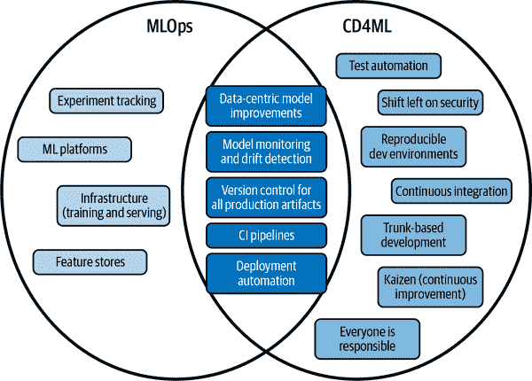
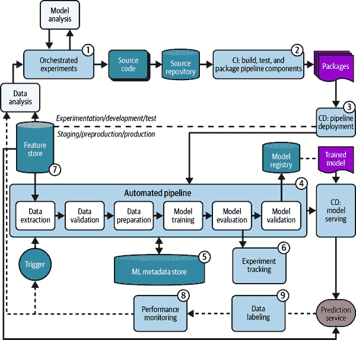
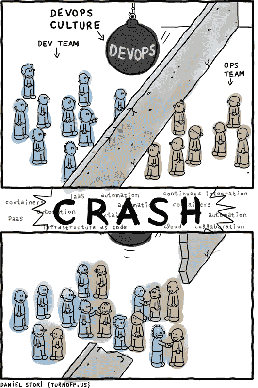

# 第九章：MLOps 和机器学习的持续交付（CD4ML）

> 这种焦虑的出现是决定一切的关键点。
> 
> Søren Kierkegaard，《焦虑的概念》
> 
> *上午 10:36。Dana 正在与基础设施工程师 Ted 配对，部署她的团队几个月来一直在开发的新模型。房间里充满了决心和焦虑的能量——这是一个备受关注的新模型发布。他们已经对模型进行了三周的测试，但接下来的难关——部署到生产环境——通常充满了问题和多次重试。*
> 
> *当他们穿越错综复杂的部署脚本、配置文件和基础设施组件时，Dana 感觉到有些不对劲。她并不确定他们的测试数据集是否代表了模型在生产环境中将要面对的情况。系统的复杂性让人难以置信——如此多的运行部件使得很难判断问题可能出在哪里。*
> 
> *下午 12:45。Dana 和 Ted 十分钟前完成了最后的部署程序，但是零星的警报流让人心烦意乱，提醒他们出了什么问题。*
> 
> *晚上 7:10。经过数小时的故障排除，修复终于部署完成。Dana 和 Ted 松了口气，终于可以回家，精疲力尽。*
> 
> *一周过去了，在一个周二的早晨，Dana 在 Slack 上听到了三声轻敲。上午 8:45 的消息——来自产品分析的 Sarah。她告知 Dana 自上周四发布以来，在线贷款申请下降了 44%。Dana 立即联系了 Ted，他们一起深入日志，试图理解是什么原因导致了突然的下降。*
> 
> *经过彻底调查，他们意识到模型依赖的一个关键特征——贷款类型——在用户界面中被设置为可选字段。许多用户省略了这个细节，导致新模型返回不合理的结果，使用户中途放弃他们的申请。*
> 
> *当 Dana 意识到情况的严重性时，她的心沉到了谷底——她的团队为这个备受关注的发布投入了几个月的工作，却白白浪费了。*

我们在交付机器学习解决方案时所感受到的情绪是我们应该关注的有用信号。例如，当我们为每一个拉取请求或生产部署做重复的手动测试时，我们可能会感到厌倦和一般的“嗯”。当我们每两个月一次地部署一大批代码和数据变更到生产环境时，我们可能会感到焦虑——这么多东西都变了；谁知道这次生产部署会出什么问题？

本章中，我们将描述两种互补的思想流派，帮助团队可靠且迭代地开发、测试、部署、监控和改进机器学习模型。第一种是 MLOps——你可能听说过。第二种是 CD4ML——这可能对你来说是新的。然而，在本章结束时，你应该理解两者的作用。实践时，MLOps 和 CD4ML 共同降低了部署和生产中的失败风险、反馈时间、认知负荷以及围绕在生产中操作模型的压力。

MLOps 是一个快速发展的领域。在撰写本文时，MLOps 领域已经有[超过 20 本书](https://oreil.ly/NSYF4)，并且有更多的图书馆和平台。这些 MLOps 工具和实践的进步是巨大的，但在我们的经验中，它们还不足够。MLOps 文献和从业者往往专注于“操作性”的组件（例如基础设施、模型部署、监控、工具、平台），而忽视了同样重要的软件工程和社会文化实践（例如测试自动化、早期频繁部署、基于主干的开发、持续改进）。

CD4ML 实践解决这些后续方面，并帮助团队确保他们的软件和机器学习模型的更改持续测试和监控以确保质量。任何满足全面质量检查的代码、数据或机器学习模型的更改都可以随时自信地部署到生产环境。根据我们的经验，CD4ML 是一个有效的风险控制机制，可以在生产部署之前（通过测试）和之后（通过监控）检测到机器学习系统中的问题和故障。

《*加速*》一书的研究（[链接](https://oreil.ly/PDlPD)）（IT Revolution Press）显示，持续交付实践使组织能够通过帮助团队可靠地交付价值，并更灵活地响应市场需求的变化来实现更好的技术和商业表现。在我们与机器学习团队合作时实践 CD4ML 的经验中，我们在速度、响应能力、认知负荷、满意度和产品质量方面看到了显著的结果^（1）。

因此，本章将：

+   建立 MLOps 的基本构建块

+   概述团队在实施 MLOps 时经常遇到的陷阱

+   用 CD4ML 原则和实践来补充现有的 MLOps 文献

+   探索 CD4ML 如何支持机器学习治理和负责任人工智能

如果您已经熟悉 MLOps 技术，请随时跳过“MLOps 101”部分，直接进入 MLOps 陷阱以及 CD4ML 如何帮助团队解决这些问题。现在，我们已经设置了场景，让我们深入了解 MLOps 的基础知识和团队经常遇到的常见 MLOps 陷阱。

# MLOps：优势与缺失的拼图

在我们的经验中，CD4ML 通过添加一组原则和实践，帮助 ML 从业者缩短反馈循环并提高 ML 系统的可靠性，很好地补充了 MLOps（见图 9-1）。在本节中，我们将快速概述 MLOps，并探讨一些常见的迹象，表明模型在生产过程中反馈机制存在的差距。在下一节中，我们将看看 CD4ML 如何解决这些差距。

###### 图 9-1\. CD4ML 通过添加一组原则和实践，帮助 ML 从业者缩短反馈循环并提高 ML 系统的可靠性

## MLOps 101

MLOps 是一种旨在简化 ML 模型开发、部署和管理的 ML 工程文化和实践。实践 MLOps 意味着您自动化和监控用于训练和部署 ML 系统的关键组件，包括模型、数据和软件。它是一个跨学科领域，结合了 ML、基础设施工程、软件工程和数据工程的元素，为 ML 项目创建更高效、更健壮的工作流程。

有许多文章详细列举了 MLOps 的技术构建模块（例如，[Google 的“MLOps: Continuous Delivery and Automation Pipelines in Machine Learning”](https://oreil.ly/Z31qn)，[Thoughtworks 的“CD4ML Framework”](https://oreil.ly/3t0Vh)，[INNOQ 的“MLOps Principles”](https://oreil.ly/HuxKJ)），它们通常都聚焦于监督学习模型的典型架构，如图 9-2 所示。

###### 图 9-2\. 典型的 MLOps 架构，包括技术组件和任务流的流程（来源：改编自 Google Cloud 在[“MLOps: Continuous Delivery and Automation Pipelines in Machine Learning”](https://oreil.ly/Z31qn)中的图像，使用[CC BY 4.0](https://oreil.ly/x-mKJ)许可）

让我们来看看 MLOps 架构的关键组件：

1\. 可伸缩的训练基础设施

可伸缩的训练基础设施指的是针对 ML 模型训练工作负载合适大小的大规模和短暂计算资源。虽然这可能涉及复杂的实施细节和许多行 YAML 或 IaC（基础设施即代码）配置，但良好的 ML 平台或工具会将这种复杂性抽象化，并为 ML 从业者提供一种简单的方式，以便按需提供大规模计算资源，而无需调整训练基础设施。

这里需要强调的一个重要特征是训练基础设施的实验操作对称性。这意味着确保开发环境与生产环境一致。这种对称性确保在实验过程中有效的内容也将在生产中的大规模训练中有效，并简化了故障排除和开发过程。

工具包括：Metaflow、Ray、Databricks 和各种云服务（例如 AWS SageMaker、Azure ML、Google Vertex AI）。

2\. CI/CD 流水线（当然还有测试！）

持续集成和持续交付（CI/CD）流水线对于自动化测试和部署 ML 模型的过程至关重要。当正确实施时，它们有助于验证每次代码推送的质量，并在所有先前测试通过的情况下自动部署代码更改。它们使团队能够快速迭代，同时保持对系统稳定性和性能的信心。

我们看到大多数 ML 团队并不实践 CI，尽管他们有一个 CI 流水线（以下注释确切定义了什么算作 CI 和 CD）。正如我们在 第五章 中解释的那样，没有测试的 CI/CD 是个矛盾体。为了让 CI/CD 流水线能够向 ML 从业者提供有用且快速的反馈，它必须执行自动化测试——如我们在 第六章 中详细介绍的指标测试和行为测试——以及最低限度的自动部署，部署到预生产环境上每一个代码推送。

工具包括：GitHub Actions、BuildKite、CircleCI、TeamCity、Jenkins 和各种云资源。

###### 注意

让我们确切定义什么算作持续集成（CI）、持续交付（CD）和持续部署：

持续集成（CI）

这是一种鼓励开发人员频繁*将其代码更改合并到主分支*的实践（又称[基于主干的开发](https://oreil.ly/949Mn)），理想情况下一天多次。每次代码提交后会自动构建和测试，以快速捕获和报告任何错误。无需部署。

持续交付（CD）

这通过确保代码更改不仅经过测试还准备好发布到生产环境来扩展 CI。可部署物件（例如 ML 模型服务）将被部署到预生产环境，并进行部署后测试。如果直到此最后阶段所有测试都通过，我们就有信心可以随时将这个发布候选部署到生产环境。

持续部署

这种实践比持续交付进一步——如果在部署到预生产环境后的部署后测试通过，则可自动将可部署物件部署到生产环境，无需人工干预。这需要成熟的测试和监控设置，以确保能快速捕捉并修复生产环境中的任何问题或故障。

3\. 部署自动化

在 MLOps 中，自动化部署有助于减少手动干预、人为错误和不一致性，同时加速开发和部署过程。它使团队能够优化其工作流程，使其更高效和可靠。

工具包括：Seldon、TensorFlow Serving、TorchServe 和各种云提供商。

4\. "作为代码" 一切

在 MLOps 中采用“作为代码”的方法涉及将基础设施、配置、部署和监控的所有方面视为代码处理。这种实践有助于更好的版本控制、可重现性、自动化和团队成员之间的协作。

5\. 工件存储

类似模型注册表、容器注册表和元数据存储的工件存储持久化了 ML 生命周期中生成的各种工件。这些存储库可以轻松跟踪、版本控制和检索模型、数据和元数据等工件。这有助于促进项目之间的协作、可追溯性、可重现性和审计能力。

工具包括：[Metaflow](https://example.org/metaflow)，[Zen ML](https://example.org/zen_ml)，和各种云服务提供商。

6\. 实验跟踪

实验跟踪工具帮助 ML 从业者管理和比较团队在迭代 ML 模型时无可避免地运行的大量实验。它们使 ML 从业者能够跟踪模型性能指标、超参数和其他相关信息，这为他们提供了关于其变更效果的宝贵反馈。这种反馈有助于他们识别最有前景的模型，并且组织良好时，可以加速开发过程。

工具包括：[Weights and biases](https://example.org/weights_and_biases)，[MLFlow](https://example.org/mlflow)，以及[AWS SageMaker Experiments](https://example.org/aws_sagemaker_experiments)。

7\. 特征存储或特征平台（具备数据版本控制）

特征存储作为特征工程的集中存储库，存储用于训练和推断阶段的预处理特征。特征存储中的数据版本控制使得能够追踪和管理不同的数据版本，确保 ML 模型的可重现性和一致性。通过使用特征存储，团队可以在项目之间共享和重用特征，而无需在多个位置重复特征处理逻辑。

工具包括：[AWS SageMaker Feature Store](https://example.org/aws_sagemaker_feature_store)，[Feast](https://example.org/feast)，[Tecton](https://example.org/tecton)，以及[Feathr](https://example.org/feathr)。

8\. 生产监控

正如我们在第六章中讨论的，生产中的监控可以并且应该在多个级别进行。第一级别（服务健康）适用于部署为 Web API 的 ML 模型，并涉及监控团队关心的服务级健康指标（例如 HTTP 状态码、错误、延迟）。模型服务还应生成结构良好的日志，为团队提供有价值的系统行为洞察。

下一级别的监控（模型健康）涉及跟踪和评估关键性能指标、数据漂移以及随时间变化的模型退化。（参阅“从生产中学习通过关闭数据收集环路”一节[ch06.html#learn_from_production_by_closing_the_da](https://example.org/learn_from_production_by_closing_the_da)了解模型漂移的定义。）这使团队能够评估其在实际应用中的性能，并识别部署模型可能出现的问题。为了监控模型在实际应用中的性能，我们需要为模型在生产环境中进行的新预测添加新标签（关于这一点，后续会有更多说明）。

最终的监控级别（业务健康）涉及跟踪与我们的 ML 模型相关的业务指标。这根据 ML 模型旨在影响的具体结果而变化，但可能涉及用户参与度、销售、转化率和订阅者数量等指标。

工具包括：Alibi Detect、Evidently、Giskard、NannyML、New Relic、Splunk 和各种云服务提供商。

9\. 可扩展的数据标注机制

任何 MLOps 栈的最终且可以说是最重要的组成部分是可扩展的数据标注机制。在这里，“可扩展”意味着可以将用户交互信号、专家判断、自然标签等应用于许多数据点，或者仅应用于模型性能最重要的数据点，而不是单独和不加区别地标记每个数据点。这样做有助于数据中心的模型改进，并使团队能够定期使用更好的数据重新训练其模型，以跟上非静态世界的变化。

关键挑战在于团队经常面临数据标注的瓶颈，这是一项乏味、耗时且劳动密集的任务。除了主动学习和表征学习外，我们发现另一种技术在应对这一挑战中非常有效，即 [弱监督](https://oreil.ly/yNoND)，与未辅助手工标注相比，可以将注释时间缩短 10 到 100 倍，使团队能够快速创建大型标记数据集。

工具包括：Snorkel、Cleanlab 和各种云服务提供商。

现在我们已经介绍了 MLOps 的基本构建模块，让我们看看在实施 MLOps 工具和实践时团队常犯的一些常见错误。

## 气味：提示我们错过了某些事情

尽管从 10,000 英尺高空俯视 MLOps 的布局看起来逻辑和简单，但在地面上构建 ML 系统的团队常常发现自己陷入复杂的地形中，涉及许多移动部分。

如果每个 MLOps 组件都是旅程中的一个航点，团队可能完全错过了一个关键航点（例如，他们没有一个可扩展的数据标注机制），或者他们在正确的航点停下来，却错过了他们在那里应该做的事情（例如，在没有自动化测试的情况下实施 CI/CD 流水线）。这种疏忽可能导致严重后果，包括生产中的模型质量问题以及减缓实验和模型改进速度的不必要摩擦。

在本节中，我们将使用我们在 第七章 中引入的“气味”概念（即指示更深层问题的信号），来说明团队在应用 MLOps 实践时常见的一些错误。这为下一节打下了基础，我们将探讨 CD4ML 如何补充 MLOps 并帮助团队克服这些挑战。

### MLOps 气味 1: 没有测试的 CI/CD 流水线

如我们在第六章中提到的，没有测试的 CI/CD 管道是个悖论——如果没有自动化测试来检查错误，我们如何持续集成（CI）代码到主分支呢？然而，我们经常看到团队存在这种问题——可能是因为机器学习工程师知道如何设置 CI 管道，数据科学家知道如何训练和评估模型，但并非所有团队都能找到将这两者实践结合起来自动化模型评估过程的方法。

其后果是多方面的。首先，错误和漏洞很容易进入代码库甚至进入生产环境。其次，我们浪费了大量时间来测试或修复错误。第三，即使我们已经优化了 CI/CD 管道的其他部分（例如，30 秒内模型部署），测试和质量保证步骤仍然是一个瓶颈（例如，手动测试需要几小时，或者在我们有时间进行时，这会将瓶颈拉长到几天甚至几周）。

第四，也是最后，缺乏自动化质量检查推动我们离开主分支，进入功能分支，因为没有人愿意：（i）意外地将缺陷或问题提交到主分支，或者（ii）在每次提交后手动和全面地测试。根据我们的经验，这种推迟的集成（与我们之前定义的持续集成到主分支相反）经常会在团队成员在数天或数周的工作后最终合并分支时引发合并冲突。我们从未遇到过一个喜欢合并冲突并且不必要地浪费时间和认知努力来解决合并冲突的人。

### MLOps 异味 2：模型很少部署到生产环境或预生产环境

将数据部署到生产环境和预生产环境的频率低下表明团队对代码、数据和模型的可靠性和质量缺乏信心。

部署不频繁会增加部署失败的可能性。例如，每四周部署 100 个提交（例如，到预生产环境），与每天部署五个提交截然不同，尽管提交的总数相同。在第一个场景中，如果一个部署失败，你有 100 个潜在的嫌疑人和 4,950 对之间的交互，这比五个（和 10 对之间的交互）要难得多。这对生产环境和预生产环境都是如此。

这就是拥有小批量大小的价值。David Farley 和 Jez Humble 在《持续交付》（Addison-Wesley Professional）中表达得很好：提前发现缺陷，修复成本更低。较小的批量大小使您能够更早地发现缺陷。此外，部署不频繁可能会妨碍团队响应用户反馈、修复问题或引入新功能的能力，最终影响团队和 ML 产品的整体响应能力。

### MLOps 异味 3：生产中的数据被浪费

团队通常会在生产中丢弃模型生成的数据（例如请求和预测）——这些数据本可以用来改进他们的机器学习模型。这可能是由于缺乏适当的数据收集、处理和标记机制所致。因此，团队丢失了一个宝贵的反馈机制，可以提升机器学习系统的性能。

如果未能处理和利用来自生产环境的新数据进行后续训练，可能导致模型随时间变得过时或不够准确，因为它们可能无法考虑用户行为的变化、环境的变化或新兴趋势。此外，这可能会阻碍团队识别和解决模型中潜在问题或偏见的能力，从而对机器学习产品在现实世界中的用户体验产生负面影响。

相比之下，当团队设计他们的机器学习系统以闭环数据收集时，他们创造了一个[飞轮效应](https://oreil.ly/h-h6l)，其中模型的更多使用导致更多数据，进而进一步改进和完善模型。

### MLOps 的臭味 4：X 是另一个团队的责任

当你听到类似“X（例如部署、集成、客户体验、安全性）是另一个团队的责任”的说法时，通常这暗示着一些更深层次的问题。第一个问题涉及团队结构：团队没有正确设置，并且缺少某些关键的能力（例如部署、集成、客户体验、安全性）。为了快速前进，一个团队应该拥有这些核心能力，或者由支持跨领域能力（例如安全性）的使能团队支持，正如我们将在第十一章中探讨的那样。这将使团队能够在不依赖于其他团队（并且不会因此而受阻）的情况下运行。

第二个问题涉及文化：X 是别人的问题。我们经常在团队之间的边界上检测到“别人的问题”思维方式，这表明结构和文化两个问题通常是相互加强的。这种思维方式阻碍了协作，并创造了一个未解决问题的环境，从而导致了次优的 MLOps 流程，并潜在地损害了机器学习模型的质量和可靠性。这与 DevOps 思维相悖，后者专注于打破开发和运维之间的壁垒（参见图 9-3），现在还包括了 ML 和 Ops，使得 ML 人员（例如数据科学家）和运维人员（例如 ML 工程师）联合解决难题（例如 ML 模型的自动化质量保证）并推广可靠的 ML 系统。

###### 图 9-3. DevOps 文化旨在打破开发团队和运维团队之间的分隔（来源：[“DevOps Is Not a Role” by Daniel Stori](https://oreil.ly/CH_Q8)，在[CC BY-NC-SA 4.0](https://oreil.ly/-MSwI)下使用）

到目前为止，您已经了解了 MLOps 的基本原理，并看到，并且可能已经识别出了 MLOps 的这四个缺口——缺乏自动化测试、部署不频繁、生产数据浪费和“别人的问题”。现在让我们看看连续交付（CD）的原则和实践如何补充 MLOps 并减少这些问题，以帮助团队可靠地交付。

# 用于机器学习的持续交付

如果我们告诉您，有一种方法可以安全、快速和可靠地将各种类型的更改（包括新模型、新功能和错误修复）推送到生产环境并交付给用户，那么这就是连续交付（CD）帮助我们实现的正是这一点。

在本节中，我们将讨论：

+   CD4ML 的好处（“为什么”）

+   CD 的原则（“什么”）

+   CD4ML 的实践和构建模块（“如何”）

让我们从深入探讨“为什么”开始。

## CD4ML 的好处

完全实践 CD4ML 可以产生几乎所有 ML 团队都渴望的结果。让我们看看三个关键好处：

周期时间缩短（从想法到在生产中交付给客户的时间）

CD4ML 可以加快开发和部署周期。通过自动化构建、测试和部署 ML 模型的流程，团队可以减少重复的手动测试等枯燥的、非差异化劳动所需的时间和精力。根据我们的经验，这有助于加速任何类型变更的上市时间，使团队能够快速响应不断变化的业务需求或市场条件。

缺陷率降低

另一个 CD4ML 的优势是提高了模型的质量和性能。在通向生产过程中的每个阶段都进行了全面的自动化测试（如第五章和第六章所述），ML 团队可以快速检测和修复模型中的任何问题或错误，然后再进行部署。这使他们能够确保其 ML 应用的质量和可靠性。在生产环境中监控模型性能的做法还允许团队在发生质量下降时立即检测并进行必要的更新或重新训练模型。

CD4ML 使团队能够“快速失败并大声失败”。通过测试或监控来检测问题的这种能力在 ML 系统中尤为重要，因为与典型的软件应用程序不同，ML 模型容易发生静默错误。这些错误可能不会立即使系统崩溃或引起明显的故障，但它们可能导致误预测，从而对用户体验产生不利影响。结果是，*用户*可能会在生产中长时间内检测到并经历质量问题，直到团队检测并解决这些问题为止。

恢复时间更快（如果在生产中出现问题）

通过采纳小而频繁的部署实践，团队可以更轻松地分类和解决问题。借助自动化和流程化的部署过程，更容易回滚到之前的稳定版本或部署修复程序，从而最小化停机时间和对用户体验或组织声誉的潜在损害。

###### 注意

在《Accelerate》中，作者们通过四年的软件开发实践研究发现了什么因素和实践使高绩效技术组织与业绩较差的组织有所区别。

他们基于收集的成千上万个组织的数据提供了洞见，并强调了推动软件交付卓越的关键实践。其中一个关键发现是一组[24 个关键能力](https://oreil.ly/BJhd7)，以统计显著的方式推动软件交付绩效的改进。这 24 个能力可以分为五类：

+   持续交付（本章的重点）

+   架构

+   产品和流程（见第二章）

+   精益管理和监控（见第十一章）

+   文化（见第十章和第十一章）

在写作时，这项实证研究尚未为机器学习团队复制，但我们与团队合作交付机器学习解决方案的经验证实了作者的结论。

## 关于持续交付原则的速成课

现在我们已经看到了 CD4ML 的好处，让我们深入探讨指导 CD 实践的核心原则。在 CD 的核心有五个原则：[持续交付](https://oreil.ly/W-AXL)。

原则 1：在产品中建立质量

如果能够在引入时立即检测到问题和缺陷，成本效益将更高。通过检查方法（例如手动测试）在后期识别缺陷是非常耗时的，并需要大量的分类工作。正如精益先锋爱德华·戴明在《管理的 14 点》中所述，我们应该“停止依赖检查来实现质量。首先在产品中建立质量，从而消除大规模检查的需要*。”（[“14 Points for Management”](https://oreil.ly/JsKu9)）

最好能在提交之前检测到缺陷，通过运行自动化测试来实现。对于机器学习，可以通过为软件、机器学习模型和数据编写自动化测试来实现。拥有一个机器学习平台，使机器学习实践者能够根据需要在可扩展的临时基础设施上训练模型并进行测试，有助于避免提交和推送代码以了解某些功能是否正常工作的需要。

通过创建机制来检测和解决问题，团队能够在问题出现时立即采取行动，从而节省精力，并减少在解决问题和修复故障之间的切换。回想一下，在第二章中，我们在甚至开始编写代码之前就引入了捕捉*需求*缺陷的方法。

原则 2：采用小批量工作。

在 20 世纪 90 年代甚至进入 2010 年代，将软件交接给多个团队（从业务分析师团队到架构师、开发人员、测试人员再到运营团队）以便部署到生产环境是很常见的。在这些情况下，批次大小非常大——通常是数周甚至数月的工作才能部署到生产环境。（我们今天仍然看到某些机器学习团队依然存在这种情况！）

自从 2010 年左右引入持续交付以来，团队可以以更小的批次大小进行工作。以更小的批次工作有很多优点，比如减少反馈时间、减少认知负荷、更容易进行问题分类和修复，以及提高效率和进度感。

在产品上线的过程中，我们设置了多个质量门，以便迅速和全面地反馈我们变更的质量。在机器学习的背景下，质量门包括自动化测试（软件、数据和模型）、部署到预生产环境、部署后测试以及我们在第六章中描述的其他适应性函数。当质量门覆盖全面时，我们可以放心地将任何绿色构建（由代码更改或计划的训练运行触发）部署到生产环境。

原则 3：自动化——计算机执行重复任务，人们解决问题。

自动化是简化和优化机器学习解决方案交付过程的关键组成部分。通过自动化诸如代码检查、测试和部署等重复任务，团队减少了需要手动干预的工作量，从而显著提高了效率和可靠性。

自动化过程还可以缩短反馈循环，使开发人员能够更快地识别和解决问题。这使团队能够专注于高级别的问题解决和创新，而不被繁琐的任务所拖累。

原则 4：不懈追求持续改进。

正如您可能记得的那样，在第一章中，持续改进（或者用日语的*Kaizen*）是精益五大原则之一。Kaizen 的目标是帮助组织和团队识别和消除浪费，从而改善价值流动。

根据我们的经验，团队的心态和行动——实现集体持续改进——比论坛（如回顾、技术债务聚焦会议、站立会议）更重要。如果没有改善的快速追求心态，改进建议几乎总是被拖延以适应其他优先事项，团队成员往往会放弃尝试。

Principle 5: Everyone is responsible

在高效 ML 团队中，没有“别人的问题”。相反，低效团队经常表现出“部署性不是我的问题”等信念，或者“我们不必担心这些有漏洞的依赖警告，因为安全不是我们团队关注的领域”。

尽管有意愿和愿望做正确的事情很重要，但当个人和团队在没有得到正确能力支持时，他们可能会迅速失去动力和希望。还记得我们之前提到的结构和文化如何相互加强吗？我们可以使用适当的团队结构（例如跨功能团队）来建立开发和部署可靠 ML 解决方案的实践和文化。每个人——数据科学家、ML 工程师、数据工程师、平台工程师、产品所有者、安全专家、领域专家等——共同努力交付可靠的 ML 解决方案，而不是优化他们团队或部门的最佳实践。²

现在我们已经明确了持续交付的五个原则，让我们深入探讨每个原则的支持实践。这些实践共同帮助 ML 团队早期和频繁地将可靠的 ML 解决方案交付到生产中，并享受它们的好处。

## CD4ML 的构建模块：创建可投入生产的 ML 系统

在本节中，我们将描述有助于团队在交付 ML 模型时减少浪费、改进流程的持续交付实践。对于急于了解的人，表 9-1 提供了这些实践的概述。

表 9-1\. 将 ML 团队的实践映射到持续交付原则

| CD 原则 | ML 团队中的支持实践 |
| --- | --- |
| 1\. 将质量融入产品中 | 1.1 测试自动化 1.2 安全左移 |

| 2\. Work in small batches | 2.1 对所有生产工件使用版本控制 2.2 实践配对编程

2.3 实施持续集成（CI）

2.4 应用基于主干的开发 |

| 3\. 自动化：计算机执行重复任务，人们解决问题 | 3.1 为开发模型创建可重现的开发环境 3.2 自动化部署（至少到预生产环境）

3.3 在生产中进行监控 |

| 4\. 不懈追求持续改进 | 4.1 实践改善（识别和行动改进的机会） |
| --- | --- |
| 5\. Everyone is responsible | 5.1 采用适合您组织的团队拓扑结构 |

### 将质量融入产品中

让我们看看帮助团队将质量融入他们的 ML 解决方案的实践。

#### 测试自动化

我们在第五章和第六章中详细介绍了测试 ML 系统的原因、内容和方法。我们强调的一个关键点是，如果没有全面的自动化测试，团队将*无法*实践 CI 和 CD。（我们在“实施持续集成（CI）”部分详细阐述了为什么。）

如果没有在每次代码推送或每次模型训练运行时自动运行的测试，ML 从业者将不得不承担回归测试的负担，这会分散他们在其他更高价值工作上的精力，在合并到主分支（或模型部署到生产环境）之前需要解决任何代码更改。如果不这样做，团队将冒险并面临将缺陷引入代码库和生产环境的风险，然后不得不在检测到缺陷时修复它们。正如我们之前讨论过的，通过全面的自动化测试及早检测此类问题要更具成本效益。

#### 安全左移

安全左移意味着在 ML 开发过程的早期和整个过程中加入安全措施，而不是将其视为事后思考或最终部署前的最后检查点。这种积极的方法帮助团队在漏洞和安全问题深入系统之前防范和防御，使其后期修复变得更加昂贵和困难。

这种做法可以包括：

+   对 ML 解决方案进行安全审查和[威胁建模](https://oreil.ly/0p1V_)，包括在设计和交付过程中及早引入信息安全（InfoSec）团队

+   对 ML 模型的故障模式进行审查、识别和减轻（例如，对抗性攻击、数据污染）

+   建立访问控制以防止未经授权的使用

+   自动化检测和更新易受攻击依赖项（见第四章）

+   包括将[自动化安全测试](https://oreil.ly/TK7xZ)作为 CI 流水线上自动化测试套件的一部分

+   支持您组织的安全功能，例如通过拥有[安全冠军](https://oreil.ly/BX9Ry)

除了 ML 外，还有关键的数据安全实践：

+   在数据隐私方面，团队必须对个人可识别信息（PII）进行匿名化，以免存在访问风险。

+   在数据安全方面，团队必须对生产数据进行加密和建立访问控制。

早期实施安全措施可以防止后续发生昂贵且具有破坏性的安全漏洞。保护 ML 系统也不是静态目标。随着恶意行为者找到[新的攻击方式](https://oreil.ly/Edc3M)，团队需要及时获取来自[网络安全](https://oreil.ly/eRHR1)、[MLSecOps](https://oreil.ly/oofV4)和[DevSecOps](https://oreil.ly/w6Exh)社区的持续建议。

### 分批处理工作

正如我们在前一节中建立的，分批次工作带来了许多好处：缩短反馈时间、减少认知负荷、更轻松地解决问题和改善效率及进步感。

不仅仅是适当的任务大小和范围——这很重要——以下实践帮助 ML 从业者分批次提供价值。

#### 练习配对编程

配对编程涉及两个人一起编写代码以完成用户故事或任务。当我们进行配对编程时，不再是单打独斗并通过拉取请求进行代码审查，我们将反馈周期从几天（等待和来回拉取请求审查）缩短到几分钟（与队友配对时的即时反馈）。

配对编程不仅仅是编写代码，它涉及协作、规划、解决问题、讨论和知识分享。其结果是在团队内共同创造更好的解决方案和首选实践的社会化。

配对编程在软件工程界是一种常见实践，在机器学习团队中也有所实践，尽管程度较低。看到数据科学家单独工作一段时间并不罕见。在此期间，他们可能会独自做出许多假设，没有提出的问题，他们不知道的事情。在一个轶事中，我们曾与一位数据科学家合作，他为一个用户故事工作了三周，最终 PR 被拒绝，因为代码太乱，没有测试，并且严重拖慢了训练管道。对数据科学家来说，这是多么令人沮丧的时间浪费！

**配对编程**有许多充分记录的好处：

知识分享

当两个人共同解决问题时，他们分享并学习彼此的方法和技术，从而在团队中传播局部知识和最佳实践。这在机器学习团队尤其有益，数据科学家、ML 工程师和数据工程师可以互相学习对方的专业知识，从而促进更多的学习和更高质量的解决方案。

这也有助于增加团队的 [公交车因子](https://oreil.ly/pB9mS)——如果团队成员“被公交车撞倒”（或中彩票），会导致项目因缺乏上下文知识而减速至停滞。配对编程将公交车因子提高到超过一——从而使团队成员可以放心地度假，无需担心在度假期间工作或阻碍团队的工作。

快速反馈

当我们进行配对并有意识地配对时，我们可以在几分钟内获得对我们代码的反馈。这种即时反馈有助于早期捕捉潜在问题或 bug，从而提高代码质量并减少调试时间。这与通过拉取请求获得反馈形成对比——顺便说一句，这可以说是依赖检查而不是自动化质量保证。拉取请求通常需要几天甚至几周才能准备好进行审查，并且需要几个小时或几天的低上下文交流之后才能合并。

两全其美：高层和详细的思考

在配对时，导航者更专注于高层问题解决和设计，而驾驶者则专注于低级实现细节和执行。通过结合两个头脑，团队可以利用两个人的优势并减少盲点。

新团队成员快速入职

新团队成员可以通过与经验丰富的团队成员配对，快速学习代码库、团队的工作实践和工具。这加快了入职过程，帮助新成员更快有效地贡献。这比阅读大量文档或观看录像更好作为入职的方式。

保持专注

使用配对编程，个人更难分心或走偏。这种活动的社交性质保持了程序员的参与，确保工作更加专注和高效。

有几种技术可以帮助团队有效进行配对编程，例如驾驶者导航、乒乓对打和“Dreyfus squared”。我们鼓励您阅读关于配对编程的好处和机制的简短文章，《“关于配对编程”》。

#### 对所有生产工件使用版本控制

代码、数据和工件（例如配置、中间数据、训练模型）的版本控制帮助团队实现可重现性、可追溯性、可审计性和调试能力。根据我们的经验，当我们可以访问这些中间和最终工件时，我们可以重现过去的结果，并执行各种任务，例如了解数据变化对模型性能的影响。我们可以“召唤”（或者从技术上讲，反序列化）模型和数据来重新创建场景（出现的 bug 或其他情况），而无需等待长时间和潜在的不确定的训练运行。

版本控制对于确保机器学习系统的可重现性至关重要。这不仅涉及跟踪代码变更，还包括对数据集、模型参数、配置设置甚至训练过程中使用的随机数生成器种子进行版本控制。通过对过程中使用的所有随机数生成器（RNGs）进行种子化，我们可以确保 ML 工作流中的随机元素（例如数据洗牌和模型权重初始化）在多次运行中保持一致。这有助于我们更好地将模型质量的变化与模型输入（例如代码、数据）的特定变化相关联，并节省由于随机性而导致的调试时间。

在源代码版本控制的背景下，还重要的是[进行小而频繁的代码提交](https://oreil.ly/T1ip7)。我们经常看到 ML 实践者将多个不相关的变更（甚至跨越 10 至 20 个文件）合并到一个提交中。如果该提交在 CI 上导致构建失败（即测试失败），那么哪一组逻辑上的变更导致了错误？当变更集较大时，很难说清楚。因此，除了使用版本控制外，我们还应该*善用*它，通过在逻辑上分离且理想情况下是小变更的方式进行更改。

#### 实施持续集成（CI）

持续集成（CI）实际上有一个严格的定义，通常被淡化到失去其实际意义的程度（见本章前面关于 CI/CD 定义的注释）。这在机器学习实践者中尤为常见。CI 指的是将所有代码更改提交到主分支（又称[基于主干的开发](https://oreil.ly/949Mn)——关于这一点，后文会详细介绍），理想情况下，每天多次提交。

每次代码推送都会自动在 CI 流水线上进行测试和验证。这种方法有助于尽早发现和解决质量和集成问题，从而提升整体软件质量并缩短验证和部署新功能所需的时间。

通常，机器学习实践者不愿意实践 CI，因为他们不希望长时间的训练过程（有时需要几个小时甚至几天才能完成）阻碍他们进行代码提交的能力。因此，他们会通过创建特性分支的方式划分出自己的“工作空间”，并在满意其变更质量后，创建一个拉取请求将变更合并到主分支。

这种担忧是合理的，但团队应考虑两个因素，这些因素可以帮助他们避免特性分支带来的成本和问题。首先，不要让 ML 成为“免罪金牌”。如果一个组件的生产路径不需要耗时的训练过程（例如小模型解决方案、不需要微调的 LLM 应用程序或支持包和库），则团队应该实践 CI、测试自动化和基于主干的开发，以获取流畅性、速度和质量的好处。

其次，在代码变更的路径*确实*需要耗时的训练运行的情况下，特性分支和拉取请求（即非主干开发和持续集成）可能是可以接受的权衡。但是机器学习从业者仍须在本地和 CI 流水线上执行快速运行测试（例如在第六章中描述的训练冒烟测试），在进行漫长和昂贵的训练运行之前。这为机器学习从业者提供了有关其变更质量的快速反馈，这些变更是在特性分支上进行[小而频繁的提交](https://oreil.ly/T1ip7)。

这在我们[特定项目中](https://oreil.ly/oHIJT)是真实的。我们的 CI 流水线具有很高的测试覆盖率，但我们使用特性分支工作（即我们没有使用主干开发和持续集成）。但是，我们确保分支生命周期短暂（最多两到三周）。我们进行配对编程，撰写测试，倡导[非阻塞代码审查](https://oreil.ly/pcz3m)，并确保所有分支在我们的 CI 流水线上经历相同的全面测试。现在，当提交并推送代码变更时，CI 流水线：

+   运行一系列自动化测试

+   触发大规模训练

+   运行模型质量测试

+   构建并将我们的模型镜像发布到容器注册表

+   自动将镜像部署到预生产环境

+   在预生产环境中运行部署后测试

当整个 CI 流水线全部通过时，表示训练模型已经通过了我们定义的所有[适应性函数](https://oreil.ly/hv_5B)，我们可以放心地合并分支并部署变更到生产环境。

#### 应用主干开发

正如表 9-2 中详细描述的，主干开发是将代码变更提交到主分支的做法。这与特性分支开发相对，开发人员在每个特性或错误修复上创建单独的分支和拉取请求。主干开发以多种方式使机器学习从业者受益，并有助于解决长反馈周期、构建中断、代码质量问题、技术债务、阻塞工作以及团队内外沟通隔阂等常见挑战。

表 9-2\. 主干开发与特性分支开发的优劣势（来源：改编自[Mattia Battiston 关于主干开发的工作](https://oreil.ly/OeGHI)）

| **特性分支开发** *在孤立分支中工作；提出拉取请求（PR）；在 PR 获批后合并到主分支* | **主干开发** *直接推送到主分支；配对编程；在 CI 上运行全面测试；享受可靠的构建；通过抽象/特性标志进行分支* |
| --- | --- |
| *反馈较晚到来：* 太晚以至于无法更改任何重要事项 | *快速反馈：* 当您编写代码甚至在之前 |
| *低质量反馈:* 通过缺乏上下文和细微差别的评论；有时由于 PR 审核流程的摩擦而被忽略或未被采纳 | *更好的质量反馈:* 通过上下文讨论和演示建议的实际效果 |
| *害怕和推迟大规模重构:* 因为它们可能会引起合并冲突并减慢 PR 审核流程 | *更容易处理大规模重构:* 其余团队始终保持更新，并立即从任何重构中受益 |
| *容易忽视构建失败:* 因为它运行在隔离分支上 | *我们习惯于不破坏事物:* 团队养成了保持主分支稳定的习惯 |
| *个体编码风格:* 即使在单个代码库内部也有风格、设计和方法的碎片化倾向 | *团队编码风格:* 通过配对社会化和传播的首选风格、设计和方法 |
| *人们独自工作:* 更难发现是否有人需要帮助 | *能看到每个人在做什么:* 更容易发现是否有人需要支持 |

Trunk-based development 是我们前面详细描述的持续交付实践的锦上添花。它是一种只有在实施了测试自动化、配对编程和 CI/CD 管道的安全前提条件下才能且应该采用的实践。反之亦然：如果缺乏这些安全前提条件，Trunk-based development 就存在风险，通常会导致构建失败和缺陷。

### 自动化：计算机执行重复任务，人们解决问题

Algorithmia 的 [“2021 年企业机器学习趋势”报告](https://oreil.ly/9FAXH) 发现，38% 的受访组织将其数据科学家超过 50% 的时间用于模型部署。而部署并不是机器学习实践者经常需要处理的唯一无差别乏味工作，还包括配置开发环境、生产中的故障排除和调试等任务。

下面的实践帮助机器学习实践者减少这种手动劳动，使他们可以专注于解决重要问题并提供价值。

#### 自动化开发环境设置

我们在第 3 和第四章讨论了机器学习实践者在创建可重现和一致的开发环境时经常面临的挑战，以及克服这些挑战的实际技术。为了完整起见，我们在这里再次提到自动化不仅对于测试和部署模型有用，而且对于创建开发环境也很有帮助。

为了实现这一目标，团队可以利用容器技术和基础设施即代码（IaC）工具，在本地或云中创建一致的类生产计算环境，用于开发和生产环境（即 [实验-运营对称性](https://oreil.ly/Z31qn)）。

这使得 ML 从业者可以专注于高阶问题解决和创新，将环境设置和配置的重复任务交给计算机。

#### 自动化部署（至少到预生产环境）

正如前文提到的，部署自动化通常在 MLOps 文献和工具中有很好的覆盖。特定技术，例如金丝雀部署和 A/B 测试，在 Chip Huyen 的《*设计机器学习系统*》（O’Reilly）中也有全面的解释，因此我们在此不会重复提及这些点，但我们会强调 CD4ML 为实践增加的差异。

CD4ML 通过推荐团队将自动化模型部署的能力推向更高级别：（i）在每次代码推送时*触发*自动化部署——至少到预生产环境——和（ii）运行部署后的测试以验证部署成功并随时准备投入生产。

###### 警告

在传统软件开发中，通常使用不同的环境，如开发、测试、用户验收测试和生产，以确保在部署到最终用户之前充分审核更改。然而，在 ML 系统中，这种方法通常不合理，因为模型训练需要访问最相关、全面和最新的数据，这些数据通常只存在于生产环境中。

因此，在只有一个环境可以访问最佳数据的情况下，只在该环境中运行完整的模型训练——在大多数情况下，即生产环境。在其他低级别环境中，你仍然可以对少量数据运行训练冒烟测试（如第六章中所述）之后再在生产环境中进行完整训练。

#### 生产监控

生产监控是软件工程中已经建立的实践。如果做得好，监控（指标、日志和警报）将为我们提供关于产品在野外行为的有用反馈，并在出现任何意外错误、模型漂移、性能下降或异常活动时通知我们。

监控使我们能够洞察在测试中未考虑过的场景。正如 Edsger W. Dijkstra 曾经说过的：“测试可以有力地证明存在错误，但永远不能证明不存在错误。”这就是为什么在生产中进行监控是测试的一个必要的补充实践。

我们已经在本章的第一节中讨论了监控的三个层次，因此我们不会重复详细说明，除了指出在 ML 系统中有用的监控组件：

+   服务监控（例如 HTTP 状态码、错误、延迟）

+   模型监控（例如关键性能指标、随时间的模型漂移）（参考章节“通过关闭数据收集循环从生产中学习”了解模型漂移类型的定义。）

+   数据监控（例如数据质量监控、异常检测、符合预期模式的监控）

+   业务级成果（例如用户参与度、销售、转化率、订阅人数）

+   结构化日志应该是信息丰富且易于阅读的，不包含机密或敏感数据（例如 PII）；如果生产请求经过多个服务，则应具有相关 ID 以便在分布式系统中进行调试。

+   生产中不良场景的警报（例如 API 错误、超出延迟预算的请求）应该是信息丰富且可操作的，要小心避免[警报疲劳](https://oreil.ly/CAh0D)和[破窗效应](https://oreil.ly/hpXp2)！

### 改善：不懈追求持续改进。

没有任何系统会是完美的，总会存在问题和改进的机会。有效的团队是那些能够承认自己不完美的知识，并抽出足够的时间和精力来识别并采取改进措施的团队。

持续改进（或改善）对 ML 团队特别重要，因为 ML 团队在团队、工具、平台、流程和问题的异质性和新颖性方面都是如此。作为从业者社区，我们不断发现解决问题的新方法，目标不是第一次就做对（这是不可能的！），而是使迭代改变和改进工作方式变得简单和安全。

强调重要的是，我们可以实行点改善和系统改善。点改善可以在工作过程中迅速进行。例如，团队成员可以简单地指出反复引起摩擦的问题（例如，过多的会议或手动部署程序），并确定后续行动来解决这些问题。

针对系统级问题（例如导致过多交接和阻塞的团队形态，缺乏平台能力），诸如[价值流映射](https://oreil.ly/k_kn7)和[5 个为什么](https://oreil.ly/lh5ES)等系统改善技术可以帮助团队识别问题并找到改进方法。

### 每个人都有责任：通过采用适当的团队拓扑来理性化和培养所有权。

尽管“每个人都有责任”的 CD 原则是一个有用的信念，指导个人的决策，但我们经常发现，每个人都有责任的事情最终往往成为没有人责任的事情。

要实现这一文化愿望，团队需要在 ML、运营、客户体验或安全等领域的适当结构和工作系统的支持下，激励个人和团队履行各自的责任。让我们看看如何通过[团队拓扑](https://oreil.ly/DWhOY)的原则和实践来帮助我们做到这一点。

正如许多人所知，在 DevOps 运动之前，开发人员会编写代码并将其投入操作工程师打包和部署。即使在一些机器学习团队中，我们仍然看到这种情况发生，尽管不总是如此极端，团队按功能划分（例如数据科学团队、机器学习工程团队、API 团队）。这种结构促使个人思考责任（例如生产监控或测试机器学习模型）属于其他团队，即使这种心态可能决定了他们对所贡献的机器学习产品的重要性。

此结构增加了团队之间的交接和积压耦合，进而增加了等待时间和摩擦。例如，在[一项非正式研究](https://oreil.ly/MhC3P)中，通过交付中心传递的数百项任务中，需要等待其他团队的任务比能由单个赋权团队完成的任务花费*10–12 倍的时间*。

我们还看到康威法则——组织产生与其沟通结构副本相同的设计——生效，每个团队都在某种程度上进行重新工作，而不是协调创建共享能力。例如，我们曾与一个有两个数据科学团队的组织合作。这两个团队独立解决了相同的问题，如大规模模型训练的工具化、实验跟踪和模型可解释性。

为了解决这些挑战并促进协作和集体所有权，考虑适当的团队结构和团队拓扑，以适应组织的成熟度和规模。我们将在第十一章中详细讨论这一点，但这里简要概述了 Team Topologies 模型中的四种团队类型及组织如何利用它们来扩展 ML 实践和交付：

流对齐的团队

交叉功能团队围绕一个产品或一组产品组织起来。团队应具备所需的能力和背景来开发、测试和部署 ML 模型的增强版到生产环境，而无需等待（和被其他团队阻碍）。通常，这是一个“两披萨团队”，拥有数据科学、ML 工程、软件工程、质量保证和产品等能力。

平台团队

这些团队（例如数据平台团队、机器学习平台团队）构建和维护平台能力，流对齐的团队可以自助使用这些能力。他们还在必要时支持流对齐的团队，以指导或解决现有平台能力或开发新平台能力。

使能团队

这些团队提供专业知识（例如安全咨询、机器学习治理、架构），根据需要为流对齐的团队提供支持。他们的角色是通过提供必要的支持来加速流对齐的团队，而不是拥有自己的产品或服务。

复杂子系统团队

这些团队处理需要专业技术专长的系统部分（例如传统平台、搜索、个性化）。

在机器学习（ML）领域中，存在多个 ML 产品使用案例的情况下，我们经常看到 ML 从业者嵌入在*与流对齐的团队*或*复杂的子系统团队*中（例如，一个数据科学团队在组织中构建和支持个性化）。这些团队还依赖于自助式 ML 平台和数据平台的能力，并在必要时得到 ML/数据*平台团队*的支持。同时，这些团队还得到*支持团队*（如治理和架构团队）的支持，他们可以在必要时提供建议和支持流对齐团队。

建立正确的团队结构有助于组织改善信息流动，更重要的是，保持认知负荷在可管理的水平上。《Team Topologies》（IT 革命出版社）的共同作者 Matthew Skelton 表达得很好：

> 如果我们通过赋予团队超出其认知负荷能力的系统部分的责任来压力团队，它将不再像一个高效的单位，而开始像一群松散关联的个体，每个人都试图完成他们的个人任务，而没有空间去考虑这些任务是否符合团队的最佳利益。......当不考虑认知负荷时，团队会因试图涵盖过多的责任和领域而过度分散。这样的团队缺乏追求专业技能的带宽，并且在切换上下文的成本方面遇到困难。

带着 CD4ML 的原则和实践，让我们转向本章的最后一部分，看看 CD4ML 如何支持团队实践 ML 治理和负责任 AI。

# CD4ML 如何支持 ML 治理和负责任 AI

随着 ML 能力的增强和对这些能力的依赖，带来的潜在危害也在增加，例如偏见的放大和具有有害社会影响的未预见用例。有关此类危害的一些例子，请参考[AIAAIC（AI、算法和自动化事件与争议）存储库](https://oreil.ly/h1-FN)，该存储库包含超过 1,000 个事件和争议，包括深度伪造，虚假声明，嵌入式种族主义和隐私侵犯。

如果 ML 团队不主动识别潜在的故障模式和危害来源，并相应地实施风险控制措施，他们实际上正在建造一座危机四伏的纸牌屋，这不仅容易发生功能故障，还可能对用户造成伤害，对企业的公共声誉造成风险。这就是为什么 ML 治理对于任何建立 ML 系统的团队都至关重要，因为它与负责任 AI 交汇。

在第一章中，我们提到了 MIT Sloan 对负责任 AI 的定义:³

> 一个原则、政策、工具和流程的框架，确保 AI 系统在为个人和社会造福的同时实现转变性业务影响。

一个负责任的 AI 框架应为团队提供实用工具，指导他们在设计、开发和部署 ML 系统时的决策。负责任的 AI 是 ML 治理的重要组成部分。有效的 ML 治理确保我们在遵守道德和法规标准、质量控制、风险管理协议和工程最佳实践的同时从 ML 系统中提供价值。

关于这些主题的现有文献很少，但其中包括一些很好的参考资料。对于 ML 治理，请参阅报告[“AI 治理：精简方法”](https://oreil.ly/l67w_)和[“ML 治理框架”](https://oreil.ly/5RYHG)。对于负责任的 AI，请查看谷歌的[“负责任 AI 实践”](https://oreil.ly/d6lT0)和[*负责任 AI：创建值得信赖系统的最佳实践*](https://oreil.ly/UDQJf)（Addison-Wesley Professional）。我们不会详细讨论这两个主题，但我们想描述 CD4ML 如何帮助团队将 ML 治理原则操作化到他们的日常工作流程和决策中的四种方式：

促进迭代改进

CD4ML——能够对 ML 系统进行小改动，并评估和监测这些改动是否产生了预期的结果，并在不符合预期时进行回滚——是多方面推动负责任 AI 的强大工具。

首先，它实现了一种迭代的、以人为中心的解决方案开发方法，我们可以在一系列小步骤中与人们研究和测试解决方案，从而早期发现和解决问题，减少在生产中释放任何对用户有害的可能性。

第二，如果稍后检测到伤害或任何其他问题，我们可以迅速做出响应并自信地在短时间内部署解决方案，最大限度地减少伤害的影响。

最大化模型的生命周期价值

组织中 ML 采用的典型第一阶段是模型的临时开发和部署，确实在确定 ML 的价值或其潜在造成伤害的能力之前，很难在此阶段前投资复杂的 MLOps 或 CD4ML。一旦清楚 ML 的价值或其潜在造成伤害的能力，那么缺乏 MLOps 和 CD4ML 实际上会减慢团队改善模型质量的努力，从其初始基准性能出发。

MLOps 和 CD4ML 以及自动化和建立质量的精神和实践，帮助团队及时评估、监控和改善模型质量，从而最小化任何[延迟成本](https://oreil.ly/z3ypM)。这使得团队可以快速挽回被忽视的价值，理解并响应性地管理他们的风险敞口，从而最大化模型在其生命周期内的价值。

定义和执行政策即代码

MLOps 和 CD4ML 在软件开发生命周期的各个阶段实现了负责任 AI 政策的自动应用。例如，我们可以验证特定目的的训练数据是否已获得同意，并生成实验文档和日志。偏见测试或数据隐私测试可以定义为模型验证和保证套件的一部分健康度函数，并且可以在生产中监测模型漂移。相同的方法可以帮助最大化模型的生命周期价值。

通过这种方式自动化政策执行和价值核算，减少了手动工作量，提高了合规性，并提供了审计轨迹。与测试的自动化类似，政策即代码允许人们专注于定义负责任的 AI 政策，而机器则完成评估合规性的重复和乏味工作。

提问艰难（Kaizen 的关键方面）

正如前面提到的，CI（或 Kaizen）是 CD4ML 中的核心实践。Kaizen 要求我们优先考虑质量结果而不是不适感，优先考虑集体成功而不是群体思维。在组织上，通过价值观、政策和行为来培养一种文化是很重要的，这种文化鼓励和甚至鼓励在团队成员发现与其价值观和原则不一致的做法时，突出和探索潜在问题、故障模式和伤害来源。当他们以团队的方式探索其影响和任何必要的减少时，任何团队成员提出问题或观察时，这可能是如此简单。

要实施任何负责任的 AI 框架，团队成员需要知道可以对 AI 提出艰难的问题，以及如何执行。关于这个话题的更多信息，请参阅第十章，讲述了精髓胜于形式的重要性。

我们的经验表明，ML 治理不是创新的障碍，而是确保更快、更安全交付 ML 应用的指导框架。CD4ML 实际上通过促进 ML 治理并鼓励团队将质量保证、监控和合规性作为持续交付周期的一部分，而不是一次性检查点，*实现了*创新。

我们经常遇到由于没有按照本章描述的要素设置而受到限制的 ML 团队无法评估或看到特定应用的风险。当有良好的 ML 治理时，它为团队设置了安全边界，以实验和构建出色的解决方案。

最后，如果您的团队或组织没有建立 ML 治理框架，这将是定义一个的好机会。本章早期提到的 ML 治理参考资料为您适应您的背景提供了一个良好的起点。

它还有助于将负责任的人工智能嵌入到开发过程的核心，而不是作为事后想法。你可以考虑从关于如何实现 AI 的好处以及如何减轻伤害的价值声明开始。价值声明为下一个元素提供了目的和指导，即设计和实施 AI 解决方案的框架。该框架应适应外部义务，如政府法规和第三方合同，并与内部政策和程序保持一致。这可以进一步衍生出一套关于 AI 使用的原则，这些原则包括来自政府和非政府组织的许多优秀示例，以及卡西·奥尼尔的《数学毁灭的武器》（Crown Books）或埃伦·布劳德的《人造》（墨尔本大学出版社）。对于任何希望进一步了解 ML 潜在危害及建议减轻措施的人来说，可以探索并关注领先研究人员的工作，如乔伊·布拉明维尼博士、蒂姆尼特·盖布鲁博士、埃米莉·M·本德教授和阿贝巴·比尔哈内博士。

现在，让我们用一个简短的总结来结束这个庞大的章节。

# 结论

回到我们开篇的故事，如果达纳和泰德采用了这些 MLOps 和 CD4ML 实践，生产部署将会是一个毫无戏剧性、无忧无虑、点击按钮即可完成的事务。这不是一个愿景，而是基于我们在真实项目中实践 CD4ML 的经验所得出的现实。

无论你的组织在其 ML 成熟度旅程的哪个阶段，我们希望这些实践能帮助你扩展和改进你的组织的 ML 实践。随着 MLOps 工具和技术的不断发展，我们发现这些 CD4ML 原则和实践具有持久性，并为帮助团队快速可靠地交付 ML 模型提供了一个有用的框架来识别一组质量门和过程。

总结一下，在本章中，我们：

+   建立了 MLOps 的基本构建模块，并概述了团队在实践 MLOps 时常遇到的常见问题。

+   描述了机器学习团队如何从持续交付的原则中受益，包括将质量融入产品、小批量工作、自动化、持续改进（Kaizen）和共享所有权。

+   深入探讨了为什么以及如何 CD4ML 作为 MLOps 的极好补充，以及 CD4ML 实践如何帮助 ML 团队早期和频繁地将可靠的 ML 解决方案推向生产环境。

+   探讨了 CD4ML 如何支持 ML 治理和负责任的人工智能。

恭喜你完成了本章内容！我们下一章见，我们将开始第三部分，“团队”。

¹ CD4ML 帮助我们加速了 ML 产品的交付。以下案例研究提供了更多细节：[“保持敏捷，以速度交付变革性金融科技”](https://oreil.ly/PC7os)、[“构建澳大利亚最准确的房产估值工具之旅”](https://oreil.ly/MsnVj)和[“变得更聪明：应用持续交付到数据科学以推动汽车销售”](https://oreil.ly/2ZF4-)。

² 虽然一些角色（例如数据科学家、ML 工程师、产品负责人）通常可以在垂直跨功能团队中，但另一些角色（例如安全专家）倾向于位于水平启用团队中。我们将在第十一章讨论这些细微差别和团队形态选项。

³ Elizabeth M. Renieris, David Kiron, and Steven Mills, [“成为负责任的人工智能领导者，专注于负责任”](https://oreil.ly/XbPUv), *MIT Sloan Management Review*, 访问于 2023 年 11 月 8 日.
