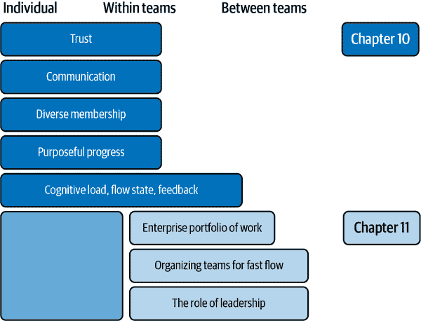
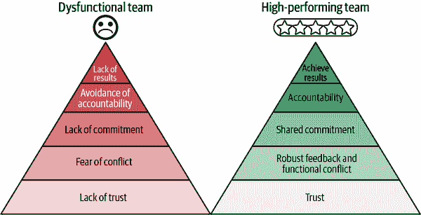
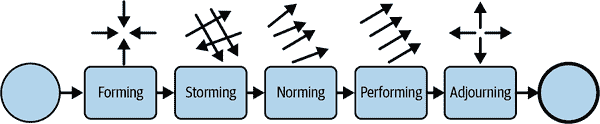
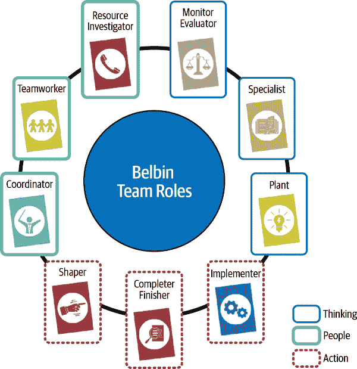
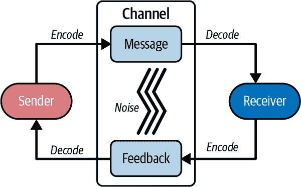
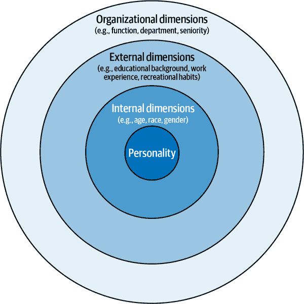
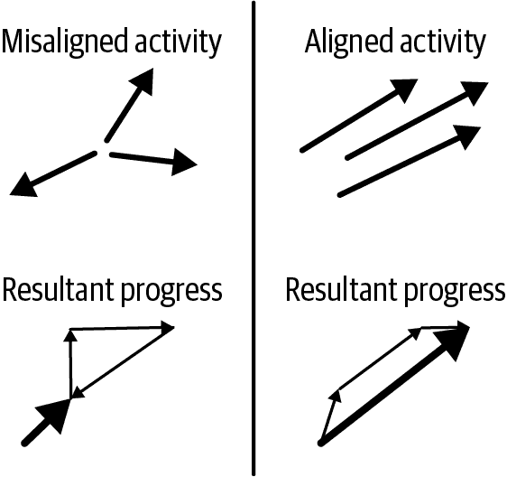
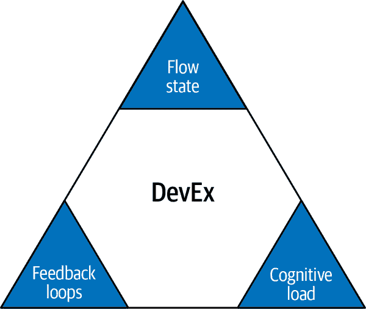

# 第十章：有效机器学习团队的构建模块

> 所有幸福的家庭都是相似的；每个不幸的家庭都是不幸中的独特存在。
> 
> 列夫·托尔斯泰，《安娜·卡列尼娜》

[安娜·卡列尼娜原则](https://oreil.ly/gUUdq)认为，成功必须有许多因素达到一致，并且任何一个因素的问题都可能导致失败。对于有效的机器学习团队也同样如此，他们必须处理组织中团队工作的所有复杂性，以及机器学习产品开发的复杂性。

但这个原则并不必然导致我们的努力失败。相反，由于团队运作的每个环境——市场、业务、组织结构、技术、数据——都是独特且动态的，因此成功没有标准化的方法，每个有效的团队必须发现并不断重新发现自己通向成功的独特道路。在本章中，我们分享了一些我们可以利用的工具，逐步朝着成功迈进。

正如达赖喇嘛所说：“幸福不是现成的东西，它来自于你自己的行动。”因此，个人、团队和整个组织实验、反思和适应至关重要，并且需要领导的指导和支持。我们在这里提出的有效团队的构建模块帮助我们在个人、团队和组织层面上朝着这些目标努力。实际上，我们可以把这些构建模块看作是瑞士奶酪模型（在第五章介绍）：我们放置的模块越多，我们的团队遭受重大问题的可能性就越小，即使遇到问题，它们也会更具弹性。

在整本书中，你已经看到忽视某些构建模块可能导致不构建正确的东西（第二章）、不正确地构建东西（第 3 至第九章），或者不以正确的方式为人们构建东西，这是我们将在本章中探讨的内容。在这一点上，《安娜·卡列尼娜》原则仍然应该贯穿我们对本书最后一英里（或两英里）的思考，以一种能赋予我们力量并指导我们行动的形式。

在本章中，我们将首先探讨面临机器学习团队的常见挑战，以说明我们许多人的真实经历——你可以称之为不幸的家庭，但只是暂时的！然后，我们将看看通过解决各种构建模块的问题来改善团队效能的技术。虽然我们涵盖的理论和技术将使任何团队受益，而不仅仅是机器学习团队，但我们注意到一些机器学习团队倾向于忽视它们，这对他们是不利的。如果你所在的团队没有达到可能的效果，请考虑每个这些模块的改进潜力。

组织心理学教授史蒂夫·科兹洛夫斯基认识到，“至少需要概念上接受系统的三个层面，才能理解团队的有效性...随时间而变的个体内部，团队内的个体，以及团队之间或上下文效应。”¹ 在本章中，我们将考虑有效团队内部的问题：个体和团队内部动态（科兹洛夫斯基的前两个层面）。我们将通过 [Team Topologies 模型](https://teamtopologies.com) 的视角来探讨 第十一章 中组织内更广泛的团队间动态 —— 科兹洛夫斯基的第三个层面。我们将通过观察领导者和领导力如何在整个组织中创造培养有效团队的环境来结束 第十一章 和本书。每个层面的路线图和构建模块在 图 10-1 中有所总结。

许多杰出的作者已经就这些反复出现的主题写了文章，我们将在整个章节中引用关键资源。本章的每个部分都值得一本（或多本）书来详细探讨。我们希望本章的广度能帮助您确定何处可以深入，并探索更多资源以提高团队的效率。

如果您迄今为止一直在跟随我们，我们假设这是因为您认识到还有更多可以做的事情来使您的团队更加有效。我们希望您能在这两章最后找到您所寻找的内容。

###### 图 10-1\. 有效 ML 团队和有效 ML 组织的构建模块，在第十章和第十一章中讨论。

# ML 团队面临的常见挑战

在这一部分，我们将通过一些虚构但相关的场景，来探讨 ML 团队面临的常见挑战。

本书早期我们已经讨论了 ML 从业者在团队工作中面临的技术和产品挑战。这些挑战同样适用于孤立的个人角色 —— 例如，在开发过程中长时间的反馈周期，以及在构建用户不想要的产品时浪费精力。当我们将具有潜力有效的个体放在一起组成团队时，会出现一整套新的挑战。这些挑战是由团队如何组织以及个体如何作为队友和人类相互交互所驱动的。

在较大的组织中，即使各个团队都拥有所有正确的构建模块，团队之间的互动方式以及工作如何流向每个团队也会影响它们的效果。我们将在下一章介绍一些更相关于组织的场景。

现在，让我们看几个场景，说明个体 ML 团队面临的常见挑战：

未显性的冲突方法

达纳和泰德在同一个团队。达纳是 TensorFlow 深度学习的热情支持者，赞扬其灵活性和广泛的工具集。另一方面，泰德则是 PyTorch 的坚定拥护者，重视其直观的设计和动态计算图。他们从未公开讨论过每个工具的利弊，或者哪种工具更适合团队的需求。

这种未明确的分歧导致了一组碎片化的代码库，其中一些项目使用 TensorFlow 开发，另一些使用 PyTorch。新团队成员安迪需要学习两种训练和模型服务的方式，而这些方式又因使用不同的深度学习框架的模型和代码库数量而复杂化。哦，还有团队尚未就其他任何事项达成一致和对齐的两套规范。

团队内部的专业领域壁垒

谭薇建立了一个简单的手工特征存储来解决关键需求，现在每次特征添加或更改时，工作都要交给谭薇。与此同时，达克莎花了一周时间试验和调整各种分类技术以提升模型性能，现在负责模型开发。

没有人想质疑这种安排。团队和所有外部利益相关者都接受了这一点，并且这种接受使现状得以延续。当达克莎度假时，团队必须等他回来解释为什么模型开始在分层测试中失败。当谭薇得到新的工作机会时，特征的更改会被阻塞一个月，直到找到替代者并进行适应。在这段时间里，查理真的想学习特征存储和模型开发，但只能限于管道编排的工作。最后，达克莎并不知道新毕业生拉妮刚刚完成了一项博士研究，解决了他正在处理的一些问题，因为拉妮总是在做数据清洗。

每个团队成员都专注于自己的特定领域，缺乏对同事挑战、意图和进展的认识。责任分工的隔离导致了多个不同的目标，团队无法相互帮助实现这些目标或者应对突发事件。因此，团队成员的工作不那么有回报，团队反应不那么迅速、不那么紧密、不那么创新，交付的质量也较低，韧性较弱。

缺乏共享的目标

米茨子的数据科学团队已经研究了一段时间使用现有数据的分析问题。团队为解决方案定义了详尽的规范，并将其提供给娜奥米的数据工程团队进行实施。

娜奥米的数据工程团队不理解米茨子的团队试图解决的问题，认为发现的一些新数据使得一些解决方案假设无效（例如数据漂移）。但米茨子的团队并不打算参与，因为他们认为这只是实施提供的规范的问题。

与此同时，Nadine 的平台团队正在为即将重组的业务部门开发功能，但他们不知道他们的工作是否会被采纳。

Naomi 和 Nadine 的团队都将很难找到能够认同的目标或目标。一些问题是普遍性的，比如数据漂移，而一些问题则特定于机器学习团队。如果没有目标和解决问题的自主权，这些团队很可能不会表现出色，士气随时间逐渐消退。

没有进展的感觉

Piotr 的团队正在开发一个新的机器学习平台。有一个长长的待发布项目清单。每次迭代，通过范围发现向这个清单添加新项目。目前还不清楚这些项目是否对首次发布至关重要，因为它们用技术术语描述，没有用户参与它们的优先级排序。

团队每次迭代都交付工作代码，但燃尽图显示没有实质性进展朝着首次发布迈进。团队不知道哪些项目是高优先级的，所以选择基于最有趣的项目来工作——从自动扩展到 Z 测试支持——这也导致团队决定每个项目的范围。从一周到另一周，团队失去了任何成就感，也没有协调活动的动力，因为他们没有确定哪些任务将使他们更接近目标的机制。利益相关者也看不到任何进展。这不是一个高效的团队。

缺乏多样性

Melanie 的数据科学家团队无法获取他们需要的数据，因为他们的技能范围狭窄，无法扩展到数据管道。Takeshi 的团队刚刚发布了一个歧视女性的模型，因为他们的训练和验证数据集中没有多少女性，并且 Takeshi 的全男性团队中没有人意识到这可能会对消费产品造成影响。

[多样化团队](https://oreil.ly/qvSqk)更擅长解决问题，更加谨慎地处理事实，产生更多创新解决方案，并取得更好的财务结果。如果你不在团队中优先考虑多样性，不仅他们可能效率更低，而且还更有可能在可预防的问题上失败。

没有共同点

Chin Sun 的团队是一个全新的全球远程团队。以前，有些是开发人员，有些是数据工程师，还有些是机器学习工程师。每个人都有不同的做事方式，对流程和工件有不同的称呼。

就像一个画测字游戏中，你的搭档无法猜出螺旋和交叉线代表什么一样，这个团队在沟通和建立共享理解方面遇到了困难，导致了延迟和质量问题。

然而，如果没有其他问题，这是最容易解决的挑战之一。通过深思熟虑的社交活动建立共享经验和找到共同兴趣，以及通过在安全失败的环境中及早且经常地向生产交付价值来对工作方式进行调整，将快速释放多样团队的有效性。

不能失败，甚至不能提问

在休的团队中，有一些直言不讳的数据科学家，休喜欢他们在内部保持高调，因为他认为这对他和他的团队在利益相关者中有好处。因此，他容忍他们向团队发号施令，不断展示他们的数学才能。杰克是一位业务分析师，业余时间学习 Python 和机器学习，他发现模型训练代码中可能存在一个错误。似乎一些训练数据被包含在验证集中。数据科学家最近对他们对模型进行了显著改进的变更进行了大规模的展示，展示了许多令人印象深刻的方程式。在性能提高的同时引入了这个 bug。他们的公司将很快向市场发布这一重要消息。

杰克认为自己一定是错的，认为他无法理解数据科学家所做的事情。他担心会因提出关注点而遭受嘲笑和指责。即使杰克是对的，他也害怕休已经致力于这个公告，他会找到一种方法将责任推到杰克身上，而不是承认团队的错误，那提出疑问还有什么意义呢？

这纯粹是虚构的，但它展示了一个不安全的失败甚至不能提问的环境可能会是什么样子。当人们害怕因提出关注点而遭受负面后果，或者承认他们缺乏知识（也许疑似的 bug 是因为一个数据科学家不想通过询问他们以前未使用过的 scikit-learn 功能来减少他们的声誉而引入的），他们会将自己的想法深藏不露。这会导致团队成员的压力增加，抑制其成长，并导致错误和知识空白被隐藏和随着时间放大。这绝不是一个有效的团队！

如果你已经从事机器学习一段时间，或者如果你是新手，甚至如果你在任何形式的团队中工作过，你可能会遇到一些这些挑战。幸运的是，关于团队如何理解和解决这些挑战，并进行内部调整的丰富现有文献和智慧，这是下一节的重点。

# 团队内部有效性

在本节中，我们将考虑团队可以使用的内部构建模块，以解决问题并提高其效果。在本书中，我们一直在探讨团队有效性的系统、实践和流程。我们认为这些元素是重要的构建模块，从更机械的考虑扩展到更人文化的有效团队考虑。

具体来说，在本节中，我们将讨论以下构建块：

+   信任

+   沟通

+   多样化的成员

+   有目的的、共享的进展

对于每个构建块，我们将参考一些核心的、已建立的模型和文献，并提出针对中心概念的建议。您还会注意到这些模型和构建块有重叠的元素；您将开始看到如何将构建块相互锁定和相互增强。请留意它们之间的联系。

尽管这些构建块对于任何从事复杂和模糊工作的团队都是共同的，我们还将特别强调它们为何可能相关，以及如何适用于机器学习团队。

在团队合作中，你可能会采用更多的视角和模型，但在我们的工作中，我们发现这些构建块是一个很好的起点。好消息是，每个团队成员都可以影响这些维度，特别是有机发展或正式指定的领导者。

## 信任作为基础构建块

> 如果要实现任何有意义的事情，目的和故意必须与行动的勇气结合起来。
> 
> Patrick Lencioni，《团队五大功能失调》

Patrick Lencioni 的《团队五大功能失调》（Jossey-Bass）是一本探讨团队动态的领导力书籍，首先向我们展示如何发现团队失败或团队功能失调。坦率地说，谁没有经历过存在不信任、紧张甚至沮丧的团队动态？Lencioni 描述了一个金字塔形的心理模型，总结如 图 10-2 所示。这个心理模型的基础构建块是团队内的*信任*。在缺乏信任的情况下，我们无法真正促进围绕思想进行健康和尊重的冲突，建立对决策和行动计划的集体承诺，或发展一种负责任的文化。没有这些支持，一个团队将无法取得成果。

###### 图 10-2\. Lencioni 团队五大功能失调，展示功能失调团队行为与高绩效团队行为的对比（来源：根据 Patrick Lencioni 的《团队五大功能失调》改编，经授权使用）

你可能会想：“好的，团队信任很重要。让我们组织一个临时的团队建设活动就算完成了！”但实际情况并非如此。培养团队信任不是一劳永逸的活动；建立信任需要时间。这需要领导层的倡导，并要求我们具备一定水平的自我意识，以及对群体动态的认识。

你可能在建立机器学习团队中的信任过程中遇到了一些挑战。个人带着不同的学术和职业背景、观点和技能加入团队，这些需要集体组装成一个团队。也许一些机器学习从业者没有在强烈跨职能协作的产品交付环境中有过经验。产品和项目风险高，结果被期望快速出现，而错误可能影响重大。然而，执行是具有挑战性的，当团队中必须对齐许多复杂的活动并且许多其他因素（如数据质量）超出团队的控制时，很容易把责任推向别处。人们可能会遭受“冒名顶替综合症”，或者感到有一个期望要成为房间里最聪明的人。

让我们看看通过脆弱性如何解决这些挑战。

### *Daring Greatly*

Lencioni 的模型关注团队成员之间的信任。它没有探索我们必须对自己有信任以参与到 Figure 10-1 中描述的行为中：寻求帮助的能力、分享弱点、互相帮助，并相信每个人都在尽力。 （Lencioni 的模型进一步没有关注团队之间的信任。我们将在查看 Chapter 11 中的团队的团队时处理这个问题。）

Brené Brown 的书籍*Daring Greatly*（Gotham Books）探讨了为了避免羞耻感而需要感觉无懈可击的需求，从而阻止我们对自己的脆弱感到舒适。羞耻的根源是恐惧和稀缺感。稀缺感指的是“永远不够”的感觉，可以是情感上的、身体上的、财务上的，也可以是社交上的。在机器学习团队中，很容易用“聪明”来填补这个空白。

时间是一种常见的被视为稀缺的例子，因此我们中的许多人害怕，“我从来没有足够的*时间。”* 例如，没有足够的时间进行配对编程和完成工作，没有足够的时间进行反馈和回顾，或者进行 1:1 的对话。因此，当我们开始相信我们从来没有足够的时间时，我们与团队其他成员的互动会受到影响。这可能表现为我们在站会上变得不耐烦，因为我们认为时间“超时”了。当我们的行动和行为越来越受到恐惧感和稀缺感的影响时，我们最终会像 Lencioni 描述的五个功能失调一样持续下去。

Lencioni 将脆弱性描述为建立信任的一种手段，这与 Brown 认为感觉无懈可击的需求是有问题的观点是互补的。在 Lencioni 的背景下，*脆弱性*意味着队友们应该准备向彼此分享一些他们的弱点、失误和恐惧。这是与彼此作为人类伙伴以及队友建立连接的一部分。

对我们许多人来说，与一群新人一起开放自己的脆弱之处并不容易。虽然我们对之前提到的团队建设活动有些轻率，但是如果经过深思熟虑——认识到每个人的社交偏好和兴趣——团队建设活动*可以*奠定共享经历、兴趣和共情的基础，从而降低脆弱性障碍。领导者也可以示范脆弱性，例如简单地说，“我不知道”，然后建设性地追问，“我们如何找出答案？”

通过理解各种团队动态模型，我们可以进一步建立自我意识和同情心，以便更好地理解我们的队友。幸运的是，许多前辈已经为我们收集和提炼了各种团队经验的艰苦工作。

在接下来的部分中，我们将分享一些管理理论和框架的选择。这远非一个全面的集合，但我们发现这些选择有助于拓宽我们的认识。这些团队行为模型使我们能够从不同和更客观的视角看待个人和团队动态。这使我们能够建立对他人经验的认识，同时更好地理解我们自己对某些动态的贡献。这些框架还为我们提供了共同的语言和一系列潜在的策略，用于集体解决团队功能失调。ML 团队可以通过复杂的工作、多样化的专业化和高期望将这些框架提升到更高的水平。

我们设计了一个简单的练习来帮助你记住这些框架：对于我们介绍的每个理论，考虑它如何解释或与你当前或最近工作中的一次经验相关联。

作为热身练习，考虑[理论 X 和理论 Y](https://oreil.ly/2NcCc)，也被称为指导型和宽容型管理（见图 10-3）。理论 X 认为工人本质上懒惰，管理的角色是指导任务并提供外部动机，而理论 Y 则认为工人本质上有能力和动力，管理的角色是消除阻碍他们工作的障碍。

而这里是你的第一个练习：*在 ML 领域的管理与你第一份工作（可能是酒店业或零售业）中的管理是否有所不同？*

###### 图 10-3\. 理论 X 和理论 Y 的记忆装置——一个拒绝工作的人（“X”）和一个欢呼工作机会的人（“Y”）（来源：根据[Martin Adámek](https://oreil.ly/2NcCc)的图像改编，采用[CC BY-SA 3.0](https://oreil.ly/tOJq1)许可）

### Tuckman 小组发展阶段

你会认为一个新组建的团队比已经共事至少一年且没有经历人员变动的团队更有效吗？为什么？

[图克曼小组发展阶段](https://oreil.ly/M1YyB)提出了一个理论：团队的有效性可以与团队发展的阶段或阶段相关联（见图 10-4）。布鲁斯·图克曼将这五个阶段描述为：

第一阶段：形成

一个新团队刚刚成立，或者新成员刚刚加入。团队成员首次见面，了解他们的角色和责任，并在试图融入团队时谨慎行事。

第二阶段：风暴

随着团队成员开始表达他们的观点并巩固在团队中的位置，潜在的冲突浮出水面，紧张局势加剧。

第三阶段：规范化

冲突开始解决，团队成员欣赏彼此的优势，并尊重权威。

第四阶段：执行

小组作为一个有凝聚力的单位运作，并且不需要来自团队领导那么多的指导。

第五阶段：解散

团队原始目标已经完成，每个人可以继续进行新的项目或加入新的团队。

###### 图 10-4\. 图克曼小组发展阶段（来源：改编自[Diogo Nicoleti](https://oreil.ly/f9pXC)的图像，使用[CC BY-SA 4.0](https://oreil.ly/JlwN5)许可）

图克曼的理论认为，作为一个团队，我们通过这些阶段前进。通过有意识和情境领导（在第十一章中涵盖），我们可以理解这些阶段中的强烈情绪反应。意识到这些典型的阶段，我们更有可能将团队问题考虑到系统层面，而不是让它们降低团队成员之间的信任。需要注意的是，随着图克曼的模型应用和审查，已经提出许多事件（例如新成员加入）可能会导致即使是长期存在的团队也回到早期阶段。

在长期存在的团队环境中，如机器学习产品团队，形成和解散可能不如项目驱动的环境频繁。然而，即使是在追求长期存在的团队的情况下，数字业务的非常动态的性质意味着团队实际上（有时甚至频繁地）可能需要重新组合。团队形成的过程不应被视为效率的障碍；相反，对这个过程的深思熟虑甚至可能被视为[竞争优势](https://oreil.ly/Q-dBf)。

*你认为哪个阶段最能描述你的团队？为什么？*

### 贝尔宾团队角色

> 人们参与的行为类型是无限的。但是对团队绩效有益的行为范围是有限的。这些行为被分成一组相关的群集，术语‘团队角色’就是应用于这些群集的。
> 
> Meredith Belbin 博士

[贝尔宾团队角色框架](https://oreil.ly/L4ULT)定义了团队角色的九种原型（见图 10-5） 。这些原型根据行为属性进行分类，包括：

+   人际/社会角色：

    +   资源调查员

    +   团队合作者

    +   协调者

+   思维角色：

    +   植物角色

    +   监控评估者

    +   专家

+   行动角色：

    +   塑造者

    +   实施者

    +   完成者

###### 图 10-5。九种 Belbin 团队角色（来源：[Belbin 团队角色](https://oreil.ly/L4ULT)，经许可使用）

资源调查员等角色寻找并纳入新的想法。植物角色创造性地解决问题。而完成者角色则完善工作并仔细检查错误。没有哪个角色比其他更好或更差；所有角色都对有效的团队做出贡献。

个体会因问卷测评而默认采用某些原型行为，这可以确定行为。然而，在一个给定的团队中，个体可以随时或在不同时间扮演多个角色。

在 ML 团队中，资源调查员可能乐于提出新的技术，比如强化学习，而不考虑项目的状态，总是认为即使技术方向已经确定，拥有另一种选择也更好。这可能会与完成者角色发生冲突，后者专注于引导团队按照当前监督学习的轨迹进行下一个版本的发布。然而，通过足够的自我意识，这种冲突很容易得到调解，甚至成为团队轻松愉快的来源。

了解您的默认角色对于识别这种行为何时对团队无益非常有帮助。当团队工作停滞时，建议每个人都喝杯咖啡，重新恢复新鲜。在撰写本书期间，Belbin 团队角色框架帮助我们记住在关键时刻发挥我们内在的完成者角色，即使我们的自然倾向是不断播种新思想！积极监控和调节您们每个人扮演或未能扮演的角色，将使团队更加高效。

在[Belbin 团队角色框架](https://oreil.ly/L4ULT)中识别您的默认角色是一个很好的团队练习。

您已经看到信任是高效团队的基础构建模块以及 ML 团队面临的挑战，您已经探索了在系统性团队问题存在时建立信任的一系列个人和团队模型。让我们探索有效团队的下一个构建模块：沟通。

## 沟通者

沟通在团队中是一个关键的基石，有时对我们所有人都是一种挑战。在机器学习团队中，由于存在许多不同的专业化，沟通可能特别困难。您是指产品的“特性”还是数据的“特性”？尽管普通人说“平均”，您是指“均值”吗？还有，记住，ML 中的精度可能比准确性更重要！（我们希望本介绍中的双关语有助于而非妨碍我们的沟通；最后一个提到了类不平衡的问题。）

交流是我们可以通过专注和框架指导来改善的另一项技能。科技行业的典型团队有许多喧嚣的通信渠道可供选择，这引发了一个问题：使用哪些渠道进行沟通？典型团队还会遇到起伏，提出和解决琐碎和关键问题，沟通在所有这些场景中都能够良好运作至关重要——尤其是在困难的对话中。让我们深入探讨一些关键框架。

### 通信模型

技术背景的读者可能会喜欢那些反映数字通信元素的人际交流模型。图 10-6 展示了这个概念，来源于兰迪·富吉欣的书《*创建沟通*》（Rowman & Littlefield Publishers），尽管它很可能来自“信息论之父”克劳德·香农的工作！许多通信模型包括这样一个观点：发送者对消息进行编码，并使用通道将其传输给接收者。噪音可能会扭曲消息。然后接收者解码消息并给出某种形式的反馈，发送者又必须解码这个反馈。

###### 图 10-6\. 许多人际交流模型可以映射到数字通信的过程（来源：基于[维基百科的 Phlsph7 的图像](https://oreil.ly/1Cgu8)，根据[CC BY-SA 4.0](https://oreil.ly/Hq5C_)使用）

当团队内的沟通出现问题时，你可以将其视为一个技术调试问题！让我们来看一个简单的场景：想象一下，你没有收到对你认为重要的电子邮件的回复。首先，试图识别问题的根源。是你在编写（*编码*）邮件（*消息*）时对接收者共享上下文的假设有问题吗？编码的消息是否不清楚、矛盾或不完整？是邮件通道中的*噪音*导致人们忽略邮件吗？是接收者在阅读（*解码*）你的邮件时缺少了一些重要的背景信息吗？还是你的许多收件箱规则过滤掉了反馈？有了关于问题根源的假设，你可以隔离潜在问题，并尝试（再试）用另一种方法。

在这个框架中你可以做的一个关键决定是在传达时选择哪个或哪些渠道。对于复杂、细微的可能会被误解的信息，面对面的对话（如果可能的话）远远优于电子邮件。然而，这些对话没有留下一个可以轻松与其他队友分享的记录²，所以你可能希望通过电子邮件跟进行动，而不是进行多次一对一的互动。这两种渠道对于完全通过消息平台异步工作的远程团队来说可能听起来非常过时，这些平台包括各种机器人和系统集成。然而，富士申的模型仍然可以帮助我们分析任何渠道上的沟通。

我们理解个人可能根据工作地点、时间、内向或外向等因素有他们自己的渠道和论坛偏好，团队在前期建立这一点是有帮助的。利益相关者和外部方可能也有特定的渠道要求，你的团队需要遵循，因此团队沟通的现实始终是多渠道的。

我们也在第六章中看到数据可视化的价值。在机器学习项目中，我们经常需要就数据进行沟通。无论通过任何渠道、以任何意图向任何受众沟通数据，考虑到[数据可视化](https://oreil.ly/vetxm)可以极大地增强你的信息传达中可解读的信号。创建和消费数据可视化是团队应该发展的技能，以帮助沟通。

### 关键对话框架

沟通将进一步改善，尤其在关键时刻，如果将其视为完全的人际交往。[关键对话框架](https://oreil.ly/5uy90)为团队提供了改善沟通的强大工具，强调如果处理得当，一些令人不适但重要的对话可以对你们的共同工作产生巨大影响。

从关键对话框架中我们想要强调三个关键点：

暴力和沉默都是无益的

避免沟通不良与不沟通一样糟糕。在《关键对话》（麦格劳希尔）中，作者将*沉默*和*暴力*放在沟通好坏的两个极端，而好的沟通在中间。在有效的团队中，“如果你没什么好话说，就不要说话”的古老格言不是沟通的最终结论。何时以及如何提出困难问题需要进行重要的重新评估，而《关键对话》为此提供了框架。

辨识会变得关键的对话时机

当利益重大、意见不一致且情绪强烈时，对话就会变成“关键对话”。我们的蜥脑并没有为这些情况做好准备。浸泡在进化到野外环境的荷尔蒙中，我们进入战斗或逃跑模式，而不是用智力和同理心作出反应。然而，如果我们意识到这些时刻，我们可以抑制我们的本能反应，并使用框架来进行有效对话。

如何进行关键对话

我们鼓励您参考《关键对话》一书，全面了解如何进行关键对话。我们总结该方法的关键元素如下：

+   保持关注你们共同努力实现的结果，并通过观察撤退或破坏迹象，维护一个安全空间。

+   了解自己的动机，并准备通过分享他人愿意接受的故事来“探索自己的道路”。

+   以真诚的同情心和同情心探索他人的道路。

+   将这种沟通过程视为贡献到“共享意义池”的过程。

+   准备充分，能够从共同理解迈向共同行动。

关键对话框架提供了更详细的指导和学习资源。机器学习产品开发环境是进行关键对话的肥沃土壤，其中利害关系重大，意见不同，比大多数技术人员愿意承认的情绪更加丰富。如果你认为你可以更好地处理上次那场被认定为关键的对话，那么这个框架值得进一步探索。

### 反馈中的坦诚

即使谈话并不关键，我们也需要理解并欣赏 Ed Catmull 在《创意公司》（Transworld Publishers Limited）或 Kim Scott 在《激进坦诚》（St. Martin’s Press）中描述的“坦诚”概念——在这些讨论中，我们强调的是坚实、尊重和客观地集中在思想和产品上，而不是个性。我们发现“坦诚”概念对于团队交付反馈是一个有益的框架。

请注意 Lencioni 模型中坦率反馈与生产性冲突的相似之处。通过坦诚的反馈，一个团队可以从非常初级的阶段开始不断重塑其产品，逐步完成更加有价值的阶段。正如 Pixar 的 Ed Catmull 所说：³

> 诚实对我们的创作过程至关重要。为什么？因为在早期，我们所有的电影都很糟糕……而且这样是应该的。创意必须从某个地方开始，我们坚信坚实、坦诚的反馈和迭代过程的力量——反复修改，再修改，直到一个有缺陷的故事找到它的主线，或者一个空洞的角色找到它的灵魂。

机器学习模型和产品的初始版本同样简陋，并同样受益于坦诚的反馈和修订。

因此，我们看到沟通和信任是相互增强的基石。沟通也是将*多样化团队*团结在一起的胶水，并是在能够实现*共同进步*的团队中进行协作的基础。

## 多样化成员

多样性有许多维度，正如[多样性之轮](https://oreil.ly/G_MRQ)所示（见图 10-7），由玛丽莲·洛登（Marilyn Loden）和朱迪·罗森纳（Judy Rosener）在 1990 年代初期开发。除了个性维度外，个体多样性的其他主要（或内部）维度包括年龄、民族遗产、种族、性别、性取向以及精神和身体能力。次要（或外部）维度涉及个体与社会关系，包括地理位置、工作经验和教育。三级（或组织）维度描述个体与组织的关系，包括角色、部门和资历。

###### 图 10-7\. 多样性之轮列举了构成多样性的许多维度（来源：改编自[Diversity Wheel, Loden et al. 1991](https://oreil.ly/G_MRQ)）

### 主要和次要维度：社会人口统计多样性

已经证明，多样化的团队在解决问题和处理事实上更加出色，并且更加仔细地产生更具创新性的解决方案和[更好的财务结果](https://oreil.ly/TKFWn)。如果你不把多样性作为团队的优先考虑，它们不仅可能效果较差，还更有可能在可以预防的方式上失败。

简而言之，多样化的团队在构建机器学习产品方面表现更佳，因此有效的机器学习团队应当优先考虑多样性，而不仅仅是个体的深度技术能力。根据我们的经验，多样化的成员通常能让团队从更多角度考虑问题，并因此找到更好的解决方案，而不像一个单一团队那样形成信息封闭的空间。

作为机器学习团队的成员或领导者，您需要与许多组织职能部门合作，包括人才招聘、人力资源、学习与发展，当然还有多样性、公平与包容，以塑造和执行您的多样性目标。虽然这听起来可能令人畏惧，但回报丰厚且值得努力，如果您开始对话，会发现很多愿意合作的人。我们希望我们已经为您为何应优先考虑多样性提供了一个简要的案例，并提供了一些初始的指导方向。

### 三级维度：功能和角色多样性

我们已经审视了贝尔宾的九种团队角色，这些角色是团队中个体行为的*浮现*模式，以及为何我们应该有意识地多样化这些角色。在第一章中，我们还介绍了垂直切片、跨职能团队的概念，这些团队包括许多不同的*职能角色*（这些角色也对应于 Loden 和 Rosener 确定的多样性的三级维度）。对于任何给定的团队来说，所需的职能角色将由团队所做的工作类型以及其与组织中其他团队的互动来确定，我们将在下一章更详细地讨论这一点。目前，我们将考虑一个团队的多样化角色，该团队正在全面交付产品特性，利用内部和外部平台，以便引发客户反馈并满足客户期望。

在序言中，我们确定了本书旨在帮助的关键人物：

+   数据科学家和机器学习工程师

+   软件工程师、基础设施工程师、架构师

+   产品经理、交付经理、工程经理

此外，跨职能团队可能包括许多其他职能角色，以便提供全面的价值。为了本书设计的关键人物的利益，我们在表格 10-1 中提供了更多示例。

表格 10-1\. 机器学习团队中的进一步跨职能角色

| 跨职能角色 | 角色目标 | 缺席时的症状 |
| --- | --- | --- |
| 用户体验研究，用户体验设计 | 理解用户需求，并验证解决方案设计能否满足这些需求 | 未知或产品市场匹配差 |
| 产品经理 | 制定产品愿景、战略和路线图；优先考虑功能以与业务目标保持一致 | 缺乏引人注目的产品方向，客户需求、业务目标和开发工作之间的不一致 |
| 业务分析师 | 促进业务利益相关者与交付团队之间的对话 | 对需求或其优先级的模糊性 |
| 领域专家（SME） | 分享特定业务或知识领域的深度专业知识 | 大量的猜测、假设和观点；可能由于错误假设而需要重做 |
| 数据工程师 | 通过适当的治理将数据从 A 传输到 B | 数据访问困难或缓慢，或难以理解其适用性 |
| 质量分析师 | 帮助团队理解并确保其交付成果的质量 | 测试策略不明确，缺陷和事故频发；导致需重做 |

你的机器学习团队可能并没有每个角色都有个人，因为如果有的话，很可能会超过五到九名成员的目标规模，我们将在第十一章中讨论这一点，因此结果会非常笨重。如果你的团队成员拥有[T 形技能](https://oreil.ly/IJfGf)（例如，一位数据科学家也可以兼顾数据工程师或业务分析师的角色），那么这些人可能能够扮演多个角色，从而既得到小团队的好处，又获得跨功能角色的覆盖。

给定这些角色是交付端到端价值的一部分，如果它们不是你的机器学习团队中的固定成员，你可能会通过暂时借用人员或者因为这些角色由上游或下游的其他团队中的某人扮演而与它们互动。思考如何有效地使这项工作运行是值得的，在第十一章的团队拓扑部分我们提供了相关模式。

机器学习团队通常还需要个体的专门化*活动*关注—持续性或离散期间—例如研究机器学习技术以确定提出解决方案的可行性和可行性，该研究的结果在事先很难预测。这种类型的研究将与更可预测的产品开发活动形成对比（例如，对于典型的 Web 应用程序），后者在不可行性风险更低、可行解决方案更多和交付节奏更快方面有所不同。由于这些活动需要的专业知识较少，因此在团队中分享这些活动要容易得多。虽然在机器学习中是必需的，但专门化的研究不应该变成孤立的；我们应该通过配对、审查和展示等团队已建立的实践来保持对这些活动进展的沟通和对齐。

重点不是在这里收集一组详尽的角色，而是强调多样化的功能角色——除了主要和次要维度的多样化个体之外——作为有效团队的一个构建模块。根据我们的经验，在动态环境中，多样化的团队能够更有效地交付，因为他们能够识别和解决更多本来可能会产生风险或阻碍进展的问题。

当团队成员理解其他角色的需求时，这有助于建立共鸣并改善团队内工作的流动。在这方面，多样化的团队将相互促进和支持。我们将在接下来的章节中进一步了解这一点，展示这一内部建设模块如何加强其他模块。

## 有目的的、共享的进展

> 了解什么能够促进和支持进展，以及相反的是什么，结果证明这是有效管理人员及其工作的关键。
> 
> 特蕾莎·M·阿马比尔和史蒂文·J·克雷默，《小胜的力量》(https://oreil.ly/-N2Sg)

在他们的书《*进步原则*》（Harvard Business Review Press）中，作者特蕾莎·M·阿马比尔（Teresa M. Amabile）和史蒂文·J·克拉默（Steven J. Kramer）展示了[小胜之力](https://oreil.ly/-N2Sg)对提升我们在工作中的内在生活质量的影响。通过研究来自七家公司 26 个项目团队中 238 名参与者的近 12,000 篇日记条目，研究人员能够将各种因素与内在工作生活质量的提高或降低——满足感和成就感或挫败感和悲伤感联系起来。

参与者每天的感受最重要的因素是是否在有意义的工作中取得进展。第二重要的因素是工作者是否感到受到催化剂（使系统和流程能够）的支持，或者受到抑制剂（支持不足或积极阻碍完成工作）的束缚。

在整本书中，我们研究了良好的团队流程、实践和工具如何作为催化剂促进优秀的工作，而糟糕的流程、实践和工具则作为抑制剂。催化剂可以是像`scipy.spatial.KDTree`这样的优秀模块的访问；抑制剂可能是等待数天或数周才能获取数据。《进步原则》提供了另一种有效工作系统对有效机器学习团队至关重要的视角。

十多年前的这项研究与我们稍后在本章讨论的工程效率和开发者体验的最新研究保持一致。这两组研究发现，流状态、反馈循环和认知负荷都是影响积极工作体验的因素。

阿马比尔和克拉默认识到，工作应该是有意义的，或者说是有目的的。像机器学习这样的复杂知识工作具备有意义工作的先决条件，但这可以通过将机器学习目标与更广泛的组织目的联系起来来增强。如果一个组织的目标与员工不 resonant，或者机器学习目标与该目的无关或反其道而行，那么为了知识的训练而进行机器学习将很快失去其意义。另一方面，根据组织的目的制定独特的约束条件，创造具有吸引力的挑战，以引导团队创新的机器学习解决方案。

确实，当解决复杂问题与引人入胜的组织目标一致时，有效团队领导意味着让步。这在丹尼尔·平克（Daniel Pink）的书《*驱动力*》（Riverhead Books）中有所体现。平克指出，激励从事复杂任务的工作者的三个关键因素是：自主性、精通和目的。在这些场景中，外在奖励可能无关紧要，甚至可能适得其反。自主性是自主自主自主，精通是个人技能进步的累积效果，而目的则是为了贡献于某种更大的事物。阿马比尔和克拉默承认：“对于进步原则的运作，工作必须对从事该工作的人有意义。”

对于个体来说，进展和目的是重要的动力源。但如果个体为了许多不同的目标而工作，那么作为团队，很难看到进展，因为*进展是一个向量*，如 图 10-8 所示（注意与 图 10-4 的相似性）。这意味着，如果每个人都朝着同一个方向进步，团队的进展将超过任何个体贡献的总和。但如果每个人都朝着不同的方向进步，那么最终结果就不会有实质性的改变，而且有些努力可能会抵消其他人的努力。当个体朝着不同的目标工作时，我们很明显地意识到我们不再是一个团队。当努力是一致的时候，结果比努力近似的情况要好得多。

###### 图 10-8\. 进展作为向量

在机器学习团队中，这种不一致可能表现为不同的技术堆栈、错误权重或团队成员之间不同的产品优先级。有些情况下，我们希望并行试验多种方法（称为“比较试验”），但这些试验应该是有意设计和限时进行，而不是无限期地持续。

当个体作为团队成员共同合作时，他们成为彼此的*催化剂*。但当个体只为自己的目标而工作时，他们对彼此的影响最多是中性的——更有可能是互相*抑制*。因此，当团队成员之间的进展是一致的时候，我们看到更多的进展和更多的催化剂。当进展不一致时，我们看到的进展较少，可能会有抑制剂存在。这说明为什么共同目标的共享进展是有效团队的关键构建模块。

您已经看到了一些构建模块和它们背后的详细研究，导致了多方面的行动框架。这些都值得学习，并将帮助您成为更好的团队成员或团队领导，正如它们已经帮助了我们一样。但好消息是，在采取行动之前，您不需要详尽研究这些信息。有一些非常简单的策略可以同时解决许多这些构建模块，而且您可以立即付诸实施！

让我们看看其中一些策略。

## 构建有效团队的内部策略

此部分并不打算提供解决团队功能障碍的指导性理论方法。相反，表 10-2 提供了在实践中已被证明有效的策略。我们在前几章已经介绍了许多这些策略。到目前为止，我们所讨论的框架和理论提供了有用的思维模型，以及为什么这些策略有效的一些基础。

表 10-2\. 构建有效 ML 团队的内部策略

| 策略 | 描述 | 主要目标 | 理想状态 |
| --- | --- | --- | --- |
| [团队宪章](https://oreil.ly/FAWjC) | 团队成员之间价值观和承诺的描述 |

+   信任

+   多样性

| 真实、可实现和相关的承诺 |
| --- |
| [个人画布](https://oreil.ly/HUw0q) | 捕捉个人目标的 A3 管理技术 |

+   有目的的、共享的进步

+   多样性

| 与即时工作、兴趣和长期职业相关的目标 |
| --- |
| [工作的视觉管理](https://oreil.ly/0ai1L) | 使用看板或墙板跟踪完成阶段和任务上的协作 |

+   沟通

+   有目的的、共享的进步

| 看板是进展和协调的真实来源，根据需要进一步积极的[信息辐射器](https://oreil.ly/mg8gg) |
| --- |
| [迭代规划](https://oreil.ly/AvPX4) | 对下一个周期的工作进行协调 |

+   沟通

+   有目的的、共享的进步

+   信任

| 团队内部和利益相关者之间关于目标的清晰性，在计划中保持灵活性 |
| --- |
| [展示](https://oreil.ly/pDhnr) | 定期向利益相关者展示解决方案 |

+   沟通

+   有目的的、共享的进步

+   信任

| 利益相关者可以与之交互的工作软件；快速将反馈纳入产品需求中 |
| --- |
| [速反馈](https://oreil.ly/Q1z76) | 团队成员之间快速轮换中的反馈分享 |

+   沟通

+   信任

| 团队成员（可能在之前感到担忧）因认可和成长机会而感到振奋 |
| --- |
| [回顾](https://oreil.ly/l9YFX) | 定期检查工作进展和存在的问题 |

+   信任

+   有目的的、共享的进步

| 安全的环境，对工作系统进行可操作的更改 |
| --- |

现在，让我们补充这些关于构建有效机器学习团队的理论和技术，以提高工程有效性的技术。

# 通过工程有效性提升流程

尽管我们到目前为止讨论的技术适用于任何团队，但我们还特别强调了*机器学习*团队的特定考虑因素。正如我们所讨论的那样，机器学习团队与软件工程团队（加上一些附加项）共享许多相同的特征，因此工程有效性的方法通常也适用于机器学习团队。

机器学习产品开发与软件工程的不同之处在于发现活动的广度（导致适用知识）和交付活动的程度（导致可维护的工作软件）。当然，发现是软件交付的一个组成部分，因为并非所有答案都是*先验*知识，但机器学习产品的特点在于需要大量的发现活动，以确定产品是否可行和可行，这基于可能会被策划的数据。

对这些数据的策展还需要复杂的数据供应链，这些供应链引入了额外的依赖关系、努力和故障模式，无论是在发现还是交付中都是如此。相比之下，主要或专门处理操作数据的软件系统最小化或避免了这种分析数据供应链的复杂性。然而，关于软件工程的进一步适用性，我们注意到现代数据工程实践旨在尽可能地使这些数据供应链“软件定义”。因此，我们发现软件工程仍然是机器学习产品开发的一个有用框架，带有这些警告。

近年来，关于开发者体验（或 DevEx）和工程效能的研究已经产生了一些关于提高或阻碍价值流动的因素的见解。在一篇研究论文中，[“一个可操作的框架来理解和改进开发者体验”](https://oreil.ly/9r4aA)，作者们识别出超过 25 个社会技术因素影响了 DevEx。例如，中断、不切实际的截止日期以及开发工具中的摩擦都会对 DevEx 产生负面影响，而明确的任务、良好组织的代码和无痛发布则会改善它。（如果你能理解你刚刚读到的句子，请给这本书一个高五。）一个常见的误解是，DevEx 主要受技术和工具的影响。然而，这篇论文与“小胜利的力量”类似，表明了项目明确目标和团队在心理上的安全感对开发者的绩效有重大影响。⁴

在另一篇论文中，[“DevEx: 什么真正推动了生产力”](https://oreil.ly/yLDNq)，同样的作者与 Nicole Forsgren 进一步将这些因素概括为三个核心维度：反馈循环、流动状态和认知负荷（见图 10-9）。⁵

###### 图 10-9. 开发者体验的三个维度（来源：改编自[“DevEx: 什么真正推动了生产力”](https://oreil.ly/yLDNq)中的一幅图，作者为 Abi Noda、Margaret-Anne Storey、Nicole Forsgren 和 Michaela Greiler）

让我们来看看开发者体验的三个核心维度。

## 反馈循环

典型的开发者或机器学习实践者的一天包括许多依赖于工具和人员反馈的任务。例如，机器学习实践者可能会花费大量时间等待模型训练的完成。稍后，他们可能会等待代码审阅者的批准，再之后，等待运维团队部署模型。所有这些等待都阻碍了他们的进展能力。

缓慢的反馈循环中断了开发过程，导致开发人员等待或决定切换上下文时出现挫败和延迟。当系统（例如生产警报）或人员（例如代码审查意见）的反馈在某个不可预测的时间返回并需要立即注意时，缓慢的反馈循环会引起额外的中断。相比之下，快速反馈循环允许开发人员快速完成工作并测试他们的想法，减少摩擦。

在我们的书中，我们详细阐述了跨学科缩短反馈循环的许多技术：

产品

原型测试、客户研究和数据产品画布等实践，帮助团队以比构建实际软件和 ML 解决方案更经济有效的方式发现客户的痛点和需求（详见第一章和第二章关于产品与交付实践与机器学习的内容）。

工程与机器学习

自动化测试、配对编程和 CD4ML 等实践，为机器学习从业者在代码更改时提供快速反馈。概念验证也有助于在投入工程努力之前验证机器学习解决方案的可行性（详见第一章及第 3 至第九章关于有效依赖管理和 ML 运维与持续交付的内容）。

交付

采用用户故事与明确的验收标准、定期展示和配对编程等实践，将机器学习从业者的反馈周期缩短数个数量级——从几天到几分钟，从几周到几天（详见第一章和第二章关于交付实践与机器学习的内容）。

随着产品成熟，数据集的规模不断增长，改进变得越来越边际化。训练运行可能需要大量计算资源。除非有大量资本投入，否则对于任何一个任务，你可能无法减少其周期时间。你可以做的下一个最好的事情是减少你的*duty cycle*，使得长时间运行的任务主要是无需人工干预，且易于随时开始或结束。这使得你能够并行运行来自一个或多个产品的多个任务。同样的技术，快速将你带到产品开发的这个阶段的技术，比如明确的完成定义和流程的高度自动化，将帮助你顺利地从最小化反馈周期时间转向最小化反馈*duty cycle*。然而，在填充你的空闲周期时，要记住追求高利用率就像是快速反馈的氪金。你应定期审查是否有任何可以缩短周期时间的方法，甚至可能会[设置周期时间的硬限制](https://oreil.ly/vK80R)作为开发过程中的适应函数。

## 认知负担

构建机器学习系统是一项复杂的任务，涉及许多移动部件，快速发展的工具链进一步增加了机器学习从业者的认知负担。

认知负荷包括开发者执行任务所需的所有心理处理。导致总认知负荷的因素可以包括*基本*复杂性（例如，理解陌生的 ML 技术或问题空间），但认知负荷的大部分可以来源于*偶发*复杂性（例如，混乱的代码库、意外错误的中断、过多的心理工作、上下文切换和缺乏清晰的文档）。

为了让认知负荷概念在你组织中的管理变得更具体，你可以确定自己对认知负荷的具体定义和衡量标准，或者使用即将推出的[认知负荷评估工具](https://oreil.ly/xflKg)来自 Team Topologies。

为了提高团队的效率，组织和团队应专注于通过消除在开发过程中可避免的障碍来减少认知负荷。这有助于最小化上下文切换，并为团队专注于产生良好和可维护的解决方案创造带宽。平台团队可以通过提供用户友好的自助工具来帮助 ML 从业者处理不可区分的重复劳动（例如，手动模型部署），并帮助团队简化模型开发和发布步骤。

## **心流状态**

*心流*，是米哈伊·奇克森特米哈伊在 1990 年创造的一个术语，指的是一个人在进行某项活动时完全沉浸在充满能量的专注感、全身心投入和愉悦中的心理状态。

[奇克森特米哈伊的研究](https://oreil.ly/TmuNq)发现，工作中的心流状态导致更高的生产力、创新和员工发展。类似地，研究表明，[喜欢自己工作的开发人员表现更好](https://oreil.ly/5dGGO)，并且产生更高质量的产品。

与反馈循环维度相关的中断和延迟会妨碍开发者体验心流状态。促进心流状态的其他因素包括在工作中拥有自主权、明确的目标以及参与刺激和具有挑战性的任务。

为了保护团队的心流状态，团队可以通过有效运行的会议（例如，[7P 框架](https://oreil.ly/2i2w1)）、制定适当的消息渠道礼仪（例如，[Slack 的指南](https://oreil.ly/8DqGL)）、在适当的情况下利用异步反馈模式，以及减少非计划工作来最小化中断。即使领导在引导团队朝着共同目标前进的同时，也应通过赋予团队成员自主权和处理富有挑战性的工作机会来促进心流状态。

请注意，当我们描述保护流状态时，我们并不是在主张开发人员表现得反社会，避免与团队其他成员交流，并且仅仅以个人产出来衡量自己。只有在与团队的集体目标对齐时，流状态才能产生成果，而这需要通过团队对问题和解决方案的理解随着时间推移而不断进行沟通来确立和更新。

在本书中，我们分享了许多技术，帮助团队缩短反馈循环（例如原型测试、客户研究、自动化测试），管理认知负荷（例如重构、技术债务管理、减少进行中的工作）并最大化流状态（例如避免上下文切换、更青睐双人编程而非代码审查、编写清晰的用户故事）。这些具体实践将帮助您改进 Forsgren 等人提出的综合 DevEx 指标集（见表格 10-3）。这为您可能在这三个核心维度上进行的任何干预提供了一组度量标准。

表格 10-3\. 示例 DevEx 指标（来源：[“DevEx: What Actually Drives Productivity”](https://oreil.ly/yLDNq)）

|   | 反馈循环 | 认知负荷 | 流状态 |
| --- | --- | --- | --- |
| **感知** *人类态度和观点* |

+   对自动化测试速度和输出的满意度

+   对验证本地更改所需时间的满意度

+   将更改部署到生产环境所需时间的满意度

|

+   代码库复杂性的感知

+   调试生产系统的易用性

+   文档理解的易用性

|

+   感知能力以专注并避免中断

+   对任务或项目目标清晰度的满意度

+   处于待命状态被视为干扰的感知

|

| **工作流程** *系统和流程行为* |
| --- |

+   生成 CI 结果所需的时间

+   代码审查的反馈时间

+   部署提前时间（将更改发布到生产环境所需的时间）

|

+   获取技术问题答案所需的时间

+   部署更改所需的手动步骤

+   文档改进的频率

|

+   没有会议或中断的时间段数

+   未计划任务或请求的频率

+   需要团队关注的事件频率

|

| **关键绩效指标** *北极星指标* |
| --- |

+   交付软件的整体感知容易程度

+   员工参与度或满意度

+   感知的生产力

|

正如您所见，这些指标进一步分为三类：

感知

感知类别中的指标旨在根据人类的观点和情感来衡量 DevEx 的三个维度。此处的示例指标包括对测试速度满意度、代码复杂性的感知以及任务和目标的清晰度。

工作流程

工作流程类别中的指标评估开发中系统和流程行为的有效性。此处的示例指标包括代码审查的反馈时间、部署更改所需的步骤或时间，以及未计划工作和事件的频率。

关键绩效指标（KPIs）

KPI 类别中的度量标准集中于评估开发者体验的总体成功和健康状况的重要指标。这里的示例度量标准包括员工参与度和满意度，感知生产力，以及交付软件的感知容易程度。

再次强调，这些是示例度量标准，旨在作为一个起点。您应该根据您团队的具体背景和需求进行调整。选择能够准确指出瓶颈和低效的度量标准，以便您的团队在构建 ML 系统时优化价值流。

感谢您在这一广泛章节中的陪伴。我们现在准备总结并希望您已经为您的 ML 之旅的下一阶段准备好了一个更加有效的团队。

# 结论

让我们总结一下我们在本章中所涵盖的广泛内容：

+   我们概述了我们见过的 ML 团队面临的常见挑战——如信任、沟通、目标导向进展和多样性——如果管理不当，会降低团队的效能。

+   我们总结了一些帮助我们理解促进和抑制改善团队效能行为的关键研究和框架。

+   我们分享了一系列战术和技术，您可以在团队中应用这些战术和技术来培养信任、对齐、多样性和共享目标。

+   最后，我们讨论了工程效率、开发者体验以及在衡量生产力时需要避免的陷阱。

这些理论和框架是理解和改善团队阻碍因素的有价值工具，但尽管如此，它们都是对真实人类行为的有限模型，每个模型都有其细微差别和不足之处。它们并不能告诉我们在每种情况下应该做什么，我们已经认识到每个团队都是独一无二的。为了弥合“知行之间的鸿沟”并将理解转化为实际行动，我们突出了这些工具之间的共同点和许多联系，并提供了一些广泛使用的简单策略。然而，这些策略也是不完整的，因为它们需要反复的实践和适应。尽管存在这些挑战，我们一次又一次地使用这些基本组成部分来帮助建立高效的 ML 团队。当你注意到你的团队中存在我们描述的任何挑战时，请考虑使用哪些基础组成部分来创造有助于团队成员发挥最佳和做最佳工作的条件。

最后，我们看到，建立有效的 ML 团队是一段充满挑战的旅程，但所获得的学习、共享成就和增长机会使这段旅程值得。我们分享了一些鼓励行动者的最后话语，源自前总统西奥多·罗斯福的演讲《共和国的公民》：

> 不是批评者算数；也不是指出强者如何绊倒的人，或者做事者本可以做得更好的人。赞誉属于那些实际在竞技场上的人，他们的脸上沾满了尘土、汗水和鲜血；他们勇敢奋斗；他们犯错，一次又一次失败，因为没有努力就没有错误和缺点；但他们确实努力去做事；他们知道伟大的热情，伟大的献身精神；他们为值得的事业而奉献；在最好的时候，他们最终会取得高成就的胜利，而在最坏的时候，即使失败，也是在大胆尝试中失败……

加入我们在下一章，我们将超越单个团队的效果，考虑当组织扩展到多个团队工作于 ML 时，团队面临的挑战，深入研究团队间动态、协调以及随着成长而出现的更广泛的组织挑战。

¹ Steve W.J. Kozlowski，《组织中的团队与团队：研究出现的多层次动态》，收录于《研究团队和团队的方法：方法、工具和技术指南》，Andrea Hollingshead 和 Marshall Scott Poole 编辑（纽约：Routledge；2012），260–283。

² 作为一个对比，视频会议的 AI 转录现在更像是“识别语音”而不是“破坏一个美丽的沙滩”。如果你能容忍偶尔的失误，它们可以节省多渠道通信的时间。

³ Ed Catmull 与 Amy Wallace，《创意公司：克服妨碍真正灵感的看不见的力量》（Random House，2014）。

⁴ 特别感谢本文的共同作者[阿比·诺达](https://oreil.ly/CFuTr)，在开发者体验领域的思想领导和策划。

⁵ 另一个有趣的结果是在提炼开发者生产力维度方面，来自[Ciera Jaspan 和 Collin Green](https://oreil.ly/QSdez)，他们领导谷歌工程生产力研究团队。他们发现以下三个关键维度：速度（工作完成速度）、便利性（工作完成便捷程度）和质量（工作完成质量）。每个维度都涉及一系列可测量的因素和指标。
