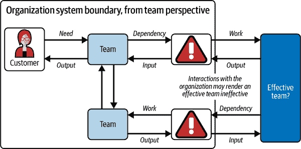
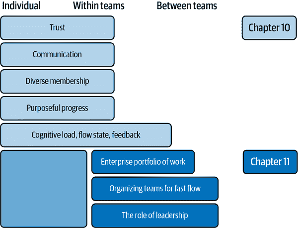
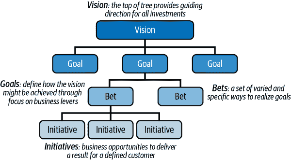
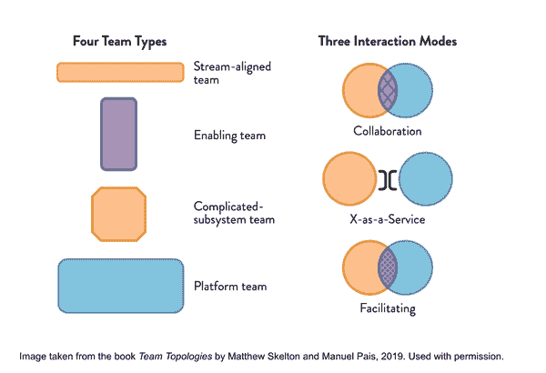
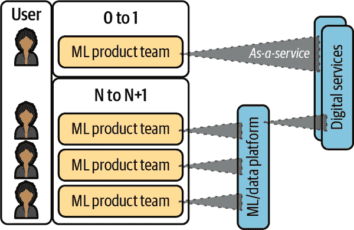
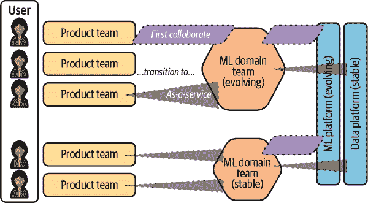
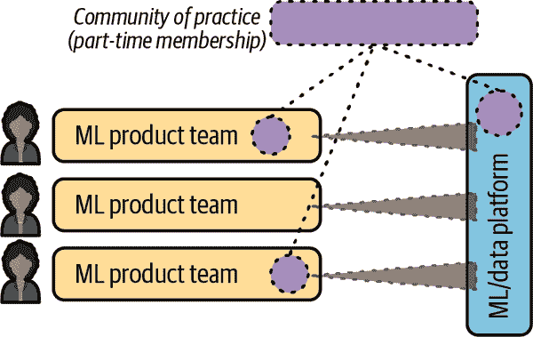
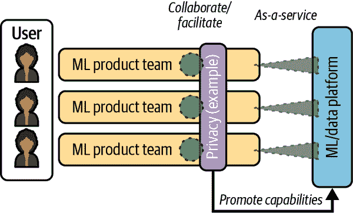
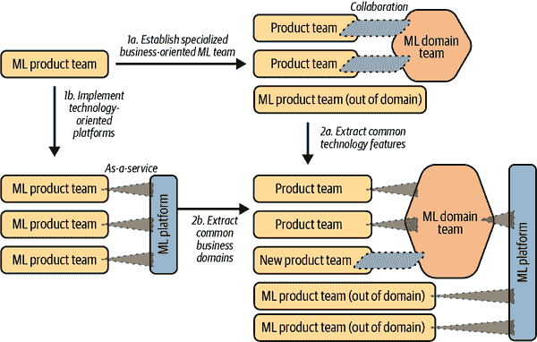
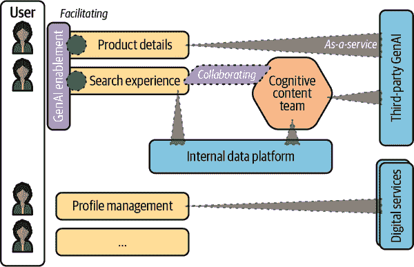

# 第十一章：有效的机器学习组织

> 我已经付出了我所能给予的，
> 
> 这还远远不够
> 
> “业障警察” by Radiohead

您是否曾经参与过一个优秀的团队，尽管团队在尝试产生影响力时却陷入困境，因为被要求做了错误类型的工作，或者一次性专注于太多事情，或者不断等待其他团队完成任务？

在我们迄今为止的旅程中，我们深入探讨了机器学习团队内部发生的事情，包括工作实践的互补机制、技术配置以及团队合作的人文因素。我们还研究了产品与机器学习交付团队之间的相互作用。本章进一步探讨了组织因素如何调节团队效能，以及如何从有效的团队建设出高效的组织。

这种组织视角对于构建有效的机器学习团队至关重要，因为即使是最优秀的团队——具有精细调整的依赖管理、持续交付、自动化测试、超强 IDE、信任、沟通、多样性和目标的团队——也会被糟糕的工作形态或过多的组织依赖打败。

从系统的角度来看，团队将工作转化为输出。工作可能直接来自与客户的互动，也可能由组织中的另一个依赖团队定义。团队的输出要么直接服务于客户，要么服务于依赖团队。团队之间设计不良的工作和输出依赖是导致团队无效的外部原因，如在图 11-1 中所示。

###### 图 11-1\. 团队和组织互动的系统视角

团队之间设计不良的互动导致工作与团队的匹配不佳。这两个问题——工作设计不佳和输出依赖——导致技术、流程或知识依赖。依赖关系会导致等待、缺陷和其他浪费，因为积压耦合、流程中断和认知负荷增加。所有这些因素都会影响团队的表现和满意度。当这些问题在多个团队中累积时，严重影响了组织的绩效。但这些问题无法单靠任何一个单独的团队解决。

> 一切，
> 
> 一切，
> 
> 一切，
> 
> 一切尽在掌握
> 
> “一切尽在掌握之中” by Radiohead

我们可以通过考虑组织中团队形态和互动模式的设计来解决这两个问题，并提高团队的效率，正如 Matthew Skelton 和 Manuel Pais 在《Team Topologies》（IT Revolution Press）中所展示的那样。

最后，我们将在本章探讨团队协调不佳的症状，并引 Topologies》的框架，帮助跨组织扩展有效的 ML 团队。在本章中，我们将：

+   描述组织在规模扩展和涉及更多团队交付机器学习解决方案时面临的挑战

+   介绍 Team Topologies 模型，其概念和原则，用于减少团队之间的耦合并改善价值流的流动

+   应用 Team Topologies 模型对 ML 团队进行审视，描述各种团队形态的利弊，它们的互动模式以及根据当前目标选择合适的团队形态的方法

+   探索 ML 团队如何通过团队拓扑图组合，并随着规模扩大而随时间演变

+   概述有助于培养高效团队和组织的有意识领导原则

Figure 11-2 展示了我们在第十章和第十一章中涵盖的基本构建块。团队拓扑模型的目标是组织快速流动。我们还将讨论组织如何塑造其工作组合以提高多个团队的效率。最后，我们总结了有意识的领导角色和领导可以采用的实践，以建立高效的团队。

###### 图 11-2\. 有效 ML 团队和有效 ML 组织的基本构建块，在第十章和第十一章中有详细介绍

由于每个组织在市场、产品、技术和工作方式方面都有独特的因素，因此需要一些思考来调整这些基本构建块，但它们通常是适用的。通过这些基本构建块，我们将探讨在组织中每种类型的 ML 团队可能适合的合适位置，以增强*所有*团队的效果——让我们开始吧。

# ML 组织面临的常见挑战

在这一节中，就像在第十章中一样，我们将通过一些虚构但易于理解的场景，从多个 ML 团队（以下简称“ML 组织”）面临的常见挑战的角度来看待问题。虽然第十章考虑了个人和团队面临的问题，但在本节中，我们介绍了与团队如何相互作用以及工作如何流向每个团队相关的情景，这也可以使团队更有效或不那么有效。

让我们看几个情景，说明 ML 组织常遇到的一些共同挑战：

集中式团队承担了太多的责任

Dana、Ted 和组织中的所有其他 ML 从业者被整合到一个集中的数据科学团队中，以整合专业知识并为组织中多个跨职能产品工程团队的所有 ML 需求提供服务。所有与 ML 相关的事务都集中在数据科学团队，导致 Dana 团队拥有大量项目和操作性 ML 系统的长队列和各种积压。

所有利益相关者都声称他们的工作很紧急，但并不总是对达娜团队提出的要求做出紧急响应。在没有企业优先机制的情况下，达娜感到被迫同时运行许多项目和操作性机器学习模型。这意味着她的团队利用率很高，但也经常进行上下文切换（也许还被团队内部的信息孤岛所分割）。因此，项目开始滞后，系统的操作性能和鲁棒性也受到影响。

团队成员对缺乏进展感到沮丧，同时也感到过度工作，无法提供最佳工作。与此同时，利益相关者和其他团队也对未能实现当前目标的缺乏进展感到沮丧，并将未来的 ML 抱负搁置，使得整个组织的响应能力和竞争力降低。

团队间的依赖关系：交接与等待

达娜的数据科学团队负责训练 ML 模型。安娅领导的团队负责拥有将服务模型的前端和 API。

达娜刚刚完成了一个改进模型性能 5%的故事，通过增加一个新特性。然而，在她能将模型发布到生产环境之前，她需要等待安娅的团队接手一个故事，更新前端和 API 以包含发送请求到模型的新特性。

这种依赖模式也被称为[积压耦合](https://oreil.ly/6vz_r)。

几周后，当安娅的团队有能力接手这个故事时，达娜不得不放下她正在做的一切，重新切换到这个故事，并与安娅的团队协调，在后端和前端实现变更。在这些活动爆发之间，这个故事卡片和其他类似的卡片都处于“等待”列。除了延迟之外，在这种工作模式下很容易引入质量问题。

在多个跨职能团队中的工作重复

埃莉和埃德华多分别是两个不同的跨职能团队的团队负责人。他们各自拥有端到端的产品体验垂直切片，包括数据工程、模型训练、API 和 UI 部署。两个团队都不需要等待或依赖另一个团队向客户交付功能。

但是，这两个团队都独立花费了大量精力解决类似的问题。例如，为了解决可扩展 ML 训练基础设施的问题，埃德华多的团队编写了一些复杂的 DevOps 脚本来创建和销毁 GPU 实例。而埃德华多不知道的是，埃莉的团队已经整合了一个 GPU 即服务的提供。

这使得两个团队在各自的发布时间表上额外花费了几周甚至几个月的时间，以及每个解决方案的持续维护成本。

# 作为团队的有效组织

在前一章中，我们主要考虑了个体组成团队的有效性——团队内部视角。在本章中，我们将采取外部视角，看整个团队的角色及团队之间的互动。虽然同时采取两种视角是有帮助的，但通常不可能将一个视角与另一个视角完全分离。

组织中的工作和系统需要多样化的技能来交付和维护，而组织中的人员也具备多样化的技能。找到最佳匹配并不总是直截了当。在与一个大约有 100 人的交付中心合作时，我们发现，管理系统和交付工作需要近 150 种不同的技术和业务技能。

历史上，这个交付中心的团队按功能组织，采用瀑布式交付。工作流程缓慢且难以预测。为了解决这个问题，中心围绕跨功能团队组织，并采用敏捷交付，工作流程变得可见，并有所改善，但由于团队间的依赖关系，仍然复杂且缓慢。在第三次迭代中，跨功能团队被聚集成三个互补组的“超级团队”，并采用显式协作机制来协调每个“超级团队”单元之间的工作。这使得工作流程加快，工作能力提高，并提升了价值的交付。

在这段时期，改善流程的另一个贡献因素是交付中心及其各个团队切片工作的垂直能力的提升，这使得价值的定期实现成为可能（如第一章和 2 章所述）。这与历史上一次只交付一个“水平”解决方案组件并等待其后期集成以实现价值的方式形成鲜明对比，后者的频率要低得多，且难以预测。

这里的教训是，工作、技术系统、团队成员的技能以及团队之间的互动是相互依存的。团队拓扑结构模型——虽然倡导长期团队存在——并不假设工作是静态的、系统是静态的、团队成员是静态的或者团队之间的互动是静态的。相反，它允许在每个元素中进行调整，以找到可能随时间演变的最佳配置。

## 价值驱动的投资组合管理角色

> 团队拓扑结构强调团队应该是跨功能的，并且具有与价值流对齐的强烈目的。EDGE 强调投资组合应该通过价值进行管理，并由自给自足的跨功能团队交付，同样也要与价值对齐。
> 
> 彼得·吉拉德-莫斯，《“超越团队拓扑结构：团队组合”》（[`oreil.ly/Ip_M5`](https://oreil.ly/Ip_M5)）

您已经在前面的章节中看到了，输入到单个团队的工作形态如何影响其效果。正如您在本章早期示例中看到的那样，这对于团队的团队形式水平也是如此——一个组织整体的工作组合形态可以影响多个团队的效果。如果集体团队预期执行一个与客户或业务价值不明确对齐的工作组合，或者计划在长时间范围内以大批次交付，那么将很难甚至不可能组织有效的团队来执行其交付。

书籍[*EDGE: 基于价值驱动的数字转型*](https://oreil.ly/4g9d-)（Addison-Wesley Professional）由 Jim Highsmith、Linda Luu 和 David Robinson 展示了如何建立一个与业务愿景和战略一致，并反映出自主跨职能团队执行计划的企业工作组合。作者将此描述为*价值驱动的组合管理*，而工作组合的主要表现形式是*精益价值树*，如图 11-3 所示。

###### 图 11-3\. 精益价值树允许企业捕捉和分享其愿景和战略

无需多言，这些概念是另一本书的进一步话题，我们鼓励您如果感兴趣的话可以阅读。对我们来说的主要收获是，一个组织成形为动态投注和倡议的工作组合，每个都与战略目标一致，以一种有效的 ML 团队可以合理交付的方式塑造工作。

相反，如果企业的组合项目特点是大规模且僵化，设计用于具有有限自主权和少见反馈的团队，这显然违反了我们组织以实现快速流程的核心假设。在本章的目的中，我们将假设工作组合对我们探讨的 Team Topologies 模型持有同情态度。现在让我们看看不同的团队形态及其交互模式如何形成 Team Topologies 模型的构建模块。

## 团队拓扑模型

[*Team Topologies*](https://oreil.ly/yPzsl)提供了一种结构化方法，用于优化团队的组织方式以及它们在软件交付环境中的交互，以改善交付流程和反馈。

其中一个核心原则是，通过拥有适当的团队结构，并建立一组有限而明确定义的交互模式（团队之间及其所拥有系统之间的交互），我们可以减少团队之间的耦合，保持认知负荷在可管理的水平，并从而改善自治且对齐的团队之间的交付流程。

正如我们在第九章中介绍的，Team Topologies 强调团队作为软件交付的主要机制，并介绍了四种基本团队类型和三种交互模式（见表 11-1）。

表 11-1\. 团队拓扑学中基本团队类型和交互模式

| 术语 | 定义 | 示例（非穷尽） |
| --- | --- | --- |
| *团队类型* |
| 流程对齐团队 | 针对业务领域的工作流程对齐的团队，专注于提供端到端的价值。 |

+   产品结账页面

+   产品详情页面

|

| 平台团队 | 他们为其他团队提供服务、工具和平台，使其能够更有效地工作。 |
| --- | --- |

+   数据平台

+   机器学习平台

|

| 支持团队 | 这些团队通过内部咨询和建议，帮助流程对齐团队克服障碍。 |
| --- | --- |

+   安全性

+   架构

|

| 复杂子系统团队 | 专注于系统的部分，需要深入的特定专业知识，无法简化。 |
| --- | --- |

+   搜索与排名

+   推荐系统

+   数据科学团队

|

| *团队交互模式* |
| --- |
| 协作 | 团队在一定期间紧密合作，以发现新的解决方案。 | 流程对齐团队（例如主页）与复杂子系统团队（例如推荐系统）合作，以确定如何在用户访问主页时提供个性化推荐。 |
| X 作为服务 | 一个团队将某物作为服务提供给另一个团队，并有明确的合同。 | 复杂子系统团队（例如推荐系统）创建一个数据产品或服务，为任何给定用户提供产品推荐列表。其他产品部分的团队（例如网页主页、移动主页、结账、营销）可以自助方式使用这种产品推荐能力。 |
| 促进 | 一个团队通过加快学习速度，帮助另一个团队实现其目标。 | 安全团队（一支支持团队）通过进行安全威胁建模研讨会，帮助流程对齐团队识别安全失效模式并提供建议，以构建安全性。 |

图 11-4 展示了这四种团队类型和三种交互模式的可视化术语。本指南中，每种团队类型在图示中都有独特的几何形状和颜色，每种交互模式也有特定的表示方式。更为密集的交互—*协作* 和 *促进*—显示为交互团队之间的几何交汇，每种都有独特的图案，而 *x 作为服务* 模式则表示介入式交互（例如与技术的交互），采用背对背的括号符号。在本章节的图表中，我们使用了这种可视术语的实用变体。¹

###### 图 11-4\. 团队拓扑学中的四种团队类型和三种交互模式（来源：Matthew Skelton 和 Manuel Pais 的《Team Topologies》[IT Revolution Press, 2019]，经授权使用）

现在您已经掌握了团队拓扑的基本概念，让我们来看看这一模型的核心原则以及它们如何帮助减少团队之间的耦合并提高流程效率：

康威定律

康威定律指出系统的设计往往会反映出组织的沟通结构。因此，团队结构应该被有意识地设计以产生期望的系统架构。

认知负载

每个团队应该只承担能力范围内可以处理的工作量，同时充分理解他们负责的系统。过载的团队会损害生产力。请注意，在第十章的工程效率部分我们对“认知负载”进行了定义。

以团队为先的思维

以团队为先的思维优先考虑团队的集体智慧和能力，而不是个体能力，认识到长期存在的团队会发展出更深层次的协同和合作。这一理念是为了保持稳定、长寿命的团队，这些团队共同进步、学习和成长，而不是经常性地解散和重新组建用于不同项目的团队。

值得注意的是，“团队”一词在团队拓扑中有非常具体的含义。正如斯克尔顿和佩斯指出的那样：“团队是组织中传递的最小实体，应该是一个稳定的由五到九人组成、共同朝着一个共享目标努力的单位。”在第十章中，我们还强调了朝着共同目标努力的重要性。

断层面

Fracture planes（或软件责任边界）指系统内部的分割或边界，在这些分界线上，子系统及其支持团队可以借助清晰和明确定义的接口分开独立工作。

断层面可能是：

+   业务 [“领域”](https://oreil.ly/96uoY) 边界—业务能力的一个明确领域（例如，对于在线旅行预订平台，一些领域可能包括假期体验、预订、支付）

+   Regulatory compliance—在必要时简化合规要求，但不要在所有地方都要求。

+   风险概况中的其他不连续性（例如，获取与保留客户）

+   节奏变化—避免将快速变化的领域与变化缓慢的领域耦合在一起

+   Performance isolation—将突发工作负载与可预测工作负载解耦

+   技术—假设您已经尝试将更为约束性的技术提升到较少约束性技术的水平

+   团队位置—追求共同位置或远程优先，并注意主要时区差异对沟通的影响

+   用户角色—不同的用户群体有着足够不同的需求

+   组织中任何其他“自然”的断层面

通过识别并围绕这些断裂面组织团队，组织可以确保团队具有清晰、内聚的责任领域，使其能够更自主地运作，并减少与其他团队频繁协调的需要。断裂面指导形成解耦的、自给自足的团队，这些团队可以更快地提供价值。

团队封装

团队应保持一定级别的封装，即它们公开了可由团队消费和依赖的明确定义的接口或 API，同时保持其内部工作和细节隐藏。

团队互动

组织应使用定义好的团队互动模式（协作、X 作为服务和促进）来减少团队之间的误沟通、不对齐和不必要的依赖。对于任何一个团队来说，互动模式的数量也应该有限，以避免协调开销和认知负担。

交接

团队之间的交接引入延迟和潜在误解，导致质量问题和重复工作。减少交接可以简化交付过程。

可演化的团队结构

团队形态不是一劳永逸、铁板一块。随着技术和组织的成熟，团队结构和互动应相应地进行调整。

这些应用的核心要素和原则适用于许多组织设置，尤其是在技术交付领域。请思考一下哪种团队形态最能反映您当前的团队、您与其他团队的互动方式，以及这种组织设计与核心原则的对齐程度。您是否看到改进的机会？

这些要素和原则也是 ML 团队拓扑的基础。其中许多内容直接适用于 ML 团队，接下来我们将探讨与 ML 特定的微妙差异。

## ML 团队的团队拓扑

在本节中，我们将分享我们在野外发现的各种 ML 团队拓扑，以及它们的优势和弱点，以及与其他团队的互动模式。

将这些团队形态视为构建高效 ML 组织的合适组成部分。这些并不是唯一的构建模块，它们可能会被误用（请参阅弱点），但我们认为它们是一小组参考拓扑的明智默认选择，考虑到团队的多种可能排列方式。ML 应用的规模和组织中的人数有助于确定简单的拓扑结构是否足够，还是需要更复杂的拓扑结构。

如果您在 ML 方面的组织效率低下，并且您的团队拓扑与下文的合理默认值有所偏离，我们建议探索如何向这些默认值靠拢。

### 流程对齐的团队：ML 产品团队

流程对齐的机器学习团队具有数字、数据和机器学习能力的混合，并交付面向用户的机器学习功能，如内容推荐。假设其交互和依赖可以受限制，这是扩展您的组织机器学习能力的默认单元——无论是从 0 到 1，还是在任何阶段从 N 到 N + 1 产品或功能。首先询问机器学习产品团队是否能够满足您的业务需求，如果不能，则探索其他选择。

然而，为了在一个合理大小的团队内达到多种数字和数据能力的适当平衡，流程对齐的团队无法支持太多机器学习专家。在从 0 到 1 的扩展中，团队的目标应该是尽量减少对其他团队的依赖。组织中首次应用机器学习的情况下，可能会使用经过验证的技术，因此并不需要深入的专业机器学习知识，而跨职能团队可以自给自足。在大规模扩展从 N 到 N + 1 时，我们预计产品团队可以使用数据和机器学习平台即服务的专业服务，并且可以访问专门的支持团队，例如隐私团队。在这个规模下，这些依赖关系对快速流程是合适的。（当然，它也可以是自给自足的。）表 11-2 总结了机器学习产品团队的优势、弱点和交互模式。

表 11-2\. 机器学习产品团队的优势、弱点和交互模式

| 优势 | 弱点 | 交互模式 |
| --- | --- | --- |
| 由于对其他团队的依赖性较少，能够实现端到端的价值交付流程。 | 可能缺乏深入的机器学习技术专业知识。多个机器学习产品团队倾向于在信息共享方面处于孤立状态。 | 第一个产品团队的目标是尽量减少所需的交互，而新团队通常作为数据或机器学习平台即服务的消费者，并与已建立的专业支持团队合作。 |

图 11-5 展示了机器学习产品团队典型的拓扑结构。机器学习产品团队被展示为直接为最终用户或客户提供服务的流程对齐团队。第一个实例化的产品团队将大部分自治，仅消耗定义良好的数字服务（例如应用程序托管、可观察性），简化表示为 *数字服务* 平台团队。在某一规模以上，多个机器学习产品团队还可能消耗机器学习平台或数据平台服务，旨在提高产品开发的流程。与平台团队的交互是作为服务的（作为服务以虚线三角形表示）。

###### 图 11-5\. 机器学习产品团队典型的拓扑结构可视化

从机器学习产品团队的起点出发，我们现在从用户向内部拓扑结构工作，以帮助机器学习组织实现规模化。

### 复杂的子系统团队：机器学习领域团队

有些机器学习应用非常复杂，或者从卓越的机器学习性能中获取的商业优势非常大，这就正当了围绕机器学习应用构建专家团队的理由，比如零售预测或内容推荐。这本质上是利用业务领域分离面的一个例子，尽管用户人物、风险和合规性等因素也是有效的，在某些情况下可能与业务领域同义。在这种情况下，我们考虑一个复杂的子系统团队，主要由业务领域、数据科学、机器学习和数据专家组成。机器学习领域团队将其产品（如机器学习模型、模型预测）作为服务提供给多个流程对齐的产品团队和其他业务消费团队。在这方面，机器学习领域团队中也极度希望拥有产品管理能力。

这种团队类型是组织扩展过程中的一个可能的下一步，前提是团队（及其支持团队）可以将这些机器学习产品作为服务提供给内部消费者，并且不需要为多个业务领域的消费者提供服务，否则这种团队很容易因为在不同领域需求之间切换上下文或者手动维护解决方案的辛苦工作（或两者兼有）而不堪重负。如果一个复杂的子系统团队为广泛的业务领域提供服务，我们将其称为集中数据科学或机器学习团队。

许多所谓的“集中”数据科学或机器学习团队的现实情况是，它们实际上是领域团队，主要为个性化等单一领域提供服务，但也吸引了一长串额外的使用案例，使得这种拓扑结构效率降低，因为需求和与其他团队的互动超出了可管理的范围。有时，集中团队在功能角色上缺乏多样性（例如，它们只包括数据科学家），这意味着它们几乎没有希望通过服务方式（例如，无法将模型部署为符合企业服务水平协议的可靠服务）支持其他团队。在这种情况下，这些团队应该被认为是促进团队（稍后会详细介绍），它们将以促进模式行事，或者团队拓扑结构应重新设计，使团队更加跨功能，以便更好地增强流程。我们发现，当组织未能有效管理互动模式时，它们限制了“集中”团队的效率。

为了解决手动解决方案的劳动力，ML 领域团队应专注于自动化服务推理和重新训练或模型维护“在野外”，将这些能力作为服务提供给消费者。这为开发新模型的高质量工作创造了空间，这需要密集的协作。表 11-3 总结了 ML 领域团队的优势、劣势和交互模式。

表 11-3\. ML 领域团队的优势、劣势和交互模式

| 优势 | 劣势 | 交互模式 |
| --- | --- | --- |
| 在相关的 ML 学科和业务领域提供深厚的专业知识，提供不同的组织能力。 | 可能会因为来自不同业务领域的消费者的多样化需求而感到不堪重负，或者过度依赖手动流程。在没有跨职能角色的情况下，可能会成为阻碍者。 | 从协作进展到模型作为服务交付给消费领域团队（参见图 11-6）。在有多个领域团队的情况下，可能会消耗数据和 ML 平台。 |

图 11-6 展示了 ML 领域团队的典型拓扑结构。在这里，一个 ML 领域团队被展示为一个复杂的子系统团队。可视化展示了一个 ML 领域团队支持多个产品团队，以多种不断演变的交互模式开始，从协作过渡到作为服务提供。这代表了特定服务成熟度的表现。另一个 ML 领域团队显示为支持更多产品团队作为服务，可能是因为其服务更加成熟。ML 领域团队还消耗 ML 和数据平台，为产品团队提供更多领域特定的服务。可视化还显示，ML 领域团队最终的目标是消耗平台作为服务，但他们也需要与平台团队合作，以进化平台服务（另见“平台团队：ML 和数据平台团队”）。

###### 图 11-6\. ML 领域团队典型拓扑的可视化

此时，我们想要指出团队拓扑和[data mesh](https://oreil.ly/f5lDN)之间的联系。一般来说，数据网格在企业的数据产品和它们之间的连接方面定义了逻辑数据模型，而团队拓扑则在团队及其连接方面定义了相应的操作模型。康威定律表明，将这两个模型（数据和操作）对齐是自然和最具生产力的。

在这方面，机器学习领域团队可以被视为*聚合数据产品*的所有者。在数据网格的语境中，聚合数据产品被定义为从多个来源组合而成的数据产品，可能被多个消费者使用，因此它们既不严格与源对齐，也不与消费者对齐。我们在实际中看到的一个例子是跨多个来源匹配的客户记录（或“客户单一视图”，但我们特别讨论的是识别唯一且可能重复记录的数据产品）。如果将机器学习领域团队视为聚合数据产品的所有者，那么相反地，我们可以提议足够复杂的聚合数据产品应由复杂的子系统团队拥有。[数据网格数据产品概念](https://oreil.ly/wYTCw)如可发现性和可信度则提供了额外的指导，以减少手动服务多个消费者的繁琐工作。

我们还想指出，在本节中我们有意使用术语“产品团队”来区分“流对齐团队”中的“机器学习产品团队”。这是为了强调，在交付利用机器学习的产品或功能时，机器学习经验必须嵌入到没有依赖的流对齐团队中，而在可以与机器学习领域团队互动的产品团队中则是可选的。将“机器学习产品团队”视为通用“产品团队”类型的一个专业化。

到目前为止，我们已经看到平台团队支持机器学习产品团队和机器学习领域团队，接下来让我们看看平台团队是什么样子。

### 平台团队：机器学习和数据平台团队

在一定规模的产品团队和领域团队中引入共同的机器学习和数据平台能力将大大减少建立机器学习解决方案团队的工作重复和复杂技术和数据基础设施的积累。共同的能力可能包括可扩展的基础设施、特征存储、生产监控和数据标记工具。

例如，我们曾经看到缺乏共享的机器学习平台导致两个不同的机器学习团队分别花费数月时间独立开发他们自己的特征存储。如果他们可以使用共享的机器学习平台，这两个团队都可以更早地交付成果，并减少它们现在必须维护的技术基础设施、流水线、系统和数字产品的规模。

平台团队的分裂面可以被看作是节奏变化，但与相关联的关系一样。多个流对齐团队必须快速适应他们对客户偏好演变的理解，而他们依赖的底层技术能力演变得更慢。这些底层能力可能也有不同的风险和性能配置，等等。

ML 平台团队可能提供“合理的默认设置”（即最佳实践）、加速工具或由服务级别协议（SLA）支持的数字服务。他们提供的支持是为了消费者构建 ML 解决方案，取决于需求的程度和组织的成熟度。平台团队通常以服务方式与其消费者互动，提供定向的支持。然而，当他们与服务的“示范性”早期采用者互动时，这可能主要通过协作进行，以便平台团队开发对新服务需求的理解。平台团队可能会利用这些合理的默认设置、加速器和服务阶段来管理他们提供的服务的生命周期。

挑选建立平台的合适时机总是困难的，因为平台可能代表一项可观的投资。如果时间太早，平台团队将无法充分理解其消费者的需求，导致平台的采用率低（进而导致问题过晚）。如果时间太晚，团队上市速度较慢，技术资产将变得更加复杂，存在许多定制解决方案。我们提出应用于 ML 产品团队或领域团队的[三原则](https://oreil.ly/zBQPR)，并建议通过平台服务生命周期中描述的薄片交付平台功能，进一步管理风险。例如，Spotify [描述](https://oreil.ly/Wplij)保持产品愿景广泛和未来导向，产品战略具体和迭代。

ML 平台和数据平台提供类似但不同的能力。ML 产品团队或领域团队可能会同时使用两者。组织应该利用数据平台使经过良好治理的组织数据可用于合适的用途，并支持转换和提供衍生数据产品的团队。ML 平台需要访问数据并且需要服务数据，但组织应该专注于支持 ML 平台团队使用 ML 技术和模型进行数据和特征的转换，以及衍生数据产品的专门服务，例如特征存储或模型服务。ML 平台在推断时间最终支持 ML 模型，但也支持训练时间甚至更早的探索性分析、ML 模型的实验和数据标注。

平台团队通常由基础设施工程师、数据工程师、ML 工程师和开发人员组成。在 ML 领域团队中，平台团队应包括[产品管理能力](https://oreil.ly/1QnMH)，在有许多内部消费者的情况下，设计能够有效和高效满足他们需求的服务。表 11-4 总结了 ML 平台团队的优势、劣势和交互模式。

表 11-4\. 机器学习平台团队的优势、劣势和交互模式

| 优势 | 劣势 | 交互模式 |
| --- | --- | --- |
| 提供规模效率，提高上市速度，减少产品团队或领域团队的认知负荷 | 如果引入时机过早或过晚，或者特性不是以消费者为中心，可能无法实现其益处 | 从协作进展到作为服务提供服务的交付，支持通过促进实现服务的发展 |

在某些规模下，平台团队需要支持许多内部客户。它们旨在作为服务进行交互，这使它们能够同时支持许多团队。我们将覆盖的最终典型机器学习团队形态还为许多内部客户提供服务，但其交互模式更为密集，因此它们往往仅与一个或两个团队同时合作以提升其能力，并对其交互进行时间盒管理以扩展其影响。

接下来我们将看看机器学习中的使能团队。

### 使能团队：某些机器学习产品开发方面的专家

使得机器学习团队能够类似于机器学习平台团队的演进模式，但专注于利用其专业知识解决新问题，而不是自动化例行工作。您的组织可能已存在一些数字化使能团队，如架构或安全团队。这些使能团队促进或与其他团队合作。机器学习产品团队、机器学习领域团队和机器学习平台团队可能会在其发展过程中与这些现有的使能数字团队合作。再次强调，在某些规模下，组织将需要更专业化的使能团队来处理更深入的跨功能机器学习问题——这些问题在应用和产品中反复出现，并且受益于共享经验而不是反复的局部解决方案——这就是使能机器学习团队的作用。使能团队的裂解面可能是之前提到的任何一个，深度专业知识在个案情况下需要，但仅是暂时性或周期性的。

使能团队可能支持的机器学习专业化领域包括隐私、伦理和计算性能优化。使能团队通常由学科专家、分析师和与他们咨询的团队中角色功能对应的同行组成。通过这种方式，他们为他们提供支持的客户团队（简称“客户团队”）带来了独特的知识、解决问题的能力以及对其他团队工作的同理心和理解。这些角色可能由支持团队与使能团队的客户有效互动的其他角色支持，例如项目管理、沟通和学习发展专家。

如果没有足够的需求来维持整个启用团队，那么这些角色可能会嵌入到最合适的机器学习产品团队或机器学习领域团队中，或者嵌入到组织中跨技术最合适的启用数字团队中。在这种情况下，嵌入到不同团队中的个人可能会形成一个“行会”或者社区实践能力（CoP），如图 11-7 所示。

###### 图 11-7\. 多团队形成的实践社区

社区实践能力团队为组织价值流做出实质性贡献的能力受到限制，因为参与者的能力被分散在多个目标上，并且认知负荷增加。社区实践能力团队并不是 Team Topologies 中的一个显式构建，但它们与启用团队进行了比较。然而，对于组织来说，社区实践能力团队仍然发挥着重要作用：作为一种关键的组织“感知”机制，以便检测可能需要变更的地方，并作为一个论坛，允许个人建立有益于组织的社会和能力发展的有效联系。因此，社区实践能力团队通常专注于构建非正式网络，并提高关于某一主题的意识、知识和能力。而当需要完成一些超出典型团队能力的新事务时，启用团队则是正确的拓扑结构。

**启用团队**的目标很简单，就是针对某一类问题“使自己变得多余”。这类问题可能会经历多个阶段，这些阶段将决定启用团队的互动模式。对于新问题或者“未知未知”，通常需要启用团队与客户团队进行密切协作，以理解问题并开发定制解决方案。对于熟悉但没有常见解决方案的问题，或者“已知未知”，启用团队将通过分享他们对问题领域及类似解决方案的知识来协助客户团队。

对于有常见解决方案的常见问题或“已知已知”，启用团队应系统化他们的知识（成为一个平台）作为服务提供，这将涉及与平台团队的协作。对一类问题“使自己变得多余”允许启用团队通过解决他们专业领域中的新问题继续提供超额价值。表 11-5 概述了启用机器学习团队的优势、劣势和互动模式。

表 11-5\. 启用机器学习团队的优势、劣势和互动模式

| 优势 | 劣势 | 互动模式 |
| --- | --- | --- |
| 提升多个团队的技能并解决特定机器学习产品交付某些方面的重复但特异问题的手段。 | 由于在协作中需要密集互动，每次只能为少数团队提供服务。需要一定规模才能经济运行。不要与社区实践混淆。 | 促进或协作。也可以进行广播通信。 |

图 11-8 展示了一个启用机器学习团队的典型拓扑结构。所使用的示例是一个专注于帮助团队采用隐私最佳实践的启用团队。这个隐私启用团队与多个机器学习产品团队进行互动，以协作模式或促进模式。启用团队还可以与平台团队合作，系统化其知识，并促进其能力以作为服务的形式进行互动。

现在您已经看到了一些典型模式，让我们看看这些模式与本章早期的内部团队考虑如何结合，以建立有效的组织级团队。

###### 图 11-8\. 典型启用机器学习团队的拓扑可视化

### 结合和发展拓扑结构

虽然 Team Topologies 的一个目标是支持长期存在的团队，在一段时间内建立有效的团队合作，但组织的 Team Topologies 并非静态。特别是正如我们之前看到的，以某种形式实施内部平台的路径至少是服务和交互模式进化的一个关键示例，很可能也会涉及团队形状和整体拓扑。

机器学习团队拓扑的许多可能进化路径。在 图 11-9 中，我们展示了基于我们的经验，两条可能分歧然后再次汇聚的路径。

###### 图 11-9\. 机器学习团队拓扑的进化路径

图 11-9 展示了路径 A 的步骤 1a 和 2a，以及路径 B 的步骤 1b 和 2b。请注意，在第 1 步，路径 A 和 B 都有意显示了类似规模的产品团队。在第 1 步选择方向时，取决于是在为多个不同业务领域标准化技术组件中获得更多杠杆，还是在构建与业务领域及相关数据科学和机器学习技术相关的深度专业知识中获得更多杠杆。

超过这一规模后，很可能需要为产品团队提供两种类型的支持，而且这些共同点也可能出现（符合三个原则）。因此，在第 2 步，路径 A 和 B 再次汇聚，以填补缺失的业务或技术支持。

在路径 A 上，我们首先提取了一个业务领域，我们可能会发现该领域团队正在与许多产品团队合作，这种合作的辛苦劳动。在这种情况下，机器学习领域团队需要帮助自动化数据和机器学习服务的消费，并利用平台服务来自动服务其内部消费者（产品团队），引入机器学习平台功能通过平台团队支持这一点。

在路径 B 上，我们首先提取了平台组件，我们可能会发现一个一刀切的解决方案并不能减少随着团队数量增加而增加的总认知负荷，要么因为服务在不同应用程序之间过于低级，要么因为高级抽象并不适用于所有应用程序。在这种情况下，一些产品团队的群集将受益于可以由机器学习领域团队提供的更高级别的面向业务的抽象。

注意，我们可能会按照与平台团队类似的模式为使能团队添加支持，假设业务领域的需求是均质的。然而，如果主题专业知识特定于业务的某些领域（例如，组织既有受管制的业务又有非受管制的业务），那么使能团队的交互可能看起来更像是复杂子系统团队的例子。

这类变化可能是由有机的业务增长驱动，也可能是由于并购活动导致的。这两种情况都带来了复杂的组织变革挑战，除了旨在解决产品交付和技术挑战的不断演变的拓扑结构。虽然在没有与任何现有平台或领域能力强烈关联的情况下添加独立的机器学习产品团队始终是一个选项，但是未连接的机器学习产品团队的不受限制的增长也是一个问题。就像[技术债务](https://oreil.ly/fnh8q)的概念一样，我们可以进行短期权衡，但我们应该意识到如果不积极管理这些权衡可能会变得不可持续。无论我们决定重构多个机器学习产品团队的地方，我们也可以记住扩展的两个关键维度：

1.  是否在为多个具有共同需求的产品团队提供更深入的面向业务的解决方案方面有更多的好处？

1.  是否在整合技术支持以减少认知负荷并自动化多个机器学习工作流程方面有更多的好处？

我们已经看到一系列经典的 ML 团队拓扑结构及其随时间的演变。一个重要的主题是选择与团队形状兼容的互动模式。这就是我们可以回到第十章中提出的团队之间信任问题的地方 第十章。建立和维护团队之间信任的最佳策略取决于它们的互动模式。对于像一个大团队一样工作的协作团队，我们应该主要考虑第十章中的内部团队因素 第十章。对于通常涉及专业知识转移的咨询关系的促进团队，我们可能会寻求在领域内分享先前的经验，明确与客户团队设定期望，并展示启用团队工作的影响。与服务的交互同样基于设定清晰的期望和展示能力以满足这些期望，此时我们应该精确定义和发布服务水平，并监控这些服务水平的满意度，以保持信任。

### 一个示例拓扑结构

在这里，我们提供一个基于假设场景的示例，多个产品团队正在采用生成式人工智能解决方案，这需要将一些专业知识提供给负责用户体验元素的团队。这个例子旨在说明 Team Topologies 构建如何帮助我们最佳组织团队。 图 11-10 描绘了这一场景。

###### 图 11-10\. 多个产品团队采用生成式人工智能解决方案

图 11-10 展示了目前采用生成式人工智能解决方案的两个产品团队——产品详情和搜索体验——以及进一步的团队，目前不是当前的重点，包括配置文件管理。产品详情只有表面上的生成式人工智能需求（总结一些结构化产品数据），他们可以使用作为服务的第三方平台来提供所需的功能。然而，他们仍然必须遵守组织的生成式人工智能防护措施，为此，启用团队促进他们的工作，提供支持和指导。启用团队还促进了搜索体验团队，但它将其促进交互限制在这两个流对齐的团队之间。

搜索体验团队对生成 AI 有更高要求（包括从非结构化搜索查询匹配结构化意图和支持基于嵌入式向量的搜索）。为了实现这一功能，该团队与认知内容团队合作，后者帮助产品团队基于非结构化数据开发定制解决方案（认知内容团队使用第三方生成 AI 平台的嵌入式作为服务，并支持传统的 NLP 插槽填充技术等）。由于搜索体验工作的复杂性，他们与认知内容团队合作，但这是两个团队唯一的合作。认知内容和搜索体验团队都使用内部数据平台作为服务消费数据。总的来说，在其他模式中，团队之间的互动受到严格限制，但团队可以支持许多作为服务的互动。

哎呀！正如我们所看到的，不同的团队形状和不同的互动模式适用于我们解决的产品开发和组织问题的不同要素。Team Topologies 提供了一种简单但丰富的语言来描述一个系统，其中每个团队都可以根据其能力进行良好的工作，而团队集体可以实现期望的结果。

Team Topologies 是一个适用于能够将价值传递给客户的有效组织的优秀模型。然而，像所有有用的模型一样，它也是[“错误的”](https://oreil.ly/R11E6)。我们认为它的问题与其惊人的效用相比微不足道，并且很容易修复——例如通过增强社区实践来使团队能够支持——但让我们快速回顾一些我们在应用 Team Topologies 时经历的缺点（以及其他人也注意到的）。

### Team Topologies 的局限性

尽管 Team Topologies 是我们在整个组织中有效扩展 ML 团队的首选模型，但我们在应用标准模型时遇到了一些限制。在本节中，我们将描述一个主要限制，我们尚未解决，以及我们部分解决的一些进一步限制。

管理团队结构和报告线可能会跨越设计用于快速流动的团队，特别是在需要协调组织不同部分来为 ML 模型提供数据并将 ML 模型整合到产品中时，特别是随着 Team Topologies 的发展。这是主要限制。管理激励有时也可能与价值流动相反。我们在这里没有提出单一解决方案，因为组织在这个维度上差异很大，但我们鼓励每个组织确保管理了解并能有效地为 Team Topologies 的实施做出贡献，并且这是有效 ML 组织的一级关注点。

Jurgen Appelo 已经注意到这一点，以及他的 *unFIX* 模型与团队拓扑学之间的一些[轻微差异，可以轻松调和](https://oreil.ly/osh1-)。在 ML 团队和组织的背景下，我们还将强调关注 *目的* 并能够实用地适应 *重新团队化*，这两者我们在 第十章 中已经讨论过。本章还讨论了一种类型的 *论坛* —— 实践社群，它可以增强标准的团队拓扑模型，但我们也推崇采用简化的模型，减少许多类似关注点的混乱，以简化决策。在 第二章 讨论的产品实践在这里扩展到 *EDGE*，进一步解决了其他关注点。我们认为其他关注点对 ML 组织不那么重要。我们还认为交互模式仍然是管理认知负荷和快速流动的关键概念，特别是在被忽视的 *unFIX* 的专业环境中。

我们希望您也发现团队拓扑学的实用性远远超过任何缺点，并且您认识到实践中您组织内的一些有效元素。此外，我们希望您认识到如何演变您的拓扑结构以变得更加有效。在接下来的章节中，我们将分享一些实现这一目标的策略。

## 建立有效团队的组织策略

现在你已经掌握了我们团队级别构建模块和价值驱动投资组合管理以及团队拓扑学的原则和技术，让我们重新审视本章开头涵盖的挑战性场景，并看看我们如何利用我们刚刚学到的团队拓扑学知识来解决它们。表 11-6 列出了解决一些挑战的一些策略。

表 11-6\. 如何利用我们迄今学到的知识来解决团队相关挑战

| 挑战 | 示例 | 如何解决这一挑战 |
| --- | --- | --- |
| 团队间依赖关系：交接和等待 | Dana 在数据科学团队工作，她的团队负责训练机器学习模型。Anaya 是前端和 API 的团队负责人，将服务于这个模型。Dana 刚刚完成了一个故事，通过增加新特性，提高了模型性能达到 5%。然而，在她能够将模型发布到生产环境之前，她需要等待 Anaya 的团队更新前端和 API，以便在向模型发送请求时包含新特性。在能够将 Dana 的故事从“等待”列移动到“完成”（即部署到生产环境）之前，已经等待了几周。 | Dana 的团队（一个复杂的子系统团队）与 Anaya 的团队（一个流程对齐的团队）紧密耦合，两个团队无法独立地提供价值。我们应该在这个模型提供的能力周围识别一个*分离面*，并用其他团队（例如 Anaya 的团队以及希望使用这个模型的任何其他团队）可以自主使用的*明确定义的接口*来支持它。这通常是一个[数据产品](https://oreil.ly/mTE0K)，可以实时消费（例如通过 API）或批处理消费（例如通过数据仓库查询）。当我们这样做时，Dana 的团队就可以按照自己的节奏将变更和模型改进部署到生产环境中。作为生产者，Dana 的团队拥有并对这个软件接口的质量负责。它应该有合同测试，并使用诸如[扩展-收缩](https://oreil.ly/qduqi)等技术，以确保任何破坏接口变更（例如添加新的输入特性）都能被正确检测和管理。 |

| 多个跨功能团队中的工作重复 | Ellie 和 Eduardo 是两个不同跨功能团队的团队负责人，每个人都拥有产品体验的一个垂直切片，包括数据工程、模型训练、API 和 UI 部署。两个团队都不需要等待或依赖任何人来向客户交付功能。然而，两个团队都独立花费了大量精力来解决类似的问题。例如，为了解决提供可扩展的机器学习训练基础设施的问题，Eduardo 的团队编写了一些复杂的 DevOps 脚本来创建和销毁 GPU 实例。而 Ellie 的团队则整合了一个 GPU 即服务的解决方案，Eduardo 并不知情。 | 这是康威定律的一个典型案例——两个技术栈和架构反映了两个不同的团队。这种挑战在组织中很常见：

+   没有机器学习平台。

+   机器学习平台团队没有提供足够的工具，或者正确的工具，或者平台工具的文档和社交化。

+   没有执行类似角色的支持团队。

在这里，管理和实践社区在促进[Aligned Autonomy](https://oreil.ly/InrsR)（即团队自治，但也对目标及其实现方法保持一致）方面发挥了作用。这可以成为建立使能团队或工程能力，为组织内提供机器学习平台能力的先导条件。

| 集中团队承担了太多责任 | 达纳和泰德与组织中的所有其他机器学习实践者一起，被纳入一个名为“数据科学团队”的中心团队，以服务于组织中多个跨职能产品工程团队的所有机器学习需求。不同的项目和团队经常依赖于他们团队的专业知识。有一天，当达纳专注于优化神经网络的超参数时，团队突然被召集解决另一个模型的部署问题。一旦问题解决并且他们回到原来的任务上，团队很难重新获得动力。项目开始拖后腿，因为他们经常依赖于团队的集体输入，这导致团队持续分散，导致不断切换情境、无法专注和能力减弱，而这是无法卓越在任何单一努力中。 专注的。 | 很明显，这个名为“数据科学团队”的中心团队对团队来说是一个不合理的认知负担，我们可以考虑在任何相关的“裂解平面”上（如领域界限）划分团队并添加所需的能力，以便每个团队都有资源在组织内创建、维护和改进相应的机器学习能力（如产品推荐、定价）。像以前一样，每个团队都将致力于快速从最初的“合作”进展到明确定义的“作为服务接口”，通过这些接口，组织的其他部分可以以自服务的方式消耗特定的机器学习能力（例如产品推荐），而无需为每个新的消费者额外努力。 |
| --- | --- | --- |

这是关于如何通过团队拓扑概念解决机器学习团队常见挑战的快速入门课程。如果您同时阅读《Team Topologies》一书，将会更加深入理解本章内容，该书为模型提供更多背景、更详细的指导和更全面的策略。把本章视为《Team Topologies》的机器学习“扩展包”！

整本书中，您已经看到了许多改善团队的机会。我们将在最后一个主题中探讨领导角色在推动变革中的作用。

# 有意领导

我们在没有谈到有意识领导作用的一章就无法结束对有效团队的讨论。本章中的许多实践可以由团队中的任何人提倡。然而，一些干预措施，例如设定组织使命或重新配置团队形态，取决于正式指定领导者所拥有的影响力和资源。这些可能是各个级别和各种功能专业化的领导者——技术主管、工程经理、产品或分析经理或执行领导者。无论我们考虑哪种领导角色，它们至少有一件共同之处：他们领导一个团队。

在所有情况下，领导者应该模范他们期望团队展示的价值观和行为。例如，领导者不可能在团队的每个工作维度上都是最有知识的人，他们可以利用这一点展示脆弱性，表现出好奇心，灌输学习文化，积极解决模糊性，并实际回应对团队有益的失败。

领导者在团队外部也有一定角色，即吸引利益相关者并协调组织资源，以支持团队。在这方面，机器学习团队提出了特殊挑战。他们的工作有时不可预测，有许多依赖关系，而他们的解决方案通常复杂且充满权衡。领导者与组织其他部分的外部互动应该为他们的团队创造出展现才华的空间。

接下来的章节描述了领导者可以采取的一些关键措施，以促进有效的机器学习团队。

## 创建有效团队的结构和系统

自从第一章以来，我们已经确定机器学习解决方案的交付需要一个能力系统。在高层次上，任何想要成功交付产品的团队都需要考虑[三个子系统](https://oreil.ly/eJNiL)：

+   从*产品*角度来看，一个团队需要为客户和业务生产有价值的东西。这是团队存在的主要目的——为客户创造有价值的东西。

+   从*技术*角度来看，团队还需要能够交付符合目的、高质量的产品和服务，而不会积累压倒性和毁灭性的复杂性。

+   从*人员*角度来看，团队成员需要具备明确的目标、工具、知识、支持流程、安全性、自治权和目的。当熵开始增加时，我们需要促进对齐，以确保团队朝着同一个方向前进。

这三个子系统对应于做正确的事情、正确地做事情以及以适合人的方式进行事情。

在本书中，我们提出了帮助团队建立工作结构和系统的原则和实践。领导者的角色是确保这些系统得以建立并持续改进，以及让团队成员理解这些系统为何如何帮助他们构建优秀产品。这意味着领导者需要在某些情况下采取指导和协调风格，在其他情况下采取教练和启发风格（“情境领导”）。在更进一步的情况下，领导者的角色是大胆挑战现状，看看是否有更好的路径可供选择。

## 吸引利益相关者并协调组织资源

ML 领导者需要一组特定的技能（或者能够与具备这些技能的团队成员合作），以便将 ML 模型的信息传达给利益相关者。ML 模型通常是不透明的盒子，不具有本质上的可解释性。模型永远不会百分之百正确，因此总会存在一些失败，需要理解其成本。领导者需要关心开发正确的度量标准，并允许利益相关者对这些度量标准以及其揭示的模型性能产生信任。

ML 领导者还需要善于沟通 ML 交付，这种交付的特点是不可预测的实验和对其他团队的许多依赖。这要求领导者带领整个组织踏上这段旅程，清晰地阐述开始所需的条件（端到端的 ML 基础设施），进展的样貌（可能是通过尝试多种以模型为中心和以数据为中心方法而取得的一系列增量收益的集合），以及其他团队（如数据提供者）在确保该尝试成功中的角色。

## 培养心理安全

如果信任可以描述为“我有多么相信我的团队成员会按照他们所说的去做”，[心理安全](https://oreil.ly/gkD6z) 则是“我相信我在发表想法、提出问题、关注问题或犯错时不会受到惩罚或羞辱的信念。” 缺乏心理安全和信任会对我们有效的 ML 交付能力、处理不确定性、分享新想法，甚至找到创新解决方案产生负面影响。有多少突破是通过简单的问题“为什么？”而未被提出的，这真是令人惊讶。但如果没有心理安全，这个问题也不会被提出。

心理安全可以被分为四个阶段，由蒂莫西·克拉克在他的书《心理安全的四个阶段》中定义：

+   安全包容性：“我是有价值的，我属于这里，我感到安全。”

+   学习者安全性：“我在成长，安全地成为一个学习者，我可以提问，我可以出现而不必拥有所有答案。”

+   贡献者安全性：“我正在某个地方做出改变，我感到可以安全地贡献我的想法、愿景、希望和梦想。”

+   挑战安全性：“我可以安全地挑战现状，并帮助修复不起作用的部分。”

领导者在团队中保持心理安全方面扮演着关键角色，通过以身作则、寻求团队的意见和专业知识、主张尝试新事物、在面对失败时表现出韧性并将其视为学习机会，以及促进对话，以建立我们想要的团队文化。

## 拥抱持续改进

通向卓越的旅程是永无止境的，标志着对持续学习的承诺。优先考虑持续改进的领导者认识到，成功和失败都提供了可以完善团队流程、实践和动态的见解。

领导者在团队内树立榜样，并模范出理想的行为。通过展示他们关心持续改进，领导者确保真正实现了改进，团队不仅仅是在仪式上走过场（回想一下 NUMMI 在第十章中关于本质与形式的故事）。

通过遵循结构化过程使持续改进成为现实和习惯——而不仅仅是好意和临时变更——的一些技术包括[Plan-Do-Check-Act (PDCA) cycle](https://oreil.ly/F6cOF)或专门针对持续改进的版本，称为[Improvement Kata](https://oreil.ly/OVpq1)。两者都通过定期评估当前状态、设定新的目标状态、采取朝着新目标状态的小步行动、评估其影响并重复此过程来工作。

## 将失败视为学习机会

领导者为其团队设定情感和文化基调。当领导者将失败视为学习机会时，培养了一种鼓励创新和有计划的冒险的环境。

通过强调挫折的教育力量，领导者确保团队不会因为害怕犯错而瘫痪。相反，失败成为成长的跳板，培养出韧性、适应性和解决问题的思维方式。这种方法不仅加速了学习曲线，还加深了团队内部的信任和协作，因为成员们感到安全，可以分享他们的挑战，并集体学习。

无论如何，如果我们在本书中利用了产品发现和工程实践，失败应该是低成本的。通过降低失败的成本，这些实践创造了一个安全失败的环境，团队可以快速进行实验和学习。

## 建立我们希望拥有的文化

文化并非抽象概念，而是“我们这里的做事方式”。这是一个具体的、日常的现实，影响团队动态、决策过程以及整体生产力。领导者在塑造这种文化方面起着至关重要的作用，不仅通过政策或使命声明，还通过他们的日常行为、反应和互动——也就是他们在“这里做事”的方式。

建立我们希望拥有的文化意味着设想理想的环境，促进创造力、合作和健康，并积极朝这个方向努力。这可能涉及团队价值观的开放对话，解决有害行为，或者引入庆祝团队友谊和里程碑的仪式。通过体现所期望的文化特征并积极培育它们，领导者可以将理想的团队文化的抽象愿景转化为所有成员的实际、共享的现实。

## 鼓励团队在工作中玩耍

要选择一个最终的领导主题作为收获，我们选择了游戏性。游戏可能听起来不严肃，但正如喜剧演员约翰·克里斯所说，“太多人把严肃和庄重混为一谈。” 那些对效率认真的团队需要玩耍。游戏[让人更深入地投入到他们的工作中](https://oreil.ly/BrPJy)，实际上是学习和创造性问题解决的必要条件。事实上，我们正在构建的机器学习系统做的就是玩耍（与人类相比效率显然不高），用许多不同的参数尝试解决问题，以找到最合适的参数。²

领导的角色是在团队中建模和引导玩耍行为。虽然一些与工作相关的游戏，如乒乓球或马里奥卡丁车，提供了重要的心理休息和社交活动，但过度的游戏会让人没有能力进行有意义的工作。这不是领导者需要建模的玩耍行为，他们应该在这种类型的工作中设定适当的边界。相反，领导者应该找到并放大在理解问题和开发有效和高效解决方案过程中玩耍的机会。这不总是一条容易走的路，但这就是领导力的要义。

这种类型的游戏必须保持与团队的相关性和意义。当听到西摩·斯金纳校长建议“舔信封可能很有趣......你只需把它当成游戏......例如，你可以看看在一个小时内你能舔多少封信封......然后试图打破那个记录”时，我们都像巴特·辛普森一样可能会想：“听起来对我来说是一个相当糟糕的游戏。” 然而，在第 3 季第 4 集中，[“巴特的谋杀犯”](https://oreil.ly/PWvIL)，西摩通过同样的原则在一个高度相关和有意义的方式下采取行动，帮助他在被困在车库堆满报纸的有些荒谬情况中生存下来——“我把[附近的篮球用我自由的一只手带动起来]，看看我一天内能弹多少次篮球，然后试图打破那个记录。” 这是通过游戏实现情境领导的一个很好的例子，但希望你在工作中不会遇到这样的情况！

因此，我们看到幽默是游戏的重要组成部分，而游戏在与工作有意义地结合时效果最佳，对于做工作的人来说非常重要。以下是我们和我们的同事在工作中玩耍的一些例子：

+   提出了咨询建议，例如推动一部皮克斯电影的提案

+   举办了一个展示会，展示了一个模拟工具，以游戏节目形式进行，利益相关者试图制定越来越优化的解决方案，然后进行实时模拟和评分——获胜者带走了一个“奖品包”

+   分享了像橡皮鸭形状的重力场、AI 轮胎教练以及用 ML 预测宠物猫位置等[古灵精怪的副项目](https://oreil.ly/443Kw)

+   创造了数据可视化，重点是严肃的性能提升，但又融入了有趣的流行文化主题，比如*Space Invaders*或*The Matrix*

+   设计了轻度竞争性的编码练习，基于 COVID-19 的干扰，比如在保持社交距离的办公环境中进行路径规划，或者在远程学习中优化任务分配给孩子们（或者现在提起这个还为时过早吗？）

这些都是你的团队可能已经在做的事情，通过一点嬉戏可以变得更加有趣和吸引人。嬉戏可以帮助改善心理安全感，找到改进机会，理解失败并促进随后的学习。它可以成为团队文化的一部分——我们已经说过领导者应该在团队中推动的所有其他事情。在过去的两章中，我们涵盖了很多沉重的话题，但这些话题不必沉重地压在可以玩耍的团队身上。因此，当你完成这本书时，把它作为鼓励，去工作中玩耍吧！

[W. Edwards Deming](https://oreil.ly/D1r5Q)，一位思想领袖，他的工作改变了现代管理和质量控制，曾说过：“领导的目标应该是提高人和机器的表现，提高质量，增加产出，同时为人们带来工作的自豪感。反过来说，领导的目标不仅仅是找到和记录人的失败，而是去除失败的原因：*帮助人们用更少的努力做得更好*。”

如果你是一名领导，考虑一下这些技术如何帮助你创造条件，让你的团队发挥他们的集体专业知识并实现他们的目标。

在这里，让我们总结一下这本书的最后一章吧！

# 结论

在第十章和第十一章中，我们探讨和详述了抑制因素和促进因素的人类和社会方面，以实现我们的最终目标：培养有效的 ML 团队，以迭代和可靠地提供客户价值。我们总结了在第十章和第十一章中涵盖的目标、原则和技术，并在表 11-7 中进行了概述。

表 11-7\. 在第十章和第十一章中涵盖的用于有效 ML 团队的构建块、框架和策略的总结，包括对较早章节的引用

| 建筑模块 | 框架 | 策略和参考 |
| --- | --- | --- |
| 信任 |

+   大胆地（脆弱性）

+   Tuckman 小组发展阶段

+   Belbin 的团队角色

|

+   团队章程

+   展示

+   回顾

+   反馈

|

| 交流 |
| --- |

+   交流模型

+   关键对话

+   坦率

|

+   视觉管理

+   展示

+   反馈文化

+   回顾

|

| 有目的的共享进展 |
| --- |

+   进步原则

+   自主性

+   精通

+   目的

|

+   视觉管理

+   个人画布

+   迭代规划

+   缩短反馈循环（→ 章节 1–9）

|

| 多样化成员 |
| --- |

+   多样化轮

+   Belbin 的团队角色

+   跨职能团队

|

+   团队章程

+   人员团队支持

+   跨职能角色（→ 第一章）

|

| 团队流程 |
| --- |

+   工程有效性

+   开发者体验

|

+   管理认知负荷（→ 章节 1–9）

+   缩短反馈循环（→ 章节 1–9）

+   维持流动状态（→ 章节 1–9）

|

| 组织流程 |
| --- |

+   团队拓扑图

|

+   以价值驱动的组合管理

+   团队形态和互动模式

+   ML 产品团队

+   ML 领域团队

+   ML 平台团队

+   支持 ML 团队

+   不断发展的拓扑结构

|

| 有意识的领导 |
| --- |

+   心理安全

+   持续改进

+   弹性文化

|

+   以身作则

+   系统思维

+   改进卡塔

+   庆祝从失败中学习，庆祝成功！

|

现在，恭喜您完成了*高效机器学习团队*！正如我们之前提到的，这本书根据我们在与各种公司合作交付 ML 产品的实际经验编写。我们希望您欣赏我们围绕 ML 的曲折轨迹和许多陷阱，以及我们在建立团队和交付 ML 解决方案的铺好的道路上提供的指导。

我们希望您能在您的 ML 项目中实践这些技术——我们知道我们将继续这样做——以减少反馈延迟、降低失败成本，并迭代交付……您现在应该知道这一切！我们希望您能写作和演讲，分享您的经验，并继续为我们作为 ML 从业者全球社区的集体智慧增添新内容。

## 结语：Dana 的旅程

*当 Dana 为她团队下一款 ML 产品做准备时，她决心从过去的经验中学习——无论是高峰还是低谷——并培养一个高信任、高绩效的团队，这个团队热衷于早期和频繁地交付价值，并持续学习。*

*她知道跨功能能力——产品、工程、机器学习、交付和数据——对于构建优秀产品至关重要。她也知道她不能独自完成，像她这样的领导者需要在原则、实践和流程上达成一致，培养这样的团队。*

*在发现和开始之后，她和她的团队对他们正在构建的东西及其为何对客户有价值有了清晰的愿景。她团队中的机器学习从业者开始通过精益工程实践分批次交付价值，并通过该方法构建产品质量。他们深谙 W. Edward Deming 的智慧，并通过一开始就将质量构建到产品中来，消除了对大批量延迟检验的需求。随着时间的推移，手动测试和生产警报逐渐减少，她的团队开始感受到通过每次迭代交付价值并获得反馈的小胜利所带来的力量、速度和喜悦。她从这种繁琐中挽回的所有时间意味着在工作之外的时间，她可以把精力投入到生活的其他方面——家庭、社区、个人健康，以及真正的生活本身。*³

*Dana 和她的同行也开始小规模化，采取有意识的步骤，并开放沟通渠道，鼓励分享他们的挑战和成功。他们建立了定期的展示与分享会，不仅仅是为了庆功，也为了失败，正常化了在构建机器学习系统中固有的学习过程。*

*这并不是一个“从此幸福快乐的故事”。仍然存在着创建未计划工作的旧系统、似乎难以测试的新问题、具有挑战性的个体和需要进行关键对话。但她和她的团队有一套可信赖的工具和技术来调用，并且有足够的资源来分解问题，并作为一个团队找到前进的道路。*

*在机器学习和人工智能快速发展的世界中，总是有新的东西要学习，一些新的挑战要克服。独自完成是孤独的挣扎，但 Dana 很高兴自己在一个对齐的从业者团队中，他们知道自己要去哪里，有工具和技术可以带领他们到达目的地，并能够在路上快速、可靠和负责任地交付价值。*

¹ 团队拓扑的视觉指南在图 11-4 中对作者们来说视觉上令人愉悦，但我们注意到一些实际上的缺点，主要是：仅有三个圆角矩形，仅在长宽比上有所变化，以形状交叉和图案填充表示的交互模式，以及用背靠背括号表示的即服务标志。这些问题对一些绘图工具构成挑战，并且在某些媒体中的可访问性也有所影响，此外，这也使得某些自定义拓扑图难以绘制（尽管这可能是一种鼓励简洁的有意决定！）。我们之所以提出这些问题，是因为我们发现团队拓扑非常有用，因此经常需要绘制它们。关于“团队拓扑中的团队交互建模”的更好的视觉命名方法，请参见[“Team Interaction Modeling with Team Topologies”](https://oreil.ly/vg_3n)，我们将在本章节的图表中采用这种处理方法。

² 在倡导游戏的同时，我们也意识到设计不良的机器学习系统可能导致排斥和对边缘化及弱势群体的伤害的严重后果。我们并非无视后果而倡导游戏。播放不良场景的意愿是教育技术人员和相关利益相关者的一种工具，以及积极预见这些[意外后果](https://oreil.ly/-4anU)。

³ 拒绝工作主义！一本鼓舞人心的读物：Simone Stolzoff 的《足够好的工作：从工作中重新夺回生活》（Portfolio）。
