# 1 集成方法：炒作还是赞歌？

本章节涵盖

+   定义和构建集成学习问题

+   在不同应用中阐述对集成方法的需求

+   理解集成方法如何处理拟合与复杂度

+   实现我们的第一个集成：集成多样性和模型聚合

2006 年 10 月，Netflix 宣布了一项 100 万美元的奖金，奖励能够通过 Netflix 自有的专有推荐系统 CineMatch 将电影推荐准确率提高 10%的团队。Netflix 大奖赛是历史上第一个开放数据科学竞赛，吸引了成千上万的团队。

训练集由 480,000 名用户对 17,000 部电影给出的 1 亿条评分组成。在短短三周内，已有 40 个团队击败了 CineMatch 的结果。到 2007 年 9 月，已有超过 40,000 个团队参加了比赛，AT&T 实验室的团队通过将 CineMatch 的准确率提高了 8.42%，赢得了 2007 年的进步奖。

随着竞赛的进行，10%的目标仍然遥不可及，竞争者中出现了一种奇特的现象。团队开始合作，分享关于有效特征工程、算法和技术方面的知识。不可避免地，他们开始结合自己的模型，将个别方法融合成许多模型的强大而复杂的集成。这些集成结合了各种不同模型和特征的最佳之处，并且证明比任何单个模型都更有效。

在比赛开始近两年后的 2009 年 6 月，BellKor 的 Pragmatic Chaos 团队（由三个不同的团队合并而成）在另一个合并团队 The Ensemble（由超过 30 个团队合并而成）之前，通过将基准提高了 10%，赢得了 100 万美元的奖金。“勉强领先”这个说法有点低估了 BellKor 的 Pragmatic Chaos 团队，因为他们几乎在 The Ensemble 提交模型的前 20 分钟内提交了他们的最终模型（[`mng.bz/K08O`](https://shortener.manning.com/K08O)）。最终，两队都实现了 10.06%的最终性能提升。

尽管 Netflix 竞赛吸引了全球数据科学家、机器学习者和普通数据科学爱好者的想象力，但其持久的影响在于确立了集成方法作为构建大规模、实际应用中强大且稳健模型的一种有效方式。其中使用的个别算法中，有几个已经成为今天协同过滤和推荐系统的基础：k 近邻算法、矩阵分解和受限玻尔兹曼机。然而，BigChaos 的 Andreas Töscher 和 Michael Jahrer，Netflix 大奖赛的共同获奖者，总结了¹他们成功的关键：

在近 3 年的 Netflix 竞赛中，有两个主要因素提高了整体准确度：个别算法的质量和集成理念。……集成理念从一开始就是比赛的一部分，并随着时间的推移而发展。一开始，我们使用了不同参数化的不同模型，并采用线性混合。……[最终]线性混合被非线性混合所取代。

自那以后，集成方法的使用急剧增加，它们已经成为机器学习领域的一项尖端技术。

接下来的两个部分将温和地介绍集成方法是什么，为什么它们有效，以及它们的应用领域。然后，我们将探讨所有机器学习算法普遍存在的微妙但重要的挑战：*拟合与复杂度之间的权衡*。

最后，我们将着手训练我们第一个集成方法，以便直观地了解集成方法是如何克服拟合与复杂度之间的权衡，并提高整体性能的。在这个过程中，你将熟悉到几个关键术语，这些术语构成了集成方法的词汇表，并在整本书中都会用到。

## 1.1 集成方法：众人的智慧

集成方法究竟是什么？让我们通过考虑兰迪·福雷斯特博士的寓言案例来获得对集成方法及其工作原理的直观理解。然后，我们可以继续构建集成学习问题。

兰迪·福雷斯特博士是一位著名且成功的诊断专家，就像他崇拜的电视名人格雷戈里·豪斯博士一样。然而，他的成功并不仅仅是因为他超越的礼貌（与他的愤世嫉俗且脾气暴躁的偶像不同），还因为他诊断方法上的相当不寻常。

你看，福雷斯特博士在一家教学医院工作，并受到众多实习医生的尊敬。福雷斯特博士特别注意组建了一个具有*技能多样性*的团队（这非常重要，我们很快就会看到原因）。他的住院医生在各个专业领域都很出色：一个擅长心脏病学（心脏），另一个擅长肺病学（肺部），还有一个擅长神经学（神经系统），等等。总的来说，这个团队是一个相当多样化的技能组合，每个人都拥有自己的优势。

每当福雷斯特博士接诊一个新病例时，他会征求住院医生的意见，并收集他们所有人的可能诊断（见图 1.1）。然后，他民主地选择所有提出的诊断中最常见的一个作为最终的诊断。

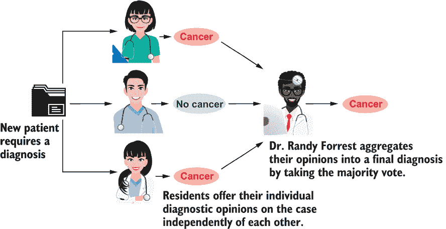

图 1.1 每次福雷斯特博士接诊新病例时，他都会询问所有住院医生对该病例的意见。他的住院医生会提供诊断：病人是否有癌症。然后，福雷斯特博士选择多数答案作为他团队提出的最终诊断。

弗罗斯特博士体现了一个诊断集成：他将他的住院医生的诊断汇总成一个代表团队集体智慧的单一诊断。结果证明，弗罗斯特博士比任何单个住院医生都正确，因为他知道他的住院医生都很聪明，而且大量聪明的住院医生不太可能都犯同样的错误。在这里，弗罗斯特博士依赖于*模型聚合*或*模型平均化*的力量：他知道平均答案最有可能是一个好的答案。

然而，弗罗斯特博士如何知道他的所有住院医生都没有错呢？当然，他不能确定这一点。然而，他仍然防范了这种不希望的结果。记住，他的住院医生都有不同的专业。由于他们不同的背景、培训、专业和技能，所有他的住院医生都可能是错的，但这可能性非常小。在这里，弗罗斯特博士依赖于*集成多样性*，即他集成中个体组件的多样性。

当然，兰迪·弗罗斯特博士是一个集成方法，他的住院医生（正在接受培训）是构成集成的机器学习算法。他成功的关键，以及集成方法的成功，在于

+   *集成多样性*——他有各种各样的意见可供选择。

+   *模型聚合*——他可以将这些意见合并成一个最终的看法。

任何机器学习算法的集合都可以用来构建一个集成，字面上讲，就是一个机器学习者的群体。但为什么它们会起作用呢？詹姆斯·苏罗维基在《群体的智慧》一书中这样描述人类集成或明智的群体：

如果你让足够多、不同且独立的人群做出预测或估计概率，这些答案的平均值将抵消个别估计中的错误。可以说，每个人的猜测都有两个组成部分：信息和错误。减去错误，你剩下的是信息。

这也正是学习者集成背后的直觉：通过聚合单个学习者，可以构建一个明智的机器学习集成。

集成方法

形式上，集成学习方法是一种机器学习算法，旨在通过聚合多个估计器或模型的预测来提高任务上的预测性能。以这种方式，集成学习方法学习一个*元估计器*。

集成方法成功的关键是集成多样性，也被称为模型互补性或模型正交性的其他术语。非正式地说，集成多样性指的是集成组件或机器学习模型之间彼此不同的事实。在集成学习中训练这样的多样性个体模型集是一个关键挑战，不同的集成方法以不同的方式实现这一点。

## 1.2 为什么你应该关注集成学习

你可以用集成方法做什么？它们真的是炒作，还是真的值得赞美？正如我们在本节中看到的，它们可以用于训练和部署针对许多不同应用的稳健和有效的预测模型。

集成方法的一个显著成功是它们在数据科学竞赛（与深度学习并驾齐驱）中的主导地位，在这些竞赛中，它们在多种机器学习任务和应用领域上通常都取得了成功。

Kaggle 的首席执行官 Anthony Goldbloom 在 2015 年透露，对于结构化问题最成功的三个算法是 XGBoost、随机森林和梯度提升，它们都是集成方法。确实，如今解决数据科学竞赛最流行的方式是将特征工程与集成方法相结合。结构化数据通常以表格、关系数据库和其他我们大多数人熟悉的格式组织，集成方法已经证明在这种类型的数据上非常成功。

相比之下，非结构化数据并不总是具有表格结构。图像、音频、视频、波形和文本数据通常是未结构化的，深度学习方法——包括自动特征生成——在这些类型的数据上已经非常成功。虽然我们在这本书的大部分内容中关注结构化数据，但集成方法也可以与深度学习结合来解决非结构化问题。

除了竞赛之外，集成方法在多个领域推动数据科学的发展，包括金融和商业分析、医学和医疗保健、网络安全、教育、制造业、推荐系统、娱乐等。

在 2018 年，Olson 等人²对 14 种流行的机器学习算法及其变体进行了全面分析。他们评估了每个算法在 165 个分类基准数据集上的性能。他们的目标是模拟标准的机器学习流程，以提供有关如何选择机器学习算法的建议。

这些综合结果被汇总到图 1.2 中。每一行显示了在所有 165 个数据集中，一个模型相对于其他模型的表现频率。例如，XGBoost 在 165 个基准数据集中有 34 个胜过梯度提升（第一行，第二列），而梯度提升在 165 个基准数据集中有 12 个胜过 XGBoost（第二行，第一列）。在剩余的 119 个数据集中，它们的性能非常相似，这意味着两个模型在 119 个数据集上的表现相当。

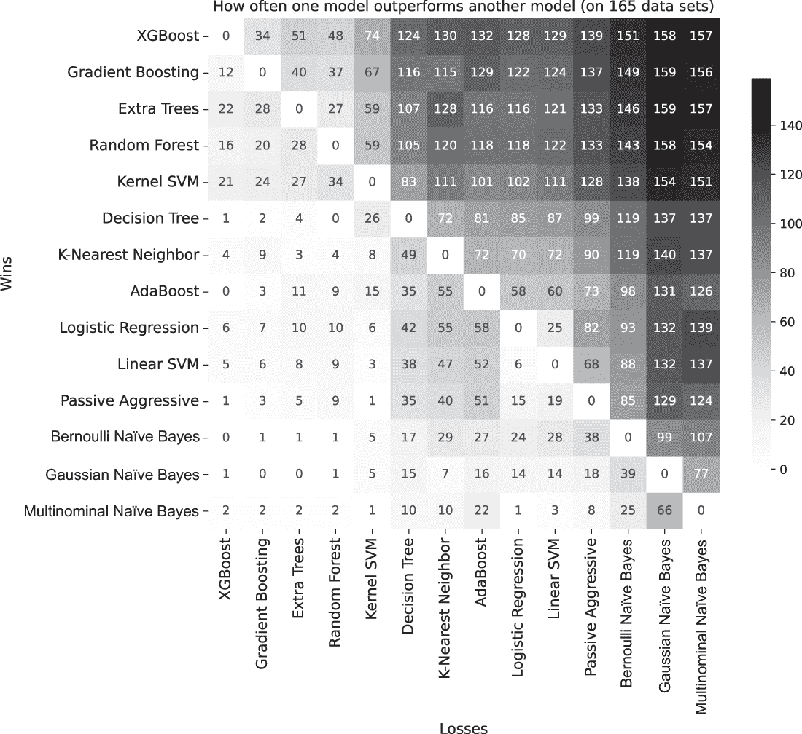

图 1.2 我应该为我的数据集使用哪种机器学习算法？这里展示了几个不同的机器学习算法在 165 个基准数据集上的性能，相对于彼此。根据它们在所有基准数据集上的性能相对于所有其他方法的排名（从上到下，从左到右），最终训练好的模型被排序。在评估中，Olson 等人认为，如果两种方法的预测准确率相差在 1% 以内，则认为它们在数据集上的性能相同。此图使用作者编译的代码库和综合实验结果重新生成，这些结果包含在公开可用的 GitHub 仓库中（[`github.com/rhiever/sklearn-benchmarks`](https://github.com/rhiever/sklearn-benchmarks)），并包括作者对 XGBoost 的评估。

相比之下，XGBoost 在 165 个数据集中击败了多项式朴素贝叶斯（MNB）中的 157 个（第一行，最后一列），而 MNB 只在 165 个数据集中的 2 个（最后一行，第一列）上击败了 XGBoost，并且只能在 165 个数据集中的 6 个上与 XGBoost 匹配！

通常情况下，集成方法（1：XGBoost，2：梯度提升，3：Extra Trees，4：随机森林，8：AdaBoost）在性能上明显优于其他方法。这些结果恰好说明了为什么集成方法（特别是基于树的集成方法）被认为是当前最先进的。

如果你的目标是开发从你的数据中提取最先进的分析，或者是为了提高性能并改进你已有的模型，这本书适合你。如果你的目标是为了在数据科学竞赛中更有效地竞争以获得名利或者只是提高你的数据科学技能，这本书也适合你。如果你对将强大的集成方法添加到你的机器学习工具箱中感到兴奋，这本书绝对适合你。

为了强调这一点，我们将构建我们的第一个集成方法：一个*简单模型组合集成*。在我们这样做之前，让我们深入了解大多数机器学习方法必须处理的拟合和复杂性的权衡，这将帮助我们理解为什么集成方法如此有效。

## 1.3 单个模型中的拟合与复杂度

在本节中，我们将探讨两种流行的机器学习方法：决策树和支持向量机（SVMs）。在探讨过程中，我们将了解它们在学习越来越复杂的模型时，其拟合和预测行为是如何变化的。本节还作为我们在建模过程中通常遵循的训练和评估实践的复习。

机器学习任务通常是

+   *监督学习任务*—这些任务有一个带有*标记示例*的数据集，其中数据已经被标注。例如，在癌症诊断中，每个示例将是一个单独的患者，带有标签/注释“有癌症”或“没有癌症”。标签可以是 0-1（二元分类）、分类（多类分类）或连续（回归）。

+   *无监督学习任务*——这些任务具有一个*未标记示例*的数据集，其中数据缺乏注释。这包括诸如通过某种“相似性”概念将示例分组在一起（聚类）或识别不符合预期模式的异常数据（异常检测）等任务。

我们将创建一个简单、人工生成的、监督回归数据集，以说明训练机器学习模型的关键挑战，并激发对集成方法的需求。使用这个数据集，我们将训练越来越复杂的机器学习模型，这些模型在训练过程中拟合数据，并最终过度拟合数据。正如我们将看到的，训练过程中的过度拟合并不一定会产生泛化能力更好的模型。

### 1.3.1 决策树回归

最受欢迎的机器学习模型之一是决策树，³，它可以用于分类以及回归任务。决策树由决策节点和叶节点组成，每个决策节点测试当前示例的特定条件。

例如，在图 1.3 中，我们使用决策树分类器对一个具有两个特征的数据集进行二元分类任务，这两个特征是*x*[1]和*x*[2]。第一个节点测试每个输入示例，看第二个特征*x*[2]是否大于 5，然后根据结果将示例引导到决策树的右侧或左侧分支。这个过程一直持续到输入示例达到叶节点；在这个时候，返回与叶节点对应的预测。对于分类任务，叶值是一个类标签，而对于回归任务，叶节点返回一个回归值。

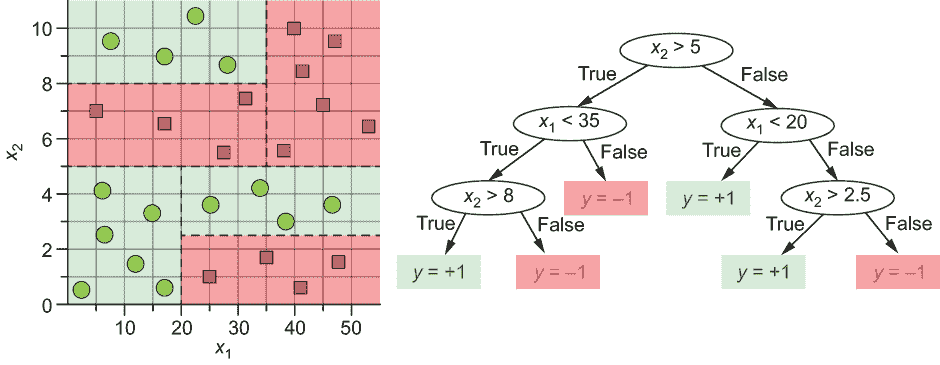

图 1.3 决策树将特征空间划分为轴平行的矩形。当用于分类时，树在决策节点上检查特征的条件，在每个测试后引导示例向左或向右。最终，示例过滤到一个叶节点，该节点将给出其分类标签。根据此决策树对特征空间的划分如图左侧所示。

深度为 1 的决策树称为*决策桩*，是最简单的树。决策桩包含一个决策节点和两个叶节点。一个*浅决策树*（例如，深度为 2 或 3）将具有少量决策节点和叶节点，是一个简单的模型。因此，它只能表示简单的函数。

另一方面，一个更深的决策树是一个更复杂的模型，具有更多的决策节点和叶节点。因此，一个更深的决策树可以表示更丰富和更复杂的函数。

决策树中的拟合与复杂度

我们将在一个名为*Friedman-1*的合成数据集的背景下探索模型拟合和表示复杂度之间的这种权衡，该数据集最初由杰罗姆·弗里德曼于 1991 年创建，用于探索他的新多元自适应回归样条(MARS)算法在拟合高维数据方面的表现。

这个数据集是精心生成的，用于评估回归方法仅能从数据集中提取真实特征依赖关系的能力，并忽略其他关系。更具体地说，数据集生成了 15 个随机生成的特征，其中只有前 5 个特征与目标变量相关：

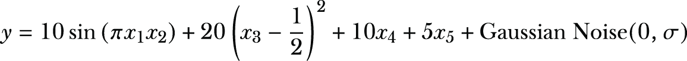

scikit-learn 包含一个内置函数，我们可以使用它来生成尽可能多的数据：

```
from sklearn.datasets import make_friedman1
X, y = make_friedman1(n_samples=500,           ❶
                      n_features=15,           ❷
                      noise=0.3,               ❸
                      random_state=23)
```

❶ 生成包含 500 个示例的数据集

❷ 每个示例将包含 15 个特征。

❸ 对每个标签添加高斯噪声，使其更真实

我们将随机将数据集分成训练集（包含 67%的数据）和测试集（包含 33%的数据），以更清楚地说明复杂度与拟合之间的效应。

TIP 在建模过程中，我们通常需要将数据分成训练集和测试集。这些集应该有多大？如果构成训练集的数据比例太小，模型将没有足够的数据进行训练。如果构成测试集的数据比例太小，我们关于模型在未来的数据上表现如何的泛化估计将会有更高的变化。对于中等或大型数据集（称为帕累托原则），一个好的经验法则是从 80%-20%的训练-测试分割开始。对于小型数据集，另一个好的规则是使用留一法，每次评估时留出一个示例，并针对每个示例重复整体训练和评估过程。

对于不同的深度 d = 1 到 10，我们在训练集上训练一棵树，并在测试集上评估它。当我们查看不同深度的训练误差和测试误差时，我们可以确定“最佳树”的深度。我们用*评估指标*来定义“最佳”。对于回归问题，有几个评估指标：均方误差(MSE)、平均绝对偏差(MAD)、决定系数等。

我们将使用决定系数，也称为*R*² *得分*，它衡量标签(*y*)中可从特征(*x*)预测的方差比例。

决定系数

决定系数（*R*²）是回归性能的一个度量。*R*² 是从特征中可预测的真实标签方差的比例。*R*² 取决于两个量：1) 真实标签中的总方差，或称 *总平方和*（TSS）；2) 真实标签与预测标签之间的均方误差（MSE），或称 *残差平方和*（RSS）。我们有 *R*² = 1 - *RSS* / *TSS*。一个完美的模型将没有预测误差，即 *RSS* = 0，其对应的 *R*² = 1。真正好的模型其 *R*² 值接近 1。一个真正差的模型将会有高的预测误差和高 RSS。这意味着对于真正差的模型，我们可能会有负的 *R*²。

最后要注意的一点是，我们正在将数据随机分割为训练集和测试集，这意味着我们的分割可能会非常幸运或非常不幸。为了避免随机性的影响，我们重复实验 K = 5 次，并在运行之间平均结果。为什么是 5？这个选择通常是相当任意的，你将不得不决定你是否想要测试误差的更小变化（K 的较大值）或更少的计算时间（K 的较小值）。

我们的实验伪代码如下：

```
for run = 1:5
    (Xtrn, ytrn), (Xtst, ytst) = split data (X), labels (y) into 
                                 training & test subsets randomly
    for depth d = 1:10
        tree[d] = train decision tree of depth d on the                   training subset (Xtrn, ytrn)
        train_scores[run, d] = compute R2 score of tree[d] on the 
                               training set (Xtrn, ytrn)
        test_scores[run, d]  = compute R2 score of tree[d] on the 
                               test set (Xtst, ytst)
mean_train_score = average train_scores across runs
mean_test_score = average test_scores across runs
```

以下代码片段正是这样做的，然后它绘制了训练和测试分数。而不是明确实现前面的伪代码，以下代码使用 scikit-learn 函数 sklearn.model_selection.ShuffleSplit 自动将数据分割成五个不同的训练集和测试集，并使用 sklearn.model_selection.validation_curve 确定不同决策树深度的 *R*² 分数：

```
import numpy as np
from sklearn.tree import DecisionTreeRegressor
from sklearn.model_selection import ShuffleSplit
from sklearn.model_selection import validation_curve

subsets = ShuffleSplit(n_splits=5, test_size=0.33, 
                       random_state=23)                            ❶

model = DecisionTreeRegressor()
trn_scores, tst_scores = validation_curve(model, X, y,             ❷
                                          param_name='max_depth', 
                                          param_range=range(1, 11),
                                          cv=subsets, scoring='r2')
mean_train_score = np.mean(trn_scores, axis=1) 
mean_test_score = np.mean(tst_scores, axis=1)  
```

❶ 设置了五种不同的数据随机分割为训练集和测试集

❷ 对于每个分割，训练深度从 1 到 10 的决策树，然后在测试集上进行评估

记住，我们的最终目标是构建一个能够很好地 *泛化* 的机器学习模型，也就是说，一个在 *未来未见数据* 上表现良好的模型。因此，我们的第一个本能将是训练一个达到最小训练误差的模型。这样的模型通常会很复杂，以便尽可能多地拟合训练示例。毕竟，一个复杂的模型可能会很好地拟合我们的训练数据并具有小的训练误差。自然而然地，我们会假设一个达到最小训练误差的模型在未来的泛化能力也应该很好，并且能够同样好地预测未见示例。

现在，让我们看看图 1.4 中的训练和测试分数，看看这是否如此。记住，*R*² 分数接近 1 表示一个非常好的回归模型，而分数远离 1 表示模型更差。

深度更大的决策树更复杂，具有更强的表达能力，因此看到深度更大的树更好地拟合训练数据并不奇怪。这从图 1.4 中很明显：随着树深度（模型复杂度）的增加，训练分数接近 *R*² = 1。因此，更复杂的模型在训练数据上达到更好的拟合。

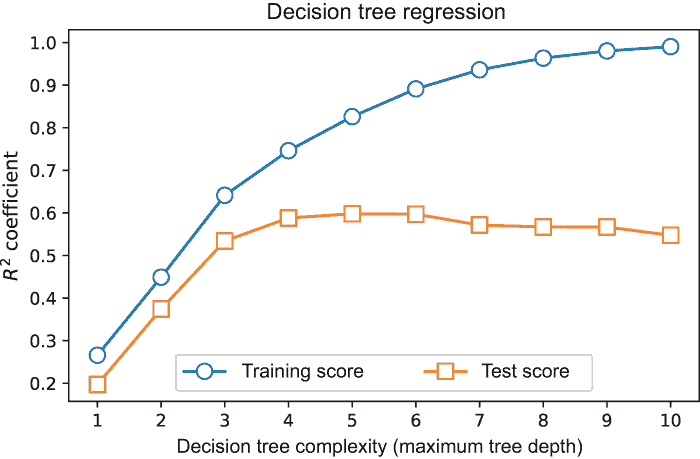

图 1.4 使用 R² 作为评估指标，比较了不同深度的决策树在 Friedman-1 回归数据集上的表现。更高的 R² 分数意味着模型达到更低的误差并更好地拟合数据。一个接近 1 的 R² 分数意味着模型达到几乎零误差。使用非常深的决策树几乎可以完美地拟合训练数据，但这样的过度复杂模型实际上过度拟合了训练数据，并且对未来数据的泛化能力不好，如测试分数所示。

然而，令人惊讶的是，*测试 R²* 分数并没有随着复杂性的增加而相应地持续增加。事实上，超过 max_depth=4 后，测试分数保持相当稳定。这表明深度为 8 的树可能比深度为 4 的树更适合训练数据，但这两棵树在尝试泛化和对新数据进行预测时表现大致相同！

随着决策树的深度增加，它们变得更加复杂，并实现更低的训练误差。然而，它们对未来数据（通过测试分数估计）的泛化能力并没有持续下降。这是一个相当反直觉的结果：在训练集上拟合最好的模型不一定是在实际应用中用于预测的最佳模型。

我们可能会认为我们在随机划分训练集和测试集时运气不好。然而，我们用五个不同的随机划分进行了实验，并平均了结果以避免这种情况。为了确保，让我们用另一种众所周知的机器学习方法重复这个实验：支持向量回归。⁴

### 1.3.2 使用支持向量机进行回归

与决策树一样，支持向量机（SVMs）是一种很好的现成建模方法，大多数软件包都提供了 SVMs 的稳健实现。你可能已经使用过 SVMs 进行分类，在这种情况下，可以使用径向基函数（RBF）核或多项式核等核学习相当复杂的非线性模型。SVMs 也已被用于回归，并且与分类情况一样，它们在训练过程中试图找到一个在正则化和拟合度之间进行权衡的模型。具体来说，SVM 训练试图找到一个模型来最小化

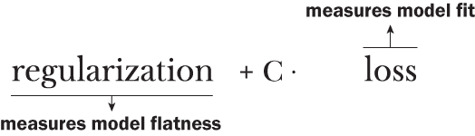

正则化项衡量模型的平坦度：它被最小化的程度越高，学习到的模型就越线性、越简单。损失项通过 *损失函数*（通常是均方误差 MSE）衡量对训练数据的拟合度：它被最小化的程度越高，对训练数据的拟合度就越好。*正则化* 参数 *C* 在这两个相互竞争的目标之间进行权衡：

+   *C* 的值较小意味着模型将更多地关注正则化和简单性，而较少关注训练误差，这导致模型具有更高的训练误差和 *欠拟合*。

+   *C*的值较大意味着模型将更多地关注训练错误，并学习更复杂的模型，这导致模型具有更低的训练错误率，并可能*过拟合*。

我们可以在图 1.5 中看到增加*C*值对学习模型的影响。特别是，我们可以可视化拟合与复杂度之间的权衡。

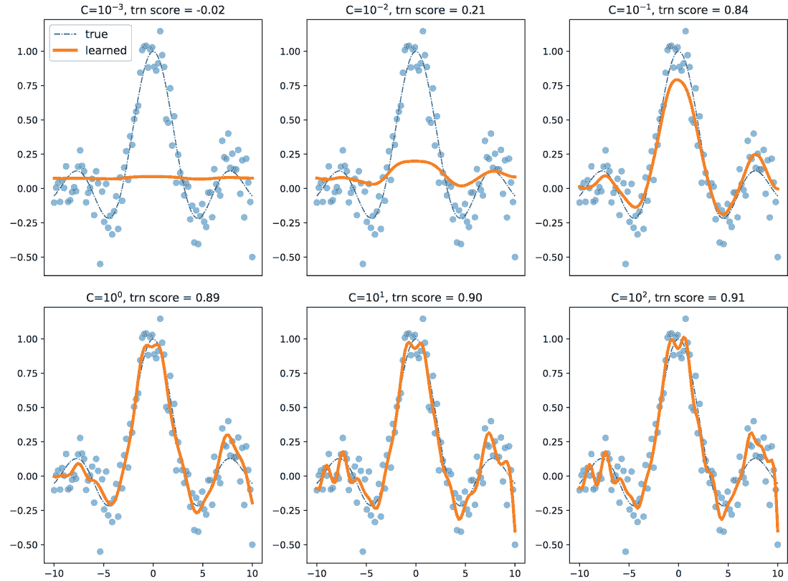

图 1.5 使用 RBF 核的支持向量机，核参数 gamma = 0.75。小的*C*值导致更线性（更平坦）且复杂度更低的模型，这些模型欠拟合数据，而大的*C*值导致更非线性（更弯曲）且更复杂的模型，这些模型过拟合数据。选择合适的*C*值对于训练一个好的 SVM 模型至关重要。

注意：SVMs 识别支持向量，这是一个较小的训练示例集合，模型依赖于它。计算支持向量的数量并不是衡量模型复杂性的有效方法，因为小的*C*值会限制模型更多，迫使它在最终模型中使用更多的支持向量。

支持向量机中的拟合与复杂度

与 DecisionTreeRegressor()中的 max_depth 类似，支持向量回归（SVR）中的参数 C 可以调整以获得具有不同行为的模型。同样，我们面临着相同的问题：哪个是最好的模型？为了回答这个问题，我们可以重复与决策树相同的实验：

```
from sklearn.svm import SVR

model = SVR(kernel='rbf', gamma=0.1)
trn_scores, tst_scores = validation_curve(model, X, y.ravel(),    
                                          param_name='C',  
                                          param_range=np.logspace(-2, 4, 7), 
                                          cv=subsets, scoring='r2')

mean_train_score = np.mean(trn_scores, axis=1) 
mean_test_score = np.mean(tst_scores, axis=1)  
```

在这个代码片段中，我们使用三阶多项式核训练了一个 SVM。我们尝试了七个*C*的值——10^-3, 10^-2, 10^-1, 1, 10, 10², 和 10³——并像之前一样，在图 1.6 中可视化训练和测试分数。

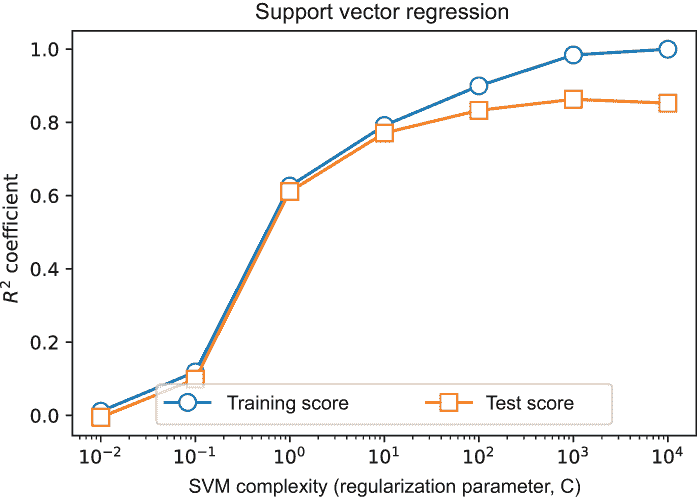

图 1.6 使用*R*²作为评估指标，比较了不同复杂度的 SVM 回归器在 Friedman-1 回归数据集上的表现。与决策树一样，高度复杂的模型（对应于更高的*C*值）似乎在训练数据上实现了惊人的拟合，但实际上泛化能力并不强。这意味着随着*C*的增加，过拟合的可能性也增加。

再次，出人意料的是，在训练集上拟合最好的模型并不一定是当部署到现实世界中的最佳预测模型。实际上，每个机器学习算法都表现出这种行为：

+   过度简单的模型往往不能正确拟合训练数据，并且对未来数据的泛化能力较差；一个在训练和测试数据上表现不佳的模型是*欠拟合*。

+   过度复杂的模型虽然可以达到非常低的训练错误率，但往往在未来的数据上泛化能力较差；一个在训练数据上表现良好，但在测试数据上表现不佳的模型是*过拟合*。

+   最佳模型在复杂度和拟合之间进行权衡，在训练过程中牺牲一点每一项，以便在部署时能够最有效地泛化。

正如我们将在下一节中看到的，集成方法是解决拟合与复杂度问题的有效方法。

偏差-方差权衡

我们之前非正式讨论的拟合与复杂度权衡问题更正式地被称为**偏差-方差权衡**。模型的**偏差**是指由建模假设（例如对简单模型的偏好）引起的误差。模型的**方差**是指由对数据集微小变化的敏感性引起的误差。

高度复杂的模型（低偏差）会过度拟合数据并对噪声更敏感（高方差），而简单的模型（高偏差）会欠拟合数据并对噪声不敏感（低方差）。这种权衡是每个机器学习算法固有的。集成方法通过结合几个低偏差模型来减少它们的方差，或者结合几个低方差模型来减少它们的偏差，以克服这个问题。

## 1.4 我们的第一个集成

在本节中，我们将通过训练我们的第一个集成来克服单个模型的拟合与复杂度问题。回想一下寓言中的福雷斯特博士，一个有效的集成在一系列组件模型上执行模型聚合，如下所示：

+   我们使用不同的基础学习算法在相同的数据集上训练一组**基础估计器**（也称为**基础学习器**）。也就是说，我们依赖每个学习算法的显著差异来产生一组多样化的基础估计器。

+   对于回归问题（例如，前一小节中引入的 Friedman-1 数据），单个基础估计器的预测是连续的。我们可以通过**简单平均**单个预测结果来汇总结果，形成一个最终的集成预测。

我们使用以下回归算法从我们的数据集中生成基础估计器：核岭回归、支持向量回归、决策树回归、k 最近邻回归、高斯过程和多层感知器（神经网络）。

一旦我们有了训练好的模型，我们使用每个模型进行单个预测，然后将单个预测汇总成一个最终的预测，如图 1.7 所示。

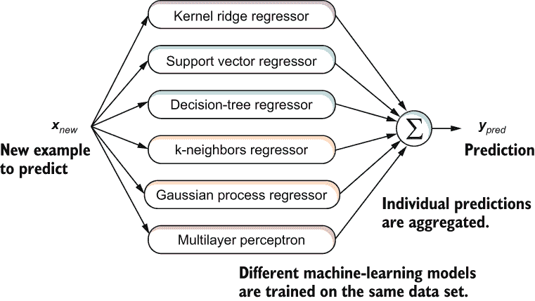

图 1.7 我们的第一个集成方法通过平均六个不同的回归模型的预测来集成预测。这个简单的集成说明了集成两个关键原则：（1）模型多样性，在本例中通过使用六个不同的基础机器学习模型实现；（2）模型聚合，在本例中通过简单平均预测实现。

训练单个基础估计器的代码如下所示。

列表 1.1 训练多样化的基础估计器

```
from sklearn.model_selection import train_test_split
from sklearn.datasets import make_friedman1

X, y = make_friedman1(n_samples=500, n_features=15, 
                      noise=0.3, random_state=23)        ❶
Xtrn, Xtst, ytrn, ytst = train_test_split(
                             X, y, test_size=0.25)       ❷

from sklearn.kernel_ridge import KernelRidge
from sklearn.svm import SVR
from sklearn.tree import DecisionTreeRegressor
from sklearn.neighbors import KNeighborsRegressor
from sklearn.gaussian_process import GaussianProcessRegressor
from sklearn.neural_network import MLPRegressor

estimators = {'krr': KernelRidge(kernel='rbf', 
                                 gamma=0.25),            ❸
              'svr': SVR(gamma=0.5),
              'dtr': DecisionTreeRegressor(max_depth=3),
              'knn': KNeighborsRegressor(n_neighbors=4),
              'gpr': GaussianProcessRegressor(alpha=0.1),
              'mlp': MLPRegressor(alpha=25, max_iter=10000)}

for name, estimator in estimators.items():
    estimator = estimator.fit(Xtrn, ytrn)               ❹
```

❶ 生成包含 500 个示例和 15 个特征的合成 Friedman-1 数据集

❷ 将数据集分为训练集（包含 75%的数据）和测试集（包含剩余的 25%）

❸ 初始化每个单个基础估计器的超参数

❹ 训练单个基础估计器

我们现在已经使用六种不同的基础学习算法训练了六个不同的基础估计器。给定新的数据，我们可以将单个预测聚合成一个最终的预测，如下面的列表所示。

列表 1.2 聚合基础估计器的预测

```
import numpy as np
n_estimators, n_samples = len(estimators), Xtst.shape[0]
y_individual = np.zeros((n_samples, n_estimators))           ❶
for i, (model, estimator) in enumerate(estimators.items()): 
    y_individual[:, i] = estimator.predict(Xtst)             ❷

y_final = np.mean(y_individual, axis=1)                      ❸
```

❶ 初始化单个预测

❷ 使用基础估计器进行单个预测

❸ 聚合（平均）单个预测

理解集成好处的一种方式是查看所有可能的模型预测组合。也就是说，我们一次查看一个模型的性能，然后查看所有可能的两个模型的集成（有 15 种这样的组合），然后查看所有可能的三个模型的集成（有 20 种组合），以此类推。对于集成大小为 1 到 6 的情况，我们在图 1.8 中绘制了所有这些集成组合的测试集性能。

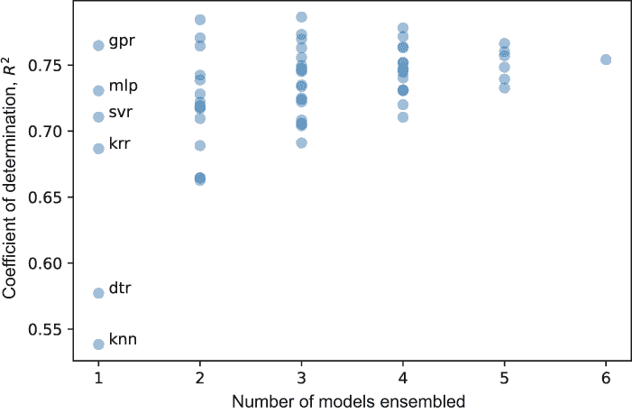

图 1.8 预测性能与集成大小的关系。当集成大小为 1 时，我们可以看到各个模型的性能相当多样。当大小为 2 时，我们平均不同对模型的结果（在这种情况下，15 个集成）。当大小为 3 时，我们一次平均 3 个模型的结果（在这种情况下，20 个集成），以此类推，直到大小为 6，此时我们将所有 6 个模型的结果平均到一个单一的、庞大的集成中。

随着我们聚合越来越多的模型，我们看到集成泛化得越来越好。然而，我们实验中最引人注目的结果是，所有六个估计器的集成性能通常比每个单个估计器的性能都要好。

最后，拟合与复杂性的关系如何？描述集成的复杂性是困难的，因为我们的集成中不同类型的估计器具有不同的复杂性。然而，我们可以描述集成的*方差*。

回想一下，估计器的方差反映了其对数据的敏感性。高方差估计器非常敏感且鲁棒性较差，通常是因为它过度拟合。在图 1.9 中，我们显示了图 1.8 中集成的方差，即带宽的宽度。

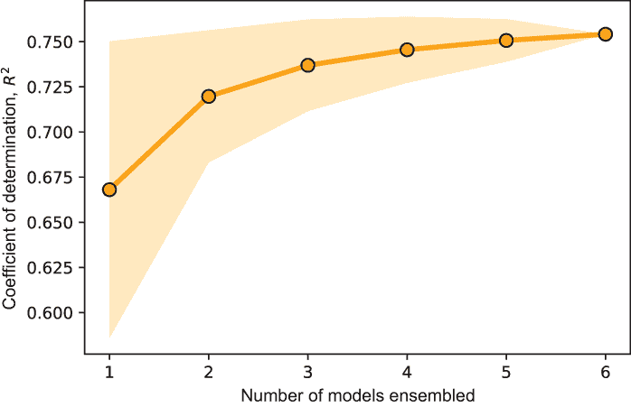

图 1.9 集成组合的平均性能增加，表明更大的集成表现更好。性能组合的标准差（方差的平方根）降低，表明整体方差降低！

随着集成大小的增加，集成的方差减小！这是模型聚合或平均化的结果。我们知道平均“可以平滑粗糙的边缘。”在我们的集成中，平均单个预测可以平滑掉单个基础估计器所犯的错误，取而代之的是集成的智慧：从多到一。整体集成对错误的鲁棒性更强，并且不出所料，比任何单个基础估计器泛化得更好。

集成中的每个组件估计器都是独立的，就像福雷斯特博士的住院医生之一一样，每个估计器都根据自己的经验（在学习过程中引入）进行预测。在预测时间，当我们有六个个体时，我们将有六个预测，或六个观点。对于“简单例子”，个体之间将大部分达成一致。对于“困难例子”，个体之间会有所不同，但平均而言，更可能接近正确答案。⁵

在这个简单的场景中，我们通过使用六种不同的学习算法训练了六个“多样化”的模型。集成多样性对于集成成功至关重要，因为它确保了各个估计器彼此不同，并且不会犯相同的错误。

正如我们在每一章中都会反复看到的，不同的集成方法采用不同的方法来训练多样化的集成。在我们结束这一章之前，让我们来看看各种集成技术的广泛分类，其中许多将在接下来的几章中介绍。

## 1.5 集成方法的术语和分类法

所有集成都是由称为*基础模型*、*基础学习器*或*基础估计器*（这些术语在本书中可以互换使用）的单独机器学习模型组成的，并且使用*基础机器学习算法*进行训练。基础模型通常用它们的复杂性来描述。足够复杂（例如，深层决策树）并且具有“良好”预测性能（例如，对于二元分类任务的准确率超过 80%）的基础模型通常被称为强学习器或*强模型*。

与之相反，那些相当简单（例如，浅层决策树）且仅能实现勉强可接受性能（例如，对于二元分类任务的准确率约为 51%）的基础模型被称为*弱学习器*或*弱模型*。更正式地说，弱学习器只需比随机机会略好，或者对于二元分类任务来说，就是 50%。正如我们很快就会看到的，集成方法要么使用弱学习器，要么使用强学习器作为基础模型。

更广泛地说，根据它们的训练方式，集成方法可以分为两种类型：*并行*和*顺序集成*。这是我们将在本书中采用的分类法，因为它为我们提供了一个整洁的方式来分组大量现有的集成方法（见图 1.10）。

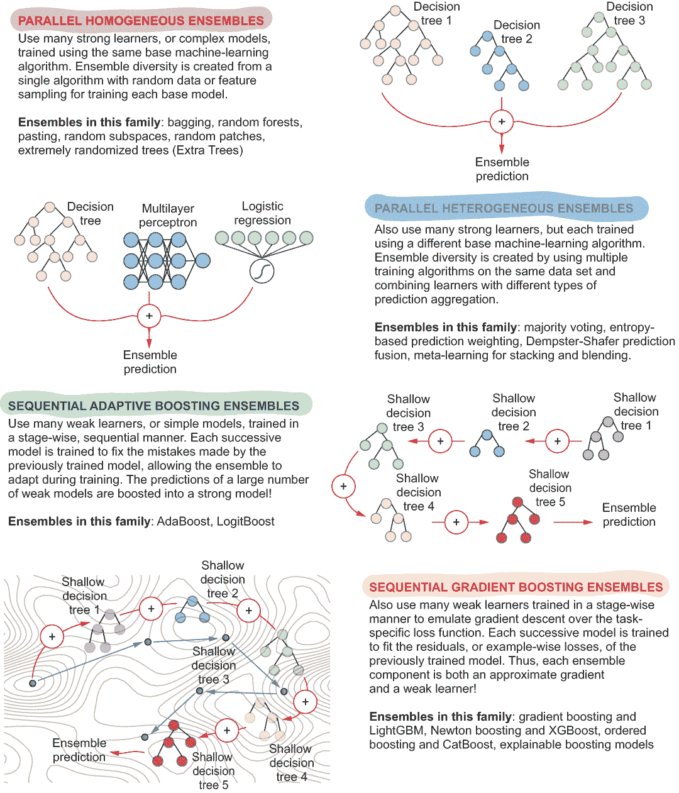

图 1.10 本书涵盖的集成方法分类

如其名所示，并行集成方法独立于其他模型训练每个组件基础模型，这意味着它们可以并行训练。并行集成通常由强学习器构成，并且可以进一步分为以下几类：

+   *同质并行集成*——所有基学习器都是同一类型（例如，所有决策树）并且使用相同的基学习算法进行训练。一些著名的集成方法，如 bagging、随机森林和极端随机树（Extra Trees），都是并行集成方法。这些内容在第二章中有详细说明。

+   *异质并行集成*——基学习器使用不同的基学习算法进行训练。通过堆叠进行元学习是这种集成技术的一个著名例子。这些内容在第三章中有详细说明。

与并行集成方法不同，顺序集成方法利用基学习器之间的依赖关系。更具体地说，在训练过程中，顺序集成以这种方式训练新的基学习器，即最小化前一步训练的基学习器所犯的错误。这些方法按阶段顺序构建集成，通常使用弱学习器作为基模型。它们还可以进一步分为以下几类：

+   *自适应提升集成*——也称为普通提升，这些集成通过自适应地重新加权示例来训练后续的基学习器，以纠正前一轮迭代中的错误。AdaBoost，所有提升方法的鼻祖，是这种集成方法的例子。这些内容在第四章中有详细说明。

+   *梯度提升集成*——这些集成扩展并推广了自适应提升的想法，旨在模拟梯度下降，这是在底层实际训练机器学习模型时经常使用的。一些最强大的现代集成学习包实现了某种形式的梯度提升（LightGBM，第五章）、牛顿提升（XGBoost，第六章）或有序提升（CatBoost，第八章）。

## 摘要

+   集成学习方法旨在通过训练多个模型并将它们组合成一个元估计器来提高预测性能。集成中的组件模型被称为基估计器或基学习器。

+   集成方法利用“群体智慧”的力量，这一原则基于集体意见比群体中任何单个个体更有效的观点。

+   集成方法在多个应用领域得到广泛应用，包括金融和商业分析、医疗保健、网络安全、教育、制造、推荐系统、娱乐等。

+   大多数机器学习算法都面临着拟合与复杂度（也称为偏差-方差）之间的权衡，这影响了它们对未来数据的泛化能力。集成方法使用多个组件模型来克服这种权衡。

+   一个有效的集成需要两个关键要素：(1) 集成多样性和(2) 对最终预测的模型聚合。

* * *

(1.) 安德烈亚斯·托舍尔（Andreas Töscher）、迈克尔·亚雷尔（Michael Jahrer）和罗伯特·M·贝尔（Robert M. Bell），《Netflix 大奖赛的 BigChaos 解决方案》([`mng.bz/9V4r`](http://mng.bz/9V4r))。

(2.) Randal S. Olson, William La Cava, Zairah Mustahsan, Akshay Varik, 和 Jason H. Moore，*将机器学习应用于生物信息学问题的数据驱动建议*，太平洋机器学习研讨会（2018）；arXiv 预印本：[`arxiv.org/abs/1708.05070`](https://arxiv.org/abs/1708.05070)。

(3.) 关于使用决策树进行学习的更多细节，请参阅 Peter Harrington 所著的《机器学习实战》第三章（分类）和第九章（回归）（Manning, 2012）。

(4.) 关于分类中的 SVM 的更多细节，请参阅 Peter Harrington 所著的《机器学习实战》第六章（Manning, 2012）。关于回归中的 SVM，请参阅 Alex J. Smola 和 Bernhard Scholköpf 的《支持向量回归教程》(*Statistics and Computing*, 2004)，以及 sklearn.SVM.SVR()的文档页面。

(5.) 有时候这种情况会出现问题。在英国版的《谁想成为百万富翁？》中，一位参赛者成功晋级到 125,000 英镑（约合 16 万美元），当被问到哪本小说以“5 月 3 日。比斯特里茨。晚上 8:35 离开慕尼黑。”开头时，他使用了 50/50 的生命线，只剩下两个选择：*《间谍之影》和《德古拉》*。知道如果答错可能会损失 93,000 英镑，他向现场观众求助。作为回应，81%的观众投票选择了*《间谍之影》*。观众们信心满满——不幸的是，他们错了。正如你在书中看到的，我们通过做出关于“观众”的某些假设来避免这种情况，在我们的案例中，这些假设是基于基础估计的。
