# 2 同质并行集成：Bagging 和随机森林

本章涵盖

+   训练同质并行集成

+   实现和理解 Bagging

+   实现和理解随机森林的工作原理

+   使用粘贴、随机子空间、随机补丁和 Extra Trees 训练变体

+   在实践中使用 Bagging 和随机森林

在第一章中，我们介绍了集成学习并创建了我们的第一个基本的集成。为了回顾，集成方法依赖于“群众智慧”的概念：许多模型的*综合*答案通常比任何单个答案都要好。我们真正开始我们的集成学习方法之旅，从并行集成方法开始。我们之所以从这种集成方法开始，是因为从概念上讲，并行集成方法易于理解和实现。

如同其名所示，并行集成方法独立于其他组件基估计器进行训练，这意味着它们可以并行训练。正如我们将看到的，并行集成方法可以根据它们使用的不同学习算法进一步区分为同质并行集成和异质并行集成。

在本章中，你将了解同质并行集成，其组件模型都是使用相同的机器学习算法进行训练。这与下一章中介绍的异质并行集成形成对比，其组件模型使用不同的机器学习算法进行训练。同质并行集成方法类包括两种流行的机器学习方法，其中之一或两者你可能已经接触过，甚至之前使用过：*Bagging 和随机森林*。

回想一下，集成方法的两个关键组成部分是集成多样性和模型聚合。因为同质集成方法在相同的数据集上使用相同的学习算法，你可能想知道它们如何生成一组多样化的基础估计器。它们通过*随机采样*来实现，无论是训练样本（如 Bagging 所做的那样），特征（如某些 Bagging 变体所做的那样），还是两者（如随机森林所做的那样）。

本章介绍的一些算法，如随机森林，在医学和生物信息学应用中得到了广泛应用。事实上，由于它的效率（它可以在多个处理器上轻松并行化或分布式），随机森林仍然是尝试新数据集的一个强大的现成基线算法。

我们将从最基本的并行同质集成开始：Bagging。一旦你理解了 Bagging 如何通过采样实现集成多样性，我们将探讨 Bagging 最强大的变体：随机森林。

你还将了解 Bagging 的其他变体（粘贴、随机子空间、随机补丁）和随机森林（Extra Trees）。这些变体通常对大数据或高维数据的应用非常有效。

## 2.1 并行集成

首先，我们具体定义并行集成的概念。这将帮助我们将这些章节和下一章的算法置于一个单一的环境中，这样我们就可以轻松地看到它们的相似之处和不同之处。

回想一下第一章中提到的我们的集成诊断专家兰迪·福雷斯特博士。每当福雷斯特博士接诊一个新病例时，他会征求所有住院医师的意见。然后，他从住院医师提出的诊断中确定最终的诊断（图 2.1，顶部）。福雷斯特博士的诊断技术之所以成功，有两个原因：

+   他组建了一个*多样化的*住院医师团队，拥有不同的医学专业，这意味着他们每个人对病例的看法都不同。这对福雷斯特博士来说是个好事，因为它为他提供了多个不同的视角供他考虑。

+   他将住院医师的*独立*意见汇总成一个最终的诊断。在这里，他是民主的，选择了多数意见。然而，他也可以以其他方式汇总住院医师的意见。例如，他可以提高经验更丰富的住院医师的意见权重。这反映了他比其他人更信任某些住院医师，基于诸如经验或技能等因素，这意味着他们比团队中的其他住院医师更经常正确。

福雷斯特博士和他的住院医师构成一个并行集成（图 2.1，底部）。在先前的例子中，每位住院医师都是一个必须训练的基估计器（或基学习器）。基估计器可以使用不同的基算法进行训练（导致异质集成）或使用相同的基算法（导致同质集成）。

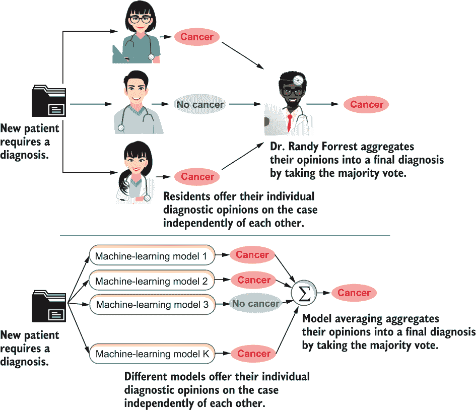

图 2.1 福雷斯特博士的诊断过程是并行集成方法的类比。

如果我们想要组建一个类似于福雷斯特博士的有效集成，我们必须解决两个问题：

+   我们如何从一个数据集中创建一组具有不同意见的基估计器？也就是说，我们如何在训练过程中确保集成多样性？

+   我们如何将每个个体基估计器的决策或预测汇总成一个最终的预测？也就是说，我们如何在预测过程中执行模型集成？

你将在下一节中看到如何做到这两点。

## 2.2 Bagging: Bootstrap aggregating

*Bagging*，即*bootstrap aggregating*，由 Leo Breiman 于 1996 年提出。这个名字指的是 Bagging 如何通过自助采样实现集成多样性，并通过模型集成执行集成预测。

Bagging 是我们能构建的最基本的同质并行集成方法。理解 Bagging 将有助于理解本章中其他集成方法。这些方法以不同的方式进一步增强了基本的 Bagging 方法：要么提高集成多样性，要么提高整体计算效率。

Bagging 使用相同的基机器学习算法来训练基本估计器。那么我们如何从一个数据集和一个学习算法中得到多个基本估计器，更不用说多样性了？这通过在数据集的副本上训练基本估计器来实现。Bagging 包括两个步骤，如图 2.2 所示：

1.  在训练过程中，自举抽样或有放回抽样被用来生成与彼此不同但来自原始数据集的重复数据集副本。这确保了在每个副本上训练的基本学习器彼此也不同。

1.  在预测期间，模型集成被用来将单个基本学习器的预测组合成一个集成预测。对于分类任务，我们可以使用多数投票来组合单个预测。对于回归任务，我们可以使用简单平均来组合单个预测。

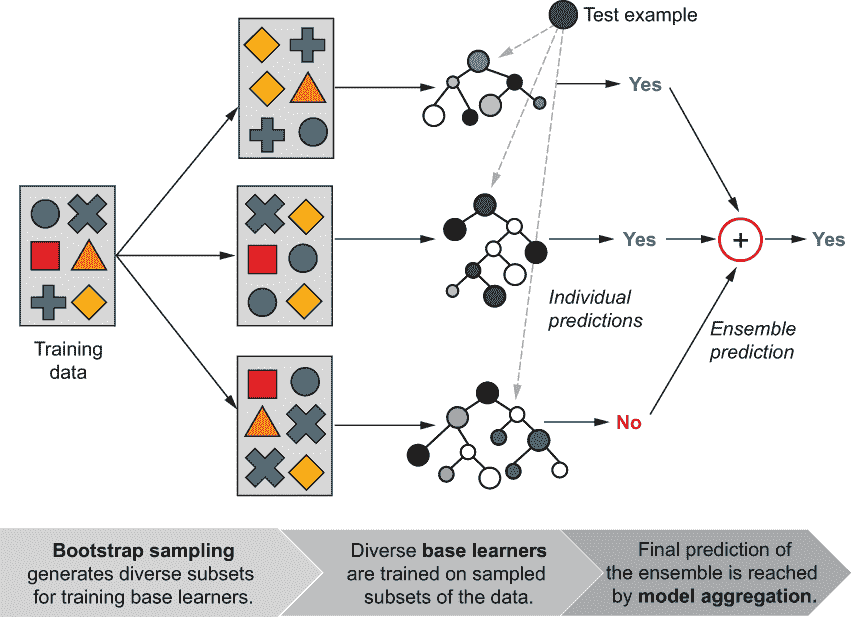

图 2.2 Bagging 示意图。Bagging 使用自举抽样从单个数据集中生成相似但不完全相同的子集（观察这里的副本）。在这些子集上训练模型，结果得到相似但不完全相同的基本估计器。对于给定的测试示例，单个基本估计器的预测被聚合成一个最终的集成预测。同时观察，训练示例可能在重复的子集中重复；这是自举抽样的结果。

### 2.2.1 直觉：重抽样和模型集成

集成多样性面临的关键挑战是我们需要使用相同的学习算法和相同的数据集来创建（并使用）不同的基本估计器。现在我们将看到如何（1）生成数据集的副本，这些副本可以用来训练基本估计器；（2）结合基本估计器的预测。

自举抽样：有放回抽样

我们将使用随机抽样来轻松地从原始数据集中生成较小的子集。为了生成相同大小的数据集副本，我们需要进行有放回抽样，也称为自举抽样。

当进行有放回的抽样时，一些已经被抽样的对象因为被替换而有机会再次被抽样（甚至第三次、第四次等）。实际上，一些对象可能会被多次抽样，而一些对象可能永远不会被抽样。有放回的抽样在图 2.3 中得到了说明，我们可以看到抽样后允许替换会导致重复。

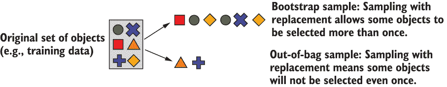

图 2.3 在六个示例的数据集上展示了自举抽样。通过有放回抽样，我们可以得到一个包含六个对象的自举样本大小，其中只有四个独特的对象但有重复。进行多次自举抽样会产生原始数据集的几个副本——它们都包含重复。

因此，重抽样自然地将数据集分为两部分：一个重抽样样本（包含至少被抽样一次的训练示例）和一个*袋外（OOB）样本*（包含从未被抽样过的训练示例）。

我们可以使用每个重抽样样本来训练不同的基础估计器。因为不同的重抽样样本将包含不同数量的重复示例，所以每个基础估计器将与其他估计器略有不同。

随机袋样本

仅仅丢弃 OOB 样本似乎相当浪费。然而，如果我们使用重抽样样本训练基础估计器，OOB 样本将被*保留*，在学习的整个过程中都不会被基础估计器看到。听起来熟悉吗？

OOB 样本实际上是一个*保留的测试集*，可以用来评估集成，而无需单独的验证集或交叉验证过程。这很棒，因为它允许我们在训练期间更有效地利用数据。使用 OOB 实例计算的错误估计称为*OOB 误差*或*OOB 分数*。

使用 numpy.random.choice 生成带替换的重抽样样本非常简单。假设我们有一个包含 50 个训练示例的数据集（比如说，具有独特 ID 的患者记录，从 0 到 49）。我们可以生成一个大小为 50 的重抽样样本（与原始数据集大小相同），用于训练（replace=True 表示带替换抽样）：

```
import numpy as np
bag = np.random.choice(range(0, 50), size=50, replace=True)
np.sort(bag)
```

这会产生以下输出：

```
array([ 1,  3,  4,  6,  7,  8,  9, 11, 12, 12, 14, 14, 15, 15, 21, 21, 21,
       24, 24, 25, 25, 26, 26, 29, 29, 31, 32, 32, 33, 33, 34, 34, 35, 35,
       37, 37, 39, 39, 40, 43, 43, 44, 46, 46, 48, 48, 48, 49, 49, 49])
```

你能在这个重抽样样本中找到重复项吗？这个重抽样样本现在作为原始数据集的一个重复样本，可以用来训练。相应的 OOB 样本是所有不在重抽样样本中的示例：

```
oob = np.setdiff1d(range(0, 50), bag)
oob
```

这会产生以下输出：

```
array([ 0,  2,  5, 10, 13, 16, 17, 18, 19, 20, 22, 23, 27, 28, 30, 36, 38,
       41, 42, 45, 47])
```

很容易验证重抽样子集和 OOB 子集之间没有重叠。这意味着 OOB 样本可以用作“测试集”。总结一下：经过一轮重抽样，我们得到一个重抽样样本（用于训练基础估计器）和一个相应的 OOB 样本（用于评估*那个*基础估计器）。

注意：带替换的抽样会丢弃某些项目，但更重要的是，会复制其他项目。当应用于数据集时，带替换的抽样可以用来创建包含重复项的训练集。你可以将这些重复项视为*加权训练示例*。例如，如果一个特定的示例在重抽样样本中重复了四次，当用于训练基础估计器时，这四个重复项将相当于使用一个权重为 4 的单个训练示例。以这种方式，不同的随机重抽样样本实际上是从随机抽样和加权训练集中抽取的。

当我们多次重复这一步骤时，我们将训练多个基础估计器，并且也会通过单个 OOB 误差来估计它们的个别泛化性能。平均 OOB 误差是对整体集成性能的良好估计。

0.632 重抽样

当进行有放回的抽样时，自助样本将包含大约 63.2%的数据集，而 OOB 样本将包含数据集的其余 36.8%。我们可以通过计算数据点被抽样的概率来展示这一点。如果我们的数据集有*n*个训练示例，则在自助样本中选中特定数据点*x*的概率是(1/*n*)。在自助样本中未选中*x*的概率（即，在 OOB 样本中选中*x*）是 1 - (1/*n*）。

对于*n*个数据点，被选入 OOB 样本的整体概率是

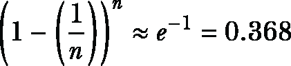

（对于足够大的*n*）。因此，每个 OOB 样本将包含（大约）36.8%的训练示例，相应的自助样本将包含（大约）剩余的 63.2%的实例。

模型聚合

自助抽样生成数据集的多样化副本，这使得我们可以独立地训练多样化的模型。一旦训练完成，我们可以使用这个集成进行预测。关键是将它们有时不同的意见结合成一个单一的最终答案。

我们已经看到了两种模型聚合的例子：多数投票和模型平均。对于分类任务，多数投票用于聚合单个基础学习器的预测。多数投票也被称为*统计众数*。众数简单地是最频繁出现的元素，是一种类似于均值或中位数的统计量。

我们可以将模型聚合视为平均：它平滑了合唱团中的不完美之处，并产生一个反映多数的单一答案。如果我们有一组稳健的基础估计器，模型聚合将平滑掉单个估计器犯的错误。

集成方法根据任务使用各种聚合技术，包括多数投票、均值、加权均值、组合函数，甚至另一个机器学习模型！在本章中，我们将坚持使用多数投票作为我们的聚合器。我们将在第三章中探索一些其他用于分类的聚合技术。

### 2.2.2 实现多重抽样

我们可以轻松实现自己的版本的多重抽样。这说明了多重抽样的简单性，并为本章中其他集成方法的工作提供了一个通用模板。在我们的多重抽样集成中，每个基础估计器的训练都是**独立地**按照以下步骤进行的：

1.  从原始数据集中生成一个自助样本。

1.  将基础估计器拟合到自助样本。

在这里，“独立地”意味着每个单个基础估计器的训练阶段在没有考虑其他基础估计器的情况下进行。

我们使用决策树作为基估计器；最大深度可以使用 max_depth 参数设置。我们还需要两个其他参数：n_estimators，即集成大小，和 max_samples，即 bootstrap 子集的大小，即每个估计器要采样的训练示例数量（有放回）。

我们的天真实现按顺序训练每个基决策树，如列表 2.1 所示。如果训练单个决策树需要 10 秒，而我们正在训练一个包含 100 棵树的集成，那么我们的实现将需要 10 秒 × 100 = 1000 秒的总训练时间。

列表 2.1 使用决策树的 Bagging：训练

```
import numpy as np
from sklearn.tree import DecisionTreeClassifier

rng = np.random.RandomState(seed=4190)                               ❶
def bagging_fit(X, y, n_estimators, max_depth=5, max_samples=200):
    n_examples = len(y)   
    estimators = [DecisionTreeClassifier(max_depth=max_depth)  
                  for _ in range(n_estimators)]                      ❷

    for tree in estimators:
        bag = np.random.choice(n_examples, max_samples, 
                               replace=True)                         ❸
        tree.fit(X[bag, :], y[bag])                                  ❹

    return estimators
```

❶ 初始化一个随机种子

❷ 创建一个未训练的基估计器列表

❸ 生成一个 bootstrap 样本

❹ 将树拟合到 bootstrap 样本

此函数将返回一个 DecisionTreeClassifier 对象的列表。我们可以使用这个集成进行预测，这已在以下列表中实现。

列表 2.2 使用决策树的 Bagging：预测

```
from scipy.stats import mode

def bagging_predict(X, estimators):
    all_predictions = np.array([tree.predict(X)            ❶
                                for tree in estimators])  
ypred, _ = mode(all_predictions, axis=0, 
                    keepdims=False)                        ❷
    return np.squeeze(ypred)
```

❶ 使用集成中的每个估计器预测每个测试示例

❷ 通过多数投票进行最终预测

我们可以在二维数据上测试我们的实现并可视化结果，如下面的代码片段所示。我们的 Bagging 集成包含 500 棵决策树，每棵树的深度为 12，并在大小为 300 的 bootstrap 样本上训练。

```
from sklearn.datasets import make_moons
from sklearn.model_selection import train_test_split
from sklearn.metrics import accuracy_score

X, y = make_moons(n_samples=300, noise=.25, 
                  random_state=rng)                           ❶
Xtrn, Xtst, ytrn, ytst = train_test_split(X, y, test_size=0.33,
                                          random_state=rng)
bag_ens = bagging_fit(Xtrn, ytrn, n_estimators=500,           ❷
                      max_depth=12, max_samples=300)
ypred = bagging_predict(Xtst, bag_ens)                        ❸

print(accuracy_score(ytst, ypred))
```

❶ 创建一个二维数据集

❷ 训练一个 Bagging 集成

❸ 通过多数投票进行最终预测

这段代码将产生以下输出：

```
0.898989898989899
```

我们的 Bagging 实现达到了测试集准确率 89.90%。现在我们可以看到 Bagging 集成与单个树相比的样子，单个树的测试集准确率为 83.84%（图 2.4）。

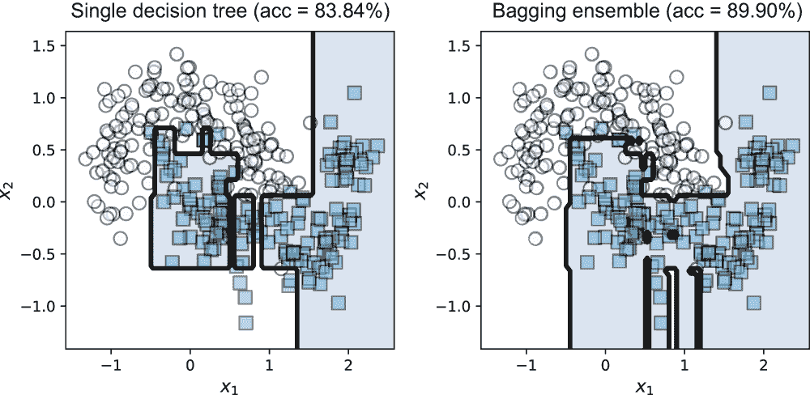

图 2.4 单个决策树（左）对训练集过拟合，并且可能对异常值敏感。Bagging 集成（右）平滑了几个此类基估计器的过拟合效应和误分类，通常返回一个鲁棒的答案。

Bagging 可以学习相当复杂和非线性的决策边界。即使单个决策树（以及通常的基估计器）对异常值敏感，基学习器的集成将平滑个别变化并更加鲁棒。

Bagging 的这种平滑行为是由于模型聚合。当我们有许多高度非线性的分类器，每个分类器都在略微不同的训练数据副本上训练时，每个分类器可能会过拟合，但它们不会以相同的方式过拟合。更重要的是，聚合导致平滑，这有效地减少了过拟合的影响！因此，当我们聚合预测时，它平滑了错误，提高了集成性能！就像一个管弦乐队一样，最终结果是平滑的交响乐，可以轻松克服其中任何个别音乐家的错误。

### 2.2.3 使用 scikit-learn 进行 Bagging

现在我们已经了解了 Bagging 的工作原理，让我们看看如何使用 scikit-learn 的 BaggingClassifier 包，如下所示。scikit-learn 的实现提供了额外的功能，包括对并行化的支持，能够使用除决策树之外的其他基础学习算法，最重要的是 OOB 评估。

列表 2.3 使用 scikit-learn 的 Bagging

```
from sklearn.tree import DecisionTreeClassifier
from sklearn.ensemble import BaggingClassifier

base_estimator = DecisionTreeClassifier(max_depth=10)           ❶
bag_ens = BaggingClassifier(base_estimator=base_estimator, 
                            n_estimators=500,                   ❷
                            max_samples=100,                    ❸
                            oob_score=True,                     ❹
                            random_state=rng)
bag_ens.fit(Xtrn, ytrn)
ypred = bag_ens.predict(Xtst)
```

❶ 设置基学习算法及其超参数

❷ 训练 500 个基估计器

❸ 每个基估计器将在大小为 100 的自助样本上训练。

❹ 使用 OOB 样本来估计泛化误差

BaggingClassifier 支持 OOB 评估，如果我们设置 oob_score=True，它将返回 OOB 准确率。回想一下，对于每个自助样本，我们还有一个相应的 OOB 样本，它包含在采样过程中未选中的所有数据点。

因此，每个 OOB 样本都是“未来数据”的替代品，因为它没有用于训练相应的基估计器。训练后，我们可以查询学习到的模型以获取 OOB 分数：

```
bag_ens.oob_score_
0.9658792650918635
```

OOB 分数是对 Bagging 集成预测（泛化）性能的估计（此处为 96.6%）。除了 OOB 样本外，我们还保留了一个测试集。我们计算了该模型在测试集上的泛化性能的另一个估计：

```
accuracy_score(ytst, ypred)
0.9521276595744681
```

测试准确率为 95.2%，与 OOB 分数非常接近。我们使用了最大深度为 10 的决策树作为基础估计器。更深的决策树更复杂，这使得它们能够拟合（甚至过度拟合）训练数据。

TIP Bagging 对于复杂和非线性分类器最有效，这些分类器倾向于过度拟合数据。这样的复杂、过度拟合的模型是不稳定的，也就是说，对训练数据中的微小变化非常敏感。为了了解原因，考虑一下，袋装集成中的单个决策树具有大致相同的复杂性。然而，由于自助采样，它们已经在数据集的不同副本上进行了训练，并且过度拟合的程度不同。换句话说，它们都以大致相同的程度过度拟合，但在不同的地方。Bagging 之所以与这样的模型配合得最好，是因为其模型聚合减少了过度拟合，最终导致更稳健和稳定的集成。

我们可以通过比较 BaggingClassifier 的决策边界与其组件基础决策树分类器，如图 2.5 所示，来可视化 BaggingClassifier 的平滑行为。

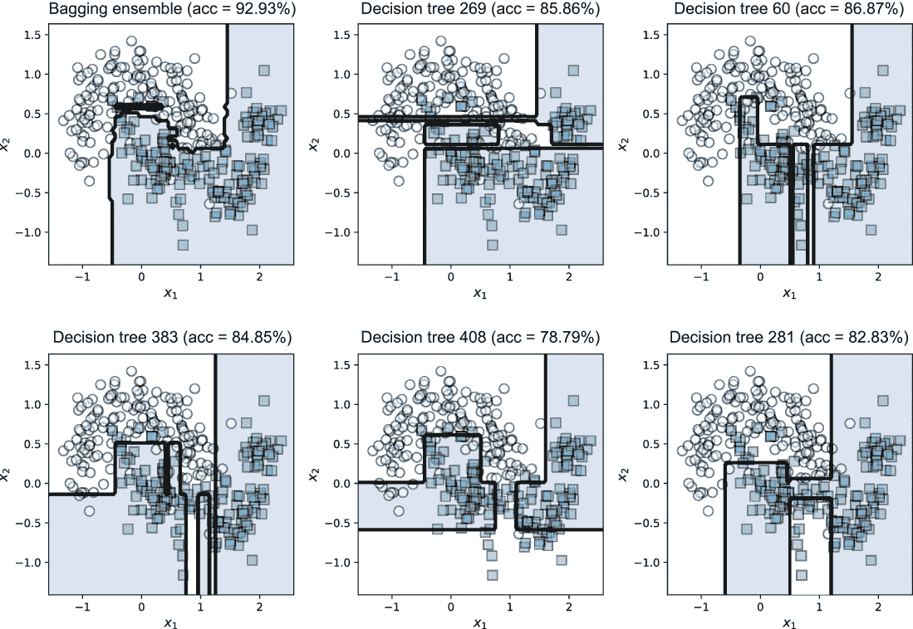

图 2.5 自助采样导致不同的基估计器以不同的方式过度拟合，而模型聚合平均了个体错误并产生了更平滑的决策边界。

### 2.2.4 使用并行化加速训练

Bagging 是一种并行集成算法，因为它独立于其他基础学习器训练每个基础学习器。这意味着如果可以访问如多个核心或集群等计算资源，则可以并行化训练 Bagging 集成。

BaggingClassifier 通过 n_jobs 参数支持训练和预测的加速。默认情况下，此参数设置为 1，袋装法将在一个 CPU 上运行，并逐个顺序训练模型。

或者，您可以通过设置 n_jobs 来指定 BaggingClassifier 应使用的并发进程数。如果 n_jobs 设置为-1，则所有可用的 CPU 都将用于训练，每个 CPU 训练一个集成。这当然允许通过同时和并行训练更多模型来加快训练速度。

```
BaggingClassifier(base_estimator=DecisionTreeClassifier(),  
                            n_estimators=100, max_samples=100, 
                            oob_score=True, n_jobs=-1)           ❶
```

❶ 如果 n_jobs 设置为-1，BaggingClassifier 将使用所有可用的 CPU。

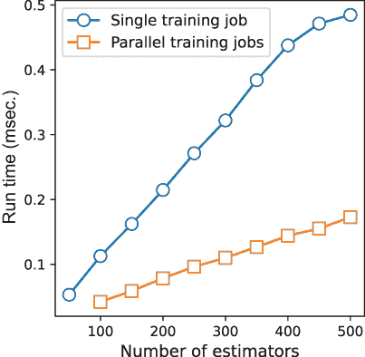

图 2.6 袋装法可以并行化以提高训练效率。

图 2.6 比较了在具有六个核心的机器上使用 1 个 CPU（n_jobs=1）与多个 CPU（n_jobs=-1）训练袋装法的训练效率。这种比较表明，如果我们可以访问足够的计算资源，袋装法可以有效地并行化，并且训练时间可以显著减少。

## 2.3 随机森林

我们已经看到了如何使用带替换的随机抽样，即自助抽样，来增加集成多样性。现在，让我们看看随机森林，它是袋装法的特殊扩展，引入了额外的随机化来进一步促进集成多样性。

直到梯度提升（见第五章和第六章）的出现，随机森林是当时最先进的，并且被广泛使用。它们仍然是许多应用的流行首选方法，尤其是在生物信息学中。随机森林可以作为您数据的优秀现成基线，因为它们训练起来计算效率高。它们还可以按重要性对数据特征进行排序，这使得它们特别适合于高维数据分析。

### 2.3.1 随机决策树

“随机森林”特指使用袋装法构建的随机决策树集成。随机森林执行自助抽样以生成训练子集（与袋装法完全一样），然后使用随机决策树作为基估计器。

随机决策树使用修改后的决策树学习算法进行训练，该算法在生长我们的树时引入随机性。这种额外的随机性增加了集成多样性，通常会导致更好的预测性能。

标准决策树与随机决策树之间的关键区别在于决策节点的构建方式。在标准决策树构建中，*所有可用的特征*都会被彻底评估以确定最佳的分割特征。由于决策树学习是一个贪婪算法，它将选择得分最高的特征进行分割。

在袋装法中，这种穷举搜索（与贪婪学习相结合）意味着在多个树中可能会反复使用相同的小数量主导特征。这使得集成多样性降低。

为了克服标准决策树学习的这一局限性，随机森林在树学习中引入了额外的随机元素。具体来说，不是考虑*所有*特征来识别最佳分割，而是评估一个随机特征子集以确定最佳的分割特征。

因此，随机森林使用了一种修改后的树学习算法，该算法首先随机采样特征，然后创建决策节点。生成的树是一个*随机决策树*，这是一种新的基估计器。

正如您将看到的，随机森林通过使用随机决策树作为基估计器来扩展 bagging。因此，随机森林包含两种类型的随机化：（1）与 bagging 类似的 bootstrap 采样；（2）用于学习随机决策树的随机特征采样。

示例：树学习中的随机化

考虑在具有六个特征的数据集上进行树学习（这里，指{*f*[1],*f*[2],*f*[3],*f*[4],*f*[5],*f*[6]}）。在标准树学习中，所有六个特征都会被评估，并确定最佳分割特征（例如，*f*[3]）。

在随机决策树学习中，我们首先随机采样一个特征子集（例如，*f*[2],*f*[4],*f*[5]}），然后从中选择最佳特征（例如，*f*[5]）。这意味着特征 *f*[3] 在这一阶段的树学习中不再可用。因此，随机化本质上迫使树学习在不同的特征上进行分割。随机化对树学习过程中下一个最佳分割选择的影響在图 2.7 中得到了说明。

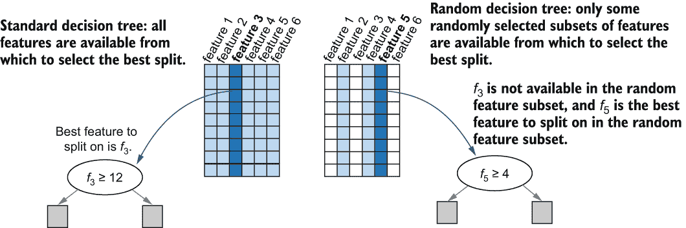

图 2.7 展示了随机森林使用了一种修改后的树学习算法，在该算法中，首先选择一个随机特征子集，然后确定每个决策节点的最佳分割标准。无阴影的列表示已排除的特征；浅阴影的列表示可用于选择最佳特征的可用特征，这些特征在深阴影的列中显示。

最终，这种随机化会在构建每个决策节点时发生。因此，即使我们使用相同的数据集，每次训练时也会得到不同的随机化树。当随机树学习（带有特征随机采样的随机树学习）与自助采样（带有训练样本随机采样的自助采样）相结合时，我们得到一个随机决策树集合，称为*随机决策森林*或简称为随机森林。

随机森林集合将比仅执行自助采样的 bagging 更加多样化。接下来，我们将看到如何在实践中使用随机森林。

### 2.3.2 使用 scikit-learn 的随机森林

scikit-learn 提供了一个高效的随机森林实现，它还支持 OOB 估计和并行化。由于随机森林专门使用决策树作为基础学习器，RandomForestClassifier 也接受 DecisionTreeClassifier 参数，如 max_leaf_nodes 和 max_depth 来控制树复杂性。以下列表演示了如何调用 RandomForestClassifier。

列表 2.4 使用 scikit-learn 的随机森林

```
from sklearn.ensemble import RandomForestClassifier

rf_ens = RandomForestClassifier(n_estimators=500, 
                                max_depth=10, 
                                oob_score=True,      ❶
                                n_jobs=-1,           ❷
                                random_state=rng)
rf_ens.fit(Xtrn, ytrn)
ypred = rf_ens.predict(Xtst)                         ❸
```

❶ 控制基础决策树的复杂性

❷ 如果可能，并行化

❸ 使用 OOB 样本估计泛化误差

图 2.8 展示了随机森林分类器，以及几个组件基础估计器。

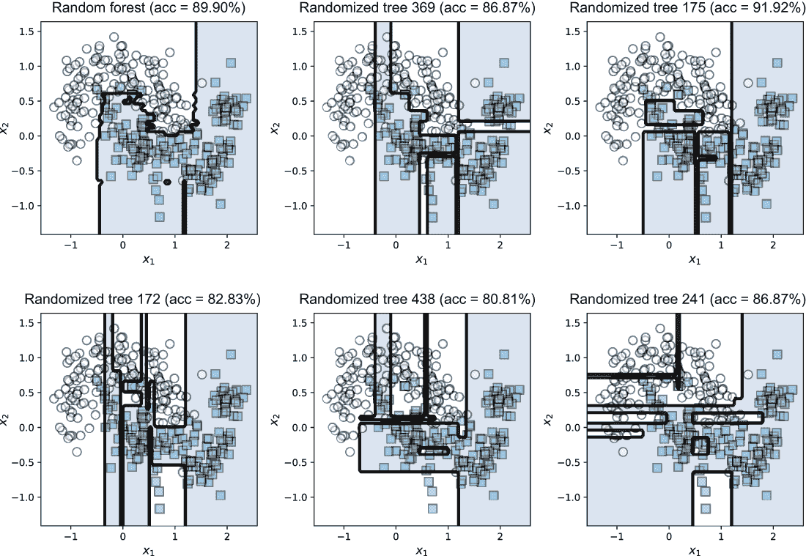

图 2.8 随机森林（左上角）与单个基础学习器（随机决策树）的比较。与袋装法类似，随机森林集成也产生平滑且稳定的决策边界。同时观察随机化对单个树的影响，这些树比常规决策树更尖锐。

### 2.3.3 特征重要性

使用随机森林的一个好处是它们还提供了一种基于其重要性的自然机制来评分特征。这意味着我们可以对特征进行排序，以识别最重要的特征，并删除效果较差的特征，从而执行特征选择！

特征选择

**特征选择**，也称为**变量子集选择**，是一种识别最有影响力或相关数据特征/属性的过程。特征选择是建模过程中的重要步骤，尤其是在高维数据中。

删除最不相关的特征通常可以提高泛化性能并最小化过拟合。这也有助于提高训练的计算效率。这些问题是**维度诅咒**的结果，其中大量的特征可能会抑制模型有效泛化的能力。

参考 Pablo Duboue 的《特征工程的艺术：机器学习必备》（剑桥大学出版社，2020 年）以了解更多关于特征选择和工程的信息。

我们可以使用查询 rf_ens.feature_importances_ 为简单的二维数据集获取特征重要性：

```
for i, score in enumerate(rf_ens.feature_importances_):
    print('Feature x{0}: {1:6.5f}'.format(i, score))
```

这会产生以下输出：

```
Feature x0: 0.50072
Feature x1: 0.49928
```

对于简单的二维数据集，特征分数表明两个特征的重要性大致相等。在章节末尾的案例研究中，我们将计算并可视化来自真实任务的特性重要性：乳腺癌诊断。我们还将回顾并深入探讨第九章中的特性重要性主题。

注意，特征重要性之和为 1，并且实际上是**特征权重**。不重要的特征具有较低的权重，通常可以删除而不会显著影响最终模型的整体质量，同时提高训练和预测时间。

具有关联特征的特性重要性

如果两个特征高度相关或依赖，那么直观上我们知道，在模型中使用其中任何一个就足够了。然而，特征使用的*顺序*可能会影响特征重要性。例如，在分类鲍鱼（海蜗牛）时，大小和重量特征高度相关（不出所料，因为更大的蜗牛会更重）。这意味着将它们包含在决策树中会增加大约相同的信息量，并导致整体错误（或熵）大致以相同的方式减少。因此，我们预计它们的平均错误减少分数将是相同的。

然而，假设我们首先选择权重作为分割变量。将此特征添加到树中会移除大小和权重特征中包含的信息。这意味着大小的特征重要性降低，因为我们通过在模型中包含大小来减少错误的可能性已经被包含权重时减少。因此，相关特征有时会被分配不平衡的特征重要性。随机特征选择可以稍微减轻这个问题，但并不一致。

通常，在存在特征相关性的情况下解释特征重要性时，你必须谨慎行事，以免错过数据中的整个故事。

## 2.4 更同质化的并行集成

我们已经看到了两种重要的并行同质集成方法：Bagging 和随机森林。现在让我们探索一些为大型数据集（例如，推荐系统）或高维数据（例如，图像或文本数据库）开发的变体。这些包括 Bagging 变体，如粘贴、随机子空间和随机补丁，以及一个称为 Extra Trees 的极端随机森林变体。所有这些方法都以不同的方式引入随机化，以确保集成多样性。

### 2.4.1 粘贴

Bagging 使用自助采样，或带替换的采样。如果我们不替换地采样训练子集，我们就有了 Bagging 的一个变体，称为*粘贴*。粘贴是为非常大的数据集设计的，其中不需要带替换的采样。相反，由于在如此规模的数据集上训练完整模型是困难的，粘贴旨在通过不替换地采样来获取数据的小部分。

粘贴利用了这样一个事实，即使用非常大的数据集进行不替换的采样可以固有地生成多样化的数据子集，这反过来又导致集成多样性。粘贴还确保每个训练子样本是整体数据集的小部分，并且可以用来有效地训练基学习器。

模型聚合仍然用于做出最终的集成预测。然而，由于每个基学习器都是在大型数据集的小部分上训练的，我们可以将模型聚合视为将基学习器的预测*粘贴在一起*以做出最终预测。

TIP BaggingClassifier 可以通过设置 bootstrap=False 并设置 max_samples 为一个小分数（例如 max_samples=0.05）来轻松扩展以执行粘贴，从而通过训练小子集进行采样。

### 2.4.2 随机子空间和随机补丁

我们还可以通过随机采样特征（见图 2.9）来使基学习器更加多样化。如果我们通过采样特征（带或不带替换）来生成子集，而不是采样训练示例，我们得到一种称为**随机子空间**的 bagging 变体。

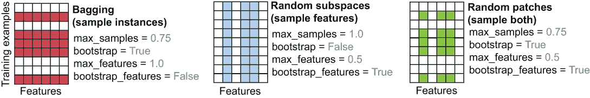

图 2.9 与随机子空间和随机补丁相比的 Bagging。未着色的行和列分别代表被留下的训练示例和特征。

BaggingClassifier 通过两个参数支持特征的 bootstrap 采样：bootstrap_features（默认：False）和 max_features（默认：1.0，即所有特征），它们分别类似于采样训练示例的参数 bootstrap（默认：False）和 max_samples。要实现随机子空间，我们只随机采样特征：

```
bag_ens = BaggingClassifier(
    base_estimator=SVC(), n_estimators=100, 
    max_samples=1.0, bootstrap=False,             ❶
    max_features=0.5, bootstrap_features=True)    ❷
```

❶ 使用所有训练样本

❷ 从特征中抽取 50%的 Bootstrap 样本

如果我们随机采样**所有**的训练示例和特征（带或不带替换），我们得到一种称为**随机补丁**的 bagging 变体：

```
bag_ens = BaggingClassifier(
    base_estimator=SVC(), n_estimators=100, 
    max_samples=0.75, bootstrap=True,            ❶
    max_features=0.5, bootstrap_features=True)   ❷
```

❶ 从示例中抽取 75%的 Bootstrap 样本

❷ 从特征中抽取 50%的 Bootstrap 样本

注意，在前面的例子中，基估计器是支持向量分类器，sklearn.svm.SVC。一般来说，随机子空间和随机补丁可以应用于任何基学习器以提高估计器的多样性。

TIP 实际上，这些 bagging 变体对于大数据特别有效。例如，因为随机子空间和随机补丁采样特征，它们可以用于更有效地训练具有许多特征的数据的基估计器，例如图像数据。或者，因为粘贴执行无替换的采样，当您有一个具有大量训练实例的大数据集时，它可以用于更有效地训练基估计器。

随机森林与随机子空间和随机补丁等 bagging 变体之间的关键区别在于特征采样的位置。随机森林仅使用随机决策树作为基估计器。具体来说，每次它们使用决策节点生长树时，都会在树学习算法中进行特征采样。

另一方面，随机子空间和随机补丁不仅限于树学习，可以使用任何学习算法作为基估计器。它们在调用基学习算法之前，对每个基估计器进行一次**外部**的特征采样。

### 2.4.3 额外树

极端随机树将随机决策树的想法推向了极致，不仅从随机特征子集中选择分裂变量（见图 2.9），还选择分裂阈值！为了更清楚地理解这一点，请回忆决策树中的每个节点都测试一种形式为“is *f*[k] < *threshold?*”的条件，其中 *f*[k] 是第 k 个特征，*threshold* 是分裂值（参见 2.3.1 节）。

标准决策树学习会查看**所有特征**以确定最佳 *f*[k]，然后查看该特征的所有值以确定阈值。随机决策树学习会查看**随机子集**的**特征**以确定最佳 *f*[k]，然后查看该特征的所有值以确定阈值。

极端随机决策树学习也会查看随机特征子集以确定最佳 *f*[k]。但为了更加高效，它选择一个随机的分裂阈值。请注意，极端随机树是另一种用于集成的基学习器。

这种极端随机化实际上非常有效，以至于我们可以直接从原始数据集构建极端随机树集成**而不**进行自助采样！这意味着我们可以非常高效地构建 Extra Trees 集成。

**提示** 在实践中，Extra Trees 集成非常适合具有大量连续特征的高维数据集。

scikit-learn 提供了一个支持 OOB 估计和并行化的 ExtraTreesClassifier，与 BaggingClassifier 和 RandomForestClassifier 类似。请注意，Extra Trees 通常**不**执行自助采样（默认为 bootstrap=False），因为我们能够通过极端随机化实现基估计器的多样性。

**警告** scikit-learn 提供了两个非常相似命名的类：sklearn.tree.ExtraTreeClassifier 和 sklearn.ensemble.ExtraTreesClassifier。tree.ExtraTreeClassifier 类是一个基学习算法，应用于学习单个模型或作为集成方法的基估计器。ensemble.ExtraTreesClassifier 是本节讨论的集成方法。区别在于“Extra Tree”的单数用法（ExtraTreeClassifier 是基学习器）与复数用法“Extra Trees”（ExtraTreesClassifier 是集成方法）。

## 2.5 案例研究：乳腺癌诊断

我们的第一项案例研究探讨了医疗决策任务：乳腺癌诊断。我们将看到如何在实际中应用 scikit-learn 的同质并行集成模块。具体来说，我们将训练并评估三种同质并行算法的性能，每种算法的特点是随机性逐渐增加：决策树的自举、随机森林和 Extra Trees。

医生每天都会就患者护理做出许多决定：例如诊断（患者患有何种疾病？）、预后（疾病将如何进展？）、治疗计划（如何治疗疾病？）等。他们基于患者的健康记录、病史、家族史、检测结果等进行这些决定。

我们将使用的具体数据集是威斯康星诊断乳腺癌（WDBC）数据集，这是机器学习中常用的基准数据集。自 1993 年以来，WDBC 数据已被用于评估数十种机器学习算法的性能。

机器学习任务是训练一个分类模型，可以诊断患有乳腺癌的患者。按照现代标准和大数据时代，这是一个小数据集，但它非常适合展示我们迄今为止看到的集成方法。

### 2.5.1 加载和预处理

WDBC 数据集最初是通过在患者活检医学图像上应用特征提取技术创建的。更具体地说，对于每位患者，数据描述了活检过程中提取的细胞核的大小和纹理。

WDBC 在 scikit-learn 中可用，如图 2.10 所示进行加载。此外，我们还创建了一个 RandomState，以便我们可以以可重复的方式生成随机化：

```
from sklearn.datasets import load_breast_cancer
dataset = load_breast_cancer()  
X, y = dataset['data'], dataset['target']
rng=np.random.RandomState(seed=4190)
```

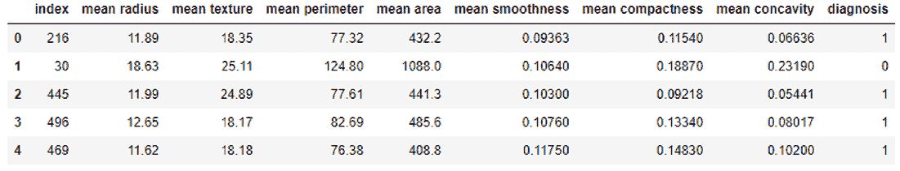

图 2.10 WDBC 数据集包含 569 个训练示例，每个示例由 30 个特征描述。这里展示了少量患者的一些 30 个特征，以及每位患者的*诊断*（训练标签）。诊断=1 表示恶性，诊断=0 表示良性。

### 2.5.2 Bagging、随机森林和 Extra Trees

一旦我们预处理完数据集，我们将使用决策树、随机森林和 Extra Trees 进行 bagging 的训练和评估，以回答以下问题：

+   集成性能如何随着集成大小的变化而变化？也就是说，当我们的集成变得越来越大时会发生什么？

+   集成性能如何随着基学习器的复杂性而变化？也就是说，当我们的单个基估计器变得越来越复杂时会发生什么？

在这个案例研究中，由于考虑的所有三种集成方法都使用决策树作为基估计器，因此复杂性的一个“度量”是树深度，深度越深的树越复杂。

集成大小与集成性能

首先，让我们通过比较随着参数 n_estimators 增加时三个算法的行为，来查看训练和测试性能如何随着集成大小而变化。一如既往，我们遵循良好的机器学习实践，随机将数据集分为训练集和保留测试集。我们的目标将在训练集上学习一个诊断模型，并使用测试集评估该诊断模型的效果。

记住，由于测试集在训练期间被保留出来，因此测试错误通常是我们对未来数据表现的一个有用估计，即泛化。然而，由于我们不希望我们的学习和评估受随机性的摆布，我们将重复此实验 20 次并平均结果。在下面的列表中，我们将看到集成大小如何影响模型性能。

列表 2.5 随着集成大小增加的训练和测试错误

```
max_leaf_nodes = 8                                                         ❶
n_runs = 20
n_estimator_range = range(2, 20, 1)

bag_trn_error = \ 
    np.zeros((n_runs, len(n_estimator_range)))                             ❷
rf_trn_error = \                                                           ❷
    np.zeros((n_runs, len(n_estimator_range)))                             ❷
xt_trn_error = \                                                           ❷
    np.zeros((n_runs, len(n_estimator_range)))                             ❷

bag_tst_error = \
    np.zeros((n_runs, len(n_estimator_range)))                             ❸
rf_tst_error = \                                                           ❸
    np.zeros((n_runs, len(n_estimator_range)))                             ❸
xt_tst_error =                                                             ❸
    np.zeros((n_runs, len(n_estimator_range)))                             ❸

for run in range(0, n_runs):
    X_trn, X_tst, y_trn, y_tst = train_test_split(                         ❹
                                     X, y, test_size=0.25,random_state=rng)

    for j, n_estimators in enumerate(n_estimator_range):

        tree = DecisionTreeClassifier(                                     ❺
                   max_leaf_nodes=max_leaf_nodes) 
        bag = BaggingClassifier(base_estimator=tree,
                                n_estimators=n_estimators,
                                max_samples=0.5, n_jobs=-1,
                                random_state=rng)
        bag.fit(X_trn, y_trn)
        bag_trn_error[run, j] = 1 - accuracy_score(y_trn, bag.predict(X_trn))
        bag_tst_error[run, j] = 1 - accuracy_score(y_tst, bag.predict(X_tst))

        rf = RandomForestClassifier(                                       ❻
                 max_leaf_nodes=max_leaf_nodes, n_estimators=n_estimators, 
                 n_jobs=-1, random_state=rng)

        rf.fit(X_trn, y_trn)
        rf_trn_error[run, j] = 1 - accuracy_score(y_trn, rf.predict(X_trn))
        rf_tst_error[run, j] = 1 - accuracy_score(y_tst, rf.predict(X_tst))

        xt = ExtraTreesClassifier(                                         ❼
                 max_leaf_nodes=max_leaf_nodes, n_estimators=n_estimators,
                 bootstrap=True, n_jobs=-1, random_state=rng)

        xt.fit(X_trn, y_trn) 
        xt_trn_error[run, j] = 1 - accuracy_score(y_trn, xt.predict(X_trn))
        xt_tst_error[run, j] = 1 - accuracy_score(y_tst, xt.predict(X_tst))
```

❶ 每个集成中的每个基决策树最多有八个叶节点。

❷ 初始化数组以存储训练错误

❸ 初始化数组以存储测试错误

❹ 执行 20 次运行，每次运行具有不同的训练/测试数据分割

❺ 训练并评估此运行和迭代的 bagging

❻ 训练并评估此运行和迭代的随机森林

❼ 训练并评估此运行和迭代的 Extra Trees

我们现在可以可视化 WDBC 数据集上平均的训练和测试错误，如图 2.11 所示。正如预期的那样，随着估计器数量的增加，所有方法的训练错误稳步下降。测试错误也随着集成大小的增加而下降，然后稳定下来。由于测试错误是泛化误差的估计，我们的实验证实了我们对这些集成方法在实际性能上的直觉。

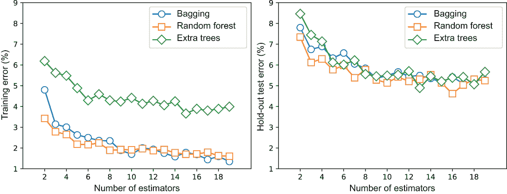

图 2.11 随着集成大小增加，bagging、随机森林和 Extra Trees 的训练和测试性能。Bagging 使用决策树作为基估计器，随机森林使用随机决策树，Extra Trees 使用极端随机树。

最后，所有三种方法都大大优于单个决策树（如图所示）。这表明，在实践中，即使单个决策树不稳定，决策树的集成也是稳健的，并且可以很好地泛化。

基学习器复杂度与集成性能

接下来，我们比较随着基学习器复杂度的增加，三种算法的行为（如图 2.12）。控制基决策树复杂度的方法有：最大深度、最大叶节点数、不纯度标准等。在这里，我们比较了三种集成方法在基学习器复杂度由 max_leaf_nodes 确定的性能。

这种比较可以以类似于之前的方式执行。为了允许每个集成方法使用越来越复杂的基学习器，我们可以逐步增加每个基决策树的最大叶节点数。也就是说，在 BaggingClassifier、RandomForestClassifier 和 ExtraTreesClassifier 中，我们依次设置 max_leaf_nodes = 2, 4, 8, 16 和 32，通过以下参数：

```
base_estimator=DecisionTreeClassifier(max_leaf_nodes=32)
```

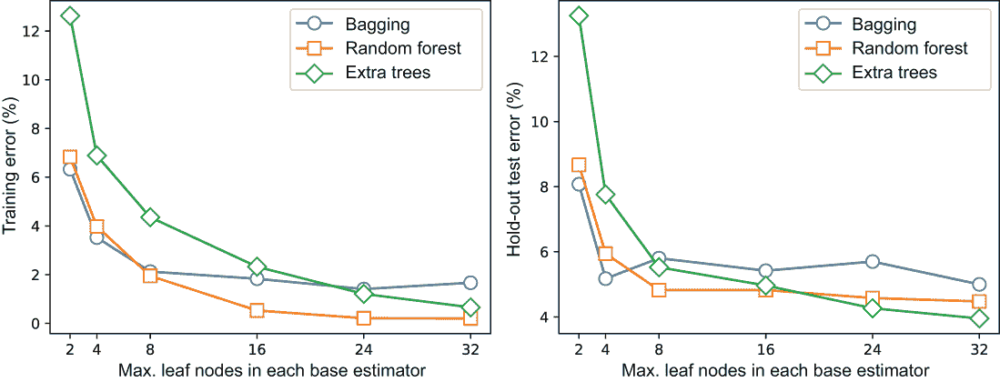

图 2.12 随着基学习器复杂性的增加，bagging、随机森林和 Extra Trees 的训练和测试性能。Bagging 使用决策树作为基估计器，随机森林使用随机决策树，Extra Trees 使用极端随机树。

回想一下，高度复杂的树在本质上是不稳定的，并且对数据中的微小扰动非常敏感。这意味着，一般来说，如果我们增加基学习器的复杂性，我们需要更多的它们来成功减少集成整体的变异性。然而，在这里，我们已将 n_estimators 设置为 10。

在确定基决策树深度的一个关键考虑因素是计算效率。训练越来越深的树将花费更多的时间，而不会在预测性能上产生显著的改进。例如，深度为 24 和 32 的基决策树表现大致相同。

### 2.5.3 随机森林的特征重要性

最后，让我们看看我们如何可以使用特征重要性来识别使用随机森林集成对乳腺癌诊断最有预测性的特征。这种分析增加了模型的*可解释性*，并且在向领域专家如医生解释此类模型时非常有帮助。

标签相关性特征重要性

首先，让我们查看数据集，看看我们是否可以发现特征和诊断之间的一些有趣关系。当我们得到一个新的数据集时，这种分析是典型的，因为我们试图更多地了解它。在这里，我们的分析将尝试确定哪些特征彼此之间以及与诊断（标签）最相关，这样我们就可以检查随机森林是否能做类似的事情。在下面的列表中，我们使用 pandas 和 seaborn 包来可视化特征和标签的相关性。

列表 2.6 可视化特征与标签之间的相关性

```
import pandas as pd
import seaborn as sea

df = pd.DataFrame(data=dataset['data'],                       ❶
                  columns=dataset['feature_names'])  
df['diagnosis'] = dataset['target'] 

fig, ax = plt.subplots(nrows=1, ncols=1, figsize=(8, 8))
cor = np.abs(df.corr())                                       ❷
sea.heatmap(cor, annot=False, cbar=False, cmap=plt.cm.Greys, ax=ax)  
fig.tight_layout()
```

❶ 将数据转换为 pandas DataFrame

❷ 计算并绘制一些选定的特征与标签（诊断）之间的相关性

此列表的输出显示在图 2.13 中。一些特征彼此之间高度相关，例如，平均半径、平均周长和平均面积。一些特征也与标签高度相关，即良性或恶性的诊断。让我们确定与诊断标签最相关的 10 个特征：

```
label_corr = cor.iloc[:, -1]
label_corr.sort_values(ascending=False)[1:11]
```

这产生了以下前 10 个特征排名：

```
worst concave points    0.793566
worst perimeter         0.782914
mean concave points     0.776614
worst radius            0.776454
mean perimeter          0.742636
worst area              0.733825
mean radius             0.730029
mean area               0.708984
mean concavity          0.696360
worst concavity         0.659610
```

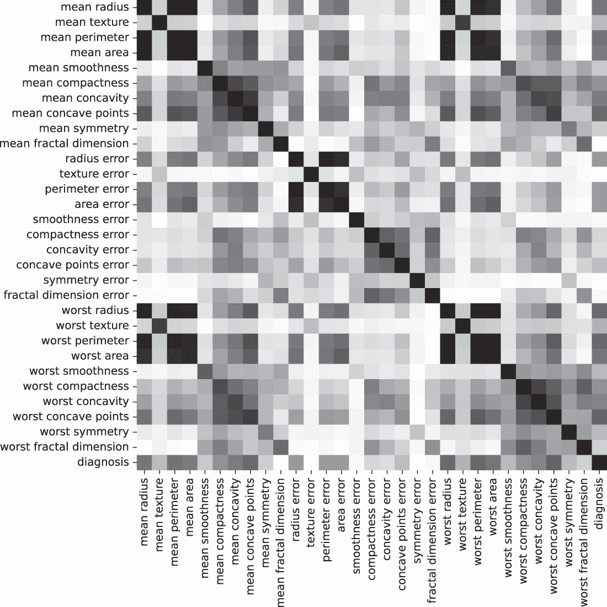

图 2.13 所有 30 个特征与标签（诊断）之间的绝对特征相关性

因此，我们的相关性分析告诉我们，这 10 个特征与诊断的相关性最高；也就是说，这些特征在乳腺癌诊断中可能最有帮助。

请记住，相关性并不总是识别有效变量的可靠手段，尤其是如果特征和标签之间存在高度非线性关系时。然而，只要我们了解其局限性，它通常是一个合理的指南。

使用随机森林的特征重要性

随机森林还可以提供特征重要性，如下所示。

列表 2.7 使用随机森林在 WDBC 数据集中的特征重要性

```
X_trn, X_tst, y_trn, y_tst = train_test_split(X, y, test_size=0.15)
n_features = X_trn.shape[1]

rf = RandomForestClassifier(max_leaf_nodes=24,                    ❶
                            n_estimators=50, n_jobs=-1) 
rf.fit(X_trn, y_trn)
err = 1 - accuracy_score(y_tst, rf.predict(X_tst))
print('Prediction Error = {0:4.2f}%'.format(err*100))

importance_threshold = 0.02                                       ❷
for i, (feature, importance) in enumerate(zip(dataset['feature_names'],
                                              rf.feature_importances_)):

    if importance > importance_threshold:
        print('[{0}] {1} (score={2:4.3f})'.
            format(i, feature, importance))                       ❸
```

❶ 训练一个随机森林集成

❷ 设置一个重要性阈值，其中所有高于阈值的特征都是重要的

❸ 打印“重要”的特征，即那些高于重要性阈值的特征

列表 2.7 依赖于一个重要性阈值，这里设置为 0.02。通常，这样的阈值是通过检查来设置的，以便我们得到一个目标特征集，或者使用一个单独的验证集来识别重要特征，这样整体性能就不会下降。

对于 WDBC 数据集，随机森林识别以下特征为重要。观察发现，通过相关性分析和随机森林识别的重要特征之间存在相当大的重叠，尽管它们的相对排名不同：

```
[2] mean perimeter (score=0.055)
[3] mean area (score=0.065)
[6] mean concavity (score=0.071)
[7] mean concave points (score=0.138)
[13] area error (score=0.065)
[20] worst radius (score=0.080)
[21] worst texture (score=0.023)
[22] worst perimeter (score=0.067)
[23] worst area (score=0.131)
[26] worst concavity (score=0.029)
[27] worst concave points (score=0.149)
```

最后，随机森林集成识别的特征重要性在图 2.14 中可视化。


图 2.14 随机森林集成可以通过特征的重要性来评分。这允许我们仅使用得分最高的特征进行特征选择。

注意：由于在树构建过程中的随机化，特征重要性通常会在运行之间发生变化。注意，如果两个特征高度相关，随机森林通常会在这两个特征之间分配特征重要性，导致它们的总体权重看起来比实际要小。为了集成可解释性的目的，还有其他更稳健的方法来计算特征重要性，我们将在第九章中探讨。

## 摘要

+   平行同质集成通过随机化促进集成多样性：随机采样训练示例和特征，甚至可以在基学习算法中引入随机化。

+   Bagging 是一种简单的集成方法，它依赖于（1）自助采样（或带替换的采样）来生成数据集的多样复制品并训练不同的模型，以及（2）模型聚合来从一组单个基学习器预测中产生集成预测。

+   Bagging 及其变体与任何不稳定的估计器（未剪枝决策树、支持向量机[SVMs]、深度神经网络等）工作得最好，这些是更高复杂性和/或非线性的模型。

+   随机森林是指一种特别设计用来使用随机决策树作为基学习器的 bagging 变体。增加随机性可以显著提高集成多样性，从而使集成减少变异性并平滑预测。

+   粘贴（Pasting），作为袋装法的变体，在不放回的情况下对训练示例进行采样，对于具有大量训练示例的数据集可能非常有效。

+   袋装法的其他变体，例如随机子空间（采样特征）和随机补丁（同时采样特征和训练示例），对于高维数据集可能非常有效。

+   额外树（Extra Trees）是另一种类似于袋装法的集成方法，它专门设计用来使用极端随机树作为基学习器。然而，额外树不使用自助采样，因为额外的随机化有助于生成集成多样性。

+   随机森林提供了特征重要性，从预测的角度对最重要的特征进行排序。
