# 3 异构并行集成：结合强大学习者

本章涵盖了

+   通过基于性能的加权结合基础学习模型

+   通过堆叠和混合结合基础学习模型与元学习

+   通过交叉验证集成避免过拟合

+   探索一个大规模、真实世界的文本挖掘案例研究，使用异构集成

在上一章中，我们介绍了两种并行集成方法：bagging 和随机森林。这些方法（及其变体）训练的是*同质集成*，其中每个基础估计器都使用相同的基学习算法进行训练。例如，在 bagging 分类中，所有基础估计器都是决策树分类器。

在本章中，我们继续探索并行集成方法，但这次专注于*异构集成*。异构集成方法使用不同的基学习算法，直接确保集成多样性。例如，一个异构集成可以由三个基础估计器组成：一个决策树、一个支持向量机（SVM）和一个人工神经网络（ANN）。这些基础估计器仍然是相互独立地训练的。

最早期的异构集成方法，如堆叠，早在 1992 年就已经开发出来。然而，这些方法直到 2005 年左右的 Netflix Prize 竞赛中才真正崭露头角。前三名团队，包括最终赢得 100 万美元奖金的团队，都是集成团队，他们的解决方案是数百个不同基础模型的复杂混合。这一成功是对我们将在本章讨论的许多方法有效性的显著和公开的证明。

受此成功启发，堆叠和混合变得非常流行。在有足够的基础估计器多样性的情况下，这些算法通常可以提高数据集的性能，并成为任何数据分析师工具箱中的强大集成工具。

另一个它们受欢迎的原因是它们可以轻松地结合现有模型，这使得我们可以使用先前训练的模型作为基础估计器。例如，假设你和一位朋友独立地在一个 Kaggle 竞赛的数据集上工作。你训练了一个支持向量机（SVM），而你的朋友训练了一个逻辑回归模型。虽然你的个人模型表现不错，但你俩都认为如果你们把头（和模型）放在一起，可能会做得更好。你们无需重新训练这些现有模型，就可以构建一个异构集成。你只需要找出一种方法来结合你的两个模型。异构集成有两种类型，这取决于它们如何将个别基础估计器的预测组合成最终预测（见图 3.1）：

+   *加权方法*—这些方法为每个基础估计器的预测分配一个与其强度相对应的权重。更好的基础估计器被分配更高的权重，对最终预测的整体影响更大。个别基础估计器的预测被输入到一个预定的组合函数中，从而生成最终预测。

+   *元学习方法*—这些方法使用学习算法来组合基础估计器的预测；个别基础估计器的预测被视为元数据并传递给第二级元学习器，该学习器被训练以做出最终预测。图 3.1（第二章）中的同质集成（如 bagging 和随机森林）使用相同的学习算法来训练基础估计器，并通过随机采样实现集成多样性。异构集成（本章）使用不同的学习算法来实现集成多样性。

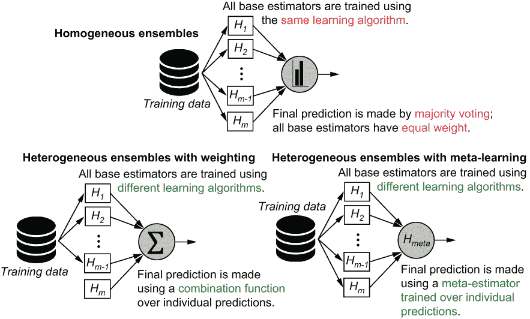

图 3.1 同质集成（第二章），如 bagging 和随机森林，使用*相同*的学习算法来训练基础估计器，并通过随机采样实现集成多样性。异构集成（本章）使用*不同*的学习算法来实现集成多样性。

我们首先介绍加权方法，这些方法通过根据每个分类器的有效性加权其贡献来组合分类器。

## 3.1 异构集成的基础估计器

在本节中，我们将设置一个学习框架来调整异构基础估计器并从中获取预测。这是构建任何应用的异构集成的第一步，对应于图 3.1 底部之前显示的*H*[1]，*H*[2]，*...*，*H*[m]的个别基础估计器的训练。

我们将使用一个简单的二维数据集来训练我们的基础估计器，这样我们可以明确地可视化每个基础估计器的决策边界和行为以及估计器的多样性。一旦训练完成，我们可以使用加权方法（第 3.2 节）或元学习方法（第 3.3 节）来构建异构集成：

```
from sklearn.datasets import make_moons
from sklearn.model_selection import train_test_split
X, y = make_moons(600, noise=0.25, random_state=13)      
X, Xval, y, yval = train_test_split(X, y, 
                                    test_size=0.25)          ❶
Xtrn, Xtst, ytrn, ytst = train_test_split(X, y,                                     test_size=0.25)    ❷
```

❶ 将 25%的数据留作验证

❷ 将另外 25%的数据留作留出测试

这段代码片段生成了 600 个等量分布到两个类别的合成训练示例，如图 3.2 所示，这些示例被可视化成圆圈和正方形。

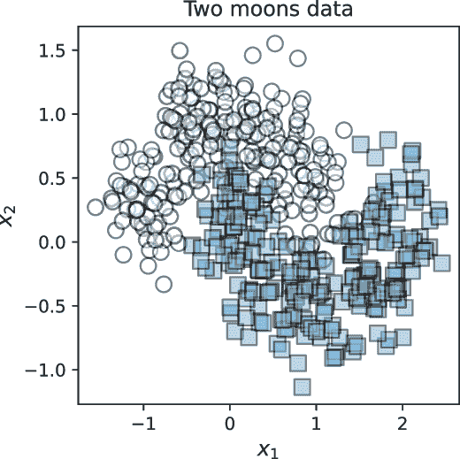

图 3.2 包含两个类别的合成数据集：类别 0（圆圈）和类别 1（正方形）各有 300 个示例

### 3.1.1 调整基础估计器

我们的首要任务是训练个别的基础估计器。与同质集成不同，我们可以使用任意数量的不同学习算法和参数设置来训练基础估计器。关键是确保我们选择足够不同的学习算法，以产生多样化的估计器集合。我们的基础估计器集合越多样化，最终的集成效果就越好。对于这种情况，我们使用了六个流行的机器学习算法，它们都在 scikit-learn 中可用：DecisionTreeClassifier、SVC、GaussianProcessClassifier、KNeighborsClassifier、RandomForestClassifier 和 GaussianNB（见图 3.3）。

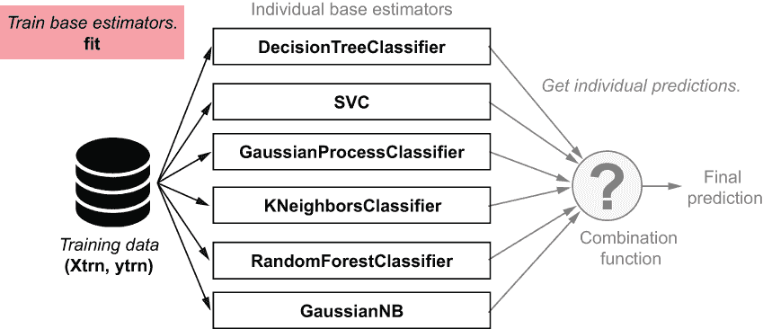

图 3.3 使用 scikit-learn 拟合六个基础估计器

下面的列表初始化了图 3.3 中显示的六个基础估计器，并对其进行了训练。注意用于初始化每个基础估计器的个别参数设置（例如，DecisionTreeClassifier 的 max_depth=5 或 KNeighborsClassifier 的 n_neighbors=3）。在实际应用中，这些参数必须仔细选择。对于这个简单的数据集，我们可以猜测或者直接使用默认参数推荐。

列表 3.1 拟合不同的基础估计器

```
from sklearn.tree import DecisionTreeClassifier
from sklearn.svm import SVC
from sklearn.neighbors import KNeighborsClassifier
from sklearn.gaussian_process import GaussianProcessClassifier
from sklearn.gaussian_process.kernels import RBF
from sklearn.ensemble import RandomForestClassifier
from sklearn.naive_bayes import GaussianNB

estimators = [
    ('dt', DecisionTreeClassifier (max_depth=5)),      ❶
    ('svm', SVC(gamma=1.0, C=1.0, probability=True)),
    ('gp', GaussianProcessClassifier(RBF(1.0))),
    ('3nn', KNeighborsClassifier(n_neighbors=3)),
    ('rf',RandomForestClassifier(max_depth=3, n_estimators=25)), 
    ('gnb', GaussianNB())]

def fit(estimators, X, y):
    for model, estimator in estimators:
        estimator.fit(X, y)                            ❷
    return estimators
```

❶ 初始化几个基础学习算法

❷ 使用这些不同的学习算法在训练数据上拟合基础估计器

我们在训练数据上训练我们的基础估计器：

```
estimators = fit(estimators, Xtrn, ytrn)
```

一旦训练完成，我们还可以可视化每个基础估计器在我们数据集上的行为。看起来我们能够产生一些相当多样化的基础估计器。

除了集成多样性之外，从单个基础估计器的可视化中立即显而易见的一个方面是，它们在保留的测试集上的表现并不相同。在图 3.4 中，3-最近邻（3nn）在测试集上表现最佳，而高斯朴素贝叶斯（gnb）表现最差。

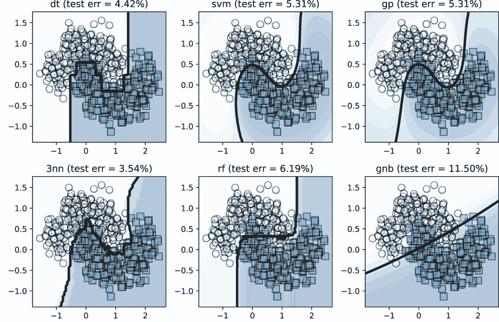

图 3.4 我们异构集成中的基础估计器。每个基础估计器都使用不同的学习算法进行训练，这通常会导致多样化的集成。

例如，DecisionTreeClassifier (dt) 通过使用轴平行边界（因为树中的每个决策节点都基于一个变量进行分割）将特征空间划分为决策区域来生成分类器。另一方面，svm 分类器 SVC 使用径向基函数（RBF）核，这导致决策边界更加平滑。因此，虽然这两种学习算法都可以学习非线性分类器，但它们以不同的方式非线性。

核方法

SVM 是核方法的一个例子，核方法是一种可以使用核函数的机器学习算法。核函数可以在高维空间中隐式地高效测量两个数据点之间的相似性，而无需显式地将数据转换到该空间。通过用核函数替换内积计算，可以将线性估计器转换为非线性估计器。常用的核包括多项式核和高斯核（也称为 RBF 核）。有关详细信息，请参阅 Trevor Hastie、Robert Tibshirani 和 Jerome Friedman 所著的《统计学习的要素：数据挖掘、推理和预测》第 2 版第十二章（Springer，2016 年）。

### 3.1.2 基础估计器的个体预测

给定用于预测的测试数据（Xtst），我们可以使用每个基础估计器来获取每个测试示例的预测。在我们的场景中，因为我们有六个基础估计器，所以每个测试示例将有六个预测，每个对应一个基础估计器（见图 3.5）。

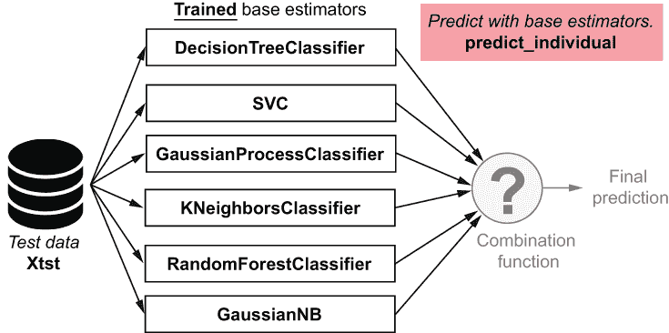

图 3.5 展示了 scikit-learn 中六个训练基础估计器的测试集的个体预测

我们现在的任务是收集每个训练基础估计器的每个测试示例的预测到一个数组中。在列表 3.2 中，变量 y 是存储预测的结构，其大小为 n_samples * n_estimators。也就是说，y[15, 1]将表示第 2 个分类器（SVC）对第 16 个测试示例的预测（记住 Python 中的索引从 0 开始）。

列表 3.2 基础估计器的个体预测

```
import numpy as np

def predict_individual(X, estimators, proba=False):      ❶
    n_estimators = len(estimators)
    n_samples = X.shape[0] 

    y = np.zeros((n_samples, n_estimators))
    for i, (model, estimator) in enumerate(estimators):
        if proba:
            y[:, i] = estimator.predict_proba(X)[:, 1]   ❷
        else:
            y[:, i] = estimator.predict(X)               ❸
    return y
```

❶ “proba”标志允许我们预测标签或标签的概率。

❷ 如果为真，则预测第 1 类的概率（返回一个介于 0 和 1 之间的浮点概率值）

❸ 否则，直接预测第 1 类（返回整数类标签 0 或 1）

注意到我们的函数 predict_individual 有 proba 标志。当我们设置 proba=False 时，predict_individual 根据每个估计器返回预测的标签。预测的标签取值为*y*[pred] = 0 或*y*[pred] = 1，这告诉我们估计器预测该示例属于类 0 或类 1。

然而，当我们设置 proba=True 时，每个估计器将通过每个基础估计器的 predict_proba()函数返回类预测概率：

```
y[:, i] = estimator.predict_proba(X)[:, 1] 
```

注意

scikit-learn 中的大多数分类器可以返回标签的概率而不是直接返回标签。其中一些，如 SVC，需要明确告知这样做（注意我们在初始化 SVC 时设置了 probability=True），而其他一些则是自然的概率分类器，可以表示和推理类概率。这些概率代表了每个基础估计器对其预测的*置信度*。

我们可以使用此函数来预测测试示例：

```
y_individual = predict_individual(Xtst, estimators, proba=False)
```

这将产生以下输出：

```
[[0\. 0\. 0\. 0\. 0\. 0.]
 [1\. 1\. 1\. 1\. 1\. 1.]
 [1\. 1\. 1\. 1\. 1\. 1.]
 ...
 [0\. 0\. 0\. 0\. 0\. 0.]
 [1\. 1\. 1\. 1\. 1\. 1.]
 [0\. 0\. 0\. 0\. 0\. 0.]]
```

每一行包含六个预测，每个预测对应于每个基估计器的预测。我们检查我们的预测：Xtst 有 113 个测试示例，y_individual 为每个示例提供六个预测，这给我们一个 113 × 6 的预测数组。

当 proba=True 时，predict_individual 返回一个示例属于类别 1 的概率，我们用*P*(*y*[pred] = 1)表示。对于像这样二分类（二元）分类问题，示例属于类别 0 的概率简单地是 1 - *P*(*y*[pred] = 1)，因为示例只能属于一个或另一个，所有可能性的概率之和为 1。我们按以下方式计算它们：

```
y_individual = predict_individual(Xtst, estimators, proba=True)
```

这会产生以下输出：

```
array([[0\.  , 0.01, 0.08, 0\.  , 0.04, 0.01],
       [1\.  , 0.99, 0.92, 1\.  , 0.92, 0.97],
       [0.98, 0.89, 0.76, 1\.  , 0.89, 0.95],
       ...,
       [0\.  , 0.03, 0.15, 0\.  , 0.11, 0.07],
       [1\.  , 0.97, 0.87, 1\.  , 0.72, 0.62],
       [0\.  , 0\.  , 0.05, 0\.  , 0.1 , 0.12]])
```

在这个输出的第三行中，第三个条目是 0.76，这表明我们的第三个基估计器，GaussianProcessClassifier，有 76%的信心认为第三个测试示例属于类别 1。另一方面，第三行的第一个条目是 0.98，这意味着 DecisionTreeClassifier 有 98%的信心认为第一个测试示例属于类别 1。

这样的预测概率通常被称为*软预测*。通过简单地选择具有最高概率的类别标签，可以将软预测转换为硬（0-1）预测；在这个例子中，根据 GaussianProcessClassifier，硬预测将是*y* = 0，因为*P*(*y* = 0) > *P*(*y* = 1)。

为了构建异构集成，我们可以直接使用预测，或者使用它们的概率。使用后者通常会产生更平滑的输出。

注意：刚刚讨论的预测函数是专门为二分类，即二元分类问题编写的。如果注意存储每个类别的预测概率，它可以扩展到多分类问题。也就是说，对于多分类问题，您需要在大小为 n_samples * n_estimators * n_classes 的数组中存储个别预测概率。

我们现在已经建立了创建异构集成所需的基本基础设施。我们已经训练了六个分类器，并且有一个函数可以给我们提供它们对新例子的个别预测。当然，最后也是最重要的步骤是如何组合这些个别预测：通过加权或通过元学习。

## 3.2 通过加权组合预测

加权方法的目标是什么？让我们回到 3nn 和 gnb 分类器在我们简单的 2D 数据集上的性能（见图 3.6）。想象一下，我们试图使用这两个分类器作为基估计器构建一个非常简单的异构分类器。

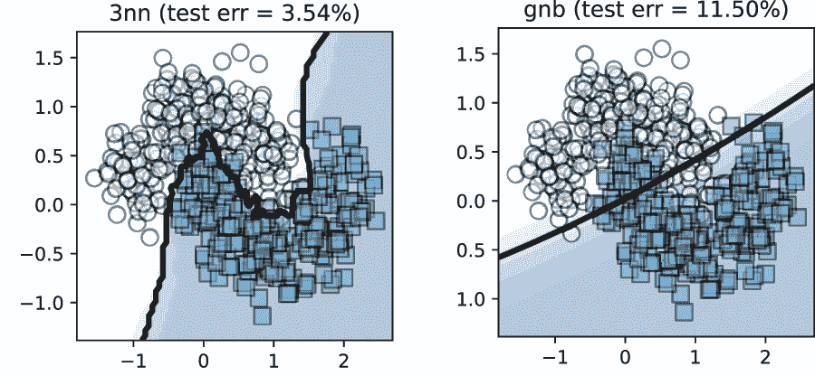

图 3.6 两个基估计器在相同的数据集上可能会有非常不同的行为。加权策略应该通过加权表现更好的分类器来反映它们的性能。

假设我们使用测试错误作为评估指标来比较这两个分类器的行为。测试错误可以使用 Xtst 中的示例来评估，Xtst 在训练期间被保留出来；这为我们提供了一个很好的估计，即模型在未来的未见数据上的行为。

3nn 分类器的测试错误率为 3.54%，而 gnb 的测试错误率为 11.5%。直观上，我们会在这个数据集上更信任 3nn 分类器而不是 gnb 分类器。然而，这并不意味着 gnb 是无用的，应该被丢弃。对于许多示例，它可以加强 3nn 做出的决策。我们不希望它在没有信心的情况下与 3nn 产生矛盾。

这种基础估计量置信度的概念可以通过分配权重来捕捉。当我们想要为基分类器分配权重时，我们应该以与这种直觉一致的方式去做，使得最终预测更多地受到强大分类器的影响，而较少受到较弱分类器的影响。

假设我们得到了一个新的数据点 x，并且个别预测是 *y*[3nn] 和 *y*[gnb]。一种简单的方法是根据它们的性能来加权它们。3nn 的测试集准确率 *a*[3nn] = 1 - 0.0354 = 0.9646，gnb 的测试集准确率 *a*[gnb] = 1 - 0.115 = 0.885。最终的预测可以计算如下：


估计量权重 *w*[3nn] 和 *w*[gnb] 与它们各自的准确性成比例，准确性更高的分类器将具有更高的权重。在这个例子中，我们有 *w*[3nn] = 0.522 和 *w*[gnb] = 0.478。我们使用一个简单的线性组合函数（技术上，是一个凸组合，因为所有权重都是正的，且总和为 1）将两个基础估计量结合起来。

让我们继续进行对 2D 双月数据集进行分类的任务，并探索各种加权组合策略。这通常包括两个步骤（见图 3.7）：

1.  以某种方式为每个分类器（clf）分配权重（*w*[clf]），反映其重要性。

1.  使用组合函数 *h*[c] 将加权预测（*w*[clf] ⋅ *y*[clf]）结合起来。

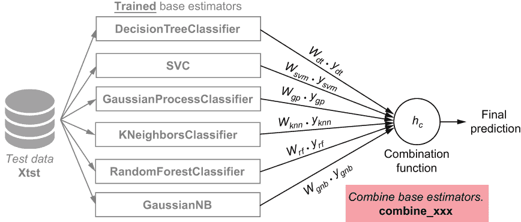

图 3.7 每个基础分类器都被分配了一个重要性权重，它反映了其意见对最终决策的贡献程度。使用组合函数将每个基础分类器的加权决策结合起来。

现在我们来看几种这样的策略，这些策略概括了预测和预测概率的这种直觉。许多这些策略都非常容易实现，并且在融合多个模型的预测中常用。

### 3.2.1 多数投票

你已经熟悉了前一章中的一种加权组合类型：多数投票。在这里我们简要回顾多数投票，以表明它只是众多组合方案中的一种，并将其纳入组合方法的通用框架中。

多数投票可以看作是一种加权组合方案，其中每个基本估计器被分配一个相等的权重；也就是说，如果我们有 *m* 个基本估计器，每个基本估计器的权重为 *w*[clf] = 1/*m*。个体基本估计器的（加权）预测通过多数投票相结合。

与 bagging 类似，这种策略也可以扩展到异质集成。在图 3.8 中展示的通用组合方案中，为了实现这种加权策略，我们设置 *w*[clf] = 1/*m* 和 *h*[c] = 多数投票，这是统计上的众数。

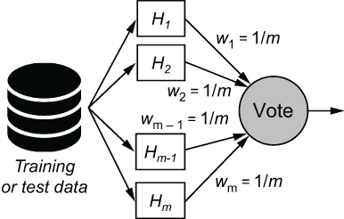

图 3.8 多数投票组合。Bagging 可以看作是应用于同质集成的简单加权方法。所有分类器具有相等的权重，组合函数是多数投票。我们也可以为异质集成采用多数投票策略。

以下列表使用多数投票将来自异质基本估计器集的个体预测 y_individual 结合起来。请注意，由于基本估计器的权重都是相等的，所以我们没有显式地计算它们。

列表 3.3 使用多数投票组合预测

```
from scipy.stats import mode

def combine_using_majority_vote(X, estimators):
    y_individual = predict_individual(X, estimators, proba=False)
    y_final = mode(y_individual, axis=1, keepdims=False)
    return y_final[0].reshape(-1, )       ❶
```

❶ 重塑向量以确保每个示例返回一个预测

我们可以使用此函数使用我们之前训练的基本估计器对测试数据集 Xtst 进行预测：

```
from sklearn.metrics import accuracy_score
ypred = combine_using_majority_vote(Xtst, estimators)
tst_err = 1 - accuracy_score(ytst, ypred)
```

这产生了以下测试错误：

```
0.06194690265486724
```

这种加权策略产生了一个具有 6.19% 测试错误的异质集成。

### 3.2.2 准确率加权

回想本节开头我们讨论的激励示例，其中我们试图使用 3nn 和 gnb 作为基本估计器构建一个非常简单的异质分类器。在那个例子中，我们直观的集成策略是按每个估计器的性能对其进行加权，具体来说，是准确率分数。这是一个非常简单的准确率加权示例。

在这里，我们将此过程推广到两个以上估计器，如图 3.8 所示。为了获得基本分类器的 *无偏性能估计*，我们将使用一个 *验证集*。

为什么我们需要一个验证集？

当我们生成数据集时，我们将它划分为训练集、验证集和保留的测试集。这三个子集是互斥的；也就是说，它们没有任何重叠的示例。那么，我们应该使用这三个中的哪一个来获得每个个体基本分类器性能的无偏估计？

总是好的机器学习实践是**不**重用训练集来估计性能，因为我们已经看到了这些数据，所以性能估计将是有偏的。这就像在期末考试中看到之前分配的作业问题一样。这并不能真正告诉教授你表现良好，因为你已经学会了概念；它只是表明你擅长那个特定的问题。同样，使用训练数据来估计性能并不能告诉我们分类器是否可以很好地泛化；它只是告诉我们它在已经看到的例子上的表现如何。为了得到有效且无偏的估计，我们需要在模型从未见过的数据上评估性能。

我们可以使用验证集或保留的测试集来获得无偏估计。然而，测试集通常用于评估**最终模型性能**，即**整体集成**的性能。

在这里，我们感兴趣的是估计每个**基本分类器**的性能。因此，我们将使用验证集来获得每个基本分类器性能的无偏估计：准确率。

使用验证集进行准确度加权

一旦我们训练了每个基本分类器（clf），我们将在验证集上评估其性能。令 *α*[t] 为第 *t* 个分类器 *H*[t] 的验证准确率。然后，每个基本分类器的权重计算如下：

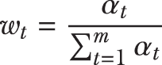

分母是一个归一化项：所有单个验证准确率的总和。这个计算确保了分类器的权重与其准确性成比例，并且所有权重之和为 1。

给定一个新示例来预测 x，我们可以得到单个分类器的预测，*y*[t]（使用 predict_individual）。现在，最终预测可以计算为单个预测的加权总和：

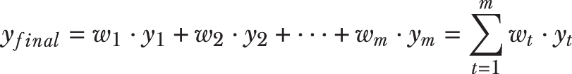

该过程如图 3.9 所示。

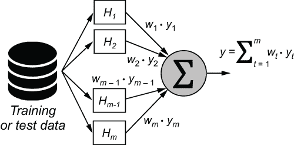

图 3.9 通过性能加权进行组合。每个分类器被分配一个与其准确度成比例的权重。最终预测是单个预测的加权组合。

列表 3.4 实现了通过准确度加权的组合。请注意，尽管单个分类器的预测值将为 0 或 1，但最终的整体预测将是一个介于 0 和 1 之间的实数，因为权重是分数。可以通过在 0.5 阈值上对加权预测进行阈值处理，轻松地将这种分数预测转换为 0-1 的最终预测。

例如，y_final=0.75 的联合预测将被转换为 y_final=1（因为 0.75 大于 0.5 阈值），而 y_final=0.33 的联合预测将被转换为 y_final=0（因为 0.33 小于 0.5 阈值）。虽然平局非常罕见，但可以任意打破。

列表 3.4 使用准确度加权进行组合

```
def combine_using_accuracy_weighting(X, estimators, 
                                     Xval, yval):        ❶
    n_estimators = len(estimators)
    yval_individual = predict_individual(Xval, 
                          estimators, proba=False)       ❷

    wts = [accuracy_score(yval, yval_individual[:, i]) 
           for i in range(n_estimators)]                 ❸

wts /= np.sum(wts)                                       ❹

ypred_individual = predict_individual(X, estimators, proba=False)
y_final = np.dot(ypred_individual, wts)                  ❺

return np.round(y_final)                                 ❻
```

❶ 将验证集作为输入

❷ 在验证集上获取单个预测

❸ 为每个基本分类器设置其准确率分数作为权重

❹ 归一化权重

❺ 高效地计算单个标签的加权组合

❻ 通过四舍五入将组合预测转换为 0-1 标签

我们可以使用这个函数使用我们之前训练的基本估计器对测试数据集 Xtst 进行预测：

```
ypred = combine_using_accuracy_weighting(Xtst, estimators, Xval, yval)
tst_err = 1 - accuracy_score(ytst, ypred)
```

这会产生以下输出：

```
0.03539823008849563
```

这种加权策略产生了一个异质集成，测试错误率为 3.54%。

### 3.2.3 熵加权

熵加权方法是一种基于性能的加权方法，但它使用熵作为评估指标来判断每个基本估计器的价值。熵是集合中*不确定性*或*杂质*的度量；一个更无序的集合将具有更高的熵。

熵

熵，或更确切地说，*信息熵*，最初由克劳德·香农提出，用于量化一个变量所传递的“信息量”。这取决于两个因素：（1）变量可以取的不同值的数量，（2）与每个值相关的不确定性。

考虑有三个病人——Ana、Bob 和 Cam——在医生的办公室等待医生的疾病诊断。Ana 被告知有 90%的信心她很健康（即有 10%的可能性她生病）。Bob 被告知有 95%的信心他生病了（即有 5%的可能性他健康）。Cam 被告知他的检测结果不明确（即 50%/50%）。

Ana 收到了好消息，她的诊断几乎没有不确定性。尽管 Bob 收到了坏消息，但他的诊断几乎没有不确定性。Cam 的情况具有最高的不确定性：他没有收到好坏消息，需要进行更多的测试。

熵量化了这种关于各种结果的不确定性概念。基于熵的度量在决策树学习期间通常用于贪婪地识别最佳分割变量，并在深度神经网络中用作损失函数。

我们不是用准确率来权衡分类器，而是可以使用熵。然而，由于较低的熵是可取的，我们需要确保基本分类器的权重与其对应的熵成**反比**。

计算预测的熵

假设我们有一个测试示例，一个由 10 个基本估计器组成的集成返回了一个预测标签的向量：[1, 1, 1, 0, 0, 1, 1, 1, 0, 0]。这个集合有六个预测的 *y* = 1 和四个预测的 *y* = 0。这些 *标签计数* 可以等价地表示为 *标签概率*：预测 *y* = 1 的概率是 *P*(*y* = 1) = 6/10 = 0.6，预测 *y* = 0 的概率是 *P*(*y* = 0) = 4/10 = 0.4。有了这些标签概率，我们可以计算这个基本估计器预测集合的熵：


在这种情况下，我们将有 *E* = -0.4 log0.4 - 0.6 log0.6 = 0.971。

或者，考虑第二个测试示例，其中 10 个基础估计器返回了一个预测标签的向量：[1, 1, 1, 1, 0, 1, 1, 1, 1, 1]。这个集合有九个预测 *y* = 1 和一个预测 *y* = 0。在这种情况下，*标签概率* 是 *P*(*y* = 1) = 9/10 = 0.9 和 *P*(*y* = 0) = 1/10 = 0.1。在这种情况下，熵将是 *E* = -0.1 log0.1 - 0.9 log0.9 = 0.469。这个预测集合的熵较低，因为它更*纯净*（大多数预测都是 *y* = 1）。另一种看法是，10 个基础估计器对第二个示例的预测更不确定。以下列表可以用来计算离散值集合的熵。

列表 3.5 计算熵

```
def entropy(y):
    _, counts = np.unique(y, return_counts=True)    ❶
    p = np.array(counts.astype('float') / len(y))   ❷
    ent = -p.T @ np.log2(p)                         ❸

    return ent
```

❶ 计算标签计数

❷ 将计数转换为概率

❸ 计算熵作为点积

使用验证集的熵权重

设 *E*[t] 为第 *t* 个分类器的验证熵 *H*[t]。每个基础分类器的权重为

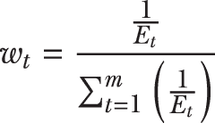

熵权重和准确度权重之间有两个主要区别：

+   基础分类器的准确度使用真实标签 ytrue 和预测标签 ypred 计算。这样，准确度度量指标衡量分类器的性能。准确度高的分类器更好。

+   基础分类器的熵仅使用预测标签 ypred 计算，熵度量指标衡量分类器对其预测的不确定性。熵（不确定性）低的分类器更好。因此，单个基础分类器权重与其对应的熵成反比。

与准确度权重一样，最终预测需要在 0.5 处进行阈值处理。以下列表实现了使用熵权重的组合。

列表 3.6 使用熵权重的组合

```
def combine_using_entropy_weighting(X, estimators, 
                                    Xval):                ❶
    n_estimators = len(estimators)
    yval_individual = predict_individual(Xval, 
                          estimators, proba=False)        ❷

    wts = [1/entropy(yval_individual[:, i])               ❸
           for i in range(n_estimators)]
    wts /= np.sum(wts)                                    ❹

    ypred_individual = predict_individual(X, estimators, proba=False)
    y_final = np.dot(ypred_individual, wts)               ❺

    return np.round(y_final)                              ❻
```

❶ 仅取验证示例

❷ 在验证集上获取单个预测

❸ 将每个基础分类器的权重设置为它的逆熵

❹ 归一化权重

❺ 高效地计算单个标签的加权组合

❻ 返回四舍五入的预测

我们可以使用此函数使用先前训练的基础估计器对测试数据集 Xtst 进行预测：

```
ypred = combine_using_entropy_weighting(Xtst, estimators, Xval)
tst_err = 1 - accuracy_score(ytst, ypred)
```

这会产生以下输出：

```
0.03539823008849563
```

这种加权策略产生了一个具有 3.54% 测试错误的异构集成。

### 3.2.4 Dempster-Shafer 组合

我们之前看到的方法直接组合了单个基础估计器的预测（注意，我们在调用 predict_ individual 时设置了标志 proba=False）。当我们设置 proba=True 在 predict_individual 中时，每个分类器都会返回其属于类别 1 的概率的个体估计。也就是说，当 proba=True 时，而不是返回 *y*[pred] = 0 或 *y*[pred] = 1，每个估计器将返回 *P*(*y*[pred] = 1)。

这个概率反映了分类器对预测应该是什么的信念，并提供了对预测的更细致的看法。虽然本节中描述的方法也可以与概率一起工作，但 Dempster-Shafer 理论（DST）方法是将这些基估计器信念融合成一个整体最终信念或预测概率的另一种方式。

DST 用于标签融合

DST 是概率论的一种推广，它支持在不确定性和不完整知识下的推理。虽然 DST 的基础超出了本书的范围，但该理论本身提供了一种将来自多个来源的信念和证据融合成一个单一信念的方法。

DST 使用介于 0 和 1 之间的数字来表示对命题的信念，例如“测试示例 x 属于类别 1”。这个数字被称为*基本概率分配*（BPA），它表达了文本示例 x 属于类别 1 的确定性。接近 1 的 BPA 值表示更确定的决策。BPA 允许我们将估计器的置信度转换为对真实标签的信念。

假设使用 3nn 分类器对测试示例 x 进行分类，并返回 *P*(*y*[pred] = 1 | 3*nn*) = 0.75。现在，gnb 也被用来对相同的测试示例进行分类，并返回 *P*(*y*[pred] = 1 | *gnb*) = 0.6。根据 DST，我们可以计算命题“测试示例 *x* 根据两者 3nn 和 gnb 都属于类别 1”的 BPA。我们通过融合它们的个别预测概率来完成这项工作：

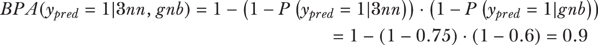

我们还可以计算命题“测试示例 x 根据 3nn 和 gnb 都属于类别 0”的 BPA：

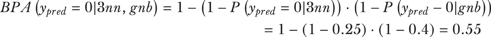

根据这些分数，我们更有信心认为测试示例 x 属于类别 1。BPAs 可以被视为置信度分数，我们可以用它们来计算属于类别 0 或类别 1 的最终信念。

BPAs 用于计算信念。未归一化的信念（表示为 Bel）是“测试示例 *x* 属于类别 1”的计算如下

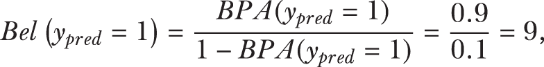

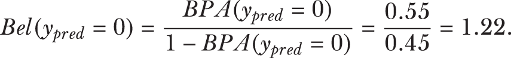

这些未归一化的信念可以使用归一化因子 *Z* = *Bel*(*y*[pred] = 1) + *Bel*(*y*[pred] = 0) +1 进行归一化，以得到 *Bel*(*y*[pred] = 1) = 0.80 和 *Bel*(*y*[pred] = 0) = 0.11。最后，我们可以使用这些信念来得到最终的预测：信念最高的类别。对于这个测试示例，DST 方法产生了最终的预测 *y*[pred] = 1。

结合使用 DST

下面的列表实现了这种方法。

列表 3.7 结合使用 Dempster-Shafer

```
def combine_using_Dempster_Schafer(X, estimators):
    p_individual = predict_individual(X, 
                       estimators, proba=True)      ❶
    bpa0 = 1.0 - np.prod(p_individual, axis=1)
    bpa1 = 1.0 - np.prod(1 - p_individual, axis=1)

    belief = np.vstack([bpa0 / (1 - bpa0), 
                        bpa1 / (1 - bpa1)]).T       ❷
    y_final = np.argmax(belief, axis=1)             ❸
    return y_final
```

❶ 在验证集上获取个别预测

❷ 将每个测试示例的类别 0 和类别 1 的信念并排堆叠

❸ 选择最终标签为信念最高的类别

我们可以使用这个函数来使用我们之前训练的基础估计器对测试数据集 Xtst 进行预测：

```
ypred = combine_using_Dempster_Schafer(Xtst, estimators)
tst_err = 1 - accuracy_score(ytst, ypred)
```

这会产生以下输出：

```
0.053097345132743334
```

这个输出意味着 DST 达到了 5.31%的准确率。

我们已经看到了将预测组合成一个最终预测的四种方法。两种直接使用预测，而另外两种使用预测概率。我们可以可视化这些加权方法产生的决策边界，如图 3.10 所示。

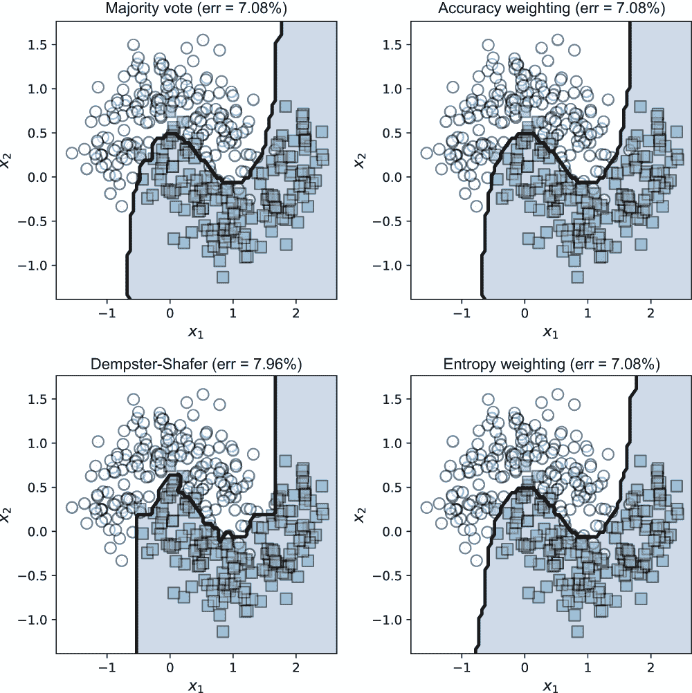

图 3.10 不同加权方法的决策边界

## 3.3 通过元学习组合预测

在上一节中，我们看到了构建分类器异构集成的另一种方法：加权。我们根据每个分类器的性能对每个分类器进行加权，并使用一个*预定的组合函数*来组合每个分类器的预测。在这样做的时候，我们必须仔细设计组合函数，以反映我们的性能优先级。

现在，我们将探讨构建异构集成的一种另一种方法：元学习。我们不会精心设计一个组合函数来组合预测，而是会在单个预测上训练一个组合函数。也就是说，基础估计器的预测被作为输入提供给第二级学习算法。因此，我们不会自己设计，而是训练一个第二级的*元分类函数*。

元学习方法已经在化学计量分析、推荐系统、文本分类和垃圾邮件过滤等众多任务中得到了广泛和成功的应用。对于推荐系统，堆叠和混合的元学习方法在 Netflix 奖项竞赛中由几个顶级团队使用后，被带到了显眼的位置。

### 3.3.1 堆叠

堆叠是最常见的元学习方法，其名称来源于它在其基础估计器之上堆叠第二个分类器。一般的堆叠过程有两个步骤：

1.  第一级：在训练数据上拟合基础估计器。这一步与之前相同，目的是创建一个多样化、异构的基础分类器集。

1.  第二级：从基础分类器的预测中构建一个新的数据集，这些预测成为*元特征*。元特征可以是预测本身或预测的概率。

让我们回到我们的例子，我们从一个 3nn 分类器和 gnb 分类器在我们的 2D 合成数据集上构建一个简单的异构集成。在训练分类器（3nn 和 gnb）之后，我们创建了新的特征，称为*分类元特征*，这些特征来自这两个分类器（见图 3.11）。

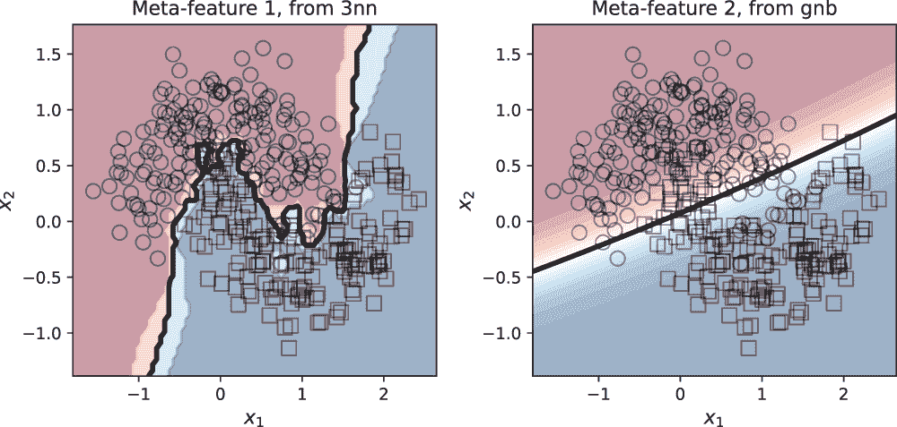

图 3.11 根据 3nn 和 gnb 的预测概率，每个训练样本的预测概率被用作新分类器的元特征。较暗区域的点表示高置信度的预测。每个训练样本现在有两个元特征，分别来自 3nn 和 gnb。

由于我们有两个基础分类器，我们可以使用每个分类器生成我们元示例中的一个元特征。在这里，我们使用 3nn 和 gnb 的预测概率作为元特征。因此，对于每个训练示例，比如说*x*[i]，我们获得两个元特征：*y*^i[3nn]和*y*^i[gnb]，它们分别是 3nn 和 gnb 根据*x*[i]进行的预测概率。

这些元特征成为第二级分类器的元数据。将这种堆叠方法与加权组合进行对比。对于这两种方法，我们使用函数 predict_individual 获得单个预测。对于加权组合，我们直接将这些预测用于某些*预定的组合函数*。在堆叠中，我们使用这些预测作为新的训练集*来训练一个组合函数*。

堆叠可以使用任意数量的第一级基础估计器。我们的目标，一如既往，将是确保这些基础估计器之间存在足够的多样性。图 3.12 显示了用于探索通过加权组合的六个先前使用的流行算法的堆叠示意图：DecisionTreeClassifier，SVC，GaussianProcess Classifier，KNeighborsClassifier，RandomForestClassifier，和 GaussianNB。

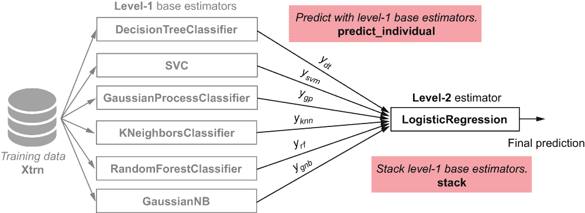

图 3.12 使用六个第一级基础估计器的堆叠产生了一个包含六个元特征的元数据集，这些特征可以用来训练第二级元分类器（此处为逻辑回归）。

此处的第二级估计器可以使用任何基础学习算法进行训练。历史上，线性模型，如线性回归和逻辑回归，已被使用。在第二级使用此类线性模型的集成方法称为*线性堆叠*。线性堆叠通常很受欢迎，因为它速度快：学习线性模型通常计算效率高，即使是对于大型数据集。通常，线性堆叠也可以是分析数据集的有效探索步骤。

然而，堆叠也可以在其第二级使用强大的非线性分类器，包括 SVMs 和 ANNs。这允许集成以复杂的方式组合元特征，尽管这牺牲了线性模型固有的可解释性。

注意：scikit-learn（v1.0 及以上版本）包含 StackingClassifier 和 StackingRegressor，可以直接用于训练。在以下小节中，我们将实现自己的堆叠算法，以了解元学习在底层如何工作的更详细细节。

让我们回顾一下对二维双月数据集进行分类的任务。我们将实现一个线性堆叠过程，该过程包括以下步骤：(1)训练单个基础估计器（第一级），(2a)构建元特征，和(2b)训练一个线性回归模型（第二级）。

我们已经开发出了快速实现线性堆叠所需的大部分框架。我们可以使用 fit（参见图表 3.1）来训练单个基础估计器，并从 predict_individual（参见图表 3.2）中获取元特征。以下列表使用这些函数来拟合任何二级估计器的堆叠模型。由于二级估计器使用生成的特征或元特征，它也被称为*元估计器*。

列表 3.8 使用二级估计器的堆叠

```
def fit_stacking(level1_estimators, level2_estimator, 
use_probabilities=False):

    fit(level1_estimators, X, y)                      ❶

    X_meta = predict_individual(X, estimators=level1_estimators,
                 proba=use_probabilities)             ❷

    level2_estimator.fit(X_meta, y)                   ❸

    final_model = {'level-1': level1_estimators, 
                   'level-2': level2_estimator,       ❹
                   'use-proba': use_probabilities}    
    return final_model
```

❶ 训练一级基础估计器

❷ 获取元特征作为单个预测或预测概率（proba=True/False）

❸ 训练二级元估计器

❹ 将一级估计器和二级估计器保存在字典中

此函数可以通过直接使用预测（use_probabilities=False）或使用预测概率（use_probabilities=True）来学习，如图 3.13 所示。

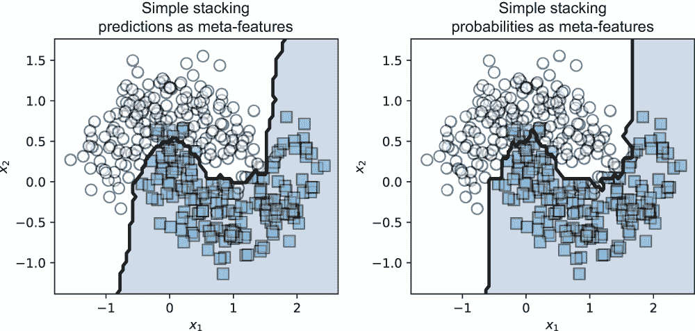

图 3.13 使用逻辑回归堆叠并使用预测（左侧）或预测概率（右侧）作为元特征的最终模型

此处的二级估计器可以是任何分类模型。逻辑回归是一个常见的选择，它导致集成使用线性模型堆叠一级预测。

也可以使用非线性模型作为二级估计器。一般来说，任何学习算法都可以用于在元特征上训练二级估计器。例如，使用 RBF 核的 SVM 或 ANN 这样的学习算法可以在第二级学习强大的非线性模型，并可能进一步提高性能。

预测分为两个步骤：

1.  对于每个测试示例，使用训练好的一级估计器获取元特征，并创建相应的测试元示例。

1.  对于每个元示例，使用二级估计器获取最终预测。

使用堆叠模型进行预测也可以轻松实现，如图 3.9 所示。

列表 3.9 使用堆叠模型进行预测

```
def predict_stacking(X, stacked_model):
    level1_estimators = stacked_model['level-1']       ❶
    use_probabilities = stacked_model['use-proba']

    X_meta = predict_individual(X, estimators=level1_estimators,
                 proba=use_probabilities)              ❷

    level2_estimator = stacked_model['level-2']
    y = level2_estimator.predict(X_meta)               ❸

    return y
```

❶ 获取一级基础估计器

❷ 使用一级基础估计器获取元特征

❸ 获取二级估计器并使用它对元特征进行最终预测

在以下示例中，我们使用上一节中相同的六个基础估计器作为第一级，并使用逻辑回归作为第二级元估计器：

```
from sklearn.linear_model import LogisticRegression
meta_estimator = LogisticRegression(C=1.0, solver='lbfgs')
stacking_model = fit_stacking(estimators, meta_estimator, 
                              Xtrn, ytrn, use_probabilities=True)
ypred = predict_stacking(Xtst, stacking_model)
tst_err = 1 - accuracy_score(ytst, ypred)
```

这会产生以下输出：

```
0.06194690265486724
```

在前面的代码片段中，我们使用了预测概率作为元特征。此线性堆叠模型获得了 6.19%的测试误差。

这种简单的堆叠过程通常很有效。然而，它确实存在一个显著的缺点：过拟合，尤其是在存在噪声数据的情况下。过拟合的影响可以在图 3.14 中观察到。在堆叠的情况下，过拟合发生是因为我们使用了相同的数据集来训练所有基础估计器。

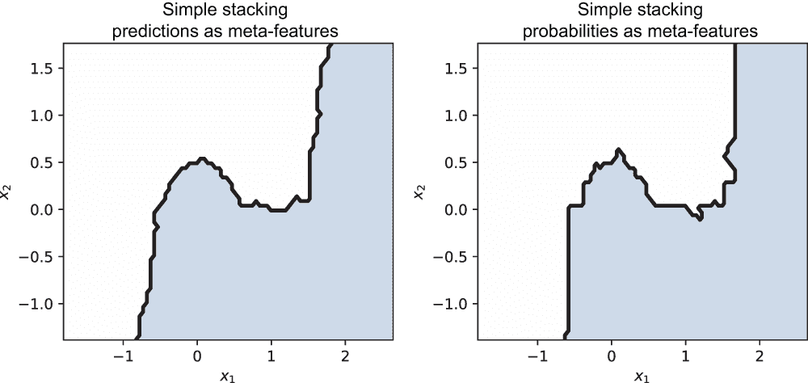

图 3.14 堆叠可能会过拟合数据。这里有过拟合的证据：决策边界在分类器尝试拟合单个、有噪声的示例的地方非常锯齿状。

为了防止过拟合，我们可以结合*k*折交叉验证（CV），这样每个基础估计器就不会在完全相同的数据集上训练。你可能之前遇到过并使用 CV 进行参数选择和模型评估。

在这里，我们使用交叉验证（CV）将数据集划分为子集，以便不同的基础估计器在不同的子集上训练。这通常会导致更多样化和鲁棒性，同时降低过拟合的风险。

### 3.3.2 带有交叉验证的堆叠

CV 是一种模型验证和评估过程，通常用于模拟样本外测试、调整模型超参数以及测试机器学习模型的有效性。前缀“k-fold”用于描述我们将数据集划分为多少个子集。例如，在 5 折交叉验证中，数据（通常是随机地）被划分为五个非重叠的子集。这产生了五个折，或组合，用于训练和验证，如图 3.15 所示。

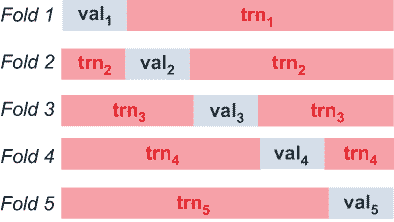

图 3.15 中的 k 折交叉验证（此处，*k*=5）将数据集分成*k*个不同的训练集和验证集。这模拟了训练过程中的样本外验证。

更具体地说，在 5 折交叉验证中，假设数据集*D*被划分为五个子集：*D*[1]，*D*[2]，*D*[3]，*D*[4]，和*D*[5]。这些子集是互斥的，也就是说，数据集中的任何示例只出现在这些子集中的一个中。第三个折将包含训练集 trn[3] = {*D*[1]，*D*[2]，*D*[4]，*D*[5]}（除了*D*[3]的所有子集）和验证集 val[3] = {*D*[3]}（只有*D*[3]）。这个折允许我们训练和验证一个模型。总体而言，5 折交叉验证将允许我们训练和验证五个模型。

在我们的案例中，我们将以略微不同的方式使用交叉验证过程，以确保我们二级估计器的鲁棒性。我们不会使用验证集 val[k]进行评估，而是将它们用于为二级估计器生成元特征。将堆叠与 CV 结合的精确步骤如下：

1.  将数据随机划分为*k*个大小相等的子集。

1.  使用对应第 k 个折的训练数据 trn[k]，为每个基础估计器训练*k*个模型。

1.  使用对应第 k 个折的验证数据*val*[k]，从每个训练好的基础估计器生成*k*组元示例。

1.  在完整数据集上重新训练每个一级基础估计器。

该过程的头三个步骤在图 3.16 中进行了说明。

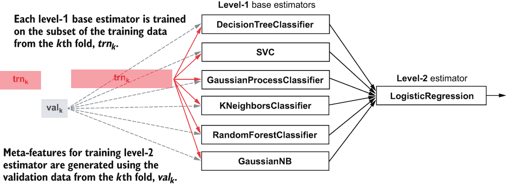

图 3.16 使用 k 折 CV 的堆叠。每个第一层基础估计器的*k*个版本在每个折的训练集中训练，并为第二层估计器从每个折的验证集中生成*k*个子元示例。

使用 CV 进行堆叠的一个关键部分是将数据集分割为每个折的训练集和验证集。scikit-learn 包含许多用于执行此操作的实用工具，我们将使用的一个称为 model_selection.StratifiedKFold。StratifiedKFold 类是 model_selection.KFold 类的变体，它返回*分层折*。这意味着在生成折时，折保留了数据集中的类别分布。

例如，如果我们的数据集中正例与负例的比例是 2:1，StratifiedKFold 将确保这个比例在折中也被保留。最后，应该注意的是，StratifiedKFold 实际上返回的是每个折的训练集和验证集数据点的索引，而不是为每个折创建数据集的多个副本（这在存储方面非常浪费）。下面的列表展示了如何执行带有交叉验证的堆叠。

列表 3.10 使用交叉验证的堆叠

```
from sklearn.model_selection import StratifiedKFold

def fit_stacking_with_CV(level1_estimators, level2_estimator, 
                         X, y, n_folds=5, use_probabilities=False):
    n_samples = X.shape[0]
    n_estimators = len(level1_estimators)
    X_meta = np.zeros((n_samples, n_estimators))                     ❶

    splitter = StratifiedKFold(n_splits=n_folds, shuffle=True)

    for trn, val in splitter.split(X, y):                            ❷
        level1_estimators = fit(level1_estimators, X[trn, :], y[trn])
        X_meta[val, :] = predict_individual(X[val, :],
                                            estimators=level1_estimators,  
                                            proba=use_probabilities)

    level2_estimator.fit(X_meta, y)                                  ❸

    level1_estimators = fit(level1_estimators, X, y)

    final_model = {'level-1': level1_estimators,                     ❹
                   'level-2': level2_estimator, 
                   'use-proba': use_probabilities}

    return final_model
```

❶ 初始化元数据矩阵

❷ 训练第一层估计器，然后使用单个预测为第二层估计器生成元特征

❸ 训练第二层元估计器

❹ 将第一层估计器和第二层估计器保存在字典中

我们可以使用此函数使用 CV 训练堆叠模型：

```
stacking_model = fit_stacking_with_CV(estimators, meta_estimator, 
                                      Xtrn, ytrn, 
                                      n_folds=5, use_probabilities=True)
ypred = predict_stacking(Xtst, stacking_model)
tst_err = 1 - accuracy_score(ytst, ypred)
```

这会产生以下输出：

```
0.053097345132743334
```

使用 CV，堆叠获得了 5.31%的测试误差。和之前一样，我们可以可视化我们的堆叠模型，如图 3.17 所示。我们看到决策边界更平滑，更少锯齿状，整体上更不容易过拟合。

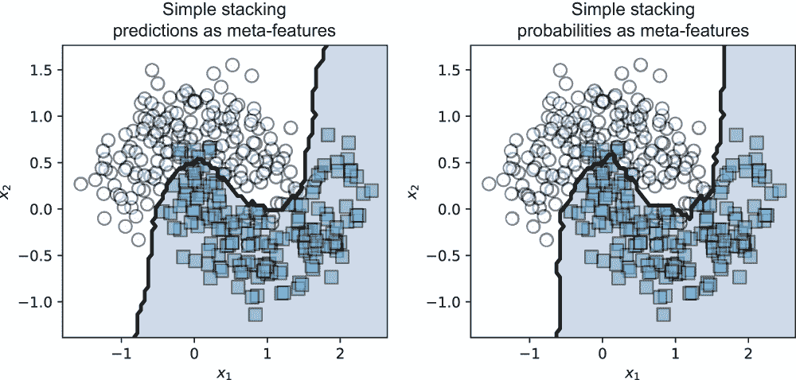

图 3.17 使用 CV 进行堆叠对过拟合更稳健。

TIP 在我们的示例场景中，我们有六个基础估计器；如果我们选择使用 5 折交叉验证进行堆叠，我们总共需要训练 6 × 5 = 30 个模型。每个基础估计器都在数据集的(*k* - 1)/*k*部分上训练。对于较小的数据集，相应的训练时间增加是适度的，并且通常值得付出代价。对于较大的数据集，这种训练时间可能是显著的。如果基于完整交叉验证的堆叠模型训练成本过高，那么通常保留一个单独的验证集，而不是几个交叉验证子集，就足够了。这个程序被称为*混合*。

现在我们可以通过我们的下一个案例研究：情感分析，看到元学习在大型、真实世界分类任务中的实际应用。

## 3.4 案例研究：情感分析

情感分析是一种自然语言处理（NLP）任务，广泛应用于识别和分析文本中的观点。在其最简单的形式中，它主要关注识别观点的*效果*或*极性*，即正面、中性或负面。这种“客户之声”分析是品牌监控、客户服务和市场研究的关键部分。

本案例研究探讨了针对电影评论的监督情感分析任务。我们将使用的数据集是大型电影评论数据集，它最初由斯坦福大学的一个小组收集和整理，用于 NLP 研究，并来自 IMDB.com。¹ 这个大型、公开可用的数据集在过去几年已成为文本挖掘/机器学习的基准，并出现在几个 Kaggle 竞赛中([www.kaggle.com/c/word2vec-nlp-tutorial](https://www.kaggle.com/c/word2vec-nlp-tutorial))。

数据集包含 50,000 条电影评论，分为训练集（25,000）和测试集（25,000）。每条评论还关联一个从 1 到 10 的数值评分。然而，这个数据集只考虑了强烈观点的标签，即对电影强烈正面（7-10）或强烈负面（1-4）的评论。这些标签被压缩为二进制情感极性标签：强烈正面情感（类别 1）和强烈负面情感（类别 0）。以下是从数据集中一个正面评论（标签=1）的例子：

这是一部多么令人愉快的电影。角色不仅活泼，而且充满生命力，反映了家庭中的真实日常生活和冲突。每个角色都给故事带来了独特的个性，观众可以轻易地将其与他们自己家庭或亲密朋友圈子中认识的人联系起来。

下面是一个负面评论（标签=0）的例子：

这是电影史上最糟糕的续集。再一次，它没有任何意义。杀手仍然为了乐趣而杀人。但这次他杀的是那些在拍关于第一部电影的电影的人。这意味着这是史上最愚蠢的电影。不要看这部电影。如果你珍视这部电影中的宝贵一小时，那就不要看它。

注意上面“sense”拼写为“since”的错误。由于这样的拼写、语法和语言上的特殊性，现实世界的文本数据可能非常嘈杂，这使得这些问题对机器学习来说非常具有挑战性。首先，下载并解压这个数据集。

### 3.4.1 预处理

数据集经过预处理，将每个评论从非结构化的自由文本形式转换为结构化的向量表示。换句话说，预处理的目标是将这个文本文件集合（语料库）转换为*词-文档矩阵*表示。

这通常涉及以下步骤：去除特殊符号、分词（将其分割成标记，通常是单个单词）、词形还原（识别同一单词的不同用法，例如 organize, organizes, organizing）和计数向量化（计算每个文档中出现的单词）。最后一步产生语料库的*词袋模型*（BoW）表示。在我们的情况下，数据集的每一行（示例）将是一个评论，每一列（特征）将是一个单词。

图 3.18 中的示例说明了当句子“this is a terrible terrible movie”转换为包含单词{this, is, a, brilliant, terrible, movie}的词汇表时的 BoW 表示。

由于单词“brilliant”在评论中未出现，其计数为 0，而大多数其他条目为 1，对应于它们在评论中只出现一次的事实。这位评论者显然认为这部电影非常糟糕——在我们的计数特征中，对于“terrible”特征的条目是 2。

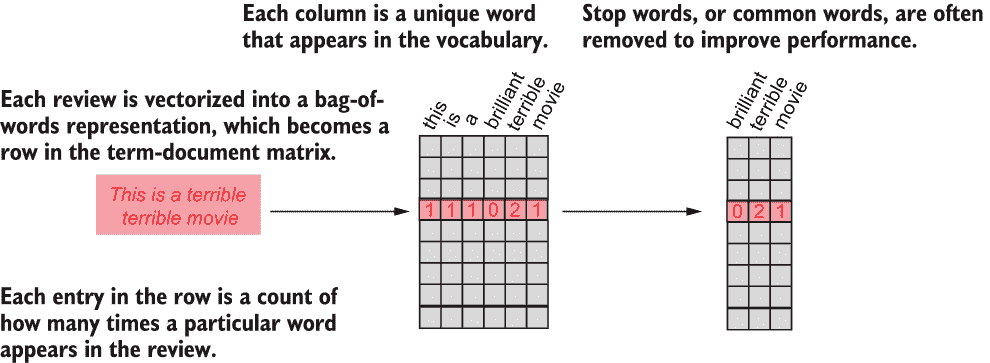

图 3.18 文本被转换为词-文档矩阵，其中每一行是一个示例（对应单个评论），每一列是一个特征（对应评论中的单词）。条目是单词计数，使得每个示例成为一个计数向量。去除停用词可以改善表示，并且通常也会提高性能。

幸运的是，这个数据集已经通过计数向量化进行了预处理。这些预处理过的词-文档计数特征，即我们的数据集，可以在/train/labeledBow.feat 和/test/labeledBow.feat 中找到。训练集和测试集的大小都是 25,000 × 89,527。因此，大约有 90,000 个特征（即单词），这意味着整个评论集使用了大约 90,000 个独特的单词。我们进一步通过以下小节中讨论的两个附加步骤对数据进行预处理。

停用词去除

此步骤旨在移除诸如“the”、“is”、“a”和“an”等常见词汇。传统上，停用词去除可以降低数据的维度（使处理更快），并且可以提高分类性能。这是因为像“the”这样的词通常对信息检索和文本挖掘任务并不真正具有信息性。

警告：在处理某些停用词，如“not”时，应谨慎，因为这个常见词会显著影响潜在的语义和情感。例如，如果我们不考虑否定并应用停用词去除到句子“not a good movie”上，我们得到“good movie”，这完全改变了情感。在这里，我们不选择性地考虑这样的停用词，而是依靠其他表达性强的单词，如“awful”、“brilliant”和“mediocre”，来捕捉情感。然而，通过基于对词汇以及剪枝（或甚至增强）如何影响您的任务的理解进行仔细的特征工程，可以在您自己的数据集上提高性能。

自然语言处理工具包（NLTK）是一个强大的 Python 包，它提供了许多 NLP 工具。在列表 3.11 中，我们使用 NLTK 的标准停用词删除工具。IMDB 数据集的整个词汇表都可在文件 imdb.vocab 中找到，按频率排序，从最常见到最少见。

我们可以直接应用停用词删除来识别我们将保留哪些单词。此外，我们只保留最常见的 5000 个单词，以便我们的运行时间更加可控。

列表 3.11 从词汇表中删除停用词

```
import nltk
import numpy as np

def prune_vocabulary(data_path, max_features=5000):
    with open('{0}/imdb.vocab'.format(data_path), 'r', encoding='utf8') \
        as vocab_file:
        vocabulary = vocab_file.read().splitlines()    ❶

    nltk.download('stopwords') 

    stopwords = set(
        nltk.corpus.stopwords.words("english"))        ❷

    to_keep = [True if word not in stopwords           ❸
                    else False for word in vocabulary]
    feature_ind = np.where(to_keep)[0]

    return feature_ind[:max_features]                  ❹
```

❶ 加载词汇文件

❷ 将停用词列表转换为集合以加快处理速度

❸ 从词汇表中删除停用词

❹ 保留前 5000 个单词

TF-IDF 转换

我们的第二个预处理步骤将计数特征转换为**词频-逆文档频率**（TF-IDF）特征。TF-IDF 表示一个统计量，它根据每个特征在文档中的出现频率（在我们的情况下，单个评论）以及在整个语料库中的出现频率（在我们的情况下，所有评论）来加权每个文档中的特征。

直观地说，TF-IDF 通过单词在文档中出现的频率来加权单词，同时也调整了它们在整体中出现的频率，并考虑到了某些单词通常比其他单词使用得更频繁的事实。我们可以使用 scikit-learn 的预处理工具箱，通过 TfidfTransformer 将我们的计数特征转换为 TF-IDF 特征。列表 3.12 创建并保存了训练集和测试集，每个集包含 25,000 条评论×5000 个 TF-IDF 特征。

列表 3.12 提取 TF-IDF 特征并保存数据集

```
import h5py
from sklearn.datasets import load_svmlight_files
from scipy.sparse import csr_matrix as sp
from sklearn.feature_extraction.text import TfidfTransformer

def preprocess_and_save(data_path, feature_ind):
    data_files = ['{0}/{1}/labeledBow.feat'.format(data_path, data_set) 
                  for data_set in ['train', 'test']]                       ❶
    [Xtrn, ytrn, Xtst, ytst] = load_svmlight_files(data_files)
    n_features = len(feature_ind)

    ytrn[ytrn <= 5], ytst[ytst <= 5] = 0, 0                                ❷
    ytrn[ytrn > 5], ytst[ytst > 5] = 1, 1

    tfidf = TfidfTransformer()
    Xtrn = tfidf.fit_transform(Xtrn[:, feature_ind])                       ❸
    Xtst = tfidf.transform(Xtst[:, feature_ind])

    filename = '{0}/imdb-{1}k.h5'.format(data_path, round(n_features/1000))
    with h5py.File(filename, 'w') as db:                                   ❹
        db.create_dataset('Xtrn', data=sp.todense(Xtrn), compression='gzip')
        db.create_dataset('ytrn', data=ytrn, compression='gzip')
        db.create_dataset('Xtst', data=sp.todense(Xtst), compression='gzip')
        db.create_dataset('ytst',  data =ytst, compression='gzip')
```

❶ 加载训练和测试数据

❷ 将情感转换为二进制标签

❸ 将计数特征转换为 TF-IDF 特征

❹ 以 HDF5 二进制数据格式保存预处理后的数据集

### 3.4.2 降维

我们继续使用降维处理数据，其目的是更紧凑地表示数据。应用降维的主要目的是避免“维度诅咒”，即随着数据维度的增加，算法性能会下降。

我们采用流行的降维方法**主成分分析**（PCA），其目的是以尽可能保留尽可能多的可变性（使用标准差或方差来衡量）的方式压缩和嵌入数据到低维特征空间中。这确保了我们能够在不损失太多信息的情况下提取低维表示。

此数据集包含数千个示例以及特征，这意味着对整个数据集应用 PCA 可能会非常计算密集且非常慢。为了避免将整个数据集加载到内存中并更有效地处理数据，我们执行增量 PCA（IPCA）。

IPCA 将数据集分解成可以轻松加载到内存中的块。然而，请注意，尽管这种分块大大减少了加载到内存中的样本（行）数量，但它仍然为每一行加载了所有特征（列）。

scikit-learn 提供了 sklearn.decomposition.IncrementalPCA 类，它具有更高的内存效率。以下列表执行 PCA 以将数据的维度降低到 500 维。

列表 3.13 使用 IPCA 进行降维

```
from sklearn.decomposition import IncrementalPCA

def transform_sentiment_data(data_path, n_features=5000, n_components=500):
    db = h5py.File('{0}/imdb-{1}k.h5'.format(                              ❶
             data_path, round(n_features/1000)), 'r')

    pca = IncrementalPCA(n_components=n_components)
    chunk_size = 1000
    n_samples = db['Xtrn'].shape[0]                                        ❷
    for i in range(0, n_samples // chunk_size):
        pca.partial_fit(db['Xtrn'][i*chunk_size:(i+1) * chunk_size])

    Xtrn = pca.transform(db['Xtrn'])                                       ❸
    Xtst = pca.transform(db['Xtst'])

    with h5py.File('{0}/imdb-{1}k-pca{2}.h5'.format(data_path,
             round(n_features/1000), n_components), 'w') as db2:
        db2.create_dataset('Xtrn', data=Xtrn, compression='gzip')
        db2.create_dataset('ytrn', data=db['ytrn'], compression='gzip')
        db2.create_dataset('Xtst', data=Xtst, compression='gzip')
        db2.create_dataset('ytst', data=db['ytst'],
                           compression='gzip')                             ❹
```

❶ 加载预处理后的训练和测试数据

❷ 将 IPCA 应用到可管理的数据块中

❸ 降低训练和测试示例的维度

❹ 将预处理后的数据集保存为 HDF5 二进制数据格式

注意，IncrementalPCA 仅使用训练集进行拟合。回想一下，测试数据必须始终保留，并且只能用于提供我们管道如何泛化到未来未见数据的准确估计。这意味着我们无法在预处理或训练的任何部分使用测试数据，而只能用于评估。

### 3.4.3 混合分类器

我们现在的目标是使用元学习训练一个异构集成。具体来说，我们将通过混合几个基础估计器来构建集成。回想一下，混合是堆叠的一种变体，其中我们不是使用交叉验证（CV），而是使用单个验证集。

首先，我们使用以下函数加载数据：

```
def load_sentiment_data(data_path,n_features=5000, n_components=1000):

    with h5py.File('{0}/imdb-{1}k-pca{2}.h5'.format(data_path,
                 round(n_features/1000), n_components), 'r') as db:
        Xtrn = np.array(db.get('Xtrn'))
        ytrn = np.array(db.get('ytrn'))
        Xtst = np.array(db.get('Xtst'))
        ytst = np.array(db.get('ytst'))

    return Xtrn, ytrn, Xtst, ytst
```

接下来，我们使用五个基础估计器：具有 100 个随机决策树的 RandomForestClassifier，具有 100 个极端随机树的 ExtraTreesClassifier，逻辑回归，伯努利朴素贝叶斯（BernoulliNB），以及使用随机梯度下降（SGDClassifier）训练的线性 SVM：

```
from sklearn.ensemble import RandomForestClassifier, ExtraTreesClassifier
from sklearn.linear_model import LogisticRegression, SGDClassifier
from sklearn.naive_bayes import BernoulliNB

estimators = [('rf', RandomForestClassifier(n_estimators=100, n_jobs=-1)),
              ('xt', ExtraTreesClassifier(n_estimators=100, n_jobs=-1)),
              ('lr', LogisticRegression(C=0.01, solver='lbfgs')),
              ('bnb', BernoulliNB()),
              ('svm', SGDClassifier(loss='hinge', penalty='l2', alpha=0.01,
                                    n_jobs=-1, max_iter=10, tol=None))]
```

伯努利朴素贝叶斯分类器学习线性模型，但特别适用于来自文本挖掘任务（如我们的任务）的基于计数的文本数据。逻辑回归和 SGDClassifier 的 SVM 都学习线性模型。随机森林和 Extra Trees 是两种同质集成，它们使用决策树作为基础估计器产生高度非线性分类器。这是一个多样化的基础估计器集合，包含线性和非线性分类器的良好混合。

为了将这些基础估计器混合成一个具有元学习的异构集成，我们使用以下程序：

1.  将训练数据分为一个包含 80% 数据的训练集（Xtrn, ytrn）和一个包含剩余 20% 数据的验证集（Xval, yval）。

1.  在训练集（Xtrn, ytrn）上训练每个一级估计器。

1.  使用训练估计器通过 Xval 生成元特征 Xmeta。

1.  使用元特征增强验证数据：[Xval, Xmeta]；这个增强的验证集将包含 500 个原始特征 + 5 个元特征。

1.  使用增强的验证集（[Xval, Xmeta], yval）训练二级估计器。

我们通过元学习组合程序的关键是元特征增强：我们使用基础估计器产生的元特征增强验证集。

这留下了最后一个决定：选择第二级估计器。之前，我们使用了简单的线性分类器。对于这个分类任务，我们使用神经网络。

神经网络和深度学习

神经网络是机器学习算法中最古老的之一。由于在许多应用中取得了广泛的成功，人们对神经网络，尤其是深度神经网络，的兴趣显著复苏。

为了快速回顾神经网络和深度学习，请参阅 Oliver Dürr、Beate Sick 和 Elvis Murina（Manning, 2020）所著的《Python 概率深度学习》、《Keras》和《TensorFlow Probability》的第二章。

我们将使用浅层神经网络作为我们的第二级估计器。这将产生一个高度非线性的元估计器，可以结合第一级分类器的预测：

```
from sklearn.neural_network import MLPClassifier
meta_estimator = MLPClassifier(hidden_layer_sizes=(128, 64, 32),
                               alpha=0.001)
```

下面的列表实现了我们的策略。

列表 3.14 使用验证集混合模型

```
from sklearn.model_selection import train_test_split

def blend_models(level1_estimators, level2_estimator, 
                 X, y , use_probabilities=False):    
    Xtrn, Xval, ytrn, yval = train_test_split(X, y, 
                                 test_size=0.2)     ❶

    n_estimators = len(level1_estimators)
    n_samples = len(yval)
    Xmeta = np.zeros((n_samples, n_estimators))
    for i, (model, estimator) in 
        enumerate(level1_estimators):               ❷
        estimator.fit(Xtrn, ytrn)
        Xmeta[:, i] = estimator.predict(Xval)

    Xmeta = np.hstack([Xval, Xmeta])                ❸

    level2_estimator.fit(Xmeta, yval)               ❹

    final_model = {'level-1': level1_estimators, 
                   'level-2': level2_estimator, 
                   'use-proba': use_probabilities}

    return final_model
```

❶ 分割为训练集和验证集

❷ 在训练数据上初始化和拟合基础估计器

❸ 使用新生成的元特征增强验证集

❹ 符合第二级元估计器的级别

我们现在可以在训练数据上拟合一个异构集成：

```
stacked_model = blend_models(estimators, meta_estimator, Xtrn, ytrn)
```

然后，我们在训练数据和测试数据上评估它，以计算训练和测试错误。首先，我们使用以下方法计算训练错误

```
ypred = predict_stacking(Xtrn, stacked_model)
trn_err = (1 - accuracy_score(ytrn, ypred)) * 100
print(trn_err)
```

这给我们带来了 7.84%的训练错误：

```
7.8359999999999985
```

接下来，我们使用以下方法计算测试错误

```
ypred = predict_stacking(Xtst, stacked_model)
tst_err = (1 - accuracy_score(ytst, ypred)) * 100
print(tst_err)
```

这给我们带来了 17.2%的测试错误：

```
17.196
```

我们实际上做得怎么样？我们的集成过程是否有所帮助？为了回答这些问题，我们将集成性能与集成中每个基础估计器的性能进行比较。

图 3.19 显示了各个基础估计器的训练和测试错误，以及堆叠/混合集成。一些个别分类器达到了 0%的训练错误，这意味着它们很可能是过度拟合了训练数据。这影响了它们的性能，正如测试错误所证明的那样。

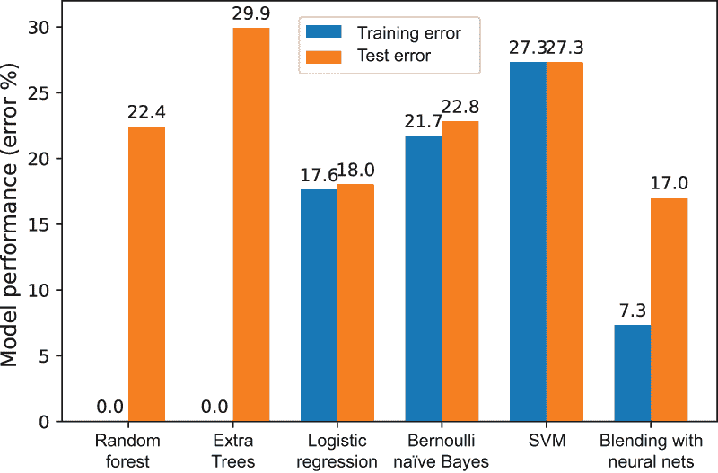

图 3.19 比较了每个个别基础分类器与元分类器集成的性能。堆叠/混合通过集成多样化的基础分类器提高了分类性能。

总体而言，堆叠/混合这些异构模型产生了 17.2%的测试错误，这比所有其他模型都要好。特别是，让我们将这个结果与测试错误为 18%的逻辑回归进行比较。回想一下，测试集包含 25,000 个示例，这意味着我们的堆叠模型正确分类（大约）另外 200 个示例！

总体而言，异构集成的性能优于许多为其做出贡献的基础估计器。这是异构集成如何提高底层个别基础估计器整体性能的一个例子。

TIP 记住，任何线性或非线性分类器都可以用作元估计器。常见的选择包括决策树、核支持向量机（SVMs），甚至是其他集成方法！

## 摘要

+   异构集成方法通过异构性促进集成多样性；也就是说，它们使用不同的基础学习算法来训练基础估计器。

+   加权方法为每个基础估计器的预测分配一个与其性能相对应的权重；更好的基础估计器被分配更高的权重，对最终预测的影响更大。

+   加权方法使用预定义的组合函数来组合单个基础估计器的加权预测。线性组合函数（例如，加权求和）通常有效且易于解释。也可以使用非线性组合函数，尽管增加的复杂性可能导致过拟合。

+   元学习方法从数据中学习一个组合函数，与加权方法不同，后者我们必须自己想出一个。

+   元学习方法创建了多个估计器层。最常用的元学习方法是堆叠（stacking），这个名字来源于它实际上是在一种金字塔式的学习方案中堆叠学习算法。

+   简单的堆叠创建了两个估计器层。基础估计器在第一层进行训练，它们的输出用于训练第二层估计器，称为元估计器。更复杂的堆叠模型，具有更多估计器层，也是可能的。

+   堆叠往往会导致过拟合，尤其是在存在噪声数据的情况下。为了避免过拟合，堆叠与交叉验证（CV）结合使用，以确保不同的基础估计器看到数据集的不同子集，从而增加集成多样性。

+   虽然带有交叉验证（CV）的堆叠可以减少过拟合，但它也可能计算密集，导致训练时间过长。为了在防止过拟合的同时加快训练速度，可以使用单个验证集。这个过程被称为混合。

+   任何机器学习算法都可以用作堆叠中的元估计器。逻辑回归是最常见的，它导致线性模型。显然，非线性模型具有更大的代表性能力，但它们也面临着更大的过拟合风险。

+   加权和元学习方法都可以直接使用基础估计器的预测或预测概率。后者通常导致更平滑、更细腻的模型。

***

^（1.）Andrew L. Maas, Raymond E. Daly, Peter T. Pham, Dan Huang, Andrew Y. Ng, 和 Christopher Potts, “用于情感分析的学习词向量，”2011 年，[`mng.bz/nJRe`](http://mng.bz/nJRe)。
