# 4 序列集成：自适应提升

本章涵盖

+   训练弱学习者的序列集成

+   实现并理解 AdaBoost 的工作原理

+   实际应用中的 AdaBoost

+   实现并理解 LogitBoost 的工作原理

我们迄今为止看到的集成策略都是并行集成。这包括同质集成，如 Bagging 和随机森林（使用相同的基学习算法来训练基估计器），以及异质集成方法，如 Stacking（使用不同的基学习算法来训练基估计器）。

现在，我们将探索一种新的集成方法族：序列集成。与利用每个基础估计器独立性的并行集成不同，序列集成利用基础估计器之间的依赖性。更具体地说，在学习的阶段，序列集成以这种方式训练新的基础估计器，即最小化前一步训练的基础估计器所犯的错误。

我们将要研究的第一个序列集成方法是*提升*。提升的目标是结合*弱学习器*，或简单的基估计器。换句话说，提升实际上旨在提升一组弱学习器的性能。

这与诸如 Bagging 之类的算法形成对比，这些算法结合了复杂的基估计器，也称为*强学习器*。提升通常指的是 AdaBoost，或*自适应提升*。这种方法由 Freund 和 Schapire 于 1995 年提出，¹，他们最终因其卓越的理论计算机科学论文而获得了声望极高的哥德尔奖。

自 1995 年以来，提升（Boosting）已成为机器学习的一个核心方法。提升方法实现起来非常简单，计算效率高，并且可以与多种基础学习算法结合使用。在 2010 年代中期深度学习重新兴起之前，提升方法被广泛应用于计算机视觉任务，如目标分类，以及自然语言处理任务，如文本过滤。

在本章的大部分内容中，我们关注 AdaBoost，这是一种流行的提升算法，也是序列集成方法一般框架的很好的说明。通过改变这个框架的某些方面，如损失函数，可以推导出其他提升算法。这些变体通常不在包中提供，必须实现。我们还实现了一个这样的变体：LogitBoost。

## 4.1 弱学习者的序列集成

并行和序列集成之间有两个关键区别：

+   在并行集成中，基估计器通常可以独立训练，而在序列集成中，当前迭代的基估计器依赖于前一个迭代的基估计器。这如图 4.1 所示，其中（在迭代*t*）基估计器*M*[t-1]的行为影响了样本 S[t]，以及下一个模型*M*[t]。

+   并行集成中的基估计器通常是强学习器，而在顺序集成中，它们是弱学习器。顺序集成旨在将多个弱学习器组合成一个强学习器。

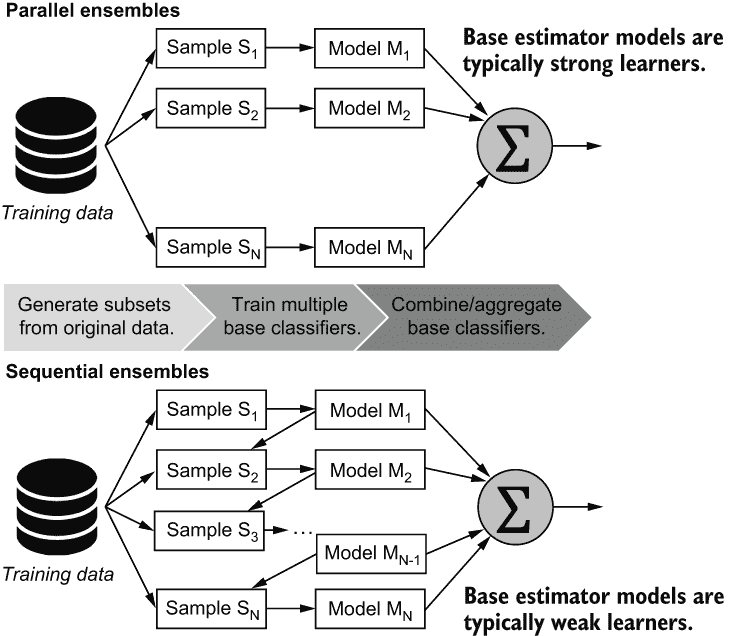

图 4.1 并行和顺序集成的区别：（1）并行集成中的基估计器是相互独立训练的，而在顺序集成中，它们被训练以改进前一个基估计器的预测；（2）顺序集成通常使用弱学习器作为基估计器。

直观地，我们可以将强学习器视为专业人士：高度自信且独立，对自己的答案确信无疑。另一方面，弱学习器则像业余爱好者：不太自信，对自己的答案不确定。我们如何能让一群不太自信的业余爱好者团结起来呢？当然是通过提升他们。在我们具体了解之前，先让我们来描述一下弱学习器的特点。

弱学习器

虽然学习器强度的精确定义根植于机器学习理论，但就我们的目的而言，强学习器是一个好的模型（或估计器）。相比之下，弱学习器是一个非常简单的模型，表现并不好。弱学习器（对于二元分类）的唯一要求是它必须比随机猜测表现得更好。换句话说，它的准确率只需要略高于 50%。决策树通常用作顺序集成的基估计器。提升算法通常使用决策桩，或深度为 1 的决策树（见图 4.2）。

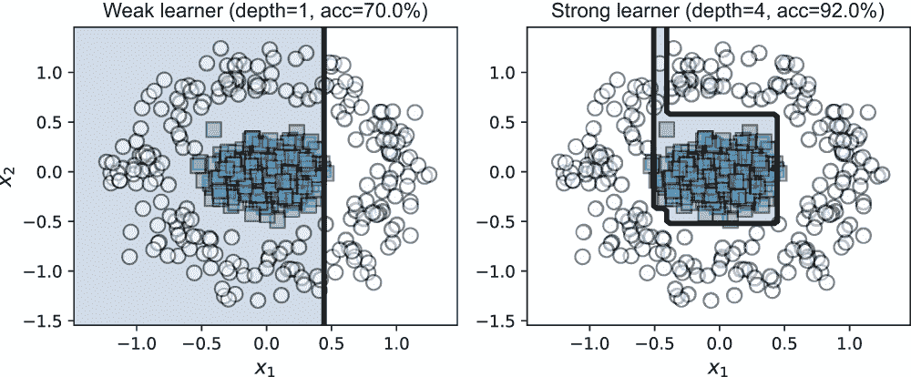

图 4.2 决策桩（深度为 1 的树，左侧）在顺序集成方法，如提升法中常用作弱学习器。随着树深度的增加，决策桩会成长为一个决策树，成为一个更强的分类器，其性能也会提高。然而，不能随意增加分类器的强度，因为它们在训练过程中会开始过拟合，这会降低它们部署时的预测性能。

顺序集成方法，如提升法，旨在将多个弱学习器组合成一个单一强学习器。这些方法实际上是将弱学习器“提升”为强学习器。

**提示**：弱学习器是一个简单且易于训练的分类器，但通常表现远不如强学习器（尽管比随机猜测要好）。顺序集成通常对底层基学习算法不敏感，这意味着你可以使用任何分类算法作为弱学习器。在实践中，弱学习器，如浅层决策树和浅层神经网络，很常见。

回想一下第一章和第二章中提到的兰迪·福雷斯特博士的实习生团队。在一个由知识渊博的医疗人员组成的并行团队中，每个实习生都可以被视为一个强大的学习者。为了理解顺序集成团队的哲学有多么不同，我们转向弗里德曼和沙皮雷，他们把提升描述为“一个由傻瓜组成的委员会，但不知何故能做出高度合理的决策。”²

这就像是兰迪·福雷斯特博士让他的实习生离开，决定采用众包医疗诊断的策略。虽然这当然是一种（且不可靠的）诊断患者的策略，但“从一群傻瓜那里汲取智慧”³在机器学习中表现得出奇地好。这是弱学习者顺序集成的潜在动机。

## 4.2 AdaBoost：自适应提升

在本节中，我们首先介绍一个重要的顺序集成：AdaBoost。AdaBoost 易于实现，使用起来计算效率高。只要 AdaBoost 中每个弱学习者的性能略好于随机猜测，最终模型就会收敛到一个强学习者。然而，除了应用之外，理解 AdaBoost 的工作原理也是理解我们将在下一章中探讨的两个最先进的顺序集成方法——梯度提升和牛顿提升——的关键。

提升的简要历史

提升的起源在于计算学习理论，当学习理论家莱斯利·瓦利亚恩特和迈克尔·基恩斯在 1988 年提出了以下问题：能否将弱学习者提升为强学习者？两年后，罗布·沙皮雷在他的现在已成为里程碑式的论文《弱学习能力的强度》中肯定地回答了这个问题。

最早的提升算法受到限制，因为弱学习者没有适应来纠正先前迭代中训练的弱学习者犯的错误。弗里德曼和

沙皮雷的 AdaBoost，或称*自适应提升*算法，于 1994 年提出，最终解决了这些限制。他们的原始算法至今仍在使用，并在多个应用领域得到广泛应用，包括文本挖掘、计算机视觉和医学信息学。

### 4.2.1 直觉：使用加权示例进行学习

AdaBoost 是一种自适应算法：在每次迭代中，它训练一个新的基估计器来纠正前一个基估计器犯的错误。因此，它需要某种方式来确保基学习算法优先考虑被错误分类的训练示例。AdaBoost 通过维持*单个训练示例的权重*来实现这一点。直观地说，权重反映了训练示例的相对重要性。被错误分类的示例具有更高的权重，而正确分类的示例具有较低的权重。

当我们按顺序训练下一个基估计器时，权重将允许学习算法优先考虑（并希望修复）前一次迭代的错误。这是 AdaBoost 的自适应组件，最终导致一个强大的集成。

注意：所有机器学习框架都使用 *损失函数*（在某些情况下，也使用 *似然函数*）来描述性能，而训练本质上是根据损失函数找到最佳拟合模型的过程。损失函数可以平等地对待所有训练示例（通过将它们都赋予相同的权重）或关注一些特定的示例（通过将特定示例赋予更高的权重以反映其增加的优先级）。当实现使用训练示例权重的集成方法时，必须注意确保基学习算法实际上可以使用这些权重。大多数加权分类算法使用修改后的损失函数来优先考虑具有更高权重的示例的正确分类。

让我们可视化提升的前几次迭代。每次迭代执行相同的步骤：

1.  训练一个弱学习器（这里是一个决策树），以确保具有更高权重的训练示例被优先考虑。

1.  更新训练示例的权重，使得错误分类的示例被赋予更高的权重；错误越严重，权重越高。

初始时（迭代 *t* - 1），所有示例都使用 *相等权重* 初始化。第 1 次迭代中训练的决策树（如图 4.3 所示）是一个简单、轴平行的分类器，错误率为 15%。被错误分类的点比正确分类的点画得更大。

下一个要训练的决策树（在第 2 次迭代中，如图 4.4 所示）必须正确分类前一个决策树（第 1 次迭代中）错误分类的示例。因此，错误被赋予更高的权重，这使得决策树算法能够在学习过程中优先考虑它们。

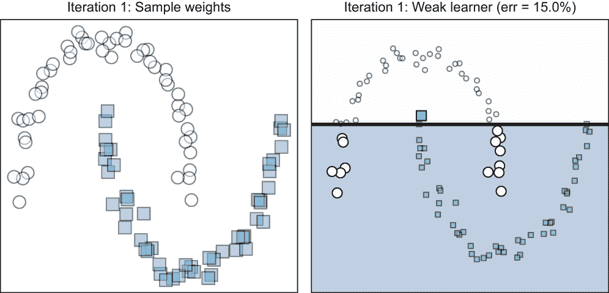

图 4.3 初始时（第 1 次迭代），所有训练示例都赋予相等的权重（因此左图中以相同大小绘制）。在此数据集上学习到的决策树显示在右侧。与错误分类的示例相比，正确分类的示例用较小的标记绘制，而错误分类的示例用较大的标记绘制。

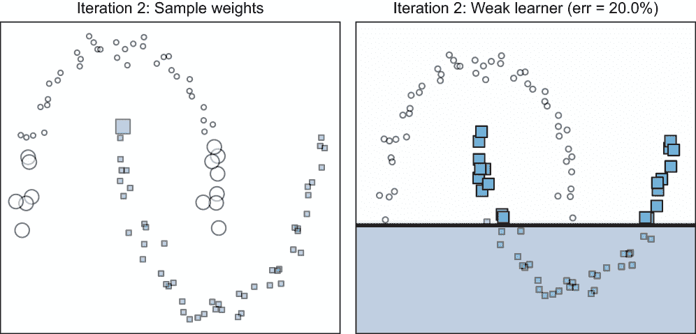

图 4.4 在第 2 次迭代的开始时，第 1 次迭代中错误分类的训练示例（如图 4.3 右侧所示，用较大的标记表示）被赋予更高的权重。这在上图中可视化，其中每个示例的大小与其权重成比例。由于加权示例具有更高的优先级，序列中的新决策树（右侧）确保这些现在被正确分类。观察右侧的新决策树正确分类了左侧大多数错误分类的示例（用较大的标记表示）。

第二次迭代中训练的决策树确实正确分类了具有更高权重的训练示例，尽管它也有自己的错误。在迭代 3 中，可以训练第三个决策树，旨在纠正这些错误（见图 4.5）。

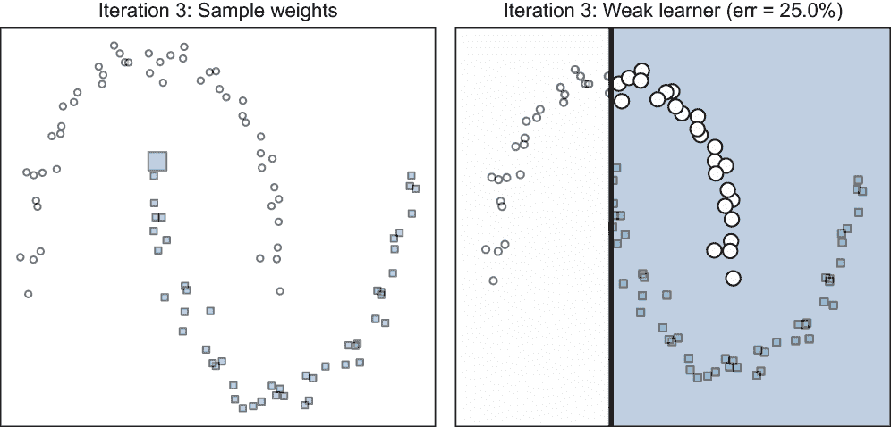

图 4.5 在迭代 3 的开始时，迭代 2 中错误分类的训练示例（在图 4.4 的右侧以较大的标记显示）被分配了更高的权重。请注意，错误分类的点也有不同的权重。在这个迭代中训练的新决策树（右侧）确保这些现在被正确分类。

经过三次迭代后，我们可以将三个单独的弱学习器组合成一个强学习器，如图 4.6 所示。以下是一些需要注意的有用点：

+   观察在三个迭代中训练的弱估计器。它们彼此不同，并以多种不同的方式对问题进行分类。回想一下，在每次迭代中，基估计器都在相同的训练集上训练，但具有*不同的权重*。重新加权允许 AdaBoost 在每次迭代中训练不同的基估计器，通常与之前迭代中训练的估计器不同。因此，*自适应重新加权*或自适应更新，促进了集成多样性。

+   结果的弱（和线性）决策树集成更强（和非线性）。更确切地说，每个基估计器的训练错误率分别为 15%、20%和 25%，而它们的集成错误率为 9%。

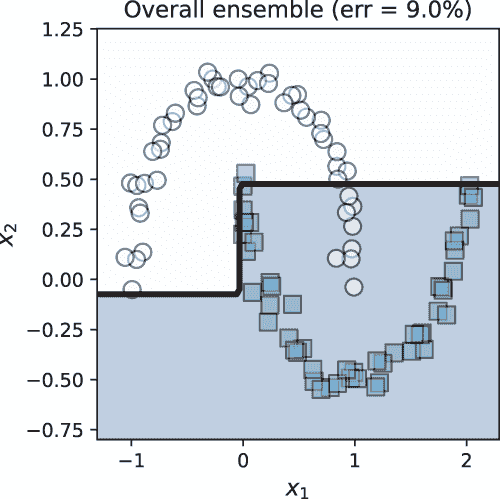

图 4.6 前几个图中显示的三个弱决策树可以通过提升变成一个更强的集成。

如前所述，这个提升算法得名于提升弱学习者的性能，使其成为一个更强大、更复杂的集成，即强学习器。

### 4.2.2 实现 AdaBoost

首先，我们将实现自己的 AdaBoost 版本。在这个过程中，我们将牢记 AdaBoost 的以下关键特性：

+   AdaBoost 使用决策树作为基估计器，即使有大量特征，也可以非常快速地进行训练。决策树是*弱学习器*。这与使用更深决策树的 bagging 方法形成对比，后者是*强学习器*。

+   AdaBoost 跟踪*各个训练示例的权重*。这允许 AdaBoost 通过*重新加权*训练示例来确保集成多样性。我们在前一小节的可视化中看到了重新加权如何帮助 AdaBoost 学习不同的基估计器。这与使用训练示例重采样的 bagging 和随机森林形成对比。

+   AdaBoost 跟踪*各个基估计器的权重*。这类似于组合方法，它们对每个分类器进行不同的加权。

AdaBoost 的实现相当直接。第*t*次迭代的算法基本框架可以描述为以下步骤：

1.  使用加权训练示例(*x*[i],*y*[i],*D*[i])训练弱学习器*h*t。

1.  计算弱学习器*h*t 的训练错误*ϵ*[t]。

1.  计算依赖于*ϵ*[t]的弱学习器*α*[t]的权重。

1.  按照以下方式更新训练示例的权重：

    +   通过*D*[i]*e*^(α[t])增加被错误分类的示例的权重。

    +   通过*D*[i]/*e*^(α[i])减少被错误分类的示例的权重。

在*T*次迭代结束时，我们有了弱学习器*h*[t]以及相应的弱学习器权重*α*[t]。经过*t*次迭代的整体分类器只是一个加权集成：

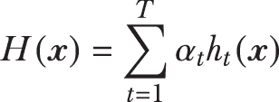

这种形式是**基础估计器的加权线性组合**，类似于我们之前看到的并行集成中使用的线性组合，例如 bagging、组合方法或 stacking。与这些方法的主要区别在于，AdaBoost 使用的基础估计器是弱学习器。现在，我们需要回答两个关键问题：

+   我们如何更新训练示例的权重，*D*[i]？

+   我们如何计算每个基础估计器的权重，*α*[t]？

AdaBoost 使用与我们在第三章中看到的组合方法相同的直觉。回想一下，权重是计算来反映基础估计器*性能*的：表现更好的基础估计器（例如，准确率）应该比表现较差的估计器具有更高的权重。

弱学习器权重

在每个迭代*t*中，我们训练一个基础估计器*h*t。每个基础估计器（也是弱学习器）都有一个相应的权重*α*[t]，它取决于其训练错误。*h*t 的训练错误*ϵ*[t]是其性能的一个简单直接的度量。AdaBoost 按照以下方式计算估计器*h*t 的权重：

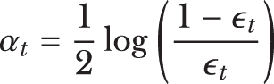

为什么是这个特定的公式？让我们通过可视化*α*[t]如何随着错误*ϵ*[t]的增加而变化来观察*α*[t]与错误*ϵ*[t]之间的关系（图 4.7）。回想一下我们的直觉：表现更好的基础估计器（那些错误率更低的）必须被赋予更高的权重，以便它们对集成预测的贡献更高。

相反，最弱的学习器表现最差。有时，它们几乎与随机猜测一样好。换句话说，在二元分类问题中，最弱的学习器仅略好于掷硬币来决定答案。

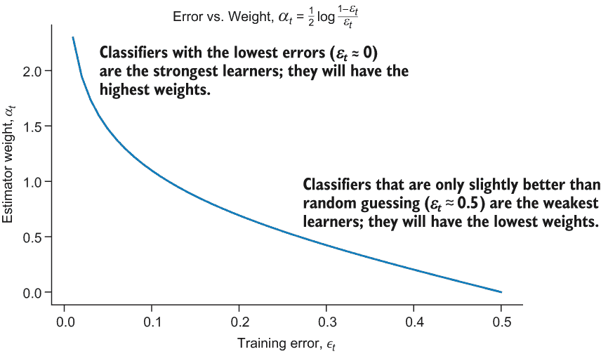

图 4.7 AdaBoost 将更强的学习器（具有更低的训练错误）赋予更高的权重，并将较弱的学习器（具有更高的训练错误）赋予较低的权重。

具体来说，最弱的学习器的错误率仅略好于 0.5（或 50%）。这些最弱的学习器具有最低的权重，*α*[t] ≈ 0\. 最强的学习器达到的训练错误接近 0.0（或 0%）。这些学习器具有最高的权重。

训练示例权重

基础估计器权重（*α*[t]）也可以用来更新每个训练样本的权重。AdaBoost 按照以下方式更新样本权重：

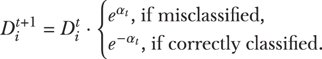

当样本被正确分类时，新的权重会减少*e*^(α[t]) : *D*[i]^(*t*+1) = *D*[i]^(*t*)/*e*^(α[t])。更强的基估计器会减少更多的权重，因为它们对自己的正确分类更有信心。同样，当样本被错误分类时，新的权重会增加*e*^(α[t]) : *D*[i]^(*t*+1) = *D*[i]^(*t*) ⋅ *e*^(α[t])。

以这种方式，AdaBoost 确保错误分类的训练样本获得更高的权重，这将使它们在下一个迭代*t*+1 中更好地被分类。例如，假设我们有两个训练样本*x*[1]和*x*[2]，它们的权重都是*D^t*[1]= *D^t*[2] = 0.75。当前的弱学习器*h*[t]的权重是*α*[t] = 1.5。假设*x*[1]被*h*[t]正确分类；因此，其权重应减少一个因子*e*^(*α*[t])。下一个迭代*t*+1 的新权重将是*D*[i]^(*t*+1) = *D*[1]/*e*^(*α*[t]) = 0.75/*e*^(1.5) - 0.17。

相反，如果*x*[1]被*h*[t]错误分类，其权重应增加一个因子*e*^(*α*[t])。新的权重将是 *D*[i]^(*t*+1) = *D*[2] ⋅ *e*^(*α*[t]) = 0.75 ⋅ *e*^(1.5) = 3.36。这如图 4.8 所示。

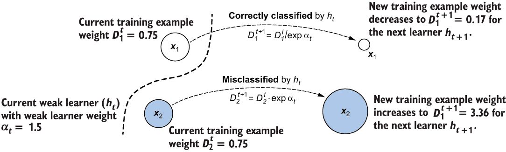

图 4.8 在迭代*t*中，两个训练样本*x*[1]和*x*[2]具有相同的权重。*x*[1]被正确分类，而*x*[2]被当前的基础估计器*h*[t]错误分类。由于下一个迭代的目标是学习一个分类器*h*[t+1]，它可以纠正*h*[t]的错误，AdaBoost 增加了错误分类样本*x*[2]的权重，同时减少了正确分类样本*x*[1]的权重。这允许基础学习算法在迭代*t*+1 中优先考虑*x*[2]。

AdaBoost 训练

AdaBoost 算法易于实现。以下列表展示了提升的训练过程。

列表 4.1 使用 AdaBoost 训练弱学习器集成

```
from sklearn.tree import DecisionTreeClassifier
from sklearn.metrics import accuracy_score
import numpy as np

def fit_boosting(X, y, n_estimators=10):
    n_samples, n_features = X.shape
    D = np.ones((n_samples, ))                         ❶
    estimators = []                                    ❷

    for t in range(n_estimators):
        D = D / np.sum(D)                              ❸

        h = DecisionTreeClassifier(max_depth=1)  
        h.fit(X, y, sample_weight=D)                   ❹

        ypred = h.predict(X)   
        e = 1 - accuracy_score(y, ypred,               ❺
                               sample_weight=D)  
        a = 0.5 * np.log((1 - e) / e)               

        m = (y == ypred) * 1 + (y != ypred) * -1       ❻
        D *= np.exp(-a * m)

        estimators.append((a, h))                      ❼

    return estimators
```

❶ 非负权重，初始化为 1

❷ 初始化一个空的集成

❸ 将权重归一化，使它们的总和为 1

❹ 使用加权样本训练弱学习器(*h*[t])

❺ 计算训练误差(*ε*[t])和弱学习器的权重(*α*[t])

❻ 更新样本权重：错误分类的样本增加，正确分类的样本减少

❷ 保存弱学习器和其权重

一旦我们有一个训练好的集成，我们就可以用它来进行预测。列表 4.2 展示了如何使用提升集成来预测新的测试样本。观察发现，这与使用其他加权集成方法（如堆叠）进行预测是相同的。

列表 4.2 使用 AdaBoost 进行预测

```
def predict_boosting(X, estimators):
    pred = np.zeros((X.shape[0], ))        ❶

    for a, h in estimators:
        pred += a * h.predict(X)           ❷

    y = np.sign(pred)                      ❸

    return y
```

❶ 将所有预测初始化为 0

❷ 对每个样本进行加权预测

❸ 将加权预测转换为-1/1 标签

我们可以使用这些函数来拟合和预测数据集：

```
from sklearn.datasets import make_moons
from sklearn.model_selection import train_test_split

X, y = make_moons(                                                         ❶
           n_samples=200, noise=0.1, random_state=13)
y  = (2 * y) - 1                                                           ❷
Xtrn, Xtst, ytrn, ytst = train_test_split(X, y,                            ❸
                                          test_size=0.25, random_state=13)

estimators = fit_boosting(Xtrn, ytrn)                                      ❹
ypred = predict_boosting(Xtst, estimators)                                 ❺
```

❶ 生成一个包含 200 个点的合成分类数据集

❷ 将 0/1 标签转换为-1/1 标签

❸ 将数据集分为训练集和测试集

❹ 使用列表 4.1 训练 AdaBoost 模型

❺ 使用列表 4.2 中的 AdaBoost 进行预测

我们做得怎么样？我们可以计算我们模型的总体测试集准确率：

```
from sklearn.metrics import accuracy_score
tst_err = 1 - accuracy_score(ytst, ypred)
print(tst_err)
```

这会产生以下输出：

```
0.020000000000000018
```

我们使用 10 个弱树桩通过实现学习得到的集成测试错误率为 2%。

二元分类的训练标签：0/1 还是-1/1？

我们实现的提升算法要求负样本和正样本分别标记为-1 和 1。函数 make_moons 创建带有负样本标记为 0 和正样本标记为 1 的标签*y*。我们手动将它们从 0 和 1 转换为-1 和 1，即*y*[converted] = 2 ⋅ *y*[original] - 1。

抽象地说，二元分类任务中每个类的标签可以是任何我们喜欢的，只要标签有助于清楚地区分两个类别。从数学上讲，这个选择取决于损失函数。例如，如果使用交叉熵损失，则类别需要是 0 和 1，以便损失函数能够正确工作。相比之下，如果使用 SVM 中的 hinge 损失，则类别需要是-1 和 1。

AdaBoost 使用指数损失（更多内容请见第 4.5 节），并且要求类标签为-1 和 1，以便后续训练在数学上合理且收敛。

幸运的是，当我们使用 scikit-learn 等大多数机器学习包时，我们不必担心这个问题，因为它们会自动预处理各种训练标签，以满足底层训练算法的需求。

我们在图 4.9 中可视化 AdaBoost 的性能，随着基学习器的数量增加。随着我们添加越来越多的弱学习器，整体集成不断增强，成为一个更强大、更复杂、非线性更强的分类器。

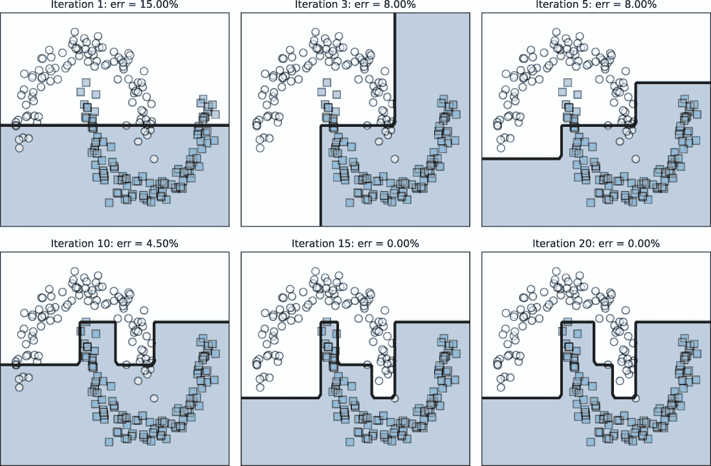

图 4.9 随着弱学习器的数量增加，整体分类器被提升为强模型，该模型变得越来越非线性，能够拟合（并可能过度拟合）训练数据。

虽然 AdaBoost 通常对过拟合有更强的抵抗力，但像许多其他分类器一样，过度训练提升算法也可能导致过拟合，尤其是在存在噪声的情况下。我们将在第 4.3 节中看到如何处理这种情况。

### 4.2.3 使用 scikit-learn 的 AdaBoost

现在我们已经理解了 AdaBoost 分类算法的直觉，我们可以看看如何使用 scikit-learn 的 AdaBoostClassifier 包。scikit-learn 的实现提供了额外的功能，包括对多类分类的支持，以及决策树以外的其他基学习算法。

AdaBoostClassifier 包针对二分类和多分类任务接受以下三个重要参数：

+   base_estimator—AdaBoost 用于训练弱学习者的基础学习算法。在我们的实现中，我们使用了决策树桩。然而，也可以使用其他弱学习者，例如浅层决策树、浅层人工神经网络和基于随机梯度下降的分类器。

+   n_estimators—AdaBoost 将按顺序训练的弱学习者的数量。

+   learning_rate—一个额外的参数，它逐步减少每个连续训练的弱学习者在集成中的贡献。

    +   学习率（learning_rate）的较小值会使弱学习者的权重 *α*[t] 较小。较小的 *α*[t] 意味着示例权重 *D*[i] 的变化减小，并且弱学习者更加单一。学习率的较大值则产生相反的效果，并增加弱学习者的多样性。

学习率参数与 n_estimators（本质上，每次迭代训练一个估计器的迭代次数）之间存在自然的相互作用和权衡。增加 n_estimators（即迭代次数）可能导致训练示例权重 *D*[i] 持续增长。可以通过学习率来控制示例权重的无约束增长。

以下示例展示了 AdaBoostClassifier 在二元分类数据集上的实际应用。首先，我们加载乳腺癌数据并将其分为训练集和测试集：

```
from sklearn.datasets import load_breast_cancer
from sklearn.model_selection import train_test_split
X, y = load_breast_cancer(return_X_y=True)
Xtrn, Xtst, ytrn, ytst = train_test_split(X, y, 
                                          test_size=0.25, random_state=13)
```

我们将使用深度为 2 的浅层决策树作为训练的基础估计器：

```
from sklearn.ensemble import AdaBoostClassifier
shallow_tree = DecisionTreeClassifier(max_depth=2)
ensemble = AdaBoostClassifier(base_estimator=shallow_tree, 
                              n_estimators=20, learning_rate=0.75)
ensemble.fit(Xtrn, ytrn)
```

训练后，我们可以使用增强集成在测试集上进行预测：

```
ypred = ensemble.predict(Xtst)
err = 1 - accuracy_score(ytst, ypred)
print(err)
```

AdaBoost 在乳腺癌数据集上实现了 5.59% 的测试错误率：

```
0.05594405594405594
```

多分类

scikit-learn 的 AdaBoostClassifier 也支持多分类，其中数据属于两个以上的类别。这是因为 scikit-learn 包含了多分类 AdaBoost 的实现，称为使用多类指数损失的阶跃式添加建模（Stagewise Additive Modeling using Multiclass Exponential loss，或 SAMME）。SAMME 是 Freund 和 Schapire 的自适应提升算法（在第 4.2.2 节中实现）从二类推广到多类的泛化。除了 SAMME 之外，AdaBoostClassifier 还提供了一个名为 SAMME.R 的变体。这两种算法之间的关键区别在于，SAMME.R 可以处理来自基础估计器算法的实值预测（即类概率），而原始的 SAMME 处理离散预测（即类标签）。

这听起来熟悉吗？回想第三章，存在两种类型的组合函数：那些直接使用预测类标签的，以及那些可以使用预测类概率的。这正是 SAMME 和 SAMME.R 之间的区别。

以下示例展示了 AdaBoostClassifier 在名为 iris 的多类分类数据集上的实际应用，其中分类任务是区分三种鸢尾花物种，基于它们花瓣和萼片的尺寸。首先，我们加载鸢尾花数据，并将数据分为训练集和测试集：

```
from sklearn.datasets import load_iris
from sklearn.utils.multiclass import unique_labels
X, y = load_iris(return_X_y=True)
Xtrn, Xtst, ytrn, ytst = train_test_split(X, y, 
                                          test_size=0.25, random_state=13)
```

我们检查这个数据集有三个不同的标签，具有唯一的 _labels(y)，这产生数组([0, 1, 2])，这意味着这是一个三分类问题。与之前一样，我们可以在这个多类数据集上训练和评估 AdaBoost：

```
ensemble = AdaBoostClassifier(base_estimator=shallow_tree,
                              n_estimators=20,              
                              learning_rate=0.75, algorithm='SAMME.R')
ensemble.fit(Xtrn, ytrn)
ypred = ensemble.predict(Xtst)
err = 1 - accuracy_score(ytst, ypred)
print(err)
```

AdaBoost 在三个类别的鸢尾花数据集上实现了 7.89%的测试错误率：

```
0.07894736842105265
```

## 4.3 AdaBoost 的实际应用

在本章中，我们将探讨在使用 AdaBoost 时可能会遇到的一些实际挑战，以及确保我们训练鲁棒模型的策略。AdaBoost 的适应性程序使其容易受到*异常值*的影响，即极其嘈杂的数据点。在本节中，我们将看到这个问题的例子，以及我们可以采取哪些措施来减轻它。

AdaBoost 的核心是其适应先前弱学习器所犯错误的能力。然而，当存在异常值时，这种适应性也可能是一个缺点。

异常值

异常值是极其嘈杂的数据点，通常是测量或输入错误的结果，在真实数据中普遍存在，程度不同。标准预处理技术，如归一化，通常只是重新缩放数据，并不能去除异常值，这允许它们继续影响算法性能。这可以通过预处理数据来专门检测和去除异常值来解决。

对于某些任务（例如，检测网络网络攻击），我们需要检测和分类（网络攻击）的东西本身就是一个异常值，也称为异常，并且极其罕见。在这种情况下，我们学习任务的目标本身将是异常检测。

AdaBoost 特别容易受到异常值的影响。异常值通常会被弱学习器错误分类。回想一下，AdaBoost 会增加错误分类示例的权重，因此分配给异常值的权重会持续增加。当训练下一个弱学习器时，它会执行以下操作之一：

+   继续错误地分类异常值，在这种情况下，AdaBoost 将进一步增加其权重，这反过来又导致后续的弱学习器错误分类、失败并继续增加其权重。

+   正确地分类异常值，在这种情况下，AdaBoost 刚刚过度拟合了数据，如图 4.10 所示。

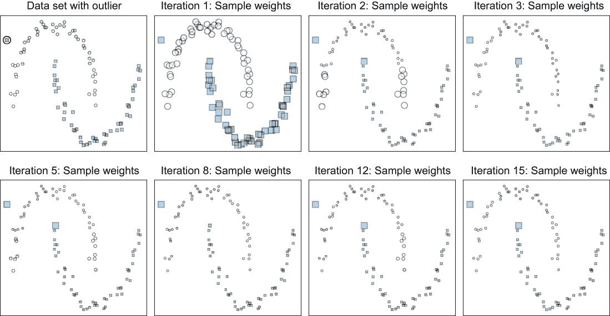

图 4.10 考虑一个包含异常值（圆圈标注，左上角）的数据集。在迭代 1 中，它与所有示例具有相同的权重。随着 AdaBoost 继续依次训练新的弱学习器，其他数据点的权重最终会随着它们被正确分类而降低。异常值的权重持续增加，最终导致过拟合。

异常值迫使 AdaBoost 在训练示例上投入不成比例的努力。换句话说，异常值往往会混淆 AdaBoost，使其变得不那么鲁棒。

### 4.3.1 学习率

现在，让我们看看如何使用 AdaBoost 训练鲁棒模型。我们可以控制的第一方面是*学习率*，它调整每个估计器对集成模型的贡献。例如，学习率为 0.75 表示 AdaBoost 将每个基础估计器的整体贡献减少到 0.75 倍。当存在异常值时，高学习率会导致它们的影响成比例地迅速增长，这绝对会损害你模型的性能。因此，减轻异常值影响的一种方法就是降低学习率。

降低学习率会缩小每个基础估计器的贡献，因此控制学习率也被称为*收缩*，这是一种模型正则化的形式，用于最小化过拟合。具体来说，在迭代*t*时，集成模型*F*[t]更新为*F*[t+1]。

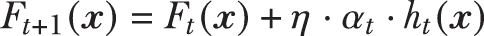

在这里，*α*[t]是 AdaBoost 计算出的弱学习器*h*[t]的权重，*η*是学习率。学习率是一个用户定义的学习参数，其范围在 0 < *η* ≤ 1 之间。

较慢的学习率意味着构建一个有效的集成模型通常需要更多的迭代（因此，更多的基础估计器）。更多的迭代也意味着更多的计算努力和更长的训练时间。然而，较慢的学习率可能会产生一个鲁棒性更好的模型，并且可能值得付出努力。

选择最佳学习率的一个有效方法是使用验证集或交叉验证（CV）。列表 4.3 使用 10 折交叉验证来识别范围[0.1, 0.2, ..., 1.0]内的最佳学习率。我们可以观察到收缩在乳腺癌数据上的有效性：

```
from sklearn.datasets import load_breast_cancer
X, y = load_breast_cancer(return_X_y=True)
```

我们使用分层 k 折交叉验证，就像我们在堆叠中做的那样。回想一下，“分层”意味着折叠是以一种方式创建的，使得类分布在整个折叠中保持不变。这也帮助处理不平衡的数据集，因为分层确保了所有类别的数据都得到代表。

列表 4.3 交叉验证选择最佳学习率

```
from sklearn.tree import DecisionTreeClassifier
from sklearn.ensemble import AdaBoostClassifier
from sklearn.metrics import accuracy_score
from sklearn.model_selection import StratifiedKFold
import numpy as np

n_learning_rate_steps, n_folds = 10, 10
learning_rates = np.linspace(0.1, 1.0,                                  ❶
                             num=n_learning_rate_steps) 
splitter = StratifiedKFold(n_splits=n_folds, shuffle=True)
trn_err = np.zeros((n_learning_rate_steps, n_folds))
val_err = np.zeros((n_learning_rate_steps, n_folds))
stump = DecisionTreeClassifier(max_depth=1)                             ❷

for i, rate in enumerate(learning_rates):                               ❸
    for j, (trn, val) \                                                 ❹
        in enumerate(splitter.split(X, y)):    

        model = AdaBoostClassifier(algorithm='SAMME', base_estimator=stump,
                                   n_estimators=10, learning_rate=rate)

        model.fit(X[trn, :], y[trn])                                    ❺

        trn_err[i, j] = 1 - accuracy_score(y[trn],                      ❻
                                           model.predict(X[trn, :]))    ❻
        val_err[i, j] = 1 - accuracy_score(y[val],                      ❻
                                           model.predict(X[val, :]))    ❻

trn_err = np.mean(trn_err, axis=1)                                      ❼
val_err = np.mean(val_err, axis=1)                                      ❼
```

❶ 设置分层 10 折交叉验证并初始化搜索空间

❷ 使用决策树桩作为弱学习器

❸ 对于所有学习率的选取

❹ 对于训练和验证集

❺ 在这个折叠中拟合训练数据模型

❻ 计算这个折叠的训练和验证误差

❼ 在折叠间平均训练和验证误差

我们在图 4.11 中绘制了此参数搜索的结果，该图显示了随着学习率的增加，训练和验证误差如何变化。基础学习器的数量固定为 10。虽然平均训练误差随着学习率的增加而继续下降，但最佳平均验证误差是在学习率率为 _rate=0.8 时达到的。

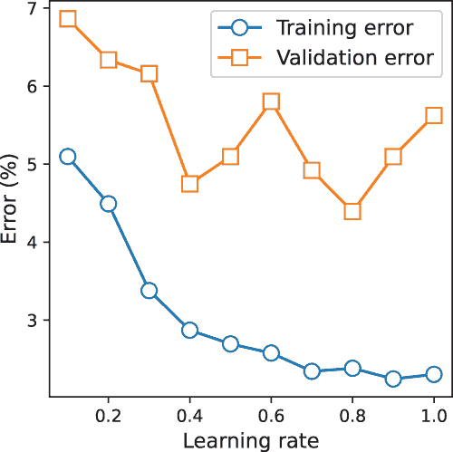

图 4.11：不同学习率下的平均训练和验证误差。学习率=0.6 的验证误差最低，实际上低于默认的学习率=1.0。

### 4.3.2 提前停止和剪枝

除了学习率之外，对于实际的提升来说，另一个重要的考虑因素是基学习器的数量，即 n_estimators。尝试构建一个包含大量弱学习器的集成可能很有吸引力，但这并不总是转化为最佳泛化性能。实际上，我们通常可以用比我们想象的更少的基估计器实现大致相同的性能。确定构建有效集成所需的最少基估计器数量被称为*提前停止*。保持较少的基估计器可以帮助控制过拟合。此外，提前停止还可以减少训练时间，因为我们最终需要训练的基估计器更少。列表 4.4 使用与列表 4.3 中相同的 CV 过程来识别最佳估计器数量。这里的学习率固定为 1.0。

列表 4.4：交叉验证以选择最佳弱学习器数量

```
n_estimator_steps, n_folds = 5, 10

number_of_stumps = np.arange(5, 50, n_estimator_steps)           ❶
splitter = StratifiedKFold(n_splits=n_folds, shuffle=True)

trn_err = np.zeros((len(number_of_stumps), n_folds))
val_err = np.zeros((len(number_of_stumps), n_folds))

stump = DecisionTreeClassifier(max_depth=1)                      ❷
for i, n_stumps in enumerate(number_of_stumps):                  ❸
    for j, (trn, val) \                                          ❹
        in enumerate(splitter.split(X, y)): 

        model = AdaBoostClassifier(algorithm='SAMME', base_estimator=stump,
                                   n_estimators=n_stumps, learning_rate=1.0)
        model.fit(X[trn, :], y[trn])                             ❺

        trn_err[i, j] = \                                        ❻
            1 - accuracy_score(
                    y[trn], model.predict(X[trn, :]))

        val_err[i, j] = \                                        ❻
            1 - accuracy_score(
                    y[val], model.predict(X[val, :]))

trn_err = np.mean(trn_err, axis=1)
val_err = np.mean(val_err, axis=1)                               ❼
```

❶ 设置分层 10 折交叉验证并初始化搜索空间

❷ 使用决策树桩作为弱学习器

❸ 对于所有估计器大小

❹ 对于训练和验证集

❺ 将模型拟合到本折叠的训练数据

❻ 计算此折叠的训练和验证误差

❼ 对各折叠的平均误差

搜索最佳估计器数量的结果如图 4.12 所示。平均验证误差表明，使用多达 30 个决策树就足以在这组数据集上实现良好的预测性能。在实践中，一旦验证集的性能达到可接受的水平，我们就可以提前停止训练。

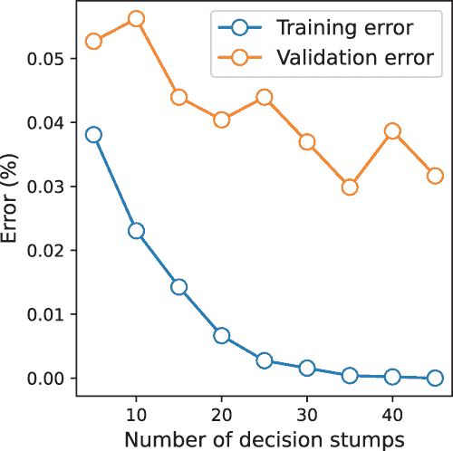

图 4.12：不同数量基估计器（在这种情况下为决策树桩）的平均训练和验证误差。n_estimators=20 的验证误差最低。

提前停止也称为*预剪枝*，因为我们在大规模拟合基估计器之前终止训练，这通常会导致更快的训练时间。如果我们不关心训练时间，但想更谨慎地选择基估计器的数量，我们也可以考虑*后剪枝*。后剪枝意味着我们训练一个非常大的集成，然后移除最差的基估计器。

对于 AdaBoost，后剪枝会移除所有权重（*α*[t]）低于某个阈值的弱学习器。我们可以在训练了 AdaBoostClassifier 之后，通过 model.estimators_ 和 model.estimator_weights_ 字段访问单个弱学习器及其权重。为了剪枝最不显著的弱学习器的贡献（那些权重低于某个阈值的），我们可以简单地将它们的权重设置为 0：

```
model.estimator_weights_[model.estimator_weights_ <= threshold] = 0.0
```

如前所述，交叉验证可以用来选择一个好的阈值。始终记住，AdaBoost 的学习率（learning_rate）和 n_estimators 参数之间通常存在权衡。较低的学习率通常需要更多的迭代（因此，更多的弱学习器），而较高的学习率则需要较少的迭代（和较少的弱学习器）。

为了最有效地进行，应使用网格搜索与交叉验证相结合来识别这些参数的最佳值。案例研究中展示了这一示例，我们将在下一节中讨论。

异常值检测和移除

虽然这里描述的程序在处理噪声数据集时通常有效，但含有大量噪声（即异常值）的训练示例仍然可能引起重大问题。在这种情况下，通常建议预处理数据集以完全删除这些异常值。

## 4.4 案例研究：手写数字分类

机器学习最早的几个应用之一是手写数字分类。实际上，自 1990 年代初以来，这项任务已经被广泛研究，我们可能会将其视为对象识别的“Hello World！”

这个任务起源于美国邮政服务尝试自动化数字识别，以通过快速识别 ZIP 码来加速邮件处理。从那时起，已经创建了几个不同的手写数据集，并被广泛用于基准测试和评估各种机器学习算法。

在这个案例研究中，我们将使用 scikit-learn 的数字数据集来说明 AdaBoost 的有效性。该数据集包含来自 1,797 张扫描的手写数字图像。

0 到 9。每个数字都与一个唯一的标签相关联，这使得这是一个 10 类分类问题。每个类别大约有 180 个数字。我们可以直接从 scikit-learn 加载数据集：

```
from sklearn.datasets import load_digits
X, y = load_digits(return_X_y=True)
```

这些数字本身被表示为 16 x 16 的归一化灰度位图（见图 4.13），当展开时，每个手写数字将形成一个 64 维（64D）向量。训练集包含 1,797 个示例 × 64 个特征。

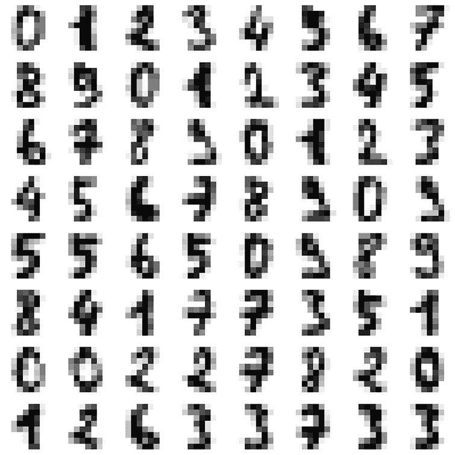

图 4.13 本案例研究中使用的数字数据集快照

### 4.4.1 使用 t-SNE 进行降维

虽然 AdaBoost 可以有效地处理数字数据集的维度（64 个特征），但我们将（相当激进地）将其维度降低到 2。这样做的主要原因是为了能够可视化数据以及 AdaBoost 学习到的模型。

我们将使用一种称为 t 分布随机邻域嵌入（t-SNE）的非线性降维技术。t-SNE 是数字数据集的一种非常有效的预处理技术，并在二维空间中提取嵌入。

t-SNE

随机邻域嵌入，正如其名所示，使用邻域信息来构建低维嵌入。具体来说，它利用两个示例之间的相似性：*x*[i]和*x*[j]。在我们的案例中，*x*[i]和*x*[j]是从数据集中提取的两个示例数字，它们是 64D。两个数字之间的相似度可以测量为

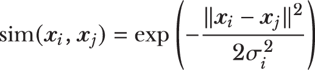

其中||*x*[i] - *x*[j]||²是*x*[i]和*x*[j]之间的平方距离，*σ*²[i]是一个相似度参数。你可能在其他机器学习的领域中见过这种相似度函数的形式，特别是在支持向量机的上下文中，它被称为径向基函数（RBF）核或高斯核。

*x*[i]和*x*[j]之间的相似度可以转换为*x*[j]是*x*[i]邻居的概率*p*[j|i]。这个概率只是一个归一化的相似度度量，其中我们通过数据集*x*[k]中所有点与*x*[i]的相似度之和进行归一化：

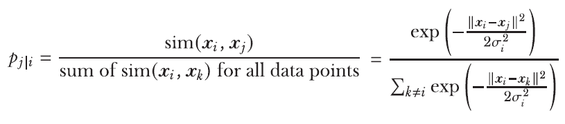

假设这两个数字的 2D 嵌入由*z*[i]和*z*[j]给出。那么，自然地预期两个相似的数字*x*[i]和*x*[j]在嵌入到*z*[i]和*z*[j]后仍然会是邻居。测量*z*[j]是*z*[i]邻居的概率的方法是类似的：

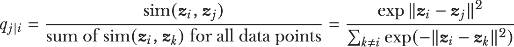

在这里，我们假设 2D（z 空间）指数分布的方差是 1/2。然后，我们可以通过确保 2D 嵌入空间（z 空间）中的概率*q*[j|i]与 64D 原始数字空间（x 空间）中的*p*[j|i]良好对齐来识别所有点的嵌入。从数学上讲，这是通过最小化分布*q*[j|i]和*p*[j|i]之间的 KL 散度（一个差异或距离的统计度量）来实现的。使用 scikit-learn，嵌入可以非常容易地计算：

```
from sklearn.manifold import TSNE
Xemb = TSNE(n_components=2, init='pca').fit_transform(X)
```

图 4.14 显示了当数据集嵌入到 2D 空间时的样子。

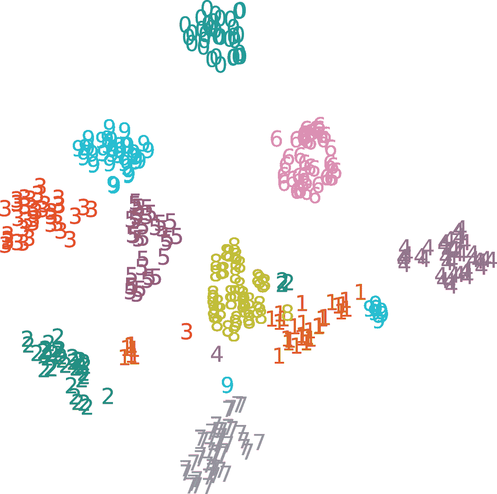

图 4.14 t-SNE 生成的数字数据集的 2D 嵌入可视化，它能够嵌入并分离数字，有效地将它们聚类

训练-测试分割

和以往一样，保留一部分训练数据用于评估，并量化我们的模型在未来的数据上的预测性能是很重要的。我们将低维数据 Xemb 和标签分为训练集和测试集：

```
from sklearn.model_selection import train_test_split
Xtrn, Xtst, ytrn, ytst = train_test_split(Xemb, y, 
                                          test_size=0.2, 
                                          stratify=y, 
                                          random_state=13)
```

观察到使用 stratify=y 确保训练集和测试集中不同数字的比例相同。

### 4.4.2 提升法

我们现在将为这个数字分类任务训练一个 AdaBoost 模型。回想一下我们之前的讨论，AdaBoost 要求我们首先选择基估计器的类型。我们继续使用决策树桩，如下所示：

```
from sklearn.tree import DecisionTreeClassifier
from sklearn.ensemble import AdaBoostClassifier

stump = DecisionTreeClassifier(max_depth=2)
ensemble = AdaBoostClassifier(algorithm='SAMME', base_estimator=stump)
```

在上一节中，我们看到了如何使用交叉验证（CV）来分别选择学习率（learning_rate）和 n_estimators 的最佳值。在实践中，我们必须确定学习率和 n_estimators 的*最佳组合*。为此，我们将结合使用 k 折交叉验证和网格搜索。

基本思路是考虑学习率和 n_estimators 的不同组合，并通过交叉验证（CV）评估它们的性能。首先，我们选择想要探索的各种参数值：

```
parameters_to_search = {'n_estimators': [200, 300, 400, 500],
                        'learning_rate': [0.6, 0.8, 1.0]}
```

接下来，我们创建一个评分函数来评估每个参数组合的性能。对于这个任务，我们使用*平衡准确率*，这本质上就是每个类别的准确率加权。这个评分标准对于像这样的多类分类问题以及不平衡数据集都是有效的：

```
from sklearn.metrics import balanced_accuracy_score, make_scorer
scorer = make_scorer(balanced_accuracy_score, greater_is_better=True)
```

现在，我们设置并运行网格搜索，使用 GridSearchCV 类来识别最佳参数组合。GridSearchCV 的几个参数对我们来说很有兴趣。参数 cv=5 指定了 5 折交叉验证，n_jobs=-1 指定了该作业应使用所有可用的核心进行并行处理（见第二章）：

```
from sklearn.model_selection import GridSearchCV
search = GridSearchCV(ensemble, param_grid=parameters_to_search,
                      scoring=scorer, cv=5, n_jobs=-1, refit=True)
search.fit(Xtrn, ytrn)
```

GridSearchCV 的最后一个参数设置为 refit=True。这告诉 GridSearchCV 使用所有可用的训练数据，使用它已识别的最佳参数组合来训练一个最终模型。

TIP 对于许多数据集，使用 GridSearchCV 穷尽地探索和验证所有可能的超参数选择可能计算效率不高。对于这种情况，使用 RandomizedSearchCV 可能更有效，它只采样一个更小的超参数组合子集进行验证。

训练完成后，我们可以查看每个参数组合的分数，甚至提取最佳结果：

```
best_combo = search.cv_results_['params'][search.best_index_]
best_score = search.best_score_
print('The best parameter settings are {0}, with score = \
      {1}.'.format(best_combo, best_score))
```

这些结果打印出以下内容：

```
The best parameter settings are {'learning_rate': 0.6, 'n_estimators': 200}, with score = 0\. 0.9826321839080459.
```

最佳模型也可用（因为我们设置了 refit=True）。请注意，这个模型是使用最佳 _combo 参数，通过 GridSearchCV 使用全部训练数据（Xtrn, ytrn）训练的。这个模型在 search.best_estimator_ 中可用，可用于对测试数据进行预测：

```
ypred = search.best_estimator_.predict(Xtst)
```

这个模型做得怎么样？我们可以首先查看分类报告：

```
from sklearn.metrics import classification_report
print('Classification report:\n{0}\n'.format(
    classification_report(ytst, ypred)))
```

分类报告包含类别的性能指标，包括每个数字的精确率和召回率。精确率是预测为正的任何事物中真正正例的比例，包括假正例。它计算为*TP / (TP + FP)*，其中*TP*是真正例的数量，*FP*是假正例的数量。

召回率是应该预测为正的所有事物中真正正例的比例，包括假负例。它计算为*TP / (TP + FN)*，其中*FN*是假负例的数量。分类报告如下：

```
Classification report:
              precision    recall  f1-score   support

           0       1.00      0.97      0.99        36
           1       1.00      1.00      1.00        37
           2       1.00      0.97      0.99        35
           3       1.00      1.00      1.00        37
           4       0.97      1.00      0.99        36
           5       0.72      1.00      0.84        36
           6       1.00      1.00      1.00        36
           7       1.00      1.00      1.00        36
           8       0.95      1.00      0.97        35
           9       1.00      0.58      0.74        36

    accuracy                           0.95       360
   macro avg       0.96      0.95      0.95       360
weighted avg       0.96      0.95      0.95       360
```

AdaBoost 在大多数数字上表现相当好。它似乎在与 5 和 9 这两个数字上有点吃力，它们的 F1 分数较低。我们还可以查看 *混淆矩阵*，这将给我们一个很好的想法，哪些字母被混淆了：

```
from sklearn.metrics import confusion_matrix
print("Confusion matrix: \n {0}".format(confusion_matrix(ytst, ypred)))
```

混淆矩阵使我们能够可视化模型在每个类别上的表现：

```
[[35  0  0  0  1  0  0  0  0  0]
 [ 0 37  0  0  0  0  0  0  0  0]
 [ 0  0 34  0  0  0  0  0  1  0]
 [ 0  0  0 37  0  0  0  0  0  0]
 [ 0  0  0  0 36  0  0  0  0  0]
 [ 0  0  0  0  0 36  0  0  0  0]
 [ 0  0  0  0  0  0 36  0  0  0]
 [ 0  0  0  0  0  0  0 36  0  0]
 [ 0  0  0  0  0  0  0  0 35  0]
 [ 0  0  0  0  0 14  0  0  1 21]]
```

混淆矩阵的每一行对应于真实标签（数字从 0 到 9），每一列对应于预测标签。混淆矩阵中 (9, 5) 的条目（第 10 行，第 6 列，因为我们从 0 开始索引）表示 AdaBoost 将几个 9 错误地分类为 5。最后，我们可以绘制训练好的 AdaBoost 模型的决策边界，如图 4.15 所示。

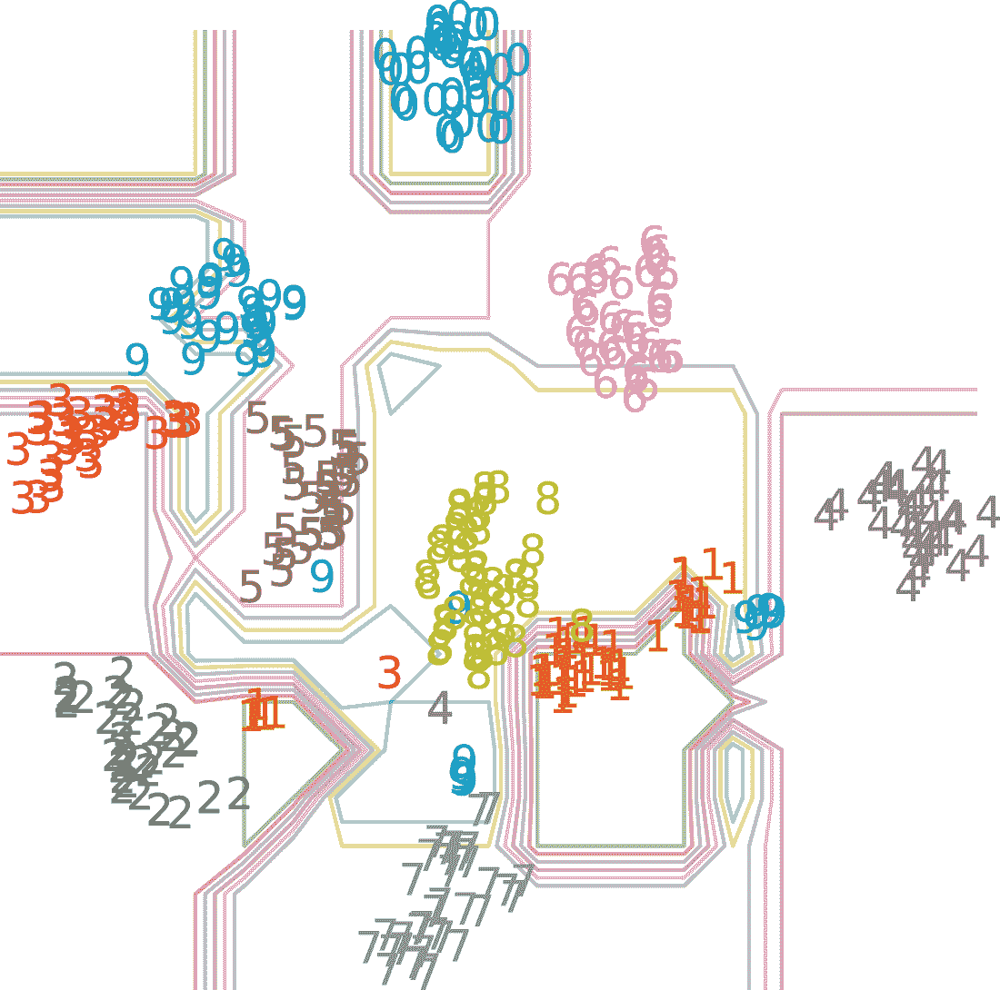

图 4.15 AdaBoost 在数字数据集嵌入上学习到的决策边界

本案例研究说明了 AdaBoost 如何将弱学习者的性能提升到强大的强学习者，从而在复杂任务上实现良好的性能。在我们结束本章之前，让我们看看另一种自适应提升算法，即 LogitBoost。

## 4.5 LogitBoost：使用逻辑损失进行提升

我们现在转向第二种提升算法，称为逻辑提升（LogitBoost）。LogitBoost 的发展是由将损失函数从已建立的分类模型（例如，逻辑回归）引入 AdaBoost 框架的愿望所激发的。以这种方式，通用的提升框架可以应用于特定的分类设置，以训练具有类似这些分类器特性的提升集成。

### 4.5.1 逻辑损失与指数损失函数

回想第 4.2.2 节，AdaBoost 使用以下方式更新弱学习者的权重 *α*[t]：

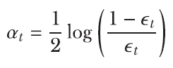

这种加权方案从何而来？这个表达式是 AdaBoost 优化指数损失的事实结果。特别是，AdaBoost 优化了示例 (*x*,*y*) 相对于弱学习器 *h*t 的指数损失，如下所示：

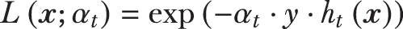

其中 *y* 是真实标签，*h*t 是弱学习器 *h*[t] 的预测。

我们能否使用其他损失函数来推导 AdaBoost 的变体？我们绝对可以！LogitBoost 实质上是一种类似于 AdaBoost 的集成方法，其加权方案使用不同的损失函数。只是当我们改变底层损失函数时，我们也需要做一些小的调整，以使整体方法能够工作。

LogitBoost 与 AdaBoost 在三个方面有所不同。首先，LogitBoost 优化的是逻辑损失：

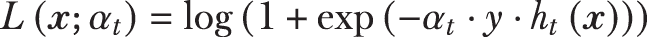

你可能在其他机器学习公式中见过逻辑损失，最著名的是逻辑回归。逻辑损失对错误的惩罚方式与指数损失不同（见图 4.16）。

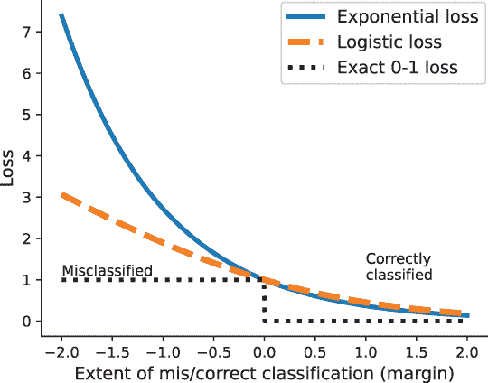

图 4.16 比较指数损失函数和对数损失函数

精确的 0-1 损失（也称为误分类损失）是一个理想化的损失函数，对于正确分类的示例返回 0，对于错误分类的示例返回 1。然而，由于它不连续，这种损失函数难以优化。为了构建可行的机器学习算法，不同的方法使用不同的替代品，例如指数和对数损失。

指数损失函数和对数损失函数都对正确分类的示例进行类似的惩罚。以更高置信度正确分类的训练示例对应的损失接近零。指数损失函数对错误分类的示例的惩罚比对数损失函数更为严厉，这使得它更容易受到异常值和噪声的影响。对数损失函数更为稳健。

### 4.5.2 回归作为分类问题的弱学习算法

第二个关键区别在于，AdaBoost 使用预测，而 LogitBoost 使用预测概率。更确切地说，AdaBoost 使用整体集成*F*(*x*)的预测，而 LogitBoost 使用预测概率*P*(*x*)。

预测训练示例 x 为正例的概率为

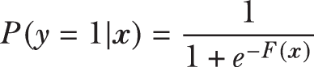

而预测 x 为负例的概率由*P*(*y* = 0 | *x*) = 1 - *P*(*y* = 1 | *x*)给出。这一事实直接影响我们选择基估计器的选择。

第三个关键区别在于，因为 AdaBoost 直接与离散预测（-1 或 1，用于负例和正例）工作，它可以使用任何分类算法作为基学习算法。相反，LogitBoost 使用连续预测概率。因此，它使用任何回归算法作为基学习算法。

### 4.5.3 实现 LogitBoost

将所有这些放在一起，LogitBoost 算法在每个迭代中执行以下步骤。以下简写为*P*[i]的概率*P*(*y*[i] = 1 | *x*[i])：

```
1\. Compute the working response, or how much the prediction probability
   differs from the true label: 
```

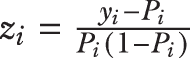

```
2\. Update the example weights, *D*i = *P*i(1 - *P*i)
3\. Train a weak regression stump *h*t(*x*) on the weighted examples (*x*i,*z*i,*D*i)
4\. Update the ensemble,*F*t+1(*x*) = *F*t(*x*) + *h*t(*x*)
5\. Update the example probabilities
```

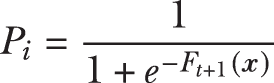

如第 4 步所示，LogitBoost 与 AdaBoost 一样，是一种**加性集成**。这意味着 LogitBoost 集成基估计器并加性组合它们的预测。此外，任何弱回归器都可以在第 3 步中使用，在那里我们使用回归树桩，即浅层回归树。LogitBoost 算法也易于实现，如下面的列表所示。

列表 4.5 LogitBoost 用于分类

```
import numpy as np
from sklearn.tree import DecisionTreeRegressor
from sklearn.metrics import accuracy_score
from scipy.special import expit

def fit_logitboosting(X, y, n_estimators=10):
    n_samples, n_features = X.shape
    D = np.ones((n_samples, )) / n_samples            
    p = np.full((n_samples, ), 0.5)                    ❶
    estimators = []                                   

    for t in range(n_estimators):
        z = (y - p) / (p * (1 - p))                    ❷
        D = p * (1 - p)                                ❸

        h = DecisionTreeRegressor(max_depth=1)         ❹
        h.fit(X, z, sample_weight=D)                
        estimators.append(h)                           ❺

        if t == 0:
            margin = np.array([h.predict(X)
                               for h in estimators]).reshape(-1, )
        else:
            margin = np.sum(np.array([h.predict(X)
                                      for h in estimators]), axis=0)
        p = expit(margin)                              ❻

    return estimators
```

❶ 初始化示例权重，“pred”概率

❷ 计算工作响应

❸ 计算新示例权重

❹ 使用决策树回归作为分类问题的基估计器

❺ 将弱学习器附加到集成 *F*t+1 = *F*t + *h*t

❻ 更新预测概率

列表 4.2 中描述的 predict_boosting 函数也可以用于使用 LogitBoost 集成进行预测，并在列表 4.6 中实现。

然而，LogitBoost 需要训练标签以 0/1 形式存在，而 AdaBoost 需要以 -1/1 形式存在。因此，我们稍微修改了该函数以返回 0/1 标签。

列表 4.6 LogitBoost 预测

```
def predict_logit_boosting(X, estimators):
    pred = np.zeros((X.shape[0], ))

    for h in estimators:
        pred += h.predict(X)

    y = (np.sign(pred) + 1) / 2    ❶

    return y
```

❶ 将 -1/1 预测转换为 0/1

与 AdaBoost 一样，我们可以通过图 4.17 视觉化 LogitBoost 在多次迭代中训练的集成如何演变。将此图与早期图 4.9 进行对比，该图显示了 AdaBoost 在多次迭代中训练的集成演变。

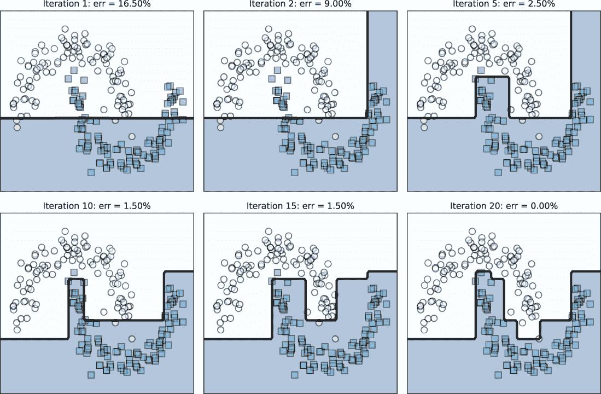

图 4.17 LogitBoost 使用决策树回归来训练回归树桩作为弱学习器，以顺序优化逻辑损失。

我们已经看到了两种处理不同损失函数的 boosting 算法。有没有一种方法可以将 boosting 推广到不同的损失函数和不同的任务，如回归？

这个问题的答案是肯定的，只要损失函数是可微分的（并且你可以计算其梯度）。这就是 *梯度提升* 的直觉，我们将在接下来的两章中探讨。

## 摘要

+   自适应提升（AdaBoost）是一种使用弱学习器作为基估计器的顺序集成算法。

+   在分类中，弱学习器是一个简单的模型，其表现仅略好于随机猜测，即 50% 的准确率。决策树桩和浅层决策树是弱学习器的例子。

+   AdaBoost 在训练示例上维护和更新权重。它使用重新加权来优先考虑误分类示例并促进集成多样性。

+   AdaBoost 也是一个加性集成，因为它通过其基估计器的预测的加性（线性）组合来做出最终预测。

+   AdaBoost 通常对过拟合具有鲁棒性，因为它集成了多个弱学习器。然而，由于自适应重新加权策略，AdaBoost 对异常值敏感，该策略在迭代过程中反复增加异常值的权重。

+   AdaBoost 的性能可以通过在学习率和基估计器的数量之间找到一个良好的权衡来提高。

+   使用网格搜索进行交叉验证通常用于确定学习率和估计器数量之间的最佳参数权衡。

+   在底层，AdaBoost 优化指数损失函数。

+   LogitBoost 是另一种优化逻辑损失函数的 boosting 算法。它在两个方面与 AdaBoost 不同：(1) 通过处理预测概率，以及(2) 使用任何分类算法作为基学习算法。

* * *

(1.) Yoav Freund 和 Robert E. Schapire. “在线学习的决策理论推广及其在提升中的应用”，*《计算机与系统科学杂志》*，第 55 卷第 1 期，第 119-139 页，1997 年。

(2.) 同上。

(3.) 同上。
