# 5 顺序集成：梯度提升

本章涵盖

+   使用梯度下降优化训练模型的损失函数

+   实现梯度提升

+   高效训练直方图梯度提升模型

+   在 LightGBM 框架中使用梯度提升

+   使用 LightGBM 避免过拟合

+   使用 LightGBM 自定义损失函数

上一章介绍了提升，其中我们按顺序训练弱学习器并将它们“提升”为强大的集成模型。在第四章中介绍的一个重要顺序集成方法是自适应提升（AdaBoost）。

AdaBoost 是一种基础的提升模型，它通过训练一个新的弱学习器来纠正前一个弱学习器的误分类。它是通过维护和自适应更新训练样本上的权重来做到这一点的。这些权重反映了误分类的程度，并指示给基础学习算法优先训练的样本。

在本章中，我们探讨了一种在训练样本上使用权重作为向基础学习算法传递误分类信息的替代方案：损失函数梯度。回想一下，我们使用损失函数来衡量模型在数据集中每个训练样本上的拟合程度。单个示例的损失函数梯度被称为 *残差*，正如我们将很快看到的，它捕捉了真实标签和预测标签之间的偏差。这个错误，或残差，当然衡量了误分类的程度。

与使用权重作为残差的代理的 AdaBoost 相比，梯度提升直接使用这些残差！因此，梯度提升是另一种旨在在残差（即梯度）上训练弱学习器的顺序集成方法。

梯度提升的框架可以应用于任何损失函数，这意味着任何分类、回归或排序问题都可以使用弱学习器进行“提升”。这种灵活性是梯度提升作为最先进的集成方法出现和普及的关键原因。有几个强大的梯度提升包和实现（LightGBM、CatBoost、XGBoost）可用，并能够通过并行计算和 GPU 高效地在大数据上训练模型。

本章的组织如下。为了更深入地理解梯度提升，我们需要更深入地理解梯度下降。因此，我们以一个可以用来训练机器学习模型的梯度下降示例（第 5.1 节）开始本章。

第 5.2 节旨在提供使用残差进行学习的直观理解，这是梯度提升的核心。然后，我们实现自己的梯度提升版本，并逐步了解它是如何结合梯度下降和提升的每一步来训练顺序集成的。本节还介绍了基于直方图的梯度提升，它本质上将训练数据分箱，从而显著加速树学习，并允许扩展到更大的数据集。

第 5.3 节介绍了 LightGBM，这是一个免费且开源的梯度提升包，也是构建和部署现实世界机器学习应用的重要工具。在第 5.4 节中，我们将看到如何通过早期停止和调整学习率等策略来避免过拟合，以及如何将 LightGBM 扩展到自定义损失函数。

所有这些都引导我们演示如何在现实世界任务中使用梯度提升：文档检索，这将是本章案例研究的重点（第 5.5 节）。文档检索作为一种信息检索形式，在许多应用中都是一个关键任务，我们都在某个时候使用过（例如，网络搜索引擎）。

要理解梯度提升，我们首先必须理解梯度下降，这是一种简单而有效的方法，广泛用于训练许多机器学习算法。这将帮助我们理解梯度下降在梯度提升中扮演的角色，无论是从概念上还是从算法上。

## 5.1 最小化梯度下降

我们现在深入探讨梯度下降，这是许多训练算法核心的优化方法。理解梯度下降将使我们能够理解梯度提升框架如何巧妙地将这种优化过程与集成学习相结合。优化，或寻找“最佳”，是许多应用的核心。确实，寻找最佳模型是所有机器学习的核心。

注意：学习问题通常被表述为优化问题。例如，训练本质上是在给定数据的情况下找到最佳拟合模型。如果“最佳”的概念由损失函数来表征，那么训练就被表述为最小化问题，因为最佳模型对应于最低的损失。或者，如果“最佳”的概念由似然函数来表征，那么训练就被表述为最大化问题，因为最佳模型对应于最高的似然（或概率）。除非指定，我们将使用损失函数来表征模型质量或拟合度，这将要求我们进行最小化。

损失函数明确衡量模型在数据集上的拟合度。通常，我们通过量化预测标签和真实标签之间的误差来衡量损失。因此，最佳模型将具有最低的误差或损失。

你可能熟悉诸如交叉熵（用于分类）或均方误差（用于回归）之类的损失函数。我们将在第 5.4.3 节中回顾交叉熵，在第七章中回顾均方误差。给定一个损失函数，训练是寻找最小化损失的最优模型的过程，如图 5.1 所示。


图 5.1 寻找最佳模型的最优化过程。机器学习算法在所有可能的候选模型中寻找最佳模型。最佳的概念通过损失函数来量化，该函数使用标签和数据评估所选候选者的质量。因此，机器学习算法本质上是最优化过程。在这里，最优化过程依次识别越来越好的模型 *f*[1]，*f*[2]，以及最终模型 *f*[3]。

你可能熟悉的一个这样的搜索例子是在训练决策树时进行参数选择的网格搜索。在网格搜索中，我们系统地、详尽地在参数网格上选择许多建模选择：叶子数、最大树深度等。

另一种更有效的优化技术是梯度下降，它使用一阶导数信息，即梯度，来引导我们的搜索。在本节中，我们查看两个梯度下降的例子。第一个是一个简单的说明性例子，用于理解和可视化梯度下降的基本工作原理。第二个例子演示了如何使用实际损失函数和数据来训练机器学习模型。

### 5.1.1 带有示例的梯度下降

我们将使用 Branin 函数，这是一个常用的示例函数，来展示梯度下降的工作原理，然后再转向一个更具体的基于机器学习的案例（第 5.1.2 节）。Branin 函数是两个变量（*w*[1]和*w*[2]）的函数，定义为

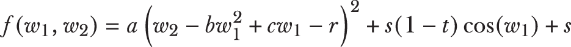

其中 *a* = 1, *b* = 5.1/4*π*², *c* = 5/*π*, *r* = 6, *s* = 10, 和 *t* = 1/8*π* 是固定的常数，我们不必担心。我们可以通过绘制 *w*[1] 与 *w*[2] 相对于 *f*(*w*[1],*w*[2]) 的 3D 图来可视化这个函数。图 5.2 展示了 3D 表面图以及等高线图（即从上方观看的表面图）。

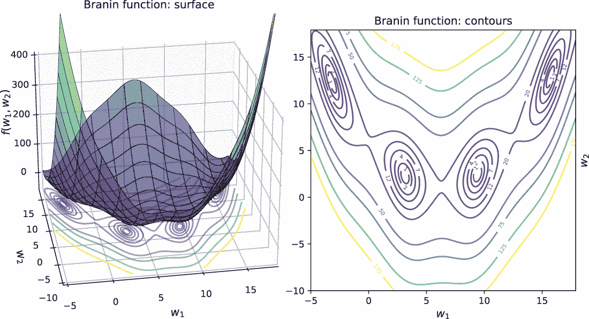

图 5.2 Branin 函数的表面图（左）和等高线图（右）。我们可以直观地验证这个函数有四个最小值，这些最小值是等高线图中等椭圆区域的中心。

Branin 函数的可视化显示它在四个不同的位置取最小值，这些位置被称为局部最小值或最小值。那么我们如何识别这些局部最小值呢？总是有暴力方法：我们可以在变量 *w*[1] 和 *w*[2] 上建立一个网格，并穷尽地评估每个可能组合的 *f*(*w*[1],*w*[2])。然而，这种方法有几个问题。首先，我们的网格应该有多粗或多细？如果我们的网格太粗，我们可能会错过搜索中的最小值。如果我们的网格太细，那么我们将有大量的网格点要搜索，这将使我们的最优化过程非常缓慢。

其次，并且更令人担忧的是，这种方法忽略了函数本身固有的所有额外信息，这些信息可能对我们的搜索非常有帮助。例如，一阶导数，即 *f*(*w*[1],*w*[2]) 关于 *w*[1] 和 *w*[2] 的变化率，可能非常有帮助。

理解和实现梯度下降

一阶导数信息被称为 *f*(*w*[1],*w*[2]) 的梯度，它是函数表面（局部）斜率的度量。更重要的是，梯度指向最陡上升的方向；也就是说，沿着最陡上升方向移动将导致 *f*(*w*[1],*w*[2]) 的更大值。

如果我们想使用梯度信息来找到最小值，那么我们必须沿着梯度的反方向前进！这正是梯度下降简单而高效的原则：继续沿着负梯度方向前进，最终你会到达一个（局部）最小值。

我们可以用以下伪代码形式化这种直觉，它描述了梯度下降的步骤。如图所示，梯度下降是一个迭代过程，通过沿着最陡下降方向（即负梯度）移动，稳步向局部最小值移动：

```
: wold = some initial guess, converged=False
while not converged:
1\. compute the direction (d) as negative gradient at wold and normalize 
     to unit length 
2\. compute the step length using line search (distance, α)
3\. update the solution: wnew = wold + distance * direction = wold + α ⋅ d
4\. if change between wnew and wold is below some specified tolerance:
     converged=True, so break
5. else set wnew = wold, get ready for the next iteration
```

梯度下降过程相当直接。首先，我们初始化我们的解（并称之为 **w**[old]）；这可以是随机初始化，或者可能是一个更复杂的猜测。从这个初始猜测开始，我们计算负梯度，这告诉我们想要前进的方向。

接下来，我们计算步长，这告诉我们沿着负梯度方向移动的距离或距离有多远。计算步长很重要，因为它确保我们不会超过我们的解。

步长计算是另一个优化问题，我们的目标是找到一个正标量 *α* > 0，使得沿着梯度 g 移动距离 *α* 可以使损失函数的最大减少。形式上，这被称为 *线搜索问题*，通常用于优化过程中高效地选择步长。

注意：许多优化包和工具（例如，本章中使用的 scipy.optimize）提供了精确和近似的线搜索函数，可用于识别步长。或者，步长也可以根据某些预定的策略设置，通常是为了效率。在机器学习中，步长通常被称为 *学习率*，用希腊字母 η (*η*) 表示。

有了一个方向和距离，我们可以采取这一步，并将我们的解猜测更新为 **w**[new]。一旦到达那里，我们检查收敛性。有几种收敛性测试；这里，我们假设在连续迭代之间解变化不大时收敛。如果收敛，那么我们就找到了一个局部最小值。如果没有，那么我们从 **w**[new] 再次迭代。以下列表显示了如何执行梯度下降。

列表 5.1 梯度下降

```
import numpy as np
from scipy.optimize import line_search
def gradient_descent(f, g, x_init,                          ❶
                     max_iter=100, args=()):
    converged = False                                       ❷
    n_iter = 0

    x_old, x_new = np.array(x_init), None
    descent_path = np.full((max_iter + 1, 2), fill_value=np.nan)   
    descent_path[n_iter] = x_old

    while not converged:
        n_iter += 1
        gradient = -g(x_old, *args)                         ❸
        direction = gradient / np.linalg.norm(gradient)     ❹

        step = line_search(f, g, x_old, 
                           direction, args=args)            ❺

        if step[0] is None:                                 ❻
            distance = 1.0
        else:
            distance = step[0]

        x_new = x_old + distance * direction                ❼
        descent_path[n_iter] = x_new

        err = np.linalg.norm(x_new - x_old)                 ❽
        if err <= 1e-3 or n_iter >= max_iter:                      
            converged = True                                ❾

        x_old = x_new                                       ❿

    return x_new, descent_path
```

❶ 梯度下降需要一个函数 f 和其梯度 g。

❷ 将梯度下降初始化为“未收敛”

❸ 计算负梯度

❹ 将梯度归一化到单位长度

❺ 使用线搜索计算步长

❻ 如果线搜索失败，则将其设置为 1.0。

❼ 计算更新

❽ 计算与前一次迭代的改变

❾ 当变化很小或达到最大迭代次数时收敛

❿ 准备进行下一次迭代

我们可以在 Branin 函数上测试这个梯度下降过程。为此，除了函数本身之外，我们还需要其梯度。我们可以通过挖掘微积分的基础（如果记忆中还有的话）来显式地计算梯度。

梯度是一个有两个分量的向量：*f* 对 *w*[1] 和 *w*[2] 的梯度，分别。有了这个梯度，我们可以计算在每处的最大增加方向：

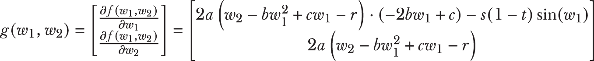

我们可以像下面这样实现 Branin 函数及其梯度：

```
def branin(w, a, b, c, r, s, t):
    return a * (w[1] - b * w[0] ** 2 + c * w[0] - r) ** 2 + \
           s * (1 - t) * np.cos(w[0]) + s

def branin_gradient(w, a, b, c, r, s, t):
    return np.array([2 * a * (w[1] - b * w[0] ** 2 + c * w[0] - r) * 
                     (-2 * b * w[0] + c) - s * (1 - t) * np.sin(w[0]),
                     2 * a * (w[1] - b * w[0] ** 2 + c * w[0] - r)])
```

除了函数和梯度之外，列表 5.1 还需要一个初始猜测 x_init。在这里，我们将使用 w_ini=[-4,-5]' (转置，因为这些是列向量，从数学的角度讲) 来初始化梯度下降。现在，我们可以调用梯度下降过程：

```
a, b, c, r, s, t = 1, 5.1/(4 * np.pi**2), 5/np.pi, 6, 10, 1/(8 * np.pi)
w_init = np.array([-4, -5])
w_optimal, w_path = gradient_descent(branin, branin_gradient, 
                                     w_init, args=(a, b, c, r, s, t))
```

梯度下降返回一个最优解 w_optimal=[3.14, 2.27] 和优化路径 w_path，这是在达到最优解的过程中，程序迭代通过的中间解的序列。

哇！在图 5.3 中，我们看到梯度下降能够达到 Branin 函数的四个局部最小值之一。关于梯度下降，有几个重要的事情需要注意，我们将在下面讨论。

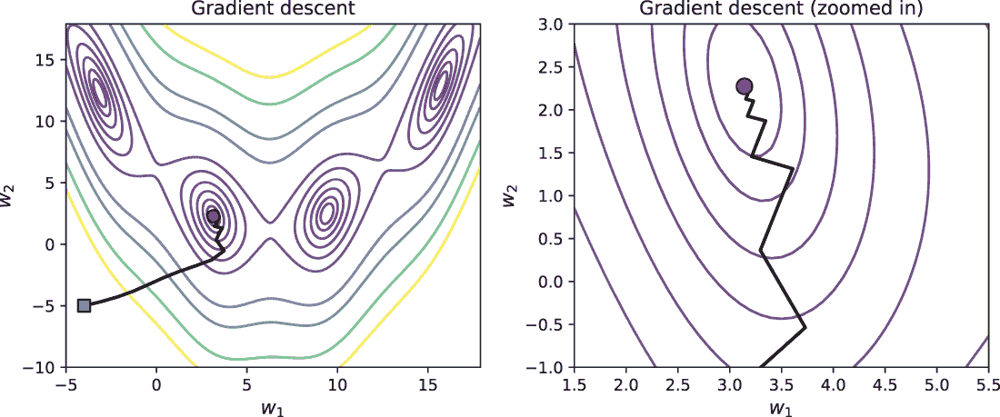

图 5.3 左图显示了梯度下降的完整下降路径，从 [-4,-5]' (正方形) 开始，收敛到局部最小值之一 (圆形)。右图显示了当梯度下降接近解时，相同下降路径的放大版本。请注意，梯度步骤变得越小，下降算法在接近解时倾向于曲折。

梯度下降的性质

首先，观察当我们接近一个最小值时，梯度步骤变得越来越小。这是因为梯度在最小值处消失。更重要的是，梯度下降表现出曲折行为，因为梯度并不指向局部最小值本身；相反，它指向最陡上升（或下降，如果为负）的方向。

在某一点的梯度本质上捕捉了局部信息，即该点附近函数的性质。梯度下降通过连续几个这样的梯度步骤来达到最小值。当梯度下降必须穿过陡峭的山谷时，它倾向于使用局部信息，导致它在移动向最小值的过程中在山谷两侧弹跳。

第二，梯度下降收敛到了 Branin 函数的四个局部最小值之一。通过改变初始化，你可以让它收敛到不同的最小值。图 5.4 展示了不同初始化下的各种梯度下降路径。

图 5.4 展示了梯度下降对初始化的敏感性，其中不同的随机初始化导致梯度下降收敛到不同的局部最小值。这种行为对于那些使用过 k-means 聚类的人来说可能很熟悉：不同的初始化通常会产生不同的聚类，每个聚类都是一个不同的局部解。

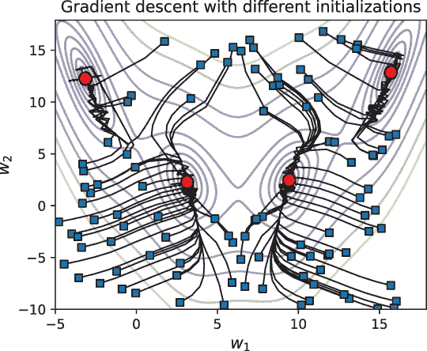

图 5.4 不同的初始化会导致梯度下降达到不同的局部最小值。

梯度下降的一个有趣挑战在于确定适当的初始化，因为不同的初始化会导致梯度下降收敛到不同的局部最小值。从优化的角度来看，事先确定正确的初始化并不总是容易的。

然而，从机器学习的角度来看，不同的局部解可能表现出相同的一般化行为。也就是说，局部最优的学习模型都具有相似的预测性能。这种情况在神经网络和深度学习中很常见，这也是为什么许多深度模型的训练过程都是从预训练的解决方案开始的。

提示：梯度下降对初始化的敏感性取决于被优化的函数类型。如果函数在所有地方都是凸的或杯状的，那么梯度下降识别的任何局部最小值也将总是全局最小值！这是支持向量机（SVM）优化器学习模型的情况。然而，一个好的初始猜测仍然很重要，因为它可能会使算法更快地收敛。许多现实世界的问题通常是非凸的，并且有几个局部最小值。梯度下降将收敛到其中之一，这取决于初始化和初始猜测局部函数的形状。k-means 聚类的目标函数是非凸的，这就是为什么不同的初始化会产生不同的聚类。参见 Mykel Kochenderfer 和 Tim Wheeler 所著的《优化算法》（MIT Press，2019），这是一本关于优化的扎实且实用的入门书籍。

### 5.1.2 梯度下降在训练损失函数上的应用

现在我们已经理解了梯度下降在简单示例（Branin 函数）上的基本工作原理，让我们从头开始构建一个分类任务，并使用我们自己的损失函数。然后，我们将使用梯度下降来训练模型。首先，我们创建一个如下所示的 2D 分类问题：

```
from sklearn.datasets import make_blobs
X, y = make_blobs(n_samples=200, n_features=2, 
                  centers=[[-1.5, -1.5], [1.5, 1.5]], random_state=42)
```

这个合成分类数据集在图 5.5 中进行了可视化。

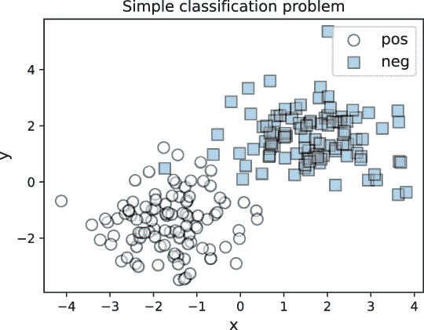

图 5.5 一个（几乎）线性可分的两类数据集，我们将在此数据集上训练一个分类器。正例的标签为 y = 1，而负例的标签为 y = 0。

我们特别创建了一个线性可分的数据集（当然，其中包含一些噪声），这样我们就可以训练一个线性分离器或分类函数。这将使我们的损失函数公式简单，并使我们的梯度易于计算。

我们想要训练的分类器 *h*w 接受 2D 数据点 *x* = [*x*[1],*x*[2]]' 并使用线性函数返回一个预测：

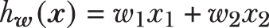

分类器由 *w* *=* [*w*[1]*, w*[2]]' 参数化，我们必须使用训练示例来学习它。为了学习，我们需要一个关于真实标签和预测标签的损失函数。我们将使用熟悉的平方损失（或平方误差），它衡量单个标记训练示例 (*x*,*y*) 的成本：

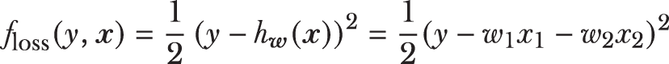

平方损失函数计算当前候选模型 (*h*[w]) 在单个训练示例 (*x*) 上的预测与其真实标签 (*y*) 之间的损失。对于数据集中的 *n* 个训练示例，整体损失可以表示如下：

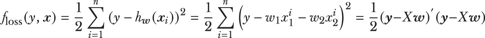

整体损失的表达式只是数据集中 *n* 个训练示例的个别损失的求和。

表达式 1/2(*y* – *Xw*)’(*y* – *Xw*) 是整体损失的 *向量化* 版本，它使用点积而不是循环。在向量化版本中，粗体的 *y* 是一个 *n* × 1 的真实标签向量；x 是一个 *n* × 2 的数据矩阵，其中每一行是一个 2D 训练示例；而 *w* 是一个我们想要学习的 2 × 1 模型向量。

如前所述，我们需要损失函数的梯度：

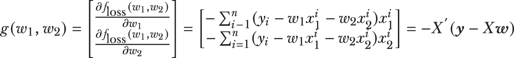

我们实现向量化版本，因为它们更紧凑、更高效，避免了显式的循环求和：

```
def squared_loss(w, X, y):
    return 0.5 * np.sum((y - np.dot(X, w))**2)

def squared_loss_gradient(w, X, y):
    return -np.dot(X.T, (y - np.dot(X, w)))
```

提示：如果你对手动计算梯度感到担忧，不要绝望；有其他方法可以数值近似梯度，并且被用于训练许多机器学习模型，包括深度学习和梯度提升。这些替代方案依赖于有限差分近似或自动微分（它基于数值计算和线性代数的基本原理）来有效地计算梯度。一个易于使用的工具是 scipy 科学包中可用的函数 scipy.optimize.approx_fprime。一个更强大的工具是 JAX ([`github.com/google/jax`](https://github.com/google/jax))，它是免费且开源的。JAX 旨在计算表示具有许多层的深度神经网络的复杂函数的梯度。JAX 可以通过循环、分支甚至递归进行微分，并且它支持大规模梯度计算的 GPU。

我们的损失函数看起来是什么样子？我们可以像之前一样可视化它，如图 5.6 所示。这个损失函数是碗形的，且是凸的，它有一个全局最小值，这就是我们的最优分类器，*w*。


图 5.6 整个训练集上的整体平方损失可视化

如前所述，我们执行梯度下降，这次初始化为 *w* = [0.0,-0.99]'，使用以下代码片段，梯度下降路径如图 5.7 所示：

```
w_init = np.array([0.0, -0.99])
w, path = gradient_descent(squared_loss, squared_loss_gradient, 
                           w_init, args=(X, y))
print(w)
[0.17390066 0.11937649]
```

梯度下降已经学习了一个最终的学习模型：*w*^* = [0.174,0.119]'. 通过我们的梯度下降过程学习到的线性分类器在图 5.7（右）中进行了可视化。除了通过视觉确认梯度下降过程学习到了有用的模型外，我们还可以计算训练准确率。

回想一下，线性分类器 *h*w = *w*[1]*x*[1] + *w*[2]*x*[2] 返回的是实数值预测，我们需要将其转换为 0 或 1。这是直截了当的：我们只需将所有正预测（几何上位于线上的示例）分配给类别 *y*[pred] = 1，并将负预测（几何上位于线下的示例）分配给类别 *y*[pred] = 0：

```
ypred = (np.dot(X, w) >= 0).astype(int)
from sklearn.metrics import accuracy_score
accuracy_score(y, ypred)
0.995
```

成功！我们实现的梯度下降学习到的训练准确率为 99.5%。

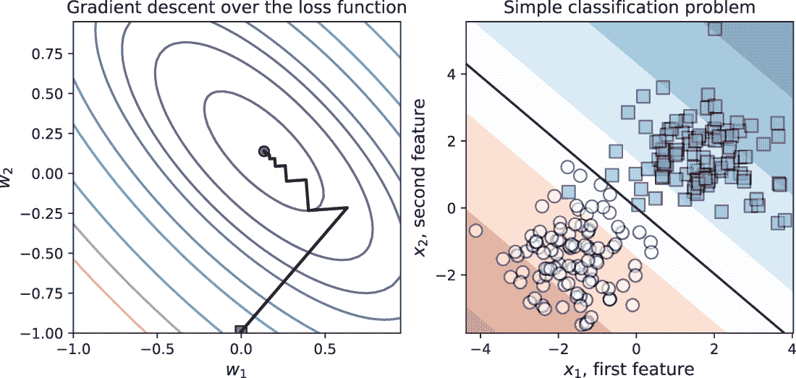

图 5.7 左：从 w_init（正方形）开始，在最优解（圆形）处收敛的梯度下降过程。右：学习到的模型 *w*^* = [0.174,0.119]' 是一个线性分类器，它很好地拟合了训练数据，因为它将两个类别分开。

现在我们已经了解了梯度下降如何在训练过程中使用梯度信息依次最小化损失函数，让我们看看我们如何通过提升（boosting）来扩展它以训练一个序列集成。

## 5.2 梯度提升：梯度下降 + 提升法

在梯度提升中，我们的目标是训练一系列弱学习器，在每个迭代中逼近梯度。梯度提升及其继任者牛顿提升目前被认为是最先进的集成方法，并且在多个应用领域的多个任务中得到了广泛实现和部署。

我们首先将探讨梯度提升的直观理解，并将其与另一种熟悉的提升方法：AdaBoost 进行比较。有了这种直观理解，就像之前一样，我们将实现我们自己的梯度提升版本，以可视化底层真正发生的事情。

然后，我们将探讨 scikit-learn 中可用的两种梯度提升方法：GradientBoostingClassifier 及其更可扩展的对应版本 HistogramGradientBoostingClassifer。这将为我们学习 LightGBM 打下良好的基础，LightGBM 是一种强大且灵活的梯度提升实现，广泛用于实际应用。

### 5.2.1 直观理解：使用残差进行学习

序列集成方法，如 AdaBoost 和梯度提升的关键组成部分是，它们旨在每个迭代中训练一个新的弱估计器来纠正前一个迭代中弱估计器所犯的错误。然而，AdaBoost 和梯度提升在训练新的弱估计器上对分类不良的例子有相当不同的方式。

AdaBoost 与梯度提升的比较

AdaBoost 通过给误分类的例子赋予比正确分类的例子更高的权重来识别高优先级的训练例子。这样，AdaBoost 可以告诉基础学习算法在当前迭代中应该关注哪些训练例子。相比之下，梯度提升使用残差或误差（真实标签和预测标签之间的差异）来告诉基础学习算法在下一个迭代中应该关注哪些训练例子。

残差究竟是什么？对于一个训练例子，它仅仅是真实标签和相应预测之间的误差。直观上，一个正确分类的例子必须有一个小的残差，而一个误分类的例子必须有一个大的残差。更具体地说，如果一个分类器*h*对一个训练例子*x*做出预测*h*(*x*)，计算残差的一个简单方法就是直接测量它们之间的差异：

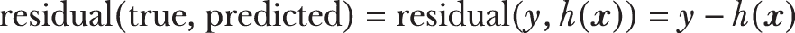

回想一下我们之前使用的平方损失函数：*f*损失 = ½(*y* – *h*(*x*))²。这个损失函数*f*相对于我们的模型*h*的梯度如下：

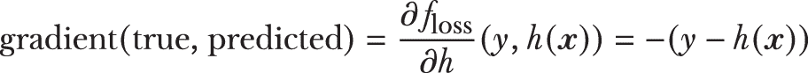

平方损失的负梯度正好与我们的残差相同！这意味着损失函数的梯度是误分类的度量，也是残差。

严重误分类的训练例子将会有大的梯度（残差），因为真实标签和预测标签之间的差距会很大。正确分类的训练例子将会有小的梯度。

这在图 5.8 中很明显，其中残差的幅度和符号指示了需要最多关注的训练示例。因此，类似于 AdaBoost，我们有衡量每个训练示例错误分类程度的一个指标。我们如何利用这个信息来训练一个弱学习器？

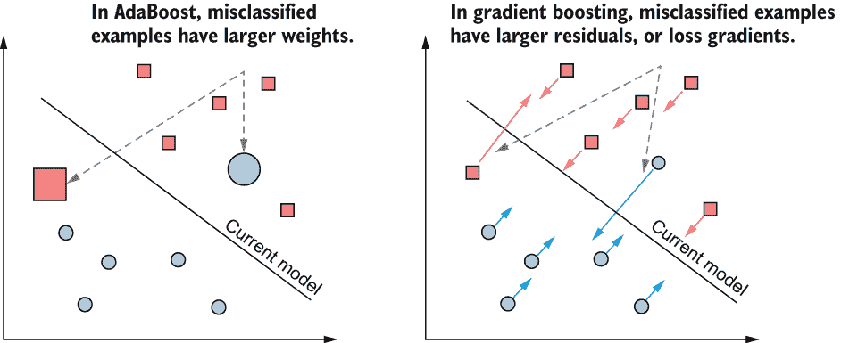

图 5.8 比较 AdaBoost（左）与梯度提升（右）。两种方法都训练弱估计器，以改善对错误分类示例的分类性能。AdaBoost 使用权重，错误分类的示例被分配更高的权重。梯度提升使用残差，错误分类的示例具有更高的残差。残差不过是负损失梯度。

使用弱学习器来近似梯度

继续我们的 AdaBoost 类比，回想一下，一旦它为所有训练示例分配了权重，我们就得到了一个带有加权示例的权重增强数据集（**x**[i], *y*[i], *D*[i]），其中 i = 1, ..., *n*。因此，在 AdaBoost 中训练弱学习器是加权分类问题的一个实例。使用适当的基础分类算法，AdaBoost 训练一个弱分类器。

在梯度提升中，我们不再有权重 *D*[i]。相反，我们有残差（或负损失梯度）*r*[i]和一个残差增强数据集(*x*[i,] *r*[i])。而不是分类标签(*y*[i] = 0 或 1)和示例权重(*D*[i])，每个训练示例现在都有一个相关的残差，这可以被视为一个实值标签。

因此，在梯度提升中训练弱学习器是回归问题的一个实例，这需要一个如决策树回归的基础学习算法。当训练后，梯度提升中的弱估计器可以被视为近似梯度。

图 5.9 说明了梯度下降与梯度提升的不同之处，以及梯度提升在概念上与梯度下降的相似之处。这两种方法的关键区别在于，梯度下降直接使用负梯度，而梯度提升通过训练一个弱回归器来近似负梯度。我们现在拥有了形式化梯度提升算法步骤的所有要素。

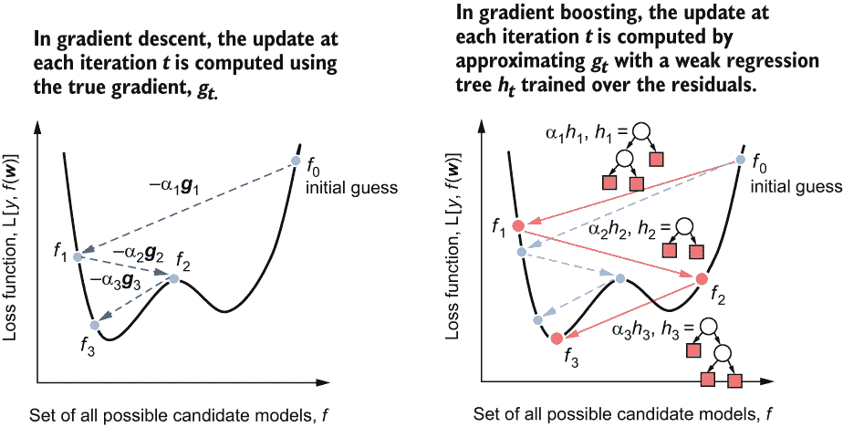

图 5.9 比较梯度下降（左）与梯度提升（右）。在迭代*t*时，梯度下降使用负梯度-*g*[t]更新模型。在迭代*t*时，梯度提升通过在负残差-*r*^t[i]上训练弱回归器*h*[t]来近似负梯度。梯度下降中的步长*α*[t]相当于序列集成中每个基础估计器的假设权重。

注意：梯度提升旨在将弱估计器拟合到残差，这些残差是实值。因此，梯度提升将*始终*需要使用回归算法作为基础学习算法，并学习回归器作为弱估计器。即使损失函数对应于二元或多元分类、回归或排序，也是如此。

梯度提升是梯度下降 + 提升树

总结来说，梯度提升结合了梯度下降和提升：

+   与 AdaBoost 类似，梯度提升训练一个弱学习器来纠正前一个弱学习器犯的错误。AdaBoost 使用示例权重来关注错误分类的示例，而梯度提升使用示例残差来完成同样的任务。

+   与梯度下降类似，梯度提升使用梯度信息更新当前模型。梯度下降直接使用负梯度，而梯度提升在负残差上训练一个弱回归器来近似梯度。

最后，梯度下降和梯度提升都是加性算法；也就是说，它们生成一系列中间项，这些中间项通过加性组合来产生最终模型。这在图 5.10 中很明显。

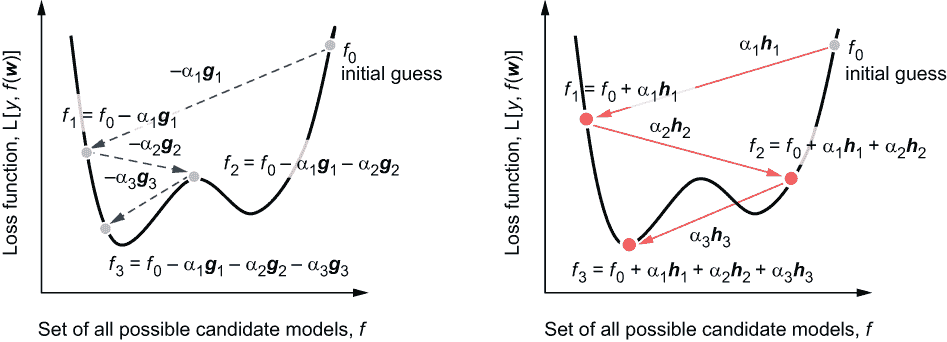

图 5.10 梯度下降（左）和梯度提升（右）都产生一系列更新。在梯度下降中，每次迭代通过添加新的负梯度（-*g*[t]）来更新当前模型。在梯度提升中，每次迭代通过添加新的近似弱梯度估计（回归树，*h*[t]）来更新当前模型。

在每次迭代中，AdaBoost、梯度下降和梯度提升都使用以下形式的加性表达式来更新当前模型：

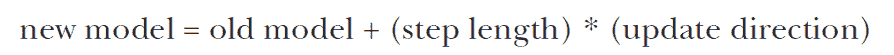

更正式地，这表现为以下形式：

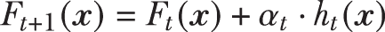

我们可以将这个表达式展开到迭代 *t*、*t* - 1、*t* - 2、...、0，以获得 AdaBoost、梯度下降和梯度提升产生的整体更新序列：

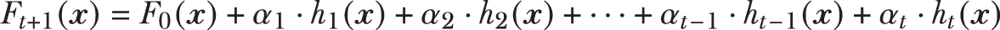

三种算法之间的关键区别在于我们如何计算更新 *h*[t] 和假设权重（也称为步长）*α*[t]。我们可以在表 5.1 中总结所有三种算法的更新步骤。

表 5.1 比较 AdaBoost、梯度下降和梯度提升

| 算法 | 损失函数 | 基础学习算法 | 更新方向 *h*t | 步长 *α*[t] |
| --- | --- | --- | --- | --- |
| AdaBoost 分类 | 指数 | 加权示例分类 | 弱分类器 | 闭式计算 |
| 梯度下降 | 用户指定 | 无 | 梯度向量 | 线搜索 |
| 梯度提升 | 用户指定 | 带有示例和残差的回归 | 弱回归器 | 线搜索 |

梯度提升 = 梯度下降 + 提升的原因是它*泛化*了从 AdaBoost 使用的指数损失函数到任何用户指定的损失函数的提升过程。为了使梯度提升能够灵活地适应各种损失函数，它采用了两个通用程序：(1) 使用弱回归器近似梯度，(2) 使用线搜索计算假设权重（或步长）。

### 5.2.2 实现梯度提升

如前所述，我们将通过实现我们自己的梯度提升版本来将我们的直觉付诸实践。基本算法可以用以下伪代码概述：

```
initialize: F = f0, some constant value
for t = 1 to T:
1\. compute the negative residuals for each example, *r*ti = (*∂L*/*∂F*)(*x*i)  
2\. fit a weak decision tree regressor *h*t(*x*) using the training set (*x*i, *r*i)*n**i*=1
3\. compute the step length (*α*t) using line search 
4\. update the model: *F*t = *F* + *α*t ⋅ *h*t(*x*)
```

这种训练过程几乎与梯度下降相同，只是有几个不同之处：(1) 我们不是使用负梯度，而是使用在负残差上训练的近似梯度，(2) 我们不是检查收敛性，而是在有限的最大迭代次数 *T* 后算法终止。以下列表具体实现了这个伪代码，它使用一种称为*黄金分割搜索*的线搜索类型来找到最佳步长。

列表 5.2 平方损失梯度提升

```
from scipy.optimize import minimize_scalar
from sklearn.tree import DecisionTreeRegressor

def fit_gradient_boosting(X, y, n_estimators=10):
    n_samples, n_features = X.shape                        ❶
    n_estimators = 10
    estimators = []                                        ❷
    F = np.full((n_samples, ), 0.0)                        ❸

    for t in range(n_estimators):
        residuals = y - F                                  ❹
        h = DecisionTreeRegressor(max_depth=1)
        h.fit(X, residuals)                                ❺

        hreg = h.predict(X)                                ❻
        loss = lambda a: np.linalg.norm(
                             y - (F + a * hreg))**2        ❼
        step = minimize_scalar(loss, method='golden')      ❽
        a = step.x

        F += a * hreg                                      ❾
        estimators.append((a, h))                          ❿

    return estimators
```

❶ 获取数据集的维度

❷ 初始化一个空的集成

❸ 在训练集上预测集成

❹ 计算平方损失的负梯度作为残差

❺ 将弱回归树（h[t]）拟合到示例和残差

❻ 获取弱学习器的预测，h[t]

❼ 设置线搜索问题

❽ 使用黄金分割搜索找到最佳步长

❾ 更新集成预测

❿ 更新集成

模型训练完成后，我们可以像 AdaBoost 集成一样进行预测（见以下列表）。请注意，就像我们之前的 AdaBoost 实现一样，此模型返回-1/1 的预测而不是 0/1。

列表 5.3 使用梯度提升模型进行预测

```
def predict_gradient_boosting(X, estimators):
    pred = np.zeros((X.shape[0], ))            ❶

    for a, h in estimators:
        pred += a * h.predict(X)               ❷

    y = np.sign(pred)                          ❸

    return y
```

❶ 将所有预测初始化为 0

❷ 聚合每个回归器的单个预测

❸ 将加权预测转换为-1/1 标签

我们可以在一个简单的两月亮分类示例上测试这个实现。请注意，我们将训练标签从 0/1 转换为-1/1，以确保我们正确学习和预测：

```
from sklearn.datasets import make_moons
X, y = make_moons(n_samples=200, noise=0.15, random_state=13)
y = 2 * y - 1                                                  ❶
from sklearn.model_selection import train_test_split
Xtrn, Xtst, ytrn, ytst = train_test_split(X, y,                ❷
                                          test_size=0.25, random_state=11)

estimators = fit_gradient_boosting(Xtrn, ytrn)
ypred = predict_gradient_boosting(Xtst, estimators)

from sklearn.metrics import accuracy_score
tst_err = 1 - accuracy_score(ytst, ypred)                      ❸
tst_err
0.06000000000000005
```

❶ 将训练标签转换为-1/1

❷ 将数据集分为训练集和测试集

❸ 训练并获取测试错误

该模型的错误率为 6%，相当不错。

可视化梯度提升迭代

最后，为了全面巩固我们对梯度提升的理解，让我们逐步分析前几次迭代，看看梯度提升是如何使用残差来提升分类的。在我们的实现中，我们初始化预测为 *F*(*x*[i]) = 0。这意味着在第一次迭代中，类别 1 的示例的残差将为 *r*[i] = 1 - 0 = 1，而类别 0 的示例的残差将为 *r*[i] = -1 - 0 = -1。这如图 5.11 所示。

在第一次迭代中，所有训练样本都有较高的残差（要么是+1，要么是-1），基学习算法（决策树回归）必须训练一个考虑所有这些残差的弱回归器。训练的回归树(*h*[1])如图 5.11（右）所示。

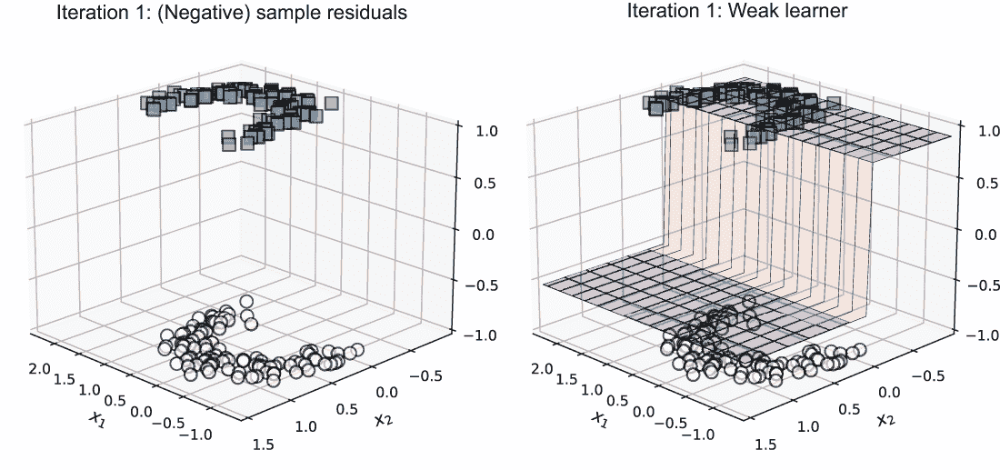

图 5.11 第 1 次迭代：残差（左）和基于残差训练的弱回归器（右）

当前集成仅包含一个回归树：*F* = *α*[1]*h*[1]。我们还可以可视化分类预测的*h*[1]和集成*F*。如图 5.12 所示，这些分类的整体错误率为 16%。

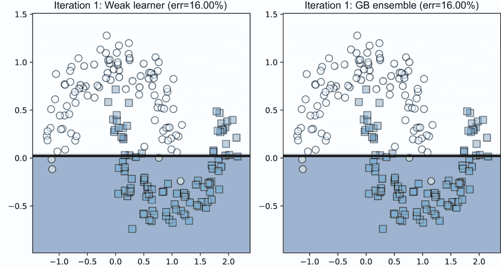

图 5.12 第 1 次迭代：弱学习器(*h*[1])和整个集成(*F*)的预测。由于这是第一次迭代，集成仅包含一个弱回归器。

在第 2 次迭代中，我们再次计算残差。现在，残差开始显示出更多的分离，这反映了它们被当前集成分类得有多好。决策树回归器试图再次拟合残差（见图 5.13，右），尽管这次它专注于之前被错误分类的示例。

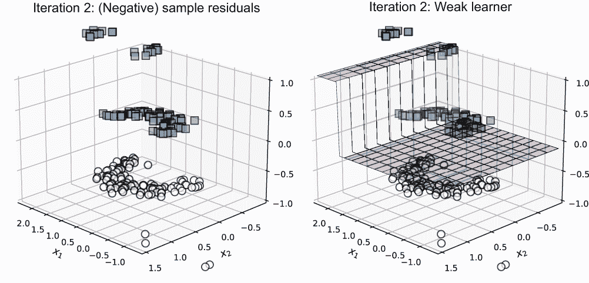

图 5.13 第 2 次迭代：残差（左）和基于残差训练的弱回归器（右）

现在集成包含两个回归树：*F* = *α*[1]*h*[1] + *α*[2]*h*[2]。我们现在可以可视化新训练的回归器*h*[2]和整体集成*F*（见图 5.14）。

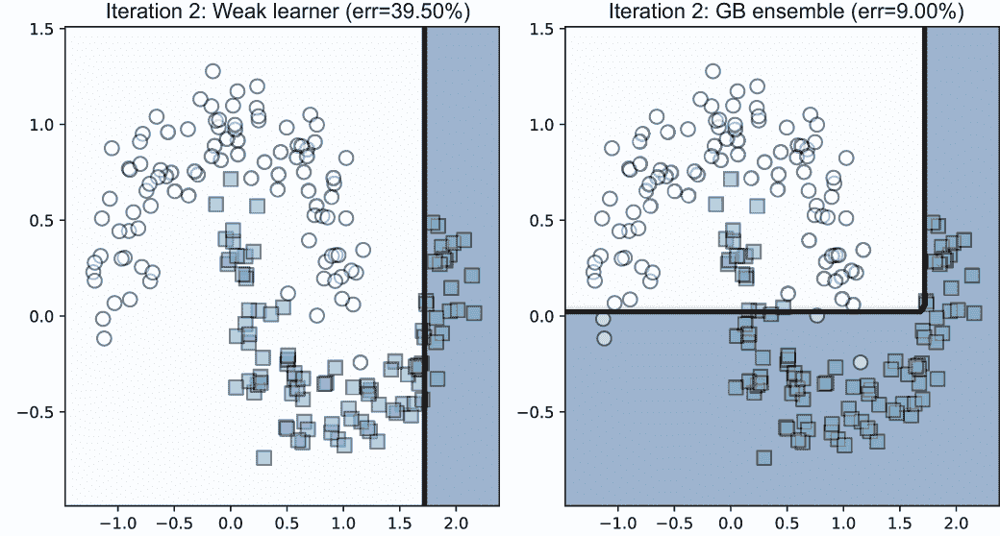

图 5.14 第 2 次迭代：弱学习器(*h*[2])和整体集成(*F*)的预测

在第 2 次迭代中训练的弱学习器整体错误率为 39.5%。然而，前两个弱学习器已经将集成性能提升至 91%的准确率，即 9%的错误率。这个过程在第 3 次迭代中继续，如图 5.15 所示。

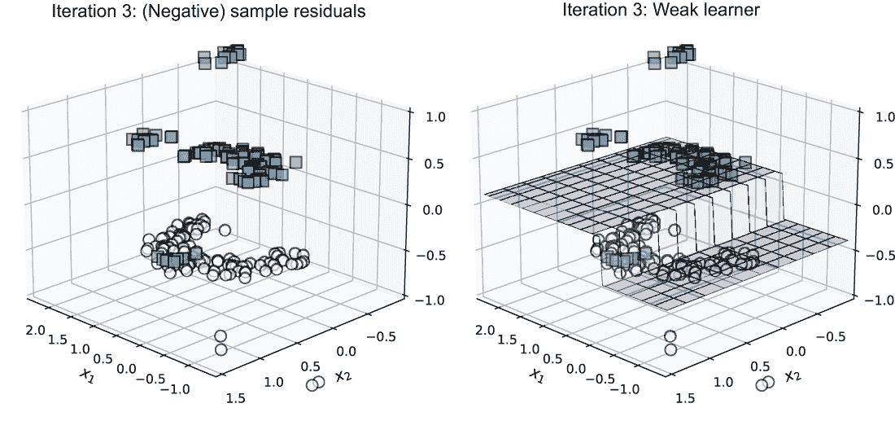

图 5.15 第 3 次迭代：残差（左）和基于残差训练的弱回归器（右）

以这种方式，梯度提升法继续按顺序训练并添加基回归器到集成中。图 5.16 显示了经过 10 次迭代后训练的模型；集成包含 10 个弱回归估计器，并将整体训练准确率提升至 97.5%！

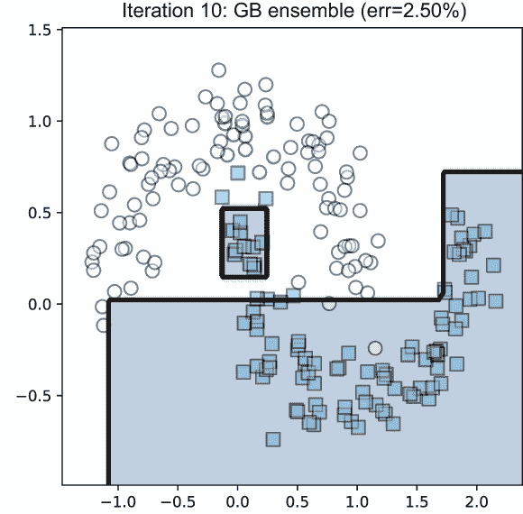

图 5.16 经过 10 次迭代后的最终梯度提升集成

有几种公开且高效的梯度提升实现可供您在机器学习任务中使用。在本节的其余部分，我们将重点关注最熟悉的：scikit-learn。

### 5.2.3 使用 scikit-learn 进行梯度提升

我们现在将探讨如何使用两个 scikit-learn 类：GradientBoostingClassifier 和一个新版本，称为 HistogramGradientBoostingClassifier。后者以精确度为代价换取速度，可以比 GradientBoostingClassifier 快得多地训练模型，使其非常适合大型数据集。

scikit-learn 的 GradientBoostingClassifier 实质上实现了我们在本节中自己实现的相同的梯度提升算法。它的使用方式与其他 scikit-learn 分类器（如 AdaBoostClassifier）类似。然而，与 AdaBoostClassifier 有两个关键的区别：

+   与支持多种不同类型基估计器的 AdaBoostClassifier 不同，GradientBoostingClassifier 只支持基于树的集成。因此，它始终使用决策树作为基估计器，并且没有机制来指定其他类型的基学习算法。

+   AdaBoostClassifier 通过设计优化指数损失。GradientBoostingClassifier 允许用户选择逻辑回归或指数损失函数。逻辑损失（也称为交叉熵）是二分类中常用的损失函数（也有多类变体）。

注意：使用指数损失函数训练 GradientBoostingClassifier 与训练 AdaBoostClassifier 非常相似（但并不完全相同）。

除了选择损失函数外，我们还可以设置其他学习参数。这些参数通常通过交叉验证（CV）选择，就像任何其他机器学习算法一样（参见 AdaBoostClassifier 中的 4.3 节以了解参数选择）：

+   我们可以直接通过 max_depth 和 max_leaf_nodes 控制基树估计器的复杂性。更高的值意味着基树学习算法在训练更复杂的树时具有更大的灵活性。当然，这里的警告是，更深层次的树或具有更多叶节点的树往往会对训练数据进行过拟合。

+   n_estimators 限制了 GradientBoostingClassifier 将按顺序训练的弱学习器的数量，本质上就是算法迭代的次数。

+   与 AdaBoost 类似，梯度提升也按顺序训练弱学习器（迭代 t 中的 *h*[t]）并逐步和递增地构建集成：*F*t = *F*t-1 + *η* ⋅ *α*[t] ⋅ *h*t。在这里，*α*[t] 是弱学习器 *h*[t] 的权重（或步长），而 *η* 是学习率。学习率是一个用户定义的学习参数，其范围在 0 < *η* ≤ 1 之间。回想一下，较慢的学习率意味着训练集成通常需要更多的迭代。可能需要选择较慢的学习率，以便使后续的弱学习器对异常值和噪声更加鲁棒。学习率由 learning_rate 参数控制。

让我们看看在乳腺癌数据集上梯度提升的实例。我们使用这个数据集来训练和评估一个 GradientBoostingClassifier 模型：

```
from sklearn.datasets import load_breast_cancer
from sklearn.model_selection import train_test_split
X, y = load_breast_cancer(return_X_y=True)

Xtrn, Xtst, ytrn, ytst = train_test_split(                          ❶
                             X, y, test_size=0.25, random_state=13)

from sklearn.ensemble import GradientBoostingClassifier
ensemble = GradientBoostingClassifier(max_depth=1,                  ❷
                                      n_estimators=20, 
                                      learning_rate=0.75)
ensemble.fit(Xtrn, ytrn)
```

❶ 加载数据集并将其分为训练集和测试集

❷ 使用这些学习参数训练梯度提升模型

这个模型表现如何？这个梯度提升分类器达到了 4.9%的测试误差，这相当不错：

```
ypred = ensemble.predict(Xtst)
err = 1 - accuracy_score(ytst, ypred)
print(err)
0.04895104895104896 
```

然而，GradientBoostingClassifier 的一个关键限制是其速度；虽然有效，但在大数据集上它确实会相对较慢。实际上，效率瓶颈在于树学习。回想一下，梯度提升在每个迭代中都必须学习一个回归树作为基估计器。对于大数据集，树学习器必须考虑的分割数量变得过于庞大。这导致了基于直方图的梯度提升的出现，其目的是加快基估计器树学习，使梯度提升能够扩展到更大的数据集。

### 5.2.4 基于直方图的梯度提升

要理解基于直方图的树学习的必要性，我们必须回顾决策树算法是如何学习回归树的。在树学习中，我们自上而下地学习一棵树，一次一个决策节点。标准的方法是通过预排序特征值，枚举所有可能的分割，然后评估所有这些分割以找到最佳的分割。假设我们有 1,000,000（10⁶）个训练示例，每个示例的维度为 100。标准树学习将枚举并评估（大约）10 亿个分割（10⁶ *×* 100 = 10⁸）以识别决策节点！这显然是不可行的。

一种替代方案是将特征值重新组织成少数几个桶。在这个假设的例子中，假设我们将每个特征列分桶到 100 个桶中。现在，为了找到最佳的分割，我们只需要在 10,000 个分割中进行搜索（100 × 100 = 10⁴），这可以显著加快训练速度！

当然，这意味着我们是在精确度和速度之间进行权衡。然而，在许多（大数据）集中通常存在大量冗余或重复信息，我们通过将数据分桶到更小的桶中来进行压缩。图 5.17 说明了这种权衡。

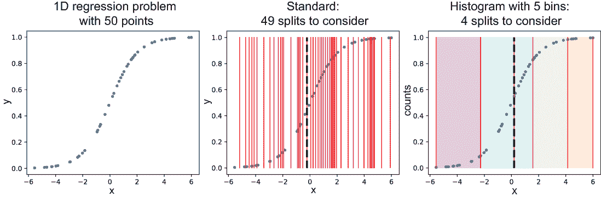

图 5.17 左：一个简单的 1D 回归问题，有 50 个数据点。中：标准树学习评估每个可能的分割，这通过每对数据点之间的线表示。最佳的分割是具有最低分割标准（此处为平方损失）的分割。右：基于直方图的分桶首先将数据放入五个桶中，然后评估每个数据桶之间的分割。同样，最佳的分割是具有最低分割标准（也是平方损失）的分割。

在图 5.17 中，我们对比了标准树学习和基于直方图的树学习的行为。在标准树学习中，每个考虑的分割都是在两个连续的数据点之间（图 5.17，中心）；对于 50 个数据点，我们必须评估 49 个分割。

在基于直方图的分割中，我们首先将数据（图 5.17，右）分为五个桶。现在，每个考虑的分割都是在两个连续的数据桶之间；对于五个桶，我们只需要评估四个分割！现在想象一下，如果数据点达到数百万，这将如何扩展。

scikit-learn 0.21 引入了一种名为 HistogramGradientBoostingClassifier 的梯度提升版本，它实现了基于直方图的梯度提升，从而显著提高了训练时间。以下代码片段展示了如何在乳腺癌数据集上训练和评估 HistogramGradientBoostingClassifier：

```
from sklearn.ensemble import HistGradientBoostingClassifier   

ensemble = HistGradientBoostingClassifier(max_depth=2,        ❶
                                          max_iter=20, 
                                          learning_rate=0.75)
ensemble.fit(Xtrn, ytrn)                                      ❷

ypred = ensemble.predict(Xtst)
err = 1 - accuracy_score(ytst, ypred)
print(err)
0.04195804195804198
```

❶ 初始化基于直方图的梯度提升分类器

❷ 训练集成

在乳腺癌数据集上，HistGradientBoostingClassifier 实现了 4.2%的测试错误率。scikit-learn 的基于直方图的提升实现本身是受到另一个流行的梯度提升包 LightGBM 的启发。

## 5.3 LightGBM：梯度提升框架

光梯度提升机器（LightGBM）¹是一个开源的梯度提升框架，最初由微软开发和发布。在其核心，LightGBM 本质上是一种基于直方图的梯度提升方法。然而，它还具有几个建模和算法特性，使其能够处理大规模数据。特别是，LightGBM 提供了以下优势：

+   算法加速，如基于梯度的单侧采样和独家特征捆绑，这些可以导致更快的训练和更低的内存使用（这些在 5.3.1 节中描述得更详细）

+   支持大量用于分类、回归和排序的损失函数，以及特定应用的自定义损失函数（参见第 5.3.2 节）

+   支持并行和 GPU 学习，这使得 LightGBM 能够处理大规模数据集（本书不涉及基于并行/GPU 的机器学习）

我们还将深入探讨如何将 LightGBM 应用于一些实际学习场景以避免过拟合（第 5.4.1 节），以及最终在一个真实世界数据集上的案例研究（第 5.5 节）。当然，在这个有限的空间内不可能详细描述 LightGBM 的所有功能。相反，本节和下一节介绍了 LightGBM，并展示了其在实际环境中的应用和用法。这应该能够帮助你通过其文档进一步深入到 LightGBM 的高级用例。

### 5.3.1 LightGBM“轻量”的原因是什么？

回想我们之前的讨论，将梯度提升扩展到大型（具有许多训练示例）或高维（具有许多特征）数据集的最大计算瓶颈是树学习，特别是识别回归树基估计器的最佳分割。正如我们在上一节中看到的，基于直方图的梯度提升试图解决这个问题。这对于中等大小的数据集来说效果相当好。然而，如果我们有大量数据点、大量特征或两者兼而有之，直方图桶的构建本身可能很慢。

在本节中，我们将探讨 LightGBM 实现的两个关键概念改进，这些改进在实践中通常会导致训练时间的显著加快。第一个是梯度基于单侧采样（GOSS），旨在减少*训练示例*的数量，而第二个是独占特征捆绑（EFB），旨在减少*特征*的数量。

基于梯度的单侧采样

处理大量训练示例的一个众所周知的方法是下采样数据集，即随机采样数据集的一个较小的子集。我们已经在其他集成方法中看到了这种方法的例子，例如粘贴（这是不重复的 bagging；见第二章，第 2.4.1 节）。

随机下采样数据集有两个问题。首先，并非所有示例都同等重要；就像 AdaBoost 一样，一些训练示例的重要性高于其他示例，这取决于它们错误分类的程度。因此，下采样不应丢弃高重要性的训练示例。

其次，采样还应确保包含一定比例的正确分类示例。这对于防止基本学习算法因错误分类示例过多而过度拟合至关重要。

这可以通过使用基于梯度的单侧采样（GOSS）程序智能地下采样数据来解决。简要来说，GOSS 执行以下步骤：

1.  使用梯度幅度，类似于 AdaBoost，它使用样本权重。记住，梯度表示预测可以改进多少：训练良好的示例具有小的梯度，而训练不足（通常是错误分类或混淆）的示例具有大的梯度。

1.  选择具有最大梯度的前*a%*个示例；称这个子集为 top。

1.  随机采样剩余示例的*b%*；称这个子集为 rand。

1.  为两个集合中的示例分配权重：*w*[top] = 1，*w*[rand] = (100 – *a*)/*b*

1.  在此采样数据（示例、残差、权重）上训练一个基本回归器。

第 4 步计算出的权重确保了训练不足和训练良好的样本之间有一个良好的平衡。总体而言，这种采样还促进了集成多样性，这最终导致更好的集成。

独占特征捆绑

除了大量的训练示例外，大数据还常常带来非常高的维度挑战，这可能会对直方图构建产生不利影响并减慢整体训练过程。类似于对训练示例进行下采样，如果我们能够对特征也进行下采样，就有可能获得（有时是非常大的）训练速度的提升。这在特征空间稀疏且特征相互排斥时尤其如此。

这种特征空间的一个常见例子是我们对分类变量应用 one-hot 向量化。例如，考虑一个具有 10 个唯一值的分类变量。当进行 one-hot 向量化时，这个变量扩展为 10 个二进制变量，其中只有一个是非零的，其余都是零。这使得对应于这个特征的 10 列非常稀疏。

独立特征捆绑（EFB）的工作方式相反，利用这种稀疏性，旨在将相互排斥的列压缩为一列以减少有效特征的数量。从高层次来看，EFB 执行两个步骤：

1.  通过测量冲突或两个特征同时非零的次数来识别可以捆绑在一起的特征。这里的直觉是，如果两个特征经常相互排斥，它们是低冲突的，可以捆绑在一起。

1.  将识别出的低冲突特征合并成一个特征包。这里的想法是在合并非零值时仔细保留信息，这通常是通过向特征值添加偏移量来防止重叠来实现的。

直观来说，这就像有两个特征：通过和失败。由于一个人不能同时通过和失败考试，我们可以将它们合并成一个特征（即，将数据集中的两列合并为一列）。

通过和失败，当然是零冲突特征，永远不会重叠。更常见的是，两个或更多特征可能不是完全零冲突，但与一些小的重叠具有低冲突。在这种情况下，EFB 仍然会将这些特征捆绑在一起，这会将几个数据列压缩为一列！通过这种方式合并特征，EFB 有效地减少了整体特征数量，这通常会使训练速度更快。

### 5.3.2 使用 LightGBM 进行梯度提升

LightGBM 适用于各种平台，包括 Windows、Linux 和 macOS，它可以从头开始构建或使用 pip 等工具安装。它的使用语法与 scikit-learn 非常相似。

继续使用第 5.2.3 节中的乳腺癌数据集，我们可以使用 LightGBM 训练一个梯度提升模型，如下所示：

```
from lightgbm import LGBMClassifier
gbm = LGBMClassifier(boosting_type='gbdt', n_estimators=20, max_depth=1)
gbm.fit(Xtrn, ytrn)
```

在这里，我们实例化一个 LGBMClassifier 实例，并将其设置为训练一个包含 20 个回归树（即，基估计器将是深度为 1 的回归树）的集成。这里的一个重要规范是 boosting_type。LightGBM 可以在四种模式下进行训练：

+   boosting_type='rf'—训练传统的随机森林集成（参见第二章，第 2.3 节）

+   boosting_type='gbdt'—使用传统的梯度提升（参考第 5.2 节）训练集成模型

+   boosting_type='goss'—使用 GOSS（参考第 5.3.1 节）训练集成模型

+   boosting_type='dart'—使用 Dropouts meet Multiple Additive Regression Trees (DART；参考第 5.5 节)训练集成模型

最后三个梯度提升模式基本上是在训练速度和预测性能之间进行权衡，我们将在案例研究中探讨这一点。现在，让我们看看我们刚刚使用 boosting_type='gbdt'训练的模型表现如何：

```
from sklearn.metrics import accuracy_score
ypred = gbm.predict(Xtst)
accuracy_score(ytst, ypred)
0.9473684210526315
```

我们第一个 LightGBM 分类器在从乳腺癌数据集中保留的测试集上达到了 94.7%的准确率。现在我们已经熟悉了 LightGBM 的基本功能，让我们看看如何使用 LightGBM 为实际用例训练模型。

## 5.4 LightGBM 的实际应用

在本节中，我们描述了如何使用 LightGBM 在实际中训练模型。一如既往，这意味着确保 LightGBM 模型具有良好的泛化能力，并且不会过拟合。与 AdaBoost 类似，我们寻求设置学习率（第 5.4.1 节）或采用提前停止（第 5.4.2 节）作为控制过拟合的手段：

+   *学习率*—通过选择一个有效的学习率，我们试图控制模型学习的速率，使其不会快速拟合，然后过拟合训练数据。我们可以将这视为一种主动建模方法，其中我们试图确定一个好的训练策略，以便它能够导致一个好的模型。

+   *提前停止*—通过实施提前停止，我们试图在观察到模型开始过拟合时立即停止训练。我们可以将这视为一种反应式建模方法，其中我们考虑在认为我们有一个好模型时立即终止训练。

最后，我们还探索了 LightGBM 最强大的功能之一：它对自定义损失函数的支持。回想一下，梯度提升的主要好处之一是它是一个通用过程，广泛适用于许多损失函数。

尽管 LightGBM 支持许多标准损失函数，用于分类、回归和排序，但有时可能需要使用特定应用的损失函数进行训练。在第 5.4.3 节中，我们将看到如何使用 LightGBM 精确地做到这一点。

### 5.4.1 学习率

在使用梯度提升时，与其他机器学习算法一样，我们可能在训练数据上过拟合。这意味着，虽然我们实现了非常好的训练集性能，但这并没有导致类似的测试集性能。也就是说，我们训练的模型泛化能力不佳。LightGBM，就像 scikit-learn 一样，为我们提供了在过拟合之前控制模型复杂性的手段。

通过交叉验证学习率

LightGBM 允许我们通过 learning_rate 训练参数（一个默认值为 0.1 的正数）来控制学习率。此参数还有几个别名，shrinkage_rate 和 eta，它们是机器学习文献中常用的学习率的术语。尽管所有这些参数都有相同的效果，但必须注意只设置其中一个。

我们如何确定我们问题的有效学习率？与其他任何学习参数一样，我们可以使用交叉验证。回想一下，在前一章中，我们也使用了交叉验证来选择 AdaBoost 的学习率。

LightGBM 与 scikit-learn 有着良好的兼容性，我们可以结合这两个包的相关功能来执行模型学习。在列表 5.4 中，我们结合了 scikit-learn 的 StratifiedKFold 类来将训练数据分割成 10 个训练和验证集。StratifiedKFold 确保我们保留了类别分布，即不同类别在各个折中的比例。一旦设置好 CV 折，我们就可以在这些 10 个折上针对不同选择的学习率（0.1、0.2、...、1.0）进行模型训练和验证。

列表 5.4 LightGBM 和 scikit-learn 的交叉验证

```
from sklearn.model_selection import StratifiedKFold
import numpy as np

n_learning_rate_steps, n_folds = 10, 10                                    ❶
learning_rates = np.linspace(0.1, 1.0, num=n_learning_rate_steps)

splitter = StratifiedKFold(                                                ❷
               n_splits=n_folds, shuffle=True, random_state=42)

trn_err = np.zeros((n_learning_rate_steps, n_folds))                       ❸
val_err = np.zeros((n_learning_rate_steps, n_folds))                       ❸

for i, rate in enumerate(learning_rates):                                  ❹
    for j, (trn, val) in enumerate(splitter.split(X, y)):
        gbm = LGBMClassifier(boosting_type='gbdt', n_estimators=10,
                             max_depth=1, learning_rate=rate)
        gbm.fit(X[trn, :], y[trn])
        trn_err[i, j] = (1 - accuracy_score(y[trn],                        ❺
                                            gbm.predict(X[trn, :]))) * 100 ❺
        val_err[i, j] = (1 - accuracy_score(y[val],                        ❺
                                            gbm.predict(X[val, :]))) * 100 ❺

trn_err = np.mean(trn_err, axis=1)                                         ❻
val_err = np.mean(val_err, axis=1)                                         ❻
```

❶ 初始化学习率和交叉验证折数

❷ 将数据分割成训练和验证折

❸ 保存训练和验证误差

❹ 对每个折使用不同学习率训练 LightGBM 分类器

❺ 保存训练和验证误差

❻ 在各个折之间平均训练和验证误差

我们可以在图 5.18 中可视化不同学习率下的训练和验证误差。

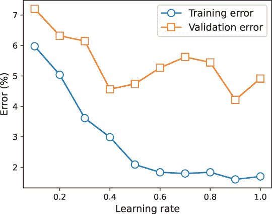

图 5.18 LightGBM 在乳腺癌数据集的 10 折中的平均训练和验证误差

出乎意料的是，随着学习率的增加，训练误差持续下降，这表明模型首先拟合，然后开始过度拟合训练数据。验证误差没有显示出相同的趋势。它最初下降，然后上升；学习率为 0.4 产生了最低的验证误差。这就是最佳的学习率选择。

LightGBM 的交叉验证

LightGBM 提供了通过名为 cv 的函数执行具有给定参数选择的交叉验证的功能，如下面的列表所示。

列表 5.5 LightGBM 的交叉验证

```
from lightgbm import cv, Dataset

trn_data = Dataset(Xtrn, label=ytrn)            ❶
params = {'boosting_type': 'gbdt', 'objective': 'cross_entropy',
          'learning_rate': 0.25,                ❷
          'max_depth': 1}          
cv_results = cv(params, trn_data, 
                num_boost_round=100,
                nfold=5,                        ❸
                stratified=True, shuffle=True)
```

❶ 将数据放入 LightGBM 的“Dataset”对象中

❷ 指定学习参数

❸ 执行 5 折交叉验证，每个折包含 100 个估计器

在列表 5.5 中，我们对 100 个提升轮次进行了 5 折交叉验证（因此最终训练了 100 个基础估计器）。设置 stratified=True 确保我们保留了类别分布，即不同类别在各个折中的比例。设置 shuffle=True 在将数据分割成折之前随机打乱训练数据。

我们可以随着训练的进行来可视化训练目标。在列表 5.5 中，我们通过设置'objective': 'cross_entropy'来优化交叉熵，以训练我们的分类模型。如图 5.19 所示，随着我们将更多的基础估计器添加到我们的顺序集成中，平均 5 折交叉熵目标降低。

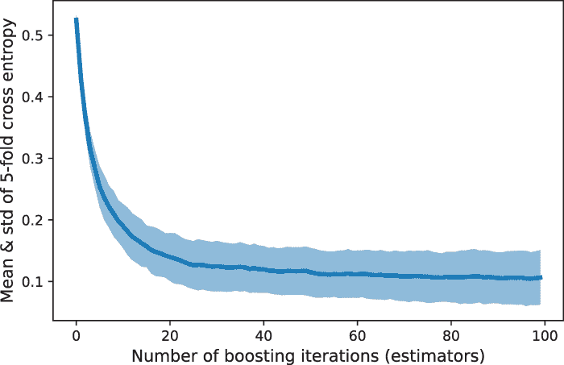

图 5.19 随着迭代次数的增加，跨折平均交叉熵降低，因为我们向集成中添加更多的基础估计器。

### 5.4.2 提前停止

另一种控制过拟合行为的方法是通过提前停止。正如我们在 AdaBoost 中看到的，提前停止的想法非常简单。当我们训练顺序集成时，我们在每次迭代中训练一个基础估计器。这个过程一直持续到我们达到用户指定的集成大小（在 LightGBM 中，有几个别名可以指定这一点：n_estimators、num_trees、num_rounds）。

随着集成中基础估计器数量的增加，集成的复杂性也增加，这最终会导致过拟合。为了避免这种情况，我们采用提前停止；也就是说，我们不在达到集成大小极限之前停止训练模型。我们通过验证集来跟踪过拟合行为。然后，我们训练，直到我们观察到验证性能在预指定的迭代次数内没有改善。

例如，假设我们已经开始训练一个包含 500 个基础估计器的集成，并将提前停止迭代次数设置为 5。这是提前停止的工作原理：在训练过程中，我们密切关注随着集成增长而增长的验证错误，当验证错误在五个迭代窗口或提前停止轮次内没有改善时，我们终止训练。

在 LightGBM 中，如果我们为参数 early_stopping_rounds 指定一个值，我们可以实现提前停止。只要整体验证分数（例如，准确率）在最后的 early_stopping_rounds 内有所改善，LightGBM 将继续训练。然而，如果在 early_stopping_rounds 之后分数没有改善，LightGBM 将终止。

与 AdaBoost 一样，LightGBM 也需要我们明确指定验证集以及提前停止的评分指标。在列表 5.6 中，我们使用接收器操作特征曲线下的面积（AUC）作为评分指标来确定提前停止。

AUC 是分类问题的重要评估指标，可以解释为模型将随机选择的正例排名高于随机选择的负例的概率。因此，较高的 AUC 值更受欢迎，因为这表明模型更具区分性。

列表 5.6 LightGBM 中的提前停止

```
from sklearn.model_selection import train_test_split
Xtrn, Xval, ytrn, yval = train_test_split(
                             X, y, test_size=0.2,               ❶
                             shuffle=True, random_state=42)

gbm = LGBMClassifier(boosting_type='gbdt', n_estimators=50, 
                     max_depth=1, early_stopping=5)             ❷

gbm.fit(Xtrn, ytrn, 
        eval_set=[(Xval, yval)], eval_metric='auc')             ❸
```

❶ 将数据分为训练集和验证集

❷ 在经过五轮后，如果验证分数没有变化则执行提前停止

❸ 使用 AUC 作为提前停止的验证评分指标

让我们看看 LightGBM 产生的输出。在列表 5.6 中，我们设置了 n_estimators=50，这意味着每次迭代都会添加一个基础估计器：

```
Training until validation scores don't improve for 5 rounds
[1]  valid_0's auc: 0.885522      valid_0's binary_logloss: 0.602321
[2]  valid_0's auc: 0.961022      valid_0's binary_logloss: 0.542925
...
[27] valid_0's auc: 0.996069      valid_0's binary_logloss: 0.156152
[28] valid_0's auc: 0.996069      valid_0's binary_logloss: 0.153942
[29] valid_0's auc: 0.996069      valid_0's binary_logloss: 0.15031
[30] valid_0's auc: 0.996069      valid_0's binary_logloss: 0.145113
[31] valid_0's auc: 0.995742      valid_0's binary_logloss: 0.143901
[32] valid_0's auc: 0.996069      valid_0's binary_logloss: 0.139801
Early stopping, best iteration is:
[27] valid_0's auc: 0.996069      valid_0's binary_logloss: 0.156152
```

首先，观察训练在 32 次迭代后终止，这意味着 LightGBM 确实在训练完整的 50 个基础估计器之前就终止了。接下来，注意最佳迭代是第 27 次，得分为 0.996069（在这种情况下，是 AUC）。

在接下来的 5（early_stopping_rounds）次迭代中，从 28 到 32，LightGBM 观察到添加额外的估计器并没有显著提高验证分数。这触发了提前停止标准，导致 LightGBM 终止，并返回一个包含 32 个基础估计器的集成。

注意：在 LightGBM 的输出中，它报告了两个指标：AUC，我们指定为评估指标，以及二进制逻辑损失，这是其默认评估指标。由于我们针对 AUC 指定了提前停止，即使二进制逻辑损失持续下降，算法也会终止。换句话说，如果我们使用二进制逻辑损失作为评估指标，提前停止不会这么早终止，而会继续进行。在实际情况下，此类指标通常取决于任务，并且应仔细选择，考虑到下游应用。

我们还可视化了不同 early_stopping_rounds 选择下的训练和验证误差以及集成大小。

early_stopping_rounds 的值较小会使 LightGBM 非常“不耐烦”和“激进”，因为它不会等待太久，看看在停止学习之前是否有任何改进。这会导致欠拟合；例如，在图 5.20 中，将 early_stopping_rounds 设置为 1 会导致只有五个基础估计器的集成，几乎不足以正确地拟合训练数据！

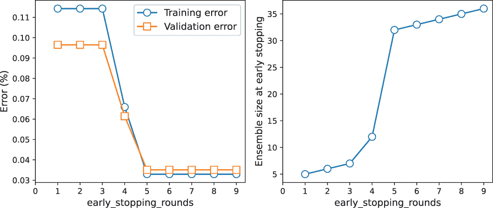

图 5.20 左：不同 early_stopping_rounds 值下的训练和验证误差。右：不同 early_stopping_rounds 值下的集成大小。

early_stopping_rounds 的值较大会使 LightGBM 过于“被动”，它会等待更长的时间，看看是否有任何改进。early_stopping_rounds 的选择最终取决于你的问题：它有多大，你的性能指标是什么，以及你愿意容忍的模型复杂性。

### 5.4.3 自定义损失函数

记住，梯度提升法最强大的特性之一是它适用于广泛的损失函数。这意味着我们也可以设计自己的、针对特定问题的损失函数来处理我们数据集和任务的特定属性。也许我们的数据集是不平衡的，这意味着不同的类别有不同的数据量。在这种情况下，我们可能需要高召回率（例如，在医疗诊断中更少的误判）或高精确度（例如，在垃圾邮件检测中更少的误判）。在许多这样的场景中，通常需要设计我们自己的针对特定问题的损失函数。

注意：有关精确度、召回率等评估指标以及回归和排名等其他机器学习任务的指标等更多详细信息，请参阅 Alice Zheng 所著的《评估机器学习模型》（O’Reilly，2015 年）。

在梯度提升法中，特别是 LightGBM 中，一旦我们有一个损失函数，我们就可以快速训练和评估针对我们问题的模型。在本节中，我们将探讨如何使用 LightGBM 来实现一个名为 *焦点损失* 的自定义损失函数。

焦点损失

焦点损失是为了密集目标检测或图像中大量密集排列的窗口中的目标检测问题而引入的。最终，这样的目标检测任务归结为前景与背景的分类问题，由于通常背景窗口比感兴趣的前景对象多得多，因此这个问题高度不平衡。

焦点损失通常是为具有此类类别不平衡的分类问题设计的，并且非常适合这些问题。它是对经典交叉熵损失的修改，它更关注难以分类的示例，而忽略容易分类的示例。

更正式地说，记住，真实标签和预测标签之间的标准交叉熵损失可以计算如下：

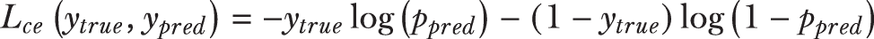

其中 *p*[pred] 是预测类别 1 的概率，即 prob(*y*[pred] = 1) = *p*[pred]。请注意，对于二元分类问题，由于唯一的其他标签是 0，负预测的概率将是 prob(*y*[pred] = 0) = 1 - *p*[pred]。

焦点损失在交叉熵损失的每一项中引入了一个 *调节因子*：

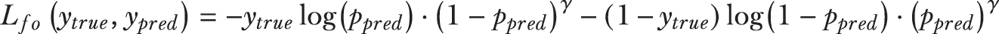

调节因子会抑制分类良好的示例的贡献，迫使学习算法专注于分类不良的示例。这种关注的程度由一个用户可控制的参数 *γ* > 0 决定。为了了解调节是如何工作的，让我们比较 *γ* = 2 时的交叉熵损失与焦点损失：

+   *分类良好的示例*——假设真实标签是 *y*[true] = 1，具有高预测标签概率 *p*[pred] = 0.95。交叉熵损失是 *L*[ce] = -1 ⋅ log0.95 - 0 ⋅ log0.05 = 0.0513，而焦点损失是 *L*[fo] = -1 ⋅ log0.95 ⋅ 0.05² - 0 ⋅ log0.05 ⋅ 0.95² = 0.0001。因此，焦点损失中的调制因子会降低高置信度分类的损失。

+   *分类不良的示例*——假设真实标签是 *y*[true] = 1，具有低预测标签概率 *p*[pred] = 0.05。交叉熵损失是 *L*[ce] = -1 ⋅ log0.05 - 0 ⋅ log0.95 = 2.9957，而焦点损失是 *L*[fo] = -1 ⋅ log0.05 ⋅ 0.95² - 0 ⋅ log0.95 ⋅ 0.05² = 2.7036。调制因子对这一示例的影响远小于低置信度分类。

这种效果可以在图 5.21 中看到，其中绘制了不同 γ 值的焦点损失。对于更大的 γ 值，分类良好的示例（*y* = 1 的概率高）具有更低的损失，而分类不良的示例具有更高的损失。

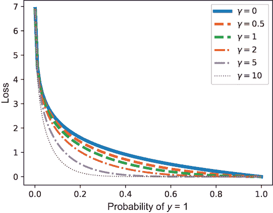

图 5.21 对于不同的 *γ* 值，可视化焦点损失。当 *γ* = 0 时，恢复原始交叉熵损失。随着 *γ* 的增加，对应于分类良好的示例的曲线部分变得更长，反映了损失函数对不良分类的关注。

带焦点损失的梯度提升

要使用焦点损失来训练梯度提升决策树（GBDT），我们必须向 LightGBM 提供两个函数：

+   实际的损失函数本身，它将在学习过程中的函数评估和评分中使用

+   损失函数的第一导数（梯度）和第二导数（海森矩阵），这些将被用于学习构成基础估计树

LightGBM 使用海森矩阵信息在叶节点进行学习。目前，我们可以暂时忽略这个细节，因为下一章我们将重新讨论它。

列表 5.7 展示了如何定义自定义损失函数。focal_loss 函数是损失本身，实现方式与本节开头定义的完全一致。focal_loss_metric 函数将 focal_loss 转换为 LightGBM 使用的评分指标。

focal_loss_objective 函数返回损失函数的梯度和海森矩阵，供 LightGBM 在树学习中使用。这个函数很不直观地带有“objective”后缀，以与 LightGBM 的用法保持一致，这一点很快就会变得明显。

列表 5.7 定义自定义损失函数

```
from scipy.misc import derivative

def focal_loss(ytrue, ypred, gamma=2.0):                     ❶
    p = 1 / (1 + np.exp(-ypred))
    loss = -(1 - ytrue) * p**gamma * np.log(1 - p) - \
           ytrue * (1 - p)**gamma * np.log(p)
    return loss

def focal_loss_metric(ytrue, ypred):                         ❷
    return 'focal_loss_metric', np.mean(focal_loss(ytrue, ypred)), False

def focal_loss_objective(ytrue, ypred):
    func = lambda z: focal_loss(ytrue, z)
    grad = derivative(func, ypred, n=1, dx=1e-6)           ❸
    hess = derivative(func, ypred, n=2, dx=1e-6)           ❸
    return grad, hess
```

❶ 定义焦点损失函数

❷ 返回 LightGBM 兼容评分指标的包装函数

❸ 自动微分计算梯度和海森矩阵导数

必须注意确保损失函数、指标和目标都是向量兼容的；也就是说，它们可以接受类似数组的对象 ytrue 和 ypred 作为输入。在列表 5.7 中，我们使用了 scipy 的导数功能来近似一阶和二阶导数。对于某些损失函数，也有可能通过解析推导并实现一阶和二阶导数。一旦我们定义了我们的自定义损失函数，就可以直接与 LightGBM 一起使用：

```
gbm_focal_loss = \
    LGBMClassifier(
        objective=focal_loss_objective,                   ❶
        learning_rate=0.25, n_estimators=20,
        max_depth=1)
gbm_focal_loss.fit(Xtrn, ytrn, 
                   eval_set=[(Xval, yval)], 
                   eval_metric=focal_loss_metric)         ❷

from scipy.special import expit                           ❸
probs = expit(gbm_focal_loss.predict(Xval, 
                                     raw_score=True))     ❹
ypred = (probs > 0.5).astype(float)                       ❺

accuracy_score(yval, ypred)
0.9649122807017544
```

❶ 设置目标以确保 LightGBM 使用焦点损失的梯度进行学习

❷ 设置指标以确保 LightGBM 使用焦点损失进行评估

❸ 从“scipy”导入 sigmoid 函数

❹ 获取原始分数，然后使用 sigmoid 函数计算类别=1 的概率

❺ 将预测转换为 0/1 标签，其中如果概率 > 0.5，则预测类别=1，否则类别=0

带有焦点损失的 GBDT 在乳腺癌数据集上实现了 96.5% 的验证分数。

## 5.5 案例研究：文档检索

文档检索是从数据库中检索文档以匹配用户查询的任务。例如，一家律师事务所的律师助理可能需要从法律档案中搜索有关先前案例的信息，以建立先例和研究案例法。或者，也许研究生在特定领域的文献综述过程中需要从期刊数据库中搜索文章。你可能也见过许多网站上有一个名为“相关文章”的功能，列出可能与当前阅读的文章相关的文章。在广泛的领域中，有许多这样的文档检索用例，其中用户搜索特定术语，系统必须返回与搜索相关的文档列表。

这个具有挑战性的问题有两个关键组成部分：首先，找到与用户查询匹配的文档，其次，根据对用户的某种相关性概念对文档进行排序。在本案例研究中，问题被设定为一个三分类问题，即根据查询-文档对识别相关性排名/类别（最不相关、中等相关或高度相关）。我们将探讨不同 LightGBM 分类器在此任务上的性能。

### 5.5.1 LETOR 数据集

我们将用于本案例研究的数据集称为 LEarning TO Rank (LETOR) v4.0，它本身是由一个名为 GOV2 的大型网页语料库创建的。GOV2 数据集 ([`mng.bz/41aD`](http://mng.bz/41aD)) 是从 .gov 域提取的大约 2500 万个网页的集合。

LETOR 4.0 数据集 ([`mng.bz/Q8DR`](http://mng.bz/Q8DR)) 是从 GOV2 语料库派生出来的，并由微软研究院免费提供。该集合包含几个数据集，我们将使用最初为 2008 年文本检索会议 (TREC) 的百万查询赛道开发的数据集，具体为 MQ2008.rar。

MQ2008 数据集中的每个训练示例对应一个查询-文档*对*。数据本身是 LIBSVM 格式，本节展示了几个示例。数据集中的每一行都是一个标记的训练示例，格式如下：

```
<relevance label> qid:<query id> 1:<feature 1 value> 2:<feature 2 value>
3:<feature 3 value> ... 46:<feature 46 value> # meta-information
```

每个示例都有 46 个特征，这些特征是从查询-文档对中提取的，还有一个相关性标签。特征包括以下内容：

+   从正文、锚点、标题和 URL 中提取的低级内容特征。这些包括在文本挖掘中常用的特征，如词频、逆文档频率、文档长度以及各种组合。

+   从正文、锚点和标题中提取的高级内容特征。这些特征使用两个著名的检索系统提取：Okapi BM25 和用于信息检索的语言模型方法（LMIR）。

+   从超链接中提取的超链接特征，使用了几种工具，如 Google PageRank 及其变体。

+   包含内容和超链接信息的混合特征。

每个查询-文档示例的标签是一个相关性排名，有三个独特的值：0（最不相关）、1（中等相关）和 2（高度相关）。在我们的案例研究中，这些被视为类别标签，这使得这是一个三分类问题的实例。以下是一些数据示例：

```
0 qid:10032 1:0.130742 2:0.000000 3:0.333333 4:0.000000 5:0.134276 ...
45:0.750000 46:1.000000 
#docid = GX140-98-13566007 inc = 1 prob = 0.0701303

1 qid:10032 1:0.593640 2:1.000000 3:0.000000 4:0.000000 5:0.600707 ...
45:0.500000 46:0.000000 
#docid = GX256-43-0740276 inc = 0.0136292023050293 prob = 0.400738

2 qid:10032 1:0.056537 2:0.000000 3:0.666667 4:1.000000 5:0.067138 ...
45:0.000000 46:0.076923 
#docid = GX029-35-5894638 inc = 0.0119881192468859 prob = 0.139842
```

更多详细信息可以在 LETOR 4.0 数据收集提供的文档和参考中找到。我们将用于案例研究的数据集的一部分可在配套的 GitHub 存储库中找到。我们首先加载数据集并将其分为训练集和测试集：

```
from sklearn.datasets import load_svmlight_file
from sklearn.model_selection import train_test_split

query_data_file = './data/ch05/MQ2008/Querylevelnorm.txt'
X, y = load_svmlight_file(query_data_file)

Xtrn, Xtst, ytrn, ytst = train_test_split(X, y, 
                                          test_size=0.2, random_state=42)

print(Xtrn.shape, Xtst.shape)
(12168, 46) (3043, 46)
```

我们现在有一个包含 12,000 个示例的训练集和一个包含 3,000 个示例的测试集。

### 5.5.2 使用 LightGBM 进行文档检索

我们将使用 LightGBM 学习四个模型。这些模型代表了速度和准确度之间的权衡：

+   *随机森林*——我们熟悉的并行同质集成随机决策树。这种方法将作为基线方法。

+   *梯度提升决策树（GBDT）*——这是梯度提升的标准方法，代表了具有良好泛化性能和训练速度的模型之间的平衡。

+   *基于梯度的单侧采样（GOSS）*——这种梯度提升的变体对训练数据进行下采样，非常适合大型数据集；由于下采样，它可能会失去泛化能力，但通常训练速度非常快。

+   *Dropouts meets Multiple Additive Regression Trees* *(DART)*——这种变体结合了深度学习中的 dropout 概念，在反向传播迭代过程中随机且临时地丢弃神经单元以减轻过拟合。同样，DART 在梯度拟合迭代过程中随机且临时地丢弃整体集成中的基础估计器以减轻过拟合。DART 通常是 LightGBM 中所有梯度提升选项中最慢的。

我们将使用以下学习超参数使用这四种方法中的每一种来训练模型。具体来说，注意所有模型都是使用多类逻辑损失进行训练的，这是逻辑回归中使用的二进制逻辑损失函数的推广。early_stopping_rounds 的数量设置为 25：

```
fixed_params = {'early_stopping_rounds': 25, 
                'eval_metric' : 'multi_logloss', 
                'eval_set' : [(Xtst, ytst)],
                'eval_names': ['test set'],
                'verbose': 100}
```

除了这些所有模型都共有的参数之外，我们还需要确定其他模型特有的超参数，例如学习率（用于控制学习速率）或叶节点数量（用于控制基估计器树的复杂度）。这些超参数使用 scikit-learn 的随机交叉验证模块 RandomizedSearchCV 进行选择。具体来说，我们在各种参数选择的网格上执行 5 折交叉验证；然而，与 GridSearchCV 完全评估所有可能的参数组合不同，RandomizedSearchCV 采样更少的模型组合以加快参数选择：

```
num_random_iters = 20
num_cv_folds = 5
```

下面的代码片段用于使用 LightGBM 训练随机森林：

```
from scipy.stats import randint, uniform
from sklearn.model_selection import RandomizedSearchCV
import lightgbm as lgb

rf_params = {'bagging_fraction': [0.4, 0.5, 0.6, 0.7, 0.8],
             'bagging_freq': [5, 6, 7, 8],
             'num_leaves': randint(5, 50)}

ens = lgb.LGBMClassifier(boosting='rf', n_estimators=1000, 
                         max_depth=-1,
                         random_state=42)
cv = RandomizedSearchCV(estimator=ens, 
                        param_distributions=rf_params, 
                        n_iter=num_random_iters, 
                        cv=num_cv_folds, 
                        refit=True,
                        random_state=42, verbose=True)
cv.fit(Xtrn, ytrn, **fixed_params)
```

类似地，LightGBM 也使用 boosting='gbdt'、boosting='goss'和 boosting='dart'进行训练，代码与以下类似：

```
gbdt_params = {'num_leaves': randint(5, 50), 
               'learning_rate': [0.25, 0.5, 1, 2, 4, 8, 16],
               'min_child_samples': randint(100, 500), 
               'min_child_weight': [1e-2, 1e-1, 1, 1e1, 1e2],
               'subsample': uniform(loc=0.2, scale=0.8), 
               'colsample_bytree': uniform(loc=0.4, scale=0.6),
               'reg_alpha': [0, 1e-1, 1, 10, 100],
               'reg_lambda': [0, 1e-1, 1, 10, 100]}

ens = lgb.LGBMClassifier(boosting='gbdt', n_estimators=1000, 
                         max_depth=-1,
                         random_state=42)
cv = RandomizedSearchCV(estimator=ens, 
                        param_distributions=gbdt_params, 
                        n_iter=num_random_iters, 
                        cv=num_cv_folds, 
                        refit=True,
                        random_state=42, verbose=True)

cv.fit(Xtrn, ytrn, **fixed_params)
```

基于交叉验证的学习参数选择过程探索以下参数的几个不同值：

+   num_leaves，限制叶节点的数量，从而限制基估计器复杂度以控制过拟合

+   min_child_samples 和 min_child_weight，通过大小或 Hessian 值的和限制每个叶节点，以控制过拟合

+   subsample 和 colsample_bytree，分别指定从训练数据中采样训练示例和特征的分数，以加速训练

+   reg_alpha 和 reg_lambda，指定叶节点值的正则化程度，以控制过拟合

+   top_rate 和其他 _rate，GOSS（特别是）的采样率

+   drop_rate，DART（特别是）的 dropout 率

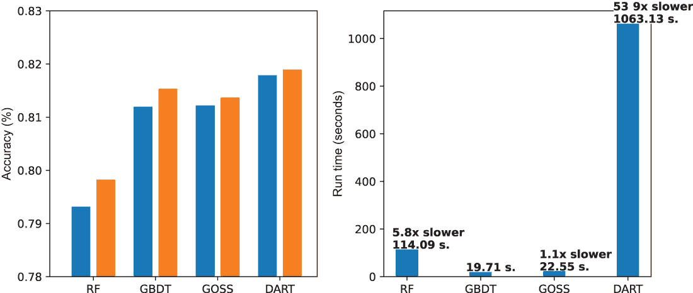

图 5.22 使用 LightGBM 训练的所有算法。左：比较随机森林、GBDT、GOSS 和 DART 的测试集准确率；右：比较随机森林、GBDT、GOSS 和 DART 的整体训练时间。GBDT 以 19.71 秒的速度最快，其他方法如所示，比 GBDT 慢。

对于这些方法中的每一个，我们感兴趣的是查看两个性能指标：测试集准确率和整体模型开发时间，这包括参数选择和训练时间。这些在图 5.22 中显示。关键要点如下：

+   GOSS 和 GBDT 的表现相似，包括整体建模时间。这种差异将在数据集越来越大时变得更加明显，特别是那些有数十万个训练示例的数据集。

+   DART 实现了最佳性能。然而，这代价是显著增加的训练时间。例如，DART 的运行时间接近 20 分钟，而随机森林为 3 分钟，GBDT 和 GOSS 不到 30 秒。

+   注意，LightGBM 支持多 CPU 以及 GPU 处理，这可能会显著提高运行时间。

## 摘要

+   梯度下降通常用于最小化损失函数以训练机器学习模型。

+   残差，即真实标签与模型预测之间的误差，可以用来描述正确分类和错误分类的训练示例。这与 AdaBoost 使用权重的方式类似。

+   梯度提升结合了梯度下降和提升来学习一个弱学习者的顺序集成。

+   梯度提升中的弱学习器是训练在训练示例残差上的回归树，并近似梯度。

+   梯度提升可以应用于分类、回归或排序任务中产生的各种损失函数。

+   基于直方图的树学习在精确性和效率之间进行权衡，使我们能够非常快速地训练梯度提升模型，并扩展到更大的数据集。

+   通过智能地采样训练示例（基于梯度的单侧采样，GOSS）或智能地捆绑特征（独家特征捆绑，EFB），可以进一步加快学习速度。

+   LightGBM 是一个强大的、公开可用的梯度提升框架，它结合了 GOSS 和 EFB。

+   与 AdaBoost 一样，我们可以通过选择有效的学习率或通过提前停止来避免梯度提升中的过拟合。LightGBM 提供了对这两种方法的支持。

+   除了分类、回归和排序的广泛损失函数之外，LightGBM 还提供了支持，以便在训练中结合我们自己的定制、特定问题的损失函数。

* * *

^ (1.) LightGBM 可用于 Python、R 以及许多其他平台。请参阅 LightGBM 安装指南，以获取有关安装的详细说明，请访问 [`mng.bz/v1K1`](http://mng.bz/v1K1)。
