# 6 序列集成：牛顿提升法

本章涵盖

+   使用牛顿下降法优化训练模型的损失函数

+   实现并理解牛顿提升法的工作原理

+   使用正则化损失函数进行学习

+   介绍 XGBoost 作为牛顿提升法强大框架的引入

+   使用 XGBoost 避免过拟合

在前两章中，我们看到了构建序列集成的两种方法：在第四章中，我们介绍了一种新的集成方法，称为自适应提升（AdaBoost），它使用权重来识别最被错误分类的示例。在第五章中，我们介绍了一种另一种集成方法，称为梯度提升，它使用梯度（残差）来识别最被错误分类的示例。这两种提升方法背后的基本直觉是在每次迭代中针对最被错误分类的（本质上，表现最差的）示例来提高分类。 

在本章中，我们介绍了一种第三种提升方法——牛顿提升法，它结合了 AdaBoost 和梯度提升的优点，并使用*加权梯度*（或加权残差）来识别最被错误分类的示例。与梯度提升一样，牛顿提升法的框架可以应用于任何损失函数，这意味着任何分类、回归或排序问题都可以使用弱学习器进行提升。除了这种灵活性之外，如 XGBoost 之类的包现在可以并行化扩展牛顿提升法以处理大数据。不出所料，牛顿提升法目前被许多从业者认为是领先的集成方法。

由于牛顿提升法建立在牛顿下降法的基础上，我们本章首先通过牛顿下降法的示例及其如何用于训练机器学习模型（第 6.1 节）来开启本章。第 6.2 节旨在为使用加权残差进行学习提供直观理解，这是牛顿提升法背后的关键直觉。一如既往，我们实现了自己版本的牛顿提升法，以理解它是如何结合梯度下降和提升法来训练序列集成。

第 6.3 节介绍了 XGBoost，这是一个免费且开源的梯度提升和牛顿提升包，它被广泛用于构建和部署现实世界的机器学习应用。在第 6.4 节中，我们看到如何通过早期停止和调整学习率等策略使用 XGBoost 来避免过拟合。最后，在第 6.5 节中，我们将重新使用第五章中关于文档检索的实例研究，以比较 XGBoost 与 LightGBM、其变体和随机森林的性能。

设计牛顿提升法的起源和动机与梯度提升算法类似：损失函数的优化。梯度提升基于的梯度下降是一种一阶优化方法，它在优化过程中使用一阶导数。

牛顿法，或称牛顿下降法，是一种二阶优化方法，因为它同时使用一阶和二阶导数信息来计算牛顿步。当与提升法结合时，我们得到牛顿提升的集成方法。我们本章首先讨论牛顿法如何激发一种强大且广泛使用的集成方法。

## 6.1 牛顿法求最小值

迭代优化方法，如梯度下降法和牛顿法，在每个迭代步骤中都会进行更新：next = current + (step × direction)。在梯度下降法（图 6.1 左侧）中，仅使用一阶导数信息最多只能构建一个局部线性近似。虽然这给出了下降方向，但不同的步长可以给出截然不同的估计，并可能最终减慢收敛速度。

通过引入二阶导数信息，正如牛顿下降法所做的那样，我们可以构建一个局部二次近似！这个额外信息导致更好的局部近似，从而产生更好的步骤和更快的收敛。

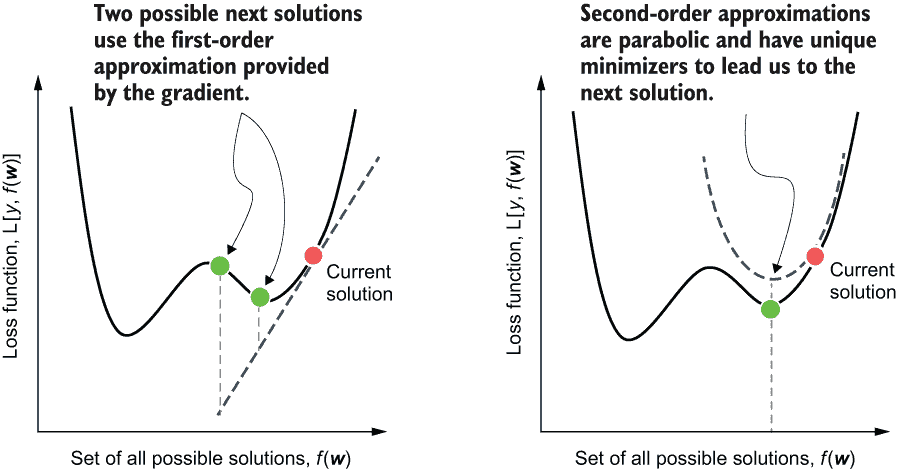

图 6.1 比较梯度下降法（左）和牛顿法（右）。梯度下降法仅使用当前解附近的局部一阶信息，这导致对被优化函数的线性近似。不同的步长将导致不同的下一步。牛顿法使用当前解附近的局部一阶和二阶信息，导致对被优化函数的二次（抛物线）近似。这提供了对下一步的更好估计。

注意：本章中描述的方法，即牛顿优化法，是从一个更一般的根查找方法推导出来的，也称为牛顿法。我们经常使用牛顿下降来指牛顿法求最小值。

更正式地说，梯度下降法计算下一个更新为

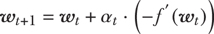

其中 *α*[t] 是步长，(-*f'*(*w*[t])) 是负梯度，即一阶导数的相反数。牛顿法计算下一个更新为

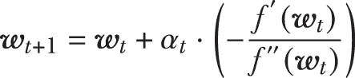

其中 *f''*(*w*[t]) 是二阶导数，步长 *α*[t] 为 1。

注意：与梯度下降法不同，牛顿下降法计算精确的步骤，不需要步长计算。然而，我们将明确包括步长，原因有两个：（1）使我们能够立即比较和理解梯度下降法和牛顿下降法之间的差异；（2）更重要的是，与牛顿下降法不同，牛顿提升法只能近似步骤，并将需要我们指定一个类似于梯度下降法和梯度提升法的步长。正如我们将看到的，牛顿提升法中的这个步长不过是学习率。

二阶导数和海森矩阵

对于一元函数（即，一个变量的函数），二阶导数的计算很简单：我们只需对函数求导两次。例如，对于函数 *f*(*w*) = *x*⁵，其第一导数是 *f*’(*x*) = *∂f*/*∂x* = 5*x*⁴，而第二导数是 *f*’’(*x*) = *∂f*/*∂x∂y* = 20*x*³。

对于多元函数，或者多个变量的函数，二阶导数的计算稍微复杂一些。这是因为我们现在必须考虑相对于变量对的多元函数的求导。

要看到这一点，考虑一个三变量的函数：*f*(*x*,*y*,*z*)。这个函数的梯度很容易计算：我们对每个变量 *x*，*y* 和 *z*（其中 w.r.t. 是“相对于”的意思）求导：

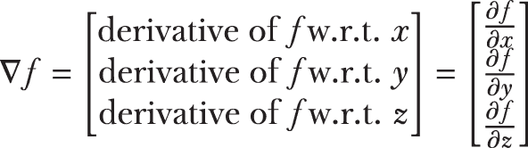

要计算二阶导数，我们必须再次对梯度的每个元素相对于 *x*，*y* 和 *z* 求导。这产生了一个称为 Hessian 的矩阵：

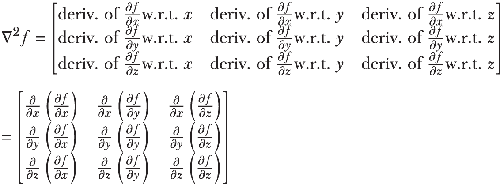

Hessian 是一个对称矩阵，因为求导的顺序不会改变结果，这意味着

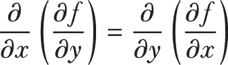

以此类推，对于 *f* 中的所有变量对。在多元情况下，牛顿法的扩展由

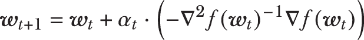

其中 ▽*f*(*w*[t]) 是多元函数 f 的梯度向量，而 -▽²(*w*[t])^(-1) 是 Hessian 矩阵的逆。求逆二阶导数 Hessian 矩阵是相对于除以项 *f''*(*w*[t]) 的多元等价。

对于具有许多变量的大型问题，求逆 Hessian 矩阵可能变得相当计算密集，从而减慢整体优化速度。正如我们将在第 6.2 节中看到的，牛顿加速通过为单个示例计算二阶导数来避免求逆 Hessian，从而绕过这个问题。

现在，让我们继续探讨梯度下降法和牛顿法之间的差异。我们回到第 5.1 节中使用的两个例子：简单的 Branin 函数和平方损失函数。我们将使用这些例子来说明梯度下降法和牛顿下降法之间的差异。

### 6.1.1 牛顿法的一个示例

回想第五章，Branin 函数包含两个变量 (*w*[1] 和 *w*[2])，定义为

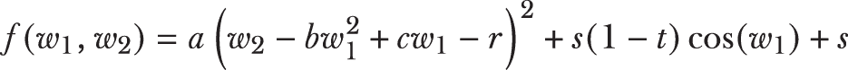

其中 *α* = 1，*b* = 5.1/4*π*²，*c* = 5/*π*，*r* = 6，*s* = 10，*t* = 1/8*π* 是固定的常数。这个函数在图 6.2 中显示，并在椭圆区域的中心有四个最小值点。


图 6.2 Branin 函数的表面图（左）和等高线图（右）。我们可以直观地验证该函数有四个最小值，这些最小值是等高线图中的椭圆区域的中心。

我们将从上一节中的梯度下降实现开始，并对其进行修改以实现牛顿法。有两个关键区别：(1) 我们使用梯度和 Hessian 来计算下降方向，即使用一阶和二阶导数信息；(2) 我们省略了步长的计算，即我们假设步长为 1。修改后的伪代码如下所示：

```
initialize: wold = some initial guess, converged=False
while not converged:
1\. compute the gradient vector g and Hessian matrix H at the current
   estimate, wold
2\. compute the descent direction d = -H-1g 
3\. set step length α = 1
4\. update the solution: c + distance * direction = wold + α ⋅ d
5\. if change between wnew and wold is below some specified tolerance:
   converged=True, so break
6\. wnew = wold, get ready for the next iteration
```

该伪代码中的关键步骤是步骤 1 和 2，其中下降方向是使用逆 Hessian 矩阵（二阶导数）和梯度（一阶导数）计算的。请注意，与梯度下降一样，牛顿的下降方向是取反的。

步骤 3 包括以明确说明，与梯度下降不同，牛顿法不需要计算步长。相反，步长可以预先设置，就像学习率一样。一旦确定了下降方向，步骤 4 就实现了牛顿更新：*w*[*t*+1] = *w*[*t*] + (-▽²*f*(*w*[t])^(-1)▽*f*(*w*[t]))。

在我们计算每个更新后，类似于梯度下降，我们检查收敛性；在这里，我们的收敛性测试是查看 *w*[*t*+1] 和 *w*[t] 之间的距离有多近。如果它们足够接近，我们就终止；如果不，我们继续进行下一次迭代。以下列表实现了牛顿法。

列表 6.1 牛顿下降

```
import numpy as np
def newton_descent(f, g, h,                                   ❶
                   x_init, max_iter=100, args=()):
    converged = False                                         ❷
    n_iter = 0

    x_old, x_new = np.array(x_init), None
    descent_path = np.full((max_iter + 1, 2), fill_value=np.nan)   
    descent_path[n_iter] = x_old

    while not converged:
        n_iter += 1

        gradient = g(x_old, *args)                            ❸
        hessian = h(x_old, *args)                             ❸

        direction = -np.dot(np.linalg.inv(hessian),           ❹
                            gradient)                         ❹

        distance = 1                                          ❺
        x_new = x_old + distance * direction                  ❻
        descent_path[n_iter] = x_new

        err = np.linalg.norm(x_new - x_old)                   ❼
        if err <= 1e-3 or n_iter >= max_iter:                      
            converged = True                                  ❽

        x_old = x_new                                         ❾

    return x_new, descent_path 
```

❶ 牛顿下降需要一个函数 f，其梯度 g 和其 Hessian h。

❷ 初始化牛顿下降为未收敛

❸ 计算梯度和 Hessian

❹ 计算牛顿方向

❺ 将步长设置为 1，以简化

❻ 计算更新

❼ 计算与前一次迭代的差异

❽ 如果变化很小或达到最大迭代次数则收敛

❾ 准备下一次迭代

注意，步长被设置为 1，尽管对于牛顿加速，正如我们将看到的，步长将变为学习率。

让我们运行一下我们的牛顿下降实现。我们已经在上一节中实现了 Branin 函数及其梯度。此实现再次显示如下：

```
def branin(w, a, b, c, r, s, t):
    return a * (w[1] - b * w[0] ** 2 + c * w[0] - r) ** 2 + \
           s * (1 - t) * np.cos(w[0]) + s

def branin_gradient(w, a, b, c, r, s, t):
    return np.array([2 * a * (w[1] - b * w[0] ** 2 + c * w[0] - r) * 
                    (-2 * b * w[0] + c) - s * (1 - t) * np.sin(w[0]),
                    2 * a * (w[1] - b * w[0] ** 2 + c * w[0] - r)])
```

我们还需要牛顿下降的 Hessian（二阶导数）矩阵。我们可以通过解析微分梯度（一阶导数）向量来计算它：

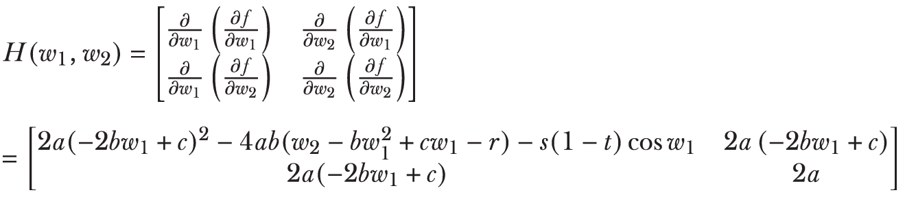

这也可以像下面这样实现：

```
def branin_hessian(w, a, b, c, r, s, t):
    return np.array([[2 * a * (- 2 * b * w[0] + c)** 2 -
                      4 * a * b * (w[1] - b * w[0] ** 2 + c * w[0] - r) - 
                      s * (1 - t) * np.cos(w[0]), 
                      2 * a * (- 2 * b * w[0] + c)],
                     [2 * a * (- 2 * b * w[0] + c), 
                     2 * a]])
```

与梯度下降一样，牛顿下降（参见表格 6.1）也需要一个初始猜测 x_init。在这里，我们将梯度下降初始化为 *w*[init] = [2,-5]'. 现在，我们可以调用牛顿下降过程：

```
a, b, c, r, s, t = 1, 5.1/(4 * np.pi**2), 5/np.pi, 6, 10, 1/(8 * np.pi)
w_init = np.array([2, -5])
w_optimal, w_newton_path = newton_descent(branin, branin_gradient,
                                          branin_hessian, 
                                          w_init, args=(a, b, c, r, s, t))
```

牛顿下降返回一个最优解 w_optimal（即[3.142, 2.275]')和解决方案路径 w_path。那么牛顿下降与梯度下降相比如何呢？在图 6.3 中，我们同时绘制了两种优化算法的解决方案路径。

这种比较的结果非常引人注目：牛顿下降能够利用 Hessian 矩阵提供的关于函数曲率的额外局部信息，以更直接的方式到达解。相比之下，梯度下降只有一阶梯度信息可以工作，并采取迂回的路径到达相同的解。

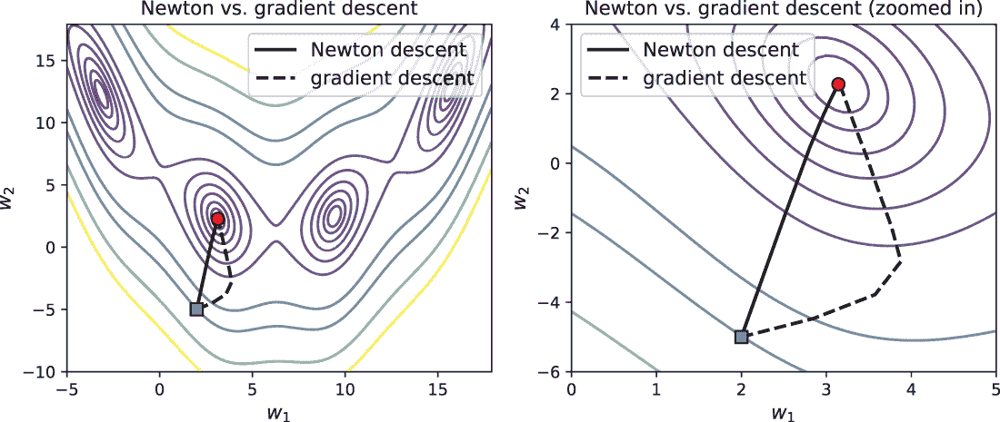

图 6.3 我们比较了从[2,-5]（正方形）开始的牛顿下降和梯度下降的解决方案路径，它们都收敛到局部最小值之一（圆形）。与梯度下降（虚线）相比，牛顿下降（实线）以更直接的方式向局部最小值前进。这是因为牛顿下降在每个更新中使用更具有信息量的二阶局部近似，而梯度下降只使用一阶局部近似。

牛顿下降的性质

我们注意到关于牛顿下降及其与梯度下降相似性的几个重要事项。首先，与梯度下降不同，牛顿法精确地计算下降步长，不需要步长。记住，我们的目的是将牛顿下降扩展到牛顿提升。从这个角度来看，步长可以解释为学习率。

选择一个有效的学习率（例如，像我们在 AdaBoost 或梯度提升中那样使用交叉验证）与选择一个好的步长非常相似。在提升算法中，我们选择学习率来帮助我们避免过拟合，并更好地泛化到测试集和未来的数据，而不是选择学习率来加速收敛。

第二个需要记住的重要点是，像梯度下降一样，牛顿下降也对我们的初始点选择很敏感。不同的初始化会导致牛顿下降收敛到不同的局部最小值。

除了局部最小值之外，更大的问题是我们的初始点选择也可能导致牛顿下降收敛到*鞍点*。这是所有下降算法面临的问题，如图 6.4 所示。

鞍点模仿局部最小值：在两个位置，函数的梯度都变为零。然而，鞍点并不是真正的局部最小值：鞍形状意味着它在某个方向上向上弯曲，在另一个方向上向下弯曲。这与局部最小值形成对比，局部最小值是碗状的。然而，局部最小值和鞍点都具有零梯度。这意味着下降算法无法区分两者，有时会收敛到鞍点而不是最小值。

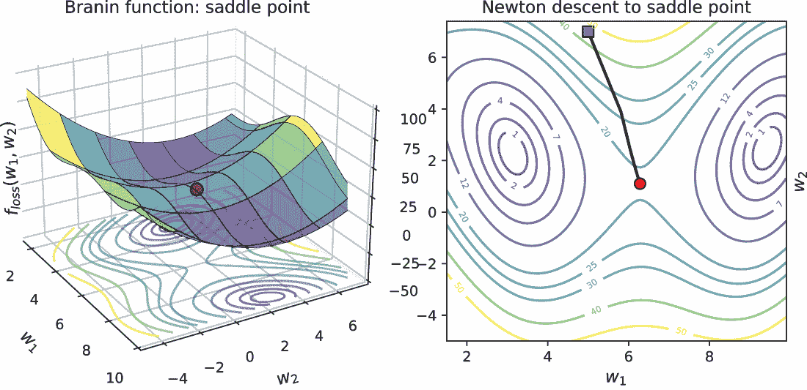

图 6.4 Branin 函数的鞍点位于两个最小化点之间，就像最小化点一样，它在位置处具有零梯度。这导致所有下降方法都收敛到鞍点。

鞍点和局部最小值的存在取决于被优化的函数，当然。对于我们的目的，大多数常见的损失函数都是凸的且“形状良好”，这意味着我们可以安全地使用牛顿下降和牛顿提升。然而，在创建和使用自定义损失函数时，应小心确保凸性。处理这种非凸损失函数是一个活跃且持续的研究领域。

### 6.1.2 牛顿下降在训练损失函数中的应用

那么，牛顿下降在机器学习任务中的表现如何？为了看到这一点，我们可以回顾第五章第 5.1.2 节中的简单 2D 分类问题，我们之前已经使用梯度下降训练了一个模型。这个任务是一个二元分类问题，数据生成方式如下所示：

```
from sklearn.datasets import make_blobs
X, y = make_blobs(n_samples=200, n_features=2, 
                  centers=[[-1.5, -1.5], [1.5, 1.5]])
```

我们在图 6.5 中可视化这个合成数据集。

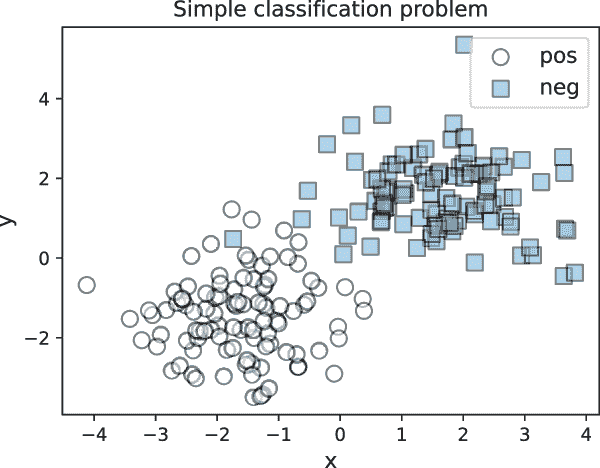

图 6.5 一个（几乎）线性可分的两类数据集，我们将在此数据集上训练分类器。正例的标签 *y* = 1，而负例的标签 *y* = 0。

回想一下，我们想要训练一个线性分类器 *h*w = *w*[1]*x*[1] + *w*[2]*x*[2]。这个分类器接受 2D 数据点 *x* = [*x*[1],*x*[2]]' 并返回一个预测。正如第五章第 5.1.2 节中所述，我们将使用平方损失函数来完成这个任务。

线性分类器由权重 *w* = [*w*[1],*w*[2]]' 参数化。当然，这些权重必须通过学习来最小化数据上的某些损失，以实现最佳的训练拟合。

平方损失衡量了真实标签 *y*[i] 与其对应的预测 *h*w 之间的误差，如下所示：

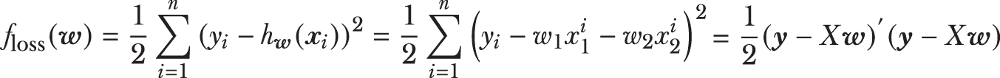

在这里，*X* 是一个 *n* × *d* 的数据矩阵，包含 *n* 个训练示例，每个示例有 *d* 个特征，而 y 是一个 *d* × 1 的真实标签向量。右侧的表达式是使用向量矩阵符号表示整个数据集损失的紧凑方式。

对于牛顿下降，我们需要这个损失函数的梯度和 Hessian。这些可以通过对损失函数进行解析微分获得，就像对 Branin 函数做的那样。在向量矩阵符号中，这些也可以紧凑地写成

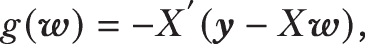


注意，Hessian 是一个 2 × 2 矩阵。损失函数、其梯度以及 Hessian 的实现如下：

```
def squared_loss(w, X, y):
    return 0.5 * np.sum((y - np.dot(X, w))**2)

def squared_loss_gradient(w, X, y):
    return -np.dot(X.T, (y - np.dot(X, w)))

def squared_loss_hessian(w, X, y):
    return np.dot(X.T, X)
```

现在我们已经拥有了损失函数的所有组成部分，我们可以使用牛顿下降法来计算一个最优解，即“学习一个模型”。我们可以将牛顿下降法学习的模型与梯度下降法（我们在第五章中实现的方法）学习的模型进行比较。我们用*w* = [0,0,0.99]初始化梯度下降法和牛顿下降法：

```
w_init = np.array([0.0, -0.99])
w_gradient, path_gradient = gradient_descent(squared_loss,
                                             squared_loss_gradient, 
                                             w_init, args=(X, y))
w_newton, path_newton = newton_descent(squared_loss, 
                                       squared_loss_gradient,
                                       squared_loss_hessian, 
                                       w_init, args=(X, y))
print(w_gradient)
[0.13643511 0.13862275]

print(w_newton)
[0.13528094 0.13884772]
```

我们正在优化的平方损失函数是凸的，并且只有一个最小值。梯度下降法和牛顿下降法本质上学习的是同一个模型，尽管它们在达到阈值 10-3 时就会停止，大约是第三位小数。我们可以很容易地验证这个学习到的模型达到了 99.5%的训练准确率：

```
ypred = (np.dot(X, w_newton) >= 0).astype(int)
from sklearn.metrics import accuracy_score
accuracy_score(y, ypred)
0.995
```

虽然梯度下降法和牛顿下降法学习的是同一个模型，但它们到达那里的方式截然不同，如图 6.6 所示。

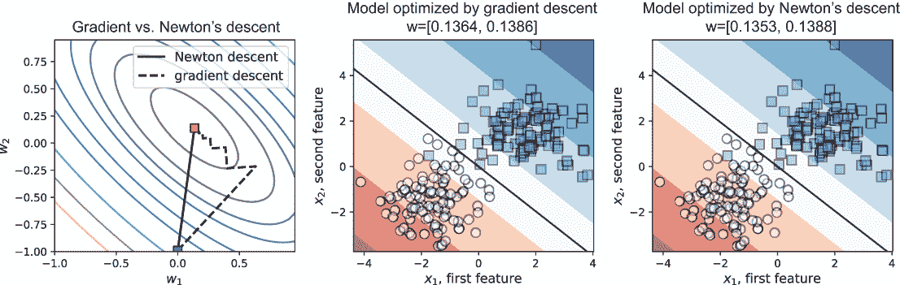

图 6.6 牛顿下降法（实线）与梯度下降法（虚线）的解路径，以及牛顿下降法和梯度下降法产生的模型。梯度下降法需要 20 次迭代来学习这个模型，而牛顿下降法只需要 12 次迭代。

关键要点是牛顿下降法是下降法家族中的一种强大优化方法。因为它在构建下降方向时考虑了局部二阶导数信息（本质上就是曲率），所以它比其他方法更快地收敛到解。

关于优化（或损失）函数形状的额外信息极大地促进了收敛。然而，这也带来了计算成本：随着变量的增加，二阶导数或 Hessian（包含二阶信息）变得越来越难以管理，尤其是当它需要求逆时。

正如我们在下一节中将要看到的，牛顿提升法通过使用带有*点 wise 二阶导数*的近似来避免计算或求逆整个 Hessian 矩阵，这实际上是在每个训练示例上计算和求逆的二阶导数，从而保持训练效率。

## 6.2 牛顿提升法：牛顿法 + 提升法

我们通过获得牛顿提升法与梯度提升法差异的直观理解开始深入研究牛顿提升法。我们将对比这两种方法，以确切了解牛顿提升法为每次迭代添加了什么。

### 6.2.1 直觉：使用加权残差进行学习

与其他提升法一样，牛顿提升法在每次迭代中都学习一个新的弱估计器，以便纠正前一次迭代中犯的错误或错误。AdaBoost 通过给它们分配*权重*来识别和描述需要关注的误分类示例：错误分类严重的示例被分配更高的权重。在这样加权的示例上训练的弱分类器会在学习过程中更加关注它们。

梯度提升通过残差来表征需要关注的误分类示例。残差简单地是衡量误分类程度的一种方法，其计算方式为损失函数的梯度。

牛顿提升既使用加权残差！牛顿提升中的残差计算方式与梯度提升完全相同：使用损失函数的梯度（一阶导数）。另一方面，权重是通过损失函数的 Hessian 矩阵（二阶导数）来计算的。

牛顿提升是牛顿下降 + 提升法

正如我们在第五章中看到的，每次梯度提升迭代都模拟梯度下降。在迭代 *t* 时，梯度下降使用损失函数的梯度（▽*L*(*f*[*t*]) = *g*[*t*])来更新模型 f[t]:

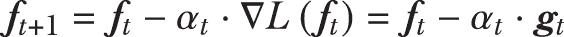

与直接计算整体梯度 g[t] 不同，梯度提升学习在单个梯度（也是残差）上学习一个弱估计器 (*h*[*t*]^(*GB*))。也就是说，弱估计器在数据及其对应的残差 (*x*[*i*] – *g**i*)^(*n*)[*i*=1] 上进行训练。然后，模型按照以下方式更新：

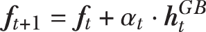

同样地，牛顿提升模拟了牛顿下降。在迭代 *t* 时，牛顿下降使用损失函数的梯度（▽*L*(*f*[*t*]) = *g*[*t*])（与早期的梯度下降完全一样）和损失函数的 Hessian 矩阵（▽²*L*(*f*[*t*]) = *He*[*t*])来更新模型 f[t]:

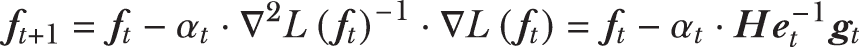

计算 Hessian 矩阵通常可能非常计算量大。牛顿提升通过在单个梯度上学习一个弱估计器来避免计算梯度或 Hessian 的开销。

对于每个训练示例，除了梯度残差外，我们还要结合 Hessian 信息，同时确保我们想要训练的整体弱估计器近似牛顿下降。我们如何做到这一点？

注意到牛顿更新中 Hessian 矩阵被求逆（*He*[*t*]^(-1)）。对于单个训练示例，二阶（函数）导数将是一个标量（一个数字而不是矩阵）。这意味着项 *He*[*t*]^(-1)*g*[*t*] 变成了 (*g**t*)/(*He**t*)；这些是简单的残差 *g*t，由 Hessian 矩阵加权（*g**t*)/(*He**t*）。

因此，对于牛顿提升，我们使用 Hessian 加权的梯度残差（即 (*x*[*i*], -(*g**i*)/(*He**i*))^(*n*)[*i*=1] 来训练一个弱估计器 (*h*[*t*]^(*NB*))，然后，我们可以像梯度提升一样更新我们的集成：

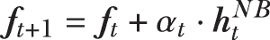

总结来说，牛顿提升使用 Hessian 加权的残差，而梯度提升使用未加权的残差。

汉萨军有什么作用？

那么，这些基于海森矩阵的权重为提升法增加了什么样的额外信息？从数学上讲，海森矩阵或二阶导数对应于曲率或函数的“弯曲程度”。在牛顿提升法中，我们通过每个训练例子*x*[i]的二阶导数信息来加权梯度：

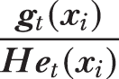

二阶导数*He*t 的大值意味着在*x*[i]处函数的曲率很大。在这些弯曲区域，海森矩阵的权重会降低梯度，这反过来又导致牛顿提升法采取更小、更保守的步骤。

相反，如果二阶导数*He*t 很小，那么在*x*[i]处的曲率就很小，这意味着函数相当平坦。在这种情况下，海森矩阵的权重允许牛顿下降法采取更大、更大胆的步骤，以便更快地穿越平坦区域。

因此，二阶导数与一阶导数残差相结合可以非常有效地捕捉“误分类”的概念。让我们通过一个常用的损失函数——逻辑损失函数来观察这一过程，逻辑损失函数衡量了误分类的程度：

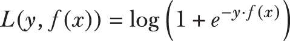

逻辑损失与平方损失函数在图 6.7（左侧）中进行了比较。

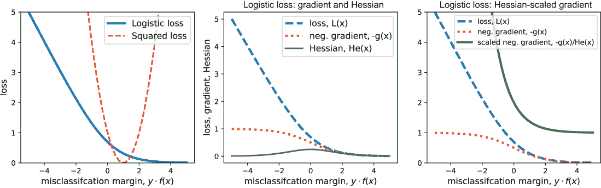

图 6.7 左：逻辑损失与平方损失函数；中：逻辑损失的负梯度及海森矩阵；右：逻辑损失的海森矩阵缩放负梯度

在图 6.7（中央），我们观察逻辑损失函数及其相应的梯度（一阶导数）和海森矩阵（二阶导数）。所有这些都是误分类边界的函数：真实标签（*y*）和预测（*f*(*x*)）的乘积。如果*y*和*f*(*x*)具有相反的符号，那么我们就有*y* ⋅ *f*(*x*) < 0。在这种情况下，真实标签与预测标签不匹配，我们有一个误分类。因此，逻辑损失曲线的左侧部分（具有负边界）对应于误分类的例子，并衡量了误分类的程度。同样，逻辑损失曲线的右侧部分（具有正边界）对应于正确分类的例子，其损失接近 0，正如我们所期望的。

二阶导数在其最高值大约在 0 处，这对应于逻辑损失函数的拐点。这并不令人惊讶，因为我们可以看到逻辑损失函数在拐点附近是最弯曲的，而在拐点的左右两侧则是平坦的。

在图 6.7（右侧），我们可以看到加权梯度的效果。对于正确分类的例子（*y* ⋅ *f*(*x*) > 0），整体梯度和加权梯度都是 0。这意味着这些例子不会参与提升迭代。

另一方面，对于被错误分类的例子（*y* ⋅ *f*(*x*) < 0），整体加权梯度 (*g**i*)/(*He**i*) 会随着错误分类而急剧增加。一般来说，它比未加权的梯度增加得更加陡峭。

现在，我们可以回答 Hessian 的作用问题：它们通过引入局部曲率信息，确保错误分类严重的训练示例获得更高的权重。这如图 6.8 所示。

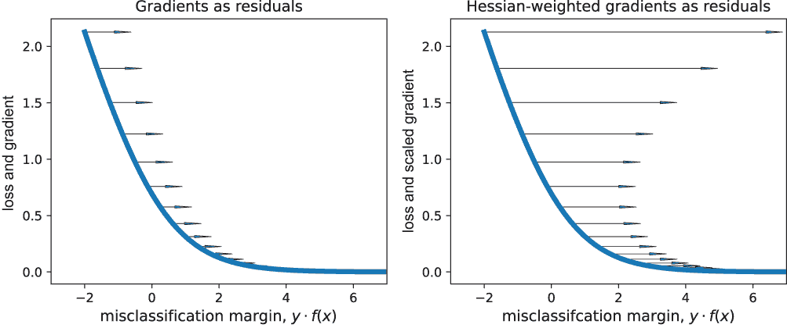

图 6.8 梯度提升法使用的未加权残差（左）与牛顿提升法使用的 Hessian 加权残差（右）的比较。错误分类边缘的正值（*y* ⋅ *f*(*x*) > 0）表示正确分类。对于错误分类，我们有 *y* ⋅ *f*(*x*) < 0。对于错误分类严重的例子，Hessian 加权的梯度比未加权的梯度更有效地捕捉这一概念。

训练示例的错误分类越严重，它在图 6.8 中的位置就越靠左。残差的 Hessian 加权确保了更靠左的训练示例将获得更高的权重。这与梯度提升法形成鲜明对比，因为梯度提升法无法像使用未加权残差那样有效地区分训练示例。

总结来说，牛顿提升旨在使用一阶导数（梯度）信息和二阶导数（Hessian）信息，以确保根据错误分类的程度，错误分类的训练示例得到关注。

### 6.2.2 直觉：使用正则化损失函数进行学习

在继续之前，让我们引入正则化损失函数的概念。正则化损失函数包含一个额外的平滑项和损失函数，使其更加凸形，或像碗一样。

正则化损失函数为学习问题引入了额外的结构，这通常可以稳定并加速由此产生的学习算法。正则化还允许我们控制正在学习的模型复杂度，并提高模型的总体鲁棒性和泛化能力。

实际上，正则化损失函数明确地捕捉了大多数机器学习模型中固有的拟合与复杂度之间的权衡（参见第一章，第 1.3 节）。

正则化损失函数具有以下形式：

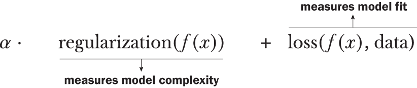

正则化项衡量模型的平坦度（“曲率”的相反面）：它越被最小化，学习到的模型就越简单。

损失项通过损失函数衡量对训练数据的拟合程度：它越被最小化，对训练数据的拟合就越好。正则化参数 α 在这两个相互竞争的目标之间进行权衡（在第 1.3 节中，这种权衡是通过参数 *C* 实现的，它实际上是 *α* 的倒数）：

+   α的较大值意味着模型将更多地关注正则化和简洁性，而较少关注训练误差，这导致模型具有更高的训练误差和欠拟合。

+   α的较小值意味着模型将更多地关注训练误差，并学习更复杂的模型，这导致模型具有更低的训练误差，并可能过拟合。

因此，正则化损失函数使我们能够在学习过程中在拟合和复杂度之间进行权衡，最终导致在实践中具有良好泛化能力的模型。

正如我们在第一章第 1.3 节中看到的，在学习过程中有几种方法可以引入正则化并控制模型复杂度。例如，限制树的最大深度或节点数可以防止树过拟合。

另一种常见的方法是通过 L2 正则化，这相当于直接对模型引入惩罚。也就是说，如果我们有一个模型*f*(*x*)，L2 正则化通过*f*(*x*)²对模型引入惩罚：

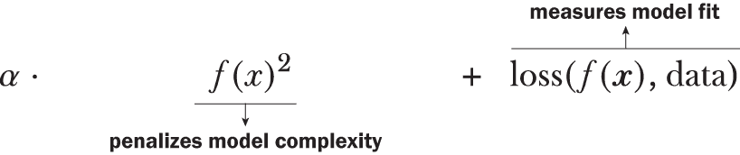

许多常见机器学习方法的损失函数都可以用这种形式表示。在第五章中，我们实现了对**未正则化**的平方损失函数的梯度提升算法，如下所示：

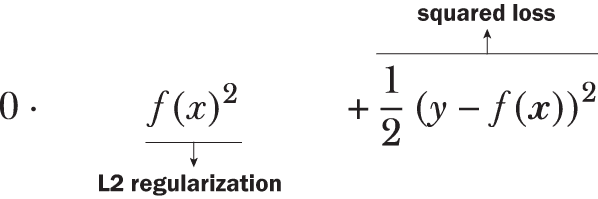

在真实标签*y*和预测标签*f*(*x*)之间。在这个设置中，未正则化的损失函数简单地具有正则化参数α = 0.1。

我们已经看到了一个正则化损失函数的例子（第一章第 1.3.2 节），即支持向量机（SVMs），它们使用正则化截断损失函数：

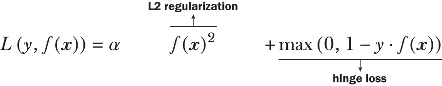

在本章中，我们考虑**正则化逻辑损失**函数，它在逻辑回归中常用，如下所示：

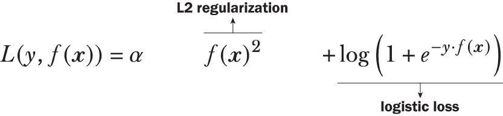

这增加了标准逻辑损失 log(1 + *e*^(-*y*⋅*f*(*x*)))，并引入了一个正则化项α ⋅ *f*(*x*)²。图 6.9 展示了α = 0.1 时的正则化逻辑损失。观察正则化项如何使整体损失函数的轮廓更加弯曲，更像碗形。

正则化参数α在拟合和复杂度之间进行权衡：随着α的增加，正则化效果会增加，使整体表面更加凸起，并忽略损失函数的贡献。因为损失函数影响拟合，过度正则化模型（通过设置高α值）会导致欠拟合。

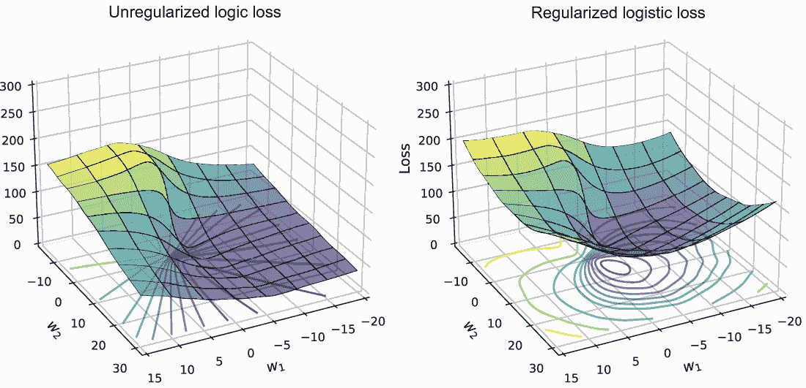

图 6.9 标准逻辑损失函数（左）与正则化逻辑损失函数（右）的比较，后者更弯曲，具有更明确的极小值

正则化逻辑损失函数的梯度和对 Hessian 的计算可以表示为对模型预测(*f*(x))的一阶和二阶导数：

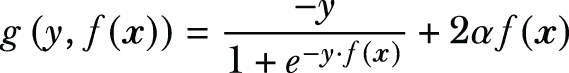

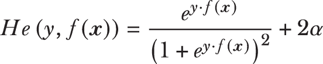

以下列表实现了计算正则化逻辑损失的函数，参数α的值为 0.1。

列表 6.2 正则化逻辑损失、梯度和 Hessian，λ = 0.1

```
def log_loss_func(y, F):
    return np.log(1 + np.exp(-y * F)) + 0.1 * F**2

def log_loss_grad(y, F):
    return -y / (1 + np.exp(y * F)) + 0.2 * F

def log_loss_hess(y, F):
    return np.exp(y * F) / (1 + np.exp(y * F))**2 + 0.2
```

这些函数现在可以用来计算残差和相应的 Hessian 权重，这些是我们将用于牛顿提升所需的。

### 6.2.3 实现牛顿提升

在本节中，我们将开发我们自己的牛顿提升实现。基本算法可以用以下伪代码概述：

```
initialize: F = f0, some constant value
for t = 1 to T:
1\. compute first and second derivatives for each example, 
```


```
2\. compute the weighted residuals for each example *r**t**i* = -(*g**t**i*/*He**t**i*)
3\. fit a weak decision tree regressor ***h***t(***x***) using the training set (*x**i*, *r**t**i*)*n**i*=1
4\. compute the step length (αt) using line search
5\. update the model: *F*t+1 = *F*t + *α*t*h*t(***x***)
```

毫不奇怪，这个训练过程与梯度提升相同，唯一的区别在于步骤 1 和 2 中计算 Hessian 加权的残差。因为梯度和牛顿提升的通用算法框架是相同的，我们可以将它们合并并一起实现。以下列表扩展了列表 5.2 以包含牛顿提升，它使用以下标志仅用于训练：use_Newton=True。

列表 6.3 正则化逻辑损失的牛顿提升

```
from sklearn.tree import DecisionTreeRegressor
from scipy.optimize import minimize_scalar

def fit_gradient_boosting(X, y, n_estimators=10, use_newton=True):
    n_samples, n_features = X.shape                                 ❶
    estimators = []                                                 ❷
    F = np.full((n_samples, ), 0.0)                                 ❸

    for t in range(n_estimators):
        if use_newton:                                              ❹
            residuals = -log_loss_grad(y, F) / log_loss_hess(y, F)
        else:
            residuals = -log_loss_grad(y, F)                        ❺

        h = DecisionTreeRegressor(max_depth=1)
        h.fit(X, residuals)                                         ❻

        hreg = h.predict(X)                                         ❼
        loss = lambda a: \                                          ❽
                   np.linalg.norm(y - (F + a * hreg))**2  
        step = minimize_scalar(
                   loss, method='golden')                           ❾
        a = step.x

        F += a * hreg                                               ❿

        estimators.append((a, h))                                   ⓫

    return estimators
```

❶ 获取数据集的维度

❷ 初始化一个空的集成

❸ 训练集上的集成预测

❹ 如果是牛顿提升，则计算 Hessian 加权的残差

❺ 否则计算梯度提升的无权残差

❻ 将弱回归树(*h*[t])拟合到示例和残差

❼ 获取弱学习者的预测，*h*[t]

❽ 将损失函数设置为线搜索问题

❾ 使用黄金分割搜索找到最佳步长

❿ 更新集成预测

⓫ 更新集成

一旦模型被学习，我们就可以像 AdaBoost 或梯度提升一样进行预测，因为学到的集成是一个顺序集成。以下列表是这些先前介绍的方法使用的相同预测函数，在此重复以方便起见。

列表 6.4 牛顿提升的预测

```
def predict_gradient_boosting(X, estimators):
    pred = np.zeros((X.shape[0], ))            ❶

    for a, h in estimators:
        pred += a * h.predict(X)               ❷

    y = np.sign(pred)                          ❸

    return y
```

❶ 将所有预测初始化为 0

❷ 聚合每个回归器的单个预测

❸ 将加权预测转换为-1/1 标签

让我们比较我们实现的梯度提升（来自上一章）和牛顿提升的性能：

```
from sklearn.datasets import make_moons
X, y = make_moons(n_samples=200, noise=0.15, random_state=13)
y = 2 * y - 1                                                     ❶

from sklearn.model_selection import train_test_split
from sklearn.metrics import accuracy_score

Xtrn, Xtst, ytrn, ytst = \                                        ❷
    train_test_split(X, y, test_size=0.25, random_state=11)

estimators_nb = fit_gradient_boosting(Xtrn, ytrn, n_estimators=25,
                                      use_newton=True)            ❸
ypred_nb = predict_gradient_boosting(Xtst, estimators_nb)
print('Newton boosting test error = {0}'.
              format(1 - accuracy_score(ypred_nb, ytst)))

estimators_gb = fit_gradient_boosting(Xtrn, ytrn, n_estimators=25, 
                                      use_newton=False)           ❹
ypred_gb = predict_gradient_boosting(Xtst, estimators_gb)
print('Gradient boosting test error = {0}'.
              format(1 - accuracy_score(ypred_gb, ytst)))
```

❶ 将训练标签转换为-1/1

❷ 分割为训练集和测试集

❸ 牛顿提升

❹ 梯度提升

我们可以看到，与梯度提升相比，牛顿提升的测试误差约为 8%，而梯度提升达到 12%：

```
Newton boosting test error = 0.07999999999999996
Gradient boosting test error = 0.12
```

可视化梯度提升迭代

现在我们有了我们的联合梯度提升和牛顿提升实现（列表 6.3），我们可以比较这两个算法的行为。首先，注意它们都以大致相同的方式训练和增长它们的集成。它们之间的关键区别在于它们用于集成训练的残差：梯度提升直接使用负梯度作为残差，而牛顿提升使用负 Hessian 加权的梯度。

让我们逐步查看前几次迭代，看看 Hessian 加权的效应。在第一次迭代中，梯度提升和牛顿提升都初始化为*F*(*x*[i]) = 0。

梯度提升和牛顿提升都使用残差作为衡量错误分类程度的手段，以便在当前迭代中，最被错误分类的训练示例能够获得更多关注。在图 6.10 的第一个迭代中，Hessian 加权的效应立即可见。使用二阶导数信息对残差进行加权增加了两个类之间的分离，使得它们更容易被分类。

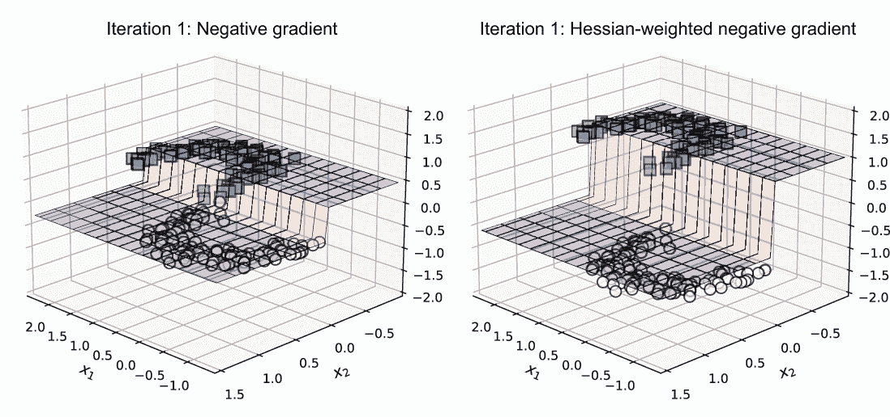

图 6.10 迭代 1：梯度提升中的负梯度（左）作为残差与牛顿提升中的 Hessian 加权的负梯度（右）作为残差

这种行为也可以在第二次（图 6.11）和第三次（图 6.12）迭代中看到，其中 Hessian 加权使得错误分类的分层更加明显，使得弱学习算法能够构建更有效的弱学习器。

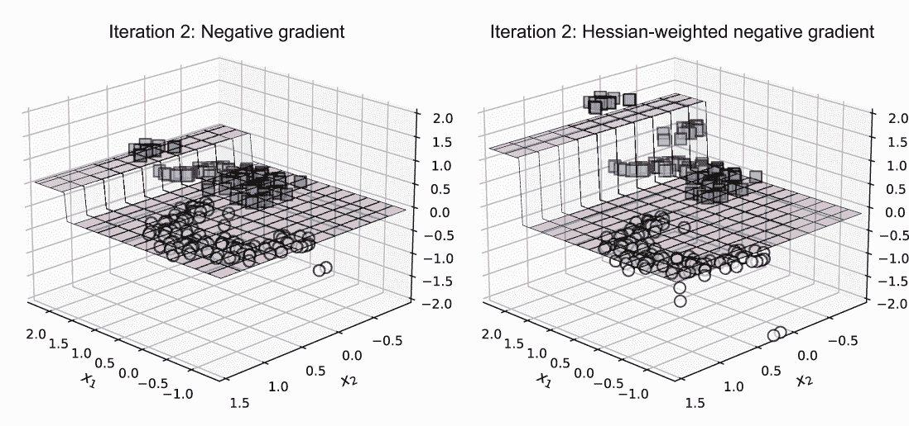

图 6.11 迭代 2：梯度提升中的负梯度（左）作为残差与牛顿提升中的 Hessian 加权的负梯度（右）作为残差

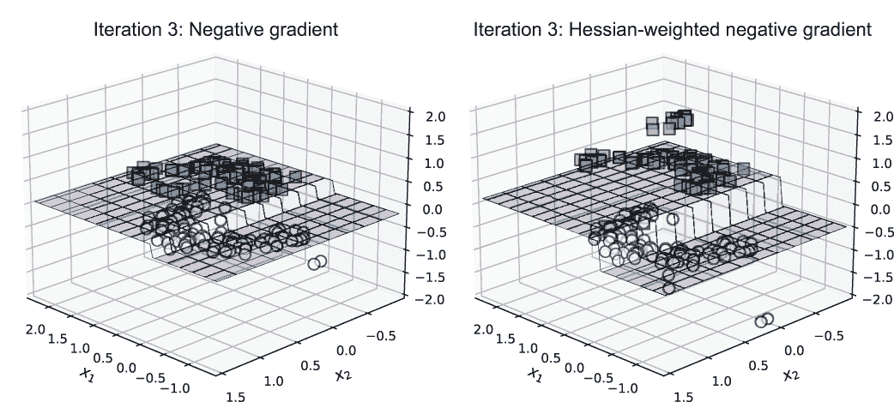

图 6.12 迭代 3：梯度提升中的负梯度（左）作为残差与牛顿提升中的 Hessian 加权的负梯度（右）作为残差

总结来说，牛顿提升旨在同时使用一阶导数（梯度）信息和二阶导数（Hessian）信息，以确保被错误分类的训练示例根据错误分类的程度获得更多关注。图 6.12 展示了牛顿提升如何在连续迭代中逐步增长集成并降低误差。

我们可以在图 6.13 中观察到牛顿提升分类器在许多迭代中的进展，随着越来越多的基估计器被添加到集成中。

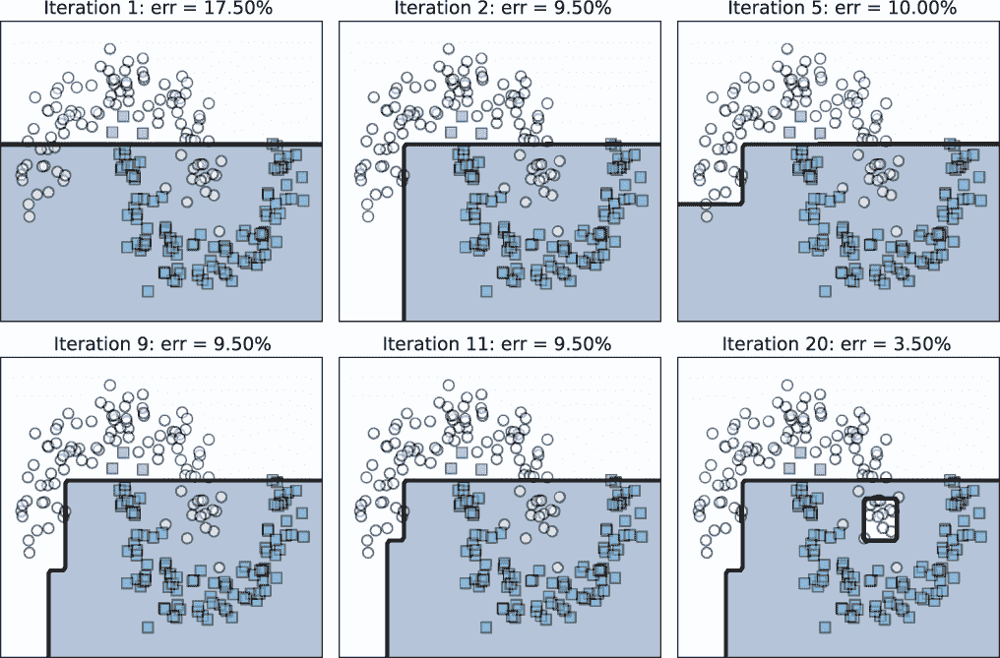

图 6.13 Newton boosting 经过 20 次迭代

## 6.3 XGBoost：牛顿提升框架

XGBoost，或极端梯度提升，是一个开源的梯度提升框架（起源于陈天奇的研究项目）。它在希格斯玻色子机器学习挑战赛中的成功之后，在数据科学竞赛社区中获得了广泛的认可和采用。

XGBoost 已经发展成为一个功能强大的提升框架，它提供了并行化和分布式处理能力，使其能够扩展到非常大的数据集。今天，XGBoost 可用在多种语言中，包括 Python、R 和 C/C++，并且部署在多个数据科学平台，如 Apache Spark 和 H2O。

XGBoost 具有几个关键特性，使其适用于各种领域以及大规模数据：

+   在正则化损失函数上使用牛顿提升来直接控制构成集成（6.3.1 节）的回归树函数（弱学习器）的复杂性

+   算法加速，如加权分位数草图，这是基于直方图分割查找算法（LightGBM 使用的）的一种变体，用于更快地训练（6.3.1 节）

+   支持大量用于分类、回归和排序的损失函数，以及类似 LightGBM 的应用特定自定义损失函数

+   基于块的系统设计，将数据存储在内存中称为块的小单元中；这允许并行学习、更好的缓存和有效的多线程（这些细节超出了本书的范围）

由于在这个有限的空间中无法详细说明 XGBoost 的所有功能，本节和下一节将介绍 XGBoost、其实际应用中的使用和应用程序。这将使您能够通过其文档进一步深入到 XGBoost 的高级用例。

### 6.3.1 XGBoost“极端”的原因是什么？

简而言之，XGBoost 之所以极端，是因为它使用了正则化损失函数的牛顿提升、高效的树学习以及可并行化的实现。特别是，XGBoost 的成功在于其提升实现中的概念和算法改进，这些改进是专门针对基于树的学习的。在本节中，我们将重点关注 XGBoost 如何高效地提高基于树的集成模型的鲁棒性和泛化能力。

用于学习的正则化损失函数

在 6.2.2 节中，我们看到了几个以下形式的 L2 正则化损失函数的例子：

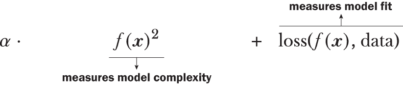

如果我们只考虑我们的集成中弱模型的基于树的学习者，还有其他方法可以直接在训练期间控制树的复杂性。XGBoost 通过引入另一个正则化项来限制叶子节点的数量来实现这一点：

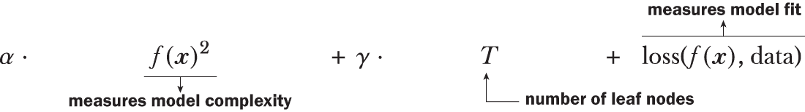

这是如何控制树的复杂性的？通过限制叶子节点的数量，这个附加项将迫使树学习训练更浅的树，这反过来又使得树变得更弱和更简单。

XGBoost 以多种方式使用这个正则化目标函数。例如，在树学习期间，XGBoost 不是使用 Gini 标准或熵等评分函数来寻找分割，而是使用之前描述的正则化学习目标。因此，这个标准用于确定单个树的结构，这些树是集成中的弱学习器。

XGBoost 也使用这个目标函数来计算叶子节点的值，这些值本质上就是梯度提升法聚合的回归值。因此，这个标准也被用来确定单个树的*参数*。

在我们继续之前的一个重要注意事项：额外的正则化项允许直接控制模型复杂度和下游泛化。然而，这也有代价，我们现在有一个额外的参数 γ 需要关注。由于 γ 是用户定义的参数，我们必须设置此值，以及 α 和许多其他参数。这些通常需要通过交叉验证来选择，可能会增加整体模型开发的时间和努力。

基于加权分位数的牛顿提升

即使有正则化的学习目标，最大的计算瓶颈在于将学习扩展到大型数据集，特别是识别用于回归树基估计器学习过程中的最佳分割。

树学习的标准方法会穷举数据中所有可能的分割。正如我们在第五章第 5.2.4 节中看到的，对于大型数据集来说这不是一个好主意。有效的改进，如基于直方图的分割，将数据分箱，从而评估远少于分割的数量。

如 LightGBM 这样的实现进一步集成了改进，例如采样和特征捆绑，以加快树学习。XGBoost 也旨在将其概念引入其实现中。然而，XGBoost 有一个独特的考虑因素。例如，LightGBM 实现了梯度提升，而 XGBoost 实现了牛顿提升。这意味着 XGBoost 的树学习必须考虑 Hessian 权重的训练示例，而 LightGBM 中所有示例都是等权重的！

XGBoost 的近似分割查找算法，*加权分位数草图*，旨在使用特征中的分位数来找到理想的分割点。这与基于直方图的分割类似，后者使用梯度提升算法使用的桶。

加权分位数草图及其实现的细节相当多，由于空间有限，这里无法全部涵盖。然而，以下是我们的一些关键要点：

+   从概念上讲，XGBoost 也使用近似分割查找算法；这些算法考虑了牛顿提升特有的额外信息（例如，Hessian 权重）。最终，它们与基于直方图的算法类似，旨在对数据进行分箱。与将数据分入均匀大小分箱的其他基于直方图的算法不同，XGBoost 将数据分入特征相关的桶中。最终，XGBoost 通过采用巧妙的分割查找策略，以效率为代价来权衡精确度。

+   从实现的角度来看，XGBoost 在内存和磁盘上对数据进行预排序和组织。一旦完成，XGBoost 通过缓存访问模式、使用块压缩和数据分块为易于访问的碎片来进一步利用这种组织。这些步骤显著提高了牛顿提升的效率，使其能够扩展到非常大的数据集。

### 6.3.2 XGBoost 的牛顿提升

我们以乳腺癌数据集开始对 XGBoost 的探索，这是我们过去多次用作教学数据集的数据集：

```
from sklearn.datasets import load_breast_cancer
from sklearn.model_selection import train_test_split
X, y = load_breast_cancer(return_X_y=True)
Xtrn, Xtst, ytrn, ytst = train_test_split(X, y, test_size=0.2, 
                                          shuffle=True, random_state=42)
```

注意：XGBoost 适用于 Python、R 和许多平台。有关安装的详细说明，请参阅 XGBoost 安装指南，网址为[`mng.bz/61eZ`](http://mng.bz/61eZ)。

对于 Python 用户，尤其是那些熟悉 scikit-learn 的用户，XGBoost 提供了一个熟悉的接口，该接口设计得看起来和感觉就像 scikit-learn。使用此接口，设置和训练 XGBoost 模型非常容易：

```
from xgboost import XGBClassifier
ens = XGBClassifier(n_estimators=20, max_depth=1,  
                    objective='binary:logistic')
ens.fit(Xtrn, ytrn)
```

我们将损失函数设置为逻辑损失，将迭代次数（每次迭代训练 1 个估计器）设置为 20，并将最大树深度设置为 1。这导致了一个由 20 个决策树（深度为 1 的树）组成的集成。

在测试数据上预测标签和评估模型性能同样简单：

```
from sklearn.metrics import accuracy_score
ypred = ens.predict(Xtst)
accuracy_score(ytst, ypred)
0.9649122807017544
```

或者，我们可以使用 XGBoost 的本地接口，该接口最初是为了读取 LIBSVM 格式的数据而设计的，这种格式非常适合高效地存储包含大量零的稀疏数据。

在 LIBSVM 格式（在第五章第 5.5.1 节的案例研究中介绍）中，数据文件的每一行都包含一个单独的训练示例，表示如下：

```
<label> qid:<example id> 1:<feature 1 value> 2:<feature 2 value> ...
k:<feature k value> ... # other information as comments
```

XGBoost 使用一个名为 DMatrix 的数据对象来将数据和相应的标签组合在一起。DMatrix 对象可以通过直接从文件或其他类似数组的对象中读取数据来创建。在这里，我们创建了两个名为 trn 和 tst 的 DMatrix 对象来表示训练和测试数据矩阵：

```
import xgboost as xgb
trn = xgb.DMatrix(Xtrn, label=ytrn)
tst = xgb.DMatrix(Xtst, label=ytst)
```

我们还使用字典设置训练参数，并使用 trn 和参数训练 XGBoost 模型：

```
params = {'max_depth': 1, 'objective':'binary:logistic'}
ens2 = xgb.train(params, trn, num_boost_round=20)
```

然而，在使用此模型进行预测时必须小心。使用某些损失函数训练的模型将返回预测概率而不是直接预测。逻辑损失函数就是这样一种情况。

这些预测概率可以通过在 0.5 处阈值化转换为二进制分类标签 0/1。也就是说，所有预测概率≥0.5 的测试示例都被分类为类别 1，其余的都被分类为类别 0：

```
ypred_proba = ens2.predict(tst)
ypred = (ypred_proba >= 0.5).astype(int)
accuracy_score(ytst, ypred)
0.9649122807017544
```

最后，XGBoost 支持三种不同的提升方法，可以通过 booster 参数进行设置：

+   booster='gbtree'是默认设置，它通过使用基于树的回归训练的树作为弱学习器实现牛顿提升。

+   booster='gblinear'通过使用线性回归训练的线性函数作为弱学习器实现牛顿提升。

+   booster='dart'使用 Dropouts meet Multiple Additive Regression Trees (DART)训练集成，如第五章第 5.4 节中所述。

我们也可以通过仔细设置训练参数来使用 XGBoost 训练（并行）随机森林集成，以确保训练示例和特征子采样。这通常只在你想使用 XGBoost 的并行和分布式训练架构来显式训练并行集成时才有用。

## 6.4 XGBoost 的实际应用

在本节中，我们描述了如何使用 XGBoost 在实际中训练模型。与 AdaBoost 和梯度提升一样，我们寻求设置学习率（第 6.4.1 节）或采用提前停止（第 6.4.2 节）作为控制过度拟合的手段，如下所示：

+   通过选择一个有效的学习率，我们试图控制模型学习的速率，使其不会快速拟合并过度拟合训练数据。我们可以将其视为一种主动建模方法，其中我们试图确定一个好的训练策略，以便它能够导致一个好的模型。

+   通过实施提前停止，我们试图在观察到模型开始过度拟合时立即停止训练。我们可以将其视为一种反应式建模方法，其中我们考虑在认为我们有一个好模型时立即终止训练。

### 6.4.1 学习率

回想第 6.1 节，步长与学习率类似，是每个弱学习器对整个集成贡献的度量。学习率允许我们更好地控制集成复杂性的增长速度。因此，在实践中确定我们数据集的最佳学习率至关重要，这样我们就可以避免过度拟合，并在训练后很好地泛化。

通过交叉验证确定学习率

如前所述，XGBoost 提供了一个与 scikit-learn 兼容的接口。本小节展示了我们如何结合这两个包的功能，有效地使用交叉验证进行参数选择。虽然我们在这里使用交叉验证来设置学习率，但交叉验证可以用于选择其他学习参数，如最大树深度、叶子节点数，甚至损失函数特定的参数。

我们结合 scikit-learn 的 StratifiedKFold 类将训练数据分成 10 个训练和验证数据集。StratifiedKFold 确保我们保留类别分布，即不同类别在各个数据集中的比例。

首先，我们初始化我们感兴趣探索的学习率：

```
import numpy as np
learning_rates = np.concatenate([np.linspace(0.02, 0.1, num=5),
                                 np.linspace(0.2, 1.8, num=9)])
n_learning_rate_steps = len(learning_rates)
print(learning_rates)
[0.02 0.04 0.06 0.08 0.1  0.2  0.4  0.6  0.8  1\.  1.2  1.4  1.6  1.8 ]
```

接下来，我们设置 StratifiedKFold 将训练数据分成 10 个数据集：

```
from sklearn.model_selection import StratifiedKFold
n_folds = 10
splitter = StratifiedKFold(n_splits=n_folds, shuffle=True, random_state=42)
```

在下面的列表中，我们通过在每个 10 个数据集中使用 XGBoost 训练和评估模型来进行交叉验证。

列表 6.5 使用 XGBoost 和 scikit-learn 进行交叉验证

```
trn_err = np.zeros((n_learning_rate_steps, n_folds))
val_err = np.zeros((n_learning_rate_steps, n_folds))           ❶

for i, rate in enumerate(learning_rates):                      ❷
    for j, (trn, val) in enumerate(splitter.split(X, y)):
        gbm = XGBClassifier(n_estimators=10, max_depth=1,
                            learning_rate=rate, verbosity=0)
        gbm.fit(X[trn, :], y[trn])

        trn_err[i, j] = (1 - accuracy_score(y[trn],            ❸
                                            gbm.predict(X[trn, :]))) * 100
        val_err[i, j] = (1 - accuracy_score(y[val], 
                                            gbm.predict(X[val, :]))) * 100

trn_err = np.mean(trn_err, axis=1)                             ❹
val_err = np.mean(val_err, axis=1)                             ❹
```

❶ 保存训练和验证误差

❷ 使用不同的学习率在每个数据集上训练 XGBoost 分类器

❸ 保存训练和验证误差

❹ 在数据集的各个数据集间平均训练和验证误差

当应用于乳腺癌数据集（见第 6.3.2 节），我们获得该数据集的平均训练和验证误差。我们在图 6.14 中可视化不同学习率下的这些误差。

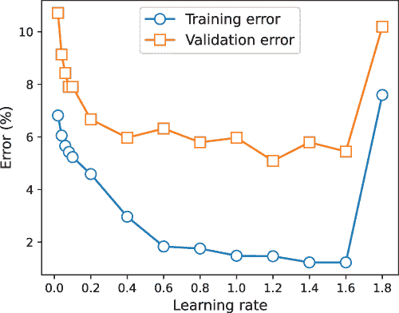

图 6.14 XGBoost 在乳腺癌数据集的 10 个数据集上的平均训练和验证误差

随着学习率的降低，XGBoost 的性能随着提升过程变得越来越保守并表现出欠拟合行为而下降。当学习率增加时，XGBoost 的性能再次下降，因为提升过程变得越来越激进并表现出过拟合行为。在我们的参数选择中，学习率=1.2 似乎是最好的值，这通常位于 1.0 和 1.5 之间。

XGBoost 的交叉验证

除此之外，交叉验证（CV）还可以用来描述模型性能。在列表 6.6 中，我们使用 XGBoost 内置的 CV 功能来描述随着我们在集成中增加估计器的数量，XGBoost 的性能如何变化。

我们使用 XGBoost.cv 函数执行 10 折交叉验证，如下所示。观察发现，xgb.cv 的调用方式几乎与上一节中的 xgb.fit 相同。

列表 6.6 XGBoost 的交叉验证

```
import xgboost as xgb
trn = xgb.DMatrix(Xtrn, label=ytrn)
tst = xgb.DMatrix(Xtst, label=ytst)

params = {'learning_rate': 0.25, 'max_depth': 2, 
          'objective': 'binary:logistic'}
cv_results = xgb.cv(params, trn, num_boost_round=60, 
                    nfold=10, metrics={'error'}, seed=42) 
```

在这个列表中，模型性能通过误差来描述，该误差通过 metrics={'error'}参数传递给 XGBoost.cv，如图 6.15 所示。

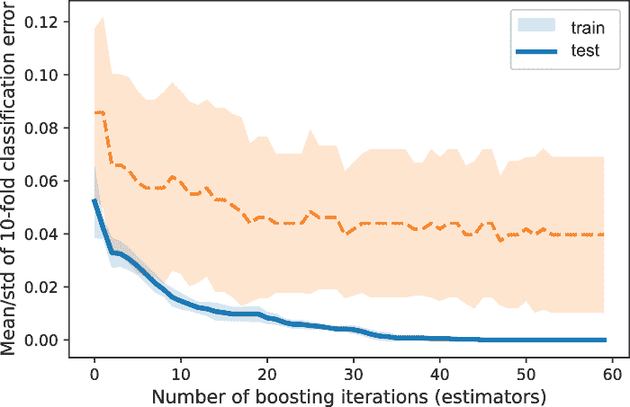

图 6.15 随着迭代次数的增加，折平均误差逐渐降低，因为我们不断地将更多的基估计器添加到集成中。

从图 6.15 中还可以观察到另一个有趣的观察结果：在约 35 次迭代时，训练和验证性能不再有显著提升。这表明，在此之后延长训练时间不会带来显著的性能提升。这很自然地引出了早期停止的概念，我们之前在 AdaBoost 和梯度提升中已经遇到过。

### 6.4.2 早期停止

随着集成中基估计器数量的增加，集成的复杂性也增加，这最终会导致过拟合。为了避免这种情况，我们可以在达到集成大小极限之前停止训练模型。

XGBoost 的早期停止与 LightGBM 非常相似，其中我们为参数 early_stopping_rounds 指定一个值。在每次迭代后，集成性能在验证集上评分，该验证集是从训练集中分割出来的，目的是确定一个好的早期停止点。

只要整体分数（例如，准确率）在最后的早期停止轮次（early_ stopping_rounds）之后有所提高，XGBoost 将继续训练。然而，当分数在早期停止轮次之后没有提高时，XGBoost 将终止训练。

以下列表展示了使用 XGBoost 进行早期停止的示例。请注意，train_test_split 用于创建一个独立的验证集，该验证集被 XGBoost 用来确定早期停止点。

列表 6.7 XGBoost 的早期停止

```
from sklearn.model_selection import train_test_split 
Xtrn, Xval, ytrn, yval = train_test_split(X, y, test_size=0.2,
                                          shuffle=True, random_state=42)
ens = XGBClassifier(n_estimators=50, max_depth=2,  
                    objective='binary:logistic')
ens.fit(Xtrn, ytrn, early_stopping_rounds=5, 
        eval_set=[(Xval, yval)], eval_metric='auc')
```

上述提前停止的三个关键参数是提前停止轮数和评估集：early_stopping_rounds=5 和 eval_set=[(Xval, yval)]，以及评估指标 eval_metric='auc'。有了这些参数，训练在 13 轮后终止，尽管 XGBClassifier 中的 n_estimators 被初始化为 50：

```
[0] validation_0-auc:0.95480
[1]     validation_0-auc:0.96725
[2]     validation_0-auc:0.96757
[3]     validation_0-auc:0.99017
[4]     validation_0-auc:0.99099
[5]     validation_0-auc:0.99181
[6]     validation_0-auc:0.99410
[7]     validation_0-auc:0.99640
[8]     validation_0-auc:0.99476
[9]     validation_0-auc:0.99148
[10]    validation_0-auc:0.99050
[11]    validation_0-auc:0.99050
[12]    validation_0-auc:0.98985
```

因此，提前停止可以大大提高训练时间，同时确保模型性能不会过度下降。

## 6.5 案例研究重述：文档检索

为了结束本章，我们回顾了第五章中的案例研究，该研究解决了文档检索任务，即从数据库中识别和检索文档以匹配用户的查询。在第五章中，我们比较了 LightGBM 中可用的几个梯度提升方法。

在本章中，我们将使用 XGBoost 在文档检索任务上训练牛顿提升模型，并比较 XGBoost 和 LightGBM 的性能。除了这个比较之外，这个案例研究还说明了如何在 XGBoost 中设置随机交叉验证以在大数据集上进行有效的参数选择。

### 6.5.1 LETOR 数据集

我们使用由微软研究院免费提供的 LEarning TO Rank (LETOR) v4.0 数据集。每个训练示例对应一个查询-文档对，其中包含描述查询、文档以及它们之间匹配的特征。每个训练标签是一个相关性排名：最少相关、适度相关或高度相关。

这个问题被设定为一个三分类问题，即根据一个训练示例（查询-文档对）识别相关性类别（最少、适度或高度相关）。为了方便和一致性，我们将使用 XGBoost 的 scikit-learn 包装器以及 scikit-learn 本身的模块。首先，让我们加载 LETOR 数据集：

```
from sklearn.datasets import load_svmlight_file
from sklearn.model_selection import train_test_split
import numpy as np

query_data_file = './data/ch05/MQ2008/Querylevelnorm.txt'
X, y = load_svmlight_file(query_data_file)
```

接下来，让我们将数据集分为训练集和测试集：

```
Xtrn, Xtst, ytrn, ytst = train_test_split(X, y, 
                                          test_size=0.2, random_state=42)
```

### 6.5.2 使用 XGBoost 进行文档检索

由于我们有一个三分类（多分类）问题，我们使用 softmax 损失函数训练了一个基于树的 XGBoost 分类器。Softmax 损失函数是 logistic 损失函数在多分类中的推广，并且在许多多分类学习算法中常用，包括多项式逻辑回归和深度神经网络。

我们将训练的损失函数设置为 objective='multi:softmax'，测试的评估函数设置为 eval_metric='merror'。评估函数是一个多分类错误，即从二分类到多分类的 0-1 误分类错误的推广。我们不使用 merror 作为训练目标，因为它不可微，不便于计算梯度和 Hessian：

```
xgb = XGBClassifier(booster='gbtree', objective='multi:softmax', 
                    eval_metric='merror', use_label_encoder=False, 
                    n_jobs=-1)
```

我们还设置 n_jobs=-1 以启用 XGBoost 使用所有可用的 CPU 核心，通过并行化加速训练。

与 LightGBM 一样，XGBoost 也需要我们设置几个训练超参数，例如学习率（用于控制学习速率）或叶节点数（用于控制基估计树复杂度）。这些超参数是通过 scikit-learn 的随机 CV 模块 RandomizedSearchCV 来选择的：具体来说，我们在各种参数选择的网格上执行 5 折 CV；然而，与 GridSearchCV 一样，RandomizedSearchCV 并不彻底评估所有可能的参数组合，而是随机采样更少的模型组合以加快参数选择：

```
num_random_iters = 20
num_cv_folds = 5
```

我们可以探索一些关键参数的不同值，如下所述：

+   learning_rate — 控制每个树对集成整体贡献的大小

+   max_depth — 限制树深度以加速训练并降低复杂度

+   min_child_weight — 通过 Hessian 值之和限制每个叶节点，以控制过拟合

+   colsample_bytree — 指定从训练数据中采样的特征比例，分别用于加速训练（类似于随机森林或随机子空间中执行的特征子采样）

+   reg_alpha 和 reg_lambda — 指定叶节点值的正则化量，以控制过拟合

以下代码指定了我们感兴趣搜索的参数值的范围，以确定有效的训练参数组合：

```
from scipy.stats import randint, uniform
xgb_params = {'max_depth': randint(2, 10), 
              'learning_rate': 2**np.linspace(-6, 2, num=5),
              'min_child_weight': [1e-2, 1e-1, 1, 1e1, 1e2],
              'colsample_bytree': uniform(loc=0.4, scale=0.6),
              'reg_alpha': [0, 1e-1, 1, 10, 100],
              'reg_lambda': [0, 1e-1, 1, 10, 100]}
```

如前所述，这些参数的网格产生了太多的组合，无法有效地评估。因此，我们采用带有 CV 的随机搜索，并随机采样大量更小的参数组合：

```
cv = RandomizedSearchCV(estimator=xgb, 
                        param_distributions=xgb_params,
                        n_iter=num_random_iters,
                        cv=num_cv_folds,  
                        refit=True,
                        random_state=42, verbose=1)
cv.fit(Xtrn, ytrn, eval_metric='merror', verbose=False)
```

注意，我们在 RandomizedSearchCV 中设置了 refit=True，这允许使用 RandomizedSearchCV 确定的最佳参数组合训练一个最终模型。

训练后，我们比较了 XGBoost 与第五章第 5.5 节中由 LightGBM 训练的四个模型的表现：

+   *随机森林* — 随机决策树的并行同质集成。

+   *梯度提升决策树* (GBDT) — 这是一种标准的梯度提升方法，代表了具有良好泛化性能和训练速度的模型之间的平衡。

+   *基于梯度的单侧采样 (GOSS)* — 这种梯度提升的变体对训练数据进行下采样，非常适合大型数据集。由于下采样，它可能会在泛化方面有所损失，但通常训练速度非常快。

+   *Dropouts 与多个加性回归树 (DART)* — 这种变体结合了深度学习中的 dropout 概念，其中神经单元在反向传播迭代中随机且临时地被丢弃，以减轻过拟合。DART 通常是在 LightGBM 中所有梯度提升选项中最慢的。

XGBoost 使用正则化损失函数和牛顿提升。相比之下，随机森林集成不使用任何梯度信息，而 GBDT、GOSS 和 DART 使用梯度提升。

如前所述，我们使用测试集准确率（图 6.16，左）和整体模型开发时间（图 6.16，右）来比较所有算法的性能，这包括基于交叉验证的参数选择以及训练时间。

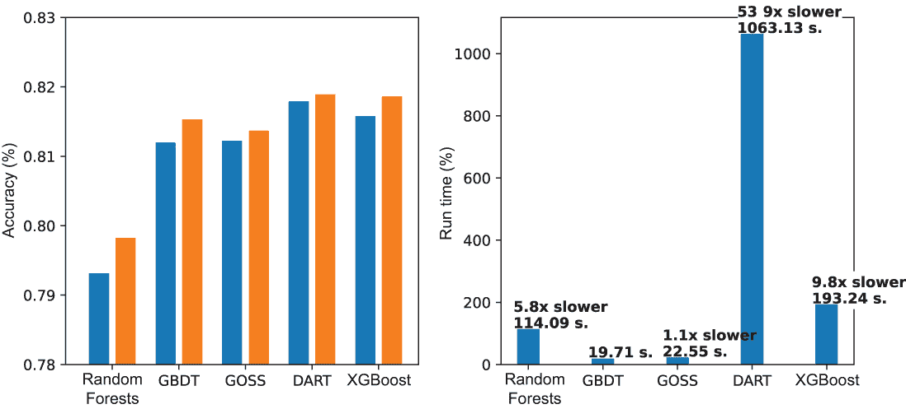

图 6.16 左：比较随机森林、GBDT、GOSS 和 DART 的测试集准确率；右：比较随机森林、GBDT、GOSS 和 DART 的整体训练时间（所有使用 LightGBM 训练）

以下是从这次实验中得出的关键结论（见图 6.16）：

+   在训练性能上，XGBoost 的表现与 DART、GOSS 和 GBDT 相当，优于随机森林。在测试集性能上，XGBoost 仅次于 DART。

+   在训练时间上，XGBoost 的整体模型开发时间明显短于 DART。这表明，在这里需要在额外的性能提升需求和伴随的计算开销之间做出应用相关的权衡。

+   最后，这些结果取决于建模过程中做出的各种选择，例如学习参数范围和随机化。通过仔细的特征工程、损失函数选择和使用分布式处理以提高效率，可以获得进一步的性能提升。

## 摘要

+   牛顿下降法是另一种优化算法，类似于梯度下降法。

+   牛顿下降法使用二阶（海森）信息来加速优化，与仅使用一阶（梯度）信息的梯度下降法相比。

+   牛顿提升法结合了牛顿下降法和提升法来训练一个弱学习者的序列集成。

+   牛顿提升法使用加权残差来表征正确分类和错误分类的训练样本。这与 AdaBoost 使用权重和梯度提升法使用残差的方式类似。

+   牛顿提升法中的弱学习者是回归树，它们在训练样本的加权残差上训练，并近似牛顿步。

+   与梯度提升法类似，牛顿提升法可以应用于来自分类、回归或排序任务的广泛损失函数。

+   优化正则化损失函数有助于控制学习集中弱学习者的复杂性，防止过拟合，并提高泛化能力。

+   XGBoost 是一个强大的、公开可用的基于树的牛顿提升框架，它集成了牛顿提升、高效的分割查找和分布式学习。

+   XGBoost 优化了一个正则化学习目标，该目标由损失函数（用于拟合数据）和两个正则化函数组成：L2 正则化和叶子节点数量。

+   与 AdaBoost 和梯度提升法一样，我们可以在牛顿提升法中通过选择有效的学习率或通过提前停止来避免过拟合。XGBoost 支持这两种方法。

+   XGBoost 实现了一个称为加权分位数草图的大致分割查找算法，该算法类似于基于直方图的分割查找，但经过调整和优化，以适应高效的牛顿提升。

+   除了提供用于分类、回归和排序的广泛损失函数外，XGBoost 还支持在训练过程中集成我们自己的定制、特定问题的损失函数。
