# 7 使用连续和计数标签进行学习

本章涵盖

+   机器学习中的回归

+   回归的损失和似然函数

+   何时使用不同的损失和似然函数

+   将并行和顺序集成应用于回归问题

+   在实际设置中使用集成进行回归

许多现实世界的建模、预测和预测问题最好以回归问题的形式提出和解决。回归有着悠久的历史，早于机器学习的出现，并且长期以来一直是标准统计学家工具箱的一部分。

回归技术在许多领域得到了开发和应用。以下只是几个例子：

+   *天气预报*——使用今天的数据预测明天的降水量，包括温度、湿度、云量、风速等

+   *保险分析*——根据各种车辆和驾驶员属性，预测一段时间内的汽车保险索赔数量

+   *金融预测*——使用历史股票数据和趋势预测股票价格

+   *需求预测*——使用历史、人口统计和天气数据预测未来三个月的住宅能源负荷

而第 2-6 章介绍了用于分类问题的集成技术，在本章中，我们将了解如何将集成技术应用于回归问题。

考虑检测欺诈信用卡交易的任务。这是一个*分类问题*，因为我们旨在区分两种类型的交易：欺诈（例如，具有类别标签 1）和非欺诈（例如，具有类别标签 0）。在分类中，我们想要预测的标签（或目标）是*分类的*（0，1，……）并代表不同的类别。

另一方面，考虑预测持卡人每月信用卡余额的任务。这是一个*回归*任务的例子。与分类不同，我们想要预测的标签（或目标）是*连续*值（例如，$650.35）。

考虑另一个预测持卡人每周使用其卡次数的任务。这也是一个回归任务的例子，尽管存在细微的差别。我们想要预测的标签或目标是*计数*。我们通常区分*连续回归*和*计数回归*，因为将计数建模为连续值并不总是有意义的（例如，预测持卡人将使用其卡 7.62 次是什么意思呢？）。

在本章中，我们将了解这些类型的问题以及其他可以用回归建模的问题，以及我们如何训练回归集成。7.1 节正式介绍了回归，展示了常用的回归模型，并解释了如何在广义线性模型（GLM）的单一框架下使用回归来建模连续和计数值标签（甚至分类标签）。7.2 和 7.3 节展示了如何将集成方法应用于回归问题。7.3 节介绍了连续和计数值目标的损失和似然函数，以及何时以及如何使用它们的指南。我们以第 7.4 节的案例研究结束，这次来自需求预测领域。

## 7.1 回归的简要回顾

本节回顾了回归的术语和背景材料。我们首先从更熟悉和传统的回归框架开始，即连续标签的学习。然后我们将讨论泊松回归，这是一种重要的学习计数标签的技术，以及逻辑回归，这是另一种重要的学习分类标签的技术。

尤其是我们会看到线性、泊松和逻辑回归都是 GLM 框架内的个别变体。我们还将简要回顾两种重要的非线性回归方法——决策树回归和人工神经网络（ANNs），因为它们通常被用作集成方法中的基础估计器或元估计器。

### 7.1.1 连续标签的线性回归

最基本的回归方法是 *线性回归*，其中要训练的模型是输入特征的线性、加权组合。

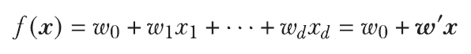

线性回归模型 *f*(*x*) 以一个示例 x 作为输入，并由特征权重 w 和截距（也称为偏差）*w*[0] 参数化。该模型通过识别最小化所有 *n* 个训练示例中真实标签 (*y*[i]) 和预测标签 (*f*(*x*[i])) 之间 *均方误差* (MSE) 的权重进行训练。

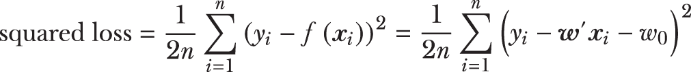

均方误差（MSE）不过是（平均）平方损失。由于我们通过最小化损失函数来学习模型，线性回归也被称为你可能熟悉的其他名称：普通最小二乘（OLS）回归。

回想第六章，第 6.2 节（以及第一章），大多数机器学习问题都可以表示为正则化函数和损失函数的组合，其中正则化函数控制模型复杂度，损失函数控制模型拟合度：

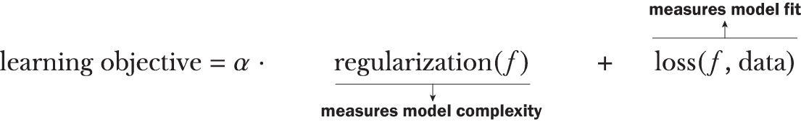

*α* 当然是权衡拟合和复杂度的正则化参数。它必须由用户确定并设置，通常通过交叉验证（CV）等实践来完成。

优化（特别是，最小化）这个学习目标本质上等同于训练一个模型。从这个角度来看，普通最小二乘回归可以被视为一个 *未正则化的学习问题*，其中只优化了平方损失函数：

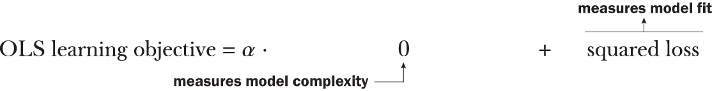

是否可以使用不同的正则化函数来提出其他线性回归方法？绝对可以，这正是统计界在过去几十年中一直在做的事情。

常见的线性回归方法

让我们通过 scikit-learn 的 linear_model 子包中实现的几个线性回归模型，看看一些常见的线性回归方法在实际中的应用。我们将使用一个合成数据集，其中真实的基础函数由 *f*(*x*) = -2.5*x* + 3.2 给出。这是一个一元函数，或一个变量的函数（对我们来说，一个特征）。在实践中，我们当然通常不知道真实的基础函数。以下代码片段生成一个包含 100 个训练示例的小型、噪声数据集：

```
import numpy as np
n = 100

rng = np.random.default_rng(seed=42)
X = rng.uniform(low=-4.0, high=4.0, size=(n, 1))     ❶

f = lambda x: -2.5 * x + 3.2                         ❷
y = f(X)                                             ❷
y += rng.normal(scale=0.15 * np.max(y), size=(n, 1)) ❷
```

❶ 在 NumPy 中创建一个有种子（seeded）的随机数生成器

❷ 根据此（线性）函数生成噪声标签

我们可以在图 7.1 中可视化这个数据集。


图 7.1 我们拟合了几个线性回归模型，以拟合一个合成回归问题的数据，这些数据由一维（1D）、噪声函数 *f*(*x*) = -2.5*x* + 3.2 生成，该函数由覆盖在数据点上的线表示。

不同的正则化方法服务于不同的建模需求，可以处理不同类型的数据问题。线性回归模型必须应对的最常见数据问题是 *多重共线性*。

数据中的多重共线性出现时，一个特征依赖于其他特征，即特征之间 *相关*。例如，在医疗数据中，患者体重和血压通常高度相关。在实践中，这意味着这两个特征几乎传达了 *相同* 的 *信息*，并且应该可以通过选择和使用其中之一来训练一个更简单的模型。

为了理解不同正则化方法的影响，我们将使用我们最近生成的单变量数据显式创建一个具有多重共线性（multicollinearity）的数据集。具体来说，我们将创建一个包含两个特征的数据集，其中一个特征依赖于另一个特征：

```
X = np.concatenate([X, 3*X + 0.25*np.random.uniform(size=(n, 1))], axis=1)
```

这产生了一个包含两个特征的数据集，其中第二个特征是第一个特征的 3 倍（添加了一些随机噪声以使其更真实）。现在我们有一个二维数据集，其中第二个特征与第一个特征高度相关。与之前一样，我们将数据集分为训练集（75%）和测试集（25%）：

```
from sklearn.model_selection import train_test_split
Xtrn, Xtst, ytrn, ytst = train_test_split(X, y, test_size=0.25,
                                          random_state=42)
```

现在我们训练四种常用的线性回归模型：

+   OLS 回归，无正则化

+   岭回归，使用 L2 正则化

+   最小绝对收缩和选择算子（LASSO），使用 L1 正则化

+   弹性网络，它结合了 L1 和 L2 正则化

下面的列表初始化并训练所有 4 个模型。

列表 7.1 线性回归模型

```
from sklearn.linear_model import LinearRegression, Ridge, Lasso, ElasticNet
from sklearn.metrics import mean_squared_error, mean_absolute_error

models = ['OLS Regression', 'Ridge Regression', 'LASSO', 'Elastic Net']
regressors = [LinearRegression(),                           ❶
              Ridge(alpha=0.5),                             ❶
              Lasso(alpha=0.5),                             ❶
              ElasticNet(alpha=0.5, l1_ratio=0.5)]          ❶

for (model, regressor) in zip(models, regressors):
    regressor.fit(Xtrn, ytrn)                               ❷
    ypred = regressor.predict(Xtst)                         ❸
    mse = mean_squared_error(ytst, ypred)                   ❹
    mad = mean_absolute_error(ytst, ypred)                  ❹

    print('{0}\'s test set performance: MSE = {1:4.3f}, MAD={2:4.3f}'.
          format(model, mse, mad))
    print('{0} model: {1} * x + {2}\n'.                     ❺
          format(model, regressor.coef_, regressor.intercept_))
```

❶ 初始化四个常见的线性回归模型

❷ 训练回归模型

❸ 在测试集上获取预测

❹ 使用 MSE 和 MAD 计算测试误差

❺ 打印回归权重

未正则化的 OLS 模型将作为我们比较其他模型的基准：

```
OLS Regression's test set performance: MSE = 2.786, MAD=1.300
OLS Regression model: [[-1.46397043 -0.32220113]] * x + [3.3541317]
```

我们将使用两个指标来评估每个模型的表现：均方误差（MSE）和平均绝对偏差（MAD）。该模型具有 MSE 2.786 和 MAD 1.3。下一个线性回归模型，岭回归，使用 L2 正则化，即权重的平方和，

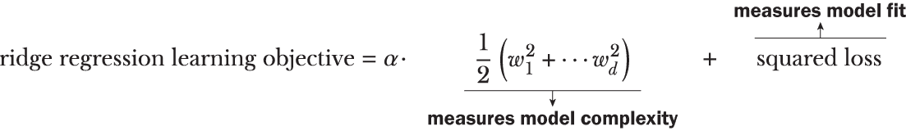

那么，L2 正则化做什么呢？学习涉及最小化学习目标；当正则化项或平方和最小化时，它将单个权重推到零。这被称为模型权重的 *收缩*，它减少了模型复杂度。

目标函数中的平方损失项至关重要，因为没有它，我们将训练一个所有权重都为零的退化模型。因此，岭回归模型在复杂性和拟合度之间进行权衡，这种平衡由适当地设置参数 *α* > 0\. 列表 7.1 生成以下岭回归模型（*α* > 0.5）：

```
Ridge Regression's test set performance: MSE = 2.760, MAD=1.301
Ridge Regression model: [[-0.34200341 -0.69592603]] * x + [3.39572877]
```

当我们将 L2 正则化的岭回归学习到的权重 [-0.34, -0.7] 与未正则化的 OLS 回归学习到的权重 [-1.46, -0.322] 进行比较时，正则化和由此产生的收缩效应立即显现。

如前所述，另一种流行的线性回归方法是最小绝对收缩和选择算子（LASSO），它与岭回归相当相似，只是它使用 L1 正则化来控制模型复杂度。也就是说，L1 回归的学习目标变为

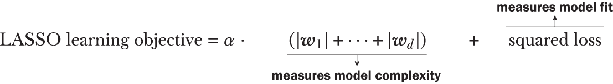

L1 正则化是权重绝对值的总和，而不是 L2 正则化中的平方和。总体效果与 L2 正则化相似，但 L1 正则化会缩小预测能力较弱的特征的权重。相比之下，L2 正则化会均匀地缩小所有特征的权重。

换句话说，L1 正则化将信息量较小的特征的权重推到零，这使得它非常适合特征选择。L2 正则化将所有特征的权重一起推到零，这使得它非常适合处理相关和协变的特征。

列表 7.1 生成以下 LASSO 模型（α > 0.5）：

```
LASSO's test set performance: MSE = 2.832, MAD=1.304
LASSO model: [-0\.         -0.79809073] * x + [3.41650036]
```

将 LASSO 模型的权重 [0, -0.798] 与岭回归学习到的权重 [-0.34, -0.7] 进行对比：LASSO 实际上为第一个特征学习了零权重！

我们可以看到，L1 正则化诱导了*模型稀疏性*。也就是说，LASSO 在学习过程中进行隐式特征选择，以识别构建更简单模型所需的一小组特征，同时保持或提高性能。

换句话说，这个 LASSO 模型只依赖于一个特征，而 OLS 模型需要两个特征。这使得 LASSO 模型比 OLS 模型更简单。虽然这对于这个玩具数据集可能意义不大，但当应用于具有数千个特征的数据库时，这具有显著的扩展性影响。

回想一下，我们的合成数据集是精心构建的，具有两个高度相关的特征。LASSO 已经识别出这一点，确定不需要两者，因此学习了一个零权重，有效地消除了其对最终模型贡献。

我们将要研究的最后一个线性回归模型称为弹性网络，这是一个著名、广泛使用且研究深入的模型。弹性网络回归使用 L1 和 L2 正则化的组合：

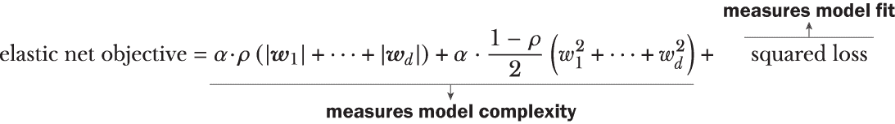

L1 和 L2 正则化在整体正则化中的比例由 L1 比率控制，0 ≤ *ρ* ≤ 1，而参数*α* > 0 仍然控制整体正则化和损失函数之间的权衡。

L1 比率允许我们调整 L1 和 L2 目标函数的贡献。例如，如果*ρ* = 0，弹性网络目标函数变为岭回归目标函数。相反，如果*ρ* = 1，弹性网络目标函数变为 LASSO 目标函数。对于 0 和 1 之间的所有其他值，弹性网络目标函数是岭回归和 LASSO 的某种组合。

列表 7.1 生成了以下弹性网络模型，其中*α* = 0.5，*ρ* = 0.5，弹性网络测试集性能为 MSE = 2.824，MAD = 1.304：

```
Elastic Net model: [-0\.         -0.79928498] * x + [3.41567834]
```

从结果中我们可以看到，弹性网络模型仍然具有 LASSO 的稀疏性诱导特征（注意第一个学习的权重为零），同时结合了岭回归对数据相关性的鲁棒性（比较岭回归和弹性网络在测试集上的性能）。

表 7.1 总结了几个常见的线性回归模型，所有这些模型都可以转换为之前讨论的平方损失+正则化框架。

表 7.1：四种流行的线性回归方法，它们都使用平方损失函数，但采用不同的正则化方法来提高模型的鲁棒性和稀疏性

| 模型 | 损失函数 | 正则化 | 备注 |
| --- | --- | --- | --- |
| OLS 回归 | 平方损失(*y* - *f*(***x***))² | 无 | 经典线性回归；在高度相关特征下变得不稳定 |
| 岭回归 | 平方损失(*y* - *f*(***x***))² | L2 惩罚 1/2(*w*[1]²+ ⋅⋅⋅ + *w*[d]²) | 缩小权重以控制模型复杂度，并鼓励对高度相关特征的鲁棒性 |
| LASSO | 平方损失(*y* - *f*(***x***))² | L1 惩罚&#124;*w*[1]&#124; + ⋅⋅⋅ + &#124;*w*[d]&#124; | 进一步缩小权重，鼓励稀疏模型，执行隐式特征选择 |
| 弹性网络 | 平方损失(*y* - *f*(***x***))² | *ρ*L1 + (1 - *ρ*)L20 ≤ *ρ* ≤ 1 | 两种正则化器的加权组合，以平衡稀疏性和鲁棒性 |

在模型训练过程中，这些正则化损失函数通常通过梯度下降、牛顿下降或其变体进行优化，如第五章第 5.1 节和第六章第 6.1 节所述。

表 7.1 中的所有线性回归方法都使用平方损失。其他回归方法可以使用不同的损失函数推导出来。我们将在第 7.3 节中看到示例，并在第 7.4 节的案例研究中再次看到。

### 7.1.2 计数标签的泊松回归

前一节介绍了回归作为一种适合于建模具有连续值目标（标签）问题的机器学习方法。然而，常常存在这样的情况，我们必须开发标签为计数的模型。

例如，在健康信息学中，我们可能想要构建一个模型来预测给定特定患者数据的医生就诊次数（本质上，是计数）。在保险定价中，一个常见问题是建模索赔频率，以预测不同类型保险政策的预期索赔次数。城市规划是另一个例子，我们可能想要为人口普查区域建模不同的计数变量，例如家庭规模、犯罪数量、出生和死亡数量等。在所有这些问题中，我们仍然感兴趣的是构建形式为*y* = *f*(*x*)的回归模型；然而，目标标签*y*不再是连续值，而是一个计数。

连续值回归模型的假设

一种方法是将计数简单地视为连续值，但这并不总是有效。首先，计数变量的连续值预测并不总是可以有意义地解释。例如，如果我们预测每位患者的就诊次数，那么预测 2.41 次就诊并不是很有帮助，因为它不清楚是两次还是三次。更糟糕的是，连续值预测器甚至可能预测负值，这可能完全没有意义。医生就诊-4.7 次是什么意思？这个讨论表明，连续值和计数值目标意味着完全不同的事情，应该被不同地对待。

首先，让我们看看线性回归如何拟合连续值目标。图 7.2（左）显示了一个（有噪声的）一元数据集，其中连续值标签(*y*)依赖于单个特征(*x*)。

线性回归模型假设对于一个输入*x*，预测误差或残差*y* = *f*(*x*)是按照正态分布分布的。在图 7.2（左）中，我们在数据、标签和线性回归模型（虚线）上叠加了几个这样的正态分布。

简单来说，线性回归试图拟合一个线性模型，使得残差具有正态分布。正态分布，也称为高斯分布，是一种**概率分布**，或者是对一个（随机）变量可能取的值的分布和形状的数学描述。如图 7.2（右）所示，正态分布是一个连续值分布，对于连续值标签来说是一个合理的选择。

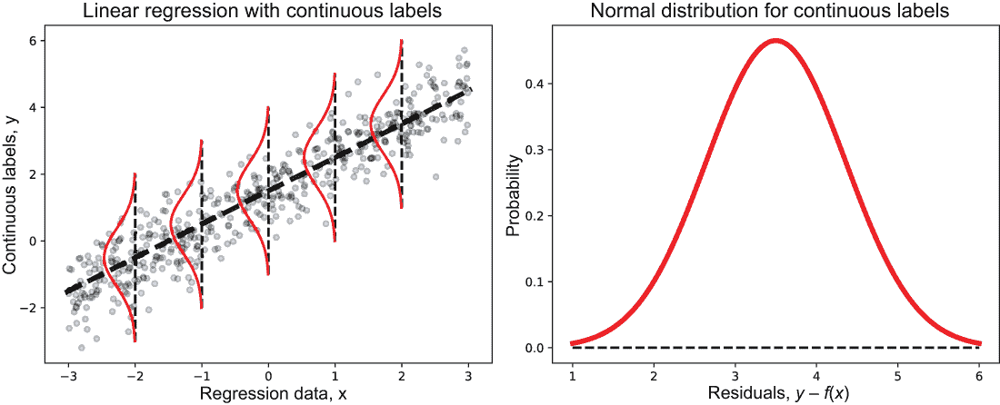

图 7.2（左）的线性回归通过假设目标的分布可以通过连续值正态分布（右）来建模，从而拟合连续值目标。更确切地说，线性回归假设对于示例 x 的预测*f*(*x*)是按照正态分布分布的。

但对于计数数据呢？在图 7.3 中，我们可视化了图 7.2 中连续值目标的数据集（左）和具有计数值目标的数据集（右）之间的差异。

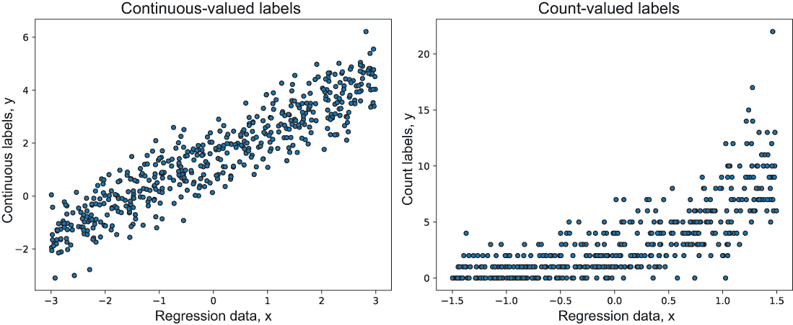

图 7.3（左）和（右）展示了连续值目标（左）和计数值目标（右）之间的差异可视化，这表明线性回归不会很好地工作，因为计数标签的分布（分布和形状）与连续标签的分布相当不同。

我们开始看到连续值标签和计数值标签之间的一些相当明显的差异。直观上，为连续目标设计的回归模型在构建计数值目标的有效模型时会遇到困难。

这是因为针对连续目标的回归模型假设残差具有某种形状：正态分布。正如我们将要看到的，计数值目标并不是正态分布的，但实际上通常遵循泊松分布。由于计数值标签与连续值标签在本质上不同，因此为连续值标签设计的回归方法通常不会很好地适用于计数值标签。

计数值回归模型的新假设

我们能否保持线性回归的一般框架，然后将其扩展以能够处理计数值数据？实际上我们可以，通过一些建模变化：

+   我们将不得不改变我们将标签（预测目标）与输入特征相连接的方式。线性回归通过线性函数将标签与特征相关联：*y* = *β*[0] + *β*'*x*。对于计数标签，我们将引入链接函数 *g*(*y*) 到模型 *g*(*y*) = *β*[0] + *β*'*x*；特别是，我们将使用对数链接函数——log(*y*) = *β*[0] + *β*'*x*——或者等价地，通过取对数的逆作为 *y* = *e*^(*β*[0]+*β*'x)。链接函数通常基于两个关键因素来选择：（1）我们认为最适合数据及其行为的潜在概率分布，以及（2）任务和应用相关的考虑。

+   我们将不得不改变我们对预测 *f*(*x*) 分布的假设。线性回归假设连续值标签服从正态分布。对于计数值标签，我们需要泊松分布，这是可以用来模拟计数的几种分布之一。

+   泊松分布是一个离散概率分布，因此非常适合处理离散的计数值标签，并表达了在固定时间间隔内可能发生多少事件的概率。在这种情况下，对数链接函数是泊松分布和其他具有指数形式的分布的自然选择。

图 7.4 说明了在开发计数值数据的回归模型时需要对数链接函数以及泊松分布：

+   观察图 7.4（左）中计数标签（*y*）相对于回归数据（*x*）的平均（平均）趋势，由虚线表示。直观上看，这是一个温和的指数趋势，展示了特征（*x*）如何与标签（*y*）相联系。

+   观察泊松分布在可视化模型上如何更好地模拟计数（离散）的性质以及它们的分布，比正态分布要好得多。

这些变化后的回归模型使我们能够模拟计数值目标，并适当地称为*泊松回归*。

总结一下，泊松回归仍然使用线性模型来捕捉示例中的各种输入特征的效果。然而，它引入了对数链接函数和泊松分布假设，以有效地对计数标签数据进行建模。

如前所述的泊松回归方法是对普通线性回归的扩展，这意味着它没有正则化。然而，不出所料，我们可以添加不同的正则化项以诱导鲁棒性或稀疏性，正如我们在第 7.1 节中看到的。

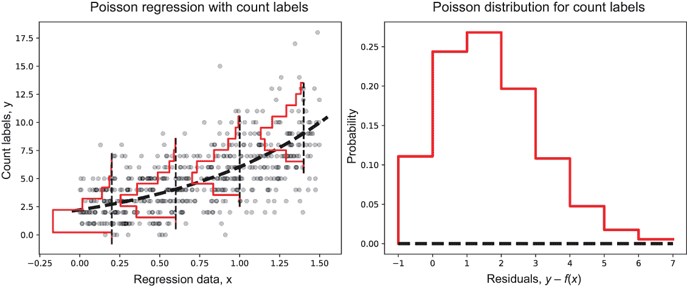

图 7.4 泊松回归（左）通过假设目标的分布可以通过离散值的泊松分布（右）来模拟，来拟合计数值目标。更精确地说，泊松回归假设示例 *x* 的预测 *f*(*x*) 是按照泊松分布分布的。

scikit-learn 对泊松回归的实现是 sklearn.linear_ 模型子包的一部分。它实现了带有 L2 正则化的泊松回归，其中正则化的效果可以通过 alpha 参数来控制。

因此，超参数 alpha 是正则化参数，类似于岭回归中的正则化参数。设置 alpha=0 会导致模型学习一个未正则化的泊松回归器，就像未正则化的线性回归一样，不能有效地处理特征相关性。

在以下示例中，我们使用 alpha=0.01 调用泊松回归，这训练了一个用于计数标签的回归模型，并且对数据中的特征相关性具有鲁棒性：

```
from sklearn.linear_model import PoissonRegressor
poiss_reg = PoissonRegressor(alpha=0.01)
poiss_reg.fit(Xtrn, ytrn)
ypred = poiss_reg.predict(Xtst)
mse = mean_squared_error(ytst, ypred)  
mad = mean_absolute_error(ytst, ypred)
print('Poisson regression test set performance: MSE={0:4.3f}, MAD={1:4.3f}'.
      format(mse, mad))
```

在图 7.4 中的数据上执行此代码片段（请参阅生成此数据的配套 Python 代码），结果如下：

```
Poisson regression test set performance: MSE = 3.963, MAD=1.594
```

我们可以在具有计数特征的这个合成数据集上训练岭回归模型。记住，岭回归使用 MSE 作为损失函数，这对于计数变量来说是不合适的，如下所示：

```
Ridge regression test set performance: MSE = 4.219, MAD=1.610
```

### 7.1.3 逻辑回归用于分类标签

在上一节中，我们看到了可以通过适当选择链接函数和目标分布来将线性回归扩展到计数标签。我们还能处理哪些标签类型？这个想法（添加链接函数和引入其他类型的分布）能否扩展到分类标签？分类（或类别）标签用于描述二元分类问题（0 或 1）或多类分类问题（0，1，2）中的类别。

那么，问题来了，我们能否将回归框架应用于分类问题？令人惊讶的是，是的！为了简单起见，让我们关注二元分类，其中标签只能取两个值，0 或 1：

+   我们将不得不改变如何将目标标签与输入特征*链接*。对于类别/分类标签，我们使用 logit 链接函数 *g*(*y*) = ln(*y*/1 – *y*)。因此，我们将学习的模型将是 ln(*y*/(1 – *y*)) = *β*[0] + *β*’*x*。这种选择可能一开始看起来相当随意，但稍微深入一点就可以消除这种选择的神秘性。

    首先，通过反转 logit 函数，我们得到了标签*y*与数据*x*之间的等效链接*y* = 1/(1+*e*^(-(*β*[0]+*β*’*x*)))。也就是说，*y*是通过 sigmoid 函数建模的，也称为*逻辑函数*！因此，在回归模型中使用 logit 链接函数将其转换为逻辑回归，这是一种众所周知的分类算法！

    其次，我们可以将*y*/(1 – *y*)视为*y* : (1 - *y*)的比率，我们将其解释为 y 属于类别 0 相对于属于类别 1 的概率。这些概率与赌博和投注中提供的概率完全相同。logit 链接函数仅仅是概率的对数，或称为*对数概率*。这个链接函数本质上提供了类别为 0 或 1 的似然度度量。

+   线性回归假设连续值标签服从正态分布，泊松回归假设计数值标签服从泊松分布。逻辑回归假设二元类别标签服从伯努利分布。

    伯努利分布，就像泊松分布一样，是另一种离散概率分布。然而，伯努利分布并不是描述事件的数量，而是模型化是/否问题的结果。这非常适合二分类情况，其中我们提出问题：“这个例子属于类别 0 还是类别 1？”

将所有这些放在一起，我们在图 7.5 中将逻辑回归类比为线性回归或泊松回归。

图 7.5（左）显示了一个二元分类数据集，其中数据只有一个特征，目标属于两个类别之一。在这种情况下，二元标签遵循伯努利分布，而 Sigmoid 链接函数（虚线）使我们能够很好地将数据（*x*）与标签（*y*）联系起来。图 7.5（右）展示了伯努利分布的更详细视图。

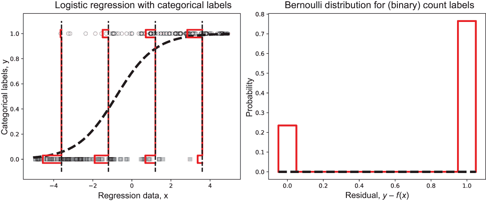

图 7.5（左）的逻辑回归通过假设目标值的分布可以由离散值的伯努利分布（右）来建模，拟合 0/1 值的目标。观察类别 0 和类别 1 的预测概率（条形的高度）如何随着数据的变化而变化。

逻辑回归当然是许多不同的分类算法之一，尽管它与回归有密切的联系。这种过渡到分类问题只是为了强调通用回归框架可以处理的各种类型的问题。

### 7.1.4 广义线性模型

广义线性模型（GLM）框架包括不同组合的链接函数和概率分布（以及许多其他模型），以创建特定问题的回归变体。线性回归、泊松回归、逻辑回归以及许多其他模型都是不同的 GLM 变体。一个（正则化的）GLM 回归模型有四个组成部分：

+   概率分布（形式上，来自指数分布族）

+   线性模型 *η* = *β*[0] + *β*'*x*

+   链接函数 *g*(*y*) = *η*

+   正则化函数 *R*(*β*)

我们为什么关心 GLM？首先，它们显然是一种酷的建模方法，允许我们在一个统一的框架中处理几种不同类型的回归问题。其次，更重要的是，GLM 通常被用作序列模型中的弱学习器，特别是在许多梯度提升包中，如 XGBoost。第三，最重要的是，GLM 允许我们以原则性的方式思考问题；在实践中，这意味着在数据集分析过程中，当我们开始对标签及其分布有一个良好的感觉时，我们可以看到哪个 GLM 变体最适合当前的问题。

表 7.2 展示了不同的 GLM 变体、链接函数-分布组合以及它们最适合的标签类型。其中一些方法，如 Tweedie 回归，可能对你来说是新的，我们将在第 7.3 节和第 7.4 节中更详细地介绍它们。

表 7.2 不同类型标签的 GLMs

| 模型 | 链接函数 | 分布 | 标签类型 |
| --- | --- | --- | --- |
| 线性回归 | Identity*g*(*y*) = *y* | 正态 | 实数值 |
| Gamma 回归 | 负逆 *g*(*y*) = -(1/*y*) | Gamma | 正实数值 |
| Poisson 回归 | Log *g*(*y*) = log(*y*) | 泊松 | 计数/发生次数；整数值 |
| 逻辑回归 | Logit *g*(*y*) = (*y*/(1-*y*)) | 伯努利 | 0-1；二进制类标签；是/否结果 |
| 多类逻辑回归 | 多类 logit *g*(*y*) = (*y*/(*K*-*y*)) | 二项式 | 0-K；多类标签；多选结果 |
| Tweedie 回归 | Log *g*(*y*) = ln(*y*) | Tweedie | 标签中有很多零，目标向右偏斜 |

最后一种方法，Tweedie 回归，是一种特别重要的 GLM 变体，在农业、保险、天气和许多其他领域的回归建模中得到广泛应用。

### 7.1.5 非线性回归

与线性回归不同，线性回归中的模型被表示为特征的加权求和，即 *f*(*w*) = *w*[0] + *w*[1]*x*[1] + ⋅⋅⋅ + *w*[d]*x*[d]，而非线性回归中要学习的模型可以由任何特征和特征函数的组合构成。例如，一个由三个特征构成的多项式回归模型可以通过所有可能的特征交互的加权组合来构建：

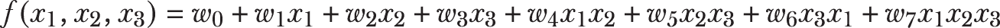

从建模的角度来看，非线性回归提出了两个挑战：

+   *我们应该使用哪些特征组合？* 在前面的例子中，有三个特征，我们有 2³ = 8 种特征组合，每种组合都有自己的权重。一般来说，有*d*个特征，我们将有 2^d 个特征组合要考虑，以及同样数量的权重要学习。这样做可能会非常耗费计算资源，尤其是在例子中没有包括任何高阶项（例如，*x*²[2]*x*[3]），这些高阶项通常也被包括在内以构建非线性模型！

+   *我们应该使用哪些非线性函数？* 除了多项式之外，所有类型的函数和组合都是可接受的：三角函数、指数函数、对数函数以及许多其他函数，以及更多的组合。在这个函数空间中全面搜索在计算上是不可行的。

尽管已经提出了许多不同的非线性回归技术，进行了研究和应用，但在现代背景下，两种方法尤其相关：决策树和神经网络。我们将简要讨论这两种方法，尽管我们将更多地关注决策树，因为它们是大多数集成方法的基础。

基于树的方法使用决策树来定义非线性函数的空间以进行探索。在学习过程中，决策树使用与之前描述相同的损失函数进行生长，例如平方损失。每次添加一个新的决策节点时，都会将一个新的特征交互/组合引入树中。

因此，决策树通过损失函数作为评分指标，在学习的贪婪和递归过程中诱导特征组合。随着树的生长，其非线性（或复杂性）也增加。决策树的学习目标可以写成以下形式：

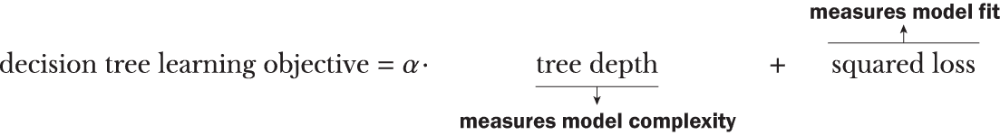

另一方面，ANN 使用神经元层来逐层诱导越来越复杂的特征组合。神经网络的非线性随着网络深度的增加而增加，这直接影响必须学习的网络权重的数量：

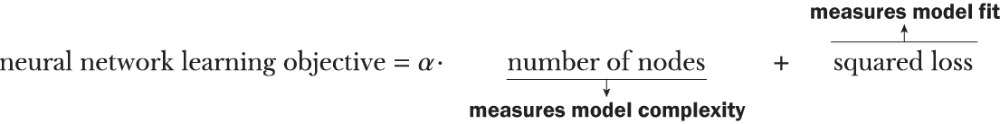

scikit-learn 包提供了许多非线性回归方法。让我们快速看一下我们如何为简单问题训练决策树和神经网络回归器。

如前所述，让我们生成一个简单的一元数据集来可视化这两种回归方法。数据是通过 *f*(*x*) = *e*^(-0.5x)sin (1.25π*x* - 1.414) 生成的，这是数据 *x* 和连续标签 *y* 之间真实的潜在非线性关系：

```
n = 150
X = rng.uniform(low=-1.0, high=5.0, size=(n, 1))
g = lambda x: np.exp(-0.5*x) * np.sin(1.25 * np.pi * x - 1.414)
y = g(X)  # Generate labels according to this nonlinear function
y += rng.normal(scale=0.08 * np.max(y), size=(n, 1))  
y = y.reshape(-1, )
```

将数据分为训练集和测试集：

```
Xtrn, Xtst, ytrn, ytst = train_test_split(X, y, test_size=0.25,
                                          random_state=42)
```

现在，训练一个最大深度为 5 的决策树回归器：

```
from sklearn.tree import DecisionTreeRegressor
dt = DecisionTreeRegressor(max_depth=5)
dt.fit(Xtrn, ytrn)

ypred_dt = dt.predict(Xtst)
mse = mean_squared_error(ytst, ypred_dt)
mad = mean_absolute_error(ytst, ypred_dt)
print('Decision Tree''s test set performance: MSE = {0:4.3f}, MAD={1:4.3f}'.
      format(mse, mad))
```

学习到的决策树函数如图 7.6（右）所示。具有一元（单变量）分割函数的决策树学习到轴平行的拟合，这在图中的决策树模型中得到了反映：模型由与 x 轴或 y 轴平行的段组成。

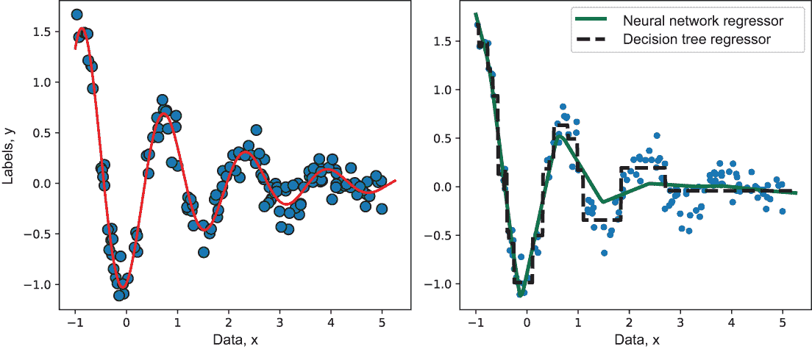

图 7.6 左：与数据相关的真实函数（实线）和生成数据样本。右：拟合到这个合成数据集的两个非线性回归模型，决策树和神经网络回归器。

以类似的方式，我们可以训练一个用于回归的 ANN，也称为多层感知器（MLP）回归器：

```
from sklearn.neural_network import MLPRegressor
ann = MLPRegressor(hidden_layer_sizes=(50, 50, 50), 
                   alpha=0.001, max_iter=1000)
ann.fit(Xtrn, ytrn.reshape(-1, ))
ypred_ann = ann.predict(Xtst)
mse = mean_squared_error(ytst, ypred_ann)
mad = mean_absolute_error(ytst, ypred_ann)

print('Neural Network''s test set performance: MSE = {0:4.3f}, MAD={1:4.3f}'.
      format(mse, mad))
```

这个神经网络由三个隐藏层组成，每个隐藏层包含 50 个神经元，这些神经元在通过 hidden_layer_sizes=(50, 50, 50)指定网络初始化时被指定。

MLPRegressor 使用分段线性整流函数（*relu*(*x*) = *max*(*x*,0)）作为每个神经元的激活函数。神经网络学习的回归函数如图 7.6（右）所示。由于神经网络激活函数是分段线性的，因此最终学习的神经网络模型是非线性的，尽管由多个线性组件组成（因此是分段的）。比较两个网络的性能，我们发现它们相当相似：

```
Decision Trees test set performance: MSE = 0.027, MAD=0.131
Neural Networks test set performance: MSE = 0.043, MAD=0.164
```

最后，回归的集成方法通常训练非线性回归模型（除非有特定的基础估计器选择），这与本小节讨论的类似。

## 7.2 平行回归集成

在本节中，我们回顾了平行集成，包括同质（第二章）和异质（第三章）集成，并探讨它们如何应用于回归问题。在我们深入探讨之前，让我们先了解一下平行集成的工作原理。图 7.7 说明了通用平行集成，其中基础估计器是回归器。

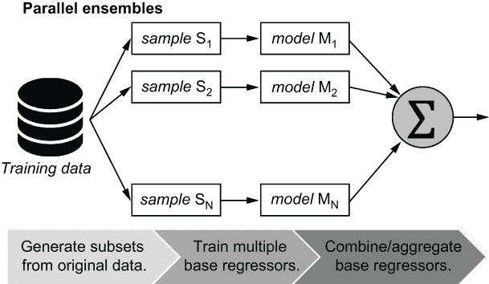

图 7.7 展示了平行集成独立于彼此训练多个基础估计器，然后将它们的预测组合成一个联合集成预测。平行回归集成简单地使用回归算法，如决策树回归作为基础学习算法。

平行集成方法独立于其他组件估计器训练每个组件估计器，这意味着它们可以并行训练。平行集成通常使用强学习器，或高复杂度、高拟合度学习器作为基础学习器。这与通常使用弱学习器，或低复杂度、低拟合度学习器作为基础学习器的顺序集成形成对比。

与所有集成方法一样，组件基础估计器之间的集成多样性是关键。平行集成通过两种方式实现这一点：

+   *同质集成*——基础学习算法保持不变，但训练数据被随机子采样以诱导集成多样性。在第 7.2.1 节中，我们探讨了两种这样的方法：随机森林和 Extra Trees。

+   *异质集成*——为了多样性而改变基础学习算法，而训练数据保持不变。在第 7.2.2 节和 7.2.3 节中，我们探讨了两种这样的方法：将基础估计器的预测与组合函数（或聚合器）融合，以及通过学习二级估计器（或元估计器）来堆叠基础估计器的预测。

我们关注一个具有连续值标签的问题，称为 AutoMPG，这是一个流行的回归数据集，常被用作评估回归方法的基准。回归任务是预测各种汽车模型的燃油效率或每加仑英里数（MPG）。特征包括各种与发动机相关的属性，如气缸数、排量、马力、重量和加速度。数据集可以从 UCI 机器学习仓库（[`mng.bz/Y6Yo`](http://mng.bz/Y6Yo)）以及本书的源代码中获得。

列表 7.2 展示了如何加载数据并将其分为训练集和测试集。列表还包括一个预处理步骤，其中数据被居中和缩放，使得每个特征的平均值为 0，标准差为 1。这一步称为归一化或标准化，确保所有特征都在相同的数值范围内，并提高了下游学习算法的性能。

列出 7.2 加载和预处理 AutoMPG 数据集

```
import pandas as pd
data = pd.read_csv('./data/ch07/autompg.csv')                        ❶

labels = data.columns.get_loc('MPG') 
features = np.setdiff1d(np.arange(0, len(data.columns), 1), 
                        labels)                                      ❷

from sklearn.model_selection import train_test_split
trn, tst = train_test_split(data, test_size=0.2, 
                            random_state=42)                         ❸

from sklearn.preprocessing import StandardScaler
preprocessor = StandardScaler().fit(trn)                             ❹
trn, tst = preprocessor.transform(trn), preprocessor.transform(tst)

Xtrn, ytrn = trn[:, features], trn[:, labels]                        ❺
Xtst, ytst = tst[:, features], tst[:, labels]
```

❶ 使用 pandas 加载数据集

❷ 获取标签和特征的列索引

❸ 将数据集分为训练集和测试集

❹ 数据预处理：归一化训练和测试数据以及标签。

❺ 进一步将训练和测试数据分为 Xtrn, Xtst（特征）和 ytrn, ytst（标签）。

我们将使用此数据集作为本节和下一节的运行示例。

### 7.2.1 随机森林和 Extra Trees

同质并行集成是一些最古老的集成方法，通常是*袋装*的变体。第二章在分类的背景下介绍了同质集成方法。为了回顾，并行集成方法（如袋装）中的每个基估计器可以独立使用以下步骤进行训练：

1.  从原始数据集中生成一个自助样本（通过有放回地采样，这意味着一个示例可以被多次采样）。

1.  将基估计器拟合到自助样本；由于每个自助样本都将不同，基估计器将是多样化的。

我们可以对回归集合采取同样的方法。唯一的区别在于如何聚合单个基估计器的预测。对于分类，我们使用多数投票；对于回归，我们使用平均值（本质上，是平均预测），尽管也可以使用其他方法（例如，中位数）。

注意：袋装中的每个基估计器都是一个完全训练的强估计器；因此，如果袋装集成包含 10 个基回归器，则训练时间将是 10 倍。当然，此训练过程可以并行化到多个 CPU 核心；然而，全功能袋装所需的总体计算资源通常具有威慑力。

由于袋装方法在训练时可能相当计算密集，因此使用了两种重要的基于树和随机化的变体：

+   *随机森林*—这本质上是以*随机决策树*作为基估计器的袋装。换句话说，随机森林执行自助采样以生成训练子集（就像袋装一样），然后使用随机决策树作为基估计器。

    使用修改后的决策树学习算法训练随机决策树，该算法在生长树时引入随机性。具体来说，不是考虑所有特征来识别最佳分裂，而是评估一个*随机*特征子集以识别最佳的分裂特征。

+   *Extra Trees（极端随机树）*—这些随机树将随机决策树的想法推向了极致，不仅从特征随机子集中选择分裂变量，还选择分裂阈值。这种极端随机化实际上非常有效，以至于我们可以直接从原始数据集构建极端随机树集合，而无需进行自助采样！

随机化有两个重要且有益的后果。一方面，正如我们所期望的，它提高了训练效率并减少了计算需求。另一方面，它提高了集成多样性！随机森林和 Extra Trees 可以通过修改底层学习算法来适应回归，使其训练回归树进行连续值预测而不是分类树。

与分类树相比，回归树在训练过程中使用不同的分割标准。原则上，任何回归的损失函数都可以用作分割标准。然而，两种常见的分割标准是均方误差（MSE）和平均绝对误差（MAE）。我们将在第 7.3 节中查看其他回归的损失函数。

列表 7.3 展示了我们如何使用 scikit-learn 的 RandomForestRegressor 和 ExtraTreesRegressor 来训练 AutoMPG 数据集的回归集成。每种方法都训练了两个版本：一个使用 MSE 作为训练标准，另一个使用 MAE 作为训练标准。

列表 7.3 随机森林和 Extra Trees 回归

```
from sklearn.ensemble import RandomForestRegressor, ExtraTreesRegressor
from sklearn.metrics import mean_squared_error, mean_absolute_error

ensembles = {                                                              ❶
    'Random Forest MSE': RandomForestRegressor(criterion='squared_error'),
    'Random Forest MAE': RandomForestRegressor(criterion='absolute_error'),
    'ExtraTrees MSE': ExtraTreesRegressor(criterion='squared_error'),
    'ExtraTrees MAE': ExtraTreesRegressor(criterion='absolute_error')} 

results = pd.DataFrame()                                                   ❷
ypred_trn = {}
ypred_tst = {}

for method, ensemble in ensembles.items():    
    ensemble.fit(Xtrn, ytrn)                                               ❸

    ypred_trn[method] = ensemble.predict(Xtrn)                             ❹
    ypred_tst[method] = ensemble.predict(Xtst)

    res = {'Method-Loss': method,                                          ❺
            'Train MSE': mean_squared_error(ytrn, ypred_trn[method]),
            'Train MAE': mean_absolute_error(ytrn, ypred_trn[method]), 
            'Test MSE': mean_squared_error(ytst, ypred_tst[method]),
            'Test MAE': mean_absolute_error(ytst, ypred_tst[method])}

    results = pd.concat([results,   
                         pd.DataFrame.from_dict([res])], ignore_index=True)❻
```

❶ 初始化集成

❷ 创建数据结构以存储模型预测和评估结果

❸ 训练集成

❹ 获取训练集和测试集上的集成预测

❺ 使用 MAE 和 MSE 评估训练集和测试集的性能

❻ 保存结果

所有模型也使用 MSE 和 MAE 作为评估标准进行评估。这些评估指标被添加到结果变量中：

```
  Package-Method-Loss  Train MSE  Train MAE  Test MSE  Test MAE
0   Random Forest MSE     0.0176     0.0919    0.0872    0.2061
1   Random Forest MAE     0.0182     0.0964    0.0998    0.2293
2      ExtraTrees MSE     0.0000     0.0000    0.0806    0.2030
3      ExtraTrees MAE     0.0000     0.0000    0.0702    0.1914
```

在前面的例子中，我们使用了 RandomForestRegressor 和 ExtraTreesRegressor 的默认参数设置。例如，每个训练的集成大小默认为 100，因为 n_estimators 默认为 100。

与任何其他机器学习算法一样，我们必须通过网格搜索或随机搜索来识别最佳模型超参数（例如，n_estimators）。在第 7.4 节中的案例研究中有几个这样的例子。

### 7.2.2 结合回归模型

另一种经典的集成方法，尤其是在我们拥有不同类型的模型时，就是简单地结合它们的预测。这本质上是最简单的异构并行集成方法之一。

为什么要结合回归模型？在数据探索阶段，尝试不同的机器学习算法是很常见的。这意味着我们通常有多个不同的模型可供集成。例如，在第 7.2.1 节中，我们训练了四个不同的回归模型。因为我们有四个不同模型的预测，我们可以愉快地将它们组合成一个集成预测——但是我们应该使用什么组合函数呢？

+   *对于连续值目标*——使用加权平均、中位数、最小值或最大值等组合函数/聚合器。特别是，当结合异构预测且模型之间差异较大时，中位数特别有效。

    例如，如果我们有五个模型组成的集成预测值为[0.29, 0.3, 0.32, 0.35, 0.85]，那么大多数模型意见一致，尽管有一个异常值 0.85。这些预测的平均值为 0.42，而中位数为 0.32。因此，中位数倾向于忽略异常值的影响（并且行为类似于多数投票），而平均值则倾向于包含它们。这是因为中位数仅仅是（字面上）中间的值，而平均值是平均值。

+   *对于计数值目标*——使用如众数和中位数之类的组合函数/聚合器。我们可以特别将众数视为将多数投票推广到计数。众数仅仅是出现最频繁的答案。

    例如，如果我们有五个模型组成的集成预测值为[12, 15, 15, 15, 16]，众数是 15。如果有冲突，在计数相等的情况下，我们可以使用随机选择来打破平局。

列表 7.4 说明了使用四个简单的聚合器对连续值数据进行处理的用法。在这个列表中，我们使用列表 7.3 中训练的四个回归器作为（异构的）基础估计器，我们将组合它们的值：RandomForestRegressor 和 ExtraTreesRegressor，每个都使用 MSE 和 MAE 作为损失函数/分割标准。

列表 7.4 连续值标签的聚合器

```
import numpy as np
agg_methods = ['Mean', 'Median', 'Max', 'Min']
aggregators = [np.mean, np.median, np.max, np.min]         ❶

results = pd.DataFrame()                                   ❷
ypred_trn_values = np.array(list(ypred_trn.values()))      ❸
ypred_tst_values = np.array(list(ypred_tst.values()))

for method, aggregate in zip(agg_methods, aggregators):
    yagg_trn = aggregate(ypred_trn_values, axis=0)         ❹
    yagg_tst = aggregate(ypred_tst_values, axis=0)

    res = {'Aggregator': method,                           ❺
           'Train MSE': mean_squared_error(ytrn, yagg_trn),
           'Train MAE': mean_absolute_error(ytrn, yagg_trn), 
           'Test MSE': mean_squared_error(ytst, yagg_tst),
           'Test MAE': mean_absolute_error(ytst, yagg_tst)}
    results = pd.concat([results, 
                         pd.DataFrame.from_dict([res])], ignore_index=True)
```

❶ 连续值预测的不同组合函数

❷ 数据结构模型预测和评估结果

❸ 收集列表 7.3 中训练的四个集成模型的预测结果

❹ 聚合列表 7.3 中训练的四个集成模型的预测结果

❺ 收集并保存结果

再次强调，所有模型也使用 MSE 和 MAE 作为评估标准进行评估。这些评估指标被添加到结果变量中：

```
  Aggregator  Train MSE  Train MAE  Test MSE  Test MAE
0       Mean     0.0044     0.0466    0.0805    0.2044
1     Median     0.0035     0.0392    0.0809    0.2024
2        Max     0.0091     0.0557    0.0993    0.2247
3        Min     0.0128     0.0541    0.0737    0.1981
```

### 7.2.3 堆叠回归模型

结合不同（异构）回归器预测的另一种方式是通过堆叠或元学习。我们不是自己编写一个函数（例如，平均值或中位数），而是训练一个二级模型来学习如何组合基础估计器的预测。这个二级回归器被称为元学习器或元估计器。

元估计器通常是一个非线性模型，可以有效地以非线性方式组合基础估计器的预测。我们为此增加的复杂性所付出的代价是，堆叠往往容易过拟合，尤其是在存在噪声数据的情况下。

为了防止过拟合，堆叠通常与 k 折交叉验证结合使用，这样每个基础估计器就不会在完全相同的数据集上训练。这通常会导致更多样化和鲁棒性，同时降低过拟合的可能性。

在第三章，列表 3.1 中，我们从零开始实现了一个用于分类的堆叠模型。另一种实现方式是使用 scikit-learn 的 StackingClassifier 和 StackingRegressor。这在列表 7.5 中的回归问题中得到了说明。

在这里，我们训练了四种非线性回归器：核岭回归（岭回归的非线性扩展）、支持向量回归、k-最近邻回归和 Extra Trees。我们使用一个人工神经网络（ANN）作为元学习器，这使得我们能够以可学习和高度非线性的方式结合各种异构回归模型的预测。

列表 7.5 堆叠回归模型

```
from sklearn.ensemble import StackingRegressor
from sklearn.neural_network import MLPRegressor
from sklearn.kernel_ridge import KernelRidge
from sklearn.svm import SVR
from sklearn.tree import DecisionTreeRegressor
from sklearn.neighbors import KNeighborsRegressor
from sklearn.gaussian_process import GaussianProcessRegressor

estimators = \                                                    ❶
    [('Kernel Ridge', KernelRidge(kernel='rbf', gamma=0.1)),   
     ('Support Vector Machine', SVR(kernel='rbf', gamma=0.1)),
     ('K-Nearest Neighbors', KNeighborsRegressor(n_neighbors=3)),
     ('ExtraTrees', ExtraTreesRegressor(criterion='absolute_error'))]

meta_learner = MLPRegressor(hidden_layer_sizes=(50, 50, 50),     
                            max_iter=1000)                        ❷

stack = StackingRegressor(estimators, final_estimator=meta_learner, cv=3)
stack.fit(Xtrn, ytrn)                                             ❸

ypred_trn = stack.predict(Xtrn)                                   ❹
ypred_tst = stack.predict(Xtst)
print('Train MSE = {0:5.4f}, Train MAE = {1:5.4f}\n' \
      'Test MSE = {2:5.4f}, Test MAE = {3:5.4f}'.format(
      mean_squared_error(ytrn, ypred_trn),
      mean_absolute_error(ytrn, ypred_trn),
      mean_squared_error(ytst, ypred_tst),
      mean_absolute_error(ytst, ypred_tst))) 
```

❶ 初始化第一级（基础）回归器

❷ 初始化第二级（元）回归器

❸ 使用 3 折交叉验证训练堆叠回归器

❹ 计算训练和测试误差

堆叠回归产生以下输出：

```
Train MSE = 0.0427, Train MAE = 0.1478
Test MSE = 0.0861, Test MAE = 0.2187
```

应当注意的是，这里使用了各个基础回归器的默认参数。通过有效调整基础估计器模型的超参数，可以进一步提高这种堆叠集成的方法的性能，从而提高每个集成组件以及整个集成的性能。

## 7.3 用于回归的顺序集成

在本节中，我们回顾顺序集成，特别是梯度提升（使用 LightGBM；参见第五章）和牛顿提升（使用 XGBoost；参见第六章），并探讨它们如何适应回归问题。

这两种方法都非常通用，因为它们可以在广泛的损失函数上训练。这意味着它们可以很容易地适应不同类型的问题设置，允许对连续值和计数值标签进行特定问题的建模。在我们深入探讨如何之前，让我们先了解一下顺序集成的工作原理。图 7.8 说明了具有回归器作为基础估计器的通用顺序集成。与并行集成不同，顺序集成一次只增长一个估计器，连续的估计器旨在改进前一个估计器的预测。


图 7.8 与并行集成不同，并行集成在训练基础估计器时是 *独立* 的，而顺序集成，如提升（boosting），是分阶段训练连续的基础估计器，以识别和最小化前一个基础估计器所犯的错误。

每个连续的基础估计器使用 *残差* 作为识别当前迭代中需要关注的训练示例的手段。在回归问题中，残差告诉基础估计器模型低估或高估预测的程度（参见图 7.9）。

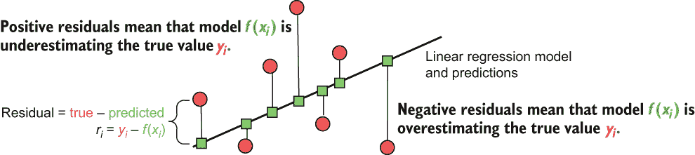

图 7.9 一个线性回归模型及其预测（正方形）拟合到数据集（圆形）。残差是真实标签（*y*[i]）和预测标签 *f*(*x*[i]）之间 *误差* 的度量。每个训练示例的残差大小表示拟合误差的程度，而残差的符号表示模型是低估还是高估。

更具体地说，回归残差向基学习器传达了两个重要的信息。对于每个训练示例，残差的幅度可以以直接的方式解释：更大的残差意味着更多的错误。

残差的符号也传达了重要信息。正残差表明当前模型的预测是*低估*真实值；也就是说，模型必须增加其预测。负残差表明当前模型的预测是*高估*真实值；也就是说，模型必须减少其预测。

损失函数及其导数允许我们测量当前模型预测与真实标签之间的残差。通过改变损失函数，我们实际上是在改变我们优先考虑不同示例的方式。

梯度提升和牛顿提升都使用浅层回归树作为弱基学习器。弱学习器（与使用强学习器的 bagging 及其变体相对比）本质上是非常低复杂度、低拟合度的模型。通过训练一系列弱学习器来纠正先前学习到的弱学习器的错误，这两种方法都在各个阶段提升了集成性能。

+   *梯度提升*——使用损失函数的负梯度作为残差来识别需要关注的训练示例。

+   *牛顿提升*——使用损失函数的 Hessian 加权梯度作为残差来识别需要关注的训练示例。损失函数的 Hessian（二阶导数）包含了局部“曲率”信息，以增加具有更高损失值的训练示例的权重。

因此，损失函数是开发有效序列集成的一个关键组成部分。

### 7.3.1 回归的损失和似然函数

在本节中，我们将探讨不同类型标签（连续值、连续值但为正数和计数值）的一些常见（和不常见）的损失函数。每个损失函数对错误的惩罚方式不同，将导致具有不同特性的学习模型，这与不同正则化函数产生具有不同特性的模型（在 7.1 节中）类似。

许多损失函数最终是从我们如何假设残差分布得来的。我们已经在 7.1 节中看到了这一点，其中我们假设连续值目标的残差可以用高斯分布来建模，计数值目标可以用泊松分布来建模，等等。

在这里，我们正式化这个概念。请注意，一些损失函数没有封闭形式的表达式。在这种情况下，可视化*底层分布的负对数*是有用的。这个术语称为*负对数似然*，有时它被优化而不是损失函数，最终在最终模型中具有相同的效果。

我们考虑三种类型的标签及其相应的损失函数。这些在图 7.10 中进行了可视化。

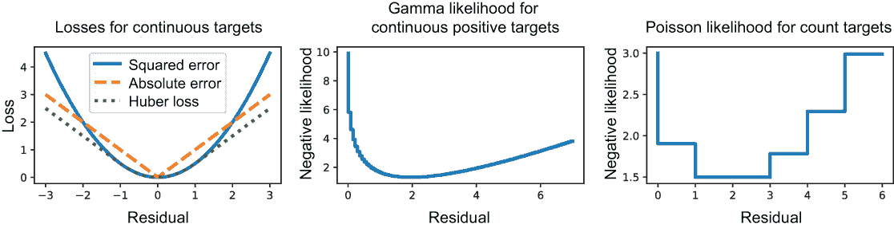

图 7.10 三种不同类型目标的损失和 log-似然函数：连续值（左），正连续值（中），和计数值（右）

连续值标签

对于连续值目标，存在几个著名的损失函数。以下是最常见的两个：

+   平方误差（SE），1/2⋅(*y* – *f*(*x*))²——直接对应于假设残差上的高斯分布

+   绝对误差（AE），|*y* - *f*(*x*)|——对应于假设残差上的拉普拉斯分布

SE 对错误的惩罚远比 AE 严重，如图 7.10 中的损失值在极端情况所示。这使得 SE 对异常值非常敏感。SE 也是一个双可微的损失函数，这意味着我们可以计算一阶和二阶导数。因此，我们可以将其用于梯度提升（使用残差）和牛顿提升（使用 Hessian 提升的残差）。AE 不是双可微的，这意味着它不能用于牛顿提升。

Huber 损失是 SE 和 AE 的混合体，并在某个用户指定的阈值τ之间切换其行为：

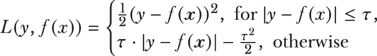

对于小于τ的残差，Huber 损失的行为类似于 SE，超过阈值，它表现为缩放后的 AE（参见图 7.10）。这使得 Huber 损失在希望限制异常值影响的情况下非常理想。

注意，由于 Huber 损失包含 AE 作为其组成部分之一，因此不能直接与牛顿提升法一起使用。因此，牛顿提升法的实现使用了一个平滑近似，称为*伪 Huber 损失*：

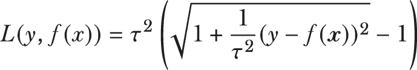

伪 Huber 损失的行为类似于 Huber 损失，尽管它是一个近似版本，对于接近零的残差（*y* - *f*(*x*)），它输出 1/2⋅(*y* – *f*(*x*))²。

连续值正标签

在某些领域，例如保险索赔分析，我们想要预测的目标标签只取正值。例如，索赔金额是连续值，但只能为正。

在这种情况下，当高斯分布不合适时，我们可以使用*伽马分布*。伽马分布是一个高度灵活的分布，可以拟合许多目标分布形状。这使得它非常适合建模问题，其中目标分布具有长尾——即不能忽略的异常值。

伽马分布不对应于一个封闭形式的损失函数。如图 7.10（中心）所示，我们之前绘制的是负对数似然，它充当了一个代理损失函数。

首先，观察损失函数仅对正实数值（x 轴）有定义。接下来，观察对数似然函数如何仅对更右侧的错误进行轻微惩罚。这允许基础模型拟合右偏斜的数据。

计数值标签

除了连续值标签之外，一些回归问题需要我们拟合计数值目标。我们已经在第 7.1 节中看到了这样的例子，我们了解到计数（离散值）可以使用泊松分布进行建模。

与伽马分布一样，泊松分布也不对应于闭式损失函数。图 7.10（右）说明了泊松分布的负对数似然，它可以用于构建回归模型（称为泊松回归）。

混合标签

在某些问题中，基础标签不能由单个分布来建模。例如，在天气分析中，如果我们想建模降雨，我们可以预期（1）在大多数日子里，我们根本不会下雨；（2）在某些日子里，会有不同程度的降雨；（3）在少数情况下，会有非常严重的降雨。

图 7.11 显示了降雨数据的分布，其中在 0 处有一个大的“点质量”或尖峰（对应于大多数无雨的日子）。此外，这个分布也是右偏斜的，因为有少数几天降雨量非常高。

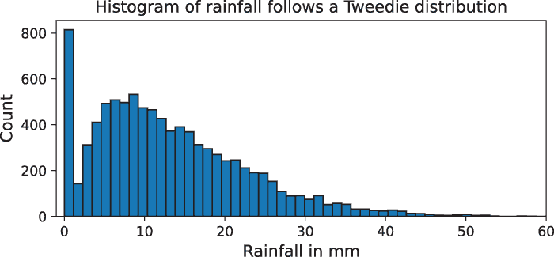

图 7.11 有效地建模某些类型的标签需要分布的组合，称为复合分布。其中一种复合分布是 Tweedie 分布。

为了建模这个问题，我们需要一个与混合分布相对应的损失函数，具体来说是一个泊松-伽马分布：泊松分布用于建模 0 处的大点质量，伽马分布用于建模右偏斜、正的连续数据。对于这样的标签，我们可以使用一个强大的概率分布族，称为 Tweedie 分布，它由 Tweedie 力参数 *p* 参数化。不同的 *p* 值会产生不同的分布：

+   *p* = 0: 高斯（正态）分布

+   *p =* 1: 泊松分布

+   1 < *p* < 2: 不同 *p* 的泊松-伽马分布

+   *p* = 2: 伽马分布

+   *p* = 3: 反高斯分布

其他 *p* 的选择会产生许多其他分布。对我们来说，我们主要对使用 1 < *p* < 2 的值感兴趣，以创建混合泊松-伽马损失函数。

LightGBM 和 XGBoost 都支持 Tweedie 分布，这导致了它们在天气分析、保险分析和健康信息学等领域的广泛应用。我们将在第 7.4 节中看到如何在我们的案例研究中使用它。

### 7.3.2 使用 LightGBM 和 XGBoost 进行梯度提升

现在，掌握了各种损失函数的知识，让我们看看如何将梯度提升回归器应用于 AutoMPG 数据集。

使用 LightGBM 进行梯度提升

首先，让我们应用标准的梯度提升，即 LightGBM 的 LGBMRegressor 与 Huber 损失函数。我们还需要选择几个 XGBoost 的超参数。这些参数控制 LightGBM 的各个组件：

+   *损失函数参数*—`alpha`是 Huber 损失参数，是它从行为类似于 MSE 转换为行为类似于 MAE 损失的阈值。

+   *学习控制参数*—`learning_rate`用于控制模型学习的速率，以便它不会快速拟合并过度拟合训练数据；`subsample`用于在训练过程中随机采样数据的一个较小部分，以诱导额外的集成多样性和提高训练效率。

+   *正则化参数*—`lambda_l1`和`lambda_l2`分别是 L1 和 L2 正则化函数的权重；它们对应于弹性网目标函数中的`a`和`b`（参见表 7.1）。

+   *树学习参数*—`max_depth`限制了集成中每个弱树的深度最大值。

每个类别中还有其他超参数，也可以提供对训练的更精细控制。我们通过组合随机搜索（因为穷举网格搜索会太慢）和交叉验证来选择超参数。列表 7.6 展示了使用 LightGBM 的示例。

除了超参数选择之外，列表还实现了早停，如果在评估集上没有观察到性能改进，则终止训练。

列表 7.6 使用 Huber 损失的 LightGBM

```
from lightgbm import LGBMRegressor
from sklearn.model_selection import RandomizedSearchCV

parameters = {'alpha': [0.3, 0.9, 1.8],                          ❶
              'max_depth': np.arange(2, 5, step=1), 
              'learning_rate': 2**np.arange(-8., 2., step=2),
              'subsample': [0.6, 0.7, 0.8],
              'lambda_l1': [0.01, 0.1, 1],
              'lambda_l2': [0.01, 0.1, 1e-1, 1]}

lgb = LGBMRegressor(objective='huber', n_estimators=100)         ❷
param_tuner = RandomizedSearchCV(lgb, parameters, 
                                 n_iter=20, cv=5,                ❸
                                 refit=True, verbose=1)

param_tuner.fit(Xtrn, ytrn,                                      ❹
                eval_set=[(Xtst, ytst)], eval_metric='mse', verbose=False)

ypred_trn = param_tuner.best_estimator_.predict(Xtrn)            ❺
ypred_tst = param_tuner.best_estimator_.predict(Xtst)
print('Train MSE = {0:5.4f}, Train MAE = {1:5.4f}\n' \
      'Test MSE = {2:5.4f}, Test MAE = {3:5.4f}'.format(
      mean_squared_error(ytrn, ypred_trn), 
      mean_absolute_error(ytrn, ypred_trn),
      mean_squared_error(ytst, ypred_tst), 
      mean_absolute_error(ytst, ypred_tst)))
```

❶ 我们想要搜索的超参数范围

❷ 初始化一个 LightGBM 回归器

❸ 由于 GridSearchCV 会较慢，因此使用 5 折交叉验证搜索超过 20 种随机参数组合

❹ 使用早停法拟合回归器

❺ 计算训练和测试误差

这会产生以下输出：

```
Fitting 5 folds for each of 20 candidates, totalling 100 fits
Train MSE = 0.0476, Train MAE = 0.1497
Test MSE = 0.0951, Test MAE = 0.2250
```

使用 Huber 损失训练的 LightGBM（梯度提升）模型在测试中达到 MSE 为 0.0951，在前面代码片段中用粗体突出显示。

使用 XGBoost 的牛顿提升

我们可以使用 XGBoost 的 XGBRegressor 重复此训练和评估。由于牛顿提升需要二阶导数，而 Huber 损失无法计算，XGBoost 不直接提供此损失。相反，XGBoost 提供了一个伪 Huber 损失，这是在第 7.3.1 节中引入的 Huber 损失的微分近似。同样，与 LightGBM 一样，我们还需要设置几个不同的超参数。XGBoost 的许多参数与 LightGBM 的参数完全对应，尽管它们的名称不同：

+   *学习控制参数*—`learning_rate`用于控制模型学习的速率，以便它不会快速拟合并过度拟合训练数据；`colsample_bytree`用于在训练过程中随机采样特征的一个较小部分（类似于随机森林），以诱导额外的集成多样性和提高训练效率。

+   *正则化参数*——reg_alpha 和 reg_lambda 分别是 L1 和 L2 正则化函数的权重；这些对应于弹性网络目标函数中的*a*和*b*（参见表 7.1）。

+   *树学习参数*——max_depth 限制了集成中每个弱树的深度。

以下列表显示了如何训练一个 XGBRegressor，包括随机超参数搜索。

列表 7.7 使用 XGBoost 和伪 Huber 损失

```
from xgboost import XGBRegressor
parameters = {'max_depth': np.arange(2, 5, step=1),           ❶
              'learning_rate': 2**np.arange(-8., 2., step=2),
              'colsample_bytree': [0.6, 0.7, 0.8],
              'reg_alpha': [0.01, 0.1, 1],
              'reg_lambda': [0.01, 0.1, 1e-1, 1]}

xgb = XGBRegressor(objective='reg:pseudohubererror')          ❷

param_tuner = RandomizedSearchCV(xgb, parameters, 
                                 n_iter=20, cv=5,             ❸
                                 refit=True, verbose=1)

param_tuner.fit(Xtrn, ytrn, eval_set=[(Xtst, ytst)],          ❹
                eval_metric='rmse', verbose=False)

ypred_trn = param_tuner.best_estimator_.predict(Xtrn)         ❺
ypred_tst = param_tuner.best_estimator_.predict(Xtst)
print('Train MSE = {0:5.4f}, Train MAE = {1:5.4f}\n' \
      'Test MSE = {2:5.4f}, Test MAE = {3:5.4f}'.format(
      mean_squared_error(ytrn, ypred_trn), 
      mean_absolute_error(ytrn, ypred_trn),
      mean_squared_error(ytst, ypred_tst), 
      mean_absolute_error(ytst, ypred_tst)))
```

❶ 我们想要搜索的超参数范围

❷ 初始化 XGBoost 回归器

❸ 由于 GridSearchCV 会较慢，因此使用 5 折交叉验证搜索超过 20 种随机参数组合

❹ 使用早停法拟合回归器

❺ 计算训练和测试误差

这产生了以下输出：

```
Fitting 5 folds for each of 20 candidates, totalling 100 fits
Train MSE = 0.0451, Train MAE = 0.1572
Test MSE = 0.0947, Test MAE = 0.2244
```

使用伪 Huber 损失训练的 XGBoost 模型在测试中实现了 0.0947 的均方误差（在列表 7.7 的输出中被加粗）。这与实现了 0.0951 测试均方误差的 LightGBM 模型的性能相似（参见列表 7.6 产生的输出）。

这说明当需要时，伪 Huber 损失是 Huber 损失的合理替代。我们很快就会看到如何使用 LightGBM 和 XGBoost 在本章案例研究中讨论的其他损失函数来预测自行车需求。

## 7.4 案例研究：需求预测

需求预测是在许多商业环境中出现的一个重要问题，当目标是预测某种产品或商品的需求时。准确预测需求对于下游供应链管理和优化至关重要：确保有足够的供应来满足需求，而又不会过多导致浪费。

需求预测通常被表述为使用历史数据和趋势构建模型来预测未来需求的回归问题。目标标签可以是连续的或计数的。

例如，在能源需求预测中，要预测的标签（以吉瓦时计的能源需求）是连续值。或者，在产品需求预测中，要预测的标签（要运输的项目数量）是计数值。

在本节中，我们研究自行车租赁预测问题。正如我们在这个节中所看到的，问题的性质（尤其是目标/标签）与气象预测和分析、保险和风险分析、健康信息学、能源需求预测、商业智能等领域中出现的性质相当相似。

我们分析数据集，然后构建越来越复杂的模型，从单个线性模型开始，然后转向集成非线性模型。在每一个阶段，我们将执行超参数调整以选择最佳的超参数组合。

### 7.4.1 UCI 自行车共享数据集

[Bike Sharing 数据集]¹是第一个跟踪主要大都市区自行车共享服务使用情况的几个类似公开数据集之一。这些数据集通过 UCI 机器学习库公开提供（[`mng.bz/GRrM`](http://mng.bz/GRrM)）。

此数据集首次于 2013 年提供，追踪了华盛顿特区 Capital Bike Sharing 的休闲骑行者和注册会员的每小时和每日自行车租赁情况。此外，数据集还包含描述天气以及一天中时间和年份的几个特征。

本案例研究中的问题总体目标是根据一天中的时间、季节和天气预测休闲骑行者的租车需求。需求以总用户数衡量——一个计数！

为什么只针对休闲骑行者建模？注册用户数量似乎在全年中相当稳定，因为这些用户可能将自行车共享作为常规交通选择，而不是娱乐活动。这类似于有月度/年度公交通行证的通勤者，而不是只按需购买公交票的游客。

记住这一点，我们为案例研究构建了一个派生数据集，该数据集可用于构建模型来预测休闲用户的租车需求。本案例研究的（修改后）数据集与本书的代码一起提供，可以按以下方式加载：

```
import pandas as pd
data = pd.read_csv('./data/ch07/bikesharing.csv')
```

我们可以使用以下方式查看数据集的统计信息：

```
data.describe()
```

这将计算数据集中所有特征的各项统计信息，如图 7.12 所示，这有助于了解各种特征及其值在高级别上的分布情况。

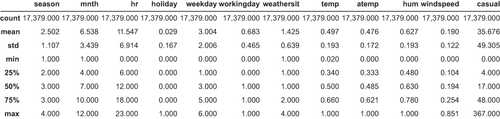

图 7.12 Bike Sharing 数据集的统计信息。其中“casual”列是预测目标（标签）。

数据集包含几个连续的天气特征：temp（归一化温度）、atemp（归一化“体感”温度）、hum（湿度）和 windspeed。分类特征 weathersit 描述了当时看到的天气类型，有四个类别：

+   1：晴朗，少量云，部分多云

+   2：雾+多云，雾+破碎云，雾+少量云，雾

+   3：小雪，小雨+雷暴+散云，雨+散云

+   4：大雨+冰雹+雷暴+雾，雪+雾

数据集还包含离散特征：season（1：冬季，2：春季，3：夏季，4：秋季）、mnth（1 到 12 代表 1 月到 12 月）和 hr（从 0 到 23 的小时）来描述时间。此外，二元特征 holiday、weekday 和 workingday 编码了问题中的天是假日、工作日还是工作日。

特征预处理

让我们通过归一化特征来预处理这个数据集，也就是说，确保每个特征具有零均值和单位标准差。归一化并不总是处理离散特征的最好方法。不过，现在我们先使用这种简单的预处理，并专注于回归的集成方法。在第八章中，我们将更深入地探讨这些类型特征的预处理策略。

列表 7.8 展示了我们的预处理步骤：它将数据分为训练集（数据量的 80%）和测试集（剩余的 20% 数据），并对特征应用归一化。一如既往，我们将测试集从训练过程中排除，以便我们可以在测试集上评估每个训练模型的性能。

列表 7.8 预处理共享单车数据集

```
labels = data.columns.get_loc('casual')                      ❶
features = np.setdiff1d(np.arange(0, len(data.columns), 1), 
                        labels)                              ❷

from sklearn.model_selection import train_test_split
trn, tst = train_test_split(data, test_size=0.2,             ❸
                            random_state=42)
Xtrn, ytrn = trn.values[:, features], trn.values[:, labels]
Xtst, ytst = tst.values[:, features], tst.values[:, labels]

from sklearn.preprocessing import StandardScaler
preprocessor = StandardScaler().fit(Xtrn)                    ❹
Xtrn, Xtst = preprocessor.transform(Xtrn), preprocessor.transform(Xtst)
```

❶ 获取标签的列索引

❷ 获取特征的列索引

❸ 分割为训练集和测试集

❹ 通过归一化预处理特征

计数型目标

我们想要预测的目标标签是偶然的，即偶然用户数量，这是一个计数型值，范围从 0 到 367。我们在图 7.13（左）中绘制了这些目标的直方图。这个数据集在 0 处有一个大的点质量，表明在许多日子里，没有偶然用户。此外，我们可以看到这个分布有一个 *长尾*，这使得它 *右偏斜*。

我们可以通过应用对数变换进一步分析这些标签，即把每个计数标签 *y* 转换为 *log*(1 + *y*)，其中我们加 1 以避免对零计数数据进行对数运算。这如图 7.13（右）所示。

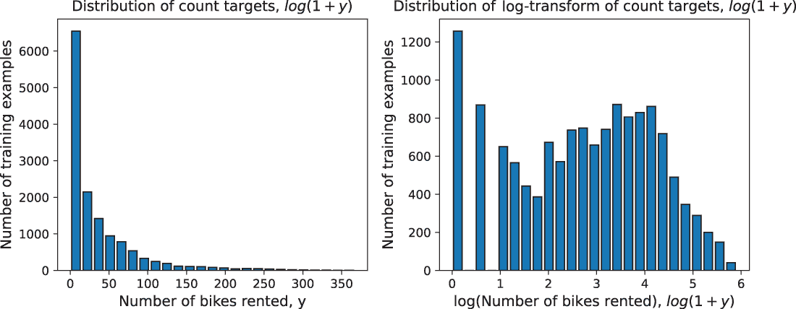

图 7.13 计数型目标直方图，偶然用户数量（左）；对数变换后的计数目标直方图（右）

这给我们提供了两个关于我们如何建模问题的深刻见解：

+   *使用 Tweedie 分布*——对数变换后的计数目标分布看起来与之前图 7.11 中显示的降雨量直方图非常相似，这表明 Tweedie 分布可能适合建模这个问题。回想一下，参数 1 *< p <* 2 的 Tweedie 分布可以模拟复合泊松-伽马分布：泊松分布用于模拟 0 处的大点质量，伽马分布用于模拟右偏斜的正连续数据。

+   *使用 GLM*——对数变换本身表明目标与特征之间存在联系。如果我们把这个回归任务建模为 GLM，我们就必须使用对数连接函数。我们希望将这个概念扩展到集成方法（通常是非线性）。

如我们很快将看到的，LightGBM 和 XGBoost 支持建模对数连接（以及其他连接函数）和泊松、伽马和 Tweedie 等分布。这使得它们能够模仿 GLM 的直觉来捕捉数据集的细微差别，同时超越 GLM 只能学习线性模型的限制。

### 7.4.2 GLM 和堆叠

让我们先训练个别的一般线性回归模型，以捕捉之前获得的直觉。此外，我们还将堆叠这些个别模型以结合它们的预测。我们将训练三个个别回归器：

+   *带有对数连接函数的 Tweedie 回归*—使用 Tweedie 分布来模拟正偏斜的目标。我们使用 scikit-learn 的 Tweedie 回归器，它要求我们选择两个参数：alpha，L2 正则化项的参数，以及 power，它应该在 1 到 2 之间。

+   *带有对数连接函数的泊松回归*—使用泊松分布来模拟计数变量。我们使用 scikit-learn 的 PoissonRegressor，它要求我们选择仅一个参数：alpha，L2 正则化项的参数。需要注意的是，在 TweedieRegressor 中将 power 设置为 1 相当于使用 PoissonRegressor。

+   *岭回归*—使用正态分布来模拟连续变量。一般来说，这种方法并不适合这些数据，但它被包括作为基线，因为它是我们将在野外遇到的最常见方法之一。

以下列表展示了我们如何通过穷举网格搜索和结合交叉验证来训练这些回归器。

列表 7.9：为自行车租赁预测训练 GLM

```
from sklearn.model_selection import GridSearchCV
from sklearn.metrics import (
    mean_squared_error, mean_absolute_error, r2_score)
from sklearn.linear_model import Ridge, PoissonRegressor, TweedieRegressor

parameters = {                                               ❶
    'GLM: Linear': {'alpha': 10 ** np.arange(-4., 1.)},
    'GLM: Poisson': {'alpha': 10 ** np.arange(-4., 1.)},
    'GLM: Tweedie': {
        'alpha': 10 ** np.arange(-4., 1.), 
        'power': np.linspace(1.1, 1.9, num=5)}}              ❷

glms = {'GLM: Linear': Ridge(),                              ❸
        'GLM: Poisson': PoissonRegressor(max_iter=1000), 
        'GLM: Tweedie': TweedieRegressor(max_iter=1000)}

best_glms = {}                                               ❹
results = pd.DataFrame()

for glm_type, glm in glms.items():
    param_tuner = GridSearchCV(                              ❺
                      glm, parameters[glm_type],     
                      cv=5, refit=True, verbose=2)

    param_tuner.fit(Xtrn, ytrn)

    best_glms[glm_type] = param_tuner.best_estimator_        ❻
    ypred_trn = best_glms[glm_type].predict(Xtrn)
    ypred_tst = best_glms[glm_type].predict(Xtst)

    res = {'Method': glm_type,                               ❼
           'Train MSE': mean_squared_error(ytrn, ypred_trn),
           'Train MAE': mean_absolute_error(ytrn, ypred_trn), 
           'Train R2': r2_score(ytrn, ypred_trn), 
           'Test MSE': mean_squared_error(ytst, ypred_tst),
           'Test MAE': mean_absolute_error(ytst, ypred_tst),
           'Test R2': r2_score(ytst, ypred_tst)}
    results = pd.concat([results, 
                         pd.DataFrame.from_dict([res])], ignore_index=True)
```

❶ 岭回归、泊松回归和 Tweedie 回归的超参数范围

❷ Tweedie 回归有一个额外的参数：power。

❸ 初始化 GLM

❹ 在交叉验证（CV）后保存单个广义线性模型（GLM）

❺ 对每个 GLM 进行网格搜索，使用 5 折交叉验证

❻ 获取最终的重新拟合 GLM 并计算训练和测试预测

❼ 为每个 GLM 计算并保存三个指标：MAE、MSE 和*R*²分数

如果我们使用 print(results)，我们将看到三个模型学到了什么。我们使用这些指标来评估训练集和测试集的性能：MSE、MAE 和*R*²分数。回想一下，*R*²分数（或决定系数）是可从数据中解释的目标方差的比例。

*R*² 分数范围从负无穷大到 1，分数越高表示性能越好。均方误差（MSE）和平均绝对误差（MAE）的范围从 0 到无穷大，误差越低表示性能越好：

```
        Method  Train MSE  Train MAE  Train R2  Test MSE  Test MAE  Test R2
   GLM: Linear  1,368.677     24.964     0.444 1,270.174    23.985    0.447
  GLM: Poisson  1,354.006     21.726     0.450 1,228.898    20.641    0.465
  GLM: Tweedie  1,383.374     21.755     0.438 1,254.304    20.661    0.454
```

测试集的性能立即证实了我们的一种直觉：假设数据具有正态分布的经典回归方法表现最差。泊松或 Tweedie 分布则显示出希望。

我们现在已经训练了三个机器学习模型：让我们通过堆叠它们来集成它们。以下列表显示了如何使用 ANN 回归来完成此操作。虽然我们训练的 GLM 是线性的，但这个堆叠模型将是非线性的！

列表 7.10：为自行车租赁预测堆叠 GLM

```
from sklearn.neural_network import MLPRegressor
from sklearn.ensemble import StackingRegressor

base_estimators = list(best_glms.items())                   ❶
meta_learner = MLPRegressor(                                ❷
                   hidden_layer_sizes=(25, 25, 25),    
                   max_iter=1000, activation='relu')

stack = StackingRegressor(base_estimators, final_estimator=meta_learner)
stack.fit(Xtrn, ytrn)                                       ❸

ypred_trn = stack.predict(Xtrn)                             ❹
ypred_tst = stack.predict(Xtst)

res = {'Method': 'GLM Stack',                               ❺
       'Train MSE': mean_squared_error(ytrn, ypred_trn),
       'Train MAE': mean_absolute_error(ytrn, ypred_trn), 
       'Train R2': r2_score(ytrn, ypred_trn), 
       'Test MSE': mean_squared_error(ytst, ypred_tst),
       'Test MAE': mean_absolute_error(ytst, ypred_tst),
       'Test R2': r2_score(ytst, ypred_tst)}
results = pd.concat([results, 
                     pd.DataFrame.from_dict([res])], ignore_index=True)
```

❶ 列表 7.9 中最佳参数设置的 GLM 是基估计器。

❷ 三层神经网络是元估计器。

❸ 训练堆叠集成

❹ 进行训练和测试预测

❺ 为此模型计算并保存三个指标：MAE、MSE 和*R*²分数

现在，我们可以比较堆叠与单个模型的结果

```
   Method   Train MSE  Train MAE  Train R2  Test MSE  Test MAE  Test R2
GLM Stack     975.428     19.011     0.604   927.214    18.199    0.596
```

堆叠的 GLM 集成已经明显提高了测试集的性能，这表明非线性模型是可行的方向。

### 7.4.3 随机森林和 Extra Trees

现在，让我们使用 scikit-learn 的 RandomForestRegressor 和 ExtraTreesRegressor 来训练更多并行集成，用于自行车租赁预测任务。这两个模块都支持 MSE、MAE 和 Poisson 作为损失函数。然而，与 GLMs 不同，随机森林和 Extra Trees 不使用对数连接函数。我们将训练两个不同的集成：一个用于 MSE 损失函数，另一个用于 Poisson 损失函数，并且每个都进行类似的超参数搜索。

对于这两种方法，我们都在寻找两个超参数的最佳选择：集成大小（n_estimators）和每个基础估计器的最大深度（max_depth）。我们可以通过每个方法的 criterion 参数设置损失函数为'squared_error'或'poisson'。

以下列表展示了我们如何通过穷举网格搜索和结合 CV 来训练这些回归器，这与我们为 GLMs 所做的方法类似。

列表 7.11 随机森林和 Extra Trees 用于自行车租赁预测

```
from sklearn.ensemble import RandomForestRegressor
from sklearn.ensemble import ExtraTreesRegressor

parameters = {                                                 ❶
    'n_estimators': np.arange(200, 600, step=100),
    'max_depth': np.arange(4, 7, step=1)}

ensembles = {                                                  ❷
    'RF: Squared Error': RandomForestRegressor(criterion='squared_error'),
    'RF: Poisson': RandomForestRegressor(criterion='poisson'),
    'XT: Squared Error': ExtraTreesRegressor(criterion='squared_error'), 
    'XT: Poisson': ExtraTreesRegressor(criterion='poisson')}

for ens_type, ensemble in ensembles.items():
    param_tuner = GridSearchCV(ensemble, parameters,           ❸
                               cv=5, refit=True, verbose=2)
    param_tuner.fit(Xtrn, ytrn)

    ypred_trn = \                                              ❹
        param_tuner.best_estimator_.predict(Xtrn)
    ypred_tst = param_tuner.best_estimator_.predict(Xtst)

    res = {'Method': ens_type,                                 ❺
           'Train MSE': mean_squared_error(ytrn, ypred_trn),
           'Train MAE': mean_absolute_error(ytrn, ypred_trn), 
           'Train R2': r2_score(ytrn, ypred_trn), 
           'Test MSE': mean_squared_error(ytst, ypred_tst),
           'Test MAE': mean_absolute_error(ytst, ypred_tst),
           'Test R2': r2_score(ytst, ypred_tst)}
    results = pd.concat([results, 
                         pd.DataFrame.from_dict([res])], ignore_index=True)
```

❶ 随机森林和 Extra Trees 的超参数范围

❷ 两个集成都使用 MSE 作为训练标准。

❸ 使用网格搜索和 5 折交叉验证进行超参数调整

❹ 获取每个集成的训练和测试预测

❺ 为每个集成计算并保存三个指标：MAE、MSE 和*R*²得分

将这些并行集成模型的成果与堆叠和单个 GLMs 进行比较。特别是，观察与单个模型相比性能的显著提升，这证明了集成方法的力量，即使是在次优损失函数上训练也是如此：

```

        Method  Train MSE  Train MAE  Train R2  Test MSE  Test MAE  Test R2
RF: Squared Error 497.514     12.530     0.798   487.923    12.264    0.788
   RF: Poisson    566.552     13.081     0.770   549.014    12.684    0.761
XT: Squared Error 567.141     13.911     0.770   559.725    13.700    0.756
   XT: Poisson    576.096     13.946     0.766   566.706    13.754    0.753
```

我们能否通过梯度提升和牛顿提升方法获得相似或更好的性能？让我们来看看。

### 7.4.4 XGBoost 和 LightGBM

最后，让我们使用 XGBoost 和 LightGBM 在这个数据集上训练序列集成。这两个包都支持广泛的损失函数：

+   XGBoost 支持的损失和似然函数包括 MSE、伪 Huber、Poisson 和 Tweedie 损失，带有对数连接函数。请注意，XGBoost 实现了牛顿提升，这需要计算二阶导数；这意味着 XGBoost 不能直接实现 MAE 或 Huber 损失。相反，XGBoost 提供了对伪 Huber 损失的支持。

+   与 XGBoost 类似，LightGBM 支持 MSE、Poisson 和 Tweedie 损失，带有对数连接函数。然而，由于它实现了梯度提升，这只需要一阶导数，它直接支持 MAE 和 Huber 损失。

对于这两个模型，我们需要调整控制集成各个方面（例如，学习率和早期停止）的几个超参数，正则化（例如，L1 和 L2 正则化的权重），以及树学习（例如，最大树深度）。

我们之前训练的许多模型只需要调整少量超参数，这使得我们能够通过网格搜索过程识别它们。网格搜索耗时，计算成本变得过高，因此在这种情况下应避免使用。与其进行详尽的网格搜索，随机搜索可以是一个有效的替代方案。

在随机超参数搜索中，我们从完整列表中采样较少的随机超参数组合。一旦我们确定了一个好的组合，我们就可以进行更精细的调整，以进一步优化我们的结果。

下面的列表显示了使用不同损失函数的 XGBoost 进行随机参数搜索和集成训练的步骤。

列表 7.12 XGBoost 用于自行车租赁预测

```
from xgboost import XGBRegressor
from sklearn.model_selection import RandomizedSearchCV

parameters = {'max_depth': np.arange(2, 7, step=1),                 ❶
              'learning_rate': 2**np.arange(-8., 2., step=2),
              'colsample_bytree': [0.4, 0.5, 0.6, 0.7, 0.8],
              'reg_alpha': [0, 0.01, 0.1, 1, 10],
              'reg_lambda': [0, 0.01, 0.1, 1e-1, 1, 10]}
print(parameters)

ensembles = {                                                       ❷
    'XGB: Squared Error': XGBRegressor(objective='reg:squarederror', 
                                       eval_metric='poisson-nloglik'),
    'XGB: Pseudo Huber': XGBRegressor(objective='reg:pseudohubererror',
                                      eval_metric='poisson-nloglik'),
    'XGB: Poisson': XGBRegressor(objective='count:poisson', 
                                 eval_metric='poisson-nloglik'),
    'XGB: Tweedie': XGBRegressor(objective='reg:tweedie',
                                 eval_metric='poisson-nloglik')}

for ens_type, ensemble in ensembles.items():
    if ens_type == 'XGB: Tweedie':                                  ❸
        parameters['tweedie_variance_power'] = np.linspace(1.1, 1.9, num=9)

    param_tuner = RandomizedSearchCV(                               ❹
                      ensemble, parameters, n_iter=50, 
                      cv=5, refit=True, verbose=2)
    param_tuner.fit(Xtrn, ytrn,                                     ❺
                    eval_set=[(Xtst, ytst)], verbose=False)

    ypred_trn = \                                                   ❻
        param_tuner.best_estimator_.predict(Xtrn)
    ypred_tst = param_tuner.best_estimator_.predict(Xtst)

    res = {'Method': ens_type,                                      ❼
           'Train MSE': mean_squared_error(ytrn, ypred_trn),
           'Train MAE': mean_absolute_error(ytrn, ypred_trn), 
           'Train R2': r2_score(ytrn, ypred_trn), 
           'Test MSE': mean_squared_error(ytst, ypred_tst),
           'Test MAE': mean_absolute_error(ytst, ypred_tst),
           'Test R2': r2_score(ytst, ypred_tst)}

    results = pd.concat([results, pd.DataFrame([res])], ignore_index=True)
```

❶ 所有 XGBoost 损失函数的超参数范围

❷ 初始化具有不同损失函数的 XGBoost 模型

❸ 对于 Tweedie 损失，我们还有一个额外的超参数：power。

❹ 使用 5 折交叉验证进行随机搜索的超参数调整

❺ 使用负泊松对数似然函数选择最佳模型

❻ 获取每个集成模型的训练和测试预测

❼ 为每个 XGBoost 集成计算并保存三个指标：MAE、MSE 和*R*²分数

注意：列表 7.12 使用提前停止来提前终止训练，如果评估集上没有明显的性能提升。当我们最后一次在 AutoMPG 数据集上使用提前停止（参考列表 7.6）时，我们使用 MSE 作为评估指标来跟踪性能提升。在这里，我们使用负泊松对数似然（eval_metric='poisson-nloglik'）。回想一下我们在 7.3.1 节中的讨论，负对数似然通常用作没有闭式形式的损失函数的替代。在这种情况下，因为我们正在对计数目标（遵循泊松分布）进行建模，所以使用负泊松对数似然来衡量模型性能可能更合适。当然，也可以将这个指标与 MSE、MAE 和*R*²一起比较，就像我们一直在做的那样。然而，这个指标并不总是可用或公开在大多数包中。

这里展示了 XGBoost 在不同损失函数下的性能：

```
        Method  Train MSE  Train MAE  Train R2  Test MSE  Test MAE  Test R2
XGB: Squared Err  134.926      7.227     0.945   254.099     9.475    0.889
XGB: Pseudo Huber 335.578      9.999     0.864   360.987    11.274    0.843
  XGB: Poisson    181.602      7.958     0.926   250.034     8.958    0.891
  XGB: Tweedie    139.167      6.958     0.944   231.110     8.648    0.899
```

这些结果显著改善，使用泊松和 Tweedie 损失训练的 XGBoost 表现最佳。

我们可以用类似的方法对 LightGBM 进行实验。这个实现（可以在配套代码中找到）与我们训练 LightGBM 模型的方法非常相似，如列表 7.6 中的 AutoMPG 数据集和列表 7.11 中的 Bike Sharing 数据集。这里展示了 LightGBM 在 MSE、MAE、Huber、泊松和 Tweedie 损失下的性能：

```
        Method  Train MSE  Train MAE  Train R2  Test MSE  Test MAE  Test R2
LGBM: Squared Err 184.264      8.293     0.925   260.745     9.535    0.887
LGBM: Absolute Er 302.753      9.071     0.877   321.206     9.756    0.860
   LGBM: Huber    744.769     12.485     0.698   702.736    12.204    0.694
LGBM: Quantile    852.409     18.726     0.654   815.393    18.671    0.645
 LGBM: Poisson    223.913      8.776     0.909   264.663     9.215    0.885
 LGBM: Tweedie    182.309      8.035     0.926   245.714     8.939    0.893
```

LightGBM 的性能与 XGBoost 相似，在泊松和 Tweedie 损失下，再次表现出最佳性能，而 XGBoost 略优于 LightGBM。

图 7.14 总结了我们对自行车租赁需求预测任务训练的所有模型的测试集性能（使用 R²分数）。我们注意到以下几点：

+   单个广义线性模型（GLM）的性能远低于任何集成方法。这并不令人惊讶，因为集成方法将多个单个模型的力量结合成一个最终的预测。此外，许多集成回归器是非线性的，并且更好地拟合数据，而所有 GLM 都是线性的并且有限。

+   选择合适的损失函数对于训练一个好的模型至关重要。在这种情况下，使用 Tweedie 拟合的 LightGBM 和 XGBoost 模型训练效果最佳。这是因为 Tweedie 损失函数捕捉了自行车需求分布，它是一个计数值目标。

+   如 LightGBM 和 XGBoost 之类的包提供了 Tweedie 等损失函数，而 scikit-learn 的集成方法实现（随机森林、Extra Trees）仅支持 MSE 和 MAE 损失（在撰写本文时）。通过采用 Tweedie 等损失函数，可以进一步提高这些方法的性能，但这需要自定义损失实现。

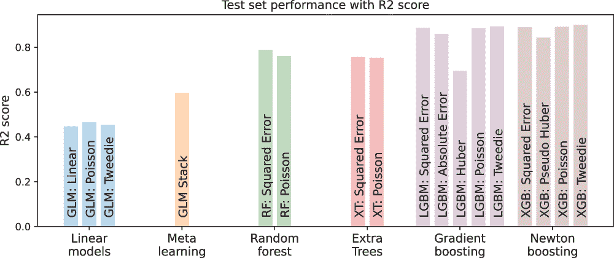

图 7.14 在我们的分析和建模过程中，回归的各种集成方法的测试集性能（使用 R²分数指标）。梯度提升（LightGBM）和牛顿提升（XGBoost）集成是目前最先进的技术。在这些方法中，通过谨慎选择损失函数和系统性地选择参数，性能可以进一步提高。

## 摘要

+   回归可以用来建模连续值、计数值，甚至离散值的目标。

+   传统的线性模型，如普通最小二乘法（OLS）、岭回归、最小绝对收缩和选择（LASSO）和弹性网络，都使用平方损失函数，但它们使用不同的正则化函数。

+   泊松回归使用带有对数连接函数的线性模型，并在目标上假设泊松分布，以有效地建模计数标签数据。

+   伽马回归使用带有对数连接函数的线性模型，并在目标上假设伽马分布，以有效地建模连续、正值且右偏的数据。

+   Tweedie 回归使用带有对数连接函数的线性模型，并假设 Tweedie 分布来对在许多实际应用中出现的数据建模复合分布，例如保险、天气和健康分析。

+   经典的均方回归、泊松回归、伽马回归、Tweedie 回归，甚至逻辑回归都是广义线性模型（GLM）的不同变体。

+   随机森林和 Extra Trees 使用随机回归树学习来诱导集成多样性。

+   常见的统计量，如平均值和中位数，可以用来结合连续目标的预测，而众数和中位数可以用来结合计数目标的预测。

+   在学习堆叠集成时，人工神经网络（ANN）回归器是元估计器的良好选择。

+   损失函数，如均方误差（MSE）、平均绝对偏差（MAD）和 Huber 损失，非常适合连续值标签。

+   伽马似然函数非常适合连续值但为正的标签（即它们不取负值）。

+   泊松似然函数非常适合计数值标签。

+   一些问题包含这些标签的混合，可以用 Tweedie 似然函数进行建模。

+   LightGBM 和 XGBoost 提供了对建模对数链接（以及其他链接函数）以及泊松、伽马和 Tweedie 等分布的支持。

+   在实践中，超参数选择，无论是通过穷举网格搜索（慢但彻底）还是随机搜索（快但近似），对于良好的集成开发至关重要。

* * *

(1.) “结合集成检测器和背景知识的活动标注”，作者为 H. Fanaee-T 和 J. Gama。*人工智能进展 2*，第 113-127 页（2014 年）。
