# 8 使用分类特征进行学习

本章涵盖

+   在机器学习中引入分类特征

+   使用监督和未监督编码对分类特征进行预处理

+   理解有序提升

+   使用 CatBoost 对分类变量进行处理

+   处理高基数分类特征

监督机器学习的数据集由描述对象的特征和描述我们感兴趣建模的目标的标签组成。在较高层次上，特征，也称为属性或变量，通常分为两种类型：连续型和分类型。

一个**分类**特征是指从一个有限且非数值的值集中取值的特征，这些值被称为类别。分类特征无处不在，几乎出现在每个数据集和每个领域中。例如：

+   *人口统计特征*—这些特征，如性别或种族，是医学、保险、金融、广告、推荐系统等许多建模问题中的常见属性。例如，美国人口普查局的种族属性是一个允许五种选择或类别的分类特征：（1）美国印第安人或阿拉斯加原住民，（2）亚洲，（3）黑人或非裔美国人，（4）夏威夷原住民或其他太平洋岛民，（5）白人。

+   *地理特征*—这些特征，如美国州或 ZIP 代码，也是分类特征。特征“美国州”是一个有 50 个类别的分类变量。特征“ZIP 代码”也是一个分类变量，在美国有 41,692 个独特的类别（！）从纽约霍尔特斯维尔的美国国内税务局的 00501 到阿拉斯加凯奇坎的 99950。

分类特征通常表示为字符串或特定格式（例如，ZIP 代码，必须恰好五位数字长，可以以零开头）。

由于大多数机器学习算法需要数值输入，因此在训练之前必须将分类特征**编码**或转换为数值形式。这种编码的性质必须仔细选择，以捕捉分类特征的真正潜在性质。

集成设置有两种处理分类特征的方法：

+   *方法 1*—使用 scikit-learn 等库中提供的几种标准或通用编码技术对分类特征进行预处理，然后使用 LightGBM 或 XGBoost 等包用预处理后的特征训练集成模型。

+   *方法 2*—使用如 CatBoost 这样的集成方法，该方法专为处理分类特征而设计，可以直接且仔细地训练集成模型。

第 8.1 节涵盖了方法 1。它介绍了用于分类特征的常用预处理方法以及如何在实践中使用它们（使用 category_encoders 包）与任何机器学习算法一起使用，包括集成方法。第 8.1 节还讨论了两个常见问题：训练集到测试集泄露和训练集到测试集分布偏移，或预测偏移，这些问题影响我们评估模型泛化能力到未来未见数据的能力。

第 8.2 节涵盖了方法 2，并介绍了一种新的集成方法，称为有序提升，它是我们之前看到的提升方法的扩展，但特别修改以解决分类特征的泄露和偏移问题。本节还介绍了 CatBoost 包，并展示了我们如何使用它来在具有分类特征的数据集上训练集成方法。我们在第 8.3 节中的实际案例研究中探讨了这两种方法，其中我们比较了随机森林、LightGBM、XGBoost 和 CatBoost 在收入预测任务上的表现。

最后，许多通用方法在处理高基数分类特征（如邮编，类别数量非常高）或存在噪声，或所谓的“脏”分类变量时，扩展性不好。第 8.4 节展示了我们如何使用 dirty_cat 包有效地处理这类高基数类别。

## 8.1 编码分类特征

本节回顾了不同类型的分类特征，并介绍了处理它们的两种标准方法类别：无监督编码（特别是有序和独热编码）和监督编码（特别是使用目标统计）。

编码技术，就像机器学习方法一样，可以是*无监督*或*监督*的。无监督编码方法仅使用特征来编码类别，而监督编码方法使用特征和目标。

我们还将看到监督编码技术如何因称为*目标泄露*的现象而导致实际性能下降。这将帮助我们理解开发有序提升方法背后的动机，我们将在第 8.3 节中探讨该方法。

### 8.1.1 分类特征的类型

分类特征包含有关训练示例所属类别或组的信息。构成此类变量的值或类别通常使用字符串或其他非数字标签表示。

广义上，分类特征分为两种类型：*有序*，其中类别之间存在顺序，和*无序*，其中类别之间不存在顺序。让我们在假设的时尚任务背景下仔细看看无序和有序的分类特征，该任务的目的是训练一个机器学习算法来预测 T 恤的成本。每件 T 恤由两个属性描述：颜色和尺寸（图 8.1）。

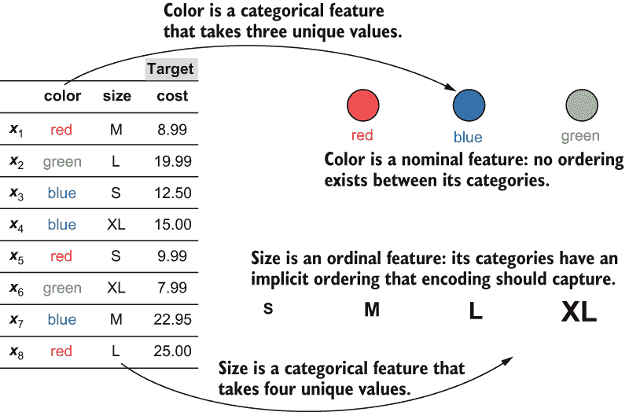

图 8.1 在这个示例数据集中，T 恤是通过两个类别特征（颜色和尺寸）描述的。类别特征可以是（1）名义的，其中各种类别之间没有顺序，或（2）有序的，其中类别之间存在顺序。本数据集中的第三个特征，成本，是一个连续的数值变量。

特征颜色有三个离散值：红色、蓝色和绿色。这些类别之间不存在顺序，这使得颜色成为一个名义特征。由于颜色的值排序无关紧要，红色-蓝色-绿色的排序与其他排序排列，如蓝色-红色-绿色或绿色-红色-蓝色，是等价的。

特征尺寸有四个离散值：S、M、L 和 XL。然而，与颜色不同，尺寸之间存在隐含的顺序：S < M < L < XL。这使得尺寸成为一个有序特征。虽然我们可以以任何方式对尺寸进行排序，但按尺寸递增顺序排序，S-M-L-XL，或按尺寸递减顺序排序，XL-L-M-S，是最合理的。理解每个类别特征的领域和性质是决定如何编码它们的重要部分。

### 8.1.2 有序和独热编码

类别变量，如颜色和尺寸，必须在训练机器学习模型之前进行编码，即转换为某种数值表示。编码是一种特征工程，必须谨慎进行，因为编码选择不当可能会影响模型性能和可解释性。

在本节中，我们将探讨两种常用的无监督类别变量编码方法：*有序编码*和*独热编码*。它们是无监督的，因为它们在编码时不使用目标（标签）。

有序编码

有序编码简单地给每个类别分配一个数字。例如，名义特征颜色可以通过分配{'red': 0, 'blue': 1, 'green': 2}进行编码。由于类别没有隐含的顺序，我们也可以通过分配其他排列，如{'red': 2, 'blue': 0, 'green': 1}进行编码。

另一方面，由于尺寸已经是有序变量，因此为保持这种顺序而分配数值是有意义的。对于尺寸，可以使用{'S': 0, 'M': 1, 'L': 2, 'XL': 3}（递增）或{'S': 3, 'M': 2, 'L': 1, 'XL': 0}（递减）进行编码，以保持尺寸类别之间的固有关系。

scikit-learn 的 OrdinalEncoder 可以用来创建有序编码。让我们对图 8.1 中的数据集（用 X 表示）中的两个类别特征（颜色和尺寸）进行编码：  

```
import numpy as np
X = np.array([['red', 'M'],
              ['green', 'L'],
              ['red', 'S'],
              ['blue', 'XL'],
              ['blue', 'S'],
              ['green', 'XL'],
              ['blue', 'M'],
              ['red', 'L']])
```

我们将指定颜色的编码，假设它可以取四个值：红色、黄色、绿色、蓝色（尽管我们只看到红色、绿色和蓝色在我们的数据中）。我们还将指定尺寸的排序为 XL、L、M、S：

```
from sklearn.preprocessing import OrdinalEncoder
encoder = OrdinalEncoder(categories=[
              ['red', 'yellow', 'green', 'blue'],   ❶
              ['XL', 'L', 'M', 'S']])               ❷
Xenc = encoder.fit_transform(X)                     ❸
```

❶ 指定有四种可能的颜色

❷ 指定尺寸应按递减顺序组织

❸ 仅使用此规范对类别特征进行编码

现在，我们可以查看这些特征的编码：

```
encoder.categories_
[array(['red', 'yello', 'green', 'blue'], dtype='<U5'),
 array(['XL', 'L', 'M', 'S'], dtype='<U5')]
```

这种编码将数字值分配给颜色，如 {'red': 0, 'yellow': 1, 'blue': 2, 'green': 3}，并将尺寸分配为 {'XL': 0, 'L': 1, 'M': 2, 'S': 3}。这种编码将这些分类特征转换为数值：

```
Xenc
array([[0., 2.],
       [2., 1.],
       [0., 3.],
       [3., 0.],
       [3., 3.],
       [2., 0.],
       [3., 2.],
       [0., 1.]])
```

将编码的颜色（Xenc 的第一列）与原始数据（X 的第一列）进行比较。所有红色条目都被编码为 0，绿色为 2，蓝色为 3。由于没有黄色条目，所以在这个列中没有值 1 的编码。

注意，顺序编码在变量之间施加了固有的顺序。虽然这对于顺序分类特征是理想的，但对于名义分类特征可能并不总是有道理。

独热编码

独热编码是一种编码分类特征的方法，它不对其值之间的顺序施加任何限制，更适合用于名义特征。为什么使用独热编码？如果我们对名义特征使用顺序编码，它将引入一个在现实世界中类别之间不存在的顺序，从而误导学习算法认为存在一个。与顺序编码不同，顺序编码使用单个数字来编码每个类别，而独热编码使用 0 和 1 的向量来编码每个类别。向量的长度取决于类别的数量。

例如，如果我们假设颜色是一个三值类别（红色、蓝色、绿色），它将被编码为长度为 3 的向量。一个这样的独热编码可以是 {'red': [1, 0, 0], 'blue': [0, 1, 0], 'green': [0, 0, 1]}。观察 1 的位置：红色对应于第一个编码条目，蓝色对应于第二个，绿色对应于第三个。

如果我们假设颜色是一个四值类别（红色、黄色、蓝色、绿色），独热编码将为每个类别生成长度为 4 的向量。在本章的其余部分，我们将假设颜色是一个三值类别。

因为尺寸有四个独特的值，独热编码也为每个尺寸类别生成长度为 4 的向量。一个这样的独热编码可以是 {'S': [1, 0, 0, 0], 'M': [0, 1, 0, 0], 'L': [0, 0, 1, 0], 'XL': [0, 0, 0, 1]}。

scikit-learn 的 OneHotEncoder 可以用来创建独热编码。和之前一样，让我们将数据集（图 8.1）中的两个分类特征（颜色和尺寸）进行编码：

```
from sklearn.preprocessing import OneHotEncoder
encoder = OneHotEncoder(categories=[
              ['red', 'green', 'blue'],    ❶
              ['XL', 'L', 'M', 'S']])      ❷
Xenc = encoder.fit_transform(X)            ❸
```

❶ 指定有三种可能的颜色

❷ 指定有四种可能的尺寸

❸ 仅使用此规范对分类特征进行编码

现在，我们可以查看这些特征的编码：

```
encoder.categories_
[array(['red', 'green', 'blue'], dtype='<U5'),
 array(['S', 'M', 'L', 'XL'], dtype='<U5')]
```

这种编码将引入三个独热特征（Xenc 中的前三列）来替换颜色特征（X 中的第一列）和四个独热特征（Xenc 中的最后四列）来替换尺寸特征（X 中的最后一列）：

```
Xenc.toarray()
array([[1., 0., 0., 0., 1., 0., 0.],
       [0., 1., 0., 0., 0., 1., 0.],
       [1., 0., 0., 1., 0., 0., 0.],
       [0., 0., 1., 0., 0., 0., 1.],
       [0., 0., 1., 1., 0., 0., 0.],
       [0., 1., 0., 0., 0., 0., 1.],
       [0., 0., 1., 0., 1., 0., 0.],
       [1., 0., 0., 0., 0., 1., 0.]])
```

每个单独的类别现在都有自己的列（每个颜色类别三个，每个尺寸类别四个），并且它们之间的任何顺序都已丢失。

注意：由于独热编码消除了类别之间的任何固有顺序，因此它是编码名义特征的理想选择。然而，这种选择也伴随着成本：我们往往倾向于扩大数据集的大小，因为我们不得不用一个包含大量二进制特征列的列来替换一个类别列，每个类别一个。

我们原始的时尚数据集是 8 个示例×2 个特征。使用有序编码，它仍然是 8×2，尽管对名义特征，即颜色，施加了一个强制排序。使用独热编码，尺寸变为 8×7，有序特征尺寸的固有顺序被移除。

### 8.1.3 使用目标统计量进行编码

我们现在将重点转向*使用目标统计量进行编码*，或称为*目标编码*，这是一种监督编码技术的例子。与无监督编码方法相比，监督编码方法使用标签来编码分类特征。

使用目标统计量进行编码背后的思想相当简单：对于每个类别，我们计算一个统计量，如目标（即标签）的平均值，并用这个新计算的数值统计量替换类别。使用标签信息进行编码通常有助于克服无监督编码方法的缺点。

与独热编码不同，目标编码不会创建任何额外的列，这意味着编码后的整体数据集的维度保持不变。与有序编码不同，目标编码不会在类别之间引入虚假的关系。

贪婪目标编码

在上一节原始的时尚数据集中，回想一下，每个训练示例是一件 T 恤，有两个属性——颜色和尺寸——以及要预测的目标是成本。假设我们想要用目标统计量来编码颜色特征。这个特征有三个类别——红色、蓝色和绿色——需要编码。

图 8.2 说明了使用目标统计量进行编码对红色类别的工作方式。

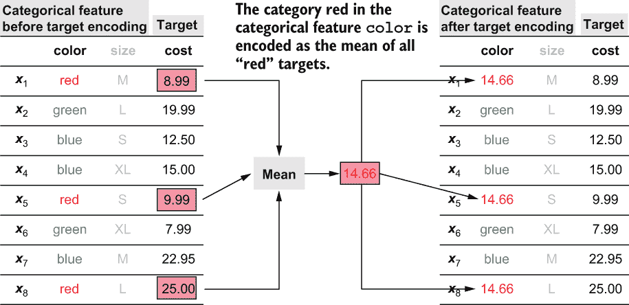

图 8.2 特征颜色的类别红色被其目标统计量替换，即所有目标值（成本）的平均值（均值），对应于颜色为红色的示例。这被称为贪婪目标编码，因为所有训练标签都已用于编码。

有三件 T 恤，*x*[1]，*x*[5]，和*x*[8]，它们的颜色是红色。它们对应的目标值（成本）分别是 8.99，9.99 和 25.00。目标统计量是这些值的平均值：(8.99 + 9.99 + 25.00) / 3 = 14.66。因此，每个红色的实例都被其对应的目标统计量 14.66 所替换。其他两个类别，蓝色和绿色，可以类似地用它们对应的目标统计量 16.82 和 13.99 进行编码。

更正式地说，第*j*个特征的第*k*个类别的目标统计量可以使用以下公式计算：

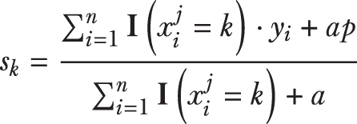

在这里，符号 I(x^(j[i]) = k)表示一个指示函数，当括号内的条件为真时返回 1，为假时返回 0。例如，在我们的时尚数据集中，I(x^[1]^(color) = red)因为第一个示例对应于中红色 T 恤，而 I(x^[4]^(color) = red)因为第四个示例对应于 XL 蓝色 T 恤。

这个计算目标统计的公式实际上计算的是一个*平滑平均值*而不是简单的平均值。通过向分母添加一个参数*a* > 0 来执行平滑。这是为了确保具有少量值（因此分母较小）的类别不会得到与其它类别不同缩放的目标统计。分子中的常数*p*通常是整个数据集的平均目标值，它作为*先验*，或者作为正则化目标统计的手段。

通常，先验是我们拥有的任何额外知识，我们可以将其传递给学习算法以改进其训练。例如，在贝叶斯学习中，通常指定一个先验概率分布来表达我们对数据集分布的信念。在这种情况下，先验指定了如何对非常罕见出现的类别应用编码：简单地用一个接近*p*的值替换。

这种目标编码方法被称为*贪婪目标编码*，因为它使用所有可用的训练数据来计算编码。正如我们将看到的，贪婪编码方法会从训练数据泄露信息到测试集。这种“泄露”是有问题的，因为在一个训练和测试过程中被识别为高性能的模型，在实际部署和生产中往往表现不佳。

信息泄露和分布偏移

许多预处理方法都受到两个常见实际问题的其中一个或两个的影响：*从训练到测试集的信息泄露*和*从训练到测试集的分布偏移*。这两个问题都会影响我们评估训练模型的能力，以及准确估计它在未来未见数据上的行为，即它如何泛化的能力。

机器学习模型开发的关键步骤之一是创建一个保留测试集，该集用于评估训练好的模型。测试集必须完全从建模的每个阶段（包括预处理、训练和验证）中分离出来，并且仅用于评估模型性能，以模拟模型在未见数据上的性能。为了有效地做到这一点，我们必须确保训练数据中的任何部分都不会进入测试数据。当这种情况在建模过程中发生时，被称为“从训练到测试集的信息泄露”。

当特征信息泄露到测试集时，发生数据泄露；而当目标（标签）信息泄露到测试集时，发生目标泄露。贪婪目标编码导致目标泄露，如图 8.3 所示。在这个例子中，一个包含 12 个数据点的数据集被划分为训练集和测试集。训练集被用来对特征颜色中的类别红色进行贪婪目标编码。更具体地说，从训练集的目标编码被用来转换*训练集和测试集*。这导致从训练集到测试集的目标信息泄露，使得这是一个目标泄露的实例。

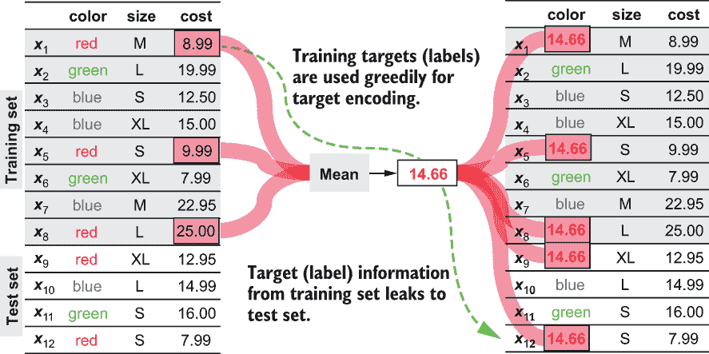

图 8.3 展示了从训练集到测试集的目标泄露。训练集中的所有目标（标签）都被贪婪地用来为红色创建编码，这个编码被用来在训练集和测试集中编码这个类别，导致目标泄露。

对于训练-测试集划分的另一个考虑因素是确保训练集和保留的测试集具有相似的分布；也就是说，它们具有相似的统计特性。这通常是通过从整体集中随机采样保留的测试集来实现的。

然而，预处理技术如贪婪目标编码可能会在训练集和测试集之间引入差异，导致训练集和测试集之间的*预测偏移*，如图 8.4 所示。与之前一样，特征颜色中的类别红色使用贪婪目标统计进行编码。这种编码是通过计算训练数据中颜色等于红色的示例对应的目标的平均值来计算的，其值为 14.66。

然而，如果我们只计算测试数据中颜色等于红色对应的目标的平均值，平均值为 10.47。这种训练集和测试集之间的差异是贪婪目标编码的副产品，它导致测试集的分布相对于训练集分布发生偏移。换句话说，测试集的统计特性现在不再与训练集相似，这对我们的模型评估产生了不可避免的连锁影响。

目标泄露和预测偏移都会将统计偏差引入我们用来评估训练模型泛化性能的性能指标中。通常，它们高估了泛化性能，使得训练模型看起来比实际情况更好，当这种模型部署并无法按预期执行时，这会引发问题。

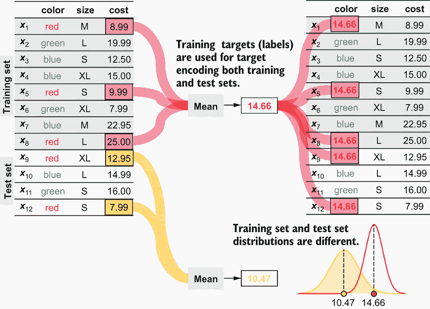

图 8.4 展示了训练集和测试集之间的分布偏移。由于测试集的目标编码是使用训练集计算的，这可能导致测试集（黄色）相对于训练集（红色）的分布和统计特性发生偏移。

保留和留一法目标编码

消除目标泄露和预测偏差的最好（也是最简单）的方法是保留一部分训练数据用于编码。因此，除了训练集和保留测试集之外，我们还需要创建一个保留编码集！

这种方法称为*保留目标编码*，如图 8.5 所示。在这里，我们的数据集来自图 8.3 和图 8.4，被分为三个集合——一个训练集、一个保留编码集和一个保留测试集——每个集合包含四个数据点。

保留编码集用于计算训练集和测试集的目标编码。这确保了训练集和测试集的独立性，消除了目标泄露。此外，因为训练集和测试集使用相同的目标统计，它也避免了预测偏差。

保留目标编码的一个主要缺点是其数据效率低下。为了避免泄露，一旦使用保留编码集来计算编码，就需要将其丢弃，这意味着可用于建模的大量数据可能会被浪费。

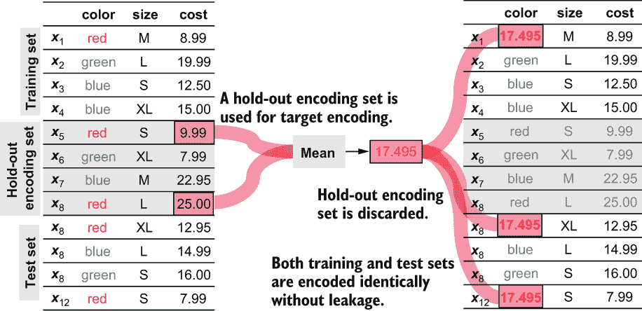

图 8.5 中，保留编码将可用数据分为三个集合：训练集和测试集，如常规操作，以及第三个仅用于使用目标统计进行编码的保留测试集。这避免了目标泄露和分布偏移。

避免数据效率低下的一个（不完美）的替代方案是使用*留一法*（LOO）目标编码，如图 8.6 所示。LOO 编码的工作原理与 LOO 交叉验证（LOO CV）类似，不同之处在于被排除的示例是用于编码而不是验证。

在图 8.6 中，我们看到为了对红色示例 x[5]执行 LOO 目标编码，我们使用其他两个红色训练示例 x[1]和 x[8]来计算目标统计，同时排除 x[5]。然后，依次对其他两个红色训练示例 x[1]和 x[8]重复此过程。不幸的是，LOO 编码不能包括测试集中的示例，因为我们想避免泄露。因此，我们可以像之前一样，对测试集应用贪婪目标编码。

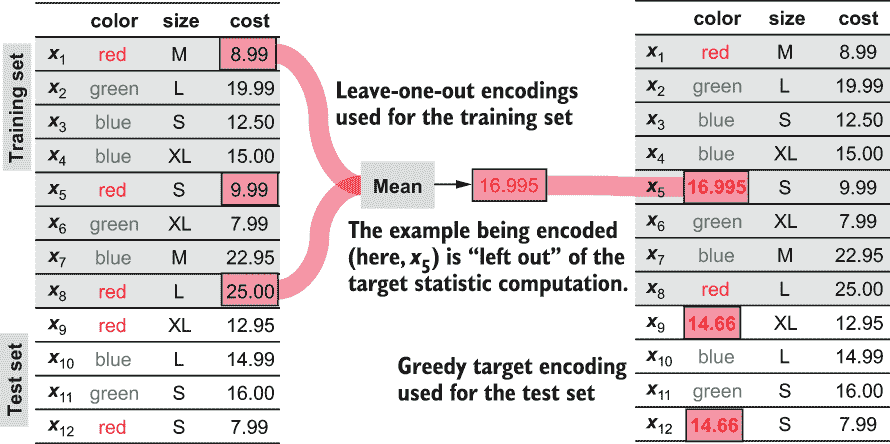

图 8.6 中，LOO 目标编码应用于训练数据，以避免创建一个浪费的保留编码集。而不是保留数据的一个子集，只有正在编码的示例被保留。测试数据使用之前的方法，即贪婪目标编码进行编码。

如我们所见，LOO 目标编码过程旨在模拟保留目标编码，同时显著提高数据效率。然而，应该注意的是，这个整体过程并没有完全消除目标泄露和预测偏差问题。

正如我们在第 8.2 节中将要看到的，另一种编码策略称为*有序目标统计*，旨在进一步缓解目标泄露和预测偏差的问题，同时确保数据和计算效率。

### 8.1.4 category_encoders 包

本节提供了如何为具有分类特征的数据集组合端到端编码和训练管道的示例。子包 sklearn .preprocessing 提供了一些常见的编码器，如 OneHotEncoder 和 OrdinalEncoder。

然而，我们将使用 category_encoders ([`mng.bz/41aQ`](http://mng.bz/41aQ))包，它提供了许多更多的编码策略，包括贪婪和 LOO 目标编码。category_encoders 与 scikit-learn 兼容，这意味着它可以与其他提供 sklearn 兼容接口的集成方法实现一起使用（例如，本书中讨论的 LightGBM 和 XGBoost）。

我们将使用来自 UCI 机器学习仓库的澳大利亚信用批准数据集 ([`mng.bz/Q8D4`](http://mng.bz/Q8D4))。此数据集的干净版本以及本书的源代码都可用，我们将使用此版本来演示实际中的分类编码。该数据集包含六个连续特征、四个二进制特征和四个分类特征，任务是确定是否批准或拒绝信用卡申请，即二元分类。

首先，让我们加载数据集并查看特征名称和前几行：

```
import pandas as pd
df = pd.read_csv('./data/ch08/australian-credit.csv')
df.head()
```

此代码片段以表格形式打印数据集的前几行，如图 8.7 所示。

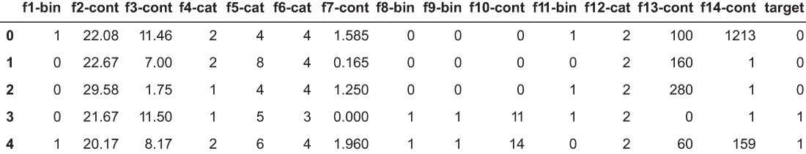

图 8.7 来自 UCI 机器学习仓库的澳大利亚信用批准数据集。属性名称已被更改，以保护数据集中代表个人的隐私。

特征名称的形式为 f1-bin、f2-cont 或 f5-cat，表示列索引以及特征是否为二进制、连续或分类。为了保护申请人的隐私，类别字符串和名称已被替换为整数值；也就是说，分类特征已经使用序数编码处理过！

让我们将列分为特征和标签，然后像往常一样进一步分割为训练集和测试集：

```
X, y = df.drop('target', axis=1), df['target']
from sklearn.model_selection import train_test_split
Xtrn, Xtst, ytrn, ytst = train_test_split(X, y, test_size=0.2,
                                          random_state=13)
```

此外，让我们明确识别我们感兴趣的预处理中的分类和连续特征：

```
cat_features = ['f4-cat', 'f5-cat', 'f6-cat', 'f12-cat']
cont_features = ['f2-cont', 'f3-cont', 'f7-cont', 'f10-cont', 
                 'f13-cont', 'f14-cont']
```

我们将以不同的方式预处理连续和分类特征。连续特征将被标准化；也就是说，连续特征的每一列将被重新缩放，以具有零均值和单位标准差。这种缩放确保不同的列不会具有截然不同的尺度，这可能会破坏下游学习算法。

分类特征将使用独热编码进行预处理。为此，我们将使用来自 category_encoders 包的 OneHotEncoder。我们将创建两个独立的预处理管道，一个用于连续特征，另一个用于分类特征：

```
import category_encoders as ce
from sklearn.preprocessing import StandardScaler
from sklearn.pipeline import Pipeline

preprocess_continuous = Pipeline(steps=[('scaler', StandardScaler())]) 
preprocess_categorical = Pipeline(steps=[('encoder', 
                                  ce.OneHotEncoder(cols=cat_features))])  
```

注意，ce.OneHotEncoder 需要我们明确指定对应于分类特征的列，否则它将对*所有*列应用编码。

现在我们有了两个独立的管道，我们需要将这些管道组合起来，以确保正确的预处理应用于正确的特征类型。我们可以使用 scikit-learn 的 ColumnTransformer 来实现这一点，它允许我们将不同的步骤应用于不同的列：

```
from sklearn.compose import ColumnTransformer
ct = ColumnTransformer(
         transformers=[('continuous',                                ❶
                            preprocess_continuous, cont_features),
                       ('categorical',                               ❷
                            preprocess_categorical, cat_features)], 
                       remainder='passthrough')                      ❸
```

❶ 在这里预处理连续特征

❷ 在这里预处理分类特征

❸ 保持剩余特征不变

现在，我们可以在训练集上拟合一个预处理程序，并将转换应用于训练集和测试集：

```
Xtrn_one_hot = ct.fit_transform(Xtrn, ytrn)
Xtst_one_hot = ct.transform(Xtst)
```

观察到测试集没有被用于拟合预处理管道。这是一个微妙但重要的实际步骤，以确保测试集被保留，并且由于预处理而没有意外数据或目标泄漏。现在，让我们看看独热编码对我们特征集大小做了什么：

```
print('Num features after ONE HOT encoding = {0}'.format(
                                                   Xtrn_one_hot.shape[1]))
Num features after ONE HOT encoding = 38
```

由于独热编码为每个分类特征的每个类别引入了一个新列，因此列的总数从 14 增加到 38！现在让我们在预处理后的数据集上训练和评估 RandomForestClassifier：

```
from sklearn.ensemble import RandomForestClassifier
model = RandomForestClassifier(n_estimators=200, 
                               max_depth=6, criterion='entropy')
model.fit(Xtrn_one_hot, ytrn)

from sklearn.metrics import accuracy_score
ypred = model.predict(Xtst_one_hot)
print('Model Accuracy using ONE HOT encoding = {0:5.3f}%'.
       format(100 * accuracy_score(ypred, ytst)))

Model Accuracy using ONE HOT encoding = 89.855%
```

我们的独热编码策略学习了一个模型，其保留测试准确率为 89.9%。除了 OneHotEncoder 和 OrdinalEncoder 之外，category_encoders 包还提供了许多其他编码器。对我们感兴趣的编码器有两个：贪婪目标编码器（TargetEncoder）和 LeaveOneOutEncoder，它们可以像 OneHotEncoder 一样使用。具体来说，我们只需在以下代码中将 OneHotEncoder 替换为 TargetEncoder：

```
preprocess_categorical = \ 
    Pipeline(steps=[('encoder', ce.TargetEncoder(cols=cat_features, 
                                                 smoothing=10.0))])  
```

TargetEncoder 取一个额外的参数，即平滑度，这是一个正值，它结合了平滑和应用先验的效果（参见第 8.1.2 节）。更高的值会强制进行更高的平滑，并可以对抗过拟合。预处理和训练后，我们有以下结果：

```
Num features after GREEDY TARGET encoding = 14
Model Accuracy using GREEDY TARGET encoding = 91.304%
```

与独热编码不同，贪婪目标编码不会添加任何新列，这意味着数据集的整体维度保持不变。我们可以以类似的方式使用 LeaveOneOutEncoder：

```
preprocess_categorical = Pipeline(steps=[('encoder',
                             ce.LeaveOneOutEncoder(cols=cat_features,
                                                   sigma=0.4))]) 
```

sigma 参数是一个噪声参数，旨在减少过拟合。用户手册建议使用 0.05 到 0.6 之间的值。预处理和训练后，我们再次得到以下结果：

```
Num features after LEAVE-ONE-OUT TARGET encoding = 14
Model Accuracy using LEAVE-ONE-OUT TARGET encoding = 90.580%
```

与 TargetEncoder 一样，由于预处理，特征数量保持不变。

## 8.2 CatBoost：有序提升框架

*CatBoost* 是由 Yandex 开发的另一个开源梯度提升框架。CatBoost 对经典的牛顿提升方法进行了三项主要改进：

+   它专门针对分类特征，与其他更通用的提升方法不同。

+   它使用有序提升作为其底层集成学习方法，这使得它在训练过程中可以隐式地解决目标泄漏和预测偏移问题。

+   它使用无知的决策树作为基估计器，这通常会导致更快的训练时间。

注意：CatBoost 在许多平台上都可用，适用于 Python。有关安装的详细说明，请参阅 CatBoost 安装指南，网址为[`mng.bz/X5xE`](http://mng.bz/X5xE)。在撰写本文时，CatBoost 仅支持 64 位版本的 Python。

### 8.2.1 有序目标统计量和有序提升

CatBoost 以两种方式处理分类特征：(1) 通过使用目标统计量将分类特征编码，如之前所述，以及(2) 通过巧妙地创建特征的分类组合（并将它们也用目标统计量进行编码）。虽然这些修改使 CatBoost 能够无缝处理分类特征，但它们确实引入了一些必须解决的问题。

正如我们之前看到的，使用目标统计量进行编码会引入目标泄漏，更重要的是，在测试集中会产生预测偏移。处理这个问题最理想的方法是创建一个保留编码集。

仅为了编码而保留训练示例，而不做其他任何事情，这相当浪费数据，这意味着这种方法在实践中很少使用。另一种方法，LOO 编码，更节省数据，但并不能完全缓解预测偏移。

除了编码特征的问题外，梯度提升和牛顿提升都在迭代之间重用数据，导致梯度分布偏移，这最终会导致进一步的预测偏移。换句话说，即使我们没有分类特征，我们仍然会有预测偏移问题，这会偏误我们对模型泛化的估计！

CatBoost 通过使用排列对训练示例进行排序来解决预测偏移这一核心问题，以(1)计算编码分类变量（称为有序目标统计量）的目标统计量，以及(2)训练其弱估计器（称为有序提升）。

有序目标统计量

在本质上，排序原则简单而优雅，包括两个步骤：

1.  根据随机排列重新排序训练示例。

1.  为了计算第*i*个训练示例的目标统计量，根据这个随机排列使用前*i* - 1 个训练示例。

这在图 8.8 中用八个训练示例进行了说明。首先，示例被随机排列成随机顺序：4、7、1、8、2、6、5、3。现在，为了计算每个训练示例的目标统计量，我们假设这些示例是按顺序到达的。

例如，为了计算示例 2 的目标统计量，我们只能使用我们之前“看到”的序列中的示例：4、7、1 和 8。然后，为了计算示例 6 的目标统计量，我们只能使用我们之前已经看到的序列中的示例，现在：4、7、1、8、*以及* 2，依此类推。

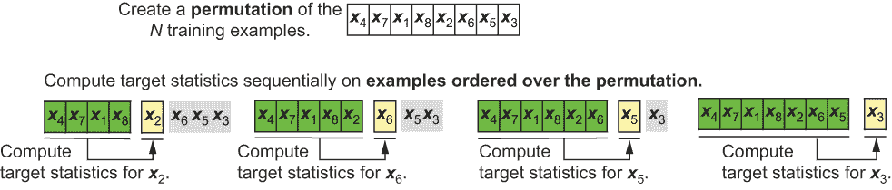

图 8.8 展示了有序目标统计量首先将示例随机排列成随机序列，仅使用有序序列中的先前示例来计算目标统计量。

因此，为了计算第*i*个训练示例的编码，有序目标统计从不使用其自己的目标值；这种行为类似于 LOO 目标编码。两者之间的关键区别是有序目标统计使用它已经看到的示例的“历史”概念。

这种方法的缺点之一是，在随机序列中较早出现的训练示例编码的示例数量要少得多。为了在实践中补偿这一点并增加鲁棒性，CatBoost 维护几个序列（即历史记录），这些序列反过来又是随机选择的。这意味着 CatBoost 在每个迭代中重新计算分类变量的目标统计。

有序提升

CatBoost 本质上是一种牛顿提升算法（参见第六章）；也就是说，它使用损失函数的一阶和二阶导数来训练其组成部分的弱估计器。

如前所述，预测偏移有两个来源：变量编码和梯度计算本身。为了避免由于梯度引起的预测偏移，CatBoost 将排序的想法扩展到训练其弱学习器。另一种思考方式是牛顿提升+排序=CatBoost。

图 8.9 说明了有序提升，类似于有序目标统计。例如，为了计算示例 2 的残差和梯度，有序提升仅使用它之前看到的序列中的示例来训练模型：4, 7, 1, 和 8。与有序目标统计一样，CatBoost 使用多个排列来增加鲁棒性。这些残差现在用于训练其弱估计器。

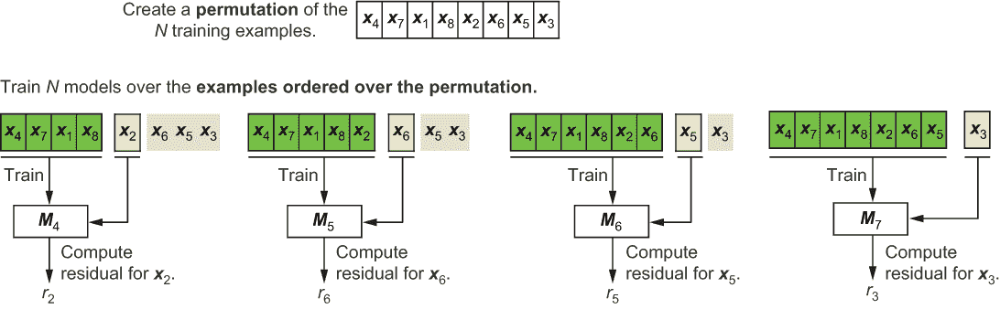

图 8.9 有序提升也随机排列示例，并仅使用有序序列中的先前示例来计算梯度（残差）。这里展示了在第 4 次迭代（使用估计器 M4 示例*x*[2]）时如何计算残差，在第 5 次迭代（使用估计器 M5 示例*x*[6]）时如何计算，依此类推。

### 8.2.2 无意识决策树

与 XGBoost 和 CatBoost 等牛顿提升实现之间的另一个关键区别是基估计器。XGBoost 使用标准决策树作为弱估计器，而 CatBoost 使用*无意识决策树*。

无意识决策树在整个树的某个级别（深度）的所有节点中使用相同的分割标准。这如图 8.10 所示，比较了具有四个叶子节点的标准决策树和无意识决策树。

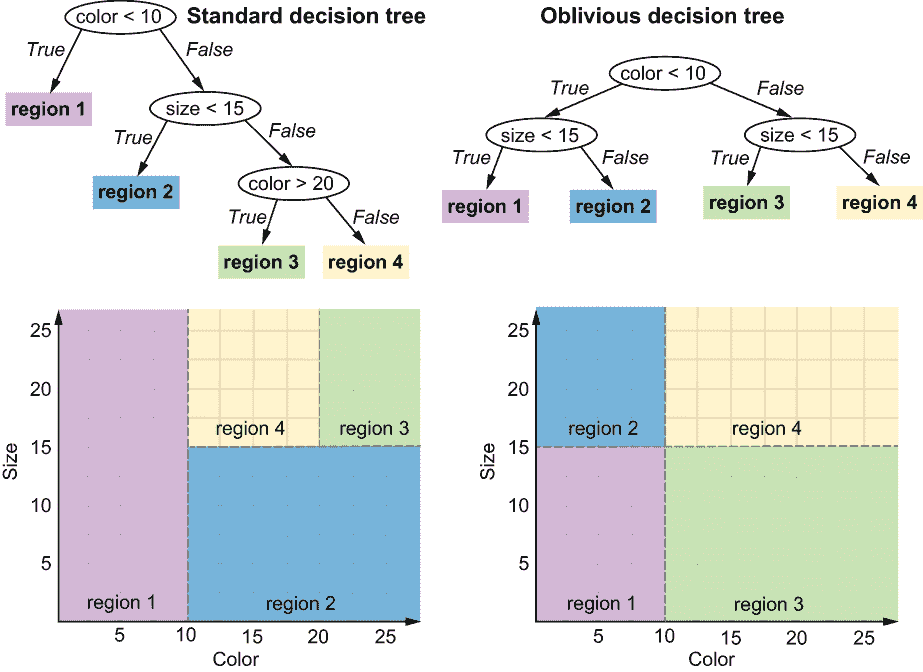

图 8.10 比较标准决策树和无意识决策树，每个都有四个叶子节点。观察发现，无意识决策树深度 2 的决策节点都是相同的（大小<15）。这是无意识决策树的关键特性：每个深度只学习一个分割标准。

在这个例子中，观察第二层无知的树（右侧）在每个节点都使用相同的决策标准，即大小 < 15。虽然这是一个简单的例子，但请注意，我们只需要为无知的树学习两个分割标准，而不是标准的决策树。这使得无知的树更容易且更高效地训练，从而加快了整体训练速度。此外，无知的树是平衡且对称的，这使得它们更简单，更不容易过度拟合。

### 8.2.3 CatBoost 的实际应用

本节展示了如何使用 CatBoost 创建训练管道。我们还将查看如何设置学习率并采用早期停止作为控制过度拟合的手段的示例：

+   通过选择一个有效的学习率，我们试图控制模型学习的速率，使其不会快速拟合并过度拟合训练数据。我们可以将其视为一种主动建模方法，其中我们试图确定一个好的训练策略，以便它能够导致一个好的模型。

+   通过实施早期停止，我们试图在观察到模型开始过度拟合时立即停止训练。我们可以将其视为一种反应式建模方法，其中我们考虑在认为我们有一个好模型时立即终止训练。

我们将使用在 8.1.4 节中使用的澳大利亚信用批准数据集。以下列表提供了一个如何使用 CatBoost 的简单示例。

列表 8.1 使用 CatBoost

```
import pandas as pd
df = pd.read_csv('./data/ch08/australian-credit.csv')       ❶
cat_features = ['f4-cat', 'f5-cat', 'f6-cat', 'f12-cat']    ❷

X, y = df.drop('target', axis=1), df['target']

from sklearn.model_selection import train_test_split
Xtrn, Xtst, ytrn, ytst = train_test_split(                  ❸
                             X, y, test_size=0.2)

from catboost import CatBoostClassifier
ens = CatBoostClassifier(iterations=5, depth=3,             ❹
                         cat_features=cat_features)         ❺
ens.fit(Xtrn, ytrn)
ypred = ens.predict(Xtst)
print('Model Accuracy using CATBOOST = {0:5.3f}%'.
      format(100 * accuracy_score(ypred, ytst)))
```

❶ 将数据集作为 pandas DataFrame 加载

❷ 明确识别分类特征

❸ 准备训练和评估数据

❹ 训练一个由五个深度为 3 的无知的树组成的集成

❺ 确保 CatBoost 知道哪些特征是分类的

此列表如下训练和评估 CatBoost 模型：

```
Model Accuracy using CATBOOST = 83.333%
```

使用 CatBoost 进行交叉验证

CatBoost 为回归和分类任务提供了许多损失函数，以及许多用于控制训练各个方面（包括通过控制集成的复杂性（每次迭代训练一棵树）和基估计器的复杂性（无知的决策树深度））以控制过度拟合的超参数）的功能。

除了这些之外，另一个关键的超参数是学习率。回想一下，学习率允许我们更好地控制集成复杂性的增长速度。因此，在实践中为我们的数据集确定一个最佳的学习率可以帮助避免过度拟合，并在训练后很好地泛化。

与之前的集成方法一样，我们将使用 5 折交叉验证来搜索几个不同的超参数组合，以确定最佳模型。以下列表说明了如何使用 CatBoost 进行交叉验证。

列表 8.2 使用 CatBoost 的交叉验证

```
params = {'depth': [1, 3],
          'iterations': [5, 10, 15], 
          'learning_rate': [0.01, 0.1]}                 ❶

ens = CatBoostClassifier(cat_features=cat_features)     ❷
grid_search = ens.grid_search(params, Xtrn, ytrn,       ❸
                              cv=5, refit=True)         ❹

print('Best parameters: ', grid_search['params'])
ypred = ens.predict(Xtst)
print('Model Accuracy using CATBOOST = {0:5.3f}%'.
      format(100 * accuracy_score(ypred, ytst)))
```

❶ 创建可能的参数组合的网格

❷ 明确识别分类特征

❸ 使用 CatBoost 内置的网格搜索功能

❹ 执行 5 折交叉验证，然后使用网格搜索后确定的最佳参数重新拟合模型

此列表使用 5 折交叉验证评估了在参数中指定的（2 x 3 x 2 = 12）超参数组合，以确定最佳参数组合，并使用它重新拟合（即重新训练）最终模型：

```
Best parameters:  {'depth': 3, 'iterations': 15, 'learning_rate': 0.1}
Model Accuracy using CATBOOST = 82.609%
```

使用 CatBoost 进行早期停止

与其他集成方法一样，CatBoost 在每次迭代中都会向集成中添加一个新的基估计器。这导致整个集成在训练过程中的复杂性稳步增加，直到模型开始过拟合训练数据。与其他集成方法一样，可以使用 CatBoost 的早期停止，通过评估集监控 CatBoost 的性能，一旦性能没有显著改进，就立即停止训练。

在列表 8.3 中，我们初始化 CatBoost 以训练 100 棵树。通过 CatBoost 的早期停止，可以提前终止训练，从而确保模型质量以及训练效率，类似于 LightGBM 和 XGBoost。

列表 8.3 使用 CatBoost 进行早期停止

```
ens = CatBoostClassifier(iterations=100, depth=3,         ❶
                         cat_features=cat_features,
                         loss_function='Logloss')

from catboost import Pool
eval_set = Pool(Xtst, ytst, cat_features=cat_features)    ❷

ens.fit(Xtrn, ytrn, eval_set=eval_set, 
        early_stopping_rounds=5,                          ❸
        verbose=False, plot=True)                         ❹

ypred = ens.predict(Xtst)
print('Model Accuracy using CATBOOST = {0:5.3f}%'.
       format(100 * accuracy_score(ypred, ytst)))
```

❶ 初始化一个具有 100 个集成大小的 CatBoostClassifier

❷ 通过合并“Xtst”和“ytst”创建一个评估集

❸ 如果在五轮之后没有检测到改进，则停止训练

❹ 将 CatBoost 的绘图设置为“true”以绘制训练和评估曲线

此代码生成了如图 8.11 所示的训练和曲线，其中可以观察到过拟合的影响。大约在第 80 次迭代时，训练曲线（虚线）仍在持续下降，而评估曲线已经开始变平。

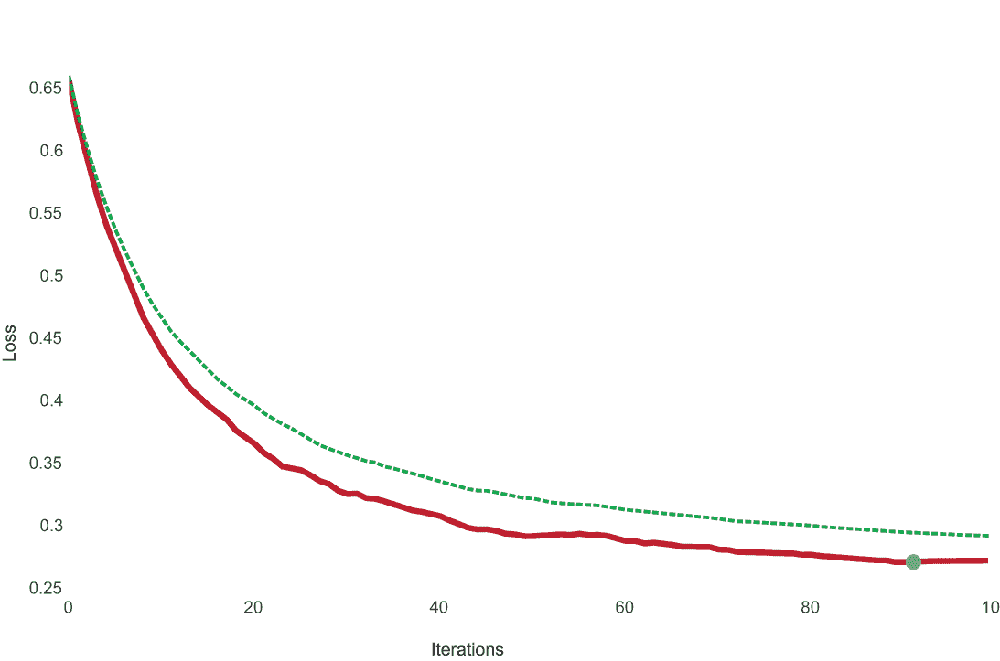

图 8.11 CatBoost 生成的训练（虚线）和评估（实线）曲线。第 88 次迭代的点表示早期停止点。

这意味着训练错误在继续下降，而我们的验证集没有相应的下降，表明过拟合。CatBoost 观察到这种行为持续了五次迭代（因为 early_stopping_rounds=5），然后终止了训练。

最终模型报告了测试集性能为 82.61%，经过 88 轮迭代后达到，通过早期停止避免了按照最初指定的 100 次迭代进行训练：

```
Model Accuracy using CATBOOST = 82.609%
```

## 8.3 案例研究：收入预测

在本节中，我们研究从人口统计数据中预测*收入*的问题。人口统计数据通常包含许多不同类型的特征，包括分类和连续特征。我们将探讨两种训练集成方法的途径：

+   *方法 1（第 8.3.2 节和第 8.3.3 节）*—使用 category_encoders 包预处理分类特征，然后使用 scikit-learn 的随机森林、LightGBM 和 XGBoost 对预处理后的特征进行集成训练。

+   *方法 2（第 8.3.4 节）*—使用 CatBoost 在训练过程中直接处理分类特征，通过有序目标统计和有序提升。

### 8.3.1 成人数据集

本案例研究使用了 UCI 机器学习仓库中的成人数据集。任务是预测个人每年收入是否超过或低于 50,000 美元，基于教育、婚姻状况、种族和性别等几个人口统计指标。

该数据集包含了一系列分类和连续特征，这使得它成为本案例研究的理想选择。数据集和源代码都可用。让我们加载数据集并可视化它（见图 8.12）：

```
import pandas as pd
df = pd.read_csv('./data/ch08/adult.csv')
df.head()
```

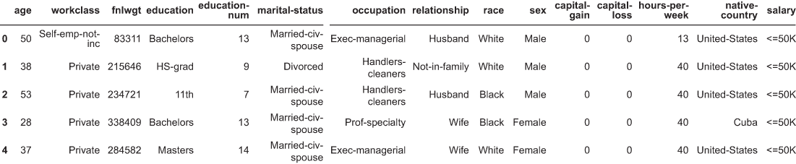

图 8.12 成人数据集包含分类和连续特征。

该数据集包含几个分类特征：

+   workclass—描述了就业类型的分类，包含八个类别：私营、自营非营利、自营营利、联邦政府、地方政府、州政府、无报酬、从未工作过。

+   education—描述了达到的最高教育水平，包含 16 个类别：学士学位、一些大学、11 年级、高中毕业、专业学校、大专、专科、9 年级、7-8 年级、12 年级、硕士学位、1-4 年级、10 年级、博士学位、5-6 年级、学前教育。

+   marital-status—描述了婚姻状况，有七个类别：已婚平民配偶、离婚、未婚、分居、丧偶、已婚配偶缺席、已婚 AF 配偶。

+   occupation—描述了职业领域的分类，包含 14 个类别：技术支持、工艺维修、其他服务、销售、执行管理、专业特长、搬运清洁工、机器操作检查员、行政文员、农业渔业、运输搬运、私人家庭服务、保护服务、武装部队。

+   relationship—描述了关系状态，有六个类别：妻子、亲生子女、丈夫、非家庭、其他亲属、未婚。

+   sex—描述性别，有两个类别：男性、女性。

+   native-country—这是一个高（ish）基数分类变量，描述了原籍国，包含 30 个独特的国家。

此外，该数据集还包含几个连续特征，如年龄、教育年限、每周工作时间、资本收益和损失等。

公平性、偏见和成人数据集

该数据集最初由美国人口普查局于 1994 年进行的 1994 年当前人口调查创建，此后已被用于数百篇研究论文、机器学习教程和课堂项目，既作为基准数据集，也作为教学工具。

近年来，它也已成为人工智能领域公平性研究的重要数据集，也称为算法公平性，该研究探索确保机器学习算法不会加强现实世界的偏见并努力追求公平结果的方法。

例如，假设我们正在训练一个集成模型，用于根据历史数据筛选并接受或拒绝软件工程职位的简历。历史招聘数据显示，男性比女性更有可能获得这些职位。如果我们使用这样的有偏数据来训练，机器学习模型（包括集成方法）将在学习过程中捕捉到这种偏见，并在部署时做出有偏的招聘决策，从而导致现实世界的歧视性结果！

成人数据集也存在类似的偏见，这种偏见是微妙的，因为预测目标（“个人一年内是否会赚得超过或低于 50,000 美元？”）和数据特征都不成比例地歧视女性和少数族裔。这意味着使用此数据集训练的模型也将具有歧视性，不应在实际的数据驱动决策中使用。有关这个令人着迷且极其重要的机器学习领域的更多详细信息，请参阅 Ding 等人^a 的文章。

最后，应该注意的是，这个数据集在这里仅作为教学工具，用于说明处理具有分类变量的数据集的不同方法。

^a *《退休成年人：公平机器学习的新数据集》*，作者：Frances Ding、Moritz Hardt、John Miller 和 Ludwig Schmidt。第 32 届国际神经网络信息处理系统会议论文集（2021）([`mng.bz/ydWe`](http://mng.bz/ydWe))。

在以下列表中，我们使用 seaborn 包探索了一些分类特征，该包提供了一些方便的功能，用于快速探索和可视化数据集。

列表 8.4 成人数据集中的分类特征

```
import matplotlib.pyplot as plt
import seaborn as sns

fig, ax = plt.subplots(nrows=3, ncols=1, figsize=((12, 6)))
fig.suptitle('Category counts of select features in the adult data set')

sns.countplot(x='workclass', hue='salary', data=df, ax=ax[0])
ax[0].set(yscale='log')

sns.countplot(x='marital-status', hue='salary', data=df, ax=ax[1])
ax[1].set(yscale='log')

sns.countplot(x='race', hue='salary', data=df, ax=ax[2])
ax[2].set(yscale='log')
fig.tight_layout()
```

此列表生成图 8.13。

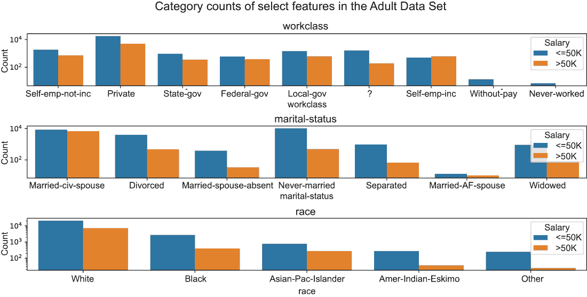

图 8.13 在成人数据集中可视化三个分类特征的类别计数：workclass、marital-status 和 race。注意，所有的 y 轴都是对数尺度（基数为 10）。

### 8.3.2 创建预处理和建模管道

列表 8.5 描述了如何准备数据。特别是，我们使用 sklearn .preprocessing.LabelEncoder 将目标标签从字符串（<=50k, >50k）转换为数值（0/1）。LabelEncoder 与 OrdinalEncoder 相同，但它专门设计用于处理 1D 数据（目标）。

列表 8.5 准备成人数据集

```
X, y = df.drop('salary', axis=1), df['salary']               ❶

from sklearn.preprocessing import LabelEncoder
y = LabelEncoder().fit_transform(y)                          ❷

from sklearn.model_selection import train_test_split
Xtrn, Xtst, ytrn, ytst = \                                   ❸
    train_test_split(X, y, test_size=0.2)   

features = X.columns
cat_features = ['workclass', 'education', 'marital-status',
                'occupation', 'relationship', 'race', 'sex',
                'native-country']                            ❹
cont_features = features.drop(cat_features).tolist()
```

❶ 将数据分为特征和目标

❷ 编码标签

❸ 将数据分为训练集和测试集

❹ 明确识别分类和连续特征

回想一下，任务是预测收入是否超过 50,000 美元（标签 y=1）或低于 50,000 美元（标签 y=0）。关于这个数据集，有一点需要注意，那就是它是不平衡的；也就是说，它包含两个类别的不同比例：

```
import numpy as np
n_pos, n_neg = np.sum(y > 0)/len(y), np.sum(y <= 0)/len(y)
print(n_pos, n_neg)
0.24081695331695332 0.7591830466830467
```

在这里，我们看到正负分布为 24.1%到 75.9%（不平衡），而不是 50%到 50%（平衡）。这意味着评估指标如准确率可能会无意中歪曲我们对模型性能的看法，因为它们假设数据集是平衡的。

接下来，我们定义一个预处理函数，它可以与不同类型的类别编码器一起重复使用。这个函数有两个预处理管道，一个用于仅应用于连续特征，另一个用于类别特征。连续特征使用 StandardScaler 进行预处理，将每个特征列标准化为零均值和单位标准差。

此外，两个管道都有一个 SimpleImputer 来填充缺失值。缺失的连续值用相应的中值特征值填充，而缺失的类别特征在编码之前填充为一个新的类别，称为'missing'。

例如，特征 workclass 有缺失值（用'?'表示），在建模目的上被视为一个单独的类别。下面的列表实现了针对连续和类别特征的单独预处理管道，并返回一个 ColumnTransformer，可以直接应用于该领域的任何训练数据子集。

列表 8.6 预处理管道

```
from sklearn.preprocessing import StandardScaler
from sklearn.impute import SimpleImputer
from sklearn.pipeline import Pipeline
from sklearn.compose import ColumnTransformer

import category_encoders as ce

def create_preprocessor(encoder):
    preprocess_continuous = \                                    ❶
        Pipeline(steps=[     
            ('impute_missing', SimpleImputer(strategy='median')),
            ('normalize', StandardScaler())])

    preprocess_categorical = \ 
        Pipeline(steps=[                                         ❷
            ('impute_missing', SimpleImputer(strategy='constant', 
                                             fill_value='missing')),
            ('encode', encoder())])

    transformations = \
        ColumnTransformer(transformers=[                         ❸
            ('continuous', preprocess_continuous, cont_features),
            ('categorical', preprocess_categorical, cat_features)])

    return transformations
```

❶ 连续特征的预处理管道

❷ 类别特征的预处理管道

❸ 用于组合管道的“ColumnTransformer”对象

此列表将创建并返回一个 scikit-learn ColumnTransformer 对象，它可以应用于训练集和测试集的类似预处理策略，确保一致性并最小化数据泄露。

最后，我们定义一个函数来训练和评估不同类型的集成，将它们与各种类型的类别编码相结合。这将使我们能够通过将集成学习包与各种类型的类别编码器相结合来创建不同的集成模型。

列表 8.7 中的函数允许我们传递一个集成以及集成参数的网格，用于集成参数选择。它使用 k 折交叉验证结合随机搜索来识别最佳集成参数，然后在训练最终模型之前使用这些最佳参数。

一旦训练完成，该函数将使用三个指标在测试集上评估最终模型性能：准确率、平衡准确率和 F1 分数。当数据集不平衡时，平衡准确率和 F1 分数是特别有用的指标，因为它们通过根据每个类别在标签中出现的频率来加权模型在每个类上的性能来考虑标签不平衡。

列表 8.7 训练和评估编码器和集成组合

```
from sklearn.model_selection import RandomizedSearchCV
from sklearn.metrics import accuracy_score, f1_score, balanced_accuracy_score

def train_and_evaluate_models(ensemble, parameters,              ❶
                              n_iter=25,                         ❷
                              cv=5):                             ❸
    results = pd.DataFrame()

    for encoder in [ce.OneHotEncoder,                            ❹
                    ce.OrdinalEncoder,                           ❹
                    ce.TargetEncoder]:                           ❹
        preprocess_pipeline = \                                  ❺
            create_preprocessor(encoder)    

        model = Pipeline(steps=[
                         ('preprocess', preprocess_pipeline),                           
                         ('crossvalidate', 
                           RandomizedSearchCV(
                                ensemble, parameters,                    
                                n_iter=n_iter, cv=cv,            ❻
                                refit=True,                      ❼
                                verbose=2))])
        model.fit(Xtrn, ytrn)

        ypred_trn = model.predict(Xtrn)
        ypred_tst = model.predict(Xtst)    

        res = {'Encoder': encoder.__name__,                      ❽
               'Ensemble': ensemble.__class__.__name__, 
               'Train Acc': accuracy_score(ytrn, ypred_trn),
               'Train B Acc': balanced_accuracy_score(ytrn,
                                                      ypred_trn), 
               'Train F1': f1_score(ytrn, ypred_trn), 
               'Test Acc': accuracy_score(ytst, ypred_tst),
               'Test B Acc': balanced_accuracy_score(ytst,
                                                     ypred_tst),
               'Test F1': f1_score(ytst, ypred_tst)}
        results = pd.concat([results,
                             pd.DataFrame.from_dict([res])], ignore_index=True)

    return results
```

❶ 指定集成和参数网格

❷ 随机网格搜索的最大参数组合数

❸ 参数选择的 CV 折叠数

❹ 要尝试的不同类别编码策略

❺ 初始化预处理管道（参见表 8.6）

❻ 使用随机网格搜索进行参数选择

❼ 使用最佳参数重新拟合最终集成

❽ 评估最终集成性能并保存结果

### 8.3.3 类别编码和集成

在本节中，我们将训练各种编码器和集成方法的组合。特别是，我们考虑以下内容：

+   *编码器*——One-hot、序数和贪婪目标编码（来自 category_encoders 包）

+   *集成*——scikit-learn 的随机森林、LightGBM 的梯度提升和 XGBoost 的牛顿提升

对于编码器和集成组合的每一种组合，我们遵循与列表 8.6 和 8.7 中实现相同的步骤：预处理特征，执行集成参数选择以获得最佳集成参数，使用最佳参数组合重新拟合最终集成模型，并评估最终模型。

随机森林

以下列表训练并评估了类别编码（one-hot、序数和贪婪目标）和随机森林的最佳组合。

列表 8.8：类别编码后使用随机森林进行集成

```
from sklearn.ensemble import RandomForestClassifier

ensemble = RandomForestClassifier(n_jobs=-1)
parameters = {'n_estimators': [25, 50, 100, 200],               ❶
              'max_depth': [3, 5, 7, 10],                       ❷
              'max_features': [0.2, 0.4, 0.6, 0.8]}             ❸

rf_results = train_and_evaluate_models(ensemble, parameters, 
                                       n_iter=25, cv=5)         ❹
```

❶ 随机森林集成中的树的数量

❷ 集成中单个树的最大深度

❸ 树学习期间使用的特征/列的分数

❹ 使用 25 个参数组合和 5 折交叉验证的随机网格搜索

此列表返回以下结果（编辑以适应页面）：

```
 Encoder  Test Acc  Test B Acc  Test F1  Train Acc  Train B Acc  Train F1
  OneHot     0.862       0.766    0.669      0.875        0.783       0.7
 Ordinal     0.861       0.756    0.657      0.874        0.773     0.688
  Target     0.864       0.774    0.679      0.881        0.797      0.72
```

观察训练集和测试集的纯准确率（Acc）和平衡准确率（B Acc）或 F1 分数（F1）之间的差异。由于平衡准确率明确考虑了类别不平衡，它比准确率提供了更好的模型性能估计。这说明了使用正确的指标来评估我们的模型的重要性。

虽然所有编码方法在以纯准确率作为评估指标时看起来同样有效，但使用目标统计信息进行编码似乎在区分正例和负例方面最为有效。

LightGBM

接下来，我们使用 LightGBM 重复这一训练和评估过程，其中我们训练了一个包含 200 棵树的集成，如下所示。其他几个集成超参数将使用 5 折交叉验证进行选择：最大树深度、学习率、袋装分数和正则化参数。

列表 8.9：类别编码后使用 LightGBM 进行集成

```
from lightgbm import LGBMClassifier

ensemble = LGBMClassifier(n_estimators=200, n_jobs=-1)

parameters = {
    'max_depth': np.arange(3, 10, step=1),              ❶
    'learning_rate': 2.**np.arange(-8, 2, step=2),      ❷
    'bagging_fraction': [0.4, 0.5, 0.6, 0.7, 0.8],      ❸
    'lambda_l1': [0, 0.01, 0.1, 1, 10],                 ❹
    'lambda_l2': [0, 0.01, 0.1, 1e-1, 1, 10]}

lgbm_results = train_and_evaluate_models(ensemble, parameters, 
                                         n_iter=50, cv=5)
```

❶ 集成中单个树的最大深度

❷ 梯度提升的学习率

❸ 树学习期间使用的示例分数

❹ 权重正则化参数

此列表返回以下结果（编辑以适应页面）：

```
Encoder  Test Acc  Test B Acc  Test F1  Train Acc  Train B Acc  Train F1
  OneHot    0.874       0.802    0.716      0.891        0.824     0.754
Ordinal     0.874       0.802    0.717      0.892        0.825     0.757
 Target     0.873       0.796     0.71      0.886        0.815     0.741
```

使用 LightGBM，所有三种编码方法都导致具有大致相似泛化性能的集成，这由测试集的平衡准确率和 F1 分数所证明。整体性能也优于随机森林。

XGBoost

最后，我们同样使用 XGBoost 重复了这一训练和评估过程，其中我们再次训练了一个包含 200 棵树的集成，如下所示。

列表 8.10：类别编码后使用 XGBoost 进行集成

```
from xgboost import XGBClassifier

ensemble = XGBClassifier(n_estimators=200, n_jobs=-1)
parameters = {
    'max_depth': np.arange(3, 10, step=1),                  ❶
    'learning_rate': 2.**np.arange(-8., 2., step=2),        ❷
    'colsample_bytree': [0.4, 0.5, 0.6, 0.7, 0.8],          ❸
    'reg_alpha': [0, 0.01, 0.1, 1, 10],                     ❹
    'reg_lambda': [0, 0.01, 0.1, 1e-1, 1, 10]}

xgb_results = train_and_evaluate_models(ensemble, parameters, 
                                        n_iter=50, cv=5)
```

❶ 集成中单个树的最大深度

❷ 牛顿提升的学习率

❸ 树学习期间的特征/列的分数

❹ 权重正则化的参数

该列表返回以下结果（编辑以适应页面）：

```
Encoder  Test Acc  Test B Acc  Test F1  Train Acc  Train B Acc  Train F1
 OneHot     0.875       0.799    0.715      0.896        0.829     0.764
Ordinal     0.873       0.799    0.712      0.891        0.823     0.753
 Target     0.875       0.802    0.717      0.898        0.834     0.771
```

与 LightGBM 一样，所有三种编码方法都导致 XGBoost 集成具有大致相似的一般化性能。XGBoost 的整体性能与 LightGBM 相似，但优于随机森林。

### 8.3.4 使用 CatBoost 进行有序编码和提升

最后，我们探索了 CatBoost 在此数据集上的性能。与之前的方法不同，我们不会使用 category_encoders 包。这是因为 CatBoost 使用有序目标统计信息以及有序提升。因此，只要我们清楚地识别出需要使用有序目标统计信息进行编码的类别特征，CatBoost 就会处理其余部分，无需任何额外的预处理！以下列表执行了基于 CV 的随机参数搜索的有序提升。

列表 8.11 使用 CatBoost 进行有序目标编码和有序提升

```
from catboost import CatBoostClassifier

ensemble = CatBoostClassifier(cat_features=cat_features)
parameters = {
    'iterations': [25, 50, 100, 200],                            ❶
    'depth': np.arange(3, 10, step=1),                           ❷
    'learning_rate': 2**np.arange(-5., 0., step=1),              ❸
    'l2_leaf_reg': [0, 0.01, 0.1, 1e-1, 1, 10]}                  ❹

search = ensemble.randomized_search(parameters, Xtrn, ytrn, 
                                    n_iter=50, cv=5, refit=True, 
                                    verbose=False)               ❺
ypred_trn = ensemble.predict(Xtrn)
ypred_tst = ensemble.predict(Xtst)    

res = {'Encoder': '',
       'Ensemble': ensemble.__class__.__name__, 
       'Train Acc': accuracy_score(ytrn, ypred_trn),
       'Train B Acc': balanced_accuracy_score(ytrn, ypred_trn), 
       'Train F1': f1_score(ytrn, ypred_trn), 
       'Test Acc': accuracy_score(ytst, ypred_tst),
       'Test B Acc': balanced_accuracy_score(ytst, ypred_tst),
       'Test F1': f1_score(ytst, ypred_tst)}

cat_results = pd.DataFrame()
cat_results = pd.concat([cat_results,
                         pd.DataFrame.from_dict([res])], ignore_index=True)
```

❶ 随机森林集成中的树的数量

❷ 集成中单个树的最大深度

❸ 牛顿提升的学习率

❹ 权重正则化的参数

❺ 使用 CatBoost 的随机搜索功能

CatBoost 提供自己的 randomized_search 功能，其初始化和调用方式类似于我们在上一节中使用的 scikit-learn 的 RandomizedGridCV：

```
Ensemble  Test Acc  Test B Acc  Test F1  Train Acc  Train B Acc  Train F1
CatBoost      0.87       0.796    0.708      0.888         0.82     0.747
```

CatBoost 在此数据集上的性能与 LightGBM 和 XGBoost 相当，且优于随机森林。

现在，让我们将所有方法的结果并排放置；在图 8.14 中，我们查看每种方法在测试集上根据平衡准确率评估的性能。

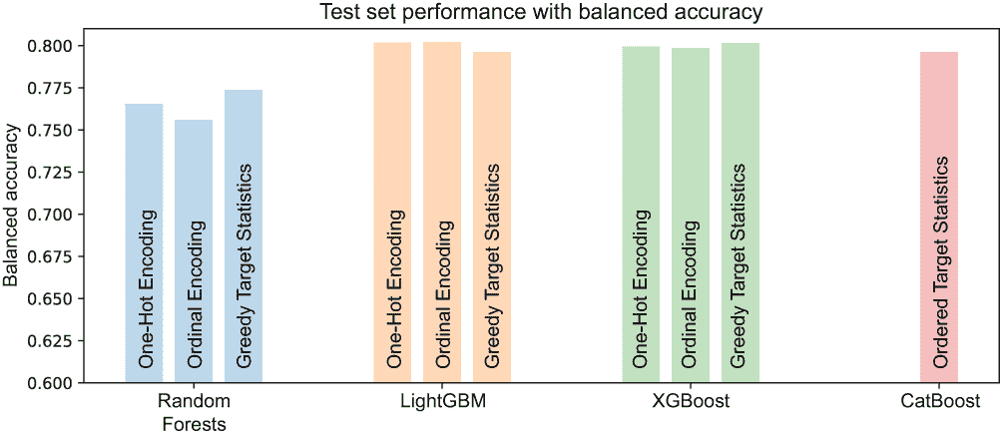

图 8.14 各种编码和集成方法组合的测试集性能（使用平衡准确率指标）

在分析这些结果时，始终牢记没有免费的午餐，没有一种方法总是表现最佳。然而，CatBoost 确实享有两个关键优势：

+   与其他必须使用两步编码+集成方法的集成方法不同，CatBoost 允许对编码和类别特征的处理采取统一的方法。

+   按设计，CatBoost 减轻了数据泄漏和目标泄漏以及分布偏移问题，这些问题在其他集成方法中通常需要更多的关注。

## 8.4 编码高基数字符串特征

我们通过探索*高基数类别特征*的编码技术来结束本章。类别特征的基数简单地是该特征中唯一类别的数量。类别的数量在类别编码中是一个重要的考虑因素。

现实世界的数据集通常包含分类字符串特征，其中特征值是字符串。例如，考虑一个组织中的职位头衔的分类特征。这个特征可以包含从“Intern”到“President and CEO”的几十到几百个职位头衔，每个头衔都有其独特的角色和责任。

这样的特征包含大量类别，并且本质上就是高基数特征。这使诸如独热编码（因为它显著增加了特征维度）或顺序编码（因为自然顺序可能并不总是存在）这样的编码方法不适用。

更重要的是，在现实世界的数据集中，这样的高基数特征也是“脏”的，因为同一个类别有几种不同的变体：

+   自然变异可能是因为数据是从不同的来源编译的。例如，同一组织中的两个部门可能对完全相同的角色有不同的头衔：“Lead Data Scientist” 和 “Senior Data Scientist。”

+   许多此类数据集都是手动输入到数据库中的，这会由于拼写错误和其他错误而引入噪声。例如，“Data Scientsit” [原样] 与 “Data Scientist。”

因为两个（或更多！）这样的变体不完全匹配，它们被视为它们自己的独特类别，尽管常识表明它们应该被清理和/或合并。这通过向已经很大的类别集中添加新类别，给高基数字符串特征带来了额外的问题。

为了解决这个问题，我们需要通过 *字符串相似度* 而不是通过精确匹配来确定类别（以及如何编码它们）。这种方法的直觉是将相似的类别一起编码，就像人类可能做的那样，以确保下游学习算法将它们视为相似（正如它应该做的那样）。

例如，基于相似度的编码会将“Data Scientsit” [原样] 和 “Data Scientist” 编码为具有相似特征的，以便它们在学习算法中看起来几乎相同。基于相似度的编码方法使用 *字符串相似度* 的概念来识别相似的类别。

这样的字符串相似度度量或指标在自然语言和文本应用中得到了广泛的应用，例如在自动纠错应用、数据库检索或在语言翻译中。

字符串相似度度量

*相似度度量* 是一个函数，它接受两个对象并返回它们之间的数值相似度。值越高意味着两个对象彼此越相似。字符串相似度度量在字符串上操作。

测量字符串之间的相似度具有挑战性，因为字符串的长度可能不同，并且可能在不同的位置有相似的子字符串。要确定两个字符串是否相似，可能需要匹配所有可能的长度和位置的字符和子序列。这种组合复杂性意味着计算字符串相似度可能非常耗时。

存在几种计算不同长度字符串之间相似度的有效方法。两种常见类型是 *基于字符* 的字符串相似度和 *基于标记* 的字符串相似度，这取决于比较的字符串组件的粒度。

基于字符的方法通过在字符级别（插入、删除或替换）需要的操作数量来衡量字符串相似度，以将一个字符串转换为另一个字符串。这些方法非常适合短字符串。

较长的字符串通常被分解成标记，通常是子字符串或单词，称为 n-gram。基于标记的方法在标记级别衡量字符串相似度。

不论你使用哪种字符串相似度指标，相似度分数都可以用来编码高基数特征（通过将相似的字符串类别分组在一起）和脏特征（通过“清理”错误）。

The dirty_cat package

The dirty_cat package ([`dirty-cat.github.io/stable/index.xhtml`](https://dirty-cat.github.io/stable/index.xhtml)) 提供了现成的类别相似度度量，并且可以无缝地用于建模管道。该包提供了三个专门的编码器来处理所谓的“脏类别”，这些类别本质上是有噪声的/或高基数的字符串类别：

+   SimilarityEncoder—使用字符串相似度构建的一元编码版本

+   GapEncoder—通过考虑频繁共现的子字符串组合来编码类别

+   MinHashEncoder—通过应用哈希技术到子字符串来编码类别

我们使用另一个薪资数据集来了解如何在实践中使用 dirty_cat 包。这个数据集是 Data.gov 公开可用的 Employee Salaries 数据集的一个修改版本，目标是预测个人的薪资，给定他们的职位和部门。

首先，我们加载数据集（与源代码一起提供）并可视化前几行：

```
import pandas as pd
df = pd.read_csv('./data/ch08/employee_salaries.csv')
df.head()
```

图 8.15 展示了该数据集的前几行。

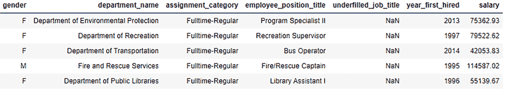

图 8.15 员工薪资数据集主要包含字符串类别。

“salary”列是目标变量，这使得这是一个回归问题。我们将这个数据框拆分为特征和标签：

```
X, y = df.drop('salary', axis=1), df['salary']
print(X.shape)
(9211, 6)
```

我们可以通过计算每列的独特类别或值的数量来感知哪些是高基数特征：

```
for col in X.columns:
    print('{0}: {1} categories'.format(col, df[col].nunique()))

gender: 2 categories
department_name: 37 categories
assignment_category: 2 categories
employee_position_title: 385 categories
underfilled_job_title: 83 categories
year_first_hired: 51 categories
```

我们看到特征 employee_position_title 有 385 个独特的字符串类别，这使得这是一个高基数特征。直接使用一元编码，比如，会向我们的数据集中引入 385 个新列，从而大大增加列的数量！

相反，让我们看看如何使用 dirty_cat 包来训练 XGBoost 集成模型。首先，让我们明确地识别数据集中不同类型的特征：

```
lo_card = ['gender', 'department_name', 'assignment_category']
hi_card = ['employee_position_title']
continuous = ['year_first_hired']
```

接下来，让我们初始化我们想要使用的不同 dirty_cat 编码器：

```
from dirty_cat import SimilarityEncoder, MinHashEncoder, GapEncoder
encoders = [SimilarityEncoder(),                    ❶
            MinHashEncoder(n_components=100),       ❷
            GapEncoder(n_components=100)]
```

❶ 指定要使用的字符串相似度度量

❷ 编码维度

对于所有编码方法来说，最重要的编码参数是 is n_components，也称为 *编码维度*。

SimilarityEncoder 测量两个字符串之间的 n-gram 相似性。n-gram 简单地是一个连续的 n 个单词序列。例如，字符串 “I love ensemble methods.” 包含三个 2-gram：“I love”，“love ensemble” 和 “ensemble methods”。两个字符串之间的 n-gram 相似性首先计算每个字符串中所有可能的 n-gram，然后对 n-gram 计算相似性。默认情况下，SimilarityEncoder 构建所有 2-gram、3-gram 和 4-gram，然后使用独热编码对所有相似字符串进行编码。这意味着它将确定自己的编码维度。

要理解编码维度，考虑我们正在对包含 385 个唯一类别的特征 employee_position_title 进行独热编码，这些类别可以通过相似性度量分组为 225 个“相似”类别。独热编码将每个类别值转换为 225 维向量，使得编码维度为 225。

MinHashEncoder 和 GapEncoder 另一方面，可以接受用户指定的编码维度并创建指定大小的编码。在这种情况下，编码维度被指定为 100，对于两者来说，这比独热编码强制使用的要小得多。

实际上，编码维度（n_components）是一个建模选择，最佳值应通过 k 折交叉验证来确定，这取决于模型训练时间与模型性能之间的权衡。

我们将这些内容组合到以下列表中，该列表训练了三个不同的 XGBoost 模型，每个模型对应一种 dirty_cat 编码类型。

列表 8.12 使用高基数特征的编码和集成

```
from sklearn.preprocessing import OneHotEncoder, MinMaxScaler
from sklearn.pipeline import Pipeline
from sklearn.compose import ColumnTransformer
from dirty_cat import SimilarityEncoder, MinHashEncoder, GapEncoder
from xgboost import XGBRegressor
from sklearn.metrics import r2_score

lo_card = ['gender', 'department_name', 
           'assignment_category']                           ❶
hi_card = ['employee_position_title']                       ❷
continuous = ['year_first_hired']                           ❸

encoders = [SimilarityEncoder,
            MinHashEncoder(n_components=100),
            GapEncoder(n_components=100)]

from sklearn.model_selection import train_test_split
Xtrn, Xtst, ytrn, ytst = \
    train_test_split(X, y, test_size=0.2)                   ❹

for encoder in encoders:
    ensemble = XGBRegressor(                                ❺
        objective='reg:squarederror',learning_rate=0.1, 
        n_estimators=100, max_depth=3)
    preprocess = ColumnTransformer(transformers=[
        ('continuous', 
            MinMaxScaler(), continuous),                    ❻
        ('onehot', 
            OneHotEncoder(sparse=False), lo_card),          ❼
        ('dirty', 
            encoder, hi_card)],                             ❽
        remainder='drop')    
    pipe = Pipeline(steps=[('preprocess', preprocess), 
                           ('train', ensemble)])            ❾
    pipe.fit(Xtrn, ytrn)

    ypred = pipe.predict(Xtst)
    print('{0}: {1}'.format(encoder.__class__.__name__, 
                            r2_score(ytst, ypred)))         ❿
```

❶ 识别低基数特征

❷ 识别高基数特征

❸ 识别连续特征

❹ 将数据集分为训练集和测试集

❺ 使用 XGBoost 作为集成方法

❻ 将连续特征缩放到 [0, 1] 范围内

❼ 对低基数特征进行独热编码

❽ 使用 dirty_cat 编码对高基数特征进行编码

❾ 创建预处理和训练管道

❿ 使用 R² 分数来评估整体性能

在本例中，我们识别了三种不同类型的特征，每种特征我们都会进行不同的预处理：

+   低基数特征，例如性别（2 个类别）和 department_name（37 个类别），进行独热编码。

+   高基数特征，例如 employee_position_title，使用 dirty_cat 编码器进行编码。

+   连续特征，例如 year_first_hired，使用 MinMaxScaler 缩放到 0 到 1 的范围内。

在编码后，我们使用标准均方误差（MSE）损失函数训练了一个 XGBoost 回归器，包含 100 棵树，每棵树的最大深度为 3。训练好的模型使用回归指标 *R*² 分数进行评估（详见第一章，第 1.3.1 节，以获取详细信息），该分数范围从 -∞ 到 1，数值越接近 1 表示回归器的性能越好：

```
SimilarityEncoder: 0.8995625658800894
MinHashEncoder: 0.8996750692009536
GapEncoder: 0.8895356402510632
```

与其他监督方法一样，通常需要使用交叉验证（CV）来确定哪些编码参数能产生针对当前数据集的最佳结果。

## 摘要

+   分类别特征是一种数据属性类型，它取离散值，称为类别或类别。因此，类别特征也被称为离散特征。

+   名义特征是一个没有彼此之间关系的值的类别变量（例如，猫，狗，猪，牛）。

+   有序特征是一个有序的类别变量，其值是按顺序排列的，要么是递增的，要么是递减的（例如，大一新生，大二，大三，大四）。

+   独热向量化/编码和有序编码是常用的无监督编码方法。

+   独热编码为数据集中的每个类别引入了二进制（0-1）列，当特征具有大量类别时可能会效率低下。有序编码为每个类别按顺序引入整数值。

+   使用目标统计是针对类别特征的有监督编码方法；而不是一个预定的或学习到的编码步骤，类别特征被替换为一个描述类别的统计量（例如，平均值）。

+   贪婪目标统计使用所有训练数据用于编码，导致训练到测试目标泄漏和分布偏移问题，这些问题会影响我们评估模型泛化性能的方式。

+   保留法目标统计除了保留测试集外，还使用一个特殊的保留编码集。这消除了泄漏和偏移，但会浪费数据。

+   留一法（LOO）目标统计和有序目标统计是数据高效地减轻泄漏和偏移的方法。

+   梯度提升技术使用训练数据用于残差计算和模型训练，这会导致预测偏移和过拟合。

+   有序提升是对牛顿提升的一种修改，它使用基于排列的集成方法来进一步减少预测偏移。有序提升通过在不同的排列和数据子集上训练一系列模型来解决预测偏移。

+   CatBoost 是一个公开可用的提升库，实现了有序目标统计和有序提升。

+   虽然 CatBoost 非常适合类别特征，但它也可以应用于常规特征。

+   CatBoost 使用无知的决策树作为弱学习器。无知的决策树在整个树的整个层级/深度上的所有节点都使用相同的分割标准。无知的树是平衡的，不太容易过拟合，并且在测试时可以显著加快执行速度。

+   高基数特征包含许多独特的类别；对高基数特征进行独热编码会引入大量新的数据列，其中大部分是稀疏的（包含许多零），这会导致学习效率低下。

+   dirty_cat 是一个包，它为离散值特征生成更紧凑的编码，并使用字符串和子字符串相似性以及哈希来创建有效的编码。
