# 9 解释你的集成

本章涵盖

+   理解玻璃箱模型与黑箱模型，以及全局解释性与局部解释性

+   使用全局黑箱方法来理解预训练集成行为

+   使用局部黑箱方法解释预训练集成预测

+   从零开始训练和使用可解释的全局和局部玻璃箱集成

在训练和部署模型时，我们通常关注模型预测的**是什么**。然而，同样重要的是，我们也需要了解模型做出预测的**原因**。理解模型的预测是构建稳健机器学习管道的关键组成部分。这在机器学习模型应用于高风险应用（如医疗保健或金融）时尤其如此。

例如，在糖尿病诊断等医疗诊断任务中，理解模型为何做出特定诊断可以为用户（在这种情况下，医生）提供额外的见解，指导他们做出更好的处方、预防性护理或姑息性护理。这种增加的透明度反过来又增加了对机器学习系统的信任，使得模型的开发用户可以自信地使用它们。

理解模型预测背后的原因对于模型调试、识别失败案例和找到提高模型性能的方法也极为有用。此外，模型调试还可以帮助识别数据本身的偏差和问题。

机器学习模型可以被描述为黑箱模型和玻璃箱模型。由于复杂性（例如，深度神经网络），黑箱模型通常难以理解。这类模型的预测需要专门的工具来使其**可解释**。本书中涵盖的许多集成（如随机森林和梯度提升）都是黑箱机器学习模型。

玻璃箱模型更直观，更容易理解（例如，决策树）。这类模型的架构使它们本质上具有**可解释性**。在本章中，我们将从集成方法的角度探讨可解释性和可理解性的概念。

可解释性方法也被描述为全局或局部。全局方法试图广泛地解释模型在不同类型示例中的特征和决策的相关性。局部方法试图具体解释模型针对单个示例和预测的决策过程。

9.1 节介绍了黑箱和玻璃箱机器学习模型的基础知识。本节还从可解释性的角度重新介绍了两个著名的机器学习模型：决策树和广义线性模型（GLMs）。

9.2 节介绍了本章的案例研究：数据驱动营销。本节其余部分将使用该应用来说明可解释性和可理解性的技术。

第 9.3 节介绍了三种用于全局黑盒可解释性的技术：排列特征重要性、部分依赖图和全局代理模型。第 9.4 节介绍了两种用于局部黑盒可解释性的方法：LIME 和 SHAP。第 9.3 节和第 9.4 节中介绍的黑盒方法是模型无关的；也就是说，它们可以用于任何机器学习黑盒。在这些章节中，我们特别关注它们如何用于集成方法。第 9.5 节介绍了一种称为可解释提升机（explainable boosting machines）的玻璃盒方法，这是一种旨在直接可解释的新集成方法，它提供了全局和局部可解释性。

## 9.1 什么是可解释性？

我们首先介绍机器学习模型的可解释性和可解释性的基础知识，然后转向这些概念如何具体应用于集成方法。机器学习模型的可解释性和可解释性与其结构（例如，树、网络或线性模型）及其参数（例如，树中的分割和叶值、神经网络中的层权重、线性模型中的特征权重）相关。我们的目标是根据输入特征、输出预测和模型内部（即结构和参数）来理解模型的行为。

### 9.1.1 黑盒与玻璃盒模型

*黑盒机器学习模型*在描述其模型内部结构方面比较困难。这可能是因为我们没有访问内部模型结构和参数（例如，如果它是由其他人训练的）。即使在我们可以访问模型内部的情况下，模型本身可能足够复杂，以至于分析其输入和输出之间的关系并建立直观理解并不容易（见图 9.1）。

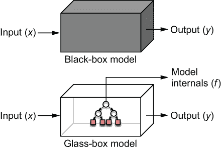

图 9.1 在黑盒机器学习模型中，我们只能使用输入-输出对来分析和解释模型行为。黑盒中的模型内部要么不可用，要么不能直接解释。在玻璃盒机器学习模型中，除了输入-输出对之外，模型内部也是直观可解释的。

神经网络和深度学习模型通常被引用为黑盒模型的例子，这归因于它们多层结构和大量网络参数带来的相当复杂性。

这些模型本质上作为黑盒运行：给定一个输入示例，它们提供预测，但它们的内部工作原理对我们来说是透明的。这使得解释模型行为相当困难。

我们迄今为止看到的大多数集成方法——随机森林、AdaBoost、梯度提升和牛顿提升——对我们来说都是有效的黑盒模型。这是因为，尽管单个基估计器本身可能直观且可解释，但集成过程引入了特征之间的复杂交互，这使得解释集成及其预测变得困难。黑盒模型通常需要*黑盒解释器*，这些解释模型旨在仅使用模型输入和输出，而不是其内部结构来解释模型行为。

相反，玻璃盒机器学习模型更容易理解。这通常是因为它们的模型结构对人类来说是立即直观或可理解的。

例如，考虑一个简单的任务，即仅从两个特征：年龄和血糖测试结果（glc）中进行糖尿病诊断。假设我们已经学习了两个具有相同预测性能的机器学习模型：一个四次多项式分类器和一棵决策树分类器。

此示例的数据集如图 9.2 所示，其中没有糖尿病（类别=-1）的患者用方块表示，有糖尿病（类别=+1）的患者用圆圈表示。两个分类模型也显示在图中。

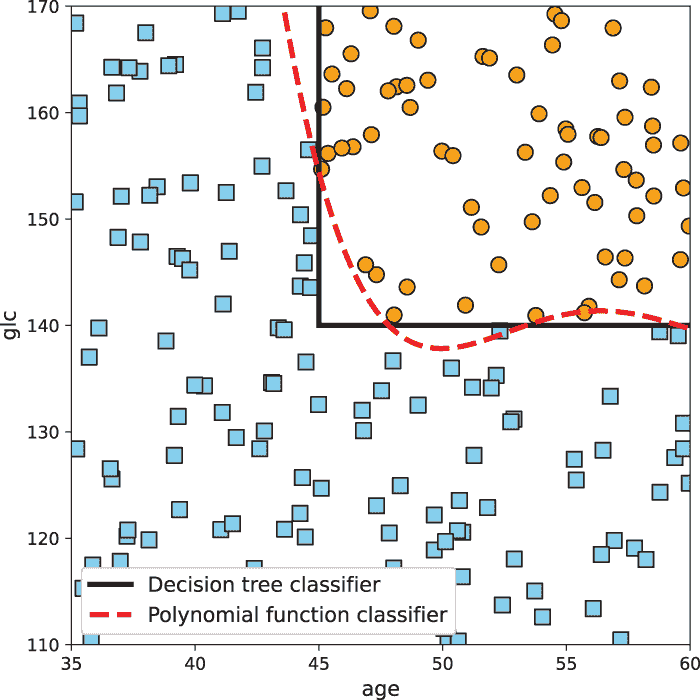

图 9.2 需要被分类为有糖尿病（圆圈）或无糖尿病（方块）的糖尿病患者的问题空间基于两个特征：年龄和 glc。两个机器学习模型——一个四次多项式分类器和一棵决策树分类器——被训练以具有大致相似的预测性能。然而，它们模型内部结构（结构和参数）的性质意味着决策树对于解释和理解模型行为来说更直观（参见 9.1.2 节）。

第一个模型是一个四次多项式分类器。这个分类器由加权特征幂的加性结构组成，权重是模型参数：

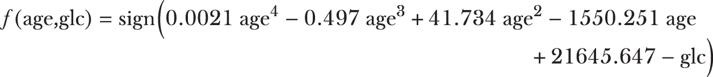

此函数返回+1（糖尿病=TRUE）或-1（糖尿病=FALSE）。即使我们有完整的模型，给定一个新患者和相应的诊断预测（例如，糖尿病=TRUE），也不立即清楚模型为何做出这样的决定。是因为患者的年龄？他们的血糖测试结果？这两个因素？这些信息隐藏在复杂的数学计算中，我们仅通过观察模型、其结构和参数很难推断出来。

现在，让我们考虑第二个模型，一个具有单个决策节点形式的决策树

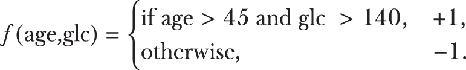

此函数也返回+1（糖尿病=TRUE）或-1（糖尿病=FALSE）。然而，这个决策树的结构很容易解释为

```
if age > 45 AND glc > 140 then diabetes = TRUE else diabetes = FALSE. 
```

该模型的解释相当直接：任何年龄超过 45 岁且血糖测试结果超过 140 的患者将被诊断为糖尿病。

总结来说，尽管多项式分类器的完整模型内部结构对我们来说是可用的，但由于模型内部不直观或不可解释，模型可能仍然像一个黑盒。另一方面，决策树如何表示其学习到的知识的天生性质使得它更容易解释，使其成为一个玻璃盒模型。

在本节的其余部分，我们将探讨两种熟悉的机器学习模型，它们也是玻璃盒模型：决策树（和决策规则）以及广义线性模型（GLMs）。这将使我们更好地理解集成模型的解释性和可解释性概念，因为 GLMs 和决策树通常被用作许多集成方法中的基础估计器。

### 9.1.2 决策树（和决策规则）

决策树可以说是机器学习模型中最可解释的，因为它们将决策实现为一个询问和回答问题的连续过程。决策树的结构及其基于特征的分割函数很容易解释，正如我们将看到的。这使得决策树成为玻璃盒模型。

让我们从在著名的 Iris 数据集上训练决策树开始，该数据集在 scikit-learn 中可用。任务是按照四个特征：花瓣高度、花瓣宽度、花瓣宽度和花瓣宽度，将鸢尾花分为三种物种：*Iris setosa*、*Iris versicolour* 和 *Iris virginica*。这个极其简单的数据集只有 150 个训练示例，将作为可视化概念的优良教学示例。

实践中解释决策树

下面的代码示例加载数据集，训练决策树分类器，并可视化它。一旦可视化，我们就可以解释学习到的决策树模型。

列表 9.1 训练和解释决策树

```
from sklearn.datasets import load_iris
from sklearn.model_selection import train_test_split
iris = load_iris()                                                  ❶
Xtrn, Xtst, ytrn, ytst = train_test_split(iris.data, iris.target,
                                          test_size=0.15)

from sklearn import tree
from sklearn.tree import DecisionTreeClassifier
from sklearn.metrics import accuracy_score
model = DecisionTreeClassifier(                                     ❷
           min_samples_leaf=40, criterion='entropy')
model.fit(Xtrn, ytrn)                                               ❸
ypred = model.predict(Xtst)
print('Accuracy = {0:4.3}%'.format(accuracy_score(ytst, ypred) * 100))

import graphviz, re, pydotplus
dot = tree.export_graphviz(model, feature_names=iris.feature_names, 
                           class_names=['Iris-Setosa', 
                                        'Iris-Versicolour', 
                                        'Iris-Virginica'],
                           filled=True, impurity=False)
graphviz.Source(dot, format="png")                                  ❹
```

❶ 加载 Iris 数据集并将数据分为训练集和测试集

❷ 在学习过程中使用熵作为衡量分割质量的标准

❸ 训练决策树分类器并评估其测试集性能

❹ 将树内部结构导出为 dot 格式，然后使用 graphviz 进行渲染

生成的决策树在 Iris 数据集上达到了 91.3% 的准确率。请注意，由于 Iris 是一个非常简单的数据集，可以训练出许多不同的高准确率决策树，

其中之一在此处展示。我们使用开源的图形可视化软件 graph-viz 包（见图 9.3）来可视化它，该软件用于渲染列表、树、图和网络。

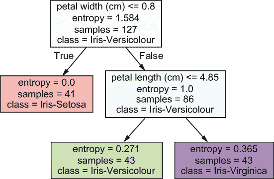

图 9.3 在 Iris 数据集上学习用于将鸢尾花分类为三种物种（*Iris setosa*、*Iris versicolour*和*Iris virginica*）的决策树。这里遵循了标准分裂惯例：如果分裂函数评估为真，则继续向右分支；如果评估为假，则向左分支。

我们首先注意到，只有四个特征中的两个，即花瓣宽度和长度，就足以达到超过 90%的准确率。因此，这个决策树通过仅使用特征子集就学习了一个*稀疏模型*。但我们能从中得到的信息远不止这些。

决策树的一个良好特性是，从根节点到叶节点的每一条路径都代表了它。在每次分裂时，由于一个示例只能向左或向右移动，因此示例只能最终结束在三个叶节点之一。这意味着每个叶节点（以及由此扩展的从根到叶的每条路径，即每条规则）将总体人口划分为一个子人口。让我们实际看看这是如何运作的。

由于有三个叶节点，因此有三个决策规则，我们可以用 Python 语法来写出它们，以便更容易理解：

```
if petal_width <= 0.8: 
    class = 'Iris-Setosa'
elif (petal_width > 0.8) and (petal_length <= 4.85):
    class = 'Iris-Versicolour'
elif (petal_width > 0.8) and (petal_length > 4.85):
    class = 'Iris-Virginica'
else:
    Can never reach here as all possibilities are covered above
```

通常情况下，每个决策树都可以表示为一组决策规则，由于它们的 if-then 结构，这些规则对人类来说更容易理解。

注意：决策树的解释性可能是主观的，并且取决于树的深度和叶节点的数量。深度为中小型（例如，深度为 3 或 4）且节点数约为 8-15 的树通常更直观，更容易理解。随着树深和叶节点数量的增加，我们需要处理和解释的决策规则的数量和长度也会增加。这使得深度和复杂的决策树更像黑盒，并且也相当难以解释。

记住，每个通过决策树的示例都必须最终结束在唯一的叶节点上。因此，从根到叶的路径集将完全覆盖所有示例。更重要的是，树/规则将将所有鸢尾花的空间划分为三个非重叠的子人口，每个对应于三种物种之一。这在可视化和理解方面非常有帮助，如图 9.4 所示。

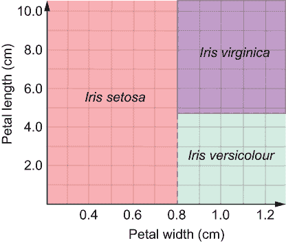

图 9.4 决策树将特征空间划分为非重叠的子空间，其中每个子空间表示示例的子人口。

特征重要性

从树中我们知道使用了两个特征：花瓣长度和花瓣宽度。但每个特征对模型贡献了多少？这就是特征重要性的概念，我们根据每个特征对模型整体决策影响的大小为每个特征分配一个分数。在决策树中，特征重要性可以非常容易地计算出来！

让我们计算在图 9.3 中较早显示的树中每个特征的特性重要性，同时记住一些重要的细节。首先，训练集由 127 个训练示例（根节点中的样本 = 127）组成。其次，此树使用熵作为分裂质量标准进行训练（参见图 9.1）。

因此，为了衡量特征重要性，我们只需计算每个特征在分裂后整体熵减少的程度。为了避免因示例比例非常小或非常大而扭曲我们对分裂的感知，我们还将对熵减少进行加权。

更确切地说，对于每个分裂节点，我们计算分裂后其（加权）熵相对于其子节点的减少程度：

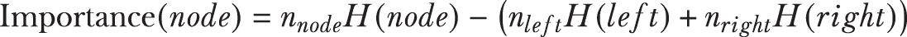

对于节点 [petal_width <= 0.8]：


对于节点 [petal_length <= 4.85]：


由于其他两个特征在模型中没有使用，它们的特征重要性将为零。最后一步是将特征重要性归一化，使它们的总和为 1：

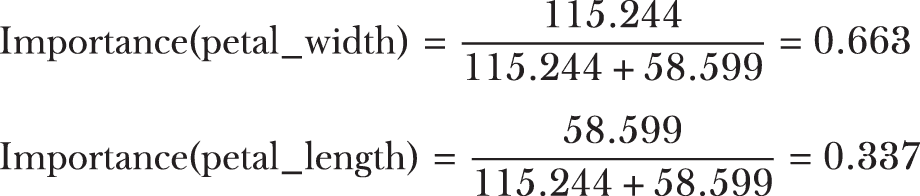

在实践中，我们不必自己计算特征重要性，因为大多数决策树学习的实现都这样做。例如，我们可以直接从模型中获取我们刚刚从列表 9.1 中训练的决策树的特征重要性（与我们的先前计算进行比较）：

```
model.feature_importances_
array([0\.        , 0\.        , 0.33708016, 0.66291984])
```

最后，前面的例子展示了决策树在分类问题中的可解释性。决策树回归器也可以以相同的方式进行解释；唯一的区别是叶子节点将是回归值而不是类标签。

### 9.1.3 广义线性模型

我们现在重新审视 GLMs，它们最初在第七章第 7.1.4 节中介绍。回想一下，GLMs 通过一个（非线性）链接函数 *g*(*y*) 扩展线性模型。例如，线性回归使用恒等链接将回归值 *y* 与数据 *x* 相关联：

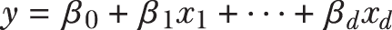

在这里，数据点 *x* = [*x*[1], ⋅⋅⋅ ,*x*[d]]' 由 *d* 个特征描述，线性模型由线性系数 *β*[1], ⋅⋅⋅ ,*β*[d] 和截距（有时称为偏差）*β*[0] 参数化。GLM 的另一个例子是逻辑回归，它使用 logit 链接将类概率 *p* 与数据 x 相关联：

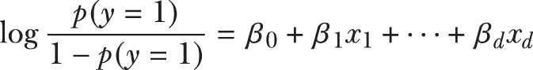

GLMs 由于其线性加性结构而具有可解释性。线性参数本身为我们提供了对每个特征对整体预测贡献的直观感觉。加性结构确保整体预测依赖于每个特征的个别贡献。

例如，假设我们已经为之前讨论的糖尿病诊断任务训练了一个逻辑回归模型，用于根据年龄和血糖测试结果（glc）来分类病人是否患有糖尿病。让我们说学到的模型是（*p*(y = 1)作为*p*）：

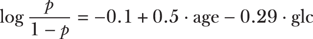

回想一下，如果*p*是阳性诊断的概率，那么*p/(1 – *p*)是病人有诊断的几率。因此，逻辑回归将阳性糖尿病诊断的对数几率表示为年龄和 glc 特征的加权组合。

特征权重

我们如何解释特征权重？如果年龄增加 1，log(*p/(1 – *p*))将增加 0.5（因为模型是线性和可加的）。因此，对于一个年龄增加一岁的病人，他们患有糖尿病的 log 几率是 log(*p/(1 – *p*)) = 0.5。因此，他们患有糖尿病的几率是(*p/(1 – *p*)) = *e^(0.5) = 1.65，即增加 65%。

类似地，如果 glc 增加 1，log(*p/(1 – *p*))将减少 0.29（注意权重中的负号，表示减少）。因此，对于一个 glc 增加 1 的病人，他们患有糖尿病的几率是(*p/(1 – *p*)) = *e^(0.29) = 0.75，即减少 25%。

让我们利用这种直觉来探讨如何解释一个更现实的逻辑回归模型。我们首先在第二章案例研究中首次引入的乳腺癌数据集上训练一个逻辑回归模型。任务是乳腺癌诊断的二分类。数据集中的每个例子都由从乳腺肿块图像中提取的 30 个特征来表征。这些特征代表乳腺肿块的属性，如半径、周长、面积、凹凸性等。

实际应用中解释广义线性模型

下一个列表加载数据集，训练逻辑回归分类器，并可视化每个特征阳性乳腺癌诊断几率的变化或减少。

列表 9.2 训练和解释逻辑回归

```
from sklearn.datasets import load_breast_cancer
from sklearn.preprocessing import StandardScaler
from sklearn.linear_model import LogisticRegression
from sklearn.model_selection import train_test_split
import matplotlib.pyplot as plt
import numpy as np

bc = load_breast_cancer()                                              ❶
X = StandardScaler().fit_transform(bc.data)                            ❷
y = bc.target                                                          ❷

Xtrn, Xtst, ytrn, ytst = train_test_split(X, y, test_size=0.15)
model = LogisticRegression(max_iter=1000, solver='saga', penalty='l1')
model.fit(Xtrn, ytrn)                                                  ❸
ypred = model.predict(Xtst)
print('Accuracy = {0:5.3}%'.format(accuracy_score(ytst, ypred) * 100))

fig, ax = plt.subplots(figsize=(12, 4))

odds = np.exp(model.coef_[0]) - 1\.                                     ❹
ax.bar(height=odds,                                                    ❺
       x=np.arange(0, Xtrn.shape[1])
for i, feature in enumerate(bc.feature_names):
    ax.text(i-0.25, 0, feature, rotation=90)
```

❶ 加载乳腺癌数据集并将数据分为训练集和测试集

❷ 预处理特征以确保它们具有相同的尺度

❸ 训练逻辑回归分类器并评估其测试集性能

❹ 计算几率的变化为“exp(weight) - 1”

❺ 将几率的变化以条形图的形式可视化

每个特征*i*的几率是根据权重计算的，即*odds*[i] = *e^(w[i])。几率的变化计算为*change*[i] = *odds*[i] - 1 = *e^(w[i]) - 1，并在图 9.5 中可视化。

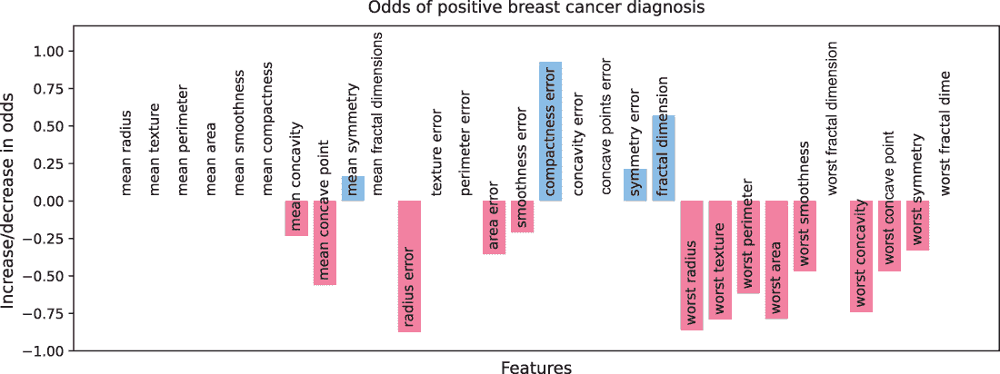

图 9.5 解释逻辑回归，即用于乳腺癌诊断的线性分类模型。正特征权重会导致乳腺癌的概率增加，负特征权重会导致乳腺癌的概率减少，而零特征权重不会影响乳腺癌的概率。

如果特征权重 *w*[i] 大于 0，则 *odds*[i] 大于 1，这将增加阳性诊断的概率 (*change*[i] 大于 0)。如果特征权重 *w*[i] 小于 0，则 *odds*[i] 小于 1，这将减少阳性诊断的概率 (*change*[i] 小于 0)。如果特征权重 *w*[i] 等于 0，则 *odds*[i] 等于 1，并且该特征不会影响诊断 (*change*[i] 等于 0)。

这最后一部分是学习稀疏线性模型的重要组件，其中我们将模型训练为零和零特征权重的混合体。零特征权重意味着该特征不会对模型做出贡献，并且可以被有效地删除。这反过来又允许具有更稀疏的特征集和更精简、更可解释的模型！

注意：线性模型的可解释性取决于特征之间的相对缩放。例如，年龄可能在 18 到 65 岁之间，而薪水可能在 30,000 美元到 90,000 美元之间。这种特征差异会影响底层权重学习，具有更高权重范围的特征（在本例中为薪水）将主导模型。当我们解释此类模型时，我们可能会错误地将更大的重要性归因于这些特征。为了训练一个在训练过程中平等考虑所有特征的稳健模型，必须小心地预处理数据，以确保所有特征都在相同的数值范围内。

线性回归模型也可以以类似的方式进行解释。在这种情况下，我们不是计算概率，而是可以直接计算每个特征对回归值贡献的大小，因为回归值 *y* = *β*[0] + *β*[1]*x*[1] + ⋅⋅⋅ + *β*[d]*x*[d]。

## 9.2 案例研究：数据驱动营销

在本章的其余部分，我们将探讨如何在数据驱动营销领域的机器学习任务中训练黑盒和玻璃盒集成。数据驱动营销旨在利用客户和社会经济信息来识别最有可能对某些类型的营销策略做出积极响应的客户。这允许企业以最优化和个性化的方式针对特定客户进行广告、优惠和销售。

### 9.2.1 银行营销数据集

我们将考虑来自 UCI 机器学习仓库的银行营销数据集¹（[`mng.bz/VpXP`](http://mng.bz/VpXP)），其中数据来自一家葡萄牙银行的基于电话的直接营销活动。任务是预测客户是否会订阅定期存款。

此数据集也附带源代码。对于数据集中的每位客户，都有四种类型的特征：人口统计属性、上次电话联系详情、与该客户相关的整体营销活动信息，以及一般社会经济指标。详细信息见表 9.1。

表 9.1 按特征、类型和来源分组展示银行营销数据集的特征和目标

| 特征 | 类型 | 特征描述 |
| --- | --- | --- |
| **客户人口统计属性和金融指标** |
| age | 连续 | 客户年龄 |
| job | 分类 | 职业类型（12 个类别，例如，蓝领、退休、自雇、学生、服务行业等，以及未知） |
| marital | 分类 | 婚姻状况（离婚、已婚、单身、未知） |
| education | 分类 | 最高教育程度（8 个类别，例如，高中、大学学位、专业课程，以及未知） |
| default | 分类 | 客户是否有信用违约？（是、否、未知） |
| housing | 分类 | 客户是否有住房贷款？（是、否、未知） |
| loan | 分类 | 客户是否有个人贷款？（是、否、未知） |
| **上次营销接触的日期和时间条件** |
| contact | 二元 | 联系沟通类型（手机、电话） |
| month | 分类 | 上次联系月份（12 个类别：一月至十二月） |
| day-of-week | 分类 | 上次联系的工作日（5 个类别：周一至周五） |
| **当前和上次营销活动的营销活动详情** |
| campaign | 连续 | 在此次营销活动中的总联系次数 |
| pdays | 连续 | 上次营销活动以来与上次联系的天数 |
| previous | 连续 | 在此次营销活动之前的联系次数 |
| poutcome | 分类 | 上次营销活动的结果（3 个类别：失败、不存在、成功） |
| **一般社会和经济指标** |
| emp.var.rate | 连续 | 就业变化率：季度指标 |
| cons.price.idx | 连续 | 消费者价格指数：月度指标 |
| cons.conf.idx | 连续 | 消费者信心指数：月度指标 |
| euribor3m | 连续 | 欧洲银行同业拆借利率三个月期：日度指标 |
| nr.employed | 连续 | 员工人数：季度指标 |
| **预测目标** |
| subscribed? | 二元 | 客户是否订阅了定期存款？ |

需要注意的是，这个数据集极度不平衡：在此营销活动下，只有 10%的客户订阅了定期存款。

列表 9.3 加载数据集，将数据分为训练集和测试集，并进行预处理。连续特征使用 scikit-learn 的 MinMaxEncoder 缩放到 0 到 1 之间，分类特征使用 OrdinalEncoder 进行编码。

列表 9.3 加载和预处理银行营销数据集。

```
import pandas as pd
data_file = './data/ch09/bank-additional-full.csv'
df = pd.read_csv(data_file, sep=';')                               ❶
df = df.drop('duration', axis=1)                                   ❷

from sklearn.model_selection import train_test_split
y = df['y']
X = df.drop('y', axis=1)                                           ❸

Xtrn, Xtst, ytrn, ytst = \                                         ❹
    train_test_split(X, y, stratify=y, test_size=0.25)     

from sklearn.preprocessing import LabelEncoder                     ❺
preprocess_labels = LabelEncoder()    
ytrn = preprocess_labels.fit_transform(ytrn).astype(float)
ytst = preprocess_labels.transform(ytst)

from sklearn.preprocessing import MinMaxScaler, OrdinalEncoder    
from sklearn.pipeline import Pipeline
from sklearn.compose import ColumnTransformer

cat_features = ['default', 'housing', 'loan', 'contact', 'poutcome', 
                'job', 'marital', 'education', 'month', 'day_of_week']
cntnous_features = ['age', 'campaign', 'pdays', 'previous', 'emp.var.rate', 
                    'cons.price.idx', 'cons.conf.idx', 'nr.employed', 
                    'euribor3m']    

preprocess_categorical = Pipeline(steps=[('encoder', OrdinalEncoder())])
preprocess_numerical = Pipeline(steps=[('scaler', MinMaxScaler())])
data_transformer = \                                               ❻
    ColumnTransformer(transformers=[
        ('categorical', preprocess_categorical, cat_features),
        ('numerical', preprocess_numerical, cntnous_features)])
all_features = cat_features + cntnous_features

Xtrn = pd.DataFrame(data_transformer.fit_transform(Xtrn),
                    columns=all_features)
Xtst = pd.DataFrame(data_transformer.transform(Xtst), columns=all_features)
```

❶ 加载数据集

❷ 删除“duration”列（见注释以获取更详细的解释）

❸ 将数据帧分为特征和标签

❹ 使用分层抽样将数据分为训练集和测试集以保持类别平衡

❺ 使用“LabelEncoder”对标签进行预处理

❻ 使用“MinMaxEncoder”对连续特征进行预处理，使用“OrdinalEncoder”对分类特征进行预处理

为了防止数据与目标泄露（见第八章），我们确保在应用于测试集之前，缩放和编码函数仅适用于训练集。

注意：原始数据集包含一个名为*duration*的特征，它指的是最后一次电话的持续时间。较长的通话与通话的结果高度相关，因为较长的通话表明客户更加投入，更有可能订阅。然而，与其他特征不同，这些特征在拨打电话之前是已知的，我们不可能提前知道通话的持续时间。因此，持续时间特征本质上就像一个目标变量，因为通话后持续时间与订阅状态都将立即知晓。为了构建一个可以在实践中部署的、在拨打电话前包含所有特征的现实预测模型，我们从我们的模型中删除了这个特征。

### 9.2.2 训练集成

现在，我们将在这个数据集上训练两个集成（来自不同的包）：xgboost.XGBoostClassifier 和 sklearn.RandomForestClassifier。这两个模型都将是由 200 个决策树组成的复杂集成（在 XGBoost 的情况下是加权集成），并且实际上是黑盒。一旦训练完成，我们将在第 9.3 节中探讨如何使这些黑盒可解释。

列表 9.4 展示了我们如何在这个数据集上训练 XGBoost 集成。我们使用随机网格搜索结合 5 折交叉验证（CV）和提前停止（见第六章以获取更多详细信息）来选择各种超参数，如学习率和正则化参数。

列表 9.4 在银行营销数据集上训练 XGBoost

```
from xgboost import XGBClassifier
from sklearn.model_selection import RandomizedSearchCV

xgb_params = {                                       ❶
    'learning_rate': [0.001, 0.01, 0.1],  
    'n_estimators': [100],                
    'max_depth': [3, 5, 7, 9],            
    'lambda': [0.001, 0.01, 0.1, 1],      
    'alpha': [0, 0.001, 0.01, 0.1],       
    'subsample': [0.6, 0.7, 0.8, 0.9],    
    'colsample_bytree': [0.5, 0.6, 0.7],  
    'scale_pos_weight': [5, 10, 50, 100]}    

fit_params = {'early_stopping_rounds': 15,           ❷
              'eval_metric': 'aucpr',
              'eval_set': [(Xtst, ytst)],
              'verbose': 0}

xgb = XGBClassifier(objective='binary:logistic',     ❸
                    use_label_encoder=False)
xgb_search = RandomizedSearchCV(xgb, xgb_params, cv=5, n_iter=40, 
                                verbose=2, n_jobs=-1)
xgb_search.fit(X=Xtrn, y=ytrn.ravel(), **fit_params)
xgb = xgb_search.best_estimator_                     ❹
```

❶ 为 XGBoost 创建超参数网格

❷ 初始化提前停止并设置提前停止轮数为 15

❸ 将 XGBoost 的分类损失设置为逻辑损失

❹ 在 CV 后保存最佳 XGBoost 模型

还要注意，其中一个超参数是 scale_pos_weight，它允许我们以不同的方式对正负训练示例进行加权。这是必要的，因为银行营销数据集是不平衡的（正负例比例为 10%:90%）。通过更多地加权正例，我们可以确保它们的贡献不会被更大的负例比例所淹没。在这里，我们使用交叉验证从 5、10、50 和 100 中确定正例的权重。

此列表训练了一个 XGBoostClassifier，在测试集上实现了大约 87.24%的准确率和 74.67%的平衡准确率。我们可以使用类似的程序来训练这个数据集上的随机森林。主要区别在于我们为正例设置了类别权重为 10。

列表 9.5 在银行营销数据集上训练随机森林

```
from sklearn.ensemble import RandomForestClassifier
from sklearn.model_selection import RandomizedSearchCV

rf_params = {                                         ❶
    'max_depth': [3, 5, 7],                
    'max_samples': [0.5, 0.6, 0.7, 0.8],   
    'max_features': [0.5, 0.6, 0.7, 0.8]}

rf = RandomForestClassifier(
         class_weight={0: 1, 1: 10},                  ❷
         n_estimators=200)
rf_search = RandomizedSearchCV(rf, rf_params, cv=5, n_iter=30, 
                               verbose=2, n_jobs=-1)
rf_search.fit(X=Xtrn, y=ytrn)
rf = rf_search.best_estimator_                        ❸
```

❶ 为“RandomForestClassifier”创建一个超参数网格

❷ 将正负样本的权重设置为 1:10

❸ 在交叉验证后保存最佳随机森林

此列表训练了一个 RandomForestClassifier，在测试集上达到了大约 84%的准确率。

### 9.2.3 树集成中的特征重要性

本书中的大多数集成（包括在前一小节中训练的 XGBoostClassifier 和 RandomForestClassifier）都是树集成，因为它们使用决策树作为其基本估计器。计算集成特征重要性的一个方法就是简单地平均各个基本决策树的特征重要性！

实际上，随机森林（在 scikit-learn 中）和 XGBoost 的实现已经这样做了，我们可以使用以下方法获得集成特征重要性：

```
xgb_search.best_estimator_.feature_importances_
rf_search.best_estimator_.feature_importances_
```

我们在图 9.6 中可视化和比较这两个集成的特征重要性，以解释和理解它们的决策过程。

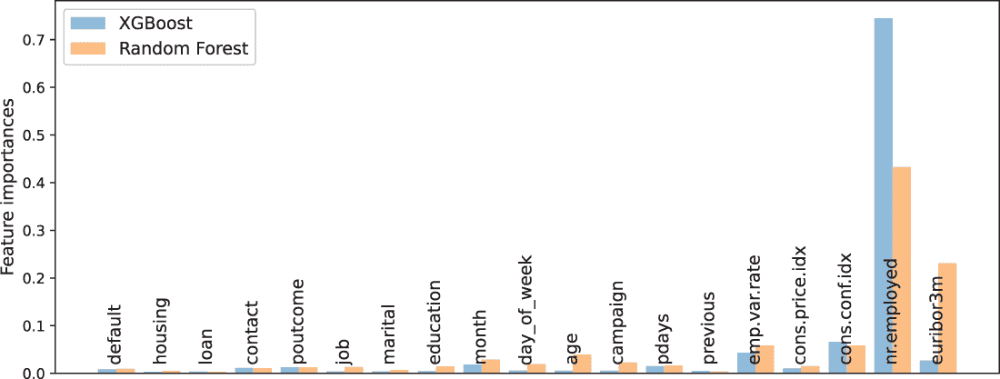

图 9.6 XGBoost（左柱）和随机森林（右柱）分类器学习的集成特征重要性

这两个集成都赋予了社会经济指标变量（尤其是 nr.employed 和 emp.var.rate，它们表示失业率）、euribor3m（银行间利率，表示宏观经济稳定性）和 cons.conf.idx（表示消费者对其预期财务状况的乐观程度）重要的权重。

然而，XGBoost 模型却高度依赖于其中一个变量，即 nr.employed。从对这一点的解读中可以得出的总体结论是，当整体经济形势没有不确定性或波动，且乐观时，人们更有可能订阅定期存款账户。

特征重要性使我们能够理解模型在整体上以及在不同类型的示例上做了什么。也就是说，特征重要性是一种全局可解释性方法。

## 9.3 全局可解释性的黑盒方法

机器学习模型可解释性的方法可以分为两种类型：

+   全局方法试图一般性地解释模型的决策过程以及哪些因素是广泛相关的。

+   局部方法试图具体解释模型针对单个示例和预测的决策过程。

全局可解释性涉及模型在部署或实际使用时在大量示例上的合理行为，而局部可解释性则涉及模型对单个示例的个别预测，这使用户能够决定下一步该做什么。

在本节中，我们探讨一些黑盒模型的全球可解释性方法。这些方法只考虑模型的输入和输出，不使用模型内部结构（因此，称为黑盒）来解释模型行为。因此，它们可以用于任何机器学习方法的全球可解释性，也被称为*模型无关方法*。

### 9.3.1 排列特征重要性

在机器学习模型中，特征重要性是指一个分数，表示特征在模型中的好坏，即特征在模型决策过程中的有效性。

我们已经看到了如何计算决策树的特征重要性，以及通过聚合，对于使用决策树作为基估计器的基于树的集成方法。对于基于树的方法，特征重要性计算使用模型内部信息，如树结构和分割参数。但如果这些模型内部信息不可用呢？在这种情况下，是否有黑盒等效方法来获取特征重要性？

确实存在：*排列特征重要性*。回想一下，决策树特征重要性分数是通过评估每个特征降低分割标准（例如，用于分类的基尼不纯度或熵，用于回归的平方误差）的程度来对每个特征进行评分的。相比之下，排列特征重要性是通过评估我们在排列（打乱）该特征的值之后，该特征增加测试错误的程度来对每个特征进行评分的。

这里的直觉很简单：如果一个特征更重要，那么“干扰”它会影响其对预测的贡献，并增加测试错误。如果一个特征不太重要，那么干扰它对模型预测的影响不会很大，也不会影响测试错误。

我们通过随机排列特征值来“干扰”一个特征。这有效地切断了该特征与其预测之间的任何关系。排列特征重要性的过程在图 9.7 中进行了说明。

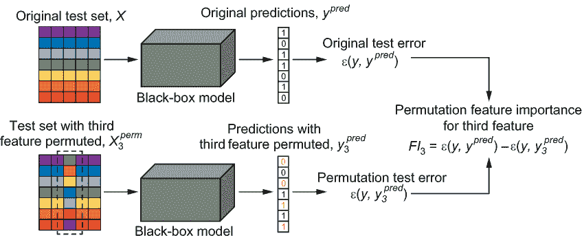

图 9.7 计算排列特征重要性的过程，以第三个特征为例。这个过程会重复应用于所有特征。排列特征重要性仅使用输入和输出估计特征重要性，不使用模型内部信息（这使得它成为一个模型无关的方法）。

排列特征重要性在如何评分特征而不访问模型内部信息方面既优雅又简单。尽管如此，这里有一些重要的技术细节需要记住：

+   排列特征重要性是一个前后评分。它试图估计在我们打乱（排列）特征之后，模型的预测性能如何从之前到之后发生变化。为了得到一个稳健且无偏的模型性能前后估计，使用保留的测试集是至关重要的！

+   根据任务（分类或回归）、数据集以及我们的建模目标，有许多方法可以评估模型的预测性能。对于这个任务，例如，考虑以下性能指标：

    +   *平衡准确率*——由于这是一个分类任务，准确率自然成为模型评估指标的一个选择。然而，这个数据集正负样本的比例为 1:10，是不平衡的。为了解决这个问题，我们可以使用平衡准确率，它通过按类别大小加权预测来确保这种偏差被考虑在内。

    +   *召回率*——这个模型的目的在于识别那些会订阅定期存款的高价值客户。从这个角度来看，我们希望最小化错误否定，即我们的模型认为不会订阅但实际上会订阅的客户！这种类型的错误预测会损失我们客户，而召回率是一个很好的指标来最小化这种错误否定。

+   这个过程随机打乱特征值。与任何随机方法一样，重复这个过程几次并平均结果是一个好主意（类似于我们在交叉验证中使用 k 折的方法）。

实践中的排列特征重要性

下面的列表计算了在上一节中训练的 XGBClassifier 的排列特征重要性，使用的是平衡准确率。

列表 9.6 计算排列特征重要性

```
from sklearn.inspection import permutation_importance
pfi = permutation_importance(
          xgb, Xtst, ytst,               ❶
          scoring='balanced_accuracy',   ❷
          n_repeats=30)                  ❸
```

❶ 使用保留的测试集来计算特征重要性

❷ 可以使用不同的指标来评估模型性能和特征重要性。

❸ 重复随机打乱特征

图 9.8 比较了 XGBoost 模型的特征重要性以及使用平衡准确率和召回率计算出的排列重要性，并可视化每种方法识别的前 10 个特征。

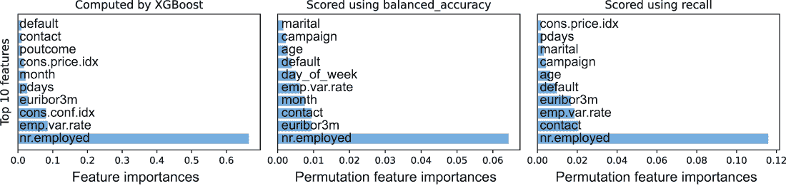

图 9.8 XGBoost 计算的特征重要性与使用两个不同指标（平衡准确率和召回率）计算的 XGBoost 模型的黑盒排列特征重要性进行了比较。

有趣的是，尽管三种方法都认同 nr.employed（雇员数量）的重要性，但在使用平衡准确率或召回率来评分特征时，euribor3m（银行间借贷利率）成为了一个关键指标。稍微深入思考一下，可能会揭示其中的原因。在一个更健康的经济中，更好的银行间借贷利率允许更好的利率，这反过来又有利于吸引客户订阅定期存款账户。

除了社会经济指标外，其他特征，如联系（手机与电话联系）和活动（在此活动中联系的总数），也成为了客户是否会订阅定期存款的重要指标。

一些人口统计特征，如婚姻状况、年龄和教育程度，在召回率评分中也开始变得重要，我们的目标是减少错误否定，并尽可能多地识别高价值客户。再次强调，有效地识别高价值客户依赖于他们的个人人口统计指标。

注意：必须小心处理相关特征，因为它们包含相似的信息。例如，当两个特征相关时，其中一个被置换，模型仍然可以使用未置换的其他特征而不会降低性能（因为它们都包含相似的信息）。由于置换前后的分数相似，相关特征的置换特征重要性分数将很小。从这个结果中，我们可能会错误地得出结论，认为两个特征都不重要，而实际上它们可能都很重要。当我们有三个、四个或是一组相关特征时，这种情况会更糟。处理这种情况的一种方法是通过聚类将特征分组，并使用每个特征组的一个代表性特征。

### 9.3.2 部分依赖图

*部分依赖图*（PDPs）是另一种有用的黑盒方法，它帮助我们识别特征与目标之间的关系的本质。与使用随机化来激发特征重要性的置换特征重要性不同，部分依赖关系是通过边缘化或求和来识别的。

假设我们感兴趣的是计算目标 *y* 与第 *k* 个特征 *X*[k] 之间的部分依赖。设剩余特征的数据集为 *X*[rest]。我们有一个黑盒模型 *y* = *f*([*X*[k],*X*[rest]])。

要从这个黑盒中获得部分依赖函数 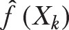，我们只需对所有其他特征 *X*[rest] 的所有可能值进行求和；也就是说，我们边缘化其他特征。从数学上讲，对所有其他特征的可能的值进行求和等同于对它们进行积分：

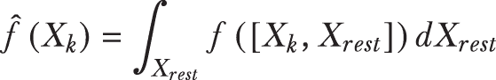

然而，由于计算这个积分实际上并不可行，我们需要对其进行近似。我们可以使用一组 *n* 个例子非常容易地做到这一点：

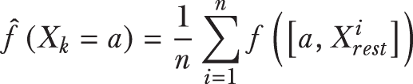

这个公式为我们计算特征 *X*[k] 的部分依赖函数提供了一种直接的方法。

对于不同的 *a* 值，我们只需将整个列替换为 a。因此，对于每个 *a*，我们创建一个新的数据集 *X*^([*a*])，其中第 *k* 个特征在每一个例子中都取值为 *a*。使用我们的黑盒模型对这个修改后的数据集进行预测的结果将是 *y*^([*a*]) = *f*(*X*^([*a*]))。预测向量 *y*^([*a*]) 是一个长度为 *n* 的向量，包含修改后的数据集中每个测试例子的预测。我们现在可以对这些预测进行平均，以得到一对点：

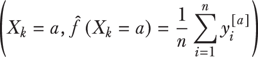

我们重复这个步骤，对不同的 α 值进行操作，以生成完整的 PDP。这在图 9.9 中用两个值 *a* = 0,1 和 *a* = 0.4 进行了说明。

PDPs 易于创建和使用，尽管它们可能有些耗时，因为必须为依赖图中的每个点创建和评估数据集的新修改版本。以下是一些需要记住的重要技术细节：

+   部分依赖试图将模型的输出与输入特征联系起来，即从模型学习到的行为。因此，最好使用训练集创建和可视化 PDP。

+   记住，整体部分依赖函数是通过平均 *n* 个示例创建的；也就是说，每个训练示例都可以用来创建一个特定于示例的部分依赖函数。这种特定示例与其输出之间的部分依赖称为*个体条件期望*（ICE）。


图 9.9 展示了在 *X*[3] = 0.1 和 *X*[3] = 0.4 处计算的第三个特征的部分依赖图中的两个点。观察我们发现，我们将第三列（特征）分别设置为 0.1 和 0.3，以获得两个数据集。这些数据集各自产生两组预测，这些预测被平均以在 PDP 上产生两个点。

实践中的部分依赖图

下一个列表说明了如何为在 9.2 节中较早训练的 Bank Marketing 数据集上的 XGBoostClassifier 构建 PDPs。

列表 9.7 创建 PDPs

```
from sklearn.inspection import PartialDependenceDisplay as pdp
import matplotlib.pyplot as plt

fig, ax = plt.subplots(nrows=2, ncols=2, figsize=(10, 6)) 
pdp.from_estimator(
    xgb, Xtrn, 
    features=['euribor3m', 'nr.employed',
              'contact', 'emp.var.rate'],   ❶
    feature_names=list(Xtrn.columns),       ❷
    kind='average',                         ❸
    response_method='predict_proba',        ❹
    ax=ax)   
```

❶ 我们想要计算 PDPs 的特征

❷ 数据集中所有特征的列表

❸ 为每个示例或平均部分依赖图绘制单个条件期望

❹ 设置我们是否想要带有预测或预测概率的部分依赖

图 9.10 显示了银行营销数据集中四个高得分变量的部分依赖函数：euribor3m、nr.employed、contact 和 emp.var.rate。

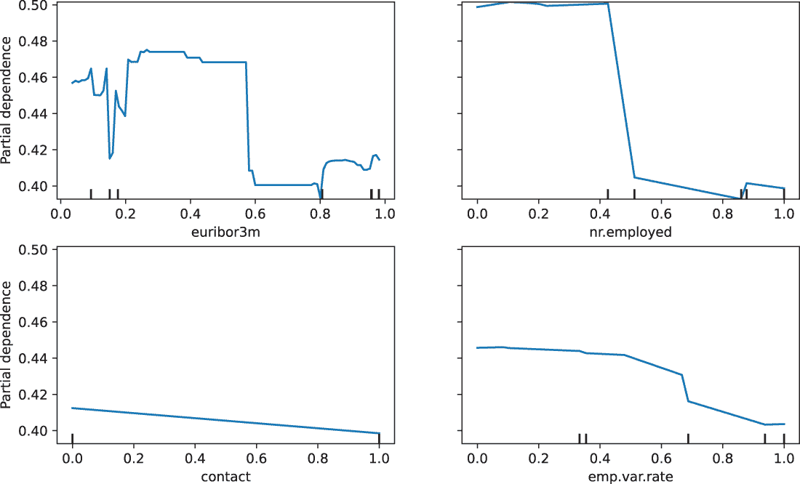

图 9.10 展示了银行营销数据集中四个变量的 PDPs

PDPs 让我们进一步了解不同变量如何表现以及它们如何影响预测。注意，在列表 9.7 中，我们将 response_method 设置为'predict_proba'。因此，图 9.10 中的图表显示了每个变量（部分）如何影响客户订阅定期存款账户的预测概率。更高的预测概率表明这些属性在识别高价值客户方面更有帮助。

例如，euribor3m 的值较低（例如，在 0-0.5 的范围内）通常对应着更高的订阅可能性。如前所述，这是有道理的，因为较低的银行借款利率通常意味着较低的客户利率，这对潜在客户来说是有吸引力的。

类似的结论——较低的失业率也可能影响潜在客户开设定期存款账户——也可以从变量 emp.var.rate 和 nr.employed 中得出。

注意：与排列特征重要性类似，PDPs（部分依赖图）过程的一个关键假设是我们感兴趣的特性，*X*[k]，与剩余特性，*X*[rest]，不相关。这个独立性假设使我们能够通过求和来边缘化剩余特性。如果特性 *X*[rest] 是相关的，那么对它们的边缘化将破坏 *X*[k] 的某些组成部分，我们就无法准确了解 *X*[k] 对预测的贡献程度。

PDPs（部分依赖图）的一个重要限制是，只能创建一个变量的部分依赖函数（曲线）、两个变量的（等高线）或三个变量的（表面图）的图表。超过三个变量，在不将特性分解成两个或三个更小组的情况下，就无法可视化多变量的部分依赖。

### 9.3.3 全局代理模型

黑盒解释，如特征重要性和部分依赖，试图识别单个特性或特性组对预测的影响。在本节中，我们探讨一种更全面的方法，旨在以可解释的方式近似黑盒模型的行为。

代理模型的想法极其简单：我们训练第二个模型来模仿黑盒模型的行为。然而，代理模型本身是一个玻璃盒，本质上是可以解释的。

一旦训练完成，我们可以使用代理玻璃盒模型来解释黑盒模型的预测，如图 9.11 所示：

+   一个代理数据集 (*X*^s[trn],*y*^s[trn])用于训练代理模型。用于训练黑盒模型的原始数据也可以用来训练代理模型，如果它可用的话。如果不可用，则使用来自原始问题空间的替代数据样本。关键是确保代理数据集与用于训练黑盒模型的原始数据集具有相同的分布。

+   代理模型是在原始黑盒模型的预测上训练的。这是因为我们的想法是拟合一个代理模型来*模仿*黑盒模型的行为，这样我们就可以使用代理来解释黑盒。一旦训练完成，如果代理预测 (*y*^s[pred]) 与黑盒预测 (*y*^b[pred]) 匹配，那么代理模型就可以用来解释预测。

+   任何玻璃盒模型都可以用作代理模型。这包括决策树和 GLMs（广义线性模型），然后可以像在 9.11 节中之前展示的那样进行解释。

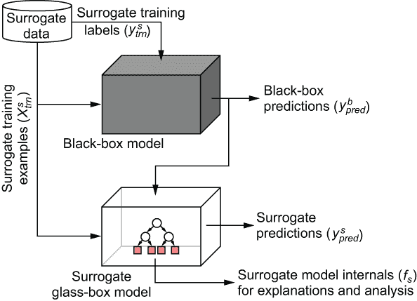

图 9.11 从黑盒模型的预测中训练全局代理模型的流程。两个模型都在相同的代理训练示例上进行了训练。然而，代理模型是在黑盒模型的预测上进行训练的，以便它可以学习模仿其预测。如果黑盒和代理做出相同的预测，那么代理就可以用来解释黑盒模型的预测。

保真度-可解释性权衡

让我们训练一个代理决策树来解释在 Bank Marketing 数据集上最初训练的 XGBoost 模型的行为。原始训练集也被用作代理训练集。

请记住，在训练模型时，我们希望在两个标准之间进行权衡：代理模型对黑盒模型的保真度和代理模型的可解释性。代理模型的保真度衡量它模仿黑盒模型预测行为的能力有多好。更精确地说，我们衡量代理模型预测（*y*^s[pred]）与黑盒模型预测（*y*^b[pred]）的相似程度。

对于二元分类问题，我们可以使用准确度或*R*²分数（见第一章）等指标来完成这项工作。对于回归问题，我们可以使用均方误差（MSE）或*R*²等指标。更高的*R*²分数表明黑盒模型与其代理之间的保真度更好。

代理模型的可解释性取决于其复杂性。假设我们想要训练一个决策树代理模型。回想一下我们在第 9.1 节中的讨论，我们需要限制代理模型中叶节点的数量，以便它能够被人类解释，因为过多的叶节点可能会导致模型复杂化并使解释者感到不知所措。

实际上训练全局代理模型

为了训练一个有用的代理模型，我们需要在保真度-可解释性权衡中找到最佳平衡点。这个最佳平衡点将是一个能够很好地近似黑盒预测但又不至于过于复杂以至于无法进行解释（可能通过检查）的代理模型。

图 9.12 显示了为 XGBoost 模型训练的决策树代理模型的保真度-可解释性权衡。代理模型是在第 9.1 节中用于训练 XGBoost 模型的相同 Bank Marketing 训练集上训练的。

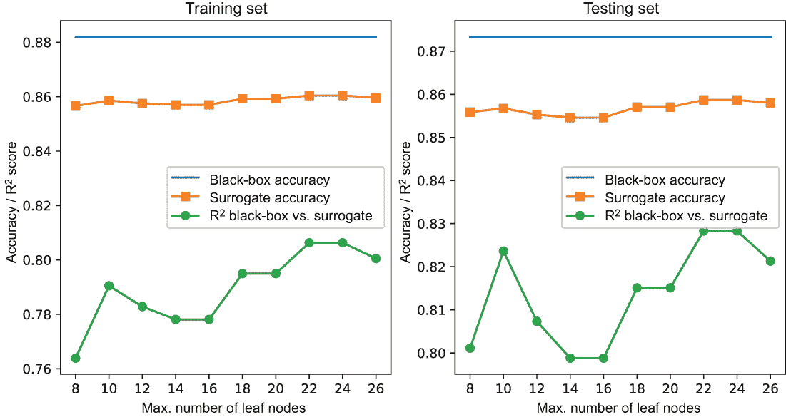

图 9.12 Bank Marketing 数据集的保真度-可解释性权衡。黑盒模型是一个 XGBoost 集成，而代理模型是在黑盒预测上训练的决策树。

我们在保持对黑盒预测和代理预测之间保真度（*R*²分数）的关注的同时，增加代理模型的复杂性（以叶节点数量表征）。一个具有 14 个叶节点的决策树代理模型似乎在保真度和复杂性之间实现了可解释性的理想权衡。列表 9.8 展示了具有这些规格的代理决策树模型的训练过程。

列表 9.8 训练代理模型

```
from sklearn.tree import DecisionTreeClassifier
surrogate = \
    DecisionTreeClassifier(criterion='gini',
                           max_leaf_nodes=14,       ❶
                           min_samples_leaf=20,     ❷
                           class_weight ={0: 1,     ❸
                                          1: 10})   ❸

surrogate.fit(Xtrn, xgb.predict(Xtrn))
```

❶ 将最大可能的叶子节点数设置为 14

❷ 将叶子节点中的最小样本数设置为 20，以避免过拟合

❸ 将负例的类别权重设置为 1，将正例的类别权重设置为 10，以解决类别不平衡问题

图 9.13 显示了 XGBoost 模型的决策树代理

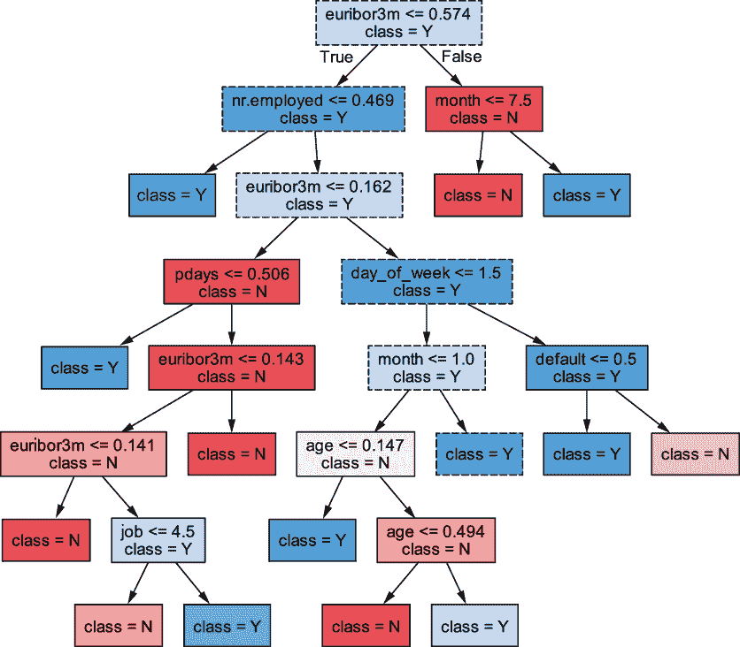

图 9.13 从原始在 Bank Marketing 数据集上训练的 XGBoost 模型的预测中训练得到的代理模型。此树有 14 个叶子节点。检查和分析此树可以得出许多见解，例如从根节点到叶子节点的突出路径（带有虚线边框的节点）。

几个变量出现在从根节点到叶子节点的突出路径中。这些变量描述了一个高价值子群体，并提供了关于可能成功的策略的见解。

例如，社会经济变量，如 nr.employed 和 euribor3m，识别出有利于发起成功活动的有利社会环境。此外，[day_of_week <= 1.5]表明，在周一（day_of_week = 0）或周二（day_of_week = 1）联系这些高价值客户是一个好策略。

我们还可以查看其他路径和节点以获得更深入的见解。节点 age <= 0.147 是在预处理数据上获得的，其中 0.147 对应于缩放前的 40。这表明年龄在 40 岁以下的客户是高价值的。

另一个有用的节点是[default <= 0.5]，这表明没有先前违约记录的客户是高价值的。您可能能够识别出识别高价值客户和策略的其他可行策略。

## 9.4 用于局部可解释性的黑盒方法

前一节介绍了全局可解释性的方法，这些方法的目的是解释模型在不同类型的输入示例和子群体中的全局行为趋势。在本节中，我们将探讨局部可解释性的方法，这些方法的目的是解释模型的个别预测。这些解释允许用户（例如，使用诊断系统的医生）信任预测并据此采取行动。这与用户理解模型为何做出特定决定的能力相关。

### 9.4.1 使用 LIME 的局部代理模型

我们将要探讨的第一个方法是称为*局部可解释的模型无关解释*（LIME）。正如其名相当明显地暗示的那样，LIME 是（1）一个模型无关的方法，这意味着它可以与任何机器学习模型黑盒一起使用；并且（2）一个用于解释模型个别预测的局部可解释性方法。

LIME 实际上是一种 *局部代理方法*。它使用线性模型来近似我们感兴趣解释的示例的局部黑盒模型。这种直觉在图 9.14 中显示，其中有一个黑盒模型的复杂表面和一个可解释的线性代理模型，该模型近似单个感兴趣示例周围的黑盒行为。

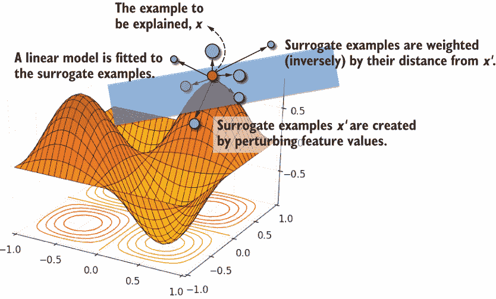

图 9.14 LIME 在需要解释预测的示例的局部创建了一个代理训练示例集。这些示例根据它们的距离进一步加权。这通过代理示例的大小表示，较近的示例获得更高的权重（并显示更大）。使用加权损失函数来拟合线性代理模型，这提供了局部解释。

保真度-可解释性权衡再次出现

对于我们想要解释预测的训练示例，LIME 训练一个局部代理，使其成为在保真度和可解释性之间具有最佳权衡的模型。在上一节中，我们训练了一个决策树代理来优化保真度-可解释性权衡。

让我们更正式地写下这一点。首先，我们用 *ƒ*b 表示黑盒模型，用 *ƒ*s 表示代理模型。我们使用 *R*² 分数来衡量黑盒 (*ƒ*[b]) 和代理 (*ƒ*[s]) 预测之间的保真度。我们通过树中的叶子节点数量来衡量代理模型的可解释性：叶子节点越少，通常可解释性越好。

假设我们想要解释黑盒在示例 *x* 上的预测。对于决策树代理训练，我们试图找到一个决策树，以优化以下内容：

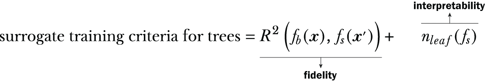

类似地，LIME 通过优化以下内容来训练线性代理：

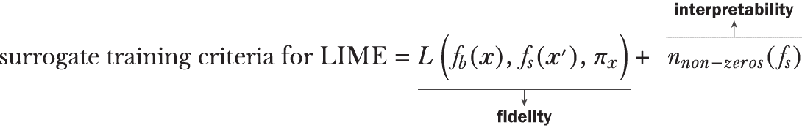

在这里，我们将使用称为代理训练示例的 *x*' 来训练代理模型。用于衡量保真度的损失函数是一个简单的加权均方误差（MSE），它衡量黑盒和代理预测之间的差异：

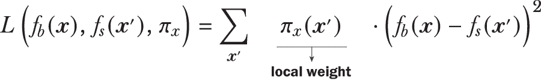

代理是一个线性模型，形式为 *ƒ*s = *β*[0] + *β*[1]*x*[1]'+ ⋅⋅⋅ + *β*[d]*x*[d]', 其中 x' 是代理示例。正如我们在第 9.1 节中看到的，线性模型的可解释性取决于特征的数量。特征越少，分析相应的参数 *β*[k] 就越容易。因此，LIME 试图训练具有更多零参数的稀疏线性模型，以促进可解释性（记住在第七章中提到的 L1 正则化可以帮助做到这一点）。

但是什么让 LIME 变得局部？我们如何训练一个局部的代理模型？我们如何获得代理示例 *x*'? 以及前一个方程中的这些局部权重 (*π*[x]) 是什么？答案在于 LIME 如何创建和使用代理示例。

为局部可解释性采样代理示例

我们现在有一个明确的保真度-可解释性标准来训练我们的代理模型。如果我们使用整个训练集，我们将获得一个全局代理模型。

为了训练一个局部代理模型，我们需要接近或相似于我们感兴趣示例的数据点。LIME 通过采样和平滑创建一个局部的代理训练集。

假设我们感兴趣的是解释具有五个特征的示例上黑盒的预测：*x* = [*x*[1],*x*[2],*x*[3],*x*[4],*x*[5]]。LIME 如下在 *x* 的邻域中采样数据：

+   *扰动*——为每个特征随机生成扰动。对于连续特征，扰动从正态分布中随机采样，*ϵ*~*N*(0,1)。对于分类特征，这些是从 *K* 个类别值的多变量分布中随机采样，*ϵ*~Cat(*K*)。这生成一个代理示例 *x*' = [*x*[1] + *ϵ*[1], *x*[2] + *ϵ*[2], *x*[3] + *ϵ*[3], *x*[4] + *ϵ*[4], *x*[5] + *ϵ*[5]]。现在这个示例也可以使用黑盒进行标记，*y* = *f*[b]*(**x*')。这个过程会继续，直到我们在 *x* 的局部区域内获得一个代理集 *Z*。

+   *平滑*——每个代理训练示例也使用指数平滑核分配一个权重：*π*x = exp(-*γ* ⋅ *D*(*x*,*x*')²)。在这里，*D*(*x*,*x*') 是需要解释的示例 *x* 与扰动样本 *x*' 之间的距离。距离 *x* 更远的代理训练示例将获得更小的权重，而距离 *x* 更近的示例将获得更高的权重。因此，这个函数鼓励代理模型在训练线性近似时优先考虑更局部的代理示例。平滑参数 *γ* > 0 控制核的宽度。增加 γ 允许 LIME 考虑更大的邻域，使模型更不局部。

现在我们已经在示例 *x* 的局部区域内拥有了一个代理训练集，我们可以训练一个线性模型。目标是训练它以产生稀疏性（尽可能多的零参数）。LIME 支持使用 L1 正则化训练稀疏线性模型，例如最小绝对收缩和选择（LASSO）或弹性网络。这些模型在第七章中介绍，可以很容易地扩展到用于分类的逻辑回归。

注意：敏锐的观察者可能会注意到，以欧几里得距离 *D* 为条件的指数核与支持向量机和其他核方法中使用的径向基函数（RBF）核是相同的。从这个角度来看，指数平滑核本质上是一个相似度函数。距离较近的点被认为是更相似的，并将具有更高的权重。

实践中的 LIME

LIME 可以通过 Python 最流行的两个包管理器：pip 和 conda 获得。该包的 GitHub 页面（[`github.com/marcotcr/lime`](https://github.com/marcotcr/lime)）还包含额外的文档和多个示例，说明如何使用 LIME 进行分类、回归以及在文本和图像分析中的应用。

在列表 9.9 中，我们使用 LIME 来解释来自银行营销数据集的测试集示例的预测。测试示例 3104 是一位已经订阅的客户，XGBoost 模型以 64%的置信度将其识别为真阳性示例。

列表 9.9 使用 LIME 解释 XGBoost 预测

```
cat_features = ['default', 'housing', 'loan', 'contact', 'poutcome', 
                'job', 'marital', 'education', 'month', 'day_of_week']
cat_idx = np.array(                                                     ❶
              [cat_features.index(f) for f in cat_features])

from lime import lime_tabular
explainer = lime_tabular.LimeTabularExplainer(
    Xtrn.values,                                                        ❷
    feature_names=list(Xtrn.columns),                                   ❸
    class_names=['Sub?=NO', 'Sub?=YES'], 
    categorical_names=cat_features,
    categorical_features=cat_idx,                                       ❶
    kernel_width=75.0,                                                  ❹
    discretize_continuous=False)

exp = explainer.explain_instance(                                       ❺
          Xtst.iloc[3104], xgb.predict_proba)    
fig = exp.as_pyplot_figure()                                            ❻
```

❶ 明确识别分类特征及其索引（用于可视化）

❷ 通过训练集，有时用于采样，特别是连续特征

❸ 明确识别特征名称和类别名称（用于可视化）

❹ 为此数据集设置核宽度（通过试错法确定）

❺ 解释测试示例 3104 的预测

❻ 将解释可视化为条形图

图 9.15 可视化了 LIME 为解释此示例而识别的局部权重。

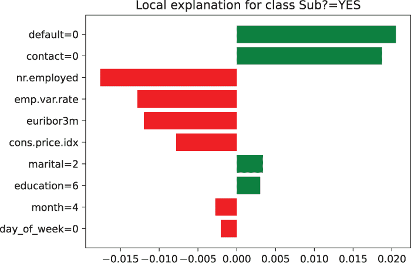

图 9.15 展示了 LIME 为测试示例 3104（一个真阳性预测）生成的解释。对负面预测（不会订阅）有贡献的特征将是负值，位于零的左侧。对正面预测（会订阅）有贡献的特征将是正值，位于零的右侧。

被解释示例的特征和特征值（在 y 轴上显示）。x 轴显示 LIME 特征重要性。

除了社会经济趋势之外，让我们看看这位客户的个性化特征。影响最大的变量是联系（=0），他们是否被手机或固定电话联系（在这里，0 = 手机）；以及违约，他们是否有之前的银行违约历史（在这里，0 = 他们没有之前的违约）。

这些解释对非 AI 用户来说也将是直观的，例如在销售和营销领域，他们可能会进一步分析它们以微调未来的营销活动。

### 9.4.2 使用 SHAP 的局部可解释性

在本节中，我们将介绍另一种广泛使用的局部可解释性方法：*Shapley 加性解释*（SHAP）。SHAP 是另一个类似于 LIME 的模型无关黑盒解释器，用于通过特征重要性解释单个预测（因此，局部可解释性）。

SHAP 是一种特征归因技术，它根据每个特征对整体预测的贡献来计算特征重要性。SHAP 建立在 Shapley 值的概念之上，该概念来自合作博弈论领域。在本节中，我们将学习 Shapley 值是什么，它们如何应用于计算特征重要性，以及如何在实践中高效地计算它们。

理解 Shapley 值

假设一组四个数据科学家（Ava、Ben、Cam 和 Dev）在 Kaggle 挑战中合作并赢得了一等奖，总奖金为 20,000 美元。作为一个公平的团队，他们决定根据他们的贡献来分割奖金。他们通过尝试了解他们在各种组合中的工作效果来实现这一点。由于他们过去合作了很多，他们记录了他们单独工作以及以两人和三人小组工作时的效果。这些表示每种组合有效性的值在图 9.16 中显示。

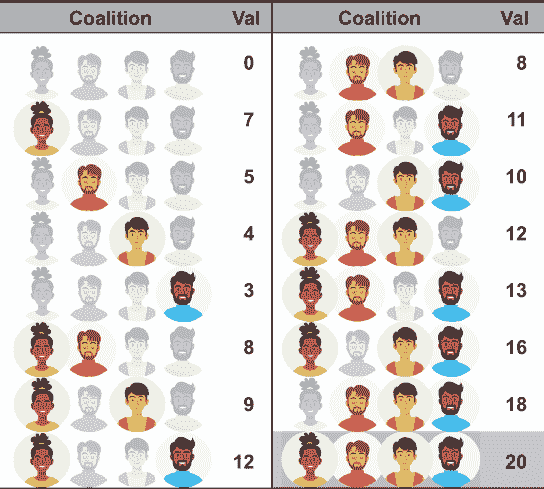

图 9.16 展示了 Ava、Ben、Cam 和 Dev 的所有可能的联盟及其对应的价值（以 1,000 美元为单位）。最后一个联盟包含所有四个朋友，价值为 20,000 美元，即总奖金。有一个大小为 0 的联盟，四个大小为 1 的联盟，六个大小为 2 的联盟，四个大小为 3 的联盟，以及一个大小为 4 的联盟。这个表称为特征函数。

此表列出了 Ava、Ben、Cam 和 Dev 的每一种可能的组合，也称为联盟。与每个联盟相关联的是其价值（以 1,000 美元为单位），这表明如果他们是这个项目唯一的工作者，每个联盟的价值是多少。

例如，仅 Ava 的联盟价值为 7,000 美元，而 Ava、Ben 和 Dev 的联盟价值为 13,000 美元。所有四个人的最后一个联盟，称为*大联盟*，价值为 20,000 美元，即总奖金。

*Shapley 值*使我们能够将总奖金分配给所有可能的联盟中的这四个团队成员。它实际上帮助我们确定团队成员对整体协作的重要性，并帮助我们确定分割整体价值（在这种情况下，奖金）的公平方式。

每个团队成员*p*（也称为玩家）的 Shapley 值是以非常直观的方式计算的：我们观察在有和没有该团队成员的情况下，每个联盟的价值是如何变化的。更正式地说：

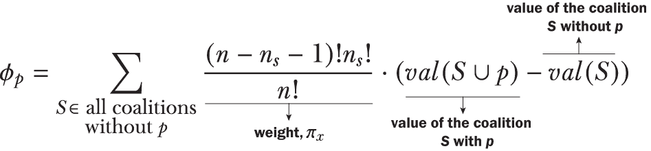

这个方程一开始可能看起来令人畏惧，但实际上非常简单。图 9.17 展示了在计算 Dev（团队成员 4）的 Shapley 值时，该方程的组成部分：（1）第一行中的包含 Dev 的联盟，（2）第二行中对应的没有 Dev 的联盟，以及（3）第三行中两者之间的加权差异。

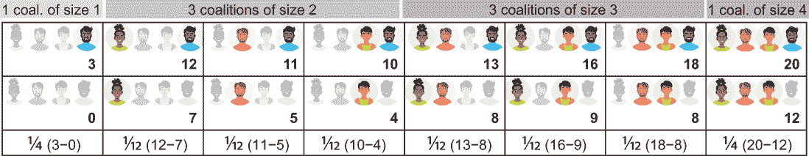

图 9.17 计算 Dev 的 Shapley 值。最上面一行是所有包含 Dev 的联盟。中间一行显示的是没有 Dev 的对应联盟。最后一行显示了联盟价值中的个体加权差异。将最后一行相加，我们得到 Dev 的 Shapley 值：*φ*[Dev] = 6。

权重是使用 *n*，团队成员总数（在这种情况下，为四个），和 *n*[s]，联盟大小来计算的。例如，对于联盟 *S* = {Ava, Cam}，*n*[s] = 2。没有 Dev 的联盟（*S*）和包含 Dev 的联盟（*S* ∪ Dev）的权重都将为 (1!2!)/4! = (1/12)。其他权重可以类似地计算。

将图 9.17 最后一行的所有加权差异相加，我们得到 Dev 的 Shapley 值，*φ*[Dev] = 6。同样，我们也可以得到*φ*[Ava] = 4.667，*φ*[Ben] = 4.333，和*φ*[Cam] = 5。这表明，根据图 9.16 中的特征函数，一个公平的方式来根据贡献分配奖金是 Ava、Ben、Cam 和 Dev 分别获得 4,667 美元、4,333 美元、5,000 美元和 6,000 美元。

Shapley 值有一些有趣的理论属性。首先，观察*φ*[Ava] *+* *φ*[Ben] *+* *φ*[Cam] *+* *φ*[Dev] = 20。也就是说，Shapley 值的总和等于大联盟的价值：

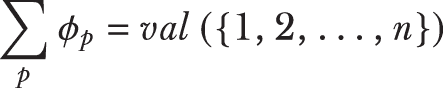

Shapley 值的这个属性，称为 *效率*，确保整体协作的价值正好分解并归因于协作中的每个团队成员。

另一个重要的属性是 *可加性*，它确保如果我们有两个值函数，使用联合值函数计算的整体 Shapley 值等于各个 Shapley 值的总和。这对于集成方法有一些重要的含义，因为它允许我们将各个基础估计器的 Shapley 值相加，以获得整个集成中的 Shapley 值。

那么，Shapley 值与可解释性有什么关系呢？类似于四个数据科学家朋友的情况，机器学习问题中的特征协同工作以做出预测。Shapley 值允许我们分配每个特征对整体预测的贡献程度。

Shapley 值作为特征重要性

假设我们想要解释黑盒模型 *ƒ* 在示例 *x* 上的预测。特征 *j* 的 Shapley 值计算如下：

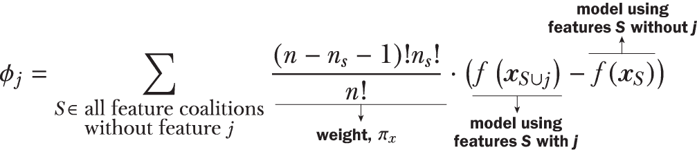

我们将黑盒模型作为特征/值函数。与之前一样，我们考虑了包含和不包含特征 *j* 的所有可能的联盟。

现在，我们可以计算所有特征的特征值。与之前一样，特征重要性估计的特征值计算是高效的，并将整体预测的一部分归因于每个特征：

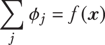

Shapley 值在理论上得到了很好的论证，并且具有一些非常吸引人的属性，使其成为特征重要性的稳健度量。直接在实践中使用此程序有一个显著的局限性：可扩展性。

Shapley 计算使用训练好的模型来评分特征重要性。实际上，它将需要为每个特征联盟使用一个训练好的模型。例如，对于之前提到的具有两个特征——年龄和 glc 的糖尿病诊断模型，我们将需要训练三个模型，每个联盟一个：*ƒ*[1]（年龄），*ƒ*[2]（glc），和*ƒ*[3]（年龄，glc）。

通常，如果我们有*d*个特征，我们将有 2^d 个总联盟，并且我们需要训练 2^d - 1 个模型（我们不训练空联盟的模型）。例如，银行营销数据集有 19 个特征，将需要训练 2¹⁹ - 1 = 524,287 个模型！这在实践中是荒谬的。

SHAP

面对这样的组合不可行性，我们能做什么？我们总是这样做：近似和采样。受 LIME 的启发，SHAP 方法旨在学习一个线性代理函数，其参数是每个特征的 Shapley 值。

类似于 LIME，给定一个黑盒模型*ƒ*b，SHAP 也使用与 LIME 形式相同的损失函数训练一个代理模型*ƒ*s。然而，与 LIME 不同的是，我们必须在损失函数中考虑联盟的概念：

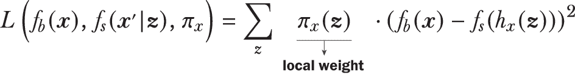

让我们通过观察它与 LIME（也见图 9.18）的相似之处和不同之处来理解这个损失函数和 SHAP。就像之前一样，假设我们感兴趣的是解释一个具有五个特征*x* = [*x*[1],*x*[2],*x*[3],*x*[4],*x*[5]]的示例上的黑盒模型的预测：

+   LIME 通过随机扰动原始示例 x 来创建代理示例 x'。SHAP 使用一个复杂的两步方法来创建代理示例：

    +   SHAP 生成一个随机联盟向量*z*，它是一个 0-1 向量，表示一个特征是否应该包含在联盟中。例如，*z* = [1,1,0,0,1]表示包含第一个、第二个和第五个特征的联盟。

    +   SHAP 通过使用映射函数*x*' = *h*x 从*z*创建一个代理示例。当*z*[j] = 1 时，我们设置*x*'[j]= *x*[j]，即从感兴趣的示例*x*中获取的原始特征值。当*z*[j] = 0 时，我们设置*x*'[j]= *x*[j]^(rand)，即从另一个随机选择的示例*x*^(rand)中获取的特征值。根据上述 z 的选择，我们的代理示例将是*x*' = [*x*[1],*x*[2],*x*[3]^(rand), *x*[4]^(rand),*x*[5]]。


图 9.18 SHAP 在需要解释预测的示例的局部创建了一个代理训练示例集。

因此，每个代理示例都是原始训练示例中我们想要解释的特征和另一个随机训练示例中特征的混合体。这个想法是，属于联盟的特征从感兴趣的示例中获取特征值，而不属于联盟的特征从数据集中的其他示例中获取随机的“现实特征值”。

+   LIME 使用 RBF/指数核根据代理示例 x' 与 x 的距离成反比地为其加权。SHAP 使用 Shapley 核为代理示例 x' 加权，这仅仅是 Shapley 计算中的权重，π*x* = ((*d* - *n*[*z*] - 1)! *n*[*z*]!)/*d*!)，其中 *d* 是特征总数，*n*[z] 是联盟大小（*z* 中 1 的数量）。直观地说，这个权重反映了具有相似数量零和非零特征的类似联盟的数量。

现在我们已经有一个在示例 *x* 附近的代理训练集，我们可以训练一个线性模型。一种名为 KernelSHAP 的 SHAP 版本使用线性回归进行训练。这个线性模型的权重将是每个特征的近似 Shapley 值。

SHAP 在实践中的应用

与 LIME 类似，SHAP 也作为 Python 两个最受欢迎的包管理器：pip 和 conda 中的包提供。请参阅 SHAP 的 GitHub 页面 ([`github.com/slundberg/shap`](https://github.com/slundberg/shap)) 以获取文档和许多示例，说明如何将其用于分类、回归以及文本、图像甚至基因组数据的应用。

在本节中，我们将使用一种名为 TreeSHAP 的 SHAP 版本，该版本专门设计用于树模型，包括单个决策树和集成。TreeSHAP 是 SHAP 的一个特殊变体，它利用决策树的独特结构来有效地计算 Shapley 值。

如前所述，Shapley 值有一个称为可加性的良好属性。对我们来说，这意味着如果我们有一个是树的可加组合的模型，即树集成（例如，bagging、随机森林、梯度提升和牛顿提升等），那么集成 Shapley 值就是单个树 Shapley 值的总和。

由于 TreeSHAP 可以有效地计算集成中每个单个树中每个特征的 Shapley 值，我们可以有效地得到整个集成的 Shapley 值。最后，与 LIME 不同，TreeSHAP 不需要我们提供代理数据集，因为树本身包含所有所需的信息（特征分割、叶值/预测、示例计数等）。

TreeSHAP 支持本书中讨论的许多集成方法，包括 XGBoost。以下列表展示了如何使用 XGBoost 模型计算和解释 Bank Marketing 数据集测试示例 3104 的 Shapley 值。

列表 9.10 使用 TreeSHAP 解释 XGBoost 预测

```
import shap

explainer = shap.TreeExplainer(xgb, feature_names=list(Xtrn.columns))    

shap_values = explainer(                                  ❶
                  Xtst.iloc[3104].values.reshape(1, -1))

shap.plots.waterfall(shap_values[0])                      ❷

shap.initjs()
shap.plots.force(shap_values[0])                          ❸
```

❶ 解释测试示例 3104 的预测

❷ 使用瀑布图可视化 Shapley 值

❸ 使用力图可视化 Shapley 值

此列表以两种方式可视化 Shapley 值：作为瀑布图（图 9.19）和作为力图（图 9.20）。请记住，SHAP 以预测概率（置信度）来解释分类器模型。对于分类器，x 轴的值将是 log-odds，其中 0.0 代表分类的平等概率（1:1），或 50% 预测概率作为一个正面例子。

图 9.19 中的瀑布图显示了每个特征对示例 3104 的整体预测的个体贡献。正如我们所见，每个特征的个体预测贡献加起来等于最终的预测值：0.518。这是 SHAP 解释加性特性的一个清晰的视觉说明。

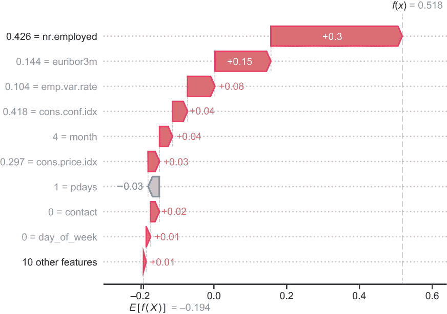

图 9.19 中的瀑布图用于可视化 Shapley 值。图中左侧的值显示测试示例 3104 的特征值，而条形中的文本显示它们的 Shapley 值。

图 9.20 中的力图允许更直观地查看特征如何对预测做出贡献。该图以预测（0.518）为中心，并可视化特征通过正或负解释推动预测的程度。

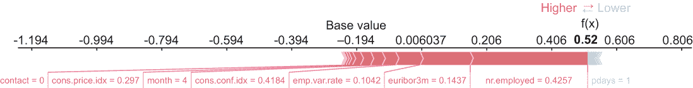

图 9.20 中的力图用于可视化 Shapley 值。指向右侧的特征将此示例（0.52）的预测推高，高于平均预测（-0.194）。指向左侧的特征将预测推低，并接近基值。贡献加起来等于整体预测，对于此示例，整体预测高于基值。解释示例的特征值以及力图下的特征一起显示。

注意：LIME 和 SHAP 都是 *加性* 本地可解释方法。这意味着它们可以以相当直接的方式扩展到全局可解释性：可以通过对与任务相关的数据集计算出的本地特征重要性进行平均，从任一方法中获得全局特征重要性。

LIME 和 SHAP 的一个缺点是它们仅设计用于计算和评估单个特征的重要性，而不是特征交互。SHAP 提供了一些支持，以类似于 PDPs 的方式可视化特征交互。

然而，与 PDPs 一样，SHAP 没有任何机制可以自动识别重要的交互特征组，并迫使我们可视化所有成对的特征，这可能会令人不知所措。例如，在 Bank Marketing 数据集中有 19 个特征，我们将有 171 对特征交互。

在现实世界的应用中，由于许多特征相互依赖，了解特征交互在决策中的作用也很重要。在下一节中，我们将了解一种这样的方法：可解释提升机。

## 9.5 玻璃盒集成：训练以实现可解释性

我们已经了解了模型无关的可解释性方法。这些方法可以接受已经训练好的模型（例如，由 XGBoost 等集成学习器训练）并尝试解释模型本身（全局）或其预测（局部）。

但我们是否可以训练一个可解释的集成从零开始？这种集成方法是否仍然可以表现良好并且是可解释的？这些问题是推动**可解释提升机**（EBMs）发展的动力，这是一种玻璃盒集成方法。EBMs 的一些关键亮点如下：

+   EBMs 可以用于全局可解释性和单个示例的局部可解释性！

+   EBMs 学习一个完全分解的模型；也就是说，模型组件只依赖于单个特征或特征对。这些组件直接提供可解释性，EBMs 不需要额外的计算（如 SHAP 或 LIME）来生成解释。

+   EBMs 是一种**广义加性模型**（GAM），是本章以及书中其他地方讨论的 GLMs 的非线性扩展。与 GLMs 类似，GAM 的每个组件只依赖于一个特征。

+   EBMs 也可以检测重要的**成对特征交互**。因此，EBMs 将 GAMs 扩展到包括两个特征的组件。

+   EBMs 使用一种**循环**的训练方法，其中通过重复遍历所有特征来训练大量基础估计器。这种方法也是可并行的，这使得 EBMs 成为一个高效的训练方法。

在接下来的两个部分中，我们将了解 EBMs 的概念工作方式，以及如何在实践中训练和使用它们。

### 9.5.1 可解释提升机

EBMs 有两个关键组件：它们是广义加性模型（GAMs），并且它们具有特征交互。这允许模型表示分解成更小的组件，从而实现更好的解释。

具有特征交互的 GAMs

我们熟悉 GLM 的概念，它使用链接函数 *g*(*y*) 将目标与特征上的线性模型相关联：

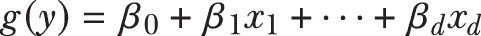

GLM 的每个组件 *β*[j]*x*[j] 只依赖于一个特征 *x*[j]。GAM 将这个非线性模型扩展到特征上：

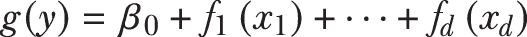

与 GLM 类似，GAM 的每个组件 *ƒ*(*x*[j]) 也只依赖于一个特征 *x*[j]。记住，GLMs 和 GAMs 都可以被视为集成，其中集成的每个组件只依赖于一个特征！这对训练有重要影响。

EBMs 进一步扩展 GAMs 以包括成对组件。然而，由于特征对的数量可能非常大，EBMs 只包括少量重要的特征对：

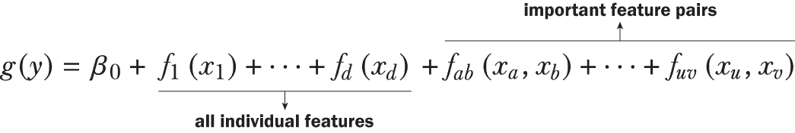

这也在图 9.21 中展示了，这是之前提到的糖尿病诊断问题，但增加了三个变量：年龄、血糖水平（glc）和体质指数（bmi）。这个例子中的 EBM 包含所有三个特征的单个组件，以及一个成对组件而不是所有三个组合。

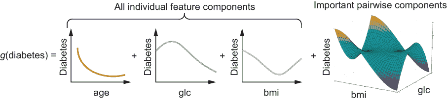

图 9.21 一个 EBM 是一个广义加性模型，由仅依赖于一个特征的非线性组件以及依赖于特征对的非线性组件组成。这个例子展示了依赖于三个变量（年龄、glc 和 bmi）的糖尿病诊断 EBM。尽管有三个变量对（年龄-glc、glc-bmi、年龄-bmi），但这个 EBM 只包括它认为有意义的其中一个。可解释的增强模型也是一个集成。

由于每个组件仅是单个或两个变量的函数，一旦学习，我们就可以立即可视化每个变量（或变量对）与目标之间的依赖关系。此外，EBM 避免了包含所有成对组件，并且只选择最有效的组件。这避免了模型膨胀并提高了可解释性。通过仔细选择 EBM 的结构，我们可以训练一个可解释的集成，这使得它成为一个玻璃盒方法。

但模型性能如何？是否可以有效地训练一个 EBM，使其与现有的集成方法一样表现良好？

训练 EBMs

与 GLMs 和 GAMs 一样，EBM 也是基于单个特征以及特征对的基组件的集成。这很重要，因为它允许我们通过简单修改我们最喜欢的集成学习器：梯度提升法来顺序训练 EBM。EBM 也使用两阶段程序进行类似训练：

+   在第一阶段，EBM 为每个特征 *ƒ*j 配置组件。这是通过在数千次迭代中循环和顺序训练过程来完成的，每次只处理一个特征。在迭代 *t* 中，对于特征 *j*，我们使用梯度提升法拟合一个非常浅的树 tj。一旦我们循环遍历了迭代中所有特征，我们就进入下一个迭代。这个过程在图 9.22 中得到了说明。

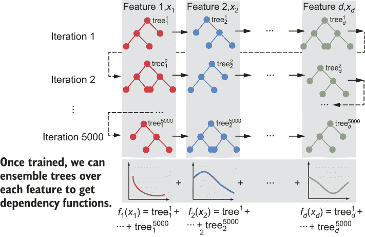

图 9.22 展示了 EBM 训练过程的第一阶段，其中每个特征的模型都是顺序和循环训练的，每个迭代中每个特征一个模型。训练的树很浅，学习率非常低。然而，在非常大量的迭代中，可以为每个特征学习到一个足够复杂的非线性模型。对于 EBM 训练的第二阶段，也遵循了类似的程序，其中对特征对的交互模型进行训练。

+   部分训练好的 EBM *g*(*y*) = *ƒ*1 + ⋅⋅⋅ + *ƒ*d 现在已被冻结，并用于评估和评分所有可能的特征对 (*x*[i],*x*[j])。这使得 EBM 能够确定数据中至关重要的特征交互对 (*x*[a],*x*[b]) ⋅⋅⋅ (*x*[u],*x*[v])。选择了一小部分相关的特征对。

+   在第二阶段，EBM 以与第一阶段相同的方式为每个特征对 *ƒ*jk 拟合浅层树树^t[jk]。这产生了一个完全训练好的 EBM：*g*(*y*) = *ƒ*1 + ⋅⋅⋅ + *ƒ*d + *ƒ*ab + ⋅⋅⋅ + *ƒ*uv。

从图 9.22 中，我们可以看到每个单独的组件 *ƒ*j 实际上是由成千上万的浅层树组成的集合：

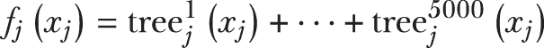

类似地，每个特征交互组件也是一个集合：

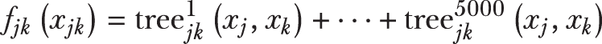

那么，这个 EBM 究竟是如何成为一个透明的“玻璃箱”的呢？有三种方式：

+   *局部可解释性*——对于一个分类问题，给定一个特定的例子，如果我们想解释 x，我们可以从 EBM 中获取预测的对数几率作为 *ƒ*1 + ⋅⋅⋅ + *ƒ*d + *ƒ*ab + ⋅⋅⋅ + *ƒ*uv。由于 EBM 已经是一个完全分解和加性模型，我们可以简单地获取每个特征 *ƒ*j 或特征对 *ƒ*jk 的贡献。对于回归，我们可以以类似的方式获取对整体回归值的贡献。在这两种情况下，都没有像 LIME 或 SHAP 这样的额外程序，也不需要使用线性模型进行近似！

+   *全局可解释性*——由于我们有每个组件 *ƒ*j 或 *ƒ*jk，我们还可以在 *x*[j] 和/或 *x*[k] 的特征范围内绘制它们。这将产生一个 *依赖图*，显示所有可能的值下 *x*[j] 和/或 *x*[k] 的特征。这告诉我们模型的整体行为。

+   *特征交互*——与 SHAP 或 LIME 不同，该模型也通过设计内在地识别关键特征交互。这提供了对模型行为的额外见解，并有助于更好地解释预测。

### 9.5.2 实践中的 EBMs

EBMs 作为 InterpretML 包的一部分可用。除了 EBMs，InterpretML 包还提供了 LIME 和 SHAP 的包装器，使我们能够在同一个框架中使用它们。InterpretML 还包括一些用于可视化的良好功能。然而，在本节中，我们只将探索如何使用 InterpretML 训练、可视化和解释 EBMs。

注意：InterpretML 可以通过 pip 和 Anaconda 安装。该包的文档页面 ([`interpret.ml/`](https://interpret.ml/)) 包含有关如何使用各种透明和黑盒模型的额外信息。

列表 9.11 展示了如何在 Bank Marketing 数据集上训练 EBM。与第 9.2 节中训练的随机森林和 XGBoost 模型一样，我们必须考虑数据中的类别不平衡。我们在训练过程中通过将正面示例加权重 5.0 和负面示例加权重 1.0 来实现这一点。此列表还创建了两个可视化：一个用于局部可解释性（测试示例 3104）和另一个用于全局可解释性（使用特征重要性和依赖图）。

列表 9.11 使用 InterpretML 训练和可视化 EBM

```
from interpret.glassbox import ExplainableBoostingClassifier

wts = np.full_like(ytrn, fill_value=1.0)     
wts[ytrn > 0] = 5.0                                                     ❶

feature_names = list(Xtrn.columns)
feature_types = np.full_like(feature_names, fill_value='continuous')
cat_features = ['default', 'housing', 'loan', 'contact', 'poutcome', 
                'job', 'marital', 'education', 'month', 'day_of_week']
feature_types = ['categorical' if f in cat_features else 'continuous' 
                 for f in feature_names]                                ❷

ebm = ExplainableBoostingClassifier(feature_names=feature_names, 
                                    feature_types=feature_types)
ebm.fit(Xtrn, ytrn, sample_weight=wts)                                  ❸

from interpret import set_visualize_provider                            ❹
from interpret.provider import InlineProvider
set_visualize_provider(InlineProvider())

from interpret import show                                              ❺
x = Xtst.iloc[3104, :].values.reshape(1, -1)
y = ytst[3104].astype(float).reshape((1, 1))

local_explainer = ebm.explain_local(x, y)                               ❻
show(local_explainer)

ebm_global = ebm.explain_global()                                       ❼
show(ebm_global)
```

❶ 以 1:5 的比例加权重以考虑类别不平衡

❷ 为 EBM 识别特征类型：分类、连续

❸ 使用这些权重初始化和训练 EBM

❹ 初始化 InterpretML 可视化器

❺ 测试示例 3104 解释

❻ 测试示例 3104 的局部解释

❼ 全局解释（特征重要性和依赖图）

ExplainableBoostingClassifier 默认训练 5,000 轮，支持提前停止。ExplainableBoostingClassifier 还限制成对交互的数量为 10（默认情况下，尽管这可以由用户设置）。由于此数据集有 19 个特征，总共有 171 个成对交互，模型将选择前 10 个。

训练好的 EBM 模型整体准确率为 86.69%，平衡准确率为 74.59%。第 9.2 节中训练的 XGBoost 模型整体准确率为 87.24%，平衡准确率为 74.67%。EBM 模型与 XGBoost 模型相当！关键区别在于 XGBoost 模型是一个黑盒，而 EBM 是一个玻璃盒。

那么，我们能从这个玻璃盒中得到什么？图 9.23 展示了测试示例 3104 的局部解释。局部解释显示了模型中每个特征及其特征交互对对整体正面或负面预测的贡献程度。

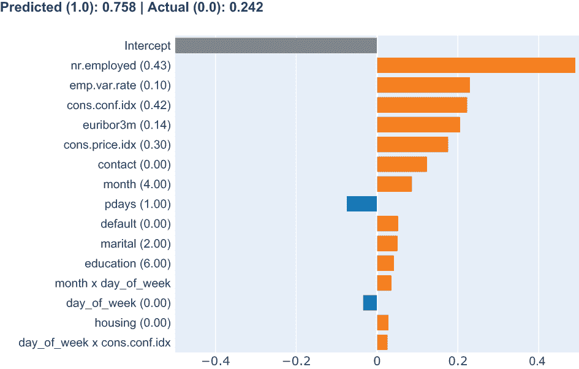

图 9.23 展示了测试示例 3104 的局部可解释性，包括单个特征（例如，euribor3m 和 poutcome）和成对特征（例如，月份×星期几）。每个 EBM 组件的值及其对整体预测的贡献（Sub? = YES）显示出来。

测试示例 3104 是一个正面示例（即 Sub?=YES，表示客户确实订阅了定期存款账户）。EBM 模型已正确分类此示例，置信度（预测概率）为 66.1%。

训练好的 EBM 模型使用了一些特征，例如 nr.employed，这些特征我们知道是重要的，与其他方法类似。这个训练好的 EBM 还使用了三个成对特征来预测 3104：月份 x 星期几，星期几 x cons.conf.idx，default x 月份。最高的成对特征交互是月份 x 星期几，它对整体预测贡献了正值。这与 LIME 和 SHAP 对 XGBoost 黑盒的解释形成对比，因为它们只能识别月份，因为它们不支持显式地处理特征交互。EBM 模型能够学习使用更细粒度的特征，并解释其重要性！这里的启示是，EBM 模型明确地构建了包含特征交互并解释它们的结构。

EBMs 还可以在特征重要性方面提供全局可解释性。整体重要性是通过在整个训练集上平均（绝对值）个体特征重要性来获得的。

整个模型包含 30 个组件：19 个个体特征组件，10 个成对特征组件，以及 1 个截距。图 9.24 显示了前 15 个特征和成对特征的重要性。这些结果与使用其他方法（如 SHAP 和 LIME）计算出的先前特征重要性度量总体上是一致的。

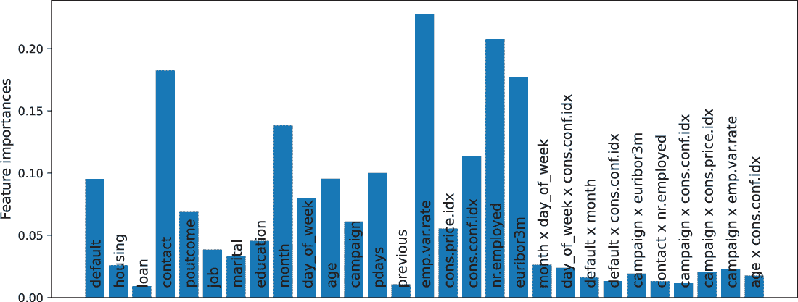

图 9.24 展示了训练好的 EBM 模型的全局可解释性，显示了特征重要性分数

最后，我们还可以直接从 EBM（如前文图 9.22 所述）获得依赖图。图 9.25 显示了年龄的依赖图以及它如何影响某人是否会订阅定期存款账户。

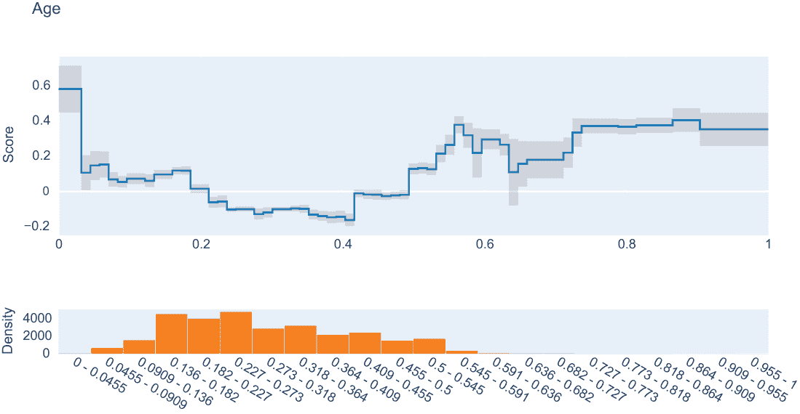

图 9.25 展示了年龄的依赖图。预处理期间，代表年龄的 x 轴区间被缩放到 0-1 的范围。原始年龄在 17-98 岁之间。对于 0.2-0.4 范围内的分数是负值，这对应于 33-49 岁。这表明，如果没有其他信息，这个年龄范围内的人通常不太可能订阅定期存款账户。

## 摘要

+   黑盒模型由于其复杂性，通常难以理解。这类模型的预测需要专门的工具才能解释。

+   白盒模型更直观，更容易理解。这类模型的结构使它们本质上具有可解释性。

+   大多数集成方法通常是黑盒方法。

+   全局方法试图一般性地解释模型的整体决策过程和广泛相关的因素。

+   局部方法试图具体解释模型针对单个示例和预测的决策过程。

+   特征重要性是一种可解释性方法，它根据特征对目标变量正确预测的贡献来分配分数。

+   决策树是常用的玻璃盒模型，可以用一组决策规则表示，这些规则对人类来说很容易理解。

+   决策树的可解释性取决于它们的复杂性（深度和叶节点数）。更复杂的树更不直观，更难理解。

+   广义线性模型（GLMs）是另一种常用的玻璃盒模型。它们的特征权重可以解释为特征重要性，因为它们决定了每个特征对整体决策的贡献程度。

+   重新排列特征重要性是一种用于全局可解释性的黑盒方法。它试图估计在重新排列/重新排列特征之前和之后，模型的预测性能如何变化。

+   局部依赖性图（PDPs）是另一种用于全局可解释性的黑盒方法。局部依赖性是通过边缘化或求和其他变量来确定的。

+   代理模型通常用于模拟或近似黑盒模型的行为。代理模型是玻璃盒，本质上可解释。

+   全局代理模型，如决策树，训练模型以优化保真度-可解释性权衡。

+   局部可解释模型无关解释（LIME）是一种局部代理模型，在我们要解释的示例的邻域内训练一个线性模型。

+   LIME 还优化了保真度-可解释性权衡，并通过通过扰动要解释的示例的局部邻域中的特征来生成的代理训练集来实现这一点。

+   Shapley 值允许我们通过考虑所有可能的特征组合中的贡献来分配单个特征的总体贡献（特征重要性）。

+   对于具有许多特征和示例的真实世界数据集，Shapley 值直接计算是不可行的。

+   SHapley Additive exPlanations (SHAP)是一种局部代理模型，它训练一个局部线性模型来近似 Shapley 值。

+   对于基于树的模型，使用特别设计的变体 TreeSHAP 来有效地计算 Shapley 值。

+   Shapley 值和 SHAP 都具有可加性属性，这允许我们在集成单个模型时聚合 Shapley 值。

+   LIME 和 SHAP 的一个缺点是它们本质上只设计用来计算和评估单个特征的相对重要性，而不是特征之间的相互作用。

+   可解释的增强机器（EBM）是一种玻璃盒模型，可用于全局可解释性和单个示例的局部可解释性。

+   EBMs 学习一个完全分解的模型；也就是说，模型组件只依赖于单个特征或特征对。这些组件直接提供可解释性，EBMs 不需要额外的计算（如 SHAP 或 LIME）来生成解释。

+   EBMs 是一种广义加性模型（GAM），是 GLM 的非线性扩展。

+   EBMs 还可以检测重要的成对特征交互。因此，EBMs 将 GAMs 扩展到包括两个特征的组件。

+   EBMs 使用循环训练方法，通过重复遍历所有特征来训练大量的基础估计器。这种方法也是可并行的，这使得使用 EBMs 成为一个高效的训练方法。

* * *

(1.) S. Moro, P. Cortez 和 P. Rita, “基于数据驱动预测银行电话营销成功的方法,” *决策支持系统*, 第 62 卷，第 22-31 页，2014 年 6 月。
